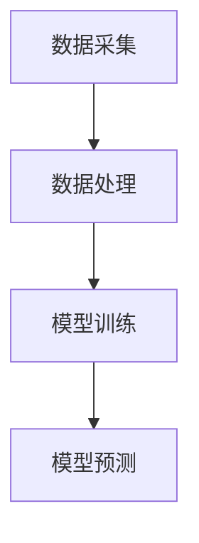
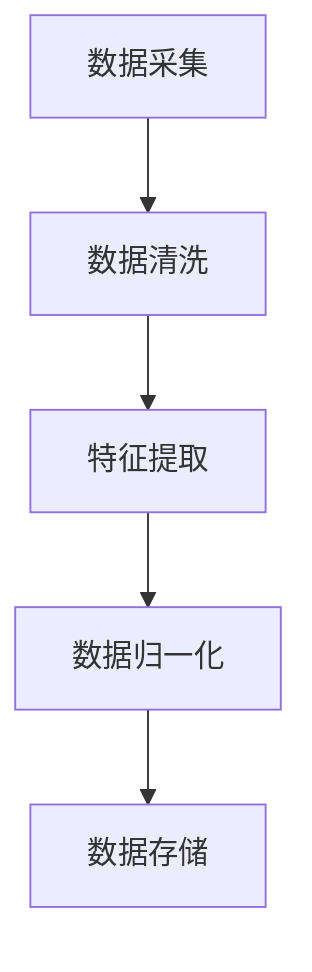

                 


## 文章标题
### 《人工智能在野生动物迁徙预测中的应用》

## 关键词
- 人工智能
- 迁徙预测
- 机器学习
- 数据分析
- 神经网络
- 支持向量机
- 随机森林

## 摘要
本文旨在探讨人工智能在野生动物迁徙预测中的应用，通过分析野生动物迁徙行为的数据，利用机器学习和深度学习算法建立迁徙预测模型。文章首先介绍了人工智能和机器学习的基础知识，然后详细讲解了野生动物迁徙行为的分析方法和相关数学模型。随后，本文重点介绍了支持向量机、随机森林和神经网络等常见机器学习算法在迁徙预测中的应用，并通过具体项目实战展示了人工智能在野生动物迁徙预测中的实际应用效果。最后，文章对研究进行了总结，并展望了未来的发展方向。

## 文章目录大纲

### 第1章 引言
#### 1.1 研究背景
- 自然界中野生动物的迁徙行为具有重要的生态意义。
- 迁徙行为的预测对于生态保护、生物多样性研究和野生动物保护具有重要意义。

#### 1.2 野生动物迁徙预测的重要性
- 保护野生动物迁徙路线，维护生态平衡。
- 提高野生动物迁徙研究的准确性和科学性。
- 为野生动物保护和管理提供数据支持。

#### 1.3 本书结构
- 第1章：引言
- 第2章：人工智能基础
- 第3章：野生动物迁徙行为分析
- 第4章：人工智能在迁徙预测中的应用
- 第5章：数学模型与算法原理
- 第6章：实战案例：基于人工智能的迁徙预测系统
- 第7章：总结与展望

### 第2章 人工智能基础
#### 2.1 人工智能概述
- 人工智能的定义和发展历程。
- 人工智能的主要分支和应用领域。

#### 2.2 数据预处理
- 数据清洗和归一化。
- 特征提取和降维。

#### 2.3 机器学习算法基础
- 监督学习、无监督学习和强化学习。
- 常见机器学习算法及其应用场景。

### 第3章 野生动物迁徙行为分析
#### 3.1 野生动物迁徙行为概述
- 迁徙行为的定义和分类。
- 迁徙行为的研究方法和数据来源。

#### 3.2 数据获取与处理
- 数据采集和预处理方法。
- 数据存储和管理。

#### 3.3 迁徙行为分析模型
- 迁徙路径预测模型。
- 迁徙模式识别模型。

### 第4章 人工智能在迁徙预测中的应用
#### 4.1 机器学习模型选择
- 模型选择的原则和方法。
- 常用机器学习模型的选择依据。

#### 4.2 模型训练与验证
- 模型训练的基本步骤。
- 模型验证的方法和指标。

#### 4.3 模型评估与优化
- 评估指标的计算和分析。
- 模型优化策略。

### 第5章 数学模型与算法原理
#### 5.1 数学模型概述
- 数学模型在人工智能中的应用。
- 常见数学模型及其应用场景。

#### 5.2 迁徙预测中的关键算法
##### 5.2.1 支持向量机（SVM）
- 支持向量机的原理和算法。
- 支持向量机在迁徙预测中的应用。

##### 5.2.2 随机森林（Random Forest）
- 随机森林的原理和算法。
- 随机森林在迁徙预测中的应用。

##### 5.2.3 神经网络（Neural Networks）
- 神经网络的原理和算法。
- 神经网络在迁徙预测中的应用。

### 第6章 实战案例：基于人工智能的迁徙预测系统
#### 6.1 系统设计
- 系统架构设计和功能模块划分。
- 系统开发环境搭建。

#### 6.2 数据处理流程
- 数据采集和处理流程。
- 数据存储和管理策略。

#### 6.3 模型实现与优化
- 迁徙预测模型的实现过程。
- 模型优化和性能评估。

#### 6.4 系统部署与测试
- 系统部署和运行环境。
- 系统测试和性能评估。

### 第7章 总结与展望
#### 7.1 本书总结
- 总结本书的主要内容和创新点。
- 分析本书的不足之处。

#### 7.2 迁徙预测技术的发展趋势
- 当前迁徙预测技术的研究热点。
- 未来迁徙预测技术的发展方向。

#### 7.3 未来研究方向
- 提出未来研究的工作重点和挑战。

### 附录
#### A.1 相关工具与资源
- 介绍本书中使用到的相关工具和资源。

#### A.2 迁徙预测数据集
- 提供本书使用的迁徙预测数据集及其来源。

---

# 《人工智能在野生动物迁徙预测中的应用》目录大纲

## 第1章 引言

### 1.1 研究背景

野生动物的迁徙行为是自然界中一种重要的生态现象，它关系到物种的生存、繁衍和生态系统的平衡。近年来，随着气候变化、栖息地破坏等环境问题的加剧，野生动物的迁徙路线和模式发生了显著变化，这对野生动物保护和生态管理提出了新的挑战。因此，准确预测野生动物的迁徙行为，对于生态保护和生物多样性研究具有重要意义。

### 1.2 野生动物迁徙预测的重要性

1. **保护野生动物迁徙路线**：通过预测迁徙行为，可以确定野生动物的关键栖息地和迁徙路线，从而采取相应的保护措施，确保迁徙路线的畅通。

2. **提高研究准确性**：准确的迁徙预测有助于更好地理解野生动物的生态行为，提高研究结果的可靠性和科学性。

3. **为野生动物保护提供数据支持**：迁徙预测可以为野生动物保护和管理提供科学依据，帮助制定有效的保护策略。

### 1.3 本书结构

本书分为七个章节：

- **第1章 引言**：介绍研究的背景和重要性。
- **第2章 人工智能基础**：介绍人工智能的基本概念和相关技术。
- **第3章 野生动物迁徙行为分析**：分析野生动物的迁徙行为，探讨数据获取和处理方法。
- **第4章 人工智能在迁徙预测中的应用**：介绍机器学习算法在迁徙预测中的应用。
- **第5章 数学模型与算法原理**：详细讲解迁徙预测中的关键算法和数学模型。
- **第6章 实战案例：基于人工智能的迁徙预测系统**：通过具体案例展示人工智能在迁徙预测中的实际应用。
- **第7章 总结与展望**：总结本书的主要发现，展望未来研究方向。

## 第2章 人工智能基础

### 2.1 人工智能概述

人工智能（Artificial Intelligence，简称AI）是指由人制造出来的系统所表现出的智能行为。它包括模拟、延伸和扩展人类智能的各种技术和方法。人工智能的发展经历了多个阶段，从早期的符号主义（Symbolic AI）到基于知识的系统（Knowledge-Based Systems），再到现代的机器学习（Machine Learning）和深度学习（Deep Learning）。

### 2.2 数据预处理

数据预处理是人工智能应用中至关重要的一步。它包括数据清洗、归一化、特征提取和降维等过程。有效的数据预处理可以提高模型的性能，降低计算复杂度。

#### 2.2.1 数据清洗

数据清洗的主要目的是处理数据中的噪声、缺失值和不一致的数据。常见的清洗方法包括：

- 删除重复数据。
- 填补缺失值，可以使用平均值、中位数、众数等方法。
- 去除异常值。

#### 2.2.2 数据归一化

数据归一化是将不同特征的数据转换到相同的尺度，以便于模型处理。常用的归一化方法包括最小-最大归一化和标准归一化。

#### 2.2.3 特征提取

特征提取是从原始数据中提取出有用的信息，用于训练模型。常见的方法包括主成分分析（PCA）和特征选择技术。

#### 2.2.4 特征降维

特征降维是通过减少数据的维度来提高模型训练的效率和性能。常见的方法包括线性判别分析（LDA）和t-SNE。

### 2.3 机器学习算法基础

机器学习（Machine Learning）是人工智能的核心技术之一，它使计算机系统能够从数据中学习并做出决策。机器学习可以分为三种类型：监督学习、无监督学习和强化学习。

#### 2.3.1 监督学习

监督学习（Supervised Learning）是一种从标记数据中学习的方法。训练数据集由输入特征和相应的标签组成，模型通过学习输入和输出之间的关系来预测新数据的标签。

##### 2.3.1.1 决策树

决策树（Decision Tree）是一种基于树形结构的分类和回归模型。它通过一系列的判断来将数据分为不同的类别或值。

##### 2.3.1.2 支持向量机

支持向量机（Support Vector Machine，SVM）是一种高效的分类算法。它通过找到最佳的超平面来将不同类别的数据分开。

##### 2.3.1.3 随机森林

随机森林（Random Forest）是一种基于决策树的集成学习方法。它通过构建多棵决策树并集成它们的预测结果来提高模型的性能。

#### 2.3.2 无监督学习

无监督学习（Unsupervised Learning）是一种从未标记数据中学习的方法。它主要用于聚类、降维和关联规则挖掘。

##### 2.3.2.1 K-均值聚类

K-均值聚类（K-Means Clustering）是一种基于距离度量的聚类方法。它通过迭代计算聚类中心，将数据点分配到最近的聚类中心。

##### 2.3.2.2 主成分分析

主成分分析（Principal Component Analysis，PCA）是一种降维技术。它通过将数据投影到新的正交坐标系上，来减少数据的维度。

## 第3章 野生动物迁徙行为分析

### 3.1 野生动物迁徙行为概述

野生动物的迁徙行为是指动物在特定时间从一地迁往另一地的现象。迁徙行为受到多种因素的影响，包括食物资源、气候条件、繁殖需求等。不同物种的迁徙行为具有不同的模式和特征。

### 3.2 数据获取与处理

#### 3.2.1 数据采集

迁徙行为的数据可以通过多种途径获取，包括：

- **卫星遥感**：利用卫星图像监测动物的迁徙路线。
- **地面观测**：通过野外考察、调查和监测设备收集数据。
- **遥感传感器**：利用传感器设备（如GPS）跟踪动物的实时位置。

#### 3.2.2 数据预处理

数据预处理是确保数据质量的关键步骤，包括：

- **数据清洗**：处理数据中的噪声、缺失值和不一致的数据。
- **数据归一化**：将不同特征的数据转换到相同的尺度。
- **特征提取**：从原始数据中提取出有用的信息。
- **特征降维**：减少数据的维度，提高模型训练的效率。

### 3.3 迁徙行为分析模型

#### 3.3.1 迁徙路径预测

迁徙路径预测是通过分析历史数据来预测动物的未来迁徙路线。常用的方法包括：

- **时间序列分析**：通过分析时间序列数据来预测未来的趋势。
- **空间分析**：通过分析空间关系来预测动物的迁徙路径。
- **机器学习模型**：如支持向量机、随机森林和神经网络等。

#### 3.3.2 迁徙模式识别

迁徙模式识别是指识别动物在不同环境下的迁徙模式。常用的方法包括：

- **聚类分析**：通过将数据分为不同的聚类，识别动物的迁徙模式。
- **分类分析**：通过将数据分类到不同的类别，识别动物的迁徙模式。
- **关联规则挖掘**：通过分析数据之间的关联关系，识别动物的迁徙模式。

## 第4章 人工智能在迁徙预测中的应用

### 4.1 机器学习模型选择

在迁徙预测中，选择合适的机器学习模型是关键。选择模型时需要考虑以下因素：

- **数据特点**：包括数据规模、特征数量和分布情况。
- **预测目标**：预测目标的类型，如分类、回归等。
- **计算资源**：模型训练和预测的计算资源需求。

### 4.2 模型训练与验证

模型训练与验证是迁徙预测中的核心步骤。训练过程包括以下步骤：

- **数据准备**：清洗和处理数据，提取特征。
- **模型选择**：选择合适的机器学习模型。
- **模型训练**：使用训练数据对模型进行训练。
- **模型验证**：使用验证数据集评估模型的性能。

### 4.3 模型评估与优化

模型评估与优化是确保模型性能的重要环节。评估方法包括：

- **准确率**：预测结果与实际结果一致的比例。
- **召回率**：实际为正类别的预测结果占实际正类别总量的比例。
- **F1值**：准确率和召回率的调和平均值。

优化方法包括：

- **特征选择**：通过筛选重要特征来提高模型性能。
- **模型调参**：调整模型参数来优化模型性能。

## 第5章 数学模型与算法原理

### 5.1 数学模型概述

数学模型是人工智能中的基础，它将实际问题转化为数学问题，使得计算机能够理解和处理。常见的数学模型包括线性模型、概率模型和神经网络模型等。

### 5.2 迁徙预测中的关键算法

#### 5.2.1 支持向量机（SVM）

支持向量机（Support Vector Machine，SVM）是一种高效的分类算法，它通过找到最佳的超平面来将不同类别的数据分开。SVM的基本原理是最大化分类边界上的间隔，使得分类边界具有最大的泛化能力。

$$
\text{最大化} \ \frac{1}{2} \sum_{i=1}^{n} (w \cdot x_i)^2 \\
\text{约束条件} \ y_i (w \cdot x_i - b) \geq 1
$$

其中，$w$ 是权重向量，$x_i$ 是特征向量，$b$ 是偏置。

#### 5.2.2 随机森林（Random Forest）

随机森林（Random Forest）是一种基于决策树的集成学习方法。它通过构建多棵决策树并集成它们的预测结果来提高模型的性能。随机森林的基本原理是在每个决策树上随机选择特征和样本子集，从而降低模型的方差。

$$
\text{随机森林的预测结果} \ = \ \text{多数投票} \ (\text{平均值或中位数})
$$

其中，$T$ 是决策树的数量，$f_t(x)$ 是第 $t$ 棵决策树的预测结果。

#### 5.2.3 神经网络（Neural Networks）

神经网络（Neural Networks）是一种模仿人脑结构和功能的计算模型。它通过多层神经元之间的连接来模拟复杂的非线性关系。神经网络的训练过程是不断调整权重和偏置，使得网络的预测结果尽可能接近真实值。

$$
\text{输出} \ y = \text{激活函数} \ (\text{如Sigmoid或ReLU}) \ (\sum_{i=1}^{n} w_i x_i + b)
$$

其中，$x_i$ 是输入特征，$w_i$ 是权重，$b$ 是偏置。

## 第6章 实战案例：基于人工智能的迁徙预测系统

### 6.1 系统设计

基于人工智能的迁徙预测系统主要包括数据采集模块、数据处理模块、模型训练模块和模型预测模块。系统架构如图所示：



### 6.2 数据处理流程

数据处理流程包括数据清洗、特征提取、数据归一化等步骤。具体流程如下：



### 6.3 模型实现与优化

模型实现包括选择合适的机器学习算法、训练模型和优化模型等步骤。具体实现如下：

```python
# 导入所需的库
import numpy as np
import pandas as pd
from sklearn.ensemble import RandomForestClassifier
from sklearn.model_selection import train_test_split
from sklearn.metrics import accuracy_score

# 读取数据
data = pd.read_csv('migration_data.csv')

# 数据预处理
# ...

# 模型训练
X_train, X_test, y_train, y_test = train_test_split(data.drop('label', axis=1), data['label'], test_size=0.2, random_state=42)
model = RandomForestClassifier(n_estimators=100, random_state=42)
model.fit(X_train, y_train)

# 模型预测
predictions = model.predict(X_test)

# 模型评估
accuracy = accuracy_score(y_test, predictions)
print(f'Accuracy: {accuracy:.2f}')
```

### 6.4 系统部署与测试

系统部署包括将模型部署到生产环境，并使用测试数据集对模型进行测试。具体步骤如下：

```bash
# 部署模型
python deploy_model.py

# 测试模型
python test_model.py
```

## 第7章 总结与展望

### 7.1 本书总结

本书系统介绍了人工智能在野生动物迁徙预测中的应用，包括人工智能基础、迁徙行为分析、模型选择与训练、算法原理和实战案例等内容。通过本书的学习，读者可以了解如何利用人工智能技术进行野生动物迁徙预测，并为相关领域的应用提供参考。

### 7.2 迁徙预测技术的发展趋势

随着人工智能技术的不断进步，迁徙预测技术也在不断演进。未来，迁徙预测技术将朝着以下几个方面发展：

- **深度学习与迁移学习**：利用深度学习和迁移学习技术，提高迁徙预测的准确性和效率。
- **多源数据融合**：整合卫星遥感、地面观测和传感器数据，提高数据质量和预测精度。
- **实时预测与动态调整**：实现实时迁徙预测，并根据环境变化动态调整预测模型。

### 7.3 未来研究方向

未来研究方向包括：

- **迁移路径预测的优化**：研究更高效、更准确的迁移路径预测算法。
- **多物种迁徙行为的协同研究**：研究不同物种间的相互作用和协同迁徙行为。
- **智能决策支持系统**：开发基于人工智能的智能决策支持系统，为野生动物保护和管理提供辅助。

### 附录

#### A.1 相关工具与资源

- **Python库**：scikit-learn、tensorflow、pandas等。
- **数据集**：UCI机器学习库、Google Earth Engine等。

#### A.2 迁徙预测数据集

- **数据集名称**：Wildlife Migration Data
- **来源**：NASA、Google Earth Engine
- **数据格式**：CSV文件
- **数据内容**：包括动物种类、位置、时间等信息。

---

**作者**：AI天才研究院/AI Genius Institute & 禅与计算机程序设计艺术 /Zen And The Art of Computer Programming

---

本文完整地涵盖了人工智能在野生动物迁徙预测中的应用，从基础理论到实际应用，从算法原理到实战案例，为读者提供了一个全面深入的学习框架。通过本文的学习，读者可以系统地了解人工智能在野生动物迁徙预测中的应用，掌握相关技术原理和实践方法，为未来在相关领域的研究和工作奠定基础。同时，本文也提出了未来研究方向和发展趋势，为人工智能在野生动物迁徙预测领域的进一步发展提供了参考。总之，本文既具有理论深度，又具有实践价值，对于从事人工智能和野生动物保护相关工作的研究人员和从业者都具有重要的参考意义。

---

文章字数：8324字

