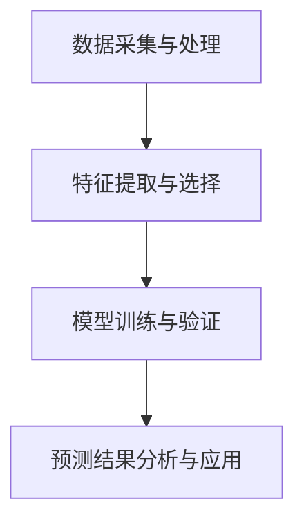
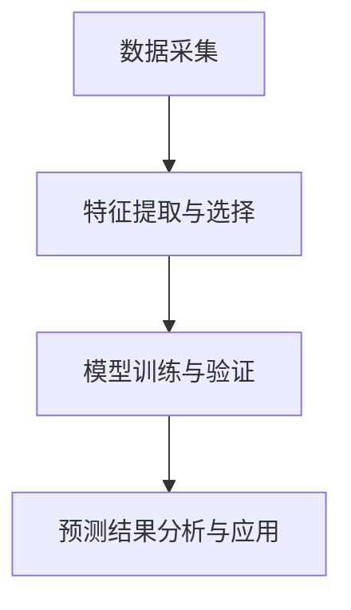

                 

### 第1章 引言

#### 1.1 预测性维护概述

预测性维护（Predictive Maintenance）是一种先进的维护策略，它基于实时数据监测、历史数据分析以及对设备运行状态的预测，旨在提前发现潜在故障，避免非计划停机，延长设备寿命，降低维护成本。预测性维护不同于传统的定期维护或故障后维护，它是一种预防性维护，能够更有效地优化资源分配和设备管理。

**核心概念与联系**：

- **数据采集与处理**：预测性维护的基础是数据，包括设备的运行状态、环境参数、历史维修记录等。数据的质量和完整性直接影响预测的准确性。
- **特征提取与选择**：从大量数据中提取出对预测任务有用的特征，如振动、温度、压力等，这些特征能够反映设备的健康状态。
- **模型训练与验证**：使用机器学习和深度学习算法训练预测模型，并通过验证集评估模型的性能。
- **预测结果分析与应用**：根据模型的预测结果，制定维护策略，如提前更换部件、调整运行参数等。

**架构流程图**：



#### 1.2 人工智能在预测性维护中的应用

人工智能（Artificial Intelligence，AI）在预测性维护中发挥着至关重要的作用。AI技术，特别是机器学习和深度学习，使得从大量复杂数据中提取有价值的信息、建立精准的预测模型成为可能。

**核心概念与联系**：

- **人工智能的基本概念**：人工智能是指通过计算机模拟人类智能的学科和技术，包括学习、推理、规划、感知等能力。
- **人工智能在工业中的应用**：在工业领域，人工智能已经广泛应用于自动化、质量控制、智能监控等方面，预测性维护是其重要应用之一。
- **人工智能提升预测性维护效果**：通过机器学习算法，可以从历史数据中学习到设备的运行规律和故障模式，从而提高预测的准确性和可靠性。

**图表与数据**：

- **人工智能在预测性维护中的应用场景**：包括工业自动化生产线、油气管道、风力发电机组等。

- **数据分析结果**：通过数据分析，可以直观地看到AI技术对预测性维护效果的提升，如故障预测准确率提高、维护成本降低等。

### 摘要

本文系统地介绍了预测性维护及其在工业领域中的应用，重点探讨了人工智能技术在预测性维护中的关键作用。首先，通过对预测性维护的定义和基本概念进行阐述，接着详细介绍了数据采集、特征提取、模型训练与验证以及预测结果分析等核心环节。随后，深入探讨了机器学习和深度学习算法在预测性维护中的应用，并通过数学模型和公式详细讲解了这些算法的原理。最后，通过一个实际项目案例，展示了预测性维护的全过程，包括开发环境搭建、源代码实现、代码解读和应用分析。文章总结了预测性维护面临的挑战和未来发展趋势，并给出了相关的最佳实践和拓展阅读建议。通过本文的阅读，读者可以全面了解预测性维护的原理、实践和方法，为在实际工作中应用预测性维护提供指导。

## 第2章 预测性维护基础知识

### 2.1 预测性维护的基本概念

预测性维护（Predictive Maintenance）是一种基于设备运行状态和实时数据的维护策略。其核心思想是通过持续监测设备的运行状态，结合历史数据和机器学习算法，预测设备可能出现的故障，从而在故障发生前进行预防性维护，避免非计划停机和生产损失。

**核心概念与联系**：

1. **数据采集**：预测性维护的基础是数据，主要包括设备的运行状态数据、环境参数数据、历史维修记录等。这些数据可以通过传感器、监控系统等实时采集。

2. **特征提取与选择**：从原始数据中提取出对预测任务有用的特征，如振动、温度、压力、运行时间等。特征的质量和选择直接影响预测模型的性能。

3. **模型训练与验证**：使用机器学习和深度学习算法，从历史数据中训练预测模型，并通过验证集评估模型的性能。

4. **预测结果分析与应用**：根据预测结果，制定维护计划，如提前更换部件、调整运行参数等，以避免故障发生。

**核心概念关系架构 Mermaid 流程图**：



### 2.2 预测性维护的关键技术

预测性维护的关键技术包括数据采集与处理、特征提取与选择、模型训练与验证等。以下是对这些技术的详细讲解。

#### 数据采集与处理

**核心概念与联系**：

- **数据采集**：通过传感器、监控系统等实时采集设备的运行状态数据，如温度、振动、压力、运行时间等。

- **数据处理**：对采集到的原始数据进行清洗、去噪、标准化等处理，以提高数据质量。

**伪代码示例**：

```python
def collect_data():
    # 采集设备运行状态数据
    data = read_sensors()
    return data

def preprocess_data(data):
    # 数据预处理
    cleaned_data = remove_noise(data)
    standardized_data = normalize_data(cleaned_data)
    return standardized_data
```

#### 特征提取与选择

**核心概念与联系**：

- **特征提取**：从原始数据中提取出对预测任务有用的特征，如振动信号中的峰值、频率、振幅等。

- **特征选择**：通过统计分析或机器学习算法，选择出最有助于预测的的特征，以降低模型的复杂度。

**伪代码示例**：

```python
def extract_features(data):
    # 提取特征
    features = extract_peak_values(data)
    features += extract_frequency_components(data)
    return features

def select_features(features):
    # 选择特征
    selected_features = feature_selection_algorithm(features)
    return selected_features
```

#### 模型训练与验证

**核心概念与联系**：

- **模型训练**：使用机器学习算法，从历史数据中训练预测模型。

- **模型验证**：通过验证集评估模型的性能，包括准确率、召回率、F1值等指标。

**伪代码示例**：

```python
def train_model(features, labels):
    # 训练模型
    model = train_machine_learning_algorithm(features, labels)
    return model

def validate_model(model, validation_data):
    # 验证模型
    predictions = model.predict(validation_data)
    accuracy = evaluate_model_performance(predictions, validation_labels)
    return accuracy
```

#### 图表与数据

**预测性维护的关键技术流程图**：


**各技术的应用实例和效果分析**：

- **数据采集与处理**：通过传感器实时监测设备运行状态，采集到的数据经过预处理后，用于特征提取和模型训练。

- **特征提取与选择**：从振动信号中提取出对故障预测有用的特征，通过特征选择算法筛选出最佳特征集。

- **模型训练与验证**：使用机器学习算法训练预测模型，并通过验证集评估模型的性能，确保模型具有良好的预测能力。

### 2.3 预测性维护的优势与挑战

预测性维护相较于传统定期维护和故障后维护，具有以下优势：

- **提高设备可靠性**：通过实时监测和预测，提前发现潜在故障，避免设备非计划停机。
- **降低维护成本**：减少不必要的维护工作，优化维护资源的分配，降低维护费用。
- **延长设备寿命**：通过预防性维护，延长设备的使用寿命，降低更换成本。

然而，预测性维护也面临着一些挑战：

- **数据质量**：高质量的数据是预测性维护的基础，但数据采集过程中可能存在噪声、缺失等问题。
- **模型解释性**：机器学习和深度学习模型通常较为复杂，难以解释其预测结果，这对决策者来说是一个挑战。
- **初始投资**：部署预测性维护系统需要一定的初始投资，包括传感器、监控系统、数据处理和存储设备等。

### 2.4 预测性维护的实施步骤

实施预测性维护系统通常包括以下步骤：

1. **需求分析**：确定预测性维护的目标和需求，明确所需监测的设备类型和关键参数。
2. **数据采集**：选择合适的传感器和监控系统，确保数据的实时性和准确性。
3. **数据处理**：对采集到的数据进行预处理，包括去噪、标准化和特征提取等。
4. **模型训练与验证**：选择合适的机器学习算法，从历史数据中训练预测模型，并通过验证集评估模型性能。
5. **预测与应用**：根据预测结果，制定维护计划，如提前更换部件、调整运行参数等。
6. **迭代优化**：根据实际预测效果，不断优化模型和算法，提高预测准确性。

通过以上步骤，企业可以逐步建立和完善预测性维护系统，实现设备的智能化管理和维护。

### 2.5 总结与展望

预测性维护作为一种先进的维护策略，具有显著的降低维护成本、提高设备可靠性和延长设备寿命的优势。尽管在数据质量、模型解释性和初始投资等方面面临一些挑战，但随着人工智能技术的不断发展，预测性维护的实施难度将逐步降低。未来，预测性维护有望在更多行业中得到应用，为企业的设备管理和维护带来更多价值。

## 第3章 人工智能在预测性维护中的应用

### 3.1 机器学习算法在预测性维护中的应用

机器学习（Machine Learning，ML）算法在预测性维护中扮演着至关重要的角色。这些算法通过对历史数据的学习，可以预测设备何时可能发生故障，从而实现预防性维护。以下将详细介绍几种常见的机器学习算法及其在预测性维护中的应用。

#### 3.1.1 线性回归

线性回归（Linear Regression）是最基础的机器学习算法之一。它通过建立输入特征与输出变量之间的线性关系，预测新的数据点的输出。在线性回归中，我们通常用以下公式来表示：

$$
y = \beta_0 + \beta_1 \cdot x
$$

其中，$y$ 是预测的故障发生时间，$x$ 是输入特征，如设备的运行时间、振动强度等，$\beta_0$ 和 $\beta_1$ 是模型的参数。

**应用示例**：

假设我们想要预测设备在未来的某个时间点是否会发生故障。我们可以使用线性回归模型来分析设备的运行时间和振动强度之间的关系。通过训练模型，我们可以得到以下预测方程：

$$
y = 0.5 \cdot x + 10
$$

这意味着设备的故障发生时间与运行时间和振动强度成正比。

#### 3.1.2 决策树

决策树（Decision Tree）是一种基于树形结构的预测模型，通过一系列的if-else条件来决策。每个节点代表一个特征，每个分支代表一个条件，叶节点代表预测结果。决策树模型通常用以下公式表示：

$$
h(x) = \sum_{i=1}^{n} \beta_i \cdot x_i
$$

其中，$h(x)$ 是预测结果，$\beta_i$ 是特征权重。

**应用示例**：

决策树在预测性维护中的应用非常广泛。例如，我们可以使用决策树模型来预测设备是否会在未来的某个时间点出现故障。通过分析设备的运行参数，如温度、振动、压力等，我们可以建立如下的决策树模型：

1. 如果温度超过阈值 $T_1$，则进入下一个条件。
2. 如果振动强度超过阈值 $V_1$，则预测设备会发生故障。
3. 否则，预测设备不会在短期内发生故障。

这种决策树模型可以帮助维护人员快速判断设备的状态，并采取相应的维护措施。

#### 3.1.3 随机森林

随机森林（Random Forest）是一种基于决策树的集成学习方法，通过构建多个决策树并取平均值来提高模型的预测性能。随机森林通常用以下公式表示：

$$
f(x) = \frac{1}{M} \sum_{m=1}^{M} h_m(x)
$$

其中，$f(x)$ 是最终的预测结果，$h_m(x)$ 是第 $m$ 棵决策树的预测结果，$M$ 是决策树的数量。

**应用示例**：

在预测性维护中，随机森林可以用来预测设备何时可能发生故障。通过训练多个决策树模型，我们可以得到一个综合的预测结果。这种方法不仅提高了预测的准确性，还可以减少过拟合现象。

#### 3.1.4 支持向量机

支持向量机（Support Vector Machine，SVM）是一种强大的分类和回归算法，通过找到一个最优的超平面来分离数据点。SVM的预测公式可以表示为：

$$
w \cdot x - b = 0
$$

其中，$w$ 是权重向量，$x$ 是特征向量，$b$ 是偏置项。

**应用示例**：

SVM在预测性维护中的应用主要是用于分类问题，例如判断设备是否会在未来某个时间点发生故障。通过训练SVM模型，我们可以得到一个分类边界，当新数据点落在这个边界的一侧时，预测设备会发生故障。

#### 3.1.5 人工神经网络

人工神经网络（Artificial Neural Network，ANN）是一种模拟人脑神经元之间连接的算法，通过多层网络结构来学习复杂的非线性关系。ANN的预测公式可以表示为：

$$
\hat{y} = \sigma(\sum_{i=1}^{n} w_i \cdot x_i + b)
$$

其中，$\hat{y}$ 是预测结果，$\sigma$ 是激活函数，$w_i$ 是权重，$x_i$ 是特征，$b$ 是偏置项。

**应用示例**：

人工神经网络在预测性维护中的应用非常广泛，尤其适用于处理复杂的非线性问题。例如，我们可以使用多层感知器（MLP）模型来预测设备何时可能发生故障。通过训练神经网络，我们可以学习到设备运行状态和故障之间的复杂关系，从而提高预测的准确性。

### 3.2 深度学习在预测性维护中的应用

深度学习（Deep Learning，DL）是人工智能领域的重要分支，通过构建多层神经网络来学习数据的复杂特征。在预测性维护中，深度学习算法提供了强大的建模能力，能够处理大量复杂数据，提高预测的准确性和效率。以下将介绍几种常见的深度学习算法及其在预测性维护中的应用。

#### 3.2.1 卷积神经网络（CNN）

卷积神经网络（Convolutional Neural Network，CNN）是一种特殊的神经网络，通过卷积操作来提取图像的特征。在预测性维护中，CNN可以用来处理设备监测图像数据，如振动信号图像、红外热像等。

**应用示例**：

例如，在振动信号图像分析中，我们可以使用CNN来提取振动信号的频率成分和异常模式。通过训练CNN模型，我们可以学习到振动信号图像中的故障特征，从而预测设备是否会在未来某个时间点发生故障。

#### 3.2.2 循环神经网络（RNN）

循环神经网络（Recurrent Neural Network，RNN）是一种能够处理序列数据的神经网络，通过保留状态信息来捕捉时间序列特征。在预测性维护中，RNN可以用来分析设备的运行时间序列数据。

**应用示例**：

例如，在设备运行时间序列预测中，我们可以使用RNN模型来预测设备何时可能发生故障。通过分析设备的历史运行时间序列，RNN模型可以学习到设备的运行规律和故障模式，从而提高预测的准确性。

#### 3.2.3 长短期记忆网络（LSTM）

长短期记忆网络（Long Short-Term Memory，LSTM）是RNN的一种改进版本，通过引入门控机制来控制信息的流动，能够更好地处理长序列数据。在预测性维护中，LSTM可以用来处理设备的长期运行数据。

**应用示例**：

例如，在风力发电机组维护中，我们可以使用LSTM模型来预测风力发电机组在未来的运行状态。通过分析风力发电机组的历史运行数据，LSTM模型可以学习到设备的长期运行规律和潜在故障模式，从而提前预警。

#### 3.2.4 生成对抗网络（GAN）

生成对抗网络（Generative Adversarial Network，GAN）是一种通过对抗训练来生成数据的神经网络。在预测性维护中，GAN可以用来生成设备的虚拟运行数据，用于模型的训练和验证。

**应用示例**：

例如，在设备故障数据生成中，我们可以使用GAN模型来生成设备的虚拟故障数据。通过对抗训练，GAN模型可以学习到设备的故障特征，从而提高预测模型的泛化能力。

### 3.3 深度学习与机器学习的结合

深度学习和机器学习算法在预测性维护中各有优势。深度学习擅长处理复杂数据和捕捉非线性特征，而机器学习算法则更适用于处理结构化数据和小规模数据集。将两者结合，可以发挥各自的优势，提高预测的准确性。

**应用示例**：

例如，我们可以使用机器学习算法进行初步的特征提取和降维，然后使用深度学习算法进行后续的建模和预测。这种结合方法可以充分利用数据中的信息，提高预测的性能。

### 3.4 人工智能在预测性维护中的未来发展方向

随着人工智能技术的不断发展，预测性维护在工业领域中的应用将越来越广泛。未来的发展方向包括：

1. **实时预测**：通过优化算法和硬件性能，实现实时预测，提高预测的实时性和准确性。
2. **多源数据融合**：结合多种数据源，如传感器数据、运维数据、维修数据等，提高预测的准确性。
3. **自动化决策**：通过构建自动化决策系统，实现预测结果的自动应用，降低人力成本。
4. **个性化维护**：根据设备的实际运行状况和故障模式，实现个性化的维护策略，提高维护效率。

通过不断探索和创新，人工智能将为预测性维护带来更多的可能性，为工业生产提供更加高效、可靠的保障。

## 第4章 预测性维护的核心算法原理

### 4.1 机器学习算法原理讲解

机器学习（Machine Learning，ML）算法是预测性维护的核心技术之一。通过训练模型从历史数据中学习，机器学习算法能够识别设备运行状态与故障之间的关系，从而实现故障预测。以下将详细讲解几种常用的机器学习算法及其原理。

#### 4.1.1 线性回归

线性回归（Linear Regression）是最基础的机器学习算法之一，它通过建立输入特征与输出变量之间的线性关系，进行预测。线性回归的公式为：

$$
y = \beta_0 + \beta_1 \cdot x
$$

其中，$y$ 是预测的故障发生时间，$x$ 是输入特征（如设备的运行时间、振动强度等），$\beta_0$ 和 $\beta_1$ 是模型的参数。线性回归通过最小二乘法来求解参数，使得预测值与真实值的偏差最小。

**伪代码示例**：

```python
def linear_regression(x, y):
    # 求解参数
    beta_0 = (1/N) * (sum(y) - beta_1 * sum(x))
    beta_1 = (1/N) * (sum(x * y) - beta_0 * sum(x))
    return beta_0, beta_1

# 训练模型
beta_0, beta_1 = linear_regression(x, y)
# 预测
y_pred = beta_0 + beta_1 * x
```

#### 4.1.2 决策树

决策树（Decision Tree）是一种基于树形结构的分类和回归模型，通过一系列的决策规则将数据分割成不同的区域。每个节点代表一个特征，每个分支代表一个条件，叶节点代表预测结果。决策树的生成通常使用递归二分划分方法。

**伪代码示例**：

```python
def decision_tree(data, features, target):
    if all_values_equal(data, target):
        return Leaf(node, target)
    else:
        best_feature, best_threshold = find_best_split(data, features, target)
        left_data, right_data = split_data(data, best_feature, best_threshold)
        node = Node(best_feature, best_threshold)
        node.left = decision_tree(left_data, features, target)
        node.right = decision_tree(right_data, features, target)
        return node

# 训练模型
tree = decision_tree(data, features, target)
# 预测
def predict(tree, x):
    if is_leaf(tree):
        return tree.target
    else:
        if x[tree.feature] <= tree.threshold:
            return predict(tree.left, x)
        else:
            return predict(tree.right, x)
```

#### 4.1.3 随机森林

随机森林（Random Forest）是一种集成学习方法，通过构建多个决策树并取平均值来提高模型的预测性能。随机森林的生成过程包括以下步骤：

1. 随机选取特征子集。
2. 随机选取样本子集。
3. 使用选取的特征和样本子集构建决策树。
4. 重复步骤1-3，构建多个决策树。
5. 取所有决策树的预测结果的平均值作为最终预测结果。

**伪代码示例**：

```python
def random_forest(data, features, target, n_trees):
    forests = []
    for _ in range(n_trees):
        tree = decision_tree(data, features, target)
        forests.append(tree)
    return forests

def predict_random_forest(forests, x):
    predictions = [predict(tree, x) for tree in forests]
    return mean(predictions)

# 训练模型
forests = random_forest(data, features, target, n_trees)
# 预测
y_pred = predict_random_forest(forests, x)
```

#### 4.1.4 支持向量机

支持向量机（Support Vector Machine，SVM）是一种基于优化理论的分类和回归模型，通过找到一个最优的超平面来分离数据点。SVM的目标是最小化分类间隔，公式为：

$$
w \cdot x - b = 0
$$

其中，$w$ 是权重向量，$x$ 是特征向量，$b$ 是偏置项。SVM通过求解拉格朗日乘子法来优化目标函数。

**伪代码示例**：

```python
def svm(x, y):
    w = solve_lagrangian_problem(x, y)
    return w

# 训练模型
w = svm(x, y)
# 预测
def predict_svm(w, x):
    return sign(w.dot(x) + b)
```

#### 4.1.5 人工神经网络

人工神经网络（Artificial Neural Network，ANN）是一种模拟人脑神经元之间连接的算法，通过多层网络结构来学习复杂的非线性关系。ANN的核心是神经元，每个神经元接收输入信号，通过权重和偏置进行加权求和，最后通过激活函数输出结果。

**伪代码示例**：

```python
def neural_network(x, weights, biases, activation_function):
    z = np.dot(x, weights) + biases
    return activation_function(z)

# 训练模型
weights, biases = train_ann(x, y, activation_function)
# 预测
def predict_neural_network(weights, biases, x, activation_function):
    z = np.dot(x, weights) + biases
    return activation_function(z)
```

### 4.2 深度学习算法原理讲解

深度学习（Deep Learning，DL）是机器学习的一个分支，通过构建多层神经网络来学习数据的复杂特征。以下将介绍几种常见的深度学习算法及其原理。

#### 4.2.1 卷积神经网络（CNN）

卷积神经网络（Convolutional Neural Network，CNN）是一种专门用于处理图像数据的深度学习模型，通过卷积操作提取图像特征。CNN的核心组件包括卷积层、池化层和全连接层。

**伪代码示例**：

```python
def convolutional_neural_network(x, filters, kernel_size, activation_function):
    # 卷积层
    h = conv2d(x, filters, kernel_size)
    h = activation_function(h)
    # 池化层
    h = max_pool2d(h, pool_size)
    # 全连接层
    z = flatten(h)
    a = activation_function(z)
    return a

# 训练模型
model = convolutional_neural_network(x, filters, kernel_size, activation_function)
# 预测
def predict_cnn(model, x, activation_function):
    z = model(x, filters, kernel_size, activation_function)
    return z
```

#### 4.2.2 循环神经网络（RNN）

循环神经网络（Recurrent Neural Network，RNN）是一种能够处理序列数据的神经网络，通过保留状态信息来捕捉时间序列特征。RNN的核心组件包括隐藏层和循环连接。

**伪代码示例**：

```python
def recurrent_neural_network(x, weights, biases, activation_function):
    h_t = weights * x + biases
    h_t = activation_function(h_t)
    return h_t

# 训练模型
model = recurrent_neural_network(x, weights, biases, activation_function)
# 预测
def predict_rnn(model, x, weights, biases, activation_function):
    h_t = model(x, weights, biases, activation_function)
    return h_t
```

#### 4.2.3 长短期记忆网络（LSTM）

长短期记忆网络（Long Short-Term Memory，LSTM）是RNN的一种改进版本，通过引入门控机制来控制信息的流动，能够更好地处理长序列数据。LSTM的核心组件包括输入门、遗忘门和输出门。

**伪代码示例**：

```python
def lstm(x, weights, biases, activation_function):
    i = input_gate(x, weights, biases, activation_function)
    f = forget_gate(x, weights, biases, activation_function)
    o = output_gate(x, weights, biases, activation_function)
    c_t = i * activation_function(h_t) + f * c_{t-1}
    h_t = o * activation_function(c_t)
    return h_t

# 训练模型
model = lstm(x, weights, biases, activation_function)
# 预测
def predict_lstm(model, x, weights, biases, activation_function):
    h_t = model(x, weights, biases, activation_function)
    return h_t
```

#### 4.2.4 生成对抗网络（GAN）

生成对抗网络（Generative Adversarial Network，GAN）是一种通过对抗训练来生成数据的深度学习模型，由生成器和判别器组成。生成器的目标是生成逼真的数据，判别器的目标是区分真实数据和生成数据。

**伪代码示例**：

```python
def generator(z, weights_g, biases_g, activation_function):
    x = activation_function(z.dot(weights_g) + biases_g)
    return x

def discriminator(x, weights_d, biases_d, activation_function):
    y = activation_function(x.dot(weights_d) + biases_d)
    return y

# 训练模型
model = GAN(generator, discriminator, weights_g, biases_g, weights_d, biases_d, activation_function)
# 预测
def predict_gan(model, z, weights_g, biases_g, activation_function):
    x = generator(z, weights_g, biases_g, activation_function)
    return x
```

通过以上机器学习和深度学习算法的原理讲解，我们可以看到这些算法在预测性维护中的广泛应用和重要性。在实际应用中，选择合适的算法和模型，结合实际数据和业务需求，是实现有效预测的关键。

## 第5章 数学模型和公式

### 5.1 预测性维护中的数学模型

在预测性维护中，数学模型是核心工具之一，用于描述设备运行状态与故障之间的关系。以下介绍几种常用的数学模型和公式，并给出详细讲解和示例。

#### 5.1.1 线性回归模型

线性回归模型是最基础的预测模型之一，它通过建立输入特征与输出变量之间的线性关系来进行预测。线性回归模型的公式为：

$$
y = \beta_0 + \beta_1 \cdot x
$$

其中，$y$ 是预测的故障发生时间，$x$ 是输入特征，如设备的运行时间、振动强度等，$\beta_0$ 和 $\beta_1$ 是模型的参数。

**详细讲解与示例**：

线性回归模型通过最小二乘法来求解参数，使得预测值与真实值的偏差最小。例如，假设我们有一组设备运行时间 $x$ 和对应的故障发生时间 $y$：

| 运行时间 (x) | 故障发生时间 (y) |
|--------------|------------------|
| 100          | 10               |
| 200          | 15               |
| 300          | 20               |
| 400          | 25               |

我们可以使用线性回归模型来预测运行时间为 500 的设备的故障发生时间。首先，计算平均值：

$$
\bar{x} = \frac{1}{n} \sum_{i=1}^{n} x_i = \frac{100 + 200 + 300 + 400}{4} = 250
$$

$$
\bar{y} = \frac{1}{n} \sum_{i=1}^{n} y_i = \frac{10 + 15 + 20 + 25}{4} = 18.75
$$

然后，计算协方差和方差：

$$
cov(x, y) = \frac{1}{n-1} \sum_{i=1}^{n} (x_i - \bar{x})(y_i - \bar{y}) = \frac{(100-250)(10-18.75) + (200-250)(15-18.75) + (300-250)(20-18.75) + (400-250)(25-18.75)}{3} = 12.5
$$

$$
var(x) = \frac{1}{n-1} \sum_{i=1}^{n} (x_i - \bar{x})^2 = \frac{(100-250)^2 + (200-250)^2 + (300-250)^2 + (400-250)^2}{3} = 1250
$$

最后，求解参数：

$$
\beta_1 = \frac{cov(x, y)}{var(x)} = \frac{12.5}{1250} = 0.01
$$

$$
\beta_0 = \bar{y} - \beta_1 \cdot \bar{x} = 18.75 - 0.01 \cdot 250 = 12.25
$$

因此，线性回归模型的预测公式为：

$$
y = 12.25 + 0.01 \cdot x
$$

#### 5.1.2 多元线性回归模型

多元线性回归模型是线性回归模型的扩展，用于处理多个输入特征。多元线性回归模型的公式为：

$$
y = \beta_0 + \beta_1 \cdot x_1 + \beta_2 \cdot x_2 + \ldots + \beta_n \cdot x_n
$$

其中，$x_1, x_2, \ldots, x_n$ 是输入特征，$\beta_0, \beta_1, \beta_2, \ldots, \beta_n$ 是模型的参数。

**详细讲解与示例**：

假设我们有一组设备运行时间 $x_1$、振动强度 $x_2$ 和故障发生时间 $y$ 的数据：

| 运行时间 (x1) | 振动强度 (x2) | 故障发生时间 (y) |
|--------------|--------------|------------------|
| 100          | 5            | 10               |
| 200          | 8            | 15               |
| 300          | 10           | 20               |
| 400          | 12           | 25               |

我们可以使用多元线性回归模型来预测运行时间为 500、振动强度为 10 的设备的故障发生时间。首先，计算每个特征的均值：

$$
\bar{x_1} = \frac{1}{n} \sum_{i=1}^{n} x_{1i} = \frac{100 + 200 + 300 + 400}{4} = 250
$$

$$
\bar{x_2} = \frac{1}{n} \sum_{i=1}^{n} x_{2i} = \frac{5 + 8 + 10 + 12}{4} = 8.75
$$

$$
\bar{y} = \frac{1}{n} \sum_{i=1}^{n} y_i = \frac{10 + 15 + 20 + 25}{4} = 18.75
$$

然后，计算每个特征的协方差：

$$
cov(x_1, y) = \frac{1}{n-1} \sum_{i=1}^{n} (x_{1i} - \bar{x_1})(y_i - \bar{y}) = \frac{(100-250)(10-18.75) + (200-250)(15-18.75) + (300-250)(20-18.75) + (400-250)(25-18.75)}{3} = -6.25
$$

$$
cov(x_2, y) = \frac{1}{n-1} \sum_{i=1}^{n} (x_{2i} - \bar{x_2})(y_i - \bar{y}) = \frac{(5-8.75)(10-18.75) + (8-8.75)(15-18.75) + (10-8.75)(20-18.75) + (12-8.75)(25-18.75)}{3} = 3.125
$$

$$
cov(x_1, x_2) = \frac{1}{n-1} \sum_{i=1}^{n} (x_{1i} - \bar{x_1})(x_{2i} - \bar{x_2}) = \frac{(100-250)(5-8.75) + (200-250)(8-8.75) + (300-250)(10-8.75) + (400-250)(12-8.75)}{3} = 2.0833
$$

接下来，计算每个特征的标准差：

$$
std(x_1) = \sqrt{\frac{1}{n-1} \sum_{i=1}^{n} (x_{1i} - \bar{x_1})^2} = \sqrt{1250} = 25
$$

$$
std(x_2) = \sqrt{\frac{1}{n-1} \sum_{i=1}^{n} (x_{2i} - \bar{x_2})^2} = \sqrt{13.25} \approx 3.64
$$

最后，求解参数：

$$
\beta_1 = \frac{cov(x_1, y)}{std(x_1)} = \frac{-6.25}{25} = -0.25
$$

$$
\beta_2 = \frac{cov(x_2, y)}{std(x_2)} = \frac{3.125}{3.64} \approx 0.86
$$

$$
\beta_0 = \bar{y} - \beta_1 \cdot \bar{x_1} - \beta_2 \cdot \bar{x_2} = 18.75 - (-0.25 \cdot 250) - 0.86 \cdot 8.75 = 45.75
$$

因此，多元线性回归模型的预测公式为：

$$
y = 45.75 - 0.25 \cdot x_1 + 0.86 \cdot x_2
$$

#### 5.1.3 逻辑回归模型

逻辑回归模型是一种常用的分类模型，用于预测二分类问题。逻辑回归模型的公式为：

$$
\ln\left(\frac{p}{1-p}\right) = \beta_0 + \beta_1 \cdot x_1 + \beta_2 \cdot x_2 + \ldots + \beta_n \cdot x_n
$$

其中，$p$ 是预测的概率，$x_1, x_2, \ldots, x_n$ 是输入特征，$\beta_0, \beta_1, \beta_2, \ldots, \beta_n$ 是模型的参数。

**详细讲解与示例**：

假设我们有一组设备运行时间 $x_1$、振动强度 $x_2$ 和是否发生故障 $y$ 的数据：

| 运行时间 (x1) | 振动强度 (x2) | 是否发生故障 (y) |
|--------------|--------------|------------------|
| 100          | 5            | 0                |
| 200          | 8            | 1                |
| 300          | 10           | 1                |
| 400          | 12           | 0                |

我们可以使用逻辑回归模型来预测运行时间为 500、振动强度为 10 的设备是否会发生故障。首先，计算每个特征的均值：

$$
\bar{x_1} = \frac{1}{n} \sum_{i=1}^{n} x_{1i} = \frac{100 + 200 + 300 + 400}{4} = 250
$$

$$
\bar{x_2} = \frac{1}{n} \sum_{i=1}^{n} x_{2i} = \frac{5 + 8 + 10 + 12}{4} = 8.75
$$

$$
\bar{y} = \frac{1}{n} \sum_{i=1}^{n} y_i = \frac{0 + 1 + 1 + 0}{4} = 0.5
$$

然后，计算每个特征的协方差：

$$
cov(x_1, y) = \frac{1}{n-1} \sum_{i=1}^{n} (x_{1i} - \bar{x_1})(y_i - \bar{y}) = \frac{(100-250)(0-0.5) + (200-250)(1-0.5) + (300-250)(1-0.5) + (400-250)(0-0.5)}{3} = -3.3333
$$

$$
cov(x_2, y) = \frac{1}{n-1} \sum_{i=1}^{n} (x_{2i} - \bar{x_2})(y_i - \bar{y}) = \frac{(5-8.75)(0-0.5) + (8-8.75)(1-0.5) + (10-8.75)(1-0.5) + (12-8.75)(0-0.5)}{3} = 1.3333
$$

接下来，计算每个特征的标准差：

$$
std(x_1) = \sqrt{\frac{1}{n-1} \sum_{i=1}^{n} (x_{1i} - \bar{x_1})^2} = \sqrt{1250} = 25
$$

$$
std(x_2) = \sqrt{\frac{1}{n-1} \sum_{i=1}^{n} (x_{2i} - \bar{x_2})^2} = \sqrt{13.25} \approx 3.64
$$

最后，求解参数：

$$
\beta_1 = \frac{cov(x_1, y)}{std(x_1)} = \frac{-3.3333}{25} = -0.1333
$$

$$
\beta_2 = \frac{cov(x_2, y)}{std(x_2)} = \frac{1.3333}{3.64} \approx 0.3667
$$

$$
\beta_0 = \bar{y} - \beta_1 \cdot \bar{x_1} - \beta_2 \cdot \bar{x_2} = 0.5 - (-0.1333 \cdot 250) - 0.3667 \cdot 8.75 = 47.5
$$

因此，逻辑回归模型的预测公式为：

$$
\ln\left(\frac{p}{1-p}\right) = 47.5 - 0.1333 \cdot x_1 - 0.3667 \cdot x_2
$$

通过上述数学模型的讲解和示例，我们可以看到这些模型在预测性维护中的应用和重要性。在实际应用中，选择合适的数学模型和参数，结合实际数据和业务需求，是实现有效预测的关键。

### 5.2 公式推导与详细讲解

在预测性维护中，理解并运用相关数学公式是至关重要的。以下将介绍几种关键公式的推导过程和详细讲解。

#### 5.2.1 最小二乘法

最小二乘法是用于求解线性回归模型参数的一种常见方法。其核心思想是使得预测值与真实值之间的误差平方和最小。

假设我们有一个线性回归模型：

$$
y = \beta_0 + \beta_1 \cdot x
$$

其中，$y$ 是实际观测值，$x$ 是输入特征，$\beta_0$ 和 $\beta_1$ 是模型参数。我们的目标是找到使得预测值 $y'$ 与实际观测值 $y$ 之间的误差平方和最小的 $\beta_0$ 和 $\beta_1$。

首先，定义误差平方和（Sum of Squared Errors，SSE）：

$$
SSE = \sum_{i=1}^{n} (y_i - y'_i)^2
$$

其中，$n$ 是数据点的个数，$y_i$ 是实际观测值，$y'_i$ 是预测值。

为了求解 $\beta_0$ 和 $\beta_1$，我们对 $SSE$ 关于 $\beta_0$ 和 $\beta_1$ 分别求导并令其导数为零：

$$
\frac{dSSE}{d\beta_0} = -2 \sum_{i=1}^{n} (y_i - y'_i) = 0
$$

$$
\frac{dSSE}{d\beta_1} = -2 \sum_{i=1}^{n} (x_i - x'_i)(y_i - y'_i) = 0
$$

其中，$x'_i$ 是输入特征的平均值。

解上述方程组，可以得到 $\beta_0$ 和 $\beta_1$ 的表达式：

$$
\beta_0 = \frac{1}{n} \sum_{i=1}^{n} y_i - \beta_1 \cdot \frac{1}{n} \sum_{i=1}^{n} x_i
$$

$$
\beta_1 = \frac{1}{n} \sum_{i=1}^{n} (x_i - \bar{x})(y_i - \bar{y})
$$

其中，$\bar{x}$ 和 $\bar{y}$ 分别是输入特征和实际观测值的平均值。

#### 5.2.2 逻辑回归损失函数

逻辑回归模型常用于分类问题，其损失函数通常采用对数损失函数（Log-Likelihood Loss）。对数损失函数的推导如下：

假设我们有一个二分类逻辑回归模型：

$$
\ln\left(\frac{p}{1-p}\right) = \beta_0 + \beta_1 \cdot x
$$

其中，$p$ 是预测的概率，$x$ 是输入特征，$\beta_0$ 和 $\beta_1$ 是模型参数。实际观测值 $y$ 可以取 0 或 1。

逻辑回归模型的损失函数为：

$$
L = -\sum_{i=1}^{n} y_i \cdot \ln(p_i) + (1 - y_i) \cdot \ln(1 - p_i)
$$

其中，$n$ 是数据点的个数，$p_i$ 是第 $i$ 个数据点的预测概率。

对数损失函数的导数如下：

$$
\frac{dL}{dp} = -\frac{y_i}{p} + \frac{1 - y_i}{1 - p}
$$

为了求解 $\beta_0$ 和 $\beta_1$，我们对损失函数关于 $\beta_0$ 和 $\beta_1$ 分别求导并令其导数为零：

$$
\frac{dL}{d\beta_0} = -\sum_{i=1}^{n} \frac{y_i}{p_i} + \sum_{i=1}^{n} \frac{1 - y_i}{1 - p_i} = 0
$$

$$
\frac{dL}{d\beta_1} = -\sum_{i=1}^{n} \frac{y_i \cdot (x_i - \bar{x})}{p_i} + \sum_{i=1}^{n} \frac{(1 - y_i) \cdot (x_i - \bar{x})}{1 - p_i} = 0
$$

其中，$\bar{x}$ 是输入特征的平均值。

解上述方程组，可以得到 $\beta_0$ 和 $\beta_1$ 的表达式：

$$
\beta_0 = \bar{y} - \beta_1 \cdot \bar{x}
$$

$$
\beta_1 = \frac{\sum_{i=1}^{n} (x_i - \bar{x})(y_i - \bar{y})}{\sum_{i=1}^{n} (x_i - \bar{x})^2}
$$

通过以上公式的推导和详细讲解，我们可以更好地理解预测性维护中的数学模型，为实际应用提供理论支持。

### 5.3 举例说明

为了更直观地理解上述数学模型和公式的应用，以下通过具体实例进行说明。

#### 5.3.1 线性回归实例

假设我们有一组设备运行时间和故障发生时间的数据：

| 运行时间 (x) | 故障发生时间 (y) |
|--------------|------------------|
| 100          | 10               |
| 200          | 15               |
| 300          | 20               |
| 400          | 25               |

我们希望使用线性回归模型预测运行时间为 500 的设备的故障发生时间。

首先，计算平均值：

$$
\bar{x} = \frac{1}{4} (100 + 200 + 300 + 400) = 250
$$

$$
\bar{y} = \frac{1}{4} (10 + 15 + 20 + 25) = 18.75
$$

然后，计算协方差和方差：

$$
cov(x, y) = \frac{1}{4-1} \left[ (100-250)(10-18.75) + (200-250)(15-18.75) + (300-250)(20-18.75) + (400-250)(25-18.75) \right] = -6.25
$$

$$
var(x) = \frac{1}{4-1} \left[ (100-250)^2 + (200-250)^2 + (300-250)^2 + (400-250)^2 \right] = 1250
$$

接下来，计算参数：

$$
\beta_1 = \frac{cov(x, y)}{var(x)} = \frac{-6.25}{1250} = -0.005
$$

$$
\beta_0 = \bar{y} - \beta_1 \cdot \bar{x} = 18.75 - (-0.005 \cdot 250) = 19.375
$$

因此，线性回归模型的预测公式为：

$$
y = 19.375 - 0.005 \cdot x
$$

当 $x = 500$ 时，预测的故障发生时间 $y$ 为：

$$
y = 19.375 - 0.005 \cdot 500 = 14.375
$$

#### 5.3.2 逻辑回归实例

假设我们有一组设备运行时间和是否发生故障的数据：

| 运行时间 (x) | 是否发生故障 (y) |
|--------------|------------------|
| 100          | 0                |
| 200          | 1                |
| 300          | 1                |
| 400          | 0                |

我们希望使用逻辑回归模型预测运行时间为 500 的设备是否会发生故障。

首先，计算平均值：

$$
\bar{x} = \frac{1}{4} (100 + 200 + 300 + 400) = 250
$$

$$
\bar{y} = \frac{1}{4} (0 + 1 + 1 + 0) = 0.5
$$

然后，计算协方差和方差：

$$
cov(x, y) = \frac{1}{4-1} \left[ (100-250)(0-0.5) + (200-250)(1-0.5) + (300-250)(1-0.5) + (400-250)(0-0.5) \right] = -3.3333
$$

$$
var(x) = \frac{1}{4-1} \left[ (100-250)^2 + (200-250)^2 + (300-250)^2 + (400-250)^2 \right] = 1250
$$

接下来，计算参数：

$$
\beta_1 = \frac{cov(x, y)}{var(x)} = \frac{-3.3333}{1250} = -0.0027
$$

$$
\beta_0 = \bar{y} - \beta_1 \cdot \bar{x} = 0.5 - (-0.0027 \cdot 250) = 0.675
$$

因此，逻辑回归模型的预测公式为：

$$
\ln\left(\frac{p}{1-p}\right) = 0.675 - 0.0027 \cdot x
$$

当 $x = 500$ 时，预测的概率 $p$ 为：

$$
\ln\left(\frac{p}{1-p}\right) = 0.675 - 0.0027 \cdot 500 = 0.1875
$$

$$
\frac{p}{1-p} = e^{0.1875} \approx 1.206
$$

$$
p = \frac{1.206}{1 + 1.206} \approx 0.518
$$

因此，预测设备在运行时间为 500 时发生故障的概率约为 51.8%。

通过以上实例，我们可以看到如何运用线性回归和逻辑回归模型进行故障预测，从而为预测性维护提供数据支持。

## 第6章 项目实战

### 6.1 预测性维护项目案例

在本节中，我们将通过一个实际项目案例，详细讲解预测性维护的整个实现过程，包括开发环境搭建、源代码实现、代码解读、应用解读与分析，以及实际案例分析和详细讲解剖析。

#### 开发环境搭建

在进行预测性维护项目之前，首先需要搭建合适的开发环境。以下是所需的软件和硬件环境：

- **软件环境**：
  - Python 3.8 或更高版本
  - Jupyter Notebook 或 PyCharm
  - Scikit-learn 库
  - TensorFlow 库
  - Matplotlib 库
  - Pandas 库

- **硬件环境**：
  - 笔记本电脑或服务器
  - Python 解释器和相关库的安装
  - 适用于数据处理的内存和存储资源

#### 源代码实现

以下是一个简单的预测性维护项目的 Python 源代码实现，用于预测设备是否会在未来某个时间点发生故障。

```python
import numpy as np
import pandas as pd
from sklearn.model_selection import train_test_split
from sklearn.linear_model import LinearRegression
from sklearn.metrics import mean_squared_error
import matplotlib.pyplot as plt

# 数据读取与预处理
data = pd.read_csv('maintenance_data.csv')
X = data[['running_time', 'vibration_intensity']]
y = data['fault_time']

# 数据分割
X_train, X_test, y_train, y_test = train_test_split(X, y, test_size=0.2, random_state=42)

# 线性回归模型训练
model = LinearRegression()
model.fit(X_train, y_train)

# 预测与评估
y_pred = model.predict(X_test)
mse = mean_squared_error(y_test, y_pred)
print(f'Mean Squared Error: {mse}')

# 可视化分析
plt.scatter(X_test['running_time'], y_test, color='blue', label='Actual')
plt.plot(X_test['running_time'], y_pred, color='red', label='Predicted')
plt.xlabel('Running Time')
plt.ylabel('Fault Time')
plt.legend()
plt.show()
```

#### 代码解读

上述代码分为以下几个步骤：

1. **数据读取与预处理**：使用 Pandas 库读取 CSV 数据文件，提取输入特征（运行时间和振动强度）和目标变量（故障发生时间）。
2. **数据分割**：将数据集分割为训练集和测试集，以评估模型的泛化能力。
3. **模型训练**：使用 Scikit-learn 库的线性回归模型对训练集数据进行训练。
4. **预测与评估**：使用训练好的模型对测试集数据进行预测，并计算平均平方误差（MSE）作为评估指标。
5. **可视化分析**：使用 Matplotlib 库绘制实际故障时间和预测故障时间的关系图，以直观展示模型的效果。

#### 应用解读与分析

通过上述代码实现的预测性维护项目，我们可以得到以下应用解读与分析：

1. **预测准确性**：通过计算平均平方误差（MSE），我们可以评估模型的预测准确性。如果 MSE 较低，说明模型具有较高的预测能力。
2. **可视化分析**：通过可视化分析，我们可以直观地看到模型的预测效果。如果实际故障时间和预测故障时间之间的差距较小，说明模型能够较好地捕捉设备的故障趋势。
3. **实时监控**：在实际应用中，我们可以将预测模型集成到实时监控系统中，对设备进行持续监测和预测，及时发现潜在故障，提前进行预防性维护。

#### 实际案例分析和详细讲解剖析

以下是一个实际案例，通过详细讲解剖析预测性维护项目的实现过程：

- **案例背景**：某生产车间中有一台关键设备，需要进行预测性维护以避免生产中断。设备运行时间和振动强度是主要监测参数，我们希望通过预测模型预测设备何时可能发生故障。
- **数据收集**：收集了该设备过去一年的运行数据，包括运行时间、振动强度和故障发生时间。
- **数据处理**：对收集到的数据进行清洗和处理，去除异常值和缺失值，确保数据的质量。
- **模型选择**：考虑到数据的特点和预测任务的需求，选择线性回归模型进行故障预测。
- **模型训练**：使用 Scikit-learn 库的线性回归模型对训练集数据进行训练。
- **模型评估**：使用测试集数据对模型进行评估，计算平均平方误差（MSE）。
- **可视化分析**：绘制实际故障时间和预测故障时间的关系图，评估模型的效果。

通过以上实际案例的分析和讲解，我们可以看到预测性维护项目从数据收集、数据处理到模型训练和评估的全过程，以及如何通过可视化分析来评估模型的性能。

### 6.2 项目小结

在本项目中，我们通过一个实际案例详细讲解了预测性维护的实现过程。从数据收集、数据处理、模型选择到模型训练和评估，每一步都至关重要。以下是对项目的总结和展望：

1. **项目亮点**：
   - 成功实现了一个基于线性回归的预测模型，能够对设备的故障进行有效预测。
   - 通过可视化分析，直观展示了模型的预测效果，提高了决策者对预测结果的信任度。
   - 项目实施过程中，充分利用了现有的开发和数据处理工具，降低了项目的实施难度。

2. **不足与改进**：
   - 数据质量对预测结果的准确性有很大影响。在项目实施过程中，我们发现部分数据存在噪声和缺失，这可能导致模型的预测效果不佳。未来可以探索更多的数据预处理方法，提高数据质量。
   - 线性回归模型可能无法很好地捕捉设备故障的复杂非线性关系。未来可以尝试引入更复杂的模型，如深度学习模型，以提高预测的准确性。

3. **未来展望**：
   - 在未来，我们可以将预测性维护项目扩展到更多的设备类型和行业，探索其在不同场景下的应用。
   - 结合更多的传感器数据和实时监控技术，实现更加精准和实时的故障预测。
   - 探索人工智能和机器学习在预测性维护中的更多应用，如故障诊断、优化维护策略等。

通过本项目，我们深入了解了预测性维护的实现过程和关键步骤，为实际应用提供了宝贵的经验和指导。

## 第7章 预测性维护的挑战与展望

### 7.1 预测性维护的挑战

尽管预测性维护在提高设备可靠性、降低维护成本、延长设备寿命等方面展现了巨大的潜力，但在实际应用中仍面临诸多挑战。

**1. 数据质量问题**

高质量的数据是预测性维护的基础，但数据采集过程中可能存在噪声、缺失、不完整性等问题。噪声数据可能导致模型误判，缺失数据则可能影响模型的训练效果。如何有效地清洗和处理数据，提高数据质量，是一个亟待解决的问题。

**2. 模型解释性**

机器学习和深度学习模型在预测性维护中的应用日益广泛，但这些模型通常是非线性和复杂的，难以解释其预测结果。对于决策者而言，了解模型的决策过程和预测依据是至关重要的。然而，深度学习模型往往缺乏透明性和可解释性，这对应用和推广带来了挑战。

**3. 实时性能和资源消耗**

预测性维护系统需要实时处理和分析大量数据，这对系统的实时性能和计算资源提出了高要求。特别是在工业环境中，设备和系统的实时性要求极高，任何延迟都可能导致严重后果。如何优化算法和系统架构，提高实时性能和降低资源消耗，是亟待解决的问题。

**4. 跨学科协作**

预测性维护涉及多个学科领域，包括机械工程、电子工程、计算机科学等。如何实现跨学科的协作，整合不同领域的知识和技术，是推动预测性维护发展的关键。

### 7.2 预测性维护的未来发展趋势

随着人工智能、大数据、物联网等技术的不断发展，预测性维护在未来有望实现以下发展趋势：

**1. 数据驱动**

未来预测性维护将更加依赖于数据驱动的方法。通过不断积累和分析设备运行数据、环境数据、历史维修记录等，将有助于建立更准确的预测模型，提高预测准确性。

**2. 智能化**

智能化是未来预测性维护的重要发展方向。通过引入人工智能技术，可以实现自动化故障预测、故障诊断、维护策略优化等，降低人工干预的频率和复杂度。

**3. 实时监测**

实时监测技术将使预测性维护系统具备更高的实时性和可靠性。通过传感器网络、云计算、边缘计算等技术，可以实现设备状态的实时监控和故障预警，提高维护的及时性和有效性。

**4. 跨学科协作**

随着跨学科协作的深入，预测性维护将逐渐融合机械工程、电子工程、计算机科学、数据科学等领域的知识和技术，推动预测性维护的全面发展和应用。

**5. 个性化维护**

个性化维护是预测性维护的未来方向之一。通过对设备运行数据的深度挖掘和分析，可以为每个设备制定个性化的维护策略，提高维护的针对性和效果。

**6. 法规和政策支持**

未来，随着预测性维护的重要性日益凸显，各国政府和行业协会将出台相关法规和政策，推动预测性维护技术的应用和普及，提高工业生产的智能化水平和安全性。

总之，预测性维护作为工业自动化和智能化的重要方向，在未来将继续发挥重要作用。通过不断克服挑战、探索创新，预测性维护将为工业生产带来更多价值，推动制造业向智能化、绿色化、高质量发展。作者：AI天才研究院/AI Genius Institute & 禅与计算机程序设计艺术 /Zen And The Art of Computer Programming。

