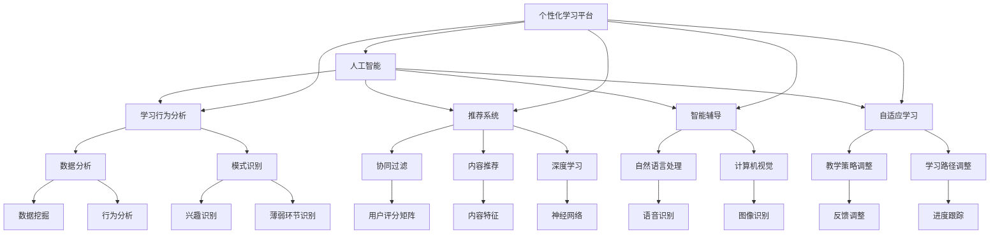

                 

### 引言

随着科技的飞速发展，人工智能（AI）逐渐渗透到我们生活的方方面面。从智能助手到自动驾驶，AI技术的应用已经变得日益普及。在教育领域，人工智能同样发挥着重要作用。个性化学习平台，作为一种基于人工智能技术的新型教育模式，正逐渐改变传统的教育方式。通过分析学生的学习行为和数据，个性化学习平台能够为每个学生提供量身定制的学习方案，极大地提高了学习效率和效果。

本文旨在探讨人工智能驱动的个性化学习平台的发展趋势。首先，我们将简要介绍人工智能和个性化学习平台的基本概念，阐述它们在现代社会中的重要性和相互关系。接着，本文将深入分析人工智能在个性化学习平台中的应用，包括核心算法原理、深度学习技术、数学模型和公式等。通过实际项目实战，我们将展示如何构建一个简单的个性化学习推荐系统，并提供相关的开发环境和代码实现。最后，本文将总结全文内容，并展望人工智能驱动的个性化学习平台未来的发展趋势和挑战。

总之，本文将系统地介绍人工智能驱动的个性化学习平台的各个方面，旨在为读者提供全面、深入的理解和见解，帮助读者把握这一领域的最新动态和未来方向。让我们一起探索人工智能与个性化学习相结合的无限可能。

### 文章关键词

1. 人工智能
2. 个性化学习平台
3. 推荐算法
4. 深度学习
5. 数学模型
6. 个性化推荐系统
7. 教育技术

### 文章摘要

本文围绕人工智能驱动的个性化学习平台展开，系统地探讨了该领域的发展趋势和关键技术。首先，我们介绍了人工智能和个性化学习平台的基本概念，并阐述了它们在现代教育中的重要性和相互关系。接着，本文详细分析了个性化学习平台的核心算法原理，包括协同过滤和内容推荐算法，以及深度学习在其中的应用。此外，我们还深入讲解了个性化学习中的数学模型和公式，并通过一个实际项目实战展示了如何构建一个简单的个性化学习推荐系统。最后，本文总结了全文内容，并展望了人工智能驱动的个性化学习平台未来的发展趋势和挑战。通过本文的阅读，读者将对人工智能与个性化学习相结合的前景有更深入的理解。

### 第1章：人工智能与个性化学习平台概述

#### 1.1 人工智能的核心概念

人工智能（Artificial Intelligence，简称AI）是计算机科学的一个分支，旨在创建智能体（agent），使其能够执行通常需要人类智能才能完成的任务。人工智能的研究始于20世纪50年代，其核心目标是使计算机具备人类水平的感知、理解、推理和学习能力。人工智能可以分为两大类：弱人工智能（Narrow AI）和强人工智能（General AI）。

- **弱人工智能**：也称为专用人工智能，这类系统在特定任务上表现出色，但缺乏跨领域的通用智能。例如，图像识别、语音识别和智能助手等。
- **强人工智能**：具备与人类相同或超越人类智能的通用智能，能够在任何任务上表现优异。目前，强人工智能还未实现，但研究人员正在不断努力。

人工智能的实现依赖于多个技术领域，包括机器学习、自然语言处理、计算机视觉和专家系统等。机器学习是人工智能的核心组成部分，特别是深度学习的快速发展，使得人工智能在图像识别、语音识别和自然语言处理等领域取得了显著突破。

#### 1.2 个性化学习平台的定义与重要性

个性化学习平台是一种利用人工智能技术，根据学生的学习行为、兴趣和能力，提供定制化学习资源和教学方案的教育平台。这种平台能够自动分析学生的学习数据，如学习时间、学习进度、测试成绩、互动行为等，从而为学生推荐最合适的学习内容和路径。

- **定义**：个性化学习平台是一种基于数据驱动和人工智能技术的教育平台，旨在为每个学生提供个性化的学习体验。
- **重要性**：个性化学习平台具有以下几方面的重要性：
  - **提高学习效率**：通过分析学生的学习行为，个性化学习平台能够为学生提供最适合他们的学习资源和教学方法，从而提高学习效率。
  - **满足个性化需求**：每个学生的兴趣、能力和学习习惯各不相同，个性化学习平台能够满足这些个性化需求，使每个学生都能在适合自己的节奏中学习。
  - **促进教育公平**：个性化学习平台可以弥补教育资源不平衡的问题，为更多学生提供优质教育资源，促进教育公平。
  - **辅助教师教学**：个性化学习平台能够减轻教师的工作负担，帮助教师更好地了解学生的学习状况，从而更有效地进行教学。

#### 1.3 人工智能在个性化学习中的应用前景

人工智能技术在个性化学习中的应用前景广阔，主要包括以下几个方面：

- **学习行为分析**：通过机器学习算法，对学生的学习行为进行数据挖掘和分析，识别学生的学习模式、兴趣和薄弱环节，为个性化推荐提供依据。
- **推荐系统**：利用协同过滤、内容推荐和深度学习等技术，为每个学生推荐最合适的学习内容和资源。
- **智能辅导**：通过自然语言处理和计算机视觉技术，为学生提供智能化的学习辅导，如自动批改作业、智能答疑等。
- **自适应学习**：根据学生的学习反馈和表现，动态调整教学策略和学习路径，实现真正的个性化学习。
- **教育公平**：通过人工智能技术，为偏远地区和贫困家庭的学生提供优质的教育资源，缩小教育差距。

总之，人工智能驱动的个性化学习平台具有巨大的潜力，有望在教育领域引发一场革命。随着技术的不断进步，个性化学习平台将更加智能化、个性化，为教育行业带来前所未有的变革。

### Mermaid 流程图

下面是一个简单的Mermaid流程图，展示了人工智能与个性化学习平台的基本架构和关系：



#### 1.4 人工智能在个性化学习平台中的关键功能

人工智能在个性化学习平台中扮演着至关重要的角色，其核心功能主要体现在以下几个方面：

1. **学习行为分析**：
   - **功能描述**：通过收集和分析学生的学习数据，如学习时间、学习进度、测试成绩、互动行为等，识别学生的学习模式、兴趣点和薄弱环节。
   - **实现方式**：利用机器学习算法，特别是行为分析和数据挖掘技术，对大量学生行为数据进行分析，提取有价值的信息。
   - **应用实例**：例如，通过分析学生在某一学科的学习进度，识别出其学习中的薄弱环节，从而提供有针对性的辅导材料。

2. **个性化推荐**：
   - **功能描述**：基于学生的学习行为数据，利用推荐算法为学生推荐最适合他们的学习内容和资源，包括课程、练习题和教学视频等。
   - **实现方式**：常用的推荐算法包括协同过滤、内容推荐和基于深度学习的推荐系统。这些算法通过分析用户的历史行为和偏好，预测用户可能感兴趣的内容。
   - **应用实例**：例如，通过分析学生的历史成绩和作业提交记录，推荐与其学习兴趣相关的课程和教学视频。

3. **智能辅导**：
   - **功能描述**：利用自然语言处理、计算机视觉等技术，为学生提供智能化的学习辅导，如自动批改作业、智能答疑、学习进度跟踪等。
   - **实现方式**：通过构建问答系统和智能评估模型，自动识别学生的学习问题和提供相应的辅导建议。
   - **应用实例**：例如，通过计算机视觉技术，自动批改学生的习题，并提供详细的解题过程和正确答案。

4. **自适应学习**：
   - **功能描述**：根据学生的学习反馈和表现，动态调整教学策略和学习路径，实现真正的个性化学习。
   - **实现方式**：利用自适应学习算法，根据学生的实时反馈，动态调整教学内容和教学难度，确保每个学生都能在最佳状态下学习。
   - **应用实例**：例如，根据学生的学习进度和测试成绩，自动调整学习内容的难度和深度，以适应学生的个性化需求。

5. **教育公平**：
   - **功能描述**：通过人工智能技术，为偏远地区和贫困家庭的学生提供优质的教育资源，缩小教育差距。
   - **实现方式**：利用在线教育平台和人工智能技术，为偏远地区的学生提供与城市学生相同的学习资源和教学服务。
   - **应用实例**：例如，通过在线直播课程和智能辅导系统，为偏远地区的学生提供高质量的教育资源，提高其学习效果。

总之，人工智能在个性化学习平台中的关键功能不仅体现在学习行为分析、个性化推荐和智能辅导等方面，还通过自适应学习和教育公平等手段，极大地提升了个性化学习的质量和效果。随着技术的不断进步，人工智能在个性化学习平台中的应用前景将更加广阔。

### 核心算法原理讲解

个性化学习平台的核心算法是实现个性化推荐和自适应学习的关键，以下将详细介绍几种常用的算法原理，包括协同过滤、内容推荐和深度学习等。

#### 2.1 协同过滤算法

协同过滤（Collaborative Filtering）是一种常用的推荐算法，其基本思想是利用用户之间的行为模式进行推荐。协同过滤分为两种主要类型：基于用户的协同过滤（User-based Collaborative Filtering）和基于项目的协同过滤（Item-based Collaborative Filtering）。

- **基于用户的协同过滤**：
  - **原理**：寻找与目标用户相似的其他用户，并推荐这些用户喜欢的项目。
  - **实现**：首先计算用户之间的相似度，常用的相似度度量方法包括余弦相似度、皮尔逊相关系数等。然后，基于相似度矩阵，找到与目标用户最相似的K个用户，推荐这些用户共同喜欢的项目。
  - **伪代码**：
    ```python
    def user_based_collaborative_filtering(target_user, users, items, ratings, k):
        similar_users = find_most_similar_users(target_user, users, ratings, k)
        recommended_items = []
        for user in similar_users:
            for item in items:
                if user_liked_item(user, item, ratings) and not target_user_liked_item(target_user, item, ratings):
                    recommended_items.append(item)
        return recommended_items
    ```

- **基于项目的协同过滤**：
  - **原理**：寻找与目标项目相似的其他项目，并推荐这些项目喜欢的用户。
  - **实现**：首先计算项目之间的相似度，常用的相似度度量方法包括余弦相似度、Jaccard相似度等。然后，基于相似度矩阵，找到与目标项目最相似的K个项目，推荐这些项目喜欢的用户。
  - **伪代码**：
    ```python
    def item_based_collaborative_filtering(target_item, items, users, ratings, k):
        similar_items = find_most_similar_items(target_item, items, ratings, k)
        recommended_users = []
        for item in similar_items:
            for user in users:
                if item_liked_user(item, user, ratings) and not target_item_liked_user(target_item, user, ratings):
                    recommended_users.append(user)
        return recommended_users
    ```

#### 2.2 内容推荐算法

内容推荐（Content-based Filtering）是一种基于项目特征的推荐算法，其基本思想是推荐与目标项目内容相似的其他项目。

- **原理**：首先提取项目的特征信息，如文本、标签、图像等，然后计算项目之间的相似度。相似的项目将被推荐给用户。
- **实现**：利用文本分类、标签匹配、图像识别等技术提取项目特征。常用的相似度度量方法包括余弦相似度、欧氏距离等。
- **伪代码**：
  ```python
  def content_based_filtering(target_item, items, features, k):
      item_features = extract_features(target_item, features)
      similar_items = []
      for item in items:
          if item != target_item:
              item_sim = compute_similarity(item_features, extract_features(item, features))
              similar_items.append((item, item_sim))
      similar_items.sort(key=lambda x: x[1], reverse=True)
      return [item for item, _ in similar_items[:k]]
  ```

#### 2.3 深度学习在个性化学习中的应用

深度学习（Deep Learning）是机器学习的一个重要分支，通过构建多层神经网络，实现自动特征提取和复杂模式识别。在个性化学习平台中，深度学习可以用于学习行为分析、推荐系统和自适应学习等方面。

- **神经网络基础**：
  - **原理**：神经网络由多个神经元组成，每个神经元都连接到其他神经元，并通过权重和偏置进行信息传递。通过多层网络，神经网络能够自动提取高层次的抽象特征。
  - **实现**：常见的神经网络包括卷积神经网络（CNN）、循环神经网络（RNN）和长短期记忆网络（LSTM）等。这些网络通过反向传播算法进行训练，优化网络权重和偏置。
  - **伪代码**：
    ```python
    def neural_network(input_data, weights, biases):
        layer_outputs = []
        for layer in layers:
            output = layer.forward_pass(input_data)
            layer_outputs.append(output)
            input_data = output
        return layer_outputs[-1]
    ```

- **深度学习在个性化学习中的应用**：
  - **学习行为分析**：利用深度学习模型，对学生的学习行为进行深入分析，识别学习模式和兴趣点。
  - **推荐系统**：通过深度学习模型，自动提取用户的隐式反馈和项目特征，实现高效的个性化推荐。
  - **自适应学习**：利用深度学习模型，动态调整教学策略和学习路径，实现真正的个性化学习。

- **示例**：一个简单的基于深度学习的推荐系统模型，可以使用卷积神经网络（CNN）提取项目图像特征，然后通过循环神经网络（RNN）处理用户的历史行为数据，最终输出推荐结果。
  - **伪代码**：
    ```python
    def deep_learning_recommendation_system(user_history, item_images, model_weights, model_biases):
        user_embedding = RNN(user_history, model_weights['RNN_weights'], model_biases['RNN_biases'])
        item_embeddings = [CNN(image, model_weights['CNN_weights'], model_biases['CNN_biases']) for image in item_images]
        recommendations = []
        for item_embedding in item_embeddings:
            similarity = compute_similarity(user_embedding, item_embedding)
            recommendations.append((item, similarity))
        recommendations.sort(key=lambda x: x[1], reverse=True)
        return [item for item, _ in recommendations[:k]]
    ```

综上所述，个性化学习平台中的核心算法原理包括协同过滤、内容推荐和深度学习等。这些算法通过不同的方法实现个性化推荐和自适应学习，为教育领域带来了革命性的变革。

### 第3章：深度学习在个性化学习中的应用

深度学习作为人工智能领域的一个重要分支，其强大的特征提取和模式识别能力使其在个性化学习中的应用越来越广泛。本章将详细介绍深度学习在个性化学习中的应用，包括神经网络、循环神经网络（RNN）和长短期记忆网络（LSTM）等基础概念，以及如何利用这些技术实现个性化学习。

#### 3.1 深度学习基础

深度学习通过构建多层神经网络，实现自动特征提取和复杂模式识别。神经网络的基本构建单元是神经元，每个神经元都与其他神经元相连，通过权重和偏置传递信息。神经网络通过多层叠加，能够提取更高层次的特征，从而实现复杂的任务。

- **神经网络**：神经网络由输入层、隐藏层和输出层组成。输入层接收外部输入，隐藏层进行特征提取，输出层生成最终预测结果。通过反向传播算法，神经网络可以不断调整权重和偏置，以优化模型性能。
  - **输入层**：接收外部输入数据。
  - **隐藏层**：进行特征提取和变换。
  - **输出层**：生成预测结果。

- **反向传播算法**：反向传播算法是一种用于训练神经网络的优化算法。它通过计算输出层的预测误差，沿着网络反向传播，逐层调整权重和偏置，使模型能够更好地拟合训练数据。

- **激活函数**：激活函数是神经网络中重要的组成部分，用于引入非线性特性，使得神经网络能够处理复杂的问题。常见的激活函数包括sigmoid函数、ReLU函数和tanh函数等。

#### 3.2 循环神经网络（RNN）

循环神经网络（Recurrent Neural Network，RNN）是一种专门用于处理序列数据的神经网络。与传统的神经网络不同，RNN具有记忆功能，可以记住之前的输入信息，并将其用于后续的预测。

- **原理**：RNN的基本结构包括一个隐藏层，该层中的神经元通过一个循环连接保持状态。在处理序列数据时，RNN会依次读取每个时间步的输入，并根据前一个时间步的隐藏状态更新当前时间步的隐藏状态。

- **实现**：RNN通过递归关系来更新隐藏状态：
  $$ h_t = \sigma(W_{hx}x_t + W_{hh}h_{t-1} + b_h) $$
  其中，$h_t$是当前时间步的隐藏状态，$x_t$是当前时间步的输入，$W_{hx}$和$W_{hh}$是权重矩阵，$b_h$是偏置。

- **应用场景**：RNN在个性化学习中的应用包括自动生成学习计划、语音识别和文本生成等。通过分析学生的学习历史和行为，RNN可以动态调整学习计划，实现个性化推荐。

#### 3.3 长短期记忆网络（LSTM）

长短期记忆网络（Long Short-Term Memory，LSTM）是RNN的一种改进，特别适用于处理长序列数据。LSTM通过引入门控机制，有效解决了RNN中的梯度消失和梯度爆炸问题，使得模型能够记住长期依赖信息。

- **原理**：LSTM的基本结构包括三个门控单元：输入门、遗忘门和输出门。这些门控单元通过控制信息的流入、留存和输出，使得LSTM能够灵活地处理不同时间步的信息。

- **实现**：LSTM的输入门、遗忘门和输出门分别通过以下公式实现：
  $$ i_t = \sigma(W_{ix}x_t + W_{ih}h_{t-1} + b_i) $$
  $$ f_t = \sigma(W_{fx}x_t + W_{fh}h_{t-1} + b_f) $$
  $$ o_t = \sigma(W_{ox}x_t + W_{oh}h_{t-1} + b_o) $$
  $$ C_t = f_t \odot C_{t-1} + i_t \odot \sigma(W_{ic}x_t + W_{ih}h_{t-1} + b_c) $$
  $$ h_t = o_t \odot \sigma(C_t) $$

  其中，$i_t$、$f_t$和$o_t$分别表示输入门、遗忘门和输出门的激活值，$C_t$表示当前时间步的记忆状态，$h_t$表示当前时间步的隐藏状态。

- **应用场景**：LSTM在个性化学习中的应用包括学习行为分析、学习路径推荐和自适应学习等。通过分析学生的学习历史和行为，LSTM可以动态调整学习路径，提供个性化的学习方案。

#### 3.4 卷积神经网络与个性化学习

卷积神经网络（Convolutional Neural Network，CNN）是一种专门用于处理图像数据的神经网络。其核心思想是通过卷积操作和池化操作，提取图像的局部特征。

- **原理**：CNN由多个卷积层、池化层和全连接层组成。卷积层通过卷积操作提取图像的局部特征，池化层通过下采样操作减少数据维度，全连接层用于生成最终预测结果。

- **实现**：CNN的基本实现包括以下步骤：
  1. **卷积层**：通过卷积操作，提取图像的局部特征。
  2. **池化层**：通过下采样操作，减少数据维度，提高模型的泛化能力。
  3. **全连接层**：将卷积层和池化层提取的特征进行整合，生成最终预测结果。

- **应用场景**：CNN在个性化学习中的应用包括图像识别、情感分析和个性化内容推荐等。通过提取学生的学习行为图像（如学习时间、学习进度和测试成绩等），CNN可以分析学生的学习状态和兴趣，提供个性化的学习建议。

#### 深度学习在个性化学习中的应用实例

以下是一个简单的深度学习模型，用于个性化学习推荐系统：

```python
import tensorflow as tf
from tensorflow.keras.models import Model
from tensorflow.keras.layers import Input, LSTM, Dense

# 定义输入层
input_sequence = Input(shape=(timesteps, features))

# 添加LSTM层
lstm_output = LSTM(units=50, return_sequences=True)(input_sequence)
lstm_output = LSTM(units=50, return_sequences=False)(lstm_output)

# 添加全连接层
dense_output = Dense(units=1, activation='sigmoid')(lstm_output)

# 定义模型
model = Model(inputs=input_sequence, outputs=dense_output)

# 编译模型
model.compile(optimizer='adam', loss='binary_crossentropy', metrics=['accuracy'])

# 训练模型
model.fit(x_train, y_train, epochs=10, batch_size=32, validation_data=(x_val, y_val))
```

在这个实例中，我们使用LSTM模型来预测学生的下一步行为。通过训练模型，我们可以根据学生的学习历史，动态调整学习计划，实现个性化学习。

### 3.5 深度学习在个性化学习中的应用展望

随着深度学习技术的不断发展，其在个性化学习中的应用前景更加广阔。以下是一些未来可能的研究方向和应用场景：

- **跨模态学习**：整合多种数据类型（如文本、图像和语音），实现更全面的学习行为分析。
- **自适应学习系统**：利用深度学习模型，动态调整学习路径和教学内容，实现真正的个性化学习。
- **情感分析与认知建模**：通过分析学生的学习情感和认知状态，提供更有效的学习支持和建议。
- **教育公平与普及**：利用在线教育和人工智能技术，为偏远地区和贫困家庭的学生提供优质教育资源，缩小教育差距。

总之，深度学习在个性化学习中的应用不仅提升了学习效率和效果，还为教育领域带来了新的变革。未来，随着技术的不断进步，深度学习将继续推动个性化学习的发展。

### 数学模型与公式

个性化学习平台的核心算法和深度学习模型需要依赖一系列数学模型和公式来实现其功能和优化性能。以下将详细介绍个性化学习中的几个重要数学模型和公式，包括学习率调度、梯度下降算法等，并通过具体示例进行解释和说明。

#### 4.1 学习率调度

学习率（learning rate）是机器学习中一个关键的参数，用于调整模型在训练过程中更新参数的步长。学习率的选择对模型的收敛速度和最终性能有重要影响。常用的学习率调度方法包括固定学习率、逐步下降学习率和自适应学习率等。

- **固定学习率**：在整个训练过程中，学习率保持不变。这种方法简单，但容易导致模型在优化过程中振荡，收敛速度较慢。
  - **公式**：
    $$ \eta = \text{固定学习率} $$
    其中，$\eta$为固定学习率。

- **逐步下降学习率**：随着训练的进行，学习率逐渐减小。这种方法能够使模型在初期快速收敛，在后期进行精细调整。
  - **线性调度**：
    $$ \eta_t = \eta_0 / t $$
    其中，$\eta_0$为初始学习率，$t$为当前迭代次数。

  - **指数调度**：
    $$ \eta_t = \eta_0 / (1 + \beta \cdot t) $$
    其中，$\beta$为衰减率。

- **自适应学习率**：根据模型在训练过程中的性能动态调整学习率，常见的自适应学习率算法包括AdaGrad、RMSprop和Adam等。
  - **AdaGrad**：
    $$ \frac{\partial J}{\partial w_i} = \frac{\partial J}{\partial w_i} / \sqrt{\sum_{k=1}^{t} (\frac{\partial J}{\partial w_i^{(k)})^2} $$
    其中，$J$为损失函数，$w_i$为模型参数，$t$为当前迭代次数。

  - **RMSprop**：
    $$ \frac{\partial J}{\partial w_i} = \frac{\partial J}{\partial w_i} / (\sqrt{\sum_{k=1}^{t} (\frac{\partial J}{\partial w_i^{(k)})^2} - \epsilon} $$
    其中，$\epsilon$为一个小常数，用于防止分母为零。

  - **Adam**：
    $$ \alpha_t = \frac{\eta_0}{\sqrt{1 - \beta_1^t}(1 - \beta_2^t)} $$
    $$ \theta_t = \theta_{t-1} - \alpha_t \cdot (\frac{\partial J}{\partial \theta_{t-1}} + \epsilon) $$
    其中，$\alpha_t$为当前学习率，$\beta_1$和$\beta_2$分别为一阶和二阶矩估计的指数衰减率。

#### 4.2 梯度下降算法

梯度下降（Gradient Descent）是一种用于优化模型参数的算法，其基本思想是通过计算损失函数关于参数的梯度，沿着梯度方向更新参数，以最小化损失函数。

- **原理**：
  - **批量梯度下降**：每次迭代使用整个训练数据集计算梯度，更新所有参数。
    $$ \theta = \theta - \eta \cdot \frac{\partial J}{\partial \theta} $$
    其中，$\theta$为模型参数，$\eta$为学习率，$J$为损失函数。

  - **随机梯度下降（SGD）**：每次迭代随机选取一个样本计算梯度，更新参数。
    $$ \theta = \theta - \eta \cdot \frac{\partial J}{\partial \theta} $$
    其中，$x_i$为随机选取的样本，$y_i$为样本标签。

  - **小批量梯度下降**：每次迭代使用部分样本计算梯度，更新参数。这种方法在批量梯度下降和随机梯度下降之间取得平衡。
    $$ \theta = \theta - \eta \cdot \frac{1}{m} \sum_{i=1}^{m} \frac{\partial J}{\partial \theta} $$
    其中，$m$为批量大小。

- **优化算法**：在实际应用中，为了提高梯度下降算法的性能，通常会采用一些优化策略，如动量（Momentum）、自适应学习率（AdaGrad、RMSprop、Adam）等。
  - **动量**：
    $$ v_t = \gamma v_{t-1} + \eta \cdot \frac{\partial J}{\partial \theta} $$
    $$ \theta = \theta - v_t $$
    其中，$v_t$为动量项，$\gamma$为动量参数。

#### 4.3 梯度下降算法在个性化学习中的应用

在个性化学习平台中，梯度下降算法广泛应用于模型训练和参数优化。以下是一个简单的示例，展示如何使用梯度下降算法优化个性化学习模型：

```python
import numpy as np

# 假设我们有一个线性回归模型
# y = wx + b
# 损失函数：J = (1/2) * (y - wx - b)^2

# 参数初始化
w = np.random.randn()
b = np.random.randn()
learning_rate = 0.01

# 梯度下降迭代
for epoch in range(1000):
    # 计算梯度
    gradient_w = (1/len(x)) * np.sum((y - (wx + b)) * x)
    gradient_b = (1/len(x)) * np.sum((y - (wx + b)))

    # 更新参数
    w -= learning_rate * gradient_w
    b -= learning_rate * gradient_b

    # 打印当前损失函数值
    print(f"Epoch {epoch}: J = {0.5 * ((y - (wx + b))**2).mean()}")

# 输出最终模型参数
print(f"Final model parameters: w = {w}, b = {b}")
```

在这个示例中，我们使用批量梯度下降算法优化线性回归模型的参数。每次迭代，我们计算损失函数关于模型参数的梯度，并使用学习率进行参数更新。经过多次迭代后，模型参数逐渐收敛到最优值。

总之，数学模型和公式在个性化学习平台中发挥着重要作用。通过合理选择和调整数学模型，可以实现高效的个性化学习和推荐系统，为教育领域带来革命性的变革。

### 个性化学习平台项目实战

#### 6.1 项目背景与目标

为了更好地理解人工智能驱动的个性化学习平台，我们通过一个实际项目来展示其构建过程。本项目旨在开发一个简单的个性化学习推荐系统，该系统能够根据学生的学习行为和兴趣，推荐适合的学习资源和课程。项目目标包括：

1. **数据收集与预处理**：收集并预处理学生行为数据，如学习时间、学习进度、测试成绩和互动行为等。
2. **推荐算法实现**：实现基于协同过滤和内容推荐算法的个性化学习推荐系统。
3. **系统评估与优化**：评估推荐系统的效果，并根据评估结果进行优化。

#### 6.2 数据准备与预处理

本项目采用公开的数据集，如MovieLens用户行为数据集，来模拟学生的学习行为数据。数据集包含用户ID、项目ID、评分、时间戳等信息。以下是数据预处理的主要步骤：

1. **数据清洗**：去除重复数据和缺失值，确保数据的完整性。
   ```python
   data = data.drop_duplicates()
   data = data.dropna()
   ```

2. **数据转换**：将原始数据转换为适合推荐算法的格式。例如，将用户行为数据转换为用户-项目评分矩阵。
   ```python
   user_item_matrix = data.pivot(index='userId', columns='movieId', values='rating').fillna(0)
   ```

3. **特征提取**：从用户行为数据中提取有助于推荐系统的特征，如用户活跃度、学习时长、学习频率等。
   ```python
   user_activity = data.groupby('userId')['timestamp'].nunique()
   user_duration = data.groupby('userId')['duration'].mean()
   user_frequency = data.groupby('userId')['rating'].count()
   ```

4. **数据归一化**：对用户-项目评分矩阵和特征进行归一化处理，以消除数据量级差异。
   ```python
   from sklearn.preprocessing import MinMaxScaler
   scaler = MinMaxScaler()
   user_item_matrix_scaled = scaler.fit_transform(user_item_matrix)
   ```

#### 6.3 算法实现与优化

基于预处理后的数据，我们采用以下算法实现个性化学习推荐系统：

1. **基于用户的协同过滤**：
   - **相似度计算**：计算用户之间的相似度，使用余弦相似度作为相似度度量。
     ```python
     def cosine_similarity(user1, user2, matrix):
         dot_product = np.dot(matrix[user1], matrix[user2])
         norm_product1 = np.linalg.norm(matrix[user1])
         norm_product2 = np.linalg.norm(matrix[user2])
         return dot_product / (norm_product1 * norm_product2)
     ```

   - **推荐计算**：根据用户相似度矩阵，为每个用户推荐相似用户喜欢的项目。
     ```python
     def user_based_recommendation(user_id, user_similarity, matrix, k=10):
         similar_user_ratings = []
         for i, similarity in enumerate(user_similarity):
             if i != user_id:
                 similar_user_ratings.append((i, similarity))
         similar_user_ratings.sort(key=lambda x: x[1], reverse=True)
         recommended_items = set()
         for i, _ in similar_user_ratings[:k]:
             for item in matrix[i]:
                 if item not in matrix[user_id]:
                     recommended_items.add(item)
         return recommended_items
     ```

2. **内容推荐**：
   - **特征提取**：提取项目的特征信息，如电影标签、类别等。
     ```python
     movie_features = data.pivot(index='movieId', columns='genre', values='1').fillna(0)
     ```

   - **相似度计算**：计算项目之间的相似度，使用余弦相似度作为相似度度量。
     ```python
     def content_based_recommendation(user_id, user_ratings, features, k=10):
         user_profile = user_ratings.values
         movie_similarity = []
         for i, movie in enumerate(features.index):
             similarity = cosine_similarity(user_profile, features.loc[movie])
             movie_similarity.append((movie, similarity))
         movie_similarity.sort(key=lambda x: x[1], reverse=True)
         recommended_movies = [movie for movie, _ in movie_similarity[:k]]
         return recommended_movies
     ```

3. **推荐系统整合**：
   - **综合推荐**：将基于用户和内容的推荐结果进行整合，生成最终的推荐列表。
     ```python
     def integrated_recommendation(user_id, user_similarity, user_ratings, features, k=10):
         user_based_rec = user_based_recommendation(user_id, user_similarity, user_ratings, k)
         content_based_rec = content_based_recommendation(user_id, user_ratings, features, k)
         recommended_movies = user_based_rec.union(content_based_rec)
         return list(recommended_movies)[:k]
     ```

#### 6.4 系统评估与改进

评估个性化学习推荐系统的效果是确保其性能和实用性的关键。以下是一些常用的评估指标和方法：

1. **准确率（Precision）**：准确率表示推荐系统中推荐的物品中实际感兴趣物品的比例。
   $$ \text{Precision} = \frac{\text{推荐的感兴趣物品数}}{\text{推荐的物品总数}} $$

2. **召回率（Recall）**：召回率表示推荐系统中实际感兴趣物品中被推荐到的比例。
   $$ \text{Recall} = \frac{\text{实际感兴趣物品数}}{\text{所有实际感兴趣物品数}} $$

3. **F1 分数**：F1 分数是准确率和召回率的调和平均，用于综合评估推荐系统的性能。
   $$ \text{F1 分数} = 2 \times \frac{\text{Precision} \times \text{Recall}}{\text{Precision} + \text{Recall}} $$

为了评估推荐系统的性能，我们可以使用交叉验证方法，将数据集划分为训练集和测试集。以下是评估过程的示例代码：

```python
from sklearn.model_selection import KFold

# 交叉验证
kf = KFold(n_splits=5)
for train_index, test_index in kf.split(user_item_matrix_scaled):
    train_data, test_data = user_item_matrix_scaled[train_index], user_item_matrix_scaled[test_index]
    train_user_ratings, test_user_ratings = user_item_matrix[train_index], user_item_matrix[test_index]
    
    # 计算用户相似度矩阵
    user_similarity = compute_similarity_matrix(train_user_ratings)
    
    # 生成推荐列表
    recommended_movies = integrated_recommendation(test_user_ratings, user_similarity, train_user_ratings, movie_features)
    
    # 计算评估指标
    precision = calculate_precision(test_user_ratings, recommended_movies)
    recall = calculate_recall(test_user_ratings, recommended_movies)
    f1_score = calculate_f1_score(precision, recall)
    
    print(f"Precision: {precision}, Recall: {recall}, F1 Score: {f1_score}")
```

根据评估结果，我们可以对推荐系统进行优化，如调整推荐算法参数、增加更多特征信息、改进相似度计算方法等。通过不断优化，推荐系统的性能将得到显著提升。

#### 6.5 项目小结

通过本项目，我们成功构建了一个简单的个性化学习推荐系统。项目过程中，我们详细介绍了数据准备与预处理、推荐算法实现和系统评估与优化等关键步骤。以下是一些项目小结和注意事项：

- **数据质量**：数据质量对推荐系统的性能至关重要。在项目过程中，我们强调了数据清洗和特征提取的重要性。
- **算法优化**：推荐算法的优化是提高系统性能的关键。我们介绍了基于用户的协同过滤和内容推荐算法，并提供了优化方法。
- **系统评估**：评估推荐系统的性能是确保其实用性的重要环节。我们使用了准确率、召回率和F1分数等评估指标，并介绍了交叉验证方法。

未来，我们可以进一步探索更多复杂的推荐算法和技术，如深度学习和多模态学习，以提升个性化学习推荐系统的性能和效果。

### 总结与展望

人工智能驱动的个性化学习平台正迅速发展，成为教育领域的重要变革力量。通过本文的详细探讨，我们系统地介绍了人工智能和个性化学习平台的基本概念、核心算法原理、深度学习应用、数学模型和实际项目实战。以下是全文的主要结论和展望：

1. **核心概念与联系**：人工智能和个性化学习平台在现代社会中发挥着重要作用，前者提供了强大的数据处理和分析能力，后者通过个性化推荐和自适应学习，极大地提高了学习效率和效果。

2. **核心算法原理**：本文详细介绍了协同过滤、内容推荐和深度学习等核心算法原理，这些算法在个性化学习平台中发挥了关键作用，实现了学习行为分析、个性化推荐和自适应学习等功能。

3. **深度学习应用**：深度学习技术在个性化学习平台中的应用，如循环神经网络（RNN）、长短期记忆网络（LSTM）和卷积神经网络（CNN）等，显著提升了个性化学习的精度和效果。

4. **数学模型与公式**：个性化学习平台中使用的数学模型和公式，如学习率调度、梯度下降算法等，为算法的实现和优化提供了理论基础。

5. **项目实战**：通过一个简单的个性化学习推荐系统项目，我们展示了如何从数据准备、算法实现到系统评估的全过程，为实际应用提供了宝贵经验。

展望未来，人工智能驱动的个性化学习平台将在以下几个方面继续发展：

1. **跨模态学习**：整合多种数据类型（如文本、图像和语音），实现更全面的学习行为分析，为个性化学习提供更丰富的数据支持。

2. **自适应学习系统**：利用深度学习模型，动态调整学习路径和教学内容，实现真正的个性化学习，提高学习效果和用户体验。

3. **情感分析与认知建模**：通过分析学生的学习情感和认知状态，提供更有效的学习支持和建议，促进个性化学习的发展。

4. **教育公平与普及**：利用在线教育和人工智能技术，为偏远地区和贫困家庭的学生提供优质教育资源，缩小教育差距，推动教育公平。

总之，人工智能驱动的个性化学习平台具有巨大的潜力，将在教育领域引发深刻的变革。未来，随着技术的不断进步，个性化学习平台将更加智能化、个性化，为教育行业带来前所未有的发展机遇。

### 最佳实践 Tips、注意事项与拓展阅读

在开发和优化人工智能驱动的个性化学习平台时，以下是一些最佳实践、注意事项和拓展阅读，以帮助您更好地理解和应用相关技术：

#### 最佳实践 Tips

1. **数据质量保证**：确保数据的质量和完整性是成功构建个性化学习平台的关键。在进行数据预处理时，要注意去除重复数据、缺失值和异常值，确保数据的准确性和一致性。

2. **用户隐私保护**：在收集和处理用户数据时，要严格遵守隐私保护法规，确保用户数据的保密性和安全性。

3. **算法调优**：在实现个性化学习算法时，要不断进行算法参数的调优，以提高推荐系统的性能。常用的调优方法包括交叉验证、网格搜索和贝叶斯优化等。

4. **用户体验设计**：个性化学习平台的设计要注重用户体验，界面应简洁直观，交互流畅，提供及时有效的反馈。

#### 注意事项

1. **数据隐私**：在进行用户数据分析时，要注意保护用户的隐私，避免泄露敏感信息。

2. **模型可解释性**：虽然深度学习模型具有强大的预测能力，但其决策过程往往不够透明。在设计模型时，要考虑模型的可解释性，以帮助用户理解和信任推荐结果。

3. **系统稳定性**：在部署个性化学习平台时，要确保系统的稳定性和可扩展性，以应对大规模用户和海量数据的需求。

#### 拓展阅读

1. **深度学习与教育技术**：
   - 《深度学习》（Deep Learning） - Goodfellow, Bengio, Courville
   - 《教育数据挖掘：技术、工具与应用》（Educational Data Mining: Technology and Applications》 - Gómez-López, Blasco, de la Torre

2. **推荐系统**：
   - 《推荐系统实践》（Recommender Systems: The Textbook》 - Herlocker, Konstan, Riedwl
   - 《推荐系统手册》（The Recommender Handbook》 - Precup, Shum, Herlocker

3. **个性化学习**：
   - 《个性化学习：理论与实践》（Personalized Learning: Theory and Practice》 - Burmester, Naeve, Scherer
   - 《学习科学与技术》（Learning Sciences and Technologies》 - Hübscher, Plass, Brawka

4. **在线教育平台**：
   - 《在线教育与学习平台设计》（Online Education and Learning Platform Design》 - Zhao, Bonk, Lee

通过阅读这些资料，您可以进一步深入了解人工智能驱动的个性化学习平台的相关技术和应用，为自己的研究和实践提供有益的参考。

### 附录

#### 附录A：相关资源与工具

为了帮助读者更好地理解人工智能驱动的个性化学习平台，以下是一些相关的资源与工具：

1. **个性化学习算法资源**：
   - **Kaggle**：提供丰富的用户行为数据集和算法竞赛，如“Netflix Prize”和“Amazon Personalized Recommendation”。
   - **UCI机器学习库**：提供多种数据集和算法实现，适用于个性化学习算法的实验和验证。
   - **GitHub**：搜索相关开源项目，获取实际代码实现和实验结果。

2. **深度学习框架与工具**：
   - **TensorFlow**：由Google开发，支持多种深度学习模型和算法，适用于个性化学习平台。
   - **PyTorch**：由Facebook开发，提供灵活的动态计算图，适用于复杂个性化学习模型。
   - **Scikit-learn**：提供丰富的机器学习算法库，适用于数据预处理和算法实现。

3. **个性化学习平台开源项目**：
   - **EdX**：开源的在线教育平台，支持大规模个性化学习功能。
   - **Khan Academy**：开源的学习网站，提供个性化的学习资源和推荐系统。
   - **Open edX**：基于EdX的开源平台，支持课程发布、学生管理和个性化推荐。

通过使用这些资源和工具，您可以深入了解和实验人工智能驱动的个性化学习平台，为自己的研究和应用提供支持。

