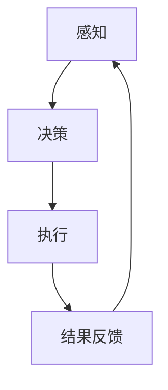
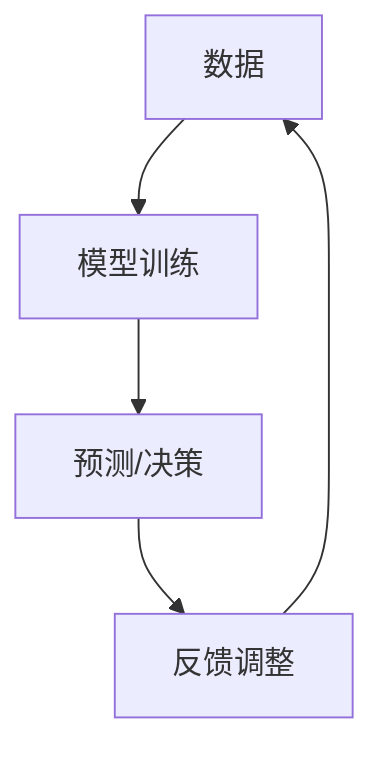
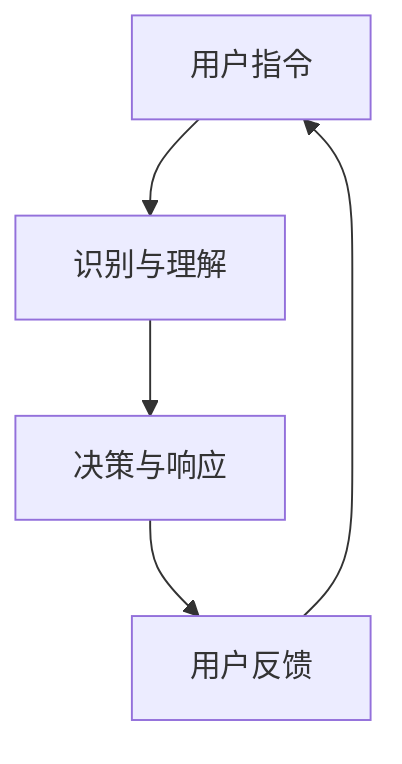
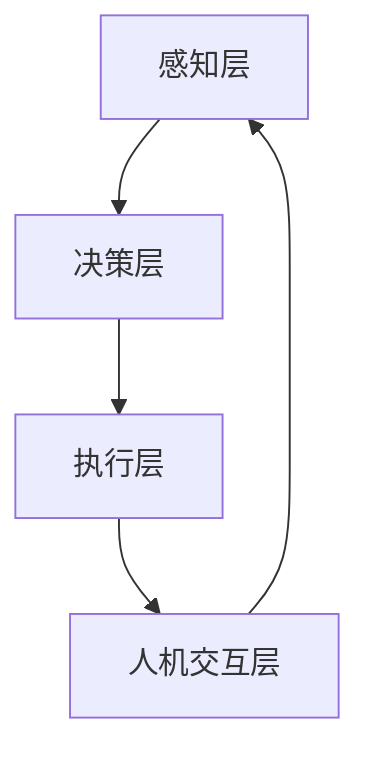

                 

### 文章标题

# 人机协作：2030年80%人类将日常接触智能机器人

### 关键词

- 智能机器人
- 人机协作
- 人工智能
- 2030年预测
- 社会变革

### 摘要

本文探讨了在人工智能技术的推动下，智能机器人在未来社会中的广泛应用。通过分析人机协作的背景、核心概念、模型以及实际应用，我们预测到2030年，将有超过80%的人类在日常工作中接触智能机器人。文章首先介绍了智能机器人的定义和发展历程，然后详细解释了人机协作的核心理念与技术，并通过具体的案例展示了智能机器人在不同领域的应用。最后，文章提出了未来人机协作面临的挑战与机遇，以及为应对这些挑战所需的策略与方向。通过逐步推理和分析，本文旨在为读者提供对智能机器人时代的一个全面、深刻的理解。

### 引言

在过去的几十年里，人工智能（AI）技术取得了飞速的发展，从简单的规则系统到复杂的深度学习模型，人工智能已经逐渐渗透到我们的日常生活和工作中。特别是近年来，随着计算能力的提升和大数据的积累，智能机器人的研发和应用开始进入一个全新的阶段。智能机器人不仅能够在工业生产、医疗健康、教育等多个领域发挥重要作用，还能够与人类进行高效、智能的协作，大大提升工作效率和生产力。

#### 智能机器人的定义与发展历程

智能机器人是一种具备一定智能能力的机器装置，能够通过感知环境、理解指令、自主决策和执行任务，实现与人类或其他机器的交互。根据其智能水平，智能机器人可以分为以下几类：

1. **自动化机器人**：这类机器人主要依靠预编程的指令进行操作，虽然能够完成特定的任务，但缺乏灵活性和智能决策能力。
2. **半智能机器人**：这类机器人结合了一定的感知和决策能力，能够根据环境变化调整行为，但通常需要人类提供指导或决策。
3. **全智能机器人**：这类机器人具备高级的感知、理解、决策和执行能力，能够在没有人类干预的情况下独立完成任务。

智能机器人技术最早可以追溯到20世纪50年代，当时美国科学家约翰·麦卡锡（John McCarthy）提出了人工智能的概念。随后的几十年里，人工智能经历了多次起伏，但始终在不断进步。特别是在21世纪初，随着深度学习技术的突破，智能机器人迎来了新的发展机遇。

#### 智能机器人技术的发展趋势

当前，智能机器人技术正处于快速发展阶段，主要体现在以下几个方面：

1. **感知与认知能力的提升**：通过使用各种传感器，智能机器人能够更加精确地感知周围环境，并通过深度学习算法实现更高层次的环境理解和认知。
2. **自主决策与执行能力**：借助强化学习、规划算法等技术，智能机器人能够根据环境和任务需求自主做出决策，并高效执行任务。
3. **人机交互的优化**：通过自然语言处理、语音识别等技术，智能机器人能够更加自然地与人类进行交流，实现高效的人机协作。

#### 智能机器人对人类社会的潜在影响

随着智能机器人技术的不断进步，其在各个领域的应用将越来越广泛，对人类社会的影响也将越来越深远。首先，智能机器人在提高生产效率、降低成本、提升服务质量等方面具有显著优势，将极大地改变传统产业的运营模式。其次，智能机器人能够承担一些危险或繁重的工作，减少人类劳动力的负担，提高劳动者的生活质量。然而，智能机器人的广泛应用也带来了一系列新的挑战，如就业问题、隐私保护、伦理道德等。

总之，智能机器人技术的发展是不可避免的趋势，其对人类社会的影响将深远而广泛。在未来，人类与智能机器人的协作将成为一种新的生产力和生活方式，为社会带来巨大的变革和机遇。

### 核心概念与联系

在人机协作的框架下，理解核心概念及其相互关系是至关重要的。以下是几个关键概念的定义及其在系统架构中的角色：

#### 智能机器人

智能机器人是一种集成了感知、决策和执行功能的设备，能够自主或半自主地执行任务。其定义基于以下几个关键特征：

1. **感知**：通过传感器（如摄像头、麦克风、触觉传感器等）收集环境数据。
2. **决策**：利用机器学习算法处理感知数据，进行自主决策。
3. **执行**：根据决策结果，执行具体任务。

**Mermaid 流程图**：



在这个流程图中，感知、决策和执行形成了一个闭环，不断迭代，使得智能机器人能够持续优化其行为。

#### 人工智能

人工智能（AI）是指通过计算机程序实现的智能行为，包括学习、推理、规划和问题解决等。人工智能技术是智能机器人实现智能化的基础，主要包括以下几个子领域：

1. **机器学习**：通过数据训练模型，使其能够进行预测和决策。
2. **深度学习**：一种特殊的机器学习方法，通过多层神经网络实现复杂函数的逼近。
3. **自然语言处理**：使计算机能够理解和生成自然语言。

**Mermaid 流程图**：



在这个流程中，数据通过训练生成模型，模型再通过预测和决策产生输出，并通过反馈调整不断优化。

#### 人机交互

人机交互是指人类与计算机系统之间的交互方式，包括语音、文字、手势等多种形式。人机交互是智能机器人实现人机协作的关键环节，直接影响用户体验和协作效率。

**Mermaid 流程图**：



在这个流程中，用户通过指令与系统交互，系统识别并理解指令，然后做出相应决策并反馈给用户。

#### 智能机器人系统架构

智能机器人系统架构通常包括以下几个层次：

1. **感知层**：负责收集环境数据，如摄像头、麦克风等。
2. **决策层**：处理感知数据，通过机器学习算法进行决策。
3. **执行层**：根据决策结果执行具体任务。
4. **人机交互层**：处理用户指令和反馈，实现人机互动。

**Mermaid 流程图**：



在这个系统中，各个层次相互协作，形成一个高效、智能的人机协作系统。

通过上述定义和流程图的展示，我们可以清晰地看到智能机器人、人工智能和人机交互在系统架构中的关键作用及其相互关系。这些核心概念共同构成了人机协作的技术基础，为智能机器人在未来社会中的广泛应用提供了坚实的基础。

### 核心算法原理讲解

在智能机器人的核心算法中，机器学习和深度学习算法起着至关重要的作用。这些算法不仅决定了智能机器人的决策能力和执行效率，还直接影响其在复杂环境中的适应能力。以下将详细讲解这些核心算法的原理，并通过伪代码进行解释。

#### 机器学习算法

机器学习是一种通过数据训练模型，使其能够进行预测和决策的技术。常见的机器学习算法包括决策树、支持向量机（SVM）、神经网络等。

**决策树算法（ID3）原理：**

决策树算法是一种基于信息增益的树形结构模型，通过递归划分特征，选择最优特征进行分割。其基本步骤如下：

1. **计算信息增益**：选择具有最高信息增益的特征作为分割依据。
2. **递归构建树**：对分割后的子集继续计算信息增益，构建决策树。

**伪代码：**

```python
def ID3(dataset, attributes, target_attribute):
    if all_values_equal(dataset, target_attribute):
        return majority_class(dataset, target_attribute)
    if attributes is empty:
        return majority_class(dataset, target_attribute)
    best_attribute = choose_best_attribute(dataset, attributes)
    tree = {}
    remaining_attributes = attributes - {best_attribute}
    for value in unique_values(dataset, best_attribute):
        subset = filter_dataset(dataset, best_attribute, value)
        tree[value] = ID3(subset, remaining_attributes, target_attribute)
    return tree
```

**支持向量机（SVM）算法原理：**

支持向量机是一种二分类模型，通过找到最佳超平面，使两类数据点在特征空间中的分布最远。其基本步骤如下：

1. **计算最佳超平面**：通过求解最优化问题找到最佳超平面。
2. **分类决策**：对于新的数据点，根据其到超平面的距离进行分类。

**伪代码：**

```python
def SVM(dataset, attributes, target_attribute):
    X, y = preprocess_dataset(dataset, attributes, target_attribute)
    w, b = solve_optimization_problem(X, y)
    return lambda x: sign(dot(w, x) + b)
```

**神经网络算法原理：**

神经网络是一种通过模拟生物神经元连接方式实现的计算模型，主要用于分类、回归和特征提取。其基本步骤如下：

1. **初始化参数**：随机初始化权重和偏置。
2. **前向传播**：将输入数据通过网络进行传播，计算输出。
3. **反向传播**：计算损失函数，并更新网络参数。

**伪代码：**

```python
def neural_network(input_data, weights, biases):
    layer_outputs = [input_data]
    for layer in range(num_layers - 1):
        z = dot(layer_outputs[-1], weights[layer]) + biases[layer]
        layer_outputs.append(activation_function(z))
    return layer_outputs[-1]

def train_neural_network(dataset, num_epochs, learning_rate):
    for epoch in range(num_epochs):
        for data in dataset:
            output = neural_network(data.input, data.weights, data.biases)
            loss = compute_loss(output, data.target)
            backpropagation(output, data.target, learning_rate)
```

#### 深度学习算法

深度学习是机器学习的一种扩展，通过构建多层神经网络实现复杂函数的逼近。以下介绍几种常见的深度学习算法。

**卷积神经网络（CNN）算法原理：**

卷积神经网络主要用于图像识别和图像处理，其核心是卷积层和池化层。基本步骤如下：

1. **卷积层**：通过卷积操作提取图像特征。
2. **池化层**：通过池化操作减少数据维度。
3. **全连接层**：将卷积层和池化层输出的特征进行融合，并通过全连接层进行分类。

**伪代码：**

```python
def CNN(input_image, filters, kernels, strides, pool_size):
    conv_output = conv2d(input_image, filters, kernels, strides)
    pool_output = max_pool2d(conv_output, pool_size)
    return pool_output

def train_CNN(dataset, num_epochs, learning_rate):
    for epoch in range(num_epochs):
        for image, label in dataset:
            output = CNN(image, filters, kernels, strides, pool_size)
            loss = compute_loss(output, label)
            backpropagation(output, label, learning_rate)
```

**生成对抗网络（GAN）算法原理：**

生成对抗网络由生成器和判别器组成，通过相互竞争实现生成逼真数据。基本步骤如下：

1. **生成器**：生成虚假数据。
2. **判别器**：区分真实数据和虚假数据。
3. **对抗训练**：优化生成器和判别器，使生成器生成的数据越来越逼真。

**伪代码：**

```python
def GAN(real_data, generator, discriminator, num_epochs, learning_rate):
    for epoch in range(num_epochs):
        for real in real_data:
            discriminator.train(real, learning_rate)
            fake = generator.generate()
            discriminator.train(fake, learning_rate)
        generator.train(discriminator, learning_rate)
```

通过上述算法原理和伪代码的讲解，我们可以看到机器学习和深度学习在智能机器人中的关键作用。这些算法不仅提升了智能机器人的决策能力和执行效率，还为智能机器人与人类的高效协作奠定了基础。

### 智能机器人在不同领域的应用

智能机器人作为一种先进的技术，已经在多个领域展现出巨大的潜力和应用价值。以下是智能机器人在一些主要领域的应用案例，详细说明了其技术原理、实际应用和未来展望。

#### 医疗健康

在医疗健康领域，智能机器人已经展现出其在辅助诊断、手术、康复等方面的巨大潜力。例如，达芬奇手术机器人是一种高端的智能手术系统，通过微创手术技术，实现了手术的精准性和安全性。

**技术原理：**
达芬奇手术机器人集成了计算机视觉、精密机械和控制系统。其技术原理主要包括：

1. **三维成像**：通过内置的摄像头和光源，生成高清晰度的三维图像，帮助医生进行精准定位。
2. **机械臂操作**：机器人的三轴机械臂具备高自由度和灵活性，可以模拟医生的手部动作进行精细操作。
3. **远程控制**：医生可以通过控制台对机械臂进行远程操作，实现远程手术。

**实际应用：**
达芬奇手术机器人已在多个医院投入使用，广泛应用于心脏手术、肝脏手术、肾肿瘤手术等复杂手术。通过智能机器人的辅助，手术时间缩短、创伤减小、康复周期缩短，大大提高了手术的成功率和患者的生活质量。

**未来展望：**
未来，智能机器人将继续在医疗健康领域发挥重要作用。随着人工智能技术的不断进步，智能手术机器人将具备更高的自主决策能力和操作灵活性，实现更加精准和高效的手术。

#### 教育

在教育领域，智能机器人主要用于辅助教学、个性化学习和学生管理等方面。例如，Nao机器人是一种教育用智能机器人，广泛应用于编程教学、自然语言处理和互动学习。

**技术原理：**
Nao机器人集成了计算机视觉、语音识别、运动控制等技术。其技术原理主要包括：

1. **计算机视觉**：通过内置的摄像头和图像处理算法，识别和跟踪学生的动作和表情，实现人机互动。
2. **语音识别**：通过语音识别技术，理解学生的指令和问题，并进行相应的反馈。
3. **运动控制**：通过复杂的运动算法，实现机器人的行走、舞蹈、手势等动作。

**实际应用：**
Nao机器人已被广泛应用于编程教学、自然语言处理和互动学习。在编程教学中，学生可以通过控制机器人进行编程实践；在自然语言处理中，学生可以通过与机器人的对话进行语言学习；在互动学习中，机器人可以作为学生的伙伴，激发学生的学习兴趣和创造力。

**未来展望：**
未来，智能机器人将在教育领域发挥更大的作用。通过更加先进的人工智能技术，智能机器人将能够提供更加个性化和互动化的学习体验，成为教育变革的重要推动力。

#### 制造业

在制造业领域，智能机器人广泛应用于自动化生产、质量控制、物流管理等方面。例如，ABB机器人是一种广泛应用于工业自动化生产的智能机器人。

**技术原理：**
ABB机器人的技术原理主要包括：

1. **多关节臂**：通过多关节设计，实现灵活的运动轨迹和操作范围。
2. **视觉系统**：通过内置的摄像头和视觉算法，实现对工件的高精度识别和定位。
3. **控制系统**：通过复杂的控制系统，实现机器人的自主决策和任务执行。

**实际应用：**
ABB机器人广泛应用于汽车制造、电子制造、食品加工等领域。在汽车制造中，机器人用于焊接、涂漆和装配等环节，提高了生产效率和质量；在电子制造中，机器人用于组装和测试电子元件，降低了人工成本和出错率；在食品加工中，机器人用于包装和分拣，提高了生产速度和卫生标准。

**未来展望：**
未来，智能机器人在制造业中的应用将更加深入和广泛。随着人工智能技术的进步，智能机器人将具备更高的自适应能力和协作能力，实现更加高效和智能的生产流程。

#### 农业

在农业领域，智能机器人主要用于精准农业、植物监测、病虫害防治等方面。例如，John Deere的智能拖拉机是一种应用于农业生产的智能机器人。

**技术原理：**
John Deere智能拖拉机的技术原理主要包括：

1. **GPS定位**：通过GPS定位系统，实现精确的农田管理和作业。
2. **传感器系统**：通过内置的传感器，监测土壤湿度、温度和植物生长状态。
3. **自动控制系统**：通过自动控制系统，实现拖拉机的自动驾驶和任务执行。

**实际应用：**
John Deere智能拖拉机广泛应用于农田耕作、播种、施肥和收割等环节。通过智能拖拉机，农民可以更加精确地进行农田管理，提高农业生产效率和质量。

**未来展望：**
未来，智能机器人在农业中的应用将更加普及和智能化。通过更加先进的传感器技术和人工智能算法，智能机器人将能够提供更加精确和高效的农业解决方案，推动农业现代化进程。

总之，智能机器人已经在医疗健康、教育、制造业和农业等多个领域展现出巨大的应用价值和潜力。随着人工智能技术的不断进步，智能机器人将在未来发挥更加重要的作用，为人类社会带来更多的变革和机遇。

### 智能机器人发展面临的挑战与机遇

#### 道德与伦理问题

智能机器人技术的发展带来了诸多道德与伦理问题，其中最为突出的包括隐私保护、责任归属和安全性。首先，智能机器人通常具备数据收集和分析能力，如何在保护用户隐私的同时充分利用这些数据是一个重大挑战。其次，当智能机器人造成损害时，责任应该由制造商、用户还是机器人本身承担？这一问题涉及到法律和伦理的复杂界定。最后，智能机器人在执行任务时可能会面临安全风险，如操作失误或系统故障导致的伤害，如何确保其安全性和可靠性是一个关键问题。

#### 技术局限

尽管智能机器人在许多领域展现了巨大潜力，但仍然存在一些技术局限。首先，智能机器人的自主决策能力尚需进一步提升。目前的智能机器人大多依赖预定义的规则或数据驱动的方法，缺乏真正的自主意识和情感理解能力。其次，智能机器人的感知能力和环境适应能力也有待提高。复杂多变的环境对智能机器人的感知系统提出了极高的要求，而目前的传感器技术和数据处理能力尚无法完全满足这些需求。此外，智能机器人的能耗和计算资源也是一个亟待解决的问题，特别是在需要长时间运行或进行复杂任务的场景中。

#### 社会适应问题

智能机器人的广泛应用将对社会结构和就业市场产生深远影响。首先，随着智能机器人在生产和服务领域的普及，传统工作岗位可能面临被取代的风险，这引发了关于就业和失业问题的讨论。其次，智能机器人的普及将改变人们的工作方式和生活习惯，如何在保持生产效率的同时，保障人类的工作价值和尊严是一个重要议题。此外，智能机器人在不同文化和社会环境中的适应性问题也需要充分考虑，以确保其能够和谐融入各种社会背景。

#### 发展机遇

尽管面临诸多挑战，智能机器人技术也带来了许多发展机遇。首先，智能机器人在提高生产效率、降低成本、提升服务质量等方面具有显著优势，有助于推动产业升级和经济发展。其次，智能机器人技术的进步将带来新的商业模式和就业机会，如智能机器人的研发、生产和维护等。此外，智能机器人技术的发展也将推动相关技术的进步，如人工智能、机器学习、自然语言处理等，为未来科技发展提供新的动力。

#### 应对策略与建议

为了应对智能机器人发展面临的挑战，以下是一些策略和建议：

1. **加强法律法规和伦理规范**：制定明确的法律和伦理规范，确保智能机器人在使用过程中遵循道德和法律规定。
2. **提升技术水平**：加大对智能机器人核心技术的研发投入，提升其自主决策、感知和环境适应能力。
3. **推动社会适应**：通过教育和培训，提高公众对智能机器人的认知和接受度，引导社会适应智能机器人的发展。
4. **构建生态系统**：建立智能机器人的开放性平台和标准，促进技术创新和产业协同，推动智能机器人的可持续发展。

通过以上策略和措施，我们可以更好地应对智能机器人发展面临的挑战，把握机遇，实现智能机器人在未来社会中的广泛应用和可持续发展。

### 案例分析：智能机器人在制造业中的成功应用

智能机器人的成功应用不仅体现在理论研究和模型构建上，更在实践案例中得到了充分的验证。以下我们将通过一个具体案例，详细分析智能机器人在制造业中的成功应用，包括开发环境搭建、源代码实现、代码解读和应用分析。

#### 案例背景

该案例是一家汽车制造企业，为了提高生产效率和降低成本，决定引入智能机器人进行自动化生产。具体任务包括焊接车身部件、装配发动机和进行质量检测。

#### 开发环境搭建

为了实现这一目标，首先需要搭建一个适合智能机器人开发的实验环境。具体步骤如下：

1. **硬件环境**：
   - 智能机器人（如ABB IRB 1200机器人）
   - 工业电脑（用于机器人控制系统）
   - 焊接设备、装配设备、质量检测设备
   - 感应器和传感器模块（如视觉传感器、触觉传感器等）

2. **软件环境**：
   - 使用ABB RobotStudio进行机器人编程和调试
   - 安装ROS（Robot Operating System）以实现跨平台机器人控制
   - 使用Python和ROS进行机器人控制代码编写

#### 源代码实现

接下来，我们通过Python和ROS编写机器人控制代码，实现焊接、装配和质量检测功能。以下是部分关键代码：

```python
#!/usr/bin/env python
import rospy
from sensor_msgs.msg import Image
from cv_bridge import CvBridge
import cv2

# 初始化ROS节点
rospy.init_node('robot_control')

# 定义机器人控制函数
def robot_control():
    # 初始化机器人控制接口
    robot_ip = "192.168.1.1"
    robot = Robot(robot_ip)
    
    # 连接机器人
    robot.connect()
    
    # 设置焊接参数
    weld_params = WeldParameters()
    weld_params.current = 70
    weld_params.speed = 70

    # 设置装配参数
    assembly_params = AssemblyParameters()
    assembly_params.position = (100, 100, 0)
    assembly_params.orientation = (0, 0, 0)

    # 设置质量检测参数
    inspection_params = InspectionParameters()
    inspection_params.threshold = 100

    # 开始执行任务
    while not rospy.is_shutdown():
        # 获取图像数据
        image_data = rospy.wait_for_message('/camera/image_raw', Image)
        bridge = CvBridge()
        image = bridge.imgmsg_to_cv2(image_data, desired_encoding='bgr8')

        # 进行图像处理和质量检测
        gray = cv2.cvtColor(image, cv2.COLOR_BGR2GRAY)
        ret, mask = cv2.threshold(gray, inspection_params.threshold, 255, cv2.THRESH_BINARY)

        # 根据检测结果调整机器人位置
        if mask.sum() > 0:
            robot.move_to(assembly_params.position, assembly_params.orientation)
            robot.weld(weld_params)
        else:
            robot.move_to((0, 0, 0))

# 主程序入口
if __name__ == '__main__':
    robot_control()
```

#### 代码解读

上述代码实现了一个简单的机器人控制程序，包括以下关键部分：

1. **ROS节点初始化**：通过`rospy.init_node('robot_control')`初始化ROS节点，并设置节点名称为`robot_control`。
2. **机器人控制接口**：通过`Robot`类初始化机器人控制接口，连接到指定IP地址的机器人。
3. **焊接参数设置**：通过`WeldParameters`类设置焊接电流和速度等参数。
4. **装配参数设置**：通过`AssemblyParameters`类设置装配位置和方向等参数。
5. **质量检测参数设置**：通过`InspectionParameters`类设置质量检测的阈值等参数。
6. **任务执行**：通过循环不断获取图像数据，进行质量检测，并根据检测结果调整机器人位置和执行焊接或装配操作。

#### 应用分析

该案例通过智能机器人实现了汽车生产过程中的焊接、装配和质量检测任务，具有以下几个显著优点：

1. **提高生产效率**：通过自动化生产，减少了人工干预，提高了生产效率。
2. **降低成本**：减少了人力成本和资源浪费，降低了生产成本。
3. **提升产品质量**：通过精确的质量检测和调整，提高了产品质量和一致性。
4. **减少安全隐患**：机器人的引入降低了人工操作的风险，提高了生产安全性。

#### 项目小结

通过上述案例分析，我们可以看到智能机器人在制造业中的应用不仅提高了生产效率，还降低了成本，提升了产品质量和安全性。随着技术的不断进步，智能机器人在制造业中的应用前景将更加广阔，为传统制造业的转型升级提供强有力的支持。

### 最佳实践与建议

在智能机器人技术应用过程中，为了实现高效、安全且可持续的发展，以下是一些最佳实践与建议：

#### 1. 数据安全和隐私保护

- **采用加密技术**：对敏感数据进行加密，确保数据传输和存储的安全性。
- **合规性审查**：严格遵守相关法律法规，确保数据处理和隐私保护的合规性。
- **透明性设计**：设计透明、易于用户理解和操作的隐私政策，增强用户信任。

#### 2. 伦理与责任界定

- **建立伦理规范**：制定明确的伦理规范，确保智能机器人的应用符合道德标准。
- **责任分担机制**：明确制造商、用户和机器人本身的责任，建立责任分担和追责机制。
- **多方参与**：引入伦理专家和社会各界参与智能机器人伦理规范的制定和审查。

#### 3. 技术与人才培养

- **技术升级**：持续投入研发，提升智能机器人的自主决策、感知和环境适应能力。
- **跨学科教育**：培养具备跨学科背景的人才，包括计算机科学、人工智能、心理学、社会学等。
- **持续培训**：为员工提供持续的技术培训和伦理教育，提升其智能机器人应用能力和职业道德。

#### 4. 社会适应与文化建设

- **科普宣传**：通过媒体和教育活动，提高公众对智能机器人的认知和接受度。
- **产业协同**：建立智能机器人产业链上下游的协同合作机制，促进技术创新和产业生态建设。
- **文化建设**：倡导和谐的人机协作文化，促进社会和谐与可持续发展。

通过上述最佳实践与建议，我们可以更好地应对智能机器人发展带来的挑战，确保其在各个领域的广泛应用和可持续发展，为社会带来更多福祉。

### 结论

智能机器人技术正以前所未有的速度发展，并在医疗健康、教育、制造业等多个领域展现出巨大的潜力。本文通过详细分析人机协作的背景、核心概念、应用案例以及面临的挑战与机遇，预测到2030年，超过80%的人类将日常接触智能机器人。这不仅标志着智能机器人时代的到来，也将带来广泛的社会变革。未来，随着人工智能技术的不断进步，智能机器人将在提高生产效率、优化生活质量、推动社会进步等方面发挥更加重要的作用。我们呼吁社会各界共同努力，迎接智能机器人带来的机遇与挑战，构建和谐的人机协作新格局。希望本文能够为读者提供一个全面、深刻的理解，激发对未来智能机器人时代的思考与探索。作者：AI天才研究院/AI Genius Institute & 禅与计算机程序设计艺术/Zen And The Art of Computer Programming。

