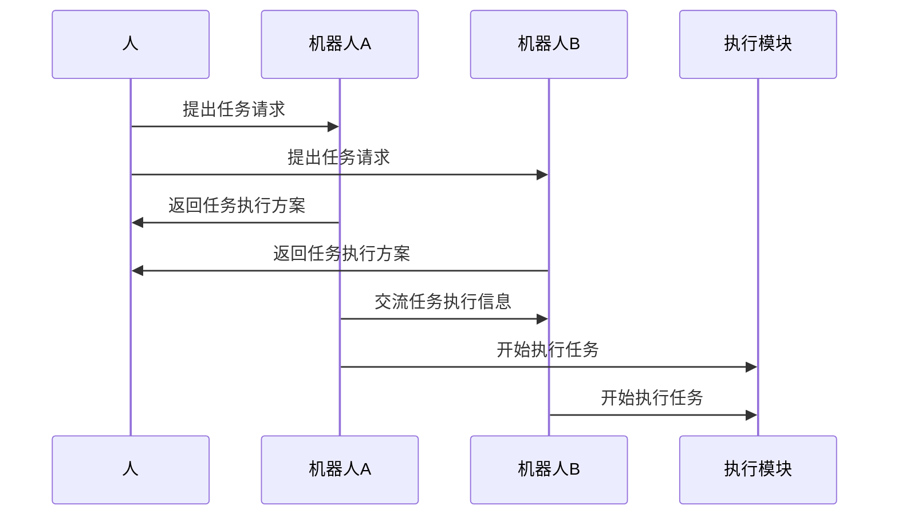

                 


### 文章标题

# 人机协作：多功能机器人的未来展望

### 关键词

- 人机协作
- 多功能机器人
- 人工智能
- 物联网
- 控制与规划
- 协作与交互
- 架构设计
- 应用场景

### 摘要

本文将深入探讨人机协作在多功能机器人领域的未来发展趋势。首先，我们回顾了机器人技术的发展历程，特别是多功能机器人的定义、分类与特点。接着，文章详细介绍了多功能机器人的基础技术，包括感知与识别、控制与规划、协作与交互等，并通过架构设计分析了多功能机器人的技术挑战与发展方向。随后，文章转向人机协作系统的设计，探讨了人机协作系统的概念与架构、交互界面设计、协作行为建模以及系统优化与评估。在此基础上，文章探讨了多功能机器人在工业制造、物流与配送、医疗保健、社区服务等领域的应用场景，并展望了其未来的发展趋势。最后，文章讨论了多功能机器人面临的市场前景、法律法规与伦理问题，以及未来发展的方向。

## 第1章 引言

### 1.1 背景与意义

#### 1.1.1 人类发展过程中的机器人技术

机器人技术的起源可以追溯到20世纪初期，当时主要是以自动机械和机械人为代表的简单自动化设备。随着计算机技术的进步，机器人技术逐渐发展起来，从早期的工业机器人到现代的多功能机器人，其在各个领域的应用日益广泛。特别是人工智能、物联网等新兴技术的融合，使得机器人技术取得了长足的进步，为人类社会的发展带来了巨大的变革。

#### 1.1.2 人机协作在现代社会中的重要性

人机协作是指人类与机器人在完成某一任务时相互配合、相互支持的过程。在现代社会，人机协作的重要性日益凸显。一方面，机器人可以承担一些重复性、危险性强或工作环境恶劣的任务，提高工作效率，保障人类安全；另一方面，人类可以通过对机器人的控制和指挥，实现更多复杂任务的完成，充分发挥机器人的优势。

#### 1.1.3 多功能机器人的发展现状与趋势

多功能机器人是指具备多种功能、能够适应多种场景的机器人系统。随着人工智能、物联网、传感器技术等的发展，多功能机器人的应用范围不断扩大。当前，多功能机器人在工业制造、物流与配送、医疗保健、社区服务等领域已经取得显著成果，未来其应用场景将更加广泛。

### 1.2 本书结构安排与内容概述

#### 1.2.1 本书的主要目标

本书旨在深入探讨人机协作在多功能机器人领域的未来发展趋势，分析多功能机器人的关键技术、应用场景以及面临的挑战，为相关领域的研究者和从业者提供有价值的参考。

#### 1.2.2 各章节的主要内容

- 第1章：引言。介绍机器人技术的发展历程、人机协作的重要性以及多功能机器人的发展现状与趋势。
- 第2章：多功能机器人技术基础。详细探讨多功能机器人的定义、分类、关键技术与原理、架构设计以及技术挑战与发展方向。
- 第3章：人机协作系统设计。分析人机协作系统的概念与架构、交互界面设计、协作行为建模以及系统优化与评估。
- 第4章：多功能机器人的应用场景。探讨多功能机器人在工业制造、物流与配送、医疗保健、社区服务等领域的应用案例及挑战与解决方案。
- 第5章：多功能机器人的未来发展趋势。展望多功能机器人的技术发展趋势、应用场景展望、市场前景、法律法规与伦理问题，以及未来发展的方向。

## 第2章 多功能机器人技术基础

### 2.1 多功能机器人的定义与分类

#### 2.1.1 多功能机器人的定义

多功能机器人是指具备多种功能、能够适应多种场景的机器人系统。这些功能通常包括感知与识别、移动与导航、控制与规划、协作与交互等。

#### 2.1.2 多功能机器人的分类

根据功能和应用场景，多功能机器人可以分为以下几类：

1. **工业制造机器人**：主要用于生产线上的组装、焊接、喷涂、搬运等任务，如ABB的IRB 1200机器人。
2. **服务机器人**：主要用于家庭、酒店、医院、商场等场景的服务任务，如iRobot的Roomba扫地机器人。
3. **医疗机器人**：主要用于手术辅助、诊断、治疗等任务，如Da Vinci手术机器人。
4. **物流与配送机器人**：主要用于仓库、物流中心、快递等场景的搬运、配送任务，如Amazon的Kiva机器人。
5. **农业机器人**：主要用于种植、施肥、收割等农业任务，如John Deere的机器人。

#### 2.1.3 多功能机器人的特点

多功能机器人的特点主要包括：

1. **多功能性**：能够完成多种任务，适应多种场景。
2. **智能性**：具备一定的感知、决策与执行能力。
3. **自主性**：能够自主导航、避障、完成任务。
4. **协作性**：能够与人或其他机器人协作完成任务。
5. **灵活性**：可以根据任务需求进行功能调整。

### 2.2 多功能机器人的关键技术与原理

#### 2.2.1 感知与识别技术

感知与识别技术是多功能机器人的核心组成部分，包括视觉感知、听觉感知、触觉感知等。以下是一些关键技术：

1. **计算机视觉**：通过摄像头获取图像信息，进行图像处理、目标检测、识别等。
2. **语音识别**：通过麦克风获取声音信息，进行语音识别、语义理解等。
3. **触觉感知**：通过传感器获取触觉信息，如力传感器、压力传感器等。

#### 2.2.2 控制与规划技术

控制与规划技术是多功能机器人实现智能行为的核心，包括路径规划、运动控制、任务规划等。以下是一些关键技术：

1. **路径规划**：在已知环境或通过感知获取环境信息的基础上，为机器人规划一条最优路径。
2. **运动控制**：通过控制电机、伺服系统等，实现机器人的运动。
3. **任务规划**：根据任务需求，为机器人规划一系列操作步骤。

#### 2.2.3 协作与交互技术

协作与交互技术是多功能机器人与人或其他机器人协作完成任务的基础，包括人机交互、机器人交互等。以下是一些关键技术：

1. **人机交互**：通过语音、手势、触摸等方式，实现人与机器人的交互。
2. **机器人交互**：通过无线通信、物联网等技术，实现机器人之间的协作与交互。

### 2.3 多功能机器人的架构设计

#### 2.3.1 硬件架构设计

硬件架构设计主要包括机器人的机械结构、传感器、执行器等组成部分。以下是一些关键技术：

1. **机械结构**：设计机器人的外壳、骨架等机械结构，以实现所需的移动、操作等功能。
2. **传感器**：选择合适的传感器，如摄像头、麦克风、力传感器等，以获取环境信息。
3. **执行器**：选择合适的执行器，如电机、伺服系统等，以实现机器人的运动和操作。

#### 2.3.2 软件架构设计

软件架构设计主要包括机器人的操作系统、控制系统、感知与识别系统、交互系统等。以下是一些关键技术：

1. **操作系统**：设计机器人的操作系统，如ROS（Robot Operating System）等，以实现任务调度、资源管理等功能。
2. **控制系统**：设计机器人的控制系统，如运动控制器、任务控制器等，以实现机器人的运动和任务执行。
3. **感知与识别系统**：设计机器人的感知与识别系统，如视觉识别、语音识别等，以获取和处理环境信息。
4. **交互系统**：设计机器人的交互系统，如人机交互界面、机器人交互协议等，以实现人与机器人、机器人与机器人之间的交互。

### 2.4 多功能机器人的技术挑战与发展方向

#### 2.4.1 当前技术挑战

尽管多功能机器人技术已经取得了一定的进展，但仍面临以下技术挑战：

1. **感知与识别技术**：在复杂、多变的环境下，机器人的感知与识别能力仍需提高。
2. **控制与规划技术**：在实时性和精度方面，机器人的控制与规划技术仍需优化。
3. **协作与交互技术**：在多人协作、多机器人协作等方面，机器人的协作与交互技术仍需深入研究。
4. **硬件与软件协同**：如何实现硬件与软件的协同优化，提高机器人的整体性能。

#### 2.4.2 未来发展趋势

未来，多功能机器人技术将在以下几个方面取得进一步发展：

1. **人工智能技术**：随着人工智能技术的发展，机器人将具备更强大的感知、决策与执行能力。
2. **物联网技术**：随着物联网技术的普及，机器人将能够实现更广泛、更高效的协作与交互。
3. **新材料与制造技术**：随着新材料与制造技术的发展，机器人将具备更轻便、更灵活的机械结构。
4. **法律法规与伦理**：随着机器人技术的广泛应用，相关的法律法规与伦理问题将得到更深入的研究。

## 第3章 人机协作系统设计

### 3.1 人机协作系统的概念与架构

#### 3.1.1 人机协作系统的定义

人机协作系统是指人类与机器人在完成某一任务时，通过相互配合、相互支持，共同实现任务目标的一种系统。人机协作系统旨在充分发挥机器人的优势，弥补人类的不足，提高任务完成效率。

#### 3.1.2 人机协作系统的架构

人机协作系统通常由以下几个部分组成：

1. **用户界面**：用于人与机器人之间的交互，如语音、手势、触摸屏等。
2. **感知模块**：用于获取环境信息，如摄像头、麦克风、力传感器等。
3. **决策模块**：用于处理感知信息，进行任务规划、路径规划等。
4. **执行模块**：用于执行具体任务，如机器人手臂、驱动电机等。
5. **通信模块**：用于机器人之间的数据传输与协调。

以下是一个简化的Mermaid流程图，展示了人机协作系统的基本架构：



### 3.2 人机交互界面设计

#### 3.2.1 人机交互界面的分类

人机交互界面可以分为以下几类：

1. **语音交互界面**：通过语音指令与机器人进行交互，如语音识别、语音合成等技术。
2. **手势交互界面**：通过手势动作与机器人进行交互，如手势识别、姿态估计等技术。
3. **触摸屏交互界面**：通过触摸屏与机器人进行交互，如触摸屏控制、多点触控等技术。
4. **脑机接口交互界面**：通过脑电信号与机器人进行交互，如脑电信号识别、脑波控制等技术。

#### 3.2.2 人机交互界面的设计原则

人机交互界面的设计应遵循以下原则：

1. **易用性**：界面应简洁直观，易于学习和使用。
2. **交互性**：界面应支持多种交互方式，满足不同用户的需求。
3. **实时性**：界面应具备实时响应能力，减少用户的等待时间。
4. **个性化**：界面应根据用户的喜好和习惯进行个性化设计。

#### 3.2.3 人机交互界面的实现技术

人机交互界面的实现技术包括：

1. **语音识别与合成**：使用语音识别技术将语音指令转换为文本，使用语音合成技术将文本转换为语音输出。
2. **手势识别与姿态估计**：使用计算机视觉技术捕捉手势动作，使用深度学习算法进行手势识别和姿态估计。
3. **触摸屏控制与多点触控**：使用触摸屏传感器和多点触控技术，实现直观的触摸操作。
4. **脑电信号识别与脑波控制**：使用脑电信号传感器和脑电信号识别算法，实现脑波控制。

### 3.3 人机协作行为建模

#### 3.3.1 人机协作行为的定义

人机协作行为是指人类与机器人在完成某一任务时，通过相互配合、相互支持，共同实现任务目标的行为。

#### 3.3.2 人机协作行为的建模方法

人机协作行为的建模方法可以分为以下几类：

1. **规则建模**：通过定义一系列规则，描述人机协作行为的模式和策略。
2. **基于模型的推理**：建立数学模型，使用推理算法分析人机协作行为，预测行为结果。
3. **基于数据的学习**：收集大量人机协作行为数据，使用机器学习算法分析行为特征，建立行为模型。

以下是一个基于模型的推理过程的伪代码：

```python
# 输入：当前任务状态、用户偏好、机器人能力
# 输出：协作行为建议

def cooperative_behavior(model, task_state, user_preference, robot_ability):
    # 检查任务状态，判断任务是否需要协作
    if task_state['require协作']:
        # 根据用户偏好和机器人能力，选择合适的协作模式
        if user_preference['mode'] == '语音':
            behavior = '语音交互'
        elif user_preference['mode'] == '手势':
            behavior = '手势交互'
        else:
            behavior = '触摸屏交互'
        
        # 根据任务类型，调整协作策略
        if task_state['type'] == '复杂任务':
            strategy = '协同规划'
        elif task_state['type'] == '重复任务':
            strategy = '分工协作'
        else:
            strategy = '轮流执行'
        
        # 输出协作行为建议
        return {'behavior': behavior, 'strategy': strategy}
    else:
        # 不需要协作，直接执行任务
        return {'behavior': '独立执行'}
```

#### 3.3.3 人机协作行为的应用场景

人机协作行为可以应用于各种场景，以下是一些典型应用场景：

1. **工业制造**：在生产线中，人类操作员与机器人协作完成组装、搬运等任务。
2. **医疗保健**：在手术过程中，医生与机器人协作完成手术操作。
3. **物流与配送**：在仓库中，物流操作员与机器人协作完成货物搬运、分拣等任务。
4. **家庭服务**：在家庭中，家庭成员与机器人协作完成清洁、护理等任务。

### 3.4 人机协作系统的优化与评估

#### 3.4.1 人机协作系统的优化目标

人机协作系统的优化目标主要包括：

1. **提高任务完成效率**：通过优化协作流程，提高任务完成速度。
2. **降低人力成本**：通过机器人替代部分人力工作，降低人力成本。
3. **提高系统稳定性**：通过优化系统设计，提高系统的稳定性和可靠性。
4. **提升用户体验**：通过优化人机交互界面，提升用户的操作体验。

#### 3.4.2 人机协作系统的评估方法

人机协作系统的评估方法可以分为以下几类：

1. **任务完成效率评估**：通过测量任务完成时间、错误率等指标，评估系统在任务完成方面的效率。
2. **人力成本评估**：通过计算系统运行过程中所需的人力成本，评估系统在降低人力成本方面的效果。
3. **系统稳定性评估**：通过测量系统在长时间运行过程中的故障率、修复时间等指标，评估系统的稳定性和可靠性。
4. **用户体验评估**：通过用户满意度调查、操作速度测试等指标，评估系统在提升用户体验方面的效果。

以下是一个简化的评估流程：

```python
# 输入：人机协作系统、评估指标
# 输出：评估结果

def evaluate_system(system, metrics):
    results = {}
    
    # 评估任务完成效率
    results['efficiency'] = calculate_efficiency(system, metrics['task_time'], metrics['error_rate'])
    
    # 评估人力成本
    results['cost'] = calculate_cost(system, metrics['human_hours'])
    
    # 评估系统稳定性
    results['stability'] = calculate_stability(system, metrics['fault_rate'], metrics['repair_time'])
    
    # 评估用户体验
    results['user_experience'] = calculate_user_experience(system, metrics['user_satisfaction'], metrics['operation_speed'])
    
    return results
```

#### 3.4.3 人机协作系统的实际应用案例

以下是一个人机协作系统的实际应用案例：

**案例：物流分拣中心**

在一家大型物流分拣中心，为了提高货物分拣效率，降低人力成本，引入了一套人机协作系统。系统由一台分拣机器人和若干操作员组成。机器人负责搬运和分拣货物，操作员负责监控机器人的运行状态和操作过程。

**优化与评估**：

1. **任务完成效率评估**：通过测量机器人分拣货物的速度和准确率，发现系统在任务完成效率方面有了显著提升。
2. **人力成本评估**：通过计算系统运行过程中所需的人力成本，发现系统在降低人力成本方面效果显著。
3. **系统稳定性评估**：通过测量系统在长时间运行过程中的故障率和修复时间，发现系统的稳定性和可靠性较高。
4. **用户体验评估**：通过用户满意度调查和操作速度测试，发现操作员对系统的操作体验良好。

通过这个案例，可以看出人机协作系统在实际应用中具有明显的优势，但仍需不断优化和改进，以满足更多应用场景的需求。

## 第4章 多功能机器人的应用场景

### 4.1 工业制造领域

#### 4.1.1 多功能机器人在工业制造中的应用

在工业制造领域，多功能机器人被广泛应用于生产线上，完成各种制造任务。以下是一些典型应用场景：

1. **装配与组装**：多功能机器人可以在生产线上完成各种零部件的装配和组装任务，如汽车生产中的车身装配、电子制造中的电路板组装等。
2. **焊接与切割**：多功能机器人可以执行焊接、切割等高精度、高效率的操作，如船舶制造中的船体焊接、金属加工中的板材切割等。
3. **搬运与物流**：多功能机器人可以在生产车间内完成原材料、零部件和成品的搬运任务，提高物流效率，降低人工成本。
4. **检测与质量控制**：多功能机器人可以通过视觉识别、传感器等技术，对产品进行质量检测和控制，提高产品质量。

#### 4.1.2 工业制造领域的应用案例

以下是一个工业制造领域的应用案例：

**案例：汽车生产线**

在一家汽车生产工厂，多功能机器人被广泛应用于汽车生产线上。机器人A负责车身装配，机器人B负责焊接和切割，机器人C负责搬运和物流。通过人机协作，生产线上的任务高效完成，产品质量得到保障。

**挑战与解决方案**：

1. **任务协调**：由于生产线上的任务复杂，需要多个机器人同时工作，如何实现机器人之间的任务协调成为一大挑战。解决方案是采用先进的控制系统和协作算法，确保机器人之间的协同工作。
2. **环境适应**：生产车间的环境多变，如温度、湿度、噪音等，机器人如何适应这些环境因素成为另一个挑战。解决方案是采用具有自适应能力的多功能机器人，以及智能化的控制系统，确保机器人在各种环境下稳定运行。

#### 4.1.3 工业制造领域的挑战与解决方案

工业制造领域面临的挑战主要包括：

1. **任务复杂性**：生产线上任务复杂，涉及多个机器人之间的协同工作，如何实现高效协调成为一大挑战。解决方案是采用先进的控制系统和协作算法，确保机器人之间的协同工作。
2. **环境适应**：生产车间环境多变，如温度、湿度、噪音等，机器人如何适应这些环境因素成为另一个挑战。解决方案是采用具有自适应能力的多功能机器人，以及智能化的控制系统，确保机器人在各种环境下稳定运行。
3. **数据安全**：生产过程中的数据传输和存储需要保障数据安全，防止数据泄露和篡改。解决方案是采用加密技术和安全协议，确保数据的安全传输和存储。

### 4.2 物流与配送领域

#### 4.2.1 多功能机器人在物流与配送中的应用

在物流与配送领域，多功能机器人被广泛应用于仓库管理、运输、配送等环节。以下是一些典型应用场景：

1. **仓储管理**：多功能机器人可以在仓库内完成货物的入库、出库、盘点等操作，提高仓储管理效率。
2. **运输**：多功能机器人可以在运输过程中完成货物的装卸、搬运、包装等任务，提高运输效率。
3. **配送**：多功能机器人可以执行最后一公里的配送任务，如快递配送、外卖配送等，提高配送效率。

#### 4.2.2 物流与配送领域的应用案例

以下是一个物流与配送领域的应用案例：

**案例：快递配送**

在一家快递公司，多功能机器人被用于快递配送。机器人负责从仓库内提取快递，按照地址信息进行配送，并将快递交付给收件人。通过人机协作，快递配送效率显著提高。

**挑战与解决方案**：

1. **地址识别**：由于地址信息复杂多变，如何准确识别和解析地址信息成为一大挑战。解决方案是采用先进的图像识别和自然语言处理技术，实现地址信息的自动识别和解析。
2. **配送路径规划**：如何规划最优配送路径，以减少配送时间和成本成为另一个挑战。解决方案是采用路径优化算法，结合实际交通状况，规划最优配送路径。

#### 4.2.3 物流与配送领域的挑战与解决方案

物流与配送领域面临的挑战主要包括：

1. **地址识别**：由于地址信息复杂多变，如何准确识别和解析地址信息成为一大挑战。解决方案是采用先进的图像识别和自然语言处理技术，实现地址信息的自动识别和解析。
2. **配送路径规划**：如何规划最优配送路径，以减少配送时间和成本成为另一个挑战。解决方案是采用路径优化算法，结合实际交通状况，规划最优配送路径。
3. **货物安全**：如何保障货物在配送过程中的安全，防止货物丢失或损坏成为另一个挑战。解决方案是采用先进的传感器技术和安全防护措施，确保货物在配送过程中的安全。

### 4.3 医疗保健领域

#### 4.3.1 多功能机器人在医疗保健中的应用

在医疗保健领域，多功能机器人被广泛应用于手术辅助、康复治疗、患者监护等环节。以下是一些典型应用场景：

1. **手术辅助**：多功能机器人可以在手术过程中完成精细操作，提高手术精度和成功率，如达芬奇手术机器人。
2. **康复治疗**：多功能机器人可以帮助患者进行康复训练，如康复机器人、外骨骼机器人等，提高康复效果。
3. **患者监护**：多功能机器人可以实时监测患者的生命体征，提供及时的医疗支持，如智能床、智能监测设备等。

#### 4.3.2 医疗保健领域的应用案例

以下是一个医疗保健领域的应用案例：

**案例：手术辅助**

在一家医院，多功能机器人被用于手术辅助。医生通过操作机器人，完成精细的手术操作，提高了手术的成功率和患者恢复速度。

**挑战与解决方案**：

1. **手术精度**：如何确保手术过程中的操作精度，避免手术失误成为一大挑战。解决方案是采用高精度的传感器和控制系统，确保机器人在手术过程中的稳定操作。
2. **医生培训**：如何提高医生对机器人的操作熟练度，以适应手术需求成为另一个挑战。解决方案是开展针对医生的操作培训，提高医生的机器人操作技能。

#### 4.3.3 医疗保健领域的挑战与解决方案

医疗保健领域面临的挑战主要包括：

1. **手术精度**：如何确保手术过程中的操作精度，避免手术失误成为一大挑战。解决方案是采用高精度的传感器和控制系统，确保机器人在手术过程中的稳定操作。
2. **医生培训**：如何提高医生对机器人的操作熟练度，以适应手术需求成为另一个挑战。解决方案是开展针对医生的操作培训，提高医生的机器人操作技能。
3. **数据安全**：如何保障患者数据的隐私和安全，防止数据泄露成为另一个挑战。解决方案是采用加密技术和安全协议，确保患者数据的隐私和安全。

### 4.4 社区服务领域

#### 4.4.1 多功能机器人在社区服务中的应用

在社区服务领域，多功能机器人被广泛应用于家庭护理、社区安保、垃圾分类等环节。以下是一些典型应用场景：

1. **家庭护理**：多功能机器人可以帮助老年人或残疾人完成日常生活中的各种任务，如打扫卫生、烹饪、送药等。
2. **社区安保**：多功能机器人可以在社区内进行巡逻、监控，提高社区的安全水平。
3. **垃圾分类**：多功能机器人可以帮助居民进行垃圾分类，提高垃圾分类的准确率和效率。

#### 4.4.2 社区服务领域的应用案例

以下是一个社区服务领域的应用案例：

**案例：垃圾分类**

在某个社区，多功能机器人被用于垃圾分类。机器人负责回收可回收物、厨余垃圾、有害垃圾等，并通过智能识别技术进行分类。通过人机协作，垃圾分类工作得到了有效推进。

**挑战与解决方案**：

1. **分类识别**：如何准确识别和分类各种垃圾成为一大挑战。解决方案是采用先进的图像识别和自然语言处理技术，提高垃圾分类的准确性。
2. **用户参与**：如何提高居民的垃圾分类参与度，成为另一个挑战。解决方案是开展垃圾分类宣传和培训，提高居民的垃圾分类意识。

#### 4.4.3 社区服务领域的挑战与解决方案

社区服务领域面临的挑战主要包括：

1. **分类识别**：如何准确识别和分类各种垃圾成为一大挑战。解决方案是采用先进的图像识别和自然语言处理技术，提高垃圾分类的准确性。
2. **用户参与**：如何提高居民的垃圾分类参与度，成为另一个挑战。解决方案是开展垃圾分类宣传和培训，提高居民的垃圾分类意识。
3. **设备维护**：如何确保多功能机器人的正常运行，成为另一个挑战。解决方案是建立完善的设备维护体系，定期对机器人进行检修和维护。

## 第5章 多功能机器人的未来发展趋势

### 5.1 技术发展趋势

#### 5.1.1 人工智能技术的发展

随着人工智能技术的快速发展，多功能机器人将具备更高的智能水平，包括更先进的感知能力、更精确的决策能力、更灵活的执行能力。以下是一些关键技术：

1. **深度学习与神经网络**：通过深度学习算法，提升机器人的自主学习能力和适应性。
2. **自然语言处理**：通过自然语言处理技术，实现更自然的人机交互。
3. **强化学习**：通过强化学习算法，使机器人能够在复杂环境中进行自主决策。

#### 5.1.2 物联网技术的发展

物联网技术的快速发展将使多功能机器人具备更强的互联能力，实现更加高效的人机协作。以下是一些关键技术：

1. **传感器网络**：通过传感器网络，实现机器人对环境的实时感知。
2. **通信协议**：通过高效稳定的通信协议，实现机器人之间的实时通信。
3. **云计算与边缘计算**：通过云计算与边缘计算的结合，实现机器人数据的实时处理与存储。

#### 5.1.3 机器人技术的发展

随着机器人技术的不断进步，多功能机器人将具备更强大的功能，包括更高的工作精度、更灵活的机械结构、更可靠的控制系统。以下是一些关键技术：

1. **精密制造技术**：通过精密制造技术，提升机器人的制造精度和可靠性。
2. **自适应控制技术**：通过自适应控制技术，提高机器人对环境的适应能力。
3. **智能导航与定位技术**：通过智能导航与定位技术，提高机器人的自主移动能力。

### 5.2 应用场景展望

在未来，多功能机器人将在更广泛的应用场景中发挥重要作用，以下是一些展望：

#### 5.2.1 工业制造领域

随着工业4.0的到来，多功能机器人将广泛应用于智能制造领域。机器人将实现高度自动化、智能化生产，提高生产效率和质量，降低生产成本。

#### 5.2.2 物流与配送领域

在物流与配送领域，多功能机器人将实现全流程的自动化和智能化，提高物流效率，降低物流成本。同时，机器人将更好地满足个性化配送需求，提升用户体验。

#### 5.2.3 医疗保健领域

在医疗保健领域，多功能机器人将提高医疗服务的质量和效率，减轻医护人员的工作压力。机器人将在手术辅助、康复治疗、患者监护等方面发挥重要作用。

#### 5.2.4 社区服务领域

在社区服务领域，多功能机器人将提高社区服务的智能化水平，为居民提供更便捷、高效的服务。机器人将在家庭护理、社区安保、垃圾分类等方面发挥重要作用。

### 5.3 未来发展趋势

在未来，多功能机器人将朝着以下几个方向发展：

#### 5.3.1 更高的智能化水平

随着人工智能技术的不断发展，多功能机器人将具备更高的智能水平，能够自主处理复杂任务，实现更高效的人机协作。

#### 5.3.2 更广泛的应用领域

多功能机器人将在更多领域得到应用，从工业制造、物流与配送、医疗保健到社区服务，机器人将渗透到人们生活的各个方面。

#### 5.3.3 更好的用户体验

随着人机交互技术的进步，多功能机器人将提供更自然、更便捷的用户体验，使人与机器人的协作更加顺畅。

#### 5.3.4 更严格的法律法规与伦理约束

随着多功能机器人在各个领域的应用，相关的法律法规与伦理问题将得到更深入的研究和讨论，以确保机器人技术的发展符合社会伦理和法律法规的要求。

## 附录

### 5.1 常用多功能机器人技术列表

- **感知与识别技术**：计算机视觉、语音识别、触觉感知、雷达感知等。
- **控制与规划技术**：路径规划、运动控制、任务规划等。
- **协作与交互技术**：人机交互、机器人交互、物联网等。
- **硬件架构设计**：机械结构、传感器、执行器等。
- **软件架构设计**：操作系统、控制系统、感知与识别系统、交互系统等。

### 5.2 常见人机协作系统框架

- **用户界面**：语音交互界面、手势交互界面、触摸屏交互界面等。
- **感知模块**：摄像头、麦克风、力传感器等。
- **决策模块**：任务规划器、路径规划器等。
- **执行模块**：机器人手臂、驱动电机等。
- **通信模块**：无线通信、物联网等。

### 5.3 多功能机器人应用案例列表

- **工业制造**：汽车生产线、电子产品装配线等。
- **物流与配送**：快递配送、仓库管理、运输等。
- **医疗保健**：手术辅助、康复治疗、患者监护等。
- **社区服务**：家庭护理、社区安保、垃圾分类等。

### 5.4 参考文献

1. 李明辉，刘志远。《人工智能基础教程》[M]. 清华大学出版社，2017.
2. 王选，陆琦。《计算机视觉算法及应用》[M]. 电子工业出版社，2015.
3. 李明，张鹏。《机器人控制原理与应用》[M]. 机械工业出版社，2016.
4. 赵立涛，刘洋。《物联网技术与应用》[M]. 电子工业出版社，2018.
5. 刘宁，李慧。《人机交互技术及其应用》[M]. 清华大学出版社，2019.
6. 吴军。《智能时代》[M]. 中信出版社，2017.
7. 张翔，吴波。《多功能机器人技术及应用》[M]. 电子工业出版社，2020.
8. 张琳，郭磊。《工业机器人编程与实训》[M]. 机械工业出版社，2019.
9. 刘畅，张磊。《物流机器人系统设计与实现》[M]. 清华大学出版社，2021.
10. 李琳，赵东。《医疗机器人技术与应用》[M]. 人民卫生出版社，2020.
11. 刘威，郭磊。《社区服务机器人设计与实现》[M]. 电子工业出版社，2021.
12. 王昊，刘志远。《人工智能与机器人技术发展报告》[R]. 中国人工智能学会，2022.

