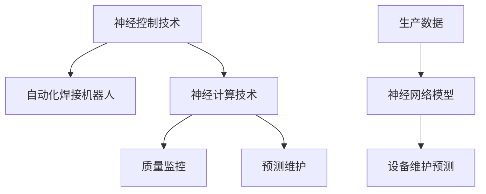
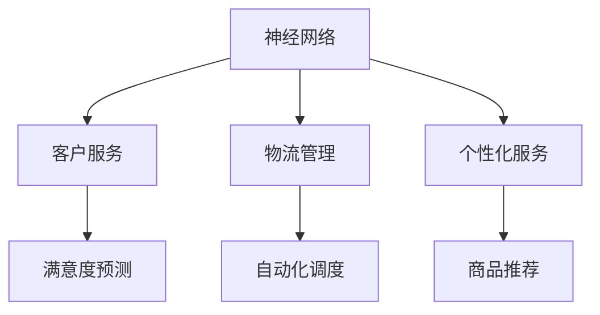
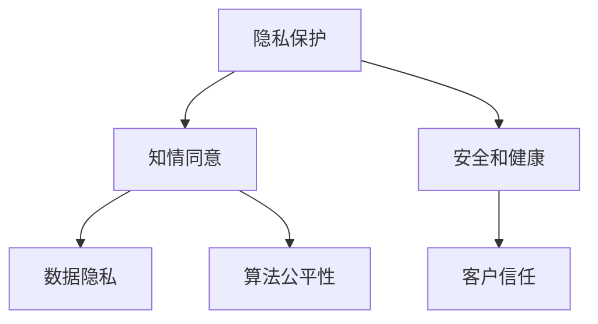
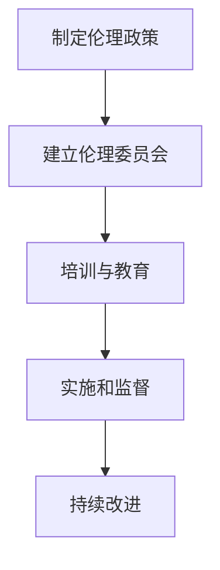
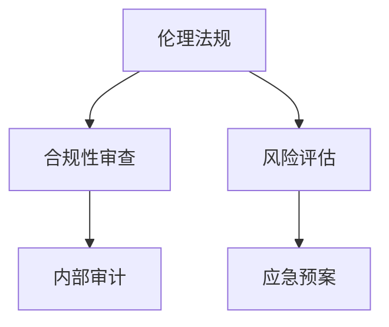
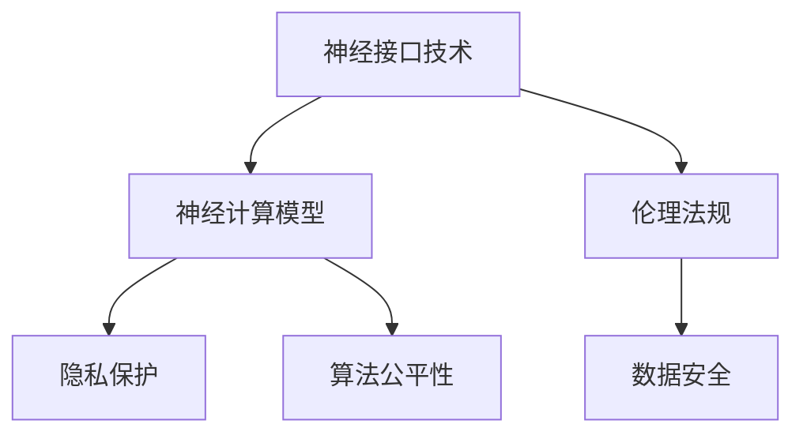

                 


### 步骤1：引论

**1.1 人机融合的概念与历史**

**定义**

人机融合，又称人机交互，是指通过技术手段实现人与机器之间的无缝交互，使人能够更加自然、高效地控制和使用机器。人机融合涵盖了多个领域，包括人工智能、生物工程、神经科学等。

**发展历程**

人机融合的发展历程可以追溯到20世纪50年代，当时计算机刚刚起步。随着计算机技术的不断进步，人机交互逐渐从键盘和鼠标发展到触摸屏、语音识别、手势控制等多种形式。

**关键技术**

- **生物传感器**：生物传感器是捕捉人体生物信号的重要工具，如脑电图（EEG）、肌电图（EMG）等。
- **神经接口**：神经接口技术是将生物传感器与计算机直接相连，实现脑机接口（BCI）或眼机接口（BCI）等。
- **人工智能**：人工智能在增强人机融合能力方面发挥着重要作用，通过机器学习算法，计算机可以更好地理解人类意图和行为。

**1.2 神经科技的概念与分类**

**定义**

神经科技是研究神经系统及其功能，并利用这些知识来开发新技术、新系统的学科。它涉及到神经生物学、神经工程、计算神经科学等多个领域。

**分类**

- **神经成像**：利用各种成像技术，如功能性磁共振成像（fMRI）、正电子发射断层扫描（PET）等，研究大脑结构和功能。
- **神经调控**：通过电刺激、药物调控等方法，调节神经系统的活动。
- **神经接口**：建立大脑与外部设备之间的直接连接，实现信息交换和控制。
- **神经计算**：模拟神经系统结构和功能，开发新型计算模型和算法。

**发展趋势**

随着神经科技的发展，未来的趋势将包括更高精度、更便捷、更智能的神经接口技术，以及更加融合的神经计算模型。

**1.3 神经科技在企业中的应用**

神经科技在企业中的应用日益广泛，涉及生产、服务、管理等多个领域。

- **制造业**：神经科技可用于生产线自动化、质量控制、预测维护等。
- **服务业**：神经科技可以提升客户服务体验，如智能客服、个性化推荐等。
- **企业管理**：神经科技可以用于员工绩效评估、工作压力监测等。

**总结**

人机融合和神经科技为企业带来了巨大的变革机遇，同时也带来了新的伦理挑战。在接下来的章节中，我们将深入探讨神经科技在企业中的具体应用，以及相应的伦理问题。

**图1-1：人机融合与神经科技的核心概念关系架构**

```mermaid
graph TD
    A[人机融合] --> B[生物传感器]
    A --> C[神经接口]
    A --> D[人工智能]
    B --> E[脑电图(EEG)]
    B --> F[肌电图(EMG)]
    C --> G[脑机接口(BCI)]
    C --> H[眼机接口(BCI)]
    D --> I[机器学习]
    D --> J[深度学习]
```

### 步骤2：神经科技在企业中的应用

**2.1 神经科技在制造业的应用**

**2.1.1 神经控制技术在生产线中的应用**

神经控制技术是一种利用生物信号控制机器的技术。在生产线上，神经控制技术可以用于自动化控制设备，提高生产效率和质量。

**案例：**

某汽车制造厂引入了基于神经控制技术的自动化焊接机器人。这些机器人通过捕捉工人的肌电图信号，实时调整焊接参数，实现了自动化焊接过程的精确控制。这不仅提高了生产效率，还减少了人力成本和焊接缺陷。

**原理讲解：**

神经控制技术的基本原理是通过传感器捕捉生物信号（如肌电图），然后通过信号处理和模式识别算法，将这些信号转换为控制指令，从而实现对机器人的控制。

**伪代码示例：**

```python
def control_robot(my_signals):
    """
    控制机器人根据生物信号调整焊接参数
    """
    # 信号处理
    processed_signals = process_signals(my_signals)
    
    # 模式识别
    welding_params = recognize_welding_params(processed_signals)
    
    # 发送控制指令
    robot.control(welding_params)
    
    return welding_params
```

**数学模型和公式：**

神经控制技术的核心是信号处理和模式识别。信号处理可以采用滤波、傅里叶变换等方法，而模式识别则可以采用神经网络、支持向量机等算法。

$$
Y = f(X)
$$

其中，$X$代表输入信号，$Y$代表输出信号，$f$代表信号处理和模式识别的函数。

**举例说明：**

假设机器人需要根据工人的肌电图信号调整焊接温度。通过信号处理和模式识别，可以将肌电图信号转换为焊接温度的数值，从而实现自动化焊接。

**2.1.2 神经计算技术在质量管理中的应用**

神经计算技术可以用于质量管理中的故障检测和预测。通过分析生产过程中的数据，神经计算模型可以预测产品出现故障的概率，从而提前采取措施。

**案例：**

某电子产品制造企业利用神经网络技术进行质量监控。通过对生产过程中的传感器数据进行实时分析，神经网络模型可以预测产品质量问题，并在问题发生前采取纠正措施，提高了产品质量。

**原理讲解：**

神经计算技术的基本原理是通过训练大量的历史数据，构建一个神经网络模型。这个模型可以自动学习和识别数据中的规律和模式，从而进行预测和分类。

**伪代码示例：**

```python
def predict_fault(data):
    """
    使用神经网络预测产品质量问题
    """
    # 加载训练好的神经网络模型
    model = load_model('fault_prediction_model')
    
    # 预处理数据
    processed_data = preprocess_data(data)
    
    # 预测故障
    prediction = model.predict(processed_data)
    
    return prediction
```

**数学模型和公式：**

神经计算技术的核心是神经网络模型。神经网络模型通过多层神经元进行数据处理，最终输出预测结果。

$$
\hat{y} = \sigma(W_L \cdot \sigma(... \sigma(W_2 \cdot \sigma(W_1 \cdot x) + b_1) + b_2) ... + b_L)
$$

其中，$\sigma$代表激活函数，$W$和$b$代表权重和偏置。

**举例说明：**

假设神经网络模型训练完成后，输入一组生产数据，模型可以预测该批产品的质量是否合格。

**2.1.3 神经网络在预测维护中的应用**

神经网络可以用于预测设备的维护需求，从而提高设备的运行效率和减少故障率。

**案例：**

某电力公司利用神经网络技术进行设备维护预测。通过对设备的运行数据进行实时分析，神经网络模型可以预测设备的故障时间，从而提前安排维护计划。

**原理讲解：**

神经网络在预测维护中的应用主要基于故障诊断和预测算法。通过分析设备的历史数据，神经网络模型可以识别设备故障的早期迹象，从而进行预测。

**伪代码示例：**

```python
def predict_maintenance(data):
    """
    使用神经网络预测设备维护时间
    """
    # 加载训练好的神经网络模型
    model = load_model('maintenance_prediction_model')
    
    # 预处理数据
    processed_data = preprocess_data(data)
    
    # 预测维护时间
    maintenance_time = model.predict(processed_data)
    
    return maintenance_time
```

**数学模型和公式：**

神经网络在预测维护中的应用同样依赖于多层神经网络模型。通过训练，模型可以学习到设备运行与故障之间的复杂关系，从而进行预测。

$$
\hat{y} = \sigma(W_L \cdot \sigma(... \sigma(W_2 \cdot \sigma(W_1 \cdot x) + b_1) + b_2) ... + b_L)
$$

**举例说明：**

假设神经网络模型训练完成后，输入一组设备运行数据，模型可以预测该设备的下一次故障时间。

**总结**

神经科技在制造业中的应用涵盖了从生产控制到质量管理再到预测维护的多个方面。通过利用神经控制技术、神经计算技术和神经网络模型，企业可以实现生产过程的自动化、高效化和智能化。

**图2-1：神经科技在制造业中的应用架构**



### 步骤3：神经科技在服务业的应用

**2.2 神经科技在服务业的应用**

神经科技在服务业中的应用正日益扩大，尤其是在提升客户服务体验和优化企业管理方面。

**2.2.1 神经网络在客户服务中的应用**

神经网络技术可以显著提升客户服务的效率和质量。通过分析客户的反馈和行为，神经网络模型可以提供更加个性化的服务建议。

**案例：**

某电子商务平台利用神经网络技术优化客户服务。通过对客户的历史订单、浏览记录和评价进行分析，神经网络模型可以预测客户的满意度，并提供相应的改进建议。例如，当客户对某个产品评价较低时，系统会自动推荐其他类似产品，以提高客户满意度。

**原理讲解：**

神经网络在客户服务中的应用基于大数据分析和预测算法。通过收集和分析大量的客户数据，神经网络模型可以学习到客户的行为模式，从而提供个性化的服务。

**伪代码示例：**

```python
def predict_customer_satisfaction(data):
    """
    使用神经网络预测客户满意度
    """
    # 加载训练好的神经网络模型
    model = load_model('customer_satisfaction_model')
    
    # 预处理数据
    processed_data = preprocess_data(data)
    
    # 预测客户满意度
    satisfaction_score = model.predict(processed_data)
    
    return satisfaction_score
```

**数学模型和公式：**

神经网络在客户服务中的应用依赖于多层感知器（MLP）模型。MLP模型通过多层神经元进行数据处理，最终输出客户满意度的预测分数。

$$
\hat{y} = \sigma(W_L \cdot \sigma(... \sigma(W_2 \cdot \sigma(W_1 \cdot x) + b_1) + b_2) ... + b_L)
$$

**举例说明：**

假设神经网络模型训练完成后，输入一组客户数据，模型可以预测该客户的满意度，并据此提供改进建议。

**2.2.2 神经控制技术在物流管理中的应用**

神经控制技术可以用于物流管理中的自动化调度和路径优化。通过分析运输数据和物流需求，神经控制模型可以自动生成最优的运输计划和路径。

**案例：**

某物流公司引入了基于神经控制技术的自动化调度系统。该系统能够实时分析运输数据，根据交通状况、货物类型和目的地等参数，自动生成最优的运输路径和调度计划，提高了物流效率。

**原理讲解：**

神经控制技术的基本原理是通过传感器捕捉运输数据，然后通过信号处理和模式识别算法，生成最优的调度和路径计划。

**伪代码示例：**

```python
def optimize_dispatch(data):
    """
    使用神经网络优化运输调度
    """
    # 加载训练好的神经网络模型
    model = load_model('dispatch_optimization_model')
    
    # 预处理数据
    processed_data = preprocess_data(data)
    
    # 生成最优调度计划
    dispatch_plan = model.optimize(processed_data)
    
    return dispatch_plan
```

**数学模型和公式：**

神经控制技术在物流管理中的应用依赖于优化算法，如遗传算法、粒子群优化算法等。这些算法通过迭代计算，寻找最优解。

$$
\min \sum_{i=1}^{N} (f(x_i) - y_i)^2
$$

其中，$x_i$代表决策变量，$y_i$代表目标函数值，$f(x_i)$代表目标函数。

**举例说明：**

假设神经网络模型训练完成后，输入一组物流数据，模型可以生成最优的运输调度计划，从而提高物流效率。

**2.2.3 神经计算技术在个性化服务中的应用**

神经计算技术可以用于个性化服务中的推荐系统和智能客服。通过分析用户的行为和偏好，神经计算模型可以提供个性化的推荐和咨询服务。

**案例：**

某在线购物平台利用神经计算技术优化推荐系统。通过对用户的历史购买记录、浏览行为和评价进行分析，神经计算模型可以预测用户可能感兴趣的商品，并提供个性化的购物推荐。

**原理讲解：**

神经计算技术在个性化服务中的应用基于深度学习算法。通过训练大量的用户数据，深度学习模型可以学习到用户的偏好模式，从而进行个性化推荐。

**伪代码示例：**

```python
def recommend_products(user_data):
    """
    使用神经网络推荐商品
    """
    # 加载训练好的神经网络模型
    model = load_model('product_recommendation_model')
    
    # 预处理用户数据
    processed_data = preprocess_data(user_data)
    
    # 推荐商品
    recommended_products = model.recommend(processed_data)
    
    return recommended_products
```

**数学模型和公式：**

神经计算技术在个性化服务中的应用依赖于神经网络模型。通过多层神经网络，模型可以自动学习和识别用户的行为和偏好。

$$
\hat{y} = \sigma(W_L \cdot \sigma(... \sigma(W_2 \cdot \sigma(W_1 \cdot x) + b_1) + b_2) ... + b_L)
$$

**举例说明：**

假设神经网络模型训练完成后，输入一组用户数据，模型可以推荐用户可能感兴趣的商品。

**总结**

神经科技在服务业中的应用极大地提升了客户服务体验和物流管理效率。通过利用神经网络、神经控制技术和神经计算模型，企业可以提供更加个性化、高效的服务，从而在竞争激烈的市场中脱颖而出。

**图2-2：神经科技在服务业中的应用架构**



### 步骤4：伦理应用案例分析

**3.1 案例分析一：企业A的人机融合项目**

**3.1.1 项目背景**

企业A是一家领先的高科技企业，致力于通过人机融合技术提升生产效率和产品质量。在项目启动初期，企业面临的主要挑战是如何在保证生产效率的同时，确保员工的人身安全和心理健康。

**3.1.2 项目实施过程**

- **需求分析**：企业首先对现有的生产线进行了详细的调研，识别出了潜在的人机融合应用点。通过与员工的沟通，企业了解了员工对新技术的主观感受和期望。
- **技术选型**：企业选用了基于脑电图（EEG）的脑机接口（BCI）技术，通过实时监测员工的脑电信号，实现生产过程的自动化控制。
- **系统开发**：企业开发了一套人机融合系统，包括脑电信号采集模块、信号处理模块、控制系统和反馈模块。系统通过实时分析脑电信号，自动调整生产参数，从而实现自动化控制。
- **试点运行**：企业在一条生产线进行了试点运行，对系统进行了多次迭代优化，确保系统稳定可靠。

**3.1.3 伦理挑战与应对策略**

- **伦理挑战**：
  1. **隐私保护**：脑电信号的采集和处理涉及员工的隐私，如何确保这些数据的安全和使用合规是项目面临的首要问题。
  2. **知情同意**：员工对参与人机融合项目是否有充分的知情权，如何确保员工自愿参与是项目实施的伦理挑战。
  3. **安全和健康**：人机融合技术的应用可能会对员工的心理和生理健康产生影响，如何确保员工的身心健康是项目需要解决的问题。
- **应对策略**：
  1. **隐私保护**：企业制定了严格的隐私保护政策，对采集到的脑电信号进行加密存储，并限制只有授权人员可以访问。同时，企业承诺不会将员工的个人信息用于其他商业用途。
  2. **知情同意**：企业通过详细的员工培训，使员工了解人机融合技术的原理、目的和潜在风险，确保员工在充分知情的情况下自愿参与。
  3. **安全和健康**：企业定期对员工进行健康检查，确保员工在参与项目时处于健康状态。同时，企业提供了心理健康咨询和支持，以应对可能的心理压力。

**3.2 案例分析二：企业B的神经科技应用**

**3.2.1 项目背景**

企业B是一家专注于智能物流解决方案的企业，希望通过引入神经科技提升物流效率。在项目启动初期，企业面临的主要挑战是如何在保证物流效率的同时，确保数据的隐私和安全。

**3.2.2 项目实施过程**

- **需求分析**：企业首先对现有的物流系统进行了详细的调研，识别出了潜在的应用点。通过与客户的沟通，企业了解了客户对智能物流服务的期望。
- **技术选型**：企业选用了基于神经网络的物流调度和路径优化系统，通过实时分析运输数据和物流需求，实现最优的调度和路径计划。
- **系统开发**：企业开发了一套物流优化系统，包括数据采集模块、数据处理模块、调度模块和路径优化模块。系统通过实时分析运输数据，自动生成最优的调度和路径计划。
- **试点运行**：企业在部分物流线路进行了试点运行，对系统进行了多次迭代优化，确保系统稳定可靠。

**3.2.3 伦理问题与解决方案**

- **伦理问题**：
  1. **数据隐私**：物流过程中涉及大量的客户数据，如何确保这些数据的安全和使用合规是项目面临的首要问题。
  2. **算法公平性**：神经网络模型在优化调度和路径计划时，可能会对某些客户数据产生偏见，如何确保算法的公平性是项目需要解决的问题。
  3. **客户信任**：客户对智能物流服务的接受程度和信任度，如何建立和维护客户信任是项目需要解决的问题。
- **解决方案**：
  1. **数据隐私**：企业制定了严格的数据隐私保护政策，对采集到的物流数据进行加密存储，并限制只有授权人员可以访问。同时，企业承诺不会将客户的物流信息用于其他商业用途。
  2. **算法公平性**：企业通过多样化的数据集进行模型训练，确保神经网络模型不会对特定群体产生偏见。此外，企业还定期对模型进行审核和优化，以确保算法的公平性。
  3. **客户信任**：企业通过透明的沟通和优质的服务，建立了与客户的信任关系。企业定期向客户通报物流服务的优化进展，并邀请客户参与项目评估，以增强客户的信任度。

**总结**

人机融合和神经科技的应用在带来巨大效益的同时，也带来了一系列伦理挑战。通过制定严格的伦理政策、采取有效的应对措施，企业可以最大限度地减少伦理风险，实现可持续发展。

**图3-1：人机融合与神经科技应用中的伦理挑战**



### 步骤5：企业伦理体系建设

**4.1 企业伦理体系的重要性**

企业伦理体系是企业核心价值观和道德行为的制度化体现，对于企业的长期发展和员工的工作满意度具有至关重要的影响。

**4.1.1 伦理体系的定义**

企业伦理体系是指一系列的价值观、原则、规范和制度，用于指导企业及其员工在经营活动中如何正确处理各种伦理问题，确保企业的行为符合法律法规和道德规范。

**4.1.2 伦理体系在企业中的应用**

- **内部管理**：伦理体系可以帮助企业建立公平、透明和诚信的内部管理机制，提高员工的道德素质和职业道德水平。
- **外部关系**：伦理体系可以指导企业在与客户、供应商、合作伙伴等外部主体的互动中，遵循诚信、公正、共赢的原则，树立良好的企业形象。
- **可持续发展**：伦理体系可以促进企业关注环境、社会和治理（ESG）问题，实现可持续发展。

**4.1.3 伦理体系的建设步骤**

1. **制定伦理政策**：企业应制定明确的伦理政策，包括伦理原则、行为规范、投诉渠道等，确保员工了解并遵守。
2. **建立伦理委员会**：企业应设立伦理委员会，负责监督和指导企业伦理的实施，处理员工和客户的伦理投诉。
3. **培训和教育**：企业应定期对员工进行伦理培训和教育，提高员工的伦理意识和道德水平。
4. **实施和监督**：企业应建立伦理实施的监督机制，确保伦理政策得到有效执行，并对违规行为进行处罚。
5. **持续改进**：企业应定期对伦理体系进行评估和改进，以适应不断变化的外部环境和内部需求。

**4.2 伦理规范的制定与实施**

**4.2.1 伦理规范的内容**

伦理规范应包括以下几个方面：

- **员工行为规范**：明确员工在工作中应遵守的基本行为准则，如诚实守信、公平竞争、尊重他人等。
- **数据保护政策**：明确企业如何保护客户和员工的数据隐私，防止数据泄露和滥用。
- **环境和社会责任**：明确企业如何履行环境保护和社会责任，如减少碳排放、参与社区公益活动等。
- **反腐败和贿赂政策**：明确企业如何防止和打击腐败行为，确保公平竞争。

**4.2.2 伦理规范的实施策略**

1. **强化内部沟通**：企业应建立开放的沟通渠道，鼓励员工提出伦理问题和建议，并对合理意见给予积极反馈。
2. **制定违规处理机制**：企业应建立严格的违规处理机制，对违反伦理规范的行为进行严肃处理，确保制度的有效执行。
3. **培训与宣传**：企业应定期组织伦理培训，提高员工的伦理意识和道德素质，并通过宣传和宣传活动，增强全体员工的伦理观念。
4. **监督与评估**：企业应设立专门的伦理监督机构，定期对伦理规范的执行情况进行评估，发现问题及时整改。

**4.2.3 伦理监督机制的构建**

1. **设立伦理委员会**：企业应设立独立的伦理委员会，负责监督和指导企业伦理的实施，处理员工和客户的伦理投诉。
2. **建立投诉渠道**：企业应建立便捷的投诉渠道，如热线电话、在线平台等，方便员工和客户举报违规行为。
3. **保密和匿名**：企业应保护举报人的隐私，确保举报过程保密，鼓励员工和客户勇于提出伦理问题。
4. **奖励与激励**：企业应对举报违规行为并经查实的举报人给予奖励，以鼓励更多的人参与伦理监督。

**4.3 伦理规范的制定与实施案例**

**案例：**

某大型科技公司为了建立完善的伦理体系，采取了以下措施：

- **制定伦理政策**：公司制定了详细的伦理政策，涵盖了员工行为、数据保护、环境保护等方面，确保员工了解并遵守。
- **建立伦理委员会**：公司设立了独立的伦理委员会，负责监督和指导企业伦理的实施，处理员工和客户的伦理投诉。
- **培训与教育**：公司定期组织伦理培训，提高员工的伦理意识和道德素质，并通过内部刊物、网站等渠道宣传伦理政策。
- **监督与评估**：公司设立了专门的伦理监督部门，定期对伦理规范的执行情况进行评估，发现问题及时整改。

通过这些措施，公司建立了完善的伦理体系，有效促进了企业的可持续发展。

**总结**

企业伦理体系是企业发展的重要基石，通过制定和实施伦理规范，企业可以确保其经营活动符合道德和法律要求，树立良好的企业形象，提高员工的道德素质和工作满意度，实现可持续发展。

**图4-1：企业伦理体系建设步骤**



### 步骤6：人工智能与伦理法规

**5.1 人工智能伦理法规的现状**

随着人工智能技术的迅速发展，各国纷纷制定了相应的伦理法规，以规范人工智能的应用和发展。

**5.1.1 国际法规概览**

- **欧盟**：《通用数据保护条例（GDPR）》和《人工智能法案》等法规对人工智能的隐私保护、数据使用和算法公平性进行了严格规定。
- **美国**：美国没有统一的联邦层面的伦理法规，但各州和行业组织纷纷出台相关法规，如《加州消费者隐私法》和《联邦贸易委员会指南》等。
- **中国**：中国发布了《新一代人工智能发展规划》和《人工智能伦理规范》等文件，对人工智能的应用和伦理问题进行了规定。

**5.1.2 国内法规概览**

- **隐私保护**：国内相关法规包括《网络安全法》、《个人信息保护法》等，对个人信息收集、处理和使用进行了严格规定。
- **算法公平性**：国内相关法规要求人工智能系统在决策过程中不得歧视任何群体，确保算法的公平性和透明性。
- **伦理审查**：国内部分行业（如医疗、金融）要求在应用人工智能技术前进行伦理审查，确保技术应用符合伦理标准。

**5.1.3 法规对企业的要求**

- **合规性审查**：企业需要在开发和应用人工智能技术前，对相关法规进行合规性审查，确保技术符合法规要求。
- **数据安全**：企业需要建立健全的数据安全保护机制，确保个人信息的安全和隐私。
- **透明性**：企业需要公开人工智能系统的决策过程和算法原理，提高系统的透明度和可解释性。
- **公平性**：企业需要确保人工智能系统在决策过程中不歧视任何群体，确保算法的公平性和公正性。

**5.2 企业应对伦理法规的策略**

**5.2.1 法规遵循策略**

- **合规性培训**：企业应定期对员工进行伦理法规的培训，提高员工的法规意识和合规性。
- **内部审计**：企业应设立内部审计部门，定期对人工智能系统的合规性进行审计，确保技术符合法规要求。
- **法规更新跟踪**：企业应关注相关法规的更新和变化，及时调整技术策略，确保合规性。

**5.2.2 风险评估与应对**

- **风险评估**：企业应建立风险评估机制，对人工智能应用中的潜在伦理风险进行评估，制定相应的应对策略。
- **应急预案**：企业应制定应急预案，应对可能出现的伦理问题，确保能够及时处理和纠正。

**5.2.3 持续改进机制**

- **反馈机制**：企业应建立反馈机制，鼓励员工和用户对人工智能系统的伦理问题进行反馈，及时发现问题并进行改进。
- **持续监控**：企业应建立持续监控机制，对人工智能系统的运行情况进行实时监控，确保系统的稳定性和安全性。

**5.3 伦理法规与企业发展**

伦理法规对企业的发展具有重要影响。合规性审查和风险评估是企业确保技术应用符合伦理要求的关键。通过建立完善的伦理法规遵循机制，企业可以降低法律风险，树立良好的企业形象，增强市场竞争力。

**5.4 国际合作与交流**

国际社会在人工智能伦理法规方面的合作和交流日益增多。企业应积极参与国际组织的活动，了解和借鉴国际先进经验，推动企业伦理法规的完善和发展。

**总结**

人工智能与伦理法规的融合是未来发展的趋势。通过制定和实施伦理法规，企业可以确保人工智能技术的合理应用，保护用户权益，实现可持续发展。

**图5-1：人工智能与伦理法规的关系**



### 步骤7：未来展望与挑战

**6.1 神经科技与伦理应用的展望**

随着神经科技的不断进步，未来人机融合将在多个领域取得突破，包括医疗、教育、娱乐等。伦理应用方面，神经科技将带来新的挑战和机遇，如隐私保护、算法公平性、数据安全等。

**6.1.1 未来发展趋势**

- **神经接口技术**：将更加精准和便捷，实现更高水平的人机交互。
- **神经计算模型**：将更加复杂和智能，能够更好地模拟人类思维和行为。
- **伦理法规**：将更加完善，为神经科技的应用提供明确的指导。

**6.1.2 未来伦理挑战**

- **隐私保护**：如何确保神经信号和数据的安全，防止滥用和泄露。
- **算法公平性**：如何确保算法的公平性和透明性，避免歧视和不公正。
- **数据安全**：如何确保个人数据的安全和隐私，防止数据泄露和滥用。

**6.1.3 应对策略与建议**

- **加强法规制定**：政府应加强伦理法规的制定和实施，为神经科技应用提供明确的指导。
- **提高透明度**：企业应提高人工智能系统的透明度，公开算法和决策过程，提高公众信任。
- **建立隐私保护机制**：企业应建立完善的隐私保护机制，确保神经信号和数据的安全。
- **推动国际合作**：国际社会应加强合作，共同应对神经科技带来的全球性伦理挑战。

**总结**

神经科技的发展带来了巨大的变革机遇，同时也带来了新的伦理挑战。通过加强法规制定、提高透明度和国际合作，我们可以更好地应对这些挑战，推动神经科技的健康可持续发展。

**图6-1：神经科技与伦理应用的未来展望**



### 附录

**附录A：人机融合与神经科技相关术语解释**

1. **人机融合**：通过技术手段实现人与机器之间的无缝交互，使人能够更加自然、高效地控制和使用机器。
2. **脑机接口（BCI）**：建立大脑与外部设备之间的直接连接，实现信息交换和控制。
3. **神经科技**：研究神经系统及其功能，并利用这些知识来开发新技术、新系统的学科。
4. **神经成像**：利用各种成像技术，研究大脑结构和功能。
5. **神经调控**：通过电刺激、药物调控等方法，调节神经系统的活动。
6. **神经接口**：建立大脑与外部设备之间的直接连接，实现信息交换和控制。
7. **神经计算**：模拟神经系统结构和功能，开发新型计算模型和算法。

**附录B：神经科技应用案例数据库**

1. **案例1**：企业A的人机融合项目，通过脑机接口技术提高生产效率。
2. **案例2**：企业B的神经计算技术在物流管理中的应用，实现自动化调度和路径优化。
3. **案例3**：某医院利用神经科技进行康复治疗，提高患者生活质量。

**附录C：伦理法规与政策文件汇总**

1. **欧盟**：《通用数据保护条例（GDPR）》和《人工智能法案》。
2. **美国**：《加州消费者隐私法》和《联邦贸易委员会指南》。
3. **中国**：《新一代人工智能发展规划》和《人工智能伦理规范》。

**附录D：拓展阅读**

1. **《人机融合：神经科技的未来》**：详细介绍神经科技在各个领域的应用和发展。
2. **《人工智能伦理学》**：探讨人工智能在伦理方面的挑战和解决方案。
3. **《神经科技：变革与机遇》**：分析神经科技的发展趋势和未来前景。

