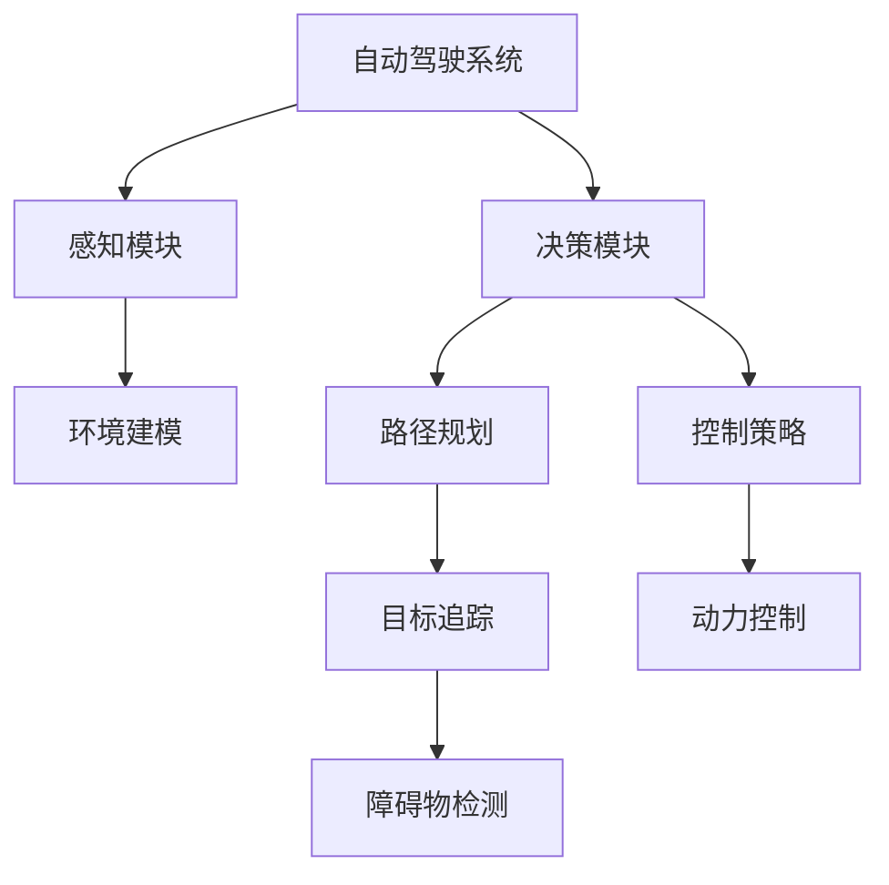
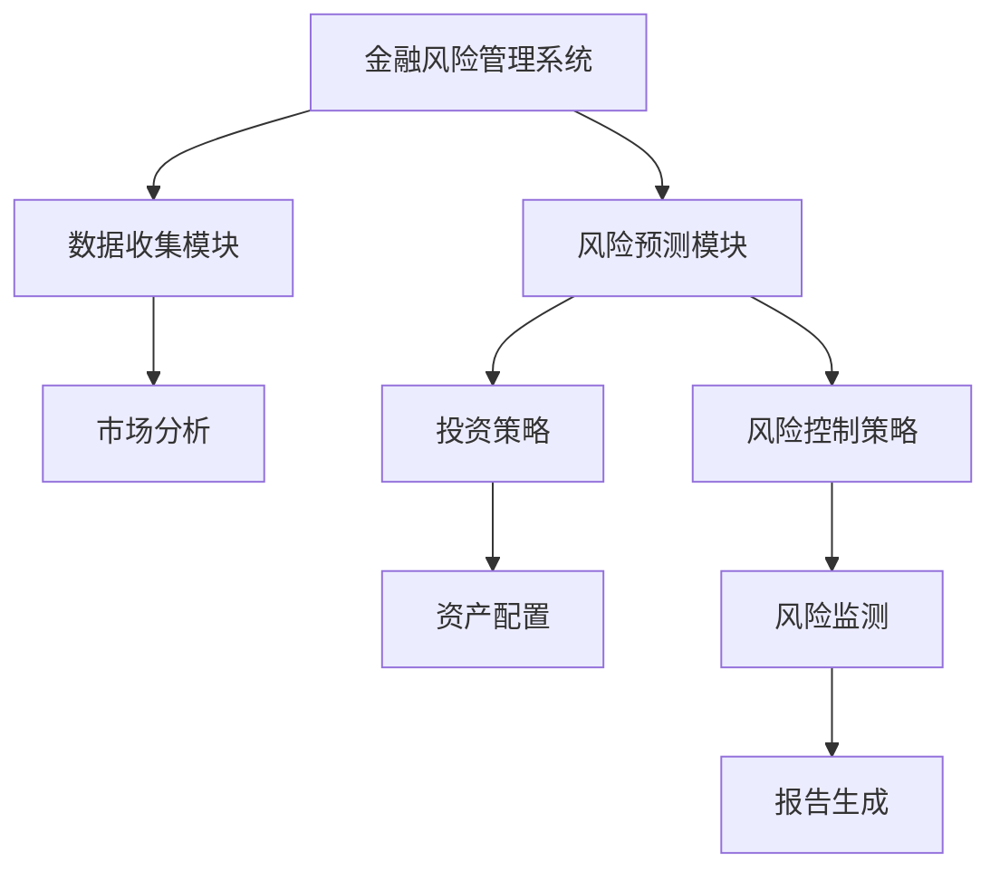
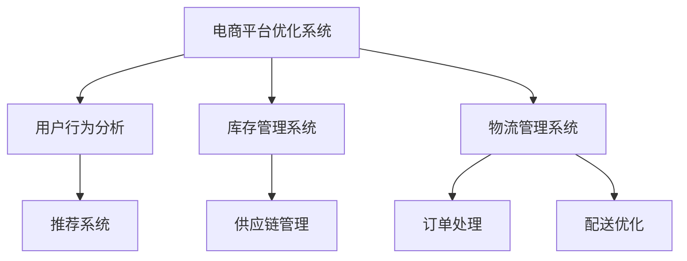
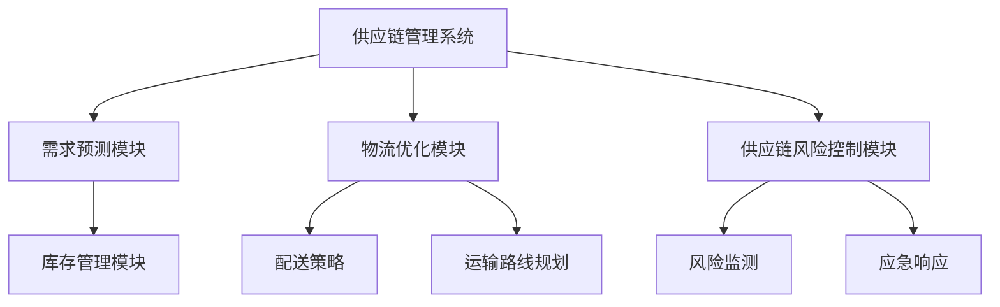

                 


### Article Title: 应用代理型AI于日常决策：场景、原理与实践

### Keywords: 代理型AI、日常工作决策、强化学习、应用场景、算法实现、模型评估

### Abstract:
本文旨在探讨代理型人工智能（AI）在日常工作决策中的应用。通过分析代理型AI的核心原理和应用场景，本文将介绍其技术实现过程，并探讨在实际应用中的挑战和解决方案。文章还将展望代理型AI未来的发展趋势，为读者提供有益的参考。

### 目录

1. **引言：代理型AI与工作决策**
   1.1 什么是代理型AI
   1.2 工作决策的重要性
   1.3 代理型AI在决策中的作用

2. **代理型AI的技术原理**
   2.1 数学模型和基础
   2.2 强化学习算法详解
   2.3 代理型AI架构图

3. **应用场景分析**
   3.1 任务调度优化
   3.2 项目管理与风险管理
   3.3 销售与营销优化
   3.4 人力资源管理

4. **算法实现与案例研究**
   4.1 基本强化学习算法实现
   4.2 自动驾驶案例研究
   4.3 金融风险管理案例研究
   4.4 电商平台优化案例研究

5. **模型评估与优化**
   5.1 评估指标与方法
   5.2 模型优化技术
   5.3 供应链管理优化案例研究

6. **实际挑战与解决方案**
   6.1 数据收集与预处理
   6.2 模型部署与维护
   6.3 道德与风险考虑

7. **未来趋势与发展方向**
   7.1 代理型AI的发展方向
   7.2 创新与应用前景

8. **结论：代理型AI的潜力与影响**
   8.1 最佳实践与建议
   8.2 注意事项与拓展阅读

### 1. 引言：代理型AI与工作决策

#### 1.1 什么是代理型AI

代理型AI，即基于强化学习的智能体（Agent），是一种通过与环境交互来学习优化自身行为的人工智能系统。其核心思想是通过奖励机制来指导智能体在复杂环境中寻找最优策略。

#### 1.2 工作决策的重要性

工作决策是指个体或团队在工作和项目中进行的选择和判断。有效的决策能够提高工作效率、降低成本、减少风险，对企业的长期发展至关重要。

#### 1.3 代理型AI在决策中的作用

代理型AI能够通过学习环境中的规律，为日常工作决策提供数据支持和优化建议。其核心优势在于能够自动适应环境变化，提高决策的灵活性和准确性。

### 2. 代理型AI的技术原理

#### 2.1 数学模型和基础

代理型AI的数学模型通常基于马尔可夫决策过程（MDP）。MDP是一个五元组\( (S, A, R, P, \gamma) \)，其中：

- \( S \) 是状态集合
- \( A \) 是动作集合
- \( R \) 是奖励函数
- \( P \) 是状态转移概率
- \( \gamma \) 是折扣因子

#### 2.2 强化学习算法详解

强化学习算法的核心是策略优化。常见的强化学习算法包括Q学习、SARSA、Deep Q Network（DQN）等。

- **Q学习**：基于值函数的算法，通过迭代更新Q值来优化策略。
  $$ Q(s, a) = r + \gamma \max_{a'} Q(s', a') $$
  
- **SARSA**：一种在线学习算法，直接在当前状态和动作上更新Q值。
  $$ Q(s, a) = r + \gamma Q(s', a') $$

- **DQN**：结合深度学习的Q学习算法，通过神经网络来近似值函数。

#### 2.3 代理型AI架构图

代理型AI的架构通常包括环境（Environment）、智能体（Agent）、策略（Policy）和奖励机制（Reward Mechanism）。

$$
\begin{align*}
&\text{环境} \rightarrow \text{智能体} \xleftarrow{\text{策略}} \text{智能体} \\
&\text{智能体} \xleftarrow{\text{奖励}} \text{环境}
\end{align*}
$$

### 3. 应用场景分析

#### 3.1 任务调度优化

代理型AI可以用于任务调度，通过学习任务间的关系和优先级，优化资源分配和调度策略。

#### 3.2 项目管理与风险管理

在项目管理中，代理型AI可以帮助决策者评估项目风险、制定应急计划，提高项目成功率。

#### 3.3 销售与营销优化

代理型AI可以分析市场数据，优化销售策略和营销活动，提高销售业绩。

#### 3.4 人力资源管理

代理型AI可以帮助企业优化招聘策略、员工培训计划，提高员工满意度和生产力。

### 4. 算法实现与案例研究

#### 4.1 基本强化学习算法实现

以下是一个简单的Q学习算法的伪代码：

```python
# 初始化Q值
Q = np.zeros((S, A))

# 设置学习参数
epsilon = 0.1
alpha = 0.1
gamma = 0.9

# 学习循环
for episode in range(num_episodes):
    state = env.reset()
    done = False
    
    while not done:
        # 选择动作
        if random() < epsilon:
            action = env.action_space.sample()
        else:
            action = np.argmax(Q[state])
        
        # 执行动作
        next_state, reward, done, _ = env.step(action)
        
        # 更新Q值
        Q[state, action] = Q[state, action] + alpha * (reward + gamma * np.max(Q[next_state]) - Q[state, action])
        
        state = next_state
```

#### 4.2 自动驾驶案例研究

在自动驾驶领域，代理型AI被用于优化驾驶策略，提高行驶安全性和效率。以下是一个自动驾驶系统的架构：



#### 4.3 金融风险管理案例研究

在金融风险管理中，代理型AI可以用于预测市场走势、评估投资风险，为决策者提供数据支持。以下是一个金融风险管理系统的架构：



#### 4.4 电商平台优化案例研究

在电商平台优化中，代理型AI可以用于推荐系统、库存管理和物流优化。以下是一个电商平台优化系统的架构：



### 5. 模型评估与优化

#### 5.1 评估指标与方法

代理型AI模型的评估指标包括：

- **平均奖励**：衡量模型在测试集上的表现。
- **策略稳定度**：评估模型在不同环境下的稳定性。
- **学习效率**：衡量模型收敛速度。

#### 5.2 模型优化技术

常见的优化技术包括：

- **策略梯度提升**：通过梯度上升方法优化策略。
- **模型压缩**：减少模型参数，提高计算效率。
- **多任务学习**：同时学习多个任务，提高泛化能力。

#### 5.3 供应链管理优化案例研究

以下是一个供应链管理优化系统的架构，并使用了代理型AI模型：



### 6. 实际挑战与解决方案

#### 6.1 数据收集与预处理

数据收集是代理型AI应用的关键步骤。常见挑战包括：

- **数据不完整性**：缺失数据的处理方法。
- **数据噪声**：去除噪声数据的方法。
- **数据规模**：大规模数据处理方法。

#### 6.2 模型部署与维护

模型部署与维护的挑战包括：

- **硬件资源**：选择合适的硬件资源。
- **系统稳定性**：确保系统在高负载下的稳定性。
- **更新与维护**：定期更新模型和系统。

#### 6.3 道德与风险考虑

代理型AI在应用中需要考虑道德和风险问题，包括：

- **隐私保护**：确保用户数据的安全。
- **模型解释性**：提高模型的可解释性。
- **决策透明度**：确保决策过程的透明。

### 7. 未来趋势与发展方向

代理型AI在未来将继续发展，并在更多领域得到应用。主要趋势包括：

- **跨领域应用**：代理型AI将在更多领域得到应用，如医疗、教育等。
- **多智能体系统**：研究多智能体系统中的协同与合作。
- **增强现实与虚拟现实**：代理型AI在增强现实和虚拟现实中的应用。

### 8. 结论：代理型AI的潜力与影响

代理型AI在日常工作决策中具有巨大的潜力。通过合理的设计和应用，代理型AI能够显著提高决策的效率和质量。然而，应用代理型AI也需要注意数据隐私、模型解释性和决策透明度等问题。未来，代理型AI将在更多领域发挥重要作用，推动人工智能技术的发展。

### 最佳实践与建议

- **数据驱动**：确保数据质量，为代理型AI提供可靠的数据支持。
- **模型可解释性**：提高模型的可解释性，增强用户信任。
- **持续优化**：定期更新和优化模型，适应环境变化。

### 注意事项与拓展阅读

- **注意事项**：注意数据隐私和模型解释性问题。
- **拓展阅读**：深入了解代理型AI的理论和实践，提高应用能力。

### 作者信息

作者：AI天才研究院/AI Genius Institute & 禅与计算机程序设计艺术 /Zen And The Art of Computer Programming

---

**全文总结**：本文系统介绍了代理型AI在日常工作决策中的应用。通过分析代理型AI的技术原理、应用场景、算法实现、模型评估、实际挑战与解决方案，以及未来发展趋势，本文为读者提供了一个全面的代理型AI应用指南。通过最佳实践和注意事项的指导，读者可以更好地将代理型AI应用于实际工作中，提高决策效率和质量。

