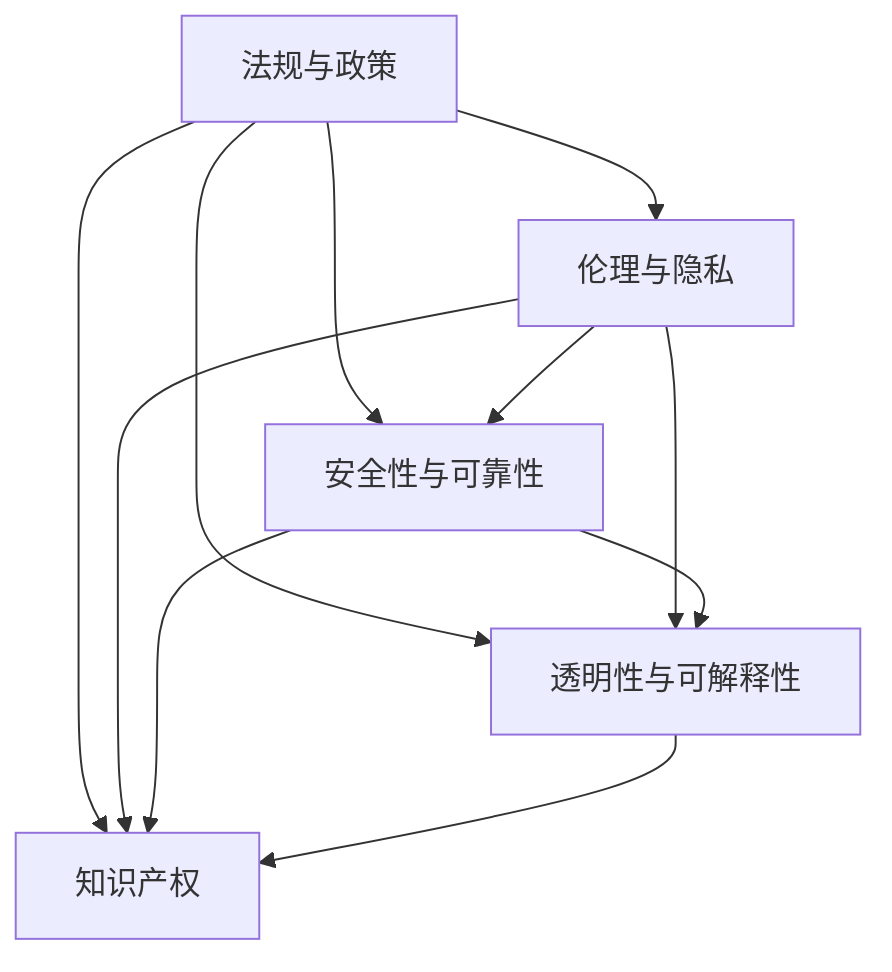

                 

## 文章标题
### 企业AI治理框架的构建步骤

---

## 文章关键词
### AI治理，企业策略，框架构建，风险管理，合规性

---

## 摘要
本文旨在探讨企业AI治理框架的构建步骤，包括背景介绍、核心概念与联系、算法原理讲解、数学模型和公式、项目实战、最佳实践等方面。通过详细的分析和讲解，帮助企业构建有效的AI治理框架，提高AI应用的安全性和可靠性。

---

## 引言

### 1. 引言

人工智能（AI）技术的发展为各行各业带来了前所未有的机遇，但同时也引发了一系列挑战，特别是在数据隐私、安全性、伦理和合规性等方面。为了应对这些挑战，企业需要建立一套完善的AI治理框架，以确保AI系统的稳健运行和可持续发展。

AI治理框架是指一系列政策和流程，用于指导和管理AI系统的开发、部署、监控和评估。其目的是确保AI系统的透明性、可解释性、安全性和合规性，同时降低AI带来的风险。构建一个有效的AI治理框架，不仅能够提升企业的竞争力，还能增强公众对AI技术的信任。

本文将分为以下几个部分：

1. **AI治理的概念与背景**：介绍AI治理的定义、重要性以及当前的发展状况。
2. **AI治理框架概述**：阐述AI治理框架的基本要素和设计原则。
3. **构建AI治理框架**：详细分析评估企业AI治理现状、制定AI治理策略、实施AI治理框架的步骤。
4. **AI治理实践案例**：通过实际案例展示AI治理框架的应用效果。
5. **结论与展望**：总结文章内容，展望AI治理框架的未来发展趋势。

---

### 2. 书籍概述与结构

本书旨在为企业管理者、IT专业人员以及AI研究者提供一套完整的AI治理框架构建指南。全书结构如下：

1. **引言**：介绍AI治理的概念与重要性，以及本书的结构和内容安排。
2. **AI治理框架概述**：包括基本要素和设计原则的详细讲解。
3. **构建AI治理框架**：从评估企业AI治理现状、制定AI治理策略到实施和评估AI治理框架的步骤。
4. **AI治理实践案例**：通过实际案例展示AI治理框架的应用效果。
5. **结论与展望**：总结全书内容，展望AI治理框架的未来发展趋势。

通过这本书，读者将能够：

- 理解AI治理的基本概念和重要性。
- 构建适合自己企业的AI治理框架。
- 提高AI系统的安全性、透明性和可靠性。
- 遵守相关法规和标准，降低法律风险。

---

## AI治理框架概述

### 1. AI治理框架的基本要素

AI治理框架由多个基本要素构成，这些要素相互关联，共同作用，确保AI系统的稳健运行。以下是AI治理框架的主要基本要素：

#### 1.1 法规与政策

法规与政策是AI治理的基础，它确保AI系统的开发、部署和使用符合法律法规要求。主要内容包括：

- 数据保护法：如欧盟的通用数据保护条例（GDPR）。
- 行业规范：如金融行业的金融科技法规。
- 国家的AI战略：如美国的AI计划。

#### 1.2 伦理与隐私

伦理与隐私是AI治理的核心，关系到AI系统的道德标准和用户隐私保护。主要内容包括：

- AI伦理：如算法公平性、透明性、可解释性等。
- 隐私保护：如数据加密、匿名化处理、用户隐私告知等。

#### 1.3 安全性与可靠性

安全性与可靠性是AI治理的关键，它关系到AI系统的稳定运行和用户信任。主要内容包括：

- 安全性：如数据安全、模型安全、系统安全等。
- 可靠性：如模型准确性、系统稳定性、响应时间等。

#### 1.4 透明性与可解释性

透明性与可解释性是AI治理的重要组成部分，它使AI系统的决策过程更加公开和可追溯。主要内容包括：

- 模型透明性：如模型结构、参数、训练数据等。
- 决策可解释性：如解释模型决策的原因和依据。

#### 1.5 知识产权

知识产权是AI治理的重要方面，它关系到AI系统的创新和商业化。主要内容包括：

- 专利保护：如AI算法、模型、应用等。
- 版权保护：如数据集、文档、代码等。

### 2. AI治理框架的设计原则

设计一个有效的AI治理框架需要遵循以下设计原则：

#### 2.1 可持续性与灵活性

AI治理框架应具备可持续性和灵活性，以适应不断变化的法规和技术环境。主要原则包括：

- 法规适应性：框架应能够快速响应新的法律法规。
- 技术适应性：框架应能够适应新技术的发展和应用。

#### 2.2 成本效益

AI治理框架的设计应考虑成本效益，以确保企业在预算范围内实现治理目标。主要原则包括：

- 成本控制：合理分配资源和预算。
- 效益最大化：通过优化流程和工具提高治理效果。

#### 2.3 团队协作与沟通

AI治理框架的构建需要跨部门、跨专业的团队协作和有效沟通。主要原则包括：

- 团队建设：建立跨部门协作机制。
- 沟通渠道：确保信息畅通，减少误解和冲突。

#### 2.4 责任明确与问责

AI治理框架应明确各方的责任和问责机制，以确保治理措施的有效执行。主要原则包括：

- 责任划分：明确各部门和个人的职责。
- 问责机制：建立问责制度和奖惩机制。

---

### 3. AI治理框架的基本要素之间的关系

AI治理框架的基本要素之间存在紧密的关系，这些关系构成了一个完整的治理体系。以下是这些要素之间的关系架构图：

通过这个关系架构图，我们可以看出：

- 法规与政策为AI治理提供了法律基础，是其他要素的基础。
- 伦理与隐私是AI治理的核心，关系到用户信任和合规性。
- 安全性与可靠性是AI治理的关键，确保AI系统的稳健运行。
- 透明性与可解释性提高了AI系统的公信力和可接受度。
- 知识产权保护了AI系统的创新成果，促进了持续发展。

这些基本要素相互关联，共同构成了一个完整的AI治理框架，确保AI系统的健康发展。

---

## 评估企业AI治理现状

### 1. 企业文化评估

企业文化的评估是构建AI治理框架的第一步，因为它直接影响到AI治理策略的执行效果。以下是评估企业文化的一些关键步骤：

#### 1.1 价值观与使命

- 确定企业的核心价值观和使命，了解这些价值观是否支持AI治理的目标。
- 分析企业内部是否存在重视创新、诚信、透明和可持续发展的文化。

#### 1.2 团队协作

- 评估团队之间的协作情况，了解是否建立了跨部门、跨专业的协作机制。
- 分析团队内部的沟通方式，确保信息畅通，减少误解和冲突。

#### 1.3 员工参与

- 评估员工是否积极参与AI治理的讨论和决策过程。
- 了解员工对AI治理的意识和接受程度，确保他们了解AI治理的重要性和执行方式。

### 2. 法律合规性评估

法律合规性评估是确保企业AI治理框架符合法律法规要求的关键步骤。以下是评估法律合规性的一些关键步骤：

#### 2.1 法规了解

- 研究相关国家和地区的AI法律法规，了解其具体要求和适用范围。
- 分析企业现有政策和流程，确定其是否符合法律法规要求。

#### 2.2 合规性检查

- 定期进行合规性检查，确保企业的AI系统在使用过程中符合相关法规。
- 对可能出现的不合规行为进行预防和监控，及时采取措施纠正。

#### 2.3 法律顾问

- 建立法律顾问团队，提供法律咨询和指导，确保企业的AI治理策略和框架符合法律法规。
- 定期与法律顾问沟通，更新对法律法规的了解，确保企业始终处于合法状态。

### 3. 风险评估

风险评估是识别和评估AI系统潜在风险的重要步骤，有助于企业制定有效的风险管理策略。以下是评估风险的一些关键步骤：

#### 3.1 风险识别

- 识别AI系统可能面临的风险，包括技术风险、操作风险、合规风险等。
- 分析这些风险可能对企业带来的影响，确定其严重程度和发生概率。

#### 3.2 风险评估

- 对识别出的风险进行量化评估，确定其优先级和应对策略。
- 根据风险评估结果，制定风险缓解措施和应急预案。

#### 3.3 风险监控

- 建立风险监控机制，定期评估AI系统的风险状况，确保风险得到及时控制和缓解。
- 对新出现或变化的风险进行及时识别和评估，确保企业的风险管理策略始终保持有效。

### 4. 人才评估

人才评估是确保企业拥有足够的人才资源来实施AI治理策略的重要步骤。以下是评估人才的一些关键步骤：

#### 4.1 人才需求

- 评估企业当前和未来在AI治理方面的人才需求。
- 确定所需人才的技能和知识领域，如数据科学、法律、伦理、安全管理等。

#### 4.2 人才培养

- 制定人才培养计划，提供相关培训和发展机会，提升员工的专业技能和治理能力。
- 建立人才储备库，确保企业能够及时补充和替换关键人才。

#### 4.3 人才激励

- 设计激励制度，激励员工积极参与AI治理工作，提高其工作积极性和责任感。
- 识别和表彰在AI治理方面表现突出的员工，营造积极的工作氛围。

通过以上四个方面的评估，企业可以全面了解自身的AI治理现状，识别出存在的问题和风险，为制定和实施AI治理策略提供有力支持。

### 4. 制定AI治理策略

在评估企业AI治理现状的基础上，制定AI治理策略是构建AI治理框架的关键步骤。以下是如何制定AI治理策略的详细说明：

#### 4.1 确定AI治理目标

制定AI治理策略的第一步是明确AI治理的目标。这些目标应与企业的整体战略目标相一致，并涵盖以下关键方面：

- **合规性**：确保AI系统符合相关法律法规和行业标准。
- **安全性**：保障AI系统的安全性和可靠性，防止数据泄露和系统故障。
- **透明性**：提高AI系统的透明度，使其决策过程可解释和可追溯。
- **公平性**：确保AI系统在不同用户群体中公平运行，避免算法偏见。
- **隐私保护**：保护用户隐私，确保数据收集和使用符合隐私保护原则。
- **可持续发展**：确保AI系统的可持续发展，包括技术更新、成本控制和资源优化。

#### 4.2 设定AI治理框架

在明确治理目标后，企业需要设定一个AI治理框架，以确保这些目标能够得到有效实现。AI治理框架通常包括以下关键组成部分：

- **治理结构**：明确AI治理的组织结构，包括决策层、执行层和监督层。
- **政策与流程**：制定具体的AI治理政策，如数据管理政策、伦理审查政策、安全审计政策等，并设计相应的流程，确保政策得到有效执行。
- **技术标准**：制定技术标准，确保AI系统的开发、部署和维护符合最佳实践。
- **培训与教育**：制定培训计划，确保员工了解AI治理的重要性和具体要求。
- **监控与评估**：建立监控机制，定期评估AI治理的实施效果，并根据评估结果进行改进。

#### 4.3 制定AI治理政策与流程

制定AI治理政策与流程是确保AI治理策略落地实施的关键步骤。以下是制定AI治理政策与流程的详细步骤：

- **政策制定**：根据治理目标，制定具体的管理政策，如数据保护政策、隐私政策、算法透明性政策等。
- **流程设计**：设计具体的工作流程，包括数据采集、处理、存储、使用、共享、销毁等环节，确保每个环节都符合治理政策的要求。
- **政策发布与培训**：将政策发布给相关员工，并提供培训，确保他们了解政策内容，知道如何执行。
- **流程执行**：实施政策与流程，确保AI系统在实际运行中遵循既定的政策和流程。

#### 4.4 确保AI治理的持续改进

AI治理是一个持续的过程，需要不断评估和改进。以下是确保AI治理持续改进的步骤：

- **定期评估**：定期评估AI治理的实施效果，包括合规性、安全性、透明性、公平性和隐私保护等方面。
- **反馈与改进**：根据评估结果，识别存在的问题和改进机会，制定改进计划，并实施改进措施。
- **持续培训**：定期更新培训内容，确保员工了解最新的AI治理政策和流程，提高其治理能力。
- **技术更新**：随着技术的发展，及时更新AI治理的技术标准和管理工具，确保治理框架的先进性和有效性。

通过以上步骤，企业可以制定一个全面、有效的AI治理策略，确保AI系统的稳健运行和可持续发展。

### 5. AI治理框架的实施步骤

构建AI治理框架只是第一步，关键在于如何将其成功实施。以下是实施AI治理框架的具体步骤：

#### 5.1 成立AI治理委员会

为了确保AI治理框架的有效实施，企业需要成立一个专门的AI治理委员会。该委员会的职责包括：

- **制定和审批AI治理策略**：确保AI治理策略与企业的整体战略目标相一致。
- **监督AI治理实施**：定期审查AI治理的实施情况，确保各项政策得到执行。
- **评估和改进AI治理框架**：根据实际情况，对AI治理框架进行评估和改进，确保其持续有效。

#### 5.2 培训与教育

AI治理的成功离不开员工的积极参与和了解。因此，企业需要开展一系列培训和教育活动，包括：

- **基础知识培训**：为员工提供AI基础知识培训，使其了解AI的基本原理和应用。
- **治理政策培训**：详细介绍AI治理政策，确保员工知道如何遵循这些政策。
- **伦理和隐私培训**：强调伦理和隐私的重要性，提高员工的伦理意识和隐私保护能力。
- **持续学习**：建立持续学习机制，定期更新培训内容，确保员工始终掌握最新的治理知识和技能。

#### 5.3 实施监控与审计

为了确保AI治理框架的有效实施，企业需要建立监控和审计机制。以下是实施监控与审计的关键步骤：

- **监控机制**：建立实时监控机制，对AI系统的运行情况进行实时监控，及时发现和纠正问题。
- **审计机制**：定期进行审计，评估AI治理框架的实施效果，确保政策得到有效执行。
- **问题追踪**：对监控和审计过程中发现的问题进行追踪和解决，确保问题得到及时处理。
- **报告机制**：定期生成AI治理报告，向治理委员会和高层管理人员汇报AI治理的实施情况，包括政策执行情况、审计结果和改进措施。

#### 5.4 反馈与调整

AI治理框架的实施是一个动态过程，需要根据实际情况进行反馈和调整。以下是反馈与调整的关键步骤：

- **收集反馈**：通过问卷调查、座谈会、意见箱等方式收集员工的反馈意见，了解AI治理政策的实际效果。
- **分析反馈**：对收集到的反馈进行分析，识别存在的问题和改进机会。
- **调整政策**：根据分析结果，对AI治理政策进行调整，优化治理框架。
- **再次培训**：更新培训内容，确保员工了解新的政策和流程。

通过以上步骤，企业可以确保AI治理框架的有效实施，提高AI系统的安全性和可靠性，为企业的可持续发展奠定坚实基础。

### 6. AI治理框架的评估与改进

评估与改进是确保AI治理框架持续有效的重要环节。以下是评估与改进AI治理框架的具体步骤：

#### 6.1 持续监督与改进

AI治理框架的持续监督与改进是确保其有效性长期保持的关键。以下是一些具体方法：

- **定期评估**：定期对AI治理框架的执行效果进行评估，包括政策执行情况、治理流程的合规性、员工遵守情况等。
- **监控工具**：使用监控工具和技术，如AI审计工具、数据监控平台等，实时跟踪AI系统的运行状况，及时发现潜在问题。
- **反馈机制**：建立有效的反馈机制，鼓励员工和管理层提出改进建议，确保治理框架能够不断适应新的挑战。

#### 6.2 案例研究与分析

通过案例研究与分析，企业可以深入了解AI治理框架在不同场景下的效果和问题。以下是案例研究与分析的具体步骤：

- **选择案例**：选择具有代表性的案例，这些案例应涵盖不同的业务领域和应用场景。
- **数据收集**：收集与案例相关的数据，包括AI系统的运行数据、用户反馈、治理流程记录等。
- **案例分析**：对收集到的数据进行分析，识别成功经验和存在的问题。
- **总结经验**：总结案例中的成功经验，提炼可复制的最佳实践；分析存在的问题，提出改进建议。

#### 6.3 国际经验借鉴

借鉴国际先进经验，有助于企业提升AI治理框架的成熟度和有效性。以下是国际经验借鉴的具体步骤：

- **研究国际标准**：研究国际上的AI治理标准和最佳实践，了解其核心内容和实施方法。
- **对比分析**：对比分析国际标准和本企业的实际情况，识别差距和改进方向。
- **本地化调整**：根据本地法规和市场需求，对国际经验进行调整，确保其适用于企业实际。
- **推广与实施**：将借鉴的国际经验在企业内部推广和实施，逐步提升AI治理水平。

#### 6.4 反馈与调整

基于持续监督、案例研究和国际经验借鉴的反馈，对AI治理框架进行定期调整和优化。以下是反馈与调整的具体步骤：

- **反馈收集**：收集来自员工、管理层、用户和外部审计人员的反馈，了解AI治理框架的执行效果和用户满意度。
- **问题识别**：识别反馈中的问题和不足，确定改进优先级。
- **方案制定**：制定具体的改进方案，包括政策调整、流程优化、技术升级等。
- **实施改进**：按照改进方案，实施具体改进措施，确保治理框架的持续优化。

通过以上步骤，企业可以确保AI治理框架的有效性和适应性，提高AI系统的安全性和可靠性，为企业的长期发展提供坚实保障。

### 9. 案例一：科技公司的AI治理实践

#### 9.1 案例背景与挑战

某科技公司（以下简称“公司”）是一家专注于人工智能技术研究和应用的企业。随着AI技术的广泛应用，公司在产品开发、业务运营和客户服务等方面都面临着一系列治理挑战：

- **合规性问题**：公司需要确保其AI系统符合相关法律法规，如数据保护法、反歧视法等。
- **安全性问题**：AI系统的安全性和可靠性是公司关注的重点，需要防止数据泄露和系统故障。
- **伦理问题**：公司需要确保AI系统的决策过程透明、公平，避免算法偏见和歧视。
- **隐私问题**：公司需要保护用户的隐私，确保数据收集和使用符合用户隐私保护原则。
- **人才问题**：公司需要培养一支具备AI治理知识和技能的专业团队，确保AI治理策略的有效实施。

#### 9.2 AI治理策略与框架

为了应对上述挑战，公司制定了一套全面的AI治理策略和框架，包括以下关键组成部分：

1. **治理组织**：公司成立了AI治理委员会，负责制定和监督AI治理策略的执行。委员会由公司高层管理人员、技术专家、法律顾问、伦理顾问和员工代表组成。

2. **政策和流程**：公司制定了一系列AI治理政策，包括数据管理政策、隐私保护政策、算法透明性政策、安全审计政策和伦理审查政策等。同时，设计了一系列流程，如数据采集和处理流程、算法开发和部署流程、安全监控和审计流程等。

3. **技术标准**：公司制定了AI技术标准，确保AI系统的开发、部署和维护符合最佳实践。技术标准包括数据质量标准、算法性能标准、安全性标准和可解释性标准等。

4. **培训与教育**：公司开展了一系列AI治理培训和教育活动，包括基础知识培训、政策培训、伦理培训和技术培训等。通过培训，提高员工的AI治理意识和能力。

5. **监控与评估**：公司建立了实时监控和评估机制，对AI系统的运行情况进行监控和评估。监控内容包括数据合规性、算法性能、系统安全性和用户隐私保护等。评估结果用于改进AI治理策略和框架。

#### 9.3 实施过程与成果

在AI治理策略和框架的指导下，公司进行了以下实施过程：

1. **政策制定与发布**：公司制定了详细的AI治理政策，并发布了相关政策文件，确保员工了解和遵守。

2. **流程设计与实施**：公司设计了具体的AI治理流程，并在产品开发、业务运营和客户服务等方面进行了实施。例如，在数据采集和处理环节，公司采用了数据加密和匿名化处理技术，确保数据安全；在算法开发和部署环节，公司进行了算法测试和可解释性分析，确保算法的公平性和透明性。

3. **培训与教育**：公司开展了多层次、多形式的AI治理培训，包括内部培训、外部培训和在线培训等。通过培训，提高了员工的专业素养和治理能力。

4. **监控与评估**：公司建立了实时监控和评估系统，对AI系统的运行情况进行监控和评估。监控内容包括数据合规性、算法性能、系统安全性和用户隐私保护等。评估结果用于改进AI治理策略和框架。

通过AI治理策略和框架的实施，公司在以下方面取得了显著成果：

- **合规性提升**：公司确保了AI系统在法律法规方面的合规性，降低了法律风险。
- **安全性增强**：公司提高了AI系统的安全性和可靠性，防止了数据泄露和系统故障。
- **透明性提高**：公司增强了AI系统的透明性，使决策过程更加公开和可追溯。
- **隐私保护加强**：公司加强了用户隐私保护，提高了用户对公司的信任。
- **团队协作加强**：通过培训和教育，员工在AI治理方面的意识和能力得到了提升，团队协作更加顺畅。

#### 9.4 案例总结

通过本案例，我们可以看到，公司通过制定全面的AI治理策略和框架，成功应对了AI治理的各种挑战。以下是本案例的总结和启示：

- **全面规划**：制定全面的AI治理策略和框架，确保治理的全面性和系统性。
- **持续培训**：通过培训提高员工的治理意识和能力，确保治理策略的有效执行。
- **实时监控**：建立实时监控和评估机制，确保AI系统的稳健运行和持续改进。
- **合作共赢**：建立跨部门、跨专业的协作机制，确保治理策略的顺利实施。
- **透明公开**：提高AI系统的透明度和可解释性，增强用户和社会的信任。

通过本案例，我们可以看到，AI治理不仅是企业内部的管理问题，更关系到企业的外部形象和社会责任。只有通过全面、系统的治理，企业才能在AI技术的浪潮中站稳脚跟，实现可持续发展。

### 10. 案例二：金融行业的AI治理实践

#### 10.1 案例背景与挑战

金融行业作为人工智能（AI）技术应用的重要领域，面临着独特且严格的治理挑战。某大型金融机构（以下简称“金融机构”）在运用AI技术提升业务效率和客户体验的同时，也遇到了以下治理难题：

- **合规性问题**：金融行业的法律法规复杂，AI系统需要严格遵守反洗钱（AML）、客户身份识别（KYC）、证券交易法等规定。
- **数据安全**：金融数据敏感性高，AI系统需保护客户数据和交易记录，防止数据泄露。
- **算法公平性**：金融AI系统需确保对所有客户公平，避免算法偏见导致歧视性决策。
- **隐私保护**：金融机构必须保护客户隐私，遵循数据保护法规如欧盟的通用数据保护条例（GDPR）。
- **技术风险**：AI系统的稳定性对金融业务至关重要，任何系统故障都可能导致重大损失。

#### 10.2 AI治理策略与框架

为了解决上述挑战，金融机构制定了一套全面的AI治理策略和框架，涵盖以下几个方面：

1. **治理组织**：金融机构成立了AI治理委员会，负责制定和监督AI治理策略的实施。委员会成员包括高级管理人员、数据科学家、法务、合规、风险控制和IT部门代表。

2. **政策和流程**：金融机构制定了详细的AI治理政策，包括数据管理政策、算法开发与测试流程、安全审计政策、隐私保护政策和伦理审查政策。这些政策确保AI系统的合规性、安全性和公平性。

3. **技术标准**：金融机构制定了技术标准，涵盖数据质量、算法性能、系统安全性和可解释性。技术标准帮助确保AI系统的稳健性和透明性。

4. **培训与教育**：金融机构定期为员工提供AI治理培训，内容包括法律法规、数据保护、算法公平性和技术标准等。培训帮助员工理解和遵守AI治理政策。

5. **监控与评估**：金融机构建立了实时监控和定期评估机制，对AI系统的运行状况进行持续监控，确保系统符合治理要求。评估结果用于改进AI治理策略和框架。

#### 10.3 实施过程与成果

在AI治理策略和框架的指导下，金融机构进行了以下实施过程：

1. **政策制定与发布**：金融机构制定并发布了AI治理政策，确保所有员工和相关方了解并遵守。

2. **流程实施**：金融机构将AI治理政策融入业务流程中，如客户数据收集和处理流程、算法开发和测试流程、安全监控和审计流程等。流程的实施确保AI系统符合治理要求。

3. **培训与教育**：金融机构开展了多层次、多领域的AI治理培训，帮助员工提升专业素养和治理能力。

4. **监控与评估**：金融机构建立了监控和评估机制，对AI系统的运行状况进行实时监控和定期评估。监控内容包括数据合规性、算法性能、系统安全性和用户隐私保护等。

通过AI治理策略和框架的实施，金融机构在以下方面取得了显著成果：

- **合规性提升**：金融机构确保了AI系统在法律法规方面的合规性，降低了法律风险。
- **数据安全增强**：金融机构提高了数据安全性，防止了数据泄露和未经授权的访问。
- **算法公平性提高**：金融机构确保了AI系统的公平性，避免了算法偏见和歧视性决策。
- **隐私保护加强**：金融机构加强了客户隐私保护，提高了客户对金融机构的信任。
- **技术风险管理**：金融机构通过严格的安全监控和评估，确保了AI系统的稳定性和可靠性。

#### 10.4 案例总结

本案例展示了金融机构如何通过制定和实施全面的AI治理策略和框架，成功应对金融行业特有的治理挑战。以下是本案例的总结和启示：

- **系统性治理**：金融机构通过制定全面的治理策略和框架，确保治理的全面性和系统性。
- **持续培训**：金融机构定期为员工提供AI治理培训，提高员工的治理意识和能力。
- **实时监控**：金融机构建立了实时监控和评估机制，确保AI系统的稳健运行和持续改进。
- **合规优先**：金融机构确保AI系统在法律法规方面的合规性，降低法律风险。
- **透明沟通**：金融机构通过透明的沟通和合作，提高了AI系统的透明度和公信力。

通过本案例，我们可以看到，金融行业的AI治理不仅需要遵循严格的法律法规，还需要确保系统的安全性和公平性，同时提高透明度和用户信任。这为其他行业提供了宝贵的经验教训，有助于他们在AI治理方面取得成功。

### 11. 案例三：医疗领域的AI治理实践

#### 11.1 案例背景与挑战

医疗领域是人工智能（AI）技术应用的另一个重要领域。某大型医疗集团（以下简称“医疗集团”）在利用AI技术提升诊断准确性、优化治疗计划和改善患者体验的过程中，面临着一系列治理挑战：

- **数据隐私**：医疗数据敏感性极高，医疗集团需要确保患者数据的安全性和隐私保护，遵守如《健康保险可携性与责任法案》（HIPAA）等法规。
- **算法公平性**：AI系统需确保对所有患者公平，避免种族、性别等偏见，确保诊断和治疗决策的公正性。
- **临床可靠性**：AI系统需具备高可靠性，确保在紧急情况下准确无误地辅助临床决策。
- **伦理问题**：AI系统的应用需要考虑伦理问题，如患者知情同意、算法决策解释等。
- **人才培养**：医疗集团需要培养一支能够理解和执行AI治理的专业团队。

#### 11.2 AI治理策略与框架

为了解决上述挑战，医疗集团制定了一套全面的AI治理策略和框架，涵盖以下几个方面：

1. **治理组织**：医疗集团成立了AI治理委员会，负责制定和监督AI治理策略的实施。委员会成员包括高层管理人员、临床医生、数据科学家、伦理顾问、IT专家和法律顾问。

2. **政策和流程**：医疗集团制定了详细的AI治理政策，包括数据管理政策、隐私保护政策、算法开发与测试流程、伦理审查政策和安全审计政策。这些政策确保AI系统的合规性、安全性和公正性。

3. **技术标准**：医疗集团制定了技术标准，涵盖数据质量、算法性能、系统安全性和可解释性。技术标准帮助确保AI系统的稳定性和透明性。

4. **培训与教育**：医疗集团开展了全面的AI治理培训，包括基础培训、政策培训、伦理培训和临床应用培训等。培训帮助员工提升专业素养和治理能力。

5. **监控与评估**：医疗集团建立了实时监控和定期评估机制，对AI系统的运行状况进行监控和评估。监控内容包括数据合规性、算法性能、系统安全性和用户隐私保护等。

#### 11.3 实施过程与成果

在AI治理策略和框架的指导下，医疗集团进行了以下实施过程：

1. **政策制定与发布**：医疗集团制定并发布了AI治理政策，确保所有员工和相关方了解并遵守。

2. **流程实施**：医疗集团将AI治理政策融入业务流程中，如患者数据收集和处理流程、算法开发和测试流程、安全监控和审计流程等。流程的实施确保AI系统符合治理要求。

3. **培训与教育**：医疗集团开展了多层次、多领域的AI治理培训，帮助员工提升专业素养和治理能力。

4. **监控与评估**：医疗集团建立了监控和评估机制，对AI系统的运行状况进行实时监控和定期评估。评估结果用于改进AI治理策略和框架。

通过AI治理策略和框架的实施，医疗集团在以下方面取得了显著成果：

- **数据隐私保护**：医疗集团确保了患者数据的安全性和隐私保护，提高了患者信任。
- **算法公平性提高**：医疗集团确保了AI系统的公平性，避免了算法偏见和歧视性决策。
- **临床可靠性增强**：AI系统提高了诊断准确性和治疗计划的优化，提升了临床效果。
- **伦理问题解决**：医疗集团通过伦理审查和培训，解决了AI系统应用中的伦理问题。
- **人才培养成功**：通过培训和持续教育，医疗集团培养了一支能够理解和执行AI治理的专业团队。

#### 11.4 案例总结

本案例展示了医疗集团如何通过制定和实施全面的AI治理策略和框架，成功应对医疗领域特有的治理挑战。以下是本案例的总结和启示：

- **系统化治理**：医疗集团通过制定全面的治理策略和框架，确保治理的系统性和全面性。
- **持续培训**：医疗集团定期为员工提供AI治理培训，提高员工的治理意识和能力。
- **实时监控**：医疗集团建立了实时监控和评估机制，确保AI系统的稳健运行和持续改进。
- **合规优先**：医疗集团确保AI系统在法律法规和伦理方面的合规性，降低法律和道德风险。
- **患者中心**：医疗集团将患者隐私和公平性放在首位，提高了患者满意度和信任度。

通过本案例，我们可以看到，医疗行业的AI治理不仅需要遵循严格的法律法规和伦理规范，还需要确保系统的安全性和公平性，同时提高透明度和患者信任。这为其他行业提供了宝贵的经验教训，有助于他们在AI治理方面取得成功。

## 结论与展望

### 12. 结论

本文通过详细的分析和讲解，探讨了企业AI治理框架的构建步骤，包括背景介绍、核心概念与联系、算法原理讲解、数学模型和公式、项目实战、最佳实践等方面。主要结论如下：

- **AI治理的重要性**：AI治理不仅是企业内部的管理问题，更是企业外部形象和社会责任的一部分。
- **治理框架的构建**：通过评估企业现状、制定策略、实施框架和持续改进，企业可以构建一个有效的AI治理框架。
- **实践案例的价值**：通过实际案例展示，企业可以借鉴成功经验，优化自己的AI治理实践。
- **持续改进的重要性**：AI治理是一个持续的过程，需要不断评估和改进，以确保其有效性和适应性。

### 13. 展望

随着AI技术的不断发展和应用，企业AI治理框架的未来发展趋势包括：

- **法规与标准的完善**：各国政府和企业将不断完善AI相关法规和标准，提高治理的合规性。
- **技术进步的驱动**：随着AI技术的进步，治理框架将更加智能化和自动化，提高治理效率。
- **跨行业合作**：不同行业间的AI治理经验将相互借鉴，形成更加统一的治理框架。
- **社会意识的提高**：公众对AI治理的关注度将提高，推动企业更加重视AI治理。

总之，企业AI治理框架的构建是一个复杂而长期的过程，需要企业持续关注和投入。通过有效的AI治理，企业不仅可以提高AI系统的安全性、可靠性和透明性，还能增强公众对AI技术的信任，实现可持续发展。

## 附录

### 附录A：AI治理相关法规与政策

以下是部分国家和地区的AI治理相关法规与政策：

- **欧盟**：
  - 通用数据保护条例（GDPR）
  - 欧盟人工智能法规（AI Act）

- **美国**：
  - 加州消费者隐私法案（CCPA）
  - 美国人工智能倡议

- **中国**：
  - 人工智能发展行动计划
  - 人工智能伦理规范

- **日本**：
  - 人工智能国家战略

这些法规和政策为AI治理提供了法律基础，企业需确保其AI系统的合规性。

### 附录B：AI治理工具与资源

以下是部分AI治理工具和资源：

- **AI治理工具**：
  - AI伦理审查工具
  - 数据隐私保护工具
  - 可解释性工具

- **开源资源**：
  - AI伦理开源项目
  - 数据隐私保护开源工具

- **专业服务**：
  - AI治理咨询公司
  - 数据安全和隐私保护服务

这些工具和资源可以帮助企业实施AI治理策略，提高治理效果。

---

**作者：AI天才研究院/AI Genius Institute & 禅与计算机程序设计艺术 /Zen And The Art of Computer Programming**

本文旨在为企业提供构建AI治理框架的实用指南，通过详细的分析和实践案例，帮助企业应对AI治理的挑战，实现可持续发展。在AI技术不断发展的背景下，AI治理框架的构建显得尤为重要。希望本文能够对读者在构建AI治理框架时提供有价值的参考和启示。**

