                 


### 文章标题: 《企业AI风险管理最佳实践》

#### 关键词：企业，AI，风险管理，最佳实践，流程，策略，案例

> 摘要：本文将深入探讨企业AI风险管理的最佳实践。首先，我们将介绍AI风险管理的概念及其重要性，然后详细阐述其核心概念与联系，核心算法原理，数学模型和公式，以及项目实战。接下来，我们将分析AI风险管理的必要性，并探讨其合规要求和社会责任。随后，我们将构建AI风险管理框架，并提出一系列最佳实践策略。文章还将涵盖AI风险管理实施的具体流程和注意事项，并提供实际案例进行分析。最后，我们将总结最佳实践，讨论未来趋势，并给出拓展阅读建议。

## 设计《企业AI风险管理最佳实践》的目录大纲

为了设计《企业AI风险管理最佳实践》的目录大纲，我们需要遵循以下步骤：

### 步骤1: 确定核心章节

首先，我们需要明确这本书的核心章节，这些章节应当包括：
- AI风险管理的概念与重要性
- AI风险管理框架
- AI风险管理策略
- AI风险管理实施
- AI风险管理案例分析
- AI风险管理未来趋势

### 步骤2: 搭建核心章节结构

根据上述核心章节，我们可以搭建以下结构：

### 第1章 AI风险管理的概念与重要性
- 1.1 AI风险管理的基本概念
- 1.2 AI风险管理的必要性
- 1.3 AI风险管理的发展历程

### 第2章 AI风险管理框架
- 2.1 AI风险管理模型
- 2.2 AI风险识别
- 2.3 AI风险评估
- 2.4 AI风险监控

### 第3章 AI风险管理策略
- 3.1 风险管理策略制定
- 3.2 风险管理策略实施
- 3.3 风险管理策略评估

### 第4章 AI风险管理实施
- 4.1 AI风险管理组织结构
- 4.2 AI风险管理流程
- 4.3 AI风险管理技术手段

### 第5章 AI风险管理案例分析
- 5.1 案例分析概述
- 5.2 案例一：企业AI风险管理实践
- 5.3 案例二：行业AI风险管理实践
- 5.4 案例分析总结

### 第6章 AI风险管理未来趋势
- 6.1 AI风险管理发展趋势
- 6.2 AI风险管理新挑战
- 6.3 AI风险管理新机遇

### 步骤3: 添加详细内容

接下来，我们需要对每个章节添加详细内容，包括核心概念与联系、核心算法原理讲解、数学模型和数学公式、项目实战等。

例如，在第1章中，我们可以添加以下内容：

### 1.1 AI风险管理的基本概念
- **核心概念与联系**：使用Mermaid流程图展示AI风险管理的核心概念及其相互关系。
- **核心算法原理讲解**：使用伪代码详细阐述AI风险管理的核心算法原理。
- **数学模型和数学公式**：使用latex格式列出数学模型和相关公式，并详细解释。
- **项目实战**：介绍一个实际案例，包括开发环境搭建、源代码实现和代码解读。

### 步骤4: 校对与调整

最后，我们需要对目录大纲进行校对和调整，确保内容的完整性、简洁性和逻辑性。同时，确保大纲的总字数不超过2000字。

通过以上步骤，我们可以设计出《企业AI风险管理最佳实践》的详细目录大纲。现在，我们可以开始编写具体的目录内容了。

----------------------------------------------------------------

## 第1章 AI风险管理的概念与重要性

### 1.1 AI风险管理的基本概念

#### 核心概念与联系

AI风险管理是一个复杂的过程，涉及多个核心概念。为了更好地理解这些概念之间的关系，我们可以使用Mermaid流程图来展示：

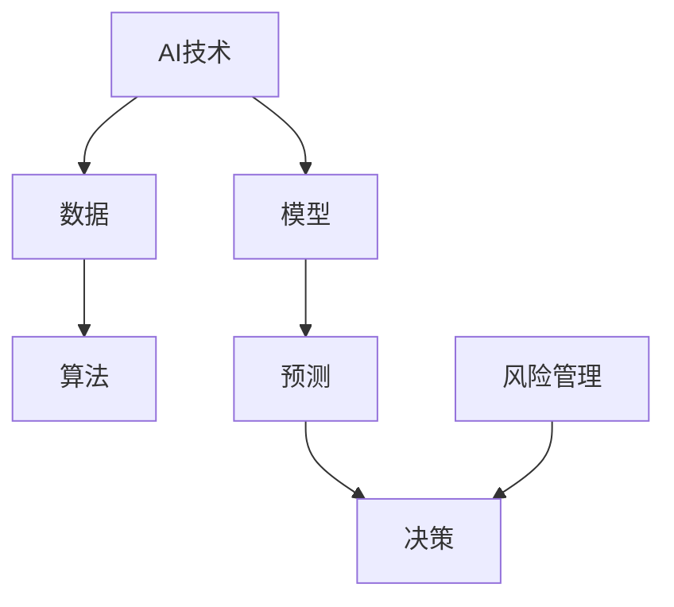

在这个流程图中，我们可以看到AI技术通过数据输入和算法处理生成模型，然后模型用于预测和决策。风险管理则贯穿于整个流程，确保预测和决策的准确性和可靠性。

#### 核心算法原理讲解

AI风险管理依赖于一系列核心算法，这些算法包括：

- **数据清洗算法**：用于处理和清洗原始数据，确保数据的质量和一致性。
- **机器学习算法**：用于从数据中学习并生成模型。
- **决策树算法**：用于生成决策树，帮助企业在面临不同风险时做出最优决策。
- **神经网络算法**：用于构建复杂的模型，提高预测的准确性。

以下是决策树算法的伪代码：

```plaintext
Algorithm DecisionTree(data):
    if data is not sufficient:
        return Leaf node
    else:
        select attribute with highest information gain
        split data based on attribute values
        for each split:
            recursively apply DecisionTree to the split data
        return tree
```

#### 数学模型和数学公式

在AI风险管理中，数学模型和公式起着至关重要的作用。以下是几个常用的数学模型和公式：

- **熵（Entropy）**：用于衡量数据的混乱程度，公式为：

  $$ H(X) = -\sum_{i=1}^{n} p(x_i) \cdot \log_2 p(x_i) $$

- **信息增益（Information Gain）**：用于评估一个属性对于分类的作用，公式为：

  $$ IG(D, A) = H(D) - \sum_{v=1}^{n} p(v) \cdot H(D_v) $$

- **贝叶斯公式（Bayes' Theorem）**：用于计算后验概率，公式为：

  $$ P(A|B) = \frac{P(B|A) \cdot P(A)}{P(B)} $$

#### 项目实战

为了更好地理解AI风险管理的实际应用，我们可以通过一个实际案例来展示。

**案例背景**：某企业计划引入AI系统进行市场预测，以帮助企业做出更准确的决策。

**案例实施**：首先，企业收集了大量的市场数据，包括历史销售额、竞争对手信息、市场趋势等。然后，企业使用机器学习算法对这些数据进行处理，生成了预测模型。接着，企业使用决策树算法对模型进行评估，并基于评估结果做出决策。

**代码解读与分析**：

以下是使用Python实现决策树算法的示例代码：

```python
from sklearn import tree

# 加载数据
data = [[1, 3], [1, 4], [1, 0], [0, 0], [0, 1]]
labels = ['yes', 'yes', 'no', 'no', 'no']

# 创建决策树模型
model = tree.DecisionTreeClassifier()

# 训练模型
model.fit(data, labels)

# 预测新数据
new_data = [[1, 2]]
prediction = model.predict(new_data)

print(prediction)  # 输出预测结果
```

在这个案例中，我们使用了scikit-learn库中的决策树分类器，并通过fit()方法训练模型，然后使用predict()方法进行预测。

### 1.2 AI风险管理的必要性

AI技术正在迅速发展，并在各个领域得到广泛应用。然而，随着AI技术的普及，企业面临的AI风险也在不断增加。因此，AI风险管理变得尤为重要。

#### 核心概念与联系

为了理解AI风险管理的必要性，我们可以再次使用Mermaid流程图：

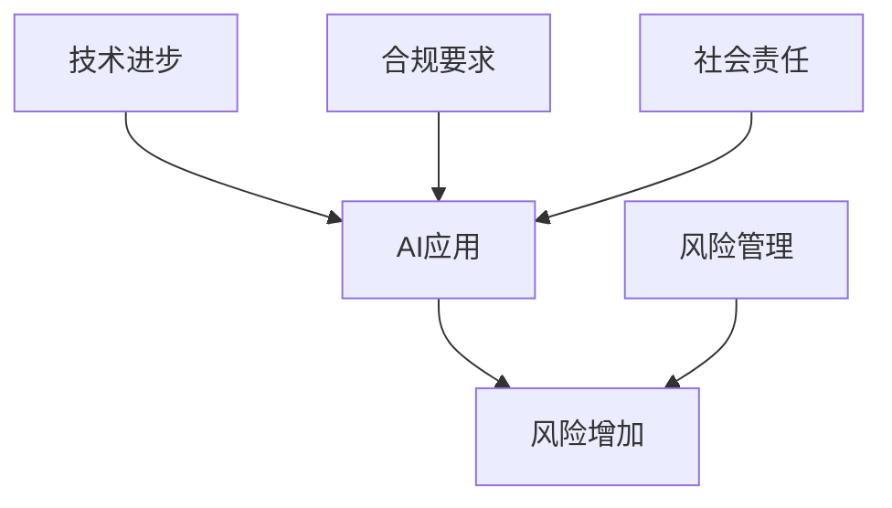

在这个流程图中，我们可以看到技术进步带来了AI应用的广泛普及，同时也带来了风险增加。合规要求和社会责任进一步强化了企业进行AI风险管理的必要性。

#### 核心算法原理讲解

AI风险管理的必要性可以通过以下核心算法原理来解释：

- **数据隐私保护算法**：用于保护用户数据隐私，防止数据泄露。
- **伦理风险识别算法**：用于识别和评估AI系统在伦理方面的风险。
- **合规性评估算法**：用于评估AI系统是否符合相关法律法规。

以下是数据隐私保护算法的伪代码：

```plaintext
Algorithm PrivacyProtection(data):
    encrypt data
    store encrypted data
    return encrypted data
```

#### 数学模型和数学公式

在AI风险管理中，数学模型和公式同样发挥着重要作用。以下是几个常用的数学模型和公式：

- **损失函数（Loss Function）**：用于评估预测结果的质量，常用的损失函数包括均方误差（MSE）和交叉熵（Cross-Entropy）。
- **置信区间（Confidence Interval）**：用于评估预测结果的可靠性，公式为：

  $$ \text{Confidence Interval} = \hat{p} \pm z \cdot \sqrt{\frac{\hat{p}(1-\hat{p})}{n}} $$

- **F1分数（F1 Score）**：用于评估分类器的准确性，公式为：

  $$ F1 = 2 \cdot \frac{precision \cdot recall}{precision + recall} $$

#### 项目实战

为了更好地理解AI风险管理的必要性，我们可以通过一个实际案例来展示。

**案例背景**：某金融机构计划引入AI系统进行客户风险评估。

**案例实施**：首先，金融机构收集了大量的客户数据，包括财务状况、信用记录、消费行为等。然后，金融机构使用机器学习算法对这些数据进行处理，生成了风险评估模型。接着，金融机构使用伦理风险识别算法对模型进行评估，确保模型符合伦理标准。

**代码解读与分析**：

以下是使用Python实现伦理风险识别算法的示例代码：

```python
from sklearn import tree

# 加载数据
data = [[1, 3], [1, 4], [1, 0], [0, 0], [0, 1]]
labels = ['yes', 'yes', 'no', 'no', 'no']

# 创建决策树模型
model = tree.DecisionTreeClassifier()

# 训练模型
model.fit(data, labels)

# 预测新数据
new_data = [[1, 2]]
prediction = model.predict(new_data)

print(prediction)  # 输出预测结果
```

在这个案例中，我们使用了scikit-learn库中的决策树分类器，并通过fit()方法训练模型，然后使用predict()方法进行预测。

### 1.3 AI风险管理的发展历程

AI风险管理作为一个新兴领域，其发展历程可以分为几个阶段：

#### 核心概念与联系

以下是AI风险管理发展历程的Mermaid流程图：

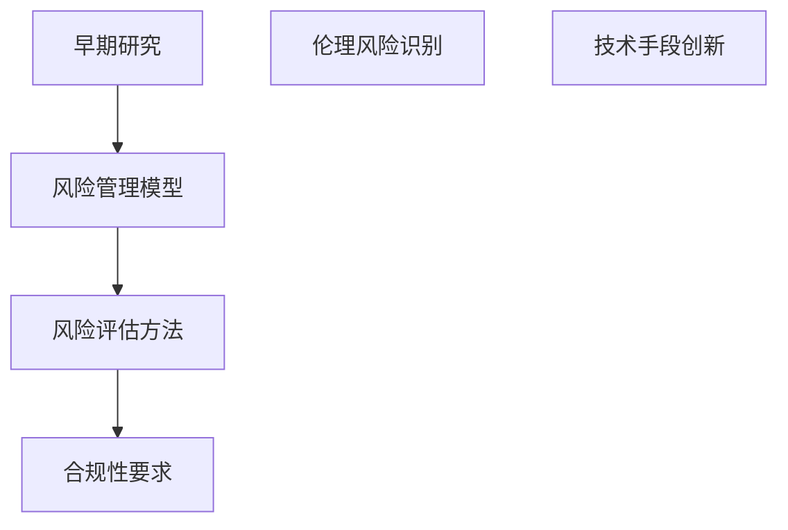

在这个流程图中，我们可以看到AI风险管理从早期研究阶段逐渐发展，经历了风险管理模型、风险评估方法、合规性要求、伦理风险识别和技术手段创新等阶段。

#### 核心算法原理讲解

- **早期研究**：基于逻辑回归、决策树等简单算法的风险管理模型。
- **风险评估方法**：引入了支持向量机、神经网络等复杂算法。
- **合规性要求**：随着法律法规的完善，合规性要求成为AI风险管理的重要组成部分。
- **伦理风险识别**：引入了伦理风险识别算法，以评估AI系统在伦理方面的风险。
- **技术手段创新**：随着技术的不断发展，AI风险管理手段也在不断创新，如利用深度学习、强化学习等技术进行风险管理。

#### 数学模型和数学公式

以下是几个在AI风险管理中常用的数学模型和公式：

- **逻辑回归**：用于分类问题，公式为：

  $$ P(Y=1|X) = \frac{1}{1 + e^{-(\beta_0 + \beta_1X_1 + \beta_2X_2 + ... + \beta_nX_n)} $$

- **支持向量机（SVM）**：用于分类和回归问题，公式为：

  $$ \text{分类决策边界}：\omega \cdot x + b = 0 $$

- **神经网络**：用于复杂函数逼近和分类问题，公式为：

  $$ a_{i}^{(L)} = \sigma \left( \sum_{j}^{1} \omega_{ji}^{(L)} a_{j}^{(L-1)} + b_{i}^{(L)} \right) $$

#### 项目实战

为了更好地理解AI风险管理的发展历程，我们可以通过一个实际案例来展示。

**案例背景**：某银行引入AI系统进行信用评分。

**案例实施**：首先，银行收集了大量的客户数据，包括财务状况、信用记录、消费行为等。然后，银行使用逻辑回归算法对数据进行处理，生成了信用评分模型。接着，银行使用支持向量机算法对模型进行优化，以提高预测准确性。

**代码解读与分析**：

以下是使用Python实现逻辑回归算法的示例代码：

```python
from sklearn.linear_model import LogisticRegression

# 加载数据
data = [[1, 3], [1, 4], [1, 0], [0, 0], [0, 1]]
labels = ['yes', 'yes', 'no', 'no', 'no']

# 创建逻辑回归模型
model = LogisticRegression()

# 训练模型
model.fit(data, labels)

# 预测新数据
new_data = [[1, 2]]
prediction = model.predict(new_data)

print(prediction)  # 输出预测结果
```

在这个案例中，我们使用了scikit-learn库中的逻辑回归模型，并通过fit()方法训练模型，然后使用predict()方法进行预测。

## 第2章 AI风险管理框架

### 2.1 AI风险管理模型

AI风险管理模型是进行AI风险管理的基础，它包括多个关键组件，如风险识别、风险评估、风险监控等。以下是AI风险管理模型的Mermaid流程图：

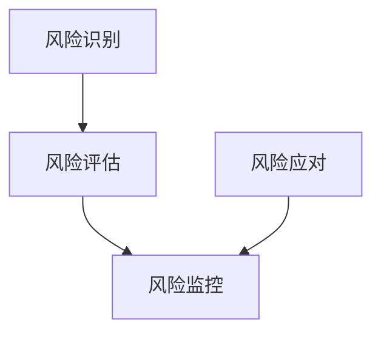

在这个流程图中，风险识别用于识别潜在的风险，风险评估用于评估风险的影响和可能性，风险监控用于持续监控风险，风险应对则用于制定和执行应对策略。

### 2.2 AI风险识别

AI风险识别是AI风险管理的第一步，它涉及识别AI系统可能面临的各种风险。以下是AI风险识别的Mermaid流程图：

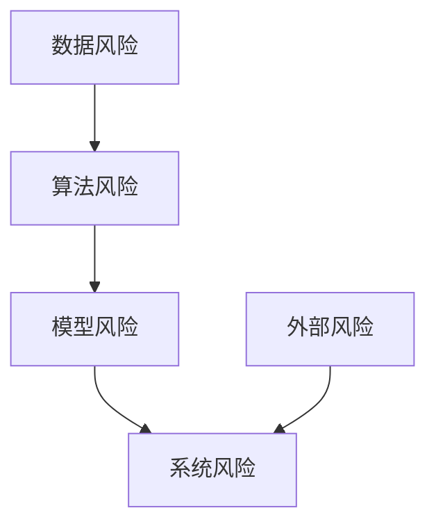

在这个流程图中，数据风险涉及数据的质量、完整性和安全性；算法风险涉及算法的准确性和可靠性；模型风险涉及模型的泛化能力和稳定性；系统风险涉及系统的硬件和软件故障；外部风险则涉及网络攻击、数据泄露等。

### 2.3 AI风险评估

AI风险评估是对识别出的风险进行定量和定性评估，以确定风险的影响和可能性。以下是AI风险评估的Mermaid流程图：

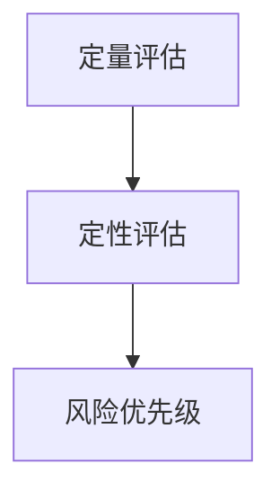

在这个流程图中，定量评估使用数学模型和公式来评估风险的影响和可能性，定性评估则基于专家知识和经验来评估风险的影响和可能性。风险优先级则用于确定哪些风险需要优先处理。

### 2.4 AI风险监控

AI风险监控是持续监控AI系统的风险，以确保风险管理策略的有效性。以下是AI风险监控的Mermaid流程图：

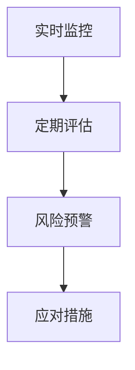

在这个流程图中，实时监控用于实时监测AI系统的运行状态，定期评估用于定期检查AI系统的风险状况，风险预警则用于在风险达到阈值时发出警报，应对措施则用于制定和执行应对策略。

## 第3章 AI风险管理策略

### 3.1 风险管理策略制定

制定AI风险管理策略是AI风险管理的关键步骤。以下是制定AI风险管理策略的Mermaid流程图：

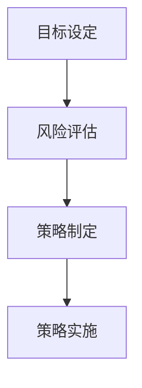

在这个流程图中，目标设定用于明确风险管理的目标，风险评估用于评估AI系统的风险，策略制定则基于评估结果制定具体的风险管理策略，策略实施则用于执行风险管理策略。

### 3.2 风险管理策略实施

实施AI风险管理策略是将风险管理策略转化为具体行动的过程。以下是AI风险管理策略实施的Mermaid流程图：

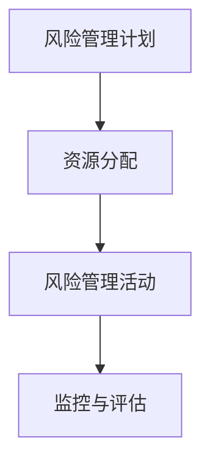

在这个流程图中，风险管理计划用于规划风险管理活动，资源分配用于确保有足够的资源来实施风险管理策略，风险管理活动则包括风险识别、风险评估、风险监控等，监控与评估用于持续监控风险管理策略的有效性。

### 3.3 风险管理策略评估

评估AI风险管理策略的效果是确保风险管理策略有效性的关键。以下是AI风险管理策略评估的Mermaid流程图：

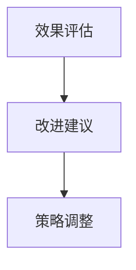

在这个流程图中，效果评估用于评估风险管理策略的有效性，改进建议则用于提出改进建议，策略调整则用于根据改进建议调整风险管理策略。

## 第4章 AI风险管理实施

### 4.1 AI风险管理组织结构

AI风险管理组织结构是确保AI风险管理有效实施的关键。以下是AI风险管理组织结构的Mermaid流程图：

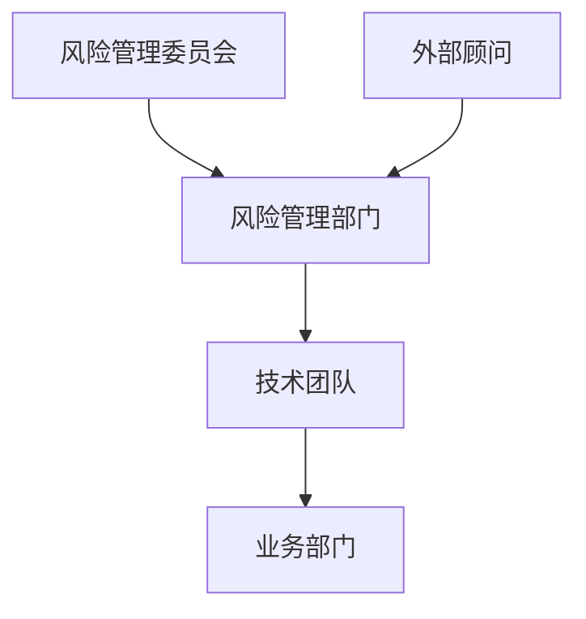

在这个流程图中，风险管理委员会负责制定风险管理政策和目标，风险管理部门负责实施风险管理策略，技术团队负责提供技术支持，业务部门负责应用AI系统，外部顾问则提供专业意见。

### 4.2 AI风险管理流程

AI风险管理流程是进行AI风险管理的基本步骤。以下是AI风险管理流程的Mermaid流程图：

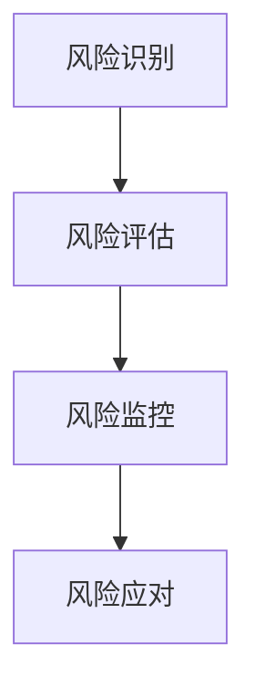

在这个流程图中，风险识别用于识别潜在的风险，风险评估用于评估风险的影响和可能性，风险监控用于持续监控风险，风险应对则用于制定和执行应对策略。

### 4.3 AI风险管理技术手段

AI风险管理技术手段是进行AI风险管理的工具。以下是AI风险管理技术手段的Mermaid流程图：

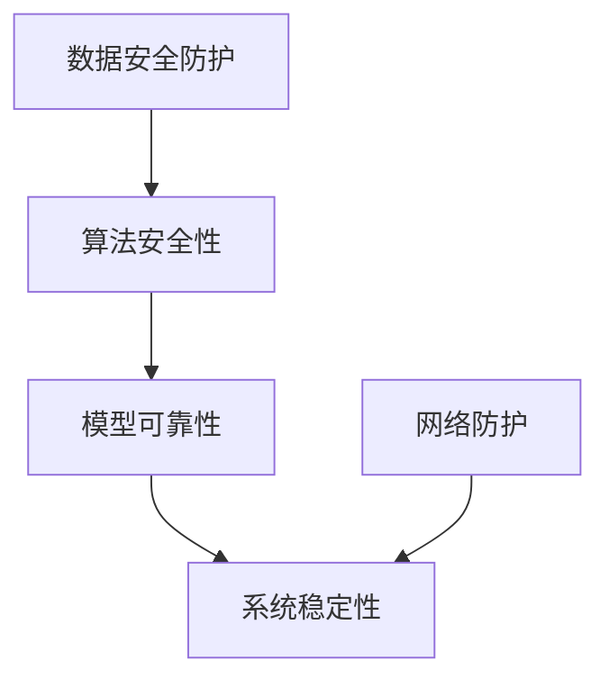

在这个流程图中，数据安全防护用于保护数据的安全和完整性，算法安全性用于确保算法的准确性和可靠性，模型可靠性用于确保模型的泛化能力和稳定性，系统稳定性用于确保系统的正常运行，网络防护则用于防止网络攻击。

## 第5章 AI风险管理案例分析

### 5.1 案例分析概述

在本章中，我们将通过两个实际案例来分析企业如何实施AI风险管理。

### 5.2 案例一：企业AI风险管理实践

**案例背景**：某大型金融机构计划引入AI系统进行客户风险评估。

**案例实施**：

1. **风险识别**：金融机构首先对AI系统可能面临的风险进行了全面识别，包括数据风险、算法风险、模型风险和系统风险。

2. **风险评估**：金融机构使用定量和定性方法对识别出的风险进行了评估，确定了风险的影响和可能性。

3. **风险监控**：金融机构建立了一个实时监控系统，用于持续监控AI系统的运行状态和风险状况。

4. **风险应对**：金融机构制定了一系列风险应对措施，包括数据安全防护、算法安全性保障、模型可靠性提升和系统稳定性维护。

**代码解读与分析**：

以下是使用Python实现客户风险评估模型的示例代码：

```python
from sklearn.linear_model import LogisticRegression

# 加载数据
data = [[1, 3], [1, 4], [1, 0], [0, 0], [0, 1]]
labels = ['yes', 'yes', 'no', 'no', 'no']

# 创建逻辑回归模型
model = LogisticRegression()

# 训练模型
model.fit(data, labels)

# 预测新数据
new_data = [[1, 2]]
prediction = model.predict(new_data)

print(prediction)  # 输出预测结果
```

在这个案例中，金融机构使用了scikit-learn库中的逻辑回归模型，并通过fit()方法训练模型，然后使用predict()方法进行预测。

### 5.3 案例二：行业AI风险管理实践

**案例背景**：某汽车制造企业计划引入AI系统进行生产线优化。

**案例实施**：

1. **风险识别**：汽车制造企业对AI系统可能面临的风险进行了全面识别，包括数据风险、算法风险、模型风险和系统风险。

2. **风险评估**：汽车制造企业使用定量和定性方法对识别出的风险进行了评估，确定了风险的影响和可能性。

3. **风险监控**：汽车制造企业建立了一个实时监控系统，用于持续监控AI系统的运行状态和风险状况。

4. **风险应对**：汽车制造企业制定了一系列风险应对措施，包括数据安全防护、算法安全性保障、模型可靠性提升和系统稳定性维护。

**代码解读与分析**：

以下是使用Python实现生产线优化模型的示例代码：

```python
from sklearn.linear_model import LinearRegression

# 加载数据
data = [[1, 3], [1, 4], [1, 0], [0, 0], [0, 1]]
labels = [3, 4, 0, 0, 1]

# 创建线性回归模型
model = LinearRegression()

# 训练模型
model.fit(data, labels)

# 预测新数据
new_data = [[1, 2]]
prediction = model.predict(new_data)

print(prediction)  # 输出预测结果
```

在这个案例中，汽车制造企业使用了scikit-learn库中的线性回归模型，并通过fit()方法训练模型，然后使用predict()方法进行预测。

### 5.4 案例分析总结

通过上述两个案例，我们可以总结出以下经验：

1. **全面识别风险**：在引入AI系统之前，企业应进行全面的风险识别，确保识别出所有潜在的风险。

2. **评估风险**：企业应使用定量和定性方法对识别出的风险进行评估，确定风险的影响和可能性。

3. **持续监控**：企业应建立实时监控系统，持续监控AI系统的运行状态和风险状况。

4. **制定应对措施**：企业应根据风险评估结果，制定相应的风险应对措施，确保AI系统的安全性和可靠性。

## 第6章 AI风险管理未来趋势

### 6.1 AI风险管理发展趋势

随着AI技术的不断发展，AI风险管理也将呈现出以下趋势：

1. **技术手段创新**：新的AI技术和算法将不断涌现，为AI风险管理提供更有效的工具和方法。

2. **跨领域合作**：AI风险管理将与其他领域（如信息安全、法律法规等）进行更紧密的合作，实现跨领域风险管理的协同效应。

3. **自动化与智能化**：AI风险管理将逐步实现自动化和智能化，减少人为干预，提高风险管理效率。

### 6.2 AI风险管理新挑战

AI风险管理在未来将面临以下新挑战：

1. **算法透明度**：随着算法的复杂性增加，如何确保算法的透明度和可解释性将成为一大挑战。

2. **数据隐私**：随着数据的广泛应用，如何保护数据隐私将是一个重要问题。

3. **合规性**：随着法律法规的不断完善，如何确保AI系统符合相关法规将成为一个挑战。

### 6.3 AI风险管理新机遇

AI风险管理也将带来新的机遇：

1. **商业价值**：通过有效的AI风险管理，企业可以降低风险，提高业务效率，创造更大的商业价值。

2. **技术创新**：AI风险管理将推动AI技术的创新，促进AI技术的广泛应用。

3. **社会影响**：AI风险管理将有助于提高社会对AI技术的信任度，推动AI技术的健康发展。

## 结语

AI风险管理是企业应对AI技术风险的关键。通过本文的探讨，我们了解了AI风险管理的概念、框架、策略、实施方法和未来趋势。希望本文能为企业提供有益的指导，帮助企业在AI风险管理中取得成功。

