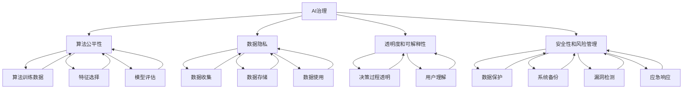
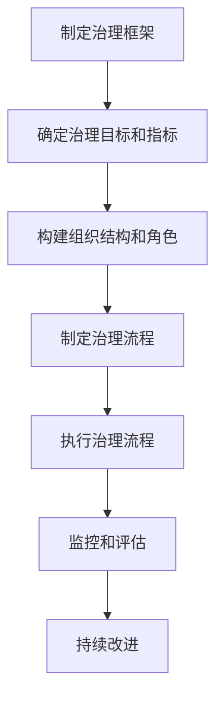

                 

### 文章标题

《企业如何构建和实施有效的AI治理策略》

### 关键词

人工智能治理、企业AI治理策略、AI伦理、AI风险管理、AI框架设计

### 摘要

本文将深入探讨企业如何在快速发展的AI时代构建和实施有效的AI治理策略。通过分析AI治理的核心概念、构建原则和实施步骤，并结合实际案例，提供详细的指导和建议。文章旨在帮助企业理解和应对AI治理的挑战，实现技术创新与合规性的平衡。

---

### 引言

在人工智能（AI）技术迅速发展的背景下，企业面临着一个前所未有的机遇和挑战。一方面，AI技术的创新和应用为企业带来了巨大的商业价值；另一方面，AI的广泛部署也引发了一系列治理问题，如数据隐私、算法公平性、安全风险等。如何在这片新兴的领域内构建和实施有效的AI治理策略，已经成为企业面临的重大课题。

本文将围绕这一核心问题，首先介绍AI治理的基本概念和重要性，然后详细探讨构建和实施AI治理策略的步骤和方法，并结合实际案例进行分析，提供实用的指导和建议。通过这篇文章，我们希望能够帮助企业在AI治理方面做出明智的决策，实现技术进步与合规性的双赢。

### AI治理的基本概念

#### 定义

AI治理是指通过一系列的规则、政策和措施，确保人工智能技术在企业的开发、部署和应用过程中，符合法律法规、道德伦理和商业准则。它不仅涉及到技术层面的规范，还包括组织管理、数据隐私、算法透明度和责任分配等多个方面。

#### 核心概念

1. **算法公平性**：确保AI算法在决策过程中不带有偏见，对所有人都是公平的。这涉及到算法的训练数据、特征选择和模型评估等多个方面。

2. **数据隐私**：在AI应用中，数据隐私保护是至关重要的。企业需要确保收集、存储和使用的数据符合相关法律法规，并采取有效的措施保护用户隐私。

3. **透明度和可解释性**：AI系统的决策过程应该是透明的，用户和监管机构能够理解AI是如何做出决策的。这有助于提高用户的信任度，并确保AI系统的合规性。

4. **安全性和风险管理**：AI系统需要具备较高的安全性和可靠性，以防止潜在的威胁和风险。这包括数据保护、系统备份、漏洞检测和应急响应等多个方面。

#### 关系架构

为了更好地理解这些核心概念之间的关系，我们可以使用Mermaid流程图来展示它们之间的关联：

#### Mermaid流程图解释

- **AI治理**是整体框架，涵盖算法公平性、数据隐私、透明度和可解释性、安全性和风险管理。
- **算法公平性**依赖于**算法训练数据**、**特征选择**和**模型评估**。
- **数据隐私**涉及**数据收集**、**数据存储**和**数据使用**。
- **透明度和可解释性**关注**决策过程透明**和**用户理解**。
- **安全性和风险管理**包括**数据保护**、**系统备份**、**漏洞检测**和**应急响应**。

通过这个流程图，我们可以清晰地看到AI治理中各个核心概念之间的关系和相互作用。

### 构建AI治理策略

#### 制定治理框架

构建AI治理策略的第一步是制定一个全面的治理框架。这个框架应该包括以下关键要素：

1. **治理目标和指标**：明确AI治理的具体目标和预期达到的指标，例如提高算法的公平性、保护用户隐私、确保系统的安全性等。

2. **组织结构和角色**：确定负责AI治理的各个组织单位和角色，包括治理委员会、技术团队、合规部门等。明确各角色的职责和权限。

3. **流程和流程图**：制定清晰的AI治理流程，并使用流程图进行可视化，确保所有相关人员都能理解和遵循。

#### 确定治理目标和指标

治理目标的设定需要结合企业的业务需求和行业规范。以下是一些常见的治理目标：

1. **算法公平性**：确保AI算法在决策过程中不会对特定群体产生偏见。
2. **数据隐私**：保护用户数据的隐私，确保数据收集、存储和使用符合相关法律法规。
3. **透明度和可解释性**：提高AI系统的透明度，使决策过程可解释，增强用户和监管机构的信任。
4. **安全性和风险管理**：确保AI系统的安全性和可靠性，制定有效的风险管理策略。

治理指标的选择应根据治理目标来确定。例如：

1. **算法公平性指标**：算法的偏见度、数据偏差率、偏见修正效果等。
2. **数据隐私指标**：数据泄露率、用户隐私投诉率、隐私保护措施的执行情况等。
3. **透明度和可解释性指标**：决策过程的透明度、用户的理解程度、监管机构的满意度等。
4. **安全性和风险管理指标**：系统漏洞的发现率、应急响应的时间、风险事件的影响等。

#### 构建组织结构和角色

在构建AI治理组织结构时，需要考虑以下几个关键角色：

1. **治理委员会**：负责制定AI治理的战略和决策，监督AI治理的执行情况。通常由高级管理层和相关部门的负责人组成。
2. **技术团队**：负责AI系统的开发、测试和维护，确保AI算法的公平性、透明度和安全性。技术团队通常包括数据科学家、工程师和AI研究员等。
3. **合规部门**：负责确保AI系统的合规性，包括遵守相关法律法规和行业标准。合规部门通常由法律顾问和合规专员组成。

#### 流程和流程图

制定清晰的AI治理流程和流程图是确保治理策略有效执行的重要步骤。以下是一个简化的AI治理流程图：

#### 流程图解释

- **制定治理框架**：包括治理目标和指标、组织结构和角色、治理流程等。
- **确定治理目标和指标**：明确AI治理的具体目标和指标。
- **构建组织结构和角色**：确定负责AI治理的各个组织和角色。
- **制定治理流程**：制定清晰的AI治理流程，包括执行、监控和评估等步骤。
- **执行治理流程**：按照治理流程进行操作，确保AI治理的有效实施。
- **监控和评估**：监控AI治理的执行情况，评估治理效果。
- **持续改进**：根据监控和评估结果，持续改进AI治理策略。

通过这个流程图，企业可以确保AI治理策略的各个环节都有明确的责任和流程，从而提高治理效果。

### 实施AI治理策略

#### 实施规划

实施AI治理策略的第一步是制定详细的实施规划。这个规划应包括以下几个关键步骤：

1. **资源分配**：明确实施AI治理策略所需的资源，包括人力、资金、技术和时间等。
2. **时间表**：制定实施AI治理策略的具体时间表，确保各项任务按时完成。
3. **风险管理**：识别和评估可能的风险，制定相应的风险应对策略。

#### 技术实施

在实施AI治理策略的过程中，技术实施是关键环节。以下是一些重要的技术实施步骤：

1. **数据管理**：确保数据的质量和完整性，包括数据收集、存储、处理和分析等。
2. **算法评估**：对AI算法进行评估，确保算法的公平性、透明度和安全性。
3. **系统安全**：加强系统的安全措施，包括数据加密、权限控制、漏洞检测和应急响应等。

#### 风险管理

在实施AI治理策略时，风险管理至关重要。以下是一些关键的风险管理步骤：

1. **风险评估**：对AI治理策略实施过程中的风险进行评估，确定风险的严重程度和可能性。
2. **风险应对**：制定相应的风险应对策略，包括风险规避、风险转移和风险缓解等。
3. **应急响应**：制定应急响应计划，确保在发生风险时能够迅速响应并减少损失。

#### 实施流程

为了确保AI治理策略的有效实施，可以采用以下流程：

1. **制定实施计划**：明确实施步骤、时间表和资源需求。
2. **执行实施计划**：按照实施计划进行操作，确保各项任务按时完成。
3. **监控实施进度**：定期监控实施进度，确保各项任务按计划进行。
4. **评估实施效果**：对实施效果进行评估，根据评估结果进行改进。
5. **持续改进**：根据评估结果和反馈，持续改进AI治理策略。

#### 实施案例

以下是一个企业实施AI治理策略的案例：

- **企业背景**：某大型互联网公司，其业务涉及广泛，包括电子商务、社交媒体和在线广告等。
- **治理目标**：确保AI算法的公平性、透明度和安全性，保护用户隐私。
- **治理框架**：制定了一个全面的AI治理框架，包括治理目标和指标、组织结构和角色、治理流程等。
- **实施步骤**：
  - **资源分配**：成立了专门的AI治理委员会，负责制定和监督AI治理策略的实施。
  - **数据管理**：建立了严格的数据管理流程，确保数据的准确性和完整性。
  - **算法评估**：对AI算法进行定期评估，确保其公平性和透明度。
  - **系统安全**：加强了系统的安全措施，包括数据加密和权限控制等。
- **效果评估**：通过定期评估和用户反馈，发现并解决了多个潜在问题，提高了AI系统的公平性和透明度。

通过这个案例，我们可以看到企业如何通过实施AI治理策略，确保AI技术在业务中的应用符合法律法规和伦理标准，从而实现长期可持续发展。

### 案例分析

#### 成功案例

以下是一个成功实施AI治理策略的案例：

**企业背景**：某全球领先的金融科技公司，其业务包括线上金融服务、金融科技解决方案和风险控制等。

**治理目标**：确保AI算法的公平性、透明度和安全性，提高用户信任度，降低风险。

**治理框架**：

- **治理目标**：制定明确的治理目标，包括算法公平性、数据隐私保护、透明度和可解释性等。
- **组织结构**：设立AI治理委员会，由高层管理人员和相关部门负责人组成，负责制定和监督AI治理策略。
- **流程和流程图**：制定详细的AI治理流程图，确保AI系统的开发、测试和部署等环节符合治理要求。

**实施步骤**：

1. **资源分配**：分配必要的资源和预算，确保AI治理策略的有效实施。
2. **数据管理**：建立数据管理团队，负责数据收集、处理和存储，确保数据的准确性和完整性。
3. **算法评估**：定期对AI算法进行评估，确保算法的公平性、透明度和安全性。
4. **系统安全**：加强系统安全措施，包括数据加密、权限控制和漏洞检测等。

**效果评估**：

- **用户信任度**：通过定期评估和用户反馈，发现并解决了多个潜在问题，用户对AI系统的信任度显著提高。
- **风险管理**：通过有效的AI治理策略，降低了业务风险，提高了风险控制能力。

#### 失败案例

以下是一个未能成功实施AI治理策略的案例：

**企业背景**：某中型电子商务公司，其业务主要涉及在线零售和物流。

**治理目标**：确保AI算法的公平性、透明度和安全性，提高用户体验。

**治理框架**：

- **治理目标**：缺乏明确的治理目标和指标，导致治理策略不具体、不系统。
- **组织结构**：没有设立专门的AI治理委员会，治理责任分散，缺乏统一领导和协调。

**实施步骤**：

1. **资源分配**：资源分配不足，缺乏专业的人才和资金支持。
2. **数据管理**：数据管理不规范，数据质量和完整性无法保证。
3. **算法评估**：缺乏有效的算法评估机制，算法的公平性和透明度存在问题。
4. **系统安全**：系统安全措施不到位，易受攻击和漏洞威胁。

**效果评估**：

- **用户信任度**：由于AI算法存在偏见和透明度问题，用户对系统的信任度下降，投诉率增加。
- **风险管理**：由于缺乏有效的治理策略，业务风险增加，影响公司的运营和声誉。

### 案例总结与启示

通过以上成功和失败案例的分析，我们可以得出以下结论和启示：

1. **明确治理目标和指标**：制定明确的治理目标和指标是成功实施AI治理策略的关键。这有助于确保治理策略的具体性和可操作性。

2. **建立组织结构和角色**：设立专门的AI治理委员会，明确各角色的职责和权限，确保治理策略的统一领导和协调。

3. **加强数据管理和算法评估**：建立规范的数据管理流程和有效的算法评估机制，确保数据的准确性和完整性，提高算法的公平性和透明度。

4. **加强系统安全**：加强系统安全措施，包括数据加密、权限控制和漏洞检测等，确保系统的可靠性和安全性。

5. **持续改进和反馈**：通过定期评估和用户反馈，发现和解决问题，持续改进AI治理策略。

### 结论

构建和实施有效的AI治理策略是企业实现AI技术价值的关键。通过本文的探讨，我们了解了AI治理的基本概念、核心要素和实施步骤，并结合实际案例提供了详细的指导和建议。企业应根据自身情况和业务需求，制定符合实际的有效AI治理策略，确保AI技术的合规性和可持续性。

### 作者信息

作者：AI天才研究院/AI Genius Institute & 禅与计算机程序设计艺术 /Zen And The Art of Computer Programming

---

本文结合理论分析和实际案例，深入探讨了企业如何构建和实施有效的AI治理策略。通过明确治理目标和指标、建立组织结构和角色、加强数据管理和算法评估、加强系统安全以及持续改进和反馈，企业可以确保AI技术的合规性和可持续性，实现技术创新与合规性的平衡。希望本文能为企业在AI治理方面的决策提供有益的参考和启示。

