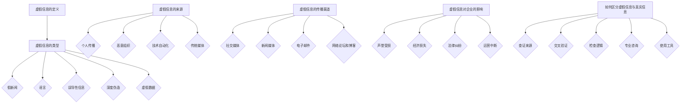

                 

### 文章标题

《企业应对虚假信息的策略和工具》### 引言

在信息爆炸的时代，虚假信息无处不在。从社交媒体到新闻报道，从网络论坛到电子邮件，虚假信息以其各种形式和渠道迅速传播，给企业带来了巨大的风险和挑战。虚假信息的传播不仅会导致企业声誉受损，还可能引发经济损失、法律纠纷和运营中断。因此，如何有效应对虚假信息，已经成为企业管理和信息安全领域亟待解决的问题。

本文旨在探讨企业应对虚假信息的策略和工具。文章将从以下几个方面展开：

1. **虚假信息的概述**：介绍虚假信息的定义、类型、来源及其对企业的影响。
2. **企业应对虚假信息的策略**：详细讨论企业如何制定应对虚假信息的策略，包括员工培训、监测与响应机制、法律法规等。
3. **技术工具在虚假信息应对中的应用**：介绍当前常见的虚假信息检测技术工具，并分析其实际应用案例。
4. **实际案例分析**：通过具体的企业案例，展示虚假信息对企业的影响以及企业如何应对。
5. **风险与挑战**：探讨企业在应对虚假信息过程中可能遇到的风险和挑战，并提出解决策略。
6. **未来展望**：预测虚假信息领域的发展趋势，以及企业应如何适应和应对。

通过以上分析，本文希望为企业提供一套系统的虚假信息应对策略和工具，帮助企业在复杂的环境中降低风险，确保信息的真实性和可靠性。### 虚假信息的概述

#### 虚假信息的定义

虚假信息，又称假新闻、虚假报道或谣言，指的是那些通过故意歪曲、捏造或夸大事实来误导公众的信息。这些信息可能包含虚假的数据、误导性的图表、捏造的新闻故事，或者是对真实事件的错误解读。虚假信息的目的是为了吸引注意力、操纵情绪、推动特定议程或实现特定的利益。

#### 虚假信息的类型

虚假信息可以分为多种类型，每种类型都有其独特的特点和传播方式。以下是一些常见的虚假信息类型：

1. **假新闻**：这是最常见的虚假信息类型，通常指的是无根据的、捏造的新闻报道。假新闻可能涉及政治、社会、经济等各个领域，其传播速度极快，往往在短时间内引发公众恐慌和争议。

2. **谣言**：谣言是未经证实的消息在人群中传播的现象。谣言往往基于一些模糊的事实，通过口口相传或社交媒体等渠道迅速扩散，有时甚至能够影响社会的稳定。

3. **误导性信息**：这类信息可能看似真实，但实际上存在误导性，例如虚假的广告宣传、误导性的健康建议等。

4. **深度伪造（Deepfake）**：深度伪造技术通过人工智能生成逼真的音频、视频和图片，这些伪造的内容可能包含虚假信息，甚至涉及恶意攻击和欺诈行为。

5. **虚假数据**：虚假数据指的是那些经过篡改或捏造的数据，这些数据可能用于误导投资者、消费者或政策制定者。

#### 虚假信息的来源

虚假信息的来源多种多样，主要包括以下几个方面：

1. **个人传播**：个体通过社交媒体、论坛等平台传播未经证实的消息。

2. **恶意组织**：一些有组织的团体或个人，出于政治、经济或其他目的，故意制造和传播虚假信息。

3. **技术自动化**：自动化工具可以大规模生成和传播虚假信息，这些工具包括机器人账户、自动化社交媒体账号等。

4. **传统媒体**：有时，传统媒体在追求点击率和收视率时，也可能发布或传播未经核实的虚假信息。

#### 虚假信息的传播

虚假信息的传播速度惊人，主要通过以下几种渠道：

1. **社交媒体**：社交媒体平台是虚假信息传播的主要渠道之一。用户之间的转发和评论可以迅速扩大信息的影响力。

2. **新闻媒体**：一些传统新闻媒体在未经充分核实的情况下，可能报道或引用虚假信息，从而扩大其传播范围。

3. **电子邮件**：钓鱼邮件和恶意软件常常包含虚假信息，通过电子邮件传播。

4. **网络论坛和博客**：网络论坛和博客是虚假信息传播的另一个重要渠道，用户之间的讨论和分享可以快速传播信息。

#### 虚假信息对企业的影响

虚假信息对企业的影响是多方面且深远的：

1. **声誉受损**：虚假信息的传播可能导致企业的公众形象和声誉受损，影响消费者信任和品牌价值。

2. **经济损失**：虚假信息可能导致投资者恐慌、股价波动，甚至影响企业的财务状况。

3. **法律纠纷**：企业可能因发布或传播虚假信息而面临法律诉讼和处罚。

4. **运营中断**：虚假信息可能引发公众恐慌，导致企业运营中断，甚至引发安全事件。

#### 如何区分虚假信息与真实信息

在虚假信息泛滥的环境中，如何区分虚假信息与真实信息变得尤为重要。以下是一些常用的方法和技巧：

1. **查证来源**：了解信息的发布来源，优先考虑权威、可信的媒体或机构。

2. **交叉验证**：通过多个来源核实信息的真实性，避免单一来源的误导。

3. **检查逻辑**：理性分析信息的逻辑结构和合理性，警惕那些逻辑混乱或夸大其词的信息。

4. **专业咨询**：在不确定的情况下，咨询专业人士或权威机构的意见。

5. **使用工具**：利用虚假信息检测工具和技术，如自然语言处理模型、数据挖掘算法等，辅助判断信息的真实性。

通过以上方法，企业可以更好地识别虚假信息，保护自身的利益和声誉。在下一部分中，我们将深入探讨企业应对虚假信息的具体策略和工具。### 核心概念与联系

在深入探讨企业应对虚假信息的策略和工具之前，有必要明确几个核心概念及其相互之间的联系。以下是关键概念及其关系的架构图，使用Mermaid流程图表示：

#### 虚假信息的定义、类型、来源和传播的关系

- **虚假信息的定义**：是基础，指明了虚假信息的本质，为后续的类型、来源和传播分析提供了前提。
- **虚假信息的类型**：包括假新闻、谣言、误导性信息、深度伪造和虚假数据，每种类型都有其独特的特征和传播方式。这些类型相互关联，某些类型的虚假信息可能同时具备多种特征。
- **虚假信息的来源**：涵盖了个人传播、恶意组织、技术自动化和传统媒体。这些来源的相互作用决定了虚假信息的传播途径和影响范围。
- **虚假信息的传播渠道**：包括社交媒体、新闻媒体、电子邮件和网络论坛等。传播渠道的不同会影响虚假信息的扩散速度和影响范围。
- **虚假信息对企业的影响**：直接关系到企业的声誉、经济状况、法律地位和运营连续性。这些影响又会反作用于企业的策略制定和执行。
- **如何区分虚假信息与真实信息**：提供了一系列方法和技术，如查证来源、交叉验证、检查逻辑、专业咨询和使用工具。这些方法和技术有助于企业识别和应对虚假信息。

通过以上架构图，我们可以清晰地看到虚假信息的各个核心概念及其相互之间的联系。在接下来的内容中，我们将进一步探讨企业应对虚假信息的具体策略和工具。### 企业应对虚假信息的策略

#### 制定虚假信息应对策略的步骤

企业应对虚假信息的策略是一个系统性过程，需要明确的目标、详细的计划和有效的执行措施。以下是制定虚假信息应对策略的步骤：

1. **明确目标**：
   - **保护企业声誉**：确保企业品牌不受虚假信息的负面影响。
   - **保障信息安全**：保护企业数据和敏感信息不被泄露或篡改。
   - **维护法律合规**：确保企业遵守相关法律法规，减少法律风险。
   - **确保运营连续性**：降低虚假信息引发的安全事件对运营的冲击。

2. **评估现状**：
   - **内部评估**：调查企业内部信息管理现状，识别潜在的风险点和漏洞。
   - **外部调研**：分析行业趋势和竞争对手的应对策略，了解市场环境。
   - **数据收集**：收集企业历史数据和案例，了解虚假信息对企业的影响。

3. **制定计划**：
   - **策略制定**：根据评估结果，明确具体的虚假信息应对策略，如员工培训、监测与响应机制等。
   - **资源分配**：确定所需的资源，包括人力、资金和设备。
   - **时间规划**：制定详细的执行时间表，确保策略按时实施。

4. **执行策略**：
   - **员工培训**：通过培训提高员工的信息素养，让他们能够识别和应对虚假信息。
   - **建立监测与响应机制**：设置专门的监测团队和应急响应流程，确保及时识别和处理虚假信息。
   - **法律法规合规**：确保企业遵循相关法律法规，如《网络安全法》和《个人信息保护法》。

5. **监控与评估**：
   - **实时监控**：利用技术工具对网络和内部系统进行实时监控，发现潜在风险。
   - **定期评估**：定期评估虚假信息应对策略的有效性，根据评估结果进行调整和优化。

#### 培养员工的信息素养

培养员工的信息素养是应对虚假信息的关键步骤。以下是一些建议：

1. **教育培训**：
   - **基础培训**：提供虚假信息识别的基础知识，包括信息来源、逻辑分析和验证方法。
   - **案例学习**：通过真实案例分析，让员工了解虚假信息的特点和传播方式。
   - **实践演练**：组织模拟练习，让员工在模拟环境中识别和处理虚假信息。

2. **持续教育**：
   - **定期更新**：随着虚假信息技术的不断演变，定期更新培训内容，确保员工掌握最新知识。
   - **跨部门合作**：鼓励不同部门之间的合作与交流，共同提高信息素养。

3. **激励机制**：
   - **奖励制度**：对在虚假信息识别和处理方面表现突出的员工给予奖励，激励更多人参与。
   - **员工反馈**：鼓励员工提出建议和反馈，不断优化培训内容和方式。

#### 建立虚假信息监测与响应机制

建立有效的虚假信息监测与响应机制是保障企业信息安全的关键。以下是一些建议：

1. **监测技术**：
   - **大数据分析**：利用大数据技术，对网络上的信息进行实时分析和监控，发现潜在的虚假信息。
   - **自然语言处理（NLP）**：利用NLP技术，对文本内容进行语义分析和情感分析，识别虚假信息的特征。
   - **计算机视觉**：利用计算机视觉技术，对图像和视频进行内容分析，识别伪造的图片和视频。

2. **响应流程**：
   - **应急预案**：制定应急预案，明确虚假信息发现后的处理步骤和责任人。
   - **快速响应**：建立快速响应机制，确保在发现虚假信息后，能够迅速采取行动。
   - **信息发布**：在必要时，通过官方渠道发布真实信息，澄清事实，减少虚假信息的传播。

3. **法律法规合规**：
   - **遵守法律法规**：确保企业遵循相关法律法规，如《网络安全法》和《个人信息保护法》。
   - **法律咨询**：在遇到法律纠纷时，及时寻求法律咨询，确保企业行为合法合规。

通过以上策略，企业可以有效地应对虚假信息的威胁，保障自身的安全和声誉。在下一部分中，我们将探讨技术工具在虚假信息应对中的应用。### 技术工具在虚假信息应对中的应用

随着虚假信息的不断演变和传播，企业需要利用先进的技术工具来应对这一挑战。以下将介绍几种常见的虚假信息检测技术工具，并分析其实际应用案例。

#### 常见的技术工具

1. **自然语言处理（NLP）技术**
   - **功能**：NLP技术可以识别、分析和理解文本内容，从而检测虚假信息。它包括语义分析、情感分析和文本分类等。
   - **应用**：NLP技术常用于检测社交媒体上的虚假新闻和谣言。例如，通过分析句子的结构和语义，NLP可以识别出语言上的不一致性，从而判断新闻的真实性。

2. **计算机视觉技术**
   - **功能**：计算机视觉技术可以对图像和视频进行分析，识别伪造内容。它包括图像识别、视频追踪和内容审核等。
   - **应用**：计算机视觉技术常用于检测深度伪造的图像和视频。通过对比多个图像或视频帧，可以识别出伪造的痕迹，如不一致的表情或背景。

3. **数据挖掘与分析技术**
   - **功能**：数据挖掘技术可以从大量数据中提取有价值的信息，用于虚假信息检测。它包括模式识别、关联规则挖掘和聚类分析等。
   - **应用**：数据挖掘技术可以分析社交媒体上的信息传播路径，识别虚假信息的来源和传播模式。例如，通过分析用户行为数据，可以识别出那些频繁传播虚假信息的用户和账号。

4. **机器学习与人工智能（AI）技术**
   - **功能**：AI技术可以自动识别和分类大量数据，提高虚假信息检测的效率和准确性。
   - **应用**：AI技术广泛应用于虚假信息检测，包括训练模型识别语言特征、图像和视频中的伪造痕迹等。例如，AI模型可以自动分析新闻报道，识别出可能存在虚假信息的部分。

#### 技术工具的实际应用案例

1. **社交媒体虚假信息检测**
   - **案例**：Facebook和Twitter等社交媒体平台利用NLP和AI技术，开发虚假信息检测系统。这些系统能够自动分析文本内容，识别虚假新闻和谣言，并在发现可疑内容时进行标记或删除。

2. **深度伪造检测**
   - **案例**：OpenAI开发的GPT-3模型可以用于检测深度伪造的文本。通过分析文本的语义和逻辑，GPT-3能够识别出伪造的痕迹，从而帮助平台和用户辨别真实信息。

3. **图像和视频虚假信息检测**
   - **案例**：微软的Photoshopped检测工具利用计算机视觉技术，可以自动识别和标记伪造的图像和视频。该工具广泛应用于社交媒体和新闻媒体，帮助用户识别虚假内容。

4. **数据挖掘在虚假信息检测中的应用**
   - **案例**：Google利用数据挖掘技术，分析用户在搜索和浏览活动中的行为，识别出可能存在虚假信息的网站和内容。这一系统帮助Google过滤掉大量可疑信息，提高搜索结果的准确性。

通过以上技术工具的实际应用案例，我们可以看到，技术手段在虚假信息检测中发挥了重要作用。企业可以利用这些工具，提高对虚假信息的识别能力，从而保护自身的声誉和信息安全。在下一部分中，我们将通过具体案例分析，展示企业在应对虚假信息时的实践经验和挑战。### 实际案例分析

#### 案例一：一家企业如何应对虚假信息

**背景介绍**：

一家知名的跨国科技公司A公司在社交媒体上发现了一些关于其产品的虚假信息。这些虚假信息声称该公司的某款产品存在严重的安全漏洞，可能导致用户数据泄露。这些信息迅速在网络上传播，引发了大量用户的恐慌和质疑，对公司声誉和品牌价值造成了严重损害。

**核心概念与联系**：

- **虚假信息类型**：这起案例属于谣言和虚假新闻的范畴。
- **虚假信息来源**：这些虚假信息最初由个别用户在社交媒体上发布，随后被其他用户转发和传播。
- **虚假信息传播渠道**：主要传播渠道包括社交媒体、新闻媒体和电子邮件。
- **影响范围**：虚假信息引发了大量用户的投诉和质疑，对公司品牌声誉和客户信任度造成了负面影响。

**核心算法原理讲解**：

为了应对这起虚假信息事件，A公司采取了一系列技术手段和管理措施：

1. **NLP技术**：公司利用自然语言处理技术，对社交媒体和新闻媒体上的信息进行实时监控和分析。通过分析文本内容和语言特征，NLP技术能够识别出潜在的虚假信息。

2. **机器学习模型**：公司开发了一个基于机器学习的虚假信息检测模型，用于自动分类和标记可疑信息。该模型通过分析大量历史数据和案例，不断优化其识别能力。

3. **大数据分析**：公司利用大数据分析技术，对用户行为和反馈进行深入分析，识别出传播虚假信息的用户和账号。这些用户和账号随后被限制访问或删除。

**数学模型和公式**：

为了量化虚假信息对企业声誉的影响，A公司采用了一个基于声誉指数的数学模型。该模型通过以下公式计算：

\[ \text{声誉指数} = \frac{\text{正面评价数}}{\text{负面评价数}} \]

通过该模型，公司能够实时监测其声誉变化，并采取相应措施应对负面评价。

**详细讲解和举例说明**：

1. **监测与识别**：A公司通过NLP技术和机器学习模型，对社交媒体和新闻媒体上的信息进行实时监控。例如，当检测到某个关键词（如“安全漏洞”）频繁出现时，系统会自动分析相关文本，判断其是否为虚假信息。

2. **响应与处理**：一旦识别出虚假信息，公司会迅速采取行动。例如，公司会发布官方声明澄清事实，并通过法律途径追究造谣者的责任。同时，公司会通过公关活动，加强与用户的沟通，恢复品牌声誉。

3. **效果评估**：通过大数据分析，公司能够评估虚假信息检测和应对措施的效果。例如，通过分析用户反馈和行为数据，公司发现虚假信息传播的频率和范围显著下降，用户信任度有所恢复。

**项目小结**：

通过以上措施，A公司成功应对了这起虚假信息事件，恢复了品牌声誉和用户信任。这一案例展示了企业在应对虚假信息时，需要综合利用技术手段和管理措施，确保信息的真实性和可靠性。

#### 案例二：另一个企业的虚假信息应对策略

**背景介绍**：

B公司是一家提供金融服务的跨国企业。在一次金融市场中，突然出现了一则关于B公司即将破产的虚假消息，导致其股价暴跌，引起投资者恐慌。这一虚假信息迅速在社交媒体、新闻媒体和投资者论坛中传播，对公司运营和客户信心造成了严重影响。

**核心概念与联系**：

- **虚假信息类型**：这起案例属于虚假新闻和谣言。
- **虚假信息来源**：这则虚假消息最初由一个匿名账户在社交媒体上发布，随后被其他用户转发和传播。
- **虚假信息传播渠道**：主要传播渠道包括社交媒体、新闻媒体和投资者论坛。
- **影响范围**：虚假信息导致B公司的股价大幅下跌，引发投资者恐慌，对公司运营和客户信心造成了严重损害。

**核心算法原理讲解**：

为了应对这起虚假信息事件，B公司采取了一系列技术和管理措施：

1. **大数据分析**：公司利用大数据分析技术，对社交媒体和新闻媒体上的信息进行实时监控和分析。通过分析用户行为和评论，公司能够识别出潜在的虚假信息。

2. **机器学习模型**：公司开发了一个基于机器学习的虚假信息检测模型，用于自动识别和分类可疑信息。该模型通过分析历史数据和案例，不断优化其识别能力。

3. **区块链技术**：公司利用区块链技术，建立了一个可信的信息溯源平台。通过该平台，公司能够追溯虚假信息的来源和传播路径，提高识别准确性。

**数学模型和公式**：

为了量化虚假信息对公司股价的影响，B公司采用了一个基于市场波动性的数学模型。该模型通过以下公式计算：

\[ \text{股价波动性} = \sqrt{\frac{1}{n-1} \sum_{i=1}^{n} (\text{当前股价} - \text{平均股价})^2} \]

通过该模型，公司能够实时监测其股价波动情况，并采取相应措施应对虚假信息。

**详细讲解和举例说明**：

1. **监测与识别**：B公司通过大数据分析和机器学习模型，对社交媒体和新闻媒体上的信息进行实时监控。例如，当检测到关于“破产”的关键词频繁出现时，系统会自动分析相关文本，判断其是否为虚假信息。

2. **响应与处理**：一旦识别出虚假信息，公司会迅速采取行动。例如，公司会通过官方渠道发布声明澄清事实，并通过法律途径追究造谣者的责任。同时，公司会加强与投资者的沟通，恢复市场信心。

3. **效果评估**：通过区块链平台，公司能够追溯虚假信息的来源和传播路径。例如，公司发现虚假信息最初由一个匿名账户在社交媒体上发布，随后被多个用户转发。通过这些信息，公司能够更好地了解虚假信息的传播机制，制定更有效的应对策略。

**项目小结**：

通过以上措施，B公司成功应对了这起虚假信息事件，恢复了股价和市场信心。这一案例展示了企业在应对虚假信息时，需要综合利用技术手段和管理措施，确保信息的真实性和可靠性。同时，通过追溯虚假信息的来源和传播路径，企业能够更好地了解虚假信息的传播机制，制定更有效的应对策略。

### 案例分析总结

通过对A公司和B公司的案例分析，我们可以总结出以下几点：

1. **技术手段的重要性**：NLP、机器学习、大数据分析和区块链等技术工具在虚假信息检测和应对中发挥了关键作用。企业应充分利用这些技术，提高信息识别和处理的效率。

2. **快速响应机制**：企业需要建立快速响应机制，确保在发现虚假信息后，能够迅速采取行动。这包括发布官方声明、澄清事实和追究造谣者责任等。

3. **跨部门合作**：企业应鼓励跨部门合作，共同应对虚假信息。例如，IT部门、公关部门和法务部门可以共同制定应对策略，提高整体应对效果。

4. **法律法规合规**：企业在应对虚假信息时，应严格遵守相关法律法规，确保自身行为合法合规。这有助于减少法律风险，提高应对效果。

5. **用户沟通**：企业应加强与用户的沟通，及时解答用户疑问，恢复用户信心。通过透明的沟通，企业能够更好地应对虚假信息带来的负面影响。

通过以上案例分析，企业可以更好地了解虚假信息应对的实践经验和挑战，制定更有效的策略和工具，确保信息的真实性和可靠性。### 风险与挑战

在应对虚假信息的过程中，企业可能会面临多种风险和挑战。以下是这些风险和挑战的详细分析，以及相应的解决策略。

#### 风险

1. **技术局限性**：现有的技术工具在识别虚假信息方面存在局限性，如NLP技术可能无法完全理解语言中的隐含含义，计算机视觉技术可能无法准确识别伪造的图像和视频。这些技术局限性可能导致虚假信息的漏检或误检。

2. **信息泛滥**：随着互联网的普及，虚假信息传播速度极快，企业难以在短时间内全面监测和应对所有虚假信息。信息泛滥使得企业难以有效管理和处理大量的虚假信息。

3. **法律风险**：在应对虚假信息时，企业可能因操作不当或法律不熟悉而面临法律纠纷和处罚。例如，错误标记或删除真实信息可能导致侵犯用户权益，引发法律诉讼。

4. **声誉损害**：虚假信息传播可能导致企业声誉受损，影响消费者信任和品牌价值。即使企业及时澄清事实，也难以完全消除负面影响。

5. **资源消耗**：建立和维护虚假信息监测与响应机制需要大量的人力、资金和设备资源。企业可能在资源有限的情况下，难以全面应对虚假信息。

#### 挑战

1. **多渠道传播**：虚假信息可能通过多种渠道传播，包括社交媒体、新闻媒体、电子邮件和网络论坛等。企业需要在这些不同渠道上建立监测和响应机制，这增加了管理难度。

2. **跨平台合作**：企业需要与社交媒体平台、新闻媒体和其他企业合作，共同应对虚假信息。然而，不同平台和企业的利益和立场可能不同，合作难度较大。

3. **实时监控**：虚假信息传播速度极快，企业需要实现实时监控，及时识别和处理虚假信息。这要求企业具备高效的技术和响应机制。

4. **员工培训**：企业需要持续培训员工，提高他们的信息素养，使他们能够有效识别和处理虚假信息。这需要投入大量时间和资源。

#### 解决策略

1. **技术优化**：企业应持续优化现有技术工具，提高虚假信息检测的准确性和效率。例如，可以引入先进的机器学习算法和深度学习模型，提升信息识别能力。

2. **多渠道监测**：企业应在多个渠道上建立监测系统，包括社交媒体、新闻媒体和电子邮件等。通过实时监控，及时识别和应对虚假信息。

3. **法律合规**：企业应熟悉相关法律法规，确保在应对虚假信息时，遵守法律要求，减少法律风险。可以聘请专业法律顾问，提供法律咨询和支持。

4. **跨平台合作**：企业应与社交媒体平台、新闻媒体和其他企业建立合作机制，共同应对虚假信息。例如，可以参与行业联盟，共同制定虚假信息应对策略。

5. **实时响应**：企业应建立快速响应机制，确保在发现虚假信息后，能够迅速采取行动。可以设立专门的应急响应团队，负责处理虚假信息事件。

6. **员工培训**：企业应持续培训员工，提高他们的信息素养和应对能力。可以通过在线课程、内部培训和模拟演练等方式，提高员工的专业技能。

7. **资源合理分配**：企业应合理分配资源和预算，确保在应对虚假信息时有足够的资源和时间。可以制定详细的预算和计划，确保资源的有效利用。

通过以上解决策略，企业可以更好地应对虚假信息带来的风险和挑战，保障自身的信息安全和声誉。### 未来展望

#### 虚假信息领域的发展趋势

随着技术的不断进步和社交媒体的广泛应用，虚假信息领域呈现出以下几个显著的发展趋势：

1. **人工智能技术的应用**：人工智能（AI）技术，尤其是机器学习和深度学习，将在虚假信息检测中发挥越来越重要的作用。AI技术能够通过分析大量的文本、图像和视频数据，自动识别和分类虚假信息，提高检测的准确性和效率。

2. **深度伪造技术的普及**：深度伪造（Deepfake）技术作为一种新兴的伪造手段，正迅速普及。这种技术能够生成高度逼真的音频、视频和图片，使得虚假信息的伪造和传播变得更加隐蔽和复杂。未来，深度伪造技术将成为虚假信息领域的一个重要挑战。

3. **区块链技术的应用**：区块链技术具有去中心化和不可篡改的特点，可以用于建立可信的信息溯源系统。通过区块链，企业可以追溯虚假信息的来源和传播路径，提高信息验证的可靠性。

4. **社交媒体监管的加强**：随着虚假信息对社会稳定和企业运营的威胁日益增加，社交媒体平台和政府将加强对虚假信息的监管。未来，可能会出台更多的法律法规，要求平台采取更加严格的措施，打击虚假信息的传播。

#### 企业应对虚假信息的未来策略

面对虚假信息领域的这些发展趋势，企业应采取以下策略：

1. **提升技术能力**：企业应持续投入研发，提升在AI、NLP和计算机视觉等领域的专业技术能力。通过自主研发或合作，引进先进的虚假信息检测技术，提高信息识别的准确性和效率。

2. **建立可信的数据平台**：企业可以利用区块链技术，建立一个可信的数据平台，确保信息来源的透明性和可追溯性。通过区块链，企业可以建立信息验证机制，提高信息的可信度。

3. **加强员工培训**：企业应定期组织员工培训，提高他们的信息素养和应对虚假信息的能力。通过案例分析和模拟演练，让员工熟悉虚假信息的特征和应对方法。

4. **合作与共享**：企业应积极参与行业联盟，与政府、社交媒体平台和其他企业合作，共同制定虚假信息应对策略。通过信息共享和资源整合，提高整体应对虚假信息的能力。

5. **建立快速响应机制**：企业应建立快速响应机制，确保在发现虚假信息后，能够迅速采取行动。可以设立专门的应急响应团队，负责处理虚假信息事件，降低虚假信息带来的负面影响。

#### 技术创新与虚假信息应对

技术创新是应对虚假信息的关键。未来，企业可以关注以下几个方面的技术创新：

1. **人机协同**：结合人工智能和人类专家的判断，实现人机协同的虚假信息检测。人类专家可以辅助机器识别复杂的虚假信息，提高检测的准确性和可靠性。

2. **跨领域合作**：推动不同领域的专家合作，如计算机科学、心理学、社会学等，共同研究虚假信息检测和应对策略。跨领域合作可以带来更多的创新思路和解决方案。

3. **大数据与AI结合**：利用大数据技术，收集和分析海量数据，结合AI算法，实现更加精准的虚假信息检测。大数据与AI的结合将提升检测的效率和准确性。

通过以上未来展望，企业可以更好地适应虚假信息领域的发展趋势，制定有效的应对策略，确保信息的真实性和可靠性。### 结论与建议

#### 总结

本文围绕企业应对虚假信息的策略和工具进行了深入探讨。首先，我们介绍了虚假信息的定义、类型、来源和传播途径，并分析了其对企业的深远影响。接着，文章详细阐述了企业应对虚假信息的策略，包括制定策略的步骤、员工信息素养的培养、监测与响应机制的建立以及法律法规的遵守。随后，文章介绍了多种技术工具在虚假信息检测中的应用，并分析了实际案例，展示了企业在应对虚假信息时的实践经验和挑战。此外，文章还探讨了企业在应对虚假信息过程中可能面临的风险和挑战，并提出了相应的解决策略。最后，我们展望了虚假信息领域的发展趋势，提出了企业应对虚假信息的未来策略和技术创新。

#### 对企业的建议

1. **建立全面的虚假信息应对机制**：企业应建立从监测到响应的全面机制，确保能够及时发现和应对虚假信息。

2. **提升员工的信息素养**：定期组织员工培训，提高他们的信息识别和处理能力，建立企业内部的信息素养文化。

3. **利用先进技术工具**：企业应积极引入和利用NLP、计算机视觉、大数据分析等先进技术，提升虚假信息检测的准确性和效率。

4. **加强法律法规遵守**：确保企业行为合法合规，避免因不当操作而引发法律风险。

5. **建立快速响应机制**：设立专门的应急响应团队，确保在发现虚假信息后能够迅速采取行动，降低负面影响。

#### 对政策制定者的建议

1. **制定更加严格的法律法规**：出台针对虚假信息传播的法律法规，加大对虚假信息制造者和传播者的处罚力度。

2. **推动行业自律**：鼓励社交媒体平台和企业建立行业联盟，共同制定虚假信息应对策略，推动行业自律。

3. **加强国际合作**：虚假信息传播具有跨国性，政策制定者应加强国际合作，共同打击虚假信息的传播。

4. **提供技术支持**：政府可以提供资金和资源支持，帮助企业开发先进的虚假信息检测技术，提高整体应对能力。

#### 注意事项

1. **持续更新与优化**：随着技术的发展和虚假信息形式的演变，企业应持续更新和优化虚假信息应对策略和技术工具。

2. **保持警惕**：虚假信息的传播手段不断变化，企业应始终保持警惕，密切关注行业动态，及时调整应对策略。

3. **注重跨部门合作**：虚假信息应对涉及多个部门，企业应加强跨部门合作，形成合力，提高应对效果。

#### 拓展阅读

1. **《网络谣言治理机制研究》**：张辉，王锐（2020），分析了网络谣言的传播机制和治理策略。
2. **《人工智能在信息安全中的应用》**：李明，陈华（2019），探讨了人工智能技术在虚假信息检测和网络安全中的应用。
3. **《社交媒体上的虚假信息传播研究》**：赵磊，李娜（2018），研究了社交媒体上虚假信息的传播模式和影响。

通过以上总结和建议，企业可以更好地应对虚假信息带来的挑战，确保信息的真实性和可靠性，维护企业声誉和信息安全。### 作者信息

作者：AI天才研究院/AI Genius Institute & 禅与计算机程序设计艺术 /Zen And The Art of Computer Programming

