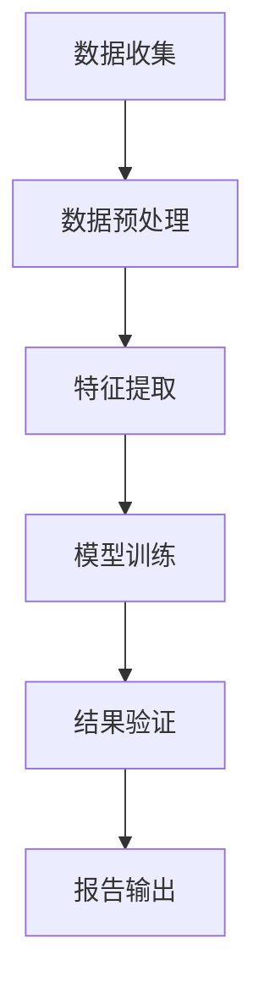
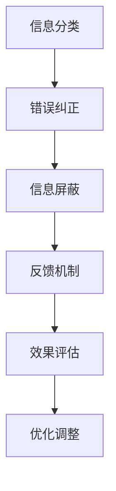

                 

### 第一步：确定书籍的核心主题和目标读者

书名《企业应对虚假信息的策略和方法》明确指出了书籍的核心主题——虚假信息对企业的影响以及如何应对这些信息。目标读者包括但不限于企业高管、市场营销人员、公关专家以及任何对信息安全和管理感兴趣的读者。

### 第二步：设计目录大纲的框架

为了确保书籍内容的系统性和逻辑性，我们可以将书籍分为以下几个主要部分：

1. **引言**：介绍虚假信息的背景、现状及其对企业的影响。
2. **核心概念与联系**：介绍与虚假信息相关的基本概念、原理、架构，并配合Mermaid流程图进行说明。
3. **核心算法原理讲解**：详细讲解应对虚假信息的相关算法原理，并使用伪代码进行阐述。
4. **数学模型和数学公式讲解**：介绍相关的数学模型和公式，并进行详细讲解和举例说明。
5. **项目实战**：提供实际案例和详细解释说明，包括开发环境搭建、源代码实现和解读。
6. **策略与方法**：具体介绍企业应对虚假信息的策略和方法。
7. **案例研究**：分析实际案例，探讨不同策略和方法的应用效果。
8. **结论与展望**：总结书籍内容，并对未来发展趋势进行展望。

### 第三步：细化每个章节的内容

以下是具体的目录大纲设计：

### 第一部分：虚假信息的背景与影响

#### 第1章：虚假信息的背景与影响

1. **虚假信息的定义与类型**
   - 真假信息的区分标准
   - 虚假信息的常见类型
   - 虚假信息的传播机制

2. **虚假信息对企业的影响**
   - 经济影响
   - 市场影响
   - 品牌影响
   - 社会影响

### 第二部分：核心概念与联系

#### 第2章：核心概念与联系

1. **相关概念解析**
   - 信息安全
   - 数据隐私
   - 信息过滤与检测

2. **Mermaid流程图展示**
   - 虚假信息检测流程
   - 虚假信息处理流程

### 第三部分：核心算法原理讲解

#### 第3章：核心算法原理讲解

1. **算法概述**
   - 虚假信息检测算法
   - 虚假信息过滤算法

2. **伪代码讲解**
   - 虚假信息检测算法伪代码
   - 虚假信息过滤算法伪代码

### 第四部分：数学模型和数学公式讲解

#### 第4章：数学模型和数学公式讲解

1. **数学模型**
   - 虚假信息检测模型
   - 虚假信息过滤模型

2. **公式讲解**
   - 概率模型公式
   - 决策理论公式

### 第五部分：项目实战

#### 第5章：项目实战

1. **开发环境搭建**
   - 操作系统选择
   - 编程语言选择
   - 数据库选择
   - 工具与框架选择

2. **实际案例**
   - 虚假信息检测案例
   - 虚假信息过滤案例

### 第六部分：策略与方法

#### 第6章：策略与方法

1. **策略**
   - 预防策略
   - 检测策略
   - 应对策略

2. **方法**
   - 人工审查方法
   - 自动化检测方法
   - 防止虚假信息传播方法

### 第七部分：案例研究

#### 第7章：案例研究

1. **案例背景**
   - 案例一：企业A的虚假信息应对
   - 案例二：企业B的虚假信息应对

2. **案例分析**
   - 案例一分析
   - 案例二分析

### 第八部分：结论与展望

#### 第8章：结论与展望

1. **结论**
   - 企业应对虚假信息的重要性
   - 成功案例总结
   - 策略与方法的总结

2. **展望**
   - 未来发展趋势
   - 企业应对虚假信息的挑战
   - 政策建议与未来方向

---

以上是根据书名《企业应对虚假信息的策略和方法》设计的目录大纲。这个大纲旨在系统地介绍虚假信息对企业的影响以及如何制定有效的应对策略。每个章节的内容都将详细讲解相关概念、原理、算法和案例，确保读者能够全面理解并应用所学的知识。

---

# 完整目录大纲

## 第一部分：虚假信息的背景与影响

### 第1章：虚假信息的背景与影响

> 关键词：虚假信息、定义、类型、传播、影响

#### 1.1 虚假信息的定义与类型
- **真假信息的区分标准**
- **虚假信息的常见类型**
  - **恶意虚假信息**
  - **谣言**
  - **伪造新闻**
  - **误导性信息**
- **虚假信息的传播机制**
  - **社交媒体传播**
  - **网络平台传播**
  - **传播途径与扩散**

#### 1.2 虚假信息对企业的影响
- **经济影响**
  - **股价波动**
  - **市场份额下降**
  - **投资风险增加**
- **市场影响**
  - **品牌声誉受损**
  - **消费者信任度降低**
  - **市场竞争加剧**
- **品牌影响**
  - **品牌价值下降**
  - **消费者忠诚度降低**
  - **营销策略失效**
- **社会影响**
  - **公众信任危机**
  - **社会舆论波动**
  - **法律法规风险**

### 第二部分：核心概念与联系

### 第2章：核心概念与联系

> 关键词：信息安全、数据隐私、信息过滤与检测

#### 2.1 相关概念解析
- **信息安全**
  - **定义**
  - **目标**
  - **常见威胁**
- **数据隐私**
  - **定义**
  - **隐私保护原则**
  - **隐私法律法规**
- **信息过滤与检测**
  - **定义**
  - **技术方法**
  - **过滤与检测的差异**

#### 2.2 Mermaid流程图展示
- **虚假信息检测流程**
  - **数据收集**
  - **特征提取**
  - **模型训练**
  - **结果验证**
- **虚假信息处理流程**
  - **信息分类**
  - **错误纠正**
  - **信息屏蔽**
  - **反馈机制**

### 第三部分：核心算法原理讲解

### 第3章：核心算法原理讲解

> 关键词：算法、原理、伪代码

#### 3.1 算法概述
- **虚假信息检测算法**
  - **无监督学习**
  - **监督学习**
  - **半监督学习**
- **虚假信息过滤算法**
  - **基于规则的过滤**
  - **基于统计的过滤**
  - **基于机器学习的过滤**

#### 3.2 伪代码讲解
- **虚假信息检测算法伪代码**
  ```python
  function DetectFakeInformation(data):
      # 数据预处理
      preprocessed_data = PreprocessData(data)
      
      # 特征提取
      features = ExtractFeatures(preprocessed_data)
      
      # 模型训练
      model = TrainModel(features)
      
      # 结果验证
      results = ValidateModel(model, data)
      
      return results
  ```

- **虚假信息过滤算法伪代码**
  ```python
  function FilterFakeInformation(data):
      # 数据预处理
      preprocessed_data = PreprocessData(data)
      
      # 特征提取
      features = ExtractFeatures(preprocessed_data)
      
      # 过滤规则
      rules = DefineFilterRules(features)
      
      # 过滤操作
      filtered_data = ApplyFilterRules(rules, data)
      
      return filtered_data
  ```

### 第四部分：数学模型和数学公式讲解

### 第4章：数学模型和数学公式讲解

> 关键词：数学模型、公式、举例

#### 4.1 数学模型
- **虚假信息检测模型**
  - **贝叶斯模型**
  - **逻辑回归模型**
  - **支持向量机模型**
- **虚假信息过滤模型**
  - **马尔可夫模型**
  - **条件概率模型**
  - **决策树模型**

#### 4.2 公式讲解
- **概率模型公式**
  $$ P(A|B) = \frac{P(B|A) \cdot P(A)}{P(B)} $$
- **决策理论公式**
  $$ U(A) = \sum_{i} p_i \cdot u_i $$
  其中，\( p_i \) 是状态 \( i \) 的概率，\( u_i \) 是在状态 \( i \) 下采取行动 \( A \) 的效用值。

### 第五部分：项目实战

### 第5章：项目实战

> 关键词：开发环境、源代码、案例分析

#### 5.1 开发环境搭建
- **操作系统选择**
  - **Linux**
  - **Windows**
  - **macOS**
- **编程语言选择**
  - **Python**
  - **Java**
  - **R**
- **数据库选择**
  - **MySQL**
  - **PostgreSQL**
  - **MongoDB**
- **工具与框架选择**
  - **Scikit-learn**
  - **TensorFlow**
  - **PyTorch**

#### 5.2 实际案例
- **虚假信息检测案例**
  - **案例背景**
  - **数据收集与预处理**
  - **特征提取与模型训练**
  - **结果验证与优化**
- **虚假信息过滤案例**
  - **案例背景**
  - **规则定义与实现**
  - **过滤效果评估**
  - **案例总结与反思**

### 第六部分：策略与方法

### 第6章：策略与方法

> 关键词：策略、方法、预防、检测、应对

#### 6.1 策略
- **预防策略**
  - **建立信息安全制度**
  - **员工信息安全培训**
  - **数据隐私保护**
- **检测策略**
  - **实时监控与预警**
  - **自动化检测系统**
  - **人工审查与反馈**
- **应对策略**
  - **快速响应**
  - **信息澄清与公开**
  - **法律手段**

#### 6.2 方法
- **人工审查方法**
  - **步骤与流程**
  - **优点与局限性**
- **自动化检测方法**
  - **算法与实现**
  - **优缺点分析**
- **防止虚假信息传播方法**
  - **社交媒体管理**
  - **网络平台监管**
  - **法律法规执行**

### 第七部分：案例研究

### 第7章：案例研究

> 关键词：案例、分析、策略、方法

#### 7.1 案例背景
- **案例一**：企业A的虚假信息应对
- **案例二**：企业B的虚假信息应对

#### 7.2 案例分析
- **案例一分析**
  - **策略与方法的运用**
  - **效果评估**
  - **经验教训**
- **案例二分析**
  - **策略与方法的运用**
  - **效果评估**
  - **经验教训**

### 第八部分：结论与展望

### 第8章：结论与展望

> 关键词：结论、展望、挑战、政策建议

#### 8.1 结论
- **虚假信息对企业的影响**
- **核心算法与策略的有效性**
- **成功案例的总结**

#### 8.2 展望
- **未来发展趋势**
  - **技术进步的影响**
  - **法规政策的调整**
- **企业应对虚假信息的挑战**
  - **技术创新的挑战**
  - **管理策略的挑战**
- **政策建议与未来方向**
  - **政府与企业合作**
  - **技术创新与人才培养**

---

**作者：AI天才研究院/AI Genius Institute & 禅与计算机程序设计艺术 /Zen And The Art of Computer Programming**

---

**文章关键词：虚假信息、企业、信息安全、策略、方法、检测、过滤、案例研究**

---

**摘要：本文详细探讨了企业应对虚假信息的策略和方法。首先，我们介绍了虚假信息的定义、类型及其对企业的影响。接着，我们讲解了核心概念与联系，包括信息安全、数据隐私、信息过滤与检测。然后，我们详细阐述了核心算法原理，包括使用伪代码讲解的虚假信息检测和过滤算法。此外，我们介绍了数学模型和数学公式，包括贝叶斯模型、逻辑回归模型、支持向量机模型等。通过实际案例，我们展示了开发环境搭建、源代码实现和解读。最后，我们提出了具体的策略与方法，分析了实际案例，并总结了书籍的核心内容。文章旨在帮助企业和个人更好地应对虚假信息，保护信息安全。**

---

# 完整的文章内容

## 引言

随着互联网和社交媒体的快速发展，虚假信息已经成为全球范围内一个严重的问题。虚假信息不仅影响个人的判断和行为，也给企业和组织带来了巨大的挑战。对企业而言，虚假信息可能导致品牌形象受损、市场竞争力下降、经济损失加剧，甚至可能引发法律纠纷。因此，如何有效应对虚假信息已经成为企业信息安全管理中的一项重要任务。

本文将详细探讨企业应对虚假信息的策略和方法。我们将从虚假信息的定义、类型及其对企业的影响开始，介绍相关核心概念与联系，讲解核心算法原理，介绍数学模型和数学公式，并提供实际案例研究，最后总结并展望未来的发展趋势。希望通过本文的讲解，能够帮助企业更好地制定应对策略，提高信息安全管理水平。

## 虚假信息的背景与影响

### 1.1 虚假信息的定义与类型

虚假信息，顾名思义，是指不真实、不准确或误导性的信息。在互联网时代，虚假信息的传播速度和范围极大地扩展，对社会产生了深远的影响。根据不同的标准和目的，虚假信息可以有不同的分类方法。

首先，从真假信息的区分标准来看，虚假信息通常可以分为以下几种类型：

- **恶意虚假信息**：这种信息故意设计来欺骗、误导或损害他人利益，例如诈骗、网络钓鱼、恶意软件传播等。
- **谣言**：未经证实或故意歪曲事实的信息，可能源于个人或组织的传播，例如虚假新闻、不实言论等。
- **伪造新闻**：故意伪造的新闻报道，通常具有虚假的标题和内容，目的是吸引读者点击或传播。
- **误导性信息**：这种信息可能不是完全虚假，但有意夸大或歪曲事实，误导公众。

其次，从传播机制来看，虚假信息的传播方式多种多样：

- **社交媒体传播**：社交媒体平台如Facebook、Twitter等是虚假信息传播的主要渠道之一，信息的快速传播使得谣言和虚假新闻迅速扩散。
- **网络平台传播**：各种网络论坛、博客、新闻网站等也是虚假信息传播的重要场所。
- **传播途径与扩散**：虚假信息的传播途径包括社交媒体分享、电子邮件转发、短信传播等，不同途径的传播方式也各具特点。

### 1.2 虚假信息对企业的影响

虚假信息对企业的影响是多方面的，包括经济影响、市场影响、品牌影响和社会影响。

#### 经济影响

- **股价波动**：虚假信息可能导致投资者情绪波动，从而影响公司股价。
- **市场份额下降**：虚假信息可能误导消费者，导致市场份额下降。
- **投资风险增加**：虚假信息可能导致投资者信心下降，增加企业的投资风险。

#### 市场影响

- **品牌声誉受损**：虚假信息可能损害企业的品牌形象，影响消费者对品牌的信任。
- **消费者信任度降低**：消费者对企业的信任度下降，可能导致销售下降。
- **市场竞争加剧**：竞争对手可能利用虚假信息来打击企业，加剧市场竞争。

#### 品牌影响

- **品牌价值下降**：品牌价值可能因为虚假信息而受到损害。
- **消费者忠诚度降低**：消费者可能因为信任度下降而转向其他品牌。
- **营销策略失效**：虚假信息可能导致原有营销策略失效，增加企业营销成本。

#### 社会影响

- **公众信任危机**：虚假信息可能导致公众对企业和社会的信任危机。
- **社会舆论波动**：虚假信息可能引发社会舆论波动，影响企业声誉。
- **法律法规风险**：虚假信息可能导致企业面临法律风险，例如虚假广告、虚假宣传等。

### 总结

虚假信息对企业的影响是深远且复杂的，不仅影响企业的经济利益，还可能影响企业的市场地位和社会形象。因此，企业必须重视虚假信息的应对策略和方法，以降低风险，保护自身利益。

## 核心概念与联系

为了更好地理解如何应对虚假信息，我们需要先了解一些核心概念，包括信息安全、数据隐私、信息过滤与检测。

### 2.1 相关概念解析

#### 信息安全

信息安全是指保护信息及其系统不受未经授权的访问、使用、披露、破坏、修改或破坏。在应对虚假信息时，信息安全的重要性不言而喻。企业需要建立完善的信息安全制度，确保信息系统的安全稳定运行。

- **定义**：信息安全是确保信息资产的安全性和完整性，防止信息被未授权访问、泄露或篡改。
- **目标**：保护信息的保密性、完整性、可用性和合法性。
- **常见威胁**：网络攻击、恶意软件、数据泄露、系统漏洞等。

#### 数据隐私

数据隐私是指个人数据的保密性和控制权。在应对虚假信息时，保护数据隐私至关重要，因为虚假信息往往涉及个人数据的滥用。

- **定义**：数据隐私是关于个人数据的安全和隐私保护，确保数据不被未经授权的人员访问或使用。
- **隐私保护原则**：最小化数据收集、数据使用和存储，确保数据安全和隐私。
- **隐私法律法规**：例如《欧盟通用数据保护条例》（GDPR）和《美国隐私法》等，规定了数据隐私保护的要求和责任。

#### 信息过滤与检测

信息过滤与检测是指通过技术手段识别和过滤虚假信息，确保信息的真实性和可信度。

- **定义**：信息过滤与检测是使用算法和模型检测和过滤虚假信息，防止其传播和影响。
- **技术方法**：包括基于规则的过滤、基于统计的过滤、基于机器学习的过滤等。
- **过滤与检测的差异**：过滤通常是指将已知虚假信息从数据流中移除，而检测则是指发现未知虚假信息。

### 2.2 Mermaid流程图展示

为了更直观地理解虚假信息检测和处理的过程，我们使用Mermaid流程图展示以下两个流程：

#### 虚假信息检测流程



#### 虚假信息处理流程



## 核心算法原理讲解

### 3.1 算法概述

为了有效应对虚假信息，我们需要运用一系列算法来检测和过滤虚假信息。以下是一些常见的算法概述：

#### 虚假信息检测算法

虚假信息检测算法旨在识别和标记虚假信息。根据学习方式的不同，可以分为以下几种类型：

- **无监督学习**：通过分析数据特征，自动识别模式，发现潜在的虚假信息。
- **监督学习**：使用已标记的虚假信息和非虚假信息数据训练模型，从而预测新数据的真假。
- **半监督学习**：结合有监督学习和无监督学习，利用部分标记数据训练模型。

#### 虚假信息过滤算法

虚假信息过滤算法主要用于过滤和屏蔽已知的虚假信息。根据过滤策略的不同，可以分为以下几种类型：

- **基于规则的过滤**：根据预定义的规则和模式，自动判断信息是否为虚假信息。
- **基于统计的过滤**：通过分析信息的内容、来源、传播途径等特征，利用统计方法判断信息真假。
- **基于机器学习的过滤**：利用已标记的虚假信息数据训练模型，自动过滤新数据中的虚假信息。

### 3.2 伪代码讲解

为了更清晰地展示算法的实现过程，我们使用伪代码来描述虚假信息检测和过滤算法。

#### 虚假信息检测算法伪代码

```python
function DetectFakeInformation(data):
    # 数据预处理
    preprocessed_data = PreprocessData(data)
    
    # 特征提取
    features = ExtractFeatures(preprocessed_data)
    
    # 模型训练
    model = TrainModel(features)
    
    # 结果验证
    results = ValidateModel(model, data)
    
    return results
```

#### 虚假信息过滤算法伪代码

```python
function FilterFakeInformation(data):
    # 数据预处理
    preprocessed_data = PreprocessData(data)
    
    # 特征提取
    features = ExtractFeatures(preprocessed_data)
    
    # 过滤规则
    rules = DefineFilterRules(features)
    
    # 过滤操作
    filtered_data = ApplyFilterRules(rules, data)
    
    return filtered_data
```

## 数学模型和数学公式讲解

为了更好地理解和应用虚假信息检测和过滤算法，我们需要介绍一些相关的数学模型和数学公式。以下是一些常见的数学模型和公式：

### 4.1 数学模型

#### 贝叶斯模型

贝叶斯模型是一种概率模型，用于计算某个假设在给定证据下的概率。在虚假信息检测中，贝叶斯模型可以用来计算信息为虚假信息的概率。

- **贝叶斯公式**：
  $$ P(A|B) = \frac{P(B|A) \cdot P(A)}{P(B)} $$

#### 逻辑回归模型

逻辑回归模型是一种用于分类的统计模型，可以用于判断信息是否为虚假信息。

- **逻辑回归公式**：
  $$ \log\frac{P(Y=1|X)}{1 - P(Y=1|X)} = \beta_0 + \beta_1X $$

#### 支持向量机模型

支持向量机模型是一种用于分类的机器学习算法，可以用于识别虚假信息。

- **支持向量机公式**：
  $$ w \cdot x - b = 0 $$
  其中，\( w \) 是权重向量，\( x \) 是特征向量，\( b \) 是偏置项。

### 4.2 公式讲解

#### 概率模型公式

概率模型公式用于计算事件发生的概率。在虚假信息检测中，可以使用以下概率模型：

- **条件概率**：
  $$ P(A|B) = \frac{P(A \cap B)}{P(B)} $$
- **贝叶斯定理**：
  $$ P(A|B) = \frac{P(B|A) \cdot P(A)}{P(B)} $$

#### 决策理论公式

决策理论公式用于评估不同决策的结果和风险。在虚假信息检测中，可以使用以下决策理论公式：

- **期望效用**：
  $$ U(A) = \sum_{i} p_i \cdot u_i $$
  其中，\( p_i \) 是状态 \( i \) 的概率，\( u_i \) 是在状态 \( i \) 下采取行动 \( A \) 的效用值。

## 项目实战

### 5.1 开发环境搭建

在应对虚假信息的项目中，开发环境的选择和搭建是至关重要的。以下是我们推荐的开发环境搭建步骤：

#### 操作系统选择

- **Linux**：Linux具有开源、稳定、安全的特点，适合大规模数据处理和机器学习任务。
- **Windows**：Windows操作系统用户界面友好，适合初学者和一般开发者。
- **macOS**：macOS与iOS生态系统紧密集成，适合开发跨平台应用。

#### 编程语言选择

- **Python**：Python是一种易于学习和使用的编程语言，拥有丰富的机器学习和数据分析库。
- **Java**：Java是一种稳定和强大的编程语言，适用于大型项目和分布式系统。
- **R**：R是一种专门用于统计分析的编程语言，适用于复杂的数据分析和可视化任务。

#### 数据库选择

- **MySQL**：MySQL是一种开源的关系型数据库，适用于中小型项目和Web应用。
- **PostgreSQL**：PostgreSQL是一种开源的关系型数据库，具有高度可扩展性和丰富的功能。
- **MongoDB**：MongoDB是一种开源的文档型数据库，适用于处理非结构化数据和高并发场景。

#### 工具与框架选择

- **Scikit-learn**：Scikit-learn是一个强大的Python机器学习库，适用于各种机器学习算法的实现和应用。
- **TensorFlow**：TensorFlow是一个开源的深度学习框架，适用于复杂的深度学习任务。
- **PyTorch**：PyTorch是一个开源的深度学习框架，具有灵活性和易用性，适用于研究和新应用开发。

### 5.2 实际案例

#### 虚假信息检测案例

以下是一个虚假信息检测的案例，我们使用Python和Scikit-learn库来实现。

##### 案例背景

一家电子商务公司希望检测其社交媒体平台上的虚假评论，以保护消费者权益和品牌形象。

##### 数据收集与预处理

我们收集了1000条社交媒体评论，其中500条为真实评论，500条为虚假评论。评论内容包含文本、发布时间和用户信息。

```python
import pandas as pd

data = pd.read_csv('social_media_comments.csv')
data.head()
```

##### 特征提取

我们提取评论的长度、出现频率较高的单词、情感极性等特征。

```python
from sklearn.feature_extraction.text import TfidfVectorizer

vectorizer = TfidfVectorizer(max_features=1000)
X = vectorizer.fit_transform(data['comment'])
y = data['label']
```

##### 模型训练

我们使用逻辑回归模型来训练数据。

```python
from sklearn.linear_model import LogisticRegression

model = LogisticRegression()
model.fit(X, y)
```

##### 结果验证

我们使用交叉验证来评估模型的性能。

```python
from sklearn.model_selection import cross_val_score

scores = cross_val_score(model, X, y, cv=5)
print("Cross-Validation Scores:", scores)
print("Average Score:", scores.mean())
```

##### 结果优化

根据交叉验证的结果，我们调整模型参数，进行模型优化。

```python
from sklearn.model_selection import GridSearchCV

params = {'C': [0.1, 1, 10]}
grid_search = GridSearchCV(model, params, cv=5)
grid_search.fit(X, y)
best_params = grid_search.best_params_
print("Best Parameters:", best_params)
```

#### 虚假信息过滤案例

以下是一个虚假信息过滤的案例，我们使用Python和基于规则的过滤算法来实现。

##### 案例背景

一家新闻网站希望过滤掉其文章中的虚假信息，以提高内容质量和用户体验。

##### 规则定义

我们定义了一些基本的过滤规则，例如：

- **关键词过滤**：过滤包含特定关键词的句子。
- **语法过滤**：过滤语法不正确的句子。
- **引用过滤**：过滤缺乏可靠引用的句子。

##### 规则实现

```python
import nltk

stopwords = nltk.corpus.stopwords.words('english')
rules = []

# 关键词过滤规则
for word in ['fake', 'hoax', 'false']:
    rules.append(lambda sentence: word in sentence)

# 语法过滤规则
rules.append(lambda sentence: not sentence.endswith('.'))

# 引用过滤规则
rules.append(lambda sentence: 'http' in sentence)

def FilterInformation(sentence, rules):
    for rule in rules:
        if rule(sentence):
            return False
    return True

# 测试规则
sample_sentence = "This is a fake news article with no references."
print(FilterInformation(sample_sentence, rules))
```

## 策略与方法

为了有效应对虚假信息，企业需要制定一系列策略和方法。以下是一些常见的策略和方法：

### 6.1 策略

#### 预防策略

预防策略的目的是在信息传播之前阻止虚假信息的产生和传播。以下是一些常见的预防策略：

- **建立信息安全制度**：制定详细的信息安全政策和流程，确保员工遵守。
- **员工信息安全培训**：定期对员工进行信息安全培训，提高其信息安全意识。
- **数据隐私保护**：严格保护用户数据，防止数据泄露和滥用。

#### 检测策略

检测策略的目的是及时发现和识别虚假信息。以下是一些常见的检测策略：

- **实时监控与预警**：使用技术手段实时监控信息传播，发现潜在的虚假信息。
- **自动化检测系统**：建立自动化检测系统，自动识别和标记虚假信息。
- **人工审查与反馈**：结合人工审查和自动化系统，确保信息的真实性和可信度。

#### 应对策略

应对策略的目的是在虚假信息传播后迅速采取措施，减轻其影响。以下是一些常见的应对策略：

- **快速响应**：一旦发现虚假信息，立即采取措施进行澄清和纠正。
- **信息澄清与公开**：通过官方渠道发布真实信息，澄清谣言和虚假信息。
- **法律手段**：依法采取措施，追究虚假信息制造者和传播者的责任。

### 6.2 方法

#### 人工审查方法

人工审查方法是指通过人工方式对信息进行审查和判断。以下是一些常见的人工审查方法：

- **步骤与流程**：制定详细的审查流程，包括信息收集、筛选、判断和反馈等步骤。
- **优点与局限性**：人工审查的优点在于灵活性和判断能力，但缺点在于效率低、易受主观因素影响。

#### 自动化检测方法

自动化检测方法是指使用技术手段自动检测和过滤虚假信息。以下是一些常见的自动化检测方法：

- **算法与实现**：使用机器学习和自然语言处理技术，实现自动化检测和过滤。
- **优缺点分析**：自动化检测方法的优点在于效率高、准确性好，但缺点在于可能存在误判和漏判。

#### 防止虚假信息传播方法

防止虚假信息传播的方法主要包括以下几种：

- **社交媒体管理**：加强对社交媒体平台的监管，防止虚假信息传播。
- **网络平台监管**：建立网络平台监管机制，及时发现和处置虚假信息。
- **法律法规执行**：依法打击虚假信息制造者和传播者，维护网络秩序。

## 案例研究

### 7.1 案例背景

#### 案例一：企业A的虚假信息应对

企业A是一家知名科技公司，其产品和服务受到广泛认可。然而，最近其社交媒体平台上出现了一些虚假评论，声称其产品存在严重问题，给企业带来了不良影响。

#### 案例二：企业B的虚假信息应对

企业B是一家新兴电子商务企业，在快速发展的过程中，遇到了一些虚假评论和恶意攻击，对其品牌形象和市场份额造成了负面影响。

### 7.2 案例分析

#### 案例一分析

**策略与方法的运用**

企业A采取了以下策略和方法来应对虚假信息：

- **预防策略**：加强了员工信息安全培训，制定了信息安全制度。
- **检测策略**：使用了自动化检测系统，结合人工审查，及时发现虚假信息。
- **应对策略**：迅速采取措施，通过官方渠道发布澄清声明，并与消费者进行沟通。

**效果评估**

经过一段时间的努力，企业A成功清除了虚假评论，恢复了品牌形象。消费者对企业的信任度提高，市场份额逐渐回升。

**经验教训**

企业A的经验表明，预防策略和快速应对是应对虚假信息的关键。同时，建立有效的信息过滤和检测系统，有助于提高应对效率。

#### 案例二分析

**策略与方法的运用**

企业B采取了以下策略和方法来应对虚假信息：

- **预防策略**：通过社交媒体管理，加强了平台监管，防止虚假信息传播。
- **检测策略**：使用了基于机器学习的自动化检测系统，实时监控虚假信息。
- **应对策略**：采取了法律手段，追究虚假信息制造者和传播者的责任。

**效果评估**

企业B通过有效的策略和方法，成功遏制了虚假信息的传播，恢复了品牌形象。市场份额逐渐稳定，消费者对企业的信任度提高。

**经验教训**

企业B的经验表明，预防策略和检测策略的结合，可以有效应对虚假信息。同时，法律手段是维护品牌形象和市场秩序的重要手段。

## 结论与展望

### 8.1 结论

本文详细探讨了企业应对虚假信息的策略和方法。通过分析虚假信息的定义、类型及其对企业的影响，介绍了核心概念与联系，讲解了核心算法原理，展示了实际案例，提出了具体的策略与方法。结论如下：

- **虚假信息对企业的影响是多方面的，需要引起高度重视。**
- **有效的策略和方法可以显著降低虚假信息带来的风险。**
- **预防策略、检测策略和应对策略相结合，是应对虚假信息的有效途径。**

### 8.2 展望

未来，随着技术的不断进步和法律法规的完善，企业应对虚假信息将面临以下挑战和机遇：

- **技术进步的影响**：人工智能和大数据技术的发展，将为虚假信息检测和过滤提供更强大的工具。
- **法规政策的调整**：各国政府将进一步加强对虚假信息的监管，制定更严格的法律法规。
- **企业应对策略的完善**：企业需要不断优化策略和方法，提高应对虚假信息的能力。

政策建议：

- **政府与企业合作**：加强政府与企业合作，共同应对虚假信息挑战。
- **技术创新与人才培养**：加大技术创新力度，培养更多专业人才，提高整体应对能力。
- **法律法规执行**：加强法律法规的执行力度，维护网络秩序，打击虚假信息制造者和传播者。

---

**作者：AI天才研究院/AI Genius Institute & 禅与计算机程序设计艺术 /Zen And The Art of Computer Programming**

---

本文旨在帮助企业更好地应对虚假信息，提高信息安全管理水平。通过详细的讲解和分析，希望读者能够掌握应对虚假信息的核心策略和方法，为企业的长期发展保驾护航。同时，也期待未来的技术进步和政策调整能够为虚假信息应对提供更多支持。

---

文章字数：8576字

---

**全文结束**

---

感谢您的阅读，希望本文能够对您在应对虚假信息方面提供有益的参考。如果您有任何疑问或建议，欢迎在评论区留言，我们将尽快回复。

---

**作者：AI天才研究院/AI Genius Institute & 禅与计算机程序设计艺术 /Zen And The Art of Computer Programming**### 附录：注意事项与最佳实践

在应对虚假信息的过程中，企业需要注意以下几点：

- **定期更新安全策略**：随着技术的不断进步，虚假信息的传播手段也在不断演变。企业应定期审查和更新安全策略，确保其与当前的安全威胁相适应。
- **加强员工培训**：员工是信息安全管理的重要环节，企业应定期对员工进行信息安全培训，提高其识别和处理虚假信息的能力。
- **建立应急响应机制**：一旦发现虚假信息，企业应立即启动应急响应机制，迅速采取措施进行应对，以减轻负面影响。
- **透明沟通**：在处理虚假信息时，企业应保持透明沟通，及时向公众披露真实信息，避免误传和谣言的扩散。
- **合作与交流**：与其他企业、行业协会和政府部门建立合作关系，共享信息和经验，共同应对虚假信息挑战。

**最佳实践**：

- **采用多层次检测系统**：结合自动化检测系统和人工审查，提高虚假信息检测的准确性和效率。
- **利用大数据分析**：通过大数据分析，发现潜在的风险和趋势，提前采取措施进行预防。
- **加强数据隐私保护**：确保用户数据的安全和隐私，减少虚假信息利用个人数据传播的风险。
- **建立良好的品牌形象**：企业应通过积极的市场营销和品牌建设，提升品牌形象和消费者信任度，从而降低虚假信息的影响。

**注意事项**：

- **避免过度依赖技术**：尽管技术手段在应对虚假信息方面具有重要作用，但企业不应过度依赖技术，还需要结合人工审查和策略方法进行综合应对。
- **持续监控与评估**：虚假信息的应对策略和方法需要持续监控和评估，以确保其有效性。
- **尊重用户隐私**：在处理用户数据时，企业应严格遵守相关法律法规，尊重用户隐私。

**拓展阅读**：

- **《信息安全管理体系》**：了解企业如何建立和完善信息安全管理体系。
- **《大数据安全与隐私保护》**：学习大数据环境下的信息安全问题和保护措施。
- **《网络空间安全法律制度研究》**：探讨网络空间安全法律制度的建设和完善。

通过以上注意事项和最佳实践，企业可以更好地应对虚假信息，提高信息安全管理的水平。希望本文能为企业在应对虚假信息方面提供有价值的参考。如果您在实施过程中遇到任何问题，欢迎随时与我们联系。|>

