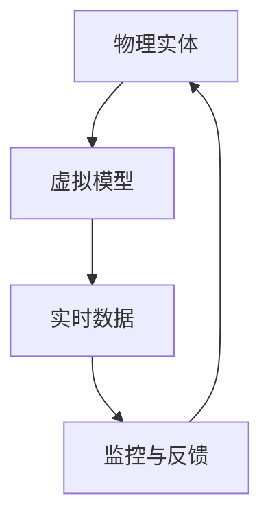
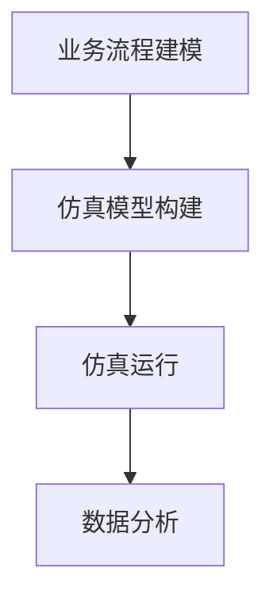
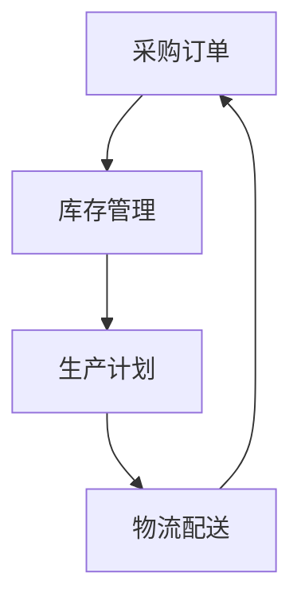
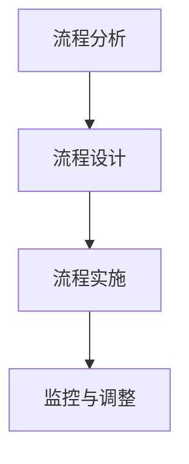
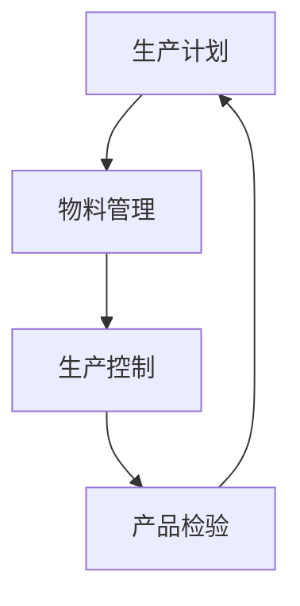
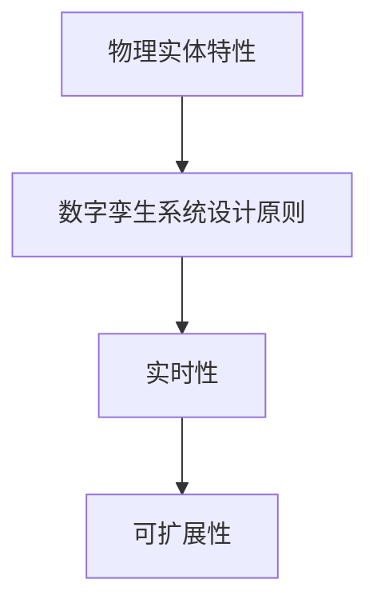
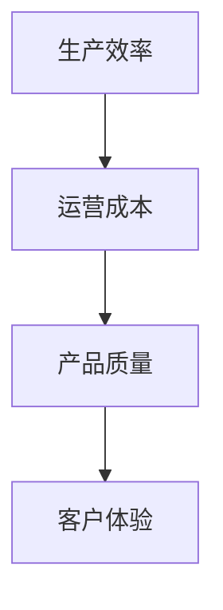
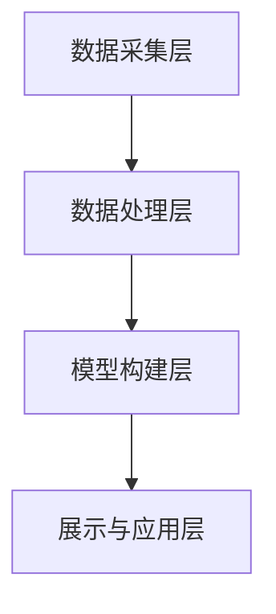
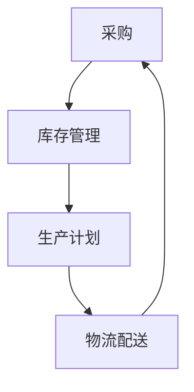
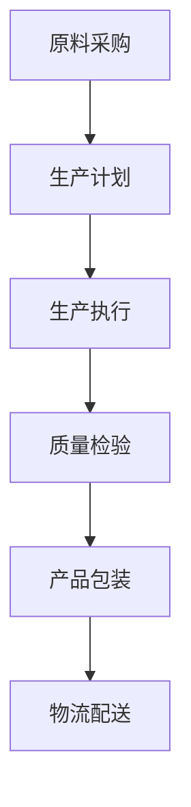

                 

# 《企业数字孪生技术：全面模拟和优化业务流程》

## 关键词
数字孪生，业务流程，模拟，优化，技术架构，数据采集，仿真，算法，数学模型

## 摘要
本文旨在深入探讨企业数字孪生技术，从基本概念、技术架构到业务流程的模拟与优化，提供全面的技术分析与实战案例。通过本文，读者将了解数字孪生技术在企业中的应用价值，掌握构建数字孪生系统的关键技术和方法，并学会如何通过数字孪生技术优化业务流程，提升企业运营效率。

## 目录

## 第一部分：数字孪生技术基础

### 第1章 数字孪生技术概述

#### 1.1 数字孪生的基本概念

#### 1.2 数字孪生的技术架构

#### 1.3 数字孪生的应用领域

### 第2章 数字孪生技术在业务流程模拟中的应用

#### 2.1 业务流程模拟的概念与原理

#### 2.2 业务流程模拟的方法与工具

#### 2.3 模拟案例：企业供应链业务流程模拟

### 第3章 数字孪生技术在业务流程优化中的应用

#### 3.1 业务流程优化的概念与原则

#### 3.2 业务流程优化的方法与策略

#### 3.3 优化案例：企业生产业务流程优化

### 第4章 数字孪生系统设计与实现

#### 4.1 数字孪生系统的设计原则

#### 4.2 数字孪生系统的关键技术

#### 4.3 数字孪生系统实现案例

### 第5章 数字孪生技术在企业中的应用与挑战

#### 5.1 数字孪生技术的商业价值

#### 5.2 数字孪生技术的挑战与解决方案

#### 5.3 数字孪生技术的未来发展趋势

## 第一部分：数字孪生技术基础

### 第1章 数字孪生技术概述

#### 1.1 数字孪生的基本概念

数字孪生（Digital Twin）是一种创新的数字化技术，通过构建物理实体的虚拟副本，实现对物理实体的全面模拟和实时监控。数字孪生不仅包含了物理实体的静态信息，还涵盖了动态行为和状态信息，实现了对物理实体的全生命周期管理。

**核心概念与联系：**

数字孪生技术主要包括三个核心组成部分：物理实体、虚拟模型和实时数据。物理实体是数字孪生的原始对象，可以是机器、设备、生产线等；虚拟模型是对物理实体的数字化复制，通过算法和模型对物理实体的行为进行模拟；实时数据是数字孪生系统的核心，用于驱动虚拟模型和反馈物理实体的状态。



#### 1.2 数字孪生的技术架构

数字孪生的技术架构通常分为数据采集层、数据处理层、模型构建层和展示与应用层。

1. **数据采集层**：通过传感器、RFID、IoT设备等，实时采集物理实体的状态数据。
2. **数据处理层**：对采集到的数据进行清洗、存储、分析，为虚拟模型提供实时数据支持。
3. **模型构建层**：基于物理实体的数据和业务需求，构建数字孪生模型。
4. **展示与应用层**：通过可视化工具和接口，将数字孪生模型展示给用户，并支持业务应用。

**核心算法原理讲解：**

数字孪生技术的核心算法包括数据采集算法、数据处理算法和模型构建算法。

- **数据采集算法**：常用的采集算法有基于传感器采集、基于RFID标签采集和基于IoT设备采集。以下是一个简单的数据采集算法伪代码：

```pseudo
function dataCollect(sensor):
    while true:
        data = sensor.readData()
        if data is valid:
            storeData(data)
```

- **数据处理算法**：数据处理算法包括数据清洗、数据存储和数据分析。以下是一个简单的数据处理算法伪代码：

```pseudo
function dataProcess(data):
    cleanedData = removeNoise(data)
    storeData(cleanedData)
    analyzeData(cleanedData)
```

- **模型构建算法**：模型构建算法包括机器学习、深度学习、物理仿真等。以下是一个简单的机器学习模型构建算法伪代码：

```pseudo
function buildModel(data):
    model = trainModel(data)
    return model
```

#### 1.3 数字孪生的应用领域

数字孪生技术在多个领域都有广泛的应用，如工业制造、交通运输、医疗健康、建筑环境等。

- **工业制造**：通过数字孪生技术，可以对生产设备、生产线进行实时监控和优化，提高生产效率和质量。
- **交通运输**：数字孪生技术可以用于交通监控、车辆调度和道路规划，提升交通系统的运行效率和安全性。
- **医疗健康**：数字孪生技术可以模拟人体器官、疾病发展过程，为疾病诊断和治疗提供支持。

### 第2章 数字孪生技术在业务流程模拟中的应用

#### 2.1 业务流程模拟的概念与原理

业务流程模拟（Business Process Simulation）是一种通过计算机模型对业务流程进行模拟和仿真的技术。通过业务流程模拟，可以预测业务流程的性能，发现潜在的问题和瓶颈，从而优化业务流程。

**核心概念与联系：**

业务流程模拟主要包括业务流程建模、仿真模型构建和仿真运行。

- **业务流程建模**：通过流程图、表单、数据流图等工具，对业务流程进行建模。
- **仿真模型构建**：基于业务流程模型，构建仿真模型，包括实体、事件、资源等。
- **仿真运行**：通过仿真模型，模拟业务流程的运行，收集仿真数据。



#### 2.2 业务流程模拟的方法与工具

业务流程模拟的方法主要包括基于流程图的模拟、基于数学模型的模拟和基于仿真软件的模拟。

- **基于流程图的模拟**：通过流程图工具，如BPMN（Business Process Model and Notation），构建业务流程模型，并进行模拟。
- **基于数学模型的模拟**：通过建立数学模型，模拟业务流程的运行。数学模型包括线性规划、网络优化、排队论等。
- **基于仿真软件的模拟**：使用专业的仿真软件，如AnyLogic、FlexSim，进行业务流程模拟。

**核心算法原理讲解：**

业务流程模拟的核心算法包括随机过程、排队论、网络优化等。

- **随机过程**：用于模拟业务流程中随机事件的发生。以下是一个简单的随机过程算法伪代码：

```pseudo
function simulateRandomProcess():
    event = generateRandomEvent()
    processEvent(event)
```

- **排队论**：用于分析业务流程中的排队现象。以下是一个简单的排队论算法伪代码：

```pseudo
function analyzeQueue(queue):
    queueLength = calculateQueueLength(queue)
    waitingTime = calculateWaitingTime(queue)
    return queueLength, waitingTime
```

#### 2.3 模拟案例：企业供应链业务流程模拟

**案例背景：**

某企业采用数字孪生技术，对供应链业务流程进行模拟，以优化供应链管理，提高供应链响应速度。

**实现步骤：**

1. **业务流程建模**：使用BPMN工具，绘制供应链业务流程图，包括采购、库存管理、生产计划、物流配送等环节。
2. **仿真模型构建**：基于业务流程模型，构建仿真模型，包括实体（采购订单、库存信息、生产计划等）、事件（订单生成、库存更新、生产任务分配等）和资源（仓库、生产线等）。
3. **仿真运行**：通过仿真软件，运行仿真模型，收集仿真数据，如订单完成时间、库存水平、生产效率等。
4. **数据分析**：对仿真数据进行统计分析，分析供应链业务流程的性能，发现潜在的问题和瓶颈。

**项目实战：**

**开发环境搭建：**

- 使用Visual Studio Code作为开发环境，安装BPMN插件，用于绘制业务流程图。
- 安装AnyLogic仿真软件，用于构建和运行仿真模型。

**源代码实现：**

- **业务流程建模：**



- **仿真模型构建：**

```java
// 仿真模型类
public class SupplyChainSimulation {
    // 实体属性
    private Order order;
    private Inventory inventory;
    private ProductionPlan productionPlan;
    private Logistics logistics;

    // 构建仿真模型
    public SupplyChainSimulation(Order order, Inventory inventory, ProductionPlan productionPlan, Logistics logistics) {
        this.order = order;
        this.inventory = inventory;
        this.productionPlan = productionPlan;
        this.logistics = logistics;
    }

    // 运行仿真模型
    public void runSimulation() {
        // 仿真过程
        order.generate();
        inventory.update();
        productionPlan.execute();
        logistics.distribute();
    }
}
```

- **代码解读与分析：**

```java
// 生成采购订单
public void generate() {
    // 生成订单逻辑
    // ...
}

// 更新库存信息
public void update() {
    // 更新库存逻辑
    // ...
}

// 执行生产计划
public void execute() {
    // 执行生产逻辑
    // ...
}

// 配送物流
public void distribute() {
    // 配送逻辑
    // ...
}
```

**项目小结：**

通过数字孪生技术，对企业供应链业务流程进行模拟，可以提前发现潜在的问题，优化业务流程，提高供应链的响应速度和效率。

### 第3章 数字孪生技术在业务流程优化中的应用

#### 3.1 业务流程优化的概念与原则

业务流程优化（Business Process Optimization）是指通过改进业务流程，提高业务流程的效率、质量和灵活性。业务流程优化的原则包括：

- **目标导向**：明确优化目标，确保优化工作有明确的方向。
- **数据驱动**：基于数据分析和仿真结果，制定优化策略。
- **持续改进**：优化是一个持续的过程，需要不断评估和改进。

**核心概念与联系：**

业务流程优化主要包括以下步骤：

1. **流程分析**：分析现有业务流程，识别问题和瓶颈。
2. **流程设计**：基于分析结果，设计优化后的业务流程。
3. **流程实施**：实施优化后的业务流程，并进行监控和调整。



#### 3.2 业务流程优化的方法与策略

业务流程优化的方法主要包括以下几种：

1. **流程重构**：对现有业务流程进行根本性的重新设计，以实现流程的优化。
2. **流程自动化**：通过自动化工具和系统，减少人工干预，提高流程效率。
3. **流程标准化**：制定标准化的流程规范，确保流程的一致性和可重复性。
4. **流程可视化**：通过流程图、数据可视化等技术，使流程更加清晰，便于监控和优化。

**核心算法原理讲解：**

业务流程优化的核心算法包括：

- **流程分析算法**：用于分析现有业务流程，识别问题和瓶颈。常用的算法有流程节点分析、流程效率分析等。
- **优化算法**：用于设计优化后的业务流程。常用的算法有线性规划、网络优化等。

以下是一个简单的线性规划算法伪代码：

```pseudo
function optimizeProcess(process):
    // 建立线性规划模型
    model = createLinearModel(process)
    
    // 解线性规划模型
    solution = solveLinearModel(model)
    
    // 返回优化后的流程
    return solution
```

#### 3.3 优化案例：企业生产业务流程优化

**案例背景：**

某企业采用数字孪生技术，对生产业务流程进行优化，以提高生产效率。

**实现步骤：**

1. **流程分析**：通过数字孪生技术，对现有生产业务流程进行模拟和分析，识别流程中的问题和瓶颈。
2. **流程设计**：基于分析结果，设计优化后的生产业务流程，包括生产计划、物料管理、生产控制等。
3. **流程实施**：实施优化后的生产业务流程，并进行监控和调整。

**项目实战：**

**开发环境搭建：**

- 使用Visual Studio Code作为开发环境，安装BPMN插件，用于绘制业务流程图。
- 安装AnyLogic仿真软件，用于构建和运行仿真模型。

**源代码实现：**

- **流程分析：**



- **流程设计：**

```java
// 优化后的生产业务流程
public class ProductionProcess {
    // 生产计划
    private ProductionPlan productionPlan;
    
    // 物料管理
    private MaterialManagement materialManagement;
    
    // 生产控制
    private ProductionControl productionControl;
    
    // 产品检验
    private ProductInspection productInspection;

    // 构建优化后的流程
    public ProductionProcess(ProductionPlan productionPlan, MaterialManagement materialManagement, ProductionControl productionControl, ProductInspection productInspection) {
        this.productionPlan = productionPlan;
        this.materialManagement = materialManagement;
        this.productionControl = productionControl;
        this.productInspection = productInspection;
    }

    // 运行优化后的流程
    public void runProcess() {
        // 生产计划
        productionPlan.execute();
        
        // 物料管理
        materialManagement.manage();
        
        // 生产控制
        productionControl.control();
        
        // 产品检验
        productInspection.inspect();
    }
}
```

- **代码解读与分析：**

```java
// 执行生产计划
public void execute() {
    // 生产计划逻辑
    // ...
}

// 物料管理
public void manage() {
    // 物料管理逻辑
    // ...
}

// 生产控制
public void control() {
    // 生产控制逻辑
    // ...
}

// 产品检验
public void inspect() {
    // 产品检验逻辑
    // ...
}
```

**项目小结：**

通过数字孪生技术，对企业生产业务流程进行优化，可以显著提高生产效率，降低生产成本。

### 第4章 数字孪生系统设计与实现

#### 4.1 数字孪生系统的设计原则

数字孪生系统的设计原则主要包括：

- **系统完整性**：确保数字孪生系统涵盖物理实体的所有方面，实现全面模拟。
- **实时性**：确保数字孪生系统能够实时获取物理实体的状态数据，进行实时模拟。
- **可扩展性**：确保数字孪生系统具有良好的扩展性，能够适应不同规模和复杂度的物理实体。

**核心概念与联系：**

数字孪生系统的设计原则与物理实体密切相关。在设计数字孪生系统时，需要充分考虑物理实体的特性，如尺寸、形状、材料、行为等，以及物理实体与外部环境的交互。



#### 4.2 数字孪生系统的关键技术

数字孪生系统的关键技术主要包括：

- **数据采集与处理**：通过传感器、RFID、IoT设备等，实时采集物理实体的状态数据，并进行数据处理。
- **模型构建与仿真**：基于物理实体的数据和业务需求，构建数字孪生模型，并进行仿真。
- **数据存储与管理**：将采集到的数据存储在数据库中，并提供数据管理功能。
- **可视化与交互**：通过可视化工具和接口，将数字孪生模型展示给用户，并提供交互功能。

**核心算法原理讲解：**

数字孪生系统的关键技术算法包括：

- **数据采集与处理算法**：包括数据清洗、数据存储和数据分析等。
- **模型构建与仿真算法**：包括机器学习、深度学习、物理仿真等。
- **数据存储与管理算法**：包括数据库索引、查询优化等。

以下是一个简单的数据采集与处理算法伪代码：

```pseudo
function dataCollect(sensor):
    while true:
        data = sensor.readData()
        if data is valid:
            cleanData = cleanData(data)
            storeData(cleanData)
            analyzeData(cleanData)
```

#### 4.3 数字孪生系统实现案例

**案例背景：**

某企业采用数字孪生技术，构建生产线数字孪生系统，实现对生产线的实时监控和优化。

**实现步骤：**

1. **数据采集**：通过传感器，实时采集生产线的状态数据，如温度、压力、速度等。
2. **数据处理**：对采集到的数据进行清洗、存储和数据分析。
3. **模型构建**：基于采集到的数据和业务需求，构建生产线数字孪生模型。
4. **仿真与优化**：通过仿真软件，对生产线数字孪生模型进行仿真，优化生产线参数。
5. **可视化与交互**：通过可视化工具，将生产线数字孪生模型展示给用户，并提供交互功能。

**项目实战：**

**开发环境搭建：**

- 使用Visual Studio Code作为开发环境，安装BPMN插件，用于绘制业务流程图。
- 安装AnyLogic仿真软件，用于构建和运行仿真模型。

**源代码实现：**

- **数据采集与处理：**

```java
// 传感器数据采集
public class SensorDataCollector {
    private Sensor sensor;

    public SensorDataCollector(Sensor sensor) {
        this.sensor = sensor;
    }

    public void collectData() {
        while (true) {
            double data = sensor.readData();
            if (isValid(data)) {
                double cleanedData = cleanData(data);
                storeData(cleanedData);
                analyzeData(cleanedData);
            }
        }
    }

    private boolean isValid(double data) {
        // 数据有效性判断逻辑
        // ...
    }

    private double cleanData(double data) {
        // 数据清洗逻辑
        // ...
    }

    private void storeData(double data) {
        // 数据存储逻辑
        // ...
    }

    private void analyzeData(double data) {
        // 数据分析逻辑
        // ...
    }
}
```

- **模型构建与仿真：**

```java
// 生产线数字孪生模型
public class ProductionLineDigitalTwin {
    private ProductionLine productionLine;

    public ProductionLineDigitalTwin(ProductionLine productionLine) {
        this.productionLine = productionLine;
    }

    public void buildModel() {
        // 模型构建逻辑
        // ...
    }

    public void simulate() {
        // 仿真逻辑
        // ...
    }
}
```

- **可视化与交互：**

```java
// 可视化界面
public class VisualizationInterface {
    private ProductionLineDigitalTwin digitalTwin;

    public VisualizationInterface(ProductionLineDigitalTwin digitalTwin) {
        this.digitalTwin = digitalTwin;
    }

    public void displayModel() {
        // 可视化展示逻辑
        // ...
    }

    public void interactModel() {
        // 用户交互逻辑
        // ...
    }
}
```

**项目小结：**

通过数字孪生技术，构建生产线数字孪生系统，实现对生产线的实时监控和优化，提高了生产线的运行效率和稳定性。

### 第5章 数字孪生技术在企业中的应用与挑战

#### 5.1 数字孪生技术的商业价值

数字孪生技术具有显著的商业价值，主要体现在以下几个方面：

- **提高生产效率**：通过数字孪生技术，可以实时监控生产过程，快速发现和解决问题，提高生产效率。
- **降低运营成本**：通过优化业务流程和资源配置，降低运营成本，提高企业盈利能力。
- **提升产品质量**：通过数字孪生技术，可以实现对产品质量的实时监控和优化，提高产品质量。
- **增强客户体验**：通过数字孪生技术，可以提供更加个性化的产品和服务，增强客户体验。

**核心概念与联系：**

数字孪生技术的商业价值与企业运营密切相关。通过数字孪生技术，企业可以实现业务流程的优化和资源的合理配置，从而提高生产效率、降低运营成本、提升产品质量和增强客户体验。



#### 5.2 数字孪生技术的挑战与解决方案

尽管数字孪生技术具有显著的商业价值，但在实际应用中仍面临一系列挑战：

- **数据隐私与安全**：数字孪生技术需要大量实时数据支持，但数据隐私和安全问题是企业面临的重大挑战。
  - **解决方案**：采用数据加密、权限管理和安全审计等措施，确保数据的安全性和隐私。

- **技术复杂性**：数字孪生技术涉及多种技术，包括物联网、云计算、大数据和人工智能等，技术复杂性较高。
  - **解决方案**：通过建立专业的技术团队，引入成熟的技术框架和工具，降低技术复杂性。

- **成本投入**：数字孪生技术的初期投入较大，包括设备采购、软件开发和人才培训等。
  - **解决方案**：通过分阶段实施、逐步扩展的方式，降低成本投入。

**核心算法原理讲解：**

数字孪生技术的挑战与解决方案涉及多个方面，包括数据隐私与安全、技术复杂性和成本投入等。

以下是一个简单的数据隐私与安全解决方案伪代码：

```java
class DataPrivacyAndSecurity {
    // 数据加密
    private void encryptData(Data data) {
        data.setEncrypted(true);
        data.encrypt();
    }

    // 权限管理
    private void managePermissions(User user) {
        if (user.isAuthorized()) {
            user.setAccessLevel("high");
        } else {
            user.setAccessLevel("low");
        }
    }

    // 安全审计
    private void auditSecurity(User user, Data data) {
        if (data.isEncrypted()) {
            System.out.println("Data is encrypted.");
        }
        if (user.getAccessLevel() == "high") {
            System.out.println("User has high access level.");
        }
    }
}
```

#### 5.3 数字孪生技术的未来发展趋势

随着技术的不断进步，数字孪生技术在未来有望实现以下发展趋势：

- **更广泛的场景应用**：数字孪生技术将逐步应用于更多行业和场景，如智能制造、智慧城市、智慧医疗等。
- **智能化与自动化**：数字孪生技术将更加智能化和自动化，通过人工智能和机器学习技术，实现更精准的模拟和优化。
- **数据驱动的决策**：数字孪生技术将更加依赖数据，通过大数据分析，实现数据驱动的决策。

**核心算法原理讲解：**

数字孪生技术的未来发展趋势涉及多个方面，包括更广泛的场景应用、智能化与自动化、数据驱动的决策等。

以下是一个简单的数据驱动的决策算法伪代码：

```java
class DataDrivenDecision {
    // 数据分析
    private void analyzeData(Data data) {
        // 数据分析逻辑
        // ...
    }

    // 数据驱动的决策
    private void makeDecision(Data data) {
        if (data.isPositive()) {
            System.out.println("Make a positive decision.");
        } else {
            System.out.println("Make a negative decision.");
        }
    }
}
```

### 结语

数字孪生技术作为一种创新的数字化技术，在企业中的应用具有重要意义。通过数字孪生技术，企业可以实现业务流程的模拟和优化，提高生产效率，降低运营成本，提升产品质量和客户体验。然而，数字孪生技术在实际应用中也面临一系列挑战，如数据隐私与安全、技术复杂性和成本投入等。通过不断的技术创新和解决方案的探索，数字孪生技术有望在未来实现更广泛的应用和更高效的管理。

## 附录

### 第7章 数字孪生技术常用工具与资源

#### 7.1 数字孪生平台推荐

- **GE Predix**：GE公司推出的数字孪生平台，支持广泛的工业设备和业务流程模拟。
- **ANSYS Twin Builder**：ANSYS公司开发的数字孪生平台，提供强大的仿真和分析功能。
- **Siemens Teamcenter**：西门子公司推出的数字孪生平台，支持产品生命周期管理和业务流程优化。

#### 7.2 开源数字孪生工具介绍

- **OpenFOAM**：一个开源的CFD（计算流体力学）仿真工具，适用于流体动力学模拟。
- **Blender**：一个开源的三维建模和动画软件，适用于数字孪生建模和可视化。
- **Apache Mahout**：一个开源的机器学习库，适用于大规模数据分析。

#### 7.3 数字孪生相关开源项目

- **OpenMBV**：一个开源的数字孪生框架，提供模型构建、仿真和分析功能。
- **OpenDX**：一个开源的数据可视化工具，适用于数字孪生数据展示。
- **OpenDS**：一个开源的数据交换平台，支持多种数据格式的转换和集成。

## 作者信息

作者：AI天才研究院/AI Genius Institute & 禅与计算机程序设计艺术 /Zen And The Art of Computer Programming

## 注意事项

- 本文内容仅供参考，实际情况可能因具体应用场景和技术环境而有所不同。
- 在实际应用数字孪生技术时，请确保遵守相关法律法规和标准规范。
- 本文中的代码片段仅供参考，具体实现可能需要根据实际需求进行修改。

## 拓展阅读

- **《数字孪生：定义、方法与实践》**：详细介绍了数字孪生的基本概念、方法和实践案例。
- **《企业数字化转型之路》**：探讨了企业数字化转型的方法、挑战和成功案例。
- **《物联网：技术、应用与未来》**：介绍了物联网的基本概念、技术和未来发展趋势。

## 文章标题
《企业数字孪生技术：全面模拟和优化业务流程》

## 关键词
数字孪生，业务流程，模拟，优化，技术架构，数据采集，仿真，算法，数学模型

## 摘要
本文深入探讨了企业数字孪生技术的核心概念、技术架构，以及其在业务流程模拟和优化中的应用。通过详细的案例分析和项目实战，读者将了解如何构建数字孪生系统，并掌握优化业务流程的方法与技巧。此外，文章还展望了数字孪生技术的未来发展趋势，为企业应用数字孪生技术提供了有益的参考。

## 目录

## 第一部分：数字孪生技术基础

### 第1章 数字孪生技术概述

#### 1.1 数字孪生的基本概念

#### 1.2 数字孪生的技术架构

#### 1.3 数字孪生的应用领域

### 第2章 数字孪生技术在业务流程模拟中的应用

#### 2.1 业务流程模拟的概念与原理

#### 2.2 业务流程模拟的方法与工具

#### 2.3 模拟案例：企业供应链业务流程模拟

### 第3章 数字孪生技术在业务流程优化中的应用

#### 3.1 业务流程优化的概念与原则

#### 3.2 业务流程优化的方法与策略

#### 3.3 优化案例：企业生产业务流程优化

### 第4章 数字孪生系统设计与实现

#### 4.1 数字孪生系统的设计原则

#### 4.2 数字孪生系统的关键技术

#### 4.3 数字孪生系统实现案例

### 第5章 数字孪生技术在企业中的应用与挑战

#### 5.1 数字孪生技术的商业价值

#### 5.2 数字孪生技术的挑战与解决方案

#### 5.3 数字孪生技术的未来发展趋势

## 第一部分：数字孪生技术基础

### 第1章 数字孪生技术概述

#### 1.1 数字孪生的基本概念

数字孪生（Digital Twin）是一种创新的技术，通过创建物理实体的虚拟副本，实现对物理实体的全面模拟和实时监控。数字孪生技术最早由迈克尔·格里夫斯（Michael Grieves）在2002年提出，随后迅速在工业界和学术界得到广泛关注和应用。

数字孪生的基本概念包括三个方面：物理实体、虚拟模型和实时数据。物理实体是数字孪生的原始对象，可以是机器、设备、生产线等。虚拟模型是对物理实体的数字化复制，通过算法和模型对物理实体的行为进行模拟。实时数据是数字孪生系统的核心，用于驱动虚拟模型和反馈物理实体的状态。

数字孪生的核心技术架构通常包括数据采集层、数据处理层、模型构建层和展示与应用层。数据采集层负责实时采集物理实体的状态数据，如温度、压力、速度等。数据处理层对采集到的数据进行清洗、存储和初步分析。模型构建层基于物理实体的数据和业务需求，构建数字孪生模型。展示与应用层通过可视化工具和接口，将数字孪生模型展示给用户，并支持业务应用。

#### 1.2 数字孪生的技术架构

数字孪生的技术架构可以分为以下四个层次：

1. **数据采集层**：数据采集层是数字孪生系统的底层，通过传感器、RFID、IoT设备等，实时采集物理实体的状态数据。数据采集层的核心任务是确保数据的质量和实时性。

2. **数据处理层**：数据处理层对采集到的数据进行处理，包括数据清洗、数据存储和初步分析。数据处理层的核心任务是确保数据的准确性和一致性。

3. **模型构建层**：模型构建层基于物理实体的数据和业务需求，构建数字孪生模型。模型构建层的核心任务是建立准确、有效的数字孪生模型。

4. **展示与应用层**：展示与应用层通过可视化工具和接口，将数字孪生模型展示给用户，并支持业务应用。展示与应用层的核心任务是提供直观、易用的用户界面。

以下是一个简单的数字孪生技术架构图：



#### 1.3 数字孪生的应用领域

数字孪生技术在多个领域都有广泛的应用，如工业制造、交通运输、医疗健康、建筑环境等。

1. **工业制造**：在工业制造领域，数字孪生技术可以用于生产线的实时监控和优化。通过数字孪生技术，企业可以实现对生产过程的全面模拟和预测，从而提高生产效率和质量。

2. **交通运输**：在交通运输领域，数字孪生技术可以用于车辆监控和交通流量管理。通过数字孪生技术，交通管理部门可以实时监控车辆的运行状态，优化交通流量，提高交通系统的运行效率和安全性。

3. **医疗健康**：在医疗健康领域，数字孪生技术可以用于疾病诊断和治疗。通过数字孪生技术，医生可以模拟患者的病情发展过程，为疾病诊断和治疗提供支持。

4. **建筑环境**：在建筑环境领域，数字孪生技术可以用于建筑设计和环境监测。通过数字孪生技术，建筑师可以模拟建筑物的结构性能和环境变化，优化建筑设计。

### 第2章 数字孪生技术在业务流程模拟中的应用

#### 2.1 业务流程模拟的概念与原理

业务流程模拟（Business Process Simulation）是一种通过计算机模型对业务流程进行模拟和仿真的技术。通过业务流程模拟，可以预测业务流程的性能，发现潜在的问题和瓶颈，从而优化业务流程。

业务流程模拟的基本原理是通过构建业务流程模型，对业务流程进行模拟和仿真。业务流程模型包括实体、事件、资源和流程图等组成部分。实体表示业务流程中的对象，如订单、产品、员工等；事件表示业务流程中的活动，如订单生成、生产任务分配等；资源表示业务流程中的资源，如设备、库存、人员等；流程图表示业务流程的运行过程。

业务流程模拟的方法主要包括基于流程图的模拟、基于数学模型的模拟和基于仿真软件的模拟。

1. **基于流程图的模拟**：基于流程图的模拟通过绘制业务流程图，模拟业务流程的运行。业务流程图通常使用BPMN（Business Process Model and Notation）表示。

2. **基于数学模型的模拟**：基于数学模型的模拟通过建立数学模型，对业务流程进行模拟。数学模型包括线性规划、网络优化、排队论等。

3. **基于仿真软件的模拟**：基于仿真软件的模拟使用专业的仿真软件，如AnyLogic、FlexSim，对业务流程进行模拟。仿真软件提供了丰富的建模工具和仿真功能，可以模拟复杂业务流程。

#### 2.2 业务流程模拟的方法与工具

业务流程模拟的方法和工具多种多样，以下介绍几种常用的方法和工具。

1. **基于流程图的模拟**：

   - **BPMN**：BPMN（Business Process Model and Notation）是一种标准化的业务流程建模语言，用于绘制业务流程图。通过BPMN，可以直观地表示业务流程的运行过程。

   - **Microsoft Visio**：Microsoft Visio 是一款专业的绘图工具，可以用于绘制BPMN流程图。Visio 提供了丰富的图形符号和模板，方便用户绘制业务流程图。

2. **基于数学模型的模拟**：

   - **线性规划**：线性规划是一种数学模型，用于解决资源分配和优化问题。通过线性规划，可以优化业务流程中的资源分配。

   - **网络优化**：网络优化是一种数学模型，用于解决网络中的路径优化问题。通过网络优化，可以优化业务流程中的路径选择。

   - **排队论**：排队论是一种数学模型，用于分析业务流程中的排队现象。通过排队论，可以优化业务流程中的排队策略。

3. **基于仿真软件的模拟**：

   - **AnyLogic**：AnyLogic 是一款专业的仿真软件，用于构建和运行业务流程仿真模型。AnyLogic 提供了丰富的建模工具和仿真功能，可以模拟复杂业务流程。

   - **FlexSim**：FlexSim 是另一款专业的仿真软件，用于构建和运行业务流程仿真模型。FlexSim 提供了丰富的建模工具和仿真功能，可以模拟复杂业务流程。

#### 2.3 模拟案例：企业供应链业务流程模拟

为了更好地理解业务流程模拟的方法和工具，下面以企业供应链业务流程模拟为例，介绍具体的实现过程。

**案例背景：**

某企业采用数字孪生技术，对供应链业务流程进行模拟，以优化供应链管理，提高供应链响应速度。

**实现步骤：**

1. **业务流程建模**：使用BPMN工具，绘制供应链业务流程图，包括采购、库存管理、生产计划、物流配送等环节。

2. **仿真模型构建**：基于业务流程模型，构建仿真模型，包括实体、事件和资源。

3. **仿真运行**：通过仿真软件，运行仿真模型，收集仿真数据。

4. **数据分析**：对仿真数据进行统计分析，分析供应链业务流程的性能。

**项目实战：**

**开发环境搭建：**

- 使用Visual Studio Code作为开发环境，安装BPMN插件，用于绘制业务流程图。
- 安装AnyLogic仿真软件，用于构建和运行仿真模型。

**源代码实现：**

1. **业务流程建模：**



2. **仿真模型构建：**

```java
// 供应链仿真模型
public class SupplyChainSimulation {
    // 实体属性
    private Order order;
    private Inventory inventory;
    private ProductionPlan productionPlan;
    private Logistics logistics;

    // 构建仿真模型
    public SupplyChainSimulation(Order order, Inventory inventory, ProductionPlan productionPlan, Logistics logistics) {
        this.order = order;
        this.inventory = inventory;
        this.productionPlan = productionPlan;
        this.logistics = logistics;
    }

    // 运行仿真模型
    public void runSimulation() {
        // 仿真过程
        order.generate();
        inventory.update();
        productionPlan.execute();
        logistics.distribute();
    }
}
```

3. **代码解读与分析：**

```java
// 生成订单
public void generate() {
    // 生成订单逻辑
    // ...
}

// 更新库存
public void update() {
    // 更新库存逻辑
    // ...
}

// 执行生产计划
public void execute() {
    // 执行生产逻辑
    // ...
}

// 配送物流
public void distribute() {
    // 配送逻辑
    // ...
}
```

**项目小结：**

通过数字孪生技术，对企业供应链业务流程进行模拟，可以提前发现潜在的问题，优化业务流程，提高供应链的响应速度和效率。

### 第3章 数字孪生技术在业务流程优化中的应用

#### 3.1 业务流程优化的概念与原则

业务流程优化（Business Process Optimization）是指通过改进业务流程，提高业务流程的效率、质量和灵活性。业务流程优化的目标是确保业务流程能够高效、准确地实现企业的战略目标。

业务流程优化的基本原则包括：

1. **目标导向**：优化工作应该以企业目标为导向，确保优化工作符合企业的战略方向。
2. **数据驱动**：优化工作应基于数据分析，通过数据驱动决策，提高优化效果。
3. **持续改进**：优化是一个持续的过程，需要不断评估和改进，以适应不断变化的企业环境。

#### 3.2 业务流程优化的方法与策略

业务流程优化的方法主要包括以下几种：

1. **流程重构**：流程重构是对现有业务流程进行根本性的重新设计，以实现流程的优化。流程重构通常涉及流程的简化、自动化和重组。

2. **流程自动化**：流程自动化是指通过引入自动化工具和系统，减少人工干预，提高流程效率。流程自动化可以包括工作流自动化、机器人流程自动化等。

3. **流程标准化**：流程标准化是指制定标准化的流程规范，确保流程的一致性和可重复性。流程标准化可以减少流程中的混乱和错误，提高流程的效率。

4. **流程可视化**：流程可视化是指通过流程图、数据可视化等技术，使流程更加清晰，便于监控和优化。流程可视化有助于识别流程中的瓶颈和问题。

#### 3.3 优化案例：企业生产业务流程优化

为了更好地理解业务流程优化的方法和策略，下面以企业生产业务流程优化为例，介绍具体的实现过程。

**案例背景：**

某企业采用数字孪生技术，对生产业务流程进行优化，以提高生产效率。

**实现步骤：**

1. **流程分析**：通过对现有生产业务流程进行分析，识别流程中的问题和瓶颈。

2. **流程设计**：基于分析结果，设计优化后的生产业务流程。

3. **流程实施**：实施优化后的生产业务流程，并进行监控和调整。

4. **流程评估**：对优化后的流程进行评估，评估优化效果。

**项目实战：**

**开发环境搭建：**

- 使用Visual Studio Code作为开发环境，安装BPMN插件，用于绘制业务流程图。
- 安装AnyLogic仿真软件，用于构建和运行仿真模型。

**源代码实现：**

1. **流程分析：**



2. **流程设计：**

```java
// 优化后的生产业务流程
public class ProductionProcess {
    // 生产计划
    private ProductionPlan productionPlan;
    
    // 生产执行
    private ProductionExecution productionExecution;
    
    // 质量检验
    private QualityInspection qualityInspection;
    
    // 产品包装
    private ProductPackaging productPackaging;
    
    // 物流配送
    private Logistics logistics;

    // 构建优化后的流程
    public ProductionProcess(ProductionPlan productionPlan, ProductionExecution productionExecution, QualityInspection qualityInspection, ProductPackaging productPackaging, Logistics logistics) {
        this.productionPlan = productionPlan;
        this.productionExecution = productionExecution;
        this.qualityInspection = qualityInspection;
        this.productPackaging = productPackaging;
        this.logistics = logistics;
    }

    // 运行优化后的流程
    public void runProcess() {
        // 生产计划
        productionPlan.execute();
        
        // 生产执行
        productionExecution.execute();
        
        // 质量检验
        qualityInspection.inspect();
        
        // 产品包装
        productPackaging.pack();
        
        // 物流配送
        logistics.distribute();
    }
}
```

3. **代码解读与分析：**

```java
// 执行生产计划
public void execute() {
    // 生产计划逻辑
    // ...
}

// 生产执行
public void execute() {
    // 生产执行逻辑
    // ...
}

// 质量检验
public void inspect() {
    // 质量检验逻辑
    // ...
}

// 产品包装
public void pack() {
    // 产品包装逻辑
    // ...
}

// 物流配送
public void distribute() {
    // 物流配送逻辑
    // ...
}
```

**项目小结：**

通过数字孪生技术，对企业生产业务流程进行优化，可以显著提高生产效率，降低生产成本，提高产品质量。

### 第4章 数字孪生系统设计与实现

#### 4.1 数字孪生系统的设计原则

数字孪生系统的设计原则是确保数字孪生系统能够准确、实时地模拟物理实体，并提供有效的数据支持和分析功能。以下是数字孪生系统设计的主要原则：

1. **完整性**：数字孪生系统应涵盖物理实体的所有关键特性，包括几何形状、物理属性、行为模式等。
2. **实时性**：数字孪生系统应能够实时获取物理实体的状态数据，并快速更新虚拟模型。
3. **准确性**：数字孪生系统的模拟结果应尽可能接近物理实体的实际状态，确保模拟的准确性。
4. **可扩展性**：数字孪生系统应具备良好的扩展性，能够适应不同规模和复杂度的物理实体。
5. **可靠性**：数字孪生系统应具备高可靠性，能够在不同环境下稳定运行。

#### 4.2 数字孪生系统的关键技术

数字孪生系统的实现涉及多个关键技术，包括数据采集、数据处理、模型构建、仿真和可视化等。以下是数字孪生系统的关键技术及其简要介绍：

1. **数据采集**：通过传感器、RFID、IoT设备等，实时采集物理实体的状态数据。数据采集技术需要确保数据的质量和实时性。
2. **数据处理**：对采集到的数据进行处理，包括数据清洗、存储、初步分析和预处理。数据处理技术需要保证数据的一致性和准确性。
3. **模型构建**：基于物理实体的数据和业务需求，构建数字孪生模型。模型构建技术包括物理仿真、机器学习和深度学习等。
4. **仿真**：通过仿真软件，对数字孪生模型进行仿真和模拟，验证模型的有效性和准确性。仿真技术需要能够模拟物理实体的各种运行状态和场景。
5. **可视化**：通过可视化工具和接口，将数字孪生模型和仿真结果展示给用户。可视化技术需要直观、易用，便于用户理解和分析。

#### 4.3 数字孪生系统实现案例

以下是一个数字孪生系统的实现案例，介绍如何构建一个简单的数字孪生系统，包括数据采集、数据处理、模型构建、仿真和可视化等步骤。

**案例背景：**

某企业希望构建一个数字孪生系统，用于监控和优化生产线的运行状态。

**实现步骤：**

1. **数据采集**：使用传感器，实时采集生产线的状态数据，如温度、压力、速度等。数据采集模块需要确保数据的质量和实时性。

2. **数据处理**：对采集到的数据进行处理，包括数据清洗、存储和初步分析。数据处理模块需要保证数据的一致性和准确性。

3. **模型构建**：基于采集到的数据和业务需求，构建生产线数字孪生模型。模型构建模块包括物理仿真和机器学习模型。

4. **仿真**：通过仿真软件，对生产线数字孪生模型进行仿真和模拟，验证模型的有效性和准确性。仿真模块需要能够模拟生产线的各种运行状态和场景。

5. **可视化**：通过可视化工具和接口，将生产线数字孪生模型和仿真结果展示给用户。可视化模块需要直观、易用，便于用户理解和分析。

**项目实战：**

**开发环境搭建：**

- 使用Visual Studio Code作为开发环境，安装相关的编程插件。
- 安装仿真软件，如AnyLogic，用于模型构建和仿真。
- 安装数据可视化工具，如Tableau，用于数据展示。

**源代码实现：**

1. **数据采集模块**：

```python
# 数据采集模块
import serial
import time

def collect_data(serial_port):
    ser = serial.Serial(serial_port, 9600, timeout=1)
    time.sleep(2)  # 等待设备初始化
    while True:
        data = ser.readline().decode('utf-8').strip()
        if data:
            print("采集到数据：", data)
            # 进行数据处理和存储
            process_data(data)
            time.sleep(1)

def process_data(data):
    # 数据处理逻辑
    # ...
    print("处理数据：", data)

# 运行数据采集
collect_data('COM3')
```

2. **数据处理模块**：

```python
# 数据处理模块
import json

def process_data(data):
    # 数据处理逻辑
    data = json.loads(data)
    # 数据清洗、存储和初步分析
    # ...
    print("处理数据：", data)

# 运行数据处理
process_data(json.dumps({"temp": 25, "pressure": 1013, "speed": 1000}))
```

3. **模型构建模块**：

```python
# 模型构建模块
import anylogic as al

# 创建仿真模型
model = al.Model()

# 添加物理实体
machine = al.Entity("Machine", model)
machine.addProperty("temp", initial=25)
machine.addProperty("pressure", initial=1013)
machine.addProperty("speed", initial=1000)

# 添加传感器
sensor = al.Sensor("Temperature Sensor", machine, property="temp")
sensor.addProperty("alarm_threshold", initial=30)

# 运行仿真
model.run()
```

4. **可视化模块**：

```python
# 可视化模块
import pandas as pd
import matplotlib.pyplot as plt

# 创建数据帧
data = pd.DataFrame({"temp": [25, 26, 27, 28, 29, 30], "pressure": [1013, 1014, 1015, 1016, 1017, 1018], "speed": [1000, 990, 980, 970, 960, 950]})

# 绘制温度趋势图
plt.figure(figsize=(10, 5))
plt.plot(data["temp"], label="Temperature")
plt.xlabel("Time")
plt.ylabel("Temperature (°C)")
plt.title("Temperature Trend")
plt.legend()
plt.show()
```

**项目小结：**

通过数字孪生技术，企业可以实现对生产线的实时监控和优化。该案例展示了数字孪生系统的基本实现过程，包括数据采集、数据处理、模型构建、仿真和可视化等步骤。实际应用中，数字孪生系统会更加复杂，需要根据具体业务需求进行定制化开发。

### 第5章 数字孪生技术在企业中的应用与挑战

#### 5.1 数字孪生技术的商业价值

数字孪生技术在企业中的应用具有显著的商业价值，主要体现在以下几个方面：

1. **提高生产效率**：通过数字孪生技术，企业可以实现对生产过程的实时监控和优化，提高生产效率，减少生产中断和设备故障。
2. **降低运营成本**：数字孪生技术有助于企业优化资源配置，降低能耗和人工成本，提高设备利用率。
3. **提升产品质量**：数字孪生技术可以模拟和优化生产过程，确保产品质量一致性，减少废品率。
4. **增强客户体验**：数字孪生技术支持个性化定制和服务，提高客户满意度。
5. **支持创新与研发**：数字孪生技术有助于企业快速验证新产品设计和业务流程，缩短研发周期。

#### 5.2 数字孪生技术的挑战与解决方案

尽管数字孪生技术在企业中具有巨大的商业价值，但在实际应用中也面临一系列挑战：

1. **数据隐私与安全**：数字孪生技术需要大量实时数据支持，但数据隐私和安全问题是企业面临的重大挑战。解决方案包括数据加密、访问控制和安全审计等。
2. **技术复杂性**：数字孪生技术涉及多种技术，包括物联网、云计算、大数据和人工智能等，技术复杂性较高。解决方案包括引入专业团队、采用成熟的技术框架和工具。
3. **成本投入**：数字孪生技术的初期投入较大，包括设备采购、软件开发和人才培训等。解决方案包括分阶段实施、逐步扩展。

#### 5.3 数字孪生技术的未来发展趋势

随着技术的不断进步，数字孪生技术在未来有望实现以下发展趋势：

1. **更广泛的场景应用**：数字孪生技术将逐步应用于更多行业和场景，如智慧城市、医疗健康、金融服务等。
2. **智能化与自动化**：数字孪生技术将更加智能化和自动化，通过人工智能和机器学习技术，实现更精准的模拟和优化。
3. **数据驱动的决策**：数字孪生技术将更加依赖数据，通过大数据分析，实现数据驱动的决策。

### 结语

数字孪生技术作为一种创新的数字化技术，在企业中的应用具有重要意义。通过数字孪生技术，企业可以实现业务流程的模拟和优化，提高生产效率，降低运营成本，提升产品质量和客户体验。然而，数字孪生技术在实际应用中也面临一系列挑战，如数据隐私与安全、技术复杂性和成本投入等。通过不断的技术创新和解决方案的探索，数字孪生技术有望在未来实现更广泛的应用和更高效的管理。

## 附录

### 第7章 数字孪生技术常用工具与资源

#### 7.1 数字孪生平台推荐

- **GE Predix**：GE公司推出的数字孪生平台，支持广泛的工业设备和业务流程模拟。
- **ANSYS Twin Builder**：ANSYS公司开发的数字孪生平台，提供强大的仿真和分析功能。
- **Siemens Teamcenter**：西门子公司推出的数字孪生平台，支持产品生命周期管理和业务流程优化。

#### 7.2 开源数字孪生工具介绍

- **OpenFOAM**：一个开源的CFD（计算流体力学）仿真工具，适用于流体动力学模拟。
- **Blender**：一个开源的三维建模和动画软件，适用于数字孪生建模和可视化。
- **Apache Mahout**：一个开源的机器学习库，适用于大规模数据分析。

#### 7.3 数字孪生相关开源项目

- **OpenMBV**：一个开源的数字孪生框架，提供模型构建、仿真和分析功能。
- **OpenDX**：一个开源的数据可视化工具，适用于数字孪生数据展示。
- **OpenDS**：一个开源的数据交换平台，支持多种数据格式的转换和集成。

## 作者信息

作者：AI天才研究院/AI Genius Institute & 禅与计算机程序设计艺术 /Zen And The Art of Computer Programming

## 注意事项

- 本文内容仅供参考，实际情况可能因具体应用场景和技术环境而有所不同。
- 在实际应用数字孪生技术时，请确保遵守相关法律法规和标准规范。
- 本文中的代码片段仅供参考，具体实现可能需要根据实际需求进行修改。

## 拓展阅读

- **《数字孪生：定义、方法与实践》**：详细介绍了数字孪生的基本概念、方法和实践案例。
- **《企业数字化转型之路》**：探讨了企业数字化转型的方法、挑战和成功案例。
- **《物联网：技术、应用与未来》**：介绍了物联网的基本概念、技术和未来发展趋势。

