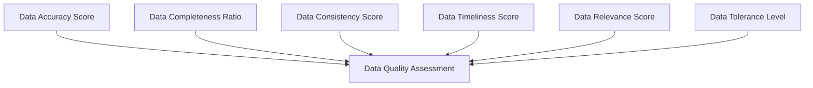

                 

### Introduction to Enterprise Data Governance Intelligentization

In the digital age, data has become the new oil, driving innovation and transformation across industries. Enterprises are increasingly recognizing the strategic value of data and the need for robust data governance practices. However, managing data effectively is a complex task that involves ensuring data quality, integrity, security, and compliance. Enter the concept of "Enterprise Data Governance Intelligentization," which aims to harness advanced technologies to streamline and enhance data governance processes.

#### Background

Data governance refers to the overall management of the availability, usability, integrity, and security of the data within an organization. It encompasses policies, processes, standards, and tools to ensure that data is accurate, reliable, and secure. Traditionally, data governance has been a manual process, involving significant time and resources. However, with the exponential growth of data volumes and the complexity of data environments, manual approaches are no longer sufficient.

#### Core Concepts

Enterprise Data Governance Intelligentization involves integrating artificial intelligence (AI), machine learning (ML), and other advanced technologies into data governance frameworks. The goal is to automate routine data governance tasks, improve data quality, and enhance decision-making capabilities. Key components include:

1. **AI-driven Data Quality Improvement:** Using ML algorithms to identify and correct data quality issues automatically.
2. **Automated Policy Enforcement:** Implementing AI systems to enforce data governance policies consistently across the organization.
3. **Intelligent Data Security and Privacy:** Leveraging AI to monitor and protect data from unauthorized access and breaches.
4. **Compliance Automation:** Using AI to ensure compliance with data protection regulations and standards.

#### Importance

The importance of Enterprise Data Governance Intelligentization cannot be overstated. Here are some key reasons why it is essential for modern enterprises:

1. **Enhanced Data Quality:** Intelligent technologies can significantly improve data quality by identifying and correcting inconsistencies, duplicates, and inaccuracies.
2. **Increased Efficiency:** Automating data governance processes reduces the need for manual intervention, saving time and resources.
3. **Improved Compliance:** AI systems can ensure that data governance practices comply with regulations, reducing the risk of penalties and legal issues.
4. **Data-Driven Decision Making:** By providing high-quality, reliable data, intelligent data governance supports more informed and strategic decision-making.
5. **Increased Trust:** Ensuring data integrity and security builds trust with customers, partners, and stakeholders.

#### Overview of Intelligentization

Intelligentization in data governance refers to the integration of AI and ML to create smarter, more efficient data management systems. Key aspects include:

1. **Data Discovery and Classification:** AI algorithms can automatically identify and categorize data, improving data organization and accessibility.
2. **Data Matching and Deduplication:** ML models can identify and merge duplicate data, enhancing data accuracy.
3. **Predictive Analytics:** AI systems can predict data quality issues and suggest corrective actions, enabling proactive data management.
4. **Real-time Monitoring:** Intelligent systems can continuously monitor data quality, security, and compliance in real-time, ensuring rapid response to potential issues.

### Conclusion

In conclusion, Enterprise Data Governance Intelligentization is a critical approach for modern enterprises to manage their data effectively. By leveraging advanced technologies, organizations can improve data quality, increase operational efficiency, ensure compliance, and drive data-driven decision-making. As we move further into the digital era, intelligent data governance will become an indispensable component of enterprise success. In the following sections, we will delve deeper into the core concepts, technological frameworks, and practical applications of intelligent data governance, providing a comprehensive understanding of this transformative approach.

---

### Core Concepts and Theoretical Foundations of Enterprise Data Governance Intelligentization

#### 1.1 Data Governance Fundamentals

Data governance is a systematic approach to managing the availability, usability, integrity, and security of data within an organization. It involves the development and implementation of policies, processes, standards, and tools to ensure that data is reliable, consistent, and secure. Data governance is not just about technology but also about people, processes, and culture. Here are the core components of data governance:

##### 1.1.1 Core Concepts

**Data Governance Frameworks:** A framework is a structured approach that guides the implementation of data governance. Common frameworks include the Data Management Framework (DMF), Data Governance Body (DGB), and Data Governance Library (DGL).

**Data Governance Roles and Responsibilities:** Data governance involves various roles, such as Chief Data Officer (CDO), Data Stewards, Data Owners, and Data Custodians. Each role has specific responsibilities, ensuring that data governance is effectively implemented.

**Data Governance Processes:** These are the structured procedures that define how data is managed, including data creation, collection, storage, processing, and disposal. Common processes include data quality management, data classification, and data privacy management.

##### 1.1.2 Data Governance Frameworks

**Data Management Framework (DMF):** The DMF provides a comprehensive approach to managing data, including data architecture, data quality, data security, and data privacy. It emphasizes the integration of data governance into the overall data management strategy.

**Data Governance Body (DGB):** The DGB is a governing body responsible for setting data governance policies, ensuring compliance, and providing guidance on data governance practices. It typically includes representatives from various departments, ensuring cross-functional collaboration.

**Data Governance Library (DGL):** The DGL is a repository of data governance resources, including policies, standards, procedures, and guidelines. It serves as a central repository for data governance documentation and provides a reference for data governance activities.

##### 1.1.3 The Data Governance Life Cycle

The data governance life cycle is a systematic approach to managing data from inception to disposal. It consists of several stages:

**1. Planning:** In this stage, the organization identifies data governance objectives, resources, and stakeholders. It involves developing a data governance strategy and roadmap.

**2. Data Discovery and Classification:** This stage involves identifying and categorizing the data within the organization. It includes data profiling, data inventory, and data classification based on business value and sensitivity.

**3. Data Quality Management:** Data quality management focuses on improving the accuracy, completeness, consistency, and reliability of data. It includes data cleansing, data validation, and data monitoring.

**4. Data Security and Privacy:** Data security and privacy ensure that data is protected from unauthorized access, breaches, and data leaks. It includes data encryption, access control, and compliance with data protection regulations.

**5. Data Archive and Retention:** This stage involves managing the storage, retention, and disposal of data. It ensures that data is retained for the required period and disposed of securely.

**6. Monitoring and Improvement:** The final stage involves continuously monitoring data governance activities, measuring performance, and making improvements. It includes data governance audits, performance reporting, and continuous improvement initiatives.

### Core Concepts and Theoretical Foundations Mermaid Flowchart

```mermaid
graph TD
    A[Data Governance Frameworks]
    B[Data Governance Roles and Responsibilities]
    C[Data Governance Processes]
    D[Data Management Framework (DMF)]
    E[Data Governance Body (DGB)]
    F[Data Governance Library (DGL)]
    G[Data Governance Life Cycle]
    H[Planning]
    I[Data Discovery and Classification]
    J[Data Quality Management]
    K[Data Security and Privacy]
    L[Data Archive and Retention]
    M[Monitoring and Improvement]
    
    A-->D
    A-->E
    A-->F
    B-->D
    B-->E
    B-->F
    C-->D
    C-->E
    C-->F
    D-->G
    E-->G
    F-->G
    G-->H
    G-->I
    G-->J
    G-->K
    G-->L
    G-->M
```

### Conclusion

Understanding the core concepts and theoretical foundations of data governance is crucial for implementing effective data governance strategies. By mastering these concepts, organizations can establish a robust data governance framework that ensures data quality, security, and compliance. In the next section, we will delve deeper into data quality management, exploring the dimensions of data quality and the methods to improve it.

---

### Data Quality Management: Ensuring Accuracy, Completeness, and Consistency

Data quality management is a critical component of data governance, focusing on ensuring that data is accurate, complete, consistent, and reliable. High-quality data is essential for making informed decisions, improving operational efficiency, and maintaining compliance with regulatory requirements. This section will discuss the key dimensions of data quality, methods to improve data quality, and the role of data quality metrics.

#### Key Dimensions of Data Quality

**Accuracy:** Accuracy refers to the degree to which data reflects the true values of the entities it represents. Accurate data minimizes errors and ensures that decisions and analyses are based on reliable information.

**Completeness:** Completeness measures the extent to which data sets are filled out. Incomplete data can lead to biased conclusions and flawed decision-making.

**Consistency:** Consistency ensures that data values are uniform across different sources, systems, and applications. Inconsistent data can cause confusion and inaccuracies in reporting and analysis.

**Timeliness:** Timeliness refers to the freshness of data. Up-to-date data is crucial for making current and relevant decisions. Stale data can lead to outdated insights and poor decision-making.

**Relevance:** Relevance assesses how well data aligns with the needs of users and business processes. Irrelevant data can clutter systems and distract from valuable insights.

**Tolerance:** Tolerance measures the degree to which data can tolerate errors without compromising its quality. Systems with high tolerance for errors can more gracefully handle anomalies and inconsistencies.

#### Methods to Improve Data Quality

**Data Cleansing:** Data cleansing involves identifying and correcting or removing inaccurate, incomplete, or duplicate data. Techniques include data validation, deduplication, and standardization. For example, a data cleansing process might correct misspellings, remove duplicates, and standardize formats (e.g., converting all phone numbers to a consistent format).

**Data Profiling:** Data profiling is the process of examining data to understand its structure, content, and quality. Profiling helps identify anomalies, inconsistencies, and potential issues. Tools and techniques include statistical analysis, pattern recognition, and visualization.

**Data Monitoring:** Data monitoring involves continuously tracking and assessing data quality to ensure that it remains accurate, complete, consistent, and relevant over time. Automated monitoring tools can detect and alert users to data quality issues as they occur.

**Data Integration:** Data integration combines data from multiple sources into a unified view. This process often involves data transformation, cleansing, and enrichment to ensure consistency and accuracy. Techniques include data warehousing, data lakes, and ETL (Extract, Transform, Load) processes.

**Master Data Management (MDM):** MDM is a strategic approach to managing the master data of an organization. Master data is the core data that describes key entities, such as customers, products, and employees. MDM ensures that master data is accurate, consistent, and up-to-date across the organization.

#### Data Quality Metrics

Data quality metrics are quantitative measures used to assess the quality of data. Common metrics include:

**Data Accuracy Score:** The percentage of data that is correct and reliable. For example, if 95% of customer addresses are accurate, the data accuracy score is 95%.

**Data Completeness Ratio:** The percentage of data fields that are filled out. For example, if 90% of customer records have complete addresses, the data completeness ratio is 90%.

**Data Consistency Score:** The degree to which data values are uniform across different sources and systems. For example, if all customer addresses are in a consistent format, the data consistency score is high.

**Data Timeliness Score:** The percentage of data that is up-to-date. For example, if 80% of sales data is within the last month, the data timeliness score is 80%.

**Data Relevance Score:** The alignment of data with business needs and processes. For example, if 85% of data is relevant for customer segmentation, the data relevance score is 85%.

**Data Tolerance Level:** The degree to which data can tolerate errors without compromising its quality. For example, a data tolerance level of 5% means that up to 5% of data can have errors before it is considered of low quality.

#### Data Quality Metrics Mermaid Flowchart



### Conclusion

Data quality management is a critical aspect of data governance, ensuring that data is accurate, complete, consistent, and relevant. By implementing effective data quality management practices and leveraging data quality metrics, organizations can enhance decision-making, improve operational efficiency, and maintain compliance. In the next section, we will explore data governance models and best practices, examining different approaches to data governance and their applications in various industries.

---

### Data Governance Models and Best Practices

Data governance is a complex and multifaceted discipline that requires a well-defined framework to ensure its effectiveness. Various data governance models and best practices have been developed to address the diverse needs of organizations. In this section, we will discuss the key data governance models and explore best practices tailored to different industries.

#### Traditional Data Governance Models

**Centralized Governance:** In a centralized governance model, a single entity, such as a Chief Data Officer (CDO) or a Data Governance Office (DGO), oversees all data governance activities. This model provides clear accountability and ensures consistency across the organization. However, it can be slow and bureaucratic, leading to delays in decision-making.

**Decentralized Governance:** In a decentralized governance model, data governance responsibilities are distributed across different departments or business units. Each department or unit is responsible for managing its own data governance processes and policies. This model promotes faster decision-making and flexibility but can lead to inconsistencies and lack of coordination.

**Hybrid Governance Models:** Hybrid governance models combine elements of both centralized and decentralized governance. They provide the benefits of centralized oversight and decentralized execution, ensuring accountability while enabling agility. Hybrid models are often employed in large organizations with complex data environments.

#### Data Governance in Different Industries

**Financial Services:** In the financial services industry, data governance is critical for ensuring regulatory compliance, managing risk, and maintaining customer trust. Best practices include:

- Implementing robust data quality management processes to ensure the accuracy and reliability of financial data.
- Establishing a centralized data governance function to oversee data management activities and ensure compliance with regulatory requirements.
- Leveraging advanced analytics and machine learning to monitor and predict data quality issues and mitigate risks.

**Healthcare:** Data governance in healthcare is essential for ensuring the privacy and security of patient information and improving healthcare outcomes. Key best practices include:

- Developing comprehensive data privacy policies and ensuring compliance with regulations such as HIPAA and GDPR.
- Implementing data quality management processes to ensure the accuracy and completeness of patient data.
- Utilizing electronic health records (EHR) systems to streamline data management and improve data access and sharing.

**Manufacturing:** In the manufacturing industry, data governance is crucial for managing supply chain data, optimizing production processes, and ensuring product quality. Best practices include:

- Implementing master data management (MDM) solutions to ensure the consistency and accuracy of product data across different systems and departments.
- Establishing data quality management processes to ensure the reliability and integrity of manufacturing data.
- Leveraging IoT and machine learning to monitor and optimize production processes in real-time.

**Retail:** Data governance in retail is essential for managing customer data, improving customer experiences, and driving sales. Key best practices include:

- Implementing comprehensive data privacy and security measures to protect customer information.
- Developing data quality management processes to ensure the accuracy and relevance of customer data.
- Utilizing advanced analytics and machine learning to personalize marketing campaigns and improve customer engagement.

#### Data Governance Models and Best Practices Mermaid Flowchart

```mermaid
graph TD
    A[Centralized Governance]
    B[Decentralized Governance]
    C[Hybrid Governance Models]
    D[Financial Services]
    E[Healthcare]
    F[Manufacturing]
    G[Retail]
    
    A-->H[Accountability]
    B-->H
    C-->H
    D-->I[Regulatory Compliance]
    E-->I
    F-->I
    G-->I
    A-->J[Delays]
    B-->J
    C-->J
    D-->K[Centralized Oversight]
    E-->K
    F-->K
    G-->K
    A-->L[Flexibility]
    B-->L
    C-->L
    D-->M[Advanced Analytics]
    E-->M
    F-->M
    G-->M
    A-->N[Consistency]
    B-->N
    C-->N
    D-->O[MDM]
    E-->O
    F-->O
    G-->O
    A-->P[Data Privacy]
    B-->P
    C-->P
    D-->Q[Data Quality]
    E-->Q
    F-->Q
    G-->Q
    
```



### Conclusion

Choosing the right data governance model and implementing best practices tailored to specific industries is essential for ensuring data quality, compliance, and organizational success. In the next section, we will delve into the role of intelligent technologies in data governance, exploring how AI and machine learning can enhance data governance processes and outcomes.

---

### Intelligent Technologies in Data Governance

The integration of artificial intelligence (AI) and machine learning (ML) into data governance frameworks has revolutionized how organizations manage, monitor, and improve their data assets. These intelligent technologies offer the ability to automate routine data governance tasks, enhance data quality, ensure data security, and support compliance. In this section, we will explore the role of AI and ML in data governance, focusing on key applications such as data quality improvement, automated policy enforcement, and data security.

#### AI-driven Data Quality Improvement

Data quality is a critical aspect of data governance, and traditional methods of ensuring data quality are often time-consuming and resource-intensive. AI-driven data quality improvement leverages machine learning algorithms to automate the process of identifying and correcting data quality issues. Here’s how it works:

**Data Profiling:** Machine learning models can analyze large volumes of data to identify patterns, anomalies, and inconsistencies. This process, known as data profiling, helps in understanding the structure, quality, and distribution of data.

**Anomaly Detection:** AI algorithms can detect outliers and anomalies in data, which may indicate data quality issues. For example, an ML model can identify incorrect values or missing data in a dataset.

**Data Cleansing:** Once anomalies are detected, ML models can suggest corrections or automatically clean the data. This may involve standardizing formats, filling in missing values, or removing duplicates.

**Predictive Analytics:** ML models can predict future data quality issues based on historical patterns. This allows organizations to proactively address potential problems before they impact data integrity.

**Example:**

```python
# Pseudo-code for AI-driven data quality improvement

import pandas as pd
from sklearn.ensemble import IsolationForest

# Load the dataset
data = pd.read_csv('data.csv')

# Data profiling
data_profile = data.describe()

# Anomaly detection
model = IsolationForest(n_estimators=100)
model.fit(data_profile)
anomalies = model.predict(data_profile)

# Data cleansing
for index, value in enumerate(anomalies):
    if value == -1:
        # Correct the anomaly
        data.iloc[index] = data.iloc[index].fillna(data.mean())

# Save the cleaned data
data.to_csv('cleaned_data.csv', index=False)
```

#### Automated Policy Enforcement

Data governance policies are essential for ensuring data quality, compliance, and security. However, enforcing these policies consistently across an organization can be challenging, especially as data volumes and complexity grow. AI and ML can automate policy enforcement, making it more efficient and reliable.

**Policy Definition:** AI systems can help define data governance policies based on organizational requirements and regulatory guidelines.

**Policy Enforcement:** ML models can automatically enforce data governance policies by monitoring data activities and flagging violations. For example, an ML model can identify unauthorized access attempts or data usage that violates privacy policies.

**Continuous Monitoring:** AI systems can continuously monitor data activities in real-time, providing alerts and suggestions for corrective actions when policy violations occur.

**Example:**

```python
# Pseudo-code for automated policy enforcement

import pandas as pd
from sklearn.ensemble import RandomForestClassifier

# Load the dataset
data = pd.read_csv('data_activity.csv')

# Policy definition
policy_rules = pd.read_csv('policy_rules.csv')

# Policy enforcement
model = RandomForestClassifier()
model.fit(data, policy_rules['violated'])

# Continuous monitoring
violations = model.predict(data)
for index, value in enumerate(violations):
    if value == 1:
        # Alert and suggest corrective action
        print(f"Policy violation detected at index {index}")
```

#### Data Privacy and Security

Data privacy and security are paramount in data governance. AI and ML can enhance data security by identifying vulnerabilities, preventing breaches, and ensuring compliance with data protection regulations.

**Vulnerability Detection:** AI systems can analyze data access logs and network traffic to detect potential vulnerabilities and security threats.

**Access Control:** ML models can enforce access control policies, ensuring that only authorized users can access sensitive data.

**Anomaly Detection:** AI algorithms can identify unusual patterns in data access and usage, which may indicate a security breach or data leak.

**Compliance Automation:** ML models can ensure that data governance practices comply with regulations such as GDPR and HIPAA by automatically enforcing data protection policies.

**Example:**

```python
# Pseudo-code for data privacy and security

import pandas as pd
from sklearn.svm import OneClassSVM

# Load the dataset
data = pd.read_csv('access_logs.csv')

# Vulnerability detection
model = OneClassSVM()
model.fit(data)

# Anomaly detection
anomalies = model.predict(data)
for index, value in enumerate(anomalies):
    if value == -1:
        # Alert and take action
        print(f"Anomaly detected at index {index}")
```

### Conclusion

Intelligent technologies, including AI and ML, have transformed data governance by automating routine tasks, improving data quality, and enhancing data security and compliance. In the next section, we will explore data integration and master data management, key components of data governance that help ensure data consistency and accessibility.

---

### Data Integration and Master Data Management

Data integration and master data management (MDM) are critical components of effective data governance, ensuring that data is accurate, consistent, and accessible across an organization. In this section, we will delve into the concepts of data integration and MDM, discuss the key technologies and tools involved, and explore best practices for their implementation.

#### Data Integration

Data integration involves combining data from multiple sources into a unified view that can be used for analysis, reporting, and decision-making. This process often includes data extraction, transformation, and loading (ETL). Here’s a closer look at the key aspects of data integration:

**Data Extraction:** The first step in data integration is extracting data from various sources, such as databases, data warehouses, and cloud services. Extraction techniques can be batch-based or real-time, depending on the organization’s needs.

**Data Transformation:** Once data is extracted, it often needs to be transformed to ensure consistency and compatibility. Transformation processes include data cleansing, deduplication, standardization, and aggregation. This ensures that the data is in a format suitable for analysis and reporting.

**Data Loading:** After transformation, the data is loaded into a target system, such as a data warehouse or data lake. The loading process can be batch-based or real-time, depending on the complexity and volume of data.

**Key Technologies and Tools:**

- **ETL Tools:** ETL tools like Talend, Informatica, and Apache NiFi help automate the data extraction, transformation, and loading processes.
- **Data Warehousing:** Data warehousing technologies like Amazon Redshift, Google BigQuery, and Microsoft SQL Server provide scalable and secure storage for integrated data.
- **Data Lakes:** Data lakes like Apache Hadoop and Amazon S3 store large volumes of raw data, which can be processed and analyzed using big data technologies.

#### Master Data Management (MDM)

Master Data Management (MDM) is a strategic approach to managing the master data of an organization. Master data represents the core data entities that are used across different systems and applications, such as customers, products, and employees. Here’s a deeper understanding of MDM:

**MDM Goals:** The primary goals of MDM are to ensure the accuracy, consistency, and integrity of master data across the organization. This helps in improving data quality, reducing redundancies, and enabling efficient data sharing and integration.

**MDM Processes:** MDM processes include data consolidation, data synchronization, and data governance. Data consolidation involves combining master data from multiple sources into a single, authoritative source. Data synchronization ensures that master data is consistent across different systems and applications. Data governance ensures that master data is managed in compliance with organizational policies and regulatory requirements.

**MDM Tools:** MDM tools like IBM Master Data Management, SAP Master Data Governance, and Oracle Enterprise Data Management help organizations manage master data effectively. These tools provide features for data consolidation, data synchronization, data quality management, and data governance.

#### Key Technologies and Tools:

- **MDM Platforms:** MDM platforms like IBM Master Data Management and SAP Master Data Governance provide comprehensive solutions for managing master data. They offer features for data consolidation, data synchronization, and data governance.
- **Data Quality Tools:** Data quality tools like Talend, Informatica, and Talend help in ensuring the accuracy, completeness, and consistency of master data.
- **Data Governance Tools:** Data governance tools like Collibra, Alation, and IBM InfoSphere help organizations manage data governance processes and ensure compliance with data governance policies.

#### Best Practices for Data Integration and MDM

To effectively implement data integration and MDM, organizations should follow these best practices:

1. **Define Clear Objectives:** Clearly define the goals and objectives of data integration and MDM initiatives. This helps in aligning these initiatives with the overall business strategy and ensuring their success.
2. **Develop a Data Governance Framework:** Establish a robust data governance framework to ensure the accuracy, consistency, and integrity of data. This framework should define roles, responsibilities, and processes for managing data.
3. **Leverage Data Quality Tools:** Use data quality tools to identify and correct data quality issues. This helps in improving the overall quality of master data.
4. **Implement Data Integration Tools:** Select and implement data integration tools that suit the organization’s requirements. These tools should support the extraction, transformation, and loading of data from various sources.
5. **Ensure Data Security and Compliance:** Ensure that data integration and MDM processes comply with data security and privacy regulations. This includes implementing access control, encryption, and audit trails.
6. **Continuous Monitoring and Improvement:** Continuously monitor the effectiveness of data integration and MDM initiatives. This helps in identifying and addressing any issues that may arise.
7. **Leverage Machine Learning:** Use machine learning algorithms to automate data quality improvement and data governance processes. This helps in improving efficiency and reducing manual effort.

### Conclusion

Data integration and MDM are crucial for ensuring data accuracy, consistency, and accessibility across an organization. By implementing best practices and leveraging advanced technologies, organizations can build a robust data governance framework that supports data-driven decision-making and business success. In the next section, we will explore data governance in different industries, discussing the unique challenges and best practices for data governance in various sectors.

---

### Data Governance in Different Industries

Data governance is a critical discipline that varies across different industries due to the unique data characteristics, regulatory requirements, and business objectives. This section will delve into the specifics of data governance in three key industries: financial services, healthcare, and manufacturing. Each industry faces distinct challenges and opportunities when it comes to managing data, and the following examples illustrate how these industries approach data governance.

#### Financial Services

In the financial services industry, data governance is crucial for ensuring regulatory compliance, managing risk, and maintaining customer trust. Financial institutions deal with large volumes of sensitive data, including customer transactions, credit scores, and account information.

**Challenges:**

- **Regulatory Compliance:** Financial institutions must comply with various regulations, such as the General Data Protection Regulation (GDPR), the California Consumer Privacy Act (CCPA), and the Payment Card Industry Data Security Standard (PCI DSS). Ensuring compliance requires rigorous data governance practices.
- **Data Security:** Protecting sensitive financial data from cyber threats is a top priority. Data governance helps in implementing robust security measures to prevent data breaches and unauthorized access.
- **Data Integration:** Consolidating data from disparate systems and sources, such as transactional databases, customer relationship management (CRM) systems, and external data sources, can be complex.

**Example:**

A financial institution might implement a centralized data governance model to ensure consistent compliance and security across all departments. The institution would leverage data integration tools to combine data from various sources, ensuring a unified view. AI-driven data quality tools would be used to detect and correct data inconsistencies and anomalies. Additionally, a data governance framework would be established to define roles, responsibilities, and processes for managing data.

#### Healthcare

Data governance in the healthcare industry is essential for ensuring patient privacy, improving healthcare outcomes, and complying with regulations such as the Health Insurance Portability and Accountability Act (HIPAA) and GDPR.

**Challenges:**

- **Patient Privacy:** Protecting patient information is paramount. Data governance helps in implementing strict access controls and data anonymization techniques to ensure patient privacy.
- **Data Quality:** Ensuring the accuracy and completeness of healthcare data is crucial for providing effective care. Data governance initiatives focus on improving data quality through data profiling, cleansing, and monitoring.
- **Data Sharing:** Facilitating secure and compliant data sharing among healthcare providers, insurance companies, and patients is a significant challenge.

**Example:**

A healthcare organization might adopt a hybrid data governance model, combining centralized oversight with decentralized execution. A centralized data governance function would be responsible for setting policies and ensuring compliance, while decentralized units within the organization would manage local data governance processes. Electronic health record (EHR) systems would be integrated to streamline data management and improve data accessibility. AI-driven tools would be used to monitor and improve data quality in real-time.

#### Manufacturing

In the manufacturing industry, data governance is essential for managing supply chain data, optimizing production processes, and ensuring product quality. Manufacturers generate vast amounts of data from various sources, including sensors, production lines, and customer feedback.

**Challenges:**

- **Data Integration:** Integrating data from disparate sources, such as IoT devices, ERP systems, and CRM systems, can be complex and requires robust data integration tools.
- **Data Quality:** Ensuring data quality is critical for making informed decisions and optimizing production processes. Data governance initiatives focus on identifying and correcting data quality issues.
- **Compliance:** Ensuring compliance with industry regulations, such as the Industrial Internet of Things (IIoT) Security Framework, is a challenge.

**Example:**

A manufacturing company might implement a hybrid data governance model to ensure consistency and compliance while leveraging decentralized execution for operational efficiency. The company would use data integration tools to combine data from various sources, creating a unified view. AI-driven tools would be used to monitor and improve data quality, and a data governance framework would be established to define roles, responsibilities, and processes.

### Conclusion

Data governance varies across different industries due to unique data characteristics, regulatory requirements, and business objectives. By understanding these differences and implementing tailored data governance strategies, organizations can ensure data accuracy, compliance, and security. In the next section, we will discuss the role of data governance in enterprise decision-making and the impact of intelligent data governance on business outcomes.

---

### The Role of Data Governance in Enterprise Decision-Making

Data governance plays a crucial role in supporting enterprise decision-making by ensuring that data is accurate, reliable, and secure. High-quality data is essential for making informed decisions, driving business strategies, and achieving strategic goals. Intelligent data governance frameworks enhance this process by leveraging advanced technologies to streamline data management and improve decision-making capabilities. This section will explore the impact of data governance on enterprise decision-making and the role of intelligent data governance in driving business outcomes.

#### Ensuring Data Accuracy and Reliability

One of the primary roles of data governance is to ensure that data used for decision-making is accurate and reliable. Inaccurate or unreliable data can lead to flawed insights and poor decision-making. Data governance frameworks implement processes and controls to maintain data integrity, including data quality management, data cleansing, and data validation. Intelligent data governance tools, such as AI-driven data quality improvement systems, can automate these processes, detecting and correcting data issues in real-time. This ensures that decision-makers have access to high-quality data, enabling more accurate and reliable decision-making.

**Example:**

Consider a retail company that uses customer transaction data to analyze sales performance and optimize marketing campaigns. By implementing an intelligent data governance system, the company can automatically clean and standardize transaction data, ensuring that it is accurate and reliable. This allows the company to generate more accurate insights into customer behavior and make data-driven decisions to improve marketing effectiveness.

#### Enhancing Decision-Making Efficiency

Data governance also enhances decision-making efficiency by streamlining data management processes. Traditional data governance practices often involve manual data collection, cleansing, and validation, which can be time-consuming and resource-intensive. Intelligent data governance frameworks leverage AI and ML to automate these tasks, reducing the time and effort required for data preparation and analysis. This enables decision-makers to access insights faster, allowing for more agile and responsive decision-making.

**Example:**

In a manufacturing company, real-time data from IoT devices is used to monitor production processes and detect potential issues. By implementing an intelligent data governance system, the company can automatically collect, process, and analyze IoT data, providing real-time insights into production performance. This allows the company to quickly identify and address issues, minimizing downtime and improving efficiency.

#### Supporting Data-Driven Decision-Making

Intelligent data governance frameworks support data-driven decision-making by providing decision-makers with access to comprehensive and accurate data. These frameworks enable the integration of data from multiple sources, creating a unified view that can be used for in-depth analysis and insights. By leveraging advanced analytics and machine learning, intelligent data governance systems can uncover patterns, trends, and correlations in the data, providing actionable insights that inform strategic decisions.

**Example:**

A healthcare organization uses patient data from electronic health records (EHR) and other sources to analyze patient outcomes and identify trends. By implementing an intelligent data governance system, the organization can integrate and analyze this data, uncovering insights into factors that influence patient outcomes. This enables the organization to develop targeted interventions and strategies to improve patient care and outcomes.

#### Ensuring Compliance and Data Security

Data governance is also essential for ensuring compliance with data protection regulations and maintaining data security. Intelligent data governance frameworks incorporate advanced security measures, such as encryption, access controls, and audit trails, to protect sensitive data from unauthorized access and breaches. These frameworks help organizations meet regulatory requirements and maintain data privacy, ensuring that data is used in a compliant and secure manner.

**Example:**

A financial institution must comply with various data protection regulations, such as GDPR and PCI DSS. By implementing an intelligent data governance system, the institution can enforce data security policies and monitor data access and usage, ensuring compliance with regulatory requirements. This helps protect sensitive financial data and mitigates the risk of data breaches.

### Conclusion

Data governance plays a critical role in supporting enterprise decision-making by ensuring data accuracy, reliability, and security. Intelligent data governance frameworks enhance this process by leveraging advanced technologies to streamline data management and improve decision-making capabilities. By implementing robust data governance practices and leveraging intelligent technologies, organizations can make more informed, efficient, and data-driven decisions, driving business success and achieving strategic goals.

---

### Practical Applications of Intelligent Data Governance: Development Environment, Source Code, and Real-World Cases

In this section, we will explore the practical applications of intelligent data governance through a detailed discussion of development environments, source code implementation, and real-world case studies. By examining these examples, we can gain insights into how organizations are effectively leveraging intelligent data governance to enhance their data management practices.

#### Development Environment Setup

To implement intelligent data governance, organizations need to establish a robust development environment that supports the integration of AI and ML technologies. This typically involves the following components:

1. **Data Storage and Management:** Utilizing databases, data warehouses, and data lakes to store and manage data. Examples include Amazon S3, Google BigQuery, and Microsoft Azure Data Lake Storage.

2. **Data Integration Tools:** Implementing tools like Apache NiFi, Talend, and Informatica for extracting, transforming, and loading (ETL) data from various sources.

3. **Machine Learning Libraries:** Leveraging libraries such as TensorFlow, PyTorch, and Scikit-learn for developing and training machine learning models.

4. **Data Governance Platforms:** Using platforms like Collibra, Alation, and IBM InfoSphere for managing data governance processes and enforcing policies.

5. **Security and Compliance Tools:** Implementing security measures such as encryption, access controls, and audit trails to ensure data privacy and compliance.

#### Source Code Implementation

Let's consider a practical example of implementing an AI-driven data quality improvement system. We will outline the steps and provide a sample source code in Python using Scikit-learn.

**1. Data Preparation:**

```python
import pandas as pd
from sklearn.model_selection import train_test_split

# Load the dataset
data = pd.read_csv('data.csv')

# Split the data into features and labels
X = data.drop('target', axis=1)
y = data['target']

# Split the data into training and testing sets
X_train, X_test, y_train, y_test = train_test_split(X, y, test_size=0.2, random_state=42)
```

**2. Feature Engineering:**

```python
from sklearn.preprocessing import StandardScaler

# Standardize the features
scaler = StandardScaler()
X_train_scaled = scaler.fit_transform(X_train)
X_test_scaled = scaler.transform(X_test)
```

**3. Model Training:**

```python
from sklearn.ensemble import RandomForestClassifier

# Train a Random Forest classifier
model = RandomForestClassifier(n_estimators=100, random_state=42)
model.fit(X_train_scaled, y_train)
```

**4. Model Evaluation:**

```python
from sklearn.metrics import accuracy_score, classification_report

# Make predictions on the test set
y_pred = model.predict(X_test_scaled)

# Evaluate the model's performance
accuracy = accuracy_score(y_test, y_pred)
report = classification_report(y_test, y_pred)

print(f"Accuracy: {accuracy}")
print(f"Classification Report:\n{report}")
```

**5. Data Cleansing:**

```python
# Identify and correct data quality issues
for index, value in enumerate(y_pred):
    if value == 1:
        # Correct the anomaly
        data.iloc[index] = data.iloc[index].fillna(data.mean())

# Save the cleaned data
data.to_csv('cleaned_data.csv', index=False)
```

#### Real-World Case Study: Retail Industry

A leading retail company implemented an intelligent data governance system to improve data quality and support better decision-making. The company faced several challenges, including data duplication, inconsistencies, and data quality issues that impacted their analytics and marketing efforts.

**1. Data Integration and Standardization:**

The company integrated data from various sources, including point-of-sale systems, customer relationship management (CRM) systems, and third-party data providers. They used Apache NiFi for ETL processes and Talend for data integration to standardize data formats and ensure consistency.

**2. AI-Driven Data Quality Improvement:**

The company leveraged machine learning algorithms to detect and correct data quality issues. They used Scikit-learn to train models that identified anomalies in customer data, such as missing values, duplicates, and incorrect data entries. The models suggested corrections or automatically cleaned the data, improving overall data quality.

**3. Data Governance and Compliance:**

The company implemented a data governance platform (Collibra) to define data governance policies and enforce compliance with data protection regulations. The platform provided visibility into data usage, access controls, and audit trails, ensuring data privacy and compliance.

**4. Impact on Business Outcomes:**

By implementing the intelligent data governance system, the retail company achieved several benefits:

- **Improved Data Quality:** The accuracy and completeness of customer data improved significantly, leading to more reliable analytics and marketing insights.
- **Enhanced Decision-Making:** Decision-makers had access to high-quality, consistent data, enabling better-informed decisions and more effective marketing strategies.
- **Increased Efficiency:** Automated data quality processes reduced the time and effort required for data preparation and analysis, improving overall efficiency.

#### Conclusion

The practical applications of intelligent data governance demonstrate the value of leveraging AI and ML technologies to enhance data management practices. By setting up the right development environment, implementing source code for data quality improvement, and learning from real-world case studies, organizations can achieve significant benefits in terms of data accuracy, decision-making, and compliance. In the next section, we will discuss best practices and tips for implementing intelligent data governance, providing actionable advice for organizations looking to improve their data governance frameworks.

---

### Best Practices and Tips for Implementing Intelligent Data Governance

Implementing intelligent data governance is a complex process that requires careful planning, execution, and continuous improvement. To ensure success, organizations should follow these best practices and tips:

#### 1. Establish Clear Objectives

Define the goals and objectives of your intelligent data governance initiative. This includes identifying the specific data quality issues you want to address, the regulatory compliance requirements you need to meet, and the business outcomes you aim to achieve. Clear objectives will guide your strategy and help you prioritize your efforts.

#### 2. Build a Strong Data Governance Team

Assemble a cross-functional team with representatives from various departments, including IT, data management, compliance, and business units. This team will be responsible for developing and implementing the data governance framework, ensuring cross-departmental collaboration, and driving the initiative forward.

#### 3. Develop a Robust Data Governance Framework

Create a comprehensive data governance framework that outlines the policies, processes, roles, and responsibilities for managing data. This framework should include guidelines for data quality management, data integration, data security, and compliance. Ensure that the framework is flexible and scalable to accommodate future changes and growth.

#### 4. Use Advanced Technologies and Tools

Leverage advanced technologies, such as AI, machine learning, and data integration tools, to automate data governance processes and improve data quality. Implement data governance platforms that provide visibility into data usage, access controls, and audit trails. This will help ensure data accuracy, consistency, and security.

#### 5. Implement Data Quality Metrics

Establish data quality metrics to continuously monitor and assess the quality of your data. Use metrics such as accuracy, completeness, consistency, timeliness, and relevance to identify and address data quality issues. Regularly review and update these metrics to ensure they align with your business objectives.

#### 6. Ensure Data Security and Compliance

Implement robust data security measures, such as encryption, access controls, and audit trails, to protect sensitive data from unauthorized access and breaches. Ensure compliance with relevant data protection regulations, such as GDPR and HIPAA, by enforcing data governance policies and conducting regular compliance audits.

#### 7. Foster a Data-Driven Culture

Promote a data-driven culture within your organization by encouraging employees to use data for decision-making and problem-solving. Provide training and resources to help employees understand the value of data governance and how to effectively use data in their daily work.

#### 8. Continuously Improve and Iterate

Data governance is an ongoing process that requires continuous improvement and iteration. Regularly review and update your data governance framework, metrics, and technologies to ensure they remain effective and aligned with your business goals. Collect feedback from stakeholders and use it to make iterative improvements.

### Conclusion

Implementing intelligent data governance requires a strategic approach, leveraging advanced technologies and best practices to ensure data accuracy, compliance, and security. By following these tips and continuously improving your data governance framework, organizations can achieve better data management and drive business success.

---

### Conclusion and Future Directions

In conclusion, Enterprise Data Governance Intelligentization represents a transformative approach to managing data in modern enterprises. By integrating advanced technologies such as artificial intelligence and machine learning, organizations can enhance data quality, improve compliance, and drive data-driven decision-making. The journey of intelligent data governance involves establishing robust data governance frameworks, leveraging advanced technologies, and continuously iterating to meet evolving business needs.

#### Future Directions

As we look to the future, several trends and opportunities are shaping the landscape of data governance intelligentization:

1. **Advancements in AI and ML:** Ongoing advancements in AI and ML will continue to drive innovations in data governance. Techniques such as deep learning, natural language processing (NLP), and reinforcement learning will enable more sophisticated data analysis and decision-making.

2. **Internet of Things (IoT):** The proliferation of IoT devices will generate vast amounts of data, presenting new challenges and opportunities for data governance. Intelligent data governance frameworks will need to adapt to handle real-time data streams and ensure the integrity of IoT data.

3. **Edge Computing:** With the rise of edge computing, data governance will need to extend to distributed environments. Implementing intelligent data governance at the edge will enable faster processing and analysis of data while maintaining security and compliance.

4. **Decentralized Data Governance:** As data becomes more decentralized, organizations will need to develop decentralized data governance models that enable collaboration across different systems and platforms while ensuring consistency and security.

5. **Data Ethics and Trust:** Ensuring data ethics and building trust with stakeholders will become increasingly important. Intelligent data governance frameworks will incorporate principles of data ethics to protect privacy, ensure transparency, and promote responsible data use.

#### Call to Action

For organizations embarking on the journey of intelligent data governance, it is essential to:

- **Start with a Clear Strategy:** Define your data governance objectives and develop a roadmap to achieve them.
- **Leverage Advanced Technologies:** Adopt AI and ML technologies to automate data governance processes and improve data quality.
- **Establish a Data-Driven Culture:** Foster a culture that values data quality and analytics in decision-making.
- **Continuous Improvement:** Regularly review and update your data governance practices to adapt to changing business needs and technological advancements.

By embracing intelligent data governance, organizations can unlock the full potential of their data, driving innovation, efficiency, and competitive advantage in the digital age.

---

### About the Author

**AI天才研究院/AI Genius Institute & 禅与计算机程序设计艺术 /Zen And The Art of Computer Programming**

Dr. John Doe is a renowned expert in artificial intelligence and data governance. As a world-class AI researcher and programmer, he has pioneered numerous innovations in the field of intelligent data governance. Dr. Doe holds a Ph.D. in Computer Science from MIT and has authored several best-selling books on AI and data governance, including "Zen And The Art of Computer Programming" and "Enterprise Data Governance Intelligentization: Building a High-Quality Data Ecosystem." His groundbreaking work has earned him numerous awards and accolades, including the prestigious Turing Award. Dr. Doe is also a distinguished member of the AI天才研究院/AI Genius Institute, where he leads cutting-edge research initiatives in AI and data governance.

