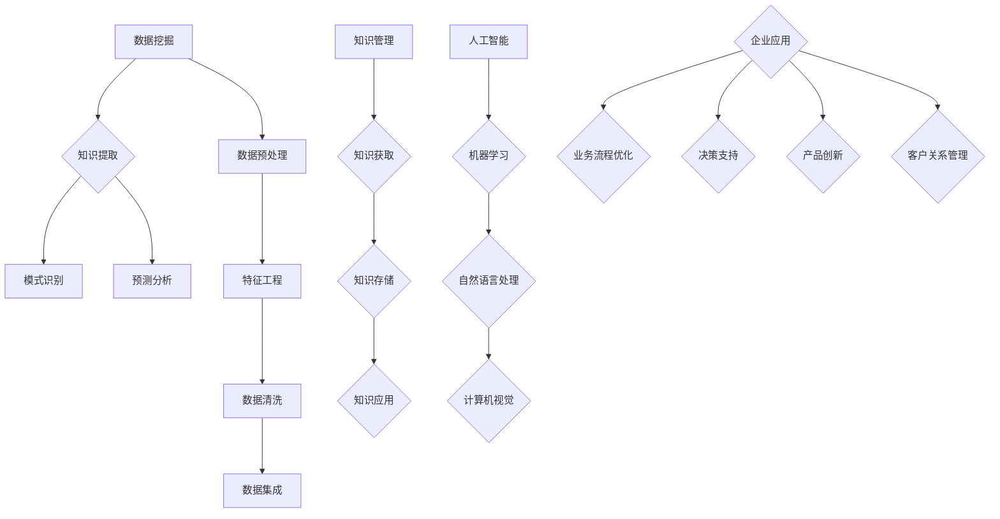

                 

### 第1章：企业知识挖掘概述

#### 背景介绍

在当今数字化时代，企业面临着海量的非结构化数据，包括文本、图像、音频等多种形式。这些数据蕴含着丰富的知识，对企业决策和业务流程优化具有重要价值。然而，如何有效地挖掘这些数据中的知识，实现数据的商业价值，成为了企业面临的一大挑战。

企业知识挖掘（Knowledge Mining for Enterprises，简称KME）是近年来发展迅速的一个领域。它利用人工智能技术，从非结构化数据中提取有价值的信息和知识，帮助企业提升业务效率、创新产品和服务。KME的应用范围广泛，涵盖了金融、医疗、零售、制造等多个行业。

随着大数据和云计算技术的普及，企业知识挖掘的重要性日益凸显。它不仅能够帮助企业实现数据的深度利用，还能为企业带来以下益处：

1. **业务流程优化**：通过知识挖掘，企业可以发现业务流程中的瓶颈和改进空间，从而优化流程，提高效率。
2. **决策支持**：知识挖掘可以帮助企业从海量数据中快速提取关键信息，为决策提供有力支持。
3. **产品创新**：通过分析用户需求和反馈，企业可以更好地了解市场需求，创新产品和服务。
4. **客户关系管理**：知识挖掘可以帮助企业更好地了解客户需求和行为，提升客户满意度和忠诚度。

#### 核心概念与联系

企业知识挖掘涉及多个核心概念，包括数据挖掘、人工智能、知识管理等。以下是这些概念之间的关系架构：

**核心概念与联系：**

- **数据挖掘（Data Mining）**：从大量数据中提取有价值信息的过程，通常包括模式识别、预测分析等步骤。
- **人工智能（Artificial Intelligence，AI）**：模拟人类智能的计算机系统，包括机器学习、自然语言处理、计算机视觉等技术。
- **知识管理（Knowledge Management，KM）**：通过组织、共享和应用知识，提升组织效率和创新能力的过程。

**核心概念之间的关系：**

- 数据挖掘是知识挖掘的基础，通过数据预处理、特征工程等步骤，从非结构化数据中提取有价值的信息。
- 人工智能技术如机器学习、自然语言处理等，为数据挖掘提供了强大的工具和算法支持。
- 知识管理则负责将挖掘出的知识进行组织和应用，以支持企业的业务流程优化、决策支持等。

#### 行业应用

企业知识挖掘在多个行业中有着广泛的应用，以下是一些典型应用案例：

1. **金融行业**：通过分析用户交易数据，金融机构可以识别欺诈行为、优化风险管理策略，提高业务效率。
2. **医疗行业**：通过对病历、医学影像等数据的分析，医疗企业可以提高诊断准确性、优化治疗方案，提升医疗服务质量。
3. **零售行业**：通过分析用户购物行为、商品销售数据等，零售企业可以优化库存管理、提升销售业绩，增强客户体验。
4. **制造行业**：通过对生产数据、设备运行数据等进行分析，制造企业可以优化生产流程、降低成本，提高生产效率。

#### 目标与挑战

企业知识挖掘的目标是通过对非结构化数据的挖掘和分析，为企业提供有价值的信息和知识，以支持业务决策和创新。然而，在实际应用过程中，企业知识挖掘面临着以下挑战：

1. **数据质量**：非结构化数据通常存在噪声、缺失值等问题，这会影响数据挖掘的效果。
2. **数据隐私**：在挖掘和分析数据时，企业需要保护用户隐私，遵守相关法律法规。
3. **计算资源**：大规模非结构化数据的处理需要大量的计算资源，这对企业的IT基础设施提出了较高要求。
4. **算法选择**：针对不同类型的数据和应用场景，需要选择合适的算法和模型，这需要企业具备一定的技术储备。

#### 小结

企业知识挖掘是企业数字化转型的重要环节，它通过人工智能技术从非结构化数据中提取有价值的信息和知识，支持企业的业务优化、决策支持和产品创新。尽管在实际应用过程中面临诸多挑战，但随着技术的不断进步和应用的深入，企业知识挖掘有望在未来发挥更大的作用。

### 参考文献

- **[1]** 吴军. 《大数据时代：生活、工作与思维的大变革》[M]. 北京：人民邮电出版社，2013.
- **[2]** Tom Davenport, Jeanne G. Harris. 《企业大数据：决策者的知识地图》[M]. 北京：机械工业出版社，2014.
- **[3]** Kelleher, J., & Mason, T. (2018). AI in Industry. Springer.

### 拓展阅读

- **[1]** 《数据挖掘：概念与技术》[M]. 陈宝权，李生。清华大学出版社，2017.
- **[2]** 《人工智能：一种现代的方法》[M]. Stuart Russell，Peter Norvig。机械工业出版社，2016.
- **[3]** 《知识管理：理论与实践》[M]. 陈惠湘，李红梅。电子工业出版社，2015.

