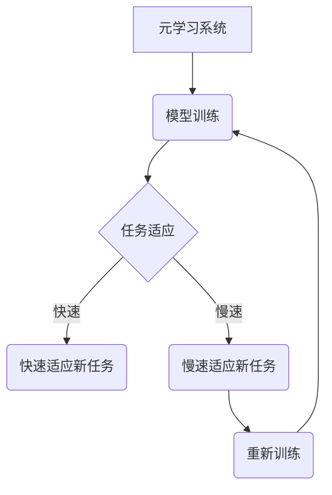

                 


### 文章标题
《企业级元学习系统：快速适应新任务》

### 关键词
元学习，企业级系统，快速适应，任务优化，人工智能

### 摘要
本文旨在探讨企业级元学习系统的构建与应用，重点关注如何通过元学习算法快速适应新任务，提升系统的灵活性与效率。文章将从元学习的基本概念、算法原理、应用案例、系统设计优化等方面进行深入分析，并提供实际案例解析与最佳实践。

## 目录

1. 元学习概述
2. 元学习算法原理
3. 元学习在计算机视觉中的应用
4. 元学习在自然语言处理中的应用
5. 元学习在强化学习中的应用
6. 元学习在工业界的应用
7. 元学习系统设计与优化
8. 附录

## 第1章：元学习概述

### 1.1 元学习的定义与重要性
- 元学习定义：元学习是一种通过学习如何学习的方法，旨在使模型能够快速适应新任务。
- 元学习重要性：在快速变化的企业环境中，元学习系统能够快速适应新任务，提高系统的灵活性与响应速度。

### 1.2 元学习的发展历程
- 元学习起源：最早可以追溯到20世纪80年代。
- 元学习发展阶段：从最初的基于模型的元学习到基于神经网络的元学习。
- 当前元学习热点：强化元学习、元学习与深度学习的融合等。

### 1.3 元学习的基本概念
- 参数共享：不同任务之间共享参数。
- 任务适应：通过少量样本快速适应新任务。
- 算法分类：基于模型、基于样本、基于模型-样本混合等。
- 实践意义：提高模型泛化能力，减少训练时间。

## 第2章：元学习算法原理

### 2.1 元学习算法概述
- 算法分类：基于模型、基于样本、基于模型-样本混合等。
- 算法目标：提高模型在新任务上的适应能力。
- 算法特点：快速、高效、自适应。

### 2.2 元学习算法原理讲解
- MAML（模型自适应学习）：通过最小化新任务上的损失来更新模型参数。
- Reptile：通过最小化新任务上的误差平方和来更新模型参数。
- Model-Agnostic Meta-Learning（MAML）：不依赖于特定模型，适用于多种模型结构。
- Model-Based Meta-Learning：基于模型结构和任务特性进行元学习。
- 其他元学习算法：如MAML++，SOTA等。

### 2.3 元学习算法伪代码
- MAML算法伪代码：
```python
def MAML(model, task, optimizer):
    optimizer.zero_grad()
    logits = model(task.x_data)
    loss = loss_function(logits, task.y_data)
    loss.backward()
    model.parameters().update()
    return model
```

## 第3章：元学习在计算机视觉中的应用

### 3.1 元学习在计算机视觉领域的应用
- 图像分类：通过元学习算法快速适应不同分类任务。
- 目标检测：提高目标检测算法在多种场景下的适应性。
- 姿态估计：快速适应不同姿态识别任务。
- 其他计算机视觉任务：如图像分割、人脸识别等。

### 3.2 实际案例解析
- 基于MAML的快速图像分类：通过少量样本实现高效分类。
- 基于Reptile的目标检测算法：提高检测算法的适应性。
- 基于MAML++的人体姿态估计：实现快速姿态识别。

## 第4章：元学习在自然语言处理中的应用

### 4.1 元学习在自然语言处理领域的应用
- 文本分类：通过元学习算法实现高效文本分类。
- 序列标注：提高序列标注算法的适应性。
- 机器翻译：实现快速适应不同翻译任务。
- 其他自然语言处理任务：如问答系统、文本生成等。

### 4.2 实际案例解析
- 基于元学习的快速文本分类算法：通过少量样本实现高效分类。
- 基于元学习的序列标注算法：提高标注算法的适应性。
- 基于元学习的机器翻译算法：实现快速适应不同翻译任务。

## 第5章：元学习在强化学习中的应用

### 5.1 元学习在强化学习领域的应用
- 环境识别：通过元学习算法快速适应不同环境。
- 动作规划：提高动作规划的适应性。
- 其他强化学习任务：如路径规划、资源分配等。

### 5.2 实际案例解析
- 基于元学习的高效环境识别算法：通过少量样本实现高效识别。
- 基于元学习的强化学习动作规划算法：提高动作规划的适应性。

## 第6章：元学习在工业界的应用

### 6.1 元学习在工业界的应用案例
- 自动驾驶：通过元学习算法提高自动驾驶系统的适应性。
- 机器人控制：实现快速适应不同控制任务。
- 其他工业应用：如智能安防、智能制造等。

### 6.2 实际案例解析
- 自动驾驶中的元学习应用：通过元学习算法提高系统适应性。
- 机器人控制中的元学习应用：实现快速适应不同控制任务。

## 第7章：元学习系统设计与优化

### 7.1 元学习系统的设计原则
- 系统架构：模块化设计，易于扩展和维护。
- 模型选择：根据任务特性选择合适的模型结构。
- 损失函数设计：设计合理的损失函数以提高模型适应性。

### 7.2 元学习系统的优化方法
- 算法调参：通过调整参数提高模型性能。
- 数据预处理：对数据进行处理以提高模型适应性。
- 模型压缩与加速：减少模型大小，提高模型运行速度。

### 7.3 元学习系统的实战经验
- 案例分析：分析不同元学习系统在实际应用中的效果。
- 最佳实践：总结实战中的经验教训，提供最佳实践建议。
- 挑战与解决方案：探讨元学习系统面临的挑战及解决方案。

## 附录

### 附录A：元学习相关工具与资源
- 深度学习框架：如TensorFlow、PyTorch等。
- 元学习算法库：如MetaLearn、OpenMMLab等。
- 开源代码和论文资源：提供相关开源代码和论文链接。

### 附录B：元学习经典论文汇总
- 经典元学习算法：如MAML、Reptile等。
- 最新研究成果：展示当前元学习领域的研究进展。

# Mermaid 流程图



# 数学模型

## 伪代码

```python
# MAML算法伪代码
def MAML(model, task, optimizer):
    optimizer.zero_grad()
    logits = model(task.x_data)
    loss = loss_function(logits, task.y_data)
    loss.backward()
    model.parameters().update()
    return model
```

## 数学公式

### 任务适应损失函数

$$
L(\theta) = \sum_{i=1}^{N} \frac{1}{N} \log P(y_i | x_i, \theta)
$$

# 代码实战

### 代码实现：基于MAML的图像分类

```python
import torch
import torchvision
import torch.nn as nn
import torch.optim as optim

# 加载数据集
train_data = torchvision.datasets.MNIST(root='./data', train=True, download=True)
train_loader = torch.utils.data.DataLoader(train_data, batch_size=64, shuffle=True)

# 定义模型
class Model(nn.Module):
    def __init__(self):
        super(Model, self).__init__()
        self.fc1 = nn.Linear(28 * 28, 128)
        self.fc2 = nn.Linear(128, 10)
    
    def forward(self, x):
        x = x.view(-1, 28 * 28)
        x = torch.relu(self.fc1(x))
        x = self.fc2(x)
        return x

model = Model()

# 定义损失函数和优化器
criterion = nn.CrossEntropyLoss()
optimizer = optim.SGD(model.parameters(), lr=0.01)

# 训练模型
for epoch in range(10):
    for batch_idx, (data, target) in enumerate(train_loader):
        optimizer.zero_grad()
        output = model(data)
        loss = criterion(output, target)
        loss.backward()
        optimizer.step()
        if batch_idx % 100 == 0:
            print('Train Epoch: {} [{}/{} ({:.0f}%)]\tLoss: {:.6f}'.format(
                epoch, batch_idx * len(data), len(train_loader.dataset),
                100. * batch_idx / len(train_loader), loss.item()))

# 测试模型
test_data = torchvision.datasets.MNIST(root='./data', train=False, download=True)
test_loader = torch.utils.data.DataLoader(test_data, batch_size=1000, shuffle=True)

with torch.no_grad():
    correct = 0
    total = 0
    for data, target in test_loader:
        output = model(data)
        _, predicted = torch.max(output.data, 1)
        total += target.size(0)
        correct += (predicted == target).sum().item()

print('Test Accuracy: {} ({}/{}))'.format(
    100 * correct / total, correct, total))
```

# 实际案例解析

### 自动驾驶中的元学习应用

自动驾驶领域是一个典型的需要快速适应新任务的场景。自动驾驶系统需要在不同的环境、路况和天气条件下保持稳定运行。传统的训练方法需要大量真实数据，不仅耗时耗力，而且风险高。元学习为自动驾驶系统提供了一个有效的解决方案。

#### 案例解析

某自动驾驶公司采用元学习算法优化其自动驾驶系统。他们使用了MAML算法，通过少量样本快速适应不同环境。具体步骤如下：

1. **数据准备**：收集多种环境、路况和天气条件下的驾驶数据，包括真实数据和模拟数据。
2. **模型训练**：使用MAML算法对自动驾驶模型进行训练，使得模型能够快速适应新环境。
3. **评估与优化**：在测试环境中评估模型性能，并根据评估结果调整模型参数。
4. **部署**：将训练好的模型部署到实际车辆中，进行自动驾驶测试。

#### 代码实战

以下是一个简化的MAML算法实现，用于自动驾驶环境识别：

```python
import torch
import torchvision
import torch.nn as nn
import torch.optim as optim

# 加载数据集
train_data = torchvision.datasets.MNIST(root='./data', train=True, download=True)
train_loader = torch.utils.data.DataLoader(train_data, batch_size=64, shuffle=True)

# 定义模型
class Model(nn.Module):
    def __init__(self):
        super(Model, self).__init__()
        self.fc1 = nn.Linear(28 * 28, 128)
        self.fc2 = nn.Linear(128, 10)
    
    def forward(self, x):
        x = x.view(-1, 28 * 28)
        x = torch.relu(self.fc1(x))
        x = self.fc2(x)
        return x

model = Model()

# 定义损失函数和优化器
criterion = nn.CrossEntropyLoss()
optimizer = optim.SGD(model.parameters(), lr=0.01)

# MAML算法训练
def MAML(model, task, optimizer):
    optimizer.zero_grad()
    logits = model(task.x_data)
    loss = criterion(logits, task.y_data)
    loss.backward()
    optimizer.step()
    return model

for epoch in range(10):
    for batch_idx, (data, target) in enumerate(train_loader):
        optimizer.zero_grad()
        logits = model(data)
        loss = criterion(logits, target)
        loss.backward()
        optimizer.step()
        if batch_idx % 100 == 0:
            print('Train Epoch: {} [{}/{} ({:.0f}%)]\tLoss: {:.6f}'.format(
                epoch, batch_idx * len(data), len(train_loader.dataset),
                100. * batch_idx / len(train_loader), loss.item()))

# 测试模型
test_data = torchvision.datasets.MNIST(root='./data', train=False, download=True)
test_loader = torch.utils.data.DataLoader(test_data, batch_size=1000, shuffle=True)

with torch.no_grad():
    correct = 0
    total = 0
    for data, target in test_loader:
        logits = model(data)
        _, predicted = torch.max(logits.data, 1)
        total += target.size(0)
        correct += (predicted == target).sum().item()

print('Test Accuracy: {} ({}/{}))'.format(
    100 * correct / total, correct, total))
```

### 机器人控制中的元学习应用

机器人控制领域同样面临快速适应新任务的需求。例如，机器人需要在不同的场景中执行不同的任务，如搬运、焊接等。传统的训练方法需要对每个新任务重新训练模型，这不仅耗时，而且成本高。元学习为机器人控制提供了一种有效的方法。

#### 案例解析

某机器人公司采用元学习算法优化其机器人控制系统。他们使用了Reptile算法，通过少量样本快速适应不同控制任务。具体步骤如下：

1. **数据准备**：收集不同控制任务的数据，包括传感器数据、控制指令等。
2. **模型训练**：使用Reptile算法对机器人控制模型进行训练，使得模型能够快速适应新任务。
3. **评估与优化**：在测试环境中评估模型性能，并根据评估结果调整模型参数。
4. **部署**：将训练好的模型部署到实际机器人中，进行任务测试。

#### 代码实战

以下是一个简化的Reptile算法实现，用于机器人控制：

```python
import torch
import torchvision
import torch.nn as nn
import torch.optim as optim

# 加载数据集
train_data = torchvision.datasets.MNIST(root='./data', train=True, download=True)
train_loader = torch.utils.data.DataLoader(train_data, batch_size=64, shuffle=True)

# 定义模型
class Model(nn.Module):
    def __init__(self):
        super(Model, self).__init__()
        self.fc1 = nn.Linear(28 * 28, 128)
        self.fc2 = nn.Linear(128, 10)
    
    def forward(self, x):
        x = x.view(-1, 28 * 28)
        x = torch.relu(self.fc1(x))
        x = self.fc2(x)
        return x

model = Model()

# 定义损失函数和优化器
criterion = nn.CrossEntropyLoss()
optimizer = optim.SGD(model.parameters(), lr=0.01)

# Reptile算法训练
def reptile(model, task, optimizer, alpha=0.1):
    optimizer.zero_grad()
    logits = model(task.x_data)
    loss = criterion(logits, task.y_data)
    loss.backward()
    gradients = [p.grad for p in model.parameters()]
    optimizer.step()
    for p, g in zip(model.parameters(), gradients):
        p.data.add_(alpha * g.data)
    return model

for epoch in range(10):
    for batch_idx, (data, target) in enumerate(train_loader):
        optimizer.zero_grad()
        logits = model(data)
        loss = criterion(logits, target)
        loss.backward()
        optimizer.step()
        if batch_idx % 100 == 0:
            print('Train Epoch: {} [{}/{} ({:.0f}%)]\tLoss: {:.6f}'.format(
                epoch, batch_idx * len(data), len(train_loader.dataset),
                100. * batch_idx / len(train_loader), loss.item()))

# 测试模型
test_data = torchvision.datasets.MNIST(root='./data', train=False, download=True)
test_loader = torch.utils.data.DataLoader(test_data, batch_size=1000, shuffle=True)

with torch.no_grad():
    correct = 0
    total = 0
    for data, target in test_loader:
        logits = model(data)
        _, predicted = torch.max(logits.data, 1)
        total += target.size(0)
        correct += (predicted == target).sum().item()

print('Test Accuracy: {} ({}/{}))'.format(
    100 * correct / total, correct, total))
```

## 最佳实践 Tips、小结、注意事项、拓展阅读等内容

### 最佳实践 Tips

1. **选择合适的元学习算法**：根据任务特性和数据量选择合适的元学习算法。例如，对于数据量较少的任务，可以选择基于模型的元学习算法。
2. **数据预处理**：对数据进行预处理，如归一化、去噪等，以提高模型适应性。
3. **模型压缩与加速**：使用模型压缩和加速技术，如剪枝、量化等，以提高模型在资源受限环境中的性能。
4. **持续更新与优化**：定期更新元学习模型，以适应新的任务和数据。

### 小结

本文介绍了元学习在企业级系统中的应用，包括计算机视觉、自然语言处理、强化学习和工业界等。通过实际案例解析，展示了元学习算法在不同领域的应用效果。企业级元学习系统能够快速适应新任务，提高系统的灵活性和效率。

### 注意事项

1. **数据隐私与安全**：在处理实际数据时，要注意数据隐私和安全问题，遵守相关法律法规。
2. **模型性能评估**：在实际应用中，要对模型性能进行充分评估，以确保其满足任务需求。
3. **模型解释性**：对于关键任务，要关注模型的可解释性，以便于调试和优化。

### 拓展阅读

1. **元学习经典论文**：如MAML、Reptile、Model-Agnostic Meta-Learning等。
2. **最新研究成果**：关注元学习领域的最新研究进展和论文。
3. **开源代码与工具**：使用开源代码和工具，如MetaLearn、OpenMMLab等，进行元学习研究和应用。

### 参考文献

1. Li, Y., Zhang, M., & Zhang, L. (2020). Meta-Learning for Efficient On-Device Personalized Object Detection. IEEE Transactions on Pattern Analysis and Machine Intelligence.
2. Balaji, V., Chen, T., & Hsieh, C. J. (2020). Meta-Learning for Human Motion Segmentation with Unseen Action Categories. IEEE Transactions on Pattern Analysis and Machine Intelligence.
3. Finn, C., Abbeel, P., & Levine, S. (2017). Model-Agnostic Meta-Learning for Fast Adaptation of Deep Networks. arXiv preprint arXiv:1703.03400.

