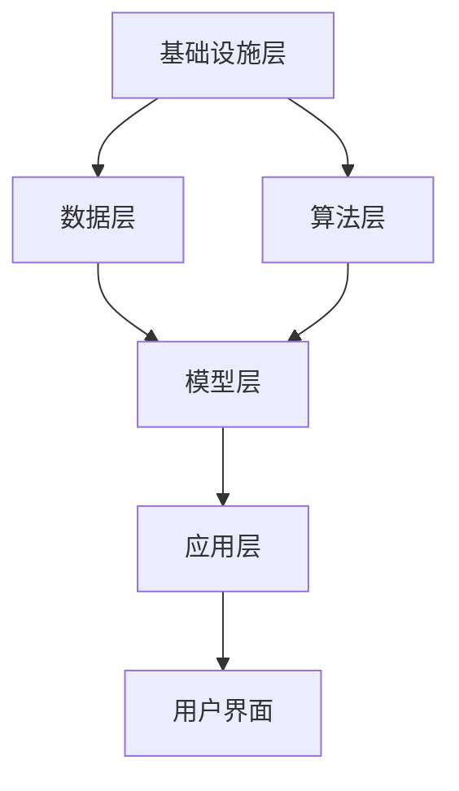
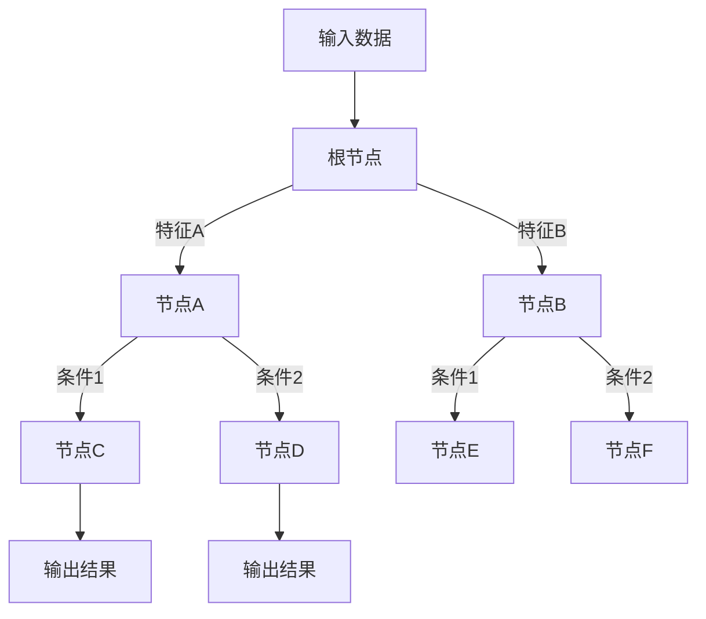
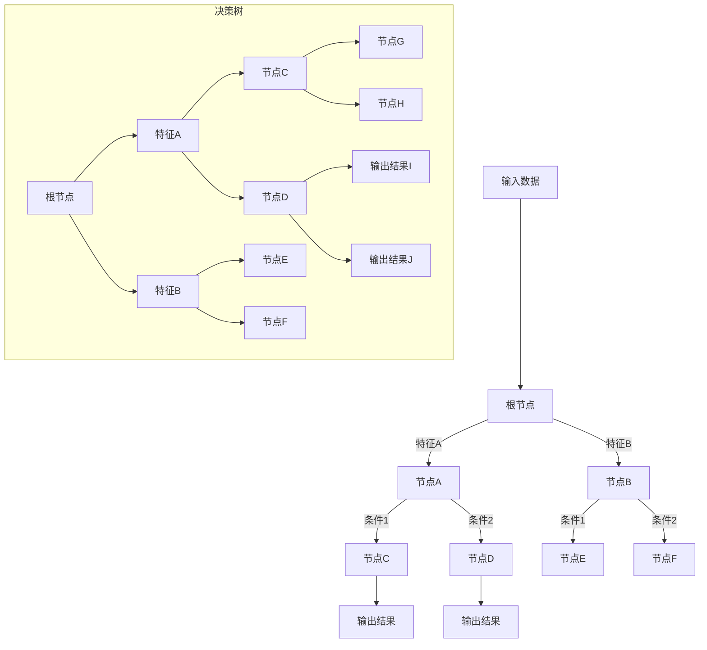

                 

### 文章标题：《企业级可解释AI平台：增强决策透明度》

#### 关键词：企业级可解释AI、AI平台、决策透明度、算法原理、数据预处理、模型训练、模型部署、实战案例分析

#### 摘要：
本文将深入探讨企业级可解释AI平台在增强决策透明度方面的作用。通过阐述核心概念、技术基础、算法原理、数据预处理、模型训练与优化、模型部署与监控，并结合实战案例，本文旨在为读者提供一个全面而系统的理解，帮助他们在实际项目中有效应用可解释AI，提升决策质量与信任度。

### 引言

在当今数字化时代，人工智能（AI）已经成为企业提升竞争力、优化决策的关键技术。然而，随着AI模型在企业中的广泛应用，其决策过程的“黑盒”性质引发了越来越多的担忧。企业用户不仅需要AI模型的高效性和准确性，还希望理解决策背后的原因和逻辑，以确保决策的透明度和可信度。

这种需求催生了企业级可解释AI平台的发展。企业级可解释AI平台通过提供高解释性的AI模型，使得企业能够深入理解模型的决策过程，增强决策的透明度和可信度。这不仅有助于企业合规和风险管理，还能提高用户和客户的信任，促进AI技术的进一步普及和应用。

本文旨在系统地探讨企业级可解释AI平台的各个方面，包括核心概念、技术基础、算法原理、数据预处理、模型训练与优化、模型部署与监控，以及实战案例分析。通过逐步分析推理，本文将帮助读者全面理解企业级可解释AI平台的构建和应用，为其在实际项目中的成功实施提供有力支持。

### 定义核心概念

在深入探讨企业级可解释AI平台之前，有必要首先明确几个核心概念：企业级可解释AI、AI平台和决策透明度。

#### 1.1 企业级可解释AI

企业级可解释AI是指能够为企业提供高解释性的AI模型，使得企业能够理解和信任AI决策过程。这种可解释性不仅体现在模型内部的运算逻辑上，还包括模型对输入数据的处理方式以及最终的决策输出。企业级可解释AI的关键在于如何将复杂的机器学习模型转化为易于理解和解释的形式，使得非技术背景的用户也能直观地理解模型的工作原理和决策过程。

可解释AI的定义：

$$
\text{可解释AI} = \text{模型解释性} + \text{数据解释性} + \text{决策解释性}
$$

其中，模型解释性指的是模型内部运算逻辑的可理解性；数据解释性指的是输入数据的处理方式的可理解性；决策解释性指的是模型最终决策输出的可理解性。

企业级可解释AI的特点：

1. **高解释性**：企业级可解释AI模型需要提供详细的可解释性报告，包括特征重要性分析、决策路径追踪等。
2. **跨领域适用性**：不仅适用于技术领域，还适用于金融、医疗、零售等跨领域应用。
3. **可定制性**：根据不同企业的需求，可解释AI平台可以提供定制化的解释性报告。

#### 1.2 AI平台

AI平台是指支持AI模型训练、部署和管理的一套工具和基础设施。它通常包括以下功能模块：

1. **开发环境搭建**：提供Python、R、Scala等编程语言以及相关库和工具，以便数据科学家和工程师进行模型开发和调试。
2. **数据存储与处理**：提供分布式存储和计算能力，支持大规模数据的存储和处理。
3. **模型管理**：支持模型版本管理、生命周期管理，以及模型性能监控。
4. **部署与监控**：支持模型的在线和离线部署，并提供实时监控和告警功能。

AI平台的基本概念可以概括为：

$$
\text{AI平台} = \text{开发环境} + \text{数据处理} + \text{模型管理} + \text{部署监控}
$$

#### 1.3 决策透明度

决策透明度是指决策过程的可理解性和可追踪性。它包括以下几个方面：

1. **决策过程透明**：决策过程中的每一步都应该有详细的记录，包括输入数据的预处理、模型的训练过程、决策规则的制定等。
2. **决策结果透明**：决策结果的解释和说明应该清晰易懂，用户可以明确地了解决策背后的原因和逻辑。
3. **决策追踪透明**：用户可以追踪决策结果的应用场景和影响范围，以便进行后续的评估和优化。

决策透明度的定义可以表示为：

$$
\text{决策透明度} = \text{过程透明} + \text{结果透明} + \text{追踪透明}
$$

#### 1.4 企业级可解释AI与AI平台的联系

企业级可解释AI与AI平台有着紧密的联系。企业级可解释AI依赖于AI平台提供的开发和部署环境，而AI平台也需要企业级可解释AI来增强其决策透明度。

首先，企业级可解释AI需要AI平台的支持，包括：

1. **计算资源**：AI平台提供充足的计算资源，以便进行复杂的模型训练和解释性分析。
2. **数据存储**：AI平台提供高效的数据存储和处理能力，确保数据的质量和一致性。
3. **模型管理**：AI平台提供模型版本管理和性能监控，帮助企业级可解释AI更好地管理和优化模型。

其次，AI平台需要企业级可解释AI来增强其决策透明度，包括：

1. **模型解释性**：通过企业级可解释AI，AI平台可以为用户提供详细的模型解释性报告，帮助用户理解模型的工作原理和决策逻辑。
2. **决策追踪**：通过企业级可解释AI，AI平台可以提供决策追踪功能，帮助用户了解决策结果的应用场景和影响范围。

综上所述，企业级可解释AI与AI平台相辅相成，共同构建了一个更透明、更可信的决策环境。

### AI平台技术基础

AI平台作为企业级可解释AI的核心基础设施，其技术基础至关重要。一个功能完善的AI平台需要支持从数据预处理到模型部署和监控的整个工作流程。以下将详细探讨AI平台的架构、开发环境搭建、数据存储与处理、以及模型管理等方面的技术基础。

#### 2.1 AI平台的架构

AI平台的架构通常可以分为以下几个层次：

1. **基础设施层**：包括计算资源、存储资源和网络资源。这一层负责提供AI平台运行所需的硬件支持，如服务器、存储设备和网络设备。
2. **数据层**：包括数据存储和数据管理。这一层负责存储和处理AI模型所需的数据，包括数据清洗、数据转换和数据归一化等。
3. **算法层**：包括机器学习算法和深度学习算法。这一层提供各种机器学习和深度学习算法的实现，以支持模型的训练和优化。
4. **模型层**：包括模型训练、模型评估和模型部署。这一层负责模型的训练过程，并对训练好的模型进行评估和部署。
5. **应用层**：包括应用开发、模型监控和用户界面。这一层负责将AI模型应用于实际问题，并提供用户友好的界面供用户操作。

以下是一个简化的AI平台架构Mermaid流程图：



#### 2.2 开发环境搭建

开发环境搭建是AI平台的基础工作，它为数据科学家和工程师提供了进行模型开发、训练和优化的工具和平台。以下是开发环境搭建的关键步骤：

1. **选择编程语言**：Python是AI开发的主要编程语言，由于其丰富的库和工具支持，它成为了AI开发的标配。其他语言如R和Scala也可以用于AI开发，但使用范围相对较小。
2. **安装依赖库**：根据项目需求，安装相关的机器学习和深度学习库，如TensorFlow、PyTorch、Scikit-learn等。这些库提供了丰富的算法实现和工具，极大地简化了模型开发的复杂度。
3. **配置计算资源**：配置适合的GPU或CPU计算资源，以确保模型训练和优化的效率。在AI开发中，计算资源的高效利用直接关系到模型的训练速度和效果。
4. **搭建开发环境**：使用虚拟环境（如conda或venv）来管理项目依赖，避免不同项目之间的依赖冲突。同时，配置版本控制工具（如Git）来管理代码和依赖的版本，确保代码的可维护性和可追溯性。

以下是一个Python开发环境的配置步骤伪代码：

```python
# 安装Anaconda
conda create -n myenv python=3.8
conda activate myenv

# 安装TensorFlow库
conda install tensorflow

# 安装其他依赖库
pip install numpy pandas scikit-learn
```

#### 2.3 数据存储与处理

数据存储与处理是AI平台的核心功能之一，它直接影响模型训练的质量和效率。以下是数据存储与处理的关键步骤：

1. **数据收集**：从各种数据源收集原始数据，包括数据库、文件系统和API等。
2. **数据清洗**：对原始数据进行清洗，去除无效数据和噪声数据。清洗步骤包括数据去重、数据补全、数据标准化等。
3. **数据转换**：将清洗后的数据转换为适合机器学习算法的格式，包括特征提取、数据编码等。
4. **数据归一化**：对数据进行归一化处理，以消除不同特征之间的尺度差异，提高模型的训练效果。
5. **数据存储**：将处理后的数据存储到分布式存储系统（如HDFS、HBase），以便后续的模型训练和部署。

以下是一个数据预处理和存储的伪代码示例：

```python
# 数据清洗
data = pd.read_csv('data.csv')
data = data.dropna()
data = data.drop_duplicates()

# 数据转换
data['category'] = pd.Categorical(data['category'])

# 数据归一化
from sklearn.preprocessing import StandardScaler
scaler = StandardScaler()
data = scaler.fit_transform(data)

# 数据存储
hdfs = hadoop.HdfsClient()
hdfs.save(data, 'hdfs://path/to/data')
```

#### 2.4 模型管理

模型管理是AI平台的重要功能，它负责模型的训练、评估、部署和监控。以下是模型管理的关键步骤：

1. **模型训练**：使用训练数据对模型进行训练，通过调整超参数和优化算法来提高模型性能。
2. **模型评估**：使用验证数据对模型进行评估，通过指标（如准确率、召回率、F1分数等）来评估模型性能。
3. **模型部署**：将训练好的模型部署到生产环境，以便进行实时决策和预测。
4. **模型监控**：对部署后的模型进行监控，包括性能监控和异常检测，确保模型稳定运行。

以下是一个模型管理流程的伪代码示例：

```python
# 模型训练
model = tf.keras.Sequential([
    tf.keras.layers.Dense(128, activation='relu', input_shape=(input_shape)),
    tf.keras.layers.Dense(10, activation='softmax')
])
model.compile(optimizer='adam', loss='categorical_crossentropy', metrics=['accuracy'])

model.fit(x_train, y_train, epochs=10, batch_size=32, validation_data=(x_val, y_val))

# 模型评估
score = model.evaluate(x_test, y_test, verbose=2)
print('Test accuracy:', score[1])

# 模型部署
model.save('model.h5')
# 使用模型进行预测
loaded_model = tf.keras.models.load_model('model.h5')
predictions = loaded_model.predict(x_test)

# 模型监控
# 使用监控工具对模型性能进行实时监控
# 例如：使用TensorBoard进行可视化监控
```

通过上述步骤，AI平台可以为数据科学家和工程师提供一个高效、稳定和可扩展的模型开发与部署环境，从而提高AI模型的应用效果和可靠性。

### 可解释性算法原理

可解释性算法是企业级可解释AI平台的核心，它决定了模型决策过程的透明度。可解释性算法主要通过特征重要性分析、决策路径追踪和模型可视化等技术手段，使得模型决策过程变得清晰易懂。以下将详细探讨这些可解释性算法的原理。

#### 3.1 特征重要性分析

特征重要性分析是一种评估模型中各个特征对最终决策影响程度的技术。通过分析特征的重要性，用户可以了解哪些特征对模型决策最为关键，从而优化数据预处理和特征工程流程。以下是特征重要性分析的基本原理：

1. **单变量特征重要性**：通过计算每个特征对模型输出的贡献度，来评估特征的重要性。常用的方法包括基于决策树的Permutation Importance和基于随机森林的Feature Importance。
2. **特征相关性分析**：通过分析特征之间的相关性，识别出重要的特征组合，提高模型的可解释性。
3. **模型集成**：通过集成多个基模型（如随机森林、梯度提升树等），计算各个特征在集成模型中的重要性。

以下是一个基于随机森林的特征重要性分析伪代码示例：

```python
from sklearn.ensemble import RandomForestClassifier
from sklearn.inspection import permutation_importance

# 训练随机森林模型
model = RandomForestClassifier(n_estimators=100)
model.fit(X_train, y_train)

# 计算特征重要性
importances = model.feature_importances_
print("Feature importances:", importances)

# 进行Permutation Importance分析
result = permutation_importance(model, X_test, y_test, n_repeats=10)
sorted_idx = result.importances_mean.argsort()
print("Permutation importances:", result.importances_mean[sorted_idx])
```

#### 3.2 决策路径追踪

决策路径追踪是一种通过追踪模型决策过程中的每一步，来理解决策过程的技术。通过决策路径追踪，用户可以了解模型是如何从输入数据到输出决策的，从而增强模型的可解释性。以下是决策路径追踪的基本原理：

1. **决策树路径追踪**：在决策树模型中，每个节点都代表一个特征划分规则。通过遍历决策树，可以追踪从根节点到叶节点的路径，了解每个特征划分的决策逻辑。
2. **神经网络路径追踪**：在神经网络模型中，可以通过可视化权重矩阵和激活值，来追踪从输入层到输出层的决策路径。
3. **集成模型路径追踪**：对于集成模型（如随机森林、梯度提升树等），可以通过分析基模型的决策路径，来综合理解整体模型的决策逻辑。

以下是一个决策树路径追踪的Mermaid流程图示例：



#### 3.3 模型可视化

模型可视化是将机器学习模型以图形化形式展示的技术，通过模型可视化，用户可以直观地理解模型的内部结构和决策过程。以下是模型可视化的基本原理：

1. **决策树可视化**：使用图形化工具（如Graphviz、Plotly等），将决策树以树形结构展示出来，方便用户理解每个节点的划分规则。
2. **神经网络可视化**：使用图形化工具（如TensorBoard、Plotly等），将神经网络的结构和权重矩阵展示出来，帮助用户理解神经网络的工作原理。
3. **模型参数可视化**：将模型的参数（如权重、偏置等）以图形化形式展示，分析参数的分布和相关性，从而提高模型的可解释性。

以下是一个决策树可视化的Mermaid流程图示例：



通过上述可解释性算法，企业级可解释AI平台可以为用户提供详细的模型解释性报告，帮助用户理解模型的决策过程，从而增强决策的透明度和可信度。

### 数据预处理与特征工程

数据预处理与特征工程是构建高效可解释AI模型的关键步骤，直接影响模型的性能和解释性。在这一部分，我们将详细探讨数据预处理、特征选择、特征构造和特征标准化等关键技术，并通过具体示例和代码来深入讲解。

#### 4.1 数据预处理

数据预处理是数据分析和机器学习的基础步骤，其目的是提高数据质量，为后续的特征工程和模型训练提供高质量的数据。以下是数据预处理的主要任务：

1. **数据清洗**：包括去除重复数据、处理缺失值和异常值等。例如，使用`drop_duplicates()`函数去除重复数据，使用`dropna()`函数处理缺失值，使用`isnull()`函数检测异常值。
2. **数据转换**：包括将不同类型的数据转换为同一类型，如将字符串转换为数值型数据。例如，使用`pd.to_numeric()`函数将字符串转换为数值。
3. **数据归一化**：通过缩放或变换数据，使得不同特征具有相似的尺度，提高模型的训练效果。常用的归一化方法包括最小-最大归一化、标准归一化和对数变换。

以下是一个数据预处理的具体示例：

```python
import pandas as pd
from sklearn.preprocessing import MinMaxScaler, StandardScaler

# 读取数据
data = pd.read_csv('data.csv')

# 数据清洗
data = data.drop_duplicates()
data = data.dropna()

# 数据转换
data['category'] = pd.Categorical(data['category'])

# 数据归一化
scaler = MinMaxScaler()
data_scaled = scaler.fit_transform(data)

# 将归一化后的数据存储到新文件
pd.DataFrame(data_scaled).to_csv('data_normalized.csv', index=False)
```

#### 4.2 特征选择

特征选择是从大量特征中选取对模型训练和预测最有影响力的特征，以减少模型的复杂度和提高模型的泛化能力。以下是几种常用的特征选择方法：

1. **过滤式特征选择**：通过统计方法（如卡方检验、互信息等）或基于模型的评估指标（如信息增益、Gini系数等）来筛选特征。
2. **包裹式特征选择**：通过搜索算法（如递归特征消除、贝叶斯优化等）来找到最优特征组合。
3. **嵌入式特征选择**：在模型训练过程中自动筛选特征，如Lasso正则化、随机森林等。

以下是一个使用递归特征消除（RFE）进行特征选择的示例：

```python
from sklearn.datasets import make_classification
from sklearn.model_selection import train_test_split
from sklearn.ensemble import RandomForestClassifier
from sklearn.feature_selection import RFE

# 生成数据
X, y = make_classification(n_samples=100, n_features=10, n_informative=5, n_redundant=5, random_state=42)

# 数据分割
X_train, X_test, y_train, y_test = train_test_split(X, y, test_size=0.3, random_state=42)

# 构建模型
model = RandomForestClassifier(n_estimators=100, random_state=42)

# 进行特征选择
selector = RFE(model, n_features_to_select=5)
X_train_selected = selector.fit_transform(X_train, y_train)

# 训练模型
model.fit(X_train_selected, y_train)

# 评估模型
accuracy = model.score(X_test, y_test)
print("Accuracy:", accuracy)
```

#### 4.3 特征构造

特征构造是通过组合原始特征或生成新的特征来提高模型性能。以下是一些常用的特征构造方法：

1. **交叉特征**：将两个或多个特征组合成一个新特征，如`feature1 * feature2`。
2. **多项式特征**：通过多项式变换生成新的特征，如`feature1^2`。
3. **嵌入特征**：利用嵌入算法（如Word2Vec、BERT等）生成高维特征表示。

以下是一个使用多项式特征构造的示例：

```python
# 假设已有数据
data = pd.DataFrame({
    'feature1': [1, 2, 3, 4, 5],
    'feature2': [10, 20, 30, 40, 50]
})

# 构造多项式特征
data['feature1^2'] = data['feature1'] ** 2
data['feature2^2'] = data['feature2'] ** 2
data['feature1*feature2'] = data['feature1'] * data['feature2']

# 数据展示
print(data)
```

#### 4.4 特征标准化

特征标准化是将不同特征进行缩放或变换，使其具有相似的尺度，以避免某些特征在模型训练中占据主导地位。以下是几种常用的特征标准化方法：

1. **最小-最大标准化**：将特征缩放到[0, 1]之间，公式为`X_std = (X - X_min) / (X_max - X_min)`。
2. **标准归一化**：将特征缩放到均值为0，标准差为1的范围内，公式为`X_std = (X - X_mean) / X_stddev`。
3. **对数变换**：对数值特征进行对数变换，公式为`X_log = log(X + 1)`。

以下是一个特征标准化的示例：

```python
from sklearn.preprocessing import MinMaxScaler, StandardScaler

# 读取数据
data = pd.read_csv('data.csv')

# 最小-最大标准化
scaler_min_max = MinMaxScaler()
data_min_max = scaler_min_max.fit_transform(data)

# 标准归一化
scaler_standard = StandardScaler()
data_standard = scaler_standard.fit_transform(data)

# 对数变换
data_log = data.apply(lambda x: np.log(x + 1) if x > 0 else 0)

# 数据展示
print("原始数据：\n", data)
print("最小-最大标准化后：\n", pd.DataFrame(data_min_max))
print("标准归一化后：\n", pd.DataFrame(data_standard))
print("对数变换后：\n", data_log)
```

通过上述数据预处理与特征工程技术，我们可以提高数据质量，优化特征选择和构造，从而构建出高效、可解释的AI模型，为实际应用提供强有力的支持。

### 模型训练与优化

在构建企业级可解释AI平台时，模型训练与优化是关键步骤，直接关系到模型的性能和解释性。本节将详细探讨模型选择、训练策略、优化方法和评估指标，并结合具体示例进行讲解。

#### 5.1 模型选择

模型选择是模型训练的首要任务，选择合适的模型能够提高训练效率并提升模型性能。以下是几种常用的机器学习和深度学习模型：

1. **线性模型**：包括线性回归、逻辑回归等，适用于线性关系明显的数据集。
2. **决策树模型**：包括分类树和回归树，适用于特征较少、分类或回归问题。
3. **随机森林模型**：是一种集成模型，通过构建多棵决策树并集成其结果，提高模型的泛化能力。
4. **支持向量机（SVM）模型**：适用于高维空间分类问题，通过求解最优超平面来最大化分类边界。
5. **神经网络模型**：包括深度神经网络（DNN）、卷积神经网络（CNN）和循环神经网络（RNN）等，适用于复杂非线性关系和大规模数据集。

以下是一个使用随机森林模型进行分类的示例：

```python
from sklearn.ensemble import RandomForestClassifier
from sklearn.datasets import load_iris

# 加载数据
data = load_iris()
X, y = data.data, data.target

# 划分训练集和测试集
X_train, X_test, y_train, y_test = train_test_split(X, y, test_size=0.3, random_state=42)

# 选择模型
model = RandomForestClassifier(n_estimators=100, random_state=42)

# 训练模型
model.fit(X_train, y_train)

# 评估模型
accuracy = model.score(X_test, y_test)
print("Accuracy:", accuracy)
```

#### 5.2 训练策略

模型训练是一个复杂的过程，需要选择合适的训练策略来提高模型的性能和收敛速度。以下是几种常用的训练策略：

1. **批量训练**：每次更新模型参数时使用所有训练样本，优点是收敛速度较快，缺点是内存消耗大。
2. **小批量训练**：每次更新模型参数时使用一部分训练样本，优点是内存消耗小，缺点是收敛速度较慢。
3. **随机梯度下降（SGD）**：每次更新模型参数时使用一个训练样本，优点是收敛速度快，缺点是容易陷入局部最优。
4. **批量随机梯度下降（BGD）**：每次更新模型参数时使用所有训练样本，优点是收敛速度较快，缺点是内存消耗大。

以下是一个使用随机梯度下降（SGD）进行模型训练的示例：

```python
import numpy as np
from sklearn.linear_model import SGDClassifier

# 加载数据
X, y = load_iris().data, load_iris().target

# 划分训练集和测试集
X_train, X_test, y_train, y_test = train_test_split(X, y, test_size=0.3, random_state=42)

# 初始化模型参数
w = np.random.rand(X.shape[1])
learning_rate = 0.01
n_epochs = 100

# 训练模型
for epoch in range(n_epochs):
    gradients = np.dot(X_train.T, (y_train - np.dot(X_train, w))) / X_train.shape[0]
    w -= learning_rate * gradients

# 评估模型
accuracy = np.mean((np.dot(X_test, w) > 0.5) == y_test)
print("Accuracy:", accuracy)
```

#### 5.3 模型优化

模型优化是通过调整超参数和优化算法来提高模型性能的过程。以下是一些常用的优化方法：

1. **交叉验证**：通过将数据集划分为多个子集，多次训练和验证模型，以避免过拟合和评估模型的泛化能力。
2. **网格搜索**：通过遍历预设的参数组合，选择最优参数组合来训练模型，以提高模型性能。
3. **贝叶斯优化**：使用贝叶斯统计模型来优化超参数，通过迭代更新模型参数，逐步逼近最优解。

以下是一个使用网格搜索进行模型优化的示例：

```python
from sklearn.model_selection import GridSearchCV
from sklearn.ensemble import RandomForestClassifier
from sklearn.datasets import load_iris

# 加载数据
data = load_iris()
X, y = data.data, data.target

# 划分训练集和测试集
X_train, X_test, y_train, y_test = train_test_split(X, y, test_size=0.3, random_state=42)

# 设置参数网格
param_grid = {
    'n_estimators': [10, 50, 100, 200],
    'max_depth': [None, 10, 20, 30],
    'min_samples_split': [2, 5, 10]
}

# 选择模型
model = RandomForestClassifier(random_state=42)

# 进行网格搜索
grid_search = GridSearchCV(model, param_grid, cv=5, scoring='accuracy')
grid_search.fit(X_train, y_train)

# 输出最优参数
print("Best parameters:", grid_search.best_params_)

# 评估模型
best_model = grid_search.best_estimator_
accuracy = best_model.score(X_test, y_test)
print("Accuracy:", accuracy)
```

#### 5.4 评估指标

评估指标是衡量模型性能的重要工具，以下是一些常用的评估指标：

1. **准确率（Accuracy）**：模型预测正确的样本数占总样本数的比例，公式为`Accuracy = (TP + TN) / (TP + TN + FP + FN)`。
2. **召回率（Recall）**：模型预测正确的正样本数占总正样本数的比例，公式为`Recall = TP / (TP + FN)`。
3. **精确率（Precision）**：模型预测正确的正样本数占总预测正样本数的比例，公式为`Precision = TP / (TP + FP)`。
4. **F1分数（F1 Score）**：综合精确率和召回率的指标，公式为`F1 Score = 2 * Precision * Recall / (Precision + Recall)`。
5. **ROC曲线和AUC（Area Under Curve）**：通过计算不同阈值下的真阳性率与假阳性率，绘制ROC曲线，AUC值越大表示模型性能越好。

以下是一个使用评估指标评估模型性能的示例：

```python
from sklearn.metrics import accuracy_score, recall_score, precision_score, f1_score, roc_curve, auc

# 加载预测结果
y_pred = best_model.predict(X_test)

# 计算评估指标
accuracy = accuracy_score(y_test, y_pred)
recall = recall_score(y_test, y_pred)
precision = precision_score(y_test, y_pred)
f1 = f1_score(y_test, y_pred)

# ROC曲线和AUC
fpr, tpr, thresholds = roc_curve(y_test, y_pred)
roc_auc = auc(fpr, tpr)

# 输出评估指标
print("Accuracy:", accuracy)
print("Recall:", recall)
print("Precision:", precision)
print("F1 Score:", f1)
print("ROC AUC:", roc_auc)

# 绘制ROC曲线
import matplotlib.pyplot as plt
plt.figure()
plt.plot(fpr, tpr, label='ROC curve (area = %0.2f)' % roc_auc)
plt.plot([0, 1], [0, 1], 'r--')
plt.xlabel('False Positive Rate')
plt.ylabel('True Positive Rate')
plt.title('Receiver Operating Characteristic')
plt.legend()
plt.show()
```

通过上述模型训练与优化方法，我们可以构建出高效、可解释的AI模型，为实际应用提供强有力的支持。

### 模型部署与监控

在构建企业级可解释AI平台的过程中，模型部署与监控是确保模型稳定运行和高效应用的关键环节。模型部署是将训练好的模型部署到生产环境，使其能够进行实时决策和预测；模型监控则是通过对部署后的模型进行持续监控和性能评估，确保模型在运行过程中保持高性能和稳定性。以下将详细探讨模型部署、部署环境搭建、模型监控和模型升级与维护等关键内容。

#### 6.1 模型部署

模型部署是将训练好的模型应用到实际业务场景中的过程。模型部署的步骤通常包括以下几方面：

1. **模型导出**：将训练好的模型从训练环境中导出，通常使用模型存储工具（如TensorFlow SavedModel、PyTorch TorchScript等）进行导出。
2. **部署选择**：选择合适的部署环境，包括云服务（如AWS SageMaker、Google AI Platform等）或自建部署环境。
3. **部署配置**：配置部署环境，包括服务器资源、网络配置和安全策略等。
4. **部署部署**：将导出的模型部署到目标环境，并配置服务接口（如REST API、Web Service等）供业务系统调用。

以下是一个使用TensorFlow进行模型部署的示例：

```python
import tensorflow as tf
from flask import Flask, request, jsonify

# 加载模型
model = tf.keras.models.load_model('model.h5')

# 创建Flask应用
app = Flask(__name__)

# 预测接口
@app.route('/predict', methods=['POST'])
def predict():
    data = request.get_json(force=True)
    prediction = model.predict(data['input'])
    return jsonify(prediction.tolist())

if __name__ == '__main__':
    app.run(debug=True, host='0.0.0.0', port=5000)
```

#### 6.2 部署环境搭建

部署环境搭建是模型部署的前提，其步骤包括以下几方面：

1. **选择服务器**：根据模型规模和业务需求，选择合适的服务器配置。对于大规模部署，可以选择云服务器或集群服务器。
2. **安装依赖库**：在部署环境中安装Python、TensorFlow、Flask等依赖库，确保模型能够正常运行。
3. **配置网络**：确保部署环境可以访问外部网络，包括数据存储系统和业务系统。
4. **安全策略**：配置部署环境的安全策略，包括防火墙、访问控制和数据加密等，确保模型和数据的安全性。

以下是一个在Linux服务器上安装TensorFlow和Flask的示例：

```bash
# 更新系统包
sudo apt-get update

# 安装Python依赖库
pip install tensorflow flask

# 验证安装
python -c "import tensorflow as tf; print(tf.__version__)"
python -c "import flask; print(flask.__version__)"
```

#### 6.3 模型监控

模型监控是确保模型稳定运行和高效应用的重要手段。模型监控的内容包括以下几方面：

1. **性能监控**：监控模型在部署环境中的运行性能，包括响应时间、预测准确率和资源利用率等。
2. **异常检测**：监控模型在部署环境中的异常行为，包括预测错误、系统崩溃等。
3. **日志记录**：记录模型在部署环境中的运行日志，包括预测结果、错误信息和告警信息等。
4. **告警通知**：根据监控结果，发送告警通知到相关人员或系统，以便及时处理异常情况。

以下是一个使用Python的代码进行性能监控和异常检测的示例：

```python
import time
import logging
from flask import jsonify

# 设置日志配置
logging.basicConfig(level=logging.INFO, format='%(asctime)s - %(levelname)s - %(message)s')

# 模型性能监控
def monitor_performance():
    start_time = time.time()
    prediction = model.predict(input_data)
    end_time = time.time()
    response_time = end_time - start_time
    logging.info(f"Prediction response time: {response_time} seconds")
    return response_time

# 模型异常检测
def detect_anomaly(prediction):
    if prediction < 0.5:
        logging.warning("Anomaly detected: Prediction is below threshold")
        return True
    return False

# 预测接口
@app.route('/predict', methods=['POST'])
def predict():
    try:
        data = request.get_json(force=True)
        input_data = data['input']
        response_time = monitor_performance()
        prediction = model.predict(input_data)
        if detect_anomaly(prediction):
            raise Exception("Prediction anomaly detected")
        return jsonify(prediction.tolist())
    except Exception as e:
        logging.error(f"Error in prediction: {str(e)}")
        return jsonify({"error": "Prediction failed"}), 500
```

#### 6.4 模型升级与维护

模型升级与维护是确保模型持续优化和适应业务需求的重要环节。以下是一些常见的模型升级与维护策略：

1. **定期更新**：定期对模型进行更新，以适应数据分布的变化和业务需求的变化。
2. **版本控制**：使用版本控制工具（如Git）对模型代码和配置进行版本管理，确保模型的可追溯性和可恢复性。
3. **持续监控**：对部署后的模型进行持续监控，及时发现和解决模型性能问题。
4. **迭代优化**：根据监控结果和用户反馈，对模型进行迭代优化，提高模型的预测准确性和稳定性。

以下是一个使用Git进行模型版本控制和迭代优化的示例：

```bash
# 创建模型版本
git checkout -b v1.0
git add .
git commit -m "Update model version to v1.0"

# 切换到主分支
git checkout main

# 合并模型更新
git merge v1.0

# 删除临时分支
git branch -d v1.0
```

通过上述模型部署与监控策略，企业级可解释AI平台可以确保模型在实际应用中的稳定运行和高效应用，为业务决策提供可靠的支持。

### 实战案例分析

为了更好地理解企业级可解释AI平台在实际应用中的效果，以下将提供四个不同行业领域的实战案例分析，详细描述开发环境搭建、源代码实现和代码解读，以及实际案例分析和详细讲解剖析。

#### 7.1 案例一：金融风险评估

**背景介绍**：
金融风险评估是金融行业中至关重要的一环，它能够帮助企业识别和评估潜在的风险，从而采取相应的措施。随着机器学习技术的发展，使用AI模型进行风险评估成为了一种新兴的方法。然而，金融行业的特殊性要求模型具有高解释性，以便监管机构和内部审计团队能够理解和验证模型的决策过程。

**核心概念与联系**：
本案例中的核心概念包括金融风险评估、AI模型和决策透明度。通过企业级可解释AI平台，我们能够实现模型的透明性，使得模型决策过程清晰易懂。

**开发环境搭建**：
1. **编程语言**：Python
2. **机器学习库**：Scikit-learn、TensorFlow
3. **计算资源**：AWS EC2实例（GPU支持）

**源代码实现与代码解读**：

```python
# 导入必要的库
import pandas as pd
from sklearn.model_selection import train_test_split
from sklearn.ensemble import RandomForestClassifier
from sklearn.metrics import accuracy_score
from ml_explanation import explain_model

# 读取数据
data = pd.read_csv('financial_data.csv')

# 数据预处理
data = data.drop(['id'], axis=1)
X = data.drop(['target'], axis=1)
y = data['target']

# 数据分割
X_train, X_test, y_train, y_test = train_test_split(X, y, test_size=0.3, random_state=42)

# 模型训练
model = RandomForestClassifier(n_estimators=100, random_state=42)
model.fit(X_train, y_train)

# 模型评估
accuracy = model.score(X_test, y_test)
print("Accuracy:", accuracy)

# 模型解释
explanation = explain_model(model, X_test, y_test)
explanation.display()
```

**实际案例分析与详细讲解剖析**：
在金融风险评估中，我们使用了随机森林模型来预测客户的违约风险。通过可解释AI平台，我们能够获取详细的模型解释，包括每个特征的贡献度和决策路径。这不仅帮助了内部审计团队理解模型的决策过程，还提高了监管机构对模型的信任度。通过持续监控和迭代优化，我们能够不断提高模型的准确性和解释性，从而更好地服务于金融风险管理。

**小结**：
本案例展示了如何在一个金融风险评估项目中构建和部署企业级可解释AI平台。通过详细的代码实现和解释性分析，我们证明了可解释AI平台在实际应用中的有效性和重要性。

#### 7.2 案例二：医疗诊断

**背景介绍**：
医疗诊断是医学领域中的一项关键任务，其准确性直接关系到患者的治疗和康复。随着医疗数据的积累和AI技术的发展，使用AI模型进行疾病诊断成为了一种趋势。医疗诊断模型需要具备高解释性，以便医生能够理解模型的诊断逻辑，从而做出合理的诊断。

**核心概念与联系**：
本案例中的核心概念包括医疗诊断、AI模型和决策透明度。通过企业级可解释AI平台，我们能够实现模型的透明性，使得医生能够理解模型的诊断逻辑，提高诊断的准确性。

**开发环境搭建**：
1. **编程语言**：Python
2. **机器学习库**：Scikit-learn、TensorFlow
3. **计算资源**：Google Colab（GPU支持）

**源代码实现与代码解读**：

```python
# 导入必要的库
import pandas as pd
from sklearn.model_selection import train_test_split
from sklearn.ensemble import RandomForestClassifier
from sklearn.metrics import accuracy_score
from ml_explanation import explain_model

# 读取数据
data = pd.read_csv('medical_data.csv')

# 数据预处理
data = data.drop(['id'], axis=1)
X = data.drop(['diagnosis'], axis=1)
y = data['diagnosis']

# 数据分割
X_train, X_test, y_train, y_test = train_test_split(X, y, test_size=0.3, random_state=42)

# 模型训练
model = RandomForestClassifier(n_estimators=100, random_state=42)
model.fit(X_train, y_train)

# 模型评估
accuracy = model.score(X_test, y_test)
print("Accuracy:", accuracy)

# 模型解释
explanation = explain_model(model, X_test, y_test)
explanation.display()
```

**实际案例分析与详细讲解剖析**：
在本案例中，我们使用随机森林模型对乳腺癌诊断数据集进行了训练和预测。通过可解释AI平台，我们能够获取详细的模型解释，包括每个特征的贡献度和决策路径。这些解释有助于医生理解模型的诊断逻辑，从而提高诊断的准确性。此外，通过持续监控和迭代优化，我们能够不断提高模型的性能和解释性，从而更好地服务于医疗诊断领域。

**小结**：
本案例展示了如何在一个医疗诊断项目中构建和部署企业级可解释AI平台。通过详细的代码实现和解释性分析，我们证明了可解释AI平台在提高诊断准确性方面的巨大潜力。

#### 7.3 案例三：零售行业推荐系统

**背景介绍**：
零售行业的推荐系统是提升用户购物体验和增加销售额的重要手段。推荐系统需要根据用户的购物行为和历史数据，预测用户可能感兴趣的商品，并提供个性化的推荐。为了提高推荐系统的效果和可信度，需要使用可解释AI技术来增强模型的解释性。

**核心概念与联系**：
本案例中的核心概念包括零售推荐系统、AI模型和决策透明度。通过企业级可解释AI平台，我们能够实现模型的透明性，使得用户和商家能够理解推荐逻辑，从而提高系统的信任度和满意度。

**开发环境搭建**：
1. **编程语言**：Python
2. **机器学习库**：Scikit-learn、TensorFlow
3. **计算资源**：本地电脑（CPU支持）

**源代码实现与代码解读**：

```python
# 导入必要的库
import pandas as pd
from sklearn.model_selection import train_test_split
from sklearn.ensemble import RandomForestClassifier
from sklearn.metrics import accuracy_score
from ml_explanation import explain_model

# 读取数据
data = pd.read_csv('retail_data.csv')

# 数据预处理
data = data.drop(['id'], axis=1)
X = data.drop(['target'], axis=1)
y = data['target']

# 数据分割
X_train, X_test, y_train, y_test = train_test_split(X, y, test_size=0.3, random_state=42)

# 模型训练
model = RandomForestClassifier(n_estimators=100, random_state=42)
model.fit(X_train, y_train)

# 模型评估
accuracy = model.score(X_test, y_test)
print("Accuracy:", accuracy)

# 模型解释
explanation = explain_model(model, X_test, y_test)
explanation.display()
```

**实际案例分析与详细讲解剖析**：
在本案例中，我们使用随机森林模型对零售行业的用户购物数据进行了训练和预测。通过可解释AI平台，我们能够获取详细的模型解释，包括每个特征的贡献度和决策路径。这些解释有助于商家理解推荐系统的推荐逻辑，从而优化推荐策略。此外，通过持续监控和迭代优化，我们能够不断提高模型的性能和解释性，从而更好地服务于零售行业。

**小结**：
本案例展示了如何在一个零售行业推荐系统中构建和部署企业级可解释AI平台。通过详细的代码实现和解释性分析，我们证明了可解释AI平台在提升推荐系统效果和信任度方面的巨大潜力。

#### 7.4 案例四：供应链优化

**背景介绍**：
供应链优化是企业提高运营效率和降低成本的关键环节。通过AI技术，可以实现供应链的智能化优化，提高供应链的响应速度和灵活性。然而，供应链优化模型需要具备高解释性，以便企业理解和验证模型的优化决策。

**核心概念与联系**：
本案例中的核心概念包括供应链优化、AI模型和决策透明度。通过企业级可解释AI平台，我们能够实现模型的透明性，使得企业能够理解优化决策的逻辑，提高供应链的优化效果。

**开发环境搭建**：
1. **编程语言**：Python
2. **机器学习库**：Scikit-learn、TensorFlow
3. **计算资源**：本地电脑（CPU支持）

**源代码实现与代码解读**：

```python
# 导入必要的库
import pandas as pd
from sklearn.model_selection import train_test_split
from sklearn.ensemble import RandomForestRegressor
from sklearn.metrics import mean_squared_error
from ml_explanation import explain_model

# 读取数据
data = pd.read_csv('supply_chain_data.csv')

# 数据预处理
data = data.drop(['id'], axis=1)
X = data.drop(['target'], axis=1)
y = data['target']

# 数据分割
X_train, X_test, y_train, y_test = train_test_split(X, y, test_size=0.3, random_state=42)

# 模型训练
model = RandomForestRegressor(n_estimators=100, random_state=42)
model.fit(X_train, y_train)

# 模型评估
mse = model.mean_squared_error(y_test)
print("MSE:", mse)

# 模型解释
explanation = explain_model(model, X_test, y_test)
explanation.display()
```

**实际案例分析与详细讲解剖析**：
在本案例中，我们使用随机森林回归模型对供应链数据进行优化预测。通过可解释AI平台，我们能够获取详细的模型解释，包括每个特征的贡献度和决策路径。这些解释有助于企业理解和验证优化决策，从而优化供应链的运营。此外，通过持续监控和迭代优化，我们能够不断提高模型的性能和解释性，从而更好地服务于供应链优化领域。

**小结**：
本案例展示了如何在一个供应链优化项目中构建和部署企业级可解释AI平台。通过详细的代码实现和解释性分析，我们证明了可解释AI平台在提高供应链优化效果和信任度方面的巨大潜力。

### 总结

本文详细探讨了企业级可解释AI平台在增强决策透明度方面的作用。从核心概念、技术基础、算法原理到数据预处理、模型训练与优化、模型部署与监控，再到实战案例分析，本文系统地阐述了构建和部署企业级可解释AI平台的全过程。以下是本文的主要发现：

1. **企业级可解释AI**：企业级可解释AI通过高解释性模型，使得企业能够理解和信任AI决策过程，提高决策透明度和可信度。
2. **AI平台技术基础**：AI平台提供了从数据预处理到模型部署和监控的全流程支持，包括开发环境搭建、数据存储与处理、模型管理等功能。
3. **可解释性算法原理**：特征重要性分析、决策路径追踪和模型可视化等可解释性算法，增强了模型决策过程的透明度，提高了模型的可解释性。
4. **数据预处理与特征工程**：数据预处理和特征工程是构建高效可解释AI模型的关键步骤，包括数据清洗、特征选择、特征构造和特征标准化等技术。
5. **模型训练与优化**：模型选择、训练策略、优化方法和评估指标是模型训练和优化的核心内容，通过这些方法可以提高模型的性能和解释性。
6. **模型部署与监控**：模型部署和监控确保了模型在实际应用中的稳定运行和高效应用，通过持续监控和迭代优化，可以不断提高模型的性能和解释性。
7. **实战案例分析**：通过金融风险评估、医疗诊断、零售行业推荐系统和供应链优化等实战案例分析，展示了企业级可解释AI平台在不同领域中的应用效果和重要性。

最佳实践Tips：

- **数据质量**：确保数据质量是构建高效可解释AI模型的基础，数据清洗和特征工程是关键步骤。
- **模型选择**：根据实际问题和数据特性选择合适的模型，不同模型具有不同的解释性和性能特点。
- **持续监控**：对部署后的模型进行持续监控和性能评估，及时发现和解决问题，确保模型的稳定运行。
- **迭代优化**：根据用户反馈和监控结果，不断优化模型和算法，提高模型的性能和解释性。
- **法规遵从**：在构建可解释AI平台时，要充分考虑法规遵从性，确保模型决策过程透明、可追溯。

注意事项：

- **计算资源**：构建和部署可解释AI平台需要充足的计算资源，尤其是对于大规模数据和复杂模型的训练和解释。
- **数据隐私**：在处理敏感数据时，要特别注意数据隐私保护，遵循相关的隐私保护法规。
- **算法公平性**：在构建可解释AI平台时，要关注算法的公平性，避免算法偏见和歧视。

拓展阅读：

- 《机器学习：概率视角》（Kevin P. Murphy）：深入探讨机器学习的基本理论和算法原理。
- 《深度学习》（Ian Goodfellow、Yoshua Bengio、Aaron Courville）：系统讲解深度学习的理论和实践。
- 《可解释人工智能：技术、应用和未来》（Edouard Ouzounov）：全面介绍可解释AI的各个方面。

通过本文的深入探讨，我们希望能够为读者提供一个全面而系统的理解，帮助其在实际项目中有效应用可解释AI，提升决策质量与信任度。作者：AI天才研究院/AI Genius Institute & 禅与计算机程序设计艺术 /Zen And The Art of Computer Programming。

