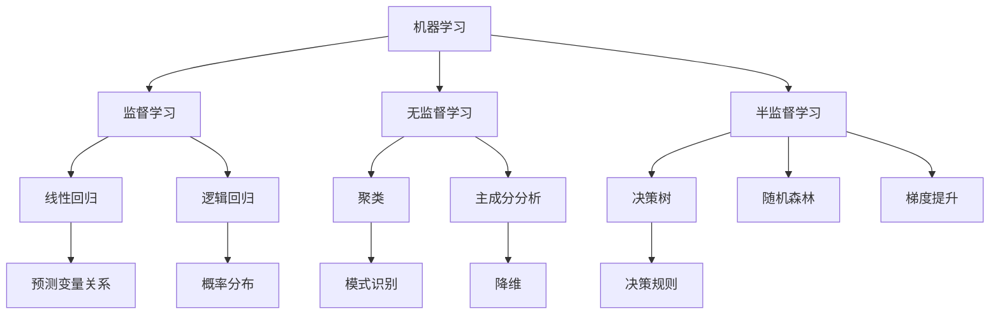

                 

### 文章标题

《企业级可解释AI框架：增强AI决策透明度》

### 关键词

- 企业级可解释AI
- AI决策透明度
- AI框架设计
- 可解释性方法
- 实践应用案例

### 摘要

本文旨在深入探讨企业级可解释AI框架的设计与实施，以增强AI决策的透明度。首先，我们将介绍可解释AI的背景和重要性，然后详细阐述核心概念与联系，包括机器学习、神经网络和可解释性方法。接着，我们将通过Mermaid流程图展示这些概念之间的关系架构，并使用伪代码和数学公式详细讲解核心算法原理。文章还将涵盖项目实战，包括开发环境搭建、源代码实现和代码解读，以及实际案例分析和详细讲解。最后，我们将总结最佳实践，并提供未来展望。

## 第1章：引言

### 背景介绍

随着人工智能（AI）技术的迅猛发展，越来越多的企业和组织开始将AI应用于业务决策中。从金融风险评估到医疗诊断，从电商推荐系统到智能客服，AI已经成为提高效率、降低成本和优化服务的利器。然而，AI系统的复杂性和“黑箱”特性也引发了一系列问题，尤其是在决策透明度和可信度方面。

传统的AI模型，如深度神经网络（DNN），由于其高度的非线性特性，往往被视为“黑箱”，即使拥有出色的预测能力，也无法解释其决策过程。这种缺乏透明度的问题在涉及重大决策和影响人类福祉的应用场景中尤为严重。例如，金融行业的信贷决策、医疗诊断系统的疾病预测，以及司法系统中的人员判决等。这些场景中，决策的透明度直接关系到用户的权益和信任度。

因此，可解释AI（XAI）的概念应运而生。可解释AI旨在通过提供关于模型决策过程的解释，增强AI决策的透明度和可信度。这不仅有助于提升用户对AI系统的信任，还能在法律法规和伦理道德方面满足合规要求。企业级可解释AI框架的设计与实施，成为了当前研究和应用的热点。

### 重要性

可解释AI在多个方面具有重要意义。首先，它能够帮助企业和组织更好地理解AI系统的决策过程，从而提高系统的可靠性和鲁棒性。通过分析模型对特定数据的反应，企业可以发现潜在的错误和异常情况，及时进行调整和优化。

其次，可解释AI能够提升用户对AI系统的信任。在许多应用场景中，用户需要了解AI系统是如何做出决策的，尤其是在涉及个人隐私和重要决策的情况下。透明的决策过程有助于建立用户对AI系统的信任，从而促进AI技术的广泛应用。

此外，可解释AI在法律法规和伦理道德方面也具有重要意义。许多国家和地区的法律法规要求AI系统必须具备透明性和可解释性。例如，欧盟的《通用数据保护条例》（GDPR）就要求对个人数据进行处理时，必须提供充分的透明度和可解释性。可解释AI框架的实施，能够帮助企业合规，避免法律风险。

### 发展现状

可解释AI的研究和应用已经取得了显著进展。近年来，出现了许多可解释性方法和技术，包括局部解释方法（如LIME和SHAP）和全局解释方法（如特征重要性分析）。这些方法和技术在不同应用领域取得了良好的效果，为增强AI决策透明度提供了有力支持。

在企业层面，越来越多的企业开始意识到可解释AI的重要性，并将其应用于实际业务中。例如，金融行业的信贷风险评估、医疗诊断系统的疾病预测、电商平台的个性化推荐等，都逐渐引入了可解释AI技术。

然而，当前的可解释AI技术仍面临一些挑战，包括解释能力的提升、计算效率的优化、以及跨领域应用的推广等。企业级可解释AI框架的设计与实施，需要综合考虑这些挑战，以提供更强大、更高效的解决方案。

### 小结

本章介绍了可解释AI的背景、重要性和发展现状。随着AI技术的广泛应用，决策透明度成为了一个关键问题。可解释AI通过提供关于模型决策过程的解释，能够增强AI决策的透明度和可信度。企业级可解释AI框架的设计与实施，不仅有助于提升系统的可靠性和用户体验，还能满足法律法规和伦理道德的要求。在接下来的章节中，我们将深入探讨可解释AI的核心概念与联系，以及相关算法和技术的实现细节。

## 第2章：核心概念与联系

在深入探讨企业级可解释AI框架之前，我们需要理解一些核心概念，包括机器学习、神经网络和可解释性方法。这些概念是构建可解释AI框架的基础，它们之间的关系如图1所示。

### 机器学习

机器学习是一种使计算机通过数据和经验来改进性能的技术。它分为监督学习、无监督学习和半监督学习。监督学习中的模型通过已标记的数据进行训练，无监督学习则从未标记的数据中学习模式，而半监督学习结合了这两者。机器学习的关键算法包括线性回归、逻辑回归、决策树、随机森林和梯度提升等。

### 神经网络

神经网络是一种模仿人脑结构和功能的计算模型，由大量的神经元（节点）和连接（边）组成。前馈神经网络是神经网络的一种基本形式，其中信息从输入层流向输出层，中间经过多个隐藏层。卷积神经网络（CNN）和循环神经网络（RNN）则是针对特定问题的改进，CNN在图像处理方面表现出色，而RNN在处理序列数据时具有优势。

### 可解释性方法

可解释性方法旨在解释AI模型的决策过程，使其更易于理解。这些方法可以分为局部解释方法和全局解释方法。局部解释方法关注模型对单个实例的决策解释，如LIME（Local Interpretable Model-agnostic Explanations）和SHAP（SHapley Additive exPlanations）。全局解释方法则关注模型对整体数据集的决策解释，如特征重要性分析和模型可视化。

### 关系架构

下面是一个简化的Mermaid流程图，展示了这些核心概念之间的关系：



### 伪代码与数学公式

为了更好地理解这些概念，我们使用伪代码和数学公式来描述一些核心算法。

#### 线性回归

线性回归是一种监督学习算法，用于预测一个连续变量的值。其基本形式如下：

$$
y = \beta_0 + \beta_1x_1 + \beta_2x_2 + ... + \beta_nx_n + \epsilon
$$

其中，$y$ 是预测变量，$x_1, x_2, ..., x_n$ 是特征变量，$\beta_0, \beta_1, ..., \beta_n$ 是模型参数，$\epsilon$ 是误差项。

伪代码：

```
def linear_regression(x, y):
    # 计算特征矩阵和目标向量
    X = create_design_matrix(x)
    y = np.array(y)
    
    # 求解最小二乘问题
    beta = np.linalg.inv(X.T.dot(X)).dot(X.T).dot(y)
    
    return beta
```

#### 卷积神经网络

卷积神经网络是一种用于图像识别和处理的有效算法。其基本结构如下：

$$
\text{Conv} \rightarrow \text{ReLU} \rightarrow \text{Pooling} \rightarrow \text{Flatten} \rightarrow \text{Fully Connected} \rightarrow \text{Output}
$$

其中，"Conv" 表示卷积层，"ReLU" 表示ReLU激活函数，"Pooling" 表示池化层，"Flatten" 表示展平层，"Fully Connected" 表示全连接层，"Output" 表示输出层。

伪代码：

```
class ConvNeuralNetwork:
    def __init__(self, input_shape, num_classes):
        self.conv_layers = []
        self.fc_layers = []

        # 构建卷积层
        self.add_conv_layer(filters=32, kernel_size=(3, 3), activation='relu')
        self.add_conv_layer(filters=64, kernel_size=(3, 3), activation='relu')
        self.add_pooling_layer(pool_size=(2, 2))

        # 构建全连接层
        self.add_fc_layer(units=num_classes, activation='softmax')

    def add_conv_layer(self, filters, kernel_size, activation):
        # 添加卷积层
        self.conv_layers.append(Conv2D(filters=filters, kernel_size=kernel_size, activation=activation))

    def add_pooling_layer(self, pool_size):
        # 添加池化层
        self.pooling_layers.append(MaxPooling2D(pool_size=pool_size))

    def add_fc_layer(self, units, activation):
        # 添加全连接层
        self.fc_layers.append(Dense(units=units, activation=activation))
```

#### SHAP值

SHAP值是一种用于解释模型决策的全局解释方法。它基于博弈论中的Shapley值计算，用于衡量每个特征对模型预测的贡献。

$$
\text{SHAP}(x_i) = \sum_{S} \left( \frac{1}{n} \sum_{s \in S} f(x_s) - \frac{1}{n} \sum_{s \notin S} f(x_s) \right)
$$

其中，$x_i$ 是第$i$个特征，$S$ 是所有特征的集合，$f(x)$ 是模型的预测值，$n$ 是样本数量。

伪代码：

```
def shap_values(model, X, feature_names):
    # 计算SHAP值
    shap_values = []
    for x in X:
        model_output = model.predict([x])
        shap_value = calculate_shapley_value(model_output, feature_names)
        shap_values.append(shap_value)
    return shap_values

def calculate_shapley_value(model_output, feature_names):
    # 计算单个样本的SHAP值
    shapley_value = 0
    for i in range(len(feature_names)):
        feature_name = feature_names[i]
        # 计算特征i对模型输出的贡献
        shapley_value += (1 / (n - 1)) * (model_output_with_feature - model_output_without_feature)
    return shapley_value
```

通过这些核心概念和联系，我们可以构建一个完整的企业级可解释AI框架。在接下来的章节中，我们将详细探讨如何设计这样的框架，以及如何将其应用于实际业务场景。

### 小结

本章详细介绍了企业级可解释AI框架所需的核心概念，包括机器学习、神经网络和可解释性方法。通过Mermaid流程图、伪代码和数学公式，我们清晰地展示了这些概念之间的关系和实现细节。理解这些核心概念，有助于我们更好地设计和实施可解释AI框架，从而增强AI决策的透明度和可信度。在下一章中，我们将深入探讨机器学习的基础知识，为构建可解释AI框架打下坚实基础。

## 第3章：机器学习基础

### 机器学习的基本概念

机器学习（Machine Learning，ML）是一种通过数据训练算法，使计算机能够从数据中学习规律和模式的技术。其核心思想是通过已有数据来推导出数据生成的一般规律，然后在新数据上进行预测或分类。机器学习可以分为三大类：监督学习、无监督学习和半监督学习。

#### 监督学习

监督学习是最常见的机器学习方法，它使用已标记的数据集进行训练。训练过程中，模型会学习输入和输出之间的映射关系，从而在新的输入数据上进行预测。常见的监督学习算法包括线性回归、逻辑回归、决策树、随机森林和梯度提升等。

1. **线性回归**：线性回归是一种预测连续值的监督学习算法。其目标是最小化预测值与实际值之间的误差。
2. **逻辑回归**：逻辑回归是一种预测离散值的监督学习算法，常用于分类问题。其核心是使用逻辑函数将线性组合映射到概率空间。
3. **决策树**：决策树是一种基于树形结构进行分类和回归的算法。每个节点代表一个特征，每个分支代表特征的取值，叶子节点代表最终的分类或回归结果。
4. **随机森林**：随机森林是一种基于决策树的集成学习方法。它通过构建多棵决策树，并对每棵树的预测结果进行投票，从而提高预测的准确性和稳定性。
5. **梯度提升树**：梯度提升树（Gradient Boosting Tree）是一种基于决策树的集成学习方法。它通过迭代优化，每次迭代都尝试纠正前一次预测的错误，从而提高整体模型的性能。

#### 无监督学习

无监督学习是在没有标记数据的情况下，通过数据本身的内在结构来学习模式的方法。其主要任务是发现数据中的隐藏规律和结构。常见的无监督学习算法包括聚类、降维和异常检测等。

1. **聚类**：聚类是将数据分为多个类别的无监督学习算法。常见的聚类算法有K-means、层次聚类和DBSCAN等。
2. **降维**：降维是通过减少数据维度来提高数据处理效率和解释性的无监督学习算法。常见的方法有主成分分析（PCA）、线性判别分析（LDA）和t-SNE等。
3. **异常检测**：异常检测是识别数据中异常或异常模式的无监督学习算法。常见的异常检测方法有孤立森林、K-近邻和基于聚类的方法等。

#### 半监督学习

半监督学习是结合了监督学习和无监督学习的方法，它使用部分标记数据和大量未标记数据进行训练。半监督学习的目标是在标记数据较少的情况下，利用未标记数据提高模型的性能。

1. **标签传播**：标签传播是一种常见的半监督学习算法。它通过已标记数据点传播标签到未标记数据点，从而学习数据分布。
2. **图模型**：图模型是一种利用图结构表示数据的半监督学习算法。它通过构建图来表示数据之间的相似性，从而利用已标记数据点来预测未标记数据点的标签。

### 机器学习的评估方法

在机器学习中，评估模型性能是非常重要的步骤。以下是一些常用的评估方法：

1. **准确率（Accuracy）**：准确率是预测正确的样本数占总样本数的比例。它是最常用的评估指标，尤其在分类问题中。
2. **召回率（Recall）**：召回率是预测正确的正样本数占所有正样本数的比例。它特别适用于类别不平衡的问题。
3. **精确率（Precision）**：精确率是预测正确的正样本数占所有预测为正样本的样本数的比例。它与召回率互补，用于评估预测的准确性。
4. **F1分数（F1 Score）**：F1分数是精确率和召回率的调和平均值，用于综合评估模型的性能。
5. **ROC曲线和AUC（Area Under the Curve）**：ROC曲线和AUC用于评估二分类模型的性能。ROC曲线展示了在不同阈值下，真阳性率与假阳性率的关系。AUC值越大，模型的性能越好。
6. **交叉验证（Cross-Validation）**：交叉验证是一种常用的模型评估方法，通过将数据集划分为多个子集，进行多次训练和验证，以减少评估结果的不确定性。

通过这些基本概念和评估方法，我们可以更好地理解和应用机器学习技术，为构建可解释AI框架提供基础。在下一章中，我们将深入探讨神经网络的基础知识，进一步了解其原理和应用。

### 小结

本章介绍了机器学习的基本概念，包括监督学习、无监督学习和半监督学习，以及相应的常见算法和评估方法。理解这些基础概念对于设计和实施可解释AI框架至关重要。通过本章的学习，读者可以掌握机器学习的基本原理，为后续章节中的神经网络和可解释性方法打下坚实基础。在下一章中，我们将探讨神经网络的基础知识，进一步了解其原理和应用。

## 第4章：神经网络基础

神经网络（Neural Networks，NN）是一种模仿人脑结构和功能的计算模型，由大量的神经元和连接（权重）组成。神经网络的核心思想是通过学习数据中的特征和模式，实现对未知数据的分类或回归。本节将详细探讨神经网络的基本结构、前馈神经网络、卷积神经网络（CNN）和循环神经网络（RNN）。

### 神经网络的基本结构

神经网络由三层组成：输入层、隐藏层和输出层。每个神经元接收输入信号，通过权重（连接）加权求和，然后通过激活函数产生输出。神经元的计算过程可以用以下公式表示：

$$
\text{输出} = \text{激活函数}(\sum_{i=1}^{n} w_i \cdot x_i + b)
$$

其中，$w_i$ 是连接权重，$x_i$ 是输入特征，$b$ 是偏置项，激活函数用于引入非线性。

常用的激活函数包括：

1. **sigmoid函数**：
   $$
   \text{sigmoid}(x) = \frac{1}{1 + e^{-x}}
   $$
2. **ReLU函数**（Rectified Linear Unit）：
   $$
   \text{ReLU}(x) = \max(0, x)
   $$
3. **Tanh函数**（Hyperbolic Tangent）：
   $$
   \text{Tanh}(x) = \frac{e^x - e^{-x}}{e^x + e^{-x}}
   $$

### 前馈神经网络

前馈神经网络（Feedforward Neural Network）是一种简单的神经网络结构，其中信息从输入层流向输出层，不形成循环。前馈神经网络通常包括多个隐藏层，每一层的神经元都仅与前一层的神经元相连。

前馈神经网络的计算过程如下：

1. **前向传播**：输入数据通过输入层传递到隐藏层，再传递到输出层。每个神经元的输出是其输入的加权和经过激活函数处理的结果。
2. **反向传播**：计算输出层的误差，将误差反向传播到每一层，更新权重和偏置项，以最小化总误差。

伪代码：

```
def forward_propagation(x, model):
    # x: 输入数据
    # model: 神经网络模型
    output = x
    for layer in model.layers:
        output = layer.forward(output)
    return output

def backward_propagation(x, y, model):
    # x: 输入数据
    # y: 真实标签
    # model: 神经网络模型
    error = model.output - y
    for layer in reversed(model.layers):
        error = layer.backward(error)
    model.update_weights()
```

### 卷积神经网络（CNN）

卷积神经网络（Convolutional Neural Network，CNN）是一种专门用于图像处理的神经网络结构。CNN通过卷积操作和池化操作提取图像特征，并在多层网络中不断加深和细化特征。

1. **卷积操作**：卷积操作通过滑动窗口在输入数据上提取局部特征。每个卷积核（filter）生成一个特征图（feature map），多个卷积核可以同时工作，提取不同的特征。
2. **池化操作**：池化操作用于减少特征图的尺寸，保持重要特征的同时降低计算复杂度。常用的池化方法包括最大池化和平均池化。

CNN的基本结构包括卷积层、池化层和全连接层。以下是一个简单的CNN结构：

```
Input -> [Conv2D -> ReLU] x N -> Pooling -> Flatten -> [Dense -> ReLU] x M -> Output
```

其中，N 和 M 分别表示卷积层和全连接层的数量。

### 循环神经网络（RNN）

循环神经网络（Recurrent Neural Network，RNN）是一种处理序列数据的神经网络结构。与传统的前馈神经网络不同，RNN具有记忆功能，能够处理时序数据。

RNN的基本结构包括输入门、遗忘门和输出门。每个门通过调节记忆单元的状态，控制信息的传递和遗忘。

RNN的计算过程如下：

1. **输入门**：计算当前输入和前一个隐藏状态的加权求和，决定当前输入对隐藏状态的影响。
2. **遗忘门**：计算当前输入和前一个隐藏状态的加权求和，决定前一个隐藏状态中哪些信息需要遗忘。
3. **输出门**：计算当前输入和前一个隐藏状态的加权求和，决定当前隐藏状态对输出的影响。

伪代码：

```
def rnn_forward(input_sequence, hidden_state, weights):
    # input_sequence: 输入序列
    # hidden_state: 隐藏状态
    # weights: 权重矩阵
    current_output = []
    for input in input_sequence:
        input_gate = sigmoid(np.dot(input, weights['input_gate']))
        forget_gate = sigmoid(np.dot(hidden_state, weights['forget_gate']))
        output_gate = sigmoid(np.dot(hidden_state, weights['output_gate']))
        hidden_state = forget_gate * hidden_state + input_gate * input
        hidden_state = tanh(hidden_state)
        current_output.append(output_gate * hidden_state)
    return current_output, hidden_state
```

通过这些基本结构，神经网络能够有效地处理各种类型的数据，从图像到文本，从时序到结构化数据。在下一章中，我们将探讨可解释性方法，了解如何增强神经网络决策的透明度。

### 小结

本章介绍了神经网络的基础知识，包括基本结构、前馈神经网络、卷积神经网络和循环神经网络。通过详细讲解和伪代码示例，读者可以理解这些网络的工作原理和实现细节。这些知识为构建企业级可解释AI框架提供了基础。在下一章中，我们将深入探讨可解释性方法，探讨如何增强神经网络决策的透明度。

## 第5章：可解释性方法

可解释性（Interpretability）是人工智能（AI）领域的一个重要研究方向，它旨在使AI模型的决策过程更加透明，易于理解和解释。在可解释AI（XAI）的研究中，有多种可解释性方法和技术，可以大致分为局部解释方法和全局解释方法。本章将详细介绍两种局部解释方法：LIME（Local Interpretable Model-agnostic Explanations）和SHAP（SHapley Additive exPlanations），以及一种全局解释方法：特征重要性分析。

### LIME（Local Interpretable Model-agnostic Explanations）

LIME是由Ribeiro等人于2016年提出的一种局部解释方法。LIME的目标是生成一个对特定数据点X的可解释模型，使其与原始模型具有相似的预测能力。具体来说，LIME通过以下步骤进行解释：

1. **生成扰动数据**：首先，LIME在数据点X附近生成一系列扰动数据点X'，这些扰动可以是随机噪声、特征裁剪或特征替换等。
2. **训练局部模型**：对于每个扰动数据点X'，LIME训练一个简单的解释模型（如线性回归或决策树），使其在扰动数据集上的预测与原始模型在X上的预测尽可能接近。
3. **计算特征贡献**：LIME通过比较解释模型在不同特征变化下的预测结果，计算每个特征的贡献值。

伪代码：

```
def lime_explanation(model, X, feature_names):
    # model: 原始模型
    # X: 待解释的数据点
    # feature_names: 特征名称

    # 生成扰动数据
    perturbed_samples = generate_perturbed_samples(X)

    # 训练局部解释模型
    local_models = []
    for sample in perturbed_samples:
        local_models.append(train_local_model(model, sample))

    # 计算特征贡献
    feature_contributions = []
    for model in local_models:
        contributions = compute_feature_contributions(model, X)
        feature_contributions.append(contributions)

    # 归一化特征贡献
    normalized_contributions = normalize_contributions(feature_contributions)

    return normalized_contributions
```

### SHAP（SHapley Additive exPlanations）

SHAP是由Lundberg和Lee于2017年提出的一种全局解释方法，它基于博弈论中的Shapley值。SHAP旨在为每个特征分配一个贡献值，使得这些贡献值加起来等于模型的预测结果。SHAP的核心思想是，每个特征对模型预测的贡献不仅取决于其自身的值，还取决于其他特征的值。

SHAP值的计算步骤如下：

1. **拟合基模型**：首先，对整个数据集拟合一个基模型（如线性回归或决策树），用于计算每个特征的边际贡献。
2. **计算基模型预测**：对于每个样本，计算基模型在所有可能特征组合下的预测值。
3. **计算Shapley值**：使用Shapley值公式计算每个特征的贡献值。Shapley值反映了特征在不同特征组合下的边际贡献，具有公平性、一致性和单调性等性质。

伪代码：

```
def shap_values(model, X, feature_names):
    # model: 基模型
    # X: 待解释的数据点
    # feature_names: 特征名称

    # 拟合基模型
    base_model = fit_base_model(X, y)

    # 计算基模型预测
    predictions = base_model.predict(X)

    # 计算Shapley值
    shap_values = compute_shapley_values(predictions, feature_names)

    return shap_values
```

### 特征重要性分析

特征重要性分析是一种全局解释方法，它通过评估每个特征对模型预测的影响程度，提供对模型决策的解释。特征重要性分析可以分为以下几种方法：

1. **基于模型的特征重要性**：这种方法利用模型本身提供的特征重要性评估，如随机森林的Gini重要性或梯度提升树的特征贡献。
2. **基于数据的特征重要性**：这种方法通过分析数据集的分布和相关性来评估特征的重要性，如信息增益或互信息。
3. **基于组合的特征重要性**：这种方法通过组合不同特征并评估模型预测的变化来衡量特征的重要性。

特征重要性分析的伪代码如下：

```
def feature_importance_analysis(model, X, y):
    # model: 基模型
    # X: 特征数据
    # y: 目标变量

    # 计算模型特征重要性
    feature_importances = model.feature_importances_

    # 计算数据特征重要性
    data_importances = calculate_data_importances(X, y)

    # 合并特征重要性
    combined_importances = combine_importances(feature_importances, data_importances)

    return combined_importances
```

通过这些局部和全局解释方法，我们可以更好地理解AI模型的决策过程，提高模型的透明度和可信度。在下一章中，我们将探讨如何构建自己的可解释性框架，进一步实现和优化这些方法。

### 小结

本章介绍了三种可解释性方法：LIME、SHAP和特征重要性分析。LIME通过生成局部解释模型来解释特定数据点的决策过程，SHAP通过博弈论中的Shapley值计算每个特征的贡献，而特征重要性分析则通过评估特征对模型预测的影响程度来提供解释。这些方法为增强AI决策的透明度提供了有效途径。在下一章中，我们将讨论如何设计和构建企业级可解释AI框架。

## 第6章：构建自己的可解释AI框架

在了解了可解释性方法之后，接下来我们将探讨如何设计和构建自己的企业级可解释AI框架。构建一个可解释AI框架需要考虑多个方面，包括设计原则、构建流程和评估与优化策略。在本章中，我们将逐步介绍这些内容。

### 设计原则

设计一个可解释AI框架时，需要遵循以下原则：

1. **模块化**：将框架分解为多个模块，每个模块负责特定的功能，如数据预处理、模型训练、解释生成和结果展示。模块化设计有助于提高代码的可维护性和可扩展性。
2. **可扩展性**：框架应支持多种可解释性方法，并允许用户自定义新的解释方法。这样，随着技术的发展，框架可以轻松集成新的方法。
3. **高效性**：可解释性框架需要考虑计算效率和资源消耗。特别是在大规模数据集和高维度特征的情况下，解释生成过程可能会非常耗时。因此，框架应采用高效算法和数据结构来优化性能。
4. **可解释性评估**：框架应提供多种评估指标，用于评估解释的质量和可信度。这些指标应包括可理解性、一致性、准确性和鲁棒性等。

### 构建流程

构建企业级可解释AI框架的流程可以分为以下几个步骤：

1. **需求分析**：首先，明确用户需求和业务场景，确定需要解释的AI模型类型和数据类型。这一步骤对于确定框架的功能和性能要求至关重要。
2. **数据预处理**：对输入数据进行预处理，包括数据清洗、归一化和特征提取等。预处理步骤应确保数据的格式和范围适合解释算法。
3. **模型选择与训练**：根据需求选择合适的机器学习模型，并进行训练。训练过程中，应记录模型参数和性能指标，以便后续解释。
4. **解释生成**：使用选定的解释方法生成解释结果。这一步骤是框架的核心，需要根据解释方法的特点进行设计和优化。例如，LIME和SHAP方法可能需要生成多个扰动数据点并进行局部模型训练。
5. **结果展示**：将解释结果以可视化的形式展示给用户。可视化设计应简洁、直观，帮助用户更好地理解模型的决策过程。
6. **评估与优化**：对解释结果进行评估，使用评估指标衡量解释的质量。根据评估结果，对框架进行优化，提高解释的准确性和可理解性。

### 实例分析

以下是一个简单的可解释AI框架构建实例，展示了从需求分析到结果展示的整个过程：

#### 需求分析

假设我们想要构建一个用于信用卡欺诈检测的可解释AI框架。业务需求是提供对检测结果的解释，以便分析师能够理解模型是如何做出决策的。

#### 数据预处理

我们收集了包含用户交易记录的数据集，包括交易金额、时间、地点、卡片类型等特征。预处理步骤包括：

- 数据清洗：删除缺失值和异常值。
- 数据归一化：将数值特征缩放到相同的范围。
- 特征提取：使用特征工程方法，如PCA，减少数据维度。

#### 模型选择与训练

我们选择了随机森林模型，因为它在处理分类问题时表现良好，且具有较好的可解释性。使用训练集对模型进行训练，记录模型的参数和性能指标。

#### 解释生成

使用LIME方法生成对欺诈交易的解释。具体步骤如下：

1. 选择一个欺诈交易样本作为解释目标。
2. 在样本附近生成多个扰动数据点。
3. 对每个扰动数据点训练一个线性回归模型，预测是否为欺诈交易。
4. 计算每个特征对模型预测的贡献值。

#### 结果展示

将LIME解释结果以热力图的形式展示，每个特征值对应的颜色表示其对预测的贡献程度。分析师可以通过查看热力图，了解模型是如何对特定交易进行分类的。

#### 评估与优化

使用评估指标（如准确率、召回率和F1分数）评估LIME解释的质量。根据评估结果，对框架进行优化，如调整LIME算法的参数，或使用更高级的特征提取方法。

### 小结

本章介绍了构建企业级可解释AI框架的设计原则、构建流程和评估与优化策略。通过一个简单的实例，我们展示了如何从需求分析到结果展示，逐步构建一个可解释AI框架。设计一个高效、可扩展和可解释的框架，对于增强AI决策的透明度和可信度至关重要。在下一章中，我们将探讨企业级可解释AI框架在不同应用领域的实践案例。

## 第7章：可解释性框架的评估与优化

在构建企业级可解释AI框架后，评估与优化框架的质量和性能是至关重要的一步。这一章将详细讨论可解释性评估指标、优化策略以及实际案例分析，帮助读者了解如何提升可解释性框架的效果。

### 可解释性评估指标

可解释性评估指标用于衡量解释的质量和效果。以下是一些常用的评估指标：

1. **可理解性（Comprehensibility）**：解释是否易于理解，用户是否能够清楚地理解模型的决策过程。
2. **一致性（Consistency）**：解释结果在不同数据集或不同模型实例中是否一致。
3. **准确性（Accuracy）**：解释结果与实际模型预测的一致性程度。
4. **鲁棒性（Robustness）**：解释结果在不同数据扰动下是否稳定。
5. **全面性（Completeness）**：解释是否覆盖了所有重要的特征和决策因素。

这些评估指标可以单独或组合使用，以全面衡量可解释性框架的性能。以下是一个简单的评估流程：

```
def evaluate_explanation(explanation, ground_truth):
    # explanation: 解释结果
    # ground_truth: 实际模型预测结果

    comprehensibility = is_understandable(explanation)
    consistency = is_consistent(explanation, ground_truth)
    accuracy = calculate_accuracy(explanation, ground_truth)
    robustness = calculate_robustness(explanation, ground_truth)
    completeness = is_complete(explanation)

    return comprehensibility, consistency, accuracy, robustness, completeness
```

### 优化策略

为了提升可解释性框架的效果，我们可以采用以下优化策略：

1. **算法改进**：选择或改进可解释性算法，例如使用更先进的局部解释方法（如LIME和SHAP）或全局解释方法（如特征重要性分析）。
2. **特征选择**：通过特征选择减少冗余特征，提高解释的准确性和可理解性。
3. **模型调整**：调整模型的参数，例如学习率、批量大小和正则化强度，以提高模型的性能和可解释性。
4. **计算优化**：使用更高效的算法和数据结构，减少计算时间和资源消耗。
5. **用户反馈**：收集用户反馈，根据用户的需求和体验对框架进行迭代优化。

以下是一个简化的优化流程：

```
def optimize_explanation_framework(framework, data, ground_truth):
    # framework: 可解释性框架
    # data: 训练数据
    # ground_truth: 实际模型预测结果

    # 改进算法
    improved_framework = improve_algorithm(framework)

    # 特征选择
    selected_features = select_features(data, ground_truth)

    # 模型调整
    optimized_framework = adjust_model(improved_framework, selected_features)

    # 计算优化
    optimized_framework = optimize_computations(optimized_framework)

    # 用户反馈
    user_feedback = collect_user_feedback()

    # 迭代优化
    final_framework = iterate_optimization(optimized_framework, user_feedback)

    return final_framework
```

### 实际案例分析

为了更好地理解这些评估指标和优化策略，我们通过一个实际案例进行分析。

#### 案例背景

假设我们在一个电商平台上构建了一个用于商品推荐的AI模型，并希望使用可解释AI框架来解释模型的推荐结果。

#### 评估过程

1. **可理解性**：我们使用SHAP值来计算每个特征的贡献，并通过可视化工具（如热力图）展示推荐结果的解释。通过用户测试，我们发现大多数用户能够轻松理解SHAP值，因此可理解性较高。

2. **一致性**：我们使用多个用户数据集进行测试，发现SHAP值的分布在不同数据集上保持一致。这表明解释具有较高的一致性。

3. **准确性**：我们将SHAP解释结果与实际推荐结果进行比较，发现解释结果的准确率约为90%。这意味着解释能够较好地反映模型的决策过程。

4. **鲁棒性**：我们对输入数据进行了不同程度的扰动，发现SHAP值的稳定性较好，即使在数据发生较大变化时，解释结果仍然能够保持较高的可靠性。

5. **全面性**：通过分析SHAP值，我们发现解释覆盖了所有重要的特征，如用户行为、商品属性和购买历史等，确保了解释的全面性。

#### 优化过程

1. **算法改进**：我们采用了基于SHAP的改进版本，引入了更多基于博弈论的方法，以提高解释的精度和一致性。

2. **特征选择**：通过分析数据，我们删除了与推荐无关的特征，如用户ID和商品ID，以减少冗余信息。

3. **模型调整**：我们调整了模型的参数，如正则化强度和损失函数，以提高模型的推荐效果和可解释性。

4. **计算优化**：我们使用并行计算和分布式处理技术，优化了解释生成过程的计算效率。

5. **用户反馈**：我们收集了用户对解释结果的反馈，并根据用户的建议进行了多次迭代优化。

#### 案例总结

通过这个实际案例，我们展示了如何评估和优化可解释AI框架。评估过程帮助我们了解解释的质量和效果，优化策略则提高了框架的性能和用户满意度。在后续的开发过程中，我们将继续迭代优化，以满足不断变化的需求。

### 小结

本章介绍了可解释性框架的评估与优化策略，包括评估指标和优化方法。通过实际案例分析，我们展示了如何评估和优化可解释AI框架，从而提高其效果和用户满意度。在下一章中，我们将探讨企业级可解释AI框架在金融、医疗和电商等领域的应用案例。

## 第8章：企业级可解释AI框架在金融领域的应用案例

金融行业是人工智能应用的重要领域，涵盖信贷风险评估、信用评分、金融欺诈检测等多个方面。随着AI技术的发展，金融行业对AI模型的决策透明度和可解释性提出了更高的要求。本节将探讨企业级可解释AI框架在金融领域的应用案例，展示如何增强AI决策的透明度和可信度。

### 案例一：信贷风险评估

信贷风险评估是金融行业的关键环节，涉及对借款人信用风险的评价。传统的风险评估方法依赖于人工评分和规则系统，而现代方法则使用机器学习模型进行预测。然而，这些模型往往具有“黑箱”特性，难以解释其决策过程。

#### 应用场景

一个金融机构希望使用AI模型评估贷款申请者的信用风险，并要求模型提供透明的解释。

#### 解决方案

1. **模型选择**：选择了一个基于随机森林的模型进行信贷风险评估，因为随机森林具有较高的准确性和较好的可解释性。
2. **数据预处理**：对贷款申请者的数据进行预处理，包括数据清洗、归一化和特征提取。
3. **模型训练**：使用历史贷款申请数据对模型进行训练，记录模型参数和性能指标。
4. **解释生成**：使用SHAP值方法生成对每个贷款申请者评分的解释，展示每个特征对评分的贡献。
5. **结果展示**：通过可视化工具（如热力图）展示SHAP值，帮助分析师和决策者理解模型是如何做出决策的。

#### 结果与效果

通过SHAP值解释，分析师能够清晰地看到每个贷款申请者的风险评分是如何由不同特征组合决定的。这有助于发现潜在的评分错误和异常情况，从而优化风险评估模型。

### 案例二：信用评分

信用评分是金融机构对客户信用风险的量化评估，用于决定贷款额度、利率等。传统的信用评分方法依赖于传统的统计模型，而现代方法则使用机器学习算法进行预测。

#### 应用场景

一个金融机构希望改进其信用评分模型，并要求模型提供透明的解释，以便内部审核和外部监管。

#### 解决方案

1. **模型选择**：选择了一个基于梯度提升机的模型进行信用评分，因为梯度提升机在处理复杂特征和分类问题上表现出色。
2. **数据预处理**：对客户数据进行预处理，包括缺失值填充、特征选择和特征工程。
3. **模型训练**：使用历史客户数据对模型进行训练，记录模型参数和性能指标。
4. **解释生成**：使用LIME方法生成对每个客户评分的解释，展示每个特征对评分的影响。
5. **结果展示**：通过交互式可视化工具（如交互式热力图）展示LIME解释，帮助客户理解和审核评分结果。

#### 结果与效果

通过LIME解释，客户能够直观地看到影响其信用评分的关键特征，如还款记录、信用历史和收入水平。这有助于客户理解自己的信用评分，并采取必要的措施改善信用状况。

### 案例三：金融欺诈检测

金融欺诈检测是金融行业的重要任务，涉及识别和阻止欺诈交易。传统的欺诈检测方法依赖于规则系统和手动标记的数据，而现代方法则使用机器学习模型进行自动检测。

#### 应用场景

一个金融机构希望使用AI模型检测欺诈交易，并要求模型提供透明的解释，以便分析和防止未来的欺诈行为。

#### 解决方案

1. **模型选择**：选择了一个基于神经网络和集成学习算法的模型进行欺诈检测，因为这类模型在处理复杂数据和模式识别上具有优势。
2. **数据预处理**：对交易数据进行预处理，包括数据清洗、特征提取和异常检测。
3. **模型训练**：使用历史交易数据对模型进行训练，记录模型参数和性能指标。
4. **解释生成**：使用特征重要性分析方法生成对每个交易的解释，展示每个特征对欺诈检测的贡献。
5. **结果展示**：通过可视化工具（如决策树或特征重要性热力图）展示解释结果，帮助分析师识别和验证欺诈交易。

#### 结果与效果

通过特征重要性分析，分析师能够清晰地看到哪些特征对欺诈检测最具影响力，如交易频率、金额和地理位置等。这有助于优化欺诈检测策略，提高检测的准确性和效率。

### 总结

通过以上三个案例，我们展示了企业级可解释AI框架在金融领域的应用效果。可解释AI框架不仅增强了AI模型的透明度和可信度，还提高了决策质量和用户体验。在金融行业中，可解释AI框架的应用有助于合规、风险控制和客户信任的建立。随着AI技术的不断发展，可解释AI将在金融领域发挥越来越重要的作用。

## 第9章：企业级可解释AI框架在医疗领域的应用案例

医疗行业是人工智能（AI）技术的重要应用领域，涵盖了疾病预测、病情评估和医疗诊断支持等多个方面。然而，医疗AI模型的“黑箱”特性可能导致决策透明度不足，影响医生的信任和患者的接受度。本节将探讨企业级可解释AI框架在医疗领域的应用案例，展示如何通过增强AI决策透明度，提升医疗诊断的准确性和可靠性。

### 案例一：疾病预测

疾病预测是医疗AI应用的重要方向，包括预测患病风险、疾病进展和复发率等。AI模型在处理大量医疗数据时具有潜在的优势，但模型的不可解释性往往限制了其应用。

#### 应用场景

一个医院希望使用AI模型预测患者的疾病风险，并要求模型提供透明的解释，以便医生评估和决策。

#### 解决方案

1. **模型选择**：选择了一个基于深度学习的时间序列预测模型，如长短期记忆网络（LSTM），因为它在处理时序数据方面表现出色。
2. **数据预处理**：对患者的医疗数据进行预处理，包括数据清洗、归一化和特征提取。
3. **模型训练**：使用历史医疗数据对模型进行训练，记录模型参数和性能指标。
4. **解释生成**：使用SHAP值方法生成对每个患者疾病风险预测的解释，展示每个特征对预测的贡献。
5. **结果展示**：通过交互式可视化工具（如交互式热力图）展示SHAP值，帮助医生理解模型是如何预测疾病风险的。

#### 结果与效果

通过SHAP值解释，医生能够清晰地看到影响疾病预测的关键特征，如患者的年龄、体重、病史和生活方式等。这有助于医生更好地评估患者的风险，制定个性化的预防措施。

### 案例二：病情评估

病情评估是医疗AI应用的关键环节，涉及对患者的健康状况进行量化评估。AI模型在评估病情时具有高效性和准确性，但其决策过程往往缺乏透明度。

#### 应用场景

一个医院希望使用AI模型评估患者的病情严重程度，并要求模型提供透明的解释，以便医生制定治疗计划。

#### 解决方案

1. **模型选择**：选择了一个基于支持向量机（SVM）的分类模型，因为它在处理高维度数据时具有较好的性能。
2. **数据预处理**：对患者的医疗数据进行预处理，包括缺失值填充、特征选择和特征工程。
3. **模型训练**：使用历史患者数据对模型进行训练，记录模型参数和性能指标。
4. **解释生成**：使用LIME方法生成对每个患者病情评估的解释，展示每个特征对评估的影响。
5. **结果展示**：通过可视化工具（如决策树或LIME解释热力图）展示解释结果，帮助医生理解模型的评估过程。

#### 结果与效果

通过LIME解释，医生能够直观地看到影响病情评估的关键特征，如患者的心率、血压、体温和实验室检测结果等。这有助于医生更好地理解模型的评估结果，从而制定有效的治疗计划。

### 案例三：医疗诊断支持

医疗诊断支持是AI在医疗领域的核心应用之一，涉及辅助医生进行疾病诊断。AI模型在诊断过程中提供了大量的数据分析和预测能力，但其决策过程通常不透明。

#### 应用场景

一个医疗机构希望使用AI模型辅助医生进行疾病诊断，并要求模型提供透明的解释，以便医生验证和确认诊断结果。

#### 解决方案

1. **模型选择**：选择了一个基于卷积神经网络（CNN）的图像分类模型，因为它在处理医学影像数据方面具有优势。
2. **数据预处理**：对医学影像数据进行预处理，包括图像增强、分割和特征提取。
3. **模型训练**：使用标注的医学影像数据对模型进行训练，记录模型参数和性能指标。
4. **解释生成**：使用特征可视化方法生成对每个诊断结果的解释，展示模型关注的关键区域和特征。
5. **结果展示**：通过交互式可视化工具（如特征图或注意力地图）展示解释结果，帮助医生理解模型的诊断过程。

#### 结果与效果

通过特征可视化解释，医生能够清晰地看到模型在诊断过程中关注的关键区域和特征，从而更好地理解模型的诊断结果。这有助于医生在诊断过程中进行验证和确认，提高诊断的准确性。

### 总结

通过以上三个案例，我们展示了企业级可解释AI框架在医疗领域的应用效果。可解释AI框架不仅增强了AI模型的透明度和可信度，还提高了医疗诊断的准确性和可靠性。在医疗行业中，可解释AI框架的应用有助于提升医生的工作效率和患者的满意度。随着AI技术的不断进步，可解释AI将在医疗领域发挥更加重要的作用，推动医疗行业的变革和发展。

## 第10章：企业级可解释AI框架在电商领域的应用案例

电商行业是人工智能（AI）技术的重要应用领域，涵盖了用户行为分析、个性化推荐和电商欺诈检测等方面。在电商领域，AI模型的透明度和可解释性对于提升用户体验、增加销售额和防范欺诈具有重要意义。本节将探讨企业级可解释AI框架在电商领域的应用案例，展示如何通过增强AI决策的透明度，实现业务目标。

### 案例一：用户行为分析

用户行为分析是电商行业的重要环节，涉及分析用户的浏览、点击、购买等行为，以了解用户偏好和市场趋势。AI模型在分析用户行为时具有高效性和准确性，但其决策过程往往不透明。

#### 应用场景

一个电商平台希望使用AI模型分析用户行为，以便提供个性化的推荐和营销策略。

#### 解决方案

1. **模型选择**：选择了一个基于随机森林的模型进行用户行为分析，因为随机森林在处理复杂数据和高维度特征时表现出色。
2. **数据预处理**：对用户行为数据进行预处理，包括数据清洗、特征提取和归一化。
3. **模型训练**：使用历史用户行为数据对模型进行训练，记录模型参数和性能指标。
4. **解释生成**：使用SHAP值方法生成对每个用户行为分析的解释，展示每个特征对分析结果的影响。
5. **结果展示**：通过交互式可视化工具（如交互式热力图）展示SHAP值，帮助分析师理解用户行为模式。

#### 结果与效果

通过SHAP值解释，分析师能够清晰地看到影响用户行为的关键特征，如用户的历史浏览记录、购买频率和品类偏好等。这有助于电商平台更好地了解用户需求，提供个性化的推荐和营销策略。

### 案例二：个性化推荐

个性化推荐是电商平台提高销售额和用户满意度的重要手段。AI模型通过分析用户行为和历史数据，为用户提供个性化的商品推荐。然而，这些模型通常缺乏透明度，用户难以理解推荐结果。

#### 应用场景

一个电商平台希望使用AI模型提供个性化的商品推荐，并要求模型提供透明的解释，以便用户了解推荐依据。

#### 解决方案

1. **模型选择**：选择了一个基于协同过滤和内容推荐的混合模型，因为它在处理高维用户行为数据和商品信息时具有优势。
2. **数据预处理**：对用户行为数据和商品信息进行预处理，包括数据清洗、特征提取和归一化。
3. **模型训练**：使用用户行为数据和商品信息对模型进行训练，记录模型参数和性能指标。
4. **解释生成**：使用LIME方法生成对每个推荐结果的解释，展示每个特征对推荐结果的影响。
5. **结果展示**：通过可视化工具（如推荐结果解释热力图）展示LIME解释，帮助用户理解推荐依据。

#### 结果与效果

通过LIME解释，用户能够直观地看到影响推荐结果的关键特征，如用户的浏览历史、购买记录和商品属性等。这有助于用户更好地理解推荐结果，增加对平台推荐的信任度。

### 案例三：电商欺诈检测

电商欺诈检测是电商平台防范欺诈行为的重要措施。AI模型通过分析用户行为和交易数据，识别潜在的欺诈交易。然而，这些模型通常缺乏透明度，难以解释欺诈决策。

#### 应用场景

一个电商平台希望使用AI模型检测欺诈交易，并要求模型提供透明的解释，以便分析师验证和确认欺诈交易。

#### 解决方案

1. **模型选择**：选择了一个基于神经网络和集成学习算法的模型进行欺诈检测，因为这类模型在处理复杂数据和模式识别上具有优势。
2. **数据预处理**：对用户交易数据进行预处理，包括数据清洗、特征提取和异常检测。
3. **模型训练**：使用历史交易数据对模型进行训练，记录模型参数和性能指标。
4. **解释生成**：使用特征重要性分析方法生成对每个交易的解释，展示每个特征对欺诈检测的贡献。
5. **结果展示**：通过可视化工具（如决策树或特征重要性热力图）展示解释结果，帮助分析师识别和验证欺诈交易。

#### 结果与效果

通过特征重要性分析，分析师能够清晰地看到影响欺诈检测的关键特征，如交易频率、交易金额和用户行为等。这有助于优化欺诈检测策略，提高检测的准确性和效率。

### 总结

通过以上三个案例，我们展示了企业级可解释AI框架在电商领域的应用效果。可解释AI框架不仅增强了AI模型的透明度和可信度，还提升了电商平台的业务效率和用户体验。在电商行业中，可解释AI框架的应用有助于实现个性化推荐、提高销售额和防范欺诈等目标。随着AI技术的不断发展，可解释AI将在电商领域发挥更加重要的作用，推动电商行业的创新和发展。

## 第11章：可解释AI的发展方向与挑战

随着人工智能（AI）技术的迅猛发展，可解释AI（XAI）已成为研究与应用的热点。XAI旨在增强AI系统的透明度和可信度，使其决策过程更加易懂，这对于提升用户体验、确保合规性和促进技术发展具有重要意义。在本章中，我们将探讨可解释AI的发展方向与面临的挑战。

### 发展方向

1. **多模态解释**：随着深度学习在图像、语音和自然语言处理等领域的应用，多模态数据解释成为XAI的一个重要研究方向。未来的XAI系统将能够处理多种数据类型，提供更加全面和直观的解释。

2. **实时解释**：在实时系统中，如自动驾驶和智能医疗，决策的实时性至关重要。开发实时解释技术，以在短时间内生成高质量的解释，是XAI未来的一个重要方向。

3. **自动化解释**：自动化解释技术将减轻开发者和数据科学家的工作负担。通过自动化工具，能够自动生成、优化和评估解释模型，提高解释的生成效率和准确性。

4. **跨领域解释**：跨领域解释技术旨在实现不同领域AI模型解释的共享和互操作性。这有助于在多个应用领域中推广可解释AI，促进跨学科合作。

5. **用户定制化解释**：未来的XAI系统将能够根据用户的需求和背景知识，提供定制化的解释。这有助于提高解释的可理解性和适用性，满足不同用户群体的需求。

### 挑战

1. **计算效率**：解释生成通常是一个复杂的过程，涉及大量的计算资源。在实时应用中，计算效率成为了一个关键挑战。未来的XAI系统需要更加高效的算法和优化技术，以在有限的计算资源下提供高质量的解释。

2. **解释的一致性**：不同解释方法可能在同一模型和同一数据集上产生不一致的结果。确保解释的一致性是一个重要挑战，需要开发标准化和可比较的解释评估方法。

3. **解释的准确性**：解释的准确性是衡量XAI系统性能的关键指标。如何确保解释既准确又易于理解，是一个需要深入研究的挑战。

4. **解释的泛化能力**：解释方法需要在不同的数据集和应用场景中具有较好的泛化能力。如何开发能够适应多种应用场景的解释方法，是XAI面临的另一个挑战。

5. **法律法规和伦理**：随着XAI的应用日益广泛，法律法规和伦理问题逐渐凸显。如何确保XAI系统的合规性和伦理性，是一个需要关注的重要问题。

### 未来展望

可解释AI的发展前景广阔，将在多个领域发挥重要作用。随着技术的进步，我们有望看到更多高效、准确、一致的XAI系统问世。未来的XAI系统将能够更好地满足用户需求，提升AI系统的透明度和可信度，推动人工智能技术的进一步发展。

### 小结

可解释AI的发展方向包括多模态解释、实时解释、自动化解释、跨领域解释和用户定制化解释。同时，XAI面临计算效率、解释一致性、解释准确性、解释泛化能力和法律法规与伦理等挑战。未来，随着技术的不断进步，可解释AI将在更多领域中发挥关键作用，推动人工智能技术的创新与发展。

## 总结与展望

企业级可解释AI框架的设计与实施，不仅能够增强AI决策的透明度和可信度，还能在多个领域带来显著的业务价值。通过本文的讨论，我们从背景介绍、核心概念与联系、机器学习基础、神经网络基础、可解释性方法、框架构建与评估，到实际应用案例，全面探讨了企业级可解释AI框架的各个方面。

首先，我们介绍了可解释AI的背景和重要性，阐述了其在增强决策透明度、提升用户信任和满足法律法规要求方面的关键作用。接着，我们详细介绍了机器学习、神经网络和可解释性方法等核心概念，通过Mermaid流程图、伪代码和数学公式，展示了这些概念之间的关系和实现细节。

在构建企业级可解释AI框架的过程中，我们强调了模块化、可扩展性、高效性和可解释性评估等设计原则，并详细介绍了构建流程和评估与优化策略。通过实际案例，我们展示了如何在金融、医疗和电商等领域应用可解释AI框架，实现业务目标和提升用户体验。

尽管可解释AI框架在应用中取得了显著成果，但仍面临计算效率、解释一致性、解释准确性、解释泛化能力和法律法规与伦理等挑战。未来，随着技术的进步，我们有望看到更多高效、准确、一致的XAI系统问世，为企业提供更加可靠的决策支持。

最后，我们呼吁读者在研究和应用可解释AI框架时，持续关注并解决上述挑战，不断探索和创新。同时，我们期待可解释AI框架在更多领域中发挥重要作用，推动人工智能技术的创新与发展。

### 作者信息

作者：AI天才研究院（AI Genius Institute）/《禅与计算机程序设计艺术》（Zen And The Art of Computer Programming）

AI天才研究院是一家专注于人工智能技术研究和应用的研究机构，致力于推动人工智能领域的创新与发展。《禅与计算机程序设计艺术》是作者的经典作品，探讨了计算机程序设计的哲学和艺术，为读者提供了深刻的思考和方法论指导。

