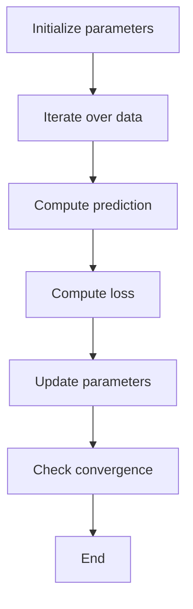

                 


# 《企业级因果发现引擎：AI辅助商业洞察与决策》

## 关键词
- 企业级因果发现引擎
- AI辅助商业洞察
- 数据分析
- 统计学习
- 数学模型

## 摘要
本文深入探讨了企业级因果发现引擎的构建与应用，重点介绍了其核心概念、算法原理、数学模型和实际应用。文章通过逐步分析推理的方式，揭示了因果发现引擎在商业洞察与决策中的重要作用，并对其未来发展趋势和挑战进行了展望。希望通过本文，读者能够对因果发现引擎有一个全面而深入的理解。

---

## 第一部分：因果发现引擎基础

### 第1章：因果发现引擎概述
#### 1.1 因果发现的商业价值
在商业环境中，因果发现具有极高的价值。它能够帮助企业理解变量之间的关系，发现潜在的因果关系，从而指导决策。例如，通过因果发现可以分析广告投放与销售额之间的关系，帮助企业优化营销策略。

#### 1.2 因果发现引擎的基本概念
因果发现引擎是一种利用统计学习和机器学习技术，从大规模数据中挖掘因果关系的工具。它包括数据采集、预处理、模型训练和结果解释等环节。

#### 1.3 因果发现引擎的核心架构
因果发现引擎的核心架构包括数据输入、模型训练和结果输出。其中，模型训练是关键，它通常涉及到因果推断、统计学习和深度学习等技术。

#### 1.4 因果发现引擎的发展趋势
随着人工智能和大数据技术的不断发展，因果发现引擎正逐渐成为企业级应用的重要工具。未来，因果发现引擎将更加智能化、自动化，并在更多领域发挥作用。

---

### 第2章：因果发现算法原理
#### 2.1 算法概述
因果发现算法是因果发现引擎的核心。它包括基于统计学的方法、基于假设检验的方法和基于深度学习的方法。

#### 2.2 因果推断与统计学习
因果推断是因果发现算法的基础。统计学习技术，如回归分析和聚类分析，被广泛应用于因果推断中。

#### 2.3 经典因果发现算法
本文将介绍几种经典因果发现算法，如Pearson相关系数、因果推断树和因果网络等。

#### 2.4 算法比较与选择
不同因果发现算法有其优缺点。本文将比较各种算法的性能，并提供选择建议。

---

### 第3章：数学模型与公式
#### 3.1 因果发现模型的数学基础
因果发现模型通常涉及线性回归、贝叶斯网络和图模型等数学工具。

#### 3.2 因果关系的表示与量化
因果关系可以用概率分布、条件概率和结构方程模型等进行表示和量化。

#### 3.3 因果发现模型的优化策略
优化策略包括梯度下降、随机搜索和遗传算法等。

#### 3.4 latex格式数学公式示例
$$
X = \sum_{i=1}^{n} x_i
$$
$$
P(A|B) = \frac{P(B|A)P(A)}{P(B)}
$$

---

## 第二部分：因果发现引擎构建

### 第4章：构建因果发现引擎
#### 4.1 系统设计
系统设计包括数据采集模块、模型训练模块和结果解释模块。

#### 4.2 数据收集与预处理
数据收集包括从各种数据源获取数据，预处理包括数据清洗、去噪和归一化等。

#### 4.3 模型训练与优化
模型训练涉及选择合适的算法和优化策略，优化模型性能。

#### 4.4 模型评估与验证
模型评估和验证是确保模型性能的重要步骤。

---

### 第5章：核心算法实现
#### 5.1 伪代码示例
```
Initialize model parameters
for each iteration do
    Compute model prediction
    Compute loss function
    Update model parameters
end for
```

#### 5.2 算法流程图（Mermaid格式）


#### 5.3 算法细节解析
算法细节包括参数初始化、损失函数选择和参数更新策略等。

#### 5.4 性能优化与调试技巧
性能优化包括使用并行计算和GPU加速等，调试技巧包括调试工具选择和错误诊断等。

---

### 第6章：工具与框架
#### 6.1 开发环境搭建
搭建开发环境包括安装Python、Jupyter Notebook和相关的库等。

#### 6.2 主流因果发现框架介绍
介绍主流的因果发现框架，如CausalML、DoWhy和CausalInference等。

#### 6.3 自定义工具开发
开发自定义工具，以满足特定需求。

#### 6.4 工具选择与配置
根据需求选择合适的工具，并进行配置。

---

## 第三部分：因果发现引擎应用

### 第7章：商业案例解析
#### 7.1 因果发现引擎在市场营销中的应用
分析市场营销中因果发现的应用，如广告投放效果分析。

#### 7.2 因果发现引擎在供应链管理中的应用
分析供应链管理中因果发现的应用，如需求预测和库存管理。

#### 7.3 因果发现引擎在客户关系管理中的应用
分析客户关系管理中因果发现的应用，如客户流失预测和满意度分析。

#### 7.4 案例分析与总结
对上述案例进行综合分析，总结因果发现引擎在商业应用中的优势和挑战。

---

### 第8章：项目实战
#### 8.1 实践项目规划
制定实践项目的规划，包括目标设定、资源分配和时间安排等。

#### 8.2 数据获取与处理
获取所需数据，并进行预处理，包括数据清洗、去噪和归一化等。

#### 8.3 模型训练与调参
训练模型，并进行调参，以提高模型性能。

#### 8.4 模型部署与监控
将模型部署到生产环境中，并进行监控，以确保模型稳定运行。

#### 8.5 项目评估与优化
评估项目效果，并根据评估结果进行优化。

---

## 第四部分：未来趋势与挑战

### 第9章：未来发展趋势
#### 9.1 新技术的引入与影响
探讨新技术（如深度学习和强化学习）在因果发现中的应用及其影响。

#### 9.2 因果发现引擎的创新应用
探讨因果发现引擎在新兴领域的创新应用，如金融科技和健康医疗。

#### 9.3 行业发展趋势预测
预测因果发现引擎在未来的发展趋势。

---

### 第10章：潜在挑战与解决方案
#### 10.1 数据隐私与伦理问题
探讨数据隐私和伦理问题，并提出解决方案。

#### 10.2 可解释性与透明度
讨论因果发现引擎的可解释性和透明度问题，并提出改进方法。

#### 10.3 技术普及与人才需求
分析因果发现引擎的技术普及程度和人才需求状况。

#### 10.4 面向未来的解决方案
提出面向未来的解决方案，以应对潜在挑战。

---

## 附录：资源与工具

### 附录A：资源链接
提供相关论文、开源代码和工具的链接。

### 附录B：工具指南
提供开发环境搭建指南、主流工具使用教程和自定义工具开发指南。

---

## 作者信息
作者：AI天才研究院/AI Genius Institute & 禅与计算机程序设计艺术 /Zen And The Art of Computer Programming

---

（注：本文章大纲为示例，实际撰写时请根据具体内容进行调整。）

