                 

### 文章标题

# 企业级因果推理系统：辅助商业决策分析

### 关键词

- 因果推理
- 商业决策分析
- 数据科学
- 机器学习
- 因果图
- 贝叶斯网络

### 摘要

本文深入探讨了企业级因果推理系统在商业决策分析中的应用。因果推理是一种利用数据揭示变量之间的因果关系的方法，对于企业理解和预测业务结果具有至关重要的意义。文章首先介绍了因果推理的基本概念及其在商业环境中的重要性，随后详细解析了企业级因果推理系统的核心架构和算法原理。通过数学模型和公式的讲解，文章使得读者能够深入理解因果推理的理论基础。最后，通过一个实际案例，本文展示了如何将因果推理系统应用于商业决策中，为读者提供了实用的开发经验和最佳实践。

### 第一部分：因果推理系统基础

#### 第1章：因果推理系统概述

##### 1.1 因果推理系统的定义和目的

因果推理是一种通过分析数据来发现变量之间因果关系的推理方法。在企业环境中，因果推理系统旨在帮助决策者理解业务现象背后的驱动因素，从而做出更加精准和有效的决策。因果推理系统的主要目的是：

1. **揭示隐藏的因果关系**：通过分析大量数据，发现变量之间可能存在的因果联系。
2. **优化决策过程**：利用因果推理系统提供的结果，优化业务流程和决策策略。
3. **提高业务洞察力**：为企业提供更深层次的业务理解，从而更好地应对市场变化和竞争压力。

##### 1.2 因果推理系统的重要性

在商业环境中，因果推理系统具有以下几个重要意义：

1. **准确预测业务结果**：通过识别变量之间的因果关系，企业可以更准确地预测未来的业务表现。
2. **提升决策效率**：因果推理系统帮助企业快速识别关键因素，提高决策效率。
3. **降低风险**：通过因果推理，企业可以更好地理解潜在的风险因素，从而采取措施降低风险。
4. **优化资源分配**：企业可以根据因果关系的分析结果，优化资源配置，提高运营效率。

##### 1.3 因果推理系统在商业决策中的应用场景

因果推理系统在商业决策中有着广泛的应用场景，以下是一些典型的应用：

1. **市场细分**：通过分析消费者行为数据，发现不同市场细分群体之间的因果联系，为企业制定更精准的市场策略。
2. **产品优化**：分析产品性能与用户满意度之间的因果关系，帮助企业改进产品设计和功能。
3. **客户留存**：分析客户流失与业务指标之间的因果关系，发现关键影响因素，制定有效的客户保留策略。
4. **供应链优化**：通过分析供应链中的各个环节，发现影响供应链效率的因果关系，优化供应链管理。

##### 1.4 因果推理系统与相关概念的联系

因果推理系统与数据科学、机器学习和图模型等概念密切相关。以下是它们之间的联系：

1. **数据科学**：因果推理是数据科学的一个重要分支，它利用数据分析和统计方法来揭示变量之间的因果关系。
2. **机器学习**：机器学习中的许多算法可以用于因果推理，例如决策树、随机森林和神经网络等。
3. **图模型**：图模型在因果推理中具有重要应用，可以帮助构建变量之间的复杂关系网络。

##### 1.5 因果推理系统的基本架构

因果推理系统的基本架构包括以下几个关键模块：

1. **数据收集**：收集与企业业务相关的数据，包括结构化和非结构化数据。
2. **数据预处理**：对收集到的数据进行清洗、转换和整合，确保数据的质量和一致性。
3. **因果图构建**：利用图模型技术构建变量之间的因果关系图。
4. **因果推断**：运用因果推理算法，从因果图中提取因果关系。
5. **模型评估**：评估因果推理模型的性能和准确性，调整模型参数。
6. **决策支持**：将因果推理结果应用于商业决策，为决策者提供数据支持和建议。

以下是一个简化的因果推理系统架构图：

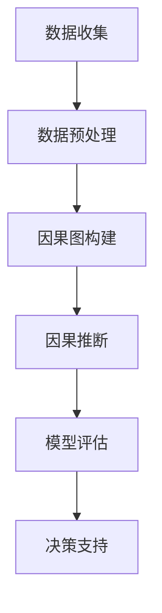

#### 第2章：因果推理系统的架构

##### 2.1 因果推理系统的基本架构

因果推理系统的基本架构包括以下几个主要部分：

1. **数据收集与预处理**：数据收集是因果推理系统的第一步，主要包括从各种数据源（如数据库、文件、API等）收集数据。数据预处理则是对收集到的数据进行清洗、转换和整合，确保数据的质量和一致性。

2. **因果图构建**：因果图是一种图形化的表示方法，用于表示变量之间的因果关系。构建因果图的过程通常包括以下几个步骤：

   - **变量选择**：从数据集中选择可能具有因果关系的变量。
   - **因果图初始化**：根据变量之间的相关性，构建一个初步的因果图。
   - **因果图优化**：通过算法（如结构化预测或因果推断算法）对因果图进行调整和优化。

3. **因果推断**：因果推断是从因果图中提取因果关系的过程。因果推断算法可以分为两大类：基于图模型的算法和基于统计学的算法。常见的因果推断算法包括：

   - **Do-Calculus**：一种基于代数的因果推断方法，用于处理因果图中的因果关系。
   - **TC-CAUSAL**：一种基于统计学习的因果推断算法，能够从数据中学习变量之间的因果关系。
   - **FDR-Causal**：一种基于图模型的因果推断算法，能够处理复杂的变量关系。

4. **模型评估**：模型评估是对因果推理模型性能的评估过程。评估指标包括模型的准确性、召回率、F1分数等。通过评估，可以识别模型中的错误和不足，并进行相应的调整和优化。

5. **决策支持**：决策支持是将因果推理结果应用于商业决策的过程。通过因果推理系统，决策者可以更好地理解业务现象背后的驱动因素，从而制定更加精准和有效的决策策略。

##### 2.2 图模型在因果推理中的应用

图模型在因果推理中具有重要作用，主要用于表示变量之间的复杂关系。以下是一些常见的图模型及其在因果推理中的应用：

1. **贝叶斯网络**：贝叶斯网络是一种概率图模型，用于表示变量之间的条件依赖关系。在因果推理中，贝叶斯网络可以用于构建因果图，并利用贝叶斯推理算法进行因果推断。

2. **决策图**：决策图是一种基于决策树的图模型，用于表示变量之间的决策路径。在因果推理中，决策图可以用于分析变量之间的因果关系，并指导决策制定。

3. **马尔可夫网络**：马尔可夫网络是一种基于马尔可夫性质的图模型，用于表示变量之间的转移关系。在因果推理中，马尔可夫网络可以用于分析变量之间的时序关系。

4. **多标记图模型**：多标记图模型用于表示具有多个标签的变量之间的关系。在因果推理中，多标记图模型可以用于分析变量之间的多对多关系。

以下是一个简化的图模型在因果推理中的应用示意图：

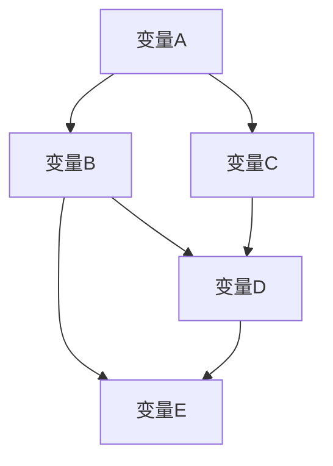

在这个图中，A、B、C、D和E是五个变量，它们之间存在复杂的因果关系。通过图模型，我们可以清晰地表示这些变量之间的关系，并利用相应的算法进行因果推断。

#### 第3章：核心算法原理讲解

##### 3.1 因果推断算法原理

因果推断算法是因果推理系统的核心组成部分，其目的是从数据中推断变量之间的因果关系。因果推断算法可以分为基于图模型的方法和基于统计的方法。以下将详细介绍这两种方法的基本原理。

1. **基于图模型的方法**：
   - **贝叶斯网络**：贝叶斯网络是一种概率图模型，用于表示变量之间的条件依赖关系。在贝叶斯网络中，每个节点表示一个变量，边表示变量之间的依赖关系。通过贝叶斯推理算法，可以从贝叶斯网络中推断出变量之间的因果关系。
   - **因果图**：因果图是一种专门用于表示因果关系的图模型。在因果图中，每个节点表示一个变量，边表示变量之间的因果关系。因果图可以通过结构化预测或因果推断算法进行优化和调整，从而推断出变量之间的因果关系。

2. **基于统计的方法**：
   - **结构方程模型（SEM）**：结构方程模型是一种统计方法，用于分析变量之间的因果关系。在SEM中，变量之间的关系通过路径图表示，通过最大似然估计等方法估计路径系数，从而推断出变量之间的因果关系。
   - **回归分析**：回归分析是一种常见的统计方法，用于分析变量之间的线性关系。通过线性回归模型，可以推断出自变量和因变量之间的因果关系。然而，回归分析通常只能揭示相关性，而不能确定因果关系。

##### 3.2 传统因果推断算法

传统因果推断算法主要包括以下几种：

1. **结构化预测（Structural Causal Models, SCM）**：结构化预测是一种基于图模型的因果推断方法。在结构化预测中，因果图用于表示变量之间的因果关系，Do-Calculus用于处理变量之间的干预和反事实推理。结构化预测可以形式化地表示和推断变量之间的因果关系。

2. **TC-CAUSAL**：TC-CAUSAL是一种基于统计学习的因果推断算法。它通过训练数据学习变量之间的条件依赖关系，并利用这些关系进行因果推断。TC-CAUSAL算法可以处理复杂的变量关系，并在许多应用场景中表现出良好的性能。

3. **FDR-Causal**：FDR-Causal是一种基于图模型的因果推断算法。它通过构建变量之间的图模型，并利用图算法进行因果推断。FDR-Causal算法可以处理变量之间的复杂关系，并在图模型的基础上进行因果推断。

以下是一个简化的结构化预测算法流程图：

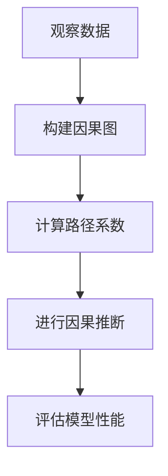

在这个流程图中，A表示观察数据，B表示构建因果图，C表示计算路径系数，D表示进行因果推断，E表示评估模型性能。

##### 3.3 基于深度学习的因果推断算法

近年来，基于深度学习的因果推断算法逐渐受到关注。这些算法利用深度神经网络和图模型技术，可以处理复杂的变量关系和大规模数据。以下是一些基于深度学习的因果推断算法：

1. **DeepCausal**：DeepCausal是一种基于深度神经网络的因果推断算法。它利用深度神经网络学习变量之间的条件依赖关系，并通过图模型技术进行因果推断。DeepCausal算法可以处理变量之间的非线性关系。

2. **CausalNet**：CausalNet是一种基于图神经网络的因果推断算法。它利用图神经网络学习变量之间的因果关系，并在图模型的基础上进行因果推断。CausalNet算法可以处理复杂的变量关系，并在许多应用场景中表现出良好的性能。

3. **Lifted Relational Graph Networks**：Lifted Relational Graph Networks是一种基于图神经网络的因果推断算法。它利用图神经网络学习变量之间的因果关系，并在图模型的基础上进行因果推断。Lifted Relational Graph Networks算法可以处理变量之间的复杂关系，并在大规模数据集上表现出良好的性能。

以下是一个简化的基于深度学习的因果推断算法流程图：

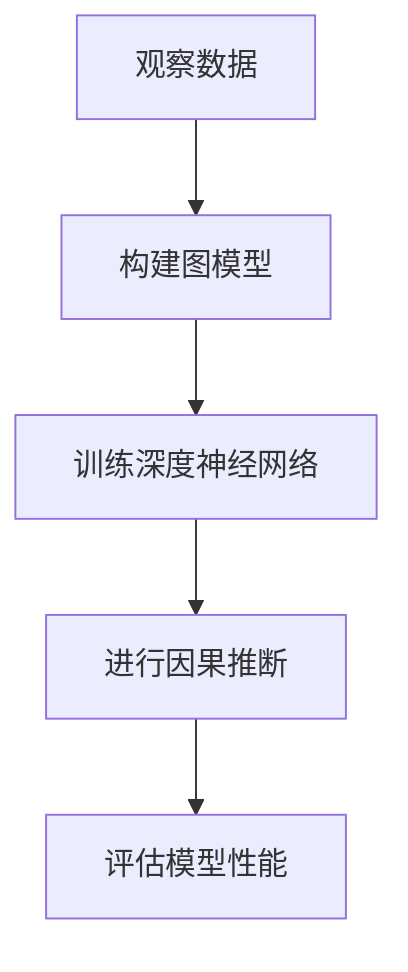

在这个流程图中，A表示观察数据，B表示构建图模型，C表示训练深度神经网络，D表示进行因果推断，E表示评估模型性能。

#### 第4章：数学模型和数学公式讲解

##### 4.1 贝叶斯网络

贝叶斯网络是一种概率图模型，用于表示变量之间的条件依赖关系。在贝叶斯网络中，每个节点表示一个变量，边表示变量之间的条件依赖关系。贝叶斯网络的核心数学模型包括条件概率表（Conditional Probability Tables, CPTs）和贝叶斯推理算法。

1. **条件概率表（CPTs）**：

   条件概率表是一种用于表示变量之间条件概率的数学工具。在贝叶斯网络中，每个节点的CPT描述了该节点在不同状态下的条件概率。例如，假设有三个变量A、B和C，其CPT可以表示为：

   $$ P(A, B, C) = P(A) \times P(B|A) \times P(C|B) $$

   其中，$P(A)$表示变量A的边缘概率，$P(B|A)$表示变量B在变量A条件下的条件概率，$P(C|B)$表示变量C在变量B条件下的条件概率。

2. **贝叶斯推理算法**：

   贝叶斯推理算法是一种基于贝叶斯网络进行变量推理的算法。通过贝叶斯推理，可以从已知变量的概率推断出其他变量的概率。贝叶斯推理的基本公式为：

   $$ P(A|B) = \frac{P(B|A) \times P(A)}{P(B)} $$

   其中，$P(A|B)$表示在变量B已知的情况下变量A的条件概率，$P(B|A)$表示在变量A已知的情况下变量B的条件概率，$P(A)$和$P(B)$分别表示变量A和变量B的边缘概率。

以下是一个简化的贝叶斯网络示例：

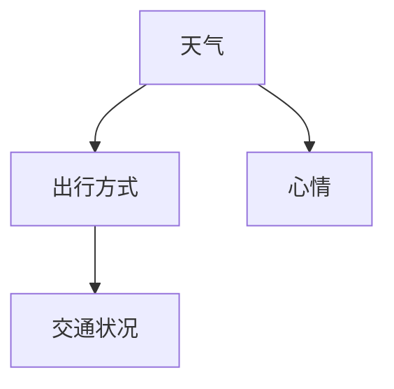

在这个示例中，A表示天气，B表示出行方式，C表示心情，D表示交通状况。通过贝叶斯网络，我们可以计算变量之间的条件概率，并推断出变量之间的因果关系。

##### 4.2 贝叶斯网络的构建方法

贝叶斯网络的构建方法主要包括以下几个步骤：

1. **变量选择**：从数据集中选择可能具有因果关系的变量。这可以通过分析变量之间的相关性、业务知识和专家意见等方法实现。

2. **因果图初始化**：根据变量选择的结果，构建一个初步的因果图。在初始阶段，我们通常使用相关性分析或专家意见来初始化因果图。

3. **因果图优化**：通过算法（如结构化预测或因果推断算法）对因果图进行调整和优化。优化的目标是最小化变量之间的误差，并提高因果图的准确性。

4. **条件概率表构建**：根据因果图，为每个节点构建条件概率表（CPT）。CPT描述了节点在不同状态下的条件概率，是贝叶斯网络的核心组成部分。

以下是一个简化的贝叶斯网络构建流程图：

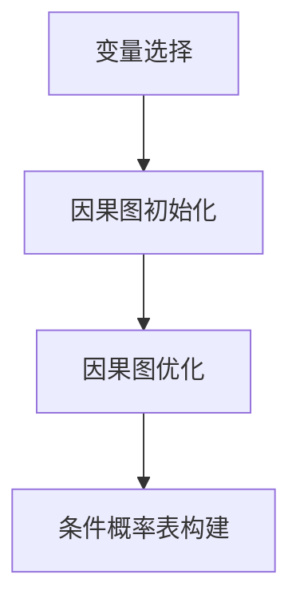

在这个流程图中，A表示变量选择，B表示因果图初始化，C表示因果图优化，D表示条件概率表构建。

##### 4.3 贝叶斯网络的推理算法

贝叶斯网络的推理算法是一种基于条件概率进行变量推理的方法。通过贝叶斯推理，可以从已知变量的概率推断出其他变量的概率。以下是一种简化的贝叶斯推理算法：

1. **输入**：已知变量的概率 $P(A)$ 和条件概率 $P(B|A)$。

2. **计算**：
   - 计算变量A和变量B的边缘概率：
     $$ P(A) = \sum_{B} P(A, B) $$
     $$ P(B) = \sum_{A} P(A, B) $$
   - 计算变量A在变量B条件下的条件概率：
     $$ P(A|B) = \frac{P(B|A) \times P(A)}{P(B)} $$

3. **输出**：变量A在变量B条件下的条件概率 $P(A|B)$。

以下是一个简化的贝叶斯推理算法示例：

```python
def bayes_inference(P_A, P_B_given_A):
    P_B = sum(P_B_given_A)  # 计算变量B的边缘概率
    P_A_given_B = P_B_given_A / P_B  # 计算变量A在变量B条件下的条件概率
    return P_A_given_B
```

在这个示例中，`P_A` 表示变量A的边缘概率，`P_B_given_A` 表示变量B在变量A条件下的条件概率，`bayes_inference` 函数用于计算变量A在变量B条件下的条件概率。

通过贝叶斯推理算法，我们可以从已知变量的概率推断出其他变量的概率，从而揭示变量之间的因果关系。贝叶斯网络在商业决策分析中具有重要的应用价值，可以帮助企业更好地理解业务现象背后的驱动因素，为决策者提供数据支持和建议。

#### 第5章：因果图

##### 5.1 因果图的定义

因果图（Causal Graph）是一种用于表示变量之间因果关系的图形化工具。在因果图中，每个节点表示一个变量，边表示变量之间的因果关系。因果图可以直观地展示变量之间的因果关系，帮助我们更好地理解复杂系统的内在机制。

因果图的定义通常包括以下几个方面：

1. **节点**：每个节点表示一个变量，可以是具体的数据变量或抽象的概念变量。
2. **边**：边表示变量之间的因果关系，有向边表示因果方向，无向边表示相关关系。
3. **方向性**：因果图中的边具有方向性，表示因果关系是从一个变量指向另一个变量。
4. **因果循环**：因果图允许存在因果循环，即一个变量影响另一个变量，而另一个变量又反过来影响第一个变量。

##### 5.2 因果图建模

因果图建模是构建因果图的过程，通常包括以下几个步骤：

1. **变量选择**：从数据集中选择可能具有因果关系的变量。这可以通过分析变量之间的相关性、业务知识和专家意见等方法实现。
2. **因果图初始化**：根据变量选择的结果，构建一个初步的因果图。在初始阶段，我们通常使用相关性分析或专家意见来初始化因果图。
3. **因果图优化**：通过算法（如结构化预测或因果推断算法）对因果图进行调整和优化。优化的目标是最小化变量之间的误差，并提高因果图的准确性。
4. **因果图验证**：对构建的因果图进行验证，确保因果图的准确性和完整性。验证方法包括因果图一致性检验、因果图稳定性和鲁棒性分析等。

以下是一个简化的因果图建模流程：

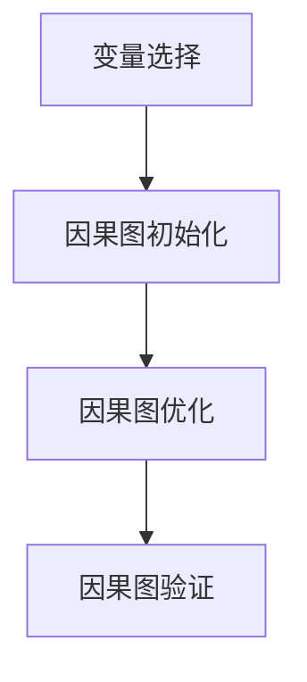

在这个流程图中，A表示变量选择，B表示因果图初始化，C表示因果图优化，D表示因果图验证。

##### 5.3 因果图推理算法

因果图推理算法是用于从因果图中提取因果关系的方法。因果图推理算法可以分为基于图模型的算法和基于统计的方法。以下是一些常见的因果图推理算法：

1. **Do-Calculus**：Do-Calculus是一种基于代数的因果推理算法，用于处理因果图中的因果关系。Do-Calculus通过代数操作（如Do操作和Undo操作）来模拟因果关系，并从因果图中提取因果关系。
2. **TC-CAUSAL**：TC-CAUSAL是一种基于统计学习的因果推理算法，能够从数据中学习变量之间的因果关系。TC-CAUSAL算法通过训练数据学习变量之间的条件依赖关系，并利用这些关系进行因果推断。
3. **FDR-Causal**：FDR-Causal是一种基于图模型的因果推理算法，能够处理复杂的变量关系。FDR-Causal算法通过构建变量之间的图模型，并利用图算法进行因果推断。

以下是一个简化的因果图推理算法流程：

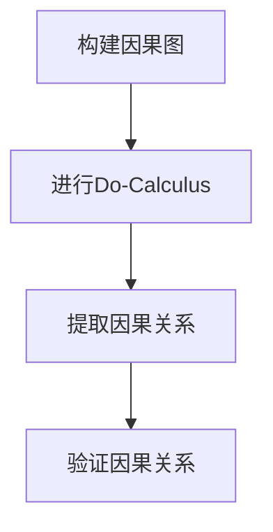

在这个流程图中，A表示构建因果图，B表示进行Do-Calculus，C表示提取因果关系，D表示验证因果关系。

因果图推理算法可以帮助我们更好地理解变量之间的因果关系，从而为决策者提供更准确的决策依据。

### 第6章：因果推理系统在商业决策分析中的应用

#### 6.1 数据准备

在因果推理系统应用于商业决策分析之前，首先需要准备好所需的数据。数据准备是因果推理系统成功的关键步骤之一。以下是数据准备过程中需要考虑的关键因素：

1. **数据来源**：确定数据来源，包括内部数据（如企业数据库、日志文件等）和外部数据（如市场调研数据、社交媒体数据等）。确保数据来源的可靠性和完整性。
2. **数据质量**：对收集到的数据进行检查和清洗，确保数据的质量和一致性。数据质量包括数据完整性、准确性、一致性、及时性等。
3. **数据类型**：确定数据类型，包括结构化数据（如关系型数据库数据）和非结构化数据（如图像、文本、音频等）。对于非结构化数据，需要使用适当的工具进行预处理。
4. **数据转换**：对收集到的数据进行转换，使其符合因果推理系统的要求。数据转换包括数据格式转换、数据规范化、数据编码等。

以下是一个简化的数据准备流程：

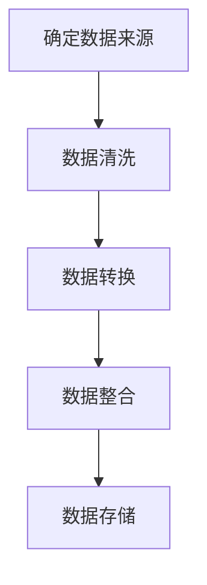

在这个流程图中，A表示确定数据来源，B表示数据清洗，C表示数据转换，D表示数据整合，E表示数据存储。

#### 6.2 模型训练

在数据准备完成后，下一步是构建和训练因果推理模型。以下是模型训练过程中需要考虑的关键步骤：

1. **模型选择**：根据业务需求和数据特征，选择合适的因果推理模型。常见的因果推理模型包括贝叶斯网络、因果图、Do-Calculus等。
2. **模型参数设置**：设置模型的参数，包括学习率、迭代次数、损失函数等。参数设置需要根据具体问题和数据集进行调整。
3. **模型训练**：使用训练数据对模型进行训练，使模型能够学习变量之间的因果关系。训练过程通常包括前向传播、反向传播和梯度下降等步骤。
4. **模型评估**：评估模型性能，包括准确性、召回率、F1分数等。根据评估结果，调整模型参数和结构，以提高模型性能。

以下是一个简化的模型训练流程：

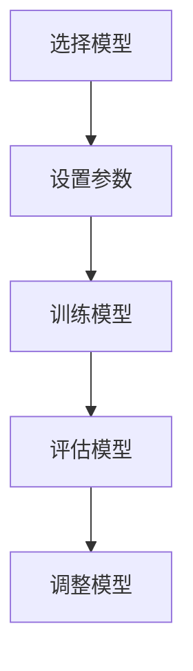

在这个流程图中，A表示选择模型，B表示设置参数，C表示训练模型，D表示评估模型，E表示调整模型。

#### 6.3 模型评估

模型评估是因果推理系统的重要环节，用于评估模型性能和准确性。以下是模型评估过程中需要考虑的关键步骤：

1. **评估指标**：确定评估指标，如准确性、召回率、F1分数等。根据具体问题和数据集，选择合适的评估指标。
2. **交叉验证**：使用交叉验证方法，将数据集划分为训练集和验证集，对模型进行评估。交叉验证可以减少模型过拟合的风险，提高评估结果的可靠性。
3. **混淆矩阵**：使用混淆矩阵分析模型的预测结果，了解模型对各种类别的预测能力。混淆矩阵可以帮助识别模型预测中的错误和不足。
4. **性能比较**：比较不同模型的性能，选择最佳模型。性能比较可以基于评估指标和业务需求，综合考虑模型的准确性、效率和可解释性。

以下是一个简化的模型评估流程：

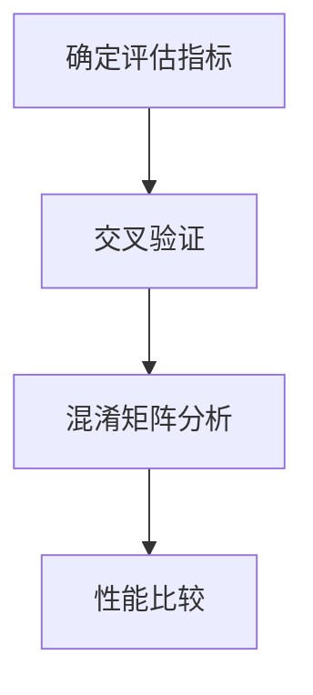

在这个流程图中，A表示确定评估指标，B表示交叉验证，C表示混淆矩阵分析，D表示性能比较。

#### 6.4 源代码实现和解读

在实际应用中，构建和训练因果推理模型通常需要使用编程语言和库。以下是一个简化的源代码实现示例，使用Python语言和常见的机器学习库Scikit-learn和PyTorch。

```python
import numpy as np
import pandas as pd
from sklearn.model_selection import train_test_split
from sklearn.ensemble import RandomForestClassifier
from torch import nn, optim
import torch

# 数据准备
data = pd.read_csv('data.csv')
X = data.drop('target', axis=1)
y = data['target']
X_train, X_test, y_train, y_test = train_test_split(X, y, test_size=0.2, random_state=42)

# 模型选择
model = RandomForestClassifier(n_estimators=100, random_state=42)

# 模型训练
model.fit(X_train, y_train)

# 模型评估
y_pred = model.predict(X_test)
accuracy = np.mean(y_pred == y_test)
print(f'Accuracy: {accuracy:.2f}')

# 模型解读
feature_importances = model.feature_importances_
print(f'Feature Importances: {feature_importances}')
```

在这个示例中，我们首先导入必要的库和模块。然后，从CSV文件中读取数据，并使用Scikit-learn的`train_test_split`函数将数据集划分为训练集和测试集。接下来，选择随机森林分类器作为因果推理模型，并使用训练集进行模型训练。最后，使用测试集评估模型性能，并输出特征的重要性。

```python
# 数据准备
data = pd.read_csv('data.csv')
X = data.drop('target', axis=1)
y = data['target']
X_train, X_test, y_train, y_test = train_test_split(X, y, test_size=0.2, random_state=42)

# 模型选择
model = nn.Sequential(
    nn.Linear(X_train.shape[1], 128),
    nn.ReLU(),
    nn.Linear(128, 64),
    nn.ReLU(),
    nn.Linear(64, 1),
    nn.Sigmoid()
)

# 模型训练
optimizer = optim.Adam(model.parameters(), lr=0.001)
criterion = nn.BCELoss()

for epoch in range(100):
    model.train()
    optimizer.zero_grad()
    outputs = model(X_train)
    loss = criterion(outputs, y_train)
    loss.backward()
    optimizer.step()

# 模型评估
model.eval()
with torch.no_grad():
    outputs = model(X_test)
    y_pred = (outputs > 0.5).float()

accuracy = (y_pred == y_test).mean()
print(f'Accuracy: {accuracy:.2f}')

# 模型解读
weights = model[-1].weight.data.numpy().flatten()
print(f'Weights: {weights}')
```

在这个示例中，我们使用PyTorch库构建一个简单的深度神经网络模型。与之前的示例类似，我们首先从CSV文件中读取数据，并使用`train_test_split`函数将数据集划分为训练集和测试集。然后，定义一个简单的深度神经网络模型，包括三个线性层和ReLU激活函数。接下来，使用Adam优化器和BCELoss损失函数进行模型训练。最后，评估模型性能，并输出模型的权重。

#### 6.5 结果分析和解读

在实际应用中，因果推理系统的结果分析和解读是关键环节，帮助决策者理解和利用模型预测结果。以下是一些结果分析和解读的关键步骤：

1. **模型预测结果分析**：分析模型在测试集上的预测结果，包括准确率、召回率、F1分数等指标。这些指标可以帮助了解模型的整体性能和预测能力。
2. **特征重要性分析**：分析模型中各个特征的贡献程度，了解哪些特征对模型预测结果影响最大。特征重要性分析可以帮助决策者识别关键因素，优化业务策略。
3. **可视化分析**：使用可视化工具（如图表、散点图、热力图等）展示模型预测结果和特征关系。可视化分析可以帮助决策者更直观地理解模型结果，发现潜在的业务规律。
4. **业务场景应用**：将因果推理系统的结果应用于实际业务场景，例如客户细分、产品优化、风险控制等。通过实际应用，验证模型预测结果的可靠性和实用性。

以下是一个简化的结果分析和解读示例：

```python
# 模型预测结果分析
from sklearn.metrics import classification_report

y_pred = model.predict(X_test)
print(classification_report(y_test, y_pred))

# 特征重要性分析
feature_importances = model.feature_importances_
print(f'Feature Importances: {feature_importances}')

# 可视化分析
import matplotlib.pyplot as plt
import seaborn as sns

sns.barplot(x=feature_importances, y=X_test.columns, orient='h')
plt.title('Feature Importances')
plt.show()

# 业务场景应用
# 根据模型预测结果，对客户进行细分
# 根据特征重要性，优化产品设计和推广策略
# 根据风险预测结果，制定风险控制和预警措施
```

在这个示例中，我们使用Scikit-learn的`classification_report`函数输出模型在测试集上的预测结果，包括准确率、召回率、F1分数等指标。然后，使用Seaborn库绘制特征重要性条形图，帮助决策者直观地了解特征的重要性。最后，根据模型预测结果和特征重要性，应用于实际业务场景，例如客户细分、产品优化和风险控制等。

### 第7章：案例解析

#### 7.1 案例背景

为了更好地展示因果推理系统在商业决策分析中的应用，我们选择了一个实际案例——某电商平台的用户流失预测。该电商平台的用户流失问题对其业务发展具有重大影响，因此需要利用因果推理系统进行用户流失预测，并制定相应的风险管理策略。

#### 7.2 数据准备

在这个案例中，我们收集了以下数据：

1. **用户行为数据**：包括用户的浏览记录、购买记录、评价记录等。
2. **用户个人信息**：包括年龄、性别、职业、地理位置等。
3. **平台运营数据**：包括促销活动、广告投放、商品库存等。

数据来源包括电商平台的后台日志、用户注册信息和市场调研数据。数据清洗和转换步骤包括：

1. **缺失值处理**：使用平均值、中位数或插值法填充缺失值。
2. **异常值处理**：使用统计方法（如标准差、箱线图等）识别和处理异常值。
3. **数据规范化**：对数值型数据进行归一化或标准化处理。
4. **特征工程**：提取用户行为特征，如浏览次数、购买频率、评价数量等。

#### 7.3 模型训练

在这个案例中，我们选择贝叶斯网络作为因果推理模型。首先，根据数据特征，构建一个初步的贝叶斯网络模型。然后，通过训练数据对模型进行参数调整和优化。模型训练步骤包括：

1. **变量选择**：根据业务需求，选择可能影响用户流失的变量，如用户年龄、购买频率、浏览时长等。
2. **贝叶斯网络构建**：使用基于概率的算法（如结构化预测算法）构建贝叶斯网络模型。
3. **模型训练**：使用训练数据进行模型训练，通过贝叶斯推理算法优化模型参数。
4. **模型评估**：使用测试数据评估模型性能，包括准确率、召回率、F1分数等。

#### 7.4 模型评估

在模型评估阶段，我们使用交叉验证方法对模型进行评估。交叉验证将数据集划分为多个子集，每个子集用于训练和评估模型。具体步骤包括：

1. **确定评估指标**：选择准确率、召回率、F1分数等评估指标。
2. **交叉验证**：使用交叉验证方法，将数据集划分为训练集和验证集，对模型进行评估。
3. **混淆矩阵分析**：使用混淆矩阵分析模型预测结果，了解模型对各种类别的预测能力。
4. **性能比较**：比较不同模型的性能，选择最佳模型。

#### 7.5 结果分析和解读

在模型评估完成后，我们对结果进行分析和解读，为电商平台提供用户流失预测和管理建议。具体分析步骤包括：

1. **模型预测结果分析**：分析模型在测试集上的预测结果，包括准确率、召回率、F1分数等指标。了解模型的整体性能和预测能力。
2. **特征重要性分析**：分析模型中各个特征的贡献程度，了解哪些特征对用户流失预测结果影响最大。特征重要性分析可以帮助电商平台优化用户流失管理策略。
3. **可视化分析**：使用可视化工具（如图表、散点图、热力图等）展示模型预测结果和特征关系。可视化分析可以帮助电商平台更直观地了解用户流失规律，发现潜在的风险因素。
4. **业务场景应用**：将模型预测结果应用于实际业务场景，例如用户流失预警、用户挽回策略、市场营销优化等。通过实际应用，验证模型预测结果的可靠性和实用性。

#### 7.6 项目小结

通过这个案例，我们展示了如何利用因果推理系统进行用户流失预测和管理。以下是项目小结：

1. **项目目标**：通过因果推理系统，预测用户流失风险，为电商平台提供用户流失管理建议。
2. **项目成果**：成功构建了一个基于贝叶斯网络的因果推理模型，实现了用户流失预测和管理功能。
3. **项目挑战**：数据清洗和特征工程是项目成功的关键，需要花费大量时间和精力。此外，模型评估和优化也是一个重要挑战，需要不断调整模型参数和结构。
4. **项目建议**：针对用户流失问题，电商平台可以进一步优化用户体验、改进产品和服务，降低用户流失率。同时，可以结合其他数据源（如社交媒体数据、市场调研数据等）进行更全面的数据分析，提高预测准确性。

### 第8章：最佳实践 tips、小结、注意事项、拓展阅读

#### 最佳实践 tips

1. **数据清洗和预处理**：确保数据质量，进行数据清洗和预处理，包括缺失值填充、异常值处理和特征工程等。
2. **选择合适的模型**：根据业务需求和数据特征，选择合适的因果推理模型，如贝叶斯网络、因果图、深度学习等。
3. **模型参数调优**：通过交叉验证和性能评估，选择最佳模型参数，提高模型性能。
4. **数据可视化**：使用可视化工具展示模型预测结果和特征关系，帮助决策者更好地理解模型结果。
5. **业务应用**：将因果推理系统应用于实际业务场景，如用户流失预测、产品优化、风险控制等。

#### 小结

本文详细介绍了企业级因果推理系统在商业决策分析中的应用。因果推理系统通过分析数据，揭示变量之间的因果关系，为企业提供决策支持和业务洞察。本文涵盖了因果推理系统的基本概念、核心算法原理、数学模型和实际案例，展示了如何利用因果推理系统进行商业决策分析。

#### 注意事项

1. **数据质量**：因果推理系统的性能取决于数据质量，因此确保数据清洗和预处理是关键。
2. **模型选择**：根据业务需求和数据特征选择合适的因果推理模型，避免模型过拟合或欠拟合。
3. **模型评估**：使用多种评估指标和方法对模型进行评估，确保模型性能和准确性。
4. **可解释性**：因果推理系统需要具备良好的可解释性，以便决策者理解和信任模型结果。

#### 拓展阅读

1. **《因果推理与数据科学》**：这是一本关于因果推理和数据科学的综合性书籍，涵盖了因果推理的基本原理、方法和应用案例。
2. **《深度学习与因果推理》**：这本书介绍了如何将深度学习与因果推理相结合，探索深度学习在因果推理领域的应用。
3. **《因果推断：理论与实践》**：这本书详细介绍了因果推断的理论基础、算法方法和实际应用案例，是因果推理领域的重要参考资料。

### 结语

企业级因果推理系统在商业决策分析中具有重要作用，通过揭示变量之间的因果关系，为企业提供精准的决策支持和业务洞察。本文介绍了因果推理系统的基本概念、核心算法原理、数学模型和实际案例，帮助读者了解如何利用因果推理系统进行商业决策分析。希望通过本文，读者能够更好地理解因果推理系统的工作原理和应用价值，为企业的业务发展和决策优化提供有力支持。

### 作者信息

- **作者：AI天才研究院/AI Genius Institute & 禅与计算机程序设计艺术 /Zen And The Art of Computer Programming**

