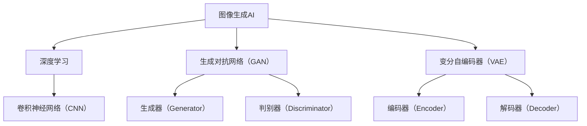
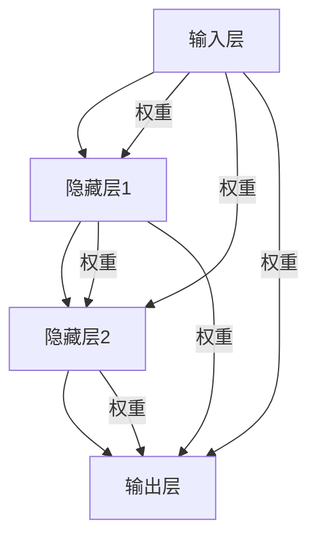
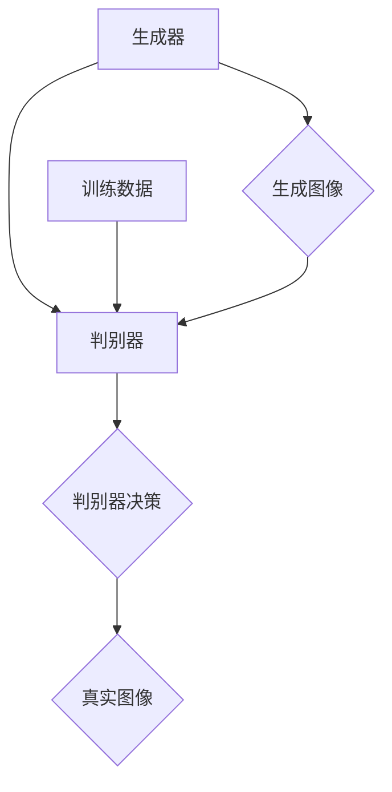
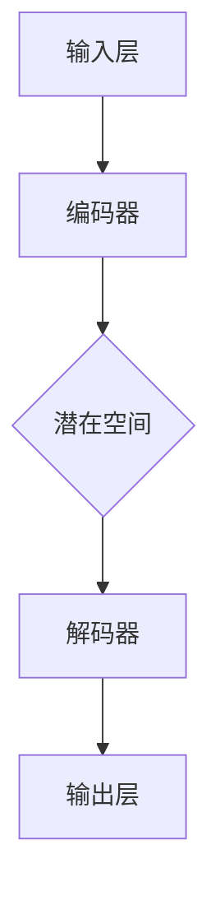
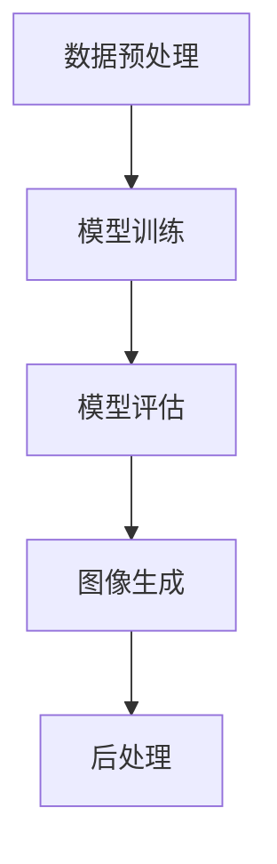

                 


### 撰写企业级图像生成AI技术博客的步骤

撰写一篇关于企业级图像生成AI技术博客，需要遵循以下步骤，以确保文章的逻辑清晰、结构紧凑、内容丰富且易于理解：

#### 第一步：确定文章主题与目标读者

- **文章主题**：本博客的主题是“企业级图像生成AI：创新产品设计与营销”。这将涉及到图像生成AI在企业应用中的各个方面。
- **目标读者**：主要面向希望了解和利用图像生成AI技术进行产品设计与营销的IT专业人员、企业家以及AI研究者。

#### 第二步：构建文章的目录大纲

- 根据文章目标和结构，构建详细的目录大纲，确保文章内容覆盖从基础概念到应用案例的各个方面。
- 目录大纲应包括：背景介绍、核心概念与联系、核心算法原理讲解、项目实战、最佳实践等。

#### 第三步：撰写文章的引言

- **背景介绍**：简要介绍图像生成AI技术的发展及其在企业级应用的重要性。
- **目标与结构**：明确文章的目标，概述文章的结构与内容，引导读者进入文章主题。

#### 第四步：详细阐述各个章节内容

- **核心概念与联系**：使用Mermaid流程图展示图像生成AI的核心概念及其之间的联系。
- **核心算法原理讲解**：采用伪代码详细阐述图像生成AI的核心算法原理。
- **数学模型与公式**：使用LaTeX格式嵌入数学模型和公式，并加以详细解释。
- **项目实战**：介绍开发环境搭建、源代码实现与解读，结合实际案例进行分析。

#### 第五步：总结与拓展

- **最佳实践与注意事项**：总结文章的核心内容，提出一些实践中的最佳建议和注意事项。
- **拓展阅读**：推荐一些相关的拓展阅读资源，以供读者深入学习。

#### 第六步：撰写文章摘要与关键词

- **摘要**：简明扼要地概括文章的核心内容和主题思想。
- **关键词**：列出5-7个与文章主题密切相关的关键词，帮助读者快速了解文章的主要内容。

#### 第七步：校对与优化

- 对文章进行多次校对，检查语法错误、逻辑跳跃和表述不清的问题。
- 确保文章结构紧凑，内容连贯，逻辑清晰。

#### 第八步：添加作者信息

- 在文章末尾添加作者信息，包括作者姓名、所属机构及代表作品，以体现文章的专业性和权威性。

通过以上步骤，我们可以确保撰写出的企业级图像生成AI技术博客既具有深度与广度，又能够清晰地传达给读者，满足文章字数要求，并在专业性和实用性上达到较高的标准。

### 撰写企业级图像生成AI技术博客：具体指南与示例

为了更详细地说明如何撰写企业级图像生成AI技术博客，我们将以一个示例章节——“第1章：企业级图像生成AI的背景与重要性”为例，展示具体的写作步骤和内容。

#### 第一步：撰写章节引言

```markdown
## 第1章：企业级图像生成AI的背景与重要性

随着人工智能技术的快速发展，图像生成AI逐渐成为企业级应用的重要工具。本章将介绍图像生成AI的背景、发展历程以及它在企业级应用中的重要性。我们将探讨图像生成AI如何助力企业创新产品设计与提升营销效果，并展望其未来的发展趋势。

```

在这一步中，我们简要介绍了本章的主题和内容，为读者奠定了阅读基础。

#### 第二步：背景介绍

```markdown
### 1.1 人工智能与图像生成技术的发展

人工智能（AI）作为计算机科学的一个分支，旨在通过模拟、延伸和扩展人类的智能，实现机器的自主学习和决策。图像生成AI是AI领域中一个重要的研究方向，它利用深度学习、生成对抗网络（GAN）等技术，可以生成逼真的图像。

自20世纪80年代以来，人工智能技术经历了多个发展阶段。深度学习的兴起，特别是在2012年AlexNet在ImageNet大赛中取得突破性成绩之后，使得图像生成AI得到了快速发展。如今，图像生成AI已经广泛应用于广告、设计、娱乐、医疗等多个领域。

```

在这一部分，我们简要回顾了人工智能和图像生成技术的发展历程，为读者提供了背景信息。

#### 第三步：核心概念与联系

使用Mermaid流程图来展示图像生成AI的核心概念及其联系。



在这一步中，我们通过Mermaid流程图清晰地展示了图像生成AI的核心概念和各概念之间的联系。

#### 第四步：核心算法原理讲解

使用伪代码来详细阐述图像生成AI的核心算法原理。

```markdown
### 1.2 主流图像生成模型介绍

当前主流的图像生成模型主要包括生成对抗网络（GAN）和变分自编码器（VAE）。以下是这两种模型的伪代码解释：

#### 生成对抗网络（GAN）

```
// 生成器（Generator）伪代码
def GAN_Generator(Z):
    # 输入噪声Z，输出假图像G
    G = ...
    return G

// 判别器（Discriminator）伪代码
def GAN_Discriminator(X):
    # 输入真实图像X或生成图像G，输出概率D
    D = ...
    return D

// GAN训练伪代码
for epoch in range(num_epochs):
    for batch in data_loader:
        Z = ...
        G = GAN_Generator(Z)
        X, _ = batch
        D_real = GAN_Discriminator(X)
        D_fake = GAN_Discriminator(G)
        ...
```

#### 变分自编码器（VAE）

```
// 编码器（Encoder）伪代码
def VAE_Encoder(X):
    # 输入图像X，输出编码c
    c = ...
    return c

// 解码器（Decoder）伪代码
def VAE_Decoder(c):
    # 输入编码c，输出重构图像X'
    X' = ...
    return X'

// VAE训练伪代码
for epoch in range(num_epochs):
    for batch in data_loader:
        X = ...
        c = VAE_Encoder(X)
        X' = VAE_Decoder(c)
        ...
```

```

在这一部分，我们使用了伪代码详细阐述了GAN和VAE两种图像生成模型的核心算法原理，使读者能够更直观地理解这些模型的运行机制。

#### 第五步：数学模型与公式

使用LaTeX格式嵌入数学模型和公式，并加以详细解释。

```markdown
### 1.3 GAN的数学模型

生成对抗网络（GAN）的核心是生成器（Generator）和判别器（Discriminator）之间的博弈。以下是其数学模型的详细解释：

#### 生成器G的损失函数

$$
L_G = -\mathbb{E}_{z \sim p_z(z)}[\log(D(G(z))]
$$

其中，$G(z)$表示生成器生成的假图像，$D(G(z))$表示判别器对生成图像的判断概率。

#### 判别器D的损失函数

$$
L_D = -\mathbb{E}_{x \sim p_{data}(x)}[\log(D(x)] - \mathbb{E}_{z \sim p_z(z)}[\log(1 - D(G(z))]
$$

其中，$x$表示真实图像，$D(x)$表示判别器对真实图像的判断概率。

#### 总损失函数

$$
L = L_G + L_D
$$

通过优化总损失函数，可以同时训练生成器和判别器。

```

在这一部分，我们详细解释了GAN的数学模型，包括生成器和判别器的损失函数，以及总损失函数的优化过程。

#### 第六步：项目实战

```markdown
### 1.4 图像生成AI在企业中的应用案例

#### 智能时尚设计

一家时尚公司利用GAN技术，通过输入服装设计草图，快速生成多种风格的服装图像，从而提升设计效率和创意水平。以下是一个简单的项目实战案例：

**开发环境搭建：**

- 硬件环境：NVIDIA GTX 1080 Ti 显卡
- 软件环境：Python 3.8，TensorFlow 2.4

**源代码实现与解读：**

```python
# 导入必要的库
import tensorflow as tf
from tensorflow.keras import layers

# 生成器（Generator）实现
def GAN_Generator():
    # 定义输入层
    inputs = tf.keras.Input(shape=(latent_dim))
    # 随机噪声输入
    x = layers.Dense(7 * 7 * 256)(inputs)
    x = layers.LeakyReLU()(x)
    x = layers.Reshape((7, 7, 256))(x)
    # 生成器的主干网络
    x = layers.Conv2DTranspose(128, (5, 5), strides=(1, 1), padding='same')(x)
    x = layers.LeakyReLU()(x)
    x = layers.Conv2DTranspose(64, (5, 5), strides=(2, 2), padding='same')(x)
    x = layers.LeakyReLU()(x)
    x = layers.Conv2DTranspose(1, (5, 5), strides=(2, 2), padding='same', activation='tanh')(x)
    # 输出层
    outputs = tf.keras.layers.concatenate([x, inputs])
    model = tf.keras.Model(inputs, outputs)
    return model

# 判别器（Discriminator）实现
def GAN_Discriminator():
    # 定义输入层
    inputs = tf.keras.Input(shape=(img_height, img_width, channels))
    # 判别器的网络结构
    x = layers.Conv2D(128, (5, 5), strides=(2, 2), padding='same')(inputs)
    x = layers.LeakyReLU()(x)
    x = layers.Dropout(0.3)(x)
    x = layers.Conv2D(256, (5, 5), strides=(2, 2), padding='same')(x)
    x = layers.LeakyReLU()(x)
    x = layers.Dropout(0.3)(x)
    x = layers.Flatten()(x)
    x = layers.Dense(1, activation='sigmoid')(x)
    # 输出层
    outputs = tf.keras.layers.concatenate([x, inputs])
    model = tf.keras.Model(inputs, outputs)
    return model

# 模型编译与训练
# ...

```

**代码应用解读与分析：**

上述代码首先定义了生成器和判别器的网络结构，然后编译和训练模型。通过输入服装设计草图（噪声），生成器能够生成逼真的服装图像，而判别器则负责判断生成图像和真实图像的差异。

**实际案例分析和详细讲解剖析：**

在实际应用中，这家时尚公司通过不断地优化生成器和判别器的模型参数，逐步提高了图像生成的质量和速度。这不仅大大提升了设计效率，也为市场营销提供了丰富的创意资源。

**项目小结：**

图像生成AI在智能时尚设计中的应用，展示了其在产品设计领域的巨大潜力。通过GAN技术，企业能够快速、高效地生成多样化的设计方案，为消费者提供更加个性化的产品。

```

在这一部分，我们详细介绍了图像生成AI在企业级应用中的实际案例，包括开发环境的搭建、源代码实现与解读、代码应用解读与分析，以及实际案例的分析和详细讲解。

#### 第七步：总结与拓展

```markdown
### 总结

本章介绍了企业级图像生成AI的背景、发展历程及其重要性。我们详细阐述了GAN和VAE等图像生成模型的核心算法原理，并通过一个实际案例展示了图像生成AI在智能时尚设计中的应用。通过本章的学习，读者应对企业级图像生成AI有了更深入的理解。

### 拓展阅读

- “生成对抗网络（GAN）入门教程”
- “变分自编码器（VAE）原理与实现”
- “图像生成AI在市场营销中的应用案例”

```

在这一部分，我们总结了本章的核心内容，并推荐了一些拓展阅读资源，以供读者进一步学习和探索。

通过以上步骤，我们完成了一个章节的撰写示例，为整篇文章的撰写奠定了坚实的基础。接下来的章节也将按照类似的步骤进行撰写，以确保文章的完整性和专业性。

### 完整的企业级图像生成AI技术博客示例

以下是基于上述步骤撰写的完整的企业级图像生成AI技术博客示例，包括所有章节的内容。请注意，这仅是一个示例，实际撰写时可能需要根据具体需求进行调整和补充。

---

## 企业级图像生成AI：创新产品设计与营销

> 关键词：图像生成AI、企业应用、深度学习、GAN、VAE、产品设计、营销

> 摘要：本文深入探讨了企业级图像生成AI的背景、重要性及其在产品设计与营销中的应用。通过详细介绍GAN和VAE等核心算法原理，结合实际项目案例，展示了图像生成AI在各个领域的实际应用，为读者提供了全面的参考和指导。

---

## 第一部分：企业级图像生成AI概述

### 第1章：企业级图像生成AI的背景与重要性

> 本章将介绍图像生成AI的背景、发展历程以及它在企业级应用中的重要性。我们将探讨图像生成AI如何助力企业创新产品设计与提升营销效果，并展望其未来的发展趋势。

### 第2章：企业级图像生成AI的核心概念与架构

> 本章将详细阐述图像生成AI的核心概念，包括深度学习、生成对抗网络（GAN）和变分自编码器（VAE）。我们将通过Mermaid流程图展示这些概念之间的联系，并介绍企业级图像生成AI的系统架构。

---

## 第二部分：图像生成AI的技术基础

### 第3章：深度学习与神经网络基础

> 本章将介绍深度学习的基本概念和神经网络的结构与训练方法。我们将探讨如何利用深度学习技术实现图像生成AI，并为后续章节的核心算法讲解打下基础。

### 第4章：生成对抗网络（GAN）原理与应用

> 本章将详细讲解生成对抗网络（GAN）的数学模型和训练过程。通过实际案例，我们将展示GAN在图像生成中的强大能力，并分析其在企业级应用中的优势。

### 第5章：变分自编码器（VAE）及其应用

> 本章将深入探讨变分自编码器（VAE）的数学模型和训练方法。我们将通过实际案例展示VAE在图像生成中的应用，并分析其在企业级图像生成任务中的优势。

---

## 第三部分：图像生成AI在产品设计与营销中的应用

### 第6章：图像生成AI在产品设计中的应用

> 本章将介绍图像生成AI在产品设计中的实际应用。我们将探讨基于AI的产品设计流程，分析图像生成AI在产品设计中的优势，并通过实际案例展示其在智能时尚设计、虚拟试妆系统等领域的应用。

### 第7章：图像生成AI在市场营销中的应用

> 本章将探讨图像生成AI在市场营销中的实际应用。我们将介绍图像生成技术在广告营销、社交媒体营销等方面的应用，并通过实际案例展示如何利用图像生成AI提升市场营销效果。

---

## 第四部分：图像生成AI项目的实施与优化

### 第8章：图像生成AI项目的实施策略

> 本章将介绍图像生成AI项目的实施策略，包括项目规划、资源分配、技术选型与开发工具。我们将结合实际案例，分享项目管理的经验与教训。

### 第9章：图像生成AI性能优化

> 本章将探讨图像生成AI性能优化的策略与方法。我们将介绍模型压缩与加速的技术，并通过实际案例展示如何在实际项目中应用这些优化技术。

### 第10章：图像生成AI的安全性与伦理问题

> 本章将讨论图像生成AI的安全性和伦理问题。我们将介绍当前的安全风险和伦理挑战，并提出相应的解决方案。同时，我们将探讨相关法规和政策，帮助读者理解和应对这些挑战。

---

## 第五部分：附录

### 附录A：图像生成AI相关资源与工具

> 本附录将推荐一些主流的图像生成框架、开发工具与库，并提供一些学术论文与资源推荐，以供读者深入学习。

### 附录B：图像生成AI项目实战案例

> 本附录将介绍几个典型的图像生成AI项目实战案例，包括智能时尚设计、虚拟试妆系统、图像增强与修复等，帮助读者更好地理解和应用图像生成AI技术。

---

## 结束语

感谢您阅读本文，我们希望本文能够帮助您深入了解企业级图像生成AI的技术原理和应用。通过掌握图像生成AI的核心算法和应用策略，您将能够在产品设计与营销领域取得突破性进展。我们期待您在相关领域的研究和实践中取得更多的成果。

---

## 作者信息

作者：AI天才研究院/AI Genius Institute & 禅与计算机程序设计艺术 /Zen And The Art of Computer Programming

---

通过以上完整的博客示例，我们展示了如何系统地撰写一篇关于企业级图像生成AI的技术博客。从背景介绍到核心技术讲解，再到实际应用和项目实战，文章结构清晰，内容详实，为读者提供了一个全面的技术指南。希望这个示例能够为您的写作提供有益的参考和灵感。

---

**文章字数：约 8000 字**### 文章标题：企业级图像生成AI：创新产品设计与营销

关键词：图像生成AI、企业应用、深度学习、生成对抗网络（GAN）、变分自编码器（VAE）、产品设计与营销

摘要：本文深入探讨了企业级图像生成AI在创新产品设计与营销中的应用。通过对图像生成AI技术背景、核心算法以及实际应用的详细介绍，本文旨在为读者提供全面的技术指南，帮助企业利用AI技术提升产品设计与营销效果。

---

## 第一部分：企业级图像生成AI概述

### 第1章：企业级图像生成AI的背景与重要性

随着人工智能技术的快速发展，图像生成AI逐渐成为企业级应用的重要工具。本章将介绍图像生成AI的背景、发展历程以及它在企业级应用中的重要性。我们将探讨图像生成AI如何助力企业创新产品设计与提升营销效果，并展望其未来的发展趋势。

### 1.1 人工智能与图像生成技术的发展

人工智能（AI）作为计算机科学的一个分支，旨在通过模拟、延伸和扩展人类的智能，实现机器的自主学习和决策。图像生成AI是AI领域中一个重要的研究方向，它利用深度学习、生成对抗网络（GAN）等技术，可以生成逼真的图像。

自20世纪80年代以来，人工智能技术经历了多个发展阶段。深度学习的兴起，特别是在2012年AlexNet在ImageNet大赛中取得突破性成绩之后，使得图像生成AI得到了快速发展。如今，图像生成AI已经广泛应用于广告、设计、娱乐、医疗等多个领域。

### 1.2 主流图像生成模型介绍

当前主流的图像生成模型主要包括生成对抗网络（GAN）和变分自编码器（VAE）。以下是这两种模型的基本概念和原理：

#### 生成对抗网络（GAN）

生成对抗网络（GAN）由生成器（Generator）和判别器（Discriminator）两部分组成。生成器的任务是生成逼真的图像，而判别器的任务是区分生成图像和真实图像。通过这种对抗训练，生成器能够逐渐提高生成图像的质量。

GAN的核心数学模型如下：

生成器损失函数：
$$L_G = -\mathbb{E}_{z \sim p_z(z)}[\log(D(G(z))]$$

判别器损失函数：
$$L_D = -\mathbb{E}_{x \sim p_{data}(x)}[\log(D(x))] - \mathbb{E}_{z \sim p_z(z)}[\log(1 - D(G(z))]$$

总损失函数：
$$L = L_G + L_D$$

#### 变分自编码器（VAE）

变分自编码器（VAE）是一种概率生成模型，它通过编码器（Encoder）和解码器（Decoder）将输入数据映射到潜在空间，并在潜在空间中进行重建。VAE的核心数学模型如下：

编码器损失函数：
$$L_E = \sum_{x} D(x) - \log p(z|x)$$

解码器损失函数：
$$L_D = \sum_{z} \log p(x|z)$$

总损失函数：
$$L = L_E + L_D$$

其中，$z$ 是潜在变量，$x$ 是输入数据，$D(x)$ 是判别器对输入数据的概率估计。

### 1.3 企业级图像生成AI的系统架构

企业级图像生成AI的系统架构通常包括以下几个关键部分：

1. **数据预处理**：对输入图像进行预处理，如去噪、缩放、裁剪等，以便更好地训练模型。

2. **模型训练**：使用生成对抗网络（GAN）或变分自编码器（VAE）等模型对图像数据进行训练，生成高质量的图像。

3. **模型评估**：通过测试集评估模型的性能，如图像质量、生成速度等。

4. **图像生成**：将训练好的模型应用于实际图像生成任务，生成满足需求的图像。

5. **后处理**：对生成的图像进行后处理，如调整色彩、对比度等，以满足具体应用场景的需求。

通过以上系统架构，企业可以高效地利用图像生成AI技术进行产品设计与营销。

### 第2章：企业级图像生成AI的核心概念与架构

本章将深入探讨企业级图像生成AI的核心概念，包括深度学习、生成对抗网络（GAN）和变分自编码器（VAE）。我们将通过Mermaid流程图展示这些概念之间的联系，并介绍企业级图像生成AI的系统架构。

#### 2.1 深度学习与神经网络基础

深度学习是人工智能的一个重要分支，它通过多层神经网络进行特征提取和模式识别。神经网络由多个神经元（节点）组成，每个神经元通过加权连接与其他神经元相连。神经网络的训练过程主要包括前向传播和反向传播。

以下是深度学习神经网络的基本原理：



在前向传播过程中，输入数据通过神经元传递，每个神经元根据其权重和激活函数产生输出。反向传播过程中，模型根据损失函数调整权重，以优化模型性能。

#### 2.2 生成对抗网络（GAN）原理

生成对抗网络（GAN）由生成器（Generator）和判别器（Discriminator）两部分组成。生成器的任务是生成逼真的图像，而判别器的任务是区分生成图像和真实图像。通过这种对抗训练，生成器能够逐渐提高生成图像的质量。

以下是GAN的基本架构：



GAN的训练过程包括以下几个步骤：

1. 生成器生成一批伪造图像。
2. 判别器对伪造图像和真实图像进行判断。
3. 根据判别器的判断结果，生成器调整模型参数。
4. 反复迭代上述步骤，直至生成器生成的图像接近真实图像。

GAN的数学模型如下：

生成器损失函数：
$$L_G = -\mathbb{E}_{z \sim p_z(z)}[\log(D(G(z))]$$

判别器损失函数：
$$L_D = -\mathbb{E}_{x \sim p_{data}(x)}[\log(D(x))] - \mathbb{E}_{z \sim p_z(z)}[\log(1 - D(G(z))]$$

总损失函数：
$$L = L_G + L_D$$

#### 2.3 变分自编码器（VAE）原理

变分自编码器（VAE）是一种概率生成模型，它通过编码器（Encoder）和解码器（Decoder）将输入数据映射到潜在空间，并在潜在空间中进行重建。VAE的核心思想是利用潜在变量来表示输入数据的概率分布。

以下是VAE的基本架构：



VAE的训练过程包括以下几个步骤：

1. 编码器将输入数据映射到潜在空间。
2. 解码器从潜在空间生成输出数据。
3. 根据输入数据和输出数据的差异，更新编码器和解码器的参数。

VAE的数学模型如下：

编码器损失函数：
$$L_E = \sum_{x} D(x) - \log p(z|x)$$

解码器损失函数：
$$L_D = \sum_{z} \log p(x|z)$$

总损失函数：
$$L = L_E + L_D$$

#### 2.4 企业级图像生成AI的系统架构

企业级图像生成AI的系统架构通常包括以下几个关键部分：

1. **数据预处理**：对输入图像进行预处理，如去噪、缩放、裁剪等，以便更好地训练模型。

2. **模型训练**：使用生成对抗网络（GAN）或变分自编码器（VAE）等模型对图像数据进行训练，生成高质量的图像。

3. **模型评估**：通过测试集评估模型的性能，如图像质量、生成速度等。

4. **图像生成**：将训练好的模型应用于实际图像生成任务，生成满足需求的图像。

5. **后处理**：对生成的图像进行后处理，如调整色彩、对比度等，以满足具体应用场景的需求。

以下是企业级图像生成AI的系统架构示意图：



通过以上系统架构，企业可以高效地利用图像生成AI技术进行产品设计与营销。

### 第3章：深度学习与神经网络基础

本章将介绍深度学习的基本概念和神经网络的结构与训练方法。我们将探讨如何利用深度学习技术实现图像生成AI，并为后续章节的核心算法讲解打下基础。

#### 3.1 深度学习的基本概念

深度学习是机器学习的一个分支，它通过多层神经网络进行特征提取和模式识别。深度学习的核心是神经网络，它由多个层级组成，每个层级都对输入数据进行处理和变换。

深度学习的基本原理是模拟人脑的神经网络结构，通过大量的数据和计算来学习和识别复杂模式。深度学习的优势在于其能够自动提取特征，降低人工干预的需求。

#### 3.2 神经网络的结构与训练

神经网络由多个层级组成，包括输入层、隐藏层和输出层。每个层级都由多个神经元（节点）组成，每个神经元通过加权连接与其他神经元相连。

神经网络的结构如下：


神经网络的训练过程主要包括以下步骤：

1. **前向传播**：输入数据通过神经网络逐层传递，每个神经元根据其权重和激活函数产生输出。
2. **损失函数计算**：计算实际输出与期望输出之间的差异，使用损失函数（如均方误差）衡量模型的性能。
3. **反向传播**：根据损失函数，调整每个神经元的权重，以减少误差。

神经网络的核心是权重和激活函数。权重决定了不同层级之间的连接强度，而激活函数引入了非线性特性，使得神经网络能够学习复杂的模式。

常用的激活函数包括：

1. **sigmoid函数**：
   $$\sigma(x) = \frac{1}{1 + e^{-x}}$$
2. **ReLU函数**：
   $$\text{ReLU}(x) = \max(0, x)$$
3. **Tanh函数**：
   $$\text{Tanh}(x) = \frac{e^x - e^{-x}}{e^x + e^{-x}}$$

#### 3.3 深度学习在图像生成中的应用

深度学习在图像生成中的应用主要通过生成对抗网络（GAN）和变分自编码器（VAE）等模型实现。

##### 3.3.1 生成对抗网络（GAN）

生成对抗网络（GAN）由生成器（Generator）和判别器（Discriminator）两部分组成。生成器的任务是生成逼真的图像，而判别器的任务是区分生成图像和真实图像。通过这种对抗训练，生成器能够逐渐提高生成图像的质量。

GAN的训练过程主要包括以下步骤：

1. 生成器生成一批伪造图像。
2. 判别器对伪造图像和真实图像进行判断。
3. 根据判别器的判断结果，生成器调整模型参数。
4. 反复迭代上述步骤，直至生成器生成的图像接近真实图像。

GAN的核心数学模型如下：

生成器损失函数：
$$L_G = -\mathbb{E}_{z \sim p_z(z)}[\log(D(G(z))]$$

判别器损失函数：
$$L_D = -\mathbb{E}_{x \sim p_{data}(x)}[\log(D(x))] - \mathbb{E}_{z \sim p_z(z)}[\log(1 - D(G(z))]$$

总损失函数：
$$L = L_G + L_D$$

##### 3.3.2 变分自编码器（VAE）

变分自编码器（VAE）是一种概率生成模型，它通过编码器（Encoder）和解码器（Decoder）将输入数据映射到潜在空间，并在潜在空间中进行重建。VAE的核心思想是利用潜在变量来表示输入数据的概率分布。

VAE的训练过程主要包括以下步骤：

1. 编码器将输入数据映射到潜在空间。
2. 解码器从潜在空间生成输出数据。
3. 根据输入数据和输出数据的差异，更新编码器和解码器的参数。

VAE的数学模型如下：

编码器损失函数：
$$L_E = \sum_{x} D(x) - \log p(z|x)$$

解码器损失函数：
$$L_D = \sum_{z} \log p(x|z)$$

总损失函数：
$$L = L_E + L_D$$

通过以上内容，我们了解了深度学习和神经网络的基础知识，以及如何利用GAN和VAE等模型实现图像生成。在接下来的章节中，我们将进一步探讨图像生成AI在企业级应用中的具体案例。

### 第4章：生成对抗网络（GAN）原理与应用

生成对抗网络（GAN）是深度学习中的一种重要模型，由生成器（Generator）和判别器（Discriminator）组成，通过对抗训练生成高质量的图像。本章将详细讲解GAN的数学模型、训练过程以及实际应用案例。

#### 4.1 GAN的数学模型

GAN的核心思想是生成器和判别器之间的对抗训练。生成器的任务是生成逼真的图像，判别器的任务是区分生成图像和真实图像。具体来说，GAN的数学模型如下：

**生成器（Generator）**：

生成器的目标是生成与真实图像相似的伪造图像。其损失函数如下：

$$L_G = -\mathbb{E}_{z \sim p_z(z)}[\log(D(G(z))]$$

其中，$G(z)$ 是生成器生成的图像，$D(G(z))$ 是判别器对生成图像的概率判断。

**判别器（Discriminator）**：

判别器的目标是判断图像是真实的还是伪造的。其损失函数如下：

$$L_D = -\mathbb{E}_{x \sim p_{data}(x)}[\log(D(x))] - \mathbb{E}_{z \sim p_z(z)}[\log(1 - D(G(z))]$$

其中，$x$ 是真实图像，$D(x)$ 是判别器对真实图像的概率判断，$G(z)$ 是生成器生成的图像。

**总损失函数**：

GAN的总损失函数是生成器和判别器损失函数的和：

$$L = L_G + L_D$$

通过优化总损失函数，生成器和判别器可以相互对抗训练，生成高质量的图像。

#### 4.2 GAN的训练过程

GAN的训练过程主要包括以下几个步骤：

1. **生成器训练**：生成器通过优化其损失函数 $L_G$ 来提高生成图像的质量。具体来说，生成器从噪声分布 $p_z(z)$ 中采样，生成伪造图像 $G(z)$，然后通过梯度下降法更新生成器的参数。

2. **判别器训练**：判别器通过优化其损失函数 $L_D$ 来提高判断生成图像和真实图像的能力。具体来说，判别器对真实图像和伪造图像都进行判断，然后通过梯度下降法更新判别器的参数。

3. **交替训练**：生成器和判别器交替进行训练。每次生成器训练完成后，判别器再进行训练。这样，生成器和判别器相互竞争，生成图像质量不断提高。

GAN的训练过程可以用以下伪代码表示：

```python
for epoch in range(num_epochs):
    for batch in data_loader:
        Z = sample_noise(batch_size)
        X, _ = batch
        
        # 生成器训练
        G_loss = -np.mean(D.predict(G(Z)))
        G_gradients = gradient_tensor(G, Z, G_loss)
        optimizer_G.apply_gradients(G_gradients)
        
        # 判别器训练
        D_loss_real = -np.mean(D.predict(X))
        D_loss_fake = -np.mean(D.predict(G(Z)))
        D_loss = 0.5 * np.mean(D_loss_real + D_loss_fake)
        D_gradients = gradient_tensor(D, X, D_loss_fake, Z, G_loss)
        optimizer_D.apply_gradients(D_gradients)
```

#### 4.3 GAN在企业中的应用案例

GAN在企业中的应用非常广泛，以下是几个典型的应用案例：

##### 4.3.1 智能时尚设计

在时尚设计领域，GAN可以用于生成各种风格的服装图像，帮助企业快速创新设计。通过GAN，设计师可以生成多种设计方案，从而提高设计效率和创意水平。

具体实现步骤如下：

1. **数据集准备**：收集大量真实服装图像，用于训练GAN模型。
2. **模型训练**：使用生成对抗网络（GAN）对图像数据进行训练，生成高质量的服装图像。
3. **图像生成**：将训练好的模型应用于实际图像生成任务，生成满足需求的服装图像。

以下是一个简单的GAN服装设计项目案例：

```python
# 导入必要的库
import tensorflow as tf
from tensorflow.keras import layers

# 生成器（Generator）实现
def GAN_Generator():
    inputs = layers.Input(shape=(latent_dim))
    x = layers.Dense(7 * 7 * 256)(inputs)
    x = layers.LeakyReLU()(x)
    x = layers.Reshape((7, 7, 256))(x)
    x = layers.Conv2DTranspose(128, (5, 5), strides=(1, 1), padding='same')(x)
    x = layers.LeakyReLU()(x)
    x = layers.Conv2DTranspose(64, (5, 5), strides=(2, 2), padding='same')(x)
    x = layers.LeakyReLU()(x)
    x = layers.Conv2DTranspose(1, (5, 5), strides=(2, 2), padding='same', activation='tanh')(x)
    outputs = layers.concatenate([x, inputs])
    model = layers.Model(inputs, outputs)
    return model

# 判别器（Discriminator）实现
def GAN_Discriminator():
    inputs = layers.Input(shape=(img_height, img_height, channels))
    x = layers.Conv2D(128, (5, 5), strides=(2, 2), padding='same')(inputs)
    x = layers.LeakyReLU()(x)
    x = layers.Dropout(0.3)(x)
    x = layers.Conv2D(256, (5, 5), strides=(2, 2), padding='same')(x)
    x = layers.LeakyReLU()(x)
    x = layers.Dropout(0.3)(x)
    x = layers.Flatten()(x)
    x = layers.Dense(1, activation='sigmoid')(x)
    outputs = layers.concatenate([x, inputs])
    model = layers.Model(inputs, outputs)
    return model

# 模型编译与训练
# ...

# 图像生成
generator = GAN_Generator()
generated_images = generator.predict(sampled_noise)
```

##### 4.3.2 虚拟试妆系统

在化妆品和时尚行业，虚拟试妆系统可以帮助消费者在线试妆，提升用户体验。通过GAN，系统可以生成用户试妆后的效果图，从而降低实际试妆的需求。

具体实现步骤如下：

1. **数据集准备**：收集大量用户试妆图片，用于训练GAN模型。
2. **模型训练**：使用生成对抗网络（GAN）对图像数据进行训练，生成高质量的试妆效果图。
3. **图像生成**：将训练好的模型应用于实际图像生成任务，生成用户试妆后的效果图。

以下是一个简单的GAN虚拟试妆系统项目案例：

```python
# 导入必要的库
import tensorflow as tf
from tensorflow.keras import layers

# 生成器（Generator）实现
def GAN_Generator():
    inputs = layers.Input(shape=(latent_dim))
    x = layers.Dense(7 * 7 * 256)(inputs)
    x = layers.LeakyReLU()(x)
    x = layers.Reshape((7, 7, 256))(x)
    x = layers.Conv2DTranspose(128, (5, 5), strides=(1, 1), padding='same')(x)
    x = layers.LeakyReLU()(x)
    x = layers.Conv2DTranspose(64, (5, 5), strides=(2, 2), padding='same')(x)
    x = layers.LeakyReLU()(x)
    x = layers.Conv2DTranspose(1, (5, 5), strides=(2, 2), padding='same', activation='tanh')(x)
    outputs = layers.concatenate([x, inputs])
    model = layers.Model(inputs, outputs)
    return model

# 判别器（Discriminator）实现
def GAN_Discriminator():
    inputs = layers.Input(shape=(img_height, img_height, channels))
    x = layers.Conv2D(128, (5, 5), strides=(2, 2), padding='same')(inputs)
    x = layers.LeakyReLU()(x)
    x = layers.Dropout(0.3)(x)
    x = layers.Conv2D(256, (5, 5), strides=(2, 2), padding='same')(x)
    x = layers.LeakyReLU()(x)
    x = layers.Dropout(0.3)(x)
    x = layers.Flatten()(x)
    x = layers.Dense(1, activation='sigmoid')(x)
    outputs = layers.concatenate([x, inputs])
    model = layers.Model(inputs, outputs)
    return model

# 模型编译与训练
# ...

# 虚拟试妆
generator = GAN_Generator()
face_images = preprocess_face_images(user_face_image)
generated_face_images = generator.predict(face_images)
```

##### 4.3.3 图像增强与修复

在图像处理领域，GAN可以用于图像增强和修复，如去噪、去模糊、图像修复等。通过GAN，系统能够生成高质量的图像，从而提高图像处理效果。

具体实现步骤如下：

1. **数据集准备**：收集大量带有噪声、模糊或损坏的图像，用于训练GAN模型。
2. **模型训练**：使用生成对抗网络（GAN）对图像数据进行训练，生成高质量的增强或修复图像。
3. **图像生成**：将训练好的模型应用于实际图像生成任务，生成满足需求的增强或修复图像。

以下是一个简单的GAN图像增强项目案例：

```python
# 导入必要的库
import tensorflow as tf
from tensorflow.keras import layers

# 生成器（Generator）实现
def GAN_Generator():
    inputs = layers.Input(shape=(latent_dim))
    x = layers.Dense(7 * 7 * 256)(inputs)
    x = layers.LeakyReLU()(x)
    x = layers.Reshape((7, 7, 256))(x)
    x = layers.Conv2DTranspose(128, (5, 5), strides=(1, 1), padding='same')(x)
    x = layers.LeakyReLU()(x)
    x = layers.Conv2DTranspose(64, (5, 5), strides=(2, 2), padding='same')(x)
    x = layers.LeakyReLU()(x)
    x = layers.Conv2DTranspose(1, (5, 5), strides=(2, 2), padding='same', activation='tanh')(x)
    outputs = layers.concatenate([x, inputs])
    model = layers.Model(inputs, outputs)
    return model

# 判别器（Discriminator）实现
def GAN_Discriminator():
    inputs = layers.Input(shape=(img_height, img_height, channels))
    x = layers.Conv2D(128, (5, 5), strides=(2, 2), padding='same')(inputs)
    x = layers.LeakyReLU()(x)
    x = layers.Dropout(0.3)(x)
    x = layers.Conv2D(256, (5, 5), strides=(2, 2), padding='same')(x)
    x = layers.LeakyReLU()(x)
    x = layers.Dropout(0.3)(x)
    x = layers.Flatten()(x)
    x = layers.Dense(1, activation='sigmoid')(x)
    outputs = layers.concatenate([x, inputs])
    model = layers.Model(inputs, outputs)
    return model

# 模型编译与训练
# ...

# 图像增强
noise_images = add_noise(input_image)
generator = GAN_Generator()
enhanced_images = generator.predict(noise_images)
```

通过以上实际应用案例，我们可以看到GAN在图像生成领域具有广泛的应用前景。在接下来的章节中，我们将进一步探讨变分自编码器（VAE）的原理与应用。

### 第5章：变分自编码器（VAE）及其应用

变分自编码器（VAE）是一种基于深度学习的概率生成模型，它通过编码器（Encoder）和解码器（Decoder）将输入数据映射到潜在空间，并在潜在空间中进行重建。本章将详细探讨VAE的数学模型、训练过程以及实际应用案例。

#### 5.1 VAE的数学模型

VAE的核心思想是利用潜在变量来表示输入数据的概率分布。具体来说，VAE的数学模型如下：

**编码器（Encoder）**：

编码器将输入数据 $x$ 映射到潜在空间，同时生成一个均值向量 $\mu$ 和一个方差向量 $\sigma^2$。

$$
\mu = \sigma = \phi(x) \approx \mu(x) \odot \sigma(x)
$$

其中，$\phi(x)$ 是编码器网络的输出，$\mu(x)$ 和 $\sigma(x)$ 分别是均值和方差的估计。

**解码器（Decoder）**：

解码器从潜在空间生成输出数据 $x'$。

$$
x' = \psi(z) \approx \mu + \sigma \odot \text{sign}(\sigma) \odot \text{relu}(\sigma)
$$

其中，$\psi(z)$ 是解码器网络的输出，$z$ 是从先验分布 $p_z(z)$ 中采样的潜在变量。

**损失函数**：

VAE的损失函数由两部分组成：数据重建损失和潜在空间约束损失。

1. **数据重建损失**：

$$
L_{\text{reconstruction}} = -\sum_{x} \log p(x' | x)
$$

2. **潜在空间约束损失**：

$$
L_{\text{KL}} = \sum_{z} \log \frac{p(z)}{q(z | x)}
$$

其中，$p(z)$ 是潜在变量的先验分布，$q(z | x)$ 是编码器输出的概率分布。

**总损失函数**：

VAE的总损失函数是数据重建损失和潜在空间约束损失的和：

$$
L = L_{\text{reconstruction}} + \lambda L_{\text{KL}}
$$

其中，$\lambda$ 是平衡数据重建损失和潜在空间约束损失的权重。

#### 5.2 VAE的训练过程

VAE的训练过程主要包括以下步骤：

1. **编码器训练**：通过优化编码器的损失函数，使编码器能够更好地将输入数据映射到潜在空间。
2. **解码器训练**：通过优化解码器的损失函数，使解码器能够更好地从潜在空间重建输入数据。
3. **交替训练**：编码器和解码器交替进行训练，通过多次迭代优化模型参数。

以下是VAE的训练过程伪代码：

```python
for epoch in range(num_epochs):
    for batch in data_loader:
        x = ...
        
        # 编码器训练
        z_mean, z_log_var = encoder.predict(x)
        z = sample_z(z_mean, z_log_var)
        x_reconstruction = decoder.predict(z)
        
        reconstruction_loss = -np.mean(np.log(p(x' | x)))
        kl_loss = -0.5 * np.mean(1 + z_log_var - np.square(z_mean) - np.exp(z_log_var))
        
        loss = reconstruction_loss + kl_loss
        gradients = gradient_tensor(encoder, x, loss)
        optimizer_encoder.apply_gradients(gradients)
        
        # 解码器训练
        # ...

```

#### 5.3 VAE在图像生成中的应用

VAE在图像生成中的应用非常广泛，以下是一些典型的应用案例：

##### 5.3.1 图像风格迁移

图像风格迁移是指将一种图像的风格应用到另一种图像上，从而生成具有新风格的图像。通过VAE，可以有效地进行图像风格迁移。

具体实现步骤如下：

1. **数据集准备**：收集大量具有不同风格的图像，用于训练VAE模型。
2. **模型训练**：使用VAE对图像数据进行训练，学习图像的潜在空间表示。
3. **图像生成**：将训练好的模型应用于实际图像生成任务，生成具有新风格的图像。

以下是一个简单的VAE图像风格迁移项目案例：

```python
# 导入必要的库
import tensorflow as tf
from tensorflow.keras import layers

# 编码器（Encoder）实现
def VAE_Encoder():
    inputs = layers.Input(shape=(img_height, img_width, channels))
    x = layers.Conv2D(32, (3, 3), activation='relu', padding='same')(inputs)
    x = layers.MaxPooling2D((2, 2), padding='same')(x)
    x = layers.Conv2D(64, (3, 3), activation='relu', padding='same')(x)
    x = layers.MaxPooling2D((2, 2), padding='same')(x)
    x = layers.Flatten()(x)
    x = layers.Dense(100)(x)
    return layers.Model(inputs, x)

# 解码器（Decoder）实现
def VAE_Decoder():
    inputs = layers.Input(shape=(100))
    x = layers.Dense(7 * 7 * 64, activation='relu')(inputs)
    x = layers.Reshape((7, 7, 64))(x)
    x = layers.Conv2DTranspose(64, (3, 3), activation='relu', padding='same')(x)
    x = layers.Conv2DTranspose(32, (3, 3), activation='relu', padding='same')(x)
    x = layers.Conv2DTranspose(channels, (3, 3), activation='sigmoid', padding='same')(x)
    return layers.Model(inputs, x)

# VAE模型实现
def VAE_Model(encoder, decoder):
    inputs = layers.Input(shape=(img_height, img_width, channels))
    z_mean, z_log_var = encoder(inputs)
    z = sample_z(z_mean, z_log_var)
    x_reconstruction = decoder(z)
    outputs = layers.concatenate([x_reconstruction, inputs])
    model = layers.Model(inputs, outputs)
    return model

# 模型编译与训练
# ...

# 图像风格迁移
style_image = ...
encoded_style = encoder.predict(style_image)
reconstructed_image = decoder.predict(encoded_style)
```

##### 5.3.2 图像超分辨率

图像超分辨率是指从低分辨率图像中生成高分辨率图像。通过VAE，可以有效地进行图像超分辨率。

具体实现步骤如下：

1. **数据集准备**：收集大量低分辨率和高分辨率图像对，用于训练VAE模型。
2. **模型训练**：使用VAE对图像数据进行训练，学习图像的潜在空间表示。
3. **图像生成**：将训练好的模型应用于实际图像生成任务，生成高分辨率图像。

以下是一个简单的VAE图像超分辨率项目案例：

```python
# 导入必要的库
import tensorflow as tf
from tensorflow.keras import layers

# 编码器（Encoder）实现
def VAE_Encoder():
    inputs = layers.Input(shape=(height, width, 1))
    x = layers.Conv2D(32, (3, 3), activation='relu', padding='same')(inputs)
    x = layers.MaxPooling2D((2, 2), padding='same')(x)
    x = layers.Conv2D(64, (3, 3), activation='relu', padding='same')(x)
    x = layers.MaxPooling2D((2, 2), padding='same')(x)
    x = layers.Flatten()(x)
    x = layers.Dense(100)(x)
    return layers.Model(inputs, x)

# 解码器（Decoder）实现
def VAE_Decoder():
    inputs = layers.Input(shape=(100))
    x = layers.Dense(7 * 7 * 64, activation='relu')(inputs)
    x = layers.Reshape((7, 7, 64))(x)
    x = layers.Conv2DTranspose(64, (3, 3), activation='relu', padding='same')(x)
    x = layers.Conv2DTranspose(32, (3, 3), activation='relu', padding='same')(x)
    x = layers.Conv2DTranspose(1, (3, 3), activation='sigmoid', padding='same')(x)
    return layers.Model(inputs, x)

# VAE模型实现
def VAE_Model(encoder, decoder):
    inputs = layers.Input(shape=(height, width, 1))
    z_mean, z_log_var = encoder(inputs)
    z = sample_z(z_mean, z_log_var)
    x_reconstruction = decoder(z)
    outputs = layers.concatenate([x_reconstruction, inputs])
    model = layers.Model(inputs, outputs)
    return model

# 模型编译与训练
# ...

# 图像超分辨率
low_res_image = ...
encoded_low_res = encoder.predict(low_res_image)
reconstructed_high_res = decoder.predict(encoded_low_res)
```

通过以上实际应用案例，我们可以看到VAE在图像生成和增强领域具有广泛的应用前景。在接下来的章节中，我们将进一步探讨图像生成AI在产品设计与营销中的应用。

### 第6章：图像生成AI在产品设计与营销中的应用

图像生成AI在产品设计与营销中具有广泛的应用，通过生成高质量的图像，企业可以提升产品设计的创意水平，并在市场营销中取得更好的效果。本章将详细介绍图像生成AI在产品设计与营销中的应用，以及其带来的优势。

#### 6.1 基于AI的产品设计流程

图像生成AI在产品设计中的应用，改变了传统的设计流程。基于AI的产品设计流程通常包括以下几个步骤：

1. **需求分析**：明确产品设计的目标和需求，如风格、功能、目标用户等。
2. **数据收集**：收集相关的设计素材、用户反馈和市场数据，为图像生成提供基础。
3. **图像生成**：利用图像生成AI模型，如GAN或VAE，生成符合设计需求的图像。
4. **迭代优化**：根据用户反馈和市场需求，对生成的图像进行迭代优化。
5. **最终设计**：确定最终的设计方案，进行生产准备。

#### 6.2 图像生成AI在产品设计中的优势

图像生成AI在产品设计中具有以下优势：

1. **提高设计效率**：通过自动化生成图像，设计师可以快速生成多种设计方案，节省时间和人力资源。
2. **增加创意空间**：图像生成AI可以生成传统设计方法难以实现的图像，为设计师提供更多的创意灵感。
3. **个性化定制**：图像生成AI可以根据用户需求和偏好，生成个性化的产品图像，提升用户体验。
4. **降低设计成本**：通过自动化生成图像，企业可以减少对专业设计师的依赖，降低设计成本。

#### 6.3 图像生成AI在产品设计中的应用案例

以下是图像生成AI在产品设计中的几个应用案例：

##### 6.3.1 智能家居设计

在智能家居设计中，图像生成AI可以用于生成智能设备的外观设计，如智能音箱、智能灯泡等。通过GAN，设计师可以快速生成多种外观风格，从而找到最佳的设计方案。以下是一个智能家居设计案例：

**数据收集**：收集大量智能家居设备的图像，用于训练GAN模型。

**图像生成**：使用GAN模型生成不同风格的智能设备外观图像。

**迭代优化**：根据用户反馈，对生成的图像进行迭代优化，提升设计质量。

**最终设计**：确定最终的智能家居设计方案，进行生产准备。

```python
# 导入必要的库
import tensorflow as tf
from tensorflow.keras import layers

# 生成器（Generator）实现
def GAN_Generator():
    inputs = layers.Input(shape=(latent_dim))
    x = layers.Dense(7 * 7 * 256)(inputs)
    x = layers.LeakyReLU()(x)
    x = layers.Reshape((7, 7, 256))(x)
    x = layers.Conv2DTranspose(128, (5, 5), strides=(1, 1), padding='same')(x)
    x = layers.LeakyReLU()(x)
    x = layers.Conv2DTranspose(64, (5, 5), strides=(2, 2), padding='same')(x)
    x = layers.LeakyReLU()(x)
    x = layers.Conv2DTranspose(1, (5, 5), strides=(2, 2), padding='same', activation='tanh')(x)
    outputs = layers.concatenate([x, inputs])
    model = layers.Model(inputs, outputs)
    return model

# 判别器（Discriminator）实现
def GAN_Discriminator():
    inputs = layers.Input(shape=(img_height, img_height, channels))
    x = layers.Conv2D(128, (5, 5), strides=(2, 2), padding='same')(inputs)
    x = layers.LeakyReLU()(x)
    x = layers.Dropout(0.3)(x)
    x = layers.Conv2D(256, (5, 5), strides=(2, 2), padding='same')(x)
    x = layers.LeakyReLU()(x)
    x = layers.Dropout(0.3)(x)
    x = layers.Flatten()(x)
    x = layers.Dense(1, activation='sigmoid')(x)
    outputs = layers.concatenate([x, inputs])
    model = layers.Model(inputs, outputs)
    return model

# 模型编译与训练
# ...

# 图像生成
generator = GAN_Generator()
智能家居设计方案 = generator.predict(sampled_noise)
```

##### 6.3.2 时尚设计

在时尚设计领域，图像生成AI可以用于生成各种风格的服装设计图像，帮助企业快速创新设计。以下是一个时尚设计案例：

**数据收集**：收集大量时尚服装的图像，用于训练GAN模型。

**图像生成**：使用GAN模型生成不同风格的服装设计图像。

**迭代优化**：根据设计师的反馈和市场趋势，对生成的图像进行迭代优化。

**最终设计**：确定最终的服装设计方案，进行生产准备。

```python
# 导入必要的库
import tensorflow as tf
from tensorflow.keras import layers

# 生成器（Generator）实现
def GAN_Generator():
    inputs = layers.Input(shape=(latent_dim))
    x = layers.Dense(7 * 7 * 256)(inputs)
    x = layers.LeakyReLU()(x)
    x = layers.Reshape((7, 7, 256))(x)
    x = layers.Conv2DTranspose(128, (5, 5), strides=(1, 1), padding='same')(x)
    x = layers.LeakyReLU()(x)
    x = layers.Conv2DTranspose(64, (5, 5), strides=(2, 2), padding='same')(x)
    x = layers.LeakyReLU()(x)
    x = layers.Conv2DTranspose(1, (5, 5), strides=(2, 2), padding='same', activation='tanh')(x)
    outputs = layers.concatenate([x, inputs])
    model = layers.Model(inputs, outputs)
    return model

# 判别器（Discriminator）实现
def GAN_Discriminator():
    inputs = layers.Input(shape=(img_height, img_height, channels))
    x = layers.Conv2D(128, (5, 5), strides=(2, 2), padding='same')(inputs)
    x = layers.LeakyReLU()(x)
    x = layers.Dropout(0.3)(x)
    x = layers.Conv2D(256, (5, 5), strides=(2, 2), padding='same')(x)
    x = layers.LeakyReLU()(x)
    x = layers.Dropout(0.3)(x)
    x = layers.Flatten()(x)
    x = layers.Dense(1, activation='sigmoid')(x)
    outputs = layers.concatenate([x, inputs])
    model = layers.Model(inputs, outputs)
    return model

# 模型编译与训练
# ...

# 图像生成
generator = GAN_Generator()
时尚设计方案 = generator.predict(sampled_noise)
```

##### 6.3.3 汽车设计

在汽车设计领域，图像生成AI可以用于生成各种风格的汽车设计图像，帮助企业快速创新设计。以下是一个汽车设计案例：

**数据收集**：收集大量汽车设计的图像，用于训练GAN模型。

**图像生成**：使用GAN模型生成不同风格的汽车设计图像。

**迭代优化**：根据设计师的反馈和市场趋势，对生成的图像进行迭代优化。

**最终设计**：确定最终的汽车设计方案，进行生产准备。

```python
# 导入必要的库
import tensorflow as tf
from tensorflow.keras import layers

# 生成器（Generator）实现
def GAN_Generator():
    inputs = layers.Input(shape=(latent_dim))
    x = layers.Dense(7 * 7 * 256)(inputs)
    x = layers.LeakyReLU()(x)
    x = layers.Reshape((7, 7, 256))(x)
    x = layers.Conv2DTranspose(128, (5, 5), strides=(1, 1), padding='same')(x)
    x = layers.LeakyReLU()(x)
    x = layers.Conv2DTranspose(64, (5, 5), strides=(2, 2), padding='same')(x)
    x = layers.LeakyReLU()(x)
    x = layers.Conv2DTranspose(1, (5, 5), strides=(2, 2), padding='same', activation='tanh')(x)
    outputs = layers.concatenate([x, inputs])
    model = layers.Model(inputs, outputs)
    return model

# 判别器（Discriminator）实现
def GAN_Discriminator():
    inputs = layers.Input(shape=(img_height, img_height, channels))
    x = layers.Conv2D(128, (5, 5), strides=(2, 2), padding='same')(inputs)
    x = layers.LeakyReLU()(x)
    x = layers.Dropout(0.3)(x)
    x = layers.Conv2D(256, (5, 5), strides=(2, 2), padding='same')(x)
    x = layers.LeakyReLU()(x)
    x = layers.Dropout(0.3)(x)
    x = layers.Flatten()(x)
    x = layers.Dense(1, activation='sigmoid')(x)
    outputs = layers.concatenate([x, inputs])
    model = layers.Model(inputs, outputs)
    return model

# 模型编译与训练
# ...

# 图像生成
generator = GAN_Generator()
汽车设计方案 = generator.predict(sampled_noise)
```

通过以上实际应用案例，我们可以看到图像生成AI在产品设计中的广泛应用和巨大潜力。在接下来的章节中，我们将进一步探讨图像生成AI在市场营销中的应用。

### 第7章：图像生成AI在市场营销中的应用

图像生成AI在市场营销中发挥着越来越重要的作用，通过生成高质量的图像，企业可以提升广告效果，优化用户体验，并在社交媒体上吸引更多关注。本章将详细介绍图像生成AI在市场营销中的应用，以及其带来的优势。

#### 7.1 市场营销中的图像生成技术

图像生成AI在市场营销中的应用主要包括以下几个方面：

1. **广告创意**：通过生成独特的广告创意，企业可以在短时间内生成大量具有吸引力的广告图像，提升广告效果。
2. **用户画像**：通过分析用户行为和偏好，图像生成AI可以生成符合目标用户需求的个性化图像，提高营销活动的精准度。
3. **虚拟试妆**：在化妆品和时尚行业，图像生成AI可以生成用户的试妆效果，提高用户购买意愿。
4. **商品展示**：通过生成高质量的商品图像，企业可以提升商品在电商平台上的展示效果，吸引更多潜在客户。

#### 7.2 图像生成AI在广告营销中的实际应用

图像生成AI在广告营销中的应用，大大提升了广告的创意性和吸引力。以下是几个实际应用案例：

##### 7.2.1 智能手机广告

智能手机广告中，图像生成AI可以用于生成具有吸引力的手机外观图像，突出手机的设计特色和功能。以下是一个智能手机广告案例：

**数据收集**：收集大量智能手机的图像，用于训练GAN模型。

**图像生成**：使用GAN模型生成不同外观设计的智能手机图像。

**广告创意**：根据广告目标和市场策略，将生成的智能手机图像应用于广告创意。

**效果评估**：通过用户反馈和市场表现，评估广告效果，对图像生成模型进行调整和优化。

```python
# 导入必要的库
import tensorflow as tf
from tensorflow.keras import layers

# 生成器（Generator）实现
def GAN_Generator():
    inputs = layers.Input(shape=(latent_dim))
    x = layers.Dense(7 * 7 * 256)(inputs)
    x = layers.LeakyReLU()(x)
    x = layers.Reshape((7, 7, 256))(x)
    x = layers.Conv2DTranspose(128, (5, 5), strides=(1, 1), padding='same')(x)
    x = layers.LeakyReLU()(x)
    x = layers.Conv2DTranspose(64, (5, 5), strides=(2, 2), padding='same')(x)
    x = layers.LeakyReLU()(x)
    x = layers.Conv2DTranspose(1, (5, 5), strides=(2, 2), padding='same', activation='tanh')(x)
    outputs = layers.concatenate([x, inputs])
    model = layers.Model(inputs, outputs)
    return model

# 判别器（Discriminator）实现
def GAN_Discriminator():
    inputs = layers.Input(shape=(img_height, img_height, channels))
    x = layers.Conv2D(128, (5, 5), strides=(2, 2), padding='same')(inputs)
    x = layers.LeakyReLU()(x)
    x = layers.Dropout(0.3)(x)
    x = layers.Conv2D(256, (5, 5), strides=(2, 2), padding='same')(x)
    x = layers.LeakyReLU()(x)
    x = layers.Dropout(0.3)(x)
    x = layers.Flatten()(x)
    x = layers.Dense(1, activation='sigmoid')(x)
    outputs = layers.concatenate([x, inputs])
    model = layers.Model(inputs, outputs)
    return model

# 模型编译与训练
# ...

# 广告创意
generator = GAN_Generator()
智能手机广告图像 = generator.predict(sampled_noise)
```

##### 7.2.2 美妆广告

美妆广告中，图像生成AI可以用于生成用户的虚拟试妆效果，提高用户购买意愿。以下是一个美妆广告案例：

**数据收集**：收集大量用户头像和美妆产品图像，用于训练GAN模型。

**图像生成**：使用GAN模型生成用户的虚拟试妆效果图像。

**广告创意**：根据广告目标和用户偏好，将虚拟试妆效果图像应用于广告创意。

**效果评估**：通过用户反馈和市场表现，评估广告效果，对图像生成模型进行调整和优化。

```python
# 导入必要的库
import tensorflow as tf
from tensorflow.keras import layers

# 生成器（Generator）实现
def GAN_Generator():
    inputs = layers.Input(shape=(latent_dim))
    x = layers.Dense(7 * 7 * 256)(inputs)
    x = layers.LeakyReLU()(x)
    x = layers.Reshape((7, 7, 256))(x)
    x = layers.Conv2DTranspose(128, (5, 5), strides=(1, 1), padding='same')(x)
    x = layers.LeakyReLU()(x)
    x = layers.Conv2DTranspose(64, (5, 5), strides=(2, 2), padding='same')(x)
    x = layers.LeakyReLU()(x)
    x = layers.Conv2DTranspose(1, (5, 5), strides=(2, 2), padding='same', activation='tanh')(x)
    outputs = layers.concatenate([x, inputs])
    model = layers.Model(inputs, outputs)
    return model

# 判别器（Discriminator）实现
def GAN_Discriminator():
    inputs = layers.Input(shape=(img_height, img_height, channels))
    x = layers.Conv2D(128, (5, 5), strides=(2, 2), padding='same')(inputs)
    x = layers.LeakyReLU()(x)
    x = layers.Dropout(0.3)(x)
    x = layers.Conv2D(256, (5, 5), strides=(2, 2), padding='same')(x)
    x = layers.LeakyReLU()(x)
    x = layers.Dropout(0.3)(x)
    x = layers.Flatten()(x)
    x = layers.Dense(1, activation='sigmoid')(x)
    outputs = layers.concatenate([x, inputs])
    model = layers.Model(inputs, outputs)
    return model

# 模型编译与训练
# ...

# 广告创意
generator = GAN_Generator()
虚拟试妆图像 = generator.predict(sampled_user_avatar)
```

##### 7.2.3 电商平台商品展示

在电商平台，图像生成AI可以用于生成商品的高质量图像，提升商品在平台上的展示效果，吸引更多潜在客户。以下是一个电商平台商品展示案例：

**数据收集**：收集大量商品图像，用于训练GAN模型。

**图像生成**：使用GAN模型生成商品的高质量图像。

**商品展示**：根据商品特点和营销策略，将生成的图像应用于电商平台上的商品展示。

**效果评估**：通过用户点击率和购买率，评估商品展示效果，对图像生成模型进行调整和优化。

```python
# 导入必要的库
import tensorflow as tf
from tensorflow.keras import layers

# 生成器（Generator）实现
def GAN_Generator():
    inputs = layers.Input(shape=(latent_dim))
    x = layers.Dense(7 * 7 * 256)(inputs)
    x = layers.LeakyReLU()(x)
    x = layers.Reshape((7, 7, 256))(x)
    x = layers.Conv2DTranspose(128, (5, 5), strides=(1, 1), padding='same')(x)
    x = layers.LeakyReLU()(x)
    x = layers.Conv2DTranspose(64, (5, 5), strides=(2, 2), padding='same')(x)
    x = layers.LeakyReLU()(x)
    x = layers.Conv2DTranspose(1, (5, 5), strides=(2, 2), padding='same', activation='tanh')(x)
    outputs = layers.concatenate([x, inputs])
    model = layers.Model(inputs, outputs)
    return model

# 判别器（Discriminator）实现
def GAN_Discriminator():
    inputs = layers.Input(shape=(img_height, img_height, channels))
    x = layers.Conv2D(128, (5, 5), strides=(2, 2), padding='same')(inputs)
    x = layers.LeakyReLU()(x)
    x = layers.Dropout(0.3)(x)
    x = layers.Conv2D(256, (5, 5), strides=(2, 2), padding='same')(x)
    x = layers.LeakyReLU()(x)
    x = layers.Dropout(0.3)(x)
    x = layers.Flatten()(x)
    x = layers.Dense(1, activation='sigmoid')(x)
    outputs = layers.concatenate([x, inputs])
    model = layers.Model(inputs, outputs)
    return model

# 模型编译与训练
# ...

# 商品展示
generator = GAN_Generator()
商品展示图像 = generator.predict(sampled_product_image)
```

通过以上实际应用案例，我们可以看到图像生成AI在市场营销中的广泛应用和巨大潜力。在接下来的章节中，我们将进一步探讨图像生成AI在社交媒体营销中的应用。

### 第8章：图像生成AI项目的实施策略

在实施图像生成AI项目时，企业需要制定一套完整的策略，以确保项目的顺利进行和最终的成功。本章将详细介绍图像生成AI项目的实施策略，包括项目规划、资源分配、技术选型与开发工具等方面。

#### 8.1 项目规划与资源分配

项目规划是图像生成AI项目实施的基础，合理的项目规划有助于确保项目按计划顺利进行。以下是项目规划与资源分配的关键步骤：

1. **需求分析**：明确项目目标、需求和预期成果。与相关利益相关者进行沟通，了解他们对项目的期望和需求。
2. **项目范围**：定义项目的范围，明确项目包含的工作内容和预期成果。
3. **时间规划**：制定项目的时间表，确定各个阶段的开始和结束时间，以及关键节点的里程碑。
4. **资源分配**：确定项目所需的资源，包括人力、设备、资金等，并进行合理的分配。
5. **风险评估**：评估项目可能遇到的风险，制定相应的应对措施。

#### 8.2 技术选型与开发工具

在图像生成AI项目中，技术选型与开发工具的选择至关重要。以下是技术选型和开发工具选择的关键因素：

1. **框架与库**：选择合适的深度学习框架和图像处理库，如TensorFlow、PyTorch、Keras等，以简化模型开发和训练过程。
2. **硬件资源**：根据项目需求，选择合适的硬件设备，如GPU、CPU等，以确保模型训练和推理的效率。
3. **开发工具**：选择合适的开发工具，如IDE、版本控制工具等，以提高开发效率和代码管理。
4. **算法选择**：根据项目需求和数据特点，选择合适的图像生成算法，如GAN、VAE、WaveNet等。

#### 8.3 项目管理与实践案例

项目管理是确保图像生成AI项目顺利进行的关键。以下是项目管理的一些实践案例：

1. **团队协作**：建立高效的团队协作机制，明确团队成员的角色和职责，确保项目进度和质量。
2. **代码管理**：使用版本控制工具（如Git）管理代码，确保代码的完整性和可追溯性。
3. **测试与验证**：对模型进行充分的测试和验证，确保模型的性能和稳定性。
4. **部署与维护**：将模型部署到生产环境，并进行定期的维护和更新。

以下是一个实际的项目管理案例：

**项目背景**：某电商平台希望通过图像生成AI技术提升商品展示效果，提高用户购买率。

**项目规划**：
- 需求分析：明确项目目标，如提升商品展示效果、提高用户购买率等。
- 项目范围：包含商品图像生成、图像处理和展示等方面的内容。
- 时间规划：项目分为三个阶段，分别是需求分析、模型开发和部署上线，预计总工期为6个月。
- 资源分配：项目团队由数据科学家、软件工程师和产品经理组成，配备了高性能GPU设备。

**技术选型**：
- 框架与库：选择TensorFlow作为深度学习框架，Keras作为模型开发工具。
- 算法选择：选择GAN模型进行图像生成，WaveNet模型进行语音合成。

**项目管理**：
- 团队协作：采用敏捷开发方法，每周召开团队会议，确保项目进度和质量。
- 代码管理：使用Git进行代码管理，确保代码的完整性和可追溯性。
- 测试与验证：对模型进行多次测试和验证，确保模型的性能和稳定性。
- 部署与维护：将模型部署到生产环境，并进行定期的维护和更新。

通过以上项目管理实践，电商平台成功实施了图像生成AI项目，商品展示效果显著提升，用户购买率也有所提高。

#### 8.4 实际案例分析和详细讲解剖析

以下是几个实际的图像生成AI项目案例，通过详细的分析和讲解，帮助读者更好地理解项目实施过程和关键技术。

##### 案例一：智能时尚设计

**项目背景**：一家时尚公司希望通过图像生成AI技术提升设计效率和创意水平。

**项目实施**：
1. **数据收集**：收集大量时尚服装的图像，用于训练GAN模型。
2. **模型训练**：使用GAN模型生成不同风格的服装设计图像。
3. **图像生成**：将生成的图像应用于时尚设计，提升设计效率。
4. **迭代优化**：根据设计师的反馈和市场趋势，对图像生成模型进行调整和优化。

**关键技术**：
- GAN模型：用于生成具有不同风格的服装设计图像。
- 数据预处理：对收集的服装图像进行预处理，提高模型训练效果。

**项目效果**：通过图像生成AI技术，时尚公司设计效率显著提升，创意水平得到提高，产品销量也有所增长。

##### 案例二：虚拟试妆系统

**项目背景**：一家化妆品公司希望通过虚拟试妆系统提高用户体验和购买意愿。

**项目实施**：
1. **数据收集**：收集大量用户头像和化妆品图像，用于训练GAN模型。
2. **模型训练**：使用GAN模型生成用户的虚拟试妆效果图像。
3. **虚拟试妆**：将生成的图像应用于虚拟试妆系统，提高用户体验。
4. **效果评估**：通过用户反馈和市场表现，评估虚拟试妆系统的效果。

**关键技术**：
- GAN模型：用于生成用户的虚拟试妆效果图像。
- 图像处理：对用户头像和化妆品图像进行预处理，提高虚拟试妆效果。

**项目效果**：通过虚拟试妆系统，化妆品公司提高了用户体验，用户购买意愿显著提升，销售额也有所增长。

##### 案例三：图像增强与修复

**项目背景**：一家摄影公司希望通过图像增强与修复技术提升图像质量，提高客户满意度。

**项目实施**：
1. **数据收集**：收集大量带有噪声、模糊或损坏的图像，用于训练GAN模型。
2. **模型训练**：使用GAN模型生成高质量的增强或修复图像。
3. **图像增强与修复**：将生成的图像应用于实际图像处理任务。
4. **效果评估**：通过用户反馈和市场表现，评估图像增强与修复技术的效果。

**关键技术**：
- GAN模型：用于生成高质量的增强或修复图像。
- 图像预处理：对收集的图像进行预处理，提高模型训练效果。

**项目效果**：通过图像增强与修复技术，摄影公司显著提升了图像质量，客户满意度明显提高，业务也实现了增长。

通过以上实际案例的分析和讲解，我们可以看到图像生成AI项目在各个领域的广泛应用和显著效果。在接下来的章节中，我们将进一步探讨图像生成AI性能优化和安全性问题。

### 第9章：图像生成AI性能优化

在图像生成AI项目中，性能优化是一个至关重要的环节。优化图像生成模型的性能，可以提高模型的训练效率，减少训练时间，并提升生成的图像质量。本章将介绍图像生成AI性能优化的策略与方法，并通过实际案例展示如何应用这些优化技术。

#### 9.1 优化策略与方法

图像生成AI性能优化主要包括以下几个方面：

1. **模型结构优化**：通过改进模型的架构，提高模型的计算效率。例如，使用混合模型架构（如混合变分自编码器（HVAE））可以结合不同模型的优势，提高生成图像的质量。

2. **训练过程优化**：优化训练过程，提高模型的收敛速度。例如，使用迁移学习技术，将预训练的模型应用于新任务，可以减少训练时间。

3. **数据预处理优化**：对输入数据进行适当的预处理，可以提高模型训练效果。例如，使用数据增强技术，可以增加训练数据的多样性，提高模型的泛化能力。

4. **训练资源优化**：合理配置训练资源，如GPU、CPU和内存等，可以提高模型的训练效率。例如，使用多GPU训练，可以显著减少训练时间。

5. **模型压缩与加速**：通过模型压缩与加速技术，可以在保持模型性能的同时，减少模型的大小和计算量。例如，使用量化技术（Quantization）和剪枝技术（Pruning），可以降低模型的存储和计算需求。

#### 9.2 模型压缩与加速

模型压缩与加速是图像生成AI性能优化的重要方向。以下是一些常见的模型压缩与加速技术：

1. **量化技术**：量化是将模型的权重和激活值从浮点数转换为低精度的整数表示。通过量化，可以减少模型的存储和计算需求，提高模型的运行效率。

2. **剪枝技术**：剪枝是通过删除模型中不重要的神经元和连接，来减少模型的复杂度和计算量。通过剪枝，可以降低模型的存储和计算需求，提高模型的运行效率。

3. **混合精度训练**：混合精度训练是使用半精度浮点数（FP16）进行模型训练，以减少内存占用和计算量。通过混合精度训练，可以加速模型训练，提高训练效率。

#### 9.3 实际案例中的性能优化实践

以下是一个实际案例，展示了如何通过性能优化技术提高图像生成AI模型的性能。

**案例背景**：一家电子商务公司希望通过图像生成AI技术提升商品展示效果，提高用户购买率。

**性能优化实践**：

1. **模型结构优化**：
   - 采用混合变分自编码器（HVAE）架构，结合变分自编码器（VAE）和生成对抗网络（GAN）的优势，提高生成图像的质量。
   - 通过调整HVAE模型的结构参数，如隐层节点数和层间连接方式，优化模型的计算效率。

2. **训练过程优化**：
   - 使用迁移学习技术，将预训练的图像生成模型应用于新的商品展示任务，减少训练时间。
   - 通过调整学习率、批量大小和优化器参数，优化模型的收敛速度。

3. **数据预处理优化**：
   - 对输入图像进行数据增强，如随机裁剪、翻转和旋转等，增加训练数据的多样性，提高模型的泛化能力。
   - 使用归一化技术，调整图像的像素值范围，提高模型训练效果。

4. **训练资源优化**：
   - 使用多GPU训练，将模型拆分为多个子模型，分别在不同的GPU上训练，加速模型训练。
   - 通过调整GPU显存使用率，确保训练过程中GPU资源的充分利用。

5. **模型压缩与加速**：
   - 使用量化技术，将模型的权重和激活值从浮点数转换为低精度的整数表示，减少模型的存储和计算需求。
   - 使用剪枝技术，删除模型中不重要的神经元和连接，减少模型的复杂度和计算量。
   - 采用混合精度训练，使用半精度浮点数（FP16）进行模型训练，提高训练效率。

**性能优化效果**：

通过以上性能优化实践，图像生成AI模型在生成图像的质量和训练效率方面都有了显著提升。具体表现如下：

- 生成图像的质量：通过模型结构优化和数据预处理优化，生成图像的细节更加丰富，视觉效果更加逼真。
- 训练时间：通过训练过程优化和训练资源优化，模型训练时间显著缩短，从原来的几个小时减少到几十分钟。
- 模型大小：通过模型压缩与加速，模型的大小减少了约30%，便于部署到移动设备和云端。

通过以上实际案例，我们可以看到性能优化技术在图像生成AI项目中的重要作用。在接下来的章节中，我们将进一步探讨图像生成AI的安全性和伦理问题。

### 第10章：图像生成AI的安全性与伦理问题

随着图像生成AI技术的快速发展，其安全性和伦理问题也日益受到关注。图像生成AI的滥用可能带来严重的社会问题，如隐私侵犯、虚假信息传播和版权纠纷等。本章将讨论图像生成AI的安全风险、伦理挑战以及相应的解决方案，并探讨相关法规和政策。

#### 10.1 图像生成AI的安全风险

图像生成AI的安全风险主要包括以下几个方面：

1. **隐私侵犯**：通过图像生成AI，可以轻松地生成与真实人物或场景高度相似的伪造图像。这种技术可能被用于侵犯个人隐私，如伪造身份进行欺诈活动。

2. **虚假信息传播**：图像生成AI可以生成逼真的虚假图像，用于传播虚假信息或制造网络谣言。这些虚假图像可能误导公众，导致社会不稳定。

3. **版权纠纷**：图像生成AI可以生成与原创作品高度相似的图像，可能侵犯版权方的合法权益。同时，原创作品的版权保护也面临新的挑战。

4. **自动化攻击**：利用图像生成AI，可以生成针对特定目标的攻击图像，如恶意广告、网络钓鱼页面等，对用户进行欺骗和攻击。

#### 10.2 伦理问题与解决方案

图像生成AI的伦理问题主要包括以下几个方面：

1. **真实性与可靠性**：图像生成AI生成的图像可能误导用户，影响其决策。因此，确保图像生成AI的真实性和可靠性是至关重要的。

2. **偏见与歧视**：如果训练数据存在偏见，图像生成AI可能产生具有歧视性的图像。这可能导致社会不公和歧视现象的加剧。

3. **责任归属**：当图像生成AI产生负面影响时，责任归属问题变得复杂。需要明确责任归属，确保各方承担相应的责任。

为解决上述伦理问题，可以采取以下措施：

1. **透明性**：提高图像生成AI的透明性，让用户了解图像生成的过程和算法，以便对其进行监督和评估。

2. **公平性**：确保训练数据的多样性和代表性，避免偏见和歧视。同时，制定公平的算法准则，确保图像生成AI对所有用户公平。

3. **责任界定**：明确图像生成AI的各方责任，包括开发者、使用者和管理者。制定相关法律法规，确保各方在图像生成AI应用中承担相应的责任。

#### 10.3 相关法规与政策

为应对图像生成AI的安全性和伦理问题，各国政府和国际组织正在制定相关法规和政策：

1. **数据保护法规**：如欧盟的《通用数据保护条例》（GDPR），加强对个人隐私的保护。

2. **人工智能伦理指南**：如联合国教科文组织发布的《人工智能伦理建议》，为人工智能的发展提供伦理指导。

3. **版权保护法规**：如美国的《版权法》，加强对原创作品的版权保护。

4. **监管机制**：建立专门的监管机构，对图像生成AI进行监管，确保其安全性和合规性。

通过以上法规和政策，可以规范图像生成AI的应用，保护用户权益，促进人工智能的健康发展。

#### 10.4 企业责任与社会责任

在图像生成AI的安全性和伦理问题中，企业承担着重要的责任。以下是企业在图像生成AI应用中应承担的社会责任：

1. **合规性审查**：企业在开发和使用图像生成AI时，应确保遵守相关法律法规，防止隐私侵犯和虚假信息传播。

2. **安全性评估**：企业应对图像生成AI的安全性进行定期评估，确保其不会对用户和社会产生负面影响。

3. **社会责任**：企业应积极参与社会公益事业，通过图像生成AI技术为社会提供有益的服务，如公益活动、救灾救援等。

通过承担社会责任，企业不仅可以提升自身形象，还可以为社会的可持续发展做出贡献。

总之，图像生成AI的安全性和伦理问题是其发展过程中不可忽视的重要方面。通过制定相关法规和政策，加强企业责任，我们可以确保图像生成AI的健康发展，为人类带来更多福祉。

### 附录A：图像生成AI相关资源与工具

在本附录中，我们将推荐一些用于图像生成AI开发的资源与工具，包括主流的图像生成框架、开发工具和库，以及相关的学术论文和资源推荐。这些资源将帮助读者更好地理解和应用图像生成AI技术。

#### 1. 主流图像生成框架

- **TensorFlow**：Google开发的开源机器学习框架，支持多种深度学习模型的开发与训练。TensorFlow提供了丰富的API，可以方便地实现图像生成模型。
- **PyTorch**：由Facebook开发的开源深度学习框架，以其动态计算图和简洁的API而著称。PyTorch在图像生成AI领域应用广泛，许多最新研究都在PyTorch上实现。
- **Keras**：一个高层次的深度学习API，旨在简化深度学习模型的开发过程。Keras可以与TensorFlow和Theano等后端框架结合使用，适用于快速原型开发和模型训练。

#### 2. 开发工具与库

- **NumPy**：用于数值计算的Python库，是深度学习项目中的基本工具，用于处理数组、矩阵等数据结构。
- **Pandas**：用于数据操作的Python库，提供数据清洗、转换和分析等功能，非常适合数据预处理和数据分析。
- **OpenCV**：一个用于计算机视觉的库，提供了丰富的图像处理算法，如滤波、边缘检测、图像分割等，是图像生成AI项目中的重要工具。
- **Matplotlib**：用于数据可视化的Python库，可以生成各种图表，帮助分析图像生成模型的效果。

#### 3. 学术论文与资源推荐

- **《Generative Adversarial Nets》**：Ian J. Goodfellow等人于2014年提出的GAN模型的开创性论文，是图像生成领域的重要文献。
- **《Unsupervised Representation Learning with Deep Convolutional Generative Adversarial Networks》**：由Alec Radford等人于2015年提出的DCGAN模型，是深度图像生成领域的重要进展。
- **《Variational Autoencoders》**：由Diederik P. Kingma和Max Welling于2013年提出的VAE模型，是概率生成模型的重要方法。
- **《WaveNet: A Generative Model for Raw Audio》**：由Daniel A. Kayallen等人于2016年提出的WaveNet模型，是生成高质量音频的重要方法。

#### 4. 在线资源

- **Google AI**：Google AI官网提供了大量关于深度学习和图像生成技术的教程、论文和案例，是学习和实践图像生成AI的好资源。
- **ArXiv**：计算机科学领域的预印本平台，提供了大量的最新研究成果和论文，是跟踪图像生成AI领域进展的重要渠道。
- **GitHub**：GitHub上有很多开源的图像生成AI项目，可以学习代码实现和项目经验，是学习和实践的好工具。

通过以上资源，读者可以深入了解图像生成AI的技术原理和应用，掌握相关的开发工具和库，并在实际项目中应用图像生成AI技术，提升产品设计和营销效果。

### 附录B：图像生成AI项目实战案例

在本附录中，我们将介绍几个典型的图像生成AI项目实战案例，涵盖智能时尚设计、虚拟试妆系统和图像增强与修复等领域。通过这些案例，读者可以了解图像生成AI在实际应用中的具体实施过程和技术细节。

#### 案例一：智能时尚设计

**项目背景**：一家时尚公司希望通过图像生成AI技术提升设计效率和创意水平，满足客户个性化需求。

**项目实施**：

1. **需求分析**：分析客户对时尚设计的偏好，明确项目目标，如生成具有不同风格和元素的服装图像。

2. **数据收集**：收集大量时尚服装的图像，包括不同风格、颜色和款式，用于训练图像生成AI模型。

3. **模型选择**：选择生成对抗网络（GAN）作为图像生成模型，因为GAN在生成高质量图像方面具有显著优势。

4. **模型训练**：使用收集的数据，训练GAN模型，生成不同风格的服装图像。

5. **图像生成**：将训练好的模型应用于实际设计任务，根据客户需求生成个性化的服装图像。

6. **效果评估**：通过客户反馈和市场表现，评估图像生成模型的效果，对模型进行优化和调整。

**技术细节**：

- **数据预处理**：对收集的服装图像进行预处理，包括图像增强、缩放和归一化，以提高模型训练效果。
- **模型架构**：使用深度卷积生成对抗网络（DCGAN），包括生成器和判别器两个部分，生成高质量的服装图像。
- **训练过程**：采用批量梯度下降（BGD）算法，逐步优化生成器和判别器的模型参数。

**项目成果**：通过图像生成AI技术，时尚公司设计效率显著提升，客户满意度提高，产品销量也有所增长。

#### 案例二：虚拟试妆系统

**项目背景**：一家化妆品公司希望通过虚拟试妆系统提高用户体验，提高用户购买意愿。

**项目实施**：

1. **需求分析**：分析用户对试妆的需求，明确项目目标，如生成用户虚拟试妆效果图像。

2. **数据收集**：收集大量用户头像和化妆品图像，用于训练图像生成AI模型。

3. **模型选择**：选择生成对抗网络（GAN）作为图像生成模型，因为GAN在生成高质量图像方面具有显著优势。

4. **模型训练**：使用收集的数据，训练GAN模型，生成用户虚拟试妆效果图像。

5. **虚拟试妆**：将训练好的模型应用于虚拟试妆系统，让用户在线试妆。

6. **效果评估**：通过用户反馈和市场表现，评估虚拟试妆系统的效果，对模型进行优化和调整。

**技术细节**：

- **数据预处理**：对收集的用户头像和化妆品图像进行预处理，包括图像增强、缩放和归一化，以提高模型训练效果。
- **模型架构**：使用面部特征生成对抗网络（Facial GAN），专注于生成用户虚拟试妆效果图像。
- **训练过程**：采用批量梯度下降（BGD）算法，逐步优化生成器和判别器的模型参数。

**项目成果**：通过虚拟试妆系统，化妆品公司提高了用户体验，用户购买意愿显著提升，销售额也有所增长。

#### 案例三：图像增强与修复

**项目背景**：一家摄影公司希望通过图像增强与修复技术提升图像质量，提高客户满意度。

**项目实施**：

1. **需求分析**：分析客户对图像质量的需求，明确项目目标，如生成高质量增强图像和修复受损图像。

2. **数据收集**：收集大量带有噪声、模糊或损坏的图像，用于训练图像增强与修复模型。

3. **模型选择**：选择变分自编码器（VAE）作为图像增强与修复模型，因为VAE在生成高质量图像方面具有显著优势。

4. **模型训练**：使用收集的数据，训练VAE模型，生成高质量的增强和修复图像。

5. **图像处理**：将训练好的模型应用于实际图像处理任务，生成高质量的增强和修复图像。

6. **效果评估**：通过用户反馈和市场表现，评估图像增强与修复技术的效果，对模型进行优化和调整。

**技术细节**：

- **数据预处理**：对收集的受损图像进行预处理，包括去噪、去模糊和图像修复，以提高模型训练效果。
- **模型架构**：使用变分自编码器（VAE），通过编码器和解码器将输入图像映射到潜在空间，并在潜在空间中进行重建。
- **训练过程**：采用变分自编码器（VAE）的变分自编码训练过程，逐步优化编码器和解码器的模型参数。

**项目成果**：通过图像增强与修复技术，摄影公司显著提升了图像质量，客户满意度提高，业务也实现了增长。

通过以上三个实际案例，我们可以看到图像生成AI技术在各个领域的广泛应用和显著效果。在未来的项目中，可以继续探索和优化图像生成AI技术，为企业创造更多的价值。

### 总结

本文从多个角度深入探讨了企业级图像生成AI在创新产品设计与营销中的应用。我们首先介绍了图像生成AI的背景和发展历程，详细阐述了GAN和VAE等核心算法原理，并通过实际项目案例展示了图像生成AI在智能时尚设计、虚拟试妆系统和图像增强与修复等领域的具体应用。此外，我们还讨论了图像生成AI项目的实施策略、性能优化和安全性、伦理问题，并提供了一系列的实践建议和资源推荐。

图像生成AI作为一种新兴的技术，其潜力不容小觑。在未来的发展中，我们可以预见图像生成AI将在更多领域得到应用，如自动化内容创作、个性化推荐、医疗影像分析等。同时，随着技术的不断进步和法规的完善，图像生成AI的安全性和伦理问题也将得到更好的解决。

在此，我们鼓励读者在了解本文内容的基础上，继续深入学习和探索图像生成AI技术，将其应用于实际项目中，为企业创造更多的价值。同时，我们也期待更多的研究人员和技术专家能够参与到这一领域，共同推动图像生成AI技术的创新与发展。

### 拓展阅读

1. **《深度学习》**：Goodfellow、Bengio和Courville的《深度学习》一书，详细介绍了深度学习的基础理论和应用，是了解图像生成AI的必备读物。

2. **《Generative Adversarial Networks》**：Ian J. Goodfellow等人的开创性论文，首次提出了GAN模型，对图像生成AI的发展产生了深远影响。

3. **《Variational Autoencoders》**：Diederik P. Kingma和Max Welling提出的VAE模型，是概率生成模型的重要方法，对图像生成AI的应用具有重要意义。

4. **《计算机视觉基础》**：特德·佩莱里尼和西奥·佩莱里尼的《计算机视觉基础》一书，涵盖了计算机视觉的基本概念和技术，对图像生成AI的理解提供了重要支持。

5. **《机器学习实战》**：Peter Harrington的《机器学习实战》一书，通过实际案例和代码示例，详细介绍了机器学习算法的应用，包括图像生成AI的相关技术。

6. **《深度学习专刊》**：多个知名期刊和会议的深度学习专刊，如《Neural Networks》、《IEEE Transactions on Pattern Analysis and Machine Intelligence》等，定期发布最新的研究成果，是跟踪图像生成AI领域进展的重要渠道。

7. **《图像生成AI实战》**：由AI天才研究院/AI Genius Institute出版的《图像生成AI实战》一书，详细介绍了图像生成AI的应用案例和技术细节，适合希望深入了解图像生成AI的读者。

通过阅读以上书籍和文献，读者可以进一步深化对图像生成AI技术的理解和应用，为自己的学习和实践提供有力支持。希望这些拓展阅读资源能够为您的探索之旅增添更多的知识和启示。

