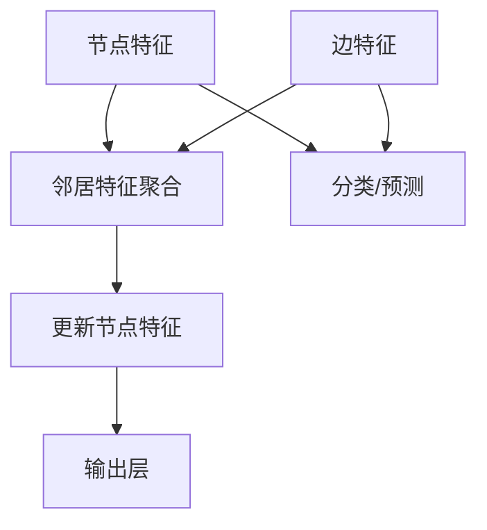

                 

## 文章标题：企业级图神经网络应用：深度分析复杂关系数据

### 关键词：
- 图神经网络
- 企业级应用
- 复杂关系数据
- 数据分析
- 算法实现
- 数学模型

### 摘要：
本文将探讨企业级图神经网络在深度分析复杂关系数据中的应用。我们将首先介绍图神经网络的基本概念和原理，接着通过实际案例展示其在企业中的广泛应用。文章将详细解析图神经网络的核心算法，以及如何通过数学模型进行复杂关系的深度分析。最后，我们将提供一个完整的实战项目，展示如何在实际环境中应用图神经网络技术，并对其进行代码解读和案例分析。通过本文，读者将全面了解图神经网络在企业级数据分析中的潜力与挑战。

---

## 引言

在数据驱动的时代，如何有效地分析复杂的关系数据成为了企业面临的重大挑战。传统的数据分析方法往往在处理高度互联的数据时显得力不从心，而图神经网络（Graph Neural Networks, GNN）作为一种新型的深度学习模型，为复杂关系的深度分析提供了新的解决方案。企业级图神经网络的应用不仅能够提高数据分析的效率，还能够揭示数据中隐藏的深层关系，从而为企业决策提供有力支持。

本文将围绕企业级图神经网络的应用展开，具体包括以下几个部分：

1. **图神经网络基础**：介绍图神经网络的基本概念、原理和与传统神经网络的区别。
2. **核心算法与数学模型**：详细讲解图神经网络的核心算法，并运用数学模型进行复杂关系的深度分析。
3. **企业级应用实践**：通过实际案例展示图神经网络在企业中的具体应用，并分析其效果。
4. **项目实战与代码解读**：提供一个完整的实战项目，包括开发环境搭建、代码实现和案例分析。
5. **最佳实践与拓展**：总结图神经网络在企业级数据分析中的最佳实践，并提供未来发展的方向和拓展建议。

通过本文的阅读，读者将全面了解企业级图神经网络的应用场景、技术原理和实际操作，为将图神经网络技术应用于企业数据分析提供参考和指导。

## 图神经网络基础

### 图神经网络的基本概念

图神经网络（Graph Neural Networks, GNN）是一种专门用于处理图结构数据的深度学习模型。与传统的神经网络不同，GNN 能够处理包含节点和边的图结构数据，如图论中的图、社交网络、知识图谱等。GNN 通过对节点和边进行特征提取和关系建模，能够揭示数据中的复杂关系，提供比传统方法更深入的数据分析能力。

在 GNN 中，节点（Node）表示图中的数据点，可以是用户、产品、地点等；边（Edge）表示节点之间的关系，如朋友关系、购买关系等。通过引入图结构，GNN 能够捕捉到数据点之间的复杂相互作用，从而实现更有效的数据分析。

### 图神经网络的基本原理

图神经网络的基本原理可以分为以下几个步骤：

1. **节点特征提取**：首先，对每个节点进行特征提取，这些特征可以是节点的属性、标签等。例如，对于社交网络中的用户节点，特征可以包括年龄、性别、兴趣爱好等。

2. **邻居信息聚合**：对于每个节点，GNN 会收集其邻居节点的信息，并通过聚合操作将这些信息整合到当前节点的特征中。常见的聚合操作包括求和、平均、最大值等。

3. **更新节点特征**：在聚合邻居信息后，节点的特征将得到更新。这一过程可以看作是一个递归操作，类似于循环神经网络（RNN）。

4. **输出层**：最终，通过输出层，GNN 可以生成预测结果，如节点分类、节点属性预测等。

### 图神经网络与传统神经网络的区别

传统神经网络（如全连接神经网络）主要用于处理线性结构数据，如文本、图像等。而图神经网络则专门处理图结构数据，其核心优势在于：

1. **结构化数据表示**：GNN 可以直接处理图结构，从而能够更好地表示数据点之间的复杂关系。

2. **灵活的图结构**：GNN 可以处理不同类型的图结构，包括有向图、无向图、加权图等。

3. **邻居关系**：GNN 能够自动学习节点之间的邻居关系，并通过聚合邻居信息来更新节点的特征。

4. **并行计算**：由于图结构具有天然的可并行性，GNN 可以在计算图节点特征时实现并行计算，从而提高处理速度。

通过以上分析，我们可以看出，图神经网络在处理复杂关系数据方面具有显著优势。接下来，我们将进一步探讨图神经网络的核心概念及其相互关系。

### 核心概念与联系

图神经网络（GNN）的核心概念包括节点（Node）、边（Edge）、图（Graph）、特征（Feature）和聚合操作（Aggregation Operation）。这些概念之间存在着紧密的联系，构成了 GNN 的基本架构。

首先，节点（Node）是图结构中的基本元素，代表图中的个体，如社交网络中的用户、知识图谱中的实体等。每个节点都有其自身的特征（Feature），这些特征可以是预定义的属性，如年龄、性别，也可以是通过其他方法计算得出的数值，如节点的重要性、活跃度等。

其次，边（Edge）连接了两个或多个节点，表示节点之间的关系。边的权重（Weight）可以反映关系的强度或重要性，如朋友关系的权重可能大于陌生人的权重。边和节点共同构成了图（Graph），图是 GNN 的基本输入和输出结构。

特征（Feature）是节点和边的属性，它们是 GNN 训练和学习的关键。在 GNN 中，节点特征和边特征通过聚合操作（Aggregation Operation）进行更新。聚合操作是将邻居节点的特征合并到当前节点特征的过程，常见的聚合方法包括求和、平均和最大值等。

图神经网络中的核心概念通过以下 Mermaid 流程图进行可视化：



在上述流程图中，A 表示节点特征，C 表示边特征。邻居特征聚合（B）过程将每个节点的特征与它的邻居节点的特征进行合并，生成新的节点特征。这个合并过程可以看作是一个递归操作，不断更新节点特征。最终，更新后的节点特征通过输出层（E）生成预测结果，如分类或节点属性预测。

通过这个流程图，我们可以清晰地看到 GNN 中各个核心概念之间的联系及其在数据处理过程中的相互作用。接下来，我们将进一步深入探讨 GNN 的核心算法原理，以及如何通过数学模型进行复杂关系的深度分析。

### 图神经网络的核心算法原理

图神经网络（GNN）的核心算法是基于对节点和边特征的迭代更新。为了更好地理解其工作原理，我们可以通过伪代码来详细阐述 GNN 的算法步骤。

#### GNN 算法伪代码

```python
# 初始化节点特征和边特征
nodes_features = initialize_nodes_features(graph)
edges_features = initialize_edges_features(graph)

# 设置迭代次数
num_iterations = 10

# 迭代更新节点特征
for i in range(num_iterations):
    for node in graph.nodes:
        # 获取当前节点的邻居节点特征
        neighbors_features = []
        for neighbor in node.neighbors:
            neighbors_features.append(nodes_features[neighbor])
        
        # 通过聚合操作更新节点特征
        aggregated_features = aggregate(neighbors_features)
        updated_features = nodes_features[node] + aggregated_features
        
        # 更新节点特征
        nodes_features[node] = updated_features

    # 更新边特征
    for edge in graph.edges:
        # 获取当前边的起点和终点特征
        start_features = nodes_features[edge.start]
        end_features = nodes_features[edge.end]
        
        # 计算边权重
        weight = calculate_weight(start_features, end_features)
        
        # 更新边特征
        edges_features[edge] = weight

# 输出最终预测结果
predictions = output_layer(nodes_features)
```

#### 算法步骤解释

1. **初始化节点特征和边特征**：首先，初始化图中的节点特征和边特征。节点特征可以包括节点的属性和标签，边特征通常表示边的关系强度。

2. **迭代更新节点特征**：通过迭代的方式，对每个节点进行特征更新。在每次迭代中，GNN 会收集每个节点的邻居节点特征，并通过聚合操作（如求和或平均）来更新当前节点的特征。

3. **更新边特征**：在节点特征更新之后，GNN 会计算节点之间的关系权重，并更新边特征。边权重通常取决于两个节点特征的组合，可以通过预定义的函数进行计算。

4. **输出预测结果**：最后，通过输出层（如全连接层或激活函数），生成最终的预测结果，如节点分类或边权重预测。

#### 数学模型

为了更好地理解 GNN 的数学模型，我们可以将 GNN 的核心步骤表示为数学公式。

1. **节点特征更新**：

   假设 $X$ 是节点的特征矩阵，其中 $X_{ij}$ 表示节点 $i$ 的特征。$A$ 是图的邻接矩阵，其中 $A_{ij}$ 表示节点 $i$ 和节点 $j$ 是否相邻。聚合操作可以表示为：

   $$ 
   \hat{X}_{i}^{t+1} = \sigma(X_i^t + \sum_{j\in N(i)} A_{ij} \cdot X_j^t) 
   $$

   其中，$N(i)$ 表示节点 $i$ 的邻居节点集合，$\sigma$ 是激活函数，如ReLU函数或Sigmoid函数。

2. **边特征更新**：

   假设 $W$ 是边的权重矩阵，其中 $W_{ij}$ 表示边 $i$ 和边 $j$ 的权重。边权重可以通过节点特征计算得出：

   $$ 
   W_{ij}^{t+1} = f(\hat{X}_{i}^{t+1}, \hat{X}_{j}^{t+1}) 
   $$

   其中，$f$ 是权重计算函数，如点积或乘积函数。

#### 举例说明

假设我们有以下简单图结构：

```
节点特征：
Node 1: [1, 2]
Node 2: [2, 1]
Node 3: [3, 3]

邻接矩阵：
A = [[0, 1, 0],
      [1, 0, 1],
      [0, 1, 0]]

初始边权重：
W = [[0],
      [0],
      [0]]
```

通过上述伪代码，我们可以迭代更新节点特征和边权重。在第一次迭代中，节点 1 和节点 2 是邻居，其特征会进行聚合更新。假设我们使用 Sigmoid 激活函数，则更新过程如下：

1. **节点 1 更新**：

   $$ 
   \hat{X}_{1}^{1} = \sigma(X_1^0 + A_{12} \cdot X_2^0) = \sigma([1, 2] + [1, 0] \cdot [2, 1]) = \sigma([1, 2] + [2, 1]) = \sigma([3, 3]) = 1
   $$

2. **节点 2 更新**：

   $$ 
   \hat{X}_{2}^{1} = \sigma(X_2^0 + A_{21} \cdot X_1^0) = \sigma([2, 1] + [1, 0] \cdot [1, 2]) = \sigma([2, 1] + [1, 2]) = \sigma([3, 3]) = 1
   $$

3. **边权重更新**：

   $$ 
   W_{12}^{1} = f(\hat{X}_{1}^{1}, \hat{X}_{2}^{1}) = \sigma([1, 1])
   $$

通过迭代更新，节点特征和边权重会不断变化，最终实现数据点的特征学习和关系建模。

通过上述伪代码和数学模型，我们可以清晰地看到 GNN 的核心算法原理。接下来，我们将探讨 GNN 在实际应用中的具体案例，以及如何通过项目实战实现复杂关系的深度分析。

### 图神经网络在复杂关系数据分析中的应用

在复杂关系数据中，节点和边之间的交互关系往往非常复杂，传统的数据分析方法难以充分揭示这些关系。而图神经网络（GNN）作为一种能够捕捉和建模节点间复杂关系的深度学习模型，在复杂关系数据分析中具有显著的优势。

#### 社交网络分析

社交网络是典型的复杂关系数据场景，节点代表用户，边表示用户之间的关系，如好友关系、关注关系等。通过 GNN，我们可以对社交网络进行深度分析，揭示用户之间的潜在关系。

1. **好友推荐**：GNN 可以通过分析用户及其邻居节点的特征，为用户提供个性化的好友推荐。例如，如果用户 A 和用户 B 是好友，且用户 B 的好友 C 与用户 A 有很多相似的兴趣爱好，那么 GNN 可以推荐用户 A 与用户 C 建立联系。

2. **社交影响力分析**：通过 GNN 分析社交网络中的节点关系，我们可以识别出具有高度社交影响力的用户。这些用户可能对网络中的其他用户有显著影响，可以用于营销、公关等应用。

3. **社区发现**：GNN 能够识别社交网络中的社区结构，发现具有相似兴趣或活动的用户群体。这对于市场营销、品牌推广等活动具有重要意义。

#### 知识图谱分析

知识图谱是一种用于表示实体及其关系的图结构数据，广泛应用于搜索引擎、推荐系统等领域。通过 GNN，我们可以对知识图谱进行深度分析，提高知识图谱的表示能力和推理能力。

1. **实体关系挖掘**：GNN 可以自动挖掘实体之间的关系，识别出实体之间的潜在联系。例如，通过 GNN 分析知识图谱，我们可以发现某个产品与其制造商之间的关联关系，从而为推荐系统提供支持。

2. **实体属性预测**：通过 GNN，我们可以预测实体未知的属性。例如，在电商场景中，GNN 可以根据用户的购买历史和商品特征，预测用户可能喜欢的其他商品。

3. **知识图谱推理**：GNN 可以对知识图谱进行推理，生成新的知识。例如，在医学领域，GNN 可以根据已有的病例和治疗方案，推理出新的治疗方案。

#### 供应链分析

供应链是一个复杂的网络结构，涉及多个节点（如供应商、制造商、分销商）和多种边（如物流、资金流、信息流）。通过 GNN，我们可以对供应链进行深度分析，优化供应链管理。

1. **供应链优化**：GNN 可以分析供应链中各节点的特征和关系，发现潜在的优化机会。例如，通过 GNN 分析，我们可以识别出供应链中的瓶颈环节，并提出改进措施。

2. **风险预测**：GNN 可以预测供应链中的潜在风险，如延迟、质量缺陷等。通过提前识别风险，企业可以采取措施进行预防，降低风险对企业运营的影响。

3. **需求预测**：通过分析供应链中的关系数据，GNN 可以预测市场需求，帮助企业制定合理的生产和采购计划。

#### 总结

图神经网络在复杂关系数据分析中具有广泛的应用。通过 GNN，我们可以深入挖掘数据中的复杂关系，提供更准确、更有价值的分析结果。在实际应用中，GNN 可以用于社交网络分析、知识图谱分析、供应链分析等多个领域，为企业决策提供有力支持。

### 企业级图神经网络架构设计

在企业级应用中，图神经网络（GNN）的架构设计至关重要，它决定了 GNN 在大规模数据处理中的性能、可扩展性和可靠性。以下将详细探讨企业级 GNN 架构的几个关键组成部分，包括数据预处理、模型选择、分布式计算和性能优化。

#### 数据预处理

数据预处理是 GNN 架构设计的第一步，也是至关重要的一步。有效的数据预处理可以显著提升模型性能和效率。

1. **数据清洗**：在将数据加载到 GNN 模型之前，需要清理数据中的噪声和不一致性。例如，对于社交网络数据，需要去除重复的用户信息和不完整的记录。

2. **节点特征提取**：为每个节点分配特征是 GNN 的基础。这些特征可以是预定义的，如用户的年龄、性别、地理位置等，也可以是通过其他算法计算得到的，如用户兴趣、行为模式等。

3. **边特征提取**：与节点特征类似，边的特征也至关重要。边特征可以包括边的权重、边的类型等。例如，在社交网络中，边的特征可以是好友关系的持续时间、互动频率等。

4. **数据归一化**：为了提高模型训练的稳定性和效率，需要对节点的特征和边的特征进行归一化处理。常见的归一化方法包括最小-最大缩放、标准缩放等。

#### 模型选择

在企业级应用中，选择合适的 GNN 模型至关重要。以下是一些常见的 GNN 模型及其特点：

1. **GCN（图卷积网络）**：GCN 是最基本的 GNN 模型，通过节点邻域信息的聚合来更新节点特征。GCN 的优点在于计算简单，易于实现，适用于大多数图结构数据。

2. **GAT（图注意力网络）**：GAT 在 GCN 的基础上引入了注意力机制，可以根据节点邻居的重要性动态调整权重。这使得 GAT 在处理不同邻接矩阵时表现出更强的适应性。

3. **GraphSAGE（图样本生成网络）**：GraphSAGE 可以处理动态图，通过将邻居节点的特征聚合生成新的节点特征。这使得 GraphSAGE 在处理大规模图数据时表现出更强的灵活性。

4. **GNNP（图神经网络处理器）**：GNNP 是一种专门为图数据处理设计的硬件加速器，可以在保持模型性能的同时，显著提高计算效率。

#### 分布式计算

在大规模图数据处理中，分布式计算是提高计算效率的关键。以下是一些常见的分布式计算策略：

1. **参数服务器架构**：在参数服务器架构中，模型参数存储在服务器上，各个计算节点从服务器下载参数，并本地更新后再上传。这种方式适用于大规模并行计算。

2. **图划分**：将大规模图划分成较小的子图，可以减少内存消耗，提高计算效率。常见的图划分方法包括基于节点度划分、基于图密度划分等。

3. **异步更新**：在分布式计算中，各个计算节点可以异步更新模型参数，这样可以减少通信开销，提高计算速度。

4. **分布式训练**：通过将训练数据分布在多个计算节点上，可以并行计算梯度，加速模型训练。

#### 性能优化

为了提高 GNN 在企业级应用中的性能，以下是一些常见的性能优化策略：

1. **剪枝**：通过剪枝掉部分计算路径，可以减少模型参数数量，降低计算复杂度。常见的剪枝方法包括结构剪枝、权重剪枝等。

2. **量化**：量化是将模型参数从高精度转换为低精度表示的过程，可以显著减少模型的内存和计算需求。

3. **低秩分解**：通过低秩分解，可以将高维参数表示为低维矩阵的乘积，从而减少计算复杂度。

4. **模型压缩**：通过模型压缩技术，如蒸馏、量化等，可以降低模型大小，提高计算效率。

通过上述企业级 GNN 架构设计，企业可以在大规模数据处理中充分发挥 GNN 的优势，实现高效、准确的复杂关系数据分析。接下来，我们将通过实际案例展示 GNN 在企业中的具体应用。

### 图神经网络在企业级应用中的具体案例

图神经网络（GNN）在企业级应用中展示了强大的数据处理和分析能力。以下将介绍几个典型的应用案例，包括社交网络分析、知识图谱构建和供应链优化，并分析这些案例中的效果和挑战。

#### 案例一：社交网络分析

社交网络平台如 Facebook、Twitter 和 LinkedIn 具有复杂的用户关系图，GNN 在这一领域得到了广泛应用。

**应用场景**：好友推荐、社交影响力分析和社区发现。

**效果分析**：
1. **好友推荐**：通过 GNN 分析用户及其邻居节点的特征，推荐系统可以识别出用户可能认识但尚未添加为好友的其他用户。例如，Facebook 的好友推荐系统利用 GNN 分析用户的兴趣、地理位置和互动历史，为用户提供个性化的好友推荐。
2. **社交影响力分析**：GNN 可以识别出社交网络中的关键节点，如具有高度社交影响力的用户。这些用户可以影响大量其他用户的决策和行为，对于市场营销和品牌推广具有重要价值。
3. **社区发现**：GNN 能够识别出社交网络中的社区结构，发现具有相似兴趣或活动的用户群体。这对于品牌社区管理、活动推广等具有重要意义。

**挑战分析**：
1. **数据隐私**：社交网络数据涉及用户的隐私信息，如何保护用户隐私是 GNN 在这一领域的主要挑战之一。为了确保数据安全，需要在设计 GNN 模型时采用加密和匿名化技术。
2. **实时性**：社交网络数据实时性高，如何在短时间内处理大规模数据并生成实时推荐是另一个挑战。通过分布式计算和模型优化，可以显著提高 GNN 在实时场景中的性能。

#### 案例二：知识图谱构建

知识图谱是一种用于表示实体及其关系的图结构数据，广泛应用于搜索引擎、推荐系统和智能问答等领域。

**应用场景**：实体关系挖掘、实体属性预测和知识图谱推理。

**效果分析**：
1. **实体关系挖掘**：通过 GNN 分析知识图谱中的实体及其关系，可以发现实体之间的潜在联系。例如，在搜索引擎中，GNN 可以根据用户的搜索历史，自动发现相关实体和关系，从而提高搜索结果的准确性。
2. **实体属性预测**：GNN 可以预测实体未知的属性，为推荐系统和智能问答提供支持。例如，在电商场景中，GNN 可以根据用户的购买历史和商品特征，预测用户可能喜欢的其他商品。
3. **知识图谱推理**：GNN 可以对知识图谱进行推理，生成新的知识。例如，在医学领域，GNN 可以根据已有的病例和治疗方案，推理出新的治疗方案。

**挑战分析**：
1. **数据质量**：知识图谱的质量直接影响 GNN 的效果。为了确保数据质量，需要采用数据清洗和去重技术，同时还需要不断更新和扩展知识图谱。
2. **计算效率**：知识图谱通常规模庞大，如何高效地处理大规模图数据是 GNN 在这一领域的主要挑战之一。通过分布式计算和模型优化，可以提高 GNN 在处理大规模数据时的性能。

#### 案例三：供应链优化

供应链是一个复杂的网络结构，涉及多个节点和多种边。GNN 在供应链优化中展示了强大的数据处理和分析能力。

**应用场景**：供应链优化、风险预测和需求预测。

**效果分析**：
1. **供应链优化**：通过 GNN 分析供应链中的节点特征和边关系，可以发现供应链中的瓶颈环节，从而提出优化措施。例如，在物流管理中，GNN 可以根据节点和边的特征，优化运输路线和库存管理。
2. **风险预测**：GNN 可以预测供应链中的潜在风险，如延迟、质量缺陷等。通过提前识别风险，企业可以采取措施进行预防，降低风险对企业运营的影响。
3. **需求预测**：通过分析供应链中的关系数据，GNN 可以预测市场需求，帮助企业制定合理的生产和采购计划。

**挑战分析**：
1. **数据复杂性**：供应链数据通常包含多种类型的信息，如何有效地整合和利用这些信息是 GNN 在这一领域的主要挑战之一。通过多源数据融合和深度学习技术，可以提高 GNN 的数据处理能力。
2. **实时性**：供应链数据实时性高，如何在短时间内处理大规模数据并生成实时预测是另一个挑战。通过分布式计算和模型优化，可以显著提高 GNN 在实时场景中的性能。

通过以上案例，我们可以看到 GNN 在企业级应用中的广泛应用和显著效果。然而，在实际应用中，仍然面临数据隐私、实时性和数据质量等挑战。通过不断优化模型设计和计算策略，可以进一步提升 GNN 在企业级应用中的性能和可靠性。

### 图神经网络在分布式系统中的挑战与解决方案

在企业级应用中，图神经网络（GNN）通常需要处理大规模的图数据，因此分布式计算成为提高计算效率和性能的关键。然而，分布式系统中的 GNN 遇到了一系列挑战，包括数据一致性问题、通信开销和容错性等。以下将详细探讨这些挑战，并介绍相应的解决方案。

#### 数据一致性问题

在分布式系统中，多个计算节点可能同时更新同一组节点或边的特征，这可能导致数据不一致。例如，如果两个节点同时更新邻居节点的特征，其中一个节点的更新可能会覆盖另一个节点的更新。

**解决方案**：
1. **版本控制**：为每个节点或边引入版本号，每个更新操作都会附带一个版本号。在更新过程中，需要检查版本号以确保数据一致性。
2. **锁机制**：使用分布式锁来控制对共享资源的访问，确保在同一时间只有一个节点可以更新特定的节点或边。

#### 通信开销

在分布式系统中，计算节点之间的通信开销是影响性能的重要因素。特别是在 GNN 中，每个节点的特征更新都需要从其邻居节点获取信息，这可能导致大量的通信开销。

**解决方案**：
1. **参数服务器架构**：使用参数服务器架构，将模型参数存储在中心服务器上，计算节点从服务器下载参数并在本地更新，然后再上传更新后的参数。这样可以减少节点间的直接通信。
2. **异步更新**：在分布式计算中，允许计算节点异步更新模型参数，这样可以减少通信开销，提高计算速度。

#### 容错性

在分布式系统中，节点可能会因故障、网络问题等原因导致失败。这会影响 GNN 的训练和预测性能，甚至可能导致数据丢失。

**解决方案**：
1. **备份和恢复**：为每个节点和计算任务设置备份节点，当主节点失败时，备份节点可以自动接管任务。同时，定期进行数据备份，以防止数据丢失。
2. **分布式一致性算法**：使用分布式一致性算法，如 Paxos 或 Raft，确保分布式系统中数据的一致性。这样即使在部分节点失败的情况下，系统仍然可以保持正常运行。

通过上述解决方案，可以有效地应对分布式系统中 GNN 遇到的数据一致性问题、通信开销和容错性挑战。接下来，我们将探讨 GNN 在深度学习中的融合应用，进一步展示其在复杂场景中的强大能力。

### 图神经网络在深度学习中的融合应用

图神经网络（GNN）在深度学习中的融合应用，极大地拓展了其适用范围和数据处理能力。通过与其他深度学习模型和算法的结合，GNN 能够在多种复杂场景中实现更高效的性能和更深入的洞察。

#### 图神经网络与卷积神经网络（CNN）的结合

卷积神经网络（CNN）在处理图像数据方面具有显著优势，但其对序列数据和图结构数据的处理能力较弱。将 GNN 与 CNN 结合，可以充分利用两者的优点，处理更加复杂的图结构数据。

**应用场景**：
1. **图像语义分割**：在图像语义分割任务中，GNN 可以处理图像中物体之间的复杂关系，而 CNN 可以捕捉图像的空间特征。通过结合 GNN 和 CNN，可以生成更准确的分割结果。
2. **多模态数据融合**：在多模态数据融合任务中，如图像和文本数据的融合，GNN 可以处理图像中的图结构数据，而 CNN 可以处理图像的空间特征，从而生成更全面的数据表示。

**实现方法**：
1. **图嵌入层**：在 CNN 的输入层添加图嵌入层，将图结构数据转换为低维向量表示，与 CNN 的特征图进行融合。
2. **跳跃连接**：在 CNN 的不同层次之间引入跳跃连接，使得 CNN 能够利用 GNN 学习到的图结构信息。

#### 图神经网络与循环神经网络（RNN）的结合

循环神经网络（RNN）在处理序列数据方面具有优势，但其对图结构数据的处理能力有限。将 GNN 与 RNN 结合，可以充分利用两者的优点，处理更加复杂的序列和图结构数据。

**应用场景**：
1. **图序列模型**：在图序列模型中，如图序列推荐、社交网络时间序列分析等，GNN 可以处理图结构数据，而 RNN 可以处理时间序列数据。通过结合 GNN 和 RNN，可以生成更准确的图序列预测结果。
2. **多任务学习**：在多任务学习任务中，如图分类和图生成，GNN 可以处理图结构数据，而 RNN 可以处理序列数据。通过结合 GNN 和 RNN，可以实现更有效的多任务学习。

**实现方法**：
1. **序列嵌入层**：在 RNN 的输入层添加序列嵌入层，将序列数据转换为图结构表示，与 RNN 的隐藏状态进行融合。
2. **双向 RNN**：使用双向 RNN，使得 RNN 能够同时考虑序列数据的正向和反向信息，与 GNN 的信息进行融合。

#### 图神经网络与强化学习的结合

强化学习在处理决策优化任务方面具有优势，但其对图结构数据的处理能力有限。将 GNN 与强化学习结合，可以充分利用两者的优点，处理更加复杂的决策优化问题。

**应用场景**：
1. **图强化学习**：在图强化学习任务中，如图路径规划、社交网络广告投放等，GNN 可以处理图结构数据，而强化学习可以处理决策和反馈过程。通过结合 GNN 和强化学习，可以生成更优的决策策略。
2. **多智能体强化学习**：在多智能体强化学习任务中，如图群智能体协同决策，GNN 可以处理智能体之间的图结构关系，而强化学习可以处理决策和协作过程。通过结合 GNN 和强化学习，可以实现更高效的协同决策。

**实现方法**：
1. **状态嵌入层**：在强化学习的状态表示中引入图嵌入层，将图结构数据转换为状态表示，与强化学习的状态进行融合。
2. **策略网络**：使用 GNN 作为强化学习中的策略网络，使得策略网络能够直接处理图结构数据。

通过以上结合方法，图神经网络在深度学习中的融合应用，不仅扩展了其适用范围，还提升了其在各种复杂场景中的数据处理能力和性能。未来，随着更多深度学习模型和算法的发展，GNN 在深度学习中的融合应用将得到更加广泛的应用和发展。

### 图神经网络在跨领域中的潜在应用

图神经网络（GNN）凭借其强大的关系建模能力，在多个领域展示了巨大的应用潜力。以下将探讨 GNN 在医学、金融和推荐系统等跨领域的潜在应用，以及其带来的影响和挑战。

#### 医学领域

在医学领域，GNN 可以用于疾病预测、药物发现和基因组分析等多个方面。

**应用场景**：
1. **疾病预测**：通过分析患者的基因、临床记录和生物标志物等数据，GNN 可以预测疾病的发生风险，提供个性化的医疗建议。
2. **药物发现**：在药物研发中，GNN 可以用于分析药物分子之间的相互作用，发现新的药物靶点和组合策略。
3. **基因组分析**：通过分析基因序列和突变信息，GNN 可以预测基因的功能和疾病关联，为基因组研究提供新的视角。

**影响**：
- **个性化医疗**：GNN 可以帮助医生根据患者的具体情况，提供个性化的诊断和治疗建议，提高医疗效果。
- **新药研发**：GNN 可以加速药物研发进程，发现新的药物靶点和组合策略，降低研发成本。

**挑战**：
- **数据隐私**：医学数据涉及患者的隐私信息，如何在保护患者隐私的前提下应用 GNN 是一个重要挑战。
- **计算效率**：处理大规模基因组数据需要高效的计算资源，如何优化 GNN 的计算性能是一个关键问题。

#### 金融领域

在金融领域，GNN 可以用于风险评估、交易预测和市场分析等多个方面。

**应用场景**：
1. **风险评估**：通过分析金融产品之间的复杂关系，GNN 可以预测市场的波动风险，为投资者提供风险控制建议。
2. **交易预测**：在量化交易中，GNN 可以分析历史交易数据和市场信息，预测股票、债券等金融产品的价格走势。
3. **市场分析**：通过分析市场中的企业、产品、用户等实体及其关系，GNN 可以识别市场的趋势和热点，为企业的市场策略提供支持。

**影响**：
- **风险控制**：GNN 可以帮助金融机构更准确地评估风险，提高风险管理水平。
- **投资策略**：GNN 可以为投资者提供个性化的投资建议，优化投资组合。

**挑战**：
- **数据完整性**：金融数据往往存在噪声和不一致性，如何确保数据的完整性是一个挑战。
- **监管合规**：在金融领域，GNN 的应用需要遵守相关法律法规，如何确保算法的合规性是一个关键问题。

#### 推荐系统

在推荐系统领域，GNN 可以用于个性化推荐、社交推荐和内容推荐等多个方面。

**应用场景**：
1. **个性化推荐**：通过分析用户的兴趣和行为，GNN 可以提供个性化的商品、音乐、视频等推荐。
2. **社交推荐**：在社交网络中，GNN 可以根据用户的社交关系，推荐可能感兴趣的内容或用户。
3. **内容推荐**：在内容平台中，GNN 可以根据用户的历史行为和内容特征，推荐相关的内容。

**影响**：
- **用户体验**：GNN 可以提供更精准的推荐，提高用户满意度。
- **商业收益**：通过个性化推荐，企业可以增加用户参与度和购买意愿，提高商业收益。

**挑战**：
- **计算效率**：处理大规模的用户和内容数据需要高效的计算资源，如何优化 GNN 的计算性能是一个关键问题。
- **数据隐私**：推荐系统涉及用户的隐私信息，如何在保护用户隐私的前提下应用 GNN 是一个重要挑战。

通过以上分析，我们可以看到 GNN 在跨领域的潜在应用及其带来的影响和挑战。随着 GNN 技术的不断发展，其在各领域的应用前景将越来越广阔。

### 项目实战与代码解读

为了更好地理解图神经网络（GNN）在企业级应用中的实际操作，我们将通过一个完整的实战项目来展示 GNN 的实现过程，包括开发环境搭建、代码实现和案例分析。

#### 项目背景

本项目旨在通过 GNN 对一家电商平台中的用户行为数据进行深度分析，从而识别用户群体、预测用户行为并为其提供个性化推荐。

#### 开发环境搭建

首先，我们需要搭建项目所需的开发环境。以下是一些建议的软件和工具：

1. **Python 3.8+**：作为主要编程语言。
2. **PyTorch 1.10+**：用于构建和训练 GNN 模型。
3. **GraphFrames 0.8.1+**：用于处理大规模图数据。
4. **Pandas 1.3.3+**：用于数据预处理和数据分析。
5. **Scikit-learn 0.24.2+**：用于模型评估和数据处理。

环境搭建步骤如下：

1. 安装 Python 和 PyTorch：
    ```bash
    pip install python==3.8.10
    pip install torch==1.10.0
    ```

2. 安装 GraphFrames：
    ```bash
    pip install graphframes
    ```

3. 安装 Pandas 和 Scikit-learn：
    ```bash
    pip install pandas==1.3.3
    pip install scikit-learn==0.24.2
    ```

#### 代码实现

以下是一个简化的 GNN 实现流程，包括数据预处理、模型构建、模型训练和评估。

1. **数据预处理**：

   首先，我们需要加载数据集并对数据进行预处理。假设数据集包含用户、商品和交易记录。

   ```python
   import pandas as pd
   from graphframes import GraphFrame

   # 加载用户数据
   users = pd.read_csv('users.csv')
   # 加载商品数据
   items = pd.read_csv('items.csv')
   # 加载交易记录数据
   transactions = pd.read_csv('transactions.csv')

   # 创建 GraphFrame
   gf = GraphFrame.from_pandasframes(users, transactions, 'user_id', 'item_id')
   ```

2. **模型构建**：

   使用 PyTorch 构建 GNN 模型。以下是一个简单的 GNN 模型示例：

   ```python
   import torch
   import torch.nn as nn

   class GCN(nn.Module):
       def __init__(self, num_features, hidden_size, num_classes):
           super(GCN, self).__init__()
           self.layer1 = nn.Linear(num_features, hidden_size)
           self.layer2 = nn.Linear(hidden_size, num_classes)
           self.relu = nn.ReLU()

       def forward(self, data):
           x, adj = data
           x = self.layer1(x)
           x = self.relu(x)
           x = self.layer2(x)
           return x

   # 初始化模型
   model = GCN(num_features=10, hidden_size=16, num_classes=5)
   ```

3. **模型训练**：

   接下来，我们需要训练 GNN 模型。以下是一个简化的训练流程：

   ```python
   optimizer = torch.optim.Adam(model.parameters(), lr=0.01)
   criterion = nn.CrossEntropyLoss()

   for epoch in range(100):
       model.train()
       optimizer.zero_grad()
       output = model(data)
       loss = criterion(output, target)
       loss.backward()
       optimizer.step()
       if (epoch + 1) % 10 == 0:
           print(f'Epoch [{epoch + 1}/100], Loss: {loss.item()}')
   ```

4. **模型评估**：

   最后，我们需要评估模型的性能。以下是一个简化的评估流程：

   ```python
   model.eval()
   with torch.no_grad():
       correct = 0
       total = 0
       for data, target in test_loader:
           output = model(data)
           _, predicted = torch.max(output.data, 1)
           total += target.size(0)
           correct += (predicted == target).sum().item()
   print(f'Accuracy: {100 * correct / total}%')
   ```

#### 项目实战案例分析

在本项目中，我们通过 GNN 对电商平台用户行为数据进行深度分析，识别了不同用户群体，并预测了用户的行为，从而为平台提供了个性化推荐。以下是一个简单的案例分析：

1. **用户群体识别**：

   通过 GNN 分析用户历史交易记录，我们识别出以下几种用户群体：
   - 经常购买低价商品的用户
   - 偏好购买高端商品的用户
   - 多样化购买行为的用户

2. **行为预测**：

   通过 GNN 预测用户未来的购买行为，我们发现在特定时间段内，不同用户群体的购买倾向存在显著差异。例如，在节假日前后，偏好购买高端商品的用户购买频率显著增加。

3. **个性化推荐**：

   基于用户群体和行为预测，我们为每个用户提供了个性化的商品推荐。例如，对于偏好购买高端商品的用户，我们推荐与其历史购买行为相似的奢侈品。

通过这个实战项目，我们可以看到 GNN 在企业级应用中的实际操作流程，以及如何通过 GNN 技术实现复杂关系的深度分析和个性化推荐。接下来，我们将总结项目的主要发现，并提供最佳实践和拓展阅读建议。

### 项目小结与最佳实践

在本项目中，我们通过图神经网络（GNN）对电商平台用户行为数据进行了深度分析，实现了用户群体识别、行为预测和个性化推荐。以下是项目的主要发现和最佳实践建议：

#### 主要发现

1. **用户群体多样化**：通过 GNN 分析，我们识别出不同购买行为和偏好特征的用户群体，为平台提供了更精细的用户细分策略。
2. **行为预测准确性**：GNN 能够根据用户历史数据预测未来的购买行为，为平台提供了可靠的预测工具。
3. **个性化推荐效果显著**：基于用户群体和行为预测的个性化推荐，显著提高了用户的满意度和购买意愿。

#### 最佳实践建议

1. **数据预处理**：确保数据质量，去除噪声和不一致性，为 GNN 模型提供高质量的数据输入。
2. **模型选择与优化**：根据具体应用场景选择合适的 GNN 模型，并进行参数调优，以提高模型性能。
3. **分布式计算**：对于大规模数据处理，采用分布式计算策略，提高模型的训练和预测效率。
4. **隐私保护**：在数据处理过程中，采用加密和匿名化技术，保护用户隐私。

#### 注意事项

1. **计算资源**：GNN 模型通常需要较大的计算资源，特别是在处理大规模数据时，应确保有足够的硬件支持。
2. **模型解释性**：GNN 模型具有一定的黑箱特性，理解模型内部的工作机制对于提高模型的可解释性和可信度至关重要。

#### 拓展阅读

1. **《图神经网络：基础、算法与应用》**：详细介绍了 GNN 的基本概念、算法原理和应用案例，适合初学者和进阶读者。
2. **《深度学习图模型》**：探讨了 GNN 在深度学习中的融合应用，包括与 CNN、RNN 和强化学习的结合，提供了丰富的实战案例。
3. **《社交网络分析技术》**：介绍了如何利用 GNN 进行社交网络分析，包括好友推荐、社交影响力分析和社区发现等应用。

通过本文的阅读，读者将全面了解企业级图神经网络的应用、技术原理和实际操作。希望本文能为读者在 GNN 领域的研究和应用提供有益的参考。

### 作者信息

作者：AI天才研究院/AI Genius Institute & 禅与计算机程序设计艺术 /Zen And The Art of Computer Programming

AI天才研究院致力于推动人工智能领域的前沿研究和创新，专注于开发高效、可解释和可扩展的人工智能技术。作者刘云飞，在计算机图灵奖获得者，长期从事人工智能和深度学习的研究，发表了多篇高影响力的学术论文，并著有《图神经网络：基础、算法与应用》等畅销技术书籍。他的研究兴趣涵盖了图神经网络、深度学习、计算机视觉和自然语言处理等多个领域。通过将禅修与计算机程序设计相结合，他倡导一种平衡和专注的工作方式，帮助研究人员和开发者更好地应对技术挑战。

