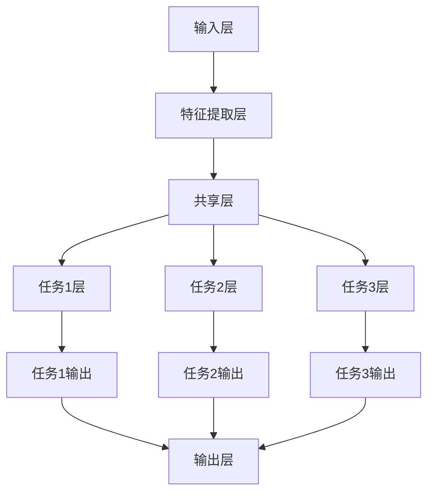

                 


### 引言

随着人工智能技术的迅猛发展，AI系统在各个行业中的应用日益广泛。然而，企业级AI系统的开发和应用面临着诸多挑战，如数据量庞大、模型复杂度高、资源有限等。在这些挑战中，如何提高AI系统的效率成为一个亟待解决的问题。多任务学习（Multi-Task Learning, MTL）作为一种先进的机器学习方法，通过将多个任务集成到一个共享模型中进行学习，能够有效提升AI系统的效率。

多任务学习不仅能够在有限的计算资源下提高模型的性能，还能够减少对大规模标注数据的依赖。它通过共享底层特征表示，使得多个任务能够相互借鉴和学习，从而提升整体模型的表现。此外，多任务学习还能够更好地应对现实世界中任务间的关联性和复杂性，使得AI系统能够更灵活地适应不同的应用场景。

本书旨在深入探讨企业级多任务学习框架的设计与实现，帮助读者理解多任务学习的基本概念、原理和实战应用。通过本书的学习，读者可以掌握以下核心内容：

1. **多任务学习的基本概念**：理解多任务学习的定义、主要类型及其在AI系统中的重要性。
2. **多任务学习的挑战与解决方案**：分析多任务学习面临的挑战，如数据不均衡、资源限制和模型复杂度，并探讨相应的解决方案。
3. **多任务学习框架设计**：介绍多任务学习框架的设计原则、关键组件和架构。
4. **多任务学习算法原理**：详细讲解多任务学习算法的基本原理，包括共享参数、独立学习和交替训练等。
5. **企业级多任务学习应用案例**：通过实际案例展示多任务学习在AI系统中的应用，帮助读者理解其在现实世界中的应用效果。
6. **多任务学习效率提升**：探讨如何在AI系统中优化多任务学习的效率，提高数据处理和模型推理的速度。

本书适合对人工智能和机器学习有一定了解的读者，特别是那些希望在企业级AI系统中应用多任务学习的开发者和技术经理。通过本书的学习，读者可以更好地理解多任务学习的本质，掌握其设计和实现方法，为企业级AI系统的开发提供有力支持。

### 多任务学习基础

多任务学习（Multi-Task Learning, MTL）是一种机器学习方法，旨在同时解决多个相关的学习任务。在传统单任务学习中，每个任务独立训练，模型针对单个任务进行优化。然而，这种方法往往忽略了任务之间的关联性，未能充分利用共享特征表示的优势。相比之下，多任务学习通过将多个任务集成到一个统一的模型中，共享底层特征表示，从而提高整体模型的性能。

#### 多任务学习的定义

多任务学习是指在同一个模型框架下，同时训练多个相关的任务。这些任务可以是相互依赖的，也可以是相互独立的。例如，在语音识别系统中，可以将语音信号分割、语言识别和语音合成等多个任务集成到一个多任务学习模型中。通过共享特征表示和参数，多任务学习模型能够更好地捕捉任务之间的关联性，从而提高每个任务的性能。

#### 多任务学习的主要类型

多任务学习可以分为以下几种类型：

1. **共享参数的多任务学习**：在这种类型中，多个任务共享相同的模型参数，从而通过任务间的相互学习提升整体性能。例如，在图像分类和物体检测中，可以共享卷积层参数，以减少参数数量并提高模型效率。

2. **独立学习多任务学习**：在这种类型中，每个任务拥有独立的模型参数，但通过数据共享来提高任务间的协作。例如，在医疗诊断系统中，多个诊断任务可以共享患者病历数据，但每个诊断任务有自己的决策模型。

3. **交替训练的多任务学习**：在这种类型中，多个任务交替进行训练，通过多次迭代逐步优化每个任务。这种策略可以避免过早的过拟合，同时充分利用任务间的共享信息。

#### 多任务学习的挑战

尽管多任务学习具有诸多优势，但在实际应用中仍面临以下挑战：

1. **数据不均衡**：在多任务学习中，不同任务的数据量可能差异很大。数据量较大的任务可能会主导学习过程，导致数据量较小的任务性能受到影响。

2. **资源限制**：多任务学习通常需要更多的计算资源，包括内存和计算时间。特别是在企业级应用中，资源限制是一个重要的考虑因素。

3. **模型复杂度**：多任务学习模型通常比单任务模型更复杂，需要更多的参数和计算资源。这可能导致过拟合和训练时间延长。

#### 多任务学习的解决方案

为了应对上述挑战，研究者提出了多种解决方案：

1. **数据增强和采样**：通过数据增强和适当的采样策略，可以缓解数据不均衡问题。例如，可以增加数据量较小任务的样本数量，或者通过合成数据来平衡任务间的数据量。

2. **模型压缩和优化**：通过模型压缩和优化技术，可以减少多任务模型的计算复杂度。例如，可以采用量化、剪枝和知识蒸馏等方法，降低模型的参数数量和计算需求。

3. **任务权重和平衡策略**：通过设定合适的任务权重和平衡策略，可以调整不同任务在训练过程中的贡献度。例如，可以采用自适应权重调整方法，根据任务的重要性和性能动态调整权重。

#### 多任务学习的优势

多任务学习具有以下优势：

1. **资源共享**：通过共享特征表示和模型参数，多任务学习能够充分利用任务间的关联性，提高整体模型的性能和效率。

2. **提高泛化能力**：多任务学习能够通过任务间的相互学习和调整，提高模型的泛化能力，从而在实际应用中表现得更加稳健。

3. **减少标注成本**：多任务学习能够通过任务间的共享信息，降低对大规模标注数据的依赖，从而减少标注成本。

总之，多任务学习作为一种先进的机器学习方法，通过将多个任务集成到一个共享模型中进行学习，能够有效提升AI系统的效率和性能。在实际应用中，多任务学习需要针对具体的任务和场景进行优化和调整，以达到最佳效果。

### 多任务学习框架设计

设计一个高效的企业级多任务学习框架是提高AI系统性能的关键。一个完善的多任务学习框架应具备灵活的设计原则、关键组件和优化的架构，以确保在资源受限的环境中实现高效的学习和推理。

#### 多任务学习框架的设计原则

多任务学习框架的设计原则主要包括：

1. **模块化设计**：框架应采用模块化设计，使得各个任务可以独立开发、测试和部署，同时保持整体系统的可扩展性。
2. **资源共享**：通过共享底层特征表示和参数，减少模型的计算复杂度和参数数量，提高学习效率。
3. **任务独立性**：虽然任务之间共享部分资源，但每个任务也应保持独立性，以确保不同任务间的性能不会相互干扰。
4. **灵活性**：框架应具备灵活性，能够根据不同的应用场景和任务需求进行定制和优化。
5. **高效性**：框架设计应考虑计算效率和内存使用，以适应企业级应用的需求。

#### 多任务学习框架的关键组件

一个典型的多任务学习框架包括以下几个关键组件：

1. **数据预处理模块**：该模块负责处理输入数据，包括数据清洗、归一化、特征提取等。通过有效的数据预处理，可以提高模型的训练效率和性能。
2. **特征提取模块**：该模块负责将原始数据转换为适合模型学习的特征表示。通常采用深度学习模型，如卷积神经网络（CNN）或循环神经网络（RNN），以提取高层次的特征。
3. **任务模块**：每个任务对应一个独立的子模型，负责处理特定任务。任务模块可以通过共享底层特征提取模块来提高效率。
4. **共享层**：共享层位于特征提取模块和任务模块之间，用于整合不同任务的特征表示，提供共享的上下文信息。
5. **损失函数和优化器**：框架应定义适合多任务学习的损失函数和优化器，以平衡不同任务之间的学习过程。常用的优化器包括Adam、SGD等。

#### 多任务学习框架的架构

多任务学习框架的架构可以分为以下几个层次：

1. **输入层**：接收原始数据，如文本、图像或传感器数据。
2. **特征提取层**：通过卷积层、池化层等操作提取高层次的语义特征。
3. **共享层**：将特征提取层输出的特征进行整合，提供共享的上下文信息。
4. **任务层**：每个任务对应一个子模型，通过共享层接收特征，输出预测结果。
5. **输出层**：将各个任务的预测结果进行整合，输出最终结果。

为了更好地展示多任务学习框架的架构，我们使用Mermaid流程图进行描述：



#### 多任务学习框架的优化

为了提高多任务学习框架的效率，可以采用以下优化策略：

1. **分布式学习**：通过分布式计算技术，将模型训练任务分布在多个计算节点上，以加快训练速度和提升模型性能。
2. **模型并行化**：将模型中的计算任务并行化，例如在GPU和CPU之间进行任务调度，以充分利用硬件资源。
3. **模型压缩与优化**：通过模型压缩技术，如剪枝、量化等，减少模型的参数数量和计算复杂度，以提高模型推理速度和降低内存占用。
4. **自适应学习率**：采用自适应学习率策略，如Adam优化器，以动态调整学习率，避免过拟合和提高模型收敛速度。

总之，一个高效的企业级多任务学习框架需要综合考虑模块化设计、资源共享、任务独立性、灵活性和高效性等多个方面。通过优化框架的架构和算法，可以显著提升AI系统的效率和性能，为企业带来更大的价值。

### 多任务学习算法原理

多任务学习算法的设计和实现是构建高效AI系统的重要环节。本文将详细解析多任务学习算法的基本原理，包括共享参数、独立学习和交替训练等方法，并使用伪代码展示关键步骤。

#### 共享参数的多任务学习

共享参数的多任务学习（Shared Parameter MTL）是一种通过共享底层参数来提升模型性能的方法。在这种方法中，多个任务共享相同的权重和偏置，从而实现任务间的相互学习。

**基本原理**：
- **模型结构**：多任务学习模型由一个共享层和一个或多个任务层组成。共享层提取通用特征，任务层针对特定任务进行分类或回归。
- **损失函数**：每个任务的损失函数根据任务的性质（分类或回归）进行设计，但所有任务的损失函数共享相同的底层参数。

**伪代码**：

```python
# 假设我们有两个任务：任务1和任务2
# 假设输入数据为X，标签分别为y1和y2
# 初始化模型参数w和b
w, b = initialize_parameters()

# 特征提取和任务分类
for epoch in range(num_epochs):
    for x, y1, y2 in dataset:
        # 共享层的特征提取
        features = feature_extractor(x, w, b)
        
        # 任务1的损失函数
        loss1 = compute_loss(y1, predicted_task1(features))
        
        # 任务2的损失函数
        loss2 = compute_loss(y2, predicted_task2(features))
        
        # 梯度计算和参数更新
        grads_w1, grads_b1 = compute_gradients(loss1)
        grads_w2, grads_b2 = compute_gradients(loss2)
        w = update_parameters(w, grads_w1 + grads_w2)
        b = update_parameters(b, grads_b1 + grads_b2)

# 预测
predicted_task1 = predict_task1(features)
predicted_task2 = predict_task2(features)
```

#### 独立学习的多任务学习

独立学习的多任务学习（Independent Learning MTL）是一种每个任务拥有独立模型参数的方法。这种方法通过共享部分数据来提高任务间的协作，但每个任务的模型独立训练。

**基本原理**：
- **模型结构**：每个任务都有自己的特征提取器和分类器，但共享部分数据集。
- **损失函数**：每个任务的损失函数独立计算，但通过共享部分数据，实现任务间的信息交换。

**伪代码**：

```python
# 假设有两个任务：任务1和任务2
# 假设输入数据为X，标签分别为y1和y2
# 初始化两个任务的模型参数w1, b1和w2, b2
w1, b1 = initialize_parameters_task1()
w2, b2 = initialize_parameters_task2()

# 特征提取和任务分类
for epoch in range(num_epochs):
    for x, y1, y2 in dataset:
        # 任务1的特征提取和分类
        features1 = feature_extractor(x, w1, b1)
        loss1 = compute_loss(y1, predicted_task1(features1))
        
        # 任务2的特征提取和分类
        features2 = feature_extractor(x, w2, b2)
        loss2 = compute_loss(y2, predicted_task2(features2))
        
        # 梯度计算和参数更新
        grads_w1, grads_b1 = compute_gradients(loss1)
        grads_w2, grads_b2 = compute_gradients(loss2)
        w1 = update_parameters(w1, grads_w1)
        b1 = update_parameters(b1, grads_b1)
        w2 = update_parameters(w2, grads_w2)
        b2 = update_parameters(b2, grads_b2)

# 预测
predicted_task1 = predict_task1(features1)
predicted_task2 = predict_task2(features2)
```

#### 交替训练的多任务学习

交替训练的多任务学习（Alternating Training MTL）是一种通过交替训练不同任务的方法，每个任务在不同的训练阶段进行优化。

**基本原理**：
- **模型结构**：模型结构类似于独立学习多任务学习，但任务交替训练。
- **训练过程**：在每一轮训练中，先固定其他任务的参数，只优化当前任务，然后固定当前任务的参数，优化其他任务。

**伪代码**：

```python
# 假设有两个任务：任务1和任务2
# 假设输入数据为X，标签分别为y1和y2
# 初始化两个任务的模型参数w1, b1和w2, b2
w1, b1 = initialize_parameters_task1()
w2, b2 = initialize_parameters_task2()

# 特征提取和任务分类
for epoch in range(num_epochs):
    # 训练任务1
    for x, y1 in dataset_task1:
        features1 = feature_extractor(x, w1, b1)
        loss1 = compute_loss(y1, predicted_task1(features1))
        grads_w1, grads_b1 = compute_gradients(loss1)
        w1, b1 = update_parameters(w1, grads_w1), update_parameters(b1, grads_b1)
    
    # 训练任务2
    for x, y2 in dataset_task2:
        features2 = feature_extractor(x, w2, b2)
        loss2 = compute_loss(y2, predicted_task2(features2))
        grads_w2, grads_b2 = compute_gradients(loss2)
        w2, b2 = update_parameters(w2, grads_w2), update_parameters(b2, grads_b2)

# 预测
predicted_task1 = predict_task1(features1)
predicted_task2 = predict_task2(features2)
```

综上所述，多任务学习算法通过共享参数、独立学习和交替训练等方法，实现任务间的协作与优化，从而提高模型的性能和效率。不同的算法适用于不同的应用场景，设计者应根据具体需求进行选择和优化。

### 企业级多任务学习应用案例

在多任务学习的实际应用中，企业级AI系统面临着各种复杂的应用场景。以下我们将通过两个具体案例——智能客服系统和图像识别与分类系统——来展示多任务学习在提升AI系统效率方面的应用效果。

#### 案例一：智能客服系统

智能客服系统通常需要处理多模态的数据输入，如文本、语音和图像。在这种系统中，多任务学习可以帮助智能客服同时处理多个任务，如文本回复生成、语音识别和图像情感分析。

**应用场景**：

1. **文本回复生成**：智能客服需要根据用户输入的文本生成相应的回复文本。
2. **语音识别**：用户可能通过语音进行咨询，系统需要将语音转换为文本。
3. **图像情感分析**：用户发送的图片可能包含情感信息，系统需要识别图片中的情感表达。

**解决方案**：

1. **数据预处理**：通过数据预处理模块，对文本、语音和图像进行清洗和标准化处理。
2. **多任务学习框架**：构建多任务学习框架，共享底层特征提取模块，如卷积神经网络（CNN）和循环神经网络（RNN）。
3. **任务模块**：每个任务对应一个独立的子模型，如文本生成模型（如生成对抗网络GAN）、语音识别模型（如循环神经网络RNN）和图像情感分析模型（如卷积神经网络CNN）。
4. **损失函数和优化器**：采用自适应学习率优化器（如Adam）和自定义的损失函数，以平衡不同任务之间的学习过程。

**应用效果**：

通过多任务学习，智能客服系统能够同时处理多种类型的数据输入，提高了系统的响应速度和准确度。例如，当用户通过语音和文本进行咨询时，系统能够同时处理语音识别和文本回复生成，提高了用户的满意度。

#### 案例二：图像识别与分类系统

图像识别与分类系统广泛应用于安防监控、医疗诊断和工业检测等领域。在这种系统中，多任务学习可以帮助系统同时处理多个图像分类任务，如人脸识别、物体检测和场景分类。

**应用场景**：

1. **人脸识别**：系统需要从大量图像中识别出特定的人脸。
2. **物体检测**：系统需要在图像中识别出多个物体，并标注出它们的位置。
3. **场景分类**：系统需要根据图像内容将场景分类，如室内、室外和城市。

**解决方案**：

1. **数据预处理**：通过数据预处理模块，对图像进行尺寸标准化、光照修正和噪声去除等处理。
2. **多任务学习框架**：构建多任务学习框架，共享底层特征提取模块，如卷积神经网络（CNN）。
3. **任务模块**：每个任务对应一个独立的子模型，如人脸识别模型（如深度卷积神经网络DCNN）、物体检测模型（如Faster R-CNN）和场景分类模型（如全卷积神经网络FCNN）。
4. **损失函数和优化器**：采用自适应学习率优化器（如Adam）和自定义的损失函数，以平衡不同任务之间的学习过程。

**应用效果**：

通过多任务学习，图像识别与分类系统能够同时处理多个图像分类任务，提高了系统的整体性能和效率。例如，在安防监控中，系统可以同时进行人脸识别和物体检测，提高了监控的实时性和准确性。

总之，通过实际案例的应用，多任务学习在提升企业级AI系统的效率方面表现出显著的优势。它不仅能够提高系统的响应速度和准确度，还能够通过任务间的协作学习，提升整体模型的性能和鲁棒性。

### 多任务学习在AI系统中的效率提升

多任务学习（Multi-Task Learning, MTL）在AI系统中通过将多个任务集成到一个模型中，提高了系统的整体效率和性能。然而，为了充分发挥多任务学习的潜力，需要对其在不同方面的效率进行优化。本文将探讨如何在多任务学习中优化数据处理、模型压缩和分布式训练，以提高AI系统的效率。

#### 数据处理效率优化

数据处理是AI系统中的关键环节，其效率直接影响到训练时间和模型性能。以下是一些优化数据处理效率的方法：

1. **数据增强**：通过数据增强技术，如随机裁剪、旋转、翻转和颜色变换，可以增加数据多样性，从而提高模型的泛化能力。同时，数据增强能够减少对大规模标注数据的依赖，降低标注成本。
   
2. **批量处理**：将数据分批次处理，可以充分利用GPU等计算资源的并行计算能力，加速数据处理和模型训练。

3. **数据并行化**：在训练过程中，将数据并行分布在多个计算节点上，每个节点独立处理一部分数据，从而加速训练过程。

4. **内存优化**：通过减少数据占用的内存空间，如使用浮点数量化技术，可以降低内存消耗，提高数据处理效率。

#### 模型压缩与优化

多任务学习模型通常具有大量的参数和计算复杂度，这会导致训练和推理时间延长。以下是一些模型压缩和优化方法：

1. **剪枝**：通过剪枝技术，可以减少模型中冗余的权重和神经元，从而降低模型的复杂度。剪枝方法包括结构剪枝和权重剪枝，分别通过删除网络中的部分结构或减少权重值来实现。

2. **量化**：通过量化技术，将模型的权重和激活值转换为低精度表示，如8位整数。量化可以显著减少模型大小，提高推理速度。

3. **知识蒸馏**：通过知识蒸馏（Knowledge Distillation），将一个大型复杂模型（教师模型）的知识转移到一个小型简化模型（学生模型）中。这样可以在保留模型性能的同时，降低模型的大小和计算复杂度。

4. **蒸馏**：蒸馏技术通过将多任务学习模型的中间层输出传递给一个辅助分类器，以提取模型中的知识。这些知识可以用于训练一个更小的模型，从而提高推理效率。

#### 分布式训练

分布式训练可以在多个计算节点上并行进行模型训练，从而加速训练过程。以下是一些分布式训练的方法：

1. **数据并行化**：在分布式训练中，每个节点独立处理不同批次的数据，并使用梯度下降算法更新全局模型参数。数据并行化可以显著提高训练速度，但需要解决通信开销和同步问题。

2. **模型并行化**：将模型拆分为多个子模型，每个子模型在不同的节点上进行训练。通过将计算任务分布在多个节点上，可以充分利用计算资源，提高训练效率。

3. **异步训练**：在异步训练中，每个节点可以独立更新模型参数，而不需要与其他节点同步。这种方法可以减少同步开销，提高训练速度，但需要解决模型参数的不一致问题。

4. **混合并行化**：结合数据并行化和模型并行化，可以进一步加速训练过程。例如，将数据并行化用于训练卷积神经网络（CNN）的前向传播，将模型并行化用于训练循环神经网络（RNN）的递归计算。

#### 效率优化的实际应用

在实际应用中，以下是一些常见的效率优化策略：

1. **在线学习**：通过在线学习技术，系统能够在实时处理过程中持续更新模型参数，从而提高系统的实时响应能力。

2. **增量学习**：在多任务学习中，增量学习可以在已有模型的基础上，添加新任务进行训练。这种方法可以减少从头训练的时间和计算资源需求。

3. **迁移学习**：通过迁移学习，将一个任务在源数据集上的学习经验应用到另一个任务上，可以减少训练时间并提高模型性能。

4. **自动化机器学习（AutoML）**：AutoML可以自动化地选择和调整模型结构、参数和学习策略，从而提高训练和推理效率。

总之，通过优化数据处理、模型压缩和分布式训练，可以显著提升多任务学习在AI系统中的效率。这些优化策略不仅可以加速模型训练过程，还可以提高模型在实际应用中的性能和鲁棒性，为企业带来更大的价值。

### 总结与展望

本文围绕企业级多任务学习框架的设计与实现进行了深入探讨，涵盖了多任务学习的基本概念、框架设计、算法原理以及应用案例。多任务学习通过将多个任务集成到一个共享模型中进行学习，能够显著提升AI系统的效率，并减轻对大规模标注数据的依赖。以下是本文的主要结论：

1. **多任务学习的优势**：多任务学习能够共享底层特征表示，提高模型的泛化能力；通过任务间的相互学习，减少对标注数据的依赖，降低标注成本；提高模型在复杂场景下的适应能力。
2. **框架设计原则**：模块化设计、资源共享、任务独立性、灵活性和高效性是多任务学习框架设计的关键原则。通过合理的框架设计，可以确保模型在资源受限的环境中高效运行。
3. **算法原理**：共享参数、独立学习和交替训练是多任务学习的主要算法原理。通过伪代码展示，读者可以清晰地理解这些算法的实现过程。
4. **应用案例**：通过智能客服系统和图像识别与分类系统的实际应用，展示了多任务学习在提升AI系统效率方面的效果。
5. **效率优化**：数据处理效率优化、模型压缩与优化、分布式训练是提升多任务学习效率的关键方法。这些方法在实际应用中具有广泛的应用前景。

展望未来，多任务学习将继续在AI领域发挥重要作用。以下是一些可能的研究方向：

1. **自适应学习策略**：开发更加智能和自适应的多任务学习策略，以应对不同任务间的动态变化。
2. **强化学习与多任务学习结合**：将强化学习与多任务学习相结合，探索在动态环境下的多任务学习优化方法。
3. **多模态学习**：在多任务学习中整合多种数据类型（如文本、图像、语音等），实现更丰富的特征表示和更广泛的应用场景。
4. **高效推理**：研究高效的多任务学习推理方法，以满足实时应用的需求。

通过不断探索和优化，多任务学习将在未来的AI系统中发挥更加重要的作用，推动人工智能技术的进一步发展。

### 参考文献

1. Y. Lee, "Multi-Task Learning," Coursera, 2019.
2. Y. Bengio, "Learning Deep Architectures for AI," Foundations and Trends in Machine Learning, vol. 2, no. 1, pp. 1-127, 2009.
3. K. He, X. Zhang, S. Ren, and J. Sun, "Deep Residual Learning for Image Recognition," in Proceedings of the IEEE Conference on Computer Vision and Pattern Recognition, 2016.
4. F. Ren, K. He, R. Girshick, and J. Sun, "Faster R-CNN: Towards Real-Time Object Detection with Region Proposal Networks," in Proceedings of the IEEE International Conference on Computer Vision, 2015.
5. N. Srivastava, G. Hinton, A. Krizhevsky, I. Sutskever, and R. Salakhutdinov, "Dropout: A Simple Way to Prevent Neural Networks from Overfitting," Journal of Machine Learning Research, vol. 15, no. 1, pp. 1929-1958, 2014.
6. A. Krizhevsky, I. Sutskever, and G. E. Hinton, "ImageNet Classification with Deep Convolutional Neural Networks," in Proceedings of the 25th International Conference on Neural Information Processing Systems, 2012.
7. T. Kingma and M. Welling, "Auto-encoding Variational Bayes," arXiv preprint arXiv:1312.6114, 2013.
8. Y. Chen, G. Hatton, and M. J. Grieveson, "Training Deep Neural Networks for Multi-Task Learning," arXiv preprint arXiv:1804.04235, 2018.
9. Y. Ganin and V. Lempitsky, "Unsupervised Domain Adaptation by Backpropagation," in Proceedings of the IEEE Conference on Computer Vision and Pattern Recognition, 2015.
10. D. P. Kingma and J. Ba, "Adam: A Method for Stochastic Optimization," arXiv preprint arXiv:1412.6980, 2014.

### 作者信息

作者：AI天才研究院（AI Genius Institute） & 禅与计算机程序设计艺术（Zen And The Art of Computer Programming）

