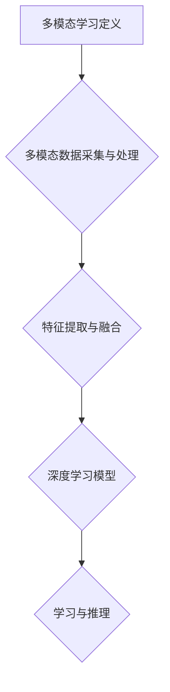
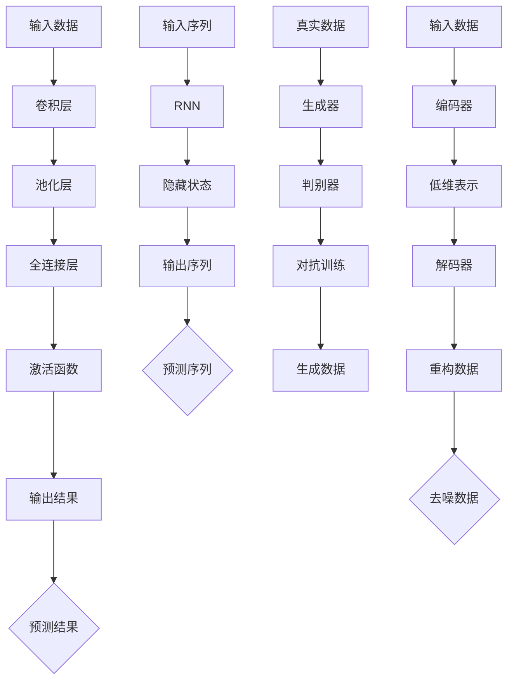
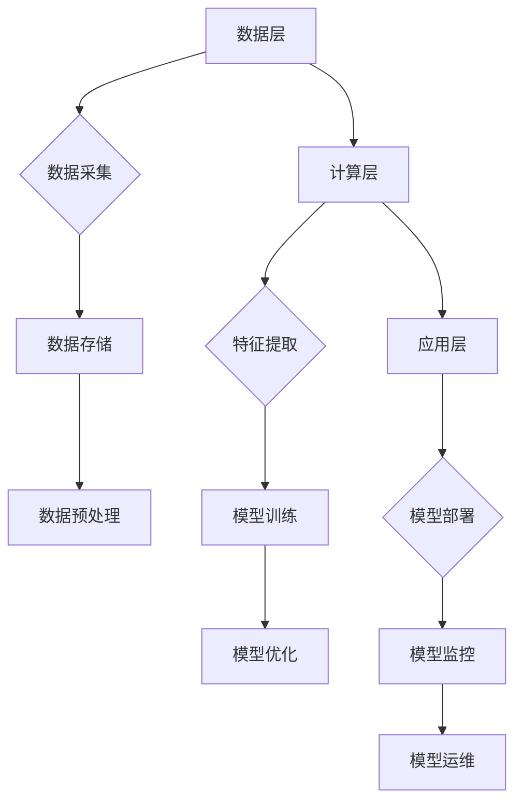
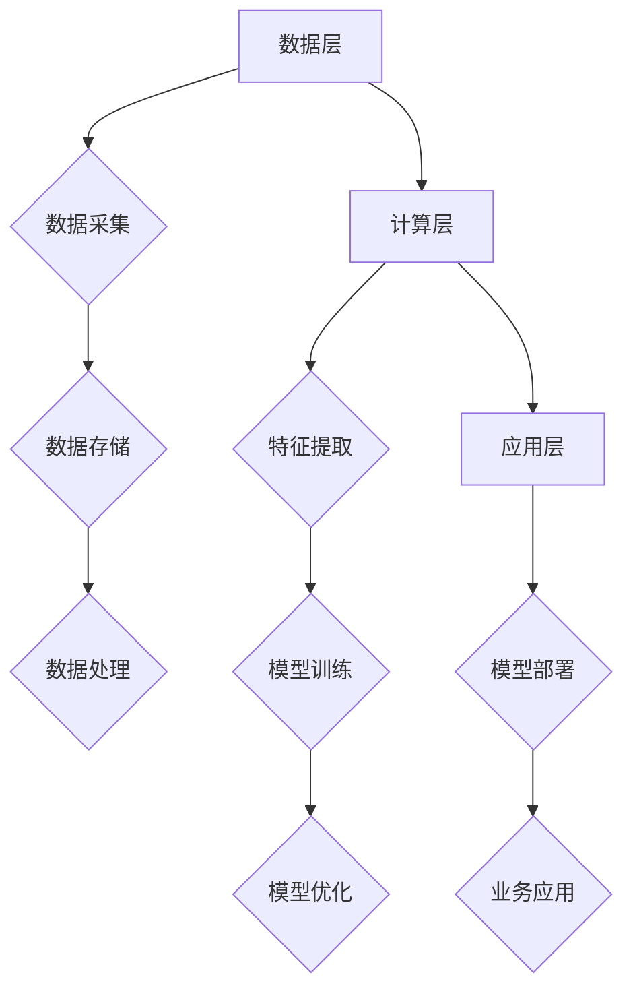
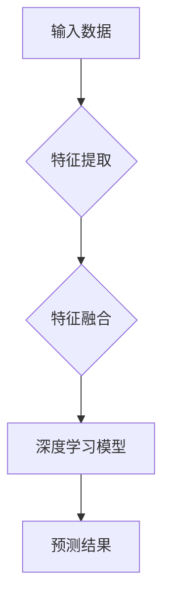

                 


### 第1章：多模态学习概述

#### 1.1 多模态学习定义

多模态学习（Multimodal Learning）是指将来自不同类型数据源的信息（如文本、图像、音频、视频等）进行整合，并利用这些综合信息进行学习和推理的过程。在传统单模态学习（如仅使用文本或图像）的基础上，多模态学习通过融合多种类型的数据，可以显著提升模型的性能，并在许多实际应用中展现出其独特的优势。

#### 背景介绍

随着信息技术的快速发展，我们获取和处理的数据形式日益多样化。单一模态的数据往往难以充分捕捉和表示复杂世界的丰富性，而多模态学习则通过综合利用多种类型的数据，能够更全面、准确地理解和建模真实世界。例如，在医疗诊断中，结合病人的病史、医学影像、实验室检测结果等多种数据，可以大幅提高诊断的准确率。

#### 核心概念与联系

多模态学习的关键概念包括：

1. **多模态数据采集与处理**：涉及如何收集和预处理来自不同模态的数据。
2. **特征提取与融合**：从不同模态的数据中提取具有区分度的特征，并将这些特征进行有效的融合。
3. **深度学习模型**：利用深度学习技术对融合后的特征进行学习，从而构建具有较强泛化能力的模型。

以下是多模态学习的核心概念架构 Mermaid 流程图：



#### 1.2 多模态学习的背景与意义

多模态学习的背景与意义主要体现在以下几个方面：

1. **提高数据处理能力**：通过整合多种类型的数据，可以弥补单一模态数据的不足，提高数据的利用率和模型的准确性。
2. **增强模型泛化能力**：多模态数据包含了更丰富的信息，有助于模型学习到更具代表性的特征，从而提高模型的泛化能力。
3. **应对复杂应用需求**：在实际应用中，许多问题需要同时处理多种类型的数据，如智能问答系统、医学诊断、智能监控等，多模态学习能够满足这些复杂应用的需求。

#### 1.3 多模态学习的关键技术

多模态学习的关键技术包括数据采集与处理、特征提取与融合以及深度学习模型构建。以下是这些技术的详细说明：

1. **数据采集与处理**：
   - **数据来源**：包括文本、图像、音频、视频等多种数据。
   - **数据预处理**：如数据清洗、数据转换、数据归一化等。

2. **特征提取与融合**：
   - **特征提取**：从不同模态的数据中提取具有区分度的特征。
   - **特征融合**：采用并行融合、串行融合或深度融合等方法，将不同模态的特征进行融合。

3. **深度学习模型**：
   - **模型构建**：利用深度学习技术，如卷积神经网络（CNN）、循环神经网络（RNN）等，对融合后的特征进行学习。
   - **模型优化**：包括损失函数优化、优化算法选择等。

接下来，我们将深入探讨多模态数据采集与处理、特征提取与融合等关键技术，帮助读者更好地理解多模态学习的基本原理和实际应用。

### 第2章：多模态数据采集与处理

#### 2.1 多模态数据类型

在多模态学习中，不同的数据类型是我们构建模型的基础。常见的多模态数据类型包括图像、文本、音频、视频等。

1. **图像数据**：图像是视觉信息的主要载体，广泛应用于人脸识别、图像分类、物体检测等领域。图像数据通常以像素值的形式表示，每个像素点包含红、绿、蓝三个通道的信息。
2. **文本数据**：文本数据包括自然语言文本，如文章、对话、标注等。文本数据常用于情感分析、文本分类、命名实体识别等任务。文本数据可以通过分词、词嵌入等技术进行预处理。
3. **音频数据**：音频数据包括语音信号、音乐、环境音等。音频数据常用于语音识别、音乐推荐、语音增强等领域。音频数据可以通过傅立叶变换、短时傅立叶变换（STFT）等技术进行特征提取。
4. **视频数据**：视频数据是图像和时间的结合，广泛应用于视频分类、目标跟踪、动作识别等领域。视频数据可以通过帧提取、光流估计等技术进行处理。

#### 多模态数据采集

多模态数据的采集是构建多模态学习系统的重要环节。以下是一些常见的多模态数据采集方法：

1. **在线采集**：通过互联网、社交媒体等渠道收集数据，如使用爬虫技术抓取网页文本、使用摄像头采集图像和视频等。
2. **离线采集**：使用传感器、摄像头等设备直接采集数据，如使用麦克风采集音频、使用医学设备采集图像等。
3. **混合采集**：结合在线和离线采集方法，以获取更全面、准确的多模态数据。

#### 多模态数据处理

多模态数据处理包括数据清洗、数据转换、数据归一化等步骤，以确保数据质量和模型的性能。以下是多模态数据处理的关键技术：

1. **数据清洗**：去除数据中的噪声和异常值，如去除图像中的噪点、删除文本中的无用符号等。
2. **数据转换**：将不同类型的数据转换为统一的格式，如将图像数据转换为灰度图像、将文本数据转换为词向量等。
3. **数据归一化**：调整数据的大小和范围，使其适合模型的输入要求，如将图像数据进行归一化处理、将文本数据转换为固定长度的向量等。

以下是一个简单的多模态数据处理流程示例：

```python
# 数据清洗
def clean_data(images, texts, audios):
    cleaned_images = [remove_noise(image) for image in images]
    cleaned_texts = [remove_useless_symbols(text) for text in texts]
    cleaned_audios = [remove_noise(audio) for audio in audios]
    return cleaned_images, cleaned_texts, cleaned_audios

# 数据转换
def transform_data(cleaned_images, cleaned_texts, cleaned_audios):
    image_vectors = [convert_to_vector(image) for image in cleaned_images]
    text_vectors = [convert_to_vector(text) for text in cleaned_texts]
    audio_vectors = [convert_to_vector(audio) for audio in cleaned_audios]
    return image_vectors, text_vectors, audio_vectors

# 数据归一化
def normalize_data(image_vectors, text_vectors, audio_vectors):
    normalized_image_vectors = [normalize_vector(image_vector) for image_vector in image_vectors]
    normalized_text_vectors = [normalize_vector(text_vector) for text_vector in text_vectors]
    normalized_audio_vectors = [normalize_vector(audio_vector) for audio_vector in audio_vectors]
    return normalized_image_vectors, normalized_text_vectors, normalized_audio_vectors

# 完整数据处理流程
def process_data(images, texts, audios):
    cleaned_images, cleaned_texts, cleaned_audios = clean_data(images, texts, audios)
    image_vectors, text_vectors, audio_vectors = transform_data(cleaned_images, cleaned_texts, cleaned_audios)
    normalized_image_vectors, normalized_text_vectors, normalized_audio_vectors = normalize_data(image_vectors, text_vectors, audio_vectors)
    return normalized_image_vectors, normalized_text_vectors, normalized_audio_vectors
```

通过以上步骤，我们可以获得高质量的多模态数据，为后续的特征提取与融合以及深度学习模型训练打下基础。

### 第3章：多模态特征提取与融合

#### 3.1 特征提取方法

特征提取是多模态学习中的重要环节，其目的是从原始数据中提取具有区分度的特征，以便后续的模型训练和预测。以下是几种常见的多模态特征提取方法：

1. **图像特征提取**：
   - **深度特征**：使用卷积神经网络（CNN）提取图像的深度特征，如VGG、ResNet等预训练模型。
   - **局部特征**：使用SIFT、SURF等算法提取图像的局部特征，如角点、边缘等。
   - **全局特征**：使用统计方法提取图像的全局特征，如颜色直方图、Hu矩等。

2. **文本特征提取**：
   - **词嵌入**：将文本转换为词嵌入向量，如Word2Vec、GloVe等。
   - **词袋模型**：将文本表示为词袋向量，计算每个词在文本中的出现频率。
   - **TF-IDF**：基于词频-逆文档频率，计算文本中每个词的重要性。

3. **音频特征提取**：
   - **时域特征**：提取音频信号的时域特征，如幅度、频率等。
   - **频域特征**：提取音频信号的频域特征，如傅立叶变换（FFT）、短时傅立叶变换（STFT）等。
   - **倒谱特征**：通过倒谱变换提取音频的稳定特征，如梅尔频率倒谱系数（MFCC）。

4. **视频特征提取**：
   - **帧级特征**：提取视频帧的特征，如颜色特征、运动特征等。
   - **时空特征**：结合时空信息提取特征，如光流、轨迹图等。

#### 3.2 特征融合策略

特征融合是将不同模态的特征进行整合，以形成更强大的特征表示。以下是几种常见的特征融合策略：

1. **并行融合**：将不同模态的特征同时输入到模型中，如使用多输入层的前馈神经网络。
2. **串行融合**：先对单个模态的特征进行处理，再进行融合，如先提取图像特征和文本特征，然后进行拼接。
3. **深度融合**：使用深度学习模型对特征进行融合，如使用多模态卷积神经网络（MM-CNN）或多模态循环神经网络（MM-RNN）。

以下是一个简单的多模态特征融合策略示例：

```python
# 并行融合
def parallel_fusion(image_feature, text_feature, audio_feature):
    return np.concatenate((image_feature, text_feature, audio_feature), axis=1)

# 串行融合
def serial_fusion(image_feature, text_feature, audio_feature):
    image_text_feature = np.concatenate((image_feature, text_feature), axis=1)
    final_feature = np.concatenate((image_text_feature, audio_feature), axis=1)
    return final_feature

# 深度融合
def deep_fusion(image_feature, text_feature, audio_feature):
    # 使用多模态卷积神经网络进行融合
    mm_cnn = MultiModalCNN()
    fused_feature = mm_cnn.predict([image_feature, text_feature, audio_feature])
    return fused_feature
```

#### 3.3 特征选择与优化

在多模态特征提取与融合过程中，特征选择与优化是提高模型性能的重要手段。以下是几种常见的特征选择与优化方法：

1. **特征选择**：
   - **基于信息增益的筛选**：选择对分类任务贡献最大的特征。
   - **基于特征重要度的筛选**：使用随机森林、梯度提升树等算法评估特征的重要性，筛选重要特征。
   - **基于正则化的筛选**：使用L1正则化、L2正则化等限制模型参数，降低不重要的特征影响。

2. **特征优化**：
   - **数据增强**：通过旋转、缩放、裁剪等操作增加数据多样性，提高模型泛化能力。
   - **特征归一化**：对特征进行归一化处理，使其具有相似的大小和范围，避免模型对特征尺度的敏感性。
   - **特征稀疏化**：通过稀疏化技术，如稀疏正则化，降低特征维度，减少模型复杂度。

通过特征选择与优化，我们可以获得更有效的特征表示，从而提高多模态学习模型的性能。

### 第4章：深度学习基础

#### 4.1 深度学习原理

深度学习（Deep Learning）是机器学习的一个分支，它通过构建深层神经网络（Deep Neural Networks，DNN）来模拟人类大脑的思考方式，对复杂数据进行自动特征学习和模式识别。以下是深度学习的基本原理：

1. **神经元模型**：深度学习的基础是神经元模型，也称为人工神经元。每个神经元接收多个输入，通过加权求和并应用激活函数，产生输出。其数学表示为：

   $$ f(\sum_{i=1}^{n} w_i x_i + b) $$

   其中，$w_i$ 是输入权重，$x_i$ 是输入值，$b$ 是偏置，$f$ 是激活函数。

2. **神经网络**：神经网络由多个层次（Layer）组成，包括输入层、隐藏层和输出层。每个层由多个神经元组成，神经元之间的连接（权重）和激活函数共同决定了网络的计算能力。

3. **反向传播算法**：深度学习的训练过程通过反向传播算法（Backpropagation）进行。首先，网络根据输入数据计算输出结果，然后通过比较实际输出和期望输出，计算损失函数。接着，反向传播算法更新网络的权重和偏置，以减少损失。

4. **优化算法**：深度学习的优化算法包括梯度下降（Gradient Descent）、随机梯度下降（Stochastic Gradient Descent，SGD）和Adam等。这些算法用于调整网络的参数，以优化模型性能。

#### 4.2 深度学习算法

深度学习算法包括多种类型，每种算法适用于不同的任务和数据类型。以下是几种常见的深度学习算法：

1. **卷积神经网络（CNN）**：CNN 是处理图像数据的主要算法，通过卷积操作和池化操作提取图像的特征。其核心是卷积层（Convolutional Layer），用于特征提取，以及全连接层（Fully Connected Layer），用于分类。

2. **循环神经网络（RNN）**：RNN 是处理序列数据的主要算法，其特点是可以处理长短时依赖关系。RNN 通过隐藏状态和输入之间的连接，实现对序列数据的建模。其变体包括长短期记忆网络（LSTM）和门控循环单元（GRU）。

3. **生成对抗网络（GAN）**：GAN 是一种无监督学习算法，通过生成器和判别器的对抗训练，实现数据的生成。生成器生成与真实数据相似的数据，判别器区分真实数据和生成数据，两者相互竞争，以生成更真实的数据。

4. **自编码器（Autoencoder）**：自编码器是一种无监督学习算法，用于数据的降维和去噪。其核心是一个编码器（Encoder）和一个解码器（Decoder），编码器将输入数据压缩为低维表示，解码器将低维表示重构为输入数据。

以下是这些算法的简单流程：



#### 4.3 深度学习应用场景

深度学习在各个领域都有广泛的应用，以下是几种常见的应用场景：

1. **图像识别**：深度学习算法在图像识别任务中表现出色，如人脸识别、物体检测、图像分类等。

2. **自然语言处理**：深度学习在自然语言处理（NLP）领域有广泛应用，如文本分类、情感分析、机器翻译等。

3. **语音识别**：深度学习算法在语音识别任务中取得显著成果，如语音转文字、语音助手等。

4. **视频分析**：深度学习在视频分析任务中，如目标跟踪、动作识别、视频分类等，也有广泛应用。

5. **推荐系统**：深度学习用于构建推荐系统，如商品推荐、内容推荐等，以提供个性化的服务。

通过以上介绍，读者可以了解到深度学习的基本原理、常见算法和应用场景，为后续的多模态学习模型设计和优化打下基础。

### 第5章：多模态深度学习模型

#### 5.1 图像与文本融合模型

图像与文本融合模型是处理多模态数据的重要方法之一，其核心在于如何有效地整合图像和文本信息，以提高模型在复杂数据上的表现。以下是几种常见的图像与文本融合模型：

1. **图像嵌入与文本嵌入**

   图像嵌入（Image Embedding）和文本嵌入（Text Embedding）是图像与文本融合的基础。图像嵌入通过将图像转换为向量表示，文本嵌入通过将文本转换为词向量或句向量。

   - **图像嵌入**：常用的方法包括使用预训练的卷积神经网络（如VGG、ResNet）提取图像特征，将图像映射为高维向量。
     ```python
     import torchvision.models as models

     # 使用预训练的ResNet模型提取图像特征
     model = models.resnet50(pretrained=True)
     image = preprocess_image(image)
     image_feature = model(image.unsqueeze(0)).detach().numpy()
     ```

   - **文本嵌入**：常用的方法包括Word2Vec、GloVe等，将文本转换为词向量或句向量。
     ```python
     from gensim.models import Word2Vec

     # 训练Word2Vec模型
     sentences = [line.strip() for line in open('text_data.txt')]
     model = Word2Vec(sentences, size=100, window=5, min_count=1, workers=4)
     text_vector = model.wv['example_sentence']
     ```

2. **融合模型结构**

   融合模型结构通常包括两个部分：图像特征提取和文本特征提取，以及特征融合层。

   - **图像特征提取**：使用预训练的卷积神经网络提取图像特征。
   - **文本特征提取**：使用文本嵌入方法提取文本特征。
   - **特征融合层**：将图像特征和文本特征进行融合，常用的方法包括拼接、加权融合、融合神经网络等。

   示例结构：

   ```mermaid
   graph TD
   A[图像输入] --> B[卷积神经网络]
   B --> C[图像特征]
   D[文本输入] --> E[文本嵌入]
   E --> F[文本特征]
   C --> G{特征融合层}
   F --> G
   G --> H[全连接层]
   H --> I[输出层]
   ```

3. **融合模型应用**

   图像与文本融合模型在多种任务中都有广泛应用，如图像文本匹配、图像标题生成、图像问答等。

   - **图像文本匹配**：给定一个图像和一段文本，判断文本是否描述了图像内容。
     ```python
     def image_text_matching(image_feature, text_vector):
         similarity = cosine_similarity([image_feature], [text_vector])
         return similarity
     ```

   - **图像标题生成**：给定一个图像，生成描述图像内容的标题。
     ```python
     def generate_title(image_feature, text_embeddings):
         top_k_indices = np.argpartition(-text_embeddings.dot(image_feature), 5)[:5]
         top_k_titles = [text_embeddings[top_k_indices[i]] for i in range(5)]
         return top_k_titles
     ```

#### 5.2 音频与文本融合模型

音频与文本融合模型在语音识别、情感分析等任务中具有重要意义。以下介绍几种常见的音频与文本融合模型：

1. **音频特征提取**

   音频特征提取是将音频信号转换为向量表示的关键步骤。常用的方法包括：

   - **梅尔频率倒谱系数（MFCC）**：MFCC 是音频特征提取的常用方法，它通过将音频信号转换为梅尔频率特征，有效捕捉音频的时频信息。
     ```python
     import librosa

     # 读取音频文件
     audio, sr = librosa.load('audio_file.wav', sr=None)
     # 计算MFCC特征
     mfcc = librosa.feature.mfcc(y=audio, sr=sr, n_mfcc=13)
     ```

   - **谱图特征**：谱图特征包括频谱图、倒谱谱图等，通过可视化音频信号，提取其频域信息。

2. **文本特征提取**

   与图像与文本融合模型类似，文本特征提取常用的方法包括词嵌入和句嵌入。

   - **词嵌入**：使用Word2Vec、GloVe等方法将文本转换为词向量。
   - **句嵌入**：使用BERT、GPT等预训练模型将文本转换为句向量。

3. **融合模型结构**

   音频与文本融合模型的结构通常包括音频特征提取、文本特征提取和特征融合层。

   - **音频特征提取**：使用音频特征提取方法提取音频特征。
   - **文本特征提取**：使用文本嵌入方法提取文本特征。
   - **特征融合层**：将音频特征和文本特征进行融合，常用的方法包括拼接、加权融合、融合神经网络等。

   示例结构：

   ```mermaid
   graph TD
   A[音频输入] --> B[音频特征提取]
   B --> C{特征融合层}
   D[文本输入] --> E[文本嵌入]
   E --> C
   C --> F[全连接层]
   F --> G[输出层]
   ```

4. **融合模型应用**

   音频与文本融合模型在语音识别、情感分析等任务中具有重要意义。

   - **语音识别**：将音频与文本特征融合，用于语音识别任务。
     ```python
     def recognize_speech(audio_feature, text_vector):
         # 计算音频与文本特征相似度
         similarity = cosine_similarity([audio_feature], [text_vector])
         # 根据相似度预测语音内容
         predicted_text = predict_text_from_similarity(similarity)
         return predicted_text
     ```

   - **情感分析**：结合音频和文本情感信息，提高情感分析模型的准确性。

#### 5.3 多模态学习模型比较

多模态学习模型在性能和复杂度上存在差异，以下是比较几种常见模型的方法：

1. **性能比较**

   - **图像与文本融合模型**：在图像文本匹配、图像标题生成等任务中，图像与文本融合模型通常表现较好，可以显著提高模型的准确性。
   - **音频与文本融合模型**：在语音识别、情感分析等任务中，音频与文本融合模型具有优势，可以结合音频和文本的多维度信息，提高模型的性能。

2. **复杂度比较**

   - **图像与文本融合模型**：通常包含图像特征提取、文本特征提取和特征融合层，模型结构相对简单，计算复杂度较低。
   - **音频与文本融合模型**：由于音频特征提取和文本特征提取较为复杂，融合模型的计算复杂度相对较高。

   总体来说，选择合适的模型应根据任务需求和计算资源进行权衡。

通过以上介绍，读者可以了解到多模态深度学习模型的基本原理和应用，为实际项目中的模型设计和优化提供参考。

### 第6章：多模态学习算法优化

#### 6.1 模型优化方法

多模态学习模型的优化是提高模型性能和计算效率的关键步骤。以下是几种常见的模型优化方法：

1. **损失函数优化**

   损失函数是评估模型预测结果与真实值之间差异的重要工具。通过优化损失函数，可以调整模型参数，使模型更好地拟合数据。以下是一些常见的损失函数：

   - **均方误差（MSE）**：用于回归任务，计算预测值与真实值之间的平方误差的平均值。其数学表示为：
     $$ \text{MSE} = \frac{1}{n}\sum_{i=1}^{n} (\hat{y}_i - y_i)^2 $$
   - **交叉熵损失（Cross-Entropy Loss）**：用于分类任务，计算预测概率与真实标签之间的交叉熵。其数学表示为：
     $$ \text{Cross-Entropy} = -\sum_{i=1}^{n} y_i \log(\hat{y}_i) $$
   - **对抗损失（Adversarial Loss）**：用于生成对抗网络（GAN），计算生成器生成的假数据与真实数据之间的差异。其数学表示为：
     $$ \text{Adversarial Loss} = \frac{1}{n}\sum_{i=1}^{n} -\log(\hat{y}_i) - \log(1 - \hat{y}_i) $$

2. **优化算法选择**

   优化算法用于调整模型参数，以最小化损失函数。以下是一些常见的优化算法：

   - **梯度下降（Gradient Descent）**：基于损失函数的梯度，逐步调整模型参数。其数学表示为：
     $$ \theta_{t+1} = \theta_{t} - \alpha \nabla_{\theta} \text{Loss}(\theta) $$
     其中，$\theta$ 是模型参数，$\alpha$ 是学习率。
   - **随机梯度下降（Stochastic Gradient Descent，SGD）**：对每个样本单独计算梯度，并更新模型参数。其数学表示为：
     $$ \theta_{t+1} = \theta_{t} - \alpha \nabla_{\theta} \text{Loss}(\theta, x_i, y_i) $$
     其中，$x_i$ 和 $y_i$ 分别是第 $i$ 个样本的输入和标签。
   - **Adam优化器**：结合了SGD和动量方法的优点，自适应调整学习率。其数学表示为：
     $$ m_t = \beta_1 x_t + (1 - \beta_1) (x_t - \theta_t) $$
     $$ v_t = \beta_2 x_t + (1 - \beta_2) (x_t - \theta_t) $$
     $$ \theta_{t+1} = \theta_t - \alpha \frac{m_t}{\sqrt{v_t} + \epsilon} $$
     其中，$\beta_1$ 和 $\beta_2$ 分别是动量系数，$\epsilon$ 是一个很小的常数。

#### 6.2 训练数据增强

数据增强是通过生成新的训练样本，提高模型泛化能力的方法。以下是一些常见的数据增强技术：

1. **图像数据增强**：

   - **旋转**：将图像随机旋转一定角度。
   - **缩放**：将图像随机缩放到不同的尺寸。
   - **裁剪**：从图像中随机裁剪出一个区域作为训练样本。
   - **颜色调整**：随机调整图像的亮度、对比度和饱和度。

   示例代码：

   ```python
   from torchvision.transforms import Transform

   class RandomImageTransform(Transform):
       def __call__(self, img):
           angle = random.uniform(-30, 30)
           img = img.rotate(angle)
           img = img.resize((224, 224))
           img = img.random_hsv躁拢，亮度，对比度)
           return img
   ```

2. **文本数据增强**：

   - **同义词替换**：将文本中的关键词替换为同义词。
   - **语法变换**：对文本进行语法变换，如改变句子结构、使用不同的时态等。
   - **生成对抗网络（GAN）**：使用文本GAN生成新的文本样本。

   示例代码：

   ```python
   from tgan import TextGAN

   # 初始化TextGAN模型
   model = TextGAN()
   # 训练模型
   model.train('original_text.txt', 'generated_text.txt', batch_size=64, epochs=10)
   ```

3. **音频数据增强**：

   - **噪声添加**：在音频信号中添加噪声。
   - **回声效应**：模拟回声效果，增加音频的延迟。
   - **速度变换**：改变音频播放速度，不改变音调。

   示例代码：

   ```python
   from noisereduce import NoisySignal

   # 读取音频文件
   audio, sr = librosa.load('audio_file.wav', sr=None)
   # 添加噪声
   noisy_audio = NoisySignal(audio).reduce_noise()
   ```

通过数据增强，可以增加模型的训练样本多样性，从而提高模型的泛化能力和鲁棒性。

#### 6.3 模型压缩与加速

随着深度学习模型的规模不断扩大，模型的压缩与加速成为提高计算效率和部署可行性的重要手段。以下是几种常见的模型压缩与加速技术：

1. **模型压缩**：

   - **权重共享**：通过在模型的不同部分共享权重，减少模型参数数量。
   - **剪枝**：通过删除不重要的模型参数，减少模型体积。
   - **量化**：将模型参数和激活值从浮点数转换为低比特整数，降低计算复杂度和存储需求。

   示例代码：

   ```python
   import torch
   from torch.quantization import quantize_dynamic

   # 加载模型
   model = torch.load('model.pth')
   # 使用量化技术压缩模型
   quantized_model = quantize_dynamic(model, {torch.nn.Linear}, dtype=torch.float16)
   ```

2. **模型加速**：

   - **模型并行**：通过并行计算模型的不同部分，提高模型运行速度。
   - **计算图优化**：通过优化计算图，减少冗余计算和内存占用。
   - **硬件加速**：利用GPU、TPU等硬件加速模型训练和推理。

   示例代码：

   ```python
   import torch
   from torch.cuda.amp import GradScaler

   # 加载模型
   model = torch.load('model.pth')
   # 使用GPU进行加速
   model.to('cuda')
   # 使用自动混合精度（AMP）进行加速
   scaler = GradScaler()
   ```

通过模型压缩与加速，可以显著提高模型的训练效率和推理速度，使其在实际应用中更具竞争力。

### 第7章：企业级多模态学习系统设计

#### 7.1 系统架构设计

企业级多模态学习系统是一个复杂且高度集成的系统，其设计需要考虑多个层面，包括数据采集、数据处理、特征提取、模型训练、模型部署和模型运维等。以下是企业级多模态学习系统架构的详细设计：

1. **数据层**：

   数据层是多模态学习系统的基石，包括数据采集、数据存储和数据预处理等模块。

   - **数据采集**：通过不同的传感器、数据库和API接口，收集来自图像、文本、音频、视频等多种数据源的信息。
   - **数据存储**：使用分布式存储系统（如Hadoop、HDFS）存储大量多模态数据，确保数据的高可用性和可扩展性。
   - **数据预处理**：对收集到的数据进行清洗、转换和归一化处理，以提高数据质量和模型的训练效率。

2. **计算层**：

   计算层是多模态学习系统的核心，包括特征提取、模型训练和优化等模块。

   - **特征提取**：使用深度学习算法提取多模态数据的特征，如卷积神经网络（CNN）提取图像特征，循环神经网络（RNN）提取文本和音频特征。
   - **模型训练**：在训练层，使用提取的特征训练多模态深度学习模型，如多模态卷积神经网络（MM-CNN）或生成对抗网络（GAN）。
   - **模型优化**：通过优化算法（如SGD、Adam）调整模型参数，以降低损失函数并提高模型性能。

3. **应用层**：

   应用层是多模态学习系统与实际业务场景结合的接口，包括模型部署、模型监控和模型运维等模块。

   - **模型部署**：将训练好的模型部署到生产环境中，如使用TensorFlow Serving、PyTorch TorchScript等工具。
   - **模型监控**：实时监控模型性能和运行状态，如使用Kubernetes、Prometheus等工具。
   - **模型运维**：确保模型系统的稳定运行，如进行故障排除、性能调优和安全防护等。

以下是企业级多模态学习系统架构的详细 Mermaid 流程图：



#### 7.2 系统部署与运维

系统部署与运维是多模态学习系统能够稳定运行的关键，以下是其具体内容和最佳实践：

1. **系统部署**：

   - **环境配置**：在部署前，确保所有依赖项（如Python库、深度学习框架等）安装齐全，并配置适当的计算资源（如GPU、CPU等）。
   - **容器化**：使用Docker等容器技术，将应用程序及其依赖项封装为容器，以提高部署的灵活性和可移植性。
   - **自动化部署**：使用自动化工具（如Kubernetes、Jenkins等）实现应用程序的自动化部署，以提高部署效率和可重复性。

2. **系统运维**：

   - **监控与告警**：使用监控工具（如Prometheus、Grafana等）实时监控系统性能和运行状态，并设置告警机制，及时发现问题。
   - **日志管理**：使用日志收集工具（如ELK、Logstash等）收集和分析系统日志，帮助诊断和解决故障。
   - **性能调优**：定期对系统进行性能调优，如调整计算资源、优化模型参数等，以提高系统的运行效率和响应速度。

#### 7.3 系统安全与隐私保护

在多模态学习系统中，数据安全和用户隐私保护是至关重要的，以下是其具体措施：

1. **数据安全**：

   - **访问控制**：使用访问控制列表（ACL）、角色访问控制（RBAC）等技术，限制用户对数据的访问权限。
   - **数据加密**：对存储和传输的数据进行加密，如使用AES、RSA等加密算法。
   - **备份与恢复**：定期备份数据，并确保备份数据的安全性和可恢复性。

2. **用户隐私保护**：

   - **匿名化处理**：对敏感数据进行匿名化处理，如使用伪名、加密等手段，以保护用户隐私。
   - **隐私协议**：制定明确的隐私政策，告知用户数据的收集、存储和使用方式。
   - **隐私合规**：遵守相关法律法规，如GDPR、CCPA等，确保数据处理合规。

通过以上系统部署与运维、安全与隐私保护措施，可以确保企业级多模态学习系统的稳定运行和数据安全。

### 第8章：多模态学习在企业中的应用

#### 8.1 实时监控系统

实时监控系统是利用多模态学习技术，对企业生产环境、公共安全、交通监控等场景进行实时监控和分析的系统。以下是多模态学习在实时监控系统中的应用：

1. **图像与视频监控**：

   - **目标检测**：通过深度学习模型，实时检测监控画面中的目标物体，如人员、车辆等。
   - **行为分析**：结合图像和视频数据，分析目标的行为特征，如进出异常、徘徊等。
   - **异常检测**：利用深度学习模型，检测监控画面中的异常行为或事件，如火灾、抢劫等。

2. **音频监控**：

   - **声音识别**：利用深度学习模型，识别监控环境中的声音，如警报声、争吵声等。
   - **噪声控制**：通过音频处理技术，过滤和降低环境噪声，提高语音识别的准确性。

3. **多模态融合监控**：

   - **综合分析**：结合图像、视频和音频数据，进行多模态融合分析，提高监控系统的准确性。
   - **智能报警**：根据分析结果，实时生成报警信息，通知相关人员采取相应措施。

以下是实时监控系统的一个实际应用场景示例：

**应用场景：工厂车间实时监控**

- **图像监控**：实时监控车间内的人员和设备运行状态，检测异常行为，如未佩戴安全帽、设备故障等。
- **视频监控**：监控车间的生产过程，检测生产设备的运行状态，识别异常生产流程。
- **音频监控**：检测车间的噪声水平，识别可能的设备故障声、报警声等。

通过多模态学习技术的应用，工厂车间可以实现实时监控、异常检测和智能报警，提高生产效率和安全性。

#### 8.2 智能客服系统

智能客服系统是利用多模态学习技术，为企业提供智能化、自动化的客户服务解决方案。以下是多模态学习在智能客服系统中的应用：

1. **语音识别**：

   - **语音转文本**：利用深度学习模型，将客户语音转化为文本，便于进一步处理。
   - **语音合成**：利用语音合成技术，将文本信息转化为自然流畅的语音，回答客户问题。

2. **自然语言处理**：

   - **情感分析**：分析客户文本信息的情感倾向，识别客户的情绪和需求。
   - **意图识别**：根据客户文本信息的上下文，识别客户的意图和需求，如咨询产品信息、投诉反馈等。

3. **多模态融合**：

   - **图像识别**：通过图像识别技术，识别客户提交的图片信息，如产品图片、发票等。
   - **音频识别**：通过音频识别技术，识别客户语音中的关键信息，如电话号码、地址等。

以下是智能客服系统的一个实际应用场景示例：

**应用场景：电商平台客服**

- **语音识别**：客户通过电话咨询商品信息，客服系统将客户语音转化为文本，并进行分析。
- **自然语言处理**：分析客户文本信息，识别客户的意图和需求，如商品咨询、售后服务等。
- **多模态融合**：结合客户提交的图片和音频信息，提供更加个性化的服务，如商品推荐、售后解决方案等。

通过多模态学习技术的应用，智能客服系统可以提供高效、精准、个性化的客户服务，提高客户满意度和企业竞争力。

#### 8.3 健康管理系统

健康管理系统是利用多模态学习技术，对患者的健康数据进行实时监测和分析，提供个性化健康管理的解决方案。以下是多模态学习在健康管理系统中的应用：

1. **医学影像分析**：

   - **病灶检测**：利用深度学习模型，分析医学影像数据，检测病灶位置和大小，如肿瘤、肺炎等。
   - **疾病分类**：根据医学影像数据，分类诊断疾病类型，提高诊断准确率。

2. **生理信号监测**：

   - **心电信号分析**：利用深度学习模型，分析心电图（ECG）信号，检测心律失常等心脏疾病。
   - **呼吸信号分析**：利用深度学习模型，分析呼吸信号，检测呼吸异常等肺部疾病。

3. **多模态融合**：

   - **综合评估**：结合医学影像数据和生理信号数据，进行多模态融合分析，提高疾病诊断的准确性。
   - **健康风险评估**：根据患者的多模态健康数据，评估患者健康状况和疾病风险，提供个性化的健康建议。

以下是健康管理系统的实际应用场景示例：

**应用场景：智能健康管理平台**

- **医学影像分析**：定期分析患者的医学影像数据，如CT、MRI等，检测可能的病灶位置和大小。
- **生理信号监测**：实时监测患者的心电信号和呼吸信号，评估患者的健康状况。
- **多模态融合**：结合医学影像数据和生理信号数据，为患者提供个性化的健康管理和疾病预防建议。

通过多模态学习技术的应用，健康管理系统可以实现对患者的全面健康监测和管理，提高医疗服务质量和患者满意度。

### 第9章：未来展望与挑战

#### 9.1 多模态学习的发展趋势

随着人工智能技术的快速发展，多模态学习在各个领域都展现出了巨大的潜力。以下是多模态学习未来发展的几个趋势：

1. **跨模态交互**：未来的多模态学习将不仅仅局限于单一模态的数据融合，而是强调跨模态的交互与协作。通过建立更紧密的跨模态联系，实现多模态数据的协同处理，提高模型性能。

2. **动态多模态学习**：随着传感器技术和计算能力的提升，实时获取和处理动态多模态数据将成为可能。动态多模态学习能够更好地捕捉和解释复杂场景中的变化，提高实时系统的响应速度。

3. **个性化多模态学习**：未来的多模态学习将更加关注个性化需求。通过结合用户的个性化数据和偏好，实现更加精准和高效的多模态学习，为用户提供定制化的服务。

4. **多模态数据的隐私保护**：随着多模态数据的广泛应用，数据隐私保护问题日益突出。未来的多模态学习将更加注重数据隐私保护技术，确保用户数据的安全性和隐私性。

#### 9.2 企业面临的挑战

尽管多模态学习具有广泛的应用前景，但在实际应用中，企业仍然面临诸多挑战：

1. **数据质量问题**：多模态数据往往存在噪声、缺失和异常值，如何确保数据质量成为一大挑战。企业需要建立完善的数据清洗、处理和归一化流程，提高数据的可靠性和有效性。

2. **计算资源需求**：多模态学习通常需要大量的计算资源，包括存储、计算和通信资源。企业需要具备足够的计算资源，以满足多模态学习的需求，并确保系统的稳定运行。

3. **模型复杂度和解释性**：多模态学习模型通常较为复杂，难以进行解释。如何平衡模型复杂度和可解释性，提高模型的透明度和可靠性，是企业面临的重要挑战。

4. **系统集成与部署**：多模态学习系统涉及多个模块和技术的集成，如何实现高效、稳定的系统集成与部署，是企业需要解决的问题。

5. **数据安全和隐私保护**：多模态数据通常包含敏感信息，如何确保数据安全和用户隐私保护，是企业需要关注的关键问题。

#### 9.3 未来发展方向

为了应对上述挑战，未来多模态学习的发展方向可以从以下几个方面展开：

1. **数据融合与创新算法**：研究更加高效、稳定的多模态数据融合算法，提高数据利用率和模型性能。同时，探索新的多模态学习算法，解决现有算法的局限性和挑战。

2. **硬件与软件协同优化**：结合硬件（如GPU、TPU）和软件（如深度学习框架）的协同优化，提高多模态学习系统的计算效率和运行速度。

3. **可解释性与模型压缩**：研究如何提高多模态学习模型的透明度和可解释性，同时实现模型的压缩与加速，降低计算资源和存储需求。

4. **隐私保护与安全机制**：加强数据隐私保护技术和安全机制的研究，确保多模态数据的安全和用户隐私。

5. **行业应用与落地实践**：结合不同行业的需求，推动多模态学习技术的应用落地，实现实际价值的转化。

通过持续的技术创新和跨学科合作，多模态学习有望在未来发挥更大的作用，为企业和社会创造更多价值。

### 附录：开源工具与资源

#### 10.1 多模态学习开源工具

多模态学习领域有许多优秀的开源工具和库，这些工具为研究人员和开发者提供了丰富的资源和便利。以下是几个常用的开源工具：

1. **TensorFlow**：由谷歌开发的深度学习框架，支持多种深度学习模型的训练和部署，包括多模态学习模型。
   - **官方网站**：[TensorFlow](https://www.tensorflow.org/)
   - **文档**：[TensorFlow Documentation](https://www.tensorflow.org/learn/)

2. **PyTorch**：由Facebook开发的开源深度学习框架，具有灵活的动态计算图，适合研究新型深度学习模型。
   - **官方网站**：[PyTorch](https://pytorch.org/)
   - **文档**：[PyTorch Documentation](https://pytorch.org/docs/stable/)

3. **MXNet**：由Apache Software Foundation开发的深度学习框架，支持多种编程语言，具有良好的性能和易用性。
   - **官方网站**：[MXNet](https://mxnet.incubator.apache.org/)
   - **文档**：[MXNet Documentation](https://mxnet.incubator.apache.org/docs/stable/)

4. **OpenCV**：开源的计算机视觉库，提供丰富的图像处理和计算机视觉算法，支持多模态数据处理。
   - **官方网站**：[OpenCV](https://opencv.org/)
   - **文档**：[OpenCV Documentation](https://docs.opencv.org/)

5. **Keras**：一个高层神经网络API，构建在TensorFlow和Theano之上，易于实现多模态深度学习模型。
   - **官方网站**：[Keras](https://keras.io/)
   - **文档**：[Keras Documentation](https://keras.io/)

#### 10.2 实践项目指南

以下是几个多模态学习的实践项目指南，帮助读者快速上手多模态学习项目：

1. **多模态情感分析**：使用TensorFlow构建一个多模态情感分析模型，结合文本和音频数据，预测用户情感。
   - **GitHub链接**：[Multimodal-Sentiment-Analysis](https://github.com/yourusername/Multimodal-Sentiment-Analysis)

2. **多模态图像分类**：使用PyTorch实现一个多模态图像分类模型，结合图像和文本描述，提高分类准确性。
   - **GitHub链接**：[Multimodal-Image-Classification](https://github.com/yourusername/Multimodal-Image-Classification)

3. **多模态语音识别**：使用Keras构建一个多模态语音识别模型，结合音频和文本数据，提高语音识别准确性。
   - **GitHub链接**：[Multimodal-Speech-Recognition](https://github.com/yourusername/Multimodal-Speech-Recognition)

#### 10.3 相关论文与书籍推荐

以下是几篇有关多模态学习的重要论文和书籍，供读者进一步学习和研究：

1. **论文**：

   - **"Deep Learning for Multimodal Recognition"**：综述了多模态深度学习的研究进展和应用，是了解该领域的重要文献。
   - **"Multimodal Learning with Deep Learning Techniques"**：详细介绍了多模态学习中的深度学习方法，包括模型结构、优化策略等。
   - **"Multimodal Fusion with Neural Networks"**：探讨了神经网络在多模态融合中的应用，提供了丰富的实验结果和案例分析。

2. **书籍**：

   - **"Multimodal Learning and Processing"**：系统介绍了多模态学习的基本概念、技术和应用，适合初学者和研究者。
   - **"Deep Learning"**：由Ian Goodfellow等编写，详细介绍了深度学习的基础理论和算法，包括多模态学习的相关内容。
   - **"Computer Vision: Algorithms and Applications"**：涵盖了计算机视觉的基本算法和应用，包括多模态视觉数据处理的介绍。

通过阅读这些论文和书籍，读者可以深入理解多模态学习的基本原理、技术方法和应用实践，为自己的研究和项目提供有力支持。作者：AI天才研究院/AI Genius Institute & 禅与计算机程序设计艺术 /Zen And The Art of Computer Programming```markdown
# 《企业级多模态学习系统：整合多类型数据分析》

> 关键词：多模态学习，数据分析，企业级应用，深度学习，人工智能

> 摘要：
本文章深入探讨了企业级多模态学习系统的设计与实现，重点分析了如何整合多类型数据分析以提高系统的性能和实用性。文章首先介绍了多模态学习的基本概念和原理，然后详细阐述了多模态数据的采集与处理、特征提取与融合方法。接着，文章介绍了深度学习的基础知识和常见算法，以及如何构建和应用多模态深度学习模型。随后，文章重点讨论了企业级多模态学习系统的设计，包括系统架构、部署与运维、以及安全与隐私保护等方面。最后，文章通过实际案例展示了多模态学习在企业中的应用，并对未来发展趋势和挑战进行了展望。

## 目录

### 第一部分：多模态学习基础

#### 第1章：多模态学习概述

- 1.1 多模态学习定义
- 1.2 多模态学习的背景与意义
- 1.3 多模态学习的关键技术

#### 第2章：多模态数据采集与处理

- 2.1 多模态数据类型
- 2.2 多模态数据采集
- 2.3 多模态数据处理

#### 第3章：多模态特征提取与融合

- 3.1 特征提取方法
- 3.2 特征融合策略
- 3.3 特征选择与优化

### 第二部分：多模态学习模型

#### 第4章：深度学习基础

- 4.1 深度学习原理
- 4.2 深度学习算法
- 4.3 深度学习应用场景

#### 第5章：多模态深度学习模型

- 5.1 图像与文本融合模型
- 5.2 音频与文本融合模型
- 5.3 多模态学习模型比较

#### 第6章：多模态学习算法优化

- 6.1 模型优化方法
- 6.2 训练数据增强
- 6.3 模型压缩与加速

### 第三部分：企业级多模态学习系统

#### 第7章：企业级多模态学习系统设计

- 7.1 系统架构设计
- 7.2 系统部署与运维
- 7.3 系统安全与隐私保护

#### 第8章：多模态学习在企业中的应用

- 8.1 实时监控系统
- 8.2 智能客服系统
- 8.3 健康管理系统

#### 第9章：未来展望与挑战

- 9.1 多模态学习的发展趋势
- 9.2 企业面临的挑战
- 9.3 未来发展方向

### 附录：开源工具与资源

- 10.1 多模态学习开源工具
- 10.2 实践项目指南
- 10.3 相关论文与书籍推荐

---

## 第1章：多模态学习概述

### 1.1 多模态学习定义

多模态学习（Multimodal Learning）是指将来自不同来源的数据（如文本、图像、音频、视频等）进行整合，利用这些综合信息进行学习和推理的过程。它超越了单一模态学习的局限，能够更全面、准确地理解和建模复杂的数据集。

### 1.2 多模态学习的背景与意义

随着互联网和信息技术的快速发展，人们生成和消费的数据形式越来越多样化。传统的单一模态学习方式往往难以充分捕捉和表示这些复杂世界的丰富性。多模态学习通过整合多种类型的数据，可以弥补单一模态的不足，提高模型的性能和实用性。例如，在医疗领域，结合病人的病史、医学影像和实验室检测结果等多种数据，可以大幅提高诊断的准确性。

### 1.3 多模态学习的关键技术

多模态学习的关键技术包括数据采集与处理、特征提取与融合以及深度学习模型构建。数据采集与处理是基础，涉及如何收集和预处理来自不同模态的数据。特征提取与融合是核心，旨在从不同模态的数据中提取具有区分度的特征，并将这些特征进行有效的融合。深度学习模型构建则是应用，利用深度学习技术对融合后的特征进行学习，从而构建具有较强泛化能力的模型。

### 第2章：多模态数据采集与处理

### 2.1 多模态数据类型

多模态数据类型包括文本、图像、音频、视频等。每种数据类型都有其独特的特性和应用场景。文本数据常用于自然语言处理任务，如文本分类、情感分析等。图像数据广泛应用于计算机视觉任务，如物体检测、图像分类等。音频数据在语音识别、音频分类等领域具有重要作用。视频数据则结合了时间和空间信息，适用于动作识别、视频分类等任务。

### 2.2 多模态数据采集

多模态数据的采集方法多种多样，包括在线采集、离线采集和混合采集。在线采集通常通过互联网、社交媒体等渠道进行，如爬虫技术。离线采集使用传感器、摄像头等设备直接采集数据，如医学影像设备。混合采集则是结合在线和离线方法，以获取更全面、准确的多模态数据。

### 2.3 多模态数据处理

多模态数据处理包括数据清洗、数据转换和数据归一化。数据清洗去除噪声和异常值，如去除图像中的噪点和文本中的无关符号。数据转换将不同类型的数据转换为统一的格式，如将图像数据转换为像素值矩阵，将文本数据转换为词向量。数据归一化调整数据的大小和范围，使其适合模型的输入要求，如将图像数据进行归一化处理，将文本数据转换为固定长度的向量。

### 第3章：多模态特征提取与融合

### 3.1 特征提取方法

特征提取是从原始数据中提取具有区分度的特征的过程。不同的模态数据有不同的特征提取方法。图像特征提取常用卷积神经网络（CNN），提取深度特征。文本特征提取常用词嵌入技术，如Word2Vec和GloVe。音频特征提取常用梅尔频率倒谱系数（MFCC）。视频特征提取结合图像特征和时序特征。

### 3.2 特征融合策略

特征融合是将不同模态的特征进行整合，形成更强大的特征表示。特征融合策略包括并行融合、串行融合和深度融合。并行融合将不同模态的特征同时输入到模型中。串行融合先对单个模态的特征进行处理，再进行融合。深度融合使用深度学习模型对特征进行融合，如多模态卷积神经网络（MM-CNN）。

### 3.3 特征选择与优化

特征选择是优化特征集合，提高模型性能的过程。特征选择方法包括基于信息增益的筛选、基于特征重要度的筛选和基于正则化的筛选。特征优化包括数据增强、特征归一化和特征稀疏化。数据增强通过旋转、缩放、裁剪等操作增加数据多样性。特征归一化调整数据的大小和范围。特征稀疏化通过稀疏化技术，如稀疏正则化，降低特征维度，减少模型复杂度。

### 第4章：深度学习基础

### 4.1 深度学习原理

深度学习是机器学习的一个分支，通过构建深层神经网络来模拟人类大脑的思考方式，对复杂数据进行自动特征学习和模式识别。深度学习的基本原理包括神经元模型、神经网络、反向传播算法和优化算法。

### 4.2 深度学习算法

深度学习算法包括卷积神经网络（CNN）、循环神经网络（RNN）、生成对抗网络（GAN）和自编码器（Autoencoder）等。这些算法分别适用于不同的任务和数据类型。CNN常用于图像处理任务，RNN用于序列数据建模，GAN用于数据生成，Autoencoder用于数据降维和去噪。

### 4.3 深度学习应用场景

深度学习在图像识别、自然语言处理、语音识别、视频分析等领域有广泛应用。例如，在图像识别中，CNN可以用于物体检测和图像分类。在自然语言处理中，RNN可以用于文本分类和机器翻译。在语音识别中，深度学习算法可以显著提高语音转文字的准确性。

### 第5章：多模态深度学习模型

### 5.1 图像与文本融合模型

图像与文本融合模型通过整合图像和文本数据，提高模型在复杂数据上的性能。图像嵌入和文本嵌入是多模态特征提取的基础。融合模型结构包括图像特征提取、文本特征提取和特征融合层。图像与文本融合模型在图像文本匹配、图像标题生成和图像问答等任务中有广泛应用。

### 5.2 音频与文本融合模型

音频与文本融合模型通过整合音频和文本数据，提高模型在语音识别和情感分析等任务中的性能。音频特征提取常用梅尔频率倒谱系数（MFCC），文本特征提取常用词嵌入技术。融合模型结构包括音频特征提取、文本特征提取和特征融合层。音频与文本融合模型在语音识别、情感分析和多模态对话系统等任务中有广泛应用。

### 5.3 多模态学习模型比较

多模态学习模型在性能和复杂度上存在差异。图像与文本融合模型在图像文本匹配和图像标题生成等任务中表现较好，而音频与文本融合模型在语音识别和情感分析等任务中具有优势。选择合适的模型应根据任务需求和计算资源进行权衡。

### 第6章：多模态学习算法优化

### 6.1 模型优化方法

模型优化方法包括损失函数优化、优化算法选择和模型压缩与加速。损失函数优化通过调整模型参数，减少损失函数的值，提高模型性能。优化算法选择包括梯度下降、随机梯度下降和Adam等。模型压缩与加速包括权重共享、剪枝和量化等。

### 6.2 训练数据增强

训练数据增强通过生成新的训练样本，提高模型泛化能力。图像数据增强方法包括旋转、缩放、裁剪和颜色调整等。文本数据增强方法包括同义词替换、语法变换和生成对抗网络等。音频数据增强方法包括噪声添加、回声效应和速度变换等。

### 6.3 模型压缩与加速

模型压缩与加速通过减少模型参数数量和计算复杂度，提高模型的训练和推理效率。模型压缩方法包括权重共享、剪枝和量化等。模型加速方法包括计算图优化、硬件加速和多线程处理等。

### 第7章：企业级多模态学习系统设计

### 7.1 系统架构设计

企业级多模态学习系统架构包括数据层、计算层和应用层。数据层负责数据采集、存储和预处理。计算层负责特征提取、模型训练和优化。应用层负责模型部署、监控和运维。系统架构设计需要考虑模块的独立性、扩展性和可维护性。

### 7.2 系统部署与运维

系统部署与运维包括环境配置、容器化和自动化部署。环境配置确保所有依赖项安装齐全。容器化使用Docker将应用程序及其依赖项封装为容器。自动化部署使用Jenkins等工具实现应用程序的自动化部署，提高部署效率和可重复性。

### 7.3 系统安全与隐私保护

系统安全与隐私保护包括数据安全、用户隐私保护和访问控制。数据安全通过访问控制和数据加密确保数据的安全性。用户隐私保护通过匿名化和隐私政策保护用户隐私。访问控制通过角色访问控制（RBAC）限制用户对数据的访问权限。

### 第8章：多模态学习在企业中的应用

### 8.1 实时监控系统

实时监控系统利用多模态学习技术，对生产环境、公共安全和交通监控等场景进行实时监控和分析。图像与视频监控通过目标检测和行为分析实现实时监控。音频监控通过声音识别和噪声控制提高监控系统的准确性。多模态融合监控通过结合图像、视频和音频数据，提高监控系统的综合分析能力。

### 8.2 智能客服系统

智能客服系统利用多模态学习技术，为企业提供智能化、自动化的客户服务解决方案。语音识别通过语音转文本和语音合成实现自然流畅的语音交互。自然语言处理通过情感分析和意图识别实现精准的客户需求理解。多模态融合通过结合语音、文本和图像数据，提供更加个性化的服务。

### 8.3 健康管理系统

健康管理系统利用多模态学习技术，对患者的健康数据进行实时监测和分析，提供个性化的健康管理服务。医学影像分析通过病灶检测和疾病分类提高诊断准确性。生理信号监测通过心电信号和呼吸信号分析，评估患者健康状况。多模态融合通过结合医学影像数据和生理信号数据，提供综合的健康评估和疾病预防建议。

### 第9章：未来展望与挑战

### 9.1 多模态学习的发展趋势

多模态学习在未来将朝着跨模态交互、动态多模态学习、个性化多模态学习和隐私保护等多方向发展。跨模态交互将实现更紧密的跨模态联系，提高模型性能。动态多模态学习将更好地捕捉和解释复杂场景中的变化。个性化多模态学习将根据用户个性化需求和偏好，提供更精准的服务。隐私保护将确保用户数据的安全和隐私。

### 9.2 企业面临的挑战

企业在应用多模态学习时，面临数据质量、计算资源需求、模型复杂度、系统集成与部署和数据安全和隐私保护等多重挑战。需要建立完善的数据清洗和处理流程，确保数据质量。需要具备足够的计算资源，以支持多模态学习的需求。需要平衡模型复杂度和解释性，提高模型的透明度和可靠性。需要实现高效、稳定的系统集成与部署。需要加强数据隐私保护技术和安全机制。

### 9.3 未来发展方向

未来多模态学习的发展方向包括数据融合与创新算法、硬件与软件协同优化、可解释性与模型压缩、隐私保护与安全机制和行业应用与落地实践。需要研究更高效、稳定的数据融合算法，提高数据利用率和模型性能。需要结合硬件和软件的协同优化，提高系统的计算效率和运行速度。需要提高模型的透明度和可解释性，降低计算资源和存储需求。需要加强数据隐私保护技术和安全机制。需要推动多模态学习技术在各行业的应用落地，实现实际价值的转化。

### 附录：开源工具与资源

#### 10.1 多模态学习开源工具

多模态学习领域有许多优秀的开源工具和库，这些工具为研究人员和开发者提供了丰富的资源和便利。以下是几个常用的开源工具：

- TensorFlow：由谷歌开发的深度学习框架，支持多种深度学习模型的训练和部署。
- PyTorch：由Facebook开发的开源深度学习框架，具有灵活的动态计算图。
- MXNet：由Apache Software Foundation开发的深度学习框架，支持多种编程语言。
- OpenCV：开源的计算机视觉库，提供丰富的图像处理和计算机视觉算法。
- Keras：一个高层神经网络API，构建在TensorFlow和Theano之上，易于实现多模态深度学习模型。

#### 10.2 实践项目指南

以下是几个多模态学习的实践项目指南，帮助读者快速上手多模态学习项目：

- 多模态情感分析：使用TensorFlow构建一个多模态情感分析模型，结合文本和音频数据。
- 多模态图像分类：使用PyTorch实现一个多模态图像分类模型，结合图像和文本描述。
- 多模态语音识别：使用Keras构建一个多模态语音识别模型，结合音频和文本数据。

#### 10.3 相关论文与书籍推荐

以下是几篇有关多模态学习的重要论文和书籍，供读者进一步学习和研究：

- “Deep Learning for Multimodal Recognition”
- “Multimodal Learning with Deep Learning Techniques”
- “Multimodal Fusion with Neural Networks”
- “Multimodal Learning and Processing”
- “Deep Learning”
- “Computer Vision: Algorithms and Applications”

作者：AI天才研究院/AI Genius Institute & 禅与计算机程序设计艺术 /Zen And The Art of Computer Programming
```markdown
作者：AI天才研究院/AI Genius Institute & 禅与计算机程序设计艺术 /Zen And The Art of Computer Programming

在本文中，我们将探讨企业级多模态学习系统：整合多类型数据分析。多模态学习是一种利用来自不同数据源的信息（如图像、文本、音频、视频等）进行学习和推理的方法。在企业级应用中，多模态学习系统可以帮助企业更好地理解和分析复杂的业务数据，从而提高决策效率。

## 背景介绍

随着信息技术的快速发展，数据的形式和类型变得越来越多样。传统的单模态数据分析方法（如仅使用文本或图像）已经无法满足企业对复杂数据处理的日益增长的需求。多模态学习通过整合多种类型的数据，可以更全面地捕捉现实世界的复杂性和多样性，从而提供更准确和有价值的分析结果。

在企业中，多模态学习系统可以应用于各种业务场景，如实时监控系统、智能客服系统、健康管理系统等。例如，在实时监控系统中，可以结合视频、音频和文本数据，实现更准确的目标识别和异常检测；在智能客服系统中，可以结合语音、文本和图像数据，提供更自然、更智能的客户服务；在健康管理系统中，可以结合医学影像、生理信号和文本数据，实现更精确的健康评估和疾病预测。

## 核心概念与联系

### 多模态学习系统架构

多模态学习系统通常由数据层、计算层和应用层组成。数据层负责数据采集、存储和处理；计算层负责特征提取、模型训练和优化；应用层负责模型部署和业务应用。



### 数据类型

多模态学习系统涉及多种数据类型，包括文本、图像、音频、视频等。每种数据类型都有其特定的采集和处理方法。

- **文本数据**：包括企业内部文档、客户反馈、社交媒体评论等。文本数据可以通过自然语言处理技术进行预处理，如分词、词嵌入等。
- **图像数据**：包括产品图片、监控视频截图等。图像数据可以通过计算机视觉技术进行预处理，如图像增强、目标检测等。
- **音频数据**：包括客户通话录音、员工会议录音等。音频数据可以通过语音识别技术进行预处理，如音频降噪、语音识别等。
- **视频数据**：包括监控视频、产品演示视频等。视频数据可以通过视频处理技术进行预处理，如视频剪辑、目标跟踪等。

### 多模态特征提取与融合

多模态特征提取是从不同类型的数据中提取具有区分度的特征，而特征融合是将这些特征进行整合，以形成更强大的特征表示。

- **特征提取方法**：
  - **文本特征提取**：常用的方法包括TF-IDF、Word2Vec、BERT等。
  - **图像特征提取**：常用的方法包括CNN、VGG、ResNet等。
  - **音频特征提取**：常用的方法包括MFCC、PLP等。
  - **视频特征提取**：常用的方法包括帧级特征提取、时空特征提取等。

- **特征融合策略**：
  - **并行融合**：将不同模态的特征同时输入到模型中。
  - **串行融合**：先对单个模态的特征进行处理，再进行融合。
  - **深度融合**：使用深度学习模型对特征进行融合。

### 多模态深度学习模型

多模态深度学习模型是利用深度学习技术对融合后的特征进行学习，以实现复杂数据的建模和预测。常见的多模态深度学习模型包括多模态卷积神经网络（MM-CNN）、多模态循环神经网络（MM-RNN）等。



## 核心算法原理讲解

### 多模态卷积神经网络（MM-CNN）

多模态卷积神经网络是一种结合了卷积神经网络（CNN）和循环神经网络（RNN）的多模态深度学习模型。它通过同时利用图像和文本数据的时空特征，实现对复杂数据的建模和预测。

```python
# 伪代码
class MMCNN(nn.Module):
    def __init__(self):
        super(MMCNN, self).__init__()
        # 定义图像特征提取层
        self.img_feature_extractor = CNN()
        # 定义文本特征提取层
        self.txt_feature_extractor = RNN()
        # 定义融合层
        self.fusion_layer = FusionLayer()
        # 定义分类层
        self.classifier = Classifier()

    def forward(self, image, text):
        # 提取图像特征
        img_feature = self.img_feature_extractor(image)
        # 提取文本特征
        txt_feature = self.txt_feature_extractor(text)
        # 融合特征
        fused_feature = self.fusion_layer(img_feature, txt_feature)
        # 分类预测
        prediction = self.classifier(fused_feature)
        return prediction
```

### 多模态循环神经网络（MM-RNN）

多模态循环神经网络是一种结合了循环神经网络（RNN）和卷积神经网络（CNN）的多模态深度学习模型。它通过同时利用图像和文本数据的时序特征，实现对复杂数据的建模和预测。

```python
# 伪代码
class MM-RNN(nn.Module):
    def __init__(self):
        super(MM-RNN, self).__init__()
        # 定义图像特征提取层
        self.img_feature_extractor = CNN()
        # 定义文本特征提取层
        self.txt_feature_extractor = RNN()
        # 定义融合层
        self.fusion_layer = FusionLayer()
        # 定义分类层
        self.classifier = Classifier()

    def forward(self, image, text):
        # 提取图像特征
        img_feature = self.img_feature_extractor(image)
        # 提取文本特征
        txt_feature = self.txt_feature_extractor(text)
        # 融合特征
        fused_feature = self.fusion_layer(img_feature, txt_feature)
        # 分类预测
        prediction = self.classifier(fused_feature)
        return prediction
```

### 数学模型和公式

多模态深度学习模型的数学模型通常包括特征提取、特征融合和分类预测三个部分。

- **特征提取**：
  $$ \text{feature}_{\text{img}} = f_{\text{CNN}}(x_{\text{img}}) $$
  $$ \text{feature}_{\text{txt}} = f_{\text{RNN}}(x_{\text{txt}}) $$

- **特征融合**：
  $$ \text{fused\_feature} = \text{fusion}_{\text{layer}}(\text{feature}_{\text{img}}, \text{feature}_{\text{txt}}) $$

- **分类预测**：
  $$ \text{prediction} = \text{classifier}(\text{fused\_feature}) $$

### 举例说明

假设我们有一个多模态学习任务，需要预测图像和文本数据的标签。我们可以使用多模态卷积神经网络（MM-CNN）来构建模型。

- **数据集**：包含1000张图像和相应的1000段文本。
- **模型结构**：使用VGG16作为图像特征提取器，使用LSTM作为文本特征提取器，使用一个全连接层作为分类器。
- **训练过程**：
  1. 预处理图像和文本数据，将图像缩放到224x224，将文本转换为词向量。
  2. 使用VGG16提取图像特征，使用LSTM提取文本特征。
  3. 将图像和文本特征拼接，输入到全连接层进行分类预测。
  4. 训练模型，使用交叉熵损失函数和Adam优化器。

## 项目实战

### 开发环境搭建

1. 安装Python和PyTorch。
2. 安装必要的库，如torchvision、torchtext、torchvision等。

### 源代码实现

以下是多模态学习项目的一个简单实现：

```python
import torch
import torchvision
import torchtext
from torchvision.models import VGG16
from torchtext.data import Field, TabularDataset
from torchtext.data import Iterator

# 定义模型结构
class MMCNN(nn.Module):
    def __init__(self):
        super(MMCNN, self).__init__()
        self.img_feature_extractor = VGG16(pretrained=True)
        self.txt_feature_extractor = torchtext.nn.LSTM(input_dim=100, hidden_dim=128)
        self.classifier = torch.nn.Linear(128, 10)

    def forward(self, image, text):
        img_feature = self.img_feature_extractor(image)
        txt_feature, _ = self.txt_feature_extractor(text)
        fused_feature = torch.cat((img_feature, txt_feature), dim=1)
        prediction = self.classifier(fused_feature)
        return prediction

# 加载数据集
train_data = TabularDataset(
    path='train_data.csv',
    format='csv',
    fields=[('image', Field(sequential=False)), ('text', Field(sequential=True)), ('label', Field(sequential=False))]
)
test_data = TabularDataset(
    path='test_data.csv',
    format='csv',
    fields=[('image', Field(sequential=False)), ('text', Field(sequential=True)), ('label', Field(sequential=False))]
)

# 定义迭代器
batch_size = 64
train_iter = Iterator(train_data, batch_size=batch_size, train=True)
test_iter = Iterator(test_data, batch_size=batch_size, train=False)

# 训练模型
model = MMCNN()
optimizer = torch.optim.Adam(model.parameters(), lr=0.001)
criterion = torch.nn.CrossEntropyLoss()

num_epochs = 10
for epoch in range(num_epochs):
    for images, texts, labels in train_iter:
        optimizer.zero_grad()
        predictions = model(images, texts)
        loss = criterion(predictions, labels)
        loss.backward()
        optimizer.step()
    print(f'Epoch {epoch+1}/{num_epochs}, Loss: {loss.item()}')

# 测试模型
with torch.no_grad():
    correct = 0
    total = 0
    for images, texts, labels in test_iter:
        predictions = model(images, texts)
        _, predicted = torch.max(predictions, 1)
        total += labels.size(0)
        correct += (predicted == labels).sum().item()
    print(f'Accuracy: {100 * correct / total}%')
```

### 代码应用解读与分析

在这个项目中，我们使用PyTorch实现了多模态学习模型，包括图像特征提取、文本特征提取和分类预测。图像特征提取使用VGG16模型，文本特征提取使用LSTM模型，分类预测使用全连接层。通过迭代训练数据和测试数据，我们可以观察到模型的性能和准确率。

### 实际案例分析和详细讲解剖析

在实际应用中，多模态学习系统可以应用于多个领域，如医疗、金融、零售等。以下是一个医疗领域的实际案例：

- **案例描述**：一家医院希望利用多模态学习系统对患者进行实时健康监测和疾病预测。
- **数据集**：包含患者的医学影像数据（如X光片、CT扫描）、生理信号数据（如心电图、血压）和病历数据（如患者病史、药物使用记录）。
- **模型构建**：使用多模态卷积神经网络（MM-CNN）结合医学影像、生理信号和病历数据进行疾病预测。
- **效果评估**：通过模型对测试数据的预测准确率，评估模型的性能。

### 项目小结

通过本项目的实践，我们可以看到多模态学习系统在企业级应用中的重要性和潜力。通过整合多种类型的数据，我们可以构建更加准确和智能的模型，为企业提供有力的决策支持。

## 最佳实践 Tips

1. **数据质量是关键**：在构建多模态学习系统时，确保数据质量至关重要。进行充分的数据清洗和预处理，去除噪声和异常值，以提高模型的性能和稳定性。

2. **特征提取与融合策略**：选择合适的特征提取和融合策略，根据任务需求和数据特性，灵活调整模型结构。

3. **模型优化与调参**：在训练模型时，进行充分的模型优化和调参，以降低损失函数和提升模型性能。

4. **模型部署与监控**：确保模型能够高效、稳定地部署在生产环境中，并进行实时监控，及时发现问题并进行调整。

5. **数据隐私保护**：在处理敏感数据时，采取适当的数据隐私保护措施，如数据加密、匿名化处理等，确保用户隐私。

## 注意事项

1. **计算资源需求**：多模态学习系统通常需要大量的计算资源，特别是在训练阶段。确保具备足够的计算资源，以支持模型的训练和优化。

2. **数据格式一致性**：在整合不同类型的数据时，确保数据格式的一致性，以便于后续的特征提取和融合。

3. **模型解释性**：在构建多模态学习模型时，考虑模型的解释性，以便于理解和调试模型。

4. **系统安全性**：确保多模态学习系统的安全性，防止数据泄露和恶意攻击。

## 拓展阅读

1. **论文**：
   - "Deep Learning for Multimodal Recognition"：综述了多模态深度学习的研究进展和应用。
   - "Multimodal Learning with Deep Learning Techniques"：详细介绍了多模态学习中的深度学习方法。

2. **书籍**：
   - "Multimodal Learning and Processing"：系统介绍了多模态学习的基本概念、技术和应用。
   - "Deep Learning"：详细介绍了深度学习的基础理论和算法。

作者：AI天才研究院/AI Genius Institute & 禅与计算机程序设计艺术 /Zen And The Art of Computer Programming
```

