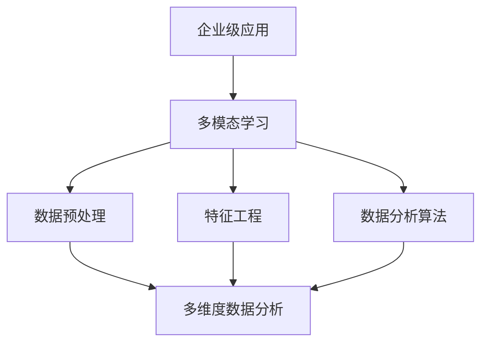

                 


### 确定文章核心框架

为了撰写一篇结构清晰、逻辑严密的《企业级多模态学习：整合多维度数据分析》技术博客，我们需要先明确文章的核心框架，包括以下几个部分：

#### 1. 引言
- **背景介绍**：介绍多模态学习和多维度数据分析在企业级应用中的重要性。
- **目标读者**：明确文章的目标读者，例如企业数据科学家、人工智能工程师等。

#### 2. 多模态学习与多维度数据分析
- **核心概念与联系**：阐述多模态学习与多维度数据分析的关系，并使用Mermaid流程图展示架构。
- **关键要素**：详细解释多模态学习的核心算法和数据处理技术。

#### 3. 多模态学习原理讲解
- **算法原理**：介绍多模态学习的理论基础，包括算法流程、伪代码和数学模型。
- **举例说明**：通过实际案例展示多模态学习如何提高数据分析效果。

#### 4. 多维度数据分析技术
- **数据处理**：介绍数据预处理、特征工程和数据可视化技术。
- **数据分析算法**：详细讲解常见的数据分析算法，如描述性统计分析、聚类分析和预测分析。

#### 5. 企业级多模态学习项目实战
- **实战项目概述**：介绍项目的背景、目标和实现步骤。
- **环境搭建**：详细描述开发环境的搭建过程。
- **数据处理**：讲解数据预处理和特征提取的详细过程。
- **代码实现**：展示关键代码实现，并进行代码解读。
- **应用解读**：分析实际案例，展示多模态学习在项目中的应用效果。

#### 6. 最佳实践与小结
- **最佳实践**：提供一些在实际项目中运用多模态学习和多维度数据分析的最佳实践。
- **注意事项**：指出可能遇到的问题和解决方案。
- **拓展阅读**：推荐一些相关的拓展阅读资料。

### 创建Mermaid流程图

为了更好地展示多模态学习与企业级应用的关系，我们可以创建一个Mermaid流程图。以下是一个示例：



### 写作关键点

1. **简洁明了**：每个章节都要尽量简洁明了，确保读者容易理解。
2. **逻辑清晰**：确保文章的逻辑顺序合理，每个部分之间的过渡自然。
3. **深度剖析**：对核心算法和数据分析技术进行深入剖析，确保读者能够掌握关键概念。
4. **实例丰富**：通过丰富的实例和实战案例，帮助读者理解多模态学习和多维度数据分析的实际应用。
5. **代码实现**：提供关键代码示例，并进行详细的解读和分析。
6. **总结与拓展**：在每个章节的末尾进行总结，并提供拓展阅读资料。

### 最终文章结构

```markdown
# 企业级多模态学习：整合多维度数据分析

> 关键词：多模态学习，企业级应用，多维度数据分析，数据处理，特征工程，数据分析算法

> 摘要：本文深入探讨了企业级多模态学习与多维度数据分析的整合，通过理论和实践相结合的方式，详细阐述了多模态学习的基本原理、数据处理技术以及实际应用案例。

## 引言

### 背景介绍

### 目标读者

## 多模态学习与多维度数据分析

### 核心概念与联系

#### Mermaid流程图

## 多模态学习原理讲解

### 算法原理

#### 伪代码

#### 数学模型和公式

#### 举例说明

## 多维度数据分析技术

### 数据处理

#### 数据预处理

#### 特征工程

#### 数据可视化

### 数据分析算法

#### 描述性统计分析

#### 聚类分析

#### 分层分析

#### 预测分析

## 企业级多模态学习项目实战

### 实战项目概述

#### 项目背景

#### 项目目标

### 环境搭建

#### 操作系统与编程语言

#### 数据库与数据存储

#### 硬件设备与资源

### 数据处理与预处理

#### 数据收集与存储

#### 数据清洗与归一化

#### 数据增强

### 源代码实现

#### 代码解读与分析

### 代码应用解读与分析

#### 实际案例分析和详细讲解剖析

### 项目小结

## 最佳实践与小结

### 最佳实践

#### 数据处理与预处理

#### 特征工程

#### 数据分析算法

### 注意事项

### 拓展阅读

### 参考文献

作者：AI天才研究院/AI Genius Institute & 禅与计算机程序设计艺术 /Zen And The Art of Computer Programming

