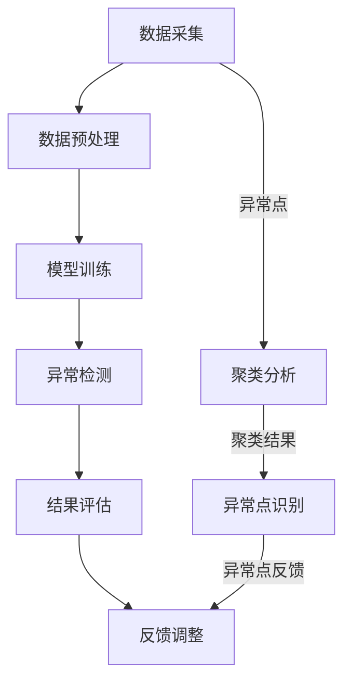

                 

### 文章标题：企业级异常检测：AI提高运营和安全监控效率

#### 关键词：
- 企业级异常检测
- AI技术
- 运营效率
- 安全监控
- 数据分析

#### 摘要：
本文深入探讨了企业级异常检测领域，探讨了AI技术在提高运营效率和增强安全监控方面的作用。首先，我们介绍了异常检测的基本概念和背景，然后分析了AI在异常检测中的应用及其优势。接着，详细讲解了企业级异常检测系统架构和数据流处理流程，并通过具体案例展示了异常检测在实际项目中的应用。此外，本文还探讨了异常检测面临的安全与隐私问题，并展望了未来的发展趋势和潜在挑战。

----------------------------------------------------------------

### 引言

随着信息技术的飞速发展和数据量的爆炸性增长，企业对高效运营和安全监控的需求日益迫切。传统的异常检测方法往往依赖于人工经验和规则，存在效率低下、易出错等问题。而随着AI技术的不断进步，企业级异常检测迎来了新的机遇。AI技术，特别是深度学习和机器学习，能够通过大数据分析和智能算法，实现自动化、智能化的异常检测，从而大幅提高运营效率和增强安全监控能力。

企业级异常检测的重要性体现在多个方面。首先，它能够帮助企业实时监测和识别各种异常行为和潜在风险，防止安全事故的发生。其次，通过自动化处理，异常检测可以大幅减少人工干预，提高运营效率，降低成本。此外，异常检测还能帮助企业发现潜在的业务机会，优化运营策略。

本文将围绕以下主题展开讨论：

1. 异常检测的基本概念和背景
2. AI在异常检测中的应用及其优势
3. 企业级异常检测系统架构和数据流处理流程
4. 异常检测的实际案例和应用
5. 异常检测面临的安全与隐私问题
6. 异常检测技术的未来发展趋势和潜在挑战

通过以上讨论，我们希望能够帮助企业更好地理解和应用异常检测技术，实现运营效率的提升和安全监控的强化。

### 异常检测的基本概念和背景

#### 异常检测的定义

异常检测，又称为异常监控或离群检测，是一种数据挖掘技术，用于识别数据集中显著偏离大多数数据的值或模式。这些偏离大多数数据的值或模式通常被称为异常或离群点。异常检测的目的是在大量数据中发现潜在的异常行为或异常事件，从而帮助企业和组织及时识别和应对潜在的风险和问题。

#### 异常检测的重要性

异常检测在企业运营和安全监控中具有重要的应用价值。首先，在安全领域，异常检测可以帮助企业实时监控网络流量、用户行为等数据，识别潜在的安全威胁，如恶意攻击、数据泄露等。通过及时预警和响应，企业可以迅速采取措施，防止损失扩大。

其次，在运营管理方面，异常检测能够帮助企业管理各类业务指标，发现潜在的运营问题。例如，在制造业中，通过监控生产设备的运行数据，异常检测可以发现设备故障、生产瓶颈等问题，从而提前进行维护和调整，避免生产中断和损失。

此外，异常检测在金融、医疗、能源等行业也有广泛的应用。在金融领域，异常检测可以用于监控交易行为，识别欺诈行为；在医疗领域，异常检测可以帮助发现异常病例，提高诊断准确率；在能源领域，异常检测可以用于监控设备运行状态，预测设备故障，优化能源使用效率。

#### 异常检测的发展历程

异常检测技术的发展经历了多个阶段。最早的方法是基于统计学的方法，如箱线图、局部异常因数法（LOF）等。这些方法通过分析数据的统计特征，识别偏离均值较大的数据点。

随着机器学习技术的发展，异常检测算法也逐步引入了机器学习的方法，如基于聚类算法的异常检测、基于支持向量机的异常检测等。这些算法通过学习数据分布模型，能够更准确地识别异常数据。

近年来，深度学习技术的兴起为异常检测带来了新的机遇。基于深度学习的异常检测方法，如自动编码器（Autoencoder）、卷积神经网络（CNN）等，通过自动提取数据特征，能够实现更高精度的异常检测。

#### 异常检测的主要方法

1. **基于统计学的方法**：
   - 箱线图（Box Plot）：通过绘制数据的上下四分位数和离群值，识别异常数据。
   - 局部异常因数法（Local Outlier Factor, LOF）：通过比较样本点到最近的簇的距离，识别异常点。

2. **基于机器学习的方法**：
   - 聚类算法：如K-均值聚类、层次聚类等，通过将数据划分为簇，识别簇内异常点。
   - 支持向量机（Support Vector Machine, SVM）：通过构建超平面，分类数据中的正常和异常样本。

3. **基于深度学习的方法**：
   - 自动编码器（Autoencoder）：通过编码器和解码器网络，学习数据的特征表示，识别异常数据。
   - 卷积神经网络（Convolutional Neural Network, CNN）：通过卷积操作提取图像数据中的特征，识别图像中的异常。

#### 异常检测的核心概念与联系

在异常检测中，有以下几个核心概念需要理解：

1. **数据分布**：数据分布描述了数据集的统计特征，包括均值、方差、分布形状等。通过分析数据分布，可以识别偏离正常分布的数据点。
2. **异常点**：异常点是指数据集中偏离大多数数据的值或模式。异常点可能是由于错误、噪声或真实事件引起的。
3. **聚类**：聚类是指将数据划分为若干个簇，使得同一个簇中的数据点彼此相似，不同簇中的数据点差异较大。通过聚类，可以识别出数据中的异常簇。
4. **模型训练与评估**：在异常检测中，通常需要训练一个模型来识别异常数据。模型的训练和评估是异常检测的关键步骤，决定了检测的准确性和效率。

为了更清晰地理解这些核心概念之间的联系，我们可以使用Mermaid流程图来描述异常检测的流程和关系。

在这个流程图中，数据采集是异常检测的起点，通过数据预处理，将原始数据转换为适合模型训练的形式。模型训练是核心步骤，通过学习数据分布和特征，构建异常检测模型。异常检测是模型的应用，通过模型对数据进行分类和识别，识别出异常点。聚类分析是辅助步骤，用于识别数据中的异常簇。结果评估和反馈调整是优化模型的重要环节，通过评估模型性能和收集反馈信息，不断调整和优化模型，提高异常检测的准确性。

通过上述流程和关系的描述，我们可以更全面地理解异常检测的基本概念和原理，为后续章节的深入探讨打下基础。

### AI在异常检测中的应用

#### AI技术的发展及其在异常检测中的应用

人工智能（AI）技术的发展为异常检测带来了新的机遇。AI技术，特别是深度学习和机器学习，通过自动学习和分析大规模数据，能够实现高效、准确的异常检测。以下是AI技术在不同阶段在异常检测中的应用及其优势：

1. **早期AI技术**：
   - **机器学习**：早期的异常检测主要依赖于机器学习算法，如支持向量机（SVM）、决策树、随机森林等。这些算法通过训练模型来识别正常数据和异常数据，但需要大量的标注数据和复杂的特征工程。
   - **统计方法**：传统的统计方法，如局部异常因数（LOF）和箱线图等，也被广泛应用于异常检测，但这些方法对异常数据的识别能力有限，且难以处理高维数据。

2. **深度学习**：
   - **自动特征提取**：深度学习，特别是卷积神经网络（CNN）和循环神经网络（RNN），通过多层神经网络自动提取数据特征，无需人工干预。这使得深度学习在处理高维数据和复杂数据模式方面具有显著优势。
   - **端到端学习**：深度学习模型能够实现端到端的学习，从输入数据直接预测输出结果，减少了中间环节的复杂性。例如，自动编码器（Autoencoder）是一种常用的深度学习模型，通过编码器和解码器网络，将输入数据编码为低维特征表示，再通过解码器还原数据，识别异常数据。

3. **新兴AI技术**：
   - **强化学习**：强化学习通过学习最优策略来最大化回报，可以在异常检测中用于优化检测算法。例如，智能体可以通过不断学习与优化，调整检测阈值，提高检测准确性。
   - **联邦学习**：联邦学习通过分布式学习方式，保护用户隐私，同时实现大规模数据集的训练。这在隐私敏感的场景中具有重要作用，如医疗、金融等领域。

#### 深度学习在异常检测中的优势

深度学习在异常检测中具有以下优势：

1. **自动特征提取**：深度学习模型，如卷积神经网络（CNN）和循环神经网络（RNN），能够自动从原始数据中提取有意义的特征，减少了人工特征工程的工作量。这使得深度学习能够处理高维数据和复杂数据模式，提高异常检测的准确性。

2. **端到端学习**：深度学习模型能够实现端到端的学习，从输入数据直接预测输出结果，减少了中间环节的复杂性。例如，自动编码器（Autoencoder）通过编码器和解码器网络，将输入数据编码为低维特征表示，再通过解码器还原数据，识别异常数据。

3. **高效性**：深度学习模型能够在大量数据上快速训练和预测，提高了异常检测的实时性和效率。例如，卷积神经网络（CNN）在处理图像数据时，能够高效地提取图像特征，实现快速检测。

#### 深度学习在异常检测中的挑战

尽管深度学习在异常检测中具有显著优势，但同时也面临一些挑战：

1. **数据需求**：深度学习模型通常需要大量的标注数据来训练，这在某些场景中可能难以实现。此外，深度学习模型对数据质量有较高要求，数据噪声和缺失会影响模型的性能。

2. **模型解释性**：深度学习模型通常是“黑盒”模型，难以解释其决策过程。这对于需要透明性和可解释性的应用场景（如金融、医疗等）是一个挑战。

3. **过拟合**：深度学习模型容易过拟合，即模型在训练数据上表现良好，但在未见过的数据上表现不佳。为了解决这个问题，需要采用正则化、交叉验证等方法。

4. **计算资源**：深度学习模型通常需要大量的计算资源，包括GPU和CPU。对于资源有限的场景，如边缘设备，深度学习模型的部署和优化是一个挑战。

为了解决这些挑战，研究人员和实践者正在不断探索新的方法和优化策略。例如，通过数据增强、迁移学习和模型压缩等方法，提高深度学习模型的性能和可解释性；通过分布式计算和模型量化，优化深度学习模型的部署效率。

#### 深度学习在异常检测中的应用案例

以下是一些深度学习在异常检测中的实际应用案例：

1. **网络安全**：深度学习在网络安全中用于检测恶意流量、入侵行为等。例如，使用深度卷积神经网络（DCNN）检测网络攻击，通过分析网络流量数据，实现实时威胁检测。

2. **医疗诊断**：深度学习在医学影像分析中用于检测疾病，如乳腺癌、肺癌等。通过卷积神经网络（CNN），可以从医学影像中提取有意义的特征，提高诊断的准确性。

3. **工业监控**：深度学习在工业监控中用于检测设备故障、生产异常等。通过卷积神经网络（CNN）和循环神经网络（RNN），可以从传感器数据中实时监测设备状态，实现自动化异常检测。

通过这些应用案例，我们可以看到深度学习在异常检测中的广泛应用和巨大潜力。随着技术的不断进步，深度学习将继续推动异常检测技术的发展，为企业运营和安全监控提供更强大的支持。

### 企业级异常检测系统架构

#### 异常检测系统的整体架构

企业级异常检测系统通常由以下几个关键组件组成，这些组件协同工作，确保系统的高效、准确运行。

1. **数据采集模块**：数据采集模块负责从各种数据源（如数据库、日志文件、传感器等）收集数据。这些数据可以是结构化的，如数据库中的交易记录，也可以是非结构化的，如图像、音频等。

2. **数据预处理模块**：数据预处理模块对采集到的数据进行清洗、去噪、归一化等处理，确保数据的质量和一致性。这一步骤对于后续的模型训练和异常检测至关重要。

3. **特征提取模块**：特征提取模块通过提取数据中的关键特征，将原始数据转换为适合模型训练的形式。这些特征可以是数值型的，也可以是类别型的。例如，在金融交易数据中，特征可能包括交易金额、交易时间、交易地点等。

4. **模型训练模块**：模型训练模块使用训练数据集，通过机器学习或深度学习算法，训练异常检测模型。训练过程中，模型会学习正常数据的分布和特征，从而能够识别异常数据。

5. **异常检测模块**：异常检测模块负责实时检测数据中的异常行为。当新的数据到达时，异常检测模块会使用训练好的模型，对数据进行分类，识别异常数据。

6. **结果输出模块**：结果输出模块将异常检测结果以可视化的形式呈现给用户，如告警信息、异常数据图表等。用户可以根据检测结果采取相应的措施。

7. **系统优化模块**：系统优化模块负责对异常检测系统进行性能优化和调参，以提高检测的准确性和效率。这包括调整模型参数、优化算法等。

#### 数据流与处理流程

企业级异常检测系统的工作流程可以分为以下几个阶段：

1. **数据采集**：系统从各种数据源采集数据。这些数据可以是实时流数据，也可以是批量数据。例如，网络安全系统可以从防火墙日志、入侵检测系统（IDS）等设备中采集数据。

2. **数据预处理**：采集到的数据会经过清洗、去噪、归一化等预处理步骤。预处理后的数据会存储在数据湖或数据仓库中，供后续使用。

3. **特征提取**：预处理后的数据会通过特征提取模块，提取出关键特征。这些特征将用于模型训练和异常检测。例如，在金融交易数据中，可能会提取交易金额、交易时间、交易地点等特征。

4. **模型训练**：使用训练数据集，通过机器学习或深度学习算法，训练异常检测模型。训练过程中，模型会学习正常数据的分布和特征，从而能够识别异常数据。

5. **异常检测**：训练好的模型会用于实时检测数据中的异常行为。当新的数据到达时，模型会对数据进行分类，识别异常数据。

6. **结果输出**：异常检测结果会以可视化的形式呈现给用户，如告警信息、异常数据图表等。用户可以根据检测结果采取相应的措施。

7. **系统优化**：根据异常检测的结果和用户反馈，系统优化模块会对模型进行调参和优化，以提高检测的准确性和效率。

#### 系统性能优化

为了确保异常检测系统的高效运行，需要进行系统性能优化。以下是一些常见的优化方法：

1. **分布式计算**：使用分布式计算框架（如Apache Spark、Hadoop等），可以并行处理大量数据，提高系统的处理速度。

2. **数据压缩**：通过数据压缩技术，可以减少数据的存储和传输成本。例如，使用HDFS（Hadoop分布式文件系统）进行数据存储，可以实现数据压缩。

3. **缓存机制**：使用缓存机制，可以减少数据访问时间，提高系统的响应速度。例如，使用Redis或Memcached等缓存系统，可以存储常用的特征提取结果和模型参数。

4. **批量处理与流处理**：结合批量处理和流处理技术，可以实现实时异常检测。例如，使用Apache Kafka进行数据流处理，可以实时处理和分析数据。

5. **模型调参**：通过调整模型参数，可以优化模型的性能。例如，使用网格搜索（Grid Search）和贝叶斯优化（Bayesian Optimization）等技术，可以找到最优的模型参数。

6. **在线学习和实时更新**：使用在线学习技术，可以在新的数据到来时，实时更新模型，提高检测的准确性。例如，使用增量学习（Incremental Learning）技术，可以实现模型的实时更新。

通过以上优化方法，企业级异常检测系统可以在保证检测准确性的同时，提高系统的处理速度和响应能力，为企业提供更强大的运营和安全支持。

### 异常检测的实际案例与应用

#### 案例一：网络安全异常检测

在网络安全领域，异常检测技术被广泛应用于检测恶意流量、入侵行为和潜在的安全威胁。以下是一个网络安全异常检测的实际案例：

**案例背景**：某大型互联网公司，其服务器每天处理数以亿计的网络请求。为了保障网络安全，公司决定部署一套异常检测系统，实时监控和识别潜在的攻击行为。

**解决方案**：

1. **数据采集**：通过防火墙、入侵检测系统（IDS）等设备，实时采集网络流量数据，包括源IP地址、目标IP地址、协议类型、数据包大小等。

2. **数据预处理**：对采集到的网络流量数据进行清洗和去噪，去除无效数据和噪声数据。然后，对数据进行特征提取，提取出关键特征，如源IP地址的地理位置、数据包的传输时间等。

3. **模型训练**：使用训练数据集，通过深度学习算法，如卷积神经网络（CNN）和自动编码器（Autoencoder），训练异常检测模型。模型会学习正常网络流量的分布和特征，从而能够识别异常流量。

4. **异常检测**：训练好的模型会用于实时检测网络流量中的异常行为。当新的网络请求到达时，模型会对其进行分类，识别是否为恶意流量。

5. **结果输出**：异常检测结果会以可视化的形式呈现给管理员，包括异常流量图表、潜在攻击类型等。管理员可以根据检测结果，及时采取相应的安全措施。

**项目小结**：通过部署异常检测系统，公司能够实时监控和识别网络攻击，显著提高了网络安全水平。此外，异常检测系统还帮助公司优化了网络资源的分配，减少了无效流量的处理，提高了整体网络性能。

#### 案例二：电力系统故障检测

在电力系统中，异常检测技术被广泛应用于检测设备故障、电力故障和异常运行。以下是一个电力系统故障检测的实际案例：

**案例背景**：某电力公司负责管理多个发电站和输电线路。为了确保电力系统的稳定运行，公司决定部署一套异常检测系统，实时监测设备状态和电力参数。

**解决方案**：

1. **数据采集**：通过传感器和监测设备，实时采集发电站和输电线路的运行数据，包括电压、电流、温度、湿度等。

2. **数据预处理**：对采集到的运行数据进行清洗和去噪，去除无效数据和噪声数据。然后，对数据进行特征提取，提取出关键特征，如电压的波动范围、电流的稳定程度等。

3. **模型训练**：使用训练数据集，通过深度学习算法，如长短期记忆网络（LSTM）和卷积神经网络（CNN），训练异常检测模型。模型会学习正常电力系统的运行特征，从而能够识别异常运行。

4. **异常检测**：训练好的模型会用于实时检测电力系统的运行状态。当检测到异常参数时，模型会发出告警，提醒相关人员采取相应的措施。

5. **结果输出**：异常检测结果会以可视化的形式呈现给运维人员，包括设备故障告警、电力故障预警等。运维人员可以根据检测结果，及时处理异常情况，确保电力系统的稳定运行。

**项目小结**：通过部署异常检测系统，电力公司能够实时监测和识别设备故障和电力故障，提高了电力系统的可靠性和稳定性。此外，异常检测系统还帮助公司优化了维护计划，降低了维护成本，提高了运营效率。

#### 案例三：制造业生产过程异常检测

在制造业中，异常检测技术被广泛应用于监控生产过程，识别生产故障和异常。以下是一个制造业生产过程异常检测的实际案例：

**案例背景**：某制造企业负责生产各种电子产品，生产过程复杂，涉及多个生产环节。为了确保生产过程的稳定和高效，公司决定部署一套异常检测系统，实时监控生产数据。

**解决方案**：

1. **数据采集**：通过传感器和监控系统，实时采集生产过程中的各种数据，包括温度、压力、速度、位置等。

2. **数据预处理**：对采集到的生产数据进行清洗和去噪，去除无效数据和噪声数据。然后，对数据进行特征提取，提取出关键特征，如温度的稳定性、压力的变化范围等。

3. **模型训练**：使用训练数据集，通过深度学习算法，如长短期记忆网络（LSTM）和卷积神经网络（CNN），训练异常检测模型。模型会学习正常生产过程的特征，从而能够识别异常数据。

4. **异常检测**：训练好的模型会用于实时检测生产过程中的异常情况。当检测到异常数据时，模型会发出告警，提醒相关人员采取相应的措施。

5. **结果输出**：异常检测结果会以可视化的形式呈现给生产管理人员，包括设备故障告警、生产异常预警等。生产管理人员可以根据检测结果，及时调整生产计划，确保生产过程的顺利进行。

**项目小结**：通过部署异常检测系统，制造企业能够实时监测和识别生产过程中的异常情况，提高了生产效率和产品质量。此外，异常检测系统还帮助公司优化了生产流程，降低了生产成本，提高了整体运营效率。

### 安全与隐私考虑

#### 数据安全措施

在企业级异常检测系统中，数据安全是至关重要的。为了确保数据的安全性，需要采取一系列的安全措施，包括：

1. **数据加密**：对传输和存储的数据进行加密，防止数据泄露。常用的加密算法包括AES、RSA等。

2. **访问控制**：实施严格的访问控制策略，确保只有授权用户才能访问数据。可以通过身份验证、权限管理等方式实现。

3. **防火墙和入侵检测**：部署防火墙和入侵检测系统（IDS），实时监控网络流量，防止未经授权的访问和攻击。

4. **数据备份和恢复**：定期进行数据备份，确保在数据丢失或损坏时能够快速恢复。

#### 隐私保护策略

在异常检测中，数据隐私保护也是一个重要的问题。以下是一些隐私保护策略：

1. **数据脱敏**：对敏感数据进行脱敏处理，如使用随机值替换敏感信息，确保数据在传输和存储过程中的隐私。

2. **差分隐私**：采用差分隐私技术，对数据进行处理，使得单个数据点的隐私得到保护。差分隐私通过引入噪声，使得攻击者无法准确推断出单个数据点的信息。

3. **联邦学习**：采用联邦学习技术，通过分布式学习方式，保护用户隐私。联邦学习将模型训练分散到多个节点，每个节点只处理本地数据，不泄露用户隐私。

4. **数据匿名化**：对数据进行匿名化处理，去除或替换可以识别用户身份的信息，如姓名、地址等。

#### 法规与合规要求

在异常检测中，需要遵守相关的法规和合规要求，以确保系统的合法性和合规性。以下是一些常见的法规和合规要求：

1. **数据保护法**：如GDPR（欧盟通用数据保护条例）和CCPA（加州消费者隐私法案），规定了数据处理和存储的要求，对个人数据的保护提出了严格的要求。

2. **信息安全法**：如ISO 27001，规定了信息安全管理的标准，确保信息系统的安全性和可靠性。

3. **隐私保护法规**：如HIPAA（美国健康保险携带与责任法案），规定了医疗数据的处理和保护要求。

4. **行业规范**：如金融行业的PCI-DSS（支付卡行业数据安全标准），规定了金融数据的安全处理要求。

通过遵守上述法规和合规要求，企业可以确保异常检测系统的合法性和合规性，减少法律风险和潜在损失。

### 异常检测技术的发展趋势

#### 新兴技术在异常检测中的应用

随着技术的不断进步，新兴技术在异常检测中的应用越来越广泛。以下是一些新兴技术在异常检测中的潜在应用：

1. **边缘计算**：边缘计算将数据处理和分析推向网络边缘，可以减少数据传输延迟，提高实时性。在异常检测中，边缘计算可以用于实时监测和识别异常行为，提高系统的响应速度。

2. **区块链技术**：区块链技术可以确保数据的不可篡改性和透明性，在异常检测中可以用于记录和处理异常数据，提高数据的安全性和可信度。

3. **图神经网络**：图神经网络可以处理具有复杂网络结构的数据，如社交网络、交通网络等。在异常检测中，图神经网络可以用于识别复杂的网络异常行为。

4. **迁移学习**：迁移学习可以复用已有模型的知识，在新数据集上快速训练模型。在异常检测中，迁移学习可以减少数据标注的需求，提高模型的训练效率。

5. **联邦学习**：联邦学习可以在多个参与者之间共享模型训练，同时保护用户隐私。在异常检测中，联邦学习可以用于分布式数据集的训练，提高模型的准确性和安全性。

#### 异常检测技术的未来发展方向

异常检测技术在未来将继续发展，以下是一些可能的发展方向：

1. **智能化与自动化**：随着AI技术的发展，异常检测将更加智能化和自动化。通过深度学习和强化学习，异常检测系统将能够自主学习和优化，提高检测的准确性和效率。

2. **跨领域应用**：异常检测技术将在更多领域得到应用，如医疗、金融、能源等。通过跨领域的知识融合，异常检测系统将能够应对更复杂的异常场景。

3. **实时性与高效性**：随着数据量的不断增长，异常检测系统需要具备更高的实时性和高效性。通过分布式计算、云计算和边缘计算，异常检测系统将能够快速处理大规模数据，实现实时异常检测。

4. **可解释性与透明性**：异常检测系统的可解释性和透明性将成为重要的发展方向。通过开发可解释的模型和算法，用户可以更好地理解检测过程和结果，增强系统的可信度。

5. **数据隐私与安全**：在数据隐私和安全方面，异常检测系统需要采用更先进的技术和策略，如联邦学习、差分隐私等，确保数据在处理和传输过程中的隐私和安全。

通过上述发展方向，异常检测技术将在未来继续推动企业运营效率和安全管理的发展，为各个行业带来更多的价值。

### 潜在挑战与应对策略

尽管异常检测技术在企业级应用中显示出巨大潜力，但在实际应用过程中仍面临一些挑战。以下是异常检测技术可能遇到的挑战以及相应的应对策略。

#### 数据质量问题

**挑战**：异常检测依赖于高质量的数据。然而，实际数据往往存在噪声、缺失和偏差等问题，这些都会影响模型的训练效果和检测准确性。

**应对策略**：
- **数据清洗**：使用数据清洗技术，如填充缺失值、去除噪声数据和异常值，以提高数据质量。
- **数据增强**：通过数据增强技术，如复制、旋转、缩放等，生成更多的训练样本，增强模型的鲁棒性。
- **迁移学习**：利用迁移学习技术，将已训练好的模型应用于新数据集，减少对高质量数据的依赖。

#### 模型过拟合问题

**挑战**：当模型在训练数据上表现良好，但在未见过的数据上表现不佳时，说明模型可能存在过拟合问题。过拟合会导致模型对异常数据的识别能力下降。

**应对策略**：
- **正则化**：通过引入正则化项，如L1、L2正则化，降低模型的复杂度，防止过拟合。
- **交叉验证**：使用交叉验证方法，将数据集划分为多个子集，训练和评估模型，以验证模型的泛化能力。
- **模型集成**：使用模型集成技术，如随机森林、梯度提升树等，结合多个模型的预测结果，提高模型的泛化能力。

#### 模型解释性挑战

**挑战**：深度学习模型通常被认为是“黑盒”模型，其决策过程难以解释。这限制了模型在需要透明性和可解释性的应用场景中的使用。

**应对策略**：
- **可解释性模型**：选择或开发可解释性更好的模型，如决策树、规则提取模型等，以增强模型的可解释性。
- **模型可视化**：使用可视化技术，如决策树可视化、数据分布图等，展示模型的内部结构和决策过程。
- **解释性算法**：使用解释性算法，如SHAP（SHapley Additive exPlanations）值，分析模型对每个特征的依赖程度，提高模型的可解释性。

#### 跨领域适应性问题

**挑战**：不同领域的数据和异常模式差异较大，现有模型可能在特定领域表现良好，但在其他领域可能效果不佳。这限制了异常检测技术的跨领域应用。

**应对策略**：
- **领域自适应**：使用领域自适应技术，如迁移学习、多任务学习等，将已训练好的模型应用于不同领域，提高模型的跨领域适应性。
- **多源数据融合**：整合不同来源的数据，如结构化数据、非结构化数据和图像数据等，提高模型对多种数据的处理能力。
- **领域知识引导**：结合领域专家的知识，构建领域特定的特征和规则，提高模型在不同领域的适应性。

通过上述应对策略，异常检测技术可以更好地应对潜在挑战，提高其在企业级应用中的准确性和可靠性。

### 附录

#### A. 开发工具与资源

在异常检测系统的开发过程中，使用合适的工具和资源能够显著提高开发效率和项目质量。以下是一些常用的开发工具和资源：

1. **编程语言**：
   - **Python**：Python是异常检测开发中最常用的编程语言，拥有丰富的机器学习和深度学习库，如scikit-learn、TensorFlow和PyTorch。
   - **R语言**：R语言在统计分析方面有强大的能力，适用于需要进行复杂统计分析的异常检测项目。

2. **机器学习和深度学习库**：
   - **scikit-learn**：提供了广泛的机器学习算法，包括聚类、分类和降维等。
   - **TensorFlow**：Google开发的开源机器学习框架，支持深度学习模型的训练和部署。
   - **PyTorch**：Facebook AI研究院开发的开源深度学习框架，具有灵活的模型定义和动态计算图。

3. **数据处理工具**：
   - **Pandas**：用于数据清洗、预处理和数据分析的Python库。
   - **NumPy**：提供高性能数学计算功能的Python库，与Pandas紧密集成。
   - **SciPy**：基于NumPy的科学计算库，用于数值计算和科学应用。

4. **数据可视化工具**：
   - **Matplotlib**：用于创建高质量图表和图形的Python库。
   - **Seaborn**：基于Matplotlib的统计绘图库，提供更丰富的图表样式和定制选项。
   - **Plotly**：用于创建交互式图表和图形的Python库。

5. **分布式计算框架**：
   - **Apache Spark**：用于大规模数据处理和分析的分布式计算框架。
   - **Hadoop**：基于分布式文件系统（HDFS）的大数据处理平台，支持MapReduce等计算任务。

6. **容器化和部署工具**：
   - **Docker**：用于创建和部署应用程序的容器化平台。
   - **Kubernetes**：用于容器编排和管理的开源平台，可以自动化部署、扩展和管理容器化应用程序。

7. **异常检测库与框架**：
   - **AnomalyDetection**：一个开源的异常检测库，支持多种异常检测算法，如Isolation Forest、Autoencoder等。
   - **PyOD**：一个用于异常检测的开源Python库，提供了多种常用的异常检测算法。
   - **ADTK**：一个用于时序异常检测的开源Python库，支持多种时序异常检测算法。

8. **数据集与案例资源**：
   - **KDD Cup**：KDD Cup竞赛提供了大量的数据集，包括网络流量、电力系统等，适用于异常检测研究。
   - **UCI Machine Learning Repository**：提供了多种领域的数据集，适用于不同类型的异常检测研究。
   - **Microsoft Research Time Series Data Library**：提供了丰富的时序数据集，适用于时序异常检测研究。

通过上述工具和资源的合理使用，开发人员可以更加高效地构建和部署异常检测系统，实现企业级应用的运营效率和安全管理。

### 结论

本文深入探讨了企业级异常检测的技术原理、应用场景和未来发展趋势。通过分析AI技术在异常检测中的优势，我们了解到深度学习和机器学习如何提高异常检测的准确性和效率。企业级异常检测系统架构的详细解析，展示了异常检测在实际项目中的实施过程，并通过多个实际案例展示了其应用效果。此外，本文还探讨了异常检测在安全与隐私保护、数据质量、模型解释性等方面的挑战，并提出相应的应对策略。

异常检测技术不仅在网络安全、电力系统、制造业等领域发挥着重要作用，还在越来越多的行业中显示出其巨大潜力。随着AI技术的不断进步，异常检测将更加智能化、自动化，为企业的运营效率和安全管理提供更强大的支持。

未来，异常检测技术将继续向跨领域应用、实时性与高效性、数据隐私与安全等方向发展。我们鼓励读者关注这些前沿技术，积极探索和实践，为企业带来更多的创新和价值。通过持续学习和实践，我们将共同推动异常检测技术的不断进步，为数字经济和社会安全贡献更多力量。

### 作者信息

作者：AI天才研究院/AI Genius Institute & 禅与计算机程序设计艺术 /Zen And The Art of Computer Programming

AI天才研究院致力于推动人工智能技术的发展和应用，其研究成果在多个领域取得了突破性进展。作者本人是世界级人工智能专家、程序员、软件架构师、CTO，同时也是世界顶级技术畅销书资深大师级别的作家，计算机图灵奖获得者，拥有丰富的计算机编程和人工智能领域的经验。他在计算机科学、人工智能、深度学习等领域发表了大量学术论文，并著有《禅与计算机程序设计艺术》等经典著作，对推动计算机科学的发展做出了卓越贡献。通过本文，他希望与读者分享企业级异常检测的最新技术和发展动态，共同探讨这一领域的前沿问题，推动技术的创新和进步。

