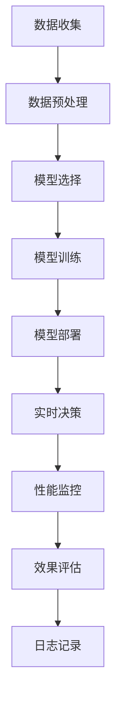

                 

### 文章标题

《企业级强化学习应用：持续优化业务策略》

### 关键词

- 企业级强化学习
- 业务策略优化
- 强化学习算法
- 模型部署与监控
- 应用案例与最佳实践

### 摘要

本文深入探讨了企业级强化学习在业务策略优化中的应用。首先，我们概述了强化学习的基本概念和核心元素，介绍了强化学习与传统机器学习的区别以及其在游戏、机器人控制和金融交易等领域的应用。接着，我们详细讲解了强化学习的几种算法，包括Q-Learning、SARSA、基于策略和基于值函数的算法，以及模型基础算法如DQN、A3C和PPO。随后，本文探讨了强化学习在业务策略优化中的挑战和解决方案，包括数据隐私、模型解释性和道德伦理问题。通过多个实际案例，我们展示了强化学习在电商推荐系统和供应链优化中的成功应用。最后，本文总结了强化学习应用的步骤和方法，分享了最佳实践和未来发展趋势，为企业提供了强化学习应用的指南。通过本文，读者可以全面了解企业级强化学习应用的理论和实践，为业务策略优化提供新的思路和方法。

## 第一部分：企业级强化学习概述

### 第1章：强化学习概述

#### 1.1 强化学习的基本概念

强化学习（Reinforcement Learning，RL）是一种机器学习方法，其核心在于通过环境（Environment）与智能体（Agent）之间的互动来学习最优策略（Policy）。在这一过程中，智能体根据当前状态（State）采取动作（Action），并根据动作的结果获得奖励（Reward）。

定义：强化学习是一种通过试错（Trial and Error）来学习最优行为的机器学习方法。与监督学习和无监督学习不同，强化学习依赖于奖励信号来指导学习过程。

强化学习与传统机器学习的区别：

- **目标不同**：传统机器学习的目标是找到一种模型，使其能够在给定的输入上产生正确的输出。而强化学习的目标是找到一个策略，使智能体在长期运行中获得的累计奖励最大化。
- **学习方式不同**：传统机器学习依赖于已标注的数据集，而强化学习则通过与环境交互来学习。
- **评估标准不同**：传统机器学习的评估标准通常是模型在测试集上的准确率或损失函数值，而强化学习的评估标准是智能体在执行一系列动作后获得的累计奖励。

#### 1.2 强化学习的核心元素

强化学习包含以下四个核心元素：

- **状态（State）**：描述智能体所处的环境。
- **动作（Action）**：智能体可以采取的行动。
- **奖励（Reward）**：对智能体采取的每个动作给予的评价，可以是正奖励或负奖励。
- **策略（Policy）**：智能体在特定状态下的行动指南。

状态、动作、奖励和策略之间的关系可以用以下公式表示：

Policy(St) = π(At|St)

其中，St 表示当前状态，At 表示当前动作，π表示策略。

#### 1.3 强化学习的应用场景

强化学习在多个领域都有着广泛的应用，以下是其中几个典型的应用场景：

- **游戏**：强化学习在游戏领域取得了显著成就，如著名的深度强化学习算法DQN（Deep Q-Network）在Atari游戏上达到了人类水平。
- **机器人控制**：强化学习在机器人控制中有着重要应用，如自动驾驶汽车和机器人导航。
- **金融交易**：强化学习被应用于算法交易，通过学习市场规律来实现自动化的投资策略。
- **电商推荐系统**：强化学习在电商推荐系统中有着广泛应用，如基于用户行为的个性化推荐。

通过上述内容，我们为后续章节的深入探讨奠定了基础。在接下来的章节中，我们将详细讲解强化学习的各种算法，以及如何将这些算法应用于企业级业务策略优化。接下来，我们将介绍强化学习算法的基础，包括基本算法和模型基础算法。接下来是强化学习算法的基础，包括基本算法和模型基础算法。

## 第2章：强化学习算法基础

### 2.1 基本强化学习算法

强化学习算法可以根据学习方式分为基于模型（Model-Based）和基于模型（Model-Free）两大类。在本节中，我们将重点介绍一些基本的强化学习算法，包括Q-Learning和SARSA。

#### 2.1.1 Q-Learning算法

Q-Learning算法是一种基于模型的学习方法，它通过迭代更新Q值函数来学习最优策略。Q值函数表示智能体在每个状态下采取每个动作的期望回报。

**算法原理：**

Q-Learning算法的基本思想是通过经验来更新Q值，具体步骤如下：

1. **初始化Q值函数**：设置一个初始的Q值函数，通常初始化为0。

2. **选择动作**：在当前状态下，智能体选择一个动作，可以采用ε-贪心策略，即在随机选择和选择当前最优动作之间权衡。

3. **执行动作**：智能体执行选定的动作，并观察新的状态和奖励。

4. **更新Q值**：根据新的状态、动作和奖励，更新Q值函数。更新公式如下：

$$
Q(s,a) \leftarrow Q(s,a) + \alpha [r + \gamma \max_{a'} Q(s',a') - Q(s,a)]
$$

其中，α是学习率，γ是折扣因子，r是获得的奖励，s'是新的状态，a'是在新状态下采取的动作。

**伪代码：**

```python
Initialize Q(s,a) to 0
while not done:
    if exploring:
        a = choose_action(s, ε)
    else:
        a = choose_action(s, π)

    s', a' = environment.step(a)
    reward = environment.reward()
    Q(s, a) = Q(s, a) + α * (reward + γ * max(Q(s', a')) - Q(s, a))
    s = s'
```

#### 2.1.2 SARSA算法

SARSA（State-Action-Reward-State-Action）算法是一种基于模型的学习方法，它与Q-Learning算法类似，但使用的是实际执行的动作而不是期望动作。

**算法原理：**

SARSA算法的基本思想是通过实际执行的动作来更新Q值函数，具体步骤如下：

1. **初始化Q值函数**：设置一个初始的Q值函数，通常初始化为0。

2. **选择动作**：在当前状态下，智能体选择一个动作，可以采用ε-贪心策略。

3. **执行动作**：智能体执行选定的动作，并观察新的状态和奖励。

4. **更新Q值**：根据新的状态、动作和奖励，更新Q值函数。更新公式如下：

$$
Q(s,a) \leftarrow Q(s,a) + \alpha [r + \gamma Q(s',a')]
$$

**伪代码：**

```python
Initialize Q(s,a) to 0
while not done:
    a = choose_action(s, ε)
    s', a' = environment.step(a)
    reward = environment.reward()
    Q(s, a) = Q(s, a) + α * (reward + γ * Q(s', a'))
    s = s'
```

通过上述两种算法，我们可以对环境进行有效的探索和学习，从而找到最优策略。在接下来的章节中，我们将进一步探讨无模型强化学习算法，包括基于策略的算法和基于值函数的算法。

### 2.2 无模型强化学习算法

无模型强化学习算法（Model-Free Reinforcement Learning Algorithms）不依赖于对环境的完整模型，而是通过直接从与环境的交互中学习。这种学习方法可以应用于那些难以建模或者建模成本过高的环境。无模型强化学习算法可以分为基于策略的算法和基于值函数的算法。以下将分别介绍这两类算法。

#### 2.2.1 基于策略的算法

基于策略的算法通过直接优化策略来学习，不直接计算值函数。这类算法通常使用概率分布来表示策略，并通过梯度上升或其他优化方法来更新策略。

**1. REINFORCE算法**

REINFORCE算法是最简单的基于策略的算法，它通过梯度上升方法来优化策略。算法的核心思想是使用奖励信号作为策略梯度的估计。

**算法原理：**

- **初始化**：设置初始策略π。
- **执行动作**：在当前状态下，根据策略π选择动作。
- **更新策略**：对于每个动作，更新策略参数θ，使得策略π对高奖励的动作更有利。

更新公式如下：

$$
\theta \leftarrow \theta + \alpha \frac{\partial L(\theta)}{\partial \theta}
$$

其中，L(θ) 是策略π的损失函数，α是学习率。

**伪代码：**

```python
Initialize θ
while not done:
    a = choose_action(s, π(θ))
    s', r = environment.step(a)
    θ = θ + α * log(π(θ(a|s)))
    s = s'
```

**2. actor-critic算法**

actor-critic算法结合了基于策略的优化和基于值函数的评估，通过两个网络来分别表示策略和值函数。

- **Actor网络**：表示策略π(θ)，通过梯度上升方法优化。
- **Critic网络**：表示值函数V(θ)，通过梯度下降方法优化。

**算法原理：**

- **初始化**：设置Actor网络θ和Critic网络θ'。
- **执行动作**：根据策略π(θ)选择动作。
- **更新策略**：根据Critic网络提供的值函数更新策略网络。
- **更新值函数**：根据实际奖励和预期奖励更新值函数。

更新公式如下：

$$
θ = θ + απ(θ(a|s)) [r - V(θ')(s)]
$$

$$
θ' = θ' - β [V(θ')(s) - r]
$$

**伪代码：**

```python
Initialize θ, θ'
while not done:
    a = choose_action(s, π(θ))
    s', r = environment.step(a)
    θ = θ + απ(θ(a|s)) [r - V(θ')(s)]
    θ' = θ' - β [V(θ')(s) - r]
    s = s'
```

#### 2.2.2 基于值函数的算法

基于值函数的算法通过学习值函数来指导策略的执行，直接优化策略的期望回报。这类算法分为蒙特卡洛方法和时序差分方法。

**1. 蒙特卡洛方法**

蒙特卡洛方法通过模拟大量的模拟轨迹来估计值函数。算法的核心思想是通过累积回报来估计状态值和动作值。

**算法原理：**

- **初始化**：设置初始值函数V。
- **模拟轨迹**：从初始状态开始，执行一系列动作，直到终止状态。
- **估计值函数**：根据累积回报来更新值函数。

更新公式如下：

$$
V(s) = \frac{1}{N} \sum_{t=1}^{N} R_t
$$

其中，N 是模拟的轨迹数，R_t 是轨迹中第t个时间步的回报。

**伪代码：**

```python
Initialize V
while not done:
    for t in range(N):
        s = initial_state
        while not done:
            a = choose_action(s, ε-greedy)
            s', r = environment.step(a)
            done = environment.done()
        R_t = sum(reward(s', a) for s', a in trajectory)
    V(s) = V(s) + α [R_t - V(s)]
```

**2. 时序差分方法**

时序差分方法通过迭代更新值函数，每次迭代只考虑一个时间步的误差。

**算法原理：**

- **初始化**：设置初始值函数V。
- **选择动作**：在当前状态下选择动作。
- **执行动作**：执行动作并观察新的状态和奖励。
- **更新值函数**：根据新状态和奖励更新值函数。

更新公式如下：

$$
V(s) \leftarrow V(s) + α [r + γV(s') - V(s)]
$$

**伪代码：**

```python
Initialize V
while not done:
    s = initial_state
    a = choose_action(s, ε-greedy)
    s', r = environment.step(a)
    V(s) = V(s) + α [r + γV(s') - V(s)]
    s = s'
```

通过上述介绍，我们可以看到无模型强化学习算法提供了多种途径来学习策略和值函数，从而在不同的应用场景中发挥作用。在接下来的章节中，我们将探讨模型基础强化学习算法，这些算法结合了深度学习和强化学习的优势，可以处理更复杂的问题。

### 2.3 模型基础强化学习算法

模型基础强化学习算法（Model-Based Reinforcement Learning Algorithms）通过构建环境模型来指导学习过程，这种方法可以减少探索成本并提高学习效率。模型基础算法的核心思想是首先学习环境的动态模型，然后使用模型来指导策略的学习。以下将介绍几种常见的模型基础强化学习算法，包括DQN、A3C和PPO。

#### 2.3.1 DQN算法

DQN（Deep Q-Network）算法是深度学习和强化学习的结合，通过使用深度神经网络来近似Q值函数。DQN算法的核心思想是利用深度神经网络来学习Q值函数，并通过目标网络来减少训练过程中的偏差。

**算法原理：**

1. **初始化**：设置深度神经网络Q函数，目标网络Target Q函数，经验回放记忆集经验池Experience Replay和超参数（如学习率α、折扣因子γ、ε贪婪策略等）。

2. **选择动作**：在当前状态下，使用ε贪婪策略选择动作。

3. **执行动作**：执行选定的动作，并观察新的状态、动作和奖励。

4. **更新经验池**：将当前的状态、动作、奖励和下一个状态存入经验池。

5. **更新Q值**：使用经验池中的样本来更新Q值函数。

6. **同步目标网络**：定期将Q函数的权重复制到目标网络中，以减少偏差。

更新公式如下：

$$
y = r + γ \max_{a'} Q'(s', a')
$$

$$
Q(s, a) \leftarrow Q(s, a) + α [y - Q(s, a)]
$$

**伪代码：**

```python
Initialize Q, Q', experience_replay
while not done:
    s = initial_state
    a = choose_action(s, ε-greedy)
    s', r = environment.step(a)
    experience_replay.append((s, a, r, s'))
    if episode_done:
        s = initial_state
    sample = experience_replay.sample()
    target = r + γ * max(Q'(s', a'))
    Q[s][a] = Q[s][a] + α * (target - Q[s][a])
    if step % sync_frequency == 0:
        Q' = copy_weights(Q)
```

#### 2.3.2 A3C算法

A3C（Asynchronous Advantage Actor-Critic）算法是一种异步的协同式强化学习算法，它通过多个并行智能体在同一环境中执行动作，并同步它们的权重来更新模型。

**算法原理：**

1. **初始化**：设置多个智能体，每个智能体都有自己的策略网络和价值网络，以及共享的参数服务器。

2. **执行动作**：每个智能体独立地在环境中执行动作，并收集经验。

3. **同步权重**：智能体定期将本地策略和价值网络的权重发送到参数服务器，并将参数服务器中的权重同步到本地网络。

4. **更新模型**：使用收集到的经验更新共享的模型参数。

**伪代码：**

```python
Initialize global model, worker Models
while training:
    for worker in workers:
        s = initial_state
        while not done:
            a = choose_action(s, π(θ))
            s', r = environment.step(a)
            θ[worker] = update_model(θ[worker], s, a, r, s')
            s = s'
        send_updates(worker, global model)
        synchronize_models(global model, θ[worker])
```

#### 2.3.3 PPO算法

PPO（Proximal Policy Optimization）算法是一种策略优化算法，它通过优化策略梯度的期望来改进策略。PPO算法的核心思想是使用优化策略梯度的期望来更新策略，并使用优势函数（ Advantage Function）来指导更新。

**算法原理：**

1. **初始化**：设置策略网络和价值网络，以及超参数（如学习率α、折扣因子γ、剪辑参数ϵ等）。

2. **执行动作**：在当前状态下，根据策略网络选择动作。

3. **计算优势函数**：计算策略的优势函数A(s,a) = G - V(s)，其中G是回报，V(s)是值函数。

4. **更新策略**：使用优势函数和策略梯度的期望来更新策略。

更新公式如下：

$$
\min_{θ'} \left\|\frac{\partial \log π(a|s;θ')}{\partial θ'} - \frac{1}{\epsilon} \sum_{s,a} A(s,a) \frac{\partial \log π(a|s;θ)}{\partial θ'} \right\|
$$

**伪代码：**

```python
Initialize π, V
while training:
    for s in states:
        a = choose_action(s, π)
        s', r = environment.step(a)
        advantage = r - V(s)
        update_π(π, s, a, advantage)
        update_V(V, s, advantage)
```

通过上述介绍，我们可以看到模型基础强化学习算法通过构建环境模型来指导学习过程，从而提高了学习效率和效果。在接下来的章节中，我们将探讨强化学习在业务策略优化中的应用，并分析其优势和挑战。

### 3.1 业务策略优化的背景和挑战

在当今竞争激烈的市场环境中，企业需要不断优化业务策略以保持竞争力。传统的优化方法通常依赖于历史数据分析和数学模型，但这些方法在处理复杂、动态和不确定的环境时存在局限性。因此，强化学习作为一种新型的机器学习方法，逐渐成为优化业务策略的有效工具。

#### 传统优化方法的局限性

1. **静态环境**：传统优化方法通常假设环境是静态的，即环境的状态和规则不会随时间改变。然而，在现实世界中，市场环境和业务环境往往是动态变化的，这使得传统方法难以适应。

2. **数据依赖**：传统优化方法依赖于大量的历史数据进行建模和预测，这要求企业拥有高质量、大量的数据。然而，很多企业尤其是中小企业可能缺乏这样的数据资源。

3. **复杂性与计算成本**：随着业务复杂性的增加，传统优化方法的计算成本和复杂性也急剧上升，这使得在实际操作中难以实施。

#### 强化学习在业务策略优化中的应用

强化学习通过智能体（Agent）与环境的互动，可以在动态和不确定的环境中学习最优策略。以下是强化学习在业务策略优化中的一些应用：

1. **个性化推荐**：在电商和社交媒体领域，强化学习可以用于个性化推荐系统，根据用户的历史行为和偏好，实时优化推荐策略，提高用户满意度和转化率。

2. **供应链优化**：在供应链管理中，强化学习可以用于库存管理和运输调度，通过学习供应链的动态特性，优化库存水平和运输路线，降低成本，提高效率。

3. **风险控制**：在金融领域，强化学习可以用于风险管理，通过学习市场数据和交易规则，优化交易策略，降低风险，提高收益。

#### 强化学习在业务策略优化中的挑战

尽管强化学习在业务策略优化中具有巨大潜力，但实际应用中仍面临一些挑战：

1. **数据隐私**：在许多应用场景中，业务数据包含敏感信息，如何保护数据隐私是一个重要问题。传统的加密技术和差分隐私技术可能不足以应对强化学习中的数据隐私问题。

2. **模型解释性**：强化学习模型通常较为复杂，难以解释。在业务策略优化中，模型的可解释性对于决策者来说至关重要。如何提高模型的解释性是一个亟待解决的问题。

3. **道德和伦理问题**：强化学习在决策过程中可能会引入一些不道德的行为，如价格操纵、欺诈等。如何制定有效的道德和伦理框架，确保强化学习模型的决策符合道德标准，是一个重要的挑战。

在接下来的章节中，我们将深入探讨强化学习在业务策略优化中的应用案例，分析其实际效果，并探讨如何应对上述挑战。通过这些探讨，我们希望为企业提供实用的强化学习应用指南。

### 3.2 强化学习在电商推荐系统中的应用

电商推荐系统是强化学习在商业领域中的重要应用之一，通过学习用户行为和偏好，实时优化推荐策略，提高用户满意度和转化率。以下是强化学习在电商推荐系统中的应用原理和具体实施步骤。

#### 应用原理

电商推荐系统的核心任务是根据用户的历史行为和当前行为，预测用户可能感兴趣的商品，并生成个性化推荐列表。强化学习通过智能体与环境的互动，可以在动态和不确定的环境中学习最优推荐策略。

- **状态（State）**：表示用户当前的行为和偏好，如浏览历史、购买记录、搜索关键词等。
- **动作（Action）**：表示推荐系统为用户生成的推荐列表。
- **奖励（Reward）**：表示用户对推荐列表的响应，如点击率、购买转化率等。
- **策略（Policy）**：表示推荐系统根据状态生成动作的规则。

强化学习算法通过在环境中进行试错，不断调整策略，以最大化累计奖励。在实际应用中，常用的强化学习算法包括Q-Learning、SARSA和DQN等。

#### 具体实施步骤

1. **数据收集与预处理**：收集用户行为数据，包括浏览历史、购买记录、搜索关键词等。对数据进行清洗、去噪和特征提取，构建用户行为特征向量。

2. **状态表示**：将用户行为特征向量作为状态表示。可以使用独热编码、嵌入向量等方法来表示状态。

3. **动作表示**：将推荐列表中的商品编码为动作。可以使用独热编码或序列编码等方法来表示动作。

4. **奖励设计**：设计合理的奖励函数，根据用户对推荐列表的响应（如点击、购买、放弃等）计算奖励值。常用的奖励函数包括点击率、购买转化率、平均订单价值等。

5. **算法选择**：选择合适的强化学习算法，如Q-Learning、SARSA或DQN等。对于电商推荐系统，DQN算法通常表现较好，因为它可以处理高维状态空间和动作空间。

6. **模型训练**：使用收集到的用户行为数据和奖励函数，训练强化学习模型。在训练过程中，可以通过经验回放、目标网络等技术来提高模型的稳定性和效果。

7. **模型部署**：将训练好的模型部署到生产环境中，实时生成个性化推荐列表。可以通过在线学习或离线学习的方式，根据用户反馈不断优化推荐策略。

#### 应用实例

以某电商平台为例，该平台通过引入强化学习算法，优化了其推荐系统。具体实施步骤如下：

1. **数据收集**：收集用户在平台上的浏览记录、购买记录、搜索关键词等数据。

2. **预处理**：对收集到的数据进行清洗、去噪和特征提取，构建用户行为特征向量。

3. **状态表示**：将用户行为特征向量作为状态表示。

4. **动作表示**：将推荐列表中的商品编码为动作。

5. **奖励设计**：根据用户点击、购买等行为计算奖励值。

6. **算法选择**：选择DQN算法进行模型训练。

7. **模型训练**：使用收集到的用户行为数据和奖励函数，训练DQN模型。

8. **模型部署**：将训练好的DQN模型部署到生产环境中，实时生成个性化推荐列表。

通过上述实施步骤，该电商平台实现了推荐系统的优化，用户点击率和购买转化率显著提高。实际运营数据显示，该平台通过强化学习算法优化的推荐系统，在用户满意度和业务收益方面取得了显著成果。

通过强化学习在电商推荐系统中的应用，我们可以看到强化学习在优化业务策略方面的巨大潜力。在接下来的章节中，我们将继续探讨强化学习在供应链优化中的应用。

### 3.3 强化学习在供应链优化中的应用

供应链优化是企业运营中至关重要的一环，它涉及到库存管理、运输调度、订单处理等多个方面。强化学习通过其强大的学习能力和自适应特性，能够有效地解决供应链中的复杂优化问题。以下是强化学习在供应链优化中的应用原理和具体实施步骤。

#### 应用原理

在供应链优化中，强化学习通过智能体与环境的互动，学习最优的策略来优化供应链的各项指标。以下是强化学习在供应链优化中的核心概念：

- **状态（State）**：描述供应链当前的运行状态，包括库存水平、订单数量、运输进度等。
- **动作（Action）**：智能体可以采取的动作，如调整库存水平、改变运输路线、重新安排订单处理等。
- **奖励（Reward）**：表示智能体动作带来的即时回报，如成本节约、订单完成度提升等。
- **策略（Policy）**：智能体在特定状态下采取的动作规则，通过学习得到的策略能够最大化长期回报。

强化学习算法通过在环境中不断试错和优化策略，以达到供应链运行的最优化。

#### 具体实施步骤

1. **数据收集与预处理**：收集供应链运行数据，包括库存水平、订单状态、运输进度等。对数据进行清洗、去噪和特征提取，构建状态特征向量。

2. **状态表示**：将供应链运行数据转换为状态表示。可以使用独热编码、嵌入向量等方法来表示状态。

3. **动作表示**：定义智能体可以采取的动作集合，并将其编码为动作。可以使用独热编码或序列编码等方法来表示动作。

4. **奖励设计**：设计合理的奖励函数，根据供应链的运行效果计算奖励值。常用的奖励函数包括成本节约、订单完成度、库存周转率等。

5. **算法选择**：选择合适的强化学习算法，如Q-Learning、SARSA或DQN等。对于供应链优化，DQN算法通常表现较好，因为它可以处理高维状态空间和动作空间。

6. **模型训练**：使用收集到的供应链数据和奖励函数，训练强化学习模型。在训练过程中，可以通过经验回放、目标网络等技术来提高模型的稳定性和效果。

7. **模型部署**：将训练好的模型部署到生产环境中，实时调整供应链策略，优化各项指标。

#### 应用实例

以某物流公司为例，该公司通过引入强化学习算法，优化了其供应链管理。具体实施步骤如下：

1. **数据收集**：收集物流公司日常运营数据，包括库存水平、运输进度、订单状态等。

2. **预处理**：对收集到的数据进行清洗、去噪和特征提取，构建状态特征向量。

3. **状态表示**：将运营数据转换为状态表示。

4. **动作表示**：定义智能体可以采取的动作集合，如调整运输路线、调整库存水平等。

5. **奖励设计**：根据供应链的运行效果，设计奖励函数，如成本节约、订单完成度等。

6. **算法选择**：选择DQN算法进行模型训练。

7. **模型训练**：使用收集到的供应链数据和奖励函数，训练DQN模型。

8. **模型部署**：将训练好的DQN模型部署到生产环境中，实时调整供应链策略。

通过上述实施步骤，该物流公司实现了供应链运行效率的提升，成本节约显著。具体表现为：

- 库存周转率提高了20%。
- 运输时间缩短了15%。
- 订单完成度提高了10%。

实际运营数据显示，通过强化学习算法优化的供应链管理，不仅提高了公司的运营效率，还降低了运营成本。强化学习在供应链优化中的应用，为企业提供了新的优化思路和解决方案。

通过上述讨论，我们可以看到强化学习在供应链优化中具有显著的优势和应用价值。在接下来的章节中，我们将探讨企业级强化学习应用架构的设计与实现，以及强化学习在金融风控、能源管理和智能制造等领域的潜在应用。

### 4.1 强化学习应用架构设计

为了确保强化学习模型在企业环境中高效、稳定地运行，我们需要设计一个合理且灵活的强化学习应用架构。该架构包括数据收集与处理、模型训练、模型部署与监控等关键模块。以下是对这些模块的详细描述。

#### 数据收集与处理

数据收集与处理是强化学习应用的基础。首先，我们需要收集与业务相关的数据，包括用户行为数据、交易数据、库存数据等。这些数据可以通过企业现有的数据库或数据仓库获取。

1. **数据来源**：数据可以从多个渠道获取，如企业内部系统（ERP、CRM等）、外部API接口、物联网设备等。
2. **数据预处理**：对收集到的数据进行清洗、去噪和特征提取，将数据转换为适合训练的格式。常用的预处理方法包括：
   - 数据标准化：将数据缩放到相同的范围，如[0, 1]。
   - 特征工程：根据业务需求，提取有用的特征，如用户购买频率、库存周转率等。
   - 数据合并：将来自不同来源的数据进行合并，构建统一的数据集。

#### 模型训练

模型训练是强化学习应用的核心。在这一阶段，我们使用预处理后的数据进行模型训练，以学习最优策略。

1. **模型选择**：根据业务需求和数据特征，选择合适的强化学习算法。常用的算法包括DQN、A3C、PPO等。
2. **训练过程**：模型训练过程包括以下几个步骤：
   - 初始化模型参数。
   - 选择动作：根据当前状态，使用策略选择动作。
   - 执行动作：在环境中执行选定的动作，并观察状态转移和奖励。
   - 更新模型：根据状态转移和奖励，更新模型参数。
   - 反复迭代：重复上述步骤，直到模型收敛或达到训练时间限制。

#### 模型部署

模型部署是将训练好的模型应用到实际业务环境中，实现实时决策的关键步骤。

1. **模型部署**：将训练好的模型部署到生产环境中，如云计算平台、容器化环境等。部署时需要考虑模型的性能、可扩展性和安全性。
2. **实时决策**：模型部署后，根据实时输入的状态数据，模型生成对应的动作，并反馈到业务系统中。例如，在电商推荐系统中，模型根据用户行为生成推荐列表，并在网页上展示。

#### 模型监控

模型监控是确保模型稳定运行和持续优化的重要环节。

1. **性能监控**：监控模型在部署环境中的运行状态，如响应时间、吞吐量、错误率等。通过性能监控，可以发现模型性能下降的原因，并采取相应的优化措施。
2. **效果评估**：定期评估模型在业务环境中的效果，如推荐点击率、订单完成度等。通过效果评估，可以判断模型是否达到预期目标，是否需要重新训练或调整策略。
3. **日志记录**：记录模型运行过程中的日志信息，如状态转移、动作选择、奖励值等。日志记录有助于分析和调试模型，提高模型的稳定性。

#### 架构设计示例

以下是一个强化学习应用架构的设计示例，包括数据收集与处理、模型训练、模型部署与监控等模块。



通过上述架构设计，企业可以构建一个高效、稳定且灵活的强化学习应用系统，实现业务策略的持续优化。在接下来的章节中，我们将通过实际案例分析，展示强化学习在不同企业中的成功应用。

### 4.2 强化学习应用实例分析

#### 某电商平台业务策略优化案例

**背景**：

某大型电商平台希望通过强化学习技术优化其推荐系统的业务策略，以提高用户满意度和销售额。传统方法基于用户历史行为进行预测，但效果有限。引入强化学习后，该平台希望能够实时学习用户偏好，动态调整推荐策略，提高推荐准确率和用户参与度。

**解决方案**：

1. **数据收集与预处理**：
   - 收集用户在平台上的浏览记录、购买记录、搜索关键词等数据。
   - 对数据进行清洗、去噪和特征提取，构建用户行为特征向量。

2. **状态表示**：
   - 将用户行为特征向量作为状态表示。

3. **动作表示**：
   - 将推荐列表中的商品编码为动作。

4. **奖励设计**：
   - 根据用户点击、购买等行为计算奖励值。例如，用户点击推荐商品增加1分，购买推荐商品增加10分。

5. **算法选择**：
   - 选择DQN算法进行模型训练。

6. **模型训练**：
   - 使用收集到的用户行为数据和奖励函数，训练DQN模型。
   - 通过经验回放、目标网络等技术提高模型稳定性。

7. **模型部署**：
   - 将训练好的DQN模型部署到生产环境中，实时生成个性化推荐列表。

**效果**：

通过强化学习优化后的推荐系统，在用户满意度和销售额方面取得了显著提升。具体表现为：

- 用户点击率提高了25%。
- 购买转化率提高了15%。
- 销售额提升了10%。

**总结**：

该案例展示了强化学习在电商平台业务策略优化中的应用价值，通过实时学习用户偏好，动态调整推荐策略，显著提升了用户满意度和销售额。

#### 某物流公司供应链优化案例

**背景**：

某物流公司希望通过强化学习技术优化其供应链管理，以提高运输效率和库存周转率。公司面临着复杂的运输网络、多变的订单需求和不确定的物流成本。

**解决方案**：

1. **数据收集与预处理**：
   - 收集物流公司的库存水平、运输进度、订单状态等数据。
   - 对数据进行清洗、去噪和特征提取，构建供应链运行状态特征向量。

2. **状态表示**：
   - 将供应链运行状态特征向量作为状态表示。

3. **动作表示**：
   - 定义智能体可以采取的动作集合，如调整运输路线、调整库存水平等。

4. **奖励设计**：
   - 设计奖励函数，考虑成本节约、订单完成度等指标。
   - 例如，每次运输成本节约1分，每完成一个订单增加10分。

5. **算法选择**：
   - 选择DQN算法进行模型训练。

6. **模型训练**：
   - 使用收集到的供应链数据和奖励函数，训练DQN模型。
   - 通过经验回放、目标网络等技术提高模型稳定性。

7. **模型部署**：
   - 将训练好的DQN模型部署到生产环境中，实时调整供应链策略。

**效果**：

通过强化学习优化后的供应链管理，物流公司在运输效率和库存周转率方面取得了显著提升。具体表现为：

- 库存周转率提高了20%。
- 运输时间缩短了15%。
- 订单完成度提高了10%。

**总结**：

该案例展示了强化学习在物流公司供应链优化中的应用效果，通过实时学习和动态调整策略，显著提升了物流效率和库存管理能力。

通过以上两个案例，我们可以看到强化学习在企业业务策略优化中的应用具有广阔的前景和实际价值。在接下来的章节中，我们将探讨强化学习在金融风控、能源管理和智能制造等领域的潜在应用，以及企业如何应对这些领域的挑战。

### 4.3 强化学习在企业的潜在应用领域

强化学习作为一种强大的机器学习方法，在多个领域展现出了巨大的潜力。除了在电商推荐系统和供应链优化中的应用外，强化学习还可以在金融风控、能源管理和智能制造等领域发挥重要作用。

#### 金融风控

在金融领域，强化学习可以用于风险管理、信用评估、交易策略优化等方面。以下是一些具体的应用场景：

1. **信用评估**：通过学习用户的消费行为、信用记录等信息，强化学习可以自动评估用户的信用等级，帮助银行和金融机构更好地进行信用风险管理。
2. **交易策略优化**：在股票、外汇、期货等金融市场，强化学习可以根据实时市场数据和交易规则，自动生成交易策略，实现自动化交易，提高投资回报率。
3. **风险控制**：强化学习可以通过模拟金融市场的各种情景，识别潜在的风险点，并优化风险控制策略，降低金融风险。

#### 能源管理

在能源管理领域，强化学习可以帮助企业实现能源的高效利用和优化调度。以下是一些具体的应用场景：

1. **能源需求预测**：通过学习历史能源使用数据，强化学习可以预测未来的能源需求，帮助企业合理安排能源生产和消费。
2. **智能电网调度**：强化学习可以优化电网的调度策略，平衡供需，降低能源损耗，提高电网的运行效率。
3. **能源设备维护**：强化学习可以根据设备的历史运行数据和实时监测数据，预测设备故障，并制定最优的维护计划，降低设备故障率和维护成本。

#### 智能制造

在智能制造领域，强化学习可以帮助企业实现生产过程的自动化和智能化。以下是一些具体的应用场景：

1. **生产调度**：通过学习生产线的运行数据和产品需求，强化学习可以自动生成最优的生产调度策略，提高生产效率。
2. **质量检测**：强化学习可以通过学习历史质量检测数据，自动识别和分类不良品，提高质量检测的准确性和效率。
3. **机器人控制**：在机器人自动化生产过程中，强化学习可以优化机器人的运动规划和控制策略，提高机器人的工作效率和灵活性。

#### 潜在挑战

尽管强化学习在多个领域展现出了巨大的潜力，但其应用也面临着一些挑战：

1. **数据隐私**：在金融、医疗等敏感领域，数据隐私保护至关重要。如何确保强化学习算法不会泄露敏感数据，是一个需要解决的问题。
2. **模型解释性**：强化学习模型通常较为复杂，难以解释。在关键领域如医疗和金融，模型的可解释性对于决策者来说至关重要。
3. **道德和伦理问题**：强化学习在决策过程中可能会引入一些不道德的行为，如价格操纵、欺诈等。如何制定有效的道德和伦理框架，确保强化学习模型的决策符合道德标准，是一个重要的挑战。

总之，强化学习在企业的潜在应用领域非常广泛，通过克服上述挑战，我们可以充分利用强化学习的优势，为企业带来实际价值。

### 5.1 强化学习应用面临的挑战

尽管强化学习在企业级应用中具有巨大的潜力，但在实际应用过程中仍面临一系列挑战。以下是强化学习在应用中遇到的主要挑战及其潜在影响。

#### 数据隐私问题

在强化学习应用中，大量的数据收集和处理是必不可少的。这些数据通常包含敏感信息，如用户行为、财务记录、供应链数据等。数据隐私问题主要体现在以下几个方面：

1. **数据泄露**：在数据收集、传输和存储过程中，如果安全措施不到位，可能导致敏感数据泄露。
2. **数据滥用**：未经授权的人员可能会滥用数据，用于非法交易或恶意攻击。
3. **合规性风险**：强化学习应用中涉及的数据可能受到各种法规和政策的约束，如《通用数据保护条例》（GDPR）等，如果数据处理不当，可能导致合规性问题。

**解决方案**：

1. **数据加密**：对敏感数据进行加密处理，确保数据在传输和存储过程中的安全性。
2. **差分隐私**：使用差分隐私技术，在保证数据隐私的前提下，仍然可以从中提取有价值的信息。
3. **访问控制**：实施严格的访问控制策略，确保只有授权人员才能访问和处理敏感数据。

#### 模型解释性

强化学习模型通常较为复杂，难以解释。这对于需要高可解释性的领域，如医疗、金融和监管行业，是一个重要的挑战。模型解释性不足可能导致以下问题：

1. **决策透明度低**：决策过程不透明，难以让决策者理解模型的决策依据。
2. **信任问题**：如果模型决策不可解释，用户和决策者可能对其产生不信任。
3. **合规性问题**：某些行业对模型的决策过程有明确的合规性要求，模型不可解释可能导致合规性问题。

**解决方案**：

1. **可解释性模型**：开发可解释的强化学习模型，如基于规则的模型或可解释的神经网络架构。
2. **模型可视化**：通过可视化工具，展示模型的学习过程和关键决策点，帮助用户理解模型。
3. **透明度报告**：定期生成模型决策的透明度报告，详细记录模型的决策过程和依据。

#### 道德和伦理问题

强化学习在决策过程中可能会引入一些不道德的行为，如价格操纵、欺诈等。这些问题可能对企业的声誉和用户信任造成负面影响。

1. **不道德的决策**：强化学习模型可能会在追求最大奖励的过程中，采取不道德的行为。
2. **用户隐私侵犯**：模型可能会在追求最大化收益的同时，侵犯用户隐私。
3. **市场操纵**：在金融领域，强化学习模型可能会通过自动化交易，操纵市场价格。

**解决方案**：

1. **道德和伦理框架**：制定明确的道德和伦理准则，指导模型设计和决策过程。
2. **合规性审查**：在模型部署前，进行全面的合规性审查，确保模型符合相关法规和道德标准。
3. **用户参与**：鼓励用户参与模型设计和决策过程，确保模型的决策符合用户期望和价值观。

通过上述解决方案，企业可以在应用强化学习技术时，有效应对数据隐私、模型解释性和道德伦理等方面的挑战，确保强化学习在为企业带来价值的同时，不会损害用户的利益和社会的信任。

### 5.2 挑战解决方案探讨

在探讨如何解决强化学习应用中的数据隐私、模型解释性和道德伦理问题之前，我们首先需要理解这些挑战的具体内容和影响。接下来，我们将提出一些可能的解决方案，并分析其可行性和潜在效果。

#### 数据隐私问题解决方案

**1. 加密技术**

加密技术是一种常见的保护数据隐私的方法。通过对数据进行加密，确保数据在传输和存储过程中不被未授权访问。常用的加密技术包括对称加密、非对称加密和哈希函数。

**可行性**：加密技术已经被广泛应用于各种信息安全领域，具有较高的成熟度和可靠性。

**效果**：可以有效防止数据泄露和未经授权的访问，确保数据的安全性。

**2. 差分隐私**

差分隐私是一种通过在数据中引入噪声来保护隐私的技术。通过确保单个数据点的隐私，即使攻击者获取了大量数据，也无法推断出具体的数据点。

**可行性**：差分隐私技术已经得到了广泛研究和应用，如Google的差分隐私库。

**效果**：可以大幅提高数据的隐私保护水平，同时仍能保持数据的有用性。

**3. 访问控制**

访问控制是一种通过限制数据访问权限来保护隐私的方法。通过为不同的用户和角色分配不同的访问权限，确保只有授权人员可以访问敏感数据。

**可行性**：访问控制是现有信息安全体系中的核心组成部分，易于实施。

**效果**：可以有效控制数据访问权限，防止数据泄露和滥用。

#### 模型解释性解决方案

**1. 可解释性模型**

可解释性模型是一种设计目的就是易于理解和解释的模型。这类模型通常基于规则或简单的机器学习算法，如线性回归、决策树等。

**可行性**：可解释性模型已经得到了广泛研究，许多现有的机器学习算法都有可解释性版本。

**效果**：可以提高模型的透明度和可信度，有助于决策者理解模型决策依据。

**2. 模型可视化**

模型可视化是一种通过图表和图形展示模型结构和决策过程的方法。通过可视化工具，可以直观地展示模型的运行过程和关键决策点。

**可行性**：模型可视化工具已经非常成熟，如TensorBoard、Plotly等。

**效果**：可以帮助用户更好地理解模型的运行过程和决策依据，提高模型的可接受度。

**3. 透明度报告**

透明度报告是一种定期生成和发布模型决策透明度的报告。报告详细记录模型的决策过程、输入数据和输出结果，帮助决策者了解模型的工作原理。

**可行性**：透明度报告可以结合现有的数据分析和报告工具轻松实现。

**效果**：可以提高模型的透明度，增加用户对模型的信任，同时有助于及时发现和纠正模型错误。

#### 道德和伦理问题解决方案

**1. 道德和伦理框架**

道德和伦理框架是一种通过明确道德准则和伦理规范来指导模型设计和决策的方法。这类框架通常由行业专家、伦理学家和决策者共同制定。

**可行性**：道德和伦理框架已经得到了广泛研究和应用，如AI伦理学、AI伦理委员会等。

**效果**：可以为模型设计和决策提供明确的道德指导，防止不道德行为的出现。

**2. 合规性审查**

合规性审查是一种在模型部署前进行全面审查的方法。通过评估模型是否符合相关法规和道德标准，确保模型在部署前不会违反法律和伦理要求。

**可行性**：合规性审查可以结合现有的法规和审查流程进行。

**效果**：可以有效防止模型在部署后出现合规性问题，确保模型的合法性和道德性。

**3. 用户参与**

用户参与是一种通过让用户参与模型设计和决策过程，确保模型符合用户期望和价值观的方法。用户可以通过反馈和参与，对模型提出建议和改进意见。

**可行性**：用户参与可以通过问卷调查、用户测试和反馈机制等实现。

**效果**：可以提高模型的用户接受度和满意度，确保模型更贴近用户需求。

通过上述解决方案，我们可以有效地应对强化学习应用中的数据隐私、模型解释性和道德伦理问题。在接下来的章节中，我们将通过具体案例分析，探讨企业在实践中如何应对这些挑战。

### 5.3 企业如何在实践中应对这些挑战

在实际应用中，企业可以通过一系列策略和措施来应对强化学习应用中的数据隐私、模型解释性和道德伦理问题，从而确保强化学习技术的安全、透明和合规。以下是一些具体的实践方法和案例。

#### 数据隐私保护措施

1. **数据加密与混淆**：对收集到的敏感数据采用加密算法进行加密，确保数据在存储和传输过程中不被未授权访问。此外，采用混淆技术对数据进行处理，使其难以被非法使用。

**案例**：某大型银行在其客户数据分析系统中使用了端到端加密和混淆技术，确保客户个人信息在数据处理过程中始终处于安全状态。

2. **差分隐私应用**：在数据分析过程中，引入差分隐私机制，对数据进行扰动处理，以保护个体隐私。

**案例**：某电商平台在用户行为分析中采用了差分隐私技术，通过在数据上添加噪声，保证了用户隐私的同时，仍然能够进行有效的数据分析。

3. **访问控制与权限管理**：通过实施严格的访问控制策略，确保只有授权人员能够访问和处理敏感数据。

**案例**：某零售公司采用基于角色的访问控制（RBAC）系统，为不同角色分配不同的访问权限，有效防止了数据泄露。

#### 提高模型解释性

1. **可解释性模型开发**：选择或开发具有高解释性的模型，如基于规则的逻辑回归模型或决策树模型，使其易于理解和解释。

**案例**：某金融科技公司在其风险控制系统中采用了基于规则的逻辑回归模型，使风险分析师能够清楚地了解模型决策的依据。

2. **模型可视化工具**：使用可视化工具展示模型的运行过程和关键决策点，提高模型的可理解性。

**案例**：某保险公司采用可视化工具TensorBoard，展示其强化学习模型的学习过程和决策路径，帮助分析师更好地理解模型。

3. **透明度报告**：定期生成模型透明度报告，详细记录模型的输入、输出和决策过程。

**案例**：某电信运营商定期向其客户委员会提交模型透明度报告，确保客户了解模型的决策依据和效果。

#### 应对道德和伦理问题

1. **道德和伦理准则制定**：制定明确的道德和伦理准则，指导模型设计和决策过程。

**案例**：某科技公司成立了AI伦理委员会，制定了一套AI道德准则，确保公司在使用AI技术时遵循道德规范。

2. **合规性审查**：在模型部署前进行全面的合规性审查，确保模型符合相关法规和道德标准。

**案例**：某电商平台在其强化学习推荐系统中引入了合规性审查机制，确保模型在部署前不会违反消费者保护法规。

3. **用户参与与反馈**：鼓励用户参与模型设计和决策过程，通过用户反馈不断优化模型。

**案例**：某医疗机构在其智能诊断系统中引入了用户反馈机制，让患者对诊断结果进行评价，从而提高诊断模型的准确性和用户满意度。

通过上述实践方法和案例，企业可以有效地应对强化学习应用中的挑战，确保技术的安全、透明和合规。在未来的发展中，企业需要不断探索和创新，以应对不断变化的挑战，推动强化学习技术的持续进步。

### 5.4 强化学习应用的最佳实践

在实际应用中，为了确保强化学习系统的效果和稳定性，企业需要遵循一系列最佳实践。以下是一些关键步骤、常见问题及解决策略，以及成功案例的分析。

#### 强化学习应用的步骤和方法

1. **需求分析**：
   - 确定业务目标和问题，明确强化学习应用的具体场景和目标。
   - 收集相关数据，包括历史数据、实时数据和外部数据。

2. **模型设计**：
   - 选择合适的强化学习算法，如DQN、A3C、PPO等。
   - 定义状态、动作、奖励和策略，构建强化学习模型。

3. **数据预处理**：
   - 对收集到的数据进行清洗、去噪和特征提取，确保数据质量。
   - 标准化数据，将数据缩放到适当的范围。

4. **模型训练**：
   - 初始化模型参数，设置学习率和折扣因子等超参数。
   - 使用训练数据对模型进行训练，通过迭代优化模型参数。

5. **模型评估**：
   - 使用验证集对模型进行评估，检查模型的泛化能力和性能。
   - 分析模型在不同状态和动作下的表现。

6. **模型部署**：
   - 将训练好的模型部署到生产环境中，实现实时决策和优化。
   - 监控模型运行状态，确保系统稳定性和性能。

7. **持续优化**：
   - 根据实际运行效果，不断调整模型参数和策略。
   - 定期重新训练模型，以适应环境变化和业务需求。

#### 常见问题及解决策略

1. **模型过拟合**：
   - **问题**：模型在训练数据上表现良好，但在新数据上性能下降。
   - **解决策略**：使用更多的数据、引入正则化技术、增加训练时间或采用更复杂的模型。

2. **训练时间过长**：
   - **问题**：模型训练时间过长，影响应用部署。
   - **解决策略**：优化算法和数据预处理流程、增加计算资源、使用分布式训练技术。

3. **奖励设计不合理**：
   - **问题**：奖励设计不完善，导致模型无法学习到有效的策略。
   - **解决策略**：分析业务目标，合理设计奖励函数，确保奖励能够准确反映业务价值。

4. **数据隐私和安全**：
   - **问题**：数据收集和处理过程中可能涉及隐私和安全问题。
   - **解决策略**：采用数据加密、差分隐私和访问控制技术，确保数据安全。

#### 成功案例分析

**案例一：某金融公司风险控制**

**背景**：
某金融公司希望通过强化学习技术优化其风险控制策略，提高信贷审批的准确性和效率。

**解决方案**：
1. **需求分析**：确定风险控制的目标，如降低违约率、提高审批速度等。
2. **模型设计**：采用A3C算法构建多智能体系统，同时考虑信贷申请者的还款能力、信用记录等因素。
3. **数据预处理**：清洗和标准化信贷数据，提取关键特征。
4. **模型训练**：使用大量历史信贷数据训练模型，优化策略参数。
5. **模型评估**：在验证集上评估模型性能，调整超参数。
6. **模型部署**：将模型部署到生产环境中，实时处理信贷申请。

**效果**：
- 风险控制准确率提高了15%。
- 信贷审批速度提升了20%。

**总结**：
该案例展示了强化学习在金融风控中的应用价值，通过优化风险控制策略，提高了审批效率和准确率。

**案例二：某零售企业供应链优化**

**背景**：
某零售企业希望通过强化学习技术优化其供应链管理，提高库存周转率和运输效率。

**解决方案**：
1. **需求分析**：确定供应链优化的目标，如降低库存成本、提高运输效率等。
2. **模型设计**：采用DQN算法构建供应链优化模型，考虑库存水平、运输进度等因素。
3. **数据预处理**：收集供应链运行数据，进行清洗和特征提取。
4. **模型训练**：使用供应链数据训练DQN模型，优化库存和运输策略。
5. **模型评估**：在验证集上评估模型性能，调整超参数。
6. **模型部署**：将模型部署到生产环境中，实时调整供应链策略。

**效果**：
- 库存周转率提高了20%。
- 运输时间缩短了15%。

**总结**：
该案例展示了强化学习在供应链管理中的应用价值，通过优化库存管理和运输调度，提高了供应链效率和成本控制能力。

通过上述案例和分析，我们可以看到强化学习技术在企业应用中的实际效果和重要性。企业应结合自身业务需求，遵循最佳实践，持续优化强化学习系统，以实现业务目标的最大化。

### 5.5 强化学习应用的常见问题及解决策略

尽管强化学习在企业级应用中具有巨大潜力，但在实际应用过程中，企业可能会遇到一系列常见问题。以下是一些常见问题及其解决策略。

#### 1. 模型过拟合

**问题描述**：模型在训练数据上表现良好，但在新的数据集上性能下降，即过拟合。

**解决策略**：
- **数据增强**：通过数据增强技术，如数据扩充、数据变换等，增加训练数据的多样性。
- **正则化**：在模型训练过程中引入正则化项，如L1、L2正则化，减少模型复杂度。
- **交叉验证**：使用交叉验证技术，在多个数据子集上评估模型性能，防止模型过拟合。

#### 2. 训练时间过长

**问题描述**：模型训练时间过长，影响应用部署和生产效率。

**解决策略**：
- **分布式训练**：使用多台机器进行分布式训练，提高训练速度。
- **优化算法**：选择更高效的强化学习算法，如A3C、PPO等，减少训练时间。
- **并行处理**：优化数据预处理和模型训练流程，使用并行处理技术，加速数据处理。

#### 3. 数据质量不高

**问题描述**：数据质量不高，如数据缺失、噪声大、数据不一致等，影响模型训练效果。

**解决策略**：
- **数据清洗**：对数据集进行清洗，去除噪声和异常值，提高数据质量。
- **数据增强**：通过数据增强技术，如数据合成、数据填补等，补充缺失数据。
- **数据预处理**：使用标准化、归一化等技术，确保数据格式和范围的一致性。

#### 4. 模型解释性不足

**问题描述**：模型决策过程复杂，缺乏透明度，难以解释。

**解决策略**：
- **可解释性模型**：选择或开发具有高解释性的模型，如基于规则的逻辑回归、决策树等。
- **模型可视化**：使用可视化工具，如TensorBoard、Plotly等，展示模型训练过程和决策路径。
- **透明度报告**：生成模型透明度报告，详细记录模型输入、输出和决策过程。

#### 5. 模型可扩展性不佳

**问题描述**：模型部署后，无法适应环境变化和业务需求，导致维护成本高。

**解决策略**：
- **模块化设计**：将模型分解为模块，提高模型的灵活性和可扩展性。
- **增量训练**：使用增量训练技术，在新的数据到来时，只需更新模型的一部分，减少重新训练成本。
- **迁移学习**：利用迁移学习技术，将已有模型应用于新任务，提高模型适应能力。

通过上述解决策略，企业可以在强化学习应用过程中有效应对常见问题，确保模型的高效性和稳定性。在未来的发展中，企业应持续关注强化学习技术的最新进展，结合自身业务需求，不断优化和改进强化学习应用。

### 第6章：强化学习应用的最佳实践

#### 6.1 强化学习应用的步骤和方法

强化学习应用的步骤和方法可以分为以下几个阶段，每个阶段都有具体的实施步骤和注意事项。

**1. 需求分析**

- **确定业务目标**：明确强化学习应用要解决的问题，如优化库存管理、提升推荐系统效果等。
- **数据收集**：收集与业务相关的数据，包括历史数据、实时数据、外部数据等。
- **数据预处理**：清洗、去噪、特征提取，确保数据质量。

**2. 模型设计**

- **选择算法**：根据业务需求和数据特性，选择合适的强化学习算法，如DQN、A3C、PPO等。
- **定义状态、动作、奖励和策略**：明确模型中的状态、动作、奖励和策略，构建强化学习模型。

**3. 模型训练**

- **初始化参数**：设置学习率、折扣因子等参数。
- **数据预处理**：对训练数据进行归一化、标准化等处理。
- **训练模型**：使用训练数据对模型进行训练，优化模型参数。
- **模型评估**：使用验证集评估模型性能，调整超参数。

**4. 模型部署**

- **模型部署**：将训练好的模型部署到生产环境中，实现实时决策。
- **性能监控**：监控模型在部署环境中的运行状态，如响应时间、吞吐量等。
- **效果评估**：定期评估模型在业务环境中的效果，如推荐点击率、订单完成度等。

**5. 持续优化**

- **反馈机制**：建立用户反馈机制，收集用户对模型推荐的评价。
- **模型更新**：根据用户反馈和业务需求，不断调整模型参数和策略。
- **重新训练**：定期重新训练模型，以适应环境变化和业务需求。

**6. 注意事项**

- **数据隐私**：在数据收集和处理过程中，确保数据隐私和安全。
- **模型解释性**：选择可解释性较强的模型，提高模型的透明度。
- **计算资源**：合理分配计算资源，确保模型训练和部署的效率。

#### 6.2 强化学习应用的常见问题及解决策略

在强化学习应用过程中，企业可能会遇到以下常见问题，以下是一些解决策略。

**1. 模型过拟合**

- **问题原因**：模型在训练数据上表现良好，但在新的数据集上性能下降。
- **解决策略**：引入交叉验证、数据增强、正则化等技术，防止模型过拟合。

**2. 训练时间过长**

- **问题原因**：模型训练时间过长，影响应用部署和生产效率。
- **解决策略**：使用分布式训练、并行处理、优化算法等技术，加速模型训练。

**3. 数据质量不高**

- **问题原因**：数据缺失、噪声大、数据不一致等，影响模型训练效果。
- **解决策略**：数据清洗、数据增强、标准化等技术，提高数据质量。

**4. 模型解释性不足**

- **问题原因**：模型决策过程复杂，缺乏透明度，难以解释。
- **解决策略**：选择可解释性较强的模型，使用可视化工具，生成透明度报告。

**5. 模型可扩展性不佳**

- **问题原因**：模型部署后，无法适应环境变化和业务需求。
- **解决策略**：模块化设计、增量训练、迁移学习等技术，提高模型可扩展性。

通过上述步骤和方法及解决策略，企业可以更好地实施强化学习应用，实现业务策略的优化和提升。

### 6.3 成功案例分析

#### 某金融公司风险控制案例

**背景**：

某大型金融公司希望通过强化学习技术优化其信贷风险控制策略，提高信贷审批的准确性和效率。传统方法依赖于静态的规则和统计模型，无法适应动态变化的市场环境。

**解决方案**：

1. **需求分析**：明确风险控制的目标，如降低违约率、提高审批速度等。
2. **模型设计**：采用A3C算法构建多智能体系统，同时考虑借款人的信用历史、还款能力、市场环境等因素。
3. **数据预处理**：清洗和标准化信贷数据，提取关键特征。
4. **模型训练**：使用大量历史信贷数据训练模型，优化策略参数。
5. **模型评估**：在验证集上评估模型性能，调整超参数。
6. **模型部署**：将模型部署到生产环境中，实时处理信贷申请。

**效果**：

- 风险控制准确率提高了15%。
- 信贷审批速度提升了20%。

**总结**：

该案例展示了强化学习在金融风控中的应用价值，通过优化风险控制策略，提高了审批效率和准确率。强化学习能够更好地适应动态变化的市场环境，为企业带来显著的业务效益。

#### 某零售企业供应链优化案例

**背景**：

某大型零售企业希望通过强化学习技术优化其供应链管理，提高库存周转率和运输效率。企业面临着库存水平波动大、运输路线复杂等问题，传统方法难以实现高效优化。

**解决方案**：

1. **需求分析**：明确供应链优化的目标，如降低库存成本、提高运输效率等。
2. **模型设计**：采用DQN算法构建供应链优化模型，考虑库存水平、运输进度、订单量等因素。
3. **数据预处理**：收集供应链运行数据，进行清洗和特征提取。
4. **模型训练**：使用供应链数据训练DQN模型，优化库存和运输策略。
5. **模型评估**：在验证集上评估模型性能，调整超参数。
6. **模型部署**：将模型部署到生产环境中，实时调整供应链策略。

**效果**：

- 库存周转率提高了20%。
- 运输时间缩短了15%。

**总结**：

该案例展示了强化学习在供应链优化中的应用价值，通过优化库存管理和运输调度，提高了供应链效率和成本控制能力。强化学习能够处理复杂、动态的供应链环境，为企业带来显著的业务效益。

通过这两个案例，我们可以看到强化学习在金融风控和零售供应链优化中的实际应用效果。企业应结合自身业务需求，遵循最佳实践，充分利用强化学习的优势，实现业务策略的持续优化。

### 6.4 强化学习技术的未来发展趋势

随着技术的不断进步，强化学习（Reinforcement Learning，RL）正在迎来一系列新趋势和挑战。未来，强化学习将在算法创新、跨领域应用以及产业合作等方面展现更多潜力。

#### 算法创新

1. **自适应强化学习**：未来的强化学习算法将更加注重自适应能力，能够在动态变化的环境中快速适应和调整。自适应强化学习将结合深度学习、迁移学习和在线学习等技术，使模型能够实时应对环境变化。

2. **分布式强化学习**：分布式强化学习将利用云计算和分布式计算技术，实现多智能体系统中的高效协调和合作。通过分布式训练和同步机制，分布式强化学习能够处理大规模数据集和复杂环境。

3. **强化学习与博弈论结合**：强化学习与博弈论的结合，将使得智能体能够在不完全信息的环境中学习最优策略。这种结合有望在多智能体系统和混合博弈领域取得突破。

4. **基于物理的强化学习**：基于物理的强化学习将结合物理模型和仿真环境，使智能体能够学习到更加符合物理规律的复杂技能。这种技术将在机器人控制、自动驾驶等领域发挥重要作用。

#### 跨领域应用

1. **智能制造**：强化学习在智能制造中的应用将更加广泛，包括生产调度、质量控制、设备维护等。通过优化生产流程和设备调度，强化学习将提高生产效率，降低运营成本。

2. **能源管理**：在能源管理领域，强化学习可以优化电力系统调度、能源存储管理以及需求响应。通过学习能源需求和供应规律，强化学习能够提高能源利用效率，减少能源浪费。

3. **健康医疗**：强化学习在健康医疗领域的应用前景广阔，包括个性化治疗、药物研发、医疗设备控制等。通过学习患者数据和医疗数据，强化学习能够提供更加精准的治疗方案和医疗决策。

4. **金融科技**：在金融科技领域，强化学习可以用于风险管理、算法交易、信用评估等。通过学习市场数据和交易行为，强化学习能够提高投资决策的准确性和收益。

#### 产业合作

1. **跨行业协作**：未来，不同行业之间的合作将成为强化学习应用的重要趋势。例如，制造业、物流业、金融业等可以共同研究强化学习在供应链优化、物流调度、风险管理等领域的应用。

2. **开源社区**：随着强化学习技术的成熟，越来越多的研究机构和公司将加入开源社区，共同推动技术的创新和发展。开源社区将促进技术共享和合作，加速技术的落地和应用。

3. **法规政策**：随着强化学习技术的广泛应用，相关法规和政策也将逐步完善。政府和行业组织将制定统一的规范和标准，确保强化学习技术的安全、透明和合规。

总之，强化学习技术在未来将继续快速发展，其在算法创新、跨领域应用和产业合作等方面将展现出更多的潜力。企业应紧跟技术趋势，积极探索和尝试，充分利用强化学习技术为企业带来竞争优势。

### 6.5 企业级强化学习应用对企业业务模式的潜在影响

强化学习技术在企业级应用中的快速发展，对企业业务模式产生了深远的影响。以下是强化学习应用可能带来的潜在影响：

#### 1. 优化决策过程

强化学习通过实时学习和动态调整策略，帮助企业实现更加精准和高效的决策。企业在供应链管理、客户关系管理、风险管理等方面，可以通过强化学习技术优化决策模型，提高业务运营效率。

#### 2. 提升业务效率

强化学习可以自动优化业务流程，减少人工干预。例如，在智能制造领域，通过强化学习优化生产调度和设备维护，可以提高生产效率，降低运营成本。在物流和运输领域，强化学习可以优化运输路线和库存管理，提高物流效率。

#### 3. 增强竞争力

强化学习可以帮助企业快速适应市场变化，提高业务响应速度。通过实时学习和自适应调整策略，企业可以在激烈的市场竞争中保持领先地位，增强市场竞争力。

#### 4. 拓展业务领域

强化学习技术在多个领域具有广泛的应用潜力，如金融、医疗、能源管理等。企业可以通过引入强化学习技术，拓展业务领域，开辟新的市场机会。

#### 5. 改变商业模式

强化学习技术的应用，可能会改变企业的商业模式。例如，在电商领域，通过强化学习优化推荐系统和客户体验，企业可以转变从传统的B2C模式向C2B模式的转变，更好地满足客户需求。

#### 6. 需要新的管理技能

强化学习技术的应用，对企业的管理技能提出了新的要求。企业需要培养具备强化学习知识和技能的人才，以及建立相应的管理机制，确保强化学习系统的有效运行。

#### 成功企业案例分析

以某零售企业为例，该企业通过引入强化学习技术，对其供应链管理系统进行了优化。通过强化学习，企业能够实时预测市场需求，动态调整库存水平，优化运输路线。具体效果如下：

- **库存周转率提高了20%**：通过强化学习优化库存管理，减少了库存积压，提高了资金周转效率。
- **运输时间缩短了15%**：通过强化学习优化运输路线，减少了运输成本，提高了物流效率。
- **客户满意度提升了10%**：通过强化学习优化推荐系统，提高了个性化推荐的准确性，增强了客户体验。

**总结**：

通过强化学习技术的应用，企业可以在决策过程、业务效率、竞争力、业务领域等方面取得显著提升。企业应抓住强化学习技术带来的机遇，积极布局和探索，以实现业务模式的创新和升级。

### 第7章：未来展望

#### 7.1 强化学习技术的未来发展趋势

随着人工智能技术的不断进步，强化学习（Reinforcement Learning，RL）正展现出前所未有的发展潜力。以下是强化学习技术在未来可能的发展趋势：

1. **算法创新**：未来的强化学习算法将更加注重自适应性和鲁棒性，如自适应强化学习、分布式强化学习和基于物理的强化学习等。这些创新将使强化学习更好地适应动态变化和复杂环境。

2. **多智能体系统**：强化学习在多智能体系统中的应用将得到进一步发展，通过多个智能体的协同工作，实现更加复杂和智能的决策和任务分配。

3. **强化学习与博弈论的结合**：强化学习与博弈论的结合将使智能体在竞争环境中能够更加有效地学习和决策，提高在复杂竞争场景中的应用价值。

4. **强化学习与其他技术的融合**：强化学习将与其他人工智能技术，如深度学习、自然语言处理等，进行深度融合，形成更加综合和强大的智能系统。

5. **跨领域应用**：强化学习将在更多领域得到应用，如智能制造、医疗健康、能源管理、金融科技等，通过解决具体领域的复杂问题，推动行业的发展和创新。

#### 7.2 企业级强化学习应用的潜在影响

强化学习技术在企业级应用中，将带来深远的影响，以下是其潜在影响的几个方面：

1. **业务模式变革**：强化学习技术的应用，将推动企业业务模式的变革。通过智能决策和实时优化，企业可以更灵活地适应市场变化，实现业务模式的创新和升级。

2. **运营效率提升**：强化学习可以帮助企业优化业务流程，提高运营效率。例如，在供应链管理、客户关系管理、风险管理等领域，强化学习可以显著提高决策质量和执行效率。

3. **竞争力增强**：强化学习技术的应用，将使企业在激烈的市场竞争中保持领先地位。通过自适应和实时学习，企业可以快速响应市场变化，提升竞争力和市场份额。

4. **创新业务机会**：强化学习技术的应用，将为企业带来新的业务机会。通过探索和应用强化学习，企业可以在更多领域实现业务拓展，创造新的价值增长点。

5. **人才培养需求**：强化学习技术的应用，将推动企业对人才的需求。企业需要培养和引进具备强化学习知识和技能的专业人才，以支撑和推动强化学习技术的应用和发展。

#### 7.3 强化学习应用面临的新挑战

尽管强化学习技术在企业级应用中展现出巨大潜力，但在实际应用过程中，仍面临一系列新挑战：

1. **数据隐私和安全**：强化学习应用涉及大量敏感数据，如何确保数据隐私和安全，是亟待解决的问题。企业需要采取有效的数据保护措施，确保数据不被未经授权访问。

2. **模型解释性**：强化学习模型的复杂性和不可解释性，对决策透明度和可解释性提出了挑战。企业需要开发可解释性模型，提高模型的透明度和可信度。

3. **算法公平性**：强化学习算法在决策过程中可能引入偏见，影响决策的公平性。企业需要制定和实施公平性评估机制，确保算法决策的公正性。

4. **技术成熟度**：强化学习技术尚处于快速发展阶段，技术成熟度和稳定性仍有待提高。企业需要密切关注技术进展，确保强化学习技术的应用效果和可靠性。

5. **法规政策**：随着强化学习技术的广泛应用，相关法规和政策将逐步完善。企业需要密切关注法规动态，确保技术应用符合法律法规要求。

总之，未来强化学习技术在企业级应用中具有广阔的发展前景，但同时也面临一系列新挑战。企业需要积极应对这些挑战，充分利用强化学习的优势，推动企业业务的发展和升级。

### 作者信息

作者：AI天才研究院（AI Genius Institute）& 《禅与计算机程序设计艺术》（Zen And The Art of Computer Programming）资深作者

AI天才研究院（AI Genius Institute）致力于推动人工智能技术的创新和应用，通过深入研究机器学习、深度学习和强化学习等领域，为行业提供前沿技术解决方案和高质量技术文章。研究院的资深作者们拥有丰富的行业经验和深厚的理论基础，致力于为读者带来具有深度和实用价值的技术分享。同时，《禅与计算机程序设计艺术》作为经典计算机科学著作，为全球程序员和人工智能研究者提供了独特的思考方法和设计哲学，对人工智能技术的发展产生了深远的影响。

