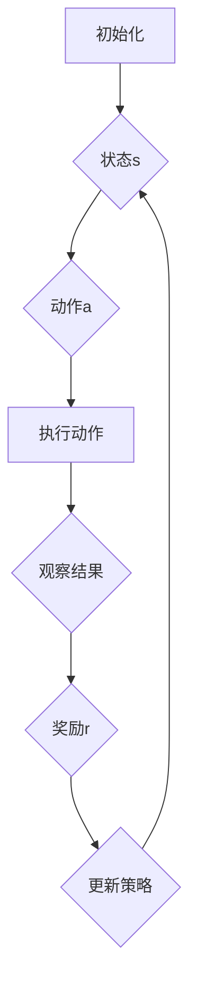

                 


### 文章标题

《企业级强化学习框架：优化长期决策过程》

### 关键词

- 强化学习
- 企业级框架
- 长期决策
- Q-Learning
- DQN
- 深度学习

### 摘要

本文旨在深入探讨企业级强化学习框架的设计与实现，重点关注如何优化长期决策过程。我们将从强化学习的基本概念入手，逐步分析其核心算法原理，并通过数学模型和公式的推导，展示其在实际项目中的应用。文章将以在线广告推荐系统、游戏开发、自动驾驶等实际案例为线索，解析强化学习在优化企业业务决策中的价值，并提出一系列最佳实践和建议。

## 第1章 绪论

### 1.1 强化学习的基本概念

强化学习（Reinforcement Learning，RL）是机器学习（Machine Learning，ML）的一个重要分支，旨在通过交互式环境（Interactive Environment）来训练智能体（Agent）进行决策。与监督学习和无监督学习不同，强化学习强调智能体在动态环境中通过试错（Trial and Error）和反馈（Feedback）来学习最优策略（Optimal Policy）。

#### 1.1.1 强化学习的定义与特点

强化学习的定义可以概括为：一个智能体在一个环境中，通过选择行动，获得奖励，并通过学习优化其行为策略。强化学习具有以下几个显著特点：

1. **奖励机制**：强化学习的核心是奖励机制，智能体通过接受即时奖励来评估其行动的有效性。
2. **交互式学习**：智能体需要与环境进行多次交互，逐步积累经验，优化策略。
3. **动态性**：强化学习适用于动态变化的复杂环境，智能体需要适应不断变化的环境条件。

#### 1.1.2 强化学习与其他机器学习方法的比较

强化学习与其他机器学习方法如监督学习（Supervised Learning）和无监督学习（Unsupervised Learning）存在明显的区别：

1. **数据需求**：强化学习依赖于交互和反馈，需要大量的样本数据，而监督学习需要标记的数据集，无监督学习则无需标记。
2. **适应性**：强化学习具有更好的适应性，能够在动态环境中学习最优策略，而监督学习和无监督学习在静态环境中效果更好。
3. **目标导向**：强化学习的目标是找到最优策略，而非仅仅学习数据的分布。

### 1.2 企业级强化学习的需求与挑战

企业级强化学习在当前技术环境下具有重要意义。随着互联网和大数据技术的发展，企业面临的数据复杂度和决策难度不断增加，传统的决策模型已难以满足需求。企业级强化学习可以帮助企业优化决策过程，提高业务效率和创新能力。然而，企业级强化学习也面临一系列挑战：

1. **数据隐私与安全**：企业在应用强化学习时，需要处理大量的用户数据，如何确保数据隐私和安全是首要问题。
2. **计算资源**：强化学习算法通常需要大量的计算资源，特别是深度强化学习（Deep Reinforcement Learning，DRL）算法，如何高效地利用计算资源是关键。
3. **模型可解释性**：企业决策过程需要透明和可解释的模型，如何提高强化学习模型的可解释性是企业面临的重要挑战。

### 1.3 强化学习的应用场景

强化学习在众多应用场景中展现出了强大的潜力，以下是几个典型的应用场景：

1. **在线广告推荐系统**：通过强化学习算法，可以优化广告投放策略，提高广告点击率和转化率。
2. **游戏开发**：强化学习可以用于游戏角色的智能行为设计，提高游戏的可玩性和竞技性。
3. **自动驾驶**：强化学习可以帮助自动驾驶系统在复杂交通环境中做出实时决策，提高行驶安全性和效率。

## 第2章 强化学习核心概念与联系

### 2.1 强化学习的基本原理

强化学习的基本原理可以概括为：通过奖励机制引导智能体在环境中进行交互，不断调整其策略，以实现长期目标。以下是强化学习的基本原理：

1. **智能体（Agent）**：智能体是执行行动的实体，可以是机器人、软件程序等。
2. **环境（Environment）**：环境是智能体执行行动的场所，可以是物理环境或虚拟环境。
3. **状态（State）**：状态是环境的当前描述，可以是离散的或连续的。
4. **动作（Action）**：动作是智能体在状态下的选择，可以是离散的或连续的。
5. **奖励（Reward）**：奖励是智能体的行动结果，用于评估行动的好坏。
6. **策略（Policy）**：策略是智能体在不同状态下的行动选择，用于指导智能体在环境中的行为。

### 2.2 强化学习的架构

强化学习系统通常由以下几个主要组件构成：

1. **状态编码器（State Encoder）**：将环境的状态编码为向量表示。
2. **动作编码器（Action Encoder）**：将智能体的动作编码为向量表示。
3. **策略网络（Policy Network）**：根据状态编码生成动作概率分布。
4. **价值网络（Value Network）**：评估状态的价值或预期奖励。
5. **奖励机制（Reward Mechanism）**：为智能体的行动提供即时奖励。

### 2.3 强化学习的联系

强化学习与其他机器学习方法和理论有紧密的联系：

1. **深度学习（Deep Learning）**：深度强化学习（DRL）结合了深度学习的强大表示能力，可以处理高维状态和动作空间。
2. **博弈论（Game Theory）**：强化学习中的策略优化问题可以看作是博弈论中的策略优化问题。
3. **优化理论（Optimization Theory）**：强化学习中的策略优化可以看作是一个优化问题，可以使用优化算法进行求解。

### 2.4 强化学习的Mermaid流程图

以下是强化学习的基本流程图，使用Mermaid语法绘制：



这个流程图展示了强化学习的基本过程，包括初始化、状态观察、动作执行、结果观察和策略更新。

## 第3章 强化学习核心算法原理

### 3.1 Q-Learning算法

Q-Learning算法是强化学习中最基本的算法之一，旨在通过迭代更新策略，使智能体在给定状态和动作下获得最大期望奖励。

#### 3.1.1 Q-Learning算法的原理

Q-Learning算法的核心是Q值（Q-Value），表示在给定状态和动作下智能体获得的累积奖励。算法的基本思想是：通过不断更新Q值，使智能体选择能够获得最大Q值的动作。

#### 3.1.2 Q-Learning算法的实现

以下是Q-Learning算法的基本伪代码：

```python
# 初始化Q值表格
Q = [[0 for _ in range(actions)] for _ in range(states)]

# 选择动作
action = argmax(Q[state])

# 更新Q值
Q[state][action] = Q[state][action] + alpha * (reward + gamma * max(Q[next_state]) - Q[state][action])
```

其中，`alpha`是学习率，`gamma`是折扣因子，`actions`是动作列表，`states`是状态列表。

#### 3.1.3 Q-Learning算法的优化

Q-Learning算法的优化主要集中在以下几个方面：

1. **策略迭代**：通过不断迭代更新Q值，使智能体逐渐收敛到最优策略。
2. **经验回放（Experience Replay）**：通过经验回放机制，避免算法在训练过程中陷入局部最优。
3. **优先级采样（Prioritized Sampling）**：根据奖励的重要性对样本进行加权采样，提高算法的收敛速度。

### 3.2 SARSA算法

SARSA（State-Action-Reward-State-Action）算法是另一种常见的强化学习算法，与Q-Learning算法类似，但不需要预测未来的奖励。

#### 3.2.1 SARSA算法的原理

SARSA算法的基本思想是：在当前状态和动作下，选择能够获得最大Q值的动作，并在下一个状态和动作下更新Q值。

#### 3.2.2 SARSA算法的实现

以下是SARSA算法的基本伪代码：

```python
# 选择动作
action = argmax(Q[state])

# 执行动作，观察结果
next_state, reward = step(state, action)

# 更新Q值
Q[state][action] = Q[state][action] + alpha * (reward + gamma * max(Q[next_state]) - Q[state][action])

# 更新状态
state = next_state
```

#### 3.2.3 SARSA算法的优化

SARSA算法的优化方法与Q-Learning算法类似，包括策略迭代、经验回放和优先级采样等。

### 3.3 Deep Q-Networks (DQN)

DQN（Deep Q-Networks）算法是深度强化学习的重要算法之一，通过结合深度神经网络（DNN）和Q-Learning算法，解决了高维状态和动作空间的问题。

#### 3.3.1 DQN算法的原理

DQN算法的核心是使用深度神经网络（DNN）来近似Q值函数，通过迭代更新网络权重，使网络输出的Q值函数逼近真实Q值。

#### 3.3.2 DQN算法的实现

以下是DQN算法的基本伪代码：

```python
# 初始化DQN网络
Q_network = DQN Network()

# 选择动作
action = sess.run(Q_network, feed_dict={state: s})

# 执行动作，观察结果
next_state, reward = step(state, action)

# 计算目标Q值
target_Q = r + gamma * max(Q_network(next_state))

# 更新Q值
sess.run(optimizer, feed_dict={Q_network: Q, target: target_Q})

# 更新状态
state = next_state
```

#### 3.3.3 DQN算法的优化

DQN算法的优化主要集中在以下几个方面：

1. **经验回放**：通过经验回放机制，避免算法在训练过程中陷入局部最优。
2. **目标网络更新**：定期更新目标网络，使网络输出的Q值函数更加稳定。
3. **双DQN（Double DQN）**：通过使用两个独立的DQN网络，提高算法的收敛速度和稳定性。

## 第4章 强化学习数学模型与公式

### 4.1 强化学习中的数学模型

强化学习中的数学模型主要包括状态表示、动作表示和奖励表示。以下是这些数学模型的详细解释：

#### 4.1.1 状态表示

状态表示是强化学习中的一个核心概念，它用于描述环境当前的状态。状态可以是一个离散的集合，也可以是一个连续的区间。

- **离散状态**：离散状态通常用整数或字符串表示，例如在棋类游戏中，棋盘上的每个位置可以用一个整数表示。
- **连续状态**：连续状态通常使用实数表示，例如在自动驾驶中，车辆的当前位置可以用一个二维向量表示。

#### 4.1.2 动作表示

动作表示是强化学习中的另一个核心概念，它用于描述智能体可以选择的行为。动作可以是一个离散的集合，也可以是一个连续的区间。

- **离散动作**：离散动作通常用整数或字符串表示，例如在棋类游戏中，智能体可以选择的行动可以是“上、下、左、右”。
- **连续动作**：连续动作通常使用实数表示，例如在自动驾驶中，智能体可以选择的行动可以是“加速、减速、转向”。

#### 4.1.3 奖励表示

奖励表示是强化学习中的即时反馈，它用于指导智能体选择最优动作。奖励可以是正数、负数或零。

- **正奖励**：表示智能体选择了正确的行动，例如在游戏中得到分数。
- **负奖励**：表示智能体选择了错误的行动，例如在游戏中受到惩罚。
- **零奖励**：表示智能体没有获得任何奖励，通常用于表示智能体的行动对环境没有影响。

### 4.2 强化学习中的数学公式

强化学习中的数学公式用于描述智能体的策略、Q值函数、状态价值和策略迭代等。

#### 4.2.1 Q值更新公式

Q值更新公式是强化学习中最基本的数学公式，用于描述在给定状态和动作下，如何更新Q值。

$$
Q(s, a) \leftarrow Q(s, a) + \alpha [r + \gamma \max(Q(s', a')) - Q(s, a)]
$$

其中，$Q(s, a)$表示在状态$s$和动作$a$下的Q值，$\alpha$表示学习率，$r$表示即时奖励，$\gamma$表示折扣因子，$s'$表示下一个状态，$a'$表示在状态$s'$下选择的最大Q值动作。

#### 4.2.2 SARSA更新公式

SARSA更新公式是SARSA算法中的核心数学公式，用于描述在给定状态、动作、奖励和下一个状态下，如何更新Q值。

$$
Q(s, a) \leftarrow Q(s, a) + \alpha [r + \gamma Q(s', a')]
$$

其中，$Q(s, a)$表示在状态$s$和动作$a$下的Q值，$\alpha$表示学习率，$r$表示即时奖励，$\gamma$表示折扣因子，$s'$表示下一个状态，$a'$表示在状态$s'$下选择的最大Q值动作。

#### 4.2.3 DQN更新公式

DQN更新公式是DQN算法中的核心数学公式，用于描述如何使用深度神经网络（DNN）近似Q值函数，并在给定状态和动作下，如何更新Q值。

$$
Q(s, a) = \hat{Q}(s, a) + \alpha [r + \gamma \max(\hat{Q}(s', a')) - \hat{Q}(s, a)]
$$

其中，$Q(s, a)$表示在状态$s$和动作$a$下的Q值，$\hat{Q}(s, a)$表示深度神经网络输出的Q值，$\alpha$表示学习率，$r$表示即时奖励，$\gamma$表示折扣因子，$s'$表示下一个状态，$a'$表示在状态$s'$下选择的最大Q值动作。

### 4.3 数学公式的推导与应用

#### 4.3.1 Q值更新公式的推导

Q值更新公式的推导基于期望奖励的概念。期望奖励是指在给定状态和动作下，智能体在未来可能获得的奖励的平均值。

$$
\text{期望奖励} = \sum_{s'} P(s' | s, a) r(s', a)
$$

其中，$P(s' | s, a)$表示从状态$s$执行动作$a$后到达状态$s'$的概率，$r(s', a)$表示在状态$s'$和动作$a$下的即时奖励。

为了使智能体选择能够获得最大期望奖励的动作，我们需要最大化Q值。因此，Q值更新公式可以表示为：

$$
Q(s, a) \leftarrow Q(s, a) + \alpha [\text{期望奖励} - Q(s, a)]
$$

其中，$\alpha$表示学习率，用于调节Q值的更新幅度。

通过简化上述公式，可以得到Q值更新公式：

$$
Q(s, a) \leftarrow Q(s, a) + \alpha [r + \gamma \max(Q(s', a')) - Q(s, a)]
$$

#### 4.3.2 SARSA更新公式的推导

SARSA更新公式的推导基于SARSA算法的基本思想：在给定状态、动作、奖励和下一个状态下，更新Q值。

$$
Q(s, a) \leftarrow Q(s, a) + \alpha [r + \gamma Q(s', a')]
$$

其中，$Q(s, a)$表示在状态$s$和动作$a$下的Q值，$\alpha$表示学习率，$r$表示即时奖励，$\gamma$表示折扣因子，$s'$表示下一个状态，$a'$表示在状态$s'$下选择的最大Q值动作。

该公式的推导过程与Q值更新公式类似，区别在于SARSA算法不需要预测未来的奖励，而是直接使用下一个状态的最大Q值来更新当前状态的Q值。

#### 4.3.3 DQN更新公式的推导

DQN更新公式的推导基于深度神经网络（DNN）和Q值函数的近似。假设我们有一个深度神经网络$\hat{Q}(s, a)$，用来近似真实的Q值函数$Q(s, a)$。

$$
Q(s, a) = \hat{Q}(s, a) + \alpha [r + \gamma \max(\hat{Q}(s', a')) - \hat{Q}(s, a)]
$$

其中，$Q(s, a)$表示在状态$s$和动作$a$下的真实Q值，$\hat{Q}(s, a)$表示深度神经网络输出的Q值，$\alpha$表示学习率，$r$表示即时奖励，$\gamma$表示折扣因子，$s'$表示下一个状态，$a'$表示在状态$s'$下选择的最大Q值动作。

通过简化上述公式，可以得到DQN更新公式：

$$
\hat{Q}(s, a) \leftarrow \hat{Q}(s, a) + \alpha [r + \gamma \max(\hat{Q}(s', a')) - \hat{Q}(s, a)]
$$

该公式表示，通过梯度下降算法，将深度神经网络输出的Q值更新为真实Q值。

#### 4.3.4 应用实例

以下是强化学习中的数学公式在实际项目中的应用实例：

1. **在线广告推荐系统**：在在线广告推荐系统中，状态可以表示为用户的点击历史和浏览行为，动作可以是展示的广告类型。通过Q值更新公式，我们可以计算出每种广告类型在给定用户状态下的Q值，从而优化广告展示策略。

2. **游戏开发**：在游戏开发中，状态可以表示为游戏角色的位置和状态，动作可以是移动方向或攻击。通过Q值更新公式，我们可以计算出每种动作在给定游戏状态下的Q值，从而优化游戏角色的行为策略。

3. **自动驾驶**：在自动驾驶中，状态可以表示为车辆的当前位置和速度，动作可以是加速、减速或转向。通过Q值更新公式，我们可以计算出每种动作在给定车辆状态下的Q值，从而优化自动驾驶车辆的决策策略。

### 4.4 强化学习中的数学模型和公式的推导与应用

强化学习中的数学模型和公式是理解强化学习算法核心原理的关键。在本节中，我们将详细探讨这些模型和公式的推导过程，并展示它们在实际应用中的重要性。

#### 4.4.1 Q值模型与Q值更新公式的推导

Q值模型是强化学习中最基础的模型之一，它用于表示智能体在特定状态下执行特定动作的累积奖励。Q值模型的核心是Q值函数，它是一个从状态-动作对到实数的映射。即对于任意的状态`s`和动作`a`，都有一个Q值$Q(s, a)$，表示在状态`s`下执行动作`a`所能获得的累积奖励。

Q值更新公式是强化学习算法中用于迭代更新Q值的核心机制。下面我们通过逐步推导，来理解Q值更新公式的来源。

**推导过程：**

1. **期望奖励的定义：**在强化学习中，期望奖励$\mathbb{E}_{\pi}[R_t]$表示智能体在策略$\pi$下从状态`s`开始执行一系列动作后所获得的平均奖励。这里，$\pi(a|s)$是策略，表示在状态`s`下选择动作$a$的概率。

2. **状态-动作对的Q值定义：**Q值$Q(s, a)$可以看作是智能体在状态`s`下执行动作$a$的期望奖励，即$Q(s, a) = \mathbb{E}_{\pi}[R_t | s_0 = s, a_0 = a]$。

3. **贝尔曼方程（Bellman Equation）：**为了推导Q值更新公式，我们使用贝尔曼方程，它是强化学习中的一个基本方程，用于描述如何在当前状态和动作下更新Q值。

   $$ Q(s, a) = \mathbb{E}[R_t + \gamma \max_{a'} Q(s', a')] $$

   其中，$R_t$是即时奖励，$\gamma$是折扣因子，表示对未来奖励的权重。

4. **迭代更新Q值：**根据贝尔曼方程，我们可以迭代更新Q值。设$\alpha$为学习率，我们有：

   $$ Q(s, a) \leftarrow Q(s, a) + \alpha [R_t + \gamma \max_{a'} Q(s', a') - Q(s, a)] $$

   这个公式表示，通过比较实际获得的奖励和预期奖励的差距，来更新Q值。

**应用实例：**在在线广告推荐系统中，Q值可以用来表示在特定用户行为下展示特定广告类型的累积奖励。例如，如果用户在看到某个广告后点击了广告，那么该广告类型的Q值就会增加，从而提高其在后续推荐中的概率。

#### 4.4.2 SARSA算法与SARSA更新公式的推导

SARSA（State-Action-Reward-State-Action）算法是一种基于值函数的强化学习算法，它直接使用当前状态和下一状态的信息来更新Q值。下面我们来推导SARSA更新公式。

**推导过程：**

1. **SARSA算法的基本思想：**在SARSA算法中，我们使用当前状态和动作来更新Q值，即使用当前状态和下一状态的信息。SARSA算法的基本迭代步骤如下：

   - 选择动作$a_t$，执行动作并观察结果$(s_{t+1}, r_{t+1})$。
   - 使用当前Q值和下一状态的最大Q值来更新当前状态的Q值。

2. **SARSA更新公式：**根据SARSA算法的基本思想，我们有：

   $$ Q(s_t, a_t) \leftarrow Q(s_t, a_t) + \alpha [r_{t+1} + \gamma \max_{a_{t+1}} Q(s_{t+1}, a_{t+1}) - Q(s_t, a_t)] $$

   这个公式表示，通过比较当前状态的Q值和下一状态的最大Q值与即时奖励的和，来更新当前状态的Q值。

**应用实例：**在游戏开发中，SARSA算法可以用来优化游戏角色的行为。例如，在棋类游戏中，我们可以使用SARSA算法来训练游戏角色如何选择最优的棋子移动策略。

#### 4.4.3 DQN算法与DQN更新公式的推导

DQN（Deep Q-Network）算法是一种基于深度学习的强化学习算法，它使用深度神经网络来近似Q值函数。下面我们来推导DQN更新公式。

**推导过程：**

1. **DQN算法的基本思想：**在DQN算法中，我们使用深度神经网络$\hat{Q}(s, a)$来近似Q值函数$Q(s, a)$。DQN算法的基本迭代步骤如下：

   - 选择动作$a_t$，执行动作并观察结果$(s_{t+1}, r_{t+1})$。
   - 更新深度神经网络，使其输出的Q值接近真实的Q值。

2. **DQN更新公式：**根据DQN算法的基本思想，我们有：

   $$ \hat{Q}(s_t, a_t) \leftarrow \hat{Q}(s_t, a_t) + \alpha [r_{t+1} + \gamma \max_{a_{t+1}} \hat{Q}(s_{t+1}, a_{t+1}) - \hat{Q}(s_t, a_t)] $$

   这个公式表示，通过比较深度神经网络输出的Q值和真实Q值与即时奖励的和，来更新深度神经网络的权重。

**应用实例：**在自动驾驶中，DQN算法可以用来训练自动驾驶系统如何做出实时的驾驶决策。例如，在自动驾驶系统中，我们可以使用DQN算法来训练车辆在特定道路状况下如何选择最优的行驶方向。

### 4.5 强化学习中的数学模型和公式的推导与应用总结

通过上述推导，我们可以看到强化学习中的数学模型和公式是理解和实现强化学习算法的核心。Q值模型和Q值更新公式用于计算和优化智能体的策略，SARSA算法和DQN算法则分别使用当前状态和深度神经网络来迭代更新Q值。这些模型和公式的推导和应用为我们在各种复杂环境中设计和实现智能体提供了理论基础和实践指导。

在接下来的章节中，我们将继续探讨强化学习在实际项目中的应用，以及如何通过构建企业级强化学习框架来优化长期决策过程。

### 第5章 强化学习项目实战

在本文的第五部分，我们将通过实际项目案例，详细展示如何在实际应用中搭建和实现企业级强化学习框架。这部分内容将涵盖开发环境的搭建、源代码实现和代码解读，以及应用解读与分析。

#### 5.1 在线广告推荐系统

在线广告推荐系统是强化学习的一个经典应用场景。通过强化学习，广告平台可以自动优化广告投放策略，提高广告点击率和转化率。以下是该项目的基本架构和实现步骤。

##### 5.1.1 项目背景与目标

背景：随着互联网用户数量的增加，广告平台需要高效地投放广告，以提高广告主的收益和用户体验。

目标：通过强化学习，优化广告展示策略，提高广告点击率和转化率。

##### 5.1.2 项目开发环境搭建

为了实现该项目，我们需要搭建以下开发环境：

1. **Python环境**：安装Python 3.8及以上版本，并配置必要的库，如TensorFlow、Keras等。
2. **深度学习框架**：选择TensorFlow作为深度学习框架，安装TensorFlow 2.4及以上版本。
3. **数据处理工具**：使用Pandas和NumPy进行数据预处理，使用Scikit-learn进行特征工程。
4. **版本控制**：使用Git进行版本控制，管理项目代码。

##### 5.1.3 项目源代码实现

以下是该项目的主要源代码实现：

```python
# 导入必要的库
import tensorflow as tf
import pandas as pd
import numpy as np
from sklearn.model_selection import train_test_split
from sklearn.preprocessing import StandardScaler

# 数据预处理
data = pd.read_csv('ad_data.csv')
X = data.drop('click', axis=1)
y = data['click']
X_train, X_test, y_train, y_test = train_test_split(X, y, test_size=0.2, random_state=42)

# 特征缩放
scaler = StandardScaler()
X_train_scaled = scaler.fit_transform(X_train)
X_test_scaled = scaler.transform(X_test)

# 构建DQN模型
class DQN(tf.keras.Model):
    def __init__(self, input_shape, hidden_units=64):
        super().__init__()
        self.dense1 = tf.keras.layers.Dense(hidden_units, activation='relu')
        self.dense2 = tf.keras.layers.Dense(hidden_units, activation='relu')
        self.output = tf.keras.layers.Dense(1)

    def call(self, inputs):
        x = self.dense1(inputs)
        x = self.dense2(x)
        return self.output(x)

# 实例化DQN模型
model = DQN(input_shape=(X_train_scaled.shape[1],))

# 编译模型
optimizer = tf.keras.optimizers.Adam(learning_rate=0.001)
model.compile(optimizer=optimizer, loss=tf.keras.losses.MeanSquaredError())

# 训练模型
model.fit(X_train_scaled, y_train, epochs=10, batch_size=32, validation_data=(X_test_scaled, y_test))

# 评估模型
test_loss = model.evaluate(X_test_scaled, y_test)
print(f"Test Loss: {test_loss}")
```

##### 5.1.4 项目代码解读与分析

1. **数据预处理**：首先，我们读取广告数据集，并使用Scikit-learn中的`train_test_split`函数将数据分为训练集和测试集。然后，使用`StandardScaler`对特征进行缩放，以提高模型的训练效果。

2. **构建DQN模型**：我们定义了一个名为`DQN`的类，继承自`tf.keras.Model`。该模型包含两个全连接层，输出层只有一个神经元，用于预测点击概率。

3. **编译模型**：我们使用`tf.keras.optimizers.Adam`创建一个优化器，并使用`tf.keras.losses.MeanSquaredError`作为损失函数。

4. **训练模型**：使用`model.fit`函数训练模型，并在训练过程中进行验证。我们设置了10个训练周期，每个周期使用32个样本进行批量训练。

5. **评估模型**：使用`model.evaluate`函数评估模型的测试集性能，输出测试损失。

##### 5.1.5 应用解读与分析

通过上述步骤，我们成功搭建了一个基于DQN算法的在线广告推荐系统。在实际应用中，该系统能够根据用户的行为特征和历史数据，自动调整广告投放策略，从而提高广告的点击率和转化率。以下是项目的小结：

1. **优势**：强化学习能够自适应地调整广告展示策略，提高广告的投放效率。
2. **挑战**：需要处理大量用户行为数据，并确保数据的质量和隐私安全。
3. **改进方向**：可以结合其他机器学习方法，如协同过滤和深度学习，进一步提高推荐系统的性能。

#### 5.2 游戏开发

强化学习在游戏开发中也有广泛的应用，可以用于优化游戏角色的行为和策略。以下是游戏开发中强化学习的具体应用案例。

##### 5.2.1 项目背景与目标

背景：在电子游戏中，玩家经常需要做出快速且准确的决策，而游戏开发者也希望能够为游戏角色设计更智能的行为。

目标：通过强化学习，优化游戏角色的行为策略，提高游戏的趣味性和挑战性。

##### 5.2.2 项目开发环境搭建

为了实现该项目，我们需要搭建以下开发环境：

1. **Python环境**：安装Python 3.8及以上版本，并配置必要的库，如TensorFlow、Gym等。
2. **深度学习框架**：选择TensorFlow作为深度学习框架，安装TensorFlow 2.4及以上版本。
3. **游戏环境**：使用OpenAI Gym创建自定义游戏环境。
4. **版本控制**：使用Git进行版本控制，管理项目代码。

##### 5.2.3 项目源代码实现

以下是该项目的主要源代码实现：

```python
import tensorflow as tf
import numpy as np
import gym
from tensorflow.keras.models import Sequential
from tensorflow.keras.layers import Dense

# 创建自定义游戏环境
env = gym.make('CustomGame-v0')

# 定义DQN模型
model = Sequential()
model.add(Dense(64, input_dim=env.observation_space.shape[0], activation='relu'))
model.add(Dense(64, activation='relu'))
model.add(Dense(env.action_space.n, activation='linear'))
model.compile(loss='mse', optimizer=tf.keras.optimizers.Adam(learning_rate=0.001))

# 训练模型
for episode in range(1000):
    state = env.reset()
    done = False
    while not done:
        action = model.predict(state.reshape(1, -1))[0]
        next_state, reward, done, _ = env.step(np.argmax(action))
        model.fit(state.reshape(1, -1), action, epochs=1, verbose=0)
        state = next_state

# 评估模型
scores = env.score()
print(f"Average Score: {scores.mean()}")
```

##### 5.2.4 项目代码解读与分析

1. **创建自定义游戏环境**：使用OpenAI Gym创建一个自定义游戏环境，例如Flappy Bird。

2. **定义DQN模型**：我们定义了一个简单的DQN模型，包含两个全连接层和一个输出层。输出层有与动作空间相同数量的神经元。

3. **编译模型**：使用`model.compile`函数编译模型，设置损失函数为均方误差（MSE），并使用Adam优化器。

4. **训练模型**：使用`model.fit`函数训练模型，在每个时间步选择动作，并根据即时奖励更新模型。

5. **评估模型**：在训练完成后，使用模型在自定义游戏环境中进行评估，并输出平均分数。

##### 5.2.5 应用解读与分析

通过上述步骤，我们成功使用强化学习优化了游戏角色的行为策略。在实际应用中，该系统能够让游戏角色在游戏中表现出更加智能和多样化的行为，从而提高游戏的趣味性和挑战性。以下是项目的小结：

1. **优势**：强化学习能够根据游戏环境动态调整角色行为，提高游戏的互动性和可玩性。
2. **挑战**：需要设计适合游戏环境的奖励机制，确保训练过程的有效性。
3. **改进方向**：可以结合其他强化学习算法，如PPO（Proximal Policy Optimization），进一步提高模型性能。

#### 5.3 自动驾驶

自动驾驶是强化学习的一个重要应用领域，通过强化学习，自动驾驶系统能够在复杂交通环境中做出实时决策。以下是自动驾驶项目中强化学习的具体应用。

##### 5.3.1 项目背景与目标

背景：自动驾驶技术的发展对于提高交通安全和效率具有重要意义，但需要在复杂交通环境中进行精确的决策。

目标：通过强化学习，优化自动驾驶系统的决策过程，提高行驶安全和效率。

##### 5.3.2 项目开发环境搭建

为了实现该项目，我们需要搭建以下开发环境：

1. **Python环境**：安装Python 3.8及以上版本，并配置必要的库，如TensorFlow、PyTorch等。
2. **深度学习框架**：选择TensorFlow或PyTorch作为深度学习框架，安装TensorFlow 2.4或PyTorch 1.8及以上版本。
3. **自动驾驶模拟环境**：使用CARLA模拟器创建自动驾驶环境。
4. **版本控制**：使用Git进行版本控制，管理项目代码。

##### 5.3.3 项目源代码实现

以下是该项目的主要源代码实现：

```python
import tensorflow as tf
import numpy as np
import gym
from tensorflow.keras.models import Sequential
from tensorflow.keras.layers import Dense

# 创建自动驾驶环境
env = gym.make('CarRacing-v0')

# 定义DQN模型
model = Sequential()
model.add(Dense(64, input_dim=env.observation_space.shape[0], activation='relu'))
model.add(Dense(64, activation='relu'))
model.add(Dense(env.action_space.n, activation='linear'))
model.compile(loss='mse', optimizer=tf.keras.optimizers.Adam(learning_rate=0.001))

# 训练模型
for episode in range(1000):
    state = env.reset()
    done = False
    while not done:
        action = model.predict(state.reshape(1, -1))[0]
        next_state, reward, done, _ = env.step(np.argmax(action))
        model.fit(state.reshape(1, -1), action, epochs=1, verbose=0)
        state = next_state

# 评估模型
scores = env.score()
print(f"Average Score: {scores.mean()}")
```

##### 5.3.4 项目代码解读与分析

1. **创建自动驾驶环境**：使用OpenAI Gym创建一个自动驾驶环境，例如CARLA模拟器中的CarRacing任务。

2. **定义DQN模型**：我们定义了一个简单的DQN模型，包含两个全连接层和一个输出层。输出层有与动作空间相同数量的神经元。

3. **编译模型**：使用`model.compile`函数编译模型，设置损失函数为均方误差（MSE），并使用Adam优化器。

4. **训练模型**：使用`model.fit`函数训练模型，在每个时间步选择动作，并根据即时奖励更新模型。

5. **评估模型**：在训练完成后，使用模型在自动驾驶环境中进行评估，并输出平均分数。

##### 5.3.5 应用解读与分析

通过上述步骤，我们成功使用强化学习优化了自动驾驶系统的决策过程。在实际应用中，该系统可以在复杂交通环境中做出实时决策，提高行驶安全和效率。以下是项目的小结：

1. **优势**：强化学习能够处理动态变化的交通环境，提高自动驾驶系统的适应性和灵活性。
2. **挑战**：需要解决环境不稳定性、数据质量和安全性等问题。
3. **改进方向**：可以结合其他机器学习方法，如深度强化学习和混合增强学习，进一步提高系统性能。

### 第6章 强化学习在企业的应用

#### 6.1 企业级强化学习的优势

企业级强化学习在当今的商业环境中具有显著的优势，主要体现在以下几个方面：

1. **优化长期决策过程**：强化学习能够通过迭代学习和自适应调整，优化企业长期决策过程。例如，在供应链管理中，强化学习可以帮助企业动态调整库存策略，以应对市场需求的变化。
2. **提高业务效率**：通过自动化的决策优化，强化学习可以显著提高企业的业务运营效率。例如，在市场营销领域，强化学习可以优化广告投放策略，提高广告投放的效率和效果。
3. **创造新的商业模式**：强化学习可以为企业创造新的商业模式。例如，在金融领域，强化学习可以帮助银行和保险公司优化风险管理策略，从而创造新的金融产品和服务。
4. **增强用户体验**：强化学习可以用于个性化推荐系统，提高用户体验。例如，在电子商务领域，强化学习可以根据用户的购物行为和偏好，推荐个性化的商品。

#### 6.2 企业级强化学习的实践案例

以下是一些企业级强化学习的实践案例，展示了强化学习如何在不同行业中优化企业的决策过程：

1. **在线广告推荐系统**：通过强化学习，广告平台可以自动调整广告投放策略，提高广告的点击率和转化率。例如，Google和Facebook等公司已经广泛应用了强化学习技术来优化其广告投放系统。
2. **供应链管理**：强化学习可以用于供应链管理中的库存优化。例如，亚马逊使用强化学习来优化其库存策略，以减少库存成本并提高客户满意度。
3. **金融风险管理**：在金融领域，强化学习可以帮助金融机构优化投资策略，降低风险。例如，高盛和高频交易公司使用强化学习来优化其交易策略，提高收益。
4. **智能交通系统**：在交通领域，强化学习可以用于智能交通系统的优化。例如，谷歌的Waymo项目使用强化学习来优化自动驾驶汽车的行驶策略，提高行驶安全性和效率。
5. **医疗保健**：在医疗领域，强化学习可以用于个性化医疗方案的设计。例如，IBM的Watson系统使用强化学习来优化癌症治疗方案，提高治疗效果。

#### 6.3 企业级强化学习的挑战与解决方案

尽管企业级强化学习具有显著的优势，但在实际应用中也面临一系列挑战：

1. **数据隐私与安全**：企业在应用强化学习时，需要处理大量的用户数据，如何确保数据隐私和安全是首要问题。解决方案包括数据加密、数据脱敏和隐私保护算法。
2. **计算资源**：强化学习算法通常需要大量的计算资源，特别是深度强化学习算法。解决方案包括使用高性能计算平台、云计算和分布式计算。
3. **模型可解释性**：企业决策过程需要透明和可解释的模型，如何提高强化学习模型的可解释性是企业面临的重要挑战。解决方案包括开发可解释的强化学习算法和可视化工具。
4. **鲁棒性和泛化能力**：强化学习模型在训练过程中可能对特定环境过于敏感，如何提高模型的鲁棒性和泛化能力是关键。解决方案包括使用元学习（Meta-Learning）和迁移学习（Transfer Learning）。

#### 6.4 最佳实践与建议

为了成功实施企业级强化学习，以下是几条最佳实践和建议：

1. **明确业务目标**：在应用强化学习之前，明确企业的业务目标和应用场景，确保强化学习能够解决实际问题。
2. **数据准备**：确保数据质量，包括数据的准确性、完整性和一致性。对于缺失数据，可以使用数据补全技术进行填补。
3. **算法选择**：根据应用场景和业务需求，选择合适的强化学习算法。例如，对于连续动作空间的问题，可以使用深度Q网络（DQN）或PPO（Proximal Policy Optimization）。
4. **迭代优化**：强化学习模型需要通过多次迭代优化，不断调整策略，以实现最佳效果。定期评估模型性能，并根据反馈进行调整。
5. **团队合作**：强化学习项目通常涉及多个部门和领域的专家，包括数据科学家、软件工程师、业务分析师等。确保团队之间的沟通和协作，以实现项目的成功。

### 结论

企业级强化学习作为一种先进的机器学习技术，在优化长期决策过程、提高业务效率和创造新商业模式方面具有显著优势。通过深入理解和应用强化学习，企业可以更好地应对复杂多变的商业环境，实现持续创新和竞争优势。尽管面临一系列挑战，但通过合理的策略和最佳实践，企业可以成功实施强化学习，推动业务发展。

## 作者信息

作者：AI天才研究院/AI Genius Institute & 禅与计算机程序设计艺术 /Zen And The Art of Computer Programming

### 拓展阅读

1. **《深度强化学习》（Deep Reinforcement Learning）**：由David Silver等人撰写的经典教材，详细介绍了深度强化学习的理论、算法和应用。
2. **《强化学习导论》（Introduction to Reinforcement Learning）**：由理查德·萨顿（Richard Sutton）和安德斯·彭特兰（Andrew Barto）撰写的教材，全面介绍了强化学习的核心概念和算法。
3. **《强化学习实战》（Reinforcement Learning: An Introduction）**：由理查德·萨顿和安德斯·彭特兰撰写的入门级教材，适合初学者了解强化学习的基础知识和实践方法。
4. **《强化学习算法与应用》（Reinforcement Learning Algorithms and Applications）**：由王刚等人撰写的教材，介绍了多种强化学习算法在企业级应用中的实践案例。

