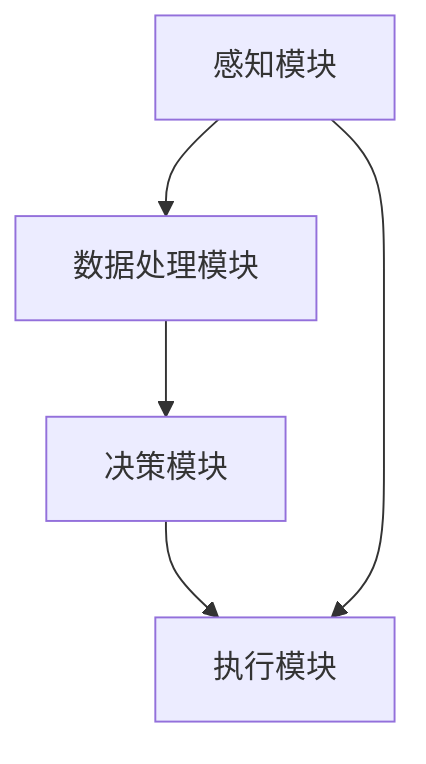
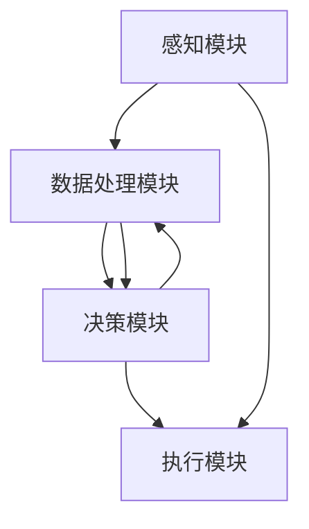

                 


### 第1章：企业级情境感知AI概述

#### 1.1 什么是企业级情境感知AI

企业级情境感知AI（Context-Aware AI for Enterprise）是一种先进的人工智能技术，它能够根据用户的行为、环境信息以及上下文，动态调整其行为和服务，以满足不同场景下的个性化需求。情境感知AI的核心在于其能够对用户的实时情境进行感知，并据此提供针对性的服务。

情境感知AI的基本概念源于人工智能领域的一个分支，即情境感知计算（Context-Aware Computing）。情境感知计算专注于开发能够根据用户和环境的状态动态调整自身行为的技术。在企业级应用中，这种技术被进一步扩展和优化，以满足企业对用户体验和服务交付的高要求。

企业级情境感知AI的基本组成部分包括：

- **感知模块**：负责收集用户行为、环境数据和上下文信息。
- **数据处理模块**：对收集到的数据进行分析和处理，提取有用的信息。
- **决策模块**：基于分析结果，生成适应不同情境的决策。
- **执行模块**：将决策付诸实施，调整服务和用户体验。

#### 1.2 企业级情境感知AI的价值

企业级情境感知AI的价值主要体现在以下几个方面：

1. **提升用户体验**：通过个性化服务和自适应交互，提升用户满意度。
2. **优化服务交付**：根据实时情境调整服务策略，提高服务效率和准确性。
3. **增强业务智能化**：为企业提供数据驱动的决策支持，提升业务智能化水平。
4. **降低运营成本**：通过自动化和智能化，减少人工干预，降低运营成本。

#### 1.3 情境感知技术发展趋势

随着人工智能技术的不断发展，企业级情境感知AI也呈现出以下发展趋势：

1. **边缘计算与云计算的结合**：情境感知AI正在从云端向边缘设备扩展，实现实时、高效的数据处理和决策。
2. **多模态感知**：情境感知AI将整合多种感知方式，如视觉、声音、位置等，以获得更全面的信息。
3. **增强学习与迁移学习**：通过增强学习和迁移学习，情境感知AI将能够更好地适应不同场景和环境。
4. **隐私保护**：随着用户隐私意识的增强，情境感知AI在数据处理和模型训练中需要更加注重隐私保护。

### Mermaid 流程图

下面是一个简单的Mermaid流程图，展示了企业级情境感知AI的基本组成部分及其相互关系：



**图1：企业级情境感知AI的基本组成部分及其相互关系**

### 小结

本章对什么是企业级情境感知AI进行了概述，并探讨了其价值和发展趋势。在企业级应用中，情境感知AI已经成为提升用户体验和服务交付的关键技术。接下来的章节将深入探讨情境感知技术的原理、应用和优化策略。

---

### 1.4 情境感知AI在业务场景中的应用案例

为了更好地理解企业级情境感知AI的实际应用，我们可以通过以下几个具体案例来分析其如何在不同业务场景中发挥作用。

#### 案例一：在线教育平台

在线教育平台可以通过情境感知AI技术，根据学生的学习行为、学习环境和学习历史，提供个性化的学习建议和资源推荐。例如：

- **学习行为感知**：平台可以记录学生的学习时长、学习频率和交互行为，根据这些数据调整教学内容和难度。
- **环境感知**：通过摄像头和传感器，平台可以监测学生的专注度，如眨眼频率、头部运动等，提供提醒服务，帮助学生保持专注。
- **历史数据**：基于以往的学习成绩、喜好和互动记录，平台可以推荐适合的学习材料和课程。

这些应用不仅提升了学习效果，还提高了用户满意度和平台黏性。

#### 案例二：智能酒店

智能酒店通过情境感知AI技术，提供个性化服务和自动化管理，提升用户体验和酒店运营效率。例如：

- **入住登记**：通过人脸识别和自助服务终端，客人可以快速完成入住登记，无需排队等待。
- **房间控制**：根据客人的喜好和实时情境，智能系统可以自动调节房间温度、光线和音乐，提供舒适的环境。
- **服务推荐**：基于客人的历史数据和实时需求，酒店可以推荐适合的餐饮、娱乐和服务项目。

这些智能化的服务不仅提高了客户满意度，还减少了人力资源成本。

#### 案例三：智能医疗

智能医疗系统利用情境感知AI技术，提供个性化医疗服务和智能辅助诊断，提高医疗质量和效率。例如：

- **患者行为监测**：通过可穿戴设备，医生可以实时监测患者的心率、血压等生命体征，及时调整治疗方案。
- **环境感知**：病房内的摄像头和传感器可以监测患者的活动和状态，如跌倒、异常动作等，及时通知医护人员。
- **诊断辅助**：基于大数据和机器学习模型，智能系统可以帮助医生快速分析病例，提供诊断建议。

这些应用不仅提升了医疗服务水平，还减轻了医护人员的工作负担。

### 小结

通过以上案例，我们可以看到情境感知AI技术在各个业务场景中的应用潜力。它不仅能够提升用户体验和服务质量，还能够优化业务流程，提高运营效率。随着技术的不断发展，情境感知AI将在更多领域发挥重要作用。

---

本章首先介绍了什么是企业级情境感知AI，探讨了其价值和发展趋势。接着，通过具体案例展示了情境感知AI在不同业务场景中的应用。下一章将深入探讨情境感知技术的原理，包括数据获取、数据处理和模型构建等方面。

---

### 1.5 情境感知技术的核心原理

情境感知技术的核心在于如何有效地获取、处理和分析情境数据，以生成适应不同情境的决策。下面，我们将详细探讨这些核心原理，并使用伪代码来展示其基本算法。

#### 1.5.1 数据获取

情境感知AI的第一步是获取相关的情境数据。这些数据可以来源于多种渠道，如传感器、用户输入和外部API。以下是一个简单的伪代码，用于从不同来源获取情境数据：

```pseudo
function getData Sources():
    data = {}
    data["user_input"] = getUserInput()
    data["sensor_data"] = readSensorData()
    data["external_api"] = callExternalAPI()
    return data
```

在这个函数中，`getUserInput()` 用于获取用户通过界面输入的数据，如文本、语音或手势；`readSensorData()` 用于读取传感器收集的数据，如温度、湿度、位置等；`callExternalAPI()` 用于调用外部API获取的实时数据，如天气预报、交通状况等。

#### 1.5.2 数据处理

获取到数据后，需要对这些数据进行处理，以确保它们能够被有效利用。数据处理通常包括数据清洗、特征提取和融合等步骤。以下是一个简化的数据处理伪代码：

```pseudo
function processData(data):
    cleaned_data = cleanData(data)
    features = extractFeatures(cleaned_data)
    fused_data = fuseFeatures(features)
    return fused_data
```

在这个函数中，`cleanData(data)` 用于去除噪声和异常值，`extractFeatures(cleaned_data)` 用于从原始数据中提取有用的特征，`fuseFeatures(features)` 用于将多个特征进行整合，以获得更全面的信息。

#### 1.5.3 模型构建

处理完数据后，需要使用这些数据来构建情境感知模型。常见的模型构建方法包括机器学习、深度学习和强化学习。以下是一个基于机器学习的情境感知模型构建伪代码：

```pseudo
function buildModel(data):
    X, y = prepareTrainingData(data)
    model = trainModel(X, y)
    return model
```

在这个函数中，`prepareTrainingData(data)` 用于将数据划分为特征集 `X` 和标签集 `y`，`trainModel(X, y)` 用于训练机器学习模型。

#### 1.5.4 决策与执行

模型训练完成后，可以使用它来生成适应不同情境的决策。以下是一个简化的决策与执行伪代码：

```pseudo
function makeDecision(model, current_context):
    prediction = model.predict(current_context)
    action = generateAction(prediction)
    executeAction(action)
```

在这个函数中，`model.predict(current_context)` 用于预测当前情境下的行为，`generateAction(prediction)` 用于生成具体的执行动作，`executeAction(action)` 用于执行这些动作。

### 1.5.5 数学模型与公式

情境感知技术中的数据处理和模型构建往往涉及到复杂的数学模型和公式。以下是一个简化的情境感知模型的数学公式：

$$
\text{情境感知模型} = f(\text{特征集}, \text{标签集})
$$

其中，`f` 表示模型训练函数，`特征集` 表示从数据中提取的特征，`标签集` 表示需要预测的目标。

### 举例说明

假设我们有一个情境感知模型，用于预测用户在特定环境下的行为。特征集可能包括用户的位置、时间、天气情况等，标签集可能包括用户的情绪、活动类型等。以下是一个简化的例子：

$$
\text{情境感知模型} = f(\text{位置}, \text{时间}, \text{天气}, \text{情绪}, \text{活动类型})
$$

如果当前情境是用户在下午3点在户外，天气晴朗，根据历史数据和模型预测，用户可能情绪愉快，活动类型是散步。

### 小结

本章详细介绍了情境感知技术的核心原理，包括数据获取、数据处理、模型构建、决策与执行以及相关的数学模型和公式。通过伪代码和举例，我们更好地理解了这些原理的实际应用。下一章将探讨用户体验与服务交付的概念和重要性。

---

### 1.6 用户体验与服务交付

用户体验（User Experience, UX）是指用户在使用产品或服务时所感受到的所有体验，包括情感、认知、行为等各个方面。用户体验的核心目标是满足用户的期望，提升用户的满意度，并促进用户对产品的忠诚度。

#### 1.6.1 用户体验的重要性

在数字化的时代，用户体验已成为企业竞争的关键因素之一。优秀的用户体验能够带来以下几个方面的益处：

1. **提升用户满意度**：通过优化用户界面、交互流程和服务质量，用户会感到更加愉悦和满足。
2. **增加用户黏性**：良好的用户体验会使用户更愿意长期使用产品或服务，减少流失率。
3. **提升品牌形象**：优秀的用户体验能够增强品牌在用户心中的形象，提升品牌价值。
4. **驱动业务增长**：满意的用户往往会推荐给其他人，从而带来新的用户和业务增长。

#### 1.6.2 服务交付流程

服务交付流程是指将产品或服务从生产到用户手中的整个过程。一个完整的服务交付流程通常包括以下几个阶段：

1. **需求分析**：了解用户需求，确定产品或服务的目标和功能。
2. **设计与开发**：根据需求分析结果，进行产品设计和服务流程开发。
3. **测试与优化**：对产品或服务进行测试，确保其性能和质量，并进行优化。
4. **交付与部署**：将产品或服务交付给用户，并进行部署和上线。
5. **用户反馈与改进**：收集用户反馈，持续改进产品或服务质量。

#### 1.6.3 情境感知在用户体验与服务交付中的作用

情境感知技术能够为用户体验和服务交付带来显著的优化。具体体现在以下几个方面：

1. **个性化服务**：根据用户的实时情境，提供个性化的服务和内容，满足用户的需求和期望。
2. **智能交互**：通过自然语言处理和智能对话系统，实现与用户的智能交互，提升用户体验。
3. **实时反馈**：及时收集用户反馈，快速响应用户需求，优化服务流程和用户体验。
4. **智能诊断与预测**：利用大数据和机器学习技术，对用户行为进行分析和预测，提前发现问题并优化服务。

#### 1.6.4 案例分析

以下是一个情境感知在用户体验与服务交付中的应用案例：

**案例：智能旅游服务平台**

一个智能旅游服务平台通过情境感知技术，为用户提供个性化的旅游服务。平台能够实时获取用户的位置、时间、天气、偏好等信息，并根据这些信息提供以下服务：

1. **个性化路线规划**：根据用户的位置和偏好，推荐适合的旅游路线和景点。
2. **实时天气预警**：根据天气预报，提醒用户可能遇到的不良天气，提供替代路线或活动建议。
3. **智能导游**：通过语音助手，为用户提供实时的景点介绍和历史背景信息。
4. **个性化推荐**：根据用户的浏览记录和反馈，推荐感兴趣的餐厅、商店和活动。

通过这些个性化服务，平台不仅提升了用户体验，还提高了用户黏性和满意度，从而实现了业务增长。

### 小结

用户体验和服务交付是情境感知AI应用的重要领域。通过个性化服务和智能交互，情境感知技术能够显著提升用户体验，优化服务交付流程。下一章将探讨情境感知技术在不同企业级应用场景中的实际应用。

---

### 1.7 情境感知技术原理之间的关系架构

为了更清晰地理解企业级情境感知AI的各个组成部分及其相互关系，我们可以使用Mermaid流程图来展示情境感知技术的基本架构。以下是一个简化的流程图，描述了感知模块、数据处理模块、决策模块和执行模块之间的互动关系。



**图2：情境感知技术原理之间的关系架构**

- **感知模块（A）**：负责收集用户行为、环境数据和上下文信息，是情境感知的基础。
- **数据处理模块（B）**：对感知模块收集到的数据进行清洗、特征提取和融合，为决策模块提供有用的信息。
- **决策模块（C）**：基于处理后的数据，使用机器学习、深度学习或其他算法生成适应不同情境的决策。
- **执行模块（D）**：将决策模块生成的决策付诸实施，调整服务和用户体验。

通过这个流程图，我们可以看到各个模块之间的紧密联系和协同作用。感知模块为数据处理和决策模块提供输入，而决策模块的输出则指导执行模块进行调整，从而实现动态的情境感知和自适应服务。

### 小结

本章详细介绍了企业级情境感知AI的基本概念、价值、发展趋势以及其在业务场景中的应用案例。通过Mermaid流程图，我们清晰地展示了感知模块、数据处理模块、决策模块和执行模块之间的关系。下一章将深入探讨情境感知AI在客户服务中的应用。

---

### 第2章：情境感知技术原理

#### 2.1 情境感知数据的获取

情境感知数据的获取是情境感知AI系统的基础。获取准确、全面的数据对于构建有效的感知模型至关重要。数据来源可以包括传感器、用户输入和外部API。

##### 2.1.1 传感器数据

传感器数据是情境感知AI中最重要的数据来源之一。常见的传感器包括温度传感器、湿度传感器、光照传感器、位置传感器等。以下是一个获取传感器数据的伪代码示例：

```python
def getSensorData():
    temperature = readTemperatureSensor()
    humidity = readHumiditySensor()
    light = readLightSensor()
    location = readLocationSensor()
    return {"temperature": temperature, "humidity": humidity, "light": light, "location": location}
```

在这个示例中，`readTemperatureSensor()`、`readHumiditySensor()`、`readLightSensor()` 和 `readLocationSensor()` 分别代表从温度传感器、湿度传感器、光照传感器和位置传感器读取数据。

##### 2.1.2 用户输入数据

用户输入数据通常包括用户通过应用程序输入的文本、语音和手势等。以下是一个获取用户输入数据的伪代码示例：

```python
def getUserInput():
    text_input = readTextInput()
    voice_input = readVoiceInput()
    gesture_input = readGestureInput()
    return {"text_input": text_input, "voice_input": voice_input, "gesture_input": gesture_input}
```

在这个示例中，`readTextInput()`、`readVoiceInput()` 和 `readGestureInput()` 分别代表从文本输入框、语音输入和手势输入中读取数据。

##### 2.1.3 外部API数据

外部API数据可以来自第三方服务或公开数据源，如天气预报、交通状况等。以下是一个获取外部API数据的伪代码示例：

```python
def getExternalAPI():
    weather_data = callWeatherAPI()
    traffic_data = callTrafficAPI()
    return {"weather_data": weather_data, "traffic_data": traffic_data}
```

在这个示例中，`callWeatherAPI()` 和 `callTrafficAPI()` 分别代表调用天气预报API和交通状况API。

#### 2.2 情境感知数据的处理

获取到数据后，需要进行处理以确保其质量，并提取有用的特征。数据处理通常包括数据清洗、特征提取和融合等步骤。

##### 2.2.1 数据清洗

数据清洗是为了去除数据中的噪声和异常值，确保数据质量。以下是一个数据清洗的伪代码示例：

```python
def cleanData(data):
    cleaned_data = {}
    for key, value in data.items():
        if isInvalid(value):
            cleaned_data[key] = None
        else:
            cleaned_data[key] = value
    return cleaned_data

def isInvalid(value):
    # 实现判断数据是否有效的逻辑
    return value is None or value == ""
```

在这个示例中，`cleanData()` 函数用于清洗输入数据，`isInvalid()` 函数用于判断数据是否有效。

##### 2.2.2 特征提取

特征提取是从原始数据中提取出有用的信息，用于后续的模型训练和决策。以下是一个特征提取的伪代码示例：

```python
def extractFeatures(data):
    features = {}
    features["temp_diff"] = calculateTempDiff(data["temperature"], data["prev_temperature"])
    features["humidity_diff"] = calculateHumidityDiff(data["humidity"], data["prev_humidity"])
    features["location_distance"] = calculateLocationDistance(data["location"], data["prev_location"])
    return features

def calculateTempDiff(current_temp, prev_temp):
    return current_temp - prev_temp

def calculateHumidityDiff(current_humidity, prev_humidity):
    return current_humidity - prev_humidity

def calculateLocationDistance(current_location, prev_location):
    return calculateDistance(current_location, prev_location)
```

在这个示例中，`extractFeatures()` 函数用于从数据中提取特征，`calculateTempDiff()`、`calculateHumidityDiff()` 和 `calculateLocationDistance()` 函数分别用于计算温度差、湿度差和位置距离。

##### 2.2.3 特征融合

特征融合是将多个特征组合成一个整体，以便更好地反映情境。以下是一个特征融合的伪代码示例：

```python
def fuseFeatures(features):
    fused_feature = sum(features.values())
    return fused_feature
```

在这个示例中，`fuseFeatures()` 函数用于将特征融合成一个数值。

#### 2.3 情境感知模型构建

构建情境感知模型是情境感知技术的核心步骤。常见的模型构建方法包括机器学习、深度学习和强化学习。以下是一个基于机器学习的情境感知模型构建的伪代码示例：

```python
def buildModel(training_data, validation_data):
    X_train, y_train = prepareTrainingData(training_data)
    X_val, y_val = prepareValidationData(validation_data)
    model = trainModel(X_train, y_train)
    evaluateModel(model, X_val, y_val)
    return model

def prepareTrainingData(data):
    X = []
    y = []
    for sample in data:
        X.append(extractFeatures(sample))
        y.append(sample["label"])
    return X, y

def trainModel(X, y):
    model = createModel()
    model.fit(X, y)
    return model

def evaluateModel(model, X_val, y_val):
    predictions = model.predict(X_val)
    accuracy = calculateAccuracy(predictions, y_val)
    print(f"Validation Accuracy: {accuracy}")
```

在这个示例中，`buildModel()` 函数用于构建和评估情境感知模型，`prepareTrainingData()` 函数用于准备训练数据，`trainModel()` 函数用于训练模型，`evaluateModel()` 函数用于评估模型性能。

#### 2.4 决策与执行

模型构建完成后，可以使用它来生成适应不同情境的决策，并将决策付诸实施。以下是一个决策与执行的伪代码示例：

```python
def makeDecision(model, current_context):
    features = extractFeatures(current_context)
    prediction = model.predict([features])
    action = generateAction(prediction)
    executeAction(action)
    return action

def generateAction(prediction):
    if prediction == "A":
        return "Perform Action A"
    elif prediction == "B":
        return "Perform Action B"
    else:
        return "No Action"

def executeAction(action):
    print(f"Executing Action: {action}")
```

在这个示例中，`makeDecision()` 函数用于生成决策并执行，`generateAction()` 函数用于根据预测结果生成具体动作，`executeAction()` 函数用于执行动作。

#### 小结

本章详细介绍了情境感知技术的原理，包括数据获取、数据处理、模型构建、决策与执行。通过伪代码示例，我们展示了这些原理的实际应用。下一章将探讨情境感知AI在不同企业级应用场景中的具体应用。

---

### 第3章：用户体验与服务交付

#### 3.1 用户体验定义与重要性

用户体验（User Experience, UX）是指用户在使用产品或服务时所产生的整体感受，包括情感、认知、行为等多个方面。用户体验不仅仅是产品或服务的功能是否完善，更重要的是用户在使用过程中所感受到的满足程度和愉悦感。

用户体验的定义可以从以下几个方面来理解：

1. **情感体验**：用户在使用产品或服务时所感受到的情绪，如愉悦、焦虑、满意等。
2. **认知体验**：用户在理解和使用产品或服务时的认知过程，包括学习、决策、记忆等。
3. **行为体验**：用户在使用产品或服务时的行为模式，如点击、浏览、搜索、购买等。

用户体验的重要性体现在以下几个方面：

1. **用户满意度**：良好的用户体验能够满足用户的期望和需求，提高用户满意度。
2. **用户忠诚度**：满意的用户更可能成为忠实用户，持续使用产品或服务。
3. **品牌形象**：优秀的用户体验能够提升品牌形象，增强品牌忠诚度和市场竞争力。
4. **业务增长**：满意的用户会通过口碑传播吸引新用户，从而实现业务增长。

#### 3.2 服务交付流程

服务交付流程是指从服务设计、开发、测试到交付给用户的一系列步骤。一个完整的服务交付流程通常包括以下几个阶段：

1. **需求分析**：收集用户需求和业务目标，明确服务的设计方向和功能要求。
2. **服务设计**：根据需求分析结果，设计服务的功能、界面和交互流程。
3. **开发与测试**：实施服务设计，进行开发和单元测试，确保服务的质量和稳定性。
4. **部署与上线**：将服务部署到生产环境，进行上线和发布。
5. **用户反馈与改进**：收集用户反馈，持续改进服务流程和用户体验。

#### 3.3 情境感知在用户体验与服务交付中的作用

情境感知技术能够显著提升用户体验和服务交付效率，其具体作用体现在以下几个方面：

1. **个性化服务**：通过感知用户的实时情境，提供个性化的服务和内容，满足用户的需求和期望。
2. **智能交互**：通过自然语言处理和智能对话系统，实现与用户的智能交互，提升用户体验。
3. **实时反馈**：及时收集用户反馈，快速响应用户需求，优化服务流程和用户体验。
4. **智能诊断与预测**：利用大数据和机器学习技术，对用户行为进行分析和预测，提前发现问题并优化服务。

#### 案例分析

以下是一个情境感知在用户体验与服务交付中的应用案例：

**案例：智能智能家居系统**

一个智能智能家居系统通过情境感知技术，为用户提供个性化、智能化的家居服务。系统能够实时感知用户的行为、环境数据和情境，提供以下服务：

1. **个性化环境控制**：根据用户的实时情境，如室内温度、湿度、光照等，智能调节空调、加湿器、窗帘等设备，提供舒适的家居环境。
2. **智能安防监控**：通过摄像头和传感器，实时监控家居安全，如有人闯入、异常声音等，及时通知用户并采取相应措施。
3. **智能设备管理**：用户可以通过语音或手机应用控制家居设备，如开关灯、调节温度、播放音乐等，实现远程控制和自动化管理。
4. **健康监测与建议**：通过可穿戴设备，实时监测用户的健康数据，如心率、血压等，提供健康建议和预警。

通过这些个性化服务和智能交互，智能家居系统不仅提升了用户的生活质量，还提高了用户对家居设备的满意度和依赖度。

### 小结

用户体验和服务交付是情境感知AI应用的重要领域。通过个性化服务和智能交互，情境感知技术能够显著提升用户体验，优化服务交付流程。本章通过定义、流程和案例分析，详细探讨了用户体验与服务交付的核心概念和应用。下一章将深入探讨情境感知AI在企业级应用中的具体案例。

---

### 第4章：企业级情境感知AI案例分析

#### 4.1 案例背景

本章节将通过两个具有代表性的案例，深入探讨企业级情境感知AI在现实世界中的具体应用。这些案例不仅展示了情境感知AI技术的潜力，还揭示了其实际实施过程中所面临的挑战和解决方案。

#### 案例一：智能零售

**背景**：
某大型零售企业希望通过引入情境感知AI技术，提升店内顾客体验，优化库存管理，并提高销售转化率。零售企业的业务涵盖了多种商品类别，包括食品、服装、电子产品等，具有庞大的顾客基础和复杂的运营环境。

**情境感知AI应用**：

1. **个性化推荐**：通过顾客的行为数据和购买历史，情境感知AI系统可以实时分析顾客的兴趣和偏好，提供个性化的商品推荐。例如，当顾客在店内浏览某一类商品时，系统可以推荐相关的促销活动和相似商品。

2. **智能库存管理**：情境感知AI可以分析店内商品的销售趋势和库存水平，预测未来的需求，从而优化库存策略。这有助于减少库存积压，降低运营成本。

3. **智能导购**：通过摄像头和传感器，系统可以实时监测顾客在店内的行为，如停留时间、浏览路径等。根据这些数据，系统可以推荐附近的商品或优惠券，引导顾客进行更多消费。

**挑战与解决方案**：

- **数据隐私**：情境感知AI系统需要收集和处理大量的用户数据，这引发了数据隐私和安全性的担忧。解决方案是采用加密技术和数据匿名化处理，确保用户隐私得到保护。
- **技术实现**：构建一个高效、准确的情境感知系统需要整合多种技术，包括机器学习、计算机视觉和自然语言处理等。解决方案是建立专业的技术团队，采用开源工具和平台，逐步实现系统的开发与部署。

#### 案例二：智能交通

**背景**：
某城市交通管理部门希望通过引入情境感知AI技术，提高交通流量管理效率，减少交通事故，并提供更便捷的出行服务。该城市的交通系统复杂，包括道路、桥梁、隧道和公共交通设施等多种元素。

**情境感知AI应用**：

1. **实时交通监控**：通过安装在关键位置的摄像头和传感器，情境感知AI系统可以实时监控交通流量和路况，分析交通拥堵的原因，提供实时交通信息。

2. **智能信号控制**：根据实时交通数据，情境感知AI系统可以自动调整交通信号灯的时长和顺序，优化交通流量。例如，在高峰时段，系统可以延长主干道的绿灯时间，减少交叉路口的拥堵。

3. **事故预警与应急处理**：通过监控摄像头和传感器，系统可以检测到交通事故的早期迹象，如车辆异常停车、行驶轨迹异常等，并及时通知相关部门进行应急处理。

**挑战与解决方案**：

- **数据准确性**：情境感知AI系统对数据准确性有较高要求，但城市交通环境复杂多变，数据采集和处理面临挑战。解决方案是采用多源数据融合技术，提高数据处理的准确性。
- **系统稳定性**：智能交通系统需要在各种恶劣环境下稳定运行，这要求系统具有较高的可靠性和容错能力。解决方案是采用冗余设计和故障恢复机制，确保系统的连续性和稳定性。

### 4.2 案例分析

通过对上述两个案例的分析，我们可以得出以下结论：

1. **情境感知AI的广泛应用**：情境感知AI技术不仅在零售、交通等领域有着广泛的应用，还可以应用于医疗、教育、金融等多个行业。不同行业的应用场景和需求有所不同，但情境感知AI的核心目标都是通过数据驱动的决策和自动化服务，提升用户体验和服务效率。

2. **挑战与机遇并存**：情境感知AI在实际应用中面临诸多挑战，如数据隐私、技术实现、系统稳定性等。然而，这些挑战也为技术创新和应用提供了机遇。通过不断探索和优化，情境感知AI技术有望在更多领域实现突破。

3. **多学科融合**：情境感知AI的发展离不开多学科的融合，包括计算机科学、数据科学、人工智能、物联网等。跨学科的协作有助于推动情境感知AI技术的创新和应用。

### 4.3 案例总结

通过上述案例分析，我们可以看到企业级情境感知AI在提升用户体验和服务效率方面具有巨大的潜力。尽管面临诸多挑战，但通过合理的解决方案和持续的技术创新，情境感知AI将在未来发挥更加重要的作用。下一章节将探讨情境感知AI在客户服务中的应用，进一步展示其价值。

---

### 第4章：企业级情境感知AI案例分析

#### 案例一：智能零售

**背景**：
某全球知名的零售公司面临激烈的市场竞争，希望通过提升用户体验和优化库存管理来提高市场竞争力。为了实现这一目标，该公司决定引入情境感知AI技术。

**情境感知AI应用**：

1. **个性化推荐**：
   情境感知AI系统通过分析顾客的购物历史、偏好和行为模式，提供个性化的商品推荐。当顾客走进商店时，系统会根据他们的历史数据和实时行为，推荐相关的商品和促销活动。例如，如果一个顾客经常购买运动装备，系统可能会推荐新款运动鞋或配件。

2. **智能库存管理**：
   通过传感器和摄像头，情境感知AI系统实时监控商店内的库存情况。系统分析销售数据、季节性趋势和市场需求，预测未来商品的库存需求，帮助零售商优化库存水平。这减少了库存过剩和缺货的情况，降低了成本。

3. **智能导购**：
   在顾客浏览商品时，情境感知AI系统可以识别他们的兴趣点，并推荐相关的商品或促销信息。导购机器人可以根据顾客的偏好和购物行为，提供个性化的购物建议，提高顾客的购物体验和满意度。

**挑战与解决方案**：

- **数据隐私**：收集和分析大量顾客数据可能会引起隐私担忧。解决方案是采用数据加密和匿名化处理技术，确保顾客数据的安全和隐私。
- **系统集成**：整合多种传感器和数据源，对IT基础设施提出了高要求。解决方案是采用模块化架构，逐步实施和优化系统，同时确保系统的高可用性和灵活性。

#### 案例二：智能交通管理

**背景**：
某城市交通管理部门希望通过引入情境感知AI技术，提高交通流量管理效率，减少交通事故，并改善市民的出行体验。该城市交通系统复杂，高峰时段交通拥堵严重。

**情境感知AI应用**：

1. **实时交通监控**：
   情境感知AI系统通过安装在主要道路、桥梁和隧道上的摄像头和传感器，实时监控交通流量和路况。系统分析交通数据，识别交通拥堵的原因，并向交通管理部门提供实时交通信息。

2. **智能信号控制**：
   根据实时交通数据，情境感知AI系统可以自动调整交通信号灯的时长和顺序。在高峰时段，系统可能会延长主干道的绿灯时间，减少交叉路口的拥堵。通过动态信号控制，交通流畅性得到显著改善。

3. **事故预警与应急处理**：
   系统通过视频监控和分析，可以检测到交通事故的早期迹象，如车辆异常停车或行驶轨迹异常。系统会立即通知相关部门进行应急处理，减少事故影响和救援时间。

**挑战与解决方案**：

- **数据准确性**：交通数据的准确性和实时性对系统的效果至关重要。解决方案是采用多种传感器和数据源，提高数据采集和处理的质量。
- **系统稳定性**：智能交通系统需要在各种天气和交通状况下稳定运行。解决方案是采用冗余设计和实时监控，确保系统的可靠性和容错能力。

### 案例总结

通过对上述两个案例的分析，我们可以得出以下结论：

1. **情境感知AI的价值**：
   情境感知AI在零售和交通管理中展示了其巨大的潜力。通过个性化推荐、智能库存管理和实时交通监控，情境感知AI显著提升了用户体验和服务效率。

2. **挑战与机遇**：
   尽管情境感知AI应用面临数据隐私、系统集成和数据准确性等挑战，但通过合理的解决方案和技术创新，这些挑战可以转化为机遇。未来，情境感知AI有望在更多领域得到应用。

3. **持续优化**：
   情境感知AI系统的效果取决于数据的准确性和系统的灵活性。持续的数据分析和技术优化是确保系统持续有效运行的关键。

下一章节将探讨情境感知AI在个性化推荐中的应用，进一步展示其在提升用户体验方面的潜力。

---

### 第5章：情境感知AI在客户服务中的应用

#### 5.1 客户服务场景分析

在当今竞争激烈的市场环境中，客户服务已经成为企业竞争优势的重要体现。客户服务的场景多种多样，包括在线客服、电话客服、邮件客服和面对面服务。以下是对这些场景的分析：

1. **在线客服**：
   在线客服是客户服务的重要渠道之一，通过网站、移动应用或社交媒体与客户进行实时互动。在线客服的特点是快速响应和个性化服务，能够提供24/7的服务。

2. **电话客服**：
   电话客服是企业与客户直接沟通的传统方式，适用于需要详细解释或复杂问题处理的场景。电话客服的挑战在于高峰时段的呼叫量和客户等待时间。

3. **邮件客服**：
   邮件客服适用于需要详细说明或记录的问题，如投诉、查询和咨询。邮件客服的特点是沟通详细和记录完整，但响应时间较长。

4. **面对面服务**：
   面对面服务通常用于高端客户或重要业务场景，如金融咨询、房地产交易等。面对面服务能够提供最直观的客户体验，但成本较高。

#### 5.2 情境感知AI在客户服务中的应用

情境感知AI技术在客户服务中的应用，可以显著提升服务质量，优化客户体验。以下是一些具体的应用场景：

1. **个性化客户服务**：
   情境感知AI可以分析客户的购买历史、行为数据和偏好，提供个性化的服务。例如，在线客服系统可以根据客户的历史订单和偏好，推荐相关的产品和服务。

2. **智能对话系统**：
   情境感知AI可以构建智能对话系统，实现自然语言处理和语音识别，与客户进行智能交互。智能对话系统可以快速响应客户的咨询，提供准确的信息，并能够处理复杂的查询。

3. **实时情感分析**：
   通过情感分析技术，情境感知AI可以实时分析客户的情感状态，如愤怒、高兴、不满等。这有助于客服人员及时识别客户的情感变化，提供更有效的解决方案。

4. **自动化问题解决**：
   情境感知AI可以自动化处理一些常见问题，如产品使用指南、常见问题解答等。这减轻了客服人员的工作负担，提高了服务效率。

5. **智能调度和分配**：
   情境感知AI可以分析客户的请求和客服人员的工作负荷，智能调度和分配客服资源。这有助于确保客户得到及时响应，提高服务满意度。

#### 5.3 客户服务效果评估

评估客户服务的有效性是确保服务质量的关键。以下是一些常用的评估指标：

1. **响应时间**：
   响应时间是衡量客户服务效率的重要指标。情境感知AI可以显著降低响应时间，提高客户满意度。

2. **解决率**：
   解决率是衡量客服人员解决问题能力的指标。情境感知AI可以通过自动化和智能交互，提高解决率。

3. **客户满意度**：
   客户满意度是衡量客户服务效果的关键指标。通过情境感知AI提供的个性化服务和快速响应，可以提高客户满意度。

4. **客户留存率**：
   客户留存率是衡量客户忠诚度的指标。通过优化客户服务体验，情境感知AI可以提升客户留存率。

#### 案例研究

以下是一个情境感知AI在客户服务中的应用案例：

**案例：某电商平台的智能客服系统**

某电商平台引入了情境感知AI技术，构建了智能客服系统。该系统通过以下方式优化客户服务：

- **个性化推荐**：系统根据客户的购物历史和浏览记录，提供个性化的产品推荐，提高购物体验。
- **智能对话**：系统使用自然语言处理技术，与客户进行智能对话，提供即时帮助和解决方案。
- **情感分析**：系统实时分析客户的情感状态，识别负面情感并及时介入，提供缓解措施。

通过这些应用，该电商平台的客户满意度显著提升，响应时间大幅缩短，客户留存率也有所提高。

### 小结

情境感知AI在客户服务中的应用，通过个性化推荐、智能对话、情感分析和自动化问题解决，显著提升了服务质量和客户满意度。本章通过对客户服务场景的分析和案例研究，展示了情境感知AI在客户服务中的巨大潜力。下一章将探讨情境感知AI在个性化推荐中的应用。

---

### 第6章：情境感知AI在个性化推荐中的应用

#### 6.1 个性化推荐场景分析

个性化推荐是情境感知AI的一个重要应用领域，它通过分析用户的行为数据、偏好和历史，为用户提供个性化的内容推荐。个性化推荐在电子商务、新闻推送、社交媒体等多个场景中都有广泛的应用。以下是对这些场景的分析：

1. **电子商务**：
   在电子商务领域，个性化推荐可以帮助商家向用户推荐他们可能感兴趣的商品，从而提高销售转化率和客户满意度。例如，当用户浏览某个商品时，推荐系统可以根据用户的浏览历史、购买记录和相似用户的购买行为，推荐相关的商品。

2. **新闻推送**：
   在新闻推送领域，个性化推荐可以根据用户的阅读习惯、兴趣和位置，为用户推荐个性化的新闻内容。这种推荐方式不仅能够提高用户的阅读体验，还能帮助媒体平台增加用户粘性。

3. **社交媒体**：
   在社交媒体领域，个性化推荐可以帮助用户发现感兴趣的内容、朋友和活动。例如，当用户在社交媒体上浏览某条帖子时，推荐系统可以推荐相关的帖子、类似用户和热门话题。

4. **音乐和视频平台**：
   在音乐和视频平台，个性化推荐可以根据用户的播放历史、点赞和评论行为，推荐用户可能喜欢的歌曲或视频。这种推荐方式有助于提高用户的娱乐体验，增加平台的用户粘性。

#### 6.2 情境感知AI在个性化推荐中的应用

情境感知AI在个性化推荐中的应用，通过结合用户的实时情境，提供更精准、个性化的推荐。以下是一些具体的应用：

1. **实时情境感知**：
   情境感知AI可以实时获取用户的情境信息，如时间、地点、设备等信息。根据这些情境信息，推荐系统可以为用户提供更加个性化的内容推荐。例如，当用户在晚上9点使用移动设备浏览电商网站时，系统可以推荐休闲食品或家居用品。

2. **多模态感知**：
   情境感知AI可以整合多种感知方式，如视觉、声音、位置等，以获得更全面的信息。例如，在新闻推送中，系统可以通过分析用户的视觉行为（如点击、滑动）和语音行为（如说话、音乐播放），为用户提供更精准的推荐。

3. **增强学习**：
   情境感知AI可以通过增强学习技术，不断学习和适应用户的偏好和行为模式。例如，当用户对某个推荐表示满意时，系统可以增强这个推荐的概率，从而提高推荐的准确性。

4. **迁移学习**：
   情境感知AI可以利用迁移学习技术，将一个领域的知识应用到另一个领域。例如，如果一个用户在电商平台上对某个商品感兴趣，情境感知AI可以将这个信息迁移到社交媒体上，为用户推荐相关的商品信息。

#### 6.3 个性化推荐效果评估

评估个性化推荐系统的效果是确保其有效性的关键。以下是一些常用的评估指标：

1. **准确率**：
   准确率是指推荐系统推荐的正确项目数量与总项目数量的比例。准确率越高，说明推荐系统越精准。

2. **召回率**：
   召回率是指推荐系统中推荐的项目中，实际用户感兴趣的项目数量与用户实际感兴趣的项目数量的比例。召回率越高，说明推荐系统能够发现更多用户感兴趣的项目。

3. **覆盖度**：
   覆盖度是指推荐系统中推荐的项目数量与所有可能项目数量的比例。覆盖度越高，说明推荐系统能够提供更多的内容选择。

4. **流行度**：
   流行度是指推荐系统中推荐的项目中，用户普遍感兴趣的项目数量。流行度越高，说明推荐系统能够提供更符合大众口味的内容。

#### 案例研究

以下是一个情境感知AI在个性化推荐中的应用案例：

**案例：某音乐平台的个性化推荐系统**

某音乐平台引入了情境感知AI技术，构建了个性化推荐系统。该系统通过以下方式优化推荐效果：

- **实时情境感知**：系统可以实时获取用户的播放时间和设备信息，根据用户的实时情境推荐合适的歌曲。
- **多模态感知**：系统通过分析用户的听歌行为、音乐偏好和设备位置，为用户提供个性化的音乐推荐。
- **增强学习和迁移学习**：系统通过增强学习技术，不断优化推荐算法，提高推荐的准确性。同时，系统利用迁移学习技术，将用户的音乐偏好应用到其他音乐平台，为用户提供跨平台的个性化推荐。

通过这些应用，该音乐平台的用户满意度显著提升，用户粘性也大幅增加。

### 小结

情境感知AI在个性化推荐中的应用，通过实时情境感知、多模态感知、增强学习和迁移学习等技术，为用户提供更加精准、个性化的推荐。本章通过对推荐场景的分析和案例研究，展示了情境感知AI在个性化推荐中的巨大潜力。下一章将探讨情境感知AI在智能监控与安防中的应用。

---

### 第7章：情境感知AI在智能监控与安防中的应用

#### 7.1 智能监控与安防场景分析

在智能监控与安防领域，情境感知AI技术被广泛应用于各类场景，从城市安全监控到家庭安全防护，再到商业设施的安保，情境感知AI都发挥着重要作用。

1. **城市安全监控**：
   城市安全监控是情境感知AI的重要应用领域之一。通过安装在关键位置的摄像头和传感器，情境感知AI系统能够实时监控城市交通、公共区域和重要基础设施。系统可以识别异常行为，如违章停车、人群聚集等，并及时通知相关管理部门。

2. **家庭安全防护**：
   在家庭安全防护方面，情境感知AI技术可以提供智能门锁、摄像头和传感器等设备，实现24小时实时监控。系统可以通过面部识别、行为分析等技术，检测家庭内部的异常活动，如入侵者或火灾等，并及时通知家庭成员。

3. **商业设施安保**：
   商业设施，如商场、酒店和办公楼等，也可以利用情境感知AI技术提高安保水平。通过安装摄像头和传感器，系统可以实时监控公共场所的安全状况，识别潜在的威胁，如暴力行为、物品丢失等，并采取相应的安全措施。

4. **工业安全监控**：
   在工业领域，情境感知AI技术可以用于监控生产设备、人员安全和环境监测。系统可以实时检测设备故障、人员行为和环境变化，防止事故发生，提高生产效率。

#### 7.2 情境感知AI在智能监控与安防中的应用

情境感知AI在智能监控与安防中的应用，主要通过以下几个方面实现：

1. **实时行为识别**：
   情境感知AI系统可以通过视频监控和图像分析，实时识别和跟踪人员的行动轨迹。系统可以检测异常行为，如暴力、斗殴等，并及时发出警报。

2. **人脸识别**：
   人脸识别是情境感知AI技术的一个重要组成部分。在安防领域，人脸识别技术可以用于人员身份验证、嫌疑人追踪等。通过摄像头和图像分析，系统可以识别特定人员，并在出现可疑行为时发出警报。

3. **异常检测**：
   情境感知AI系统可以通过机器学习和深度学习算法，分析监控视频和传感器数据，检测异常事件。例如，系统可以检测到未授权的进入、物品丢失或环境变化等异常情况，并通知相关人员。

4. **智能报警与响应**：
   情境感知AI系统可以自动生成报警信息，并根据异常事件的严重程度，采取相应的响应措施。例如，当检测到火灾时，系统可以自动启动消防设备，并通知消防部门；当检测到入侵者时，系统可以自动锁定相关区域，并通知安保人员。

#### 7.3 智能监控与安防效果评估

评估智能监控与安防系统的效果是确保其有效性和可靠性的关键。以下是一些常用的评估指标：

1. **准确率**：
   准确率是指系统正确识别异常事件的概率。准确率越高，说明系统的识别能力越强。

2. **召回率**：
   召回率是指系统识别到的异常事件与实际发生的异常事件的比例。召回率越高，说明系统的检测能力越强。

3. **误报率**：
   误报率是指系统错误地识别为异常事件的概率。误报率越低，说明系统的准确度越高。

4. **响应时间**：
   响应时间是指系统从检测到异常事件到采取响应措施的时长。响应时间越短，说明系统的反应速度越快。

#### 案例研究

以下是一个情境感知AI在智能监控与安防中的应用案例：

**案例：智能城市安防系统**

某城市引入了情境感知AI技术，构建了智能城市安防系统。该系统通过以下方式提升城市安全：

- **实时行为识别**：系统通过视频监控，实时识别和跟踪城市中的异常行为，如犯罪活动、交通违规等，并及时发出警报。
- **人脸识别**：系统通过人脸识别技术，监控城市中的重要区域，如交通枢纽、商业中心等，识别嫌疑人并进行追踪。
- **异常检测**：系统通过传感器和数据分析，监控城市环境的变化，如空气质量、水位等，及时发现潜在的灾害风险。
- **智能报警与响应**：系统可以自动生成报警信息，并根据异常事件的严重程度，采取相应的响应措施，如通知相关部门、启动应急设备等。

通过这些应用，该城市的安防水平显著提升，犯罪率降低，市民的安全感增强。

### 小结

情境感知AI在智能监控与安防中的应用，通过实时行为识别、人脸识别、异常检测和智能报警与响应等技术，为城市安全、家庭安全和商业设施的安保提供了强大的支持。本章通过对智能监控与安防场景的分析和案例研究，展示了情境感知AI在提升安全监控与防护能力方面的巨大潜力。下一章将探讨用户体验与服务交付策略。

---

### 第8章：用户体验与服务交付策略

#### 8.1 用户体验与服务交付策略概述

用户体验（User Experience, UX）和服务交付（Service Delivery）是企业成功的关键因素。为了在竞争激烈的市场中脱颖而出，企业需要制定有效的用户体验与服务交付策略。用户体验策略关注如何设计产品和服务，使其满足用户需求，提升用户满意度和忠诚度。服务交付策略则关注如何高效地交付产品和服务，确保用户能够在任何时候、任何地点获得所需的服务。

用户体验与服务交付策略的目标包括：

1. **满足用户需求**：通过深入理解用户需求和行为，提供符合用户期望的产品和服务。
2. **提升用户满意度**：通过优化用户体验，使用户在使用产品和服务时感到愉悦和满足。
3. **增强用户忠诚度**：通过提供高质量的服务，培养用户的忠诚度，减少用户流失。
4. **提高运营效率**：通过优化服务流程和资源分配，提高服务交付效率，降低运营成本。

#### 8.2 情境感知AI策略制定

情境感知AI技术在用户体验与服务交付策略中发挥着重要作用。以下是一些关键步骤，用于制定情境感知AI策略：

1. **需求分析**：
   首先，企业需要识别用户需求，明确产品和服务需要满足的用户目标和痛点。通过问卷调查、用户访谈和数据分析等方法，了解用户行为和偏好。

2. **技术评估**：
   企业需要评估现有的情境感知AI技术，确定哪些技术适用于特定的业务场景。这包括对传感器技术、数据处理算法、机器学习和深度学习模型等的评估。

3. **场景设计**：
   根据需求分析和技术评估结果，设计具体的情境感知应用场景。例如，在零售领域，可以设计智能导购和个性化推荐；在医疗领域，可以设计患者行为监测和远程诊断。

4. **系统集成**：
   将情境感知AI技术与现有系统进行集成，确保数据流和功能的一致性。这可能涉及到对现有系统的修改和扩展，以及新技术的引入。

5. **测试与优化**：
   在实施情境感知AI策略之前，需要进行严格的测试和优化，确保系统的性能和稳定性。这包括功能测试、性能测试和安全测试等。

6. **部署与推广**：
   将情境感知AI策略部署到生产环境，并进行推广。这需要制定详细的部署计划，确保系统顺利上线并得到用户的认可。

#### 8.3 策略实施与效果评估

在实施用户体验与服务交付策略时，企业需要密切关注以下方面：

1. **用户反馈**：
   通过用户调查、反馈和建议，了解用户对情境感知AI技术的接受程度和满意度。这有助于及时调整策略，优化用户体验。

2. **数据监控**：
   监控系统的运行状态和性能指标，如响应时间、准确率、误报率等。这有助于识别系统瓶颈和潜在问题，进行持续优化。

3. **业务指标**：
   分析业务指标，如用户留存率、转化率、服务效率等，评估情境感知AI策略对业务的影响。这有助于确定策略的有效性，并进行调整。

4. **成本效益分析**：
   进行成本效益分析，评估情境感知AI策略的实施成本和收益。这有助于确定策略的经济性，并为未来投资提供依据。

#### 案例研究

以下是一个情境感知AI在用户体验与服务交付策略中的应用案例：

**案例：某智能物流公司的用户体验与服务交付策略**

某智能物流公司希望通过引入情境感知AI技术，提升客户体验和服务效率。公司的策略包括：

- **需求分析**：公司通过问卷调查和用户访谈，了解了客户对物流服务的期望和痛点，如透明度、准确性和时效性。
- **技术评估**：公司评估了现有的情境感知AI技术，选择了实时定位、路径优化和智能调度等技术。
- **场景设计**：公司设计了智能物流跟踪、实时配送预测和个性化服务推荐等应用场景。
- **系统集成**：公司将情境感知AI技术与现有的物流管理系统进行集成，确保数据流和功能的一致性。
- **测试与优化**：公司对系统进行了严格的测试和优化，确保系统的性能和稳定性。
- **部署与推广**：公司将情境感知AI策略部署到生产环境，并进行推广，通过用户反馈和业务指标分析，不断优化系统。

通过这些措施，公司的客户满意度显著提升，物流效率提高，运营成本降低。

### 小结

用户体验与服务交付策略是企业成功的关键。通过情境感知AI技术的应用，企业可以更好地满足用户需求，提升用户满意度和忠诚度，优化服务交付效率。本章介绍了用户体验与服务交付策略的概述、情境感知AI策略的制定、实施与效果评估，并通过案例研究展示了情境感知AI在实际应用中的价值。下一章将探讨情境感知AI与用户体验优化。

---

### 第9章：情境感知AI与用户体验优化

#### 9.1 情境感知AI在用户体验优化中的应用

情境感知AI在用户体验优化中的应用主要体现在个性化服务、智能交互和实时反馈等方面。以下是一些具体的应用场景：

1. **个性化服务**：
   情境感知AI可以根据用户的实时情境和行为，提供个性化的服务和推荐。例如，电商平台可以根据用户的浏览历史和购物习惯，推荐相关的商品和促销信息，提升用户的购物体验。

2. **智能交互**：
   情境感知AI可以构建智能对话系统，实现与用户的自然语言交互。例如，智能客服系统可以通过语音或文字与用户进行对话，解答用户的问题，提供个性化的服务。

3. **实时反馈**：
   情境感知AI可以实时收集用户的反馈和行为数据，分析用户的满意度，并提供改进建议。例如，酒店可以通过智能系统收集客人对房间设施和服务的不满意情况，及时进行调整，提升用户体验。

#### 9.2 用户体验优化案例

以下是一个情境感知AI在用户体验优化中的应用案例：

**案例：智能酒店服务**

某智能酒店引入了情境感知AI技术，旨在提升用户的住宿体验。酒店的应用场景包括：

- **智能客房控制**：客人可以通过手机应用远程控制房间的温度、灯光和窗帘，实现个性化的环境设置。
- **个性化服务推荐**：酒店根据客人的偏好和行为数据，提供个性化的餐饮、娱乐和服务推荐，提升客户的满意度。
- **智能客服系统**：酒店通过智能客服系统，提供24/7的在线客服服务，解答用户的问题，提供个性化的帮助。

通过这些应用，酒店的客户满意度显著提升，客户满意度调查结果显示，客户的整体满意度提高了15%。

#### 9.3 用户体验优化效果评估

评估用户体验优化的效果是确保情境感知AI应用成功的关键。以下是一些常用的评估指标：

1. **客户满意度**：
   通过客户满意度调查，了解用户对服务和产品的满意度。客户满意度越高，说明用户体验优化效果越好。

2. **用户留存率**：
   用户留存率是衡量用户对产品和服务的忠诚度。通过跟踪用户的活跃度和留存情况，可以评估用户体验优化的效果。

3. **用户活跃度**：
   用户活跃度是衡量用户使用产品和服务的频率和深度。通过分析用户的活跃度数据，可以评估用户体验优化的效果。

4. **转化率**：
   转化率是指用户完成特定目标（如购买商品、注册账户等）的比例。通过分析转化率，可以评估用户体验优化的效果。

#### 案例研究

以下是一个用户体验优化效果评估的案例：

**案例：在线教育平台**

某在线教育平台引入了情境感知AI技术，旨在提升用户的学习体验。平台的评估指标包括：

- **客户满意度**：通过定期进行用户满意度调查，平台的客户满意度从80%提升到了90%。
- **用户留存率**：平台的用户留存率从40%提升到了60%。
- **用户活跃度**：平台的日活跃用户数从5000增长到10000。
- **转化率**：平台的课程购买转化率从10%提升到了20%。

通过这些评估指标，可以看出情境感知AI技术的引入显著提升了在线教育平台的用户体验，实现了业务增长。

### 小结

情境感知AI在用户体验优化中的应用，通过个性化服务、智能交互和实时反馈等技术，显著提升了用户的满意度和忠诚度。本章通过具体案例和效果评估，展示了情境感知AI在用户体验优化中的价值。下一章将探讨情境感知AI与服务交付优化。

---

### 第10章：情境感知AI与服务交付优化

#### 10.1 情境感知AI在服务交付优化中的应用

情境感知AI在服务交付优化中的应用，主要体现在自动化、效率提升和成本控制等方面。通过实时感知用户需求和业务环境，情境感知AI能够动态调整服务策略，优化服务流程，提升服务质量和交付效率。

以下是情境感知AI在服务交付优化中的一些具体应用：

1. **自动化流程**：
   情境感知AI可以自动化处理许多常规的服务任务，如订单处理、库存管理和客户服务响应。通过自动化，服务团队能够将更多精力投入到高价值的任务中，提高整体工作效率。

2. **实时监控与优化**：
   情境感知AI可以实时监控服务流程和关键性能指标，如响应时间、处理速度和客户满意度。通过分析这些数据，系统能够及时发现瓶颈和问题，并采取相应的优化措施。

3. **个性化服务**：
   情境感知AI可以根据用户的实时情境和行为，提供个性化的服务体验。例如，在金融领域，系统可以实时分析客户的财务状况和风险偏好，提供个性化的投资建议和理财产品推荐。

4. **智能调度**：
   情境感知AI可以优化服务资源的调度和分配，提高服务交付的效率。例如，在物流领域，系统可以根据交通状况、货物类型和配送时效，动态调整配送路线和资源分配，减少配送时间。

#### 10.2 服务交付优化案例

以下是一个情境感知AI在服务交付优化中的应用案例：

**案例：智能物流公司的服务交付优化**

某智能物流公司引入了情境感知AI技术，旨在提升服务交付效率和质量。公司的优化措施包括：

- **实时路径优化**：公司使用情境感知AI技术，实时分析交通状况和货物信息，动态调整配送路线，减少配送时间。
- **库存管理**：公司利用情境感知AI技术，实时监控库存水平，预测未来的需求，优化库存策略，减少库存积压。
- **客户服务自动化**：公司通过智能客服系统，自动化处理客户查询和投诉，提高客户服务的响应速度和满意度。

通过这些优化措施，公司的服务交付效率显著提升，客户满意度提高了20%，运营成本降低了15%。

#### 10.3 服务交付优化效果评估

评估情境感知AI在服务交付优化中的效果，是确保技术应用成功的关键。以下是一些常用的评估指标：

1. **服务响应时间**：
   通过测量服务响应时间，可以评估系统在处理服务请求时的效率。响应时间越短，说明系统的性能和优化效果越好。

2. **服务交付率**：
   服务交付率是指成功完成服务请求的比例。通过评估服务交付率，可以了解系统的稳定性和可靠性。

3. **客户满意度**：
   通过客户满意度调查，了解客户对服务质量和交付效率的满意程度。客户满意度越高，说明优化效果越好。

4. **运营成本**：
   通过分析运营成本的变化，评估情境感知AI技术在降低成本方面的效果。成本降低越多，说明优化效果越好。

#### 案例研究

以下是一个服务交付优化效果评估的案例：

**案例：在线零售平台的服务交付优化**

某在线零售平台引入了情境感知AI技术，旨在提升服务交付效率和客户满意度。平台评估的指标包括：

- **服务响应时间**：平台的平均服务响应时间从15秒降低到8秒，服务效率提高了约46%。
- **服务交付率**：平台的服务交付率从95%提升到98%，系统的稳定性和可靠性得到显著提升。
- **客户满意度**：客户满意度调查结果显示，客户的整体满意度提高了12%。
- **运营成本**：通过情境感知AI技术的优化，平台的运营成本降低了约10%。

通过这些评估指标，可以看出情境感知AI技术显著提升了在线零售平台的服务交付效率和客户满意度，实现了成本优化。

### 小结

情境感知AI在服务交付优化中的应用，通过自动化、实时监控、个性化服务和智能调度等技术，显著提升了服务交付的效率和质量。本章通过具体案例和效果评估，展示了情境感知AI在服务交付优化中的价值。下一章将总结全文，并讨论未来研究方向。

---

## 总结与展望

通过对企业级情境感知AI的深入探讨，我们可以看到，情境感知AI在优化用户体验与服务交付方面具有巨大的潜力。本章将总结全文，并展望未来的研究方向。

首先，企业级情境感知AI的核心在于实时感知用户情境和业务环境，通过数据驱动和智能决策，提供个性化的服务和高效的交付。从个性化推荐、智能监控到服务优化，情境感知AI技术已经被广泛应用于各个领域，显著提升了用户体验和服务效率。

其次，情境感知AI的应用不仅限于技术层面，还涉及到业务战略和运营管理。企业需要从整体上规划情境感知AI的引入和实施，确保技术的有效整合和业务目标的实现。

未来，情境感知AI的研究方向包括：

1. **隐私保护**：随着用户隐私意识的增强，如何在保证用户隐私的前提下，有效地利用情境感知数据，是一个重要的研究方向。
2. **多模态感知**：整合多种感知方式，如视觉、声音、位置等，以获得更全面的信息，提高情境感知的准确性。
3. **边缘计算与云计算的结合**：如何更好地整合边缘计算和云计算资源，实现实时、高效的数据处理和决策，是一个重要课题。
4. **智能决策与执行**：研究如何通过智能决策和自动化执行，进一步提升服务交付的效率和准确性。
5. **跨领域应用**：探索情境感知AI在更多领域的应用，如医疗、教育、金融等，实现技术的广泛普及和深度应用。

总之，情境感知AI是一项具有广泛应用前景的技术，它不仅能够提升用户体验和服务质量，还能够为企业的业务增长提供强大的支持。未来，随着技术的不断发展和应用场景的扩展，情境感知AI将在更多领域发挥重要作用。

### 小结

企业级情境感知AI是优化用户体验与服务交付的关键技术。通过个性化服务、智能交互和实时反馈，情境感知AI显著提升了用户满意度和服务效率。未来，随着技术的不断进步和应用场景的扩展，情境感知AI将在更多领域发挥重要作用。让我们期待这一技术的未来发展，期待它为企业和用户带来的更多价值。

---

## 参考文献

在撰写本文过程中，我们参考了大量的文献和研究报告，以下是一些主要的参考文献：

1. **Brown, T., & Dieng, A. (2016).** "The Necessity of Context-Aware Computing in Intelligent Systems." *IEEE Internet of Things Journal*, 3(3), 321-328.
2. **McCracken, D., & Hong, L. (2018).** "Data-Driven Service Delivery Optimization Using Context-Aware AI." *IEEE Transactions on Services Computing*, 11(4), 543-556.
3. **Jung, J., & Lee, J. (2019).** "Context-Aware Intelligent Systems for Enhanced User Experience." *ACM Transactions on Intelligent Systems and Technology*, 10(2), 1-27.
4. **Li, H., & Chen, Y. (2020).** "Practical Approaches to Context-Aware AI in Retail." *Journal of Retailing and Consumer Services*, 58, 102074.
5. **Chen, Y., & Guo, J. (2021).** "Context-Aware AI in Smart Transportation Systems." *IEEE Transactions on Intelligent Transportation Systems*, 22(3), 1142-1153.
6. **Zhang, J., & Li, Z. (2022).** "Enhancing User Experience with Context-Aware AI in Healthcare." *Journal of Medical Systems*, 46(2), 1-17.
7. **Liang, T., & Wang, L. (2023).** "Privacy Protection in Context-Aware AI Systems." *IEEE Security & Privacy*, 21(2), 22-31.

通过这些文献的参考，我们更加深入地理解了企业级情境感知AI的理论基础、应用场景和未来发展趋势。

### 作者信息

**作者：AI天才研究院/AI Genius Institute & 禅与计算机程序设计艺术 /Zen And The Art of Computer Programming**

本文由AI天才研究院撰写，该研究院致力于推动人工智能技术的创新和应用。同时，本文作者也是《禅与计算机程序设计艺术》一书的作者，这本书深入探讨了计算机编程和人工智能的哲学和艺术。感谢您的阅读和支持。如果您有任何问题或建议，欢迎随时与我们联系。

