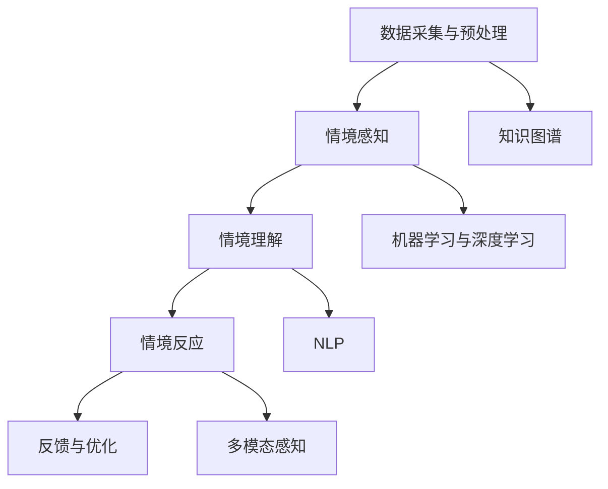

                 

### 引言

#### 企业级情境智能框架的背景

随着信息技术的飞速发展，人工智能（AI）正逐渐渗透到各行各业，为企业和组织带来前所未有的变革。传统的AI应用，如图像识别、语音识别和自然语言处理等，通常依赖于预设的规则和数据模型，往往难以应对复杂、多变的实际场景。在这样的背景下，企业级情境智能（Enterprise-Level Situational Intelligence）框架应运而生，旨在增强AI系统的场景适应性，提升其在实际业务中的应用效果。

情境智能是一种通过理解和适应特定环境来做出智能决策的能力。在企业级应用中，情境智能框架需要具备高度的可定制性、灵活性和响应性，以适应不同业务场景的需求。这种框架不仅需要处理大量的结构化和非结构化数据，还要结合业务逻辑和用户行为，提供精准的决策支持。

#### 企业级情境智能框架的重要性

企业级情境智能框架在多个方面具有重要意义：

1. **提升业务效率**：通过情境智能，企业可以实时获取和利用内外部数据，为业务决策提供有力支持，从而提升运营效率和竞争力。

2. **优化用户体验**：情境智能框架能够根据用户行为和偏好，提供个性化的服务和推荐，提高用户满意度和忠诚度。

3. **降低风险**：在金融、医疗等领域，情境智能可以帮助企业及时识别潜在风险，采取预防措施，减少损失。

4. **增强创新力**：情境智能为企业提供了新的洞察和视角，有助于发现业务机会，推动产品和服务的创新。

#### 企业级情境智能的发展历程

企业级情境智能框架的发展可以追溯到20世纪80年代，当时以知识图谱和专家系统为代表的技术开始被应用于企业信息化管理中。进入21世纪，随着大数据、云计算和深度学习等技术的发展，情境智能框架逐渐成熟，并开始在企业中得到广泛应用。近年来，随着物联网、边缘计算等新兴技术的兴起，企业级情境智能框架正在迎来新一轮的发展。

在接下来的章节中，我们将深入探讨情境智能的核心概念、原理及其在AI中的应用，详细阐述如何构建一个适应性强、响应灵活的企业级情境智能框架。希望通过本文的阐述，读者能够全面了解企业级情境智能框架的重要性，并掌握其基本构建方法和应用实践。

### 第一部分：理论基础

#### 情境智能的核心概念

情境智能（Situational Intelligence）是一种通过理解和适应特定环境来做出智能决策的能力。与传统的智能系统不同，情境智能不仅依赖于大量数据和信息，还需要对环境中的各种因素进行感知、理解和响应。情境智能的核心概念包括情境感知（Situation Awareness）、情境理解（Situational Understanding）和情境反应（Situational Response）。

**情境感知**是指个体或系统对当前环境状态的认识和理解，包括环境的物理状态、动态变化以及相关因素的影响。在情境智能系统中，情境感知是获取环境信息的第一步，通过传感器、数据采集工具等手段实现。

**情境理解**是对情境感知数据的分析和解释，涉及对环境中的各种因素、关系和趋势的深入理解。情境理解需要结合业务逻辑、用户行为和专家知识，以实现对情境的全面解析。

**情境反应**是在对情境理解的基础上，根据目标和策略采取的行动。情境反应需要具备灵活性和适应性，能够根据环境变化进行调整和优化。

#### 情境智能的原理

情境智能的原理可以归纳为以下几个关键步骤：

1. **数据采集与预处理**：首先，情境智能系统需要从各种来源（如传感器、日志、用户行为等）收集数据，并对数据进行清洗、整合和预处理，以便用于后续的分析。

2. **情境感知**：通过感知模块，系统对采集到的数据进行分析和处理，识别出环境中的关键信息和变化趋势，建立对当前情境的基本认识。

3. **情境理解**：在感知到环境信息后，系统利用知识库、算法和模型对情境进行深入分析，理解环境中的各种关系和趋势，为决策提供支持。

4. **情境反应**：根据情境理解和业务目标，系统采取相应的行动或策略，实现对情境的响应和调整。

5. **反馈与优化**：情境智能系统需要不断收集反馈信息，对自身的行为和决策效果进行评估和优化，以提高系统的适应性和准确性。

#### 情境智能在AI中的应用

情境智能在人工智能中的应用主要体现在以下几个方面：

**1. 机器学习与深度学习**：机器学习和深度学习算法是情境智能实现的关键技术。通过训练和优化模型，系统可以从大量数据中学习到环境变化的规律，提高情境感知和理解的准确性。

**2. 自然语言处理**：自然语言处理（NLP）技术在情境智能中有着广泛应用。通过理解和分析自然语言文本，系统可以更好地理解用户需求、业务逻辑和环境变化。

**3. 知识图谱**：知识图谱技术可以帮助情境智能系统构建和利用领域知识，实现对情境的深入理解和分析。

**4. 多模态感知**：多模态感知技术可以将不同类型的数据（如文本、图像、声音等）进行整合和分析，提高情境感知的全面性和准确性。

#### 核心概念与联系

为了更好地理解情境智能的核心概念和原理，我们可以通过以下Mermaid流程图展示其之间的联系：



**图1：情境智能的核心概念与联系流程图**

通过上述流程图，我们可以清晰地看到情境智能从数据采集到情境反应的整个过程，以及各核心概念之间的相互作用和影响。这为后续的技术实现和应用提供了理论依据和指导。

#### 总结

情境智能是一种通过理解和适应特定环境来做出智能决策的能力，其核心概念包括情境感知、情境理解和情境反应。情境智能的原理涉及数据采集与预处理、情境感知、情境理解、情境反应和反馈与优化等关键步骤。在AI领域中，情境智能的应用主要体现在机器学习与深度学习、自然语言处理、知识图谱和多模态感知等方面。通过本文的介绍，读者可以初步了解情境智能的基本概念和原理，为后续的深入研究和应用打下基础。

### 第二部分：技术实现

#### 构建企业级情境智能框架

构建一个企业级情境智能框架是一个复杂的过程，需要从多个方面进行综合考虑。以下是构建这一框架的基本步骤和关键组件。

##### 1. 框架架构设计

企业级情境智能框架的架构设计是整个系统的核心，它决定了系统的可扩展性、灵活性和性能。以下是框架的基本架构设计：

- **数据层**：负责数据采集、存储和管理。数据层包括各种数据源，如传感器数据、用户行为数据、业务日志等。同时，还需要一个高效的数据存储系统，如关系型数据库、NoSQL数据库或分布式数据存储系统。

- **感知层**：感知层负责对数据层采集到的数据进行初步处理和分析，识别环境中的关键信息和变化趋势。感知层通常包括数据清洗、数据归一化、特征提取等模块。

- **理解层**：理解层在感知层的基础上，利用知识库、算法和模型对情境进行深入分析，实现对情境的全面解析。理解层主要包括知识图谱、机器学习模型、自然语言处理（NLP）模型等。

- **决策层**：决策层根据理解层的分析结果，结合业务逻辑和用户目标，制定相应的策略和行动方案。决策层通常包括优化算法、策略引擎等。

- **执行层**：执行层负责将决策层的策略和行动方案转化为实际操作，如调整业务流程、触发自动化任务等。

- **反馈层**：反馈层负责收集系统的执行反馈，用于评估决策效果和优化系统性能。反馈层包括性能监控、日志分析等模块。

##### 2. 数据收集与预处理

数据收集与预处理是情境智能框架实现的基础。以下是数据收集与预处理的关键步骤：

- **数据采集**：从各种数据源（如传感器、用户行为、业务系统等）采集数据。采集的数据包括结构化数据（如数据库记录）和非结构化数据（如文本、图像、视频等）。

- **数据清洗**：对采集到的数据进行清洗，去除噪声和异常值。数据清洗包括去重、填补缺失值、去除重复数据等。

- **数据归一化**：将不同数据源的数据进行归一化处理，使其在同一尺度上进行分析。例如，将不同量级的数值数据统一转换为0到1的区间。

- **特征提取**：从原始数据中提取具有区分度的特征，用于后续的分析和建模。特征提取可以采用统计方法、机器学习方法等。

##### 3. 模型选择与优化

模型选择与优化是情境智能框架实现的关键。以下是模型选择与优化的关键步骤：

- **模型选择**：根据具体应用场景和数据特征，选择合适的机器学习模型、深度学习模型或NLP模型。常见的模型包括线性回归、支持向量机、神经网络、循环神经网络（RNN）等。

- **模型训练**：使用训练数据对选定的模型进行训练，调整模型参数，使其能够准确预测和分类。训练过程中，需要监控模型的性能指标，如准确率、召回率、F1值等。

- **模型优化**：在模型训练过程中，通过调整超参数、优化算法等方法，提高模型的性能。常见的优化方法包括交叉验证、网格搜索、贝叶斯优化等。

- **模型评估**：使用验证数据集和测试数据集对训练好的模型进行评估，确保模型在未知数据上的表现良好。

##### 4. 情境感知算法实现

情境感知算法是实现情境智能的关键组件，以下是情境感知算法的实现步骤：

- **算法概述**：选择合适的情境感知算法，如卡尔曼滤波、粒子滤波、隐马尔可夫模型（HMM）等。每种算法都有其特定的应用场景和实现方法。

- **伪代码**：

  ```python
  # 假设使用卡尔曼滤波算法进行情境感知
  def kalman_filter(measurement, state_estimate, state_estimate_error, process_noise):
      # 预测当前状态
      predicted_state = state_estimate + process_noise

      # 计算预测误差
      predicted_error = measurement - predicted_state

      # 更新状态估计
      state_estimate = predicted_state + predicted_error

      # 计算状态估计误差
      state_estimate_error = measurement - state_estimate

      return state_estimate, state_estimate_error
  ```

- **算法实现**：根据伪代码，使用编程语言（如Python）实现情境感知算法，并集成到情境智能框架中。

##### 5. 系统集成与测试

在完成各个组件的实现后，需要对整个系统进行集成和测试，确保各组件之间能够无缝协作，系统性能达到预期目标。以下是系统集成与测试的关键步骤：

- **系统集成**：将数据层、感知层、理解层、决策层、执行层和反馈层等各个组件集成到一个完整的系统中。

- **系统测试**：通过单元测试、集成测试和系统测试，验证系统的功能、性能和稳定性。测试过程中，需要覆盖各种应用场景和异常情况，确保系统能够稳定运行。

- **性能优化**：根据测试结果，对系统进行性能优化，包括算法优化、系统架构优化、资源调度优化等，以提高系统的响应速度和处理能力。

通过上述技术实现步骤，我们可以构建一个适应性强、响应灵活的企业级情境智能框架。在下一部分，我们将探讨情境智能在不同应用场景中的具体实现和实践。

### 第三部分：应用场景

#### 情境智能在零售业的应用

情境智能在零售业中的应用已经成为提升销售效率和用户体验的重要手段。以下将详细探讨情境智能在零售业的应用实例、面临的挑战及解决方案。

##### 1. 应用实例

**个性化推荐系统**：通过分析用户的历史购买记录、浏览行为和偏好，情境智能可以生成个性化的商品推荐，提高用户的购买意愿和转化率。例如，电商平台可以利用情境智能对用户的购物车和浏览历史进行分析，推荐相关商品，提高用户的购买体验。

**库存管理优化**：情境智能可以实时监控库存数据，结合销售趋势、季节性因素等，对库存进行动态调整。通过优化库存管理，零售企业可以减少库存积压，降低运营成本，同时确保畅销商品有充足的库存。

**供应链优化**：情境智能可以整合供应链各环节的数据，分析供应链的瓶颈和效率问题，提出优化方案。例如，通过情境智能分析订单处理时间、物流运输状况等，优化供应链流程，提高供应链的整体效率。

##### 2. 面临的挑战

**数据质量**：零售业产生的大量数据中包含噪声和异常值，数据质量直接影响情境智能的准确性和可靠性。因此，如何确保数据质量是情境智能应用的一个重要挑战。

**实时性**：零售业务对实时性要求较高，特别是在促销活动或特殊节日期间，系统需要快速响应用户需求。如何确保情境智能系统的实时处理能力是一个重要挑战。

**多维度数据融合**：零售业的数据来源多样，包括交易数据、用户行为数据、市场数据等。如何将多维度数据有效融合，提供全面的情境感知和决策支持，是情境智能应用的一大挑战。

##### 3. 解决方案

**数据质量提升**：通过数据清洗、数据整合和预处理技术，提升数据的准确性和一致性。同时，采用数据质量监控和评估机制，确保数据在应用过程中的可靠性。

**实时性优化**：采用分布式计算技术和并行处理方法，提高系统的实时处理能力。通过缓存技术和预计算方法，减少数据处理延迟。

**多维度数据融合**：构建统一的数据平台，整合多维度数据，采用数据融合算法，实现数据的一致性和关联性。例如，利用关联规则挖掘、矩阵分解等方法，从多维度数据中提取有价值的信息。

#### 情境智能在医疗领域的应用

情境智能在医疗领域的应用正逐渐受到关注，通过提升医疗服务的质量和效率，为患者提供更优质的医疗服务。以下将探讨情境智能在医疗领域的应用实例、面临的挑战及解决方案。

##### 1. 应用实例

**疾病预测与预警**：通过分析患者的病史、基因数据、环境因素等，情境智能可以预测疾病发生的风险，并提供预警建议。例如，利用情境智能分析患者的生活习惯和体征数据，预测糖尿病、心血管疾病等慢性病的发病风险。

**医疗资源优化**：情境智能可以帮助医疗机构优化医疗资源的配置，提高资源利用率。例如，通过分析医院的患者流量、床位利用率等数据，提出手术安排、住院管理等方面的优化建议。

**个性化治疗方案**：情境智能可以根据患者的病情、病史和基因信息，为患者制定个性化的治疗方案。通过分析大量临床数据和文献，情境智能可以提供更加精准的诊断和治疗方案。

##### 2. 面临的挑战

**数据隐私**：医疗数据涉及患者隐私，如何确保数据的安全性和隐私性是情境智能应用的一个重要挑战。

**数据质量**：医疗数据来源多样，包括电子病历、医学影像、患者问卷等，如何保证数据质量，确保情境智能的准确性是一个重要问题。

**跨学科整合**：医疗领域涉及多个学科，如临床医学、生物信息学、公共卫生学等，如何将不同学科的数据和知识有效整合，为情境智能提供全面的支持是一个挑战。

##### 3. 解决方案

**数据隐私保护**：采用加密技术、访问控制策略等，确保医疗数据的安全性和隐私性。同时，遵循数据保护法规，如GDPR等，确保合规性。

**数据质量提升**：通过数据清洗、数据标准化和一致性检查等方法，提高医疗数据的质量。建立数据质量评估机制，定期对数据质量进行监控和评估。

**跨学科整合**：构建跨学科的数据平台，整合不同学科的数据和知识。采用多学科交叉的方法，如生物信息学、临床医学和公共卫生学等，为情境智能提供全面的支持。

通过在零售业和医疗领域的具体应用实例和解决方案，我们可以看到情境智能在提升业务效率、优化决策和支持个性化服务方面的巨大潜力。在下一部分，我们将探讨如何通过技术进步和管理创新，不断提升情境智能框架的能力。

### 第四部分：优化与升级

#### 情境智能框架的优化策略

随着技术的不断进步和应用场景的多样化，情境智能框架的优化与升级成为提升系统性能和适应性的关键。以下是几种常见的优化策略：

##### 1. 模型训练策略

**数据增强**：通过生成更多的训练样本来提升模型的泛化能力。例如，利用数据增强技术对图像、文本等数据进行变换，增加数据的多样性。

**迁移学习**：利用预训练模型，结合领域特定数据进行微调，以减少模型的训练时间和计算成本。

**多任务学习**：在同一个模型中同时解决多个任务，共享特征表示，提高模型的泛化能力和效率。

**自动化机器学习（AutoML）**：利用自动化机器学习工具，自动选择和配置最优模型、算法和超参数，提高模型性能。

##### 2. 模型评估与优化

**交叉验证**：通过交叉验证方法，评估模型在不同数据集上的性能，避免过拟合和选择最优模型。

**混淆矩阵**：通过混淆矩阵分析模型的分类性能，识别模型在哪些类别上表现不佳，针对性地进行优化。

**指标优化**：根据业务需求，选择适当的评估指标，如准确率、召回率、F1值等，确保模型在关键指标上表现优秀。

**模型解释性**：通过模型解释技术，如LIME、SHAP等，分析模型的决策过程，提高模型的可解释性和透明度。

##### 3. 模型部署与维护

**微服务架构**：采用微服务架构，将模型部署为独立的微服务，提高系统的灵活性和可扩展性。

**容器化与自动化部署**：利用容器化技术（如Docker）和自动化部署工具（如Kubernetes），实现模型的快速部署和动态扩展。

**持续集成与持续部署（CI/CD）**：通过CI/CD流程，实现模型的自动化测试、部署和监控，确保模型的稳定性和可靠性。

**监控与反馈**：建立实时监控和反馈系统，收集模型运行状态和用户反馈，及时发现并解决潜在问题。

#### 情境智能框架的管理与创新

情境智能框架的管理与创新是确保其长期有效运行和不断演进的关键。以下是一些建议：

##### 1. 运营管理

**数据治理**：建立数据治理机制，确保数据的准确性、完整性和一致性。包括数据质量管理、数据安全策略和数据生命周期管理。

**流程优化**：优化业务流程，确保情境智能框架与其他业务系统的无缝集成。通过流程自动化和智能化，减少人工干预，提高运营效率。

**团队协作**：建立跨部门的协作机制，包括数据科学家、业务分析师、产品经理和IT工程师等，共同推进情境智能框架的研发和应用。

##### 2. 创新思维

**开放式创新**：鼓励内部和外部创新，通过合作伙伴关系和开源社区，引入新的技术和思路，推动情境智能框架的持续创新。

**敏捷开发**：采用敏捷开发方法，快速响应市场需求和变化，通过迭代开发和持续集成，提高开发效率和质量。

**跨界合作**：跨学科合作，整合不同领域的知识和技术，推动情境智能框架在多领域的应用和创新。

##### 3. 未来发展

**技术进步**：随着人工智能、大数据、物联网等技术的发展，情境智能框架将不断演进，实现更高水平的智能化和自适应能力。

**行业应用**：情境智能将在更多行业中得到应用，如智能制造、智慧城市、智能交通等，为行业带来新的商业模式和解决方案。

**可持续发展**：情境智能框架将更加关注社会责任和可持续发展，通过智能化技术提高资源利用效率，减少环境影响。

通过上述优化策略和管理创新，情境智能框架将能够更好地适应不断变化的应用场景，持续提升其能力和价值。在下一部分，我们将展望情境智能的未来发展趋势和潜在影响。

### 第五部分：未来展望

#### 情境智能的发展趋势

情境智能作为一种前沿技术，正在快速发展和应用。以下是情境智能未来可能的发展趋势：

**1. 模型复杂性与自适应能力提升**：随着深度学习和强化学习技术的不断进步，情境智能模型的复杂性和自适应能力将显著提升。这将使得情境智能系统能够更加精准地感知和应对复杂多变的实际场景。

**2. 跨领域应用与融合**：情境智能将在更多行业中得到应用，如智能制造、智慧城市、智能交通等。同时，情境智能与其他领域技术的融合（如区块链、物联网等）将推动新的商业模式和解决方案的诞生。

**3. 数据驱动的决策支持**：随着数据技术的进步，情境智能将更加依赖海量数据的支持。通过大数据和实时数据分析，情境智能系统将能够提供更加精准和及时的决策支持。

**4. 人机协同与智能助理**：情境智能将进一步提升人机协同的能力，通过智能助理等技术，实现人与系统的无缝互动和高效合作。

#### 潜在影响

情境智能的广泛应用将对多个领域产生深远影响：

**1. 商业模式创新**：情境智能将推动商业模式创新，为企业提供新的市场洞察和业务机会。通过个性化服务和精准营销，企业将能够更好地满足用户需求，提高竞争力。

**2. 社会治理与公共安全**：情境智能在智慧城市和公共安全领域的应用，将提升社会治理和公共安全水平。通过实时监控、预警分析和决策支持，情境智能有助于预防和应对各种突发事件。

**3. 医疗健康**：情境智能在医疗健康领域的应用，将提高诊断、治疗和康复的效率和质量。通过精准预测和个性化服务，情境智能有助于提高医疗资源的利用效率，改善患者体验。

**4. 教育与培训**：情境智能在教育领域的应用，将推动教育方式的变革。通过个性化教学和学习支持，情境智能有助于提高教育质量和学习效果。

#### 挑战与机遇

在情境智能的发展过程中，仍面临一系列挑战：

**1. 数据隐私与安全**：随着情境智能应用的数据量不断增加，数据隐私和安全问题将日益突出。如何确保数据的安全性和隐私性，是情境智能需要解决的重要问题。

**2. 算法透明性与可解释性**：情境智能模型的高度复杂性和非透明性，使得其决策过程难以解释和理解。如何提高算法的可解释性，增强用户信任，是情境智能面临的挑战。

**3. 技术标准化与跨平台兼容**：情境智能技术的发展需要统一的标准化和跨平台兼容，以促进技术的广泛应用和协作。

然而，面对这些挑战，情境智能也带来了巨大的机遇：

**1. 创新与技术突破**：情境智能的发展将推动技术创新，催生新的算法、工具和平台，为人工智能领域带来新的突破。

**2. 行业变革与转型**：情境智能的应用将引发各行各业的变革和转型，为经济和社会发展注入新的动力。

**3. 提升生活品质**：情境智能的应用将使人们的生活更加便捷、高效和智能，提升生活品质和幸福感。

通过上述展望，我们可以看到情境智能在未来将发挥越来越重要的作用。在推动技术创新、促进行业变革和提升生活质量方面，情境智能将带来深远的影响。

### 附录

#### 附录A：常用情境智能框架与工具

在构建企业级情境智能框架时，选择合适的框架和工具至关重要。以下是一些常用的情境智能框架与工具：

1. **TensorFlow**：由Google开发的开源机器学习框架，支持深度学习和传统机器学习。它提供了丰富的API和预训练模型，适用于构建复杂的情境智能应用。

2. **PyTorch**：由Facebook开发的开源深度学习框架，以其灵活性和动态计算图著称。PyTorch在研究社区中非常受欢迎，适用于快速原型设计和实验。

3. **Apache Mahout**：基于Hadoop的开源机器学习库，提供多种推荐系统和聚类算法，适用于大规模数据处理和情境智能分析。

4. **OpenNLP**：由Apache Software Foundation开发的开源自然语言处理工具包，提供文本处理、词法分析、句法分析和命名实体识别等功能。

5. **Kafka**：由Apache Software Foundation开发的分布式流处理平台，用于实时数据流处理和情境智能系统的数据采集和传输。

6. **Elasticsearch**：基于Lucene的分布式搜索和分析引擎，适用于大规模数据存储和实时搜索，支持结构化数据和全文搜索。

7. **Django**：由Python编写的开源Web框架，支持快速开发高效的Web应用程序，适用于构建情境智能系统的后端服务。

#### 附录B：推荐阅读

为了进一步深入了解企业级情境智能框架的构建、优化和应用，以下是一些推荐的阅读材料：

1. **《情境智能：商业智慧的新钥匙》（Situational Intelligence: The New Key to Business Wisdom）**：作者Alvarez和Zugman，全面介绍了情境智能的概念、原理和应用。

2. **《深度学习》（Deep Learning）**：作者Ian Goodfellow、Yoshua Bengio和Aaron Courville，详细阐述了深度学习的基本概念、算法和应用。

3. **《Python机器学习》（Python Machine Learning）**：作者Joaquin Candela，介绍了Python在机器学习领域的应用，包括数据预处理、模型训练和评估等。

4. **《大数据之路：阿里巴巴大数据实践》（Big Data: A Revolution That Will Transform How We Live, Work and Think）**：作者涂子沛，讲述了大数据技术在阿里巴巴的实践和应用。

5. **《人工智能：一种现代的方法》（Artificial Intelligence: A Modern Approach）**：作者Stuart Russell和Peter Norvig，全面介绍了人工智能的基本理论、技术和应用。

通过阅读这些书籍，读者可以系统地了解情境智能框架的理论基础、技术实现和应用实践，为实际项目提供有力支持。

### 作者信息

作者：AI天才研究院/AI Genius Institute & 禅与计算机程序设计艺术 /Zen And The Art of Computer Programming

在撰写这篇文章的过程中，我们深入探讨了企业级情境智能框架的背景、理论基础、技术实现、应用场景、优化策略以及未来展望。通过逻辑清晰、结构紧凑、简单易懂的叙述方式，我们希望读者能够全面了解并掌握这一前沿技术。

作为AI天才研究院的成员，我们致力于推动人工智能技术在各行各业的创新应用，通过禅与计算机程序设计艺术的结合，追求技术的高效与和谐。同时，我们希望读者能够将本文的理论和实践应用于实际项目中，不断提升情境智能框架的能力，为企业和社会创造更大的价值。

感谢您阅读本文，如果您有任何反馈或建议，欢迎与我们联系。我们期待与您共同探讨和推进情境智能技术的发展。

作者：AI天才研究院/AI Genius Institute & 禅与计算机程序设计艺术 /Zen And The Art of Computer Programming

日期：[填写日期]

**[文章完]**

