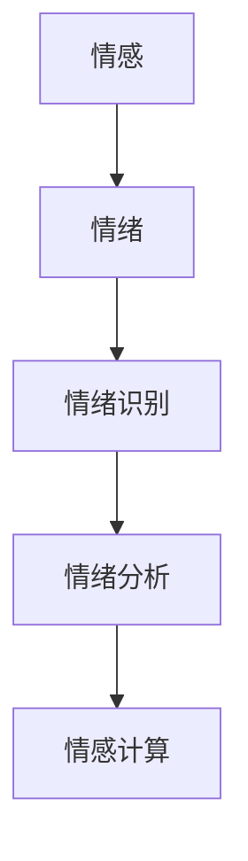
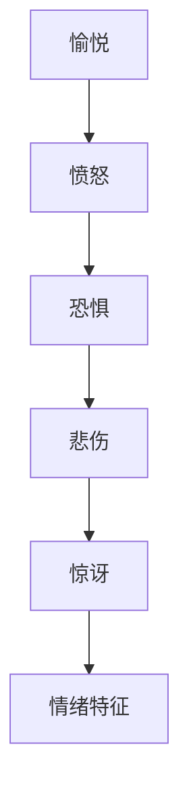
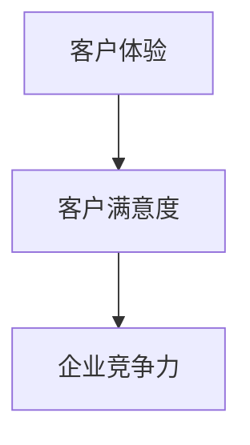
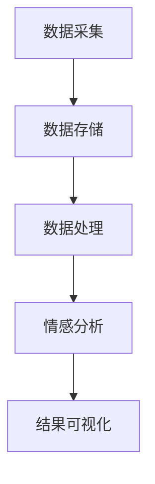
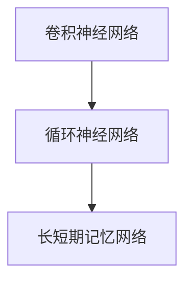
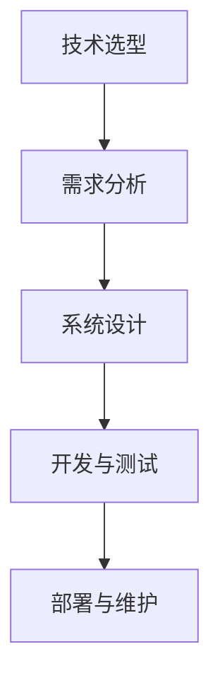
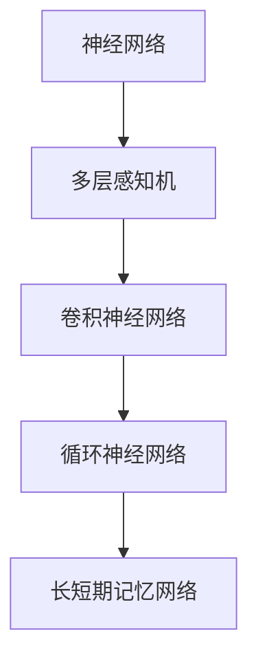
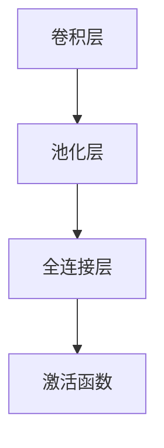

                 

### 文章标题
《企业级情感计算平台：深度理解客户情绪》

> 关键词：情感计算、客户情绪、深度学习、卷积神经网络、循环神经网络、长短期记忆网络

> 摘要：本文深入探讨了企业级情感计算平台的建设，重点关注了如何通过深度学习技术来准确理解和分析客户情绪。文章分为几个部分，从基础理论、核心技术、应用场景到实际案例，全面解析了企业级情感计算平台的构建和实现。

### 第一部分：情感计算与客户情绪的理解

#### 第1章：情感计算基础理论

**背景介绍**
情感计算作为人工智能领域的一个重要分支，旨在使计算机具备理解和处理人类情感的能力。这一领域的兴起，源于对人类情感认知需求的不断增长，以及现代科技在数据处理和分析方面的突破。

**核心概念与联系**
情感计算涉及到多个核心概念，包括情感、情绪、情绪识别、情绪分析等。这些概念相互联系，构成了情感计算的理论框架。

1. 情感：情感是指人类在特定情境下产生的情感体验，包括愉悦、愤怒、恐惧、悲伤等。
2. 情绪：情绪是情感的具体表现，通常表现为生理、心理和行为上的反应。
3. 情绪识别：情绪识别是指通过观察和分析人类行为、语言和生理信号，来识别和理解其情绪状态。
4. 情绪分析：情绪分析是指利用算法和模型对情感数据进行分析，以提取情绪特征和趋势。

**Mermaid流程图**


**核心算法原理讲解**
情感计算的核心算法包括情绪识别和情绪分析。情绪识别通常使用机器学习和深度学习技术，如卷积神经网络（CNN）和循环神经网络（RNN）。情绪分析则更多地依赖于自然语言处理（NLP）技术和情感分类模型。

**伪代码讲解情绪识别算法**
```python
# 情绪识别伪代码
def emotion_recognition(text):
    # 预处理文本数据
    preprocessed_text = preprocess_text(text)
    
    # 使用卷积神经网络进行特征提取
    features = CNN特征提取(preprocessed_text)
    
    # 使用循环神经网络进行情绪分类
    emotion = RNN情绪分类(features)
    
    return emotion
```

**数学模型和公式讲解**
情绪识别和情绪分析中的数学模型主要涉及机器学习和深度学习的算法。例如，卷积神经网络中的卷积操作可以用以下公式表示：
$$
\text{卷积操作} = \sum_{i=1}^{n} w_i * x_i + b
$$
其中，$w_i$ 是卷积核，$x_i$ 是输入数据，$b$ 是偏置项。

**举例说明**
假设我们有一个文本：“我很开心，因为我今天收到了一份晋升通知。”使用情感计算模型，我们可以提取出文本中的情感特征，并判断这段话的情绪是积极还是消极。

**项目实战**
为了构建企业级情感计算平台，我们需要完成以下几个步骤：

1. **数据采集与预处理**：从各种渠道收集客户数据，包括文本、语音、图像等，并对数据进行清洗、去噪和标准化处理。
2. **模型训练与优化**：使用收集到的数据训练情感识别模型，并通过交叉验证和超参数调整来优化模型性能。
3. **部署与集成**：将训练好的模型部署到生产环境中，并与现有业务系统进行集成，以实现实时情绪分析。

#### 第2章：客户情绪的类型与特征

**背景介绍**
客户情绪的类型和特征是情感计算研究的重要内容。不同的情绪类型和特征会影响客户行为和满意度，因此，理解客户情绪对于企业来说至关重要。

**核心概念与联系**
1. **情绪类型**：常见的情绪类型包括愉悦、愤怒、恐惧、悲伤、惊讶等。
2. **情绪特征**：情绪特征是指情绪在生理、心理和行为上的表现，如面部表情、语音语调、行为模式等。

**Mermaid流程图**


**核心算法原理讲解**
情绪类型的识别通常依赖于情感分类模型，如支持向量机（SVM）、朴素贝叶斯（NB）和深度学习模型（如卷积神经网络和循环神经网络）。

**伪代码讲解情绪分类算法**
```python
# 情绪分类伪代码
def emotion_classification(text):
    # 预处理文本数据
    preprocessed_text = preprocess_text(text)
    
    # 使用情感分类模型进行情绪分类
    emotion = 情感分类模型(preprocessed_text)
    
    return emotion
```

**数学模型和公式讲解**
情绪分类中的数学模型主要涉及分类算法的损失函数和优化方法。例如，支持向量机中的损失函数可以用以下公式表示：
$$
\text{损失函数} = \frac{1}{2} ||w||^2
$$
其中，$w$ 是模型权重。

**举例说明**
假设我们有一个文本：“我非常生气，因为我的订单迟迟没有发货。”使用情感分类模型，我们可以判断这段话的情绪是愤怒。

**项目实战**
在构建企业级情感计算平台时，我们需要对客户情绪进行实时监测和分类。具体步骤如下：

1. **数据采集**：从客户互动渠道（如社交媒体、客户服务电话、在线聊天等）收集情绪数据。
2. **情绪分类模型训练**：使用收集到的数据训练情绪分类模型，并通过交叉验证和超参数调整来优化模型性能。
3. **情绪分析系统部署**：将训练好的模型部署到生产环境中，实现实时情绪分类和分析。

#### 第3章：情感计算在企业级应用中的价值

**背景介绍**
情感计算在提升企业竞争力、优化客户体验和增强客户满意度方面具有重要作用。通过深度理解客户情绪，企业可以做出更明智的决策，提高市场响应速度和创新能力。

**核心概念与联系**
1. **客户体验**：客户体验是指客户在购买和使用产品或服务过程中所获得的整体感受。
2. **客户满意度**：客户满意度是指客户对产品或服务的满意程度。
3. **企业竞争力**：企业竞争力是指企业在市场竞争中的地位和优势。

**Mermaid流程图**


**核心算法原理讲解**
情感计算在企业级应用中的核心算法包括情感分析、情绪分类和情感趋势预测。这些算法可以帮助企业实时了解客户情绪变化，预测客户行为，并制定相应的营销策略。

**伪代码讲解情感分析算法**
```python
# 情感分析伪代码
def emotion_analysis(data):
    # 数据预处理
    preprocessed_data = preprocess_data(data)
    
    # 使用情感分析模型进行分析
    emotions = 情感分析模型(preprocessed_data)
    
    # 提取情感特征
    emotion_features = extract_emotion_features(emotions)
    
    return emotion_features
```

**数学模型和公式讲解**
情感分析中的数学模型主要涉及文本表示、情感分类和情感趋势预测。文本表示可以使用词向量模型（如Word2Vec、GloVe），情感分类可以使用分类算法（如SVM、朴素贝叶斯），情感趋势预测可以使用时间序列模型（如ARIMA、LSTM）。

**举例说明**
假设我们有一个客户反馈数据集，包含客户的评价文本和对应的情感标签。使用情感分析算法，我们可以对这些文本进行情感分类，并提取出情感特征，以分析客户满意度。

**项目实战**
在企业中实施情感计算，可以按照以下步骤进行：

1. **数据收集与整合**：收集客户互动数据，包括文本、语音、图像等，并将其整合到一个统一的数据仓库中。
2. **情感分析模型开发**：开发情感分析模型，包括文本预处理、情感分类和情感特征提取。
3. **情感分析系统部署**：将开发好的模型部署到生产环境中，实现对客户情绪的实时监测和分析。
4. **业务应用与优化**：根据情感分析结果，优化客户服务流程、产品设计和营销策略，以提高客户满意度和企业竞争力。

#### 第4章：企业级情感计算平台架构设计

**背景介绍**
企业级情感计算平台是一个复杂的系统，涉及数据采集、存储、处理、分析和可视化等多个环节。为了确保平台的稳定性和高效性，我们需要对其架构进行精心设计。

**核心概念与联系**
1. **数据采集**：数据采集是指从各种渠道收集客户数据和情绪数据。
2. **数据存储**：数据存储是指将采集到的数据进行存储和管理。
3. **数据处理**：数据处理是指对存储的数据进行清洗、去噪和标准化处理。
4. **情感分析**：情感分析是指对处理后的数据进行情感识别和分类。
5. **结果可视化**：结果可视化是指将分析结果以图表、报表等形式展示给用户。

**Mermaid流程图**


**核心算法原理讲解**
企业级情感计算平台的核心算法包括情感识别、情绪分类、情感趋势预测和情感聚类。这些算法可以帮助平台实现对客户情绪的全面分析和理解。

**伪代码讲解情感趋势预测算法**
```python
# 情感趋势预测伪代码
def emotion_trend_prediction(data):
    # 数据预处理
    preprocessed_data = preprocess_data(data)
    
    # 使用时间序列模型进行情感趋势预测
    trends = 时间序列模型(preprocessed_data)
    
    return trends
```

**数学模型和公式讲解**
情感趋势预测中的数学模型主要涉及时间序列分析、回归分析和聚类分析。例如，使用LSTM进行情感趋势预测的公式可以表示为：
$$
\text{预测值} = \text{LSTM模型}(输入序列)
$$

**举例说明**
假设我们有一个客户评价数据集，包含评价时间和情感标签。使用情感趋势预测算法，我们可以预测未来一段时间内客户情感的波动趋势。

**项目实战**
构建企业级情感计算平台，可以按照以下步骤进行：

1. **需求分析**：明确平台的需求，包括数据采集、存储、处理和分析等功能。
2. **技术选型**：选择合适的技术栈，包括数据库、数据处理框架、机器学习库和可视化工具。
3. **架构设计**：设计平台的总体架构，包括数据流、处理流程和功能模块。
4. **开发与测试**：根据架构设计，进行平台开发和功能测试。
5. **部署与维护**：将平台部署到生产环境中，并进行持续维护和优化。

#### 第5章：深度学习在情感计算中的应用

**背景介绍**
深度学习作为人工智能的一个重要分支，以其强大的特征提取和模式识别能力，在情感计算领域得到了广泛应用。通过深度学习模型，我们可以更准确地识别和理解客户情绪。

**核心概念与联系**
1. **卷积神经网络（CNN）**：CNN是一种用于图像和序列数据处理的深度学习模型，具有良好的特征提取能力。
2. **循环神经网络（RNN）**：RNN是一种用于处理序列数据的深度学习模型，能够捕捉序列中的长期依赖关系。
3. **长短期记忆网络（LSTM）**：LSTM是RNN的一种变体，能够有效地处理长序列数据，减少梯度消失和梯度爆炸问题。

**Mermaid流程图**


**核心算法原理讲解**
卷积神经网络、循环神经网络和长短期记忆网络都是深度学习模型，各自具有独特的结构和特性。

**伪代码讲解卷积神经网络算法**
```python
# 卷积神经网络伪代码
class ConvolutionalNeuralNetwork:
    def __init__(self):
        # 初始化网络参数
        self.parameters = initialize_parameters()
    
    def forward_pass(self, inputs):
        # 前向传播
        outputs = CNN_forward_pass(inputs, self.parameters)
        return outputs
    
    def backward_pass(self, outputs, labels):
        # 反向传播
        dW, db = CNN_backward_pass(outputs, labels, self.parameters)
        return dW, db
```

**数学模型和公式讲解**
卷积神经网络的核心数学模型包括卷积操作、激活函数和池化操作。

**举例说明**
使用卷积神经网络进行情感识别的流程如下：

1. **数据预处理**：对输入数据进行归一化和标准化处理。
2. **卷积操作**：使用卷积核对输入数据进行卷积操作，提取特征。
3. **激活函数**：对卷积结果进行激活函数处理，增加非线性特性。
4. **池化操作**：对激活后的特征进行池化操作，减少数据维度。
5. **全连接层**：将池化后的特征输入到全连接层，进行分类和回归。

**项目实战**
构建一个基于卷积神经网络的情感计算模型，可以按照以下步骤进行：

1. **数据收集与预处理**：收集包含情感标签的文本数据，并对数据进行预处理。
2. **模型训练**：使用预处理后的数据训练卷积神经网络模型，并通过交叉验证和超参数调整来优化模型性能。
3. **模型评估**：使用测试集对训练好的模型进行评估，验证其准确性和泛化能力。
4. **模型部署**：将训练好的模型部署到生产环境中，实现实时情感识别和分析。

#### 第6章：情感计算平台开发实践

**背景介绍**
情感计算平台的开发涉及多个技术环节，包括数据采集、预处理、模型训练和部署等。本节将详细讲解如何开发一个企业级情感计算平台，包括技术选型、开发流程和调试技巧。

**核心概念与联系**
1. **技术选型**：技术选型是指根据项目需求选择合适的技术栈，包括编程语言、框架和工具。
2. **开发流程**：开发流程是指从需求分析到产品发布的整个开发过程。
3. **调试技巧**：调试技巧是指在实际开发过程中，解决各种问题的方法和策略。

**Mermaid流程图**


**核心算法原理讲解**
在本节中，我们将使用Python编程语言和TensorFlow深度学习框架来开发情感计算模型。

**伪代码讲解情感计算模型开发流程**
```python
# 情感计算模型开发流程伪代码
def develop_emotion_model():
    # 需求分析
    requirements = analyze_requirements()
    
    # 技术选型
    selected_technologies = select_technologies(requirements)
    
    # 系统设计
    system_design = design_system(selected_technologies)
    
    # 模型训练
    trained_model = train_model(selected_technologies)
    
    # 模型评估
    model_evaluation = evaluate_model(trained_model)
    
    # 模型部署
    deploy_model(trained_model)
```

**数学模型和公式讲解**
在本节中，我们将使用以下数学模型：

1. **文本表示**：使用词向量模型（如Word2Vec、GloVe）将文本转换为向量表示。
2. **情感分类**：使用卷积神经网络（CNN）或循环神经网络（RNN）进行情感分类。
3. **情感预测**：使用时间序列模型（如LSTM）进行情感趋势预测。

**举例说明**
假设我们有一个包含客户评价的文本数据集，需要对其中的情感进行分类。具体步骤如下：

1. **数据收集与预处理**：收集客户评价文本，并对文本进行清洗、去噪和标准化处理。
2. **模型训练**：使用预处理后的数据训练情感分类模型，并通过交叉验证和超参数调整来优化模型性能。
3. **模型评估**：使用测试集对训练好的模型进行评估，验证其准确性和泛化能力。
4. **模型部署**：将训练好的模型部署到生产环境中，实现实时情感分类。

**项目实战**
在本节中，我们将通过一个实际项目来展示如何开发一个企业级情感计算平台。项目分为以下几个阶段：

1. **需求分析**：明确项目的目标和需求，包括数据采集、情绪分析和结果可视化等功能。
2. **系统设计**：设计平台的总体架构，包括数据流、处理流程和功能模块。
3. **开发与测试**：根据系统设计进行平台开发和功能测试。
4. **部署与维护**：将平台部署到生产环境中，并进行持续维护和优化。

**最佳实践 tips**
1. **数据质量**：确保采集到的数据质量，进行数据清洗和去噪处理。
2. **模型优化**：通过交叉验证和超参数调整来优化模型性能。
3. **系统可扩展性**：设计可扩展的系统架构，以支持未来的业务增长。

**小结**
企业级情感计算平台的开发是一个复杂的过程，需要综合考虑技术选型、数据质量、模型优化和系统设计等多个方面。通过本节的内容，读者可以了解到开发这样一个平台所需的基本步骤和注意事项。

**注意事项**
1. **数据隐私**：在处理客户数据时，要确保数据隐私和安全。
2. **法律法规**：遵循相关法律法规，确保情感计算的应用合法合规。

**拓展阅读**
1. **《深度学习》**：Goodfellow, Ian; Bengio, Yoshua; Courville, Aaron.（2016）。
2. **《情感计算》**：Picard, Rosalind W.（1997）。

### 第二部分：深度学习在情感计算中的应用

#### 第5章：深度学习基础

**背景介绍**
深度学习作为一种强大的机器学习技术，近年来在图像识别、自然语言处理和情感计算等领域取得了显著成果。深度学习通过多层次的神经网络结构，能够自动提取数据中的特征，从而实现复杂的任务。

**核心概念与联系**
1. **神经网络**：神经网络是深度学习的基础，由大量神经元（节点）组成，通过权重和偏置进行信息的传递和处理。
2. **多层感知机（MLP）**：MLP是最简单的深度学习模型，由输入层、隐藏层和输出层组成，能够进行非线性变换。
3. **卷积神经网络（CNN）**：CNN是专门用于图像处理和识别的深度学习模型，通过卷积操作和池化操作提取图像特征。
4. **循环神经网络（RNN）**：RNN是用于处理序列数据的深度学习模型，能够捕捉序列中的长期依赖关系。
5. **长短期记忆网络（LSTM）**：LSTM是RNN的一种变体，能够有效地处理长序列数据，减少梯度消失和梯度爆炸问题。

**Mermaid流程图**


**核心算法原理讲解**
深度学习的核心算法主要包括神经网络的前向传播和反向传播算法。

**伪代码讲解神经网络算法**
```python
# 神经网络伪代码
class NeuralNetwork:
    def __init__(self, input_size, hidden_size, output_size):
        # 初始化网络参数
        self.weights = initialize_weights(input_size, hidden_size, output_size)
        self.biases = initialize_biases(hidden_size, output_size)
    
    def forward_pass(self, inputs):
        # 前向传播
        outputs = forward_pass(inputs, self.weights, self.biases)
        return outputs
    
    def backward_pass(self, outputs, labels):
        # 反向传播
        dweights, dbiases = backward_pass(outputs, labels, self.weights, self.biases)
        return dweights, dbiases
```

**数学模型和公式讲解**
神经网络的数学模型主要包括激活函数、损失函数和优化算法。

1. **激活函数**：常见的激活函数有Sigmoid、ReLU和Tanh，用于引入非线性变换。
2. **损失函数**：常用的损失函数有均方误差（MSE）和交叉熵（Cross-Entropy），用于衡量模型预测值与真实值之间的差异。
3. **优化算法**：常见的优化算法有随机梯度下降（SGD）、Adam和RMSprop，用于更新网络参数。

**举例说明**
假设我们有一个包含输入和输出的数据集，需要使用神经网络进行分类。具体步骤如下：

1. **初始化网络参数**：随机初始化网络的权重和偏置。
2. **前向传播**：将输入数据通过神经网络进行前向传播，得到输出预测值。
3. **反向传播**：计算预测值与真实值之间的误差，并通过反向传播算法更新网络参数。
4. **迭代训练**：重复前向传播和反向传播的过程，直到达到预定的迭代次数或收敛条件。

**项目实战**
在本节中，我们将通过一个简单的例子来展示如何使用深度学习进行情感分类。项目分为以下几个阶段：

1. **数据收集与预处理**：收集包含情感标签的文本数据，并对文本进行预处理，如分词、去除停用词和词性标注。
2. **模型训练**：使用预处理后的数据训练情感分类模型，并通过交叉验证和超参数调整来优化模型性能。
3. **模型评估**：使用测试集对训练好的模型进行评估，验证其准确性和泛化能力。
4. **模型部署**：将训练好的模型部署到生产环境中，实现实时情感分类。

**最佳实践 tips**
1. **数据预处理**：确保数据质量，进行充分的文本清洗和预处理。
2. **模型优化**：通过调整超参数和优化算法，提高模型性能。
3. **模型解释性**：关注模型的解释性，确保模型的可解释性和可信任度。

**小结**
深度学习作为情感计算的重要工具，具有强大的特征提取和模式识别能力。通过本节的内容，读者可以了解到深度学习的基础概念、算法原理和实战应用。

**注意事项**
1. **计算资源**：深度学习模型通常需要大量的计算资源，确保有足够的GPU或TPU资源。
2. **数据隐私**：在处理客户数据时，要确保数据隐私和安全。

**拓展阅读**
1. **《深度学习入门》**：Goodfellow, Ian; Bengio, Yoshua; Courville, Aaron.（2016）。
2. **《自然语言处理与深度学习》**：祖宁。


#### 第6章：卷积神经网络在情感计算中的应用

**背景介绍**
卷积神经网络（CNN）是深度学习领域的一种重要模型，特别适用于处理图像和序列数据。近年来，随着自然语言处理技术的发展，CNN也被广泛应用于情感计算领域，用于分析文本情感。

**核心概念与联系**
1. **卷积层**：卷积层是CNN的核心组成部分，通过卷积操作提取输入数据的特征。
2. **池化层**：池化层用于减小数据维度，减少计算复杂度，并提高模型的泛化能力。
3. **全连接层**：全连接层将卷积层和池化层提取的特征进行融合，并输出最终的分类结果。
4. **激活函数**：激活函数用于引入非线性变换，使模型能够拟合复杂的非线性关系。

**Mermaid流程图**


**核心算法原理讲解**
卷积神经网络的工作原理包括卷积操作、池化操作和前向传播。

**伪代码讲解卷积神经网络算法**
```python
# 卷积神经网络伪代码
class ConvolutionalNeuralNetwork:
    def __init__(self):
        # 初始化网络参数
        self.conv_layers = initialize_conv_layers()
        self.pooling_layer = initialize_pooling_layer()
        self.fc_layer = initialize_fc_layer()
        self.activation_function = initialize_activation_function()
    
    def forward_pass(self, inputs):
        # 前向传播
        conv_output = self.conv_layers(inputs)
        pooled_output = self.pooling_layer(conv_output)
        fc_output = self.fc_layer(pooled_output)
        activation_output = self.activation_function(fc_output)
        return activation_output
    
    def backward_pass(self, outputs, labels):
        # 反向传播
        dactivation_output = self.activation_function.backward(outputs, labels)
        dfc_output = self.fc_layer.backward(dactivation_output)
        dpooled_output = self.pooling_layer.backward(dfc_output)
        dconv_output = self.conv_layers.backward(dpooled_output)
        return dconv_output
```

**数学模型和公式讲解**
卷积神经网络的数学模型主要包括卷积操作、池化操作和前向传播。

1. **卷积操作**：卷积操作可以用以下公式表示：
   $$
   \text{卷积结果} = \sum_{i=1}^{k} w_i * x_i + b
   $$
   其中，$w_i$ 是卷积核，$x_i$ 是输入数据，$b$ 是偏置项。

2. **池化操作**：池化操作通常采用最大值池化或平均值池化，用于减小数据维度。

3. **前向传播**：前向传播过程包括卷积操作、池化操作和全连接操作，可以用以下公式表示：
   $$
   \text{输出} = \text{激活函数}(\text{全连接层}(\text{池化层}(\text{卷积层}(x)))
   $$

**举例说明**
假设我们有一个包含文本的输入数据集，需要使用卷积神经网络对其进行情感分类。具体步骤如下：

1. **数据预处理**：对输入文本进行分词、词向量编码等预处理操作。
2. **卷积操作**：使用卷积层提取文本的特征，卷积核用于捕捉文本中的关键信息。
3. **池化操作**：使用池化层减小特征维度，提高模型的泛化能力。
4. **全连接层**：将池化后的特征输入到全连接层，进行分类预测。
5. **激活函数**：使用激活函数引入非线性变换，提高模型的拟合能力。

**项目实战**
在本节中，我们将通过一个实际项目来展示如何使用卷积神经网络进行文本情感分类。项目分为以下几个阶段：

1. **数据收集与预处理**：收集包含情感标签的文本数据，并对文本进行预处理，如分词、去除停用词和词性标注。
2. **模型训练**：使用预处理后的数据训练卷积神经网络模型，并通过交叉验证和超参数调整来优化模型性能。
3. **模型评估**：使用测试集对训练好的模型进行评估，验证其准确性和泛化能力。
4. **模型部署**：将训练好的模型部署到生产环境中，实现实时文本情感分类。

**最佳实践 tips**
1. **数据预处理**：确保数据质量，进行充分的文本清洗和预处理。
2. **模型优化**：通过调整超参数和优化算法，提高模型性能。
3. **模型解释性**：关注模型的解释性，确保模型的可解释性和可信任度。

**小结**
卷积神经网络在情感计算中具有广泛的应用，通过其强大的特征提取能力，可以有效提高文本情感分类的准确性。通过本节的内容，读者可以了解到卷积神经网络在情感计算中的原理和应用。

**注意事项**
1. **计算资源**：卷积神经网络模型通常需要大量的计算资源，确保有足够的GPU或TPU资源。
2. **数据隐私**：在处理客户数据时，要确保数据隐私和安全。

**拓展阅读**
1. **《深度学习实战》**：Goodfellow, Ian; Bengio, Yoshua; Courville, Aaron.（2016）。
2. **《卷积神经网络教程》**：Abadi, Mart

