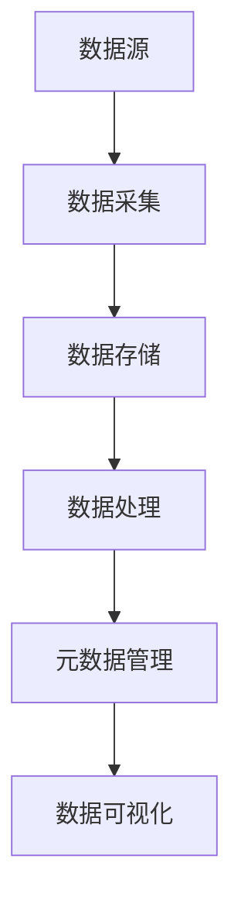
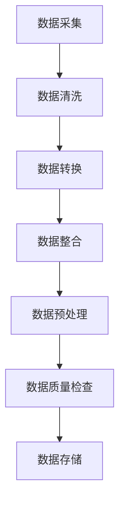
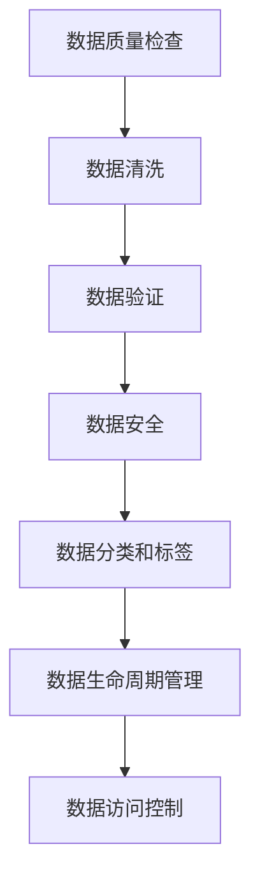
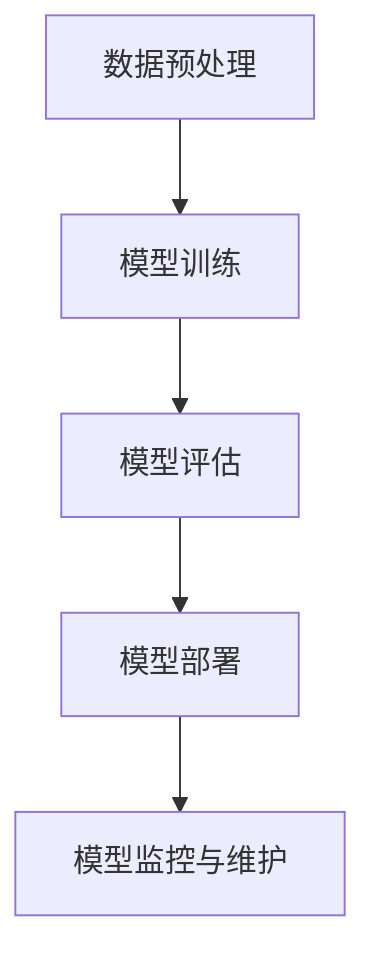

                 

### 文章标题

企业级数据湖智能化：构建AI驱动的数据平台

## 文章关键词

企业级数据湖、AI驱动、数据平台、智能化、数据存储、数据处理、数据质量、机器学习、深度学习、自然语言处理、数据可视化

## 文章摘要

本文旨在探讨企业级数据湖的智能化构建，重点分析如何利用AI技术提升数据湖的价值和应用。首先，我们介绍了数据湖的基本概念、重要性以及与传统数据仓库的区别。随后，我们阐述了AI驱动的数据平台的基本架构和原理，并探讨了数据湖与AI平台之间的联系。在接下来的章节中，我们详细介绍了数据湖的架构，包括数据采集、处理、存储、质量和治理等方面的内容。接着，我们深入解析了AI核心算法原理，如机器学习、深度学习和自然语言处理等。随后，我们探讨了数据湖智能化的实现方法，包括数据预处理、模型训练和部署、智能数据处理、实时分析和预测以及数据可视化等。最后，我们通过实战案例展示了如何在实际项目中应用AI驱动的数据平台，并讨论了数据湖智能化的挑战与解决方案，提出了企业数据湖智能化的策略与发展趋势。

## 引言

### 1.1 数据湖的概念与重要性

数据湖是一个大规模的数据存储系统，旨在提供灵活的数据存储解决方案，以应对现代企业日益增长的数据量和多样性。数据湖与传统数据仓库的区别在于其数据存储方式的灵活性。传统数据仓库通常用于存储结构化数据，且数据在存储前需要定义明确的模式和结构。而数据湖则能够存储不同类型的数据，包括结构化数据、半结构化数据（如JSON、XML等）和非结构化数据（如图像、视频、文本等）。这种灵活性使得数据湖能够更好地满足企业对于大数据应用的需求。

数据湖的重要性主要体现在以下几个方面：

1. **支持多样化的数据类型**：数据湖能够存储和管理多种类型的数据，使得企业在处理和分析数据时更加灵活，不再受限于数据类型和结构。

2. **提高数据利用率**：数据湖提供了丰富的数据资源，企业可以利用这些数据来发现新的商业机会，提升业务决策的准确性。

3. **降低数据存储成本**：由于数据湖采用了分布式存储架构，能够高效地存储和管理大规模数据，从而降低了数据存储的成本。

4. **支持实时数据处理**：数据湖通常与实时数据处理系统相结合，能够提供实时数据分析和预测，满足企业对于实时决策的需求。

5. **增强数据治理能力**：数据湖提供了完善的数据治理功能，包括数据质量检查、数据清洗、数据分类和权限管理等，确保数据的准确性和安全性。

### 1.2 AI驱动的数据平台

AI驱动的数据平台是一个集成了机器学习、深度学习和其他AI技术的数据基础设施。它旨在通过自动化和智能化的数据处理与分析，从大量数据中提取有价值的信息，提供实时、个性化的决策支持。AI在数据湖中的应用主要体现在以下几个方面：

1. **数据预处理**：AI技术可以帮助自动化数据清洗、转换和归一化等预处理任务，提高数据质量，减少人工干预。

2. **特征提取**：通过机器学习和深度学习算法，可以从原始数据中提取出高价值特征，提高模型预测的准确性和效率。

3. **实时分析**：利用AI技术，可以对数据进行实时分析，实现实时预测和预警，帮助企业快速响应市场变化。

4. **个性化推荐**：通过分析用户行为数据，AI技术可以提供个性化的推荐服务，提升用户体验和用户黏性。

5. **智能决策支持**：AI技术可以帮助企业从大量数据中提取关键信息，提供智能化的决策支持，提升业务效率。

数据湖与AI驱动的数据平台之间的结合，不仅能够提升数据的价值和应用，还能够推动企业的数字化转型，为企业创造更多的商业价值。

### 1.3 联系与影响

数据湖与AI驱动的数据平台之间存在着紧密的联系和相互影响。数据湖为AI驱动的数据平台提供了丰富的数据资源，使得AI算法可以从中提取有用的信息和模式。同时，AI驱动的数据平台通过自动化和智能化的数据处理与分析，提升了数据湖的数据价值和应用能力。具体来说：

1. **数据资源丰富**：数据湖提供了多样化的数据类型和海量数据存储空间，为AI算法提供了充足的数据资源。

2. **数据预处理高效**：AI驱动的数据平台可以通过自动化技术高效地处理和清洗数据，提高数据质量。

3. **实时决策支持**：AI驱动的数据平台能够实时分析数据，提供个性化的决策支持，增强企业的市场竞争力。

4. **数据价值提升**：数据湖与AI平台的结合，使得数据不再仅仅是存储和管理的对象，而是成为创造价值和推动业务发展的关键资产。

总之，数据湖智能化和AI驱动的数据平台构建是现代企业数字化转型的关键步骤，它们共同推动了数据价值的最大化，为企业的发展提供了强大的动力。

### 数据湖基础架构

数据湖的基础架构是构建高效、可扩展和可靠数据存储系统的基础。它由多个层级和组件构成，包括数据源、数据采集、数据存储、数据处理和元数据管理等多个方面。以下是对数据湖基础架构的详细描述：

#### 数据源

数据湖的数据源可以是多种多样的，包括内部业务系统、外部API、物联网设备、社交媒体等。这些数据源产生的数据类型各异，有结构化数据（如数据库记录）、半结构化数据（如JSON、XML）和非结构化数据（如图像、视频、文本）。数据源的多样性决定了数据湖的灵活性和包容性。

#### 数据采集

数据采集是数据湖架构中的关键环节，其目的是从各种数据源收集数据并将其导入数据湖中。数据采集技术包括：

1. **日志采集**：从服务器日志、应用程序日志等收集数据。
2. **API调用**：通过API接口从外部系统获取数据。
3. **文件导入**：从本地文件系统或远程文件服务器导入数据。
4. **流处理**：实时捕获和处理数据流，如Kafka、Flume等。
5. **数据转换**：在数据采集过程中进行数据清洗和格式转换。

数据采集需要处理数据格式的兼容性、数据完整性和数据一致性等问题。常见的工具和技术包括Apache Kafka、Apache NiFi、Apache Flume等。

#### 数据存储

数据存储是数据湖的核心功能之一。数据湖通常采用分布式存储架构，如Hadoop的HDFS、Apache Hive或Apache HBase，以实现海量数据的高效存储和管理。数据存储技术需要满足以下要求：

1. **可扩展性**：能够处理大规模数据增长，支持线性扩展。
2. **高可用性**：确保数据存储系统的可靠性和持久性。
3. **高性能**：支持快速数据读写操作，满足实时数据处理需求。
4. **容错性**：在系统故障时能够自动恢复数据。

数据湖中的数据通常分为两个层级：冷数据和热数据。冷数据是长时间不访问的数据，适合存储在低成本、高容量的存储介质中；热数据是经常访问的数据，需要存储在高速、可靠的存储介质中。

#### 数据处理

数据处理包括数据清洗、数据转换、数据整合和数据预处理等过程，其目的是提高数据质量和可分析性。数据处理技术包括：

1. **数据清洗**：去除重复数据、修复错误数据、填充缺失数据等。
2. **数据转换**：将数据格式转换为统一的格式，如JSON、CSV等。
3. **数据整合**：将来自不同数据源的数据进行合并，形成一个统一的数据视图。
4. **数据预处理**：为机器学习模型准备数据，包括特征提取、数据归一化等。

常见的数据处理工具包括Apache Spark、Apache Flink、Apache Hive等。

#### 元数据管理

元数据管理是数据湖架构中的另一个关键组成部分。元数据是指关于数据的数据，如数据的结构、数据源、数据定义、数据质量信息等。元数据管理包括：

1. **元数据存储**：存储和管理元数据，如使用关系数据库或NoSQL数据库。
2. **元数据索引**：创建元数据索引，以便快速检索和查询。
3. **元数据安全**：确保元数据的安全性和保密性，如访问控制、加密等。
4. **元数据同步**：保持元数据与实际数据的一致性。

常见的元数据管理工具包括Apache Atlas、Apache Metamodel、Apache Whirr等。

#### 数据湖架构示例

以下是一个简单的数据湖架构示例，使用Mermaid流程图表示：



在这个示例中，数据源通过数据采集组件将数据导入数据湖。数据存储组件负责存储和管理数据，数据处理组件进行数据清洗、转换和预处理，元数据管理组件负责存储和管理元数据，数据可视化组件用于将数据以图形化的形式展示给用户。

总之，数据湖基础架构的构建需要综合考虑数据源、数据采集、数据存储、数据处理和元数据管理等多个方面，以实现高效、可扩展和可靠的数据存储和管理。

### 数据采集与处理

数据采集和处理是数据湖架构中的关键环节，直接影响数据的质量和可用性。在这一节中，我们将深入探讨数据采集与处理的技术细节，包括数据采集方法、数据处理流程以及数据质量管理。

#### 数据采集方法

数据采集是数据湖构建的第一步，其目的是从各种数据源收集数据并将其导入数据湖中。以下是一些常见的数据采集方法：

1. **日志采集**：从服务器日志、应用程序日志等收集数据。常用的工具有Apache Kafka、Logstash等。
2. **API调用**：通过API接口从外部系统获取数据。例如，使用RESTful API或SOAP API进行数据采集。
3. **文件导入**：从本地文件系统或远程文件服务器导入数据，如CSV、JSON、XML等格式。
4. **流处理**：实时捕获和处理数据流，如使用Apache Kafka、Apache Flink等。
5. **物联网设备采集**：从物联网设备（如传感器、智能设备等）收集数据。

在数据采集过程中，需要处理数据格式的兼容性、数据完整性和数据一致性等问题。常见的数据采集工具和技术包括：

- **Apache Kafka**：一个分布式流处理平台，用于实时数据采集和传输。
- **Apache NiFi**：一个数据集成平台，用于自动化数据流管理和数据采集。
- **Apache Flume**：一个分布式、可靠且可扩展的日志收集系统。

#### 数据处理流程

数据处理是对采集到的原始数据进行清洗、转换、整合和预处理的流程。以下是数据处理的基本步骤：

1. **数据清洗**：去除重复数据、修复错误数据、填充缺失数据等。数据清洗可以显著提高数据质量。
2. **数据转换**：将数据格式转换为统一的格式，如将CSV转换为JSON或XML。
3. **数据整合**：将来自不同数据源的数据进行合并，形成一个统一的数据视图。
4. **数据预处理**：为机器学习模型准备数据，包括特征提取、数据归一化等。

数据处理过程中，常用的工具和技术包括：

- **Apache Spark**：一个分布式数据处理引擎，支持大规模数据处理和批处理。
- **Apache Flink**：一个流处理框架，支持实时数据处理和批处理。
- **Apache Hive**：一个数据仓库基础设施，用于大规模数据的查询和分析。

#### 数据质量管理

数据质量是数据湖成功的关键因素之一。良好的数据质量能够确保数据的有效性和准确性，从而支持高质量的决策。以下是数据质量管理的关键方面：

1. **数据质量检查**：对数据完整性、准确性、一致性和及时性进行检查。
2. **数据清洗**：去除重复数据、修复错误数据、填充缺失数据等。
3. **数据监控**：实时监控数据质量，发现和处理数据质量问题。
4. **数据治理**：建立数据治理策略和流程，确保数据的合规性和安全性。

常见的数据质量管理工具和技术包括：

- **Apache Atlas**：一个元数据管理系统，用于数据质量管理、数据分类和权限管理。
- **Apache Ranger**：一个统一的数据安全和管理平台，用于数据访问控制和审计。

#### Mermaid流程图

以下是数据采集与处理流程的Mermaid流程图：



在这个流程图中，数据采集环节通过各种方法获取数据，然后进行数据清洗、转换、整合和预处理。数据预处理后的数据将进行数据质量检查，确保数据的质量和准确性，最后将数据存储到数据湖中。

总之，数据采集与处理是构建高效、可靠的数据湖的关键步骤。通过采用合适的采集方法和处理技术，并注重数据质量管理，我们可以确保数据湖中的数据能够为企业带来真正的价值。

### 数据质量与治理

数据质量是数据湖成功的关键因素之一，直接关系到数据的价值和应用效果。因此，建立有效的数据治理策略对于确保数据质量、维护数据一致性以及保护数据安全至关重要。以下将详细探讨数据质量问题、数据治理策略和数据治理实践。

#### 数据质量问题

数据质量问题可以概括为以下几类：

1. **完整性**：数据是否完整，是否存在缺失值或空值。
2. **准确性**：数据是否真实、可靠，是否存在错误或偏差。
3. **一致性**：数据在不同时间点、不同系统之间是否一致。
4. **及时性**：数据是否能够及时更新和反映当前状态。
5. **可用性**：数据是否能够方便地被用户访问和使用。

数据质量问题可能导致以下问题：

- 不准确的数据会影响业务决策和战略规划。
- 数据缺失会导致分析结果不完整，影响业务洞察。
- 数据不一致会导致数据冲突，增加业务运营难度。
- 数据不及时会错过关键决策时机，影响业务反应速度。

#### 数据治理策略

数据治理策略是一套规范、流程和工具的组合，旨在确保数据质量、数据安全、数据一致性和数据可用性。以下是一些关键的数据治理策略：

1. **数据质量管理**：建立数据质量管理流程和标准，包括数据采集、处理、存储、使用等环节。
2. **数据安全策略**：确保数据在存储、传输和使用过程中的安全，包括数据加密、访问控制、安全审计等。
3. **数据分类和标签**：对数据进行分类和标签管理，便于数据检索和管理。
4. **数据生命周期管理**：定义数据生命周期，包括数据的创建、使用、存档和销毁等。
5. **数据访问控制**：确保只有授权用户可以访问和操作数据，防止数据泄露和滥用。
6. **数据标准化**：通过数据标准化确保数据格式的统一，便于数据整合和分析。

#### 数据治理实践

以下是数据治理实践的一些具体措施：

1. **数据质量管理**：
   - **数据质量检查**：定期对数据进行质量检查，包括完整性、准确性、一致性和及时性。
   - **数据清洗**：自动化或手动修复数据中的错误和缺失值，确保数据准确性。
   - **数据验证**：通过对比不同数据源的数据，确保数据的一致性。

2. **数据安全**：
   - **数据加密**：对敏感数据进行加密存储和传输，防止数据泄露。
   - **访问控制**：实施严格的访问控制策略，确保数据访问权限符合最小权限原则。
   - **安全审计**：定期进行安全审计，发现和纠正潜在的安全风险。

3. **数据分类和标签**：
   - **数据分类**：根据数据的重要性和敏感性对数据进行分类，便于管理和保护。
   - **数据标签**：为数据添加标签，便于数据检索和共享。

4. **数据生命周期管理**：
   - **数据存档**：将不常访问的数据进行存档，减少存储成本。
   - **数据销毁**：按照规定对不再需要的旧数据进行销毁，确保数据安全。

5. **数据访问控制**：
   - **用户身份验证**：确保只有授权用户可以访问系统。
   - **权限管理**：根据用户角色和职责分配适当的权限。

#### Mermaid流程图

以下是数据治理策略和实践的Mermaid流程图：



在这个流程图中，数据质量检查、数据清洗、数据验证、数据安全、数据分类和标签、数据生命周期管理以及数据访问控制构成了数据治理的完整流程。

总之，通过实施有效的数据治理策略和措施，企业可以确保数据湖中的数据质量，提升数据的应用价值，从而支持更加准确和高效的业务决策。

### 3.1 机器学习基础

机器学习是人工智能领域的一个重要分支，通过构建和训练模型，使计算机能够从数据中自动学习和发现规律，从而实现预测和决策。在这一节中，我们将深入探讨机器学习的基本概念、分类以及它们在实际应用中的重要性。

#### 3.1.1 基本概念

机器学习（Machine Learning，ML）是指通过算法和统计模型，从数据中自动发现模式和知识的过程。机器学习模型通过输入数据（特征集）和对应的标签（目标变量），通过训练算法来调整模型参数，使得模型能够在新数据上实现准确的预测。

主要概念包括：

- **特征（Features）**：用于描述数据样本的特征变量，如年龄、收入、温度等。
- **样本（Samples）**：包含一组特征的数据点，如一个人的信息记录。
- **模型（Model）**：通过训练算法得出的函数，用于预测新数据点的标签。
- **损失函数（Loss Function）**：评估模型预测值与实际值之间差异的指标，如均方误差（MSE）、交叉熵等。

#### 3.1.2 分类

机器学习可以分为以下几类：

1. **监督学习（Supervised Learning）**：
   - **分类（Classification）**：将数据分为不同的类别，如邮件分类、疾病诊断等。
   - **回归（Regression）**：预测一个连续的数值输出，如房屋价格预测、股票价格预测等。
   - **回归分析**：线性回归、多项式回归、岭回归等。
   - **支持向量机（SVM）**：通过找到最佳分隔超平面来实现分类或回归。

2. **无监督学习（Unsupervised Learning）**：
   - **聚类（Clustering）**：将数据分为若干个簇，如K-Means、DBSCAN等。
   - **降维（Dimensionality Reduction）**：减少数据维度，如PCA、t-SNE等。
   - **关联规则学习（Association Rule Learning）**：发现数据项之间的关联关系，如Apriori算法、FP-Growth等。

3. **强化学习（Reinforcement Learning）**：
   - 通过与环境交互来学习最佳行为策略，如强化学习算法、Q-Learning、深度Q网络（DQN）等。

#### 3.1.3 实际应用

机器学习在各个领域有着广泛的应用，以下是一些典型例子：

1. **金融**：信用评分、欺诈检测、投资组合优化等。
2. **医疗**：疾病诊断、医疗影像分析、个性化治疗等。
3. **零售**：客户行为分析、推荐系统、需求预测等。
4. **制造业**：质量检测、设备故障预测、生产优化等。
5. **交通**：交通流量预测、智能导航、自动驾驶等。
6. **自然语言处理**：文本分类、情感分析、机器翻译等。

#### 伪代码示例

以下是一个简单的线性回归模型的伪代码示例，用于预测房屋价格：

```python
# 线性回归模型伪代码

# 初始化模型参数
w = [0, 0]  # 权重向量
b = 0       # 偏置

# 损失函数：均方误差（MSE）
def loss_function(X, y, w, b):
    predictions = [w[0] * x[0] + w[1] * x[1] + b for x in X]
    return sum([(p - y)^2 for p, y in zip(predictions, y)]) / len(X)

# 梯度下降算法
def gradient_descent(X, y, w, b, learning_rate, epochs):
    for _ in range(epochs):
        predictions = [w[0] * x[0] + w[1] * x[1] + b for x in X]
        dw = [-2 * x[0] * (p - y) for x, p, y in zip(X, predictions, y)]
        db = [-2 * (p - y)]
        w[0] -= learning_rate * dw
        w[1] -= learning_rate * dw
        b -= learning_rate * db

# 训练模型
learning_rate = 0.01
epochs = 1000
gradient_descent(X_train, y_train, w, b, learning_rate, epochs)

# 预测房屋价格
def predict_price(features):
    return w[0] * features[0] + w[1] * features[1] + b
```

在这个示例中，我们使用梯度下降算法来优化线性回归模型的参数，以最小化损失函数（均方误差）。通过训练模型，我们可以使用训练好的参数来预测新的房屋价格。

### 监督学习、无监督学习和强化学习

#### 3.1.4 监督学习

监督学习是机器学习中最常用的方法之一，其特点是需要已知标签的数据进行训练。监督学习可以分为以下两种：

1. **分类**：将数据分为不同的类别。例如，判断邮件是否为垃圾邮件。
   - **决策树**：通过构建决策树模型，对数据进行分类。
   - **随机森林**：通过构建多个决策树模型，进行集成学习。
   - **支持向量机（SVM）**：通过找到最佳分隔超平面来实现分类。
   
2. **回归**：预测连续的数值输出。例如，预测房价。
   - **线性回归**：通过线性关系预测数值输出。
   - **岭回归**：通过正则化提高模型泛化能力。
   - **多项式回归**：通过多项式关系预测数值输出。

#### 3.1.5 无监督学习

无监督学习不需要已知标签的数据进行训练，其主要任务是发现数据中的隐含结构和规律。无监督学习可以分为以下两种：

1. **聚类**：将数据分为若干个簇。例如，将客户分为不同的群体。
   - **K-Means**：通过迭代算法将数据分为K个簇。
   - **层次聚类**：通过合并或分裂簇来形成聚类层次结构。
   - **DBSCAN**：通过密度连接性发现数据中的簇。

2. **降维**：减少数据维度，便于数据可视化和处理。例如，将高维数据降维到二维或三维。
   - **主成分分析（PCA）**：通过找到数据的主要成分进行降维。
   - **t-SNE**：通过非线性映射进行降维，适用于高维数据的可视化。

#### 3.1.6 强化学习

强化学习是一种通过与环境的交互来学习最佳行为策略的方法。其主要特点是需要环境反馈来指导学习过程。

1. **Q-Learning**：通过预测未来奖励来学习最佳动作策略。
   - **定义Q值**：预测在当前状态下采取某一动作后的长期奖励。
   - **更新Q值**：根据实际奖励和策略更新Q值。

2. **深度Q网络（DQN）**：通过深度神经网络来预测Q值。
   - **经验回放**：通过经验回放机制避免策略偏差。
   - **目标网络**：通过目标网络稳定Q值更新。

通过了解监督学习、无监督学习和强化学习的基本概念和应用，我们可以更好地利用机器学习技术解决实际问题，提升数据驱动的决策能力。

### 深度学习算法

深度学习是机器学习的一个重要分支，通过构建多层的神经网络，使计算机能够从大量数据中自动学习和发现复杂的模式。深度学习算法在图像识别、自然语言处理、语音识别等领域取得了显著的突破，并逐渐成为人工智能领域的研究热点。以下将详细介绍神经网络架构、卷积神经网络（CNN）和循环神经网络（RNN）以及长短期记忆（LSTM）模型。

#### 神经网络架构

神经网络（Neural Network，NN）是一种模拟生物神经系统的计算模型，由大量简单的人工神经元（或节点）组成。每个神经元接收多个输入信号，通过激活函数产生一个输出信号。

1. **基本组件**：

   - **输入层（Input Layer）**：接收外部输入数据，如图像像素、文本词向量等。
   - **隐藏层（Hidden Layer）**：对输入数据进行处理和变换，通常包含多个隐藏层。
   - **输出层（Output Layer）**：产生最终输出，如分类结果、预测值等。

2. **激活函数**：

   激活函数是神经网络中的一个关键组件，用于引入非线性变换，使得神经网络能够学习复杂的函数关系。常见的激活函数包括：

   - **Sigmoid函数**：\[ \sigma(x) = \frac{1}{1 + e^{-x}} \]，输出范围为（0，1）。
   - **ReLU函数**：\[ \text{ReLU}(x) = \max(0, x) \]，对于负值输出为0，正值输出保持不变。
   - **Tanh函数**：\[ \text{Tanh}(x) = \frac{e^x - e^{-x}}{e^x + e^{-x}} \]，输出范围为（-1，1）。

3. **前向传播与反向传播**：

   - **前向传播**：将输入数据传递到网络中，通过多层神经元计算，得到输出结果。
   - **反向传播**：计算输出结果与实际结果之间的误差，并反向传播到网络中的每个神经元，更新网络权重和偏置，以优化模型。

#### 卷积神经网络（CNN）

卷积神经网络（Convolutional Neural Network，CNN）是一种专门用于处理图像数据的深度学习模型。CNN通过卷积层、池化层和全连接层等组件，实现了对图像的自动特征提取和分类。

1. **卷积层（Convolutional Layer）**：

   - **卷积操作**：通过卷积核（滤波器）对输入图像进行局部卷积操作，提取图像的特征。
   - **特征图（Feature Map）**：卷积操作后产生的特征图包含图像的局部特征信息。

2. **池化层（Pooling Layer）**：

   - **最大池化（Max Pooling）**：对特征图进行下采样，保留最大值，降低模型复杂度。
   - **平均池化（Average Pooling）**：对特征图进行下采样，计算平均值。

3. **全连接层（Fully Connected Layer）**：

   - **分类器**：将卷积层和池化层输出的特征图展平为一维向量，输入全连接层进行分类。

#### 循环神经网络（RNN）

循环神经网络（Recurrent Neural Network，RNN）是一种能够处理序列数据的神经网络。RNN通过在时间步上递归地更新状态，实现序列数据的建模。

1. **基本结构**：

   - **隐藏状态（Hidden State）**：每个时间步的隐藏状态包含当前输入信息和前一个时间步的隐藏状态。
   - **输入门（Input Gate）**：控制当前输入信息对隐藏状态的贡献。
   - **遗忘门（Forget Gate）**：控制当前隐藏状态中需要遗忘的信息。

2. **长短时记忆（LSTM）**：

   - **细胞状态（Cell State）**：LSTM的核心组件，用于保存长期依赖信息。
   - **输入门、遗忘门和输出门**：控制细胞状态和隐藏状态之间的信息流动。
   - **门控机制**：通过sigmoid函数和线性变换实现，确保信息流动的灵活性和鲁棒性。

#### 长短期记忆（LSTM）

长短期记忆（Long Short-Term Memory，LSTM）是RNN的一种改进模型，旨在解决传统RNN在处理长序列数据时遇到的长期依赖问题。

1. **基本原理**：

   - **单元结构**：LSTM通过一个称为“单元”的结构，在时间步上递归地更新状态，实现长期依赖的建模。
   - **遗忘门、输入门和输出门**：LSTM通过这三个门控机制，灵活地控制信息的流动和存储，从而避免梯度消失和梯度爆炸问题。

2. **数学模型**：

   - **遗忘门**：\[ f_t = \sigma(W_f \cdot [h_{t-1}, x_t] + b_f) \]
   - **输入门**：\[ i_t = \sigma(W_i \cdot [h_{t-1}, x_t] + b_i) \]
   - **新细胞状态**：\[ \bar{c}_t = \text{tanh}(W_c \cdot [h_{t-1}, x_t] + b_c) \]
   - **细胞状态**：\[ c_t = f_t \odot c_{t-1} + i_t \odot \bar{c}_t \]
   - **输出门**：\[ o_t = \sigma(W_o \cdot [h_{t-1}, x_t] + b_o) \]
   - **隐藏状态**：\[ h_t = o_t \odot \text{tanh}(c_t) \]

通过了解神经网络架构、卷积神经网络（CNN）和循环神经网络（RNN）以及长短期记忆（LSTM）模型，我们可以更好地理解和应用深度学习算法，解决实际问题，提升模型的性能和效果。

### 自然语言处理（NLP）

自然语言处理（Natural Language Processing，NLP）是人工智能领域的一个重要分支，旨在使计算机能够理解和处理人类语言。NLP在机器翻译、情感分析、文本分类、问答系统等领域取得了显著进展。以下将详细介绍NLP中的关键算法和模型，包括语言模型、词嵌入、序列标注与文本分类。

#### 语言模型

语言模型（Language Model，LM）是NLP的基础组件，用于预测一段文本的下一个单词或字符。语言模型的目的是通过学习大量文本数据，生成流畅、自然的语言。

1. **n-gram模型**：

   - **基本概念**：n-gram模型通过统计n个连续单词（或字符）的出现频率来预测下一个单词。
   - **局限性**：n-gram模型无法捕捉单词之间的长期依赖关系，可能导致预测不准确。

2. **神经网络语言模型**：

   - **基本概念**：神经网络语言模型（如基于RNN或Transformer的模型）通过构建多层神经网络来学习文本数据中的复杂依赖关系。
   - **优势**：神经网络语言模型能够捕捉长距离依赖关系，生成更自然的语言。

3. **Transformer模型**：

   - **基本概念**：Transformer模型是一种基于自注意力机制的神经网络语言模型，通过全局注意力机制有效捕捉文本中的依赖关系。
   - **优势**：Transformer模型在许多NLP任务中取得了state-of-the-art的性能。

#### 词嵌入

词嵌入（Word Embedding）是将文本中的单词转换为密集向量表示的技术，使计算机能够理解和处理单词的语义信息。词嵌入有助于提高NLP任务的性能，如文本分类、语义相似性计算等。

1. **词袋模型**：

   - **基本概念**：词袋模型将文本表示为一组单词的出现频率向量。
   - **局限性**：词袋模型无法捕捉单词的语义信息，导致语义相似的单词表示相似。

2. **分布式表示**：

   - **基本概念**：分布式表示将每个单词映射到一个低维稠密向量，这些向量能够捕捉单词的语义信息。
   - **方法**：
     - **基于频率**：如TF-IDF，通过词频和文档频率计算词的权重。
     - **基于神经网络**：如Word2Vec、GloVe等，通过神经网络模型学习词的向量表示。

3. **预训练语言模型**：

   - **基本概念**：预训练语言模型（如BERT、GPT等）通过在大规模文本数据上进行预训练，学习词的深层语义表示。
   - **优势**：预训练语言模型能够生成更准确的词嵌入，提高NLP任务的效果。

#### 序列标注与文本分类

序列标注（Sequence Labeling）是NLP中的一个重要任务，旨在为序列数据（如句子、文本）中的每个单词或字符分配一个标签（如词性标注、命名实体识别等）。文本分类（Text Classification）是另一个重要的NLP任务，旨在将文本数据分类到预定义的类别中。

1. **序列标注**：

   - **基本概念**：序列标注任务通过构建序列标注模型（如CRF、RNN等），为序列中的每个元素分配一个标签。
   - **方法**：
     - **基于规则的方法**：通过手工定义规则进行序列标注。
     - **基于统计的方法**：通过统计模型（如HMM、CRF等）进行序列标注。
     - **基于神经网络的方法**：通过神经网络模型（如RNN、LSTM、BERT等）进行序列标注。

2. **文本分类**：

   - **基本概念**：文本分类任务通过构建分类模型（如SVM、朴素贝叶斯、神经网络等），将文本数据分类到预定义的类别中。
   - **方法**：
     - **基于特征的方法**：通过提取文本特征（如词袋、TF-IDF等），使用分类器进行文本分类。
     - **基于神经网络的方法**：通过神经网络模型（如CNN、RNN、BERT等）进行文本分类。

自然语言处理中的语言模型、词嵌入、序列标注与文本分类等技术，共同推动了NLP任务的发展和进步，使计算机能够更好地理解和处理人类语言。

### 数据湖中的机器学习

数据湖中的机器学习（Machine Learning in Data Lake）是一个复杂而重要的领域，涉及从数据湖中提取有用信息、构建机器学习模型以及部署和优化这些模型。以下将详细探讨数据湖中的机器学习过程，包括数据预处理、模型训练和部署。

#### 数据预处理

数据预处理是机器学习流程中的关键步骤，旨在提高数据质量和模型性能。在数据湖环境中，数据预处理的过程尤为复杂，因为数据湖存储的数据类型多样、结构各异。以下是数据预处理的主要任务：

1. **数据清洗**：

   - **去除重复数据**：数据湖中的数据可能存在重复，这会严重影响模型性能。需要通过去重算法来识别和删除重复数据。
   - **修复错误数据**：数据湖中的数据可能包含错误或不完整的信息，需要通过校验和修复算法来处理这些数据。
   - **填充缺失数据**：对于缺失的数据，可以使用多种方法进行填充，如平均值填充、中值填充、回归填充等。

2. **数据转换**：

   - **格式转换**：将不同数据源的数据格式转换为统一的格式，如将CSV转换为JSON或Parquet。
   - **特征工程**：根据业务需求，从原始数据中提取有用的特征。例如，对日期数据进行分割，提取年、月、日等特征。
   - **归一化和标准化**：为了防止某些特征对模型影响过大，可以对数据进行归一化或标准化处理。

3. **数据质量检查**：

   - **完整性检查**：确保数据集的完整性，检查是否存在缺失值或空值。
   - **一致性检查**：确保数据在不同数据源之间的一致性，如对重复数据的不同记录进行统一。
   - **及时性检查**：确保数据的时效性，对于需要实时分析的场景，需要定期更新数据。

#### 模型训练

模型训练是数据湖中机器学习的核心环节，通过从数据湖中提取预处理后的数据，构建和训练机器学习模型。以下是模型训练的主要步骤：

1. **数据分割**：

   - **训练集**：用于训练模型的数据子集，通常占数据集的60%到80%。
   - **验证集**：用于验证模型性能的数据子集，通常占数据集的10%到20%。
   - **测试集**：用于最终评估模型性能的数据子集，通常占数据集的10%以下。

2. **特征选择**：

   - **相关性分析**：通过分析特征与目标变量之间的相关性，选择对模型性能有显著影响的特征。
   - **特征重要性分析**：使用模型评估算法（如随机森林）分析特征的重要性，选择关键特征。

3. **模型选择**：

   - **算法选择**：根据业务需求和数据特性，选择适合的机器学习算法，如线性回归、决策树、支持向量机、神经网络等。
   - **模型调参**：通过调整模型参数，优化模型性能。例如，调整正则化参数、学习率等。

4. **模型训练**：

   - **模型构建**：使用预处理后的数据和选择好的算法构建模型。
   - **训练过程**：通过迭代训练算法，调整模型参数，使模型能够拟合训练数据。

5. **模型评估**：

   - **交叉验证**：使用交叉验证方法（如K折交叉验证）评估模型性能，确保模型具有良好的泛化能力。
   - **性能指标**：计算模型的性能指标，如准确率、召回率、F1值等，以评估模型的分类效果。

#### 模型部署

模型部署是将训练好的模型应用到实际业务场景中的过程。以下是模型部署的主要步骤：

1. **模型保存**：

   - **模型序列化**：将训练好的模型序列化为文件，以便后续部署和使用。
   - **版本管理**：对模型版本进行管理，确保能够回溯和复用历史模型。

2. **模型服务化**：

   - **模型接口**：构建模型API接口，提供模型调用服务。
   - **容器化**：使用容器技术（如Docker）将模型和服务打包，便于部署和扩展。

3. **模型监控与维护**：

   - **性能监控**：实时监控模型的性能指标，如预测准确率、响应时间等。
   - **异常检测**：通过监控异常指标，及时发现模型异常，并进行故障排除。
   - **更新与优化**：定期更新模型，优化模型性能，以适应业务需求的变化。

#### Mermaid流程图

以下是数据湖中的机器学习过程的Mermaid流程图：



在这个流程图中，数据预处理、模型训练、模型评估、模型部署和模型监控与维护构成了数据湖中的机器学习过程。

总之，数据湖中的机器学习是一个系统性工程，通过数据预处理、模型训练、部署和监控等环节，可以实现高效的机器学习应用。数据湖为机器学习提供了丰富的数据资源，而机器学习则为数据湖中的数据带来了更高的价值。

### 智能数据处理

智能数据处理是数据湖智能化的重要组成部分，它利用AI技术对数据进行高效的处理和分析，从而实现实时数据流处理、实时分析与预测以及智能数据可视化等功能。以下将详细探讨这些核心功能，并说明其在实际业务中的应用。

#### 实时数据流处理

实时数据流处理是指对数据流进行实时捕获、处理和分析，以满足企业对实时决策和响应的需求。数据湖通过流处理技术，如Apache Kafka、Apache Flink等，实现对大规模实时数据的处理。

1. **实时数据捕获**：

   - **数据源接入**：从各种数据源（如物联网设备、社交媒体、应用程序日志等）捕获实时数据。
   - **数据传输**：使用流处理框架将捕获的数据传输到数据湖中。

2. **实时数据处理**：

   - **数据清洗**：实时清洗和转换数据，确保数据的质量和一致性。
   - **数据整合**：实时整合来自不同数据源的数据，形成统一的数据视图。

3. **实时分析**：

   - **实时查询**：通过流处理框架，对实时数据执行复杂的查询和分析操作。
   - **实时预测**：利用机器学习模型，对实时数据进行分析和预测，如股票价格预测、销售预测等。

在实际业务中，实时数据流处理广泛应用于金融交易监控、智能交通管理、实时物流跟踪等领域。通过实时数据流处理，企业能够快速响应市场变化，优化业务流程，提升运营效率。

#### 实时分析与预测

实时分析与预测是指利用AI技术对实时数据进行分析和预测，以支持企业的实时决策和业务优化。数据湖中的实时分析工具，如Apache Spark、Apache Flink等，提供了强大的实时数据分析能力。

1. **实时数据分析**：

   - **数据探查**：通过可视化工具和数据分析平台，实时探查数据的特征和趋势。
   - **统计分析**：对实时数据进行统计分析，如计算平均值、中位数、标准差等。

2. **实时预测**：

   - **模型训练**：利用流处理框架，实时训练和更新机器学习模型。
   - **预测结果**：根据实时数据预测结果，提供个性化的推荐、预警和决策支持。

在实际业务中，实时分析与预测广泛应用于零售业（如库存管理、销售预测）、金融行业（如风险管理、市场预测）、医疗健康（如疾病预测、患者监控）等领域。通过实时分析与预测，企业能够更准确地预测未来趋势，优化业务策略，提高客户满意度。

#### 智能数据可视化

智能数据可视化是将复杂的数据分析和预测结果以直观、易于理解的形式展示给用户，从而帮助用户更好地理解和利用数据。数据湖中的智能数据可视化工具，如Tableau、Power BI等，提供了丰富的数据可视化功能。

1. **数据仪表板**：

   - **实时监控**：通过数据仪表板，实时监控关键业务指标和预测结果。
   - **交互式探索**：提供交互式探索功能，用户可以自由地查询和分析数据。

2. **可视化技术**：

   - **图表和图表组合**：使用各种图表（如柱状图、折线图、饼图等）展示数据。
   - **动态可视化**：通过动态可视化技术，实时更新数据和预测结果。

3. **用户自定义**：

   - **自定义视图**：用户可以根据需求自定义数据视图和仪表板布局。
   - **共享与协作**：支持数据共享和协作，方便团队共同分析和决策。

在实际业务中，智能数据可视化广泛应用于企业资源规划（ERP）、客户关系管理（CRM）、供应链管理等领域。通过智能数据可视化，企业能够更加直观地了解业务状况，发现潜在问题，优化决策过程。

#### 综合应用案例

以下是一个综合应用案例，说明智能数据处理在电商领域的应用：

- **实时数据流处理**：电商平台通过实时数据流处理技术，实时捕获用户行为数据（如点击、购买、评价等），并实时清洗和整合数据。
- **实时分析与预测**：利用实时数据分析技术，电商平台对用户行为数据进行实时分析，预测用户喜好和购买意图，提供个性化推荐。
- **智能数据可视化**：通过智能数据可视化技术，电商平台实时展示关键业务指标（如销售额、客户满意度等），帮助管理层快速了解业务状况。

总之，智能数据处理通过实时数据流处理、实时分析与预测以及智能数据可视化等功能，为企业和用户提供了强大的数据驱动能力和决策支持。在实际应用中，智能数据处理不仅提高了业务效率和客户满意度，还为企业的数字化转型提供了重要支持。

### 智能数据可视化

智能数据可视化是数据湖智能化的重要组成部分，通过将复杂的数据和分析结果以直观、易理解的形式展示，帮助用户更好地理解和利用数据。以下将详细介绍智能数据可视化的关键技术、数据仪表板的设计原则以及实际应用案例。

#### 关键技术

1. **数据可视化工具**：

   - **Tableau**：一款功能强大的数据可视化工具，支持多种数据源和丰富的可视化图表。
   - **Power BI**：由Microsoft开发的商业智能工具，提供直观的数据分析和可视化功能。
   - **QlikView**：一款自我服务的数据可视化工具，支持实时数据分析和探索。
   - **D3.js**：一个基于JavaScript的库，用于创建自定义交互式数据可视化。

2. **可视化图表**：

   - **柱状图、折线图和饼图**：用于展示数据的分布和趋势。
   - **散点图和热力图**：用于展示数据之间的关系和密度。
   - **地图和地理可视化**：用于展示地理位置数据。
   - **仪表板**：用于整合多种图表和指标，提供全面的业务视图。

3. **交互式探索**：

   - **筛选和过滤**：允许用户通过交互操作筛选和过滤数据。
   - **交互式链接**：在不同图表和维度之间建立交互关系。
   - **动态可视化**：根据用户操作动态更新数据和图表。

#### 数据仪表板设计原则

1. **用户中心**：

   - **明确用户需求**：设计仪表板时，应充分考虑用户的需求和习惯。
   - **简洁明了**：避免过多的冗余信息和复杂的布局，确保用户能够快速获取关键信息。

2. **直观易用**：

   - **清晰的视觉布局**：使用适当的颜色、图标和字体，使仪表板视觉清晰。
   - **合理的图表选择**：根据数据类型和业务需求选择合适的图表类型。
   - **交互性**：提供交互式功能，如筛选、排序和钻取，提高用户体验。

3. **数据质量**：

   - **准确的数据源**：确保数据来源可靠，数据质量高。
   - **及时的数据更新**：定期更新数据，确保数据的时效性。

4. **可扩展性**：

   - **模块化设计**：设计灵活的模块化仪表板，便于后续扩展和更新。
   - **适应性**：支持多种设备和屏幕尺寸，确保仪表板在不同设备上的显示效果。

#### 实际应用案例

以下是一个智能数据可视化的实际应用案例，以电商平台的用户行为分析为例：

- **背景**：电商平台希望通过智能数据可视化，了解用户的行为习惯和购买偏好，从而优化营销策略和提升用户体验。

- **数据仪表板设计**：

  - **用户访问量**：使用柱状图展示每日、每周和每月的访问量，显示访问趋势。
  - **热门产品**：使用饼图展示各类产品的销售占比，帮助了解热门产品。
  - **用户留存率**：使用折线图展示用户的留存情况，分析用户流失原因。
  - **实时互动**：提供互动功能，用户可以筛选特定时间段或产品类别，查看详细数据。

- **功能与效果**：

  - **实时监控**：管理层可以实时监控用户行为和销售情况，快速响应市场变化。
  - **数据洞察**：通过分析用户访问和购买数据，电商平台能够发现用户偏好和潜在需求，优化产品和服务。
  - **用户体验**：智能数据可视化工具提供了直观、易于理解的界面，用户可以轻松获取关键数据，提升用户满意度。

总之，智能数据可视化通过先进的技术和设计原则，为企业和用户提供了强大的数据分析和决策支持，是数据湖智能化的重要体现。

### AI驱动的数据平台实践

AI驱动的数据平台在实际业务中有着广泛的应用，通过结合数据湖和AI技术，企业可以提升数据利用率，实现数据驱动的决策。以下我们将通过三个具体的实战案例，展示如何构建和部署AI驱动的数据平台，涵盖智能客户分析、智能供应链管理和智能风险控制。

#### 实战案例一：智能客户分析

**背景**：某电商公司希望通过AI技术分析客户行为，提升用户体验和销售额。

**步骤**：

1. **数据采集与处理**：

   - **数据采集**：从电商平台的用户行为数据（如浏览历史、购物车数据、购买记录等）中收集数据。
   - **数据处理**：使用Apache Spark进行数据预处理，包括去重、去噪声、填充缺失值和特征提取。

2. **模型构建**：

   - **特征工程**：根据业务需求，提取用户行为特征，如浏览时间、购买频率、订单金额等。
   - **模型训练**：使用机器学习算法（如随机森林、逻辑回归）构建预测模型，预测用户的购买意图。

3. **模型部署**：

   - **模型部署**：将训练好的模型部署到Apache Flink中，实现实时预测。
   - **实时分析**：通过Flink处理实时用户行为数据，触发预测模型进行实时分析，提供个性化推荐。

4. **数据可视化**：

   - **数据仪表板**：使用Tableau构建数据仪表板，实时展示用户行为分析和购买预测结果，帮助管理层做出决策。

**效果**：

- **用户满意度提升**：通过个性化推荐，用户满意度显著提高。
- **销售额增长**：实时分析帮助电商公司发现潜在客户，提高转化率和销售额。

#### 实战案例二：智能供应链管理

**背景**：某制造企业希望通过AI技术优化供应链管理，降低库存成本，提高生产效率。

**步骤**：

1. **数据采集与处理**：

   - **数据采集**：从供应链系统的各个环节（如供应商、生产、库存、物流等）收集数据。
   - **数据处理**：使用Apache Kafka进行实时数据流处理，清洗和整合供应链数据。

2. **模型构建**：

   - **特征工程**：提取供应链关键特征，如订单量、交货时间、库存水平等。
   - **模型训练**：使用机器学习算法（如时间序列分析、回归模型）预测供应链关键指标，如库存需求、生产计划等。

3. **模型部署**：

   - **模型部署**：将训练好的模型部署到Apache Flink中，实现实时预测和调度。
   - **实时分析**：通过Flink处理实时供应链数据，触发预测模型进行实时分析和调度，优化供应链管理。

4. **数据可视化**：

   - **数据仪表板**：使用Power BI构建数据仪表板，实时展示供应链关键指标和预测结果，帮助管理层监控和调整供应链策略。

**效果**：

- **库存成本降低**：通过实时预测和优化，库存成本显著降低。
- **生产效率提升**：实时分析和调度提高生产效率，减少生产延误。

#### 实战案例三：智能风险控制

**背景**：某金融机构希望通过AI技术进行风险控制，降低信贷违约率，提升业务安全。

**步骤**：

1. **数据采集与处理**：

   - **数据采集**：从金融机构的信贷数据、客户行为数据、市场数据等收集数据。
   - **数据处理**：使用Apache Spark进行数据预处理，包括数据清洗、特征提取和整合。

2. **模型构建**：

   - **特征工程**：提取客户特征（如信用评分、还款历史、收入水平等）和市场特征（如经济指标、市场波动等）。
   - **模型训练**：使用机器学习算法（如逻辑回归、随机森林、神经网络）构建风险评估模型。

3. **模型部署**：

   - **模型部署**：将训练好的模型部署到实时分析平台（如Apache Flink），实现实时风险评估。
   - **实时分析**：通过Flink处理实时客户数据和市场数据，触发风险评估模型进行实时分析和预警。

4. **数据可视化**：

   - **数据仪表板**：使用QlikView构建数据仪表板，实时展示风险评估结果和预警信息，帮助金融机构及时调整信贷策略。

**效果**：

- **信贷违约率降低**：通过实时风险评估，降低信贷违约率，提高业务安全。
- **风险管理能力提升**：实时分析预警帮助金融机构及时识别风险，提高风险控制能力。

通过这三个实战案例，我们可以看到AI驱动的数据平台在实际业务中的应用价值。企业通过数据湖和AI技术的结合，实现了数据的高效利用和智能化管理，提升了业务效率和市场竞争力。

### 数据湖智能化挑战与解决方案

在构建企业级数据湖智能化过程中，企业面临诸多挑战，包括数据安全与隐私保护、数据质量管理与治理以及技术选型与平台架构。以下将详细探讨这些挑战，并提出相应的解决方案。

#### 数据安全与隐私保护

**挑战**：数据湖中的数据量大且多样化，如何确保数据在存储、传输和使用过程中的安全性和隐私性？

**解决方案**：

1. **数据加密**：对敏感数据进行加密存储和传输，防止数据泄露。
   - **端到端加密**：确保数据在整个生命周期中始终处于加密状态。
   - **加密算法**：使用强加密算法，如AES（高级加密标准）。

2. **访问控制**：实施严格的访问控制策略，确保只有授权用户可以访问数据。
   - **多因素认证**：结合密码、生物识别等多种认证方式。
   - **权限管理**：基于用户角色和职责分配适当的访问权限。

3. **数据脱敏**：对敏感数据进行脱敏处理，减少泄露风险。
   - **数据屏蔽**：使用屏蔽技术，如掩码、伪影等。
   - **数据脱敏工具**：使用专业的数据脱敏工具，如MaskRay、KMS等。

4. **安全审计**：定期进行安全审计，发现和纠正潜在的安全风险。
   - **日志记录**：详细记录数据访问和操作日志。
   - **安全报告**：定期生成安全报告，监控数据安全状况。

#### 数据质量管理与治理

**挑战**：数据湖中的数据质量参差不齐，如何确保数据的准确性、完整性和一致性？

**解决方案**：

1. **数据质量检查**：定期对数据进行质量检查，包括完整性、准确性和一致性。
   - **数据完整性检查**：检查数据是否完整，是否有缺失值或空值。
   - **准确性检查**：对比不同数据源的数据，确保数据一致性。
   - **一致性检查**：确保数据在不同系统之间的一致性。

2. **数据清洗**：自动化或手动修复数据中的错误和缺失值，提高数据准确性。
   - **自动清洗**：使用数据清洗工具（如Apache Spark、DataQuality）进行自动化清洗。
   - **手动清洗**：通过数据分析师或数据工程师手动修复数据错误。

3. **数据治理**：建立数据治理策略和流程，确保数据的合规性和安全性。
   - **数据分类和标签**：对数据进行分类和标签管理，便于数据检索和管理。
   - **数据生命周期管理**：定义数据生命周期，包括数据的创建、使用、存档和销毁。

4. **数据监控**：实时监控数据质量，发现和处理数据质量问题。
   - **数据质量仪表板**：使用数据仪表板实时展示数据质量指标。
   - **自动化监控**：使用自动化工具（如Apache Atlas）监控数据质量。

#### 技术选型与平台架构

**挑战**：在构建数据湖智能化过程中，如何选择合适的技术框架和平台架构，以实现高效、可扩展和可靠的数据处理与分析？

**解决方案**：

1. **技术框架选择**：

   - **开源框架**：选择主流的开源技术框架，如Apache Kafka、Apache Flink、Apache Spark等，以降低成本和提升灵活性。
   - **商业解决方案**：对于复杂场景，可以考虑使用商业解决方案，如Google Cloud DataFlow、AWS Kinesis等。

2. **平台架构设计**：

   - **分布式架构**：采用分布式存储和计算架构，如Hadoop、Spark等，以应对大规模数据存储和处理需求。
   - **微服务架构**：采用微服务架构，将数据处理、存储和可视化等模块拆分为独立的微服务，提高系统的可扩展性和可维护性。

3. **性能优化**：

   - **数据分区**：对数据进行分区，提高数据处理性能。
   - **缓存机制**：使用缓存机制（如Redis、Memcached）加速数据访问。
   - **负载均衡**：使用负载均衡器（如Nginx、HAProxy）平衡系统负载。

4. **弹性扩展**：

   - **自动化扩容**：采用自动化扩容策略，根据实际负载自动调整资源。
   - **容器化部署**：使用容器技术（如Docker、Kubernetes）实现服务的自动化部署和扩展。

通过上述解决方案，企业可以在构建数据湖智能化过程中应对各种挑战，实现高效、安全、可靠的数据处理与分析，从而提升企业的数据驱动能力和竞争力。

### 总结与展望

数据湖智能化是企业数字化转型的关键步骤，通过结合AI技术，企业能够从大量数据中提取有价值的信息，提升业务决策的准确性和效率。在本文中，我们详细探讨了企业级数据湖的智能化构建，包括数据湖的概念、重要性、架构、AI核心算法原理、智能数据处理与可视化、实战案例以及智能化挑战与解决方案。

#### 当前数据湖智能化技术趋势

1. **AI与大数据技术融合**：AI技术在大数据领域的应用越来越广泛，如深度学习、自然语言处理等技术在数据湖中的深入应用。
2. **实时分析与预测**：实时数据流处理和分析技术的成熟，使得企业能够实时响应市场变化，提高业务效率。
3. **数据湖与云平台的结合**：云平台为数据湖提供了强大的计算和存储资源，使得企业能够灵活构建和扩展数据湖智能化平台。
4. **自动化与智能化**：自动化数据处理与分析技术的应用，降低了人工干预的需求，提高了数据处理效率。

#### 未来发展方向与挑战

1. **数据治理与安全**：随着数据量的不断增加，数据治理和安全成为数据湖智能化的重要挑战，需要建立完善的数据治理策略和安全机制。
2. **算法优化与模型压缩**：为应对大规模数据处理需求，需要不断优化算法和模型，提高计算效率和降低存储成本。
3. **跨领域应用**：数据湖智能化技术在金融、医疗、零售等领域的广泛应用，将推动数据湖智能化的进一步发展。
4. **隐私保护与合规**：随着数据隐私保护法规的不断完善，企业需要确保数据处理的合规性，以避免法律风险。

#### 企业数据湖智能化策略

1. **明确业务目标**：企业应明确数据湖智能化的目标，结合业务需求，选择合适的技术方案。
2. **数据治理先行**：建立完善的数据治理策略和流程，确保数据质量、安全和合规。
3. **技术选型与架构设计**：选择合适的开源或商业技术框架，设计高效、可扩展的数据湖智能化平台。
4. **人才培养与知识共享**：培养专业的数据科学家和工程师团队，通过知识共享和合作，推动数据湖智能化的持续发展。

通过遵循上述策略，企业可以顺利实现数据湖智能化，提升数据驱动的决策能力，从而在激烈的市场竞争中脱颖而出。

### 附录

#### 附录 A: 相关技术资料与资源

以下是本文中提到的一些主流数据湖与AI技术框架、开源工具与库、学术论文与报告，供读者参考：

1. **主流数据湖与AI技术框架**：
   - Apache Hadoop：一个分布式数据处理框架，支持大规模数据的存储和处理。
   - Apache Spark：一个分布式数据处理引擎，支持流处理和批处理。
   - Google Cloud DataFlow：一个流处理平台，支持实时数据处理和分析。
   - AWS Kinesis：一个流处理服务，用于实时数据收集和分析。

2. **开源工具与库**：
   - Apache Kafka：一个分布式流处理平台，用于数据采集和传输。
   - Apache Flink：一个流处理框架，支持实时数据处理和批处理。
   - Apache NiFi：一个数据集成平台，用于数据流管理和自动化。
   - TensorFlow：一个开源机器学习框架，支持深度学习和神经网络。

3. **学术论文与报告**：
   - "Deep Learning on Data Lakes"：研究深度学习技术在数据湖中的应用。
   - "Big Data: A Revolution That Will Transform How We Live, Work, and Think"：关于大数据革命的重要报告。
   - "AI in Data Lakes: A Practical Guide"：关于AI在数据湖中应用的实用指南。

#### 附录 B: 实践项目代码与资料

以下是本文中涉及的一些实践项目代码与资料，供读者参考：

1. **项目代码示例**：
   - 数据预处理脚本：使用Python和Apache Spark进行数据预处理。
   - 模型训练脚本：使用Scikit-learn进行机器学习模型的训练。
   - 数据可视化脚本：使用Matplotlib和Seaborn进行数据可视化。

2. **数据集与数据预处理脚本**：
   - 数据集链接：提供相关数据集的下载链接。
   - 数据预处理脚本：包括数据清洗、转换和归一化等步骤。

3. **模型参数设置与调优指导**：
   - 模型参数设置：包括模型超参数的设置说明。
   - 调优指导：包括模型调参的方法和最佳实践。

读者可以通过访问这些资源和代码示例，进一步了解数据湖智能化和AI技术的实际应用，并在自己的项目中加以实践。希望这些资料能为读者提供有价值的参考和帮助。作者：AI天才研究院 & 禅与计算机程序设计艺术

