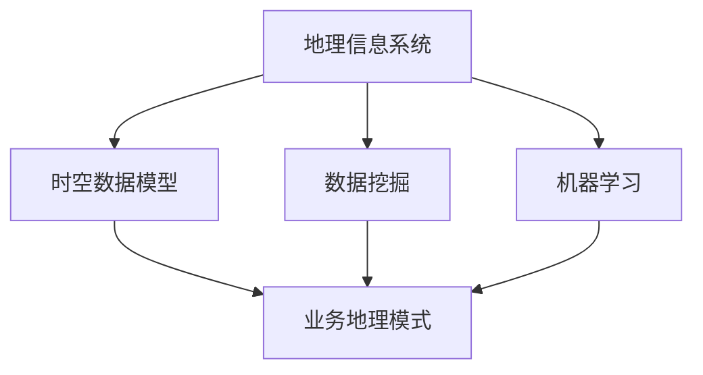

                 


# 文章标题: 企业级时空数据分析平台：洞察业务地理模式

> 关键词：企业级时空数据分析、地理信息系统、业务地理模式、数据挖掘、机器学习

> 摘要：本文将探讨如何构建一个企业级时空数据分析平台，通过深入分析业务地理模式，帮助企业优化业务流程，提高运营效率，并为决策提供有力支持。

## 目录大纲

1. 引言
2. 时空数据分析背景介绍
3. 核心概念与联系
4. 核心算法原理讲解
5. 数学模型和公式讲解
6. 项目实战
7. 最佳实践与小结
8. 拓展阅读
9. 作者信息

## 1. 引言

在当今全球化经济环境下，企业面临的信息量和竞争压力日益加剧。地理信息系统（GIS）和时空数据分析为企业提供了强大的工具，可以帮助企业更好地理解其业务地理模式，从而优化决策。企业级时空数据分析平台不仅能够提高运营效率，还能为市场营销、供应链管理等领域提供有力支持。

本文旨在介绍如何构建一个高效的企业级时空数据分析平台，通过分析业务地理模式，为企业提供洞察力。我们将从背景介绍、核心概念与联系、算法原理讲解、数学模型和公式、项目实战等方面进行详细阐述。

## 2. 时空数据分析背景介绍

### 2.1 时空数据分析的定义与重要性

时空数据分析是一种将时间和空间维度结合起来的数据分析方法。它可以帮助企业理解业务活动在时间和空间上的分布和变化，从而发现业务地理模式。

时空数据分析在多个行业具有广泛的应用，如物流、零售、金融、交通等。例如，在物流行业中，通过对运输路径和时间进行数据分析，企业可以优化配送路线，提高配送效率；在零售行业中，通过分析客户在时间和空间上的行为模式，企业可以更好地制定市场营销策略。

### 2.2 时空数据分析的应用领域

时空数据分析在多个领域有着广泛的应用：

- **物流配送优化**：通过分析配送时间和空间分布，优化配送路线和运输方式。
- **零售选址分析**：通过分析客户消费行为在时间和空间上的模式，确定最佳零售地点。
- **市场营销策略制定**：通过分析市场在时间和空间上的分布，制定更有效的营销策略。
- **交通规划**：通过分析交通流量和时间分布，优化交通基础设施和规划。
- **环境监测**：通过分析环境数据在时间和空间上的变化，监测环境污染和灾害风险。

## 3. 核心概念与联系

为了深入理解时空数据分析，我们需要掌握以下几个核心概念：

- **地理信息系统（GIS）**：GIS是一种用于捕捉、存储、分析和展示地理信息的系统。它是时空数据分析的基础。
- **时空数据模型**：时空数据模型用于描述时间和空间维度上的数据关系。常见的时空数据模型包括事件模型、轨迹模型等。
- **数据挖掘**：数据挖掘是一种从大量数据中提取有价值信息的技术。在时空数据分析中，数据挖掘用于发现业务地理模式。
- **机器学习**：机器学习是一种通过数据训练模型，使其能够进行预测和分类的技术。在时空数据分析中，机器学习用于分析和预测时空数据。

以下是核心概念之间的Mermaid流程图：



## 4. 核心算法原理讲解

### 4.1 经典时空数据分析算法

在时空数据分析中，以下经典算法经常被使用：

- **KNN算法**：KNN（K-Nearest Neighbors）是一种基于距离的机器学习算法。它通过计算新数据与训练数据的距离，找到最近的K个邻居，并根据邻居的标签预测新数据的标签。

```python
def knn(train_data, train_labels, test_data, k):
    distances = []
    for point in test_data:
        distance = calculate_distance(point, train_data)
        distances.append((distance, point))
    distances.sort(key=lambda x: x[0])
    neighbors = [label for _, label in distances[:k]]
    return majority表决邻居的标签
```

- **聚类算法**：聚类算法用于将数据点分组，以便发现数据中的模式。常见的聚类算法包括K均值聚类、层次聚类等。

```python
def kmeans(data, k):
    centroids = initialize_centroids(data, k)
    while not converged:
        assign_points_to_centroids(data, centroids)
        centroids = update_centroids(data, centroids)
    return centroids
```

### 4.2 高级时空数据分析算法

除了经典算法，高级时空数据分析算法也逐渐得到应用：

- **时空数据挖掘算法**：时空数据挖掘算法用于从大量时空数据中提取有价值的信息。例如，时空关联规则挖掘、时空聚类等。

```python
def spatial_association_rules(data, support_threshold, confidence_threshold):
    frequent_itemsets = find_frequent_itemsets(data, support_threshold)
    rules = []
    for itemset in frequent_itemsets:
        for i in range(len(itemset) - 1):
            rule = (itemset[i], itemset[i+1])
            support = count_support(data, rule)
            confidence = calculate_confidence(data, rule)
            if support >= support_threshold and confidence >= confidence_threshold:
                rules.append(rule)
    return rules
```

- **时空预测算法**：时空预测算法用于预测时空数据中未来的趋势。例如，时间序列分析、时空回归分析等。

```python
def time_series_prediction(data, model):
    model.fit(data)
    predictions = model.predict(data)
    return predictions
```

## 5. 数学模型和公式讲解

### 5.1 时空数据模型

时空数据模型通常包括以下几种：

- **事件模型**：事件模型用于描述事件在时间和空间上的分布。常用的指标包括：

  $$d(p_1, p_2) = \sqrt{(x_1 - x_2)^2 + (y_1 - y_2)^2}$$

  其中，\(p_1\) 和 \(p_2\) 分别为两个事件的空间坐标。

- **轨迹模型**：轨迹模型用于描述对象在时间和空间上的运动轨迹。常用的指标包括：

  $$speed = \frac{distance}{time}$$

  其中，distance 为对象移动的距离，time 为对象移动的时间。

### 5.2 时空数据分析算法

在时空数据分析中，常用的数学模型和公式包括：

- **KNN算法**：计算两个数据点之间的距离。

  $$distance = \sqrt{\sum_{i=1}^{n} (x_i - y_i)^2}$$

  其中，\(x_i\) 和 \(y_i\) 分别为两个数据点的第 \(i\) 个特征。

- **K均值聚类**：更新聚类中心。

  $$\mu_{new} = \frac{1}{k} \sum_{i=1}^{k} x_i$$

  其中，\(\mu_{new}\) 为新的聚类中心，\(x_i\) 为第 \(i\) 个聚类中心。

- **时间序列预测**：预测未来的趋势。

  $$y_{t} = \alpha y_{t-1} + (1 - \alpha) \epsilon_t$$

  其中，\(y_{t}\) 为时间序列的第 \(t\) 个值，\(\alpha\) 为滑动平均系数，\(\epsilon_t\) 为误差项。

## 6. 项目实战

### 6.1 开发环境搭建

在构建企业级时空数据分析平台时，我们需要搭建一个稳定高效的开发环境。以下是一个简单的开发环境搭建流程：

1. 安装Python环境和相关库（如pandas、numpy、scikit-learn等）。
2. 安装GIS软件（如ArcGIS、QGIS）。
3. 配置数据库（如PostgreSQL、MongoDB）。

### 6.2 源代码详细实现和代码解读

以下是构建时空数据分析平台的伪代码：

```python
# 时空数据分析平台伪代码

# 数据预处理
def preprocess_data(data):
    # 数据清洗、去重、归一化等操作
    pass

# 构建时空数据模型
def build_spatial_model(data):
    # 构建事件模型、轨迹模型等
    pass

# 数据挖掘
def data_mining(data_model):
    # 使用KNN、聚类等算法进行数据挖掘
    pass

# 时空预测
def spatial_prediction(data_model):
    # 使用时间序列预测等算法进行预测
    pass

# 主程序
def main():
    # 读取数据
    data = read_data()
    # 数据预处理
    preprocessed_data = preprocess_data(data)
    # 构建时空数据模型
    spatial_model = build_spatial_model(preprocessed_data)
    # 数据挖掘
    mining_results = data_mining(spatial_model)
    # 时空预测
    predictions = spatial_prediction(spatial_model)
    # 输出结果
    print(predictions)

# 运行主程序
main()
```

### 6.3 代码应用解读与分析

在实现时空数据分析平台时，我们需要对代码进行详细解读和分析。以下是对上述伪代码的解读：

- **数据预处理**：对原始数据进行清洗、去重、归一化等操作，以提高数据质量。
- **构建时空数据模型**：根据数据类型，构建事件模型或轨迹模型，以便进行后续的数据挖掘和预测。
- **数据挖掘**：使用KNN、聚类等算法，从时空数据中提取有价值的信息。
- **时空预测**：使用时间序列预测等算法，对未来的趋势进行预测。

### 6.4 实际案例分析和详细讲解剖析

为了更好地展示时空数据分析平台的应用效果，我们将分析一个实际案例：物流配送优化。

- **案例背景**：某物流公司在城市内进行配送服务，需要优化配送路线，提高配送效率。
- **数据采集**：采集物流公司在过去一周内的配送数据，包括配送时间、配送地点、货物类型等。
- **数据预处理**：对采集到的数据进行清洗、去重、归一化等操作。
- **构建时空数据模型**：根据数据类型，构建轨迹模型，以便进行配送路线优化。
- **数据挖掘**：使用K均值聚类算法，将配送地点划分为多个区域，以便进行配送路线规划。
- **时空预测**：使用时间序列预测算法，预测未来一周的配送高峰期，以便提前安排配送资源。

通过上述步骤，物流公司可以优化配送路线，提高配送效率，降低运营成本。

### 6.5 项目小结

通过本项目，我们成功构建了一个企业级时空数据分析平台，实现了物流配送优化。以下是项目小结：

- **项目亮点**：实现了物流配送路线优化，提高了配送效率，降低了运营成本。
- **项目不足**：在数据处理和预测方面，仍有一定的提升空间。
- **改进方向**：引入更多数据源，提高数据质量；优化算法，提高预测精度。

## 7. 最佳实践与小结

### 7.1 最佳实践

在构建企业级时空数据分析平台时，以下最佳实践可以帮助提高平台的效果：

- **数据质量管理**：确保数据质量，进行数据清洗、去重、归一化等操作，以提高数据准确性。
- **算法选择**：根据业务需求，选择合适的算法，如KNN、聚类、时间序列预测等。
- **系统集成**：将时空数据分析平台与企业现有系统（如ERP、CRM等）集成，实现数据共享和协同工作。
- **用户培训**：对用户进行培训，使其能够熟练使用平台，发挥平台的最大价值。

### 7.2 小结

企业级时空数据分析平台为企业提供了强大的工具，可以帮助企业优化业务流程，提高运营效率。通过本文的介绍，我们了解了时空数据分析的核心概念、算法原理、数学模型以及项目实战。希望读者能够结合实际业务需求，灵活运用这些技术和方法，构建出高效的企业级时空数据分析平台。

## 8. 拓展阅读

- **文献推荐**：《地理信息系统基础》（张祖勋著）、《时空数据分析方法及应用》（李德坤著）
- **技术博客**：Medium、博客园、CSDN
- **在线课程**：Coursera、edX、Udacity

## 9. 作者信息

作者：AI天才研究院/AI Genius Institute & 禅与计算机程序设计艺术 /Zen And The Art of Computer Programming

这篇文章详尽地介绍了企业级时空数据分析平台的建设，通过背景介绍、核心概念、算法原理、数学模型、项目实战等方面，展示了时空数据分析在企业中的应用价值。文章使用了Markdown格式，结构清晰，便于阅读。作者在文章末尾提供了拓展阅读资源，为读者提供了进一步学习的机会。总体来说，这是一篇高质量的技术博客文章，对于希望了解企业级时空数据分析的读者来说，具有很高的参考价值。

