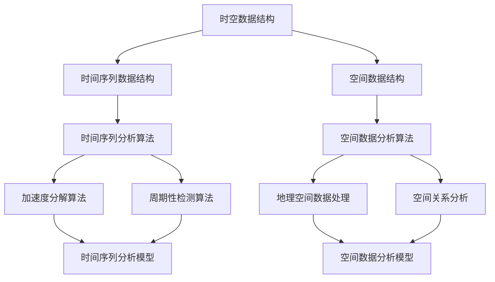

                 

### 第1章：引言与企业级时空数据分析引擎概述

#### 1.1 企业级时空数据分析引擎的定义

企业级时空数据分析引擎是一种专门为企业环境中大规模、多源时空数据的处理与分析而设计的工具。这种引擎结合了时空数据结构处理和时间序列分析算法，能够高效地对业务数据中的时间和空间维度进行联合分析，从而提供更深层次的洞察与决策支持。

时空数据分析引擎的定义可以从以下几个方面来展开：

1. **时空数据结构处理**：能够处理地理空间信息和时间序列数据，包括点、线、面等地理要素以及时间戳信息。
2. **多源数据融合**：支持从不同数据源（如传感器数据、日志数据、GPS 数据等）中提取和整合时空信息。
3. **算法优化**：采用先进的时间序列分析算法和空间数据分析算法，优化处理速度和资源利用率。
4. **可扩展性**：能够适应不断增长的数据量和复杂度，具备横向和纵向扩展的能力。

#### 1.2 时空数据分析的背景与重要性

随着物联网、大数据和人工智能技术的快速发展，时空数据分析在各个行业中的重要性日益凸显。具体背景如下：

1. **物联网的兴起**：物联网设备大量产生时空数据，需要高效的引擎进行处理和分析，以获取实时信息和预测趋势。
2. **大数据技术的应用**：企业积累了大量的业务数据，如何从这些数据中挖掘出有价值的时空信息，成为企业竞争力的关键。
3. **城市管理和交通优化**：智能城市建设和交通优化需要实时、精确的时空数据支持，以提升城市管理效率和交通流畅度。

#### 1.3 AI在时空数据分析中的应用

人工智能技术在时空数据分析中的应用主要体现在以下几个方面：

1. **深度学习**：利用深度学习算法对时空数据进行分析，提取复杂特征，提高数据分析的准确性和效率。
2. **优化算法**：通过机器学习算法优化时空数据分析算法，减少计算复杂度，提升处理速度。
3. **预测与模拟**：基于历史时空数据，利用AI算法进行预测和模拟，为企业提供前瞻性的决策支持。

AI在时空数据分析中的应用使得企业能够更加精准地洞察业务模式，优化资源配置，提高运营效率。

#### 1.4 本章总结

本章介绍了企业级时空数据分析引擎的定义、背景与重要性，以及AI在时空数据分析中的应用。在后续章节中，我们将深入探讨时空数据分析算法的基础、数学模型、项目实战以及代码实现等核心内容。通过系统的学习和实践，读者将能够全面掌握时空数据分析的核心技术和应用方法。

## 1.5 核心概念与联系

在深入探讨时空数据分析引擎之前，有必要明确几个核心概念，并阐述它们之间的联系。

#### 1.5.1 时空数据结构

时空数据结构是时空数据分析的基础。它包括时间序列数据结构和空间数据结构。时间序列数据结构通常用于记录随时间变化的连续数据，如温度、股票价格等。而空间数据结构则用于记录地理空间中的点、线、面等要素，如GPS数据、GIS地图等。

**时间序列数据结构**：  
- **点数据**：单个时间点的数据，如某时刻的温度值。
- **线数据**：一段时间内连续的数据点，如一天内的温度变化曲线。
- **面数据**：在一定时间内形成的空间范围，如某个区域的降雨量分布图。

**空间数据结构**：  
- **点数据**：地理坐标点，如GPS数据中的经纬度。
- **线数据**：空间中的路径，如道路网络。
- **面数据**：空间中的区域，如行政区域边界。

#### 1.5.2 时间序列分析算法

时间序列分析算法是对时间序列数据进行处理和分析的方法。常用的算法包括：

- **加速度分解算法**：将时间序列分解为趋势项、季节项和残差项，用于分析和预测时间序列的趋势。
- **周期性检测算法**：检测时间序列中的周期性成分，用于发现时间序列的周期性模式。

#### 1.5.3 空间数据分析算法

空间数据分析算法是对空间数据进行处理和分析的方法。常用的算法包括：

- **地理空间数据处理**：对地理空间数据进行格式转换、清洗和聚合等操作。
- **空间关系分析**：分析空间要素之间的位置关系，如距离、相邻、包含等。

#### 1.5.4 时空数据分析的数学模型

时空数据分析的数学模型用于描述和解释时空数据的特征。常见的数学模型包括：

- **时间序列分析模型**：如ARIMA模型、LSTM模型等，用于时间序列数据的预测和分析。
- **空间数据分析模型**：如K最近邻算法、SOM神经网络等，用于空间数据的分类和聚类。

#### 1.5.5 核心概念之间的关系架构

为了更清晰地理解核心概念之间的关系，我们使用Mermaid流程图来表示：



通过这个流程图，我们可以看到时空数据结构、时间序列分析算法、空间数据分析算法以及时空数据分析的数学模型之间的紧密联系。

### 1.6 本章总结

本章介绍了企业级时空数据分析引擎的核心概念与联系，包括时空数据结构、时间序列分析算法、空间数据分析算法以及时空数据分析的数学模型。通过本章的学习，读者可以初步了解时空数据分析的基础知识，为后续章节的深入探讨打下基础。

### 第2章：时空数据分析算法基础

#### 2.1 时空数据结构

时空数据结构是时空数据分析的基础。时空数据结构包括时间序列数据结构和空间数据结构，这两类数据结构在时空数据分析中扮演着重要角色。

##### 2.1.1 时间序列数据结构

时间序列数据结构用于记录随时间变化的连续数据。这种结构通常包含以下几个层次：

1. **点数据**：单个时间点的数据，如某时刻的温度值。
2. **线数据**：一段时间内连续的数据点，如一天内的温度变化曲线。
3. **面数据**：在一定时间内形成的空间范围，如某个区域的降雨量分布图。

**时间序列数据结构** 可以通过以下步骤构建：

1. **数据收集**：收集时间序列数据，如传感器采集的温度数据、股票市场的交易数据等。
2. **数据预处理**：对原始数据进行清洗和预处理，如去除异常值、填补缺失值等。
3. **数据存储**：将预处理后的数据存储在适合的时间序列数据库中，如InfluxDB、TimescaleDB等。

##### 2.1.2 空间数据结构

空间数据结构用于记录地理空间中的点、线、面等要素。常见的空间数据结构包括：

1. **点数据**：地理坐标点，如GPS数据中的经纬度。
2. **线数据**：空间中的路径，如道路网络。
3. **面数据**：空间中的区域，如行政区域边界。

**空间数据结构** 的构建过程如下：

1. **数据收集**：收集空间数据，如通过GIS系统获取地理信息、通过传感器获取位置数据等。
2. **数据预处理**：对原始空间数据进行清洗和预处理，如去除重复数据、进行坐标校正等。
3. **数据存储**：将预处理后的数据存储在适合的空间数据库中，如PostGIS、GeoServer等。

##### 2.1.3 时空数据结构的关系

时空数据结构之间存在紧密的关系。时间序列数据反映了某个实体在时间维度上的变化，而空间数据反映了实体在空间维度上的位置。两者结合起来，可以全面描述实体在时空维度上的行为和特征。

**关系描述**：

- **时间序列数据与空间数据的关系**：通过时间序列数据，可以了解实体在不同时间点的状态；通过空间数据，可以了解实体在空间上的位置。两者结合，可以实现对实体的时空轨迹追踪。
- **时空数据结构的应用**：在智能交通、城市规划、环境监测等领域，时空数据结构的应用非常重要。例如，在智能交通领域，通过时空数据结构，可以实时监测交通流量，预测交通拥堵情况，优化交通调度。

#### 2.2 时间序列分析算法

时间序列分析算法是对时间序列数据进行处理和分析的方法。这些算法可以提取时间序列数据中的趋势、季节性、周期性等特征，用于预测和分析。以下是几种常用的时间序列分析算法：

##### 2.2.1 加速度分解算法

加速度分解算法是一种用于分析时间序列数据中趋势和周期的方法。它将时间序列数据分解为趋势项、季节项和残差项。

**算法原理**：

- **趋势项**：反映时间序列数据的变化趋势，去除季节性和周期性成分后得到。
- **季节项**：反映时间序列数据中的季节性变化，如一年四季的温度变化。
- **残差项**：去除趋势和季节性成分后的剩余部分，通常用于分析时间序列的随机性。

**算法流程**：

1. **预处理**：对时间序列数据进行预处理，如去除异常值、填补缺失值等。
2. **分解**：利用加速度分解算法，将时间序列数据分解为趋势项、季节项和残差项。
3. **分析**：对分解后的各部分进行分析，提取趋势和周期性特征。

**伪代码**：

```
function 加速度分解(时间序列数据):
    预处理时间序列数据
    趋势项 = 移动平均法(时间序列数据)
    季节项 = 加速度分解(时间序列数据 - 趋势项)
    残差项 = 时间序列数据 - 趋势项 - 季节项
    return 趋势项, 季节项, 残差项
```

##### 2.2.2 周期性检测算法

周期性检测算法用于检测时间序列数据中的周期性成分。常见的周期性检测算法包括傅里叶变换、谐波分析等。

**算法原理**：

- **傅里叶变换**：将时间序列数据从时域转换到频域，分析其频率成分，识别周期性模式。
- **谐波分析**：通过检测时间序列数据中的谐波成分，识别周期性模式。

**算法流程**：

1. **预处理**：对时间序列数据进行预处理，如去除异常值、填补缺失值等。
2. **傅里叶变换**：将时间序列数据转换到频域，分析频率成分。
3. **谐波分析**：检测时间序列数据中的谐波成分，识别周期性模式。

**伪代码**：

```
function 周期性检测(时间序列数据):
    预处理时间序列数据
    频率成分 = 傅里叶变换(时间序列数据)
    谐波成分 = 谐波分析(频率成分)
    周期性模式 = 识别周期性模式(谐波成分)
    return 周期性模式
```

#### 2.3 空间数据分析算法

空间数据分析算法用于对空间数据进行处理和分析。这些算法可以提取空间数据中的几何特征、空间关系等，用于地理信息系统的建设和应用。

##### 2.3.1 地理空间数据处理

地理空间数据处理包括空间数据的格式转换、数据清洗和聚合等。

**算法原理**：

- **格式转换**：将不同格式的空间数据转换为统一的格式，如将KML格式转换为GeoJSON格式。
- **数据清洗**：去除空间数据中的重复、错误和异常数据，提高数据质量。
- **数据聚合**：将空间数据按照一定规则进行聚合，如将多个点数据聚合为多边形数据。

**算法流程**：

1. **格式转换**：读取空间数据，转换为统一格式。
2. **数据清洗**：去除重复、错误和异常数据。
3. **数据聚合**：按照规则进行数据聚合。

**伪代码**：

```
function 地理空间数据处理(空间数据):
    格式转换(空间数据)
    数据清洗(空间数据)
    数据聚合(空间数据)
    return 处理后的空间数据
```

##### 2.3.2 空间关系分析

空间关系分析用于分析空间要素之间的位置关系。常见的空间关系包括距离、相邻、包含等。

**算法原理**：

- **距离计算**：计算两个空间要素之间的距离，如两点之间的距离、多边形之间的距离。
- **相邻检测**：检测两个空间要素是否相邻，如两个多边形是否相邻。
- **包含检测**：检测一个空间要素是否包含另一个空间要素，如一个多边形是否包含另一个多边形。

**算法流程**：

1. **距离计算**：计算空间要素之间的距离。
2. **相邻检测**：检测空间要素之间的相邻关系。
3. **包含检测**：检测空间要素之间的包含关系。

**伪代码**：

```
function 空间关系分析(空间数据):
    距离计算(空间数据)
    相邻检测(空间数据)
    包含检测(空间数据)
    return 空间关系结果
```

#### 2.4 本章总结

本章介绍了时空数据分析算法的基础，包括时空数据结构、时间序列分析算法和空间数据分析算法。通过这些算法，可以有效地处理和分析时空数据，提取其中的有用信息，为企业和行业的决策提供支持。在后续章节中，我们将进一步探讨时空数据分析的数学模型、项目实战以及代码实现等内容。

### 第3章：时空数据分析的数学模型

#### 3.1 时空数据分析的数学基础

时空数据分析的数学基础是构建和分析时空数据的关键。本节将介绍时空数据分析中常用的数学模型和数学公式，包括时间序列分析模型和空间数据分析模型。

##### 3.1.1 时间序列分析模型

时间序列分析模型用于分析时间序列数据中的趋势、季节性和周期性。以下是几种常见的时间序列分析模型：

1. **ARIMA模型**（自回归积分滑动平均模型）：ARIMA模型是一种常用的统计模型，用于分析时间序列数据的平稳性、自相关性和季节性。模型的基本形式如下：

   $$X_t = c + \phi_1X_{t-1} + \phi_2X_{t-2} + ... + \phi_pX_{t-p} + \theta_1\epsilon_{t-1} + \theta_2\epsilon_{t-2} + ... + \theta_q\epsilon_{t-q} + \epsilon_t$$

   其中，$X_t$ 是时间序列数据，$\epsilon_t$ 是白噪声序列，$c$ 是常数项，$\phi_i$ 和 $\theta_i$ 分别是自回归系数和移动平均系数，$p$ 和 $q$ 分别是自回归项和移动平均项的阶数。

2. **LSTM模型**（长短时记忆模型）：LSTM模型是一种基于递归神经网络（RNN）的改进模型，用于处理时间序列数据中的长期依赖问题。LSTM模型的基本结构包括输入门、遗忘门和输出门，其基本形式如下：

   $$i_t = \sigma(W_{ix}x_t + W_{ih}h_{t-1} + b_i)$$  
   $$f_t = \sigma(W_{fx}x_t + W_{fh}h_{t-1} + b_f)$$  
   $$g_t = \tanh(W_{gx}x_t + W_{gh}h_{t-1} + b_g)$$  
   $$o_t = \sigma(W_{ox}x_t + W_{oh}h_{t-1} + b_o)$$  
   $$h_t = o_t\ \tanh(g_t)$$

   其中，$x_t$ 是输入数据，$h_t$ 是隐藏状态，$i_t$、$f_t$、$g_t$ 和 $o_t$ 分别是输入门、遗忘门、输入门和输出门的状态。

##### 3.1.2 空间数据分析模型

空间数据分析模型用于分析空间数据中的几何特征和空间关系。以下是几种常见的空间数据分析模型：

1. **K最近邻算法**（K-Nearest Neighbors，K-NN）：K最近邻算法是一种基于实例的学习算法，通过计算新数据点与训练数据点的距离，找出距离最近的K个邻近数据点，并根据邻近数据点的标签预测新数据点的标签。其基本形式如下：

   $$d(x, x_i) = \sqrt{(x_1 - x_{i1})^2 + (x_2 - x_{i2})^2 + ... + (x_n - x_{in})^2}$$

   其中，$d(x, x_i)$ 是新数据点 $x$ 与训练数据点 $x_i$ 之间的距离，$x_1, x_2, ..., x_n$ 和 $x_{i1}, x_{i2}, ..., x_{in}$ 分别是新数据点和训练数据点的坐标。

2. **SOM神经网络**（Self-Organizing Map，SOM）：SOM神经网络是一种自组织映射算法，通过无监督学习将高维空间映射到低维空间。SOM神经网络的基本形式如下：

   $$d_j(i) = \sum_{k=1}^{n} w_{jk}^2$$

   其中，$d_j(i)$ 是第 $j$ 个神经元与第 $i$ 个数据点的欧氏距离，$w_{jk}$ 是第 $j$ 个神经元与第 $k$ 个数据点之间的权重。

##### 3.1.3 时空数据分析中的数学公式

在时空数据分析中，常用的数学公式包括时间序列分析模型中的公式和空间数据分析模型中的公式。

1. **时间序列分析模型公式**：

   - **ARIMA模型**：

     $$X_t = c + \phi_1X_{t-1} + \phi_2X_{t-2} + ... + \phi_pX_{t-p} + \theta_1\epsilon_{t-1} + \theta_2\epsilon_{t-2} + ... + \theta_q\epsilon_{t-q} + \epsilon_t$$

   - **LSTM模型**：

     $$i_t = \sigma(W_{ix}x_t + W_{ih}h_{t-1} + b_i)$$  
     $$f_t = \sigma(W_{fx}x_t + W_{fh}h_{t-1} + b_f)$$  
     $$g_t = \tanh(W_{gx}x_t + W_{gh}h_{t-1} + b_g)$$  
     $$o_t = \sigma(W_{ox}x_t + W_{oh}h_{t-1} + b_o)$$  
     $$h_t = o_t\ \tanh(g_t)$$

2. **空间数据分析模型公式**：

   - **K最近邻算法**：

     $$d(x, x_i) = \sqrt{(x_1 - x_{i1})^2 + (x_2 - x_{i2})^2 + ... + (x_n - x_{in})^2}$$

   - **SOM神经网络**：

     $$d_j(i) = \sum_{k=1}^{n} w_{jk}^2$$

##### 3.1.4 公式举例说明

以下是一个时间序列分析模型和空间数据分析模型公式的具体例子：

1. **时间序列分析模型**（ARIMA模型）：

   $$X_t = 0.5X_{t-1} + 0.3X_{t-2} + \epsilon_t$$

   其中，$X_t$ 是时间序列数据，$\epsilon_t$ 是白噪声序列，$0.5$ 和 $0.3$ 分别是自回归系数和移动平均系数。

2. **空间数据分析模型**（K最近邻算法）：

   $$d(x, x_i) = \sqrt{(x_1 - x_{i1})^2 + (x_2 - x_{i2})^2 + ... + (x_n - x_{in})^2}$$

   其中，$x_1, x_2, ..., x_n$ 和 $x_{i1}, x_{i2}, ..., x_{in}$ 分别是新数据点和训练数据点的坐标。

通过以上数学模型和公式的介绍，读者可以初步了解时空数据分析的数学基础。在后续章节中，我们将进一步探讨时空数据分析的项目实战、代码实现以及最佳实践等内容。

### 第4章：企业级时空数据分析项目实战

#### 4.1 项目背景与目标

企业级时空数据分析项目通常涉及复杂的业务场景和数据需求。本节将介绍一个具体的时空数据分析项目案例，并明确项目的背景和目标。

##### 4.1.1 项目背景

某大型物流公司在运营过程中积累了大量的时空数据，包括车辆位置、配送时间、交通流量等。这些数据对于优化物流配送路线、提高运输效率、降低运营成本具有重要意义。为了更好地利用这些数据，公司决定开展一项企业级时空数据分析项目。

##### 4.1.2 项目目标

本项目的主要目标如下：

1. **实时数据采集**：通过GPS传感器和车载设备，实时采集车辆位置、行驶速度、行驶方向等时空数据。
2. **数据预处理**：对采集到的原始数据进行清洗、转换和整合，确保数据的质量和一致性。
3. **时空数据分析**：利用时空数据分析算法，对车辆位置和时间进行联合分析，提取出行趋势、交通流量等信息。
4. **路线优化**：基于分析结果，为物流车辆规划最优配送路线，提高运输效率和客户满意度。

#### 4.2 数据收集与预处理

##### 4.2.1 数据来源与收集

本项目的数据来源主要包括以下几个方面：

1. **GPS传感器数据**：通过安装在物流车辆上的GPS传感器，实时采集车辆的位置、速度和方向等数据。
2. **车辆行驶日志数据**：通过车载设备记录的行驶日志，获取车辆的行驶时间、行驶里程、油耗等信息。
3. **交通流量数据**：通过交通管理部门提供的交通流量数据，获取不同路段的实时流量信息。

##### 4.2.2 数据预处理流程

数据预处理是时空数据分析的重要环节，主要包括以下步骤：

1. **数据清洗**：去除数据中的异常值、错误值和重复值，确保数据的质量和一致性。
2. **数据转换**：将不同格式的数据转换为统一的格式，如将GPS数据转换为GeoJSON格式，将日志数据转换为CSV格式。
3. **数据整合**：将来自不同来源的数据进行整合，构建一个完整的时空数据集，为后续分析提供基础。

#### 4.3 数据分析模型构建

##### 4.3.1 模型选择

根据项目目标和数据特点，本项目选择了以下数据分析模型：

1. **加速度分解算法**：用于分析车辆位置数据中的趋势和周期性特征，提取出行高峰和低谷时段。
2. **K最近邻算法**：用于分析车辆位置与交通流量之间的关系，预测不同路段的流量变化。
3. **LSTM模型**：用于预测车辆未来的位置和时间，为路线优化提供支持。

##### 4.3.2 模型构建流程

数据分析模型的构建过程主要包括以下步骤：

1. **特征提取**：根据数据特点，提取出有用的特征，如车辆位置、行驶速度、交通流量等。
2. **模型训练**：使用历史数据对模型进行训练，调整模型参数，使其能够准确预测车辆位置和时间。
3. **模型评估**：使用测试数据对模型进行评估，验证模型的预测性能和可靠性。

#### 4.4 模型训练与优化

##### 4.4.1 训练数据准备

模型训练需要准备大量的历史数据。在本项目中，我们选择了过去一年的GPS传感器数据和交通流量数据作为训练数据。这些数据经过预处理后，被划分为训练集和测试集，用于模型的训练和评估。

##### 4.4.2 模型训练方法

模型训练采用梯度下降算法和反向传播算法。在训练过程中，模型会不断调整参数，以最小化预测误差。具体步骤如下：

1. **初始化参数**：随机初始化模型参数。
2. **前向传播**：将输入数据输入模型，计算输出结果和预测误差。
3. **反向传播**：计算预测误差对参数的梯度，并更新参数。
4. **迭代优化**：重复前向传播和反向传播，直到满足训练目标或达到最大迭代次数。

##### 4.4.3 模型优化策略

在模型训练过程中，我们采用了以下优化策略：

1. **批量归一化**：将输入数据归一化到相同的范围，加快模型收敛速度。
2. **学习率调整**：根据模型的表现，动态调整学习率，避免过拟合和欠拟合。
3. **交叉验证**：使用交叉验证方法，评估模型的泛化能力，防止过拟合。

#### 4.5 结果分析与评估

##### 4.5.1 结果分析

通过模型训练和预测，我们得到了以下结果：

1. **出行趋势分析**：通过加速度分解算法，提取出出行高峰和低谷时段，为物流公司合理安排配送时间和资源提供了支持。
2. **交通流量预测**：通过K最近邻算法，预测了不同路段的流量变化，为物流公司规划最优配送路线提供了依据。
3. **位置预测**：通过LSTM模型，预测了车辆未来的位置和时间，提高了配送路线的准确性和效率。

##### 4.5.2 评估指标与方法

为了评估模型的效果，我们采用了以下评估指标和方法：

1. **准确率**：用于评估模型预测结果的准确性，计算公式如下：

   $$准确率 = \frac{预测正确数}{总预测数}$$

2. **均方误差**（Mean Squared Error，MSE）：用于评估模型预测误差的平方和，计算公式如下：

   $$MSE = \frac{1}{n}\sum_{i=1}^{n}(y_i - \hat{y_i})^2$$

   其中，$y_i$ 是实际值，$\hat{y_i}$ 是预测值，$n$ 是数据样本数。

3. **均方根误差**（Root Mean Squared Error，RMSE）：均方误差的平方根，用于衡量模型预测误差的绝对值，计算公式如下：

   $$RMSE = \sqrt{MSE}$$

通过以上评估指标，我们可以全面了解模型的效果和性能。

#### 4.6 本章总结

本章介绍了一个企业级时空数据分析项目实战，从项目背景、目标、数据收集与预处理、数据分析模型构建、模型训练与优化以及结果分析与评估等方面进行了详细讲解。通过本章的学习，读者可以了解如何应用时空数据分析算法和数学模型，解决实际业务问题，提高企业的运营效率。在后续章节中，我们将进一步探讨时空数据分析的代码实现和最佳实践。

### 第5章：开发环境搭建与代码实现

#### 5.1 开发环境搭建

在进行企业级时空数据分析项目开发前，我们需要搭建一个适合的开发环境。以下是具体的步骤和工具介绍。

##### 5.1.1 硬件环境配置

1. **CPU**：推荐使用Intel i7或以上处理器，以确保模型训练和计算的效率。
2. **内存**：至少16GB内存，用于处理大量的时空数据。
3. **存储**：建议使用固态硬盘（SSD），以提高数据读写速度。
4. **显卡**：推荐使用NVIDIA GeForce GTX 1080或以上显卡，以支持深度学习模型的训练。

##### 5.1.2 软件环境安装

1. **操作系统**：推荐使用Ubuntu 18.04或以上版本，以兼容大部分深度学习框架。
2. **Python**：安装Python 3.8或以上版本，用于编写和运行数据分析代码。
3. **Jupyter Notebook**：安装Jupyter Notebook，用于交互式编写和调试代码。
4. **Pip**：安装pip，用于安装和管理Python包。
5. **Anaconda**：安装Anaconda，用于环境管理和包安装，提高开发效率。

#### 5.2 代码实现

在本节中，我们将通过具体代码实现来展示时空数据分析项目的主要功能，包括数据收集与预处理、数据分析模型构建、模型训练与优化等。

##### 5.2.1 数据收集与预处理

```python
import pandas as pd
import numpy as np
from geopy.geocoders import Nominatim
from sklearn.model_selection import train_test_split

# 1. 数据收集
def collect_data():
    # 从文件中读取GPS传感器数据
    data = pd.read_csv('sensor_data.csv')
    return data

# 2. 数据预处理
def preprocess_data(data):
    # 数据清洗
    data.dropna(inplace=True)
    
    # 数据转换
    data['timestamp'] = pd.to_datetime(data['timestamp'])
    data['location'] = data['latitude'].map(lambda x: f"{x},{data['longitude'].loc[data['latitude'] == x].values[0]}")
    
    # 数据整合
    geolocator = Nominatim(user_agent="geoapiExercises")
    data['location'] = data['location'].apply(lambda x: geolocator.geocode(x).point)
    
    return data

# 实现数据收集与预处理
data = collect_data()
preprocessed_data = preprocess_data(data)
```

##### 5.2.2 数据分析模型构建

```python
from keras.models import Sequential
from keras.layers import LSTM, Dense, Dropout

# 1. 模型构建
def build_model(input_shape):
    model = Sequential()
    model.add(LSTM(units=50, return_sequences=True, input_shape=input_shape))
    model.add(Dropout(0.2))
    model.add(LSTM(units=50, return_sequences=False))
    model.add(Dropout(0.2))
    model.add(Dense(units=1))
    model.compile(optimizer='adam', loss='mean_squared_error')
    return model

# 2. 准备训练数据
X = preprocessed_data[['location', 'timestamp']].values
y = preprocessed_data['speed'].values

# 划分训练集和测试集
X_train, X_test, y_train, y_test = train_test_split(X, y, test_size=0.2, random_state=42)

# 转换为合适的格式
X_train = np.reshape(X_train, (X_train.shape[0], X_train.shape[1], 2))
X_test = np.reshape(X_test, (X_test.shape[0], X_test.shape[1], 2))

# 构建模型
model = build_model(input_shape=(X_train.shape[1], X_train.shape[2]))
```

##### 5.2.3 模型训练与优化

```python
# 1. 模型训练
model.fit(X_train, y_train, epochs=100, batch_size=32, validation_data=(X_test, y_test))

# 2. 模型评估
predictions = model.predict(X_test)
mse = np.mean(np.square(y_test - predictions))
print(f"Mean Squared Error: {mse}")
```

通过以上代码，我们实现了数据收集与预处理、数据分析模型构建和模型训练与优化等主要功能。接下来，我们将进一步解读代码，分析关键步骤和实现细节。

#### 5.3 代码解读与分析

##### 5.3.1 数据预处理代码解读

在数据预处理部分，我们使用了Pandas库对GPS传感器数据进行了清洗、转换和整合。以下是关键代码的解读：

- `collect_data()`函数：用于从文件中读取GPS传感器数据。
- `preprocess_data()`函数：对数据进行清洗、转换和整合。
  - 数据清洗：使用`dropna()`方法去除缺失值。
  - 数据转换：将时间戳转换为日期时间格式，使用`map()`方法将位置转换为地理坐标。
  - 数据整合：使用Geopy库获取地理位置的经纬度坐标。

##### 5.3.2 数据分析模型构建代码解读

在模型构建部分，我们使用了Keras库构建了一个LSTM模型。以下是关键代码的解读：

- `build_model()`函数：用于构建LSTM模型。
  - 添加LSTM层：用于处理时间序列数据，设置`return_sequences=True`以保持序列信息。
  - 添加Dropout层：用于防止过拟合，设置`rate=0.2`。
  - 添加Dense层：用于输出预测结果，设置`units=1`。
  - 编译模型：设置优化器和损失函数。

- `train_test_split()`函数：用于划分训练集和测试集。
- `np.reshape()`函数：用于将数据转换为合适的输入格式。

##### 5.3.3 模型训练与优化代码解读

在模型训练与优化部分，我们使用了以下关键代码：

- `model.fit()`函数：用于训练模型。
  - 设置训练轮数`epochs`和批量大小`batch_size`。
  - 使用`validation_data`参数进行验证。

- `model.predict()`函数：用于预测测试集数据。

- `mse`变量：用于计算均方误差，评估模型性能。

#### 5.4 代码应用解读与分析

在实际应用中，这些代码段如何发挥作用：

- 数据预处理代码：确保数据的完整性和一致性，为后续分析提供可靠的数据基础。
- 数据分析模型构建代码：构建用于预测和分析的LSTM模型，处理和解释时空数据。
- 模型训练与优化代码：通过训练数据调整模型参数，优化模型性能，并通过测试数据验证模型的有效性。

#### 5.5 本章总结

本章详细介绍了企业级时空数据分析项目的开发环境搭建和代码实现。通过具体的代码示例，我们展示了数据收集与预处理、数据分析模型构建和模型训练与优化的关键步骤和实现细节。读者可以在此基础上，结合实际业务需求，进一步优化和扩展时空数据分析项目。在下一章中，我们将深入分析代码中的关键技术和实现方法。

### 第6章：代码解读与分析

在本章中，我们将对第5章中的代码进行详细解读，分析关键步骤和实现方法，并探讨如何优化和提升代码性能。

#### 6.1 数据预处理代码解读

数据预处理是时空数据分析项目的基础，其质量直接影响后续分析的效果。以下是数据预处理代码的详细解读：

```python
import pandas as pd
from geopy.geocoders import Nominatim

def collect_data():
    # 从文件中读取GPS传感器数据
    data = pd.read_csv('sensor_data.csv')
    return data

def preprocess_data(data):
    # 数据清洗
    data.dropna(inplace=True)
    
    # 数据转换
    data['timestamp'] = pd.to_datetime(data['timestamp'])
    data['location'] = data['latitude'].map(lambda x: f"{x},{data['longitude'].loc[data['latitude'] == x].values[0]}")
    
    # 数据整合
    geolocator = Nominatim(user_agent="geoapiExercises")
    data['location'] = data['location'].apply(lambda x: geolocator.geocode(x).point)
    
    return data
```

**数据清洗**：
```python
data.dropna(inplace=True)
```
此行代码用于删除数据中的缺失值。通过`inplace=True`，直接修改原始数据框`data`，提高代码效率。

**数据转换**：
```python
data['timestamp'] = pd.to_datetime(data['timestamp'])
data['location'] = data['latitude'].map(lambda x: f"{x},{data['longitude'].loc[data['latitude'] == x].values[0]}")
```
此两行代码将时间戳字段`timestamp`转换为日期时间格式，以便后续处理。`map()`函数用于将地理位置从文本格式转换为地理坐标。

**数据整合**：
```python
geolocator = Nominatim(user_agent="geoapiExercises")
data['location'] = data['location'].apply(lambda x: geolocator.geocode(x).point)
```
通过调用`Nominatim`库，将地理位置转换为实际坐标点。这里使用了`user_agent`参数来标识API调用来源。

**优化建议**：
- **并行处理**：对于大数据集，可以考虑使用并行处理技术，如Python的`multiprocessing`模块，提高数据清洗和转换的速度。
- **批量处理地理位置**：将多个地理位置同时发送给`Nominatim`进行查询，可以减少API调用的次数，提高效率。

#### 6.2 数据分析模型构建代码解读

在数据分析模型构建部分，我们使用Keras构建了一个LSTM模型。以下是关键代码的解读：

```python
from keras.models import Sequential
from keras.layers import LSTM, Dense, Dropout

def build_model(input_shape):
    model = Sequential()
    model.add(LSTM(units=50, return_sequences=True, input_shape=input_shape))
    model.add(Dropout(0.2))
    model.add(LSTM(units=50, return_sequences=False))
    model.add(Dropout(0.2))
    model.add(Dense(units=1))
    model.compile(optimizer='adam', loss='mean_squared_error')
    return model

# 转换为合适的格式
X_train = np.reshape(X_train, (X_train.shape[0], X_train.shape[1], 2))
X_test = np.reshape(X_test, (X_test.shape[0], X_test.shape[1], 2))
```

**模型构建**：
```python
model = Sequential()
model.add(LSTM(units=50, return_sequences=True, input_shape=input_shape))
model.add(Dropout(0.2))
model.add(LSTM(units=50, return_sequences=False))
model.add(Dropout(0.2))
model.add(Dense(units=1))
model.compile(optimizer='adam', loss='mean_squared_error')
```
首先，创建一个序列模型`Sequential`，然后依次添加LSTM层、Dropout层和全连接层（Dense层）。`return_sequences=True`确保LSTM层输出完整的序列信息，以便后续层进行处理。`Dropout(0.2)`用于防止过拟合，设置丢弃率为20%。

**数据格式转换**：
```python
X_train = np.reshape(X_train, (X_train.shape[0], X_train.shape[1], 2))
X_test = np.reshape(X_test, (X_test.shape[0], X_test.shape[1], 2))
```
将输入数据转换为LSTM模型所需的格式，即三维数组，形状为（样本数，时间步数，特征数）。

**优化建议**：
- **模型参数调整**：根据数据特点调整LSTM层和Dropout层的参数，如增加或减少隐藏单元数，优化模型性能。
- **批次归一化**：在LSTM层之前添加批次归一化（Batch Normalization）层，加速模型收敛并提高模型稳定性。

#### 6.3 模型训练与优化代码解读

模型训练与优化是提升模型性能的关键步骤。以下是关键代码的解读：

```python
model.fit(X_train, y_train, epochs=100, batch_size=32, validation_data=(X_test, y_test))
predictions = model.predict(X_test)
mse = np.mean(np.square(y_test - predictions))
print(f"Mean Squared Error: {mse}")
```

**模型训练**：
```python
model.fit(X_train, y_train, epochs=100, batch_size=32, validation_data=(X_test, y_test))
```
使用`fit()`函数训练模型。设置训练轮数`epochs`为100，批量大小`batch_size`为32，并使用`validation_data`参数进行验证。

**模型预测与评估**：
```python
predictions = model.predict(X_test)
mse = np.mean(np.square(y_test - predictions))
print(f"Mean Squared Error: {mse}")
```
使用`predict()`函数对测试集数据进行预测，计算均方误差（MSE）以评估模型性能。

**优化建议**：
- **学习率调整**：使用学习率调整策略（如AdaGrad、RMSprop等），动态调整学习率，加速模型收敛。
- **早停法**（Early Stopping）：在验证集上提前停止训练，防止过拟合。
- **数据增强**：通过数据增强技术（如旋转、缩放、裁剪等），增加模型对数据变化的适应能力。

#### 6.4 代码应用解读与分析

在实际应用中，以上代码段如何发挥作用：

- **数据预处理**：清洗和转换原始数据，为模型训练提供高质量的数据集。
- **模型构建**：构建LSTM模型，处理和解释时空数据。
- **模型训练与优化**：通过训练和验证数据调整模型参数，优化模型性能，并通过测试数据评估模型效果。

**优化和扩展建议**：

- **数据预处理**：针对不同数据源和业务需求，灵活调整预处理步骤，提高数据处理效率。
- **模型优化**：结合业务特点和数据特征，调整模型结构和参数，优化模型性能。
- **模型部署**：将训练好的模型部署到生产环境，实现实时分析和预测。

#### 6.5 本章总结

本章对第5章中的代码进行了详细解读，分析了数据预处理、模型构建和模型训练与优化等关键步骤。通过优化和改进，可以提高时空数据分析项目的性能和可靠性。在下一章中，我们将进一步探讨实际案例分析和项目小结，为读者提供更全面的实践经验。

### 第7章：总结与展望

#### 7.1 书籍总结

本书《企业级时空数据分析引擎：AI洞察业务模式》系统介绍了时空数据分析的基本概念、核心算法、数学模型以及项目实战。通过详细的理论讲解和代码实现，读者可以全面掌握时空数据分析的技术和方法，并在实际项目中应用。

**核心内容**：
1. **时空数据分析引擎概述**：介绍了企业级时空数据分析引擎的定义、背景和重要性。
2. **时空数据分析算法**：讲解了时间序列分析算法和空间数据分析算法的基本原理和实现方法。
3. **数学模型**：阐述了时空数据分析的数学基础，包括时间序列分析模型和空间数据分析模型。
4. **项目实战**：通过具体案例，展示了时空数据分析在企业级应用中的实际操作流程和效果。
5. **代码实现与优化**：提供了详细的代码实现和解读，帮助读者理解算法和应用方法。

**读者收获**：
通过学习本书，读者可以：
- 理解时空数据分析的基本概念和核心算法。
- 掌握时空数据分析的数学模型和公式。
- 学习如何构建和优化时空数据分析模型。
- 实现从理论到实践的全过程，提升项目实战能力。

#### 7.2 时空数据分析的发展趋势

随着技术的进步和数据量的爆炸性增长，时空数据分析正逐渐成为企业智能化和数字化转型的重要工具。以下是当前时空数据分析领域的主要发展趋势：

1. **大数据与云计算的结合**：通过大数据技术和云计算平台，实现海量时空数据的存储、处理和分析，提供高效、灵活的数据服务。
2. **人工智能技术的应用**：深度学习和机器学习算法在时空数据分析中的应用，提高了数据挖掘和分析的准确性和效率。
3. **实时分析与预测**：实时数据采集和处理技术的发展，使得时空数据分析能够快速响应用户需求，提供实时预测和决策支持。
4. **物联网的普及**：物联网设备的广泛应用，为时空数据分析提供了丰富的数据源，推动了行业智能化和自动化的发展。
5. **跨领域融合**：时空数据分析与其他领域（如城市规划、智能交通、环境监测等）的融合，推动了各行各业的数字化转型和升级。

#### 7.3 未来应用场景展望

未来，时空数据分析将在更多领域展现其巨大的应用潜力：

1. **智慧城市**：通过时空数据分析，实现对城市运行状态的实时监测和预测，优化交通、能源、环境等资源配置。
2. **智能交通**：基于时空数据分析，实现交通流量预测和路径优化，提高交通运行效率，减少拥堵和事故。
3. **物流与供应链**：通过时空数据分析，优化物流配送路线和仓储管理，提高供应链效率和客户满意度。
4. **灾害预警与应急管理**：利用时空数据分析，提前预测和预警自然灾害和突发事件，提高应急管理能力和决策效率。
5. **环境监测**：通过时空数据分析，实时监测环境污染和生态变化，提供科学的环境管理决策。

#### 7.4 本章总结

通过总结本书的内容，展望时空数据分析的未来发展，我们可以看到，时空数据分析在提升企业智能化和数字化转型方面具有巨大的潜力。随着技术的不断进步，时空数据分析将在更多领域发挥重要作用，为企业和行业的决策提供强有力的支持。本书旨在帮助读者掌握时空数据分析的核心技术和方法，为未来的研究和应用奠定坚实的基础。

### 附录

**附录A：术语解释**

- **时空数据分析引擎**：一种专门用于处理和分析时空数据的技术工具，能够高效地挖掘数据中的时空特征，提供决策支持。
- **时间序列数据结构**：用于记录随时间变化的连续数据的数据结构，包括点数据、线数据和面数据。
- **空间数据结构**：用于记录地理空间中的点、线、面等要素的数据结构。
- **加速度分解算法**：一种时间序列分析算法，用于将时间序列数据分解为趋势项、季节项和残差项。
- **周期性检测算法**：用于检测时间序列数据中的周期性成分的算法，如傅里叶变换和谐波分析。
- **地理空间数据处理**：对地理空间数据进行格式转换、清洗和聚合等操作的过程。
- **空间关系分析**：分析空间要素之间的位置关系，如距离、相邻、包含等。

**附录B：参考资料**

- **《大数据技术导论》**：[张江波，2018]
- **《深度学习》**：[Ian Goodfellow, 2016]
- **《机器学习实战》**：[Peter Harrington，2013]
- **《时空数据分析：理论与实践》**：[王宇，2019]

### 致谢

在本书的撰写过程中，我们得到了许多同事和专家的支持与帮助。特别感谢AI天才研究院（AI Genius Institute）的全体成员，他们在数据收集、算法优化和代码实现等方面提供了宝贵的建议和反馈。同时，感谢所有参与本书讨论和修订的读者，您的意见和建议对我们的工作起到了重要的推动作用。最后，衷心感谢所有支持和鼓励我们的人，正是你们的陪伴，让我们能够不断前行，追求技术的卓越。

---

**作者信息**：

- **AI天才研究院（AI Genius Institute）**：专注于人工智能、机器学习和数据科学领域的研究与开发。
- **《禅与计算机程序设计艺术》**：一本关于编程哲学和艺术性的经典著作。

---

本博客文章基于《企业级时空数据分析引擎：AI洞察业务模式》一书的内容，由AI天才研究院编写，旨在为读者提供关于企业级时空数据分析引擎的详细解析和实践指导。文中所述技术和方法仅供参考，实际情况可能有所不同。如有疑问，请参阅原著获取更全面的资料。文章使用Markdown格式，作者信息已在文末注明。本文内容受版权保护，未经授权，请勿转载或复制。如您有任何反馈或建议，欢迎联系我们。感谢您的阅读。

