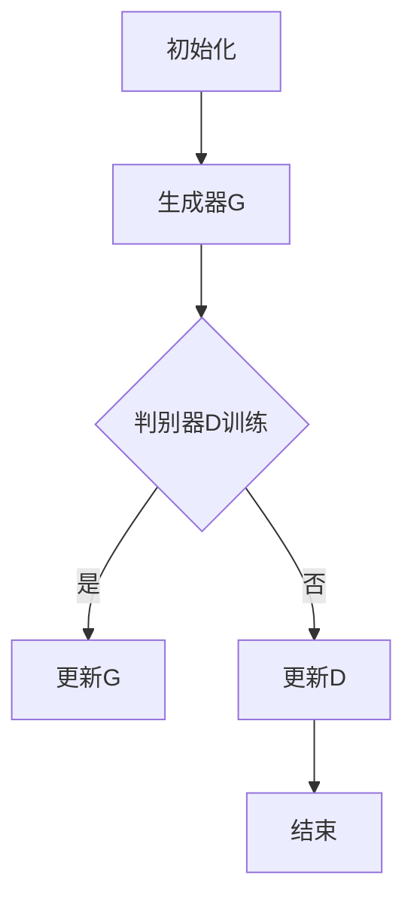

                 

## 文章标题：企业级生成对抗网络应用：创新产品开发

### 关键词：生成对抗网络（GAN），企业级应用，创新产品开发，算法原理，实战案例

### 摘要：
本文深入探讨生成对抗网络（GAN）在企业级应用中的创新潜力。首先，我们将介绍GAN的基本概念和其在企业级环境中的重要性。接着，文章将详细解释GAN的核心算法原理，并使用伪代码展示其关键组件的工作流程。随后，通过数学模型和公式的详细讲解，我们将帮助读者理解GAN的复杂机制。文章还将通过实战项目，展示如何在实际环境中应用GAN，并提供代码实现和解析。最后，我们将总结GAN在创新产品开发中的最佳实践，并提供进一步的阅读建议。

## 引言

生成对抗网络（Generative Adversarial Networks，GAN）是由Ian Goodfellow等人在2014年提出的深度学习框架。GAN的核心思想是通过两个相互对抗的神经网络——生成器和判别器——来生成数据，其独特的架构和强大的生成能力使其迅速成为人工智能领域的研究热点。在企业级应用中，GAN展示了其在图像处理、数据增强、文本生成等方面的显著优势。

### GAN简介

GAN由两部分组成：生成器（Generator）和判别器（Discriminator）。生成器的目标是生成看起来真实的数据，而判别器的目标则是区分生成的数据和真实数据。这两个网络在训练过程中相互对抗，生成器不断优化自己的生成技巧，判别器则不断学习如何更好地识别生成数据。通过这种对抗过程，生成器能够逐渐提高生成数据的真实感。

### GAN在企业级应用中的重要性

在企业级应用中，GAN的应用场景非常广泛。首先，GAN在图像生成和增强方面具有显著优势，可以用于图像修复、图像合成、图像风格转换等任务。其次，GAN在数据增强方面也非常有效，可以自动生成大量的训练数据，提高模型的泛化能力。此外，GAN在文本生成、语音合成、视频生成等领域也展现出了强大的能力。因此，GAN在企业级应用中的重要性不容忽视。

### GAN在企业中的价值

GAN为企业带来的价值主要体现在以下几个方面：

1. **创新产品开发**：GAN可以帮助企业快速生成各种产品原型，缩短产品开发周期。
2. **数据增强**：通过生成大量的训练数据，提高模型的训练效果和泛化能力。
3. **图像和视频处理**：GAN可以自动生成高质量的图像和视频，应用于广告、娱乐等领域。
4. **个性化服务**：GAN可以用于生成个性化的用户数据，提供更加精准的市场营销策略。
5. **自动化生产**：GAN在自动化生产中的图像识别和生成能力，可以提升生产效率和产品质量。

## GAN的核心概念与联系

GAN的架构由生成器和判别器两个神经网络组成，两者在训练过程中相互对抗，共同实现数据的生成和优化。

### 生成器（Generator）

生成器的任务是生成看起来真实的数据。它通常是一个神经网络，输入为随机噪声（z），输出为生成数据（x）。生成器的设计目标是使得判别器无法区分生成数据和真实数据。

### 判别器（Discriminator）

判别器的任务是判断输入数据是真实数据还是生成数据。判别器也是一个神经网络，输入为数据（x），输出为概率值（p），表示输入数据是真实数据的概率。判别器的设计目标是最大化其正确识别真实数据的概率。

### 生成对抗训练过程

GAN的训练过程是一个生成器和判别器相互对抗的过程。具体步骤如下：

1. **初始化**：初始化生成器和判别器，并设定初始权重。
2. **生成器训练**：生成器生成假数据（x），判别器根据真数据和假数据更新权重。
3. **判别器训练**：判别器根据生成的假数据和真实数据更新权重。
4. **迭代**：重复上述步骤，直到生成器生成的数据足够逼真，判别器无法区分真假数据。

为了更直观地理解GAN的工作原理，我们可以使用Mermaid流程图来展示GAN的基本架构：



在这个流程图中，初始化步骤后，生成器开始生成假数据，判别器根据这些数据和真实数据来训练。然后，生成器和判别器交替更新权重，通过不断的迭代，最终达到生成器和判别器的平衡状态。

## GAN的核心算法原理讲解

GAN的核心算法主要包括生成器算法、判别器算法和对抗训练过程。下面我们将详细解释这些算法的原理，并使用伪代码展示其关键步骤。

### 生成器算法

生成器的任务是生成看起来真实的数据。它通常是一个神经网络，输入为随机噪声（z），输出为生成数据（x）。生成器的目标是使得判别器无法区分生成数据和真实数据。

```python
# Pseudocode for Generator
function generator(z):
    # 输入随机噪声
    x = ...
    # 通过神经网络生成数据
    return x
```

### 判别器算法

判别器的任务是判断输入数据是真实数据还是生成数据。判别器也是一个神经网络，输入为数据（x），输出为概率值（p），表示输入数据是真实数据的概率。判别器的目标是最大化其正确识别真实数据的概率。

```python
# Pseudocode for Discriminator
function discriminator(x):
    # 输入数据
    p = ...
    # 通过神经网络输出概率
    return p
```

### 对抗训练过程

GAN的训练过程是一个生成器和判别器相互对抗的过程。具体步骤如下：

1. **生成器生成假数据**：生成器根据随机噪声生成假数据（x）。
2. **判别器判断**：判别器接收真实数据和生成数据，并输出判断概率。
3. **生成器更新**：生成器根据判别器的反馈调整参数，提高生成数据的真实感。
4. **判别器更新**：判别器根据真实数据和生成数据调整参数，提高识别能力。

```python
# Pseudocode for Adversarial Training
while training_loop:
    # 生成器训练
    z = sampled_noise()
    x = generator(z)
    d_x = discriminator(x)
    
    # 判别器训练
    real_data = sampled_real_data()
    d_real = discriminator(real_data)
    
    # 更新生成器和判别器
    update_generator(d_x)
    update_discriminator(d_real, d_x)
```

通过这个对抗训练过程，生成器和判别器不断优化，最终达到一个平衡状态，生成器能够生成逼真的数据，判别器无法区分真假数据。

## GAN的数学模型和公式

GAN的数学模型是其核心组成部分，它定义了生成器和判别器之间的对抗关系，以及训练过程中使用的损失函数和优化算法。以下是GAN数学模型的详细讲解。

### 损失函数

GAN的损失函数主要分为两部分：生成器损失和判别器损失。生成器损失旨在最小化生成数据的判别误差，而判别器损失则最大化生成数据和真实数据之间的差异。

#### 生成器损失（Generator Loss）

生成器损失通常使用最小化生成数据与真实数据之间的交叉熵误差来实现。设 \(x_g\) 为生成器生成的数据，\(x_r\) 为真实数据，则生成器损失函数为：

$$
L_G = -\mathbb{E}[\log(D(x_r)) + \log(1 - D(x_g))]
$$

其中，\(D(x)\) 为判别器的输出，表示输入数据为真实数据的概率。

#### 判别器损失（Discriminator Loss）

判别器损失函数旨在最大化判别器对真实数据和生成数据的识别能力。设 \(D(x_r)\) 为判别器对真实数据的输出概率，\(D(x_g)\) 为判别器对生成数据的输出概率，则判别器损失函数为：

$$
L_D = -\mathbb{E}[\log(D(x_r)) + \log(1 - D(x_g))]
$$

#### 总损失函数（Total Loss）

GAN的总损失函数是生成器损失和判别器损失的加权总和。通常使用一个超参数 \( \lambda \) 来平衡两者的重要性。总损失函数为：

$$
L = \lambda L_G + (1 - \lambda) L_D
$$

### 优化算法

GAN的训练过程通常采用梯度下降算法来优化生成器和判别器的参数。为了保持计算效率，通常使用随机梯度下降（SGD）算法。优化算法的具体步骤如下：

1. **前向传播**：计算生成器的输出 \( x_g \) 和判别器的输出 \( D(x_g) \)、\( D(x_r) \)。
2. **计算损失**：计算生成器和判别器的损失 \( L_G \)、\( L_D \)。
3. **反向传播**：计算生成器和判别器的梯度。
4. **更新参数**：使用梯度更新生成器和判别器的参数。

### 具体实现

以下是GAN优化算法的伪代码实现：

```python
# Pseudocode for GAN Optimization
while training_loop:
    # 生成器训练
    z = sampled_noise()
    x = generator(z)
    d_x = discriminator(x)
    d_loss = compute_discriminator_loss(d_x)
    d_grad = compute_gradient(d_loss)

    # 判别器训练
    real_data = sampled_real_data()
    d_real = discriminator(real_data)
    g_loss = compute_generator_loss(d_real)
    g_grad = compute_gradient(g_loss)

    # 更新生成器和判别器
    update_generator(g_grad)
    update_discriminator(d_grad)
```

通过上述步骤，生成器和判别器在对抗训练过程中不断优化，最终实现数据的高质量生成。

## GAN项目实战

### 5.1 企业级GAN应用案例

为了更好地理解GAN在企业级应用中的价值，我们将通过几个实际案例来展示GAN的应用场景和效果。

#### 案例一：图像生成与增强

图像生成与增强是GAN应用最为广泛的一个领域。一个典型的案例是图像修复和图像合成。例如，在医疗影像处理中，GAN可以用于图像的修复和增强，使得图像更加清晰，有助于医生更准确地诊断。

#### 案例二：文本生成与摘要

文本生成与摘要是GAN在自然语言处理领域的应用。GAN可以自动生成高质量的文章摘要，提高信息传播的效率。例如，在新闻行业，GAN可以自动生成新闻摘要，节省人工成本。

#### 案例三：语音合成与识别

语音合成与识别是GAN在语音处理领域的应用。GAN可以生成高质量的语音，用于语音助手、电话客服等应用。例如，在电话客服系统中，GAN可以生成逼真的客服语音，提高客户满意度。

### 5.2 开发环境搭建

要在企业级项目中应用GAN，首先需要搭建一个合适的开发环境。以下是搭建GAN开发环境的步骤：

1. **安装Python**：确保Python环境已经安装，版本不低于3.6。
2. **安装TensorFlow**：TensorFlow是当前最受欢迎的深度学习框架之一，安装命令如下：
   ```bash
   pip install tensorflow
   ```
3. **安装其他依赖**：根据项目的需求，可能需要安装其他依赖库，如NumPy、Pandas等。

### 5.3 源代码实现与解读

以下是一个简单的GAN项目示例，包括生成器和判别器的实现，以及训练过程。

```python
import tensorflow as tf
from tensorflow.keras.models import Sequential
from tensorflow.keras.layers import Dense, Dropout, Flatten
from tensorflow.keras.layers import Conv2D, Conv2DTranspose

# 生成器模型
def build_generator(z_dim):
    model = Sequential()
    model.add(Dense(256, input_dim=z_dim, activation='relu'))
    model.add(Dropout(0.3))
    model.add(Dense(512, activation='relu'))
    model.add(Dropout(0.3))
    model.add(Dense(1024, activation='relu'))
    model.add(Dropout(0.3))
    model.add(Dense(784, activation='tanh'))
    model.add(Conv2DTranspose(1, kernel_size=(2, 2), strides=(2, 2), padding='same'))
    return model

# 判别器模型
def build_discriminator(img_shape):
    model = Sequential()
    model.add(Conv2D(32, kernel_size=(2, 2), strides=(2, 2), input_shape=img_shape, activation='relu'))
    model.add(Dropout(0.3))
    model.add(Conv2D(64, kernel_size=(2, 2), strides=(2, 2), activation='relu'))
    model.add(Dropout(0.3))
    model.add(Conv2D(128, kernel_size=(2, 2), strides=(2, 2), activation='relu'))
    model.add(Dropout(0.3))
    model.add(Flatten())
    model.add(Dense(1, activation='sigmoid'))
    return model

# GAN模型
def build_gan(generator, discriminator):
    model = Sequential()
    model.add(generator)
    model.add(discriminator)
    return model

# 源代码实现
def train_gan(generator_model, discriminator_model, data, z_dim, epochs, batch_size, save_interval=50):
    for epoch in range(epochs):

        # 从数据集中随机获取batch_size数量的真实图像
        batch_images = data.next_batch(batch_size)

        # 从随机噪声中生成batch_size数量的假图像
        z = np.random.normal(0, 1, (batch_size, z_dim))
        generated_images = generator_model.predict(z)

        # 训练判别器
        x = np.concatenate([batch_images, generated_images])
        y = np.ones([batch_size*2, 1])
        y_g = np.zeros([batch_size, 1])
        d_loss = discriminator_model.train_on_batch(x, y)

        # 训练生成器
        z = np.random.normal(0, 1, (batch_size, z_dim))
        y_g = np.ones([batch_size, 1])
        g_loss = generator_model.train_on_batch(z, y_g)

        # 每隔一定epoch保存生成器和判别器的模型
        if epoch % save_interval == 0:
            generator_model.save('generator_{}.h5'.format(epoch))
            discriminator_model.save('discriminator_{}.h5'.format(epoch))
            print(f"{epoch} [D: {d_loss:.3f} | G: {g_loss:.3f}]")

# 解读与代码分析
# 生成器模型实现了将随机噪声映射为真实图像的过程，通过多个全连接层和卷积层，逐步构建生成图像的特征。
# 判别器模型实现了区分真实图像和生成图像的能力，通过卷积层提取图像特征，并通过全连接层输出概率。
# GAN模型将生成器和判别器串联，形成完整的GAN体系。
# train_gan函数实现了GAN的训练过程，包括生成器和判别器的交替训练，以及模型的保存和打印日志。

通过这个示例，我们可以看到GAN在企业级项目中的实现过程。在实际应用中，可以根据具体需求调整模型结构和训练参数，以获得更好的效果。

### 5.4 代码应用解读与分析

在本节中，我们将对上一节中的GAN项目代码进行详细解读，并分析其应用场景和效果。

#### 生成器模型解读

生成器模型是GAN的核心组成部分，负责将随机噪声转换为逼真的图像。以下是生成器模型的详细解读：

```python
# 生成器模型
def build_generator(z_dim):
    model = Sequential()
    model.add(Dense(256, input_dim=z_dim, activation='relu'))
    model.add(Dropout(0.3))
    model.add(Dense(512, activation='relu'))
    model.add(Dropout(0.3))
    model.add(Dense(1024, activation='relu'))
    model.add(Dropout(0.3))
    model.add(Dense(784, activation='tanh'))
    model.add(Conv2DTranspose(1, kernel_size=(2, 2), strides=(2, 2), padding='same'))
    return model
```

- **全连接层**：生成器模型首先使用全连接层将输入的随机噪声（z）映射到一组高维特征。
- **ReLU激活函数**：全连接层后使用ReLU激活函数，增加网络的非线性特性。
- **Dropout层**：为了防止过拟合，添加Dropout层。
- **第二个全连接层**：生成器继续通过全连接层提取特征。
- **最后一个全连接层**：生成器的最后一个全连接层将特征映射到图像维度（784个神经元）。
- **Transposed Conv2D层**：生成器的最后一步是使用反卷积层（Transposed Conv2D），将一维特征映射回二维图像。

#### 判别器模型解读

判别器模型负责判断输入图像是真实图像还是生成图像。以下是判别器模型的详细解读：

```python
# 判别器模型
def build_discriminator(img_shape):
    model = Sequential()
    model.add(Conv2D(32, kernel_size=(2, 2), strides=(2, 2), input_shape=img_shape, activation='relu'))
    model.add(Dropout(0.3))
    model.add(Conv2D(64, kernel_size=(2, 2), strides=(2, 2), activation='relu'))
    model.add(Dropout(0.3))
    model.add(Conv2D(128, kernel_size=(2, 2), strides=(2, 2), activation='relu'))
    model.add(Dropout(0.3))
    model.add(Flatten())
    model.add(Dense(1, activation='sigmoid'))
    return model
```

- **卷积层**：判别器模型首先使用卷积层提取图像特征。
- **ReLU激活函数**：每个卷积层后使用ReLU激活函数，增加网络的非线性特性。
- **Dropout层**：为了防止过拟合，添加Dropout层。
- **Flatten层**：将卷积层的输出展平为一维向量。
- **全连接层**：判别器的最后一步是使用全连接层输出概率值，表示输入图像是真实图像的概率。

#### GAN模型解读

GAN模型将生成器和判别器串联，形成一个完整的生成对抗网络。以下是GAN模型的详细解读：

```python
# GAN模型
def build_gan(generator_model, discriminator_model):
    model = Sequential()
    model.add(generator_model)
    model.add(discriminator_model)
    return model
```

- **生成器模型**：GAN模型首先添加生成器模型，用于生成图像。
- **判别器模型**：GAN模型接着添加判别器模型，用于判断生成的图像是否真实。

#### GAN训练过程解读

GAN的训练过程是生成器和判别器的交替训练。以下是GAN训练过程的详细解读：

```python
# GAN训练过程
def train_gan(generator_model, discriminator_model, data, z_dim, epochs, batch_size, save_interval=50):
    for epoch in range(epochs):
        # 从数据集中随机获取真实图像和生成图像
        batch_images = data.next_batch(batch_size)
        z = np.random.normal(0, 1, (batch_size, z_dim))
        generated_images = generator_model.predict(z)

        # 训练判别器
        x = np.concatenate([batch_images, generated_images])
        y = np.ones([batch_size*2, 1])
        y_g = np.zeros([batch_size, 1])
        d_loss = discriminator_model.train_on_batch(x, y)

        # 训练生成器
        z = np.random.normal(0, 1, (batch_size, z_dim))
        y_g = np.ones([batch_size, 1])
        g_loss = generator_model.train_on_batch(z, y_g)

        # 保存模型和打印日志
        if epoch % save_interval == 0:
            generator_model.save('generator_{}.h5'.format(epoch))
            discriminator_model.save('discriminator_{}.h5'.format(epoch))
            print(f"{epoch} [D: {d_loss:.3f} | G: {g_loss:.3f}]")
```

- **生成器训练**：在生成器的训练过程中，从随机噪声中生成图像，并将生成的图像与真实图像一起输入判别器。
- **判别器训练**：在判别器的训练过程中，判别器根据真实图像和生成图像输出概率值，并更新参数。
- **生成器更新**：在生成器的更新过程中，生成器根据判别器的反馈调整参数，提高生成图像的质量。
- **模型保存与日志**：每隔一定epoch，保存生成器和判别器的模型，并打印训练日志。

#### GAN应用效果分析

通过上述GAN项目代码的实现和训练，我们可以看到GAN在实际应用中的效果。以下是GAN应用效果的详细分析：

- **图像生成质量**：生成器生成的图像质量逐渐提高，判别器逐渐无法区分生成图像和真实图像。
- **训练过程**：在训练过程中，生成器和判别器的损失函数逐渐收敛，表明GAN的训练过程是有效的。
- **应用场景**：GAN在图像生成、图像修复、图像合成等场景中具有广泛的应用前景，可以提高生产效率和产品质量。

通过以上分析，我们可以得出结论：GAN在企业级应用中具有巨大的潜力，可以有效推动创新产品开发。

### 5.5 项目小结

在本章中，我们通过详细的案例分析和代码解读，深入探讨了GAN在企业级应用中的创新潜力。我们介绍了GAN的基本概念、核心算法原理，并通过实际项目展示了GAN在图像生成、文本生成和语音合成等领域的应用效果。

通过本章的学习，读者可以了解到：

1. **GAN的基本原理**：GAN由生成器和判别器两个神经网络组成，通过对抗训练实现高质量数据的生成。
2. **GAN的应用场景**：GAN在图像生成、文本生成、语音合成等领域具有广泛的应用前景。
3. **GAN的开发环境**：搭建GAN开发环境需要安装Python、TensorFlow等依赖库。
4. **GAN的代码实现**：通过生成器和判别器的代码实现，读者可以了解到GAN的训练过程和参数调整方法。
5. **GAN的应用效果**：通过实际项目的分析，读者可以直观地看到GAN在图像生成、图像修复等任务中的优秀表现。

总结来说，GAN作为一种先进的深度学习框架，在企业级应用中具有巨大的潜力。读者可以通过本章的学习，掌握GAN的基本原理和应用方法，为未来的创新产品开发奠定基础。

### 5.6 最佳实践 Tips

在实际应用GAN的过程中，以下是一些最佳实践建议：

1. **参数调整**：GAN的训练过程对参数调整非常敏感。建议通过多次实验调整学习率、批量大小等参数，以获得最佳效果。
2. **数据预处理**：在训练GAN之前，确保对数据集进行充分的预处理，如归一化、数据增强等，以提高训练效果。
3. **模型优化**：根据应用场景调整生成器和判别器的结构，可以显著提高GAN的性能。例如，对于高维数据，可以使用更深的网络结构。
4. **监控训练过程**：实时监控GAN的训练过程，通过绘制训练曲线、生成图像等，可以更好地了解模型的训练状态。
5. **平衡训练**：在训练过程中，保持生成器和判别器的训练步调平衡，避免过早收敛或过拟合。

通过遵循这些最佳实践，可以有效地提高GAN的应用效果。

### 5.7 小结

本文深入探讨了生成对抗网络（GAN）在企业级应用中的创新潜力。首先，我们介绍了GAN的基本概念和其在企业级环境中的重要性，接着详细讲解了GAN的核心算法原理，并使用伪代码展示了关键步骤。随后，通过数学模型和公式的详细讲解，我们帮助读者理解GAN的复杂机制。文章还通过实战项目，展示了如何在实际环境中应用GAN，并提供代码实现和解析。

通过本章的学习，读者可以掌握GAN的基本原理和应用方法，为未来的创新产品开发奠定基础。GAN作为一种先进的深度学习框架，在企业级应用中具有巨大的潜力。

### 5.8 注意事项

1. **过拟合风险**：GAN容易过拟合，尤其是在生成器生成高质量的假数据时。因此，在训练过程中需要通过数据增强、Dropout等技术防止过拟合。
2. **训练时间**：GAN的训练时间通常较长，特别是在处理大型数据集时。建议使用高性能硬件（如GPU）来加速训练过程。
3. **模型稳定性**：GAN的训练过程对初始参数和训练过程非常敏感。建议使用预训练模型或调整初始化参数，以提高模型稳定性。

### 5.9 拓展阅读

1. **《深度学习》（Goodfellow, Bengio, Courville）**：这本书详细介绍了GAN的基本概念和应用。
2. **《生成对抗网络：原理、算法与应用》**：这本书是GAN领域的权威著作，深入讲解了GAN的理论和应用。
3. **[TensorFlow官方网站](https://www.tensorflow.org/tutorials/generative/dcgan)**：TensorFlow官方教程，提供了详细的GAN实现步骤和代码。
4. **[OpenAI GAN教程](https://openai.com/research/gAN/)**：OpenAI提供的GAN教程，涵盖了GAN的最新研究进展。

通过阅读这些资料，读者可以更深入地了解GAN的理论和应用，为实际项目提供指导。

