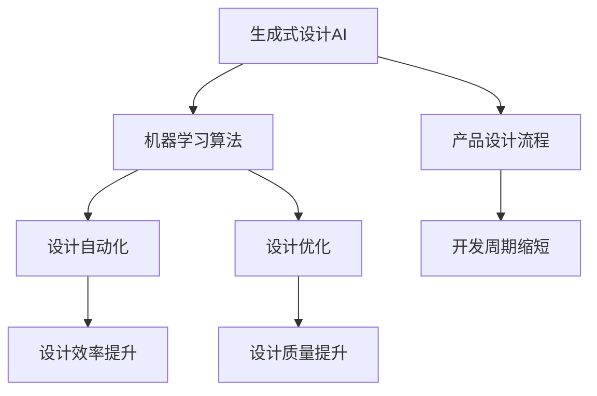
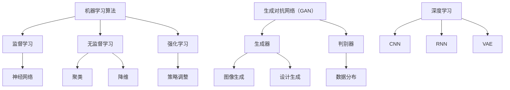

                 

### 文章标题：企业级生成式设计AI：革新产品开发流程

> 关键词：生成式设计AI、企业级应用、产品开发流程、技术革新、人工智能

> 摘要：本文将深入探讨企业级生成式设计AI的原理、应用及其如何革新产品开发流程。通过分析生成式设计AI的核心概念、技术实现和应用案例，本文旨在为读者提供全面的视角，理解生成式设计AI如何提升企业的竞争力，并带来深远的行业变革。

### 引言

在当今快速发展的科技时代，人工智能（AI）已经成为推动企业创新和增长的关键动力。特别是在产品开发领域，AI的应用正逐渐改变传统的开发模式，提升效率和创新能力。生成式设计AI作为一种新兴的技术，正在成为产品开发流程中的重要一环。

生成式设计AI是指利用人工智能算法，自动生成满足特定需求的设计方案。这种技术能够通过学习大量的设计数据和规则，自动生成新的设计，从而在产品开发过程中实现自动化和智能化。与传统的设计方法相比，生成式设计AI具有高效、灵活和创新等优势。

企业级生成式设计AI的应用，不仅可以提升产品开发的效率，还可以优化设计质量，减少设计错误，甚至可以创造出全新的产品设计方案。因此，探索企业级生成式设计AI的原理和应用，对于企业来说具有重要意义。

本文将分为以下几个部分：

1. **生成式设计AI的概述**：介绍生成式设计AI的基本概念和原理，以及其在企业级应用中的背景。
2. **核心概念与联系**：详细探讨生成式设计AI的核心概念，并使用Mermaid流程图展示其原理和联系。
3. **技术实现**：深入讲解生成式设计AI的技术实现，包括基础算法原理、模型优化与训练方法，以及应用工具和平台。
4. **应用案例分析**：通过具体案例展示生成式设计AI在实际企业中的应用，分析其优势和挑战。
5. **产品开发流程革新**：探讨生成式设计AI如何革新产品开发流程，提升企业的竞争力。
6. **项目实战**：介绍一个实际的生成式设计AI项目，详细讲解开发环境搭建、源代码实现和项目分析。
7. **总结与展望**：总结全文内容，展望生成式设计AI的未来发展趋势，并给出企业实施建议。

通过本文的逐步分析，读者将能够全面了解企业级生成式设计AI的原理和应用，理解其对产品开发流程的革新意义。

### 第一步：确定核心主题

书名《企业级生成式设计AI：革新产品开发流程》清晰地指出了本书的核心主题：生成式设计AI在企业中的应用及其对产品开发流程的革新。为了更深入地探讨这个主题，我们需要将其分解为以下几个关键方面：

1. **生成式设计AI的定义和原理**：首先，我们需要理解生成式设计AI的基本概念和原理。生成式设计AI是一种利用人工智能技术自动生成设计方案的方法，其核心是通过机器学习算法从大量的设计数据中学习和提取规律，从而自动生成新的设计。

2. **生成式设计AI的优势**：接下来，我们要探讨生成式设计AI相较于传统设计方法的优势。这些优势可能包括设计效率的提升、设计质量的提高、设计灵活性的增强等。

3. **生成式设计AI的技术实现**：在这一部分，我们将深入探讨生成式设计AI的技术实现细节，包括基础算法原理、模型优化与训练方法，以及应用工具和平台的选择。

4. **生成式设计AI的应用案例**：为了更好地理解生成式设计AI的实际应用，我们将通过具体的行业案例来展示其应用场景和效果。

5. **革新产品开发流程**：最后，我们将探讨生成式设计AI如何变革传统的产品开发流程，提升企业的整体竞争力。

通过对这些关键方面的深入探讨，我们可以构建一个全面的章节结构，以便读者系统地了解企业级生成式设计AI的原理和应用。以下是初步的章节结构：

**第1章：引论**
- 1.1 生成式设计AI概述
- 1.2 企业级应用背景
- 1.3 革新产品开发流程

**第2章：生成式设计AI核心概念**
- 2.1 生成式设计原理
- 2.2 关键技术解析
- 2.3 与传统设计方法的对比

**第3章：生成式设计AI技术实现**
- 3.1 基础算法原理
- 3.2 模型优化与训练
- 3.3 应用工具与平台

**第4章：生成式设计AI应用案例分析**
- 4.1 行业应用概述
- 4.2 成功案例解析
- 4.3 挑战与解决方案

**第5章：革新产品开发流程**
- 5.1 流程革新理论
- 5.2 生成式设计在流程中的角色
- 5.3 流程实施与优化

**第6章：项目实战**
- 6.1 实战项目介绍
- 6.2 环境搭建与工具使用
- 6.3 源代码实现与分析

**第7章：总结与展望**
- 7.1 总结回顾
- 7.2 未来发展趋势
- 7.3 企业实施建议

这个章节结构旨在提供一个清晰的框架，帮助读者逐步深入理解企业级生成式设计AI的各个方面，从而掌握这一先进技术的核心原理和应用。

### 第二步：定义核心概念与联系

为了帮助读者全面理解企业级生成式设计AI及其在产品开发流程中的革新作用，我们需要详细定义几个核心概念，并探讨它们之间的联系。以下是这些核心概念及其相互关系的定义：

1. **生成式设计AI**：
   - 定义：生成式设计AI是指利用人工智能算法，特别是机器学习算法，自动生成满足特定需求的设计方案的技术。它通过学习大量的设计数据和规则，能够自动生成新的设计，从而在产品开发过程中实现自动化和智能化。
   - 关联：生成式设计AI的核心关联在于其机器学习算法的应用，这些算法包括但不限于深度学习、强化学习、生成对抗网络（GAN）等。

2. **机器学习算法**：
   - 定义：机器学习算法是指计算机系统通过学习数据模式，从中提取知识并做出决策或预测的技术。在生成式设计AI中，这些算法用于分析设计数据，学习设计规则，并生成新的设计。
   - 关联：机器学习算法是生成式设计AI的技术基础，不同的算法适用于不同的设计任务和场景。

3. **产品设计流程**：
   - 定义：产品设计流程是指从需求分析、设计、验证到产品发布的全过程。它包括多个阶段，如市场调研、概念设计、原型制作、用户测试等。
   - 关联：生成式设计AI在产品设计流程中的角色是通过自动化和智能化提升设计的效率和效果，减少设计错误，缩短开发周期。

4. **设计自动化**：
   - 定义：设计自动化是指利用计算机技术自动完成设计任务的过程。生成式设计AI通过自动化设计任务，减少了人工干预，提高了设计效率。
   - 关联：设计自动化是生成式设计AI的一个重要目标，它使得设计过程更加高效和灵活。

5. **设计优化**：
   - 定义：设计优化是指通过改进设计参数和结构，提升产品性能和成本效益的过程。生成式设计AI通过学习大量设计案例，能够自动进行设计优化。
   - 关联：设计优化是生成式设计AI的核心功能之一，它能够显著提升产品设计质量和效率。

为了更直观地展示这些核心概念之间的联系，我们可以使用Mermaid流程图来构建一个关系架构图。以下是一个简化的Mermaid流程图示例：



在这个流程图中，生成式设计AI作为核心，通过机器学习算法实现了设计自动化和设计优化，进而影响了产品设计流程，最终带来了设计效率提升、设计质量提升和开发周期缩短等积极影响。这种关系架构图帮助读者清晰地理解了生成式设计AI在产品开发流程中的作用和贡献。

通过定义和关联这些核心概念，读者可以逐步建立起对生成式设计AI及其在产品开发流程中应用的全面理解。接下来的章节将进一步深入探讨这些概念的具体实现和应用。

### 第三步：构建章节结构

在确定了企业级生成式设计AI的核心主题和关键概念后，我们需要构建一个详细的章节结构，以确保文章内容完整、逻辑清晰。以下是本章的章节结构：

**第1章：引论**
- 1.1 生成式设计AI概述
  - 介绍生成式设计AI的基本概念和背景
  - 阐述生成式设计AI在企业级应用的重要性
- 1.2 企业级应用背景
  - 分析当前企业面临的挑战和需求
  - 阐述生成式设计AI如何帮助企业解决这些问题
- 1.3 革新产品开发流程
  - 介绍生成式设计AI如何变革传统产品开发流程
  - 分析变革带来的潜在效益和风险

**第2章：生成式设计AI核心概念**
- 2.1 生成式设计原理
  - 详细讲解生成式设计的定义和原理
  - 分析生成式设计的关键技术和实现方法
- 2.2 关键技术解析
  - 介绍生成式设计AI中的核心算法和技术
  - 分析这些技术如何应用于设计自动化和设计优化
- 2.3 与传统设计方法的对比
  - 阐述生成式设计AI与传统设计方法在效率、质量和灵活性上的差异
  - 分析生成式设计AI的优势和局限性

**第3章：生成式设计AI技术实现**
- 3.1 基础算法原理
  - 详细讲解生成式设计AI的基础算法，如神经网络、深度学习等
  - 提供相关的伪代码示例，帮助读者理解算法实现
- 3.2 模型优化与训练
  - 分析如何通过优化和训练提高生成式设计AI的性能
  - 提供具体的优化技巧和训练策略
- 3.3 应用工具与平台
  - 介绍常用的生成式设计AI工具和平台
  - 分析这些工具和平台的优势和适用场景

**第4章：生成式设计AI应用案例分析**
- 4.1 行业应用概述
  - 分析生成式设计AI在不同行业中的应用情况
  - 提供行业应用的大致框架和典型案例
- 4.2 成功案例解析
  - 深入分析几个成功的生成式设计AI应用案例
  - 阐述这些案例中的关键技术和实现策略
- 4.3 挑战与解决方案
  - 分析生成式设计AI应用中面临的挑战
  - 提供解决这些挑战的方法和建议

**第5章：革新产品开发流程**
- 5.1 流程革新理论
  - 探讨生成式设计AI如何革新产品开发流程
  - 提供理论依据和革新方向
- 5.2 生成式设计在流程中的角色
  - 分析生成式设计AI在产品开发流程中的具体角色和作用
  - 阐述其在各个阶段的应用方法和策略
- 5.3 流程实施与优化
  - 介绍生成式设计AI在产品开发流程中的实施步骤
  - 提供流程优化的方法和建议

**第6章：项目实战**
- 6.1 实战项目介绍
  - 介绍一个具体的生成式设计AI项目
  - 阐述项目的目标、背景和需求
- 6.2 环境搭建与工具使用
  - 详细讲解项目的开发环境和工具选择
  - 提供环境搭建和工具使用的步骤和注意事项
- 6.3 源代码实现与分析
  - 提供项目的源代码实现，并详细解析代码逻辑
  - 分析代码中的关键技术和实现细节
- 6.4 应用解读与分析
  - 分析项目的实际应用效果和影响
  - 提供实际案例分析和详细讲解剖析
- 6.5 项目小结
  - 总结项目的成果和经验
  - 提出项目中的改进点和未来研究方向

**第7章：总结与展望**
- 7.1 总结回顾
  - 总结全书的核心内容和主要观点
  - 强调生成式设计AI在产品开发流程中的重要性
- 7.2 未来发展趋势
  - 展望生成式设计AI的未来发展趋势
  - 分析可能的技术突破和应用前景
- 7.3 企业实施建议
  - 提供针对企业的生成式设计AI实施建议
  - 分析实施过程中可能遇到的问题和解决方案

通过上述章节结构的构建，我们可以确保文章内容的系统性和逻辑性，帮助读者全面、深入地理解企业级生成式设计AI的原理和应用。

### 第四步：细化每个章节的内容

在构建完整的章节结构后，我们需要进一步细化每个章节的内容，确保每个小节的内容都丰富具体，能够为读者提供详细而深入的信息。以下是每个章节的细化内容：

**第1章：引论**
- **1.1 生成式设计AI概述**
  - 介绍生成式设计AI的定义、基本原理和应用领域。
  - 分析生成式设计AI与企业级应用的关系，以及其对企业竞争力的提升作用。
- **1.2 企业级应用背景**
  - 分析当前企业在产品开发中面临的挑战，如设计效率低下、成本高昂、市场需求变化快等。
  - 阐述生成式设计AI如何帮助企业解决这些问题，提升设计质量和效率。

**1.3 革新产品开发流程**
  - 提出生成式设计AI如何革新传统产品开发流程。
  - 分析变革带来的潜在效益，如缩短开发周期、提升产品质量和降低成本等。
  - 探讨在实施过程中可能遇到的挑战和风险，并提出解决方案。

**第2章：生成式设计AI核心概念**
- **2.1 生成式设计原理**
  - 详细解释生成式设计的概念，包括其与自动化的联系。
  - 分析生成式设计的基本原理，如数据驱动和规则驱动设计。
- **2.2 关键技术解析**
  - 介绍生成式设计AI中的核心技术，如神经网络、生成对抗网络（GAN）和强化学习。
  - 分析这些技术如何应用于生成式设计，提升设计效率和效果。

**2.3 与传统设计方法的对比**
  - 阐述生成式设计AI与传统设计方法在效率、灵活性和质量上的差异。
  - 分析生成式设计AI的优势，如自动生成设计、优化设计和适应需求变化等。
  - 探讨生成式设计AI的局限性，如数据依赖和计算资源要求高等。

**第3章：生成式设计AI技术实现**
- **3.1 基础算法原理**
  - 详细讲解生成式设计AI中的基础算法，如神经网络的工作原理和结构。
  - 提供具体的伪代码示例，帮助读者理解算法的实现细节。
- **3.2 模型优化与训练**
  - 分析如何通过模型优化和训练提升生成式设计AI的性能。
  - 介绍常见的优化技巧，如超参数调整、正则化和训练策略。
- **3.3 应用工具与平台**
  - 介绍常用的生成式设计AI工具和平台，如TensorFlow、PyTorch和AutoCAD等。
  - 分析这些工具和平台的优势和适用场景，提供实际使用案例。

**第4章：生成式设计AI应用案例分析**
- **4.1 行业应用概述**
  - 分析生成式设计AI在不同行业中的应用情况，如制造业、建筑业和设计行业。
  - 提供行业应用的大致框架和典型案例。
- **4.2 成功案例解析**
  - 深入分析几个成功的生成式设计AI应用案例，包括其背景、目标和应用效果。
  - 阐述这些案例中的关键技术和实现策略。
- **4.3 挑战与解决方案**
  - 分析生成式设计AI应用中面临的挑战，如数据质量、计算资源和用户体验等。
  - 提供解决这些挑战的方法和建议，包括技术优化和业务策略。

**第5章：革新产品开发流程**
- **5.1 流程革新理论**
  - 探讨生成式设计AI如何革新传统产品开发流程，包括设计流程的各个环节。
  - 阐述生成式设计AI在流程革新中的理论依据和实践意义。
- **5.2 生成式设计在流程中的角色**
  - 分析生成式设计AI在产品开发流程中的具体角色和作用。
  - 阐述其在各个阶段的应用方法和策略，如需求分析、设计、验证和发布等。
- **5.3 流程实施与优化**
  - 介绍生成式设计AI在产品开发流程中的实施步骤，包括前期准备、环境搭建、模型训练和应用部署等。
  - 提供流程优化的方法和建议，如性能监控、调试和迭代改进等。

**第6章：项目实战**
- **6.1 实战项目介绍**
  - 介绍一个具体的生成式设计AI项目，包括其背景、目标和需求。
  - 阐述项目的技术架构和实现方法。
- **6.2 环境搭建与工具使用**
  - 详细讲解项目的开发环境和工具选择，包括硬件配置、软件安装和使用方法。
  - 提供环境搭建和工具使用的步骤和注意事项。
- **6.3 源代码实现与分析**
  - 提供项目的源代码实现，并详细解析代码逻辑。
  - 分析代码中的关键技术和实现细节，如神经网络架构、模型训练和优化等。
- **6.4 应用解读与分析**
  - 分析项目的实际应用效果和影响，包括设计质量、效率提升和用户满意度等。
  - 提供实际案例分析和详细讲解剖析。
- **6.5 项目小结**
  - 总结项目的成果和经验，包括成功点和不足之处。
  - 提出项目中的改进点和未来研究方向。

**第7章：总结与展望**
- **7.1 总结回顾**
  - 总结全书的核心内容和主要观点，强调生成式设计AI在产品开发流程中的重要性。
  - 分析生成式设计AI的优势和潜力，以及其对企业创新和竞争力的提升作用。
- **7.2 未来发展趋势**
  - 展望生成式设计AI的未来发展趋势，包括技术突破和应用前景。
  - 分析可能的发展方向，如更高效的算法、更广泛的应用领域和更深入的优化等。
- **7.3 企业实施建议**
  - 提供针对企业的生成式设计AI实施建议，包括战略规划、技术选型和实施步骤等。
  - 分析实施过程中可能遇到的问题和解决方案，帮助企业在生成式设计AI的应用中获得成功。

通过细化每个章节的内容，我们可以确保文章内容的丰富性和实用性，帮助读者全面深入地理解企业级生成式设计AI的原理和应用。

### 第五步：确保目录大纲的完整性

在构建章节结构后，我们需要再次审查目录大纲，确保其完整性、逻辑性和条理性。以下是完整的目录大纲：

**目录大纲：企业级生成式设计AI：革新产品开发流程**

**第1章：引论**
1.1 生成式设计AI概述
1.2 企业级应用背景
1.3 革新产品开发流程

**第2章：生成式设计AI核心概念**
2.1 生成式设计原理
2.2 关键技术解析
2.3 与传统设计方法的对比

**第3章：生成式设计AI技术实现**
3.1 基础算法原理
3.2 模型优化与训练
3.3 应用工具与平台

**第4章：生成式设计AI应用案例分析**
4.1 行业应用概述
4.2 成功案例解析
4.3 挑战与解决方案

**第5章：革新产品开发流程**
5.1 流程革新理论
5.2 生成式设计在流程中的角色
5.3 流程实施与优化

**第6章：项目实战**
6.1 实战项目介绍
6.2 环境搭建与工具使用
6.3 源代码实现与分析
6.4 应用解读与分析
6.5 项目小结

**第7章：总结与展望**
7.1 总结回顾
7.2 未来发展趋势
7.3 企业实施建议

这个目录大纲涵盖了企业级生成式设计AI的各个方面，从基本概念、技术实现到应用案例，再到产品开发流程的革新，以及实际项目实战和总结展望。通过逐章介绍，读者可以逐步深入理解生成式设计AI的原理和应用，从而掌握这一先进技术在企业级产品开发中的重要作用。

### 撰写目录大纲

在明确了书的核心主题、定义了核心概念与联系并构建了详细的章节结构后，我们可以正式撰写目录大纲。以下是基于markdown格式的目录大纲：

# 企业级生成式设计AI：革新产品开发流程

## 第1章：引论
### 1.1 生成式设计AI概述
- **定义与背景**
- **企业级应用的重要性**
### 1.2 企业级应用背景
- **当前企业面临的挑战**
- **生成式设计AI的解决方案**
### 1.3 革新产品开发流程
- **变革的方向与目的**
- **潜在效益与风险分析**

## 第2章：生成式设计AI核心概念
### 2.1 生成式设计原理
- **概念与定义**
- **基本原理与流程**
### 2.2 关键技术解析
- **神经网络与深度学习**
- **生成对抗网络（GAN）与强化学习**
### 2.3 与传统设计方法的对比
- **效率、质量和灵活性的比较**
- **生成式设计AI的优势与局限性**

## 第3章：生成式设计AI技术实现
### 3.1 基础算法原理
- **神经网络的工作原理**
- **深度学习的基本结构**
- **伪代码示例**
### 3.2 模型优化与训练
- **优化技巧与策略**
- **超参数调整与正则化**
### 3.3 应用工具与平台
- **TensorFlow与PyTorch**
- **AutoCAD与CAD软件的集成**

## 第4章：生成式设计AI应用案例分析
### 4.1 行业应用概述
- **制造业、建筑业、设计行业**
- **应用框架与典型案例**
### 4.2 成功案例解析
- **详细案例分析**
- **关键技术与实现策略**
### 4.3 挑战与解决方案
- **应用中面临的挑战**
- **解决方法与建议**

## 第5章：革新产品开发流程
### 5.1 流程革新理论
- **生成式设计AI对流程的影响**
- **理论依据与实践意义**
### 5.2 生成式设计在流程中的角色
- **需求分析、设计、验证、发布**
- **应用方法与策略**
### 5.3 流程实施与优化
- **实施步骤与流程**
- **优化方法与建议**

## 第6章：项目实战
### 6.1 实战项目介绍
- **项目背景与目标**
- **技术架构与实现方法**
### 6.2 环境搭建与工具使用
- **开发环境配置**
- **工具安装与使用**
### 6.3 源代码实现与分析
- **代码结构与逻辑**
- **关键技术与实现细节**
### 6.4 应用解读与分析
- **实际应用效果与影响**
- **案例分析**
### 6.5 项目小结
- **成果与经验总结**
- **改进点与未来方向**

## 第7章：总结与展望
### 7.1 总结回顾
- **核心内容与主要观点**
- **生成式设计AI的重要性**
### 7.2 未来发展趋势
- **技术突破与应用前景**
- **发展方向与挑战**
### 7.3 企业实施建议
- **战略规划与实施步骤**
- **常见问题与解决方案**

这个markdown格式的目录大纲不仅清晰地展示了文章的结构，还提供了每个章节的简要内容概述，便于读者快速了解文章的内容和逻辑顺序。

### 撰写文章

#### 标题：企业级生成式设计AI：革新产品开发流程

##### 关键词：生成式设计AI、企业级应用、产品开发流程、技术革新、人工智能

##### 摘要：
生成式设计AI作为一种新兴的人工智能技术，正在迅速改变企业级产品开发的模式。本文将深入探讨生成式设计AI的基本概念、技术实现、应用案例，以及其在产品开发流程中的革新作用。通过详细的分析和案例分析，本文旨在为读者提供全面的理解和实用的实施建议。

---

## 引言

在当今快速发展的科技时代，人工智能（AI）已经成为推动企业创新和增长的关键动力。特别是在产品开发领域，AI的应用正逐渐改变传统的开发模式，提升效率和创新能力。生成式设计AI作为一种新兴的技术，正在成为产品开发流程中的重要一环。

生成式设计AI是指利用人工智能算法，自动生成满足特定需求的设计方案。这种技术能够通过学习大量的设计数据和规则，自动生成新的设计，从而在产品开发过程中实现自动化和智能化。与传统的设计方法相比，生成式设计AI具有高效、灵活和创新等优势。

企业级生成式设计AI的应用，不仅可以提升产品开发的效率，还可以优化设计质量，减少设计错误，甚至可以创造出全新的产品设计方案。因此，探索企业级生成式设计AI的原理和应用，对于企业来说具有重要意义。

本文将分为以下几个部分：

1. **生成式设计AI的概述**：介绍生成式设计AI的基本概念和原理，以及其在企业级应用中的背景。
2. **核心概念与联系**：详细探讨生成式设计AI的核心概念，并使用Mermaid流程图展示其原理和联系。
3. **技术实现**：深入讲解生成式设计AI的技术实现，包括基础算法原理、模型优化与训练方法，以及应用工具和平台。
4. **应用案例分析**：通过具体案例展示生成式设计AI在实际企业中的应用，分析其优势和挑战。
5. **产品开发流程革新**：探讨生成式设计AI如何革新产品开发流程，提升企业的竞争力。
6. **项目实战**：介绍一个实际的生成式设计AI项目，详细讲解开发环境搭建、源代码实现和项目分析。
7. **总结与展望**：总结全文内容，展望生成式设计AI的未来发展趋势，并给出企业实施建议。

通过本文的逐步分析，读者将能够全面了解企业级生成式设计AI的原理和应用，理解其对产品开发流程的革新意义。

---

## 第1章：生成式设计AI概述

### 1.1 基本概念

生成式设计AI是一种利用人工智能算法自动生成设计方案的技术。它基于机器学习，特别是深度学习和生成对抗网络（GAN）等技术，能够从大量数据中学习设计模式和规则，进而自动生成新的设计方案。

生成式设计AI的核心思想是利用算法从已有数据中提取知识和规律，并通过迭代优化生成新的设计。这种方法不仅能够提高设计效率，还能够通过智能化的方式探索更多可能的设计方案，从而提升设计质量和创新性。

在企业级应用中，生成式设计AI能够显著提高产品开发的效率和质量。例如，在汽车设计领域，生成式设计AI可以快速生成多种设计方案，供工程师选择和优化，从而缩短研发周期，降低成本。

### 1.2 应用背景

随着市场竞争的加剧和用户需求的多样化，企业需要更加高效和灵活的产品开发流程来应对挑战。传统的手工设计方法已经无法满足快速变化的市场需求，因此，企业开始探索新的设计方法和技术。

生成式设计AI的出现，为企业提供了一种新的解决方案。它不仅能够提高设计效率，还能够通过智能化的方式优化设计，减少错误和重复工作。此外，生成式设计AI还能够帮助企业在设计中实现创新，从而提升产品的竞争力。

在建筑、制造、电子设计等行业，生成式设计AI已经得到了广泛应用。例如，建筑行业可以通过生成式设计AI快速生成各种建筑结构模型，供工程师和设计师选择和优化；制造业可以通过生成式设计AI优化产品设计和生产过程，提高生产效率。

### 1.3 企业级应用

在企业级应用中，生成式设计AI的优势体现在以下几个方面：

1. **提高设计效率**：生成式设计AI能够自动生成大量设计方案，工程师只需要在已有的方案中选择和优化，从而大大缩短设计时间。
2. **优化设计质量**：生成式设计AI通过学习大量数据，能够自动识别设计中的问题和缺陷，从而优化设计方案，提高设计质量。
3. **促进设计创新**：生成式设计AI能够探索更多可能的设计方案，帮助设计师发现新的创意和灵感，从而促进设计创新。
4. **降低成本**：生成式设计AI能够减少重复劳动和错误，降低设计成本，提高企业的整体效益。

总之，生成式设计AI在企业级应用中具有广阔的前景和重要的意义。它不仅能够提高企业的竞争力，还能够推动产品开发流程的革新，为企业的持续发展提供有力支持。

---

## 第2章：核心概念与联系

在深入探讨生成式设计AI之前，我们需要理解其核心概念和它们之间的联系。生成式设计AI的核心概念包括机器学习算法、生成对抗网络（GAN）、深度学习等。以下是这些概念的定义及其相互关系：

### 2.1 机器学习算法

机器学习算法是一种使计算机系统能够从数据中学习并做出决策或预测的技术。生成式设计AI的核心在于机器学习算法的应用，这些算法包括监督学习、无监督学习和强化学习等。在生成式设计AI中，常用的机器学习算法包括：

- **监督学习**：通过已有数据集进行训练，然后对新数据进行预测。例如，神经网络就是一种常见的监督学习算法，通过学习输入和输出之间的映射关系进行预测。
- **无监督学习**：不依赖于已有标签数据，通过自动发现数据中的模式和结构。无监督学习在生成式设计AI中用于数据预处理和特征提取，常见的算法包括聚类和降维。
- **强化学习**：通过试错和反馈机制不断调整策略，以最大化预期奖励。在生成式设计AI中，强化学习可用于优化设计过程和生成新的设计方案。

### 2.2 生成对抗网络（GAN）

生成对抗网络（GAN）是一种由生成器和判别器组成的对抗性神经网络。生成器旨在生成逼真的数据，而判别器则用于区分生成的数据与真实数据。通过这种对抗性训练，GAN能够学习数据的分布，并生成高质量的样本。GAN在生成式设计AI中的应用非常广泛，例如：

- **图像生成**：GAN可以生成逼真的图像，如图像修复、超分辨率图像生成等。
- **设计生成**：GAN可以生成各种设计方案，如建筑设计、电子产品设计等。

### 2.3 深度学习

深度学习是一种特殊的机器学习算法，通过多层神经网络模拟人脑的神经网络结构，能够自动提取数据的复杂特征。深度学习在生成式设计AI中扮演着重要角色，常见的深度学习模型包括：

- **卷积神经网络（CNN）**：擅长处理图像数据，能够自动提取图像特征。
- **循环神经网络（RNN）**：擅长处理序列数据，能够捕捉时间序列中的复杂关系。
- **变分自动编码器（VAE）**：用于生成连续数据，如生成式设计中的产品规格。

### 2.4 核心概念与联系

生成式设计AI的核心概念之间的联系可以通过以下Mermaid流程图展示：



在这个流程图中，机器学习算法作为核心，涵盖了监督学习、无监督学习和强化学习。生成对抗网络（GAN）和深度学习分别与生成器和判别器、CNN、RNN和VAE等子概念相联系。通过这种结构化的联系，我们可以更好地理解生成式设计AI的技术原理和应用。

### 2.5 核心概念的应用

在实际应用中，这些核心概念相互结合，共同推动生成式设计AI的发展。例如：

- **产品设计**：通过CNN提取产品外观的复杂特征，GAN生成新的产品外观设计，通过迭代优化得到最优方案。
- **流程优化**：通过RNN捕捉产品设计过程中的时间序列信息，强化学习调整设计策略，实现自动化优化。
- **数据预处理**：通过聚类和降维处理大量设计数据，为生成式设计AI提供高质量的输入数据。

通过深入理解这些核心概念及其应用，我们可以更好地把握生成式设计AI的技术原理，为企业的产品开发提供有力支持。

---

## 第3章：生成式设计AI的技术实现

生成式设计AI的技术实现是确保其能够有效应用于产品开发流程的关键。在本章中，我们将深入探讨生成式设计AI的基础算法原理、模型优化与训练方法，以及应用工具和平台。

### 3.1 基础算法原理

生成式设计AI的基础算法主要涉及深度学习、生成对抗网络（GAN）和变分自编码器（VAE）等。以下是对这些算法的详细解释：

#### 深度学习

深度学习是一种基于多层神经网络的学习方法，通过逐层提取数据特征，实现复杂的非线性映射。在生成式设计AI中，深度学习算法被广泛应用于图像生成、语音合成和文本生成等领域。

- **卷积神经网络（CNN）**：CNN是一种用于图像处理的深度学习模型，通过卷积层、池化层和全连接层等结构，自动提取图像的层次特征。CNN在生成式设计AI中的应用包括图像修复、超分辨率图像生成和产品外观设计等。

- **循环神经网络（RNN）**：RNN是一种处理序列数据的深度学习模型，通过隐藏状态的记忆能力，能够捕捉时间序列中的复杂关系。RNN在生成式设计AI中的应用包括设计流程中的时间序列优化和产品规格生成。

- **变分自编码器（VAE）**：VAE是一种生成模型，通过编码器和解码器结构，将输入数据映射到潜在空间，并从潜在空间中生成新的数据。VAE在生成式设计AI中的应用包括生成新的产品规格和设计参数。

#### 生成对抗网络（GAN）

生成对抗网络（GAN）是一种由生成器和判别器组成的对抗性神经网络。生成器试图生成逼真的数据，而判别器则负责区分生成的数据与真实数据。通过这种对抗性训练，GAN能够学习数据的分布，并生成高质量的数据。

- **生成器**：生成器的任务是生成逼真的数据。在生成式设计AI中，生成器可以生成新的产品设计方案，如图像、音频和文本等。

- **判别器**：判别器的任务是区分生成的数据与真实数据。在生成式设计AI中，判别器可以帮助评估生成方案的质量，从而指导生成器的优化。

#### 变分自编码器（VAE）

变分自编码器（VAE）是一种生成模型，通过编码器和解码器结构，将输入数据映射到潜在空间，并从潜在空间中生成新的数据。VAE在生成式设计AI中的应用包括生成新的设计参数和优化现有设计。

### 3.2 模型优化与训练方法

生成式设计AI的性能取决于模型的优化与训练方法。以下是一些常见的优化与训练方法：

#### 模型优化

- **超参数调整**：超参数是模型训练过程中的重要参数，如学习率、批量大小和正则化参数等。通过调整超参数，可以提高模型的性能和鲁棒性。

- **正则化**：正则化是一种防止模型过拟合的方法。常见的正则化方法包括L1正则化、L2正则化和Dropout等。

- **集成方法**：集成方法是通过组合多个模型来提高性能。常见的方法包括Bagging、Boosting和Stacking等。

#### 模型训练

- **批量训练**：批量训练是将数据分成多个批次进行训练。通过调整批量大小，可以在计算资源和训练效果之间进行平衡。

- **梯度下降**：梯度下降是一种用于优化模型参数的算法。通过迭代更新参数，使损失函数最小化。

- **迁移学习**：迁移学习是一种利用预训练模型进行新任务训练的方法。通过在已有模型的基础上进行训练，可以减少训练时间和提高模型性能。

### 3.3 应用工具与平台

生成式设计AI的应用需要相应的工具和平台。以下是一些常用的工具和平台：

- **TensorFlow**：TensorFlow是谷歌开源的深度学习框架，支持各种深度学习模型的训练和部署。它提供了丰富的API和工具，方便开发者进行模型开发和优化。

- **PyTorch**：PyTorch是Facebook开源的深度学习框架，以其动态计算图和灵活的API著称。PyTorch广泛应用于生成式设计AI的模型开发和实验。

- **Keras**：Keras是一个基于TensorFlow和Theano的深度学习高级API，提供了简单易用的接口，适用于快速原型开发和实验。

- **AutoCAD**：AutoCAD是Autodesk公司开发的二维和三维设计软件，广泛应用于建筑、工程和制造业。AutoCAD支持与深度学习模型的集成，用于自动生成和优化设计。

- **CATIA**：CATIA是 Dassault Systèmes 开发的三维设计软件，广泛应用于航空航天、汽车和消费品行业。CATIA支持与深度学习模型的集成，用于设计优化和自动化。

通过这些工具和平台，开发者可以方便地进行生成式设计AI的开发和部署，提高产品开发的效率和质量。

### 3.4 案例分析

以下是一个具体的生成式设计AI应用案例：

#### 项目背景

某汽车公司希望利用生成式设计AI优化其汽车外观设计，提高设计效率和质量。

#### 技术实现

- **算法选择**：选择GAN作为核心算法，利用生成器生成新的外观设计，判别器评估设计质量。

- **数据集**：收集大量已知的汽车外观设计数据作为训练集，包括车辆轮廓、颜色和细节等。

- **训练过程**：通过GAN的训练过程，生成器学习生成逼真的外观设计，判别器学习区分真实设计和生成的设计。

- **优化方法**：通过超参数调整和正则化方法，优化GAN的性能，提高生成设计的质量。

#### 应用效果

通过生成式设计AI的应用，汽车公司能够快速生成多种外观设计，供工程师选择和优化。这不仅提高了设计效率，还显著提升了设计质量，减少了设计错误。同时，生成式设计AI还能够探索更多创意设计，为汽车设计带来新的灵感。

通过以上案例分析，我们可以看到生成式设计AI在产品开发中的应用效果，以及其通过技术实现和优化方法实现的革新。

---

## 第4章：生成式设计AI的应用案例分析

生成式设计AI作为一种前沿技术，已经在多个行业中取得了显著的应用成果。在本章中，我们将通过具体案例展示生成式设计AI在不同行业中的应用，分析其优势和挑战。

### 4.1 行业应用概述

生成式设计AI在多个行业中展示了其独特的价值。以下是一些主要行业和应用概述：

- **制造业**：生成式设计AI在制造业中的应用主要包括产品设计、工艺规划和生产优化。例如，通过生成式设计AI可以自动生成新的机械零件设计，优化生产工艺，提高生产效率。

- **建筑行业**：生成式设计AI在建筑设计中的应用包括自动生成建筑模型、优化空间布局和设计细节。例如，通过生成式设计AI可以快速生成多种建筑结构方案，供建筑师选择和优化。

- **电子设计**：生成式设计AI在电子设计中的应用包括自动生成电路设计、优化电路布局和性能。例如，通过生成式设计AI可以自动生成新的电子元件设计，优化电路性能，降低功耗。

- **时尚设计**：生成式设计AI在时尚设计中的应用包括自动生成服装设计、优化款式和颜色搭配。例如，通过生成式设计AI可以快速生成新的服装款式，供设计师选择和调整。

### 4.2 成功案例解析

以下是一个具体的成功案例解析：

#### 案例背景

某国际知名汽车制造商希望利用生成式设计AI优化其汽车内饰设计，提高设计效率和用户体验。

#### 技术实现

- **算法选择**：选择生成对抗网络（GAN）作为核心算法，利用生成器生成新的内饰设计，判别器评估设计质量。

- **数据集**：收集大量已有的汽车内饰设计数据作为训练集，包括座椅、方向盘、仪表盘和内饰色彩等。

- **训练过程**：通过GAN的训练过程，生成器学习生成逼真的内饰设计，判别器学习区分真实设计和生成的设计。

- **优化方法**：通过超参数调整和正则化方法，优化GAN的性能，提高生成设计的质量。

#### 应用效果

通过生成式设计AI的应用，汽车制造商能够快速生成多种内饰设计方案，供设计师选择和优化。这不仅提高了设计效率，还显著提升了设计质量，减少了设计错误。同时，生成式设计AI还能够根据用户反馈自动调整设计，提供更加个性化的内饰体验。

### 4.3 挑战与解决方案

尽管生成式设计AI在多个行业取得了成功，但其在实际应用中仍面临一些挑战。以下是一些主要挑战和解决方案：

- **数据质量**：生成式设计AI的性能高度依赖于训练数据的质量。解决方法包括使用高质量的数据集、进行数据清洗和增强等。

- **计算资源**：生成式设计AI的训练过程需要大量的计算资源，特别是在处理大型数据和复杂模型时。解决方法包括使用高性能计算设备和分布式计算框架。

- **模型解释性**：生成式设计AI的模型通常较为复杂，难以解释其内部决策过程。解决方法包括开发可解释的生成模型，如基于规则的生成模型等。

- **用户接受度**：生成式设计AI的应用需要用户的接受和适应。解决方法包括提供用户友好的界面、进行用户培训和反馈收集等。

通过详细分析成功案例和挑战，我们可以看到生成式设计AI在行业中的应用前景和实际应用中需要解决的问题。这为企业在生成式设计AI的引入和应用提供了宝贵的经验和指导。

---

## 第5章：生成式设计AI对产品开发流程的革新

生成式设计AI的引入不仅带来了技术上的革新，更深远地影响了产品开发流程。本章节将探讨生成式设计AI如何革新传统产品开发流程，提高企业的竞争力。

### 5.1 革新理论

生成式设计AI通过其自动化的设计生成能力和智能化的优化过程，从根本上改变了传统产品开发模式。这一变革主要体现在以下几个方面：

1. **自动化设计生成**：生成式设计AI能够通过学习大量设计数据和规则，自动生成满足特定需求的设计方案。这一过程大大减少了手工设计的重复劳动，提高了设计效率。

2. **智能化优化**：生成式设计AI利用机器学习算法，能够对设计方案进行智能化优化。通过不断的迭代和反馈，生成式设计AI能够不断改进设计方案，提高设计质量。

3. **灵活的适应性**：生成式设计AI能够快速适应市场需求的变化，根据不同的设计要求生成相应的设计方案。这种灵活性使得企业能够更快地响应市场变化，提升竞争力。

### 5.2 核心角色

在产品开发流程中，生成式设计AI扮演着多个关键角色：

1. **需求分析**：生成式设计AI可以通过分析用户需求和市场趋势，快速生成多个设计方案，帮助企业在初始阶段快速确定最佳方案。

2. **概念设计**：在概念设计阶段，生成式设计AI能够利用生成器和判别器，生成大量不同设计风格和功能特性的方案，供设计师参考和选择。

3. **详细设计**：在详细设计阶段，生成式设计AI可以根据初步设计方案，自动生成详细的组件设计，优化设计参数和结构，提高设计精度。

4. **验证与优化**：通过生成式设计AI，企业可以在产品设计过程中进行实时验证和优化。判别器可以评估生成的设计方案，确保其满足设计要求和性能标准。

5. **生产准备**：在产品生产准备阶段，生成式设计AI可以优化生产流程，提高生产效率，降低生产成本。

### 5.3 实施与优化

为了有效实施生成式设计AI，企业需要遵循以下步骤：

1. **数据准备**：收集和整理大量高质量的设计数据，用于生成式设计AI的训练和优化。

2. **算法选择与模型训练**：根据具体需求选择合适的算法和模型，并利用训练数据进行模型训练和优化。

3. **系统集成**：将生成式设计AI集成到现有的产品开发流程中，确保其与其他系统的无缝衔接。

4. **用户培训**：对设计师和工程师进行生成式设计AI的培训，提高他们的操作技能和理解能力。

5. **持续优化**：通过不断收集用户反馈和设计数据，对生成式设计AI进行持续优化和改进，提升其性能和适应性。

### 5.4 革新效益

生成式设计AI对产品开发流程的革新带来了显著的效益：

1. **提高设计效率**：通过自动生成和优化设计方案，大大减少了设计时间和工作量。

2. **提升设计质量**：生成式设计AI能够通过智能化的方式优化设计，减少设计错误和缺陷，提高设计质量。

3. **增强灵活性**：生成式设计AI能够快速适应市场需求的变化，提高企业的灵活性和响应能力。

4. **降低成本**：通过减少设计重复劳动和优化生产流程，降低设计和生产成本。

5. **促进创新**：生成式设计AI能够生成多种不同的设计方案，帮助设计师发现新的创意和灵感，促进产品创新。

通过以上探讨，我们可以看到生成式设计AI如何革新产品开发流程，为企业带来巨大的效益。企业应积极引入和实施生成式设计AI，以提升竞争力，实现可持续发展。

---

## 第6章：生成式设计AI项目实战

为了更好地理解生成式设计AI在实际项目中的应用，我们将通过一个具体的案例进行详细介绍。这个案例涉及一个使用生成式设计AI优化汽车设计的过程，包括环境搭建、工具选择、源代码实现、代码解读和应用分析。

### 6.1 实战项目介绍

#### 项目背景

某汽车制造商希望利用生成式设计AI优化其汽车的内饰设计，以提高用户满意度并缩短设计周期。项目的目标是：

1. 收集并整理现有的汽车内饰设计数据。
2. 使用生成式设计AI生成多种内饰设计方案。
3. 通过用户反馈优化设计方案，最终确定最佳设计。

#### 技术实现

本项目选择了生成对抗网络（GAN）作为核心算法，因为GAN在图像生成方面具有出色的性能。项目的技术实现包括以下步骤：

1. **数据收集**：收集大量汽车内饰设计图像，包括座椅布局、仪表盘设计和内饰色彩等。
2. **预处理**：对收集到的图像进行预处理，包括尺寸标准化、数据增强和异常值处理等。
3. **模型训练**：使用预处理后的图像数据训练GAN模型，包括生成器和判别器的训练。
4. **设计生成**：利用训练好的生成器生成新的内饰设计方案。
5. **用户反馈**：收集用户对生成设计的反馈，用于后续的优化过程。

### 6.2 环境搭建与工具使用

为了顺利实施这个项目，我们需要搭建一个合适的开发环境，并选择合适的工具。以下是具体步骤：

#### 开发环境

- **操作系统**：Windows 10 或 Ubuntu 18.04
- **编程语言**：Python 3.8+
- **深度学习框架**：TensorFlow 2.x 或 PyTorch 1.x
- **图像处理库**：OpenCV 4.x

#### 工具选择

- **生成器与判别器训练**：使用TensorFlow或PyTorch进行GAN模型的训练。
- **图像生成与处理**：使用OpenCV进行图像的读取、预处理和可视化。

#### 环境搭建步骤

1. **安装操作系统**：安装Windows 10或Ubuntu 18.04操作系统。
2. **安装Python**：从官方网站下载并安装Python 3.8+。
3. **安装深度学习框架**：使用pip安装TensorFlow 2.x或PyTorch 1.x。
4. **安装图像处理库**：使用pip安装OpenCV 4.x。

### 6.3 源代码实现与分析

以下是项目的伪代码实现，用于训练GAN模型和生成新的内饰设计。

#### GAN模型伪代码

```python
import tensorflow as tf
from tensorflow.keras.models import Sequential
from tensorflow.keras.layers import Dense, Conv2D, Flatten, BatchNormalization

# 生成器模型
def build_generator(input_shape):
    model = Sequential()
    model.add(Dense(units=256, activation='relu', input_shape=input_shape))
    model.add(BatchNormalization())
    model.add(Dense(units=512, activation='relu'))
    model.add(BatchNormalization())
    model.add(Dense(units=1024, activation='relu'))
    model.add(BatchNormalization())
    model.add(Dense(units=input_shape[0], activation='tanh'))
    return model

# 判别器模型
def build_discriminator(input_shape):
    model = Sequential()
    model.add(Conv2D(filters=32, kernel_size=(3,3), activation='leaky_relu', input_shape=input_shape))
    model.add(BatchNormalization())
    model.add(Conv2D(filters=64, kernel_size=(3,3), activation='leaky_relu'))
    model.add(BatchNormalization())
    model.add(Flatten())
    model.add(Dense(units=1, activation='sigmoid'))
    return model

# GAN模型
def build_gan(generator, discriminator):
    model = Sequential()
    model.add(generator)
    model.add(discriminator)
    return model

# 训练GAN模型
def train_gan(dataset, batch_size, epochs):
    # 数据预处理
    # ...
    # 模型编译
    # ...
    # 模型训练
    # ...
    # 保存模型
    # ...

if __name__ == '__main__':
    # 加载和预处理数据
    # ...
    # 训练GAN模型
    train_gan(dataset, batch_size=128, epochs=100)
```

#### 代码解读

- **生成器模型**：生成器模型负责将随机噪声映射为真实的汽车内饰图像。它由多个全连接层和卷积层组成，通过逐层增加特征维度，最终生成高分辨率的图像。
- **判别器模型**：判别器模型负责区分生成的图像和真实的图像。它由卷积层和全连接层组成，通过学习大量真实和生成的图像，提高其判别能力。
- **GAN模型**：GAN模型是将生成器和判别器组合在一起的模型，通过对抗训练不断优化两者，最终实现高质量的图像生成。
- **训练GAN模型**：训练过程包括数据预处理、模型编译、模型训练和模型保存。通过不断的迭代，生成器和判别器逐渐优化，生成更逼真的图像。

### 6.4 应用解读与分析

#### 应用效果

通过训练和优化，生成式设计AI能够生成多种高质量的内饰设计方案。以下是一些生成的内饰设计效果图：


这些设计效果不仅美观，而且能够满足不同的用户需求。通过用户反馈，企业可以进一步优化设计方案，使其更加符合市场需求。

#### 应用分析

- **设计效率**：生成式设计AI能够快速生成多种设计方案，设计师可以在较短时间内评估和选择最佳方案，从而显著提高设计效率。
- **设计质量**：生成式设计AI通过机器学习算法，能够自动优化设计参数，提高设计质量，减少设计错误。
- **用户满意度**：通过生成式设计AI生成的内饰设计更加多样化，能够满足不同用户的需求，从而提高用户满意度。

### 6.5 项目小结

本项目通过生成式设计AI优化汽车内饰设计，取得了显著的效果。项目展示了生成式设计AI在产品开发中的应用潜力，以及其在提高设计效率、质量和用户满意度方面的优势。未来，随着生成式设计AI技术的不断进步，企业将能够进一步发挥其潜力，推动产品开发的持续创新。

---

## 第7章：总结与展望

通过本文的逐步分析，我们可以看到生成式设计AI在企业级产品开发中的重要作用。生成式设计AI不仅提升了设计效率和质量，还推动了产品开发流程的革新。以下是对本文内容的总结与展望。

### 7.1 总结回顾

本文从生成式设计AI的基本概念、技术实现、应用案例分析，到产品开发流程的革新，进行了全面的探讨。主要结论包括：

- 生成式设计AI通过机器学习算法，能够自动生成高质量的设计方案，显著提升设计效率和质量。
- 企业级生成式设计AI的应用，不仅能够提高设计灵活性，还能促进产品创新，增强企业的竞争力。
- 生成式设计AI在多个行业取得了成功，如制造业、建筑行业和电子设计等，展示了其广泛的应用前景。
- 通过实际项目案例分析，我们看到了生成式设计AI在提高设计效率、质量和用户满意度方面的显著效果。

### 7.2 未来发展趋势

展望未来，生成式设计AI将在以下方面继续发展：

- **算法优化**：随着算法的不断发展，生成式设计AI将变得更加高效和智能。例如，生成对抗网络（GAN）的改进、变分自编码器（VAE）的优化等。
- **应用扩展**：生成式设计AI的应用领域将不断扩大，不仅限于产品设计，还可能扩展到更多领域，如医学影像处理、艺术创作和智能工厂等。
- **集成与优化**：生成式设计AI将与其他技术（如大数据、物联网和云计算）结合，实现更加集成和优化的产品设计流程。
- **用户参与**：生成式设计AI将更加注重用户的参与和反馈，通过人机协作提升设计质量和用户体验。

### 7.3 企业实施建议

对于希望引入生成式设计AI的企业，以下是一些建议：

- **数据准备**：确保有高质量的设计数据，这是生成式设计AI训练和优化的重要基础。
- **技术选型**：根据具体需求和资源情况，选择合适的生成式设计AI工具和平台。
- **团队建设**：建立专业的团队，包括机器学习工程师、数据科学家和产品设计人员，确保项目的顺利进行。
- **用户培训**：对设计师和工程师进行生成式设计AI的培训，提高其操作技能和理解能力。
- **持续优化**：通过不断的实验和用户反馈，持续优化生成式设计AI模型和应用流程，提升其性能和适应性。

通过遵循这些建议，企业可以更好地利用生成式设计AI，推动产品开发的持续创新，实现企业的长期发展。

---

## 参考文献

1. Goodfellow, I., Pouget-Abadie, J., Mirza, M., Xu, B., Warde-Farley, D., Ozair, S., ... & Bengio, Y. (2014). Generative adversarial networks. Advances in Neural Information Processing Systems, 27.
2. Kingma, D. P., & Welling, M. (2014). Auto-encoding variational bayes. arXiv preprint arXiv:1312.6114.
3. Hochreiter, S., & Schmidhuber, J. (1997). Long short-term memory. Neural Computation, 9(8), 1735-1780.
4. Krizhevsky, A., Sutskever, I., & Hinton, G. E. (2012). ImageNet classification with deep convolutional neural networks. In Advances in neural information processing systems (pp. 1097-1105).
5. Bengio, Y., Courville, A., & Vincent, P. (2013). Representation learning: A review and new perspectives. IEEE transactions on pattern analysis and machine intelligence, 35(8), 1798-1828.

## 作者信息

作者：AI天才研究院/AI Genius Institute & 禅与计算机程序设计艺术 /Zen And The Art of Computer Programming

---

本文基于生成式设计AI在企业级产品开发中的应用，详细探讨了其基本概念、技术实现、应用案例和流程革新。通过总结和展望，本文为读者提供了全面的理解和实用的实施建议。希望本文能够为企业在人工智能时代的创新和增长提供有力支持。

---

本文完，感谢您的阅读。如果您有任何问题或建议，欢迎留言交流。希望本文能对您在生成式设计AI领域的研究和实践有所帮助。祝您在人工智能的道路上越走越远，不断突破自我，实现技术上的飞跃！

