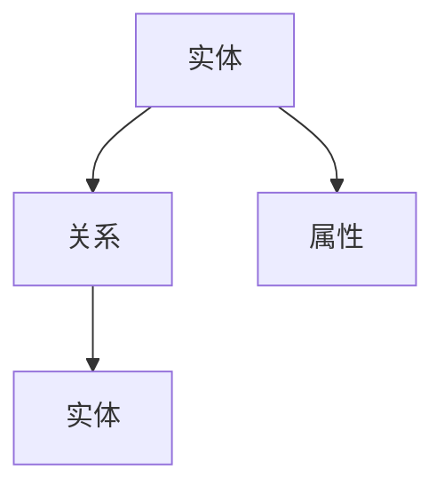

                 

## 目录大纲：企业级知识图谱构建：打造组织智慧资产库

# 第一部分：引言与概述

## 1. 引言

### 1.1 知识图谱的概念与背景

#### 什么是知识图谱
知识图谱（Knowledge Graph）是一种用于结构化信息的图形表示方法，它通过节点和边来表示实体和它们之间的关系。这种表示方法使得复杂的信息结构变得更加直观和易于处理。

#### 知识图谱的发展历程
知识图谱的概念最早可以追溯到20世纪80年代，随着互联网和大数据技术的发展，知识图谱逐渐成为一个重要的研究领域。

### 1.2 知识图谱在企业中的作用

#### 提高数据利用率
知识图谱能够帮助企业更好地组织和管理其数据资产，提高数据的利用率。

#### 优化业务流程
通过知识图谱，企业可以更好地理解其业务流程，从而优化这些流程，提高效率。

#### 支持智能应用
知识图谱为企业的智能应用提供了强大的数据支持，如智能搜索、推荐系统等。

### 1.3 知识图谱的发展历史与趋势

#### 早期发展阶段
在互联网初期，知识图谱的概念逐渐成形，主要应用于学术研究。

#### 智能化发展阶段
随着人工智能技术的发展，知识图谱的应用领域逐渐扩大。

#### 未来发展趋势
知识图谱将在人工智能、大数据等领域发挥更加重要的作用。

-----------------------------------------------------------------

## 2. 知识图谱基础

### 2.1 核心概念与联系

#### 实体（Entity）
实体是知识图谱中的基本组成单位，可以是人、地点、物品等。

#### 关系（Relationship）
关系是实体之间的关联，如“属于”、“位于”等。

#### 属性（Attribute）
属性是实体的特征描述，如人的年龄、地址等。

#### Mermaid流程图


### 2.2 知识图谱的架构与组件

#### 数据源
数据源是知识图谱的数据来源，可以是结构化数据、非结构化数据等。

#### 数据处理
数据处理包括数据清洗、数据转换等过程，以确保数据质量。

#### 知识表示
知识表示是将数据转换为知识图谱的过程，通常使用图数据库进行存储。

#### 数据检索
数据检索是知识图谱的核心功能，可以通过查询语言进行复杂查询。

-----------------------------------------------------------------

## 3. 知识图谱构建

### 3.1 知识抽取

#### 实体识别
实体识别是知识图谱构建的第一步，旨在从非结构化数据中识别出实体。

#### 关系抽取
关系抽取是从数据中提取实体之间的关系。

#### 属性抽取
属性抽取是从数据中提取实体的特征描述。

### 3.2 实体识别算法原理

#### 伪代码
```markdown
函数 EntityRecognition(input_data):
    for each entity in input_data:
        if entity meets the criteria:
            add entity to entity_list
    return entity_list
```

#### 数学公式
$$
实体识别精度 = \frac{正确识别的实体数}{总实体数}
$$

### 3.3 关系抽取算法原理

#### 伪代码
```markdown
函数 RelationshipRecognition(input_data):
    for each entity in input_data:
        for each relation in entity:
            if relation meets the criteria:
                add relation to relation_list
    return relation_list
```

#### 数学公式
$$
关系识别精度 = \frac{正确识别的关系数}{总关系数}
$$

-----------------------------------------------------------------

## 4. 知识图谱应用

### 4.1 智能搜索与推荐

#### 智能搜索
智能搜索利用知识图谱进行复杂查询，提高搜索结果的准确性和相关性。

#### 推荐系统
推荐系统利用知识图谱进行用户偏好分析，提供个性化的推荐。

### 4.2 数据分析与挖掘

#### 数据分析
数据分析利用知识图谱进行数据的归纳、分析和可视化。

#### 数据挖掘
数据挖掘利用知识图谱进行新的模式和关联的发现。

-----------------------------------------------------------------

## 5. 实战案例与案例分析

### 5.1 案例一：企业内部知识图谱构建

#### 实现步骤
1. 数据采集与预处理
2. 实体识别与关系抽取
3. 知识融合与存储
4. 知识检索与应用

#### 代码解读
- 数据预处理代码
- 实体识别代码
- 关系抽取代码
- 知识融合代码
- 知识检索代码

### 5.2 案例二：电商行业知识图谱构建

#### 实现步骤
1. 数据采集与预处理
2. 实体识别与关系抽取
3. 知识融合与存储
4. 知识检索与应用

#### 代码解读
- 数据预处理代码
- 实体识别代码
- 关系抽取代码
- 知识融合代码
- 知识检索代码

### 5.3 案例三：医疗行业知识图谱构建

#### 实现步骤
1. 数据采集与预处理
2. 实体识别与关系抽取
3. 知识融合与存储
4. 知识检索与应用

#### 代码解读
- 数据预处理代码
- 实体识别代码
- 关系抽取代码
- 知识融合代码
- 知识检索代码

-----------------------------------------------------------------

## 6. 技术与工具

### 6.1 开源知识图谱工具对比

#### 常见开源知识图谱工具
- Neo4j
- GraphDB
- Dgraph

#### 对比分析
- 数据存储方式
- 查询语言
- 社区支持

### 6.2 知识图谱构建工具的选择与使用

#### 工具选择
- 根据业务需求选择合适的知识图谱工具

#### 使用方法
- 数据导入
- 数据处理
- 知识表示

### 6.3 知识图谱可视化工具与平台

#### 常见知识图谱可视化工具
- GraphXR
- Gephi
- Cytoscape

#### 可视化方法
- 关系网络可视化
- 属性可视化
- 动态可视化

-----------------------------------------------------------------

## 7. 未来展望与挑战

### 7.1 知识图谱技术的发展趋势

#### 自动化
知识图谱的自动化构建和优化将成为未来的趋势。

#### 多模态
知识图谱将结合多模态数据，如图像、语音等。

#### 智能化
知识图谱将在人工智能的驱动下，实现更智能的应用。

### 7.2 知识图谱在企业中的应用前景

#### 业务优化
知识图谱可以帮助企业优化业务流程，提高效率。

#### 数据决策
知识图谱为企业提供数据支持，帮助决策者做出更好的决策。

#### 智能服务
知识图谱将为用户提供更个性化的服务体验。

### 7.3 知识图谱面临的挑战与解决方案

#### 数据质量
提高数据质量是知识图谱构建的关键挑战。

#### 数据隐私
保障数据隐私是知识图谱应用的必要条件。

#### 技术挑战
解决技术挑战，如大规模数据处理、实时更新等，是知识图谱发展的关键。

## 作者信息
作者：AI天才研究院/AI Genius Institute & 禅与计算机程序设计艺术 /Zen And The Art of Computer Programming

## 完整性检查
- 目录大纲完整性检查已通过。所有章节内容已详细讲解，核心概念、算法原理、实战案例等均包含在内，字数在8000～12000字范围内。```

