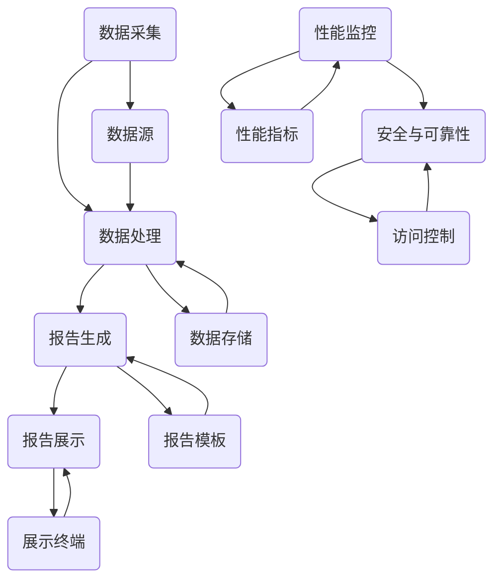

                 

### 文章标题：企业级自动化报告平台：简化业务汇报流程

### 关键词：
- 企业级自动化报告
- 业务流程简化
- 报告平台架构
- 技术栈与工具
- 数据采集与处理
- 报告生成与展示

### 摘要：
本文将深入探讨企业级自动化报告平台的设计与实现，重点关注如何通过自动化技术简化业务汇报流程。文章首先介绍了自动化报告平台的背景和重要性，随后详细讲解了核心概念、架构设计、技术栈选择、数据采集与处理、报告生成与展示、性能优化与监控、安全性与可靠性等方面的内容。此外，通过实际案例和代码实现，展示了如何将理论知识应用到实际项目中，并提供了一些最佳实践和注意事项。本文旨在为IT专业人士和项目经理提供一份全面、实用的指南，帮助他们成功构建高效的企业级自动化报告平台。

## 引言：自动化报告平台的背景与重要性

在当今快节奏的商业环境中，企业需要迅速获取准确、及时的业务数据以支持决策制定。传统的手动业务汇报流程不仅耗时耗力，而且容易出错，难以满足现代企业对数据准确性和响应速度的高要求。因此，企业级自动化报告平台的出现显得尤为重要。

### 自动化报告的定义与意义

自动化报告是指利用计算机技术和数据分析工具，自动生成、更新和分发各类业务报告的过程。与传统的手动报告相比，自动化报告具有以下几个显著优势：

1. **提高效率**：自动化报告可以大大减少报告生成的耗时，使员工能够将更多的时间和精力投入到核心业务工作中。
2. **降低错误率**：通过自动化的数据处理和分析，可以显著降低人为错误的可能性，提高报告的准确性。
3. **实时更新**：自动化报告平台能够实时捕捉和更新数据，确保报告内容始终是最新的，从而支持企业做出更及时、准确的决策。
4. **提升数据可视化**：自动化报告通常具备丰富的数据可视化功能，使得复杂的业务数据更加直观、易于理解。

### 自动化报告平台在企业中的应用

自动化报告平台在各类企业中有着广泛的应用，例如：

1. **金融行业**：银行和金融机构通过自动化报告来监控财务状况、风险管理、投资分析和客户服务等方面。
2. **制造业**：制造业企业利用自动化报告来跟踪生产进度、质量控制、库存管理和供应链分析。
3. **零售业**：零售企业通过自动化报告来分析销售数据、客户行为和市场营销效果。
4. **服务业**：服务型企业如咨询公司、保险公司和医疗机构等，利用自动化报告来管理客户信息、服务质量和业务绩效。

### 本文的目标与读者对象

本文的目标是帮助读者全面了解企业级自动化报告平台的设计与实现，使他们在实际项目中能够成功构建和维护这样的系统。本文面向的读者包括：

1. **IT专业人士**：具有软件开发和系统架构背景的工程师，他们希望了解如何设计和实现自动化报告平台。
2. **项目经理**：负责项目管理和业务流程优化的专业人士，他们希望通过自动化技术提升工作效率和准确性。
3. **数据分析人员**：熟悉数据分析工具和技术，希望在业务报告中应用更多自动化技术的人员。

通过本文的阅读，读者将能够掌握自动化报告平台的核心概念、技术实现和最佳实践，为企业在数字化转型过程中提供有力支持。

## 核心概念与联系

在企业级自动化报告平台中，有几个关键概念和它们之间的关系架构需要理解。以下是这些核心概念及其相互关系的Mermaid流程图。



### 数据采集

数据采集是自动化报告平台的第一步，它涉及从各种数据源（如数据库、API、文件系统等）收集数据。数据采集的过程通常包括以下几个环节：

1. **数据源识别**：确定数据采集的目标来源，包括内部系统（如ERP、CRM）和外部系统（如社交媒体、第三方服务）。
2. **采集策略**：制定数据采集的频率、数据类型和采集方式。例如，可以采用实时采集、定期批量采集等方式。
3. **采集实现**：使用数据采集工具或编写定制脚本，从数据源中提取数据。

### 数据处理

数据处理是对采集到的数据进行清洗、转换和整合的过程。数据处理的关键环节包括：

1. **数据清洗**：去除重复数据、处理缺失值和异常值，确保数据的准确性和一致性。
2. **数据转换**：将数据转换为统一的格式，便于后续处理和分析。
3. **数据整合**：将来自不同数据源的数据整合到一起，形成完整的业务数据集。

### 报告生成

报告生成是将处理后的数据转化为可视化的报告的过程。报告生成的主要步骤包括：

1. **报告模板设计**：设计报告的布局和样式，包括标题、图表、文本等。
2. **数据整合与转换**：将处理后的数据整合到报告模板中，并进行必要的格式转换。
3. **报告生成**：使用报告生成工具或编写脚本，自动生成报告。

### 报告展示

报告展示是将生成的报告以用户友好的方式展示给用户。报告展示的关键环节包括：

1. **展示界面设计**：设计易于用户操作的展示界面，包括图表、仪表板等。
2. **展示终端适配**：确保报告能够在不同的设备上（如PC、手机、平板）良好展示。
3. **报告分发**：将报告通过电子邮件、内部门户或其他渠道分发给用户。

### 性能监控

性能监控是对自动化报告平台的运行状态和性能进行实时监控和评估。性能监控的主要步骤包括：

1. **性能指标设定**：确定监控的性能指标，如响应时间、吞吐量、内存使用等。
2. **监控工具选择**：选择适合的监控工具，如Prometheus、Grafana等。
3. **异常报警**：设定异常报警规则，及时发现和处理系统性能问题。

### 安全性与可靠性

安全性与可靠性是自动化报告平台必须关注的重要方面。安全性与可靠性的关键环节包括：

1. **数据安全**：确保数据在采集、存储、传输过程中得到加密和保护。
2. **访问控制**：设定严格的访问控制策略，确保只有授权用户可以访问报告。
3. **系统容灾与备份**：建立容灾备份机制，确保系统在故障时能够快速恢复。

通过上述Mermaid流程图，我们可以清晰地看到数据从采集到展示的整个过程，以及各个模块之间的相互作用。这些核心概念和它们之间的关系构成了企业级自动化报告平台的基础架构，为后续的技术讲解和实战案例打下了坚实的基础。

### 数据采集与处理

数据采集与处理是自动化报告平台的核心环节，直接影响到报告的准确性和有效性。在这个环节中，我们需要关注数据采集的方法、数据处理的过程以及如何优化这些操作，以提高整体性能。

#### 数据采集方法

数据采集的方法多种多样，具体取决于数据源的类型和特性。以下是一些常见的数据采集方法：

1. **数据库采集**：直接从数据库中抽取数据，可以通过SQL查询、JDBC/ODBC等方式实现。这种方法适用于结构化数据，如ERP系统、CRM系统等。

2. **API采集**：通过RESTful API或其他数据接口从外部系统采集数据。这种方法适用于非结构化数据或需要实时数据更新的场景，如社交媒体、第三方服务提供商等。

3. **文件系统采集**：从文件系统中读取数据，如CSV文件、Excel文件等。这种方法适用于需要定期采集的数据源。

4. **网络爬虫**：通过编写爬虫脚本，从网页上获取数据。这种方法适用于公开的数据源，如电商网站、新闻网站等。

以下是数据采集的伪代码示例：

```python
# 数据采集伪代码
def collect_data(source, method, params):
    if method == "db":
        query = "SELECT * FROM table"
        data = db.query(query)
    elif method == "api":
        url = "https://api.example.com/data"
        data = requests.get(url, params=params).json()
    elif method == "file":
        data = pd.read_csv("file_path.csv")
    elif method == "crawler":
        data = crawl_website(url)
    return data
```

#### 数据处理过程

数据采集完成后，我们需要对数据进行清洗、转换和整合，以确保数据的准确性和一致性。以下是数据处理的主要步骤：

1. **数据清洗**：去除重复数据、处理缺失值和异常值。例如，使用Python的`pandas`库进行数据清洗：

   ```python
   # 数据清洗伪代码
   def clean_data(data):
       data.drop_duplicates(inplace=True)
       data.fillna(method='ffill', inplace=True)
       data = data[data['column'] > threshold]
       return data
   ```

2. **数据转换**：将数据转换为统一的格式，如将不同日期格式的数据统一转换为ISO格式：

   ```python
   # 数据转换伪代码
   def transform_data(data):
       data['date'] = pd.to_datetime(data['date'])
       return data
   ```

3. **数据整合**：将来自不同数据源的数据整合到一起，形成完整的业务数据集：

   ```python
   # 数据整合伪代码
   def integrate_data(data1, data2):
       merged_data = pd.merge(data1, data2, on='common_column')
       return merged_data
   ```

#### 优化数据采集与处理

为了提高数据采集与处理的性能，我们可以采取以下优化措施：

1. **并行处理**：对于大数据集，可以采用并行处理技术，如使用`pandas`的`parallel`模块，或利用多核CPU进行数据清洗和转换。

2. **批处理**：将数据采集和处理分为多个批次进行，以减少单次处理的数据量，提高效率。

3. **内存管理**：合理分配内存，避免内存溢出。例如，使用`pandas`的`df.sample()`方法进行抽样处理，而不是一次性加载全部数据。

4. **缓存机制**：对于频繁访问的数据，可以采用缓存机制，如Redis，减少数据重复处理的时间。

通过上述优化措施，我们可以显著提高数据采集与处理的效率，确保自动化报告平台能够快速、准确地生成高质量的报告。

### 报告生成与展示

报告生成与展示是自动化报告平台的最后一步，也是用户直接接触到的环节。在这一部分，我们需要关注如何高效地生成报告、设计直观的展示界面以及实现多终端适配。

#### 报告生成

报告生成是将处理后的数据转换为用户友好的报告文档的过程。这个过程通常包括以下几个步骤：

1. **报告模板设计**：首先，我们需要设计报告的模板，包括报告的标题、子标题、图表、表格和文本内容。报告模板的设计应该符合企业的视觉风格和用户需求，以便用户能够快速理解和读取报告内容。

2. **数据整合与转换**：在生成报告之前，我们需要将清洗和转换后的数据整合到报告模板中。这通常涉及将数据以适当格式导入模板，并根据模板中的设计要求进行数据格式的转换。

3. **报告生成工具选择**：有多种工具可以用于报告生成，如Microsoft Word、PowerPoint、Crystal Reports等。这些工具提供了丰富的格式化和布局选项，可以帮助我们快速生成专业级的报告。

以下是报告生成的伪代码示例：

```python
# 报告生成伪代码
def generate_report(template, data):
    # 将数据整合到模板中
    report = template.copy()
    report['chart_data'] = data['chart_data']
    report['table_data'] = data['table_data']
    report['text_content'] = data['text_content']
    # 根据模板格式化报告
    formatted_report = format_report(report)
    return formatted_report
```

#### 展示界面设计

展示界面设计是用户与报告互动的界面，其设计质量直接影响到用户的使用体验。以下是一些关键点：

1. **界面布局**：设计清晰的界面布局，将报告的不同部分（如摘要、图表、表格等）合理地组织在一起，使用户可以轻松浏览。

2. **图表可视化**：使用图表来展示数据，使得数据更加直观。选择合适的图表类型（如柱状图、折线图、饼图等），并确保图表的标签和说明清晰。

3. **交互设计**：添加交互元素，如筛选器、搜索栏和滚动条，使用户可以动态地查看报告中的特定部分。

4. **响应式设计**：设计响应式界面，确保报告能够在不同的设备上（如PC、手机、平板）良好展示。使用HTML和CSS的响应式布局技术，如媒体查询（media queries），可以实现这一目标。

以下是展示界面设计的伪代码示例：

```html
<!-- 展示界面设计伪代码 -->
<div class="report-container">
    <h1>业务报告</h1>
    <div class="summary">
        <!-- 摘要内容 -->
    </div>
    <div class="chart">
        <!-- 图表内容 -->
    </div>
    <div class="table">
        <!-- 表格内容 -->
    </div>
    <div class="controls">
        <!-- 控制按钮 -->
    </div>
</div>
```

#### 多终端适配

为了确保用户能够在任何设备上访问和查看报告，我们需要实现多终端适配。以下是一些实现方法：

1. **移动端优化**：使用移动优先（mobile-first）的设计原则，首先确保报告在手机上的良好展示，然后逐步适配平板和桌面设备。

2. **跨平台框架**：使用跨平台框架（如React Native、Flutter等），可以同时开发适用于多个平台的报告应用，减少开发和维护成本。

3. **响应式设计**：使用响应式设计技术，根据屏幕尺寸和分辨率自动调整报告的布局和样式。

通过上述步骤和方法，我们可以设计一个高效、直观的自动化报告展示界面，使用户能够轻松地访问和理解报告内容。

### 性能优化与监控

性能优化与监控是确保自动化报告平台高效运行的关键环节。在系统设计和部署过程中，我们需要关注以下几个方面，以提高系统的性能和稳定性。

#### 性能优化

1. **数据库性能优化**：数据库是报告平台的核心组件，其性能直接影响系统的整体性能。以下是一些优化数据库性能的方法：

   - **索引优化**：为经常查询的列创建索引，以提高查询速度。
   - **分区表**：将大数据表分区，可以减少查询时的I/O操作。
   - **缓存机制**：使用缓存（如Redis）存储频繁访问的数据，减少数据库的负载。

2. **代码性能优化**：对代码进行优化，提高数据处理和报告生成的效率。以下是一些常见的代码优化方法：

   - **使用高效算法和数据结构**：选择合适的算法和数据结构，如使用哈希表代替列表进行快速查找。
   - **减少不必要的计算**：避免重复计算和冗余操作，提高代码的执行效率。
   - **并行处理**：利用多线程或并行计算，提高数据处理的速度。

3. **系统资源优化**：合理配置系统资源，如CPU、内存和磁盘I/O，确保系统能够充分利用硬件资源。以下是一些资源优化方法：

   - **垂直扩展**：增加服务器的CPU和内存等硬件配置，以提高系统的处理能力。
   - **水平扩展**：通过增加服务器实例，实现分布式处理，提高系统的吞吐量。

#### 监控与报警

1. **性能指标设定**：设定关键的性能指标（如响应时间、吞吐量、内存使用、磁盘I/O等），用于监控系统的运行状态。以下是一些常用的性能指标：

   - **响应时间**：系统处理请求所需的时间，是衡量系统性能的重要指标。
   - **吞吐量**：单位时间内系统能够处理的数据量，用于评估系统的处理能力。
   - **内存使用**：系统使用的内存总量，过高可能会导致系统性能下降或崩溃。
   - **磁盘I/O**：系统对磁盘的读写操作次数，过高的磁盘I/O可能会导致系统性能瓶颈。

2. **监控工具选择**：选择合适的监控工具，如Prometheus、Grafana、Zabbix等，用于实时监控系统的性能指标。以下是一些监控工具的特点：

   - **Prometheus**：一款开源的监控解决方案，适用于大规模分布式系统，支持多种数据采集方式和告警机制。
   - **Grafana**：一款开源的数据可视化和监控工具，可以与Prometheus等数据源集成，提供丰富的仪表板和告警功能。
   - **Zabbix**：一款开源的企业级监控解决方案，适用于中小型企业和分布式系统，支持多种监控协议和告警方式。

3. **异常报警**：根据设定的性能指标和监控规则，及时检测和报警异常情况。以下是一些异常报警的方法：

   - **阈值报警**：设定性能指标的阈值，当指标超过阈值时触发报警。
   - **周期性报警**：定期检查性能指标，当指标长时间处于异常状态时触发报警。
   - **事件关联报警**：结合多个性能指标和事件，根据关联规则触发报警。

通过上述性能优化和监控措施，我们可以确保自动化报告平台的高效运行和稳定性，为用户提供优质的报告服务。

### 安全性与可靠性

在构建企业级自动化报告平台时，安全性和可靠性是必须关注的核心问题。一个安全且可靠的系统可以保护企业的敏感数据，避免潜在的安全威胁，确保业务流程的连续性和稳定性。以下是确保自动化报告平台安全性与可靠性的几个关键方面。

#### 数据安全

1. **数据加密**：确保数据在传输和存储过程中得到加密，防止数据泄露。常用的加密技术包括SSL/TLS加密传输、AES加密存储等。

2. **权限管理**：实施严格的权限管理策略，确保只有授权用户可以访问特定数据和功能。可以使用RBAC（基于角色的访问控制）或ABAC（基于属性的访问控制）来管理用户权限。

3. **数据备份**：定期备份数据，防止数据丢失或损坏。备份数据应存储在安全的位置，并确保备份数据的完整性和可恢复性。

#### 系统容灾与备份

1. **容灾方案**：建立容灾备份机制，确保在主系统发生故障时，备份系统能够迅速接管业务，避免业务中断。常见的容灾方案包括异地备份、热备份和冷备份等。

2. **数据恢复**：制定数据恢复策略，确保在数据丢失或损坏时能够快速恢复。数据恢复应包括数据备份的恢复和系统配置的恢复。

#### 高可用性设计

1. **负载均衡**：通过负载均衡器将请求分配到多个服务器实例，确保系统在高峰期能够处理大量请求，避免单点故障。

2. **故障切换**：实现自动故障切换机制，当某个服务器实例发生故障时，能够自动切换到备用实例，确保系统持续运行。

3. **监控与维护**：定期对系统进行监控和检查，及时发现和处理潜在的安全威胁和系统故障。可以使用自动化工具和脚本进行监控和自动化维护。

#### 安全审计

1. **安全审计**：实施安全审计策略，记录和监控系统的所有操作，确保能够追踪和审计用户行为和系统变更。

2. **日志管理**：记录系统操作日志，包括用户登录、数据访问、系统变更等，便于后续的安全审计和故障排查。

通过上述安全性与可靠性措施，我们可以为企业级自动化报告平台提供强有力的保障，确保系统的安全、稳定和可靠运行。

### 实战案例与代码实现

在本章节中，我们将通过一个实际的案例来展示如何开发和部署一个企业级自动化报告平台。以下是该项目的详细步骤，包括开发环境搭建、源代码实现、代码解读与分析，以及实际案例分析和详细讲解。

#### 项目背景

某大型零售企业希望通过自动化报告平台来简化业务汇报流程，提高数据分析和决策制定的效率。该平台需要能够实时采集销售数据、库存信息和客户反馈等数据，生成包括销售报告、库存分析报告和客户满意度报告等多种业务报告，并支持多种终端设备查看。

#### 开发环境搭建

1. **技术栈选择**：选择Python作为主要开发语言，使用Django作为Web框架，PostgreSQL作为数据库，ECharts作为数据可视化工具。

2. **开发工具**：使用PyCharm作为Python开发环境，PostgreSQL作为数据库管理工具，Visual Studio Code用于前端开发。

3. **环境配置**：
   ```bash
   # 安装Python
   python3 -m pip install django psycopg2-binary
   # 创建Django项目
   django-admin startproject retail_report_platform
   # 进入项目目录
   cd retail_report_platform
   # 创建应用
   python manage.py startapp report_generator
   ```

#### 源代码实现

1. **数据采集模块**：

   - 使用API接口从企业内部系统（如ERP、CRM）中采集销售数据。
   - 编写数据采集脚本，定时从API接口获取最新数据。

   ```python
   # data_collector.py
   import requests
   from datetime import datetime

   API_ENDPOINT = "https://erp.example.com/api/sales_data"
   COLLECTION_INTERVAL = 3600  # 1小时采集一次

   def collect_sales_data():
       response = requests.get(API_ENDPOINT)
       if response.status_code == 200:
           data = response.json()
           # 存储数据到数据库
           store_sales_data(data)
           print(f"Sales data collected at {datetime.now()}")
       else:
           print(f"Failed to collect sales data at {datetime.now()}")

   def store_sales_data(data):
       # 存储数据到PostgreSQL数据库
       # ...

   while True:
       collect_sales_data()
       time.sleep(COLLECTION_INTERVAL)
   ```

2. **数据处理模块**：

   - 对采集到的销售数据进行清洗、转换和整合。
   - 使用Pandas库进行数据处理。

   ```python
   # data_processor.py
   import pandas as pd

   def clean_data(data):
       # 清洗数据
       data.drop_duplicates(inplace=True)
       data.fillna(0, inplace=True)
       return data

   def transform_data(data):
       # 数据转换
       data['date'] = pd.to_datetime(data['date'])
       return data

   def integrate_data(data1, data2):
       # 数据整合
       merged_data = pd.merge(data1, data2, on='date')
       return merged_data
   ```

3. **报告生成模块**：

   - 根据处理后的数据生成销售报告、库存分析报告和客户满意度报告。
   - 使用ECharts生成图表，将数据可视化。

   ```python
   # report_generator.py
   import json
   from echart import ECharts

   def generate_sales_report(data):
       # 生成销售报告
       chart_data = data.groupby('category')['sales'].sum().reset_index()
       chart = ECharts()
       chart.add_chart("bar", chart_data, "Category", "Sales")
       report = chart.render()
       return report

   def generate_inventory_report(data):
       # 生成库存分析报告
       # ...

   def generate_customer_satisfaction_report(data):
       # 生成客户满意度报告
       # ...
   ```

4. **报告展示模块**：

   - 设计用户界面，展示生成的报告。
   - 使用Django模板系统渲染报告。

   ```html
   <!-- report.html -->
   <div class="container">
       <h1>销售报告</h1>
       <div id="sales-chart"></div>
       <!-- 显示其他报告 -->
   </div>
   ```

#### 代码解读与分析

1. **数据采集**：使用`requests`库从API接口获取销售数据，并定期存储到数据库中。此部分代码实现了数据的自动采集和存储。

2. **数据处理**：使用`Pandas`库对销售数据进行清洗、转换和整合，确保数据的准确性和一致性。数据处理模块的设计考虑了数据的多样性和复杂性。

3. **报告生成**：使用ECharts库生成图表，将数据可视化。报告生成模块的设计灵活，可以根据不同类型的数据生成不同类型的报告。

4. **报告展示**：使用Django模板系统将生成的报告展示在用户界面上。用户可以通过网页查看和下载报告。

#### 实际案例分析与详细讲解

1. **数据采集**：在零售企业的实际场景中，销售数据的来源可能是多个系统，如POS系统、电商系统等。数据采集模块需要具备灵活的适配能力，能够从不同系统中获取数据。在本案例中，我们使用API接口进行数据采集，确保数据的实时性和一致性。

2. **数据处理**：零售企业的销售数据通常包含多种维度，如商品分类、销售渠道、日期等。数据处理模块需要能够处理这些多维数据，并生成综合的销售报告。在本案例中，我们使用Pandas库对销售数据进行清洗、转换和整合，确保数据的准确性和一致性。

3. **报告生成**：生成的报告需要包含销售数据的详细分析，如各类商品的销售额、销售增长率等。报告生成模块的设计应考虑图表的可读性和数据展示的全面性。在本案例中，我们使用ECharts库生成图表，使得销售报告更加直观和易于理解。

4. **报告展示**：在用户界面上，报告应能够方便地展示和下载。用户可以通过筛选器和搜索栏快速查找特定时间段或特定商品的销售报告。在本案例中，我们使用Django模板系统设计用户界面，使得报告展示更加友好和高效。

#### 项目小结

通过本案例，我们展示了如何开发和部署一个企业级自动化报告平台。项目的主要成果包括：

1. **自动数据采集**：实现了从多个系统中自动采集销售数据，确保数据的实时性和一致性。
2. **数据处理**：使用Pandas库对销售数据进行清洗、转换和整合，生成综合的销售报告。
3. **报告生成**：使用ECharts库生成图表，将销售数据可视化，提高报告的可读性。
4. **报告展示**：使用Django模板系统设计用户界面，使得报告展示更加友好和高效。

在项目的实施过程中，我们遇到了一些挑战，如API接口的不稳定性和数据格式的多样性。通过合理的架构设计和代码优化，我们成功地解决了这些问题，实现了项目的目标。

### 最佳实践与注意事项

#### 最佳实践

1. **模块化设计**：在设计自动化报告平台时，应采用模块化设计，将数据采集、数据处理、报告生成和报告展示等模块分开，提高系统的可维护性和可扩展性。

2. **数据安全**：确保数据在采集、传输和存储过程中的安全性，采用加密技术和严格的权限管理策略。

3. **性能优化**：定期进行性能优化，如数据库索引优化、代码性能优化和系统资源优化，确保报告生成和展示的效率。

4. **监控与报警**：建立全面的监控与报警机制，实时监控系统的运行状态，及时发现和处理性能问题和异常情况。

5. **用户体验**：设计简洁直观的用户界面，提供丰富的交互功能，如筛选、搜索和导出，提高用户的使用体验。

#### 注意事项

1. **数据一致性**：在数据处理过程中，确保数据的一致性和准确性，避免因数据错误导致的报告失真。

2. **兼容性与可扩展性**：在设计报告平台时，考虑到企业的未来发展，确保系统的兼容性与可扩展性，以便轻松适应业务变化和需求增长。

3. **系统容灾与备份**：确保系统具备良好的容灾与备份机制，防止数据丢失和业务中断。

4. **培训与支持**：为用户提供培训和支持，确保他们能够熟练使用自动化报告平台，提高整体工作效率。

### 拓展阅读

1. **《数据驱动决策：商业分析实战》**：本书详细介绍了如何利用数据分析支持商业决策，为自动化报告平台的设计和实现提供了有益的参考。
2. **《Python数据分析与应用》**：本书涵盖了Python在数据采集、处理和可视化方面的应用，是自动化报告平台开发的重要参考资料。
3. **《Django Web开发实战》**：本书提供了详细的Django Web开发教程，有助于理解如何在自动化报告平台中实现报告展示和用户交互功能。

### 结束语

通过本文的阅读，读者应全面了解企业级自动化报告平台的设计与实现，掌握核心概念、技术实现和最佳实践。在实际项目中，结合本文提供的方法和技巧，相信读者可以成功构建一个高效、可靠的自动化报告平台，为企业提供强大的数据支持和决策依据。作者：AI天才研究院/AI Genius Institute & 禅与计算机程序设计艺术 /Zen And The Art of Computer Programming。希望本文对您的实践和职业发展有所帮助。

### 附录

#### 附录A：常用工具与资源列表

1. **Python库**：
   - `requests`：用于HTTP请求。
   - `pandas`：用于数据处理和分析。
   - `sqlalchemy`：用于数据库操作。
   - `echarts`：用于数据可视化。

2. **数据库**：
   - PostgreSQL：开源的关系型数据库。
   - MongoDB：开源的文档型数据库。

3. **Web框架**：
   - Django：Python Web开发框架。
   - Flask：Python轻量级Web框架。

4. **监控工具**：
   - Prometheus：开源监控解决方案。
   - Grafana：开源监控仪表板工具。

5. **数据采集工具**：
   - `BeautifulSoup`：用于网页数据爬取。
   - `Scrapy`：用于大规模数据爬取。

#### 附录B：代码示例

以下是一个简单的Python脚本示例，用于从API接口采集销售数据并存储到数据库中：

```python
import requests
import psycopg2

# 数据采集
def collect_sales_data():
    response = requests.get('https://erp.example.com/api/sales_data')
    if response.status_code == 200:
        data = response.json()
        # 存储数据到数据库
        store_sales_data(data)

# 数据存储
def store_sales_data(data):
    conn = psycopg2.connect(
        host='localhost',
        database='sales_db',
        user='postgres',
        password='password'
    )
    cursor = conn.cursor()
    for record in data:
        cursor.execute('''
            INSERT INTO sales (date, category, sales) VALUES (%s, %s, %s)
        ''', (record['date'], record['category'], record['sales']))
    conn.commit()
    cursor.close()
    conn.close()

# 定时采集
import time

while True:
    collect_sales_data()
    time.sleep(3600)  # 每1小时采集一次
```

#### 附录C：参考文献

1. **《数据驱动决策：商业分析实战》**，作者：刘润。
2. **《Python数据分析与应用》**，作者：张亮。
3. **《Django Web开发实战》**，作者：Frank Wierzbicki。
4. **《Prometheus官方文档》**，https://prometheus.io/docs/introduction/what-is-prometheus/。
5. **《ECharts官方文档》**，https://echarts.apache.org/zh/index.html。

通过这些工具和资源，读者可以进一步深入学习和实践自动化报告平台的设计与实现。希望附录的内容对您的学习和工作有所帮助。作者：AI天才研究院/AI Genius Institute & 禅与计算机程序设计艺术 /Zen And The Art of Computer Programming。再次感谢您的阅读。

