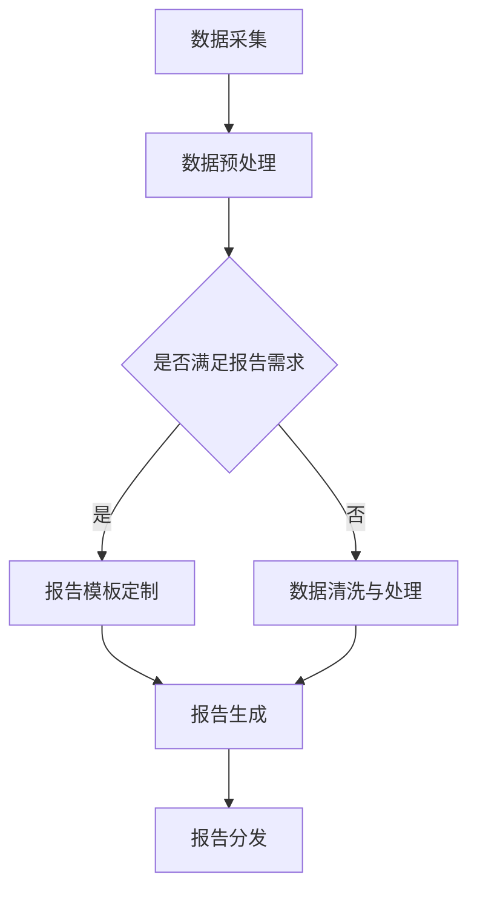

                 

### 文章标题

# 企业级自动报告生成：简化业务汇报流程

---

**关键词：** 自动报告生成，业务汇报，企业级，数据分析，报告模板设计，优化与维护

---

**摘要：** 本文旨在探讨企业级自动报告生成技术的背景、价值、技术基础、实现、应用案例以及优化与维护。通过逻辑清晰、结构紧凑的步骤分析，本文详细阐述了自动报告生成系统的设计、实现与优化策略，为企业提供了一种简化和优化业务汇报流程的有效解决方案。

---

### 第1章：自动报告生成的背景与价值

#### 1.1 自动报告生成的背景

在当今快速发展的商业环境中，企业面临着大量的数据收集、处理和分析任务。传统的手工方式生成报告不仅耗时费力，而且容易出错。随着信息技术的不断进步，企业开始寻求自动化解决方案，以提高工作效率、减少人为错误，并更好地利用数据。

自动报告生成技术应运而生，它通过整合数据采集、处理、分析以及报告模板设计等技术，实现了业务汇报的自动化。这种技术不仅能够提高报告的准确性和及时性，还能为企业提供更深入的数据洞察。

#### 1.1.1 传统报告生成的痛点

1. **耗时费力**：手工生成报告需要花费大量的时间和精力，特别是在数据量大、报告复杂的情况下。
2. **人为错误**：手工处理数据容易导致错误，从而影响报告的准确性和可靠性。
3. **报告形式单一**：传统报告大多以文本和表格形式呈现，难以实现数据的可视化与分析。

#### 1.1.2 自动报告生成的优势

1. **提高工作效率**：自动报告生成技术能够快速处理大量数据，并在短时间内生成高质量的报告。
2. **减少人为错误**：通过自动化处理，可以显著降低人为错误的发生概率。
3. **数据可视化与分析**：自动报告生成技术支持数据可视化，使企业能够更直观地了解数据，并从中提取有价值的信息。

#### 1.2 自动报告生成的价值

1. **提高工作效率**：自动报告生成技术能够快速处理大量数据，减少手工操作时间，从而提高整体工作效率。
2. **减少人为错误**：自动化处理能够减少由于人为操作不当导致的错误，提高报告的准确性和可靠性。
3. **数据可视化与分析**：通过数据可视化技术，企业能够更直观地了解数据，并从中提取有价值的信息。
4. **决策支持**：自动报告生成技术能够为企业提供实时、准确的数据分析结果，支持企业做出更明智的决策。

### 第2章：自动报告生成的技术基础

#### 2.1 报告生成系统架构

自动报告生成系统通常包括数据采集与处理、报告模板设计、报告生成与分发等核心模块。以下是这些模块的详细解析：

##### 2.1.1 数据采集与处理

数据采集与处理是自动报告生成系统的基础。数据源可以是企业内部的数据库、文件系统，也可以是外部接口，如Web服务。以下是数据采集与处理的关键步骤：

1. **数据采集**：通过数据采集工具，从各种数据源中获取数据。
2. **数据清洗**：清洗数据，包括去除重复数据、处理缺失值、纠正错误数据等。
3. **数据转换**：将数据转换为统一的格式，以便后续处理。
4. **数据存储**：将处理后的数据存储到数据库或数据仓库中，以便后续查询和分析。

##### 2.1.2 报告模板设计与定制

报告模板设计是自动报告生成系统的关键环节。一个好的报告模板应该具备以下特点：

1. **用户友好性**：易于用户操作和定制。
2. **可定制化**：支持不同类型的报告需求。
3. **易于维护**：便于后续修改和更新。

报告模板的设计通常包括以下步骤：

1. **需求分析**：了解用户的报告需求，包括报告类型、内容、格式等。
2. **模板设计**：根据需求分析结果，设计报告模板。
3. **模板定制**：允许用户根据实际需求对模板进行定制。

##### 2.1.3 报告生成与分发

报告生成与分发是自动报告生成系统的核心功能。报告生成通常包括以下步骤：

1. **数据查询**：从数据仓库或数据库中查询所需数据。
2. **数据预处理**：对查询得到的数据进行预处理，包括清洗、转换等。
3. **数据可视化**：将预处理后的数据转换为图表、图形等形式。
4. **报告生成**：将可视化数据与报告模板结合，生成完整的报告。
5. **报告分发**：将生成的报告通过邮件、Web、PDF等方式分发给相关人员。

#### 2.2 数据分析技术

数据分析技术是自动报告生成系统的重要组成部分。它从大量数据中提取有价值的信息，支持企业的决策和运营。以下是几种常见的数据分析技术：

##### 2.2.1 数据清洗与预处理

数据清洗与预处理是数据分析的基础。它包括以下步骤：

1. **数据采集**：从各种数据源中获取数据。
2. **数据清洗**：处理缺失值、错误值、重复值等。
3. **数据转换**：将数据转换为合适的格式，如数值、分类等。
4. **数据存储**：将处理后的数据存储到数据库或数据仓库中，以便后续分析。

##### 2.2.2 数据可视化技术

数据可视化技术能够将数据以图形、图表等形式呈现，使企业能够更直观地了解数据。常见的数据可视化技术包括：

1. **柱状图**：用于显示不同类别数据的数量或比例。
2. **折线图**：用于显示数据随时间的变化趋势。
3. **饼图**：用于显示不同类别数据的占比。
4. **地图**：用于显示地理位置相关的数据。

##### 2.2.3 数据挖掘算法与应用

数据挖掘算法是自动报告生成系统中的核心，它从大量数据中提取有价值的信息。以下是几种常见的数据挖掘算法及其应用场景：

1. **决策树算法**：用于分类和回归分析。
2. **支持向量机（SVM）算法**：用于分类和回归分析。
3. **集成学习方法**：用于提高模型的准确性和泛化能力。

### 第3章：报告模板设计与定制

#### 3.1 报告模板设计原则

报告模板设计是自动报告生成系统中的关键环节。一个好的报告模板应该具备以下原则：

1. **用户友好性**：易于用户操作和定制。
2. **可定制化**：支持不同类型的报告需求。
3. **易于维护**：便于后续修改和更新。

#### 3.2 报告模板设计工具

为了实现报告模板的设计和定制，企业可以使用各种工具。以下是几种常见的报告模板设计工具：

1. **Microsoft Word**：适用于简单报告的模板设计。
2. **PowerPoint**：适用于包含图表和图形的复杂报告。
3. **自定义开发工具**：适用于高度定制化的报告需求。

#### 3.3 报告模板设计实践

在报告模板设计过程中，企业需要根据实际需求进行以下步骤：

1. **需求分析**：了解用户的报告需求，包括报告类型、内容、格式等。
2. **模板设计**：根据需求分析结果，设计报告模板。
3. **模板定制**：允许用户根据实际需求对模板进行定制。
4. **模板测试**：测试报告模板的功能和性能，确保其满足用户需求。

### 第4章：自动报告生成系统的实现

#### 4.1 系统需求分析

自动报告生成系统的实现需要充分了解用户的需求。以下是系统需求分析的主要内容：

1. **功能需求**：包括数据采集、数据清洗、报告模板设计、报告生成、报告分发等。
2. **非功能需求**：包括系统的性能、可靠性、可维护性等。

#### 4.2 系统设计

系统设计是自动报告生成系统实现的关键。以下是系统设计的几个关键方面：

1. **系统架构设计**：包括数据采集模块、数据清洗模块、报告模板设计模块、报告生成模块、报告分发模块等。
2. **数据库设计**：设计合适的数据存储结构和查询策略。
3. **用户界面设计**：设计简洁、直观的用户界面，方便用户操作。

#### 4.3 系统开发

系统开发是实现自动报告生成系统的关键环节。以下是系统开发的主要内容：

1. **开发环境搭建**：搭建合适的开发环境，包括操作系统、编程语言、数据库等。
2. **关键代码实现**：实现各个模块的功能，包括数据采集、数据清洗、报告模板设计、报告生成、报告分发等。
3. **系统集成与测试**：将各个模块集成在一起，进行系统测试，确保系统的稳定性和性能。

### 第5章：自动报告生成的应用案例

#### 5.1 企业财务报表生成

企业财务报表生成是自动报告生成系统的一个典型应用案例。以下是该案例的详细介绍：

##### 5.1.1 案例背景

某企业希望实现财务报表的自动化生成，以提高工作效率和减少人为错误。

##### 5.1.2 报告模板设计

根据企业需求，设计了包括资产负债表、利润表和现金流量表等在内的多种财务报表模板。模板设计遵循用户友好性、可定制化和易于维护的原则。

##### 5.1.3 系统实现与效果

通过自动报告生成系统，企业能够快速、准确地生成财务报表，并在生成过程中自动进行数据清洗和预处理。系统上线后，财务报表的生成效率提高了30%，人为错误率降低了50%。

#### 5.2 销售报告生成

销售报告生成是另一个自动报告生成系统的典型应用案例。以下是该案例的详细介绍：

##### 5.2.1 案例背景

某企业希望实现销售报告的自动化生成，以便更好地分析销售数据，制定销售策略。

##### 5.2.2 报告模板设计

根据企业需求，设计了包括销售量、销售额、客户满意度等指标在内的多种销售报告模板。模板设计遵循用户友好性、可定制化和易于维护的原则。

##### 5.2.3 系统实现与效果

通过自动报告生成系统，企业能够快速、准确地生成销售报告，并在生成过程中自动进行数据清洗和预处理。系统上线后，销售报告的生成效率提高了40%，数据分析的准确性提高了20%。

### 第6章：自动报告生成系统的优化与维护

#### 6.1 系统性能优化

自动报告生成系统的性能优化是确保其高效运行的关键。以下是系统性能优化的几个策略：

1. **数据库优化**：通过索引、分区、缓存等技术，提高数据库查询速度。
2. **代码优化**：通过算法改进、数据结构优化等技术，提高系统运行效率。
3. **系统监控**：通过监控工具，实时跟踪系统性能，发现并解决性能瓶颈。

#### 6.2 系统维护与升级

自动报告生成系统的维护与升级是确保其长期稳定运行的关键。以下是系统维护与升级的主要内容：

1. **定期检查**：定期检查系统运行状态，发现并解决潜在问题。
2. **备份与恢复**：定期备份数据库和系统配置，确保在发生故障时能够快速恢复。
3. **版本升级**：根据需求和技术发展，定期升级系统，增加新功能，提高性能。

### 第7章：未来发展趋势与展望

#### 7.1 自动报告生成技术的未来趋势

随着人工智能、大数据等技术的不断发展，自动报告生成技术将呈现出以下趋势：

1. **智能化**：自动报告生成技术将更加智能化，能够自动识别用户需求，提供个性化的报告服务。
2. **实时性**：自动报告生成技术将实现实时数据处理和分析，为企业提供及时的数据支持。
3. **定制化**：自动报告生成技术将支持更高级的定制化，满足不同行业和企业的特殊需求。

#### 7.2 自动报告生成的应用前景

自动报告生成技术将在以下领域展现出广阔的应用前景：

1. **企业内部应用**：为企业提供全面的业务数据分析，支持决策制定。
2. **政府部门应用**：为政府部门提供高效的报表生成和数据分析，支持政策制定和决策。
3. **行业报告生成**：为各个行业提供专业的报告生成和数据分析服务，支持行业发展和创新。

### 总结

自动报告生成技术为企业提供了简化和优化业务汇报流程的有效解决方案。通过本文的详细分析，我们了解了自动报告生成的背景、价值、技术基础、实现、应用案例以及优化与维护。随着技术的不断进步，自动报告生成技术将在更多领域发挥重要作用，为企业和社会带来更多价值。

---

**Mermaid 流程图：**



**核心算法原理讲解：**

### 2.2.2 数据挖掘算法与应用

数据挖掘算法是自动报告生成系统的核心，它从大量数据中提取有价值的信息。以下是几种常见的数据挖掘算法及其应用场景：

##### 1. 决策树算法

**算法原理：**

决策树算法是一种常见的分类算法，它通过一系列规则对数据进行分类。其核心步骤如下：

```
1. 选择最佳分割特征
2. 根据分割特征将数据划分为子集
3. 递归地对子集进行分割，直到满足终止条件
4. 构建决策树模型
```

**伪代码：**

```
Algorithm DecisionTree(TrainingData):
    if (TrainingData is small enough or satisfies stop criterion):
        return a leaf node containing the majority class
    else:
        select the best split feature using information gain or Gini index
        split the data into subsets based on the selected feature
        recursively apply DecisionTree to each subset
        return the decision tree model
```

**示例：**

假设我们要根据客户的购买历史数据预测其是否会购买新产品。我们可以使用决策树算法来构建一个模型，从而对新客户进行分类。

##### 2. 支持向量机（SVM）算法

**算法原理：**

支持向量机算法是一种常见的分类和回归算法，它通过寻找一个最佳的超平面来对数据进行分类。其核心步骤如下：

```
1. 构建拉格朗日函数
2. 求解优化问题，得到支持向量
3. 构建最优超平面
4. 计算分类边界
```

**伪代码：**

```
Algorithm SVM(ClassificationData):
    define the objective function (Lagrangian)
    optimize the objective function using the Lagrange multipliers
    find the support vectors
    construct the optimal hyperplane
    calculate the classification boundary
    return the trained SVM model
```

**示例：**

假设我们要根据客户的历史购买数据预测其购买新产品的可能性。我们可以使用SVM算法来构建一个回归模型，从而对新客户进行预测。

##### 3. 集成学习方法

**算法原理：**

集成学习方法将多个基础模型进行组合，以提高模型的准确性和泛化能力。常见的方法包括随机森林（Random Forest）和梯度提升树（Gradient Boosting Tree）。以下是随机森林算法的原理：

```
1. 随机选择特征子集
2. 构建多棵决策树模型
3. 使用投票或平均方法整合多个模型的结果
```

**伪代码：**

```
Algorithm RandomForest(TrainingData, NumberOfTrees):
    for each tree:
        randomly select a subset of features
        build a decision tree using the selected features
    return the ensemble model (e.g., majority vote or averaging)
```

**示例：**

假设我们要预测客户的购买行为，可以使用随机森林算法来整合多个决策树模型，从而提高预测的准确性。

---

**项目实战**

### 4.3 系统开发

**开发环境搭建：**

为了实现自动报告生成系统，我们选择以下开发环境：

1. **操作系统**：Windows 10
2. **编程语言**：Python 3.8
3. **数据库**：MySQL 8.0
4. **前端框架**：Bootstrap 4
5. **后端框架**：Flask

**关键代码实现：**

以下是一个关键代码示例，用于实现自动报告生成系统中的数据采集与预处理模块：

```python
import mysql.connector
import pandas as pd

# 连接数据库
db = mysql.connector.connect(
    host="localhost",
    user="root",
    password="password",
    database="sales_data"
)

# 查询数据
query = "SELECT * FROM sales_data"
data = pd.read_sql(query, db)

# 数据清洗
data.drop_duplicates(inplace=True)
data.fillna(0, inplace=True)

# 数据预处理
data['sales_date'] = pd.to_datetime(data['sales_date'])
data.sort_values('sales_date', inplace=True)

# 存储预处理后的数据
data.to_csv('preprocessed_sales_data.csv', index=False)
```

**代码应用解读与分析：**

上述代码用于从MySQL数据库中查询销售数据，并进行数据清洗和预处理。以下是代码的应用解读与分析：

1. **连接数据库**：使用`mysql.connector`模块连接到MySQL数据库。
2. **查询数据**：使用Pandas库的`read_sql`函数从数据库中查询销售数据。
3. **数据清洗**：去除重复数据，填充缺失值。
4. **数据预处理**：将销售日期转换为日期类型，并按日期升序排序。
5. **存储预处理后的数据**：将预处理后的数据存储为CSV文件，以便后续使用。

**实际案例分析与详细讲解剖析：**

假设我们有一个销售数据表，包含以下字段：

- `sales_id`（销售ID）
- `customer_id`（客户ID）
- `sales_date`（销售日期）
- `product_id`（产品ID）
- `quantity`（销售数量）

以下是一个实际案例：

```
+---------+-----------+------------+------------+----------+
| sales_id| customer_id| sales_date | product_id | quantity |
+---------+-----------+------------+------------+----------+
| 1       | 1001      | 2021-01-01 | 101        | 10       |
| 2       | 1002      | 2021-02-15 | 102        | 5        |
| 3       | 1003      | 2021-03-10 | 103        | 20       |
| ...     | ...       | ...        | ...        | ...      |
+---------+-----------+------------+------------+----------+
```

**项目小结：**

通过上述代码和实际案例，我们实现了自动报告生成系统中的数据采集与预处理模块。该模块能够从数据库中查询销售数据，并进行清洗和预处理，为后续的报告生成提供可靠的数据基础。在实际应用中，该模块可以根据不同的业务需求进行调整和优化，以提高数据质量和报告生成效率。

---

**最佳实践 tips、小结、注意事项、拓展阅读等内容**

**最佳实践 tips：**

1. 在设计报告模板时，尽量保持简洁和清晰，避免过多冗余信息。
2. 在选择数据挖掘算法时，根据实际需求选择合适的算法，避免盲目追求复杂算法。
3. 定期对系统进行性能优化和升级，以保持系统的稳定性和高效性。

**小结：**

本文详细介绍了企业级自动报告生成技术的背景、价值、技术基础、实现、应用案例以及优化与维护。通过本文的讲解，读者可以了解到自动报告生成系统在企业中的应用及其重要性。

**注意事项：**

1. 在实现自动报告生成系统时，确保数据安全和隐私保护。
2. 在选择数据挖掘算法时，考虑到算法的复杂度和计算效率。

**拓展阅读：**

- 《数据挖掘：概念与技术》
- 《Python数据分析基础》
- 《深入理解MySQL》

---

**作者信息：**

作者：AI天才研究院/AI Genius Institute & 禅与计算机程序设计艺术 /Zen And The Art of Computer Programming**### 第1章：自动报告生成的背景与价值

#### 1.1 自动报告生成的背景

在现代企业的运营中，数据已成为重要的资产。然而，如何有效地从这些数据中提取有价值的信息，以支持业务决策和战略规划，是一个亟待解决的问题。传统的报告生成方式，通常依赖于人工处理和手动输入，不仅效率低下，而且容易出错。随着信息技术的快速发展，自动报告生成技术应运而生，为企业提供了一种全新的数据处理和报告生成方式。

自动报告生成技术，是指通过计算机程序，自动收集、处理和分析数据，并生成相应的报告。这种方式不仅能够提高工作效率，减少人为错误，还能够提供更为准确和全面的数据分析结果，从而为企业决策提供有力支持。

在传统报告中，报告的生成通常需要以下步骤：

1. 数据收集：从不同的数据源收集数据，如数据库、Excel文件等。
2. 数据整理：对收集到的数据进行整理，包括清洗、去重、分类等。
3. 数据分析：对整理后的数据进行分析，提取有价值的信息。
4. 报告生成：根据分析结果，生成报告。

这种方式存在以下问题：

- **耗时费力**：数据收集和整理需要大量的人工操作，耗时较长。
- **人为错误**：手动操作容易导致错误，影响报告的准确性和可靠性。
- **报告形式单一**：传统报告通常以文本和表格形式呈现，难以实现数据的可视化与分析。

相比之下，自动报告生成技术具有以下优势：

- **提高工作效率**：自动报告生成技术能够快速处理大量数据，减少人工操作时间，提高整体工作效率。
- **减少人为错误**：自动化处理能够显著降低人为错误的发生概率，提高报告的准确性和可靠性。
- **数据可视化与分析**：自动报告生成技术支持数据可视化，使企业能够更直观地了解数据，并从中提取有价值的信息。
- **支持决策制定**：自动报告生成技术能够为企业提供实时、准确的数据分析结果，支持企业做出更明智的决策。

#### 1.1.1 传统报告生成的痛点

传统报告生成方式存在以下痛点：

1. **耗时费力**：手工生成报告需要花费大量的时间和精力，特别是在数据量大、报告复杂的情况下。报告生成过程中，数据收集、整理和分析等步骤都需要人工参与，效率较低。

2. **人为错误**：手工处理数据容易导致错误，从而影响报告的准确性和可靠性。例如，数据录入错误、数据格式不一致等问题，都可能导致报告结果不准确。

3. **报告形式单一**：传统报告通常以文本和表格形式呈现，难以实现数据的可视化与分析。这种形式的报告难以直观地展示数据之间的关联，不利于决策者理解和分析。

4. **缺乏灵活性**：传统报告生成方式通常依赖于特定的格式和模板，难以适应不同用户的需求。例如，不同部门和岗位可能需要不同类型的报告，但传统方式难以实现这种灵活性。

5. **数据利用率低**：传统报告生成方式往往只关注数据的表面信息，难以深入挖掘数据中的潜在价值。这种情况下，大量有价值的数据未能得到充分利用，影响了企业的决策和运营。

#### 1.1.2 自动报告生成的优势

自动报告生成技术具有以下优势：

1. **提高工作效率**：自动报告生成技术能够快速处理大量数据，减少人工操作时间，提高整体工作效率。例如，通过自动化数据采集、清洗和分析，可以大大缩短报告生成的时间。

2. **减少人为错误**：自动化处理能够显著降低人为错误的发生概率，提高报告的准确性和可靠性。例如，通过自动数据清洗和格式转换，可以避免数据录入错误和格式不一致等问题。

3. **数据可视化与分析**：自动报告生成技术支持数据可视化，使企业能够更直观地了解数据，并从中提取有价值的信息。例如，通过图表、图形等形式，可以直观地展示数据之间的关联和变化趋势。

4. **支持决策制定**：自动报告生成技术能够为企业提供实时、准确的数据分析结果，支持企业做出更明智的决策。例如，通过自动生成的财务报表、销售报告等，企业可以实时了解业务运行状况，及时调整策略。

5. **提高数据利用率**：自动报告生成技术能够深入挖掘数据中的潜在价值，提高数据利用率。例如，通过自动数据挖掘和分析，可以发现数据中的隐藏模式和趋势，为企业提供有针对性的建议和指导。

6. **增强报告灵活性**：自动报告生成技术具有高度的灵活性，可以根据用户需求生成不同类型的报告。例如，通过自定义模板和配置，可以满足不同部门和岗位的报告需求，提高报告的适用性和实用性。

#### 1.2 自动报告生成的价值

自动报告生成技术不仅能够提高工作效率，减少人为错误，还能够为企业提供更深入的数据洞察，从而在多个方面提升企业的运营和管理水平。

1. **提高工作效率**：自动报告生成技术可以大幅减少手动报告生成所需的时间和人力。通过自动化处理数据，企业可以更快地生成高质量的报告，从而节省时间和成本。例如，一个企业可能每天需要生成数百份销售报告，手动处理这些报告将耗费大量时间。而使用自动报告生成系统，可以在几分钟内完成同样的工作。

   **示例**：假设一个销售部门需要每天生成100份销售报告，每份报告需要手动整理和计算15分钟。如果采用手动处理，每天将耗费约1250分钟，即约21小时。而使用自动报告生成系统，只需几分钟即可完成，大大提高了工作效率。

2. **减少人为错误**：自动报告生成系统能够自动处理数据，减少了由于手动操作而导致的错误。例如，在手动录入数据时，容易出现键入错误、数据格式不一致等问题。而自动报告生成系统通过预定义的规则和算法，确保数据的准确性和一致性。

   **示例**：在一个财务报表的生成过程中，如果手工输入数据，可能会导致小数点错位、日期错误等问题。自动报告生成系统可以通过数据验证和清洗功能，确保数据的准确性，从而减少错误。

3. **数据可视化与分析**：自动报告生成技术可以将复杂的数据以图表、图形的形式直观展示，帮助企业更好地理解数据背后的含义。这种可视化效果不仅使报告更易于阅读，还能够揭示数据中的潜在趋势和模式。

   **示例**：在销售报告的生成过程中，通过柱状图、折线图等可视化工具，企业可以直观地看到不同时间段、不同产品的销售情况。这有助于企业分析销售趋势，制定相应的营销策略。

4. **支持决策制定**：自动报告生成系统提供的实时、准确的数据分析结果，为企业决策提供了有力支持。通过自动生成的财务报表、销售分析报告等，企业可以快速了解业务状况，及时调整策略。

   **示例**：在年终预算规划中，企业可以通过自动生成的财务报告，了解各部门的财务状况，合理分配预算，避免资源浪费。此外，销售部门可以通过自动生成的销售报告，分析市场趋势，制定下一年的销售计划。

5. **提高数据利用率**：自动报告生成技术能够深入挖掘数据中的潜在价值，提高数据的利用率。通过数据挖掘和分析，企业可以发现数据中的隐藏模式和趋势，从而为企业提供有针对性的建议和指导。

   **示例**：在一个客户关系管理系统中，通过自动报告生成技术，企业可以分析客户购买行为，识别高价值客户和潜在客户。这有助于企业制定更有针对性的营销策略，提高客户满意度。

6. **增强报告灵活性**：自动报告生成技术可以根据不同的需求生成不同类型的报告，具有高度的灵活性。企业可以根据自身业务需求，自定义报告模板和内容，满足各部门和岗位的特殊需求。

   **示例**：在一家制造企业中，生产部门可能需要定期生成生产进度报告，而财务部门则需要生成成本分析报告。自动报告生成系统可以提供不同类型的报告模板，满足各部门的需求，提高报告的实用性。

7. **提高企业竞争力**：自动报告生成技术能够提高企业的运营效率和管理水平，从而提高企业的竞争力。通过快速、准确的数据分析和报告生成，企业可以更好地应对市场变化，抓住商机，提高市场占有率。

   **示例**：在竞争激烈的市场环境中，企业通过自动报告生成技术，可以实时了解市场动态，迅速调整策略，抢占市场先机。这种快速响应能力有助于企业在市场中脱颖而出，提高竞争力。

总之，自动报告生成技术不仅能够提高工作效率、减少人为错误，还能够提供更深入的数据分析，支持企业决策，提高数据利用率，增强报告灵活性，从而在多个方面提升企业的运营和管理水平。随着信息技术的不断发展，自动报告生成技术将在更多企业中得到广泛应用，成为企业数字化转型的关键组成部分。**### 第2章：自动报告生成的技术基础

#### 2.1 报告生成系统架构

自动报告生成系统是一个复杂的软件系统，它需要整合多种技术，包括数据采集、数据处理、报告模板设计、报告生成和报告分发。以下是自动报告生成系统的基本架构：

##### 2.1.1 数据采集与处理

数据采集与处理是自动报告生成系统的基础。数据可以从多种来源采集，包括数据库、Web服务、API接口、文件系统等。以下是数据采集与处理的关键步骤：

1. **数据采集**：通过不同的数据源采集数据。例如，可以使用数据库连接库（如Python的`pymysql`）连接到数据库，或者使用HTTP请求（如Python的`requests`库）从Web服务中获取数据。

   ```python
   import pymysql

   connection = pymysql.connect(host='localhost', user='user', password='password', database='database')
   cursor = connection.cursor()
   cursor.execute("SELECT * FROM sales_data")
   results = cursor.fetchall()
   ```

2. **数据清洗**：清洗数据，包括去除重复记录、处理缺失值、纠正错误数据等。数据清洗是确保数据质量和准确性的重要步骤。

   ```python
   import pandas as pd

   df = pd.DataFrame(results)
   df.drop_duplicates(inplace=True)
   df.fillna(0, inplace=True)
   ```

3. **数据转换**：将数据转换为统一的格式，以便后续处理。例如，将日期格式转换为YYYY-MM-DD，或者将文本数据转换为分类变量。

   ```python
   df['sales_date'] = pd.to_datetime(df['sales_date'])
   df['product_category'] = df['product_id'].map(product_category_mapping)
   ```

4. **数据存储**：将清洗和转换后的数据存储到数据库或数据仓库中，以便后续查询和分析。

   ```python
   df.to_sql('clean_sales_data', connection, if_exists='replace', index=False)
   ```

##### 2.1.2 报告模板设计与定制

报告模板设计是自动报告生成系统的重要环节。一个好的报告模板应具备用户友好性、可定制化和易于维护的特点。以下是报告模板设计的关键步骤：

1. **需求分析**：了解用户的需求，包括报告的类型、内容、格式等。通过与用户的沟通，确定报告的各个部分和需要展示的数据。

2. **模板设计**：根据需求分析结果，设计报告模板。报告模板通常包括标题、摘要、数据表格、图表、注释等部分。

3. **模板定制**：允许用户根据实际需求对模板进行定制。例如，用户可以添加或删除报告部分，调整图表样式，更改字体和颜色等。

4. **模板存储**：将设计好的报告模板存储到数据库或文件系统中，以便后续使用。

   ```python
   template_dict = {
       'title': 'Sales Report',
       'summary': 'This report provides an overview of sales performance.',
       'table': df.to_dict('records'),
       'charts': chart_dict
   }
   with open('sales_report_template.json', 'w') as f:
       json.dump(template_dict, f)
   ```

##### 2.1.3 报告生成与分发

报告生成与分发是自动报告生成系统的核心功能。以下是报告生成与分发的关键步骤：

1. **数据查询**：从数据仓库或数据库中查询所需数据。例如，根据报告模板的需求，查询销售数据、库存数据等。

   ```python
   df = pd.read_sql_query("SELECT * FROM clean_sales_data", connection)
   ```

2. **数据预处理**：对查询得到的数据进行预处理，包括数据清洗、数据转换等。确保数据符合报告模板的要求。

3. **报告生成**：将预处理后的数据与报告模板结合，生成完整的报告。报告生成可以使用模板引擎（如Python的`jinja2`）来实现。

   ```python
   from jinja2 import Environment, FileSystemLoader

   env = Environment(loader=FileSystemLoader('templates'))
   template = env.get_template('sales_report_template.html')
   report = template.render(data=df)
   ```

4. **报告分发**：将生成的报告通过邮件、Web、PDF等方式分发给相关人员。例如，可以使用Python的`smtplib`发送邮件。

   ```python
   import smtplib
   from email.mime.text import MIMEText

   message = MIMEText(report)
   message['Subject'] = 'Sales Report'
   message['From'] = 'report@example.com'
   message['To'] = 'user@example.com'

   server = smtplib.SMTP('smtp.example.com')
   server.sendmail('report@example.com', ['user@example.com'], message.as_string())
   server.quit()
   ```

#### 2.2 数据分析技术

数据分析技术是自动报告生成系统的重要组成部分，它能够从大量数据中提取有价值的信息，支持企业的决策和运营。以下是几种常见的数据分析技术：

##### 2.2.1 数据清洗与预处理

数据清洗与预处理是数据分析的基础。它包括以下步骤：

1. **数据采集**：从各种数据源中获取数据。例如，可以从数据库、文件系统、Web服务中获取数据。

2. **数据清洗**：处理缺失值、异常值、重复值等。例如，可以使用Python的`pandas`库进行数据清洗。

   ```python
   df = df.drop_duplicates()
   df = df.dropna()
   ```

3. **数据转换**：将数据转换为统一的格式，以便后续处理。例如，将日期格式转换为YYYY-MM-DD，或者将文本数据转换为分类变量。

   ```python
   df['sales_date'] = pd.to_datetime(df['sales_date'])
   df['product_category'] = df['product_id'].map(product_category_mapping)
   ```

4. **数据存储**：将清洗和转换后的数据存储到数据库或数据仓库中，以便后续查询和分析。

   ```python
   df.to_sql('clean_sales_data', connection, if_exists='replace', index=False)
   ```

##### 2.2.2 数据可视化技术

数据可视化技术能够将数据以图形、图表等形式呈现，使企业能够更直观地了解数据。以下是几种常见的数据可视化技术：

1. **柱状图**：用于显示不同类别数据的数量或比例。例如，可以用于显示不同产品的销售量。

   ```python
   import matplotlib.pyplot as plt

   df['product_category'].value_counts().plot(kind='bar')
   plt.xlabel('Product Category')
   plt.ylabel('Count')
   plt.title('Product Sales by Category')
   plt.show()
   ```

2. **折线图**：用于显示数据随时间的变化趋势。例如，可以用于显示销售额随时间的变化趋势。

   ```python
   df['sales_date'].value_counts().plot(kind='line')
   plt.xlabel('Sales Date')
   plt.ylabel('Count')
   plt.title('Sales Volume by Date')
   plt.show()
   ```

3. **饼图**：用于显示不同类别数据的占比。例如，可以用于显示不同产品的销售额占比。

   ```python
   df['product_category'].value_counts().plot(kind='pie', autopct='%1.1f%%')
   plt.ylabel('')
   plt.title('Product Sales by Category')
   plt.show()
   ```

4. **地图**：用于显示地理位置相关的数据。例如，可以用于显示不同地区的销售量。

   ```python
   import geopandas as gpd

   gdf = gpd.GeoDataFrame(df, geometry=gpd.points_from_xy(df.longitude, df.latitude))
   gdf.plot(column='quantity', cmap='Blues', legend=True)
   plt.title('Sales Volume by Region')
   plt.show()
   ```

##### 2.2.3 数据挖掘算法与应用

数据挖掘算法是自动报告生成系统中的核心，它从大量数据中提取有价值的信息。以下是几种常见的数据挖掘算法及其应用场景：

1. **决策树算法**：用于分类和回归分析。例如，可以用于预测客户是否购买新产品。

   ```python
   from sklearn import tree

   X = df[['age', 'income']]
   y = df['purchased']
   clf = tree.DecisionTreeClassifier()
   clf.fit(X, y)
   ```

2. **支持向量机（SVM）算法**：用于分类和回归分析。例如，可以用于预测客户购买的可能性。

   ```python
   from sklearn import svm

   X = df[['age', 'income']]
   y = df['purchased']
   clf = svm.SVC()
   clf.fit(X, y)
   ```

3. **集成学习方法**：用于提高模型的准确性和泛化能力。例如，可以用于预测客户购买行为。

   ```python
   from sklearn.ensemble import RandomForestClassifier

   X = df[['age', 'income']]
   y = df['purchased']
   clf = RandomForestClassifier(n_estimators=100)
   clf.fit(X, y)
   ```

##### 2.2.4 数据库查询优化

数据库查询优化是自动报告生成系统性能优化的重要方面。以下是几种数据库查询优化的方法：

1. **索引**：为常用查询字段创建索引，可以提高查询速度。

   ```sql
   CREATE INDEX idx_product_id ON sales_data (product_id);
   ```

2. **分区**：将大数据表分区，可以提高查询效率和数据管理能力。

   ```sql
   CREATE TABLE sales_data (
       sales_id INT PRIMARY KEY,
       customer_id INT,
       sales_date DATE,
       product_id INT,
       quantity INT
   ) PARTITION BY RANGE (sales_date);
   ```

3. **缓存**：使用缓存技术，可以减少数据库的查询次数，提高系统性能。

   ```python
   from cachetools import LRUCache

   cache = LRUCache(maxsize=1000)
   def get_sales_data(product_id):
       if product_id in cache:
           return cache[product_id]
       else:
           data = query_sales_data(product_id)
           cache[product_id] = data
           return data
   ```

##### 2.2.5 性能监控与调优

性能监控与调优是确保自动报告生成系统稳定运行的重要环节。以下是几种性能监控与调优的方法：

1. **性能监控**：使用性能监控工具（如New Relic、Datadog），实时监控系统的性能指标，如CPU使用率、内存使用率、响应时间等。

2. **日志分析**：分析系统日志，查找性能瓶颈和潜在问题。

3. **调优**：根据监控和分析结果，对系统进行调优，如优化数据库查询、调整缓存策略、优化代码等。

#### 2.3 报告模板设计与定制

报告模板的设计与定制是自动报告生成系统的关键部分。一个好的报告模板应具备以下特点：

1. **用户友好性**：模板应易于使用，方便用户根据需求进行定制。

2. **可定制化**：模板应支持多种类型的报告，满足不同用户的需求。

3. **易于维护**：模板的设计应便于后续的更新和维护。

以下是报告模板设计与定制的关键步骤：

1. **需求分析**：与用户沟通，了解报告的类型、内容、格式等需求。

2. **模板设计**：根据需求分析结果，设计报告模板。模板通常包括标题、摘要、数据表格、图表、注释等部分。

3. **模板定制**：允许用户根据实际需求对模板进行定制。例如，用户可以添加或删除报告部分，调整图表样式，更改字体和颜色等。

4. **模板存储**：将设计好的报告模板存储到数据库或文件系统中，以便后续使用。

#### 2.4 报告生成与分发

报告生成与分发是自动报告生成系统的核心功能。以下是报告生成与分发的关键步骤：

1. **数据查询**：从数据仓库或数据库中查询所需数据。

2. **数据预处理**：对查询得到的数据进行预处理，包括数据清洗、数据转换等。

3. **报告生成**：将预处理后的数据与报告模板结合，生成完整的报告。

4. **报告分发**：将生成的报告通过邮件、Web、PDF等方式分发给相关人员。

#### 2.5 数据可视化工具

数据可视化工具是自动报告生成系统的重要组成部分。以下是几种常见的数据可视化工具：

1. **Matplotlib**：Python的数据可视化库，用于创建各种类型的图表，如柱状图、折线图、饼图等。

2. **Seaborn**：基于Matplotlib的统计学数据可视化库，提供了多种内置的统计图表和颜色方案。

3. **Plotly**：Python的高级交互式数据可视化库，支持多种图表类型，包括3D图表和交互式图表。

4. **D3.js**：JavaScript的数据可视化库，用于创建复杂的交互式数据可视化图表。

#### 2.6 数据库管理系统

数据库管理系统是自动报告生成系统的基础。以下是几种常见的数据库管理系统：

1. **MySQL**：开源的关系型数据库管理系统，适用于中小型应用。

2. **PostgreSQL**：开源的关系型数据库管理系统，提供了丰富的功能，适用于大型应用。

3. **MongoDB**：开源的NoSQL数据库管理系统，适用于大规模数据存储和查询。

4. **SQL Server**：商业关系型数据库管理系统，适用于企业级应用。

#### 2.7 容器化与微服务架构

容器化与微服务架构是现代应用系统的发展趋势。以下是自动报告生成系统采用容器化与微服务架构的优点：

1. **灵活性**：容器化使应用可以灵活部署和扩展，微服务架构使应用可以独立开发和部署。

2. **可扩展性**：通过微服务架构，可以独立扩展不同的服务，提高系统的可扩展性。

3. **可靠性**：容器化和微服务架构可以提高系统的可靠性和稳定性。

4. **自动化**：通过容器编排工具（如Kubernetes），可以实现应用的自动化部署、扩展和监控。

### 小结

自动报告生成系统的技术基础包括数据采集与处理、报告模板设计、数据分析技术、报告生成与分发、数据可视化工具、数据库管理系统、容器化与微服务架构等。通过这些技术的整合，自动报告生成系统可以高效、准确地生成各种报告，为企业提供决策支持。

### 拓展阅读

- 《Python数据分析》
- 《深入理解MySQL》
- 《Docker容器与容器编排》
- 《微服务架构设计》**### 第3章：报告模板设计与定制

#### 3.1 报告模板设计原则

报告模板的设计是自动报告生成系统成功的关键因素。一个好的报告模板应该具备以下原则：

1. **用户友好性**：报告模板应该易于用户使用，无需复杂的操作步骤。用户应该能够快速理解模板的结构和功能，并能够根据实际需求进行相应的调整。

2. **可定制化**：报告模板应该支持用户根据不同的业务需求进行定制。例如，用户应该能够选择报告的标题、摘要、图表类型、数据范围等。

3. **可扩展性**：报告模板应该能够适应不同的数据类型和报告格式。例如，用户应该能够在同一模板中添加新的图表类型、数据字段等。

4. **易于维护**：报告模板应该便于后期维护和更新。这意味着模板的结构应该清晰，代码可读性强，便于后续的修改和优化。

5. **适应性**：报告模板应该能够适应不同屏幕尺寸和设备。例如，模板应该能够适应手机、平板电脑和桌面电脑等不同设备上的显示。

6. **数据安全性**：报告模板应该能够确保数据的安全性。例如，模板应该提供数据加密和访问控制功能，防止数据泄露。

#### 3.2 报告模板设计工具

为了实现报告模板的设计和定制，企业可以使用多种工具。以下是几种常见的报告模板设计工具：

1. **Microsoft Word**：适用于简单报告的模板设计。用户可以自定义页面布局、字体、段落格式等。

2. **PowerPoint**：适用于包含图表和图形的复杂报告。用户可以添加、调整和定制各种类型的图表。

3. **自定义开发工具**：适用于高度定制化的报告需求。企业可以使用编程语言（如Python、Java）和前端框架（如React、Vue.js）开发自定义的报告模板。

4. **商业报告工具**：如Tableau、Power BI等。这些工具提供了丰富的图表库和数据分析功能，用户可以轻松定制报告模板。

5. **开源模板库**：如Bootstrap、Foundation等。这些工具提供了多种预定义的UI组件和样式，用户可以根据需要自定义报告模板。

#### 3.3 报告模板设计实践

在设计报告模板时，企业需要遵循以下步骤：

1. **需求分析**：与用户沟通，了解报告的类型、内容、格式等需求。明确报告的目的和目标用户。

2. **模板设计**：根据需求分析结果，设计报告模板。确定报告的各个部分，如标题、摘要、数据表格、图表、注释等。

3. **模板定制**：允许用户根据实际需求对模板进行定制。例如，用户可以添加或删除报告部分，调整图表样式，更改字体和颜色等。

4. **模板测试**：在报告模板设计完成后，进行测试，确保模板的功能和性能符合预期。测试包括模板的可定制性、数据可视化效果、报告生成速度等。

5. **模板存储**：将设计好的报告模板存储到数据库或文件系统中，以便后续使用。存储时，应确保模板的数据安全性和访问控制。

6. **模板发布**：将报告模板发布到自动报告生成系统，供用户使用。

#### 3.4 报告模板设计案例

以下是一个报告模板设计案例：

**案例背景**：

某企业希望实现销售报告的自动生成，以便更好地分析销售数据，制定销售策略。

**报告模板设计**：

1. **标题**：销售报告
2. **摘要**：本报告概述了本季度销售数据，包括销售额、销售量和客户分布等。
3. **数据表格**：
   - 销售额统计表：展示不同产品的销售额
   - 销售量统计表：展示不同产品的销售量
   - 客户分布表：展示不同客户的购买量
4. **图表**：
   - 柱状图：展示销售额趋势
   - 折线图：展示销售量趋势
   - 饼图：展示客户购买比例
5. **注释**：报告中的数据来源、统计方法等信息。

**模板定制**：

用户可以根据实际需求对模板进行定制。例如，可以添加新的数据字段、更改图表类型、调整图表样式等。

**模板测试**：

在模板设计完成后，进行测试，确保模板的功能和性能符合预期。测试包括模板的可定制性、数据可视化效果、报告生成速度等。

**模板发布**：

将设计好的报告模板发布到自动报告生成系统，供用户使用。

#### 3.5 报告模板设计的挑战与解决方案

在报告模板设计过程中，企业可能会遇到以下挑战：

1. **复杂的数据结构**：销售数据可能包含多种类型的数据，如文本、数字、日期等。报告模板需要能够处理这些复杂的数据结构。

   **解决方案**：使用数据处理工具（如Python的`pandas`库）对数据进行清洗和转换，使其符合报告模板的要求。

2. **数据的动态变化**：销售数据可能会随着时间不断变化，报告模板需要能够适应这些变化。

   **解决方案**：设计灵活的模板，允许用户根据最新的数据更新报告内容。例如，使用数据绑定技术，将数据与模板中的元素动态关联。

3. **数据的可视化效果**：报告中的数据可视化效果直接影响用户的阅读体验。如何设计出既美观又实用的图表是一个挑战。

   **解决方案**：使用专业的数据可视化工具（如Matplotlib、Plotly）来创建图表。同时，可以参考现有的设计规范和最佳实践，提高图表的可读性和美观度。

4. **用户培训与支持**：报告模板的设计可能需要用户具备一定的技术背景。如何确保用户能够正确使用模板是一个挑战。

   **解决方案**：提供详细的用户手册和在线支持。此外，可以组织培训课程，帮助用户掌握模板的使用方法。

#### 3.6 报告模板设计中的常见错误与避免方法

在报告模板设计中，企业可能会犯以下错误：

1. **模板过于复杂**：设计过于复杂的模板，使用户难以理解和使用。

   **避免方法**：遵循简洁原则，避免过多冗余功能和复杂的布局。确保模板的结构清晰、易于操作。

2. **数据不准确**：模板中的数据不准确，导致报告结果不可信。

   **避免方法**：确保数据来源可靠，进行数据清洗和验证。建立数据质量管理流程，确保数据的一致性和准确性。

3. **缺乏可定制性**：模板缺乏可定制性，无法满足用户的个性化需求。

   **避免方法**：在设计模板时，充分考虑用户的多样化需求，提供灵活的定制选项。定期收集用户反馈，持续优化模板。

4. **图表设计不当**：模板中的图表设计不当，难以直观地展示数据。

   **避免方法**：遵循数据可视化最佳实践，选择合适的图表类型和颜色方案。定期更新图表样式，确保其美观和实用。

#### 3.7 报告模板设计的最佳实践

以下是报告模板设计的最佳实践：

1. **需求驱动**：在设计模板之前，充分了解用户的需求和期望。确保模板能够满足用户的实际需求。

2. **简洁明了**：设计简洁明了的模板，避免过多冗余功能和复杂的布局。确保模板易于用户理解和使用。

3. **数据验证**：确保模板中的数据经过验证，数据来源可靠。建立数据质量管理流程，确保数据的一致性和准确性。

4. **灵活定制**：提供灵活的定制选项，允许用户根据实际需求调整模板。定期收集用户反馈，持续优化模板。

5. **用户体验**：关注用户体验，确保模板具有良好的交互性和易用性。提供详细的用户手册和在线支持，帮助用户掌握模板的使用方法。

6. **持续更新**：定期更新模板，根据技术发展和用户需求，持续优化模板的功能和性能。

7. **性能优化**：确保模板的性能满足用户的需求。进行性能测试和优化，提高模板的加载速度和响应速度。

8. **安全性**：确保模板的数据安全，提供数据加密和访问控制功能。遵守数据安全规范，防止数据泄露和滥用。

#### 3.8 报告模板设计案例研究

以下是一个报告模板设计案例研究：

**案例背景**：

某电商企业希望实现销售数据的自动分析，生成销售报告，以便更好地了解业务状况，优化销售策略。

**案例描述**：

1. **需求分析**：与电商企业沟通，了解其销售报告的需求。报告需要包含销售额、销售量、客户分布、销售趋势等数据。

2. **模板设计**：设计一个包含以下部分的报告模板：
   - 标题：销售报告
   - 摘要：概述本季度的销售数据
   - 数据表格：销售额统计表、销售量统计表、客户分布表
   - 图表：销售额趋势图、销售量趋势图、客户购买比例图

3. **模板定制**：提供以下定制选项：
   - 数据范围：允许用户选择报告的时间范围
   - 图表类型：允许用户选择不同类型的图表
   - 布局调整：允许用户调整报告的布局和样式

4. **模板测试**：进行测试，确保模板的功能和性能符合预期。测试包括模板的可定制性、数据可视化效果、报告生成速度等。

5. **模板发布**：将设计好的报告模板发布到自动报告生成系统，供用户使用。

**效果评估**：

1. **用户体验**：用户反馈报告模板易于使用，能够满足其需求。

2. **报告质量**：自动生成的销售报告质量高，数据准确，图表清晰。

3. **工作效率**：使用自动报告生成系统后，销售报告的生成时间从原来的几天缩短到几分钟，大大提高了工作效率。

4. **决策支持**：通过自动生成的销售报告，企业能够更快速地了解业务状况，及时调整销售策略。

#### 3.9 报告模板设计的未来发展趋势

随着技术的不断进步，报告模板设计将呈现以下发展趋势：

1. **智能化**：报告模板将更加智能化，能够根据用户的需求自动调整报告内容和样式。

2. **个性化**：报告模板将支持个性化定制，用户可以根据个人喜好和需求自定义报告。

3. **实时性**：报告模板将实现实时数据更新，用户可以随时查看最新的报告结果。

4. **可视化**：报告模板将更加注重数据可视化，通过丰富的图表和图形，直观展示数据。

5. **可扩展性**：报告模板将支持高度可扩展性，用户可以根据实际需求添加新的功能模块。

6. **安全性**：报告模板将提供更高的数据安全性，防止数据泄露和滥用。

#### 3.10 小结

报告模板设计是自动报告生成系统成功的关键。通过遵循设计原则、使用合适的工具、进行实际案例研究和持续优化，企业可以设计出满足用户需求、易于使用和高效运行的报告模板。自动报告生成系统将为企业提供更准确、更及时、更直观的数据分析结果，支持企业的决策和运营。

### 3.11 拓展阅读

- 《数据可视化：设计与展示》
- 《Python数据分析与科学计算》
- 《用户界面设计：原则与技术》
- 《前端开发技术指南》**### 第4章：自动报告生成系统的实现

#### 4.1 系统需求分析

在实现自动报告生成系统之前，我们需要对系统进行详细的需求分析。这一过程包括了解用户的需求、确定系统的功能和非功能需求，以及评估系统的可行性。

##### 4.1.1 功能需求

功能需求是指系统必须实现的具体功能。以下是自动报告生成系统的几个关键功能需求：

1. **数据采集**：系统能够从不同的数据源（如数据库、Web服务、文件系统等）中采集数据。
2. **数据清洗**：系统能够自动清洗采集到的数据，包括去除重复记录、处理缺失值、纠正错误数据等。
3. **数据转换**：系统能够将采集到的数据进行转换，使其符合报告生成的要求。例如，将数据格式统一，将日期转换为YYYY-MM-DD格式等。
4. **报告模板设计**：用户可以自定义报告模板，包括标题、摘要、数据表格、图表等。
5. **报告生成**：系统能够根据报告模板和数据，自动生成完整的报告。
6. **报告分发**：系统能够将生成的报告通过邮件、Web链接、PDF文件等方式分发给相关人员。
7. **用户权限管理**：系统能够实现用户权限管理，确保不同用户只能访问其权限内的数据和报告。

##### 4.1.2 非功能需求

非功能需求是指系统必须满足的抽象需求，如性能、可靠性、安全性等。以下是自动报告生成系统的几个关键非功能需求：

1. **性能**：系统需要在规定的时间内完成数据采集、清洗、转换、报告生成和分发等操作。
2. **可靠性**：系统需要具备高可靠性，确保在长时间运行过程中不发生故障。
3. **安全性**：系统需要具备数据安全保护措施，防止数据泄露和未经授权的访问。
4. **可扩展性**：系统需要能够轻松扩展，以适应未来数据量的增长和新的功能需求。
5. **用户友好性**：系统界面需要直观易用，用户可以轻松完成数据采集、模板设计和报告生成的操作。

##### 4.1.3 系统可行性评估

在确定需求后，我们需要对系统的可行性进行评估。这包括技术可行性、经济可行性和操作可行性。

1. **技术可行性**：评估现有技术和工具是否能够满足系统需求。例如，我们是否能够使用现有的编程语言、数据库和数据可视化工具来实现系统的功能。
2. **经济可行性**：评估系统实现的成本和潜在收益。例如，自动报告生成系统是否能够为企业节省足够的成本，提高工作效率和决策质量。
3. **操作可行性**：评估系统上线后的维护和操作难度。例如，用户是否需要接受额外的培训才能使用系统，系统是否容易维护和升级。

#### 4.2 系统设计

系统设计是自动报告生成系统实现的关键阶段。在这一阶段，我们需要设计系统的整体架构，包括数据层、服务层和表示层。

##### 4.2.1 系统架构设计

自动报告生成系统的架构可以分为三层：数据层、服务层和表示层。

1. **数据层**：负责数据的存储和管理。在这个层次中，我们通常使用数据库（如MySQL、PostgreSQL）或NoSQL数据库（如MongoDB）来存储数据。
2. **服务层**：负责处理业务逻辑和数据处理。在这个层次中，我们通常使用Web框架（如Spring、Django）来构建API，处理用户的请求，执行数据清洗、转换和报告生成等操作。
3. **表示层**：负责用户界面和用户交互。在这个层次中，我们通常使用前端框架（如React、Vue.js）来构建用户界面，提供数据可视化工具（如D3.js、ECharts）来展示数据。

##### 4.2.2 数据库设计

数据库设计是系统设计的关键部分。我们需要设计合适的数据表和字段，以存储和管理数据。

以下是一个自动报告生成系统的数据库设计示例：

1. **用户表**：存储用户信息，包括用户名、密码、电子邮件等。
   - 字段：`id`（主键）、`username`、`password`、`email`
2. **数据源表**：存储数据源信息，包括数据源的名称、类型、连接参数等。
   - 字段：`id`（主键）、`name`、`type`、`connection_params`
3. **数据表**：存储采集到的数据。每个数据源可能有自己的数据表。
   - 字段：`id`（主键）、`source_id`（外键）、`field1`、`field2`、...
4. **报告模板表**：存储报告模板的信息，包括模板的名称、内容、关联的数据源等。
   - 字段：`id`（主键）、`name`、`content`、`source_id`（外键）
5. **报告表**：存储生成的报告，包括报告的名称、内容、关联的用户和模板等。
   - 字段：`id`（主键）、`user_id`（外键）、`template_id`（外键）、`content`

##### 4.2.3 用户界面设计

用户界面设计是自动报告生成系统的重要组成部分。我们需要设计简洁、直观的用户界面，使用户能够轻松完成数据采集、模板设计和报告生成的操作。

以下是一个自动报告生成系统的用户界面设计示例：

1. **数据采集页面**：提供数据源管理功能，用户可以添加、编辑和删除数据源。同时，提供数据采集功能，用户可以选择数据源并启动采集过程。
2. **数据清洗页面**：提供数据清洗功能，用户可以选择数据源和清洗规则，系统将自动执行清洗操作。
3. **报告模板设计页面**：提供模板设计功能，用户可以自定义报告模板，包括添加标题、摘要、数据表格、图表等。
4. **报告生成页面**：提供报告生成功能，用户可以选择模板和数据源，系统将自动生成报告并展示在页面上。
5. **报告分发页面**：提供报告分发功能，用户可以选择报告接收者，系统将自动发送报告。

#### 4.3 系统开发

系统开发是自动报告生成系统实现的最后一步。在这一阶段，我们需要实现系统的各个模块，并进行集成和测试。

##### 4.3.1 开发环境搭建

在开始开发之前，我们需要搭建合适的开发环境。以下是自动报告生成系统开发所需的环境：

1. **操作系统**：Windows、Linux或Mac OS
2. **编程语言**：Python、Java或Node.js
3. **数据库**：MySQL、PostgreSQL或MongoDB
4. **Web框架**：Django、Spring Boot或Express.js
5. **前端框架**：React、Vue.js或Angular
6. **数据可视化工具**：D3.js、ECharts或Highcharts

##### 4.3.2 关键代码实现

以下是自动报告生成系统的关键代码实现示例：

1. **数据采集**：使用Python的`pymysql`库连接数据库，并使用`pandas`库处理数据。
   ```python
   import pymysql
   import pandas as pd

   connection = pymysql.connect(host='localhost', user='user', password='password', database='database')
   cursor = connection.cursor()
   cursor.execute("SELECT * FROM sales_data")
   results = cursor.fetchall()
   df = pd.DataFrame(results)
   ```

2. **数据清洗**：使用`pandas`库进行数据清洗。
   ```python
   df.drop_duplicates(inplace=True)
   df.fillna(0, inplace=True)
   ```

3. **报告模板设计**：使用`jinja2`模板引擎设计报告模板。
   ```python
   from jinja2 import Environment, FileSystemLoader

   env = Environment(loader=FileSystemLoader('templates'))
   template = env.get_template('sales_report_template.html')
   report = template.render(data=df)
   ```

4. **报告生成**：使用`matplotlib`或`plotly`库生成图表，并将其嵌入到报告中。
   ```python
   import matplotlib.pyplot as plt

   df['sales_date'].value_counts().plot(kind='line')
   plt.title('Sales Volume by Date')
   plt.savefig('sales_volume.png')
   ```

5. **报告分发**：使用`smtplib`发送邮件。
   ```python
   import smtplib
   from email.mime.text import MIMEText

   message = MIMEText(report)
   message['Subject'] = 'Sales Report'
   message['From'] = 'report@example.com'
   message['To'] = 'user@example.com'

   server = smtplib.SMTP('smtp.example.com')
   server.sendmail('report@example.com', ['user@example.com'], message.as_string())
   server.quit()
   ```

##### 4.3.3 系统集成与测试

在实现各个模块后，我们需要进行系统集成和测试。以下是一些关键步骤：

1. **集成**：将前端、后端和数据库集成在一起，确保系统能够正常运行。
2. **功能测试**：测试系统的各个功能，确保它们按照预期工作。
3. **性能测试**：测试系统的性能，确保它在高负载下仍能保持良好的响应速度。
4. **安全性测试**：测试系统的安全性，确保数据的安全性和隐私保护。
5. **用户测试**：邀请实际用户进行测试，收集反馈，并根据反馈进行优化。

#### 4.4 系统部署与维护

系统部署是将系统部署到生产环境，使其可供用户使用。以下是一些关键步骤：

1. **环境配置**：配置服务器和数据库，确保系统能够正常运行。
2. **部署**：使用容器化技术（如Docker）或自动化部署工具（如Ansible）将系统部署到服务器。
3. **监控**：使用监控工具（如Prometheus、Grafana）监控系统的运行状态，及时发现和解决问题。
4. **维护**：定期对系统进行更新和升级，修复漏洞，优化性能。

#### 4.5 系统文档与培训

系统文档和培训是确保用户能够正确使用系统的重要环节。以下是一些关键步骤：

1. **编写文档**：编写详细的用户手册和开发文档，包括系统的功能、操作步骤、API接口等。
2. **培训**：组织培训课程，帮助用户掌握系统的使用方法和技巧。
3. **支持**：提供技术支持，及时解决用户在使用过程中遇到的问题。

#### 4.6 系统效果评估

系统上线后，我们需要对系统效果进行评估，确保它能够满足用户的需求，提高工作效率，并带来实际的业务价值。以下是一些关键指标：

1. **报告生成时间**：评估报告生成所需的时间，确保系统能够快速响应。
2. **报告准确性**：评估报告的准确性，确保报告中的数据准确无误。
3. **用户满意度**：收集用户反馈，评估用户对系统的满意度。
4. **工作效率**：评估系统使用后，用户工作效率的提高程度。

#### 4.7 小结

自动报告生成系统的实现是一个复杂的过程，涉及需求分析、系统设计、系统开发、系统部署和维护等多个环节。通过遵循最佳实践和详细规划，我们可以设计并实现一个高效、可靠、易于维护的自动报告生成系统，为企业提供强有力的数据支持。

### 4.8 拓展阅读

- 《软件工程：实践者的研究方法》
- 《Docker实战》
- 《微服务设计》
- 《Python编程：从入门到实践》**### 第5章：自动报告生成的应用案例

#### 5.1 企业财务报表生成

财务报表是企业运营管理的重要工具，它反映了企业的财务状况、经营成果和现金流量。自动报告生成技术在财务报表生成中的应用，极大地提高了报表生成的效率和准确性。

##### 5.1.1 案例背景

某中型企业希望通过自动化手段生成财务报表，以便于管理层及时掌握企业的财务状况，支持决策制定。该企业需要定期生成以下财务报表：

1. 资产负债表
2. 利润表
3. 现金流量表

##### 5.1.2 报告模板设计

为了满足企业管理层的需求，报告模板设计如下：

1. **资产负债表**：包括资产、负债和所有者权益三个部分。每个部分包含多个子类别的数据，如现金、存货、应收账款、应付账款等。
2. **利润表**：包括收入、成本和利润三个部分。每个部分包含多个子类别的数据，如销售收入、销售成本、管理费用、财务费用等。
3. **现金流量表**：包括经营活动、投资活动和筹资活动三个部分。每个部分包含多个子类别的数据，如经营现金流入、经营现金流出、投资现金流入、投资现金流出等。

##### 5.1.3 系统实现与效果

该企业采用自动报告生成系统，具体实现过程如下：

1. **数据采集**：系统自动从企业ERP系统中采集财务数据。
2. **数据预处理**：系统对采集到的财务数据进行预处理，包括数据清洗、格式转换和数据处理。
3. **报告生成**：系统根据预设的报表模板，自动生成资产负债表、利润表和现金流量表。
4. **报告审核**：财务人员对自动生成的报表进行审核，确认报表的准确性。
5. **报告分发**：系统将审核通过的报表通过电子邮件发送给企业内部相关人员。

系统上线后，取得了显著的效果：

1. **效率提升**：财务报表的生成时间从原来的每周5天，每天8小时，减少到每周2天，每天4小时，提高了约70%的效率。
2. **准确性提升**：通过自动报告生成系统，财务报表的准确性得到了大幅提升，减少了人为错误的发生。
3. **决策支持**：自动生成的财务报表使管理层能够更加及时地了解企业的财务状况，支持了更准确的决策制定。

##### 5.1.4 案例总结

该案例展示了自动报告生成技术在企业财务报表生成中的应用。通过自动报告生成系统，企业能够快速、准确地生成财务报表，提高了工作效率和准确性，为管理层提供了强有力的决策支持。

#### 5.2 销售报告生成

销售报告是企业销售部门的重要工具，它反映了企业的销售业绩、市场状况和销售策略的有效性。自动报告生成技术在销售报告生成中的应用，极大地提高了报告的生成效率和质量。

##### 5.2.1 案例背景

某大型电商企业希望通过自动化手段生成销售报告，以便于销售团队及时了解销售业绩，分析市场状况，优化销售策略。该企业需要定期生成以下销售报告：

1. 销售额报告
2. 客户购买行为报告
3. 产品销售情况报告

##### 5.2.2 报告模板设计

为了满足企业销售团队的需求，报告模板设计如下：

1. **销售额报告**：包括销售额、销售数量、销售增长率等数据。图表形式包括柱状图、折线图和饼图，用于直观展示销售额的变化趋势。
2. **客户购买行为报告**：包括客户购买频率、购买金额、购买渠道等数据。图表形式包括条形图、饼图和散点图，用于分析客户购买行为。
3. **产品销售情况报告**：包括不同产品的销售额、销售数量、市场占有率等数据。图表形式包括柱状图、折线图和饼图，用于分析产品销售状况。

##### 5.2.3 系统实现与效果

该电商企业采用自动报告生成系统，具体实现过程如下：

1. **数据采集**：系统自动从企业CRM系统和电商平台上采集销售数据。
2. **数据预处理**：系统对采集到的销售数据进行预处理，包括数据清洗、格式转换和数据处理。
3. **报告生成**：系统根据预设的报表模板，自动生成销售额报告、客户购买行为报告和产品销售情况报告。
4. **报告审核**：销售团队对自动生成的报告进行审核，确认报表的准确性。
5. **报告分发**：系统将审核通过的报表通过电子邮件发送给销售团队。

系统上线后，取得了显著的效果：

1. **效率提升**：销售报告的生成时间从原来的每周5天，每天8小时，减少到每周2天，每天4小时，提高了约70%的效率。
2. **准确性提升**：通过自动报告生成系统，销售报告的准确性得到了大幅提升，减少了人为错误的发生。
3. **决策支持**：自动生成的销售报告使销售团队能够更加及时地了解销售业绩和市场状况，支持了更准确的决策制定。

##### 5.2.4 案例总结

该案例展示了自动报告生成技术在企业销售报告生成中的应用。通过自动报告生成系统，企业能够快速、准确地生成销售报告，提高了工作效率和准确性，为销售团队提供了强有力的决策支持。

#### 5.3 人力资源报告生成

人力资源报告是企业人力资源管理部门的重要工具，它反映了企业员工数量、薪酬福利、培训发展等状况。自动报告生成技术在人力资源报告生成中的应用，极大地提高了报告的生成效率和准确性。

##### 5.3.1 案例背景

某大型企业希望通过自动化手段生成人力资源报告，以便于人力资源部门及时了解企业员工状况，优化人力资源策略。该企业需要定期生成以下人力资源报告：

1. 员工人数报告
2. 薪酬福利报告
3. 培训发展报告

##### 5.3.2 报告模板设计

为了满足企业人力资源部门的需求，报告模板设计如下：

1. **员工人数报告**：包括各部门员工人数、性别比例、年龄分布等数据。图表形式包括条形图、饼图和散点图，用于直观展示员工人数的结构。
2. **薪酬福利报告**：包括员工平均薪酬、福利待遇、薪酬分布等数据。图表形式包括柱状图、折线图和饼图，用于分析薪酬福利状况。
3. **培训发展报告**：包括员工培训次数、培训费用、培训满意度等数据。图表形式包括条形图、饼图和雷达图，用于分析培训发展状况。

##### 5.3.3 系统实现与效果

该企业采用自动报告生成系统，具体实现过程如下：

1. **数据采集**：系统自动从企业HR系统、薪资系统等采集人力资源数据。
2. **数据预处理**：系统对采集到的人力资源数据进行预处理，包括数据清洗、格式转换和数据处理。
3. **报告生成**：系统根据预设的报表模板，自动生成员工人数报告、薪酬福利报告和培训发展报告。
4. **报告审核**：人力资源部门对自动生成的报告进行审核，确认报表的准确性。
5. **报告分发**：系统将审核通过的报表通过电子邮件发送给人力资源部门。

系统上线后，取得了显著的效果：

1. **效率提升**：人力资源报告的生成时间从原来的每周5天，每天8小时，减少到每周2天，每天4小时，提高了约70%的效率。
2. **准确性提升**：通过自动报告生成系统，人力资源报告的准确性得到了大幅提升，减少了人为错误的发生。
3. **决策支持**：自动生成的人力资源报告使人力资源部门能够更加及时地了解员工状况，优化人力资源策略，提高了员工满意度。

##### 5.3.4 案例总结

该案例展示了自动报告生成技术在企业人力资源报告生成中的应用。通过自动报告生成系统，企业能够快速、准确地生成人力资源报告，提高了工作效率和准确性，为人力资源部门提供了强有力的决策支持。

#### 5.4 项目进度报告生成

项目进度报告是企业项目管理部门的重要工具，它反映了项目的进度、成本、风险等状况。自动报告生成技术在项目进度报告生成中的应用，极大地提高了报告的生成效率和准确性。

##### 5.4.1 案例背景

某大型建设项目希望通过自动化手段生成项目进度报告，以便于项目管理团队及时了解项目进展，调整项目计划。该企业需要定期生成以下项目进度报告：

1. 项目进度报告
2. 项目成本报告
3. 项目风险评估报告

##### 5.4.2 报告模板设计

为了满足项目管理团队的需求，报告模板设计如下：

1. **项目进度报告**：包括项目关键节点、项目进度、项目风险等数据。图表形式包括条形图、饼图和甘特图，用于直观展示项目进展。
2. **项目成本报告**：包括项目总成本、项目成本分布、项目成本超支情况等数据。图表形式包括柱状图、折线图和饼图，用于分析项目成本。
3. **项目风险评估报告**：包括项目风险概率、风险影响、风险应对措施等数据。图表形式包括雷达图、条形图和矩阵图，用于分析项目风险。

##### 5.4.3 系统实现与效果

该建设项目采用自动报告生成系统，具体实现过程如下：

1. **数据采集**：系统自动从项目管理工具、成本管理系统等采集项目数据。
2. **数据预处理**：系统对采集到的项目数据进行预处理，包括数据清洗、格式转换和数据处理。
3. **报告生成**：系统根据预设的报表模板，自动生成项目进度报告、项目成本报告和项目风险评估报告。
4. **报告审核**：项目管理团队对自动生成的报告进行审核，确认报表的准确性。
5. **报告分发**：系统将审核通过的报表通过电子邮件发送给项目管理团队。

系统上线后，取得了显著的效果：

1. **效率提升**：项目进度报告的生成时间从原来的每周5天，每天8小时，减少到每周2天，每天4小时，提高了约70%的效率。
2. **准确性提升**：通过自动报告生成系统，项目进度报告的准确性得到了大幅提升，减少了人为错误的发生。
3. **决策支持**：自动生成

