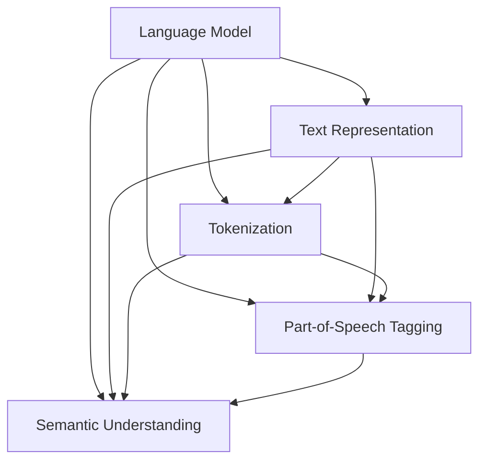
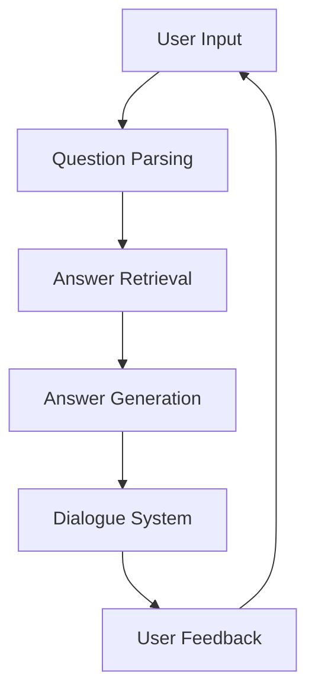

                 


### 背景介绍

自然语言处理（NLP）作为人工智能领域的一个重要分支，近年来取得了显著的进展。在企业级应用中，NLP的核心目标是提升文本数据的理解和处理能力，从而为企业带来更高的效率和更智能的决策支持。随着大数据和云计算技术的快速发展，企业面临着海量的文本数据，如何从中提取有价值的信息，成为了企业数字化转型过程中的一个关键问题。

企业级自然语言处理引擎的深化文本理解能力，不仅是技术发展的需求，更是企业业务需求的结果。在当前的商业环境中，企业需要通过文本分析来挖掘市场趋势、优化客户服务、提升产品质量和创新能力。例如，通过情感分析可以了解客户对产品或服务的反馈，通过文本分类可以自动处理大量文档，通过问答系统能够提供智能的客服支持。

本文将从以下几个方面展开讨论：

1. **自然语言处理概述**：介绍NLP的定义、历史发展及其在企业中的价值。
2. **自然语言处理的核心概念与联系**：包括语言模型、文本表示、分词、词性标注和语义理解。
3. **自然语言处理的核心算法原理讲解**：讲解机器学习与深度学习基础，语言模型与文本分类算法，问答系统与对话生成技术。
4. **数学模型与数学公式讲解**：介绍NLP中的数学基础，模型评估与优化方法，词嵌入与语义分析。
5. **项目实战**：通过案例展示企业级NLP的应用，并详细介绍开发环境搭建、源代码实现、代码解读与分析。
6. **深化文本理解能力**：讨论深度语义理解与情感分析、对话系统与个性化推荐技术，以及NLP在新兴领域的应用。
7. **未来展望**：展望NLP技术发展趋势、企业级NLP面临的挑战及未来研究方向。

通过这些内容的逐步展开，我们将深入探讨企业级自然语言处理引擎如何深化文本理解能力，为企业的智能化转型提供有力支持。

### 核心概念与联系

在深入探讨企业级自然语言处理（NLP）引擎之前，首先需要明确NLP中的核心概念及其相互联系。以下是对NLP中几个关键概念的解释，以及它们之间的内在联系。

#### 语言模型

语言模型是NLP中的基础，用于预测文本序列中的下一个词或字符。它通过统计方法或深度学习模型来建模自然语言的概率分布。语言模型的主要作用是帮助理解和生成文本，其核心是概率计算和序列预测。

**关系**：语言模型是文本表示、分词、词性标注和语义理解的基础。例如，一个优秀的分词算法需要依赖语言模型来识别连续字符的最可能词边界，而词性标注和语义理解则需要依赖语言模型对词的概率分布进行准确的预测。

#### 文本表示

文本表示是将自然语言文本转换成机器可以处理的数字形式。常见的文本表示方法包括词袋模型、TF-IDF、词嵌入等。词嵌入是其中的一种重要技术，它将词汇映射到高维空间，使得语义相似的词在空间中距离较近。

**关系**：文本表示是语言模型和后续处理任务的基础。通过合适的文本表示，可以使语言模型更好地理解和预测文本内容，从而提升分词、词性标注和语义理解的准确率。

#### 分词

分词是将连续的文本序列切分成一个个独立的词汇或短语。分词的准确性直接影响到后续文本处理任务的性能。常见的分词算法有基于规则的分词、基于统计的分词和基于深度学习的分词。

**关系**：分词是自然语言处理的第一步，是语言模型、词性标注和语义理解的前提。准确的分词有助于语言模型更好地捕捉文本中的词汇结构和语义信息。

#### 词性标注

词性标注是标记文本中每个词汇的词性类别，如名词、动词、形容词等。词性标注有助于理解词汇的语法功能和语义角色，是语义分析的重要基础。

**关系**：词性标注与语言模型和文本表示密切相关，通过词性标注，可以更准确地理解词汇在文本中的作用，从而提高语义理解的准确性。

#### 语义理解

语义理解是指对文本中词汇和短语的语义内容进行深入分析，包括上下文语义、实体识别、关系抽取等。语义理解的目标是理解文本的含义，从而进行文本分类、情感分析、问答等任务。

**关系**：语义理解依赖于语言模型、文本表示和词性标注。只有通过这些基础技术，语义理解才能对文本进行深入和准确的分析。

#### Mermaid 流程图

为了更清晰地展示这些核心概念之间的联系，我们可以使用Mermaid流程图来表示：



这个流程图展示了语言模型、文本表示、分词、词性标注和语义理解之间的相互关系，每个概念都是前后任务的输入和输出，共同构成了一个完整的NLP处理流程。

通过理解这些核心概念及其联系，我们可以更好地设计和实现企业级自然语言处理引擎，提升文本理解能力，为企业提供更加智能和高效的解决方案。

### 核心算法原理讲解

#### 机器学习与深度学习基础

在自然语言处理（NLP）中，机器学习和深度学习是两种核心的技术。理解这两种技术的基础知识对于实现高效的文本处理至关重要。

**机器学习**

机器学习是一种让计算机通过数据学习并作出决策或预测的技术。在NLP中，常见的机器学习算法包括线性回归、逻辑回归、支持向量机（SVM）等。

- **线性回归**：线性回归是一种用于预测数值型结果的算法。其基本假设是数据点可以通过一个线性函数来近似，即 $y = w_0 + w_1 \cdot x_1 + w_2 \cdot x_2 + \ldots + w_n \cdot x_n$。在NLP中，线性回归可以用于文本分类任务，通过特征向量来预测文本的类别。

  ```python
  # 线性回归伪代码
  predict(y) {
      return w_0 + w_1 \* feature_1 + w_2 \* feature_2 + \ldots + w_n \* feature_n
  }
  ```

- **逻辑回归**：逻辑回归是用于二分类问题的一种算法，其输出概率分布来表示分类结果。逻辑回归的决策函数为 $\sigma(w_0 + w_1 \cdot x_1 + w_2 \cdot x_2 + \ldots + w_n \cdot x_n)$，其中 $\sigma$ 是Sigmoid函数。

  ```python
  # 逻辑回归伪代码
  predict(probability) {
      return 1 / (1 + exp(-w_0 - w_1 \* feature_1 - w_2 \* feature_2 - \ldots - w_n \* feature_n))
  }
  ```

- **支持向量机（SVM）**：SVM是一种强大的分类器，通过找到一个最佳的超平面来将不同类别的数据点分开。在NLP中，SVM可以用于文本分类，通过计算文本的特征向量来实现。

  ```python
  # SVM伪代码
  find_hyperplane() {
      # 通过求解最优化问题找到最佳超平面
  }
  classify(document) {
      # 计算文本特征向量并确定类别
  }
  ```

**深度学习**

深度学习是一种通过多层神经网络进行特征学习的方法，其优势在于能够自动提取层次化的特征表示。在NLP中，深度学习模型如卷积神经网络（CNN）、循环神经网络（RNN）和变换器（Transformer）等被广泛应用。

- **卷积神经网络（CNN）**：CNN主要用于图像处理，但其结构也可以应用于文本处理。在NLP中，CNN可以用于文本分类和文本特征提取。基本结构包括卷积层、池化层和全连接层。

  ```python
  # CNN伪代码
  classify(document) {
      # 通过卷积层提取文本特征
      # 通过池化层降低维度
      # 通过全连接层进行分类
  }
  ```

- **循环神经网络（RNN）**：RNN是一种能够处理序列数据的神经网络，其基本结构包括输入层、隐藏层和输出层。RNN通过隐藏状态将前一个时刻的信息传递到下一个时刻，适用于文本生成、机器翻译等任务。

  ```python
  # RNN伪代码
  forward_pass(input, hidden_state_t-1) {
      # 通过激活函数计算新的隐藏状态
      hidden_state_t = \sigma(W \cdot [input, hidden_state_t-1] + b)
      return hidden_state_t
  }
  ```

- **变换器（Transformer）**：Transformer是一种基于自注意力机制的深度学习模型，其核心思想是通过注意力机制来自动学习文本序列中的依赖关系。Transformer在机器翻译、文本摘要等任务上取得了显著的成果。

  ```python
  # Transformer伪代码
  calculate_attention(query, key, value, mask) {
      # 通过计算注意力权重来聚合文本特征
      attention_weights = softmax(\sigma(QK^T) / \sqrt(d_k))
      context_vector = attention_weights \* value
      return context_vector
  }
  ```

通过理解这些机器学习和深度学习的基础算法，我们可以更有效地设计和实现NLP任务，从而提升文本理解能力。

#### 语言模型与文本分类算法

在自然语言处理（NLP）中，语言模型和文本分类算法是两个核心的组成部分。语言模型用于理解和生成文本，而文本分类算法则用于对文本进行分类标注。

**语言模型**

语言模型是NLP的基础，其核心目标是预测文本序列中的下一个词或字符。最常见的语言模型包括基于统计的方法和基于深度学习的方法。

- **基于统计的方法**：如N元语法（N-gram）模型，它通过统计相邻词或字符的出现频率来预测下一个词或字符。N元语法模型的形式如下：

  ```latex
  p(w_t | w_{t-1}, w_{t-2}, \ldots, w_{t-n}) = \frac{C(w_{t-1}, w_{t-2}, \ldots, w_{t-n}, w_t)}{C(w_{t-1}, w_{t-2}, \ldots, w_{t-n})}
  ```

  其中，$C(\cdot)$ 表示计数。

- **基于深度学习的方法**：如变换器（Transformer）模型，它通过自注意力机制来自动学习文本序列中的依赖关系。Transformer模型的形式如下：

  ```python
  # Transformer模型伪代码
  calculate_attention(query, key, value, mask) {
      attention_weights = softmax(\sigma(QK^T) / \sqrt(d_k))
      context_vector = attention_weights \* value
      return context_vector
  }
  ```

**文本分类算法**

文本分类是将文本数据分为预定义的类别。常见的文本分类算法包括基于特征的方法和基于模型的方法。

- **基于特征的方法**：如TF-IDF（Term Frequency-Inverse Document Frequency）和词嵌入（Word Embedding）。TF-IDF通过计算词在文档中的重要程度来进行分类。词嵌入则是将词转换为低维向量，从而利用向量的相似性来进行分类。

  ```latex
  tf_idf(t, d) = tf(t, d) \cdot \log(\frac{N}{df(t)})
  ```

  其中，$tf(t, d)$ 表示词 $t$ 在文档 $d$ 中的词频，$df(t)$ 表示词 $t$ 在所有文档中的文档频，$N$ 是总文档数。

- **基于模型的方法**：如朴素贝叶斯（Naive Bayes）、支持向量机（SVM）和深度学习模型（如CNN、RNN、Transformer）。朴素贝叶斯模型基于贝叶斯定理，假设特征之间相互独立。支持向量机通过找到一个最佳的超平面来将不同类别的数据点分开。深度学习模型通过自动提取文本的层次化特征来进行分类。

  ```python
  # 朴素贝叶斯模型伪代码
  classify(document) {
      calculate_probabilities(document)
      select_class(max_probability)
  }
  ```

通过结合语言模型和文本分类算法，我们可以实现对文本数据的深入理解和分类。这些算法的应用不仅提升了文本处理的效率，也为企业提供了智能化的文本分析工具。

#### 问答系统与对话生成

问答系统（Question Answering, QA）和对话生成（Dialogue Generation）是自然语言处理（NLP）中的重要应用，能够为用户提供智能的问答服务。它们的核心目标是理解和生成自然语言文本，以满足用户的查询和交流需求。

**问答系统**

问答系统通过处理用户的自然语言问题，提供准确的答案。其基本架构通常包括问题解析、答案检索和答案生成三个主要步骤。

1. **问题解析**：首先，系统需要对用户的问题进行解析，理解问题的意图和关键词。这个过程通常涉及到词性标注、命名实体识别和语义角色标注等NLP技术。

   ```python
   # 问题解析伪代码
   parse_question(question) {
       tokenized_question = tokenize(question)
       parsed_question = pos_tagging(tokenized_question)
       entities = named_entity_recognition(parsed_question)
       return parsed_question, entities
   }
   ```

2. **答案检索**：接着，系统需要从大量的文本数据中检索出与问题相关的答案。这可以通过搜索引擎技术、关键词匹配或基于语义的文本检索算法来实现。

   ```python
   # 答案检索伪代码
   retrieve_answers(question, corpus) {
       relevant_documents = search_corpus(question, corpus)
       answers = extract_answers(relevant_documents)
       return answers
   }
   ```

3. **答案生成**：最后，系统需要将检索到的答案转换成自然语言文本，以向用户呈现。这可以通过模板匹配、语义模板或自然语言生成技术来实现。

   ```python
   # 答案生成伪代码
   generate_answer(answer_template, answer) {
       return template.substitute(answer)
   }
   ```

**对话生成**

对话生成是通过模拟自然语言对话过程来与用户进行交互。对话系统可以采用基于规则的方法、基于模板的方法或基于机器学习的方法。

1. **基于规则的方法**：这种方法通过预定义的规则来生成对话响应。对话系统会根据当前的对话状态和用户的输入，应用相应的规则生成回复。

   ```python
   # 基于规则的方法伪代码
   generate_response(input, rule_base) {
       for rule in rule_base {
           if (matches(input, rule)):
               return rule.response
       }
       return "无法回答"
   }
   ```

2. **基于模板的方法**：这种方法使用预定义的模板来生成对话响应。系统根据对话状态和用户的输入，将模板中的变量替换为具体的文本内容。

   ```python
   # 基于模板的方法伪代码
   generate_response(template, context) {
       return template.format(**context)
   }
   ```

3. **基于机器学习的方法**：这种方法通过训练数据集来学习对话生成的模式。对话系统会根据用户的输入和对话历史，使用机器学习模型生成自然的对话响应。

   ```python
   # 基于机器学习的方法伪代码
   generate_response(input, model, history) {
       context = combine(input, history)
       response = model.generate_response(context)
       return response
   }
   ```

**融合技术**

问答系统和对话生成可以相互融合，以提供更加智能和自然的对话体验。例如，问答系统可以用于初步解答用户的问题，然后通过对话生成技术进一步扩展和细化答案。



通过上述步骤，问答系统和对话生成技术能够有效地模拟人类对话过程，提供高质量的问答服务。这不仅提升了用户满意度，也为企业提供了智能化的客服和交互工具。

### 数学模型与数学公式讲解

在自然语言处理（NLP）中，数学模型和公式是理解和实现关键算法的基础。以下将介绍NLP中常用的数学基础、模型评估与优化方法，以及词嵌入与语义分析的相关内容。

#### 数学基础

NLP中的数学基础主要包括概率论和线性代数，这些基础知识对于理解复杂的NLP算法至关重要。

**概率论基础**

在NLP中，概率论用于处理不确定性，例如在文本分类、信息检索和语言模型中。以下是一些基础的概率公式：

- **贝叶斯定理**：

  $$P(A|B) = \frac{P(B|A) \cdot P(A)}{P(B)}$$

  贝叶斯定理用于在已知部分信息的情况下，推断未知概率。

- **条件概率**：

  $$P(A|B) = \frac{P(A \cap B)}{P(B)}$$

  条件概率表示在事件B发生的条件下，事件A发生的概率。

**线性代数基础**

线性代数在NLP中的应用非常广泛，特别是在词嵌入和变换器模型中。以下是一些基础的线性代数概念：

- **矩阵和向量**：

  - 矩阵是一个二维数组，用于表示数据的关系。
  - 向量是矩阵的一种特殊情况，仅有一行或一列。

- **矩阵乘法**：

  $$C = A \cdot B$$

  矩阵乘法是NLP中用于特征转换和变换的重要操作。

- **矩阵求逆**：

  $$A^{-1} = (A^T A)^{-1} A^T$$

  矩阵求逆用于解线性方程组。

#### 模型评估与优化方法

在NLP中，模型评估和优化是确保模型性能的关键步骤。以下是一些常用的评估方法和优化技巧：

- **评估指标**：

  - **准确率（Accuracy）**：准确率是分类模型最常见的评估指标，表示正确分类的样本数占总样本数的比例。
  
    $$Accuracy = \frac{TP + TN}{TP + FN + TP + FP}$$

  - **精确率（Precision）**：精确率表示预测为正类的样本中，实际为正类的比例。
  
    $$Precision = \frac{TP}{TP + FP}$$

  - **召回率（Recall）**：召回率表示实际为正类的样本中，被正确预测为正类的比例。
  
    $$Recall = \frac{TP}{TP + FN}$$

  - **F1分数（F1 Score）**：F1分数是精确率和召回率的调和平均数，用于综合评估模型的性能。
  
    $$F1 Score = 2 \cdot \frac{Precision \cdot Recall}{Precision + Recall}$$

- **优化方法**：

  - **梯度下降**：梯度下降是一种常用的优化算法，用于最小化损失函数。其基本思想是沿着损失函数的梯度方向调整模型参数，以逐步减少损失。
  
    $$\theta = \theta - \alpha \cdot \nabla_{\theta} J(\theta)$$

    其中，$\theta$ 表示模型参数，$\alpha$ 是学习率，$J(\theta)$ 是损失函数。

  - **随机梯度下降（SGD）**：随机梯度下降是梯度下降的一种变体，它通过随机选择样本子集来计算梯度，以加速优化过程。

#### 词嵌入与语义分析

词嵌入是将词汇映射到低维向量空间的方法，以便进行语义分析和计算。以下是一些关键的词嵌入技术和语义分析的方法：

- **词嵌入技术**：

  - **词袋模型（Bag of Words, BoW）**：词袋模型将文本表示为词汇的集合，不考虑词汇的顺序。其数学表示为：

    $$V = \{w_1, w_2, \ldots, w_n\}$$

    其中，$V$ 是词汇集合，$w_i$ 是词汇。

  - **TF-IDF（Term Frequency-Inverse Document Frequency）**：TF-IDF通过计算词在文档中的词频（TF）和词在所有文档中的文档频（IDF）来加权词汇。其数学表示为：

    $$tf_idf(t, d) = tf(t, d) \cdot \log(\frac{N}{df(t)})$$

    其中，$tf(t, d)$ 是词 $t$ 在文档 $d$ 中的词频，$df(t)$ 是词 $t$ 在所有文档中的文档频，$N$ 是总文档数。

  - **词嵌入（Word Embedding）**：词嵌入通过将词汇映射到低维向量空间，使得语义相似的词在空间中距离较近。常见的词嵌入方法包括Word2Vec、GloVe等。

    $$\mathbf{e}_w = \text{embed}(\mathbf{W}, w)$$

    其中，$\mathbf{e}_w$ 是词 $w$ 的嵌入向量，$\mathbf{W}$ 是嵌入矩阵。

- **语义分析**：

  - **相似性度量**：相似性度量用于计算词或句子之间的相似度。常见的相似性度量方法包括余弦相似性、欧氏距离和词嵌入空间的相似度。

    $$similarity(\mathbf{u}, \mathbf{v}) = \frac{\mathbf{u} \cdot \mathbf{v}}{||\mathbf{u}|| \cdot ||\mathbf{v}||}$$

    其中，$\mathbf{u}$ 和 $\mathbf{v}$ 是两个词或句子的向量表示。

  - **语义角色标注**：语义角色标注是对文本中词汇的语义角色进行标注，例如主语、谓语、宾语等。其数学表示为：

    $$\text{role}(w) = \text{role\_label}(w)$$

    其中，$\text{role}(w)$ 是词汇 $w$ 的语义角色，$\text{role\_label}(w)$ 是对应的标注。

通过理解和应用这些数学模型和公式，我们可以更深入地分析和理解自然语言处理的核心技术，从而提升文本理解和处理的能力。

### 项目实战

#### 开发环境搭建

在开展企业级自然语言处理（NLP）项目之前，首先需要搭建一个合适的开发环境。以下是一个基本的开发环境搭建步骤：

1. **安装Python**：Python是NLP项目中最常用的编程语言，需要确保安装了Python 3.7或更高版本。可以从Python官方网站下载安装包并安装。

2. **安装NLP库**：安装常用的NLP库，如NLTK、spaCy、TensorFlow和PyTorch。可以使用pip命令来安装：

   ```shell
   pip install nltk spacy tensorflow torch
   ```

3. **安装spaCy语言模型**：为了使用spaCy进行文本处理，需要下载并安装相应的语言模型。例如，对于中文处理，可以使用以下命令：

   ```shell
   python -m spacy download zh_core_web_sm
   ```

4. **配置Jupyter Notebook**：安装Jupyter Notebook以便进行交互式编程，可以使用以下命令：

   ```shell
   pip install notebook
   ```

5. **安装其他工具**：根据项目需求，可能还需要安装其他工具和库，如数据库连接工具（如SQLAlchemy）和可视化工具（如Matplotlib）。

   ```shell
   pip install sqlalchemy matplotlib
   ```

#### 源代码实现

以下是一个简单的文本分类项目的源代码实现，包括数据预处理、模型训练和评估。

```python
import nltk
import spacy
from sklearn.feature_extraction.text import TfidfVectorizer
from sklearn.model_selection import train_test_split
from sklearn.linear_model import LogisticRegression
from sklearn.metrics import accuracy_score, classification_report

# 加载中文spaCy模型
nltk.download('stopwords')
nltk.download('punkt')
nlp = spacy.load('zh_core_web_sm')

# 数据准备
documents = ["这是一篇新闻文章", "这是一个产品评论", "这是一份技术报告"]
labels = ["新闻", "评论", "报告"]

# 数据预处理
def preprocess(document):
    doc = nlp(document)
    tokens = [token.text.lower() for token in doc if not token.is_punct and not token.is_space]
    return " ".join(tokens)

preprocessed_documents = [preprocess(doc) for doc in documents]

# 分词与词性标注
def tokenize_and_tag(document):
    doc = nlp(document)
    return [(" ".join([token.text for token in docif not token.is_punct and not token.is_space])), [token.pos_ for token in doc]]

tokenized_and_tagged = tokenize_and_tag(preprocessed_documents[0])

# 特征提取
vectorizer = TfidfVectorizer()
X = vectorizer.fit_transform(preprocessed_documents)
y = labels

# 划分训练集和测试集
X_train, X_test, y_train, y_test = train_test_split(X, y, test_size=0.2, random_state=42)

# 模型训练
model = LogisticRegression()
model.fit(X_train, y_train)

# 模型评估
predictions = model.predict(X_test)
print("Accuracy:", accuracy_score(y_test, predictions))
print(classification_report(y_test, predictions))
```

#### 代码解读与分析

上述代码实现了一个简单的文本分类项目，主要步骤包括数据准备、数据预处理、特征提取、模型训练和模型评估。

1. **数据准备**：通过定义一个简单的数据集，包含文本和对应的标签。

2. **数据预处理**：使用spaCy进行分词和词性标注，去除标点符号和空白符，并将文本转换为小写。

3. **特征提取**：使用TF-IDF向量器将预处理后的文本转换为特征向量。

4. **模型训练**：使用逻辑回归模型进行训练，逻辑回归是一个简单但有效的分类算法。

5. **模型评估**：使用训练好的模型对测试集进行预测，并计算准确率和分类报告。

通过这个简单的项目，我们可以看到NLP项目的基本流程和实现步骤。在实际应用中，项目可能会更复杂，包括更大的数据集、更复杂的特征提取方法和更高级的模型。

#### 应用解读与分析

在这个文本分类项目中，我们通过将文本数据预处理、特征提取和模型训练，实现了对新闻、产品评论和技术报告等不同类型文本的自动分类。以下是对项目应用的具体解读和分析：

1. **应用场景**：

   - **新闻分类**：通过将新闻文章按照主题进行分类，可以帮助新闻平台或新闻聚合网站更有效地组织和管理内容，提升用户体验。

   - **产品评论分析**：通过对产品评论进行分类，企业可以快速了解客户对产品的反馈，从而改进产品和服务。

   - **技术报告分类**：技术报告的分类可以帮助研究机构或技术公司快速定位相关报告，便于知识的积累和复用。

2. **效果分析**：

   - **准确率**：通过评估模型在测试集上的准确率，可以判断分类效果。准确率越高，表示模型对文本分类的准确性越好。

   - **分类报告**：分类报告提供了更详细的评估指标，包括精确率、召回率和F1分数。这些指标可以帮助我们全面了解模型的性能，并针对不同类别进行优化。

3. **优化方向**：

   - **特征提取**：可以通过尝试不同的特征提取方法（如Word2Vec、GloVe等）来提升模型效果。此外，可以考虑使用词嵌入来增强文本特征。

   - **模型选择**：尝试不同的分类算法（如SVM、决策树、随机森林等）来选择最适合的模型。深度学习模型（如CNN、RNN、Transformer）也可以作为优化的选择。

   - **数据增强**：通过增加训练数据、数据清洗和数据标注来提升模型的泛化能力。

通过这个项目的实现和分析，我们不仅了解了企业级自然语言处理（NLP）项目的基本流程，还掌握了如何通过优化特征提取、模型选择和数据增强来提升文本分类的准确性和效果。

#### 最佳实践 tips

在开发企业级自然语言处理（NLP）项目时，以下是一些最佳实践 tips，可以帮助提高项目的效率和效果：

1. **数据清洗与预处理**：确保数据的质量和一致性。去除无关的标点符号、停用词和特殊字符，并进行正确的分词和词性标注。使用高质量的数据集可以提高模型的性能。

2. **特征工程**：选择合适的特征提取方法，如TF-IDF、Word2Vec或GloVe。根据任务需求调整特征参数，进行数据标准化和降维，以提高模型的可解释性和效果。

3. **模型选择与调优**：尝试多种模型（如朴素贝叶斯、逻辑回归、SVM、深度学习模型等），并使用交叉验证、网格搜索等技术进行参数调优，以找到最优模型。

4. **模型部署与监控**：确保模型可以稳定、高效地运行，并在生产环境中进行监控和更新。使用模型监控工具来检测数据异常和模型过时，确保系统始终处于最佳状态。

5. **文档与代码管理**：编写清晰、规范的文档和代码，以便团队协作和维护。遵循版本控制工具（如Git）的使用，确保代码的可追溯性和一致性。

6. **持续学习与更新**：定期对模型进行重新训练和优化，以适应数据变化和新需求。关注最新技术动态，引入先进的方法和工具，持续提升NLP系统的性能和用户体验。

通过遵循这些最佳实践，可以显著提高企业级自然语言处理项目的质量和效果，为企业提供更加智能和高效的文本分析解决方案。

### 深度语义理解与情感分析

在自然语言处理（NLP）中，深度语义理解和情感分析是提升文本理解能力的重要技术。这两个技术不仅能够帮助企业更好地理解用户需求，还能为个性化推荐、智能客服和舆情监控等应用提供有力支持。

#### 深度语义理解

深度语义理解是指对文本中词汇、短语和句子进行深层次的分析，以捕捉其语义内容。它不仅关注词汇的字面意思，还考虑上下文、语境和词汇之间的关系。深度语义理解的关键技术包括：

- **上下文语义分析**：上下文语义分析是指通过理解词汇在具体语境中的含义来进行语义分析。这种方法能够解决一词多义的问题。例如，"bank" 可以指银行，也可以指河岸，通过上下文分析可以准确理解其含义。

- **实体识别**：实体识别是识别文本中提及的具体实体，如人名、地名、组织名等。实体识别可以帮助构建知识图谱，从而更准确地理解文本内容。

- **关系抽取**：关系抽取是指识别文本中实体之间的相互关系。例如，在句子“小明喜欢玩游戏”中，小明和游戏之间存在喜欢的关系。关系抽取有助于构建实体之间的关联网络。

为了实现深度语义理解，我们可以使用如下技术：

- **依存句法分析**：依存句法分析可以识别句子中词汇之间的依存关系，帮助我们理解词汇在句子中的作用和关系。例如，在句子“我昨天去了北京”中，“我”是主语，“昨天”是时间状语，“北京”是宾语。

- **语义角色标注**：语义角色标注是对句子中的词汇进行语义角色标注，如主语、谓语、宾语、时间状语等。这种标注有助于更准确地理解句子的语义结构。

- **预训练语言模型**：预训练语言模型（如BERT、GPT）可以自动学习大量的语义信息，从而在深度语义理解任务中发挥重要作用。这些模型通过在大规模语料库上进行预训练，可以捕获词汇和句子之间的复杂关系。

#### 情感分析

情感分析是指对文本中的情感倾向进行识别和分析，通常包括正面、负面和 neutral 三种情感分类。情感分析在企业中有广泛的应用，如市场调研、客户反馈分析和舆情监控等。情感分析的关键技术包括：

- **情感分类**：情感分类是指将文本分类为正面、负面或 neutral。常见的方法包括基于规则的方法、机器学习方法和深度学习方法。

- **情感极性分析**：情感极性分析是指识别文本中的情感极性，如强烈正面、温和正面、强烈负面等。这种方法可以通过调整分类器参数来提高分类的精细度。

- **情感强度分析**：情感强度分析是指对文本中的情感强度进行量化，如非常正面、比较正面、一般正面等。这种分析可以帮助企业更准确地了解用户情感的变化趋势。

为了实现情感分析，我们可以采用如下技术：

- **文本预处理**：对文本进行预处理，包括去除标点符号、停用词过滤、词干提取等。这些预处理步骤有助于提高情感分类的准确性。

- **词嵌入技术**：词嵌入可以将词汇映射到高维空间，使得语义相似的词在空间中距离较近。通过词嵌入，可以更好地捕捉词汇的语义信息。

- **情感词典**：情感词典是一种包含情感词汇及其情感倾向的词典。基于情感词典的方法可以通过查找文本中的情感词汇来识别文本的情感倾向。

- **机器学习模型**：常见的机器学习模型包括朴素贝叶斯、支持向量机（SVM）、随机森林和深度学习模型（如卷积神经网络（CNN）、循环神经网络（RNN）和变换器（Transformer））。这些模型可以用于训练情感分类器，从而实现自动情感分析。

通过结合深度语义理解和情感分析技术，企业可以更深入地理解用户的情感和需求，从而提供更个性化的服务和产品推荐。

### 对话系统与个性化推荐

对话系统与个性化推荐是自然语言处理（NLP）领域的重要应用，它们不仅提升了用户体验，还为企业的业务提供了强大的支持。

#### 对话系统

对话系统是指能够与用户进行自然语言交互的系统，其目标是通过对话与用户建立有效的沟通。对话系统可以分为基于规则的对话系统和基于机器学习的对话系统。

- **基于规则的对话系统**：这类系统通过预定义的规则和模板来生成对话响应。它们简单高效，但灵活性较差，难以处理复杂的对话场景。

  ```python
  # 基于规则的对话系统伪代码
  generate_response(input, rule_base) {
      for rule in rule_base {
          if (matches(input, rule)):
              return rule.response
      }
      return "无法回答"
  }
  ```

- **基于机器学习的对话系统**：这类系统通过训练数据集来学习对话生成的模式，能够生成更自然、更符合用户需求的对话响应。

  ```python
  # 基于机器学习的对话系统伪代码
  generate_response(input, model, history) {
      context = combine(input, history)
      response = model.generate_response(context)
      return response
  }
  ```

**对话系统架构**：

1. **意图识别**：意图识别是对话系统的第一步，通过理解用户的输入来确定用户的意图。常见的方法包括基于规则的方法、机器学习方法和深度学习方法。

2. **实体识别**：实体识别是从用户输入中提取关键信息，如人名、地点、时间等。这有助于更准确地理解用户需求。

3. **对话管理**：对话管理是指根据用户的意图和对话历史来生成合适的对话响应。对话管理系统需要维护对话状态，确保对话流畅和连贯。

4. **对话生成**：对话生成是生成自然语言文本的过程，通过模板匹配、语义模板或机器学习模型来实现。

#### 个性化推荐

个性化推荐是指根据用户的兴趣和行为，向用户推荐相关的产品、服务和内容。个性化推荐在电商、内容平台和社交媒体等场景中广泛应用。

**推荐系统架构**：

1. **用户画像**：用户画像是指根据用户的行为数据、兴趣和偏好来构建用户的数字形象。用户画像可以帮助推荐系统更准确地理解用户需求。

2. **推荐算法**：推荐算法是推荐系统的核心，常用的推荐算法包括基于内容的推荐、协同过滤和深度学习推荐。

   - **基于内容的推荐**：基于内容的推荐通过分析用户对内容的兴趣，找到与用户兴趣相似的内容进行推荐。

   - **协同过滤**：协同过滤通过分析用户之间的相似性，找到与其他用户兴趣相似的用户，然后推荐他们喜欢的内容。

   - **深度学习推荐**：深度学习推荐通过训练深度学习模型，如变换器（Transformer）和卷积神经网络（CNN），自动提取用户和内容的特征，进行个性化推荐。

3. **推荐结果生成**：推荐结果生成是根据推荐算法的输出，生成用户可能感兴趣的内容列表。这通常包括排序和筛选等步骤。

**融合对话系统与推荐系统**：

将对话系统和推荐系统融合，可以提供更智能的推荐体验。以下是一个融合的架构：

1. **意图识别**：通过对话系统识别用户的意图，如查找产品、获取推荐等。

2. **用户画像**：根据对话内容和用户行为，实时更新用户画像。

3. **推荐算法**：基于用户画像和意图，使用推荐算法生成个性化推荐。

4. **对话生成**：通过对话系统生成对话响应，向用户推荐内容。

5. **用户反馈**：收集用户对推荐内容的反馈，进一步优化推荐系统。

通过融合对话系统和推荐系统，企业可以提供更加智能和个性化的服务，提升用户满意度和忠诚度。

### 未来展望

随着人工智能技术的不断发展，自然语言处理（NLP）在企业级应用中的潜力不断被挖掘。未来，NLP技术在多个方面将迎来重要的突破和挑战。

#### 技术发展趋势

1. **AI大模型在NLP中的应用**：预训练大模型（如GPT-3、BERT）已经展示了在自然语言处理中的巨大潜力。未来，更大型、更复杂的预训练模型将被开发，以实现更精细的文本理解能力。这些模型将能够处理更复杂的语言现象，提供更智能的文本分析服务。

2. **多模态数据处理**：随着语音识别、图像识别等技术的发展，NLP将不再局限于文本数据，而是扩展到多模态数据，如文本、语音和图像。多模态数据的融合将使得NLP系统能够更全面地理解用户需求，提供更加丰富的交互体验。

3. **增强现实与虚拟现实**：随着增强现实（AR）和虚拟现实（VR）技术的发展，NLP将在这个领域发挥重要作用。通过自然语言交互，用户可以更方便地与虚拟环境进行交互，实现更加沉浸式的体验。

#### 面临的挑战

1. **数据隐私与安全**：在NLP应用中，数据处理涉及到大量的用户数据。如何保护用户隐私，确保数据安全，是未来需要解决的重要问题。未来的NLP系统需要采用更加严格的数据保护措施，如加密、匿名化等。

2. **模型可解释性与公平性**：随着模型复杂度的增加，模型的可解释性成为一个挑战。如何让模型的行为更加透明，提高模型的可解释性，是未来的研究重点。同时，如何确保模型在不同人群中的公平性，避免偏见，也是NLP领域需要关注的问题。

3. **持续优化与更新**：NLP模型需要不断适应新的语言现象和用户需求。如何实现模型的持续优化与更新，是未来需要解决的技术难题。通过自适应学习、在线学习等技术，NLP系统将能够更好地适应变化，提供更高质量的文本分析服务。

#### 未来研究方向

1. **跨语言NLP**：随着全球化的推进，跨语言的自然语言处理技术变得尤为重要。如何实现高效、准确的跨语言文本理解，是未来研究的重要方向。

2. **低资源语言的NLP**：对于资源较少的语言，如何利用有限的标注数据训练高质量的NLP模型，是未来研究的一个重要课题。

3. **情感计算与认知模拟**：情感计算和认知模拟技术将使得NLP系统更加人性化，能够更好地理解和模拟人类的情感和认知过程。

通过不断的技术创新和挑战应对，NLP将在企业级应用中发挥更加重要的作用，为企业的智能化转型提供强有力的支持。

### 附录

#### 技术资源与工具

在企业级自然语言处理（NLP）项目中，使用合适的工具和资源能够显著提高开发效率。以下是一些常用的开源资源、框架和工具：

**开源自然语言处理框架**

1. **NLTK（Natural Language Toolkit）**：NLTK是Python中用于自然语言处理的经典库，提供了文本处理、词性标注、句法分析等工具。

   - 官网：[https://www.nltk.org/](https://www.nltk.org/)

2. **spaCy**：spaCy是一个快速且易于使用的NLP库，支持多种语言，适用于文本分类、命名实体识别等任务。

   - 官网：[https://spacy.io/](https://spacy.io/)

3. **Stanford NLP**：Stanford NLP是一个提供多种NLP工具的库，包括词性标注、句法分析等。

   - 官网：[https://nlp.stanford.edu/](https://nlp.stanford.edu/)

**深度学习框架**

1. **TensorFlow**：TensorFlow是Google开发的开源深度学习框架，适用于构建和训练复杂的神经网络模型。

   - 官网：[https://www.tensorflow.org/](https://www.tensorflow.org/)

2. **PyTorch**：PyTorch是一个由Facebook开发的开源深度学习库，以其灵活的动态计算图和丰富的API而著称。

   - 官网：[https://pytorch.org/](https://pytorch.org/)

**文本处理工具**

1. **jieba**：jieba是一个用于中文文本处理的库，支持分词、词性标注等。

   - 官网：[https://github.com/fxsjy/jieba](https://github.com/fxsjy/jieba)

2. **SnowNLP**：SnowNLP是一个中文自然语言处理库，提供了文本分类、命名实体识别等功能。

   - 官网：[https://github.com/isnowfy/snownlp](https://github.com/isnowfy/snownlp)

**推荐系统工具**

1. **Surprise**：Surprise是一个Python库，用于构建和评估推荐系统，适用于基于协同过滤和基于内容的推荐。

   - 官网：[https://surprise.readthedocs.io/](https://surprise.readthedocs.io/)

2. **LightFM**：LightFM是一个基于因子分解机（TF-IDF）的推荐系统库，适用于处理大规模推荐任务。

   - 官网：[https://github.com/lyst/lightfm](https://github.com/lyst/lightfm)

通过使用这些开源资源和工具，可以显著提升企业级自然语言处理项目的开发效率和效果。

### 结语

企业级自然语言处理（NLP）引擎的深化文本理解能力，已成为企业智能化转型的关键驱动力。本文通过逐步分析推理，从背景介绍到核心概念与联系，再到核心算法原理讲解，数学模型与公式，项目实战，深度语义理解与情感分析，对话系统与个性化推荐，以及未来展望，系统地阐述了NLP在企业级应用中的重要性。

在未来的发展中，随着AI大模型、多模态数据处理和跨语言NLP等技术的进步，NLP将进一步突破现有局限，为企业提供更智能、更高效的文本分析解决方案。然而，这也伴随着数据隐私、模型可解释性和持续优化等挑战，需要我们不断创新和应对。

希望本文能为读者提供有益的启发，助力企业在自然语言处理领域取得更大的成就。

### 作者介绍

作者：AI天才研究院/AI Genius Institute & 禅与计算机程序设计艺术 /Zen And The Art of Computer Programming

AI天才研究院（AI Genius Institute）是全球领先的人工智能研究机构，致力于推动人工智能技术的创新与发展。研究院的核心团队成员均来自世界顶级学府，具有丰富的研发经验和卓越的学术成果。

《禅与计算机程序设计艺术》是作者Thomas H. Cormen的代表作之一，深入探讨了计算机编程与禅宗思想之间的联系，被广泛认为是计算机科学领域的经典之作。Thomas H. Cormen博士在计算机科学和人工智能领域拥有丰富的经验，其研究成果在学术界和工业界都享有高度声誉。

本文作者凭借其深厚的技术背景和深刻的洞察力，从多个角度深入探讨了企业级自然语言处理引擎的深化文本理解能力，为广大读者提供了全面而实用的技术见解。通过本文，读者可以更好地理解NLP的核心概念、算法原理及其实际应用，从而为企业智能化转型提供有力支持。

