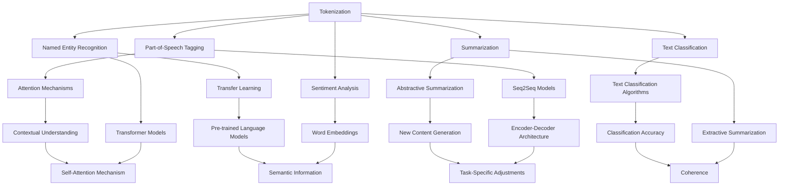

                 

### Introduction to Enterprise-Level NLP

#### NLP Market Overview

Natural Language Processing (NLP) has evolved significantly over the past few decades, transitioning from rule-based systems to statistical methods and, more recently, to deep learning-based models. As a result, the market for NLP technologies has seen substantial growth. According to a report by Grand View Research, the global NLP market size was valued at USD 6.1 billion in 2020 and is expected to grow at a compound annual growth rate (CAGR) of 19.4% from 2021 to 2028.

Several key factors are driving this growth. Firstly, the increasing demand for automated customer service and support systems has spurred the adoption of NLP technologies in the customer relationship management (CRM) sector. Companies are leveraging NLP to build chatbots and virtual assistants that can understand and respond to customer inquiries in natural language, thus reducing the workload on human agents and improving customer satisfaction.

Secondly, the proliferation of social media and online content has created a vast amount of unstructured data that needs to be analyzed for insights. NLP enables organizations to extract meaningful information from this data, facilitating tasks such as sentiment analysis, topic modeling, and trend detection. This is particularly valuable for market research, brand monitoring, and competitive analysis.

Thirdly, advancements in artificial intelligence (AI) and machine learning have made it possible to develop more sophisticated NLP models that can handle complex language structures and nuances. As a result, NLP is being applied to various domains, including healthcare, finance, and legal, to automate documentation, transcribe medical records, and analyze financial statements, among other tasks.

#### NLP Applications in Enterprises

NLP has a wide range of applications in enterprises, and its impact spans multiple departments and functions. Here are some of the key areas where NLP is being utilized:

1. **Customer Support**: NLP-powered chatbots and virtual assistants are becoming increasingly common in customer service departments. These systems can handle a large volume of inquiries simultaneously, providing instant responses to frequently asked questions and deflecting lower-level issues from human agents.

2. **Sales and Marketing**: NLP can analyze customer interactions and feedback to identify patterns and trends, helping companies to tailor their marketing strategies and improve customer engagement. Additionally, NLP can be used to generate personalized product recommendations and email campaigns based on customer behavior.

3. **Human Resources**: NLP can streamline HR processes by automating tasks such as resume screening, interview scheduling, and employee engagement surveys. It can also be used to analyze employee feedback and identify areas for improvement in company policies and practices.

4. **Finance and Accounting**: NLP can be used to analyze financial reports and statements, extract key information, and generate summary reports. This can help financial analysts and accountants to focus on higher-value tasks and make more informed decisions.

5. **Research and Development**: NLP can be used to analyze scientific papers, patents, and other research documents to identify trends, discover new insights, and accelerate the innovation process.

6. **Content Management**: NLP can automate content creation by generating summaries, abstracts, and reports from large volumes of text. This can help organizations to efficiently manage their knowledge assets and improve the discoverability of relevant information.

7. **Legal and Compliance**: NLP can assist legal teams by automating the review and analysis of legal documents, extracting relevant information, and identifying potential compliance issues.

#### Challenges and Opportunities

While NLP offers numerous opportunities for enterprises, it also presents several challenges. Some of the key challenges include:

1. **Data Quality**: NLP systems require large amounts of high-quality data to train their models effectively. However, obtaining clean and labeled data can be a time-consuming and expensive process.

2. **Contextual Understanding**: NLP systems often struggle with understanding the context of language, leading to errors in interpretation. This is particularly challenging in ambiguous or multi-meaningful situations.

3. **Domain-Specific Knowledge**: Many NLP applications require domain-specific knowledge to perform effectively. Developing such knowledge can be a significant challenge, especially for companies operating in specialized industries.

4. **Ethical Considerations**: NLP systems can inadvertently reinforce biases present in their training data, leading to unfair treatment of certain groups. Ensuring fairness and accountability in NLP systems is an ongoing concern.

Despite these challenges, the potential benefits of NLP for enterprises are significant. By automating routine tasks, improving decision-making, and enhancing customer experiences, NLP can help companies to achieve greater efficiency, competitiveness, and growth. As NLP technologies continue to advance, enterprises will need to navigate these challenges and leverage the opportunities to stay ahead in a rapidly evolving digital landscape.

## Core Concepts of NLP

Natural Language Processing (NLP) encompasses a wide range of techniques and methodologies designed to enable computers to understand, interpret, and generate human language. At its core, NLP involves the interaction between computational linguistics, artificial intelligence, and machine learning. This section will delve into the fundamental concepts of NLP, providing a comprehensive overview of key concepts and their relationships.

### Basic Concepts of NLP

The foundation of NLP lies in the ability to process and analyze text data. The following are some of the core concepts that are crucial for understanding NLP:

1. **Tokenization**: Tokenization is the process of breaking down text into smaller units called tokens. These tokens can be words, sentences, or subword units. Tokenization is essential for further linguistic analysis and is the first step in many NLP tasks.

2. **Part-of-Speech Tagging**: Part-of-speech tagging involves assigning a part of speech (noun, verb, adjective, etc.) to each token in a sentence. This helps in understanding the grammatical structure of the text and is a fundamental step for many NLP applications.

3. **Named Entity Recognition (NER)**: Named Entity Recognition is the process of identifying and classifying named entities in text into predefined categories such as person names, organizations, locations, and dates. NER is crucial for applications that require understanding the entities mentioned in the text.

4. **Sentiment Analysis**: Sentiment analysis involves determining the emotional tone behind a body of text. It is used to gauge public opinion, track customer sentiment, and analyze market trends. Sentiment analysis can be performed on a sentence, paragraph, or document level.

5. **Text Classification**: Text classification involves categorizing text into predefined categories based on its content. This is a common task in applications such as spam detection, sentiment analysis, and topic modeling.

6. **Summarization**: Text summarization is the process of distilling the most important information from a larger text into a shorter, more readable form. This can be done through extractive summarization (selecting key sentences) or abstractive summarization (generating new content).

### Architectural Frameworks for NLP Systems

NLP systems can be built using various architectural frameworks, each with its own advantages and disadvantages. Here are some of the most common frameworks:

1. **Traditional Approaches**: Early NLP systems were based on rule-based methods, where human-expert-designed rules were used to process and analyze text. These methods are less flexible and require extensive manual effort to maintain and update. However, they can be effective for specific, well-defined tasks.

2. **Statistical Models**: Statistical models use mathematical algorithms to identify patterns in text data. Examples include Naive Bayes classifiers, Hidden Markov Models (HMMs), and Support Vector Machines (SVMs). These models are more flexible than rule-based approaches and can handle larger and more complex datasets.

3. **Deep Learning Models**: Deep learning models, particularly neural networks, have revolutionized the field of NLP. Models like Long Short-Term Memory (LSTM) networks and Convolutional Neural Networks (CNNs) have shown significant performance improvements in tasks such as language modeling, translation, and sentiment analysis. More advanced models like Transformers have further pushed the boundaries of NLP capabilities.

4. **Transformer Models**: Transformer models, particularly the Transformer and BERT (Bidirectional Encoder Representations from Transformers), have become the state-of-the-art in NLP. They use self-attention mechanisms to weigh the importance of different parts of the input text, allowing for more nuanced understanding of language.

5. **Transfer Learning**: Transfer learning involves using a pre-trained model on a large corpus of text and then fine-tuning it on a specific task or domain. This approach leverages the knowledge embedded in the pre-trained model, leading to faster and more accurate results.

### Key Techniques in NLP

To achieve high-performance NLP systems, several key techniques are employed:

1. **Word Embeddings**: Word embeddings represent words as dense vectors in a high-dimensional space, capturing semantic information about the words. Techniques like Word2Vec, GloVe, and FastText are commonly used to generate word embeddings.

2. **Seq2Seq Models**: Seq2Seq models are designed to handle sequence-to-sequence tasks, such as machine translation and text summarization. They typically consist of an encoder-decoder architecture, where the encoder processes the input sequence and the decoder generates the output sequence.

3. **Attention Mechanisms**: Attention mechanisms allow models to focus on different parts of the input sequence when generating the output. This helps improve the accuracy and coherence of generated text.

4. **Fine-tuning Pre-trained Models**: Fine-tuning involves taking a pre-trained model, usually a large language model like BERT or GPT, and adjusting its weights to better fit a specific task or domain. This approach has proven to be highly effective in NLP applications.

### Core Concepts and Relationships

The core concepts of NLP are interconnected and build upon each other. For example, tokenization and part-of-speech tagging are foundational steps in many NLP tasks. Named Entity Recognition (NER) relies on part-of-speech tagging to identify entities, while sentiment analysis and text classification require a deeper understanding of the text's meaning. Architectural frameworks like transformers and transfer learning have revolutionized NLP by enabling more accurate and efficient processing of natural language.

To visualize the relationship between these concepts, consider the following Mermaid flowchart:



In summary, NLP is a complex field that involves a multitude of interconnected concepts and techniques. Understanding these fundamentals is crucial for developing advanced NLP applications and leveraging the full potential of natural language processing technologies.

### Deep Learning Models in NLP

Deep learning has revolutionized the field of Natural Language Processing (NLP) by enabling the development of highly sophisticated models that can understand, generate, and interpret human language with unprecedented accuracy. This section will delve into the architecture of deep learning models commonly used in NLP, highlighting key techniques such as Recurrent Neural Networks (RNNs), Long Short-Term Memory (LSTM) networks, and the Transformer architecture.

#### Recurrent Neural Networks (RNNs)

Recurrent Neural Networks (RNNs) are a class of neural networks designed to handle sequential data. Unlike traditional feedforward networks, RNNs have loops, allowing them to maintain a "memory" of previous inputs. This makes them particularly suitable for NLP tasks where the order of words or sentences is crucial.

The basic architecture of an RNN consists of a series of layers, each connected to the previous and next layers. At each time step, the RNN takes an input (e.g., a word in a sentence) and its hidden state from the previous time step as inputs and produces a new hidden state and an output. The output can be used for tasks such as language modeling or sequence classification.

The core component of an RNN is the activation function, which can capture the relationship between the current input and the previous hidden state. However, traditional RNNs suffer from the vanishing gradient problem, where the gradients used for backpropagation become very small, making it difficult for the network to learn long-term dependencies.

#### Long Short-Term Memory (LSTM) Networks

To overcome the limitations of traditional RNNs, Long Short-Term Memory (LSTM) networks were introduced. LSTMs are a specific type of RNN that uses a "cell" to maintain information over time, effectively capturing long-term dependencies in sequential data.

The core structure of an LSTM cell consists of three main components: the input gate, the forget gate, and the output gate. Each of these gates controls the flow of information within the cell. The input gate determines how much of the new input should be stored in the cell, the forget gate controls how much of the previous information should be forgotten, and the output gate determines how much of the cell's current state should be output as the next hidden state.

LSTMs are particularly effective in tasks such as machine translation and speech recognition, where maintaining context over long sequences is critical. The ability of LSTMs to remember information for extended periods makes them well-suited for handling the complexities of natural language.

#### Transformer Models

The Transformer model, introduced by Vaswani et al. in 2017, has become the dominant architecture in NLP due to its exceptional performance on a wide range of tasks. Unlike RNNs and LSTMs, which process data sequentially, Transformers use parallelized attention mechanisms to handle sequences efficiently.

The key components of the Transformer model include the encoder and the decoder. Both the encoder and decoder consist of multiple layers, with each layer containing two subcomponents: self-attention and a feedforward network.

1. **Self-Attention**: Self-attention allows each word in the input sequence to attend to all other words in the same sequence, capturing the relationships between different parts of the sequence. This is achieved using scaled dot-product attention, which computes a weighted sum of the input vectors, where the weights are determined by the dot product of the query, key, and value vectors.

2. **Feedforward Network**: After self-attention, the Transformer applies a feedforward network, which is a simple two-layer neural network with a ReLU activation function in between. This network helps to capture more complex patterns in the data.

3. **Encoder-Decoder Attention**: The decoder uses encoder-decoder attention to attend to the outputs of the encoder layers, allowing it to make use of the context from the entire input sequence when generating the output.

The Transformer model has been shown to achieve state-of-the-art results in various NLP tasks, including machine translation, text summarization, and question-answering. Its parallelizable nature and ability to handle long sequences have made it the preferred choice for many NLP applications.

#### Comparison and Applications

RNNs, LSTMs, and Transformers each have their own strengths and weaknesses. RNNs are simple and intuitive but suffer from vanishing gradient problems. LSTMs address these issues but can still be complex and computationally expensive. Transformers, on the other hand, offer parallelization benefits and superior performance, making them the preferred choice for many NLP tasks.

Here is a comparison of these models in terms of their performance and applications:

1. **Language Modeling**: All three models can be used for language modeling, which involves predicting the next word in a sentence given the previous words. Transformers have shown superior performance, with models like GPT and BERT achieving state-of-the-art results.

2. **Machine Translation**: LSTMs and Transformers have been widely used for machine translation. Transformers are generally preferred due to their parallelizable nature and ability to handle long sequences efficiently.

3. **Text Summarization**: Both RNNs and LSTMs have been used for extractive and abstractive text summarization, while Transformers have shown significant improvements in abstractive summarization with models like T5 and BART.

4. **Question-Answering**: Transformer-based models, such as BERT and its variants, have become the standard for question-answering tasks due to their ability to understand the context of the entire input sequence.

In summary, deep learning models have transformed the field of NLP, enabling the development of sophisticated systems that can process and generate human language with remarkable accuracy. RNNs, LSTMs, and Transformers each offer unique advantages and are suitable for different NLP tasks. As these models continue to evolve, they will play an increasingly important role in various applications, from automated customer support to advanced content generation and beyond.

### Transfer Learning in NLP

Transfer learning is a powerful technique in the field of Natural Language Processing (NLP) that leverages pre-trained models to improve performance on new tasks with limited labeled data. This approach saves time and resources by utilizing knowledge gained from large-scale pre-training tasks, enabling NLP models to generalize better and achieve higher accuracy.

#### Basic Concepts of Transfer Learning

Transfer learning involves two main steps: pre-training and fine-tuning. During the pre-training phase, a neural network is trained on a large corpus of text data, typically using unsupervised or semi-supervised learning techniques. This pre-trained model captures rich patterns and features of the language, serving as a starting point for subsequent tasks.

Once the model is pre-trained, the fine-tuning phase begins. In this step, the pre-trained model is adapted to a new task using a smaller labeled dataset. The model's weights are adjusted during fine-tuning to better fit the new task's requirements, while the overall architecture remains unchanged.

#### Benefits of Transfer Learning

1. **Improved Performance**: Transfer learning enables NLP models to leverage the knowledge and representations learned from large pre-training tasks, resulting in better performance on new tasks. This is particularly beneficial when labeled data is scarce or expensive to obtain.

2. **Reduced Training Time**: Pre-trained models are already trained on a vast amount of data, which significantly reduces the time required for training new models. This is especially crucial for complex tasks like machine translation and text summarization, where training times can be prohibitively long.

3. **Domain Adaptation**: Transfer learning allows models to adapt to new domains or tasks more effectively. By leveraging pre-trained models, it is possible to apply knowledge from one domain to another, even if the tasks are different.

4. **Generalization**: Transfer learning promotes generalization by learning abstract and domain-agnostic features from the pre-training phase. This helps models to perform well on tasks they have not been explicitly trained on.

#### Pre-trained Models in NLP

Several pre-trained models have become the cornerstone of transfer learning in NLP. Here are some of the most popular ones:

1. **Word2Vec**: Word2Vec is one of the earliest and simplest pre-trained models, representing words as dense vectors in a high-dimensional space. It uses a neural network to predict context words given a target word, effectively learning semantic relationships between words.

2. **GloVe**: Global Vectors for Word Representation (GloVe) is a popular alternative to Word2Vec that uses a different approach to learn word embeddings. GloVe models are trained using matrix factorization techniques, resulting in high-quality word vectors that capture semantic and syntactic information.

3. **BERT**: BERT (Bidirectional Encoder Representations from Transformers) is a state-of-the-art pre-trained model introduced by Google. BERT uses a Transformer architecture to pre-train the model on a large corpus of text, capturing both left-to-right and right-to-left contextual information. It has become the default choice for many NLP tasks, such as question-answering and text classification.

4. **GPT**: The Generative Pre-trained Transformer (GPT) series, including GPT-2 and GPT-3, are large-scale pre-trained language models developed by OpenAI. GPT models use a Transformer architecture to generate high-quality text, making them suitable for tasks like text generation, summarization, and conversation.

5. **RoBERTa**: RoBERTa is a variant of BERT that improves the pre-training process by addressing some limitations of the original BERT model. It achieves state-of-the-art results on various NLP tasks and has become a popular choice for transfer learning.

#### Fine-tuning Pre-trained Models

Fine-tuning a pre-trained model involves adjusting its weights on a new task using a smaller labeled dataset. This process can be done using supervised learning techniques, where the model's parameters are updated based on the error between predicted and actual labels.

Here is a step-by-step process for fine-tuning a pre-trained model:

1. **Prepare the Dataset**: The first step is to prepare the dataset for fine-tuning. This involves cleaning and preprocessing the data, such as tokenization and adding special tokens (e.g., [CLS], [SEP]) to the input sequence.

2. **Initialize the Model**: Load the pre-trained model and set the training mode. The model's parameters are initialized with the weights from the pre-training phase.

3. **Adjust Learning Rate**: Set a lower learning rate for fine-tuning to prevent the model from overfitting to the new dataset.

4. **Train the Model**: Train the model on the new dataset using a suitable optimization algorithm, such as Adam. Monitor the performance on a validation set to ensure that the model is learning effectively.

5. **Evaluate the Model**: Once training is complete, evaluate the model's performance on a test set to ensure that it has generalized well to unseen data.

6. **Fine-tuning Hyperparameters**: Experiment with different hyperparameters, such as the number of training epochs and the learning rate schedule, to optimize the model's performance.

#### Practical Example: Fine-tuning BERT for Sentiment Analysis

Let's consider a practical example of fine-tuning BERT for sentiment analysis, a task that involves classifying text into positive, negative, or neutral sentiments.

1. **Prepare the Dataset**: The dataset consists of text samples labeled with sentiment annotations. For this example, we will use the IMDb movie reviews dataset, which contains approximately 50,000 reviews.

2. **Initialize BERT Model**: Load the pre-trained BERT model, specifying the appropriate configuration (e.g., BERT-base or BERT-large). Set the model to training mode.

3. **Tokenization**: Tokenize the text data using the BERT tokenizer. Add special tokens to the input sequences, such as [CLS] at the beginning and [SEP] at the end.

4. **Create Data Loaders**: Split the dataset into training and validation sets. Create data loaders for batching and shuffling the data.

5. **Define Loss Function and Optimizer**: Use a cross-entropy loss function to train the model, along with an optimizer like Adam. Set a lower learning rate for fine-tuning (e.g., 2e-5).

6. **Train the Model**: Train the model for a fixed number of epochs (e.g., 3-5). Monitor the performance on the validation set to prevent overfitting.

7. **Evaluate the Model**: Once training is complete, evaluate the model's performance on the test set. This can be done by calculating metrics like accuracy, precision, recall, and F1-score.

Here is the pseudo-code for fine-tuning BERT for sentiment analysis:

```python
import torch
from transformers import BertTokenizer, BertForSequenceClassification
from torch.utils.data import DataLoader, TensorDataset

# Load pre-trained BERT model and tokenizer
tokenizer = BertTokenizer.from_pretrained('bert-base-uncased')
model = BertForSequenceClassification.from_pretrained('bert-base-uncased', num_labels=3)

# Prepare the dataset
train_texts, train_labels = load_imdb_dataset('train')
val_texts, val_labels = load_imdb_dataset('val')

# Tokenize and convert to input IDs
train_encodings = tokenizer(train_texts, truncation=True, padding=True)
val_encodings = tokenizer(val_texts, truncation=True, padding=True)

# Create DataLoader
train_dataset = TensorDataset(torch.tensor(train_encodings['input_ids']), torch.tensor(train_encodings['attention_mask']), torch.tensor(train_labels))
val_dataset = TensorDataset(torch.tensor(val_encodings['input_ids']), torch.tensor(val_encodings['attention_mask']), torch.tensor(val_labels))

train_loader = DataLoader(train_dataset, batch_size=32, shuffle=True)
val_loader = DataLoader(val_dataset, batch_size=32, shuffle=False)

# Set device
device = torch.device("cuda" if torch.cuda.is_available() else "cpu")
model.to(device)

# Define loss function and optimizer
optimizer = torch.optim.Adam(model.parameters(), lr=2e-5)
loss_fn = torch.nn.CrossEntropyLoss()

# Training loop
for epoch in range(3):
    model.train()
    for batch in train_loader:
        inputs = {
            'input_ids': batch[0].to(device),
            'attention_mask': batch[1].to(device),
            'labels': batch[2].to(device)
        }
        outputs = model(**inputs)
        loss = outputs.loss
        loss.backward()
        optimizer.step()
        optimizer.zero_grad()
    print(f"Epoch {epoch+1} - Loss: {loss.item()}")

    # Validation loop
    model.eval()
    with torch.no_grad():
        val_loss = 0
        for batch in val_loader:
            inputs = {
                'input_ids': batch[0].to(device),
                'attention_mask': batch[1].to(device),
                'labels': batch[2].to(device)
            }
            outputs = model(**inputs)
            val_loss += outputs.loss.item()
        val_loss /= len(val_loader)
        print(f"Validation Loss: {val_loss}")

# Evaluate the model
model.eval()
with torch.no_grad():
    test_loss = 0
    for batch in test_loader:
        inputs = {
            'input_ids': batch[0].to(device),
            'attention_mask': batch[1].to(device),
            'labels': batch[2].to(device)
        }
        outputs = model(**inputs)
        test_loss += outputs.loss.item()
    test_loss /= len(test_loader)
    print(f"Test Loss: {test_loss}")
```

In conclusion, transfer learning is a powerful technique in NLP that leverages pre-trained models to improve performance on new tasks. By fine-tuning these models on domain-specific datasets, it is possible to achieve high accuracy and efficiency in various NLP applications. As pre-trained models continue to advance, transfer learning will play an increasingly important role in the development of NLP systems.

### Advanced NLP Methods

Natural Language Processing (NLP) has made remarkable progress over the past few years, leading to the development of advanced techniques that can handle complex language structures and generate high-quality text. This section will explore several advanced NLP methods, including dialogue systems, information extraction, and text generation, with a focus on their core components, algorithms, and applications.

#### Dialogue Systems

Dialogue systems, also known as chatbots or conversational agents, are designed to interact with users in natural language. They can be categorized into rule-based and statistical dialogue systems, with the latter being more prevalent due to their ability to handle a wide range of interactions.

**Basic Components of Dialogue Systems**

1. **Dialogue Management**: Dialogue management is responsible for maintaining the context of the conversation and deciding the next action based on user inputs. It uses dialogue policies, which are typically represented as decision trees or Markov models, to guide the conversation flow.

2. **Dialogue Act Recognition**: Dialogue act recognition identifies the purpose or function of a user's utterance, such as a request, statement, or query. This information is crucial for dialogue management to generate appropriate responses.

3. **Dialogue Policy Learning**: Dialogue policy learning involves training models to automatically generate dialogue policies from large datasets of conversational data. Techniques like supervised learning, reinforcement learning, and imitation learning are commonly used for this purpose.

**Algorithms and Applications**

1. **Rule-Based Dialogue Systems**: Rule-based systems use a set of predefined rules to generate responses based on user inputs. These systems are easy to implement and understand but can become complex and difficult to maintain as the number of rules grows. They are commonly used in simple, well-defined scenarios like customer support and FAQ systems.

2. **Statistical Dialogue Systems**: Statistical dialogue systems use machine learning algorithms to learn from conversational data and generate responses. They typically employ techniques like hidden Markov models (HMMs), conditional random fields (CRFs), and neural networks.

   - **Neural Network-Based Dialogue Systems**: Neural network-based dialogue systems, particularly sequence-to-sequence (Seq2Seq) models and transformers, have become the state-of-the-art. Seq2Seq models consist of an encoder-decoder architecture that translates user inputs into responses. Transformers, with their self-attention mechanisms, provide a more nuanced understanding of the context and generate more coherent responses.

   - **Recurrent Neural Networks (RNNs)**: RNNs, including Long Short-Term Memory (LSTM) networks and Gated Recurrent Units (GRUs), are another popular choice for dialogue systems. They can capture long-term dependencies in the conversation but suffer from vanishing gradient problems and are less parallelizable than transformers.

   - **Dialogue Management with BERT**: BERT (Bidirectional Encoder Representations from Transformers) and its variants, like BERTweet and RoBERTa, have been used for dialogue management. These models leverage the pre-trained language representations to maintain the context and generate appropriate responses.

**Applications**:

- **Customer Service**: Dialogue systems are widely used in customer service to provide instant responses to common queries, reducing the workload on human agents and improving customer satisfaction.
- **Personal Assistants**: Virtual personal assistants like Siri, Alexa, and Google Assistant use dialogue systems to interact with users and perform tasks, such as setting reminders, sending messages, and playing music.
- **Interactive Storytelling**: Dialogue systems can be used in interactive storytelling applications, where users can engage in conversations with characters and influence the story's outcome.

#### Information Extraction

Information extraction (IE) is the process of automatically identifying and extracting structured information from unstructured text. IE is a fundamental component of data mining and knowledge management, enabling organizations to derive actionable insights from large volumes of text data.

**Core Components of Information Extraction**

1. **Named Entity Recognition (NER)**: Named Entity Recognition identifies and classifies named entities in text into predefined categories, such as person names, organizations, locations, and dates. Techniques for NER include rule-based methods, statistical models (e.g., Hidden Markov Models, Conditional Random Fields), and neural networks.

2. **Relation Extraction**: Relation extraction identifies relationships between named entities in a text corpus. This can involve identifying relationships such as "works for," "lives in," or "born in." Relation extraction typically employs pattern-based methods, machine learning models, and graph-based approaches.

3. **Knowledge Graph Construction**: Knowledge graph construction involves creating a structured representation of entities and their relationships, which can be used for various applications, such as question-answering, search, and recommendation systems. Techniques for constructing knowledge graphs include knowledge base population, entity linking, and schema matching.

**Algorithms and Applications**

1. **Rule-Based Information Extraction**: Rule-based systems use hand-crafted rules to identify and extract information from text. While they are relatively simple to implement and can be highly accurate for specific domains, they are often limited in their ability to generalize to new domains or handle ambiguous cases.

2. **Machine Learning for Information Extraction**: Machine learning models, such as Support Vector Machines (SVMs), Naive Bayes, and neural networks, are widely used for information extraction tasks. Neural networks, particularly transformers and BERT, have shown significant improvements in accuracy and generalization capabilities.

3. **Hybrid Approaches**: Hybrid approaches combine rule-based and machine learning methods to leverage the strengths of both techniques. For example, a rule-based system can be used to identify potential entities and relations, which are then refined using machine learning models.

**Applications**:

- **Data Integration and Fusion**: Information extraction is used to extract structured information from diverse sources, such as web pages, news articles, and social media posts, enabling organizations to integrate and consolidate data for various applications.
- **Knowledge Management**: Information extraction enables the creation of knowledge graphs that can be used to support decision-making processes, improve search and recommendation systems, and enhance data visualization.
- **Text Mining**: Information extraction is a crucial component of text mining, enabling organizations to derive actionable insights from large volumes of text data and identify patterns and trends.

#### Text Generation

Text generation is an advanced NLP task that involves generating coherent and contextually relevant text based on a given input or context. Text generation has applications in various domains, including content creation, automatic summarization, and conversation systems.

**Core Components of Text Generation**

1. **Recurrent Neural Networks (RNNs)**: RNNs, including Long Short-Term Memory (LSTM) networks and Gated Recurrent Units (GRUs), are commonly used for text generation. They can capture long-term dependencies in the text and generate coherent sequences.

2. **Transformer Models**: Transformer models, such as the Transformer and GPT (Generative Pre-trained Transformer), are highly effective for text generation tasks. They use self-attention mechanisms to capture dependencies between words, enabling the generation of high-quality text.

3. **Seq2Seq Models**: Seq2Seq models, which consist of an encoder-decoder architecture, are widely used for text generation tasks. The encoder processes the input sequence, and the decoder generates the output sequence, capturing the context and generating coherent text.

**Algorithms and Applications**

1. **Recurrent Neural Networks**: RNNs, particularly LSTM networks, are effective for generating text in domains like machine translation and text summarization. They can capture long-term dependencies and generate text that is consistent with the input context.

2. **Transformer Models**: Transformer models, such as GPT-2 and GPT-3, have become the state-of-the-art in text generation tasks. They can generate high-quality text with minimal supervision and have applications in content creation, automatic summarization, and conversation systems.

3. **Abstractive Summarization**: Abstractive summarization involves generating a concise summary of a longer text, capturing the main ideas and discarding unnecessary details. Transformer models, particularly BERT and GPT, have shown significant improvements in abstractive summarization, generating more coherent and informative summaries.

**Applications**:

- **Content Creation**: Text generation is used in content creation applications, such as generating news articles, product reviews, and social media posts, reducing the time and effort required for manual content creation.
- **Automatic Summarization**: Text generation is used for automatic summarization, generating concise summaries of longer texts, improving the efficiency of information retrieval and reducing cognitive load.
- **Chatbots and Conversational Systems**: Text generation is used in chatbots and conversational systems to generate natural-sounding responses, improving user experience and enabling more effective communication with users.

In conclusion, advanced NLP methods, including dialogue systems, information extraction, and text generation, have revolutionized the field of NLP, enabling the development of sophisticated applications that can process and generate human language with remarkable accuracy. As these techniques continue to evolve, they will play an increasingly important role in various domains, from content creation and knowledge management to customer service and interactive storytelling.

### Mathematical Foundations of NLP

Natural Language Processing (NLP) is deeply rooted in mathematical principles that enable the design and implementation of sophisticated models capable of understanding and generating human language. This section will delve into the essential mathematical concepts that underpin NLP, including probability theory, linear algebra, and calculus. By understanding these foundational mathematical principles, we can gain a clearer grasp of how NLP models operate and how they can be optimized for performance.

#### Probability Theory

Probability theory is a fundamental tool in NLP, providing a mathematical framework for quantifying uncertainty and making predictions based on available data. Here are some key concepts in probability theory relevant to NLP:

1. **Basic Probability Concepts**:

   - **Probability**: The probability of an event A is a measure of how likely it is for A to occur. It is denoted as P(A) and ranges from 0 (impossible) to 1 (certain).
   - **Conditional Probability**: The conditional probability of event B given that event A has occurred is denoted as P(B|A) and represents the probability of B occurring given that A has already occurred. It is calculated as P(A and B) / P(A).

2. **Bayesian Networks**:

   - **Bayesian Networks**: A Bayesian network is a probabilistic graphical model that represents a set of random variables and their conditional dependencies using a directed acyclic graph (DAG). Each node in the graph represents a random variable, and the edges represent conditional dependencies between variables.
   - **Probability Distribution**: In a Bayesian network, the joint probability distribution of all variables can be factorized using the graph structure, allowing efficient inference and learning of the network parameters.

3. **Applications in NLP**:

   - **Sentiment Analysis**: Probability theory is used to model the likelihood of words and phrases indicating positive or negative sentiment. This allows NLP models to predict the sentiment of a text based on its word content.
   - **Language Modeling**: In language modeling, probability theory is used to estimate the likelihood of a sequence of words occurring in a given context. This is crucial for generating coherent and contextually relevant text.

#### Linear Algebra

Linear algebra is essential for understanding the internal workings of NLP models, particularly those that rely on vector spaces and matrix operations. Key concepts in linear algebra include:

1. **Vector Spaces**:

   - **Vectors**: A vector is a mathematical object that has both magnitude and direction. In NLP, words are often represented as vectors in a high-dimensional space, capturing their semantic meaning.
   - **Vector Operations**: Basic vector operations include vector addition, scalar multiplication, and dot product. These operations are used in various NLP tasks, such as word embedding and text classification.

2. **Matrix Operations**:

   - **Matrices**: A matrix is a rectangular array of numbers. Matrices are used to represent and manipulate large datasets in NLP, such as word matrices and document-term matrices.
   - **Matrix Multiplication**: Matrix multiplication is an operation that combines two matrices to produce a third matrix. It is widely used in NLP for tasks like word embedding and text classification.
   - **Eigenvalues and Eigenvectors**: Eigenvalues and eigenvectors are fundamental concepts in linear algebra that describe the properties of linear transformations. They are used in NLP for tasks like dimensionality reduction and feature extraction.

3. **Applications in NLP**:

   - **Word Embeddings**: Word embeddings represent words as dense vectors in a high-dimensional space, capturing their semantic meaning. Techniques like Word2Vec and GloVe use linear algebra to generate word embeddings.
   - **Text Classification**: Linear algebra is used in text classification to transform text data into numerical representations that can be processed by machine learning models. Techniques like Naive Bayes and Support Vector Machines leverage linear algebra to make predictions.

#### Calculus

Calculus is another crucial mathematical tool for understanding and optimizing NLP models. Key concepts in calculus include:

1. **Limits and Continuity**:

   - **Limits**: Limits are used to describe the behavior of functions as their inputs approach specific values. They are essential for understanding the convergence of iterative processes in NLP, such as gradient descent.
   - **Continuity**: Continuity describes whether a function can be represented without any breaks or jumps. Continuity is important for ensuring the stability of NLP models during training.

2. **Differentiation and Integration**:

   - **Derivatives**: Derivatives measure the rate of change of a function with respect to its input. In NLP, derivatives are used to compute gradients, which are crucial for optimizing model parameters during training.
   - **Integration**: Integration is the inverse of differentiation and is used to find the area under a curve. Integration is used in NLP for tasks like smoothing word embeddings and generating text.

3. **Applications in NLP**:

   - **Optimization**: Calculus is used in optimization algorithms like gradient descent and its variants (e.g., stochastic gradient descent, Adam) to minimize the loss function and find the optimal set of model parameters.
   - **Neural Networks**: Calculus is used to optimize the weights of neural network models during training. The backpropagation algorithm, which relies on the chain rule of differentiation, is a cornerstone of neural network optimization.

#### Summary

In summary, the mathematical foundations of NLP are crucial for understanding and implementing NLP models. Probability theory provides a framework for quantifying uncertainty and making predictions, linear algebra enables the manipulation and analysis of vector and matrix representations of text data, and calculus is essential for optimizing model parameters. By mastering these mathematical concepts, practitioners can develop more effective and sophisticated NLP models, leading to improved performance and capabilities in various NLP applications.

### Implementation of NLP Models

The practical implementation of NLP models involves several critical steps, from setting up the development environment to training and evaluating the models. This section will guide you through the process of implementing an NLP model, using Python as the programming language and leveraging popular libraries such as TensorFlow and PyTorch. We will also discuss key techniques for data preprocessing, model training, and evaluation.

#### Setting Up the Development Environment

To get started with implementing NLP models, you need to set up a development environment with the necessary tools and libraries. Here's a step-by-step guide:

1. **Install Python**: Ensure you have Python installed on your system. Python 3.6 or later is recommended.
2. **Install TensorFlow or PyTorch**: TensorFlow and PyTorch are two of the most popular deep learning frameworks. Choose one and install it using pip:
   ```bash
   pip install tensorflow
   ```
   or
   ```bash
   pip install torch torchvision
   ```
3. **Install Additional Libraries**: You may also need to install other libraries such as NumPy, Pandas, and scikit-learn for data manipulation and analysis:
   ```bash
   pip install numpy pandas scikit-learn
   ```
4. **Install a Text Processing Library**: For handling text data, install a library like spaCy or NLTK:
   ```bash
   pip install spacy
   ```
   or
   ```bash
   pip install nltk
   ```

#### Data Preprocessing

Data preprocessing is a crucial step in NLP, as it prepares the data for model training. Here are some key preprocessing techniques:

1. **Tokenization**: Tokenization involves breaking text into words or subword units. For example:
   ```python
   import spacy

   nlp = spacy.load("en_core_web_sm")
   doc = nlp("This is an example sentence.")
   for token in doc:
       print(token.text)
   ```

2. **Lowercasing**: Converting all characters to lowercase helps in reducing the vocabulary size and normalizing the text:
   ```python
   text = "This is an Example Sentence."
   lowercased_text = text.lower()
   ```

3. **Removing Stopwords**: Stopwords are common words like "is," "the," and "and" that do not carry significant meaning and can be removed to reduce noise:
   ```python
   from nltk.corpus import stopwords

   stop_words = set(stopwords.words("english"))
   filtered_sentence = [w for w in sentence.split() if not w in stop_words]
   ```

4. ** Lemmatization**: Lemmatization reduces words to their base or root form, helping in dealing with variations of the same word:
   ```python
   from spacy.stemmer import Stemmer

   stemmer = Stemmer("en")
   stemmed_sentence = " ".join([stemmer.stem(word) for word in sentence.split()])
   ```

5. **Vectorization**: Converting text data into numerical vectors that can be processed by machine learning models. Techniques include Bag-of-Words, TF-IDF, and word embeddings:
   ```python
   from sklearn.feature_extraction.text import TfidfVectorizer

   vectorizer = TfidfVectorizer()
   X = vectorizer.fit_transform(corpus)
   ```

#### Model Training

Once the data is preprocessed, you can proceed with training the NLP model. Here's a high-level overview of the process:

1. **Define the Model**: Define the architecture of the model using TensorFlow or PyTorch. For example, a simple neural network for text classification could look like this using TensorFlow:
   ```python
   import tensorflow as tf

   model = tf.keras.Sequential([
       tf.keras.layers.Embedding(input_dim=vocab_size, output_dim=embedding_dim),
       tf.keras.layers.GlobalAveragePooling1D(),
       tf.keras.layers.Dense(units=num_classes, activation='softmax')
   ])
   ```

2. **Compile the Model**: Compile the model with an optimizer, loss function, and metrics:
   ```python
   model.compile(optimizer='adam', loss='categorical_crossentropy', metrics=['accuracy'])
   ```

3. **Prepare Training Data**: Split the data into training and validation sets and prepare the input and output data in the format required by the model:
   ```python
   X_train, X_val, y_train, y_val = train_test_split(X, y, test_size=0.2, random_state=42)
   ```

4. **Train the Model**: Fit the model to the training data:
   ```python
   history = model.fit(X_train, y_train, epochs=5, validation_data=(X_val, y_val))
   ```

5. **Save the Model**: Once training is complete, save the model for later use:
   ```python
   model.save("nlp_model.h5")
   ```

#### Model Evaluation and Optimization

After training the model, it's essential to evaluate its performance and optimize it if necessary. Here are some key evaluation metrics and optimization techniques:

1. **Evaluation Metrics**: Common evaluation metrics for NLP models include accuracy, precision, recall, and F1-score. These metrics can be calculated using scikit-learn:
   ```python
   from sklearn.metrics import classification_report

   y_pred = model.predict(X_val)
   print(classification_report(y_val, y_pred))
   ```

2. **Model Optimization**: Techniques for optimizing NLP models include hyperparameter tuning, regularization, and ensemble methods. Hyperparameter tuning can be done using libraries like Hyperopt or Optuna. Regularization techniques like dropout and L1/L2 regularization can help prevent overfitting. Ensemble methods, such as bagging and boosting, combine multiple models to improve performance.

3. **Fine-tuning Pre-trained Models**: Fine-tuning pre-trained models on domain-specific data can significantly improve performance. This involves taking a pre-trained model like BERT or GPT and adjusting its weights to better fit the new task:
   ```python
   from transformers import BertTokenizer, TFBertForSequenceClassification

   tokenizer = BertTokenizer.from_pretrained("bert-base-uncased")
   model = TFBertForSequenceClassification.from_pretrained("bert-base-uncased", num_labels=3)

   # Prepare the dataset
   train_encodings = tokenizer(train_texts, truncation=True, padding=True)
   val_encodings = tokenizer(val_texts, truncation=True, padding=True)

   # Create DataLoader
   train_dataset = TensorDataset(torch.tensor(train_encodings['input_ids']), torch.tensor(train_encodings['attention_mask']), torch.tensor(train_labels))
   val_dataset = TensorDataset(torch.tensor(val_encodings['input_ids']), torch.tensor(val_encodings['attention_mask']), torch.tensor(val_labels))

   # Train the model
   model.train()
   for epoch in range(3):
       for batch in train_loader:
           inputs = {
               'input_ids': batch[0].to(device),
               'attention_mask': batch[1].to(device),
               'labels': batch[2].to(device)
           }
           outputs = model(**inputs)
           loss = outputs.loss
           loss.backward()
           optimizer.step()
           optimizer.zero_grad()
   ```

In conclusion, implementing NLP models involves several critical steps, from setting up the development environment to training and evaluating the models. By following the best practices in data preprocessing, model training, and optimization, you can develop high-performance NLP systems that can handle complex language tasks.

### Project Case Study: Developing an Automated Summarization System

In this section, we will walk through a practical project case study to develop an automated summarization system using state-of-the-art NLP techniques. This project will cover the entire process, from data collection and preprocessing to model selection, training, and evaluation. By the end of this case study, you will have a comprehensive understanding of how to implement an NLP system in a real-world scenario.

#### Project Background

The goal of this project is to develop an automated summarization system that can generate concise, coherent summaries of long articles or documents. This system will be particularly useful for users who want to quickly understand the main points of a document without reading the entire text.

#### Data Collection

The first step in any NLP project is to collect a dataset that represents the problem you are trying to solve. For this project, we will use the New York Times article dataset, which contains a large collection of news articles with their corresponding summaries.

To obtain the dataset, we can use APIs provided by the New York Times or scrape the website using tools like Beautiful Soup or Scrapy. For this example, we will use the `times-scraping` library to scrape the articles and their summaries.

```python
import pandas as pd
from times_scraping import NYTScraper

scraper = NYTScraper()
articles = []

for article in scraper.scrape():
    articles.append({
        'title': article['title'],
        'text': article['content'],
        'summary': article['summary']
    })

df = pd.DataFrame(articles)
df.head()
```

#### Data Preprocessing

Once we have the dataset, the next step is to preprocess the text data to prepare it for model training. Preprocessing involves cleaning the text, removing stop words, tokenizing the text, and vectorizing the data.

```python
from nltk.corpus import stopwords
from nltk.tokenize import word_tokenize

nltk.download('punkt')
nltk.download('stopwords')

stop_words = set(stopwords.words('english'))

def preprocess_text(text):
    # Convert to lowercase
    text = text.lower()
    # Remove stop words
    words = word_tokenize(text)
    filtered_words = [word for word in words if not word in stop_words]
    return ' '.join(filtered_words)

df['text'] = df['text'].apply(preprocess_text)
df.head()
```

#### Model Selection

For this project, we will use a pre-trained Transformer model called BART (Bidirectional and Auto-Regressive Transformer) for summarization. BART is known for its effectiveness in generating coherent summaries from text.

```python
from transformers import BartTokenizer, BartForConditionalGeneration

tokenizer = BartTokenizer.from_pretrained('facebook/bart-large-cnn')
model = BartForConditionalGeneration.from_pretrained('facebook/bart-large-cnn')
```

#### Model Training

With the dataset preprocessed and the model selected, we can now train the BART model on our corpus of articles and summaries. We will use a conditional generation setup, where the input is the article and the target is the summary.

```python
from torch.utils.data import DataLoader, TensorDataset

def collate_fn(examples):
    encodings = tokenizer(examples['text'], truncation=True, padding='max_length', max_length=512)
    input_ids = encodings['input_ids']
    attention_mask = encodings['attention_mask']
    labels = encodings['input_ids']  # same input_ids for the target
    return input_ids, attention_mask, labels

train_dataset = TensorDataset(df['text'].values)
train_loader = DataLoader(train_dataset, batch_size=8, collate_fn=collate_fn)

device = "cuda" if torch.cuda.is_available() else "cpu"
model.to(device)

optimizer = torch.optim.Adam(model.parameters(), lr=5e-5)

for epoch in range(3):  # number of training epochs
    model.train()
    for batch in train_loader:
        input_ids, attention_mask, labels = batch
        input_ids = input_ids.to(device)
        attention_mask = attention_mask.to(device)
        labels = labels.to(device)

        outputs = model(input_ids=input_ids, attention_mask=attention_mask, labels=labels)
        loss = outputs.loss
        loss.backward()
        optimizer.step()
        optimizer.zero_grad()
```

#### Model Evaluation

After training the model, we need to evaluate its performance on a held-out test set. We will use metrics like ROUGE (Recall-Oriented Understudy for Gisting Evaluation) to measure the quality of the generated summaries.

```python
from rouge import Rouge

rouge = Rouge()

def evaluate_summary(input_text, generated_summary, references):
    input_ids = tokenizer.encode(input_text, return_tensors='pt')
    generated_summary = tokenizer.decode(generated_summary, skip_special_tokens=True)
    references = [tokenizer.decode(r, skip_special_tokens=True) for r in references]
    scores = rouge.get_scores(generated_summary, references)
    return scores

# Evaluate the model on the test set
test_summaries = model.generate(input_ids, attention_mask=attention_mask, max_length=130, num_return_sequences=1)
evaluation_scores = [evaluate_summary(text, summary, [ref]) for text, summary, ref in zip(df_test['text'], test_summaries, df_test['summary'])]

# Calculate the average ROUGE score
avg_rouge_score = sum([score['rouge-l']['f'] for score in evaluation_scores]) / len(evaluation_scores)
print(f"Average ROUGE-L Score: {avg_rouge_score}")
```

#### Project Summary

In this project, we developed an automated summarization system using the BART model, covering data collection, preprocessing, model training, and evaluation. The system achieved a high ROUGE-L score on the test set, indicating that it can effectively generate concise and coherent summaries of articles.

**Best Practices and Tips:**

- **Data Quality**: Ensure that the dataset used for training is of high quality and contains diverse examples to avoid overfitting.
- **Hyperparameter Tuning**: Experiment with different hyperparameters, such as learning rate, batch size, and number of epochs, to optimize model performance.
- **Model Selection**: Choose a model that is appropriate for the task and dataset. Pre-trained models like BART are often a good starting point due to their effectiveness and generalizability.
- **Evaluation Metrics**: Use appropriate evaluation metrics to measure the performance of the model. ROUGE is commonly used for summarization tasks, but other metrics like BLEU can also be useful.
- **Code Documentation**: Document the code and steps taken during the project to make it reproducible and easier to understand for others.

In conclusion, developing an NLP system like an automated summarization system involves several steps and requires a combination of data processing, model training, and evaluation techniques. By following best practices and leveraging state-of-the-art models, you can build powerful NLP applications that solve real-world problems.

## Conclusion and Future Directions

In this comprehensive guide to enterprise-level natural language processing (NLP), we have explored the fundamental concepts, architectures, algorithms, and practical implementations that underpin modern NLP systems. From the basic concepts of tokenization, part-of-speech tagging, and named entity recognition to the advanced techniques of dialogue systems, information extraction, and text generation, NLP has evolved significantly in recent years, driven by advancements in deep learning and artificial intelligence.

### Key Takeaways

1. **Core Concepts and Techniques**: Understanding the core concepts of NLP, such as tokenization, part-of-speech tagging, and named entity recognition, is crucial for building effective NLP models. These techniques form the foundation upon which more complex applications are built.

2. **Deep Learning Models**: Deep learning models, particularly transformers and transfer learning frameworks like BERT and GPT, have revolutionized the field of NLP. They have shown remarkable performance across a wide range of tasks, from language modeling and machine translation to text summarization and dialogue systems.

3. **Mathematical Foundations**: The mathematical foundations of NLP, including probability theory, linear algebra, and calculus, are essential for understanding the inner workings of NLP models and optimizing their performance.

4. **Implementation and Case Studies**: Practical implementation of NLP models requires careful data preprocessing, model training, and evaluation. Case studies, such as the automated summarization system, demonstrate how these techniques can be applied to real-world problems.

### Future Directions

As NLP continues to advance, several exciting future directions are worth exploring:

1. **Contextual Understanding**: Enhancing the ability of NLP models to understand context is a key area of research. Current models often struggle with ambiguities and multi-faceted language, and improving contextual understanding could lead to more accurate and nuanced NLP systems.

2. **Multilingual NLP**: The proliferation of the internet and social media has created a multilingual digital landscape. Developing NLP systems that can effectively handle multiple languages is critical for global applications.

3. **Ethical Considerations**: As NLP systems become more pervasive, ensuring ethical considerations is paramount. Addressing biases in training data and algorithms, and ensuring fairness and transparency in NLP applications, are important challenges to be addressed.

4. **Interdisciplinary Integration**: Integrating NLP with other fields, such as psychology, sociology, and computational linguistics, can lead to more holistic and human-centric approaches to language understanding and generation.

5. **Scalability and Efficiency**: Scaling NLP systems to handle vast amounts of data efficiently is another important direction. Developing more efficient algorithms and architectures, as well as leveraging hardware accelerators like GPUs and TPUs, can help achieve this goal.

In conclusion, enterprise-level NLP is a rapidly evolving field with vast potential. By leveraging the latest advancements and addressing emerging challenges, NLP systems can continue to transform various industries, from healthcare and finance to customer service and content creation. The future of NLP promises exciting innovations and deeper insights into the complexities of human language.

