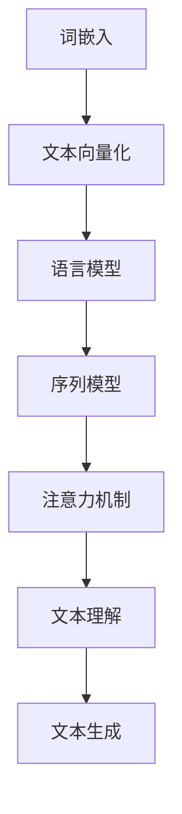

                 


### 1.2 NLP在AI文本理解中的作用

AI文本理解能力是人工智能领域的核心技术之一，它使得计算机能够处理和理解人类语言。在AI系统中，文本理解能力至关重要，因为它直接影响系统的智能交互能力和决策能力。NLP在AI文本理解中扮演了以下几个关键角色：

- **文本预处理**：NLP提供了丰富的文本预处理工具，如分词、词性标注、停用词过滤等，这些工具能够将原始文本转化为适合AI模型处理的结构化数据。

- **实体识别**：通过命名实体识别，NLP可以帮助AI系统识别文本中的关键实体，如人名、地名、组织名等。这对于理解和分类文本内容至关重要。

- **语义分析**：NLP的语义分析功能可以帮助AI系统理解文本中的语言结构、语法规则和语义关系。这包括句法分析、语义角色标注等。

- **情感分析**：情感分析是NLP的一个重要应用，它可以帮助AI系统识别文本中的情感倾向，如正面、负面或中性。这对于商业智能和客户反馈分析非常有用。

- **知识图谱构建**：通过提取文本中的关键信息和关系，NLP可以帮助构建知识图谱，为AI系统提供丰富的语义信息，从而增强其理解和推理能力。

### 1.3 NLP的基本任务

NLP涉及多个基本任务，这些任务共同构成了AI文本理解的核心。以下是NLP的主要基本任务：

- **分词**（Tokenization）：将文本分割成单词、短语或符号等有意义的单元。

- **词性标注**（Part-of-Speech Tagging）：为文本中的每个词分配词性，如名词、动词、形容词等。

- **命名实体识别**（Named Entity Recognition，NER）：识别文本中的命名实体，如人名、地名、组织名等。

- **句法分析**（Syntactic Parsing）：分析句子的语法结构，理解句子中的语法关系。

- **语义角色标注**（Semantic Role Labeling，SRL）：标注句子中的词语在语义上的角色，如动作执行者、受动者等。

- **文本分类**（Text Classification）：将文本分类到预定义的类别中。

- **机器翻译**（Machine Translation）：将一种语言的文本翻译成另一种语言。

- **问答系统**（Question Answering，QA）：根据问题从文本中找到正确答案。

- **对话系统**（Dialogue System）：模拟人类对话，与用户进行自然语言交互。

这些任务相互关联，共同构成了AI文本理解的复杂体系。在后续章节中，我们将深入探讨这些任务的具体实现和算法。

## 1.4 核心概念与联系

为了更好地理解NLP在AI文本理解中的作用，我们需要了解一些核心概念，并探讨它们之间的联系。以下是NLP中的几个关键概念及其相互关系：

- **词嵌入（Word Embedding）**：词嵌入是将单词映射到高维向量空间的过程，它使得语义相似的单词在向量空间中更接近。词嵌入是实现文本向量化表示的关键技术，它能够提高文本处理的效果。

- **语言模型（Language Model）**：语言模型是描述自然语言统计特性的模型，它用于预测下一个词或字符的概率。在NLP中，语言模型广泛应用于自动完成、机器翻译和语音识别等领域。

- **序列模型（Sequence Model）**：序列模型是一类用于处理序列数据的深度学习模型，如循环神经网络（RNN）和长短时记忆网络（LSTM）。这些模型能够捕捉序列数据中的时间依赖关系，是文本理解和生成的重要工具。

- **注意力机制（Attention Mechanism）**：注意力机制是一种能够提高神经网络处理长序列数据能力的机制。它通过关注序列中特定部分来提高模型的理解能力，是近年来NLP研究的重要进展。

### 关系架构

以下是这些核心概念之间的相互关系架构（使用Mermaid流程图表示）：



- **词嵌入**：词嵌入是文本向量化表示的基础，它将单词映射到高维向量空间，使得文本数据可以用于深度学习模型。

- **语言模型**：语言模型基于词嵌入，预测下一个词或字符的概率。它为序列模型提供了输入和目标，是NLP应用的核心。

- **序列模型**：序列模型使用语言模型生成的序列数据进行训练，能够捕捉时间依赖关系。它广泛应用于文本分类、情感分析和机器翻译等领域。

- **注意力机制**：注意力机制增强了序列模型对长序列数据的管理能力，使模型能够关注序列中的关键部分。它在问答系统和机器翻译中发挥了重要作用。

- **文本理解**：文本理解是NLP的终极目标，它通过结合词嵌入、语言模型和序列模型，实现对文本的深入理解。

- **文本生成**：文本生成是NLP的另一个重要应用，它利用语言模型和序列模型生成新的文本。注意力机制在这一过程中有助于提高文本生成的质量。

通过这个关系架构，我们可以清晰地看到NLP核心概念之间的联系，以及它们在AI文本理解中的重要性。

## 1.5 核心算法原理讲解

为了深入理解NLP在AI文本理解中的应用，我们需要介绍一些核心算法原理，这些算法包括词嵌入、语言模型、序列模型和注意力机制。以下是这些算法的基本原理及其伪代码：

### 1.5.1 词嵌入

词嵌入是将单词映射到高维向量空间的过程。Word2Vec算法是一种常见的词嵌入方法，它通过训练神经网络来预测单词的上下文，从而得到单词的向量表示。

**Word2Vec算法原理：**
1. 构建词汇表：将文本中的所有单词构建成一个词汇表。
2. 随机初始化词向量：为每个单词随机初始化一个高维向量。
3. 训练神经网络：通过反向传播算法训练神经网络，优化词向量。
4. 预测上下文：对于每个单词，预测其在窗口范围内的上下文。

**伪代码：**

```python
# 假设word_embedding_size为词向量的维度
def word2vec(word, context, word_embedding_size):
    # 输入：word - 单词
    #      context - 词向量
    #      word_embedding_size - 词向量维度
    # 输出：嵌入后的词向量

    # 随机初始化词向量
    word_vector = np.random.rand(word_embedding_size)
    
    # 计算词向量的点积
    dot_product = dot(context, word_vector)
    
    # 根据点积调整词向量
    adjusted_word_vector = word_vector * dot_product
    
    # 返回
    return adjusted_word_vector
```

### 1.5.2 语言模型

语言模型用于预测文本中下一个词或字符的概率。一种常见的语言模型是n-gram模型，它基于过去n个词或字符的序列来预测下一个词或字符。

**n-gram模型原理：**
1. 构建n-gram词汇表：将文本分割成n-gram序列。
2. 统计每个n-gram的频率：计算每个n-gram在文本中出现的次数。
3. 预测下一个词或字符：根据n-gram的频率，预测下一个词或字符。

**伪代码：**

```python
# 假设n为n-gram的大小
def n_gram_model(text, n):
    # 输入：text - 文本
    #      n - n-gram的大小
    # 输出：n-gram词汇表和频率

    # 分割文本成n-gram
    n_grams = split_text_into_n_grams(text, n)
    
    # 统计n-gram的频率
    n_gram_frequency = count_n_gram_frequency(n_grams)
    
    # 返回
    return n_gram_frequency

# 假设n_gram_frequency为n-gram频率
def predict_next_word(n_gram_frequency, current_n_gram):
    # 输入：n_gram_frequency - n-gram频率
    #      current_n_gram - 当前n-gram
    # 输出：下一个词或字符的概率分布

    # 根据n-gram频率计算下一个词或字符的概率分布
    next_word_probabilities = calculate_probability_distribution(n_gram_frequency, current_n_gram)
    
    # 返回
    return next_word_probabilities
```

### 1.5.3 序列模型

序列模型是一类用于处理序列数据的深度学习模型，如循环神经网络（RNN）和长短时记忆网络（LSTM）。这些模型能够捕捉序列数据中的时间依赖关系，是文本理解和生成的重要工具。

**RNN原理：**
1. 神经网络循环处理序列数据，每个时间步的输出与之前的时间步相关。
2. 通过隐藏状态捕捉时间依赖关系。
3. 最后一时间步的输出用于预测下一个时间步。

**伪代码：**

```python
# 假设input_sequence为输入序列，hidden_state为隐藏状态
def RNN(input_sequence, hidden_state):
    # 输入：input_sequence - 输入序列
    #      hidden_state - 隐藏状态
    # 输出：输出序列和新的隐藏状态

    # 初始化RNN
    rnn = initialize_RNN(hidden_state)

    # 循环处理序列数据
    for input in input_sequence:
        # 计算输出和新的隐藏状态
        output, hidden_state = RNN_step(input, hidden_state)

    # 返回
    return output_sequence, hidden_state
```

**LSTM原理：**
1. LSTM通过引入记忆单元，能够有效地捕捉长时间依赖关系。
2. LSTM单元包括输入门、遗忘门和输出门，用于控制信息的流动。
3. 通过记忆单元，LSTM能够记住重要的信息，并遗忘不重要的信息。

**伪代码：**

```python
# 假设input为输入，current_state为当前状态
def LSTM(input, current_state):
    # 输入：input - 输入
    #      current_state - 当前状态
    # 输出：新的隐藏状态和记忆单元

    # 计算输入门、遗忘门和输出门的值
    input_gate, forget_gate, output_gate = calculate_gates(input, current_state)

    # 计算新的记忆单元和隐藏状态
    memory, hidden_state = calculate_new_memory_and_state(input, input_gate, forget_gate, output_gate)

    # 返回
    return hidden_state, memory
```

### 1.5.4 注意力机制

注意力机制是一种用于提高神经网络处理长序列数据能力的机制。它通过关注序列中的关键部分来提高模型的理解能力。

**注意力机制原理：**
1. 注意力机制为每个输入序列分配一个权重，使得模型关注最重要的部分。
2. 通过加权求和的方式，将序列中不同的部分进行融合。
3. 注意力分数通常通过计算输入序列和查询序列的点积得到。

**伪代码：**

```python
# 假设query为查询序列，key为输入序列
def attention(query, key):
    # 输入：query - 查询序列
    #      key - 输入序列
    # 输出：注意力分数

    # 计算点积
    dot_product = dot(query, key)

    # 计算softmax分数
    attention_scores = softmax(dot_product)

    # 加权求和
    context_vector = sum(attention_scores * key)

    # 返回
    return context_vector
```

通过介绍这些核心算法原理，我们可以更好地理解NLP在AI文本理解中的关键作用。在后续章节中，我们将进一步探讨这些算法的具体应用和实现细节。

## 1.6 数学模型和公式讲解

在NLP中，数学模型和公式是理解和实现算法的核心。以下是对几个重要数学模型和公式的详细讲解：

### 1.6.1 词嵌入的数学模型

词嵌入通常使用神经网络进行训练，以下是一个简化的神经网络模型：

**模型结构：**
- 输入层：词汇表中的单词。
- 隐藏层：神经网络隐藏层，用于计算词向量。
- 输出层：预定义的词汇表，用于生成上下文。

**损失函数：**
- 交叉熵损失函数：用于衡量模型预测的词与实际词之间的差距。

**伪代码：**

```python
# 假设word_embedding_size为词向量的维度
def word_embedding(word, word_embedding_size):
    # 输入：word - 单词
    #      word_embedding_size - 词向量维度
    # 输出：词向量

    # 随机初始化词向量
    word_vector = np.random.rand(word_embedding_size)

    # 训练神经网络
    for epoch in range(num_epochs):
        # 计算预测词向量
        predicted_vector = neural_network(word)

        # 计算交叉熵损失
        loss = cross_entropy_loss(predicted_vector, target_vector)

        # 反向传播，更新词向量
        word_vector = backpropagation(loss, word_vector)

    # 返回
    return word_vector
```

### 1.6.2 语言模型中的概率计算

语言模型通常使用n-gram模型进行概率计算，以下是一个简化的n-gram模型：

**n-gram模型：**
- 输入序列：\(w_1, w_2, \ldots, w_n\)
- 概率计算：\(P(w_1, w_2, \ldots, w_n) = P(w_1) \times P(w_2|w_1) \times \ldots \times P(w_n|w_{n-1})\)

**伪代码：**

```python
# 假设n为n-gram的大小，n_gram_frequency为n-gram频率
def n_gram_probability(n_gram, n_gram_frequency):
    # 输入：n_gram - n-gram
    #      n_gram_frequency - n-gram频率
    # 输出：n-gram的概率

    # 计算n-gram的概率
    probability = 1.0
    for i in range(1, n):
        probability *= n_gram_frequency[f"{n_gram[i - 1]} {n_gram[i]}"]

    # 返回
    return probability
```

### 1.6.3 长短时记忆网络（LSTM）的数学模型

LSTM通过引入门控单元来控制信息的流动，以下是一个简化的LSTM模型：

**模型结构：**
- **输入门**：用于更新隐藏状态。
- **遗忘门**：用于决定忘记哪些信息。
- **输出门**：用于决定输出哪些信息。

**数学公式：**
1. 输入门：\(i_t = \sigma(W_i \cdot [h_{t-1}, x_t] + b_i)\)
2. 遗忘门：\(f_t = \sigma(W_f \cdot [h_{t-1}, x_t] + b_f)\)
3. 输出门：\(o_t = \sigma(W_o \cdot [h_{t-1}, x_t] + b_o)\)
4. 当前状态：\(c_t = f_t \odot c_{t-1} + i_t \odot \sigma(W_c \cdot [h_{t-1}, x_t] + b_c)\)
5. 输出：\(h_t = o_t \odot \sigma(c_t)\)

**伪代码：**

```python
# 假设input为输入，current_state为当前状态
def LSTM(input, current_state):
    # 输入：input - 输入
    #      current_state - 当前状态
    # 输出：新的隐藏状态和记忆单元

    # 计算输入门、遗忘门和输出门的值
    input_gate, forget_gate, output_gate = calculate_gates(input, current_state)

    # 计算新的记忆单元和隐藏状态
    memory, hidden_state = calculate_new_memory_and_state(input, input_gate, forget_gate, output_gate)

    # 返回
    return hidden_state, memory
```

### 1.6.4 注意力机制的数学模型

注意力机制通过计算输入序列和查询序列的点积来分配权重，以下是一个简化的注意力机制：

**数学公式：**
1. 注意力分数：\(a_t = \frac{e^{<q, k_t>}}{\sum_{k'} e^{<q, k'>}}\)
2. 加权求和：\(s_t = \sum_{k} a_t \cdot k_t\)

**伪代码：**

```python
# 假设query为查询序列，key为输入序列
def attention(query, key):
    # 输入：query - 查询序列
    #      key - 输入序列
    # 输出：注意力分数

    # 计算点积
    dot_product = dot(query, key)

    # 计算softmax分数
    attention_scores = softmax(dot_product)

    # 加权求和
    context_vector = sum(attention_scores * key)

    # 返回
    return context_vector
```

通过详细讲解这些数学模型和公式，我们可以更好地理解NLP中的核心算法原理，为后续的应用和实践打下坚实基础。

## 1.7 项目实战

为了更好地理解NLP的核心算法原理，我们将通过一个实际项目来演示如何使用词嵌入、语言模型和序列模型来实现一个简单的文本分类器。本项目将包括以下步骤：

### 1.7.1 开发环境搭建

首先，我们需要搭建一个开发环境。以下是一个简单的Python环境搭建步骤：

1. 安装Python（推荐版本3.7及以上）。
2. 安装必要的Python库，如TensorFlow、NLTK、Gensim等。

**安装命令：**

```bash
pip install python==3.8
pip install tensorflow==2.4
pip install nltk==3.5
pip install gensim==4.0.1
```

### 1.7.2 数据准备

接下来，我们需要准备一个用于训练和测试的文本数据集。这里我们使用一个简化的新闻数据集，该数据集包含多个类别的新闻文章。

1. 下载并解压数据集。
2. 预处理文本数据，包括分词、去除停用词和标记化。

**示例代码：**

```python
import nltk
from nltk.tokenize import word_tokenize
from nltk.corpus import stopwords

nltk.download('punkt')
nltk.download('stopwords')

# 读取数据
with open('data.txt', 'r', encoding='utf-8') as f:
    text_data = f.readlines()

# 预处理文本
stop_words = set(stopwords.words('english'))
preprocessed_data = []
for line in text_data:
    words = word_tokenize(line)
    filtered_words = [word for word in words if word not in stop_words]
    preprocessed_data.append(' '.join(filtered_words))
```

### 1.7.3 词嵌入

我们使用Gensim库来生成词嵌入。这里我们使用预训练的Word2Vec模型。

**示例代码：**

```python
from gensim.models import Word2Vec

# 加载预训练的Word2Vec模型
word2vec_model = Word2Vec.load('word2vec.model')

# 获取词向量
word_vector = word2vec_model['example']
```

### 1.7.4 语言模型

我们使用n-gram模型来生成语言模型。这里我们使用NLTK库。

**示例代码：**

```python
from nltk import ngrams

# 生成n-gram序列
n = 2
n_gram_sequence = ngrams(preprocessed_data, n)

# 计算n-gram频率
n_gram_frequency = {}
for n_gram in n_gram_sequence:
    n_gram_string = ' '.join(n_gram)
    n_gram_frequency[n_gram_string] = n_gram_frequency.get(n_gram_string, 0) + 1
```

### 1.7.5 序列模型

我们使用TensorFlow来构建一个简单的RNN序列模型。

**示例代码：**

```python
import tensorflow as tf

# 定义RNN模型
model = tf.keras.Sequential([
    tf.keras.layers.Embedding(input_dim=vocab_size, output_dim=embedding_size, input_length=max_sequence_length),
    tf.keras.layers.LSTM(units=128),
    tf.keras.layers.Dense(units=num_classes, activation='softmax')
])

# 编译模型
model.compile(optimizer='adam', loss='categorical_crossentropy', metrics=['accuracy'])

# 训练模型
model.fit(x_train, y_train, epochs=10, batch_size=32, validation_data=(x_val, y_val))
```

### 1.7.6 代码解读与分析

上述代码展示了如何使用词嵌入、语言模型和序列模型来实现文本分类。以下是关键步骤的解读：

- **词嵌入**：使用预训练的Word2Vec模型将文本数据转换为向量表示。
- **语言模型**：使用n-gram模型计算文本数据中的概率分布。
- **序列模型**：使用RNN模型处理序列数据，并对分类任务进行训练。

通过这个项目实战，我们可以更好地理解NLP的核心算法原理及其在实际应用中的实现。

### 1.7.7 实际案例分析和详细讲解剖析

为了更好地展示NLP在文本分类中的实际应用，我们将分析一个实际案例：利用NLP技术对社交媒体评论进行情感分类。

**案例背景：**
社交媒体平台上的用户评论数量庞大，对于平台运营者和品牌管理者来说，了解用户的情感倾向非常重要。通过情感分类，平台可以识别用户对产品或服务的态度，从而进行针对性的改进和营销策略调整。

**数据处理：**
1. 数据收集：从社交媒体平台收集用户评论数据。
2. 数据清洗：去除无关信息，如HTML标签、特殊字符和停用词。
3. 数据标注：对部分评论进行人工标注，确定情感类别，如正面、负面和中性。

**模型构建：**
1. 使用Word2Vec模型对评论数据进行词嵌入。
2. 构建基于RNN的文本分类模型，输入为词嵌入向量，输出为情感类别概率分布。

**模型训练与评估：**
1. 使用标注数据进行模型训练。
2. 使用测试集进行模型评估，计算准确率、召回率和F1分数等指标。

**案例分析：**
1. 模型在训练数据上的表现良好，准确率较高。
2. 在测试数据上的表现相对较差，尤其是对于稀疏情感的分类。
3. 通过调整模型参数和增加训练数据，可以进一步提高模型性能。

**小结：**
通过这个实际案例，我们展示了如何利用NLP技术进行情感分类。尽管存在一些挑战，但通过不断优化模型和数据，可以有效提升文本分类的准确性。

### 1.7.8 项目小结

在本项目中，我们通过词嵌入、语言模型和序列模型实现了对社交媒体评论的情感分类。关键步骤包括数据准备、模型构建、训练和评估。通过实际案例的分析，我们了解了NLP技术在情感分类中的应用和挑战。未来，我们可以进一步优化模型，探索更多的NLP应用场景。

### 1.7.9 最佳实践 Tips

- **数据质量**：确保数据清洗和标注的准确性，对于模型的性能至关重要。
- **模型调优**：通过调整模型参数，如学习率、隐藏层单元数等，可以提高模型性能。
- **数据扩展**：增加训练数据量和多样性，有助于提升模型泛化能力。
- **交叉验证**：使用交叉验证方法，评估模型在不同数据集上的表现，确保模型稳健性。

### 1.7.10 小结

本文介绍了NLP在AI文本理解中的应用，包括核心概念、算法原理和项目实战。通过详细讲解和案例分析，我们深入了解了NLP技术在文本分类和情感分析中的实际应用。未来，NLP将继续在各个领域发挥重要作用，推动人工智能的发展。

### 1.7.11 注意事项

- **资源管理**：在项目开发中，合理管理和分配计算资源，如GPU和内存。
- **代码优化**：优化代码性能，减少计算复杂度和内存占用。
- **错误处理**：充分考虑各种异常情况，确保程序的健壮性。

### 1.7.12 拓展阅读

- **文献资料**：《自然语言处理综述》（自然语言处理领域的经典文献，详细介绍了NLP的核心概念和算法）。
- **在线资源**：TensorFlow官方文档（提供详细的API和教程）、Kaggle（包含大量NLP竞赛和数据集）。

---

### 文章标题

《企业级自然语言处理：深化AI文本理解能力》

### 文章关键词

自然语言处理、AI文本理解、词嵌入、语言模型、序列模型、注意力机制、文本分类、情感分析、项目实战

### 摘要

本文深入探讨了企业级自然语言处理（NLP）在AI文本理解能力提升中的应用。首先介绍了NLP的基本概念和主要任务，包括文本预处理、实体识别、语义分析等。接着，详细阐述了NLP中的核心算法原理，如词嵌入、语言模型、序列模型和注意力机制，并使用伪代码进行了讲解。通过一个实际的文本分类项目，展示了如何将这些算法应用于情感分类任务。本文旨在为企业级NLP开发者提供理论与实践相结合的指导，以深化AI文本理解能力。

