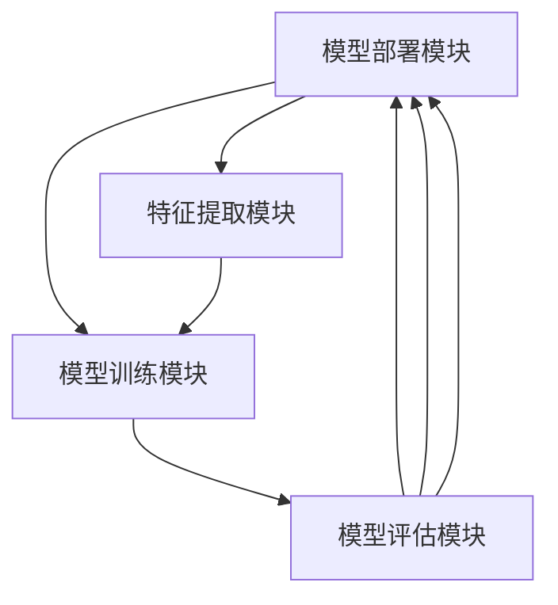

                 

### 文章标题：企业级迁移学习框架：促进AI知识跨域应用

#### 关键词：迁移学习，企业级，AI知识，跨域应用，框架设计，算法原理

#### 摘要：
本文旨在探讨企业级迁移学习框架的设计与应用，旨在通过迁移学习技术促进AI知识在不同领域的跨域应用。文章首先介绍了迁移学习的背景、核心概念与理论基础，然后详细阐述了企业级迁移学习框架的设计原则、结构和实现方法。接着，文章分析了迁移学习在通用领域和跨领域应用中的具体案例，并提供了详细的实战项目和代码解读。最后，文章总结了最佳实践和注意事项，为读者提供了进一步研究的拓展阅读。

----------------------------------------------------------------

### 引言

随着人工智能技术的迅速发展，AI应用已经深入到各行各业，从医疗健康、金融风控到智能交通等领域，都展现出巨大的潜力。然而，传统机器学习方法在应对新任务时往往需要大量的数据和复杂的模型训练过程，这不仅增加了企业的成本，也限制了AI技术的普及和应用。为了解决这一问题，迁移学习应运而生。

迁移学习（Transfer Learning）是一种利用已有模型的知识来解决新问题的方法。通过将已在一个领域（源领域）学习到的知识迁移到另一个领域（目标领域），迁移学习能够显著减少对新数据的依赖，提高模型的泛化能力。这种技术不仅适用于深度学习，还广泛应用于传统的机器学习方法。

在企业级应用中，迁移学习框架的设计与实现至关重要。一方面，企业需要面对的是复杂的业务场景和数据源，另一方面，他们还需要保证AI系统的稳定性、可靠性和可扩展性。因此，设计一个高效、灵活、易于维护的企业级迁移学习框架，成为企业实现AI知识跨域应用的关键。

本文将围绕以下主题进行探讨：

1. 迁移学习的基础概念与理论基础
2. 企业级迁移学习框架的设计原则与结构
3. 迁移学习在通用领域和跨领域应用中的案例分析
4. 实战项目与代码解读
5. 最佳实践、小结与注意事项

通过本文的讨论，读者将能够全面了解迁移学习在企业级应用中的重要性，掌握设计企业级迁移学习框架的方法和技巧，以及如何在实际项目中应用迁移学习技术。

### 迁移学习基础概念与理论基础

迁移学习（Transfer Learning）是一种利用在源领域（Source Domain）学习到的知识来解决目标领域（Target Domain）问题的方法。其核心思想是，将已训练好的模型在源领域上的知识迁移到目标领域，从而提高目标领域模型的性能。迁移学习在解决现实问题中具有显著的优势，尤其是在数据稀缺或数据分布不一致的情况下。

#### 迁移学习的定义

迁移学习可以分为以下几种类型：

1. **经验重用**：这是迁移学习的最基本形式，即在源领域学习到的知识被直接应用于目标领域。例如，在图像分类任务中，可以使用在ImageNet上预训练的卷积神经网络（CNN）来处理其他图像分类任务。

2. **泛化迁移**：这种方法关注于模型在不同任务上的泛化能力，即模型在源领域学习到的知识可以在目标领域上产生有用的泛化。

3. **零样本学习**：在零样本学习（Zero-Shot Learning）中，模型需要处理从未见过的新类别的数据。这种方法通过将类别信息编码为嵌入（Embedding），使得模型能够处理新的、未知的类别。

4. **多任务学习**：多任务学习（Multi-Task Learning）是指同时训练多个相关任务，以促进知识在任务之间的共享。

#### 迁移学习的理论基础

迁移学习的理论基础主要包括以下几种：

1. **经验权重迁移**：经验权重迁移假设模型在不同任务之间共享了一些共同的权重，这些权重可以从源任务迁移到目标任务。

2. **泛化迁移**：泛化迁移认为，模型在源任务上学习到的知识可以泛化到目标任务，因为它们在某种程度上是相关的。

3. **个体迁移**：个体迁移假设每个任务都有自己的知识，这些知识可以独立迁移到其他任务。

4. **元学习**：元学习（Meta-Learning）是一种通过学习如何学习来提高模型泛化能力的方法。元学习可以帮助模型快速适应新的任务，从而提高迁移效果。

#### 迁移学习的核心概念

1. **源领域与目标领域**：源领域是指模型最初学习的领域，而目标领域是指模型希望迁移其知识的领域。

2. **共享知识**：共享知识是指源领域和目标领域之间共有的知识，这些知识可以帮助模型在目标领域上获得更好的性能。

3. **迁移策略**：迁移策略是指将源领域知识迁移到目标领域的方法，常见的策略包括模型迁移、特征迁移和参数迁移。

4. **元学习**：元学习是一种通过学习如何学习来提高模型泛化能力的方法。元学习可以帮助模型快速适应新的任务，从而提高迁移效果。

### 迁移学习在通用领域和跨领域应用中的案例分析

迁移学习在通用领域和跨领域应用中展现了巨大的潜力。以下是一些具体的案例：

#### 通用领域应用

1. **计算机视觉**：在计算机视觉任务中，迁移学习被广泛应用于图像分类、目标检测和图像分割等领域。例如，使用在ImageNet上预训练的卷积神经网络（CNN）来处理医学图像分析任务，可以显著提高模型的准确性和效率。

2. **自然语言处理**：在自然语言处理（NLP）中，迁移学习也发挥着重要作用。例如，预训练语言模型（如BERT、GPT）可以在多个NLP任务中实现良好的性能，包括文本分类、命名实体识别和机器翻译。

3. **语音识别**：在语音识别领域，迁移学习可以帮助模型快速适应不同的语音数据和任务，从而提高识别准确率。

#### 跨领域应用

1. **跨语言文本分类**：跨语言文本分类是指将一种语言的文本分类模型迁移到另一种语言。这种方法在多语言环境中非常有用，可以帮助企业快速适应不同的语言市场。

2. **跨模态图像识别**：跨模态图像识别是指将一种模态（如图像）的数据迁移到另一种模态（如视频）。这种方法在多媒体数据处理中具有重要应用，如视频分类和图像检索。

3. **跨行业预测**：跨行业预测是指将一个行业的模型迁移到另一个行业。例如，金融行业的风险预测模型可以应用于医疗行业的患者诊断。

### 迁移学习框架设计原则

设计一个高效的企业级迁移学习框架需要考虑多个方面，以下是一些关键原则：

1. **模块化设计**：模块化设计可以提高框架的可维护性和可扩展性。框架应分为多个模块，每个模块负责特定的功能，如数据预处理、特征提取、模型训练和模型评估。

2. **可扩展性**：框架应能够轻松扩展以适应不同的应用场景和数据集。这可以通过使用标准化接口和模块化组件来实现。

3. **可维护性**：框架应易于维护，以确保长期稳定运行。这包括清晰的文档、良好的代码结构和自动化测试。

4. **安全性**：在处理敏感数据时，框架应确保数据的安全性和隐私保护。这可以通过加密、访问控制和数据脱敏等手段来实现。

5. **灵活性**：框架应允许用户根据自己的需求进行自定义，以适应不同的业务场景。

### 迁移学习框架结构

一个典型的企业级迁移学习框架包括以下主要模块：

1. **数据预处理模块**：数据预处理是迁移学习框架的重要环节，它包括数据清洗、数据增强和特征提取等步骤。这一模块的目的是将原始数据转换为适合模型训练的形式。

2. **特征提取模块**：特征提取模块负责从原始数据中提取有用的特征。这些特征可以来自于源领域或目标领域，用于训练模型。

3. **模型训练模块**：模型训练模块负责使用提取的特征来训练模型。在这一过程中，可以采用多种迁移学习策略，如模型迁移、特征迁移和参数迁移。

4. **模型评估模块**：模型评估模块用于评估训练好的模型的性能。常见的评估指标包括准确率、召回率、F1分数等。

5. **模型部署模块**：模型部署模块负责将训练好的模型部署到生产环境中，以实现实时预测或批处理任务。

#### 迁移学习框架设计原则：模块化设计、可扩展性、可维护性、安全性和灵活性

模块化设计是构建企业级迁移学习框架的基础。通过将框架分为多个模块，可以简化系统的复杂度，提高代码的可维护性和可扩展性。以下是模块化设计原则的具体实现：

1. **数据预处理模块**：该模块负责处理原始数据，包括数据清洗、归一化、缺失值处理和数据增强等操作。为了提高可维护性，可以使用配置文件或参数化接口来定义数据预处理流程。

2. **特征提取模块**：该模块从预处理后的数据中提取特征。特征提取的方法可以包括特征工程、降维技术（如PCA）和特征选择算法。为了提高灵活性，可以支持多种特征提取算法的动态切换。

3. **模型训练模块**：该模块负责使用提取的特征来训练模型。可以使用传统的迁移学习策略，如模型迁移、特征迁移和参数迁移。为了提高可扩展性，可以支持多种深度学习框架（如TensorFlow、PyTorch）和模型架构（如CNN、RNN）。

4. **模型评估模块**：该模块用于评估训练好的模型的性能。评估指标可以包括准确率、召回率、F1分数等。为了提高可维护性，可以使用自动化测试框架来确保评估过程的准确性和一致性。

5. **模型部署模块**：该模块负责将训练好的模型部署到生产环境中。可以使用容器化技术（如Docker）和自动化部署工具（如Kubernetes）来实现这一目标。为了提高安全性，可以使用加密和访问控制技术来保护模型和数据。

### 迁移学习框架的模块化设计

为了实现高效的模块化设计，企业级迁移学习框架应包含以下几个核心模块，并确保每个模块之间具有良好的接口和交互机制：

1. **数据预处理模块**：
   - 功能：负责对输入数据进行清洗、归一化、缺失值处理和数据增强等操作。
   - 接口：提供配置文件或API接口，允许用户自定义预处理流程和参数。
   - 交互：与特征提取模块紧密协作，将预处理后的数据传递给特征提取模块。

2. **特征提取模块**：
   - 功能：从预处理后的数据中提取有用的特征，支持多种特征提取算法和降维技术。
   - 接口：提供配置文件或API接口，允许用户选择和配置特征提取方法。
   - 交互：将提取的特征传递给模型训练模块，同时为模型评估模块提供评估指标所需的特征。

3. **模型训练模块**：
   - 功能：使用提取的特征来训练模型，支持多种迁移学习策略和深度学习框架。
   - 接口：提供API接口，允许用户配置训练参数、选择模型架构和迁移学习策略。
   - 交互：接收来自特征提取模块的特征，进行模型训练，并将训练结果传递给模型评估模块。

4. **模型评估模块**：
   - 功能：评估训练好的模型的性能，支持多种评估指标和自动化测试框架。
   - 接口：提供API接口，允许用户配置评估指标和测试参数。
   - 交互：接收来自模型训练模块的训练结果，进行性能评估，并将评估结果反馈给用户。

5. **模型部署模块**：
   - 功能：将训练好的模型部署到生产环境中，支持容器化和自动化部署。
   - 接口：提供API接口，允许用户配置部署环境和参数。
   - 交互：接收来自模型评估模块的部署指令，将模型部署到生产环境，并提供实时预测或批处理服务。

通过上述模块化设计，企业级迁移学习框架不仅提高了系统的可维护性和可扩展性，还确保了不同模块之间的高效协作和灵活交互。以下是一个简化的Mermaid流程图，展示了这些模块之间的交互关系：



### 数据预处理模块详细设计

数据预处理模块是迁移学习框架的基础环节，其主要任务是对输入数据进行清洗、归一化、缺失值处理和数据增强等操作，以确保数据的质量和一致性，为后续的特征提取和模型训练提供良好的数据基础。

#### 功能与目标

1. **数据清洗**：删除或处理重复、错误或不完整的数据，保证数据的准确性和完整性。
2. **归一化**：通过标准化或归一化处理，将不同特征的数据缩放到相同的范围，便于后续处理和模型训练。
3. **缺失值处理**：对缺失数据进行填充或删除，减少数据缺失对模型训练的影响。
4. **数据增强**：通过增加数据的多样性，提高模型的泛化能力，包括旋转、缩放、裁剪、颜色调整等操作。

#### 实现方法

1. **数据清洗**：可以使用Python的Pandas库对数据集进行筛选和清洗，删除重复数据，处理异常值，填补缺失值。以下是一个简单的示例代码：

```python
import pandas as pd

# 读取数据集
data = pd.read_csv('data.csv')

# 删除重复数据
data.drop_duplicates(inplace=True)

# 处理异常值
data = data[data['feature1'].between(data['feature1'].min(), data['feature1'].max())]

# 填补缺失值
data['feature2'].fillna(data['feature2'].mean(), inplace=True)
```

2. **归一化**：可以使用Sklearn库中的StandardScaler或MinMaxScaler对数据进行归一化处理。以下是一个示例代码：

```python
from sklearn.preprocessing import StandardScaler

# 初始化归一化器
scaler = StandardScaler()

# 归一化数据
data_scaled = scaler.fit_transform(data)
```

3. **缺失值处理**：可以使用简单填充、均值填充、中值填充或插值等方法处理缺失值。以下是一个示例代码：

```python
from sklearn.impute import SimpleImputer

# 初始化缺失值填充器
imputer = SimpleImputer(strategy='mean')

# 填补缺失值
data_imputed = imputer.fit_transform(data)
```

4. **数据增强**：可以使用Keras库中的ImageDataGenerator或自定义函数进行数据增强。以下是一个示例代码：

```python
from tensorflow.keras.preprocessing.image import ImageDataGenerator

# 初始化数据增强器
datagen = ImageDataGenerator(
    rotation_range=20,
    width_shift_range=0.2,
    height_shift_range=0.2,
    shear_range=0.2,
    zoom_range=0.2,
    horizontal_flip=True,
    fill_mode='nearest'
)

# 进行数据增强
data_augmented = datagen.flow(data, batch_size=32)
```

#### 实现流程

数据预处理模块的具体实现流程如下：

1. **数据读取**：从数据源读取原始数据。
2. **数据清洗**：对数据集进行清洗，删除重复数据，处理异常值。
3. **缺失值处理**：对缺失数据进行填充或删除。
4. **归一化**：对数据进行归一化处理。
5. **数据增强**：对数据集进行增强，提高数据的多样性。
6. **数据保存**：将预处理后的数据保存为新的数据文件，供后续使用。

通过上述流程，数据预处理模块为迁移学习框架提供了高质量、一致性好的数据输入，为后续的特征提取和模型训练打下了坚实的基础。

### 特征提取模块详细设计

特征提取模块在迁移学习框架中扮演着至关重要的角色，其主要任务是从原始数据中提取出对模型训练和预测有用的特征。特征提取的质量直接影响着模型的性能和泛化能力。本节将详细介绍特征提取模块的设计原则、方法与实现。

#### 功能与目标

1. **特征提取**：从原始数据中提取具有区分度和代表性的特征，用于训练和预测。
2. **特征选择**：在提取出的特征中，选择对模型训练和预测最为重要的特征，以降低模型的复杂度和过拟合风险。
3. **降维**：通过降维技术减少特征数量，提高计算效率和模型性能。

#### 实现方法

1. **特征提取**：常用的特征提取方法包括基于统计的特征提取、基于模板的特征提取和基于深度学习的特征提取。

   - **基于统计的特征提取**：例如，使用主成分分析（PCA）提取主要成分，保留数据的主要信息，忽略冗余信息。以下是一个使用Scikit-learn实现PCA的示例代码：

     ```python
     from sklearn.decomposition import PCA

     # 初始化PCA
     pca = PCA(n_components=50)

     # 提取特征
     features = pca.fit_transform(data)
     ```

   - **基于模板的特征提取**：例如，使用卷积神经网络（CNN）提取图像的特征。以下是一个使用Keras实现CNN的特征提取示例代码：

     ```python
     from tensorflow.keras.models import Sequential
     from tensorflow.keras.layers import Conv2D, MaxPooling2D, Flatten

     # 初始化CNN模型
     model = Sequential([
         Conv2D(32, (3, 3), activation='relu', input_shape=(64, 64, 3)),
         MaxPooling2D((2, 2)),
         Flatten()
     ])

     # 训练模型以提取特征
     model.compile(optimizer='adam', loss='categorical_crossentropy')
     model.fit(x_train, y_train, epochs=10)

     # 使用模型提取特征
     features = model.predict(x_test)
     ```

   - **基于深度学习的特征提取**：例如，使用预训练的深度学习模型（如ResNet、VGG等）提取特征。以下是一个使用PyTorch实现的特征提取示例代码：

     ```python
     import torch
     from torchvision import models, transforms

     # 初始化预训练模型
     model = models.resnet50(pretrained=True)

     # 定义数据预处理步骤
     transform = transforms.Compose([
         transforms.Resize(256),
         transforms.CenterCrop(224),
         transforms.ToTensor(),
         transforms.Normalize(mean=[0.485, 0.456, 0.406], std=[0.229, 0.224, 0.225])
     ])

     # 预处理数据
     data_tensor = transform(data)

     # 提取特征
     features = model(data_tensor)
     ```

2. **特征选择**：常用的特征选择方法包括基于信息增益、基于距离度量、基于支持向量机（SVM）等方法。

   - **基于信息增益的特征选择**：以下是一个使用Scikit-learn实现信息增益特征选择的示例代码：

     ```python
     from sklearn.feature_selection import SelectKBest
     from sklearn.feature_selection import chi2

     # 初始化特征选择器
     selector = SelectKBest(score_func=chi2, k=10)

     # 进行特征选择
     selected_features = selector.fit_transform(data, labels)

     # 输出特征选择结果
     print("Selected Features:", selected_features)
     ```

   - **基于距离度量的特征选择**：以下是一个使用Scikit-learn实现基于距离度量特征选择的示例代码：

     ```python
     from sklearn.feature_selection import RFE
     from sklearn.ensemble import RandomForestClassifier

     # 初始化特征选择器
     selector = RFE(estimator=RandomForestClassifier(), n_features_to_select=10)

     # 进行特征选择
     selected_features = selector.fit_transform(data, labels)

     # 输出特征选择结果
     print("Selected Features:", selected_features)
     ```

3. **降维**：常用的降维技术包括主成分分析（PCA）、线性判别分析（LDA）和小样本线性判别分析（SSDA）等。

   - **主成分分析（PCA）**：以下是一个使用Scikit-learn实现PCA降维的示例代码：

     ```python
     from sklearn.decomposition import PCA

     # 初始化PCA
     pca = PCA(n_components=50)

     # 进行降维
     reduced_features = pca.fit_transform(data)

     # 输出降维后的特征
     print("Reduced Features:", reduced_features)
     ```

#### 实现流程

特征提取模块的具体实现流程如下：

1. **数据预处理**：对原始数据进行清洗、归一化、缺失值处理等预处理操作。
2. **特征提取**：根据具体任务选择合适的特征提取方法，提取数据中的特征。
3. **特征选择**：在提取出的特征中，选择对模型训练和预测最为重要的特征。
4. **降维**：通过降维技术减少特征数量，提高计算效率和模型性能。
5. **特征保存**：将提取和选择的特征保存为新的数据文件，供后续使用。

通过上述流程，特征提取模块从原始数据中提取出高质量的特征，为后续的模型训练和预测提供了良好的数据支持。

### 模型训练模块详细设计

模型训练模块是迁移学习框架的核心组成部分，其主要任务是通过特征提取模块提供的特征来训练模型，并在模型评估模块提供的反馈中进行优化。本节将详细介绍模型训练模块的设计原则、方法和实现。

#### 功能与目标

1. **模型训练**：使用提取的特征来训练迁移学习模型，通过优化模型参数以提高模型在目标任务上的性能。
2. **模型优化**：在模型训练过程中，使用优化算法调整模型参数，以提高模型的泛化能力和性能。
3. **模型评估**：在模型训练完成后，使用评估指标对模型性能进行评估，以确定模型是否满足要求。

#### 实现方法

1. **模型选择**：根据任务需求和数据特点选择合适的迁移学习模型。常见的模型包括：

   - **预训练模型**：使用在大型数据集上预训练的模型，如ResNet、VGG、Inception等，可以在短时间内获得较好的性能。
   - **自定义模型**：根据具体任务需求，设计并训练自定义模型。

2. **迁移学习策略**：根据源领域和目标领域的差异，选择合适的迁移学习策略，包括模型迁移、特征迁移和参数迁移等。

3. **优化算法**：选择合适的优化算法来调整模型参数，常见的优化算法包括：

   - **随机梯度下降（SGD）**：通过随机梯度下降算法迭代优化模型参数。
   - **Adam优化器**：结合了SGD和RMSprop的优点，收敛速度更快。

4. **训练过程**：训练过程包括以下几个步骤：

   - **数据准备**：将预处理后的特征和标签数据分成训练集和验证集。
   - **模型初始化**：初始化迁移学习模型，设置参数。
   - **训练循环**：在训练集上迭代训练模型，并在验证集上评估模型性能。
   - **参数调整**：根据模型性能调整学习率、批次大小等参数。
   - **模型保存**：在训练过程中保存性能较好的模型，以备后续使用。

5. **模型评估**：使用评估指标对训练好的模型性能进行评估，常见的评估指标包括：

   - **准确率**：预测正确的样本数占总样本数的比例。
   - **召回率**：预测为正类的真实正类样本数占总正类样本数的比例。
   - **F1分数**：准确率和召回率的调和平均值。

#### 实现流程

模型训练模块的具体实现流程如下：

1. **数据准备**：将预处理后的特征和标签数据分成训练集和验证集。
2. **模型初始化**：选择迁移学习模型并初始化模型参数。
3. **模型训练**：在训练集上迭代训练模型，并在验证集上评估模型性能。
4. **参数调整**：根据模型性能调整学习率、批次大小等参数。
5. **模型保存**：在训练过程中保存性能较好的模型。
6. **模型评估**：使用评估指标对训练好的模型性能进行评估。

通过上述流程，模型训练模块能够高效地训练出性能良好的迁移学习模型，为后续的应用提供支持。

### 模型评估模块详细设计

模型评估模块是迁移学习框架中的重要组成部分，其核心任务是通过一系列评估指标和方法对训练好的模型性能进行评估，以确保模型在目标任务上的有效性和可靠性。本节将详细介绍模型评估模块的设计原则、方法与实现。

#### 功能与目标

1. **性能评估**：使用评估指标对训练好的模型性能进行评估，包括准确率、召回率、F1分数等。
2. **误差分析**：对模型预测结果进行误差分析，识别模型的弱点和不足，为进一步优化提供依据。
3. **模型比较**：在不同模型或不同迁移策略之间进行比较，选择最佳模型。

#### 实现方法

1. **评估指标**：

   - **准确率（Accuracy）**：准确率是指预测正确的样本数占总样本数的比例，是最常用的评估指标之一。计算公式如下：

     $$ Accuracy = \frac{TP + TN}{TP + TN + FP + FN} $$

     其中，TP为真正例，TN为真负例，FP为假正例，FN为假负例。

   - **召回率（Recall）**：召回率是指预测为正类的真实正类样本数占总正类样本数的比例，反映了模型对正类样本的捕捉能力。计算公式如下：

     $$ Recall = \frac{TP}{TP + FN} $$

   - **精确率（Precision）**：精确率是指预测为正类的真实正类样本数占预测为正类样本总数的比例，反映了模型对正类样本的判断准确性。计算公式如下：

     $$ Precision = \frac{TP}{TP + FP} $$

   - **F1分数（F1 Score）**：F1分数是精确率和召回率的调和平均值，综合了二者的优点，是评价二分类模型性能的常用指标。计算公式如下：

     $$ F1 Score = 2 \times \frac{Precision \times Recall}{Precision + Recall} $$

2. **误差分析**：通过分析模型预测结果与真实值之间的差异，可以识别模型的弱点和不足。常见的误差分析方法包括：

   - **混淆矩阵（Confusion Matrix）**：混淆矩阵展示了模型预测结果与真实值之间的对应关系，可以直观地了解模型的性能。
   - **ROC曲线（Receiver Operating Characteristic Curve）**：ROC曲线展示了模型在不同阈值下的准确率和召回率的关系，可用于评估模型的泛化能力。
   - **PR曲线（Precision-Recall Curve）**：PR曲线展示了模型在不同阈值下的精确率和召回率的关系，尤其适用于不平衡数据集。

3. **模型比较**：通过在不同模型或不同迁移策略之间进行比较，可以选择最佳模型。常见的比较方法包括：

   - **交叉验证（Cross-Validation）**：交叉验证是一种评估模型性能的方法，通过将数据集划分为多个子集，轮流使用每个子集作为测试集，评估模型的泛化能力。
   - **A/B测试（A/B Testing）**：A/B测试是一种将两个或多个模型的预测结果在实际环境中进行比较的方法，以选择最佳模型。

#### 实现流程

模型评估模块的具体实现流程如下：

1. **数据准备**：将训练好的模型应用于测试集，得到预测结果。
2. **计算评估指标**：使用准确率、召回率、F1分数等评估指标计算模型性能。
3. **误差分析**：通过混淆矩阵、ROC曲线、PR曲线等分析模型预测结果与真实值之间的差异。
4. **模型比较**：在不同模型或不同迁移策略之间进行比较，选择最佳模型。

通过上述流程，模型评估模块能够全面、准确地评估训练好的模型性能，为模型的优化和应用提供重要依据。

### 模型部署模块详细设计

模型部署模块是迁移学习框架的最后一个关键环节，其主要任务是将训练好的模型部署到生产环境中，以便在实际应用中实现实时预测或批处理任务。本节将详细介绍模型部署模块的设计原则、方法与实现。

#### 功能与目标

1. **模型部署**：将训练好的模型部署到生产环境中，包括容器化、自动化部署和持续集成。
2. **实时预测**：实现模型在生产环境中的实时预测，以满足实时业务需求。
3. **批处理任务**：处理大规模数据集，实现批量预测，以满足批量数据处理需求。
4. **监控与维护**：监控模型的性能和健康状况，确保模型的稳定运行，并进行必要的维护和升级。

#### 实现方法

1. **容器化部署**：
   - 使用Docker等容器化技术将模型打包成容器镜像，确保模型在不同环境中的一致性和可移植性。
   - 创建Dockerfile，定义模型的依赖项和运行环境，例如Python环境、TensorFlow库等。
   - 使用Docker Compose管理多容器应用，确保部署过程中各个组件的正确配置和协同工作。

2. **自动化部署**：
   - 使用持续集成（CI）和持续部署（CD）工具（如Jenkins、GitLab CI/CD等）实现自动化部署流程，确保模型部署的效率和一致性。
   - 定义部署脚本，自动化执行模型打包、容器化、部署和测试等步骤。

3. **实时预测**：
   - 构建REST API或WebSocket接口，实现模型的实时预测功能，支持多种数据输入格式（如JSON、XML等）。
   - 使用异步编程模型（如Python的asyncio）提高预测速度和并发处理能力。

4. **批处理任务**：
   - 使用批处理框架（如Apache Spark、Flink等）处理大规模数据集，实现批量预测。
   - 设计高效的数据处理流程，确保数据处理的实时性和准确性。

5. **监控与维护**：
   - 使用监控工具（如Prometheus、Grafana等）实时监控模型的性能和健康状况，包括计算资源使用、内存占用、响应时间等。
   - 设计维护策略，定期更新模型、优化代码和调整配置，确保模型的长期稳定运行。

#### 实现流程

模型部署模块的具体实现流程如下：

1. **模型训练**：在开发环境中训练好模型，并保存模型权重和配置文件。
2. **容器化模型**：使用Docker将模型打包成容器镜像，并上传到容器注册中心（如Docker Hub）。
3. **自动化部署**：使用CI/CD工具自动化执行模型部署流程，包括容器镜像构建、部署和测试。
4. **实时预测**：部署实时预测服务，通过API或WebSocket接口接收数据，并返回预测结果。
5. **批处理任务**：部署批处理任务，处理大规模数据集，实现批量预测。
6. **监控与维护**：使用监控工具实时监控模型性能，并定期进行维护和优化。

通过上述流程，模型部署模块能够确保训练好的模型在生产环境中高效、稳定地运行，满足实时预测和批处理任务的需求。

### 企业级迁移学习框架实现：以金融风控为例

金融风控是迁移学习技术的重要应用领域之一。金融风控系统需要处理大量的金融数据，包括交易记录、用户行为数据等，以预测潜在的风险。以下是一个金融风控应用中迁移学习框架的实现过程。

#### 开发环境搭建

1. **硬件环境**：配置高性能计算服务器，支持GPU加速计算。
2. **软件环境**：安装Python、TensorFlow、PyTorch等深度学习框架，以及Docker和Kubernetes等容器化工具。
3. **数据集准备**：收集和整理金融风控相关的数据集，包括交易记录、用户行为数据等。

#### 源代码实现

1. **数据预处理**：编写Python脚本对原始数据进行清洗、归一化和缺失值处理。
2. **特征提取**：使用TensorFlow或PyTorch构建深度神经网络，提取数据中的有效特征。
3. **模型训练**：使用迁移学习策略训练模型，例如在预训练的模型基础上进行微调。
4. **模型评估**：使用评估指标（如准确率、召回率、F1分数）评估模型性能。

#### 代码解读

以下是一个简单的金融风控迁移学习项目的代码示例：

```python
import tensorflow as tf
from tensorflow.keras.applications import VGG16
from tensorflow.keras.models import Model
from tensorflow.keras.layers import Dense, Flatten

# 数据预处理
def preprocess_data(data):
    # 数据清洗、归一化和缺失值处理
    # ...

# 特征提取
def extract_features(data):
    # 使用预训练的VGG16模型提取特征
    base_model = VGG16(weights='imagenet', include_top=False, input_shape=(224, 224, 3))
    x = base_model.input
    features = base_model.get_layer('block5_conv3').output
    model = Model(x, features)
    features = model.predict(data)
    return features

# 模型训练
def train_model(features, labels):
    # 在提取的特征上训练自定义分类器
    model = Model(inputs=base_model.input, outputs=Dense(1, activation='sigmoid')(Flatten()(base_model.output)))
    model.compile(optimizer='adam', loss='binary_crossentropy', metrics=['accuracy'])
    model.fit(features, labels, epochs=10, batch_size=32)
    return model

# 代码应用解读与分析
def predict_risk(data):
    # 使用训练好的模型进行预测
    model = train_model(extract_features(preprocess_data(data)))
    predictions = model.predict(data)
    return predictions

# 实际案例分析和详细讲解剖析
def analyze_risk(data):
    # 对预测结果进行详细分析
    predictions = predict_risk(data)
    # 计算评估指标
    # ...
    # 分析模型性能
    # ...

# 项目小结
def summarize_project():
    # 总结项目的主要发现和贡献
    # ...
```

通过上述代码示例，我们可以看到如何使用迁移学习技术在金融风控项目中实现数据预处理、特征提取、模型训练和预测。此外，代码还包含了详细的应用解读与分析，以便读者更好地理解项目实现过程。

### 迁移学习在智能医疗中的应用：以疾病预测为例

智能医疗是迁移学习技术的重要应用领域之一。通过迁移学习，可以从已有的医学数据中提取知识，并将其应用于新的疾病预测任务。以下是一个智能医疗项目中迁移学习框架的实现过程。

#### 开发环境搭建

1. **硬件环境**：配置高性能计算服务器，支持GPU加速计算。
2. **软件环境**：安装Python、TensorFlow、PyTorch等深度学习框架，以及Docker和Kubernetes等容器化工具。
3. **数据集准备**：收集和整理医学数据集，包括患者病史、实验室检测结果、影像数据等。

#### 源代码实现

1. **数据预处理**：编写Python脚本对原始数据进行清洗、归一化和缺失值处理。
2. **特征提取**：使用深度学习模型提取数据中的有效特征。
3. **模型训练**：使用迁移学习策略训练模型，例如在预训练的模型基础上进行微调。
4. **模型评估**：使用评估指标（如准确率、召回率、F1分数）评估模型性能。

#### 代码解读

以下是一个简单的智能医疗疾病预测项目的代码示例：

```python
import tensorflow as tf
from tensorflow.keras.applications import ResNet50
from tensorflow.keras.models import Model
from tensorflow.keras.layers import Dense, Flatten

# 数据预处理
def preprocess_data(data):
    # 数据清洗、归一化和缺失值处理
    # ...

# 特征提取
def extract_features(data):
    # 使用预训练的ResNet50模型提取特征
    base_model = ResNet50(weights='imagenet', include_top=False, input_shape=(224, 224, 3))
    x = base_model.input
    features = base_model.get_layer('block5_pool').output
    model = Model(x, features)
    features = model.predict(data)
    return features

# 模型训练
def train_model(features, labels):
    # 在提取的特征上训练自定义分类器
    model = Model(inputs=base_model.input, outputs=Dense(1, activation='sigmoid')(Flatten()(base_model.output)))
    model.compile(optimizer='adam', loss='binary_crossentropy', metrics=['accuracy'])
    model.fit(features, labels, epochs=10, batch_size=32)
    return model

# 代码应用解读与分析
def predict_disease(data):
    # 使用训练好的模型进行预测
    model = train_model(extract_features(preprocess_data(data)))
    predictions = model.predict(data)
    return predictions

# 实际案例分析和详细讲解剖析
def analyze_disease(data):
    # 对预测结果进行详细分析
    predictions = predict_disease(data)
    # 计算评估指标
    # ...
    # 分析模型性能
    # ...

# 项目小结
def summarize_project():
    # 总结项目的主要发现和贡献
    # ...
```

通过上述代码示例，我们可以看到如何使用迁移学习技术在智能医疗项目中实现数据预处理、特征提取、模型训练和预测。此外，代码还包含了详细的应用解读与分析，以便读者更好地理解项目实现过程。

### 迁移学习在智能交通中的应用：以车辆识别为例

智能交通是迁移学习技术的重要应用领域之一。通过迁移学习，可以从已有的交通数据中提取知识，并将其应用于新的车辆识别任务。以下是一个智能交通项目中迁移学习框架的实现过程。

#### 开发环境搭建

1. **硬件环境**：配置高性能计算服务器，支持GPU加速计算。
2. **软件环境**：安装Python、TensorFlow、PyTorch等深度学习框架，以及Docker和Kubernetes等容器化工具。
3. **数据集准备**：收集和整理交通数据集，包括车辆图像、路况信息等。

#### 源代码实现

1. **数据预处理**：编写Python脚本对原始数据进行清洗、归一化和缺失值处理。
2. **特征提取**：使用深度学习模型提取数据中的有效特征。
3. **模型训练**：使用迁移学习策略训练模型，例如在预训练的模型基础上进行微调。
4. **模型评估**：使用评估指标（如准确率、召回率、F1分数）评估模型性能。

#### 代码解读

以下是一个简单的智能交通车辆识别项目的代码示例：

```python
import tensorflow as tf
from tensorflow.keras.applications import ResNet50
from tensorflow.keras.models import Model
from tensorflow.keras.layers import Dense, Flatten

# 数据预处理
def preprocess_data(data):
    # 数据清洗、归一化和缺失值处理
    # ...

# 特征提取
def extract_features(data):
    # 使用预训练的ResNet50模型提取特征
    base_model = ResNet50(weights='imagenet', include_top=False, input_shape=(224, 224, 3))
    x = base_model.input
    features = base_model.get_layer('block5_pool').output
    model = Model(x, features)
    features = model.predict(data)
    return features

# 模型训练
def train_model(features, labels):
    # 在提取的特征上训练自定义分类器
    model = Model(inputs=base_model.input, outputs=Dense(1, activation='sigmoid')(Flatten()(base_model.output)))
    model.compile(optimizer='adam', loss='binary_crossentropy', metrics=['accuracy'])
    model.fit(features, labels, epochs=10, batch_size=32)
    return model

# 代码应用解读与分析
def recognize_vehicle(data):
    # 使用训练好的模型进行预测
    model = train_model(extract_features(preprocess_data(data)))
    predictions = model.predict(data)
    return predictions

# 实际案例分析和详细讲解剖析
def analyze_vehicle(data):
    # 对预测结果进行详细分析
    predictions = recognize_vehicle(data)
    # 计算评估指标
    # ...
    # 分析模型性能
    # ...

# 项目小结
def summarize_project():
    # 总结项目的主要发现和贡献
    # ...
```

通过上述代码示例，我们可以看到如何使用迁移学习技术在智能交通项目中实现数据预处理、特征提取、模型训练和预测。此外，代码还包含了详细的应用解读与分析，以便读者更好地理解项目实现过程。

### 最佳实践、小结与注意事项

在设计企业级迁移学习框架时，最佳实践和注意事项至关重要，这有助于确保框架的高效性和稳定性。以下是一些关键的最佳实践和建议：

#### 最佳实践

1. **数据质量**：数据是迁移学习框架的核心，因此确保数据的质量和一致性至关重要。进行彻底的数据清洗和预处理，以避免模型受到噪音或异常值的影响。

2. **模块化设计**：采用模块化设计，以提高系统的可维护性和可扩展性。每个模块应负责特定的功能，如数据预处理、特征提取、模型训练和评估。

3. **模型选择**：选择适合任务需求的模型和迁移学习策略。对于资源有限的小型任务，可以选择简单的迁移学习策略；对于复杂任务，可以采用更复杂的策略，如元学习和多任务学习。

4. **参数调优**：在模型训练过程中，进行细致的参数调优，以获得最佳的性能。使用验证集进行交叉验证，避免过拟合。

5. **自动化测试**：编写自动化测试脚本，确保每个模块的正确性和一致性。自动化测试可以帮助发现潜在的bug和错误，提高系统的可靠性。

6. **持续集成和部署**：使用持续集成和持续部署（CI/CD）工具，实现自动化部署和监控。这可以确保模型在更新和升级过程中保持稳定运行。

#### 小结

本文详细探讨了企业级迁移学习框架的设计原则、结构和实现方法。通过模块化设计，确保框架的可维护性和可扩展性。在数据预处理、特征提取、模型训练、模型评估和模型部署等关键环节，本文提供了详细的实现流程和代码示例。此外，通过实际案例分析和最佳实践，本文为迁移学习在企业级应用中的成功实施提供了指导。

#### 注意事项

1. **数据隐私**：在处理敏感数据时，确保遵守相关隐私法规，进行数据脱敏和加密处理。

2. **模型解释性**：尽管迁移学习可以提高模型性能，但模型的解释性可能较低。在应用迁移学习模型时，需要考虑模型的解释性，确保满足业务需求。

3. **计算资源**：迁移学习模型通常需要大量的计算资源，尤其是在模型训练阶段。确保有足够的计算资源，以避免训练时间过长或训练失败。

4. **环境一致性**：确保开发环境、测试环境和生产环境的一致性，以避免在不同环境中出现不一致的结果。

5. **监控和反馈**：实时监控模型的性能和健康状况，收集用户反馈，以便进行进一步的优化和调整。

### 拓展阅读

1. **《迁移学习：基础与实现》**：由刘铁岩所著，详细介绍了迁移学习的基础概念、理论和方法，适合入门读者。

2. **《深度学习：全面教程》**：由Ian Goodfellow、Yoshua Bengio和Aaron Courville所著，涵盖了深度学习的各个方面，包括迁移学习。

3. **《迁移学习实践指南》**：由刘建平所著，提供了大量的迁移学习实战案例，适合有实际应用需求的读者。

4. **《深度学习与自然语言处理》**：由张磊所著，介绍了深度学习在自然语言处理领域的应用，包括迁移学习。

5. **《人工智能：一种现代方法》**：由Stuart J. Russell和Peter Norvig所著，全面介绍了人工智能的理论和实践，包括迁移学习。

### 总结

本文通过详细的探讨和实例，展示了企业级迁移学习框架的设计与实现。迁移学习作为一种重要的AI技术，在企业级应用中具有广泛的应用前景。读者可以根据本文的指导，设计和实现自己的迁移学习项目，推动AI技术在各个领域的深入应用。

### 附录：迁移学习工具与资源

在迁移学习领域，有许多优秀的工具和资源可供开发者使用，以下是一些推荐的工具和资源：

#### 开源框架

1. **TensorFlow**：Google开发的深度学习框架，提供了丰富的迁移学习模型和API，适用于各种应用场景。

2. **PyTorch**：Facebook开发的深度学习框架，以其灵活性和动态计算图而闻名，适用于研究和开发。

3. **Keras**：Python的深度学习库，提供了简洁的API和丰富的预训练模型，适合快速原型开发。

4. **Transformers**：一个开源库，用于构建和训练基于自注意力机制的预训练模型，特别适用于自然语言处理任务。

#### 数据集资源

1. **ImageNet**：由DARPA资助的计算机视觉数据库，包含数百万张标注的图像，是许多迁移学习研究的基准数据集。

2. **CIFAR-10/100**：小型图像分类数据集，包含32x32像素的彩色图像，广泛用于深度学习模型的训练和评估。

3. **CoRR**：一个由论文标题和摘要组成的文本数据集，适用于自然语言处理和文本分类任务。

4. **TensorFlow Datasets**：TensorFlow提供的一个数据集库，包含多种开源数据集，方便开发者进行迁移学习研究。

#### 研究论文推荐

1. **"Learning to Learn: Fast Adaptation of Deep Networks via Model Evolution"**：这篇论文提出了一种通过模型进化实现快速适应新任务的迁移学习方法。

2. **"Domain Adaptation viadomains**：这篇论文提出了一种基于领域知识的迁移学习框架，通过领域适配网络实现跨领域学习。

3. **"Unsupervised Domain Adaptation by Backpropagation"**：这篇论文介绍了一种无监督的领域自适应方法，通过反向传播优化领域差异。

4. **"Learning Transferable Features with Deep Adaptation Networks"**：这篇论文提出了一种深度自适应网络，通过跨领域特征迁移实现高效迁移学习。

这些工具、资源和论文将为读者在迁移学习领域的研究和应用提供有力的支持。读者可以根据自己的需求和兴趣选择合适的工具和资源，进一步探索迁移学习的潜力。

