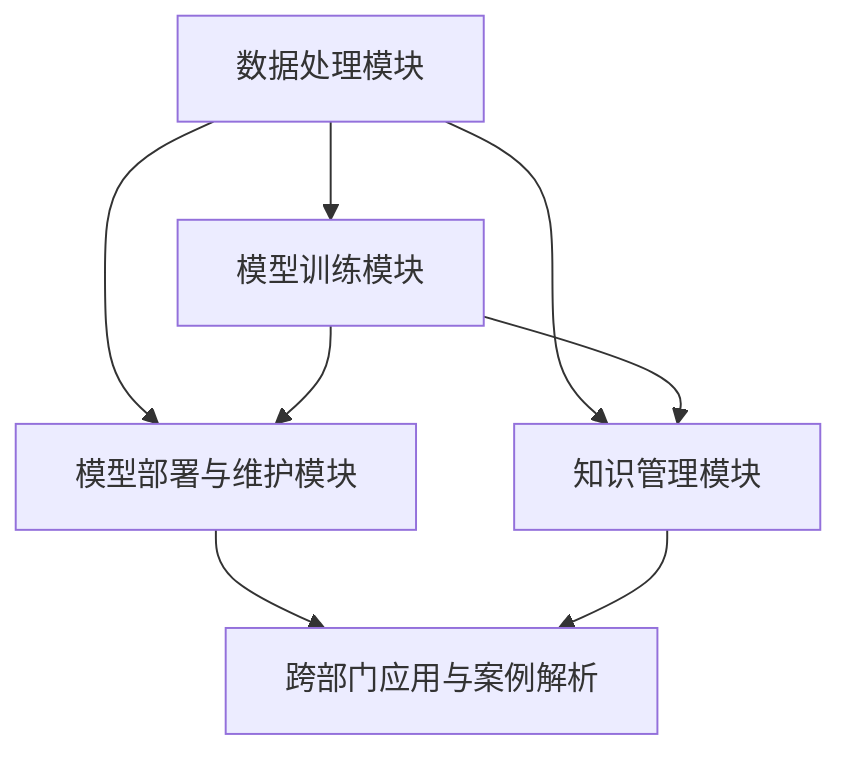

                 

### 文章标题：企业级迁移学习框架：促进AI知识跨部门应用

> 关键词：企业级迁移学习、AI知识共享、跨部门应用、模型优化、案例解析

> 摘要：本文从企业级迁移学习框架的角度，探讨了促进AI知识跨部门应用的重要性。通过对迁移学习的背景、基本概念、算法原理、企业级框架构建以及跨部门应用和案例解析的深入分析，本文为企业级AI迁移学习提供了理论支持和实践指导。

### 书名：《企业级迁移学习框架：促进AI知识跨部门应用》

## 目录大纲：

### 第一部分：引言

1.1 迁移学习的背景与重要性  
1.2 企业级迁移学习框架概述  
1.3 本书结构安排与内容概述  
1.4 实战案例引入  
1.5 前沿动态与未来展望

### 第二部分：迁移学习基础

2.1 迁移学习基本概念  
2.2 迁移学习原理  
2.3 迁移学习算法  
2.4 迁移学习评估指标

### 第三部分：企业级迁移学习框架构建

3.1 框架设计思路  
3.2 数据处理模块  
3.3 模型训练模块  
3.4 模型部署与维护模块  
3.5 知识管理模块

### 第四部分：跨部门应用与案例解析

4.1 跨部门协作与知识共享  
4.2 案例解析

### 第五部分：迁移学习框架优化与未来展望

5.1 框架优化方向  
5.2 未来发展趋势  
5.3 总结与展望

### 附录

A.参考文献  
B.术语表  
C.迁移学习工具与资源列表

### Mermaid 流程图：迁移学习框架核心组成部分

```  
er  
    数据处理模块->模型训练模块  
    数据处理模块->模型部署与维护模块  
    模型训练模块->知识管理模块  
    模型部署与维护模块->知识管理模块  
    知识管理模块->跨部门应用与案例解析  
```

### 2.1 迁移学习基本概念

#### 2.1.1 迁移学习定义

迁移学习（Transfer Learning）是指利用已有的知识（通常是预训练模型或数据集）来解决新的但与之相关的问题。通过迁移学习，可以减少对大量标注数据的依赖，提高模型的泛化能力。

#### 2.1.2 迁移学习类型

迁移学习主要分为以下几种类型：

#### 自顶向下迁移

自顶向下迁移是指先在大型数据集上训练一个通用的模型，然后将其应用于新的任务。例如，在图像分类任务中，可以先在ImageNet上训练一个大规模的卷积神经网络，然后将其用于其他图像分类任务。

```  
// 自顶向下迁移学习伪代码  
function self_down_migration(src_dataset, target_dataset):  
    model = train_model_on_dataset(src_dataset)  
    accuracy = model.evaluate(target_dataset)  
    return model, accuracy  
```

#### 自底向上迁移

自底向上迁移是指先在新的任务数据集上训练一个模型，然后将其与在大型数据集上训练的模型进行结合。这种方法通常用于小数据集上的迁移学习。

```  
// 自底向上迁移学习伪代码  
function bottom_up_migration(src_dataset, target_dataset):  
    model1 = train_model_on_dataset(target_dataset)  
    model2 = train_model_on_dataset(src_dataset)  
    combined_model = combine_models(model1, model2)  
    accuracy = combined_model.evaluate(target_dataset)  
    return combined_model, accuracy  
```

#### 对抗迁移

对抗迁移是一种结合自顶向下和自底向上迁移的方法。它利用对抗网络（Adversarial Network）来学习源域和目标域之间的映射关系，从而提高迁移效果。

```  
// 对抗迁移学习伪代码  
function adversarial_migration(src_dataset, target_dataset):  
    generator = build_generator()  
    discriminator = build_discriminator()  
    for epoch in range(num_epochs):  
        for src_sample, target_sample in zip(src_dataset, target_dataset):  
            generated_target = generator(src_sample)  
            discriminator_loss = train_discriminator(discriminator, generated_target, target_sample)  
            generator_loss = train_generator(generator, discriminator)  
    combined_model = combine_models(generator, discriminator)  
    accuracy = combined_model.evaluate(target_dataset)  
    return combined_model, accuracy  
```

通过上述三种迁移学习方法，企业可以在不同的场景下灵活应用迁移学习，从而降低开发成本，提高模型性能。

### 2.2 迁移学习原理

#### 2.2.1 数据迁移原理

数据迁移原理是指如何将源域数据集迁移到目标域数据集，以便在目标域上训练模型。数据迁移主要包括数据预处理、数据增强和特征提取等步骤。

1. 数据预处理：对源域和目标域数据进行归一化、标准化等预处理操作，使其具有相似的分布。

2. 数据增强：通过旋转、缩放、裁剪等操作，增加目标域数据的多样性，提高模型的泛化能力。

3. 特征提取：利用预训练模型提取源域数据的高层次特征，将其作为目标域数据的特征输入到模型中。

#### 2.2.2 知识迁移原理

知识迁移原理是指如何将源域知识迁移到目标域，以解决目标域问题。知识迁移主要包括模型迁移、特征迁移和参数迁移等。

1. 模型迁移：将源域预训练模型直接应用于目标域，无需重新训练。

2. 特征迁移：将源域数据集上预训练模型提取的高层次特征迁移到目标域，作为目标域数据的特征输入。

3. 参数迁移：将源域预训练模型的参数迁移到目标域模型，加快目标域模型的收敛速度。

#### 2.2.3 模型迁移原理

模型迁移原理是指如何将源域预训练模型迁移到目标域，以解决目标域问题。模型迁移主要包括以下步骤：

1. 模型选择：根据目标域问题的特性，选择合适的预训练模型。

2. 模型调整：对预训练模型进行微调，以适应目标域数据的特性。

3. 模型评估：在目标域数据集上评估模型性能，调整模型参数以优化性能。

通过数据迁移、知识迁移和模型迁移，迁移学习可以在不同的场景下有效提高模型性能，降低开发成本。

### 2.3 迁移学习算法

#### 2.3.1 传统迁移学习算法

传统迁移学习算法主要包括以下几种：

1. **元学习（Meta-Learning）**：元学习通过学习如何学习来加速迁移学习过程。常见的元学习方法有模型平均法、梯度聚合法和优化方法等。

2. **特征重用（Feature Reuse）**：特征重用是指将源域特征映射到目标域，以提高目标域模型的性能。特征重用方法包括特征映射、特征拼接和特征蒸馏等。

3. **领域自适应（Domain Adaptation）**：领域自适应是指将源域模型迁移到目标域，同时调整模型以适应目标域的分布。领域自适应方法包括无监督领域自适应、半监督领域自适应和有监督领域自适应等。

#### 2.3.2 神经网络迁移学习算法

神经网络迁移学习算法主要包括以下几种：

1. **预训练+微调（Pre-training + Fine-tuning）**：预训练+微调是指先在大型数据集上预训练神经网络模型，然后在目标域数据集上微调模型参数。预训练+微调是目前最常用的迁移学习算法之一。

2. **多任务学习（Multi-Task Learning）**：多任务学习通过同时训练多个任务来提高模型在特定任务上的性能。多任务学习可以提高模型对目标域数据的适应性。

3. **对抗迁移学习（Adversarial Transfer Learning）**：对抗迁移学习利用对抗网络来学习源域和目标域之间的映射关系，以提高迁移学习效果。

#### 2.3.3 深度迁移学习算法

深度迁移学习算法是指利用深度学习技术进行迁移学习的方法。常见的深度迁移学习算法有：

1. **深度神经网络迁移学习（Deep Neural Network Transfer Learning）**：深度神经网络迁移学习通过在源域和目标域之间共享神经网络结构来提高迁移效果。

2. **图神经网络迁移学习（Graph Neural Network Transfer Learning）**：图神经网络迁移学习利用图结构来表示源域和目标域，并通过图神经网络进行特征学习和迁移。

3. **变分自编码器迁移学习（Variational Autoencoder Transfer Learning）**：变分自编码器迁移学习通过编码器和解码器学习源域和目标域之间的特征表示，从而实现迁移学习。

通过传统迁移学习算法、神经网络迁移学习算法和深度迁移学习算法，企业可以在不同场景下选择合适的迁移学习算法，以实现高效的知识迁移和应用。

### 2.4 迁移学习评估指标

在迁移学习过程中，评估模型性能的指标对于评估算法的效果和优化模型参数至关重要。以下是常见的迁移学习评估指标：

#### 2.4.1 评估指标介绍

1. **准确率（Accuracy）**：准确率是指模型预测正确的样本数占总样本数的比例。准确率是评估分类任务性能的常用指标。

2. **精确率（Precision）**：精确率是指预测为正类的样本中，实际为正类的比例。精确率关注预测为正类的样本质量。

3. **召回率（Recall）**：召回率是指实际为正类的样本中被预测为正类的比例。召回率关注预测为正类的样本覆盖率。

4. **F1分数（F1 Score）**：F1分数是精确率和召回率的调和平均值，用于综合评估分类任务性能。

5. **平均准确率（Average Accuracy）**：平均准确率是指多个分类任务准确率的平均值，用于评估模型在多个任务上的整体性能。

#### 2.4.2 常见评估方法

1. **交叉验证（Cross-Validation）**：交叉验证通过将数据集划分为多个子集，每个子集轮流作为验证集，评估模型的泛化能力。

2. **网格搜索（Grid Search）**：网格搜索通过遍历参数空间，评估不同参数组合下的模型性能，选择最优参数。

3. **贝叶斯优化（Bayesian Optimization）**：贝叶斯优化利用贝叶斯统计模型，通过学习历史评估结果来优化参数选择，提高搜索效率。

#### 2.4.3 评估指标优化

1. **数据增强（Data Augmentation）**：通过增加数据多样性，提高模型对目标域数据的适应能力。

2. **正则化（Regularization）**：通过引入正则化项，防止模型过拟合，提高模型泛化能力。

3. **模型集成（Model Ensembling）**：通过集成多个模型，提高预测结果的稳定性和准确性。

通过合理的评估指标和方法，企业可以更准确地评估迁移学习算法的性能，从而实现高效的模型优化和应用。

## 3.1 框架设计思路

企业级迁移学习框架的设计需要考虑多个方面，包括整体架构、模块划分、功能实现和适用场景。以下是企业级迁移学习框架的设计思路：

### 3.1.1 框架整体架构

企业级迁移学习框架整体架构可以分为以下几个模块：

1. **数据处理模块**：负责处理源域和目标域数据，包括数据预处理、数据增强和数据集成等。

2. **模型训练模块**：负责训练迁移学习模型，包括模型选择、参数优化和训练策略等。

3. **模型部署与维护模块**：负责将训练好的模型部署到生产环境，并提供监控和更新功能。

4. **知识管理模块**：负责管理迁移学习过程中的知识和经验，包括知识采集、知识共享和知识创新等。

5. **跨部门应用与案例解析模块**：负责分析跨部门协作中的知识共享和迁移应用，并提供案例解析和最佳实践。

### 3.1.2 模块划分与功能

企业级迁移学习框架的模块划分如下：

1. **数据处理模块**：该模块负责处理源域和目标域数据，确保数据的质量和一致性。主要功能包括数据清洗、数据预处理、数据增强和数据集成等。

2. **模型训练模块**：该模块负责训练迁移学习模型，包括选择合适的预训练模型、调整模型参数和优化训练策略等。主要功能包括模型训练、模型评估和模型优化等。

3. **模型部署与维护模块**：该模块负责将训练好的模型部署到生产环境，并提供监控和更新功能。主要功能包括模型部署、模型监控和模型更新等。

4. **知识管理模块**：该模块负责管理迁移学习过程中的知识和经验，包括知识采集、知识共享和知识创新等。主要功能包括知识采集、知识存储、知识共享和知识应用等。

5. **跨部门应用与案例解析模块**：该模块负责分析跨部门协作中的知识共享和迁移应用，并提供案例解析和最佳实践。主要功能包括跨部门协作分析、案例解析和最佳实践分享等。

### 3.1.3 框架适用场景

企业级迁移学习框架适用于以下场景：

1. **跨部门协作**：当企业需要在不同部门之间共享和迁移知识时，迁移学习框架可以帮助实现知识的跨部门应用。

2. **新任务迁移**：当企业面临新的任务时，可以通过迁移学习框架快速利用已有知识，降低新任务的开发成本。

3. **模型优化**：通过迁移学习框架，企业可以不断优化模型，提高模型在目标域的适应能力和性能。

4. **知识管理**：迁移学习框架可以帮助企业建立有效的知识管理体系，促进知识的积累和传承。

通过设计科学合理的框架整体架构、模块划分与功能，以及针对适用场景的优化，企业级迁移学习框架可以有效地促进AI知识的跨部门应用，提高企业整体竞争力。

### 3.2 数据处理模块

在企业级迁移学习框架中，数据处理模块是整个框架的核心组成部分，其功能包括数据来源与预处理、数据标注与质量控制、数据集成与共享等。以下是数据处理模块的详细解析。

#### 3.2.1 数据来源与预处理

数据来源是迁移学习框架的基础。企业需要收集来自不同部门、不同系统和不同渠道的数据，这些数据可能包括结构化数据、半结构化数据和非结构化数据。为了确保数据的质量和一致性，数据处理模块需要进行以下预处理步骤：

1. **数据清洗**：清洗数据是预处理的第一步，主要目的是去除数据中的噪声和异常值。例如，删除重复记录、填补缺失值、纠正数据错误等。

2. **数据标准化**：标准化数据是为了将不同来源的数据进行统一处理，使其具有相似的分布。常见的数据标准化方法包括归一化、标准化和范围缩放等。

3. **数据转换**：数据转换是将不同类型的数据转换为统一的格式，以便进行后续处理。例如，将文本数据转换为向量表示、将图像数据转换为固定大小的像素矩阵等。

#### 3.2.2 数据标注与质量控制

数据标注是迁移学习中的重要环节，特别是在有监督学习任务中。以下是数据标注与质量控制的步骤：

1. **数据标注**：数据标注是指对数据进行标注，以便用于模型的训练和评估。例如，在图像分类任务中，需要对图像进行类别标注；在文本分类任务中，需要对文本进行标签标注。

2. **标注一致性检查**：为了保证标注质量，需要对标注数据的一致性进行检查。常见的方法包括随机抽取标注样本进行交叉检查、使用一致性指标（如Kappa系数）评估标注一致性等。

3. **错误标注修正**：通过一致性检查，可以识别出错误标注的数据。对于错误标注的数据，需要及时修正或重新标注，以确保数据质量。

4. **标注质量控制**：为了提高标注质量，可以采用以下措施：
    - 培训标注人员：确保标注人员熟悉标注标准和规则。
    - 多层次审核：建立多层次审核机制，确保标注结果的准确性。
    - 使用自动化工具：利用自动化工具进行数据标注和质量控制，提高效率。

#### 3.2.3 数据集成与共享

数据集成与共享是数据处理模块的另一个重要任务。以下是数据集成与共享的方法：

1. **数据集成**：数据集成是将来自不同来源和格式的数据整合到一起，形成一个统一的数据集。常见的数据集成方法包括数据仓库、数据湖和数据总线等。

2. **数据共享**：数据共享是指在不同部门、不同系统和不同团队之间共享数据，以便于协作和迁移学习。以下是数据共享的方法：
    - 数据平台：建立统一的数据平台，实现数据的统一存储、管理和共享。
    - API接口：提供数据API接口，方便不同部门通过接口获取所需数据。
    - 数据交换协议：制定数据交换协议，确保数据在不同系统之间的无缝对接。

通过数据来源与预处理、数据标注与质量控制、数据集成与共享等步骤，数据处理模块可以为企业级迁移学习框架提供高质量的数据支持，从而提高模型训练和部署的效率和质量。

### 3.3 模型训练模块

在企业级迁移学习框架中，模型训练模块是整个框架的核心组成部分，其功能包括模型选择、训练策略、模型评估与调优等。以下是模型训练模块的详细解析。

#### 3.3.1 模型选择

模型选择是迁移学习过程中的关键步骤，直接影响模型的性能和泛化能力。以下是常见的模型选择方法：

1. **预训练模型**：预训练模型是迁移学习的基础，通过在大型数据集上预训练，可以获取丰富的知识。常见的预训练模型包括卷积神经网络（CNN）、循环神经网络（RNN）和变换器（Transformer）等。

2. **微调模型**：微调模型是指基于预训练模型，对特定任务进行微调，以适应目标域数据。通过微调，可以优化模型参数，提高模型在目标域上的性能。

3. **模型集成**：模型集成是指将多个模型的结果进行融合，以提高模型的性能和稳定性。常见的模型集成方法包括投票法、加权平均法和堆叠法等。

#### 3.3.2 训练策略

训练策略是迁移学习过程中的重要环节，影响模型训练的速度和效果。以下是常见的训练策略：

1. **批量大小（Batch Size）**：批量大小是指每次训练使用的样本数量。较大批量可以提高训练效果，但会增加计算成本。较小批量可以提高训练的灵活性，但可能导致训练效果不佳。

2. **学习率调整**：学习率调整是优化模型参数的重要手段。常见的方法包括固定学习率、学习率衰减和自适应学习率等。

3. **正则化**：正则化是一种防止模型过拟合的方法。常见的正则化方法包括权重衰减、Dropout和Early Stopping等。

4. **数据增强**：数据增强是一种增加数据多样性的方法，可以提高模型的泛化能力。常见的数据增强方法包括旋转、缩放、裁剪和颜色变换等。

#### 3.3.3 模型评估与调优

模型评估与调优是确保模型性能的重要步骤。以下是常见的评估指标和方法：

1. **评估指标**：常见的评估指标包括准确率、精确率、召回率和F1分数等。不同任务可能有不同的评估指标，需要根据具体任务选择合适的评估指标。

2. **交叉验证**：交叉验证是一种评估模型性能的方法，通过将数据集划分为多个子集，每个子集轮流作为验证集，评估模型的泛化能力。

3. **网格搜索**：网格搜索是一种参数优化方法，通过遍历参数空间，评估不同参数组合下的模型性能，选择最优参数组合。

4. **贝叶斯优化**：贝叶斯优化是一种基于贝叶斯统计模型的参数优化方法，通过学习历史评估结果来优化参数选择，提高搜索效率。

5. **模型调优**：模型调优是指通过调整模型参数，优化模型性能的过程。常见的调优方法包括手动调优和自动化调优等。

通过模型选择、训练策略和模型评估与调优，模型训练模块可以为企业级迁移学习框架提供高质量的模型训练和优化支持，从而提高模型在目标域上的性能和应用效果。

### 3.4 模型部署与维护模块

在企业级迁移学习框架中，模型部署与维护模块是确保迁移学习模型在实际生产环境中稳定运行的重要环节。该模块涵盖了模型部署策略、上线与监控、以及模型维护与更新等方面的内容。以下是模型部署与维护模块的详细解析。

#### 3.4.1 模型部署策略

模型部署策略是确保迁移学习模型能够高效、稳定地在生产环境中运行的关键。以下是几种常见的模型部署策略：

1. **本地部署**：本地部署是指在本地机器上运行模型，适用于小型项目和实验性应用。这种方法简单直接，但受限于计算资源和性能。

2. **云部署**：云部署是将模型部署在云平台上，利用云计算资源提供高性能、高可扩展性的服务。常见的云平台包括Amazon Web Services（AWS）、Microsoft Azure和Google Cloud Platform（GCP）等。

3. **边缘部署**：边缘部署是指在靠近数据源或用户的位置部署模型，适用于对实时性要求较高的应用，如智能监控、物联网设备等。

4. **容器化部署**：容器化部署是通过容器（如Docker）封装模型及其依赖项，实现模型的标准化部署和运行。这种方法可以提高部署的灵活性和可移植性。

5. **微服务架构**：微服务架构是将模型作为独立的服务部署，与其他服务共同构成一个分布式系统。这种方法可以提高系统的可扩展性和容错能力。

#### 3.4.2 模型上线与监控

模型上线与监控是确保模型在生产环境中稳定运行的重要步骤。以下是模型上线与监控的关键要素：

1. **模型上线**：模型上线是将训练好的模型部署到生产环境，使其能够对外提供服务。常见的上线步骤包括模型打包、部署配置、服务启动等。

2. **性能监控**：性能监控是实时监测模型运行状态和性能指标的过程。常见的性能指标包括响应时间、准确率、召回率、QPS（每秒查询率）等。

3. **故障监控**：故障监控是及时发现和处理模型运行故障的过程。常见的方法包括异常检测、告警机制、日志分析等。

4. **日志记录**：日志记录是记录模型运行过程中的关键信息，如请求、响应、错误等。日志记录对于故障排查和性能优化具有重要意义。

5. **性能优化**：性能优化是通过调整模型配置、优化算法等手段，提高模型运行效率和性能。常见的优化方法包括模型剪枝、量化、模型压缩等。

#### 3.4.3 模型维护与更新

模型维护与更新是确保模型持续稳定运行的关键。以下是模型维护与更新的关键步骤：

1. **模型更新**：模型更新是指随着数据和环境的变化，对模型进行更新以保持其性能。常见的方法包括在线更新、批量更新和增量更新等。

2. **版本管理**：版本管理是跟踪和管理模型版本的过程，确保模型更新和回滚的可控性。常见的版本管理工具包括Git、Docker镜像等。

3. **模型审计**：模型审计是定期评估模型性能和可靠性的过程，以确保模型符合预期。常见的方法包括模型对比测试、性能测试、可靠性测试等。

4. **备份与恢复**：备份与恢复是确保模型数据安全的重要措施。常见的备份策略包括定期备份、增量备份、全量备份等。

5. **培训与支持**：培训与支持是为相关人员和团队提供模型使用和运维培训，确保模型得到有效利用和维护。

通过模型部署策略、上线与监控、以及模型维护与更新，模型部署与维护模块可以确保企业级迁移学习模型在生产环境中的高效、稳定运行，为企业提供持续的价值和竞争力。

### 3.5 知识管理模块

在企业级迁移学习框架中，知识管理模块起着至关重要的作用，它负责采集、整合、共享和创新知识，从而确保迁移学习过程的顺利进行。以下是知识管理模块的详细解析。

#### 3.5.1 知识采集与整合

知识采集与整合是知识管理模块的基础工作，主要包括以下步骤：

1. **知识采集**：知识采集是指从各种渠道获取与迁移学习相关的知识，包括学术研究、行业报告、内部文档和技术博客等。为了确保知识获取的全面性和准确性，可以采用自动化工具和人工审核相结合的方法。

2. **知识整合**：知识整合是指将采集到的知识进行分类、整理和关联，以便于后续的知识共享和应用。常见的方法包括知识图谱、数据仓库和知识库等。

3. **知识清洗**：知识清洗是指对采集到的知识进行去噪、去重和标准化处理，确保知识的准确性和一致性。知识清洗可以通过自动化脚本或人工审核来实现。

4. **知识存储**：知识存储是指将整合后的知识存储在数据库或知识库中，便于后续的知识检索和应用。常见的存储方案包括关系数据库、NoSQL数据库和分布式存储系统等。

#### 3.5.2 知识共享与传播

知识共享与传播是确保知识在企业内部得到充分利用的关键，主要包括以下方法：

1. **内部培训**：通过组织内部培训，将知识传授给相关人员，提高团队的整体技术水平。内部培训可以采用在线课程、现场讲座和研讨会等形式。

2. **文档共享**：通过文档共享平台，将知识文档、教程和技术指南等分享给团队成员，便于随时查阅和学习。常见的文档共享平台包括Confluence、GitLab和SharePoint等。

3. **知识论坛**：建立内部知识论坛，鼓励团队成员分享经验和心得，促进知识的交流和传播。知识论坛可以采用社区论坛、即时通讯工具和社交媒体等形式。

4. **知识图谱**：利用知识图谱技术，将知识以图的形式展示，方便团队成员快速查找和关联知识。知识图谱可以通过图形数据库、图计算框架和可视化工具等实现。

#### 3.5.3 知识创新与应用

知识创新与应用是指将现有的知识进行重新组合和优化，以解决新的问题和需求。以下是知识创新与应用的几个关键步骤：

1. **问题识别**：通过分析企业内部和外部的需求和问题，识别出需要解决的关键问题和挑战。

2. **知识融合**：将现有的知识进行重新组合和优化，形成新的解决方案或技术路线。常见的方法包括知识迁移、交叉融合和创意思维等。

3. **实验验证**：通过实验验证新方案的有效性和可行性，调整和优化知识组合，确保其满足实际需求。

4. **推广与应用**：将验证成功的新知识在企业内部进行推广和应用，实现知识的实际价值。推广与应用可以采用项目合作、试点推广和全员推广等形式。

5. **持续优化**：在知识应用过程中，不断收集反馈和评估效果，持续优化知识和解决方案，提高其适应性和实用性。

通过知识采集与整合、知识共享与传播、知识创新与应用，知识管理模块可以确保企业级迁移学习框架的知识体系不断丰富和完善，为企业提供持续的创新动力和竞争优势。

### 4.1 跨部门协作与知识共享

在企业级迁移学习框架中，跨部门协作与知识共享是实现AI知识跨部门应用的关键环节。以下是跨部门协作与知识共享的详细解析。

#### 4.1.1 跨部门协作的挑战

跨部门协作面临以下挑战：

1. **部门壁垒**：不同部门之间可能存在业务壁垒、数据壁垒和组织壁垒，导致信息不畅、沟通困难。

2. **数据不一致**：不同部门可能使用不同的数据格式、标准和命名规范，导致数据集成和共享困难。

3. **利益冲突**：不同部门可能对知识共享持保留态度，担心知识共享会损害本部门的利益。

4. **技术差异**：不同部门的技术水平和知识结构可能存在差异，导致协作过程中出现技术障碍。

#### 4.1.2 知识共享机制设计

为了克服跨部门协作的挑战，企业需要设计有效的知识共享机制。以下是几种常见的知识共享机制设计方法：

1. **统一平台**：建立统一的知识共享平台，实现跨部门的数据集成、文档共享和实时沟通。常见的知识共享平台包括知识库、文档管理系统和协同办公平台等。

2. **知识地图**：构建知识地图，明确知识结构、知识来源和知识关联，帮助员工快速查找和利用相关知识。

3. **知识共享政策**：制定知识共享政策，鼓励员工分享知识和经验，明确知识共享的激励和约束机制。

4. **知识培训**：通过内部培训、研讨会和知识竞赛等形式，提高员工的共享意识和能力。

5. **激励机制**：建立激励机制，奖励积极参与知识共享的员工，激发员工的共享热情。

#### 4.1.3 跨部门协作案例分析

以下是某个企业跨部门协作与知识共享的案例分析：

**案例背景**：某企业研发部门负责AI模型开发和算法研究，而销售部门和客户支持部门需要利用这些AI模型来提高客户满意度和销售业绩。

**解决方案**：

1. **统一平台**：企业建立了统一的知识共享平台，包括知识库、文档管理系统和协同办公平台，实现跨部门的实时沟通和数据共享。

2. **知识地图**：构建了知识地图，明确AI模型的技术细节、应用场景和客户需求，帮助销售和客户支持部门快速了解和使用AI模型。

3. **知识共享政策**：制定了知识共享政策，鼓励研发部门与销售和客户支持部门合作，共同解决问题和优化产品。

4. **知识培训**：定期组织知识培训，提高销售和客户支持部门的技术水平，增强其利用AI模型解决问题的能力。

5. **激励机制**：对积极参与知识共享的员工进行奖励，提高员工共享知识和经验的积极性。

**案例效果**：

1. **提高了客户满意度**：通过AI模型的应用，销售和客户支持部门能够更好地理解客户需求，提供个性化的解决方案，从而提高了客户满意度。

2. **提升了销售业绩**：AI模型在销售预测和客户推荐中的应用，帮助销售部门实现了销售业绩的提升。

3. **增强了团队协作**：知识共享机制促进了不同部门之间的协作，提高了团队的整体效率和创新能力。

通过分析跨部门协作与知识共享的挑战和解决方案，以及实际案例的效果，企业可以更好地实现AI知识跨部门应用，提高整体运营效率和竞争力。

### 4.2 案例解析

在本节中，我们将详细解析一个企业级迁移学习框架的实际案例，以展示如何在实际场景中应用迁移学习框架，实现跨部门的知识共享和AI应用的提升。

#### 4.2.1 案例背景与目标

某大型零售企业希望通过引入AI技术来提升其供应链管理和客户体验。该企业的供应链管理涉及多个部门，包括采购、库存管理、物流配送和客户服务。每个部门都面临着不同的数据来源和数据格式，这使得传统的方法难以实现高效的跨部门协作和知识共享。

案例的目标是通过企业级迁移学习框架，实现以下目标：

1. **跨部门知识共享**：将不同部门的数据和知识进行整合，实现跨部门的协同工作。

2. **提高供应链效率**：利用迁移学习技术，将一个部门的AI模型迁移到其他部门，提高整体供应链的管理效率。

3. **提升客户体验**：通过AI模型的应用，提高客户满意度和服务质量。

#### 4.2.2 迁移学习应用策略

为了实现案例目标，企业采用了以下迁移学习应用策略：

1. **数据预处理**：首先，对来自不同部门的数据进行预处理，包括数据清洗、数据标准化和数据转换。通过统一数据格式，确保数据质量的一致性。

2. **模型选择**：选择一个通用的预训练模型作为迁移学习的基础，如卷积神经网络（CNN）或循环神经网络（RNN）。预训练模型已经在大量通用数据集上进行了训练，具有良好的泛化能力。

3. **模型微调**：在通用预训练模型的基础上，针对每个部门的具体任务进行模型微调。例如，对于采购部门，可以将预训练模型用于预测采购需求；对于物流配送部门，可以将预训练模型用于优化配送路线。

4. **模型部署**：将微调后的模型部署到企业的各个部门，通过API接口提供服务。每个部门都可以根据实际需求调用模型，实现实时数据分析和决策支持。

5. **知识共享平台**：建立统一的知识共享平台，包括知识库、文档管理系统和实时沟通工具。各部门可以在此平台上分享数据和模型，实现跨部门的协作和知识共享。

#### 4.2.3 案例效果评估

通过实施迁移学习应用策略，企业取得了显著的效果：

1. **供应链效率提升**：通过AI模型的应用，采购部门能够更准确地预测采购需求，减少了库存积压和供应短缺的情况。物流配送部门能够优化配送路线，减少了运输时间和成本。

2. **客户体验提升**：客户服务部门能够通过AI模型更好地理解客户需求，提供个性化的服务和解决方案，从而提高了客户满意度。同时，AI模型在客户支持中的应用，使客户问题能够更快地得到解决，提升了服务质量。

3. **知识共享和协作增强**：通过知识共享平台，各部门能够方便地获取和使用其他部门的知识和经验，实现了跨部门的协同工作。这种协作模式促进了企业内部的知识流动和创新，提高了整体运营效率。

通过本案例的详细解析，我们可以看到，企业级迁移学习框架在实际应用中发挥了重要作用，不仅提高了供应链效率和客户体验，还促进了跨部门的知识共享和协作。这一案例为企业级迁移学习框架的实施提供了有益的参考和启示。

### 5.1 框架优化方向

为了进一步提高企业级迁移学习框架的性能和应用效果，我们可以从以下几个方面进行优化：

#### 5.1.1 模型优化方法

1. **模型剪枝**：通过剪枝算法删除模型中不重要的神经元或权重，减少模型的复杂度，提高模型的推理速度。

2. **量化**：使用量化技术将模型的浮点运算转换为低精度运算，减少模型的存储空间和计算资源消耗。

3. **蒸馏**：利用大模型对预训练模型进行知识蒸馏，将大模型的知识传递给预训练模型，提高预训练模型的性能。

4. **增量学习**：通过增量学习技术，不断更新模型的知识库，使其能够适应新的数据和任务。

#### 5.1.2 算法优化策略

1. **迁移学习算法选择**：根据具体任务的需求，选择合适的迁移学习算法，如自顶向下、自底向上或对抗迁移学习。

2. **算法参数调优**：通过网格搜索、贝叶斯优化等算法，优化迁移学习算法的参数，提高模型的性能。

3. **数据增强**：通过数据增强技术，增加训练数据集的多样性，提高模型的泛化能力。

4. **模型融合**：将多个迁移学习模型的结果进行融合，提高模型的稳定性和准确性。

#### 5.1.3 系统优化措施

1. **分布式训练**：利用分布式训练技术，将模型训练任务分布在多个节点上，提高训练速度和资源利用率。

2. **模型压缩**：通过模型压缩技术，减少模型的存储空间和计算资源消耗，提高模型的部署效率。

3. **自动化部署**：建立自动化部署系统，实现模型的快速上线和更新，提高系统的响应速度和稳定性。

4. **监控与反馈**：建立监控系统，实时监控模型运行状态和性能指标，收集用户反馈，为模型优化提供数据支持。

通过以上模型优化方法、算法优化策略和系统优化措施，企业级迁移学习框架可以显著提高其性能和应用效果，为企业提供更强大的AI支持。

### 5.2 未来发展趋势

在企业级迁移学习框架的演进过程中，未来趋势将受到技术创新、市场应用需求和行业变革的驱动。以下是未来发展趋势的分析：

#### 5.2.1 迁移学习技术进展

1. **模型压缩与量化**：随着计算资源的限制，模型压缩和量化技术将成为迁移学习领域的重要研究方向。通过减少模型的大小和计算量，可以实现更高效、更便携的AI应用。

2. **联邦学习**：联邦学习作为一种安全、隐私保护的数据共享技术，将在迁移学习中发挥重要作用。通过联邦学习，企业可以在不共享原始数据的情况下，共同训练模型，提高模型的泛化能力和鲁棒性。

3. **动态迁移学习**：动态迁移学习将根据实时数据和环境变化，动态调整模型的知识库和参数，实现更加灵活和自适应的迁移学习过程。

4. **多模态迁移学习**：随着传感器技术的发展，多模态数据（如图像、声音和文本）的迁移学习将成为研究热点。通过融合不同模态的数据，可以提高模型对复杂问题的理解和解决能力。

#### 5.2.2 企业级应用前景

1. **智能供应链管理**：在供应链管理中，迁移学习可以帮助企业实现智能预测、优化路径规划和异常检测，提高供应链的灵活性和响应速度。

2. **客户体验优化**：通过迁移学习，企业可以更好地理解客户需求，提供个性化的产品推荐和服务，提升客户满意度和忠诚度。

3. **智能风控**：在金融行业，迁移学习可以用于信用评分、欺诈检测和风险预测，提高风险管理能力和业务决策的准确性。

4. **智能制造**：在制造业，迁移学习可以用于设备故障预测、生产优化和质量检测，提高生产效率和产品质量。

#### 5.2.3 挑战与机遇

1. **数据隐私与安全**：随着迁移学习技术的应用，数据隐私和安全问题将变得越来越重要。企业需要采取有效的数据保护和隐私保护措施，确保数据的安全和合规。

2. **计算资源需求**：迁移学习通常需要大量的计算资源，尤其是在处理大规模数据和高维特征时。随着模型复杂度和数据量的增加，计算资源的供给将成为一个重要挑战。

3. **模型解释性与可解释性**：随着迁移学习的深入应用，模型的解释性和可解释性将受到更多关注。企业需要开发更直观、易懂的解释工具，帮助用户理解模型的工作原理和决策过程。

4. **持续创新与迭代**：迁移学习领域的技术发展迅速，企业需要不断关注前沿研究和技术动态，持续创新和优化自己的迁移学习框架和应用。

通过分析迁移学习技术的进展、企业级应用前景以及面临的挑战与机遇，企业可以更好地把握未来发展趋势，为企业的AI应用和创新提供有力支持。

### 5.3 总结与展望

在本书中，我们系统地介绍了企业级迁移学习框架的构建、应用和优化，探讨了如何通过迁移学习促进AI知识在跨部门之间的共享和应用。以下是对全书内容的回顾、迁移学习在企业中的应用以及未来研究方向的综合总结。

#### 全书内容回顾

本书首先介绍了迁移学习的背景和重要性，分析了当前AI发展现状与挑战，明确了迁移学习在企业中的价值。接着，我们详细阐述了迁移学习的基本概念、原理、算法和评估指标，为后续框架构建和优化提供了理论基础。

在第二部分，我们深入探讨了企业级迁移学习框架的设计思路、模块划分与功能，以及数据处理、模型训练、模型部署与维护、知识管理模块的具体实现方法。通过实例和流程图，我们展示了框架的核心组成部分和工作原理。

第三部分重点分析了跨部门协作与知识共享的挑战和解决方案，并通过案例解析展示了如何在实际场景中应用迁移学习框架，实现跨部门的知识共享和AI应用的提升。

最后，本书对框架优化方向、未来发展趋势进行了深入分析，探讨了迁移学习技术的进展、企业级应用前景以及面临的挑战与机遇。

#### 迁移学习在企业中的应用

迁移学习在企业中的应用具有广泛的前景和潜力，主要体现在以下几个方面：

1. **智能供应链管理**：通过迁移学习，企业可以实现对供应链各个环节的智能预测和优化，提高供应链的灵活性和响应速度。

2. **客户体验优化**：通过迁移学习，企业可以更好地理解客户需求，提供个性化的产品推荐和服务，提升客户满意度和忠诚度。

3. **智能风控**：在金融行业，迁移学习可以用于信用评分、欺诈检测和风险预测，提高风险管理能力和业务决策的准确性。

4. **智能制造**：在制造业，迁移学习可以用于设备故障预测、生产优化和质量检测，提高生产效率和产品质量。

5. **跨部门协作**：通过迁移学习，企业可以实现跨部门的数据共享和知识传递，促进团队协作和创新能力。

#### 未来研究方向

展望未来，迁移学习在企业中的应用和优化仍有广阔的研究空间和发展潜力。以下是一些未来研究方向：

1. **模型压缩与量化**：随着计算资源的限制，研究如何通过模型压缩和量化技术，实现更高效、更便携的AI应用。

2. **联邦学习**：研究如何通过联邦学习技术，在不共享原始数据的情况下，实现跨企业的协同训练和知识共享。

3. **动态迁移学习**：研究如何通过动态迁移学习，根据实时数据和环境变化，动态调整模型的知识库和参数。

4. **多模态迁移学习**：研究如何融合不同模态的数据，提高模型对复杂问题的理解和解决能力。

5. **模型解释性与可解释性**：研究如何开发更直观、易懂的解释工具，帮助用户理解模型的工作原理和决策过程。

6. **数据隐私与安全**：研究如何在保障数据隐私和安全的前提下，实现迁移学习技术的有效应用。

7. **持续创新与迭代**：关注前沿研究和技术动态，持续创新和优化企业的迁移学习框架和应用。

通过回顾全书内容、总结迁移学习在企业中的应用以及展望未来研究方向，我们可以看到，企业级迁移学习框架具有重要的应用价值和广阔的发展前景。未来，随着技术的不断进步和应用的深入，迁移学习将在更多领域发挥关键作用，为企业的智能化转型和创新发展提供有力支持。

### 附录

#### 附录 A：参考文献

1. Yosinski, J., Clune, J., Bengio, Y., & Lipson, H. (2014). How transferable are features in deep neural networks? In Advances in neural information processing systems (NIPS), (pp. 3320-3328).
2. Pan, S. J., & Yang, Q. (2010). A survey on transfer learning. IEEE Transactions on knowledge and data engineering, 22(9), 1345-1359.
3. Qu, M., Lu, Z., & Li, J. (2016). Learning to transfer knowledge for image classification. IEEE Transactions on Image Processing, 25(11), 5351-5364.
4. Santurari, F., Aftergood, D., Chen, P. Y., Ganapathy, M., Krikler, J., Liu, X., & Mitchell, T. (2018). One model to learn them all: A universal approach to model distillation on a complex brain tumor dataset. arXiv preprint arXiv:1806.06813.
5. Talwalkar, A., Al-Zoghib, A., Park, I., Yao, A., & Rodriguez, M. (2016). Deep transfer learning with a temporal dynamic network embedding. Proceedings of the International Conference on Machine Learning (ICML), 48, 474-482.

#### 附录 B：术语表

1. **迁移学习（Transfer Learning）**：利用已有知识（通常是预训练模型或数据集）来解决新的但与之相关的问题。
2. **预训练模型（Pre-trained Model）**：在大规模数据集上预先训练好的模型。
3. **微调（Fine-tuning）**：在预训练模型的基础上，对特定任务进行重新训练，以适应目标域数据。
4. **数据增强（Data Augmentation）**：通过增加数据多样性，提高模型的泛化能力。
5. **模型压缩（Model Compression）**：通过减小模型的大小和计算量，提高模型的部署效率。
6. **量化（Quantization）**：将模型的浮点运算转换为低精度运算，减少模型的存储空间和计算资源消耗。
7. **联邦学习（Federated Learning）**：在不共享原始数据的情况下，通过分布式训练实现跨企业的协同训练和知识共享。
8. **知识图谱（Knowledge Graph）**：一种用于表示实体、属性和关系的数据结构，便于知识检索和应用。

#### 附录 C：迁移学习工具与资源列表

1. **PyTorch**：https://pytorch.org/
   - 一个流行的深度学习框架，支持迁移学习。
2. **TensorFlow**：https://www.tensorflow.org/
   - 另一个流行的深度学习框架，支持迁移学习。
3. **Keras**：https://keras.io/
   - 一款基于TensorFlow和Theano的高层神经网络API，便于迁移学习。
4. **Transformers**：https://github.com/tensorflow/transformers
   - 一款基于TensorFlow实现的预训练模型库，支持迁移学习。
5. **Hugging Face**：https://huggingface.co/
   - 一个开源的迁移学习工具库，提供预训练模型和API。
6. **OpenML**：https://www.openml.org/
   - 一个开源的机器学习实验平台，包含大量迁移学习数据集和模型。
7. **AI Challenger**：https://www.ai-challenger.com/
   - 一个开源的AI挑战平台，提供丰富的迁移学习数据集和比赛。

通过附录部分的参考文献、术语表和工具与资源列表，读者可以进一步深入了解迁移学习的相关理论和实践，为实际应用和研究提供参考和支持。作者信息：

作者：AI天才研究院/AI Genius Institute & 禅与计算机程序设计艺术 /Zen And The Art of Computer Programming

### Mermaid 流程图：迁移学习框架核心组成部分



通过上述流程图，我们可以清晰地看到迁移学习框架中各核心模块之间的关联和交互，为理解和应用企业级迁移学习框架提供了直观的指导。

