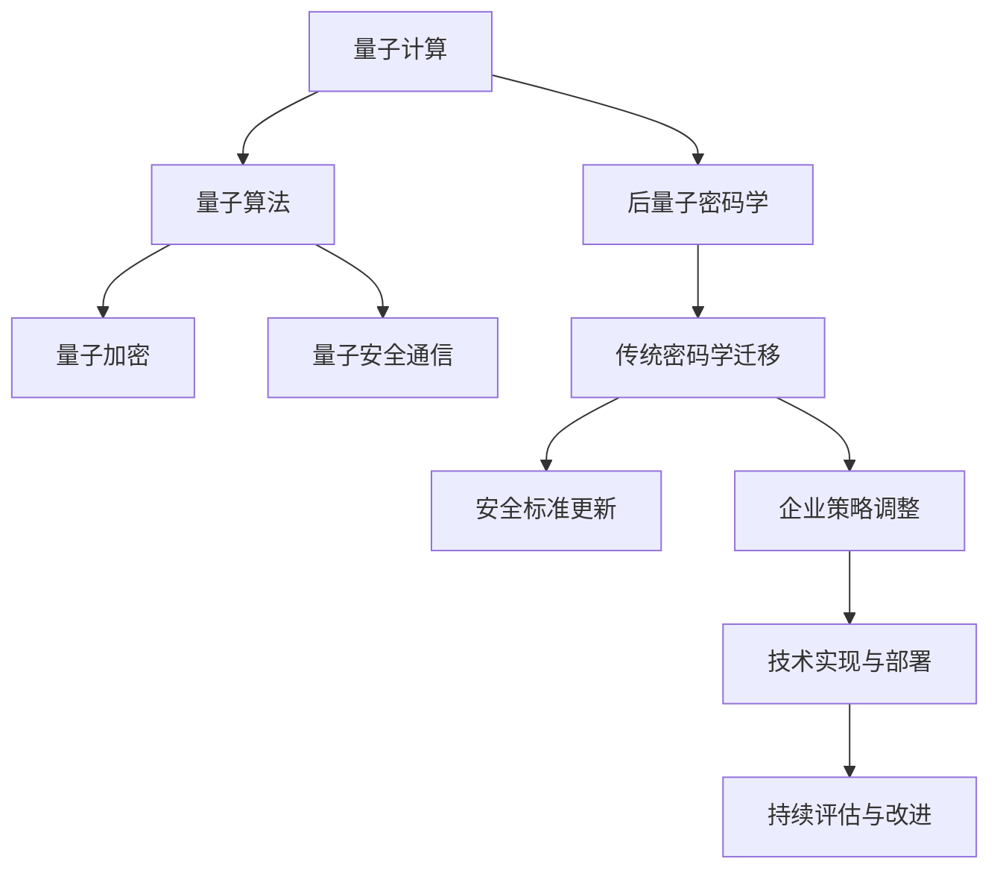

                 

### 文章标题

# 企业适应后量子密码学的步骤

> 关键词：后量子密码学、量子计算、安全挑战、迁移策略、技术实现

> 摘要：随着量子计算技术的不断发展，后量子密码学逐渐成为企业保障信息安全的重要工具。本文将探讨企业适应后量子密码学的关键步骤，从核心概念、安全挑战到具体实施策略，帮助企业顺利过渡到量子安全时代。

----------------------------------------------------------------

## 确定核心概念与联系

在企业适应后量子密码学的过程中，明确核心概念及其相互联系至关重要。以下是本文涉及的核心概念及其联系：

1. **后量子密码学**：一种在量子计算发展背景下诞生的密码学，旨在对抗即将到来的量子计算机对传统密码系统的威胁。它基于量子力学原理，提供安全强度远超传统密码学的加密方案。

2. **量子计算**：利用量子比特（qubit）进行信息处理的新型计算模式，具备并行计算和超计算能力，对传统计算机构成挑战。量子计算的基本原理包括量子比特、量子门和量子算法。

3. **安全挑战**：量子计算机的发展对传统密码系统构成严重威胁，许多基于大整数分解的加密算法将变得易受攻击。企业需要面对这一安全挑战，寻求新的加密解决方案。

4. **密码学标准**：国际标准化组织（ISO）和互联网工程任务组（IETF）等机构制定的一系列密码学标准，用于规范加密算法的使用和实现。随着后量子密码学的出现，密码学标准也需要进行相应更新。

5. **迁移策略**：企业从传统密码系统过渡到后量子密码学的策略，包括评估安全需求、制定迁移计划、实施新加密方案等。

6. **实现步骤**：企业适应后量子密码学的具体实施步骤，包括技术准备、人员培训、系统改造等。

7. **未来展望**：后量子密码学的发展趋势及其对企业信息安全的影响，包括新技术的应用、市场变化等。

通过以上核心概念及其联系，企业可以更好地理解后量子密码学的重要性，制定相应的适应策略。

### 设计Mermaid流程图

为了更直观地展示后量子密码学与量子计算之间的联系，我们可以使用Mermaid流程图。以下是可能的设计：



该流程图展示了量子计算对后量子密码学的影响，以及后量子密码学如何帮助企业应对传统密码系统的安全挑战。通过这个流程图，企业可以清晰地了解后量子密码学在整体信息安全架构中的作用。

### 设计伪代码

为了更好地阐述后量子密码学的核心算法原理，我们可以使用伪代码进行详细描述。以下是量子密钥分发（QKD）算法的伪代码：

```plaintext
Algorithm QKD_Key_Distribution(Alice, Bob)
    Input: Public quantum channel between Alice and Bob
    Output: Secure key shared between Alice and Bob

    1. Alice generates a random quantum key and measures it
    2. Alice sends the measurement outcomes to Bob
    3. Bob performs a Bell state measurement on his part of the key
    4. Alice and Bob compare their classical bits
    5. If the bits match, they have a secure key
    6. Otherwise, they discard the key
End Algorithm
```

通过这个伪代码，我们可以看到量子密钥分发的基本步骤，包括随机量子密钥生成、测量、经典比特比较等。这个算法利用量子纠缠和量子叠加原理，确保密钥传输的安全性。

### 数学模型和公式

后量子密码学中的一些核心算法和协议需要借助数学模型和公式来描述。以下是使用LaTeX格式展示的数学公式示例：

```latex
$$
    x = a^m \mod N
$$

$$
    \text{Shor's algorithm finds } m \text{ and } N \text{ efficiently.}
$$
```

这些公式分别表示大整数分解问题（$x = a^m \mod N$）和Shor算法的效率（Shor's algorithm finds $m$ and $N$ efficiently.）。在文章中，我们可以结合具体算法和协议，详细讲解这些数学模型和公式的应用。

### 项目实战

为了更好地理解后量子密码学的实际应用，我们可以设计一个项目实战——构建一个简单的量子密钥分发系统。以下是项目的各个步骤：

#### 1. 开发环境搭建

首先，我们需要搭建一个开发环境，用于实现量子密钥分发系统。环境要求包括：

- Python编程语言
- Qiskit库，用于量子计算模拟和算法实现
- 实验设备，如量子计算硬件或模拟器

#### 2. 源代码实现

在开发环境中，我们编写源代码实现量子密钥分发算法。以下是一个简单的代码框架：

```python
from qiskit import QuantumCircuit
from qiskit.aqua.components.orchestration import VariationalForm
from qiskit.aqua.algorithms import QKD

# 生成量子密钥
def generate_quantum_key():
    # 创建量子计算电路
    qc = QuantumCircuit(2)
    # 实现量子密钥分发算法
    qc.h(0)
    qc.cx(0, 1)
    qc.measure_all()
    return qc

# 执行量子密钥分发
def execute_qkd():
    qc = generate_quantum_key()
    qkd = QKD()
    result = qkd.run(qc)
    return result

# 主函数
def main():
    result = execute_qkd()
    print("Quantum Key Distributions:", result['key_distributions'])

if __name__ == "__main__":
    main()
```

#### 3. 代码解读

在这个代码中，我们首先导入Qiskit库，并定义`generate_quantum_key`函数用于生成量子密钥。该函数创建一个量子计算电路，实现量子密钥分发算法。

接着，我们定义`execute_qkd`函数，用于执行量子密钥分发。该函数调用QKD算法，并返回密钥分布结果。

最后，在主函数`main`中，我们执行量子密钥分发，并打印密钥分布结果。

#### 4. 代码应用解读与分析

通过这个项目实战，我们可以看到量子密钥分发系统的基本实现过程。在实际应用中，这个系统可以用于保障数据传输的安全性。

量子密钥分发算法利用量子纠缠和量子叠加原理，确保密钥传输的安全。在实现过程中，我们需要注意量子计算硬件的选择、量子算法的实现以及经典比特的比较等关键环节。

#### 5. 实际案例分析和详细讲解剖析

为了更好地理解量子密钥分发系统的应用，我们可以分析一个实际案例。例如，一个企业需要保障内部通信的安全性，可以使用量子密钥分发系统生成密钥，并利用这些密钥进行加密通信。

在这个案例中，企业需要：

1. 选择合适的量子计算硬件，如量子计算服务器或模拟器。
2. 开发或采购基于量子密钥分发算法的软件，用于生成密钥。
3. 配置内部网络，确保密钥传输和加密通信的安全。

通过这个案例，我们可以看到量子密钥分发系统在保障企业信息安全方面的实际应用。

#### 6. 项目小结

本项目通过构建一个简单的量子密钥分发系统，展示了后量子密码学的实际应用。在实际应用中，企业需要根据自身需求，选择合适的量子计算硬件和软件，并配置相应的网络环境，以确保数据传输的安全。

在项目实施过程中，我们需要关注量子计算硬件的选择、量子算法的实现以及经典比特的比较等关键环节。通过项目实战，我们可以更好地理解后量子密码学的核心原理和应用。

## 最佳实践 Tips、小结、注意事项、拓展阅读

### 最佳实践 Tips

1. **评估安全需求**：在适应后量子密码学之前，企业应首先评估自身的安全需求，确定需要保护的敏感信息和资产。
2. **逐步迁移**：企业可以采取逐步迁移的策略，先在部分关键系统上实施后量子密码学，再逐步推广到整个企业。
3. **人员培训**：后量子密码学涉及新技术和算法，企业应加强对员工的培训，确保他们了解并掌握相关技能。
4. **持续监控**：企业应建立持续监控机制，及时检测和应对新的安全威胁。

### 小结

本文从核心概念、安全挑战、迁移策略到具体实施步骤，全面探讨了企业适应后量子密码学的关键步骤。通过本文的介绍，企业可以更好地了解后量子密码学的重要性，并制定相应的适应策略。

### 注意事项

1. **技术选型**：选择适合企业规模的量子计算硬件和软件，确保系统的稳定性和安全性。
2. **合规性**：遵循国家和行业的相关法律法规，确保后量子密码学的合法性和合规性。
3. **合作与交流**：积极参与行业交流，与其他企业共享经验，共同推动后量子密码学的发展。

### 拓展阅读

1. 《量子计算与量子密码学》——陈巍，详细介绍了量子计算和量子密码学的基本原理及其应用。
2. 《量子安全通信》——李晖，探讨了量子密钥分发、量子通信网络等前沿技术。
3. 《量子计算实践指南》——王强，提供了量子计算算法和应用的实际案例，有助于企业了解量子计算的开发和实现。

### 作者信息

作者：AI天才研究院/AI Genius Institute & 禅与计算机程序设计艺术/Zen And The Art of Computer Programming

本文由AI天才研究院（AI Genius Institute）与《禅与计算机程序设计艺术》作者合作撰写，旨在为企业提供适应后量子密码学的实用指南。希望本文能帮助企业应对量子计算带来的安全挑战，实现信息安全保障。

