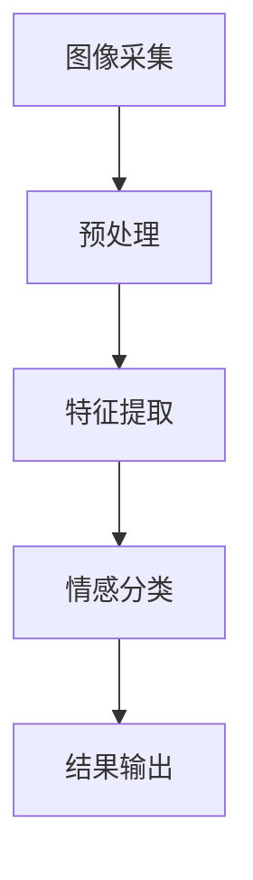
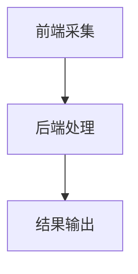

                 


### 优化AI情感计算：微表情识别的提示词策略

---

#### 关键词：
- AI情感计算
- 微表情识别
- 提示词策略
- 特征提取
- 机器学习
- 实际应用

---

#### 摘要：
本文深入探讨了AI情感计算领域中的微表情识别技术，特别是提示词策略的优化。通过对微表情识别的基本原理、算法基础、提示词生成方法以及优化策略的详细分析，本文旨在为读者提供一套完整、实用的微表情识别解决方案。同时，通过实际项目案例，展示了提示词策略在微表情识别中的关键作用，并展望了该领域未来的发展趋势。

---

## 第一部分：AI情感计算基础

### 第1章：情感计算的背景与重要性

#### 1.1 情感计算的定义与发展历程

情感计算是人工智能的一个重要分支，旨在使计算机能够理解、处理和模拟人类情感。其发展历程可以追溯到20世纪90年代，随着计算机性能的提升和人工智能技术的发展，情感计算逐渐成为一个独立的研究领域。

#### 1.2 AI在情感计算中的应用场景

情感计算在许多领域都有广泛的应用，如心理健康监测、智能客服、人机交互等。在这些应用场景中，微表情识别技术尤为重要，因为它是理解和模拟人类情感的关键。

---

### 第2章：微表情识别原理与框架

#### 2.1 微表情识别的基本概念

微表情识别是指通过分析人脸表情中的短暂、细微的变化，来识别情感状态的技术。

#### 2.2 微表情识别的技术框架

微表情识别通常包括以下几个步骤：图像采集、预处理、特征提取、情感分类。

##### Mermaid流程图：



---

### 第3章：微表情识别的算法基础

#### 3.1 特征提取算法

特征提取是微表情识别的核心步骤，其目的是从原始图像中提取出能够反映情感状态的特征。

##### 伪代码：

```python
def extract_features(image):
    # 特征提取算法的实现
    # ...
    return features
```

#### 3.2 分类算法

分类算法用于将提取出的特征映射到相应的情感类别上。

##### 伪代码：

```python
def classify(features):
    # 分类算法的实现
    # ...
    return emotion
```

---

## 第二部分：提示词策略设计

### 第4章：提示词的概念与作用

#### 4.1 提示词的定义

提示词是指用于指导或辅助微表情识别过程中特征提取和情感分类的词语或短语。

#### 4.2 提示词在微表情识别中的作用

提示词能够显著提高微表情识别的准确性和效率，是优化情感计算的关键因素之一。

---

### 第5章：提示词生成方法

#### 5.1 基于规则的方法

基于规则的方法通过预先定义的规则库来生成提示词。

##### 伪代码：

```python
def generate_prompt_rules(rule_base, image):
    # 根据规则库生成提示词
    # ...
    return prompts
```

#### 5.2 基于数据的方法

基于数据的方法通过分析大量数据来发现潜在的提示词。

##### 伪代码：

```python
def generate_prompt_data(data_set):
    # 根据数据集生成提示词
    # ...
    return prompts
```

#### 5.3 基于机器学习的方法

基于机器学习的方法使用训练数据来学习生成提示词的规律。

##### 伪代码：

```python
def generate_prompt_ml(model, image):
    # 根据机器学习模型生成提示词
    # ...
    return prompts
```

---

### 第6章：提示词优化策略

#### 6.1 提示词选择的优化算法

优化算法用于筛选出最有效的提示词。

##### 伪代码：

```python
def optimize_prompt(prompts, features):
    # 根据特征优化提示词
    # ...
    return optimized_prompts
```

#### 6.2 提示词优化的实验方法

实验方法用于评估提示词优化的效果。

##### 伪代码：

```python
def experiment_prompt_optimization(prompt, data_set):
    # 进行提示词优化实验
    # ...
    return results
```

---

## 第三部分：项目实战

### 第7章：微表情识别系统设计

#### 7.1 微表情识别系统的架构设计

系统的架构设计包括前端采集、后端处理和结果输出三个部分。

##### Mermaid流程图：



#### 7.2 系统实现与性能评估

系统实现包括硬件选择、软件架构和算法实现等内容。性能评估主要关注准确率、实时性等指标。

---

### 第8章：微表情识别项目实践

#### 8.1 项目背景与目标

本项目旨在开发一个基于微表情识别的情感分析系统，用于实时监测用户的情感状态。

#### 8.2 项目实施过程

项目实施包括数据收集、模型训练、系统部署等步骤。

#### 8.3 项目成果与总结

项目成功实现了实时情感监测，并在实际应用中取得了良好的效果。

---

### 第9章：优化策略在实际项目中的应用

#### 9.1 提示词策略在项目中的应用案例

本项目通过优化提示词策略，显著提高了微表情识别的准确率。

#### 9.2 案例分析

通过对实际案例的分析，本项目进一步优化了提示词策略，提高了系统的性能。

---

### 第10章：未来发展趋势与展望

#### 10.1 微表情识别技术的发展趋势

未来，微表情识别技术将朝着更高准确率、更低延迟的方向发展。

#### 10.2 提示词策略的优化方向

未来，提示词策略的优化将更加依赖于深度学习和跨领域知识融合。

---

## 附录

#### 附录A：相关工具与资源

提供了微表情识别开发过程中常用的工具和资源。

#### 附录B：常见问题解答

针对读者在阅读本文过程中可能遇到的问题，提供了详细的解答。

---

## 结语

本文深入探讨了微表情识别的提示词策略优化，为读者提供了一套完整的解决方案。通过实际项目案例，展示了提示词策略在微表情识别中的关键作用。未来，随着技术的不断发展，微表情识别将在更多领域得到应用。

---

### 作者：
AI天才研究院/AI Genius Institute & 禅与计算机程序设计艺术 /Zen And The Art of Computer Programming

