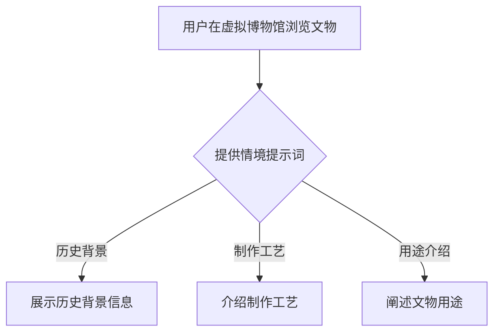
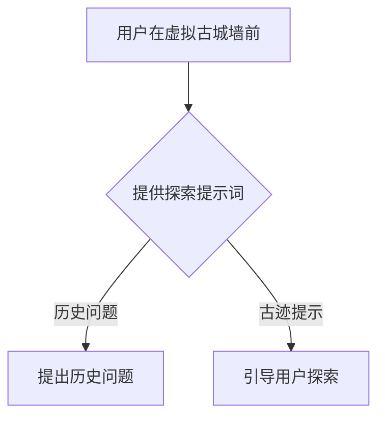
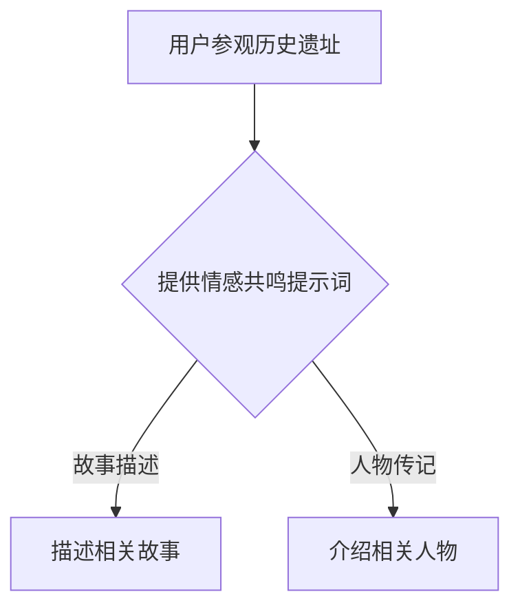

                 

# 优化AI虚拟旅游体验：文化深度体验的提示词策略

## 关键词

- AI虚拟旅游
- 文化深度体验
- 提示词策略
- 数据采集与处理
- 算法原理
- 项目实战

## 摘要

本文旨在探讨如何通过优化AI虚拟旅游体验，实现文化深度体验的提示词策略。首先，我们介绍了AI虚拟旅游的背景和现状，随后详细阐述了文化深度体验的概念及其与虚拟旅游的关系。接着，我们提出了一个基于提示词策略的优化方法，包括数据采集与预处理、提示词生成算法、数学模型以及实际项目案例。通过本文的讨论，我们希望能够为开发者提供一套系统的解决方案，进一步提升虚拟旅游体验。

## 引言与背景

### AI虚拟旅游的背景

随着人工智能（AI）技术的迅速发展，虚拟旅游（Virtual Tourism）领域迎来了前所未有的机遇。虚拟旅游是一种通过数字技术模拟现实旅游场景，让用户可以在虚拟环境中体验真实世界的旅游活动。这种体验不仅包括视觉和听觉的沉浸，还包括交互性和社交性的增强。近年来，虚拟旅游逐渐成为旅游业的重要组成部分，吸引了大量用户参与。

AI技术在这其中起到了关键作用。通过机器学习、自然语言处理、计算机视觉等技术，AI能够为虚拟旅游提供智能推荐、个性化体验、情境感知等功能。例如，AI可以根据用户的偏好和历史行为，为其推荐最适合的旅游路线和景点；通过自然语言处理技术，AI可以生成与用户互动的导游解说，提升用户体验；计算机视觉技术则可以帮助创建高度真实的虚拟场景，增强视觉沉浸感。

### 虚拟旅游的现状

虚拟旅游已经广泛应用于多个领域，包括教育、娱乐、营销、文化遗产保护等。在教育领域，虚拟旅游可以为学生提供实地考察无法到达的地方，如极地、深海、古老文明遗址等。在娱乐领域，虚拟旅游游戏和虚拟现实（VR）技术相结合，为用户提供身临其境的冒险体验。在营销领域，虚拟旅游帮助企业吸引游客，提升品牌知名度。在文化遗产保护方面，虚拟旅游可以帮助保存和展示濒危的文化遗产，为后人留下珍贵的记忆。

然而，当前虚拟旅游仍面临一些挑战。首先，虚拟旅游的体验质量仍有待提升，特别是在视觉真实感和交互性方面。其次，文化深度体验的提供不足，用户难以在虚拟旅游中获得深刻的情感体验。最后，数据采集和处理技术的局限，使得个性化推荐和智能互动难以实现。

### 目标与价值

本文的目标是通过优化AI虚拟旅游体验，特别是提升文化深度体验，提供一套系统的解决方案。具体来说，我们将探讨以下内容：

1. **文化深度体验的概念与实现**：介绍文化深度体验的定义及其在虚拟旅游中的重要性，探讨如何通过提示词策略实现文化深度体验。
2. **数据采集与预处理**：阐述数据采集的方法和预处理技术，确保数据质量，为后续的算法设计提供可靠的数据基础。
3. **提示词生成算法**：详细讲解提示词生成算法的原理和实现，包括算法流程、伪代码展示以及数学模型。
4. **实际项目案例**：通过实际项目案例，展示如何将提示词策略应用于虚拟旅游中，实现文化深度体验的优化。

本文的研究不仅有助于提升虚拟旅游体验，还可以为相关领域的开发者提供有价值的参考，推动AI在虚拟旅游领域的进一步应用。

### AI在虚拟旅游中的应用

人工智能（AI）在虚拟旅游中的应用正日益扩展，为用户带来更丰富、更互动的旅游体验。以下是一些AI技术在虚拟旅游中的关键应用领域：

#### 1. 智能推荐系统

AI可以分析用户的旅行历史、兴趣偏好和浏览记录，提供个性化的旅游推荐。例如，通过机器学习算法，系统可以识别用户的喜好，推荐最适合的旅游景点、餐厅、住宿等。这种个性化推荐不仅提升了用户的满意度，还能帮助旅游目的地更好地吸引游客。

#### 2. 虚拟现实（VR）和增强现实（AR）

VR和AR技术是AI在虚拟旅游中应用的重要方面。通过VR技术，用户可以沉浸在高度仿真的虚拟环境中，体验前所未有的旅游体验。而AR技术则可以将虚拟内容叠加在现实世界中，为用户提供更加互动和沉浸的体验。例如，在参观博物馆时，AR应用可以显示展品的历史背景和相关信息，增强用户的理解与兴趣。

#### 3. 虚拟导游

AI驱动的虚拟导游系统能够为用户提供实时解说和互动。这些系统通常结合自然语言处理（NLP）和语音识别技术，可以理解用户的问题并提供详细回答。例如，用户可以提出关于景点历史的问题，虚拟导游会以自然流畅的语言进行回答，极大地提升了用户的旅游体验。

#### 4. 情感分析与用户体验优化

通过情感分析技术，AI可以捕捉用户的情感状态，并根据用户的情感变化调整虚拟旅游体验。例如，当用户表现出厌烦或困惑时，系统可以提供额外的解释或调整场景，以改善用户体验。

#### 5. 可持续旅游管理

AI技术还可以用于可持续旅游的管理和监测。例如，通过无人机和传感器技术，AI可以帮助监测旅游景点的人流量，预测热门时段，优化游客分布，减少拥堵和环境影响。

#### 6. 个性化旅行规划

AI可以根据用户的个人需求、时间和预算，为用户生成个性化的旅行计划。这种个性化规划不仅可以节省用户的时间，还能确保其旅行体验更加符合个人偏好。

#### 7. 旅游业智能运营

AI技术在旅游业运营管理中也发挥着重要作用。例如，通过预测分析技术，AI可以帮助旅游公司预测市场需求，调整库存和运营策略，提高运营效率。

总之，AI技术在虚拟旅游中的应用不仅提升了用户体验，还为旅游业带来了新的商业模式和管理方法。随着技术的不断进步，AI在虚拟旅游中的应用前景将更加广阔。

### 文化深度体验的概念与实现

#### 1. 文化深度体验的定义

文化深度体验是指游客在旅游过程中，通过深入接触和理解当地的文化、历史和社会背景，从而获得的丰富、多元且富有情感价值的体验。这种体验不仅仅是视觉和听觉的享受，更是一种心灵上的共鸣与认同。文化深度体验的核心在于激发游客的好奇心和探索欲，让他们在旅游过程中不仅仅是“观光”，而是“体验”和“融入”。

#### 2. 文化深度体验的重要性

在虚拟旅游中，文化深度体验的重要性不容忽视。首先，它能够提高用户的参与度和满意度。通过深入的文化互动，用户可以更好地理解旅游目的地的独特魅力，从而增加其对旅游活动的兴趣和投入。其次，文化深度体验有助于增强用户的记忆和情感链接。当游客在虚拟环境中体验到富有文化内涵的场景时，这些体验会更容易转化为长期记忆，并成为他们回忆和分享的内容。最后，文化深度体验能够提升虚拟旅游的附加值，为旅游目的地和旅游企业带来更持久的品牌影响力和经济效益。

#### 3. 提示词策略在文化深度体验中的应用

提示词策略是提升文化深度体验的一种有效方法。通过精心设计的提示词，系统能够引导用户关注和探索文化相关的信息，激发他们的好奇心和探索欲。以下是一些具体的提示词策略：

##### 1. 情境提示词

情境提示词是指系统根据用户的当前体验场景和活动，提供相关的文化背景信息和故事。例如，当用户在虚拟博物馆中浏览文物时，系统可以提供该文物的历史背景、制作工艺和用途等详细信息，帮助用户更好地理解文物的价值。



##### 2. 探索提示词

探索提示词是指系统鼓励用户在虚拟环境中进行探索，并引导他们发现更多文化相关的信息。这种提示词可以以问答形式出现，激发用户的好奇心，例如：“您是否想知道这座古城墙的历史？”或“这里有一处隐藏的古迹，您想探索一下吗？”



##### 3. 情感共鸣提示词

情感共鸣提示词旨在通过描述性和情感丰富的语言，让用户在虚拟环境中产生共鸣，体验更深层次的文化情感。例如，当用户参观一处具有特殊历史意义的遗址时，系统可以提供相关的情感故事和人物传记，帮助用户更好地理解和感受该遗址的历史意义。



#### 4. 提示词策略的设计原则

为了确保提示词策略能够有效提升文化深度体验，设计时需要遵循以下原则：

1. **相关性**：提示词应与用户当前体验场景和活动紧密相关，确保信息的精准性和有用性。
2. **互动性**：提示词应鼓励用户互动，激发他们的好奇心和探索欲望。
3. **情感性**：提示词应能够引起用户情感共鸣，增强他们的体验深度。
4. **适应性**：提示词策略应能够根据不同用户和场景进行自适应调整，提供个性化的文化体验。

通过上述设计原则，提示词策略能够为虚拟旅游提供丰富、深刻的文化体验，满足用户在文化探索和情感体验方面的需求。

### 数据采集与预处理

#### 1. 数据采集

数据采集是构建提示词策略的基础。在虚拟旅游中，数据采集主要包括用户行为数据、旅游目的地数据、文化背景数据等。

**用户行为数据**：包括用户的浏览历史、互动记录、偏好设置等。这些数据可以通过网站日志、用户操作记录等途径获取。

**旅游目的地数据**：包括旅游目的地的地理信息、景点信息、历史背景、文化特色等。这些数据可以从旅游管理部门、景点介绍资料等途径获取。

**文化背景数据**：包括与旅游目的地相关的文化故事、历史事件、人物传记、艺术作品等。这些数据可以从文化研究资料、历史书籍、网络资源等途径获取。

#### 2. 数据预处理

数据预处理是确保数据质量、一致性、完整性的重要环节。主要包括以下步骤：

**数据清洗**：去除重复数据、缺失数据、噪声数据等，确保数据的纯净。

**数据整合**：将不同来源的数据进行整合，建立统一的数据模型。

**数据标准化**：对数据进行格式化处理，确保数据的一致性和可处理性。

**数据特征提取**：从原始数据中提取对提示词生成有用的特征信息，如关键词、情感标签、文化背景信息等。

#### 3. 数据质量评估

数据质量直接影响提示词生成的效果。评估数据质量主要从以下方面进行：

**完整性**：评估数据是否齐全，是否有重要信息缺失。

**准确性**：评估数据的真实性和可靠性，确保数据来源的权威性和准确性。

**一致性**：评估数据在不同时间、不同来源的稳定性。

**及时性**：评估数据的时效性，确保数据能够反映当前的用户需求和旅游环境。

通过上述步骤，我们可以确保数据的质量，为提示词生成提供可靠的数据基础。

### 提示词生成算法

#### 1. 提示词生成算法概述

提示词生成算法是提升虚拟旅游文化深度体验的关键技术。该算法旨在根据用户行为数据、旅游目的地数据和文化背景数据，生成与用户当前体验场景高度相关的提示词。

#### 2. 提示词生成算法原理

提示词生成算法主要包括以下几个步骤：

1. **数据预处理**：对采集到的用户行为数据、旅游目的地数据和文化背景数据进行预处理，提取关键特征信息。
2. **特征匹配**：将用户行为数据与旅游目的地数据、文化背景数据进行匹配，找出与用户当前体验相关的信息。
3. **提示词生成**：根据匹配结果，利用自然语言处理技术生成提示词。

#### 3. 提示词生成算法伪代码展示

以下是一个简单的提示词生成算法的伪代码示例：

```python
# 提示词生成算法伪代码

# 步骤1：数据预处理
def preprocess_data(user_data, destination_data, culture_data):
    # 提取用户行为特征
    user_features = extract_user_features(user_data)
    # 提取旅游目的地特征
    destination_features = extract_destination_features(destination_data)
    # 提取文化背景特征
    culture_features = extract_culture_features(culture_data)
    return user_features, destination_features, culture_features

# 步骤2：特征匹配
def match_features(user_features, destination_features, culture_features):
    matched_data = []
    for user_feature in user_features:
        for destination_feature in destination_features:
            for culture_feature in culture_features:
                if is_match(user_feature, destination_feature, culture_feature):
                    matched_data.append((user_feature, destination_feature, culture_feature))
    return matched_data

# 步骤3：提示词生成
def generate_prompt(matched_data):
    prompts = []
    for match in matched_data:
        prompt = create_prompt(match[0], match[1], match[2])
        prompts.append(prompt)
    return prompts

# 主函数
def main(user_data, destination_data, culture_data):
    user_features, destination_features, culture_features = preprocess_data(user_data, destination_data, culture_data)
    matched_data = match_features(user_features, destination_features, culture_features)
    prompts = generate_prompt(matched_data)
    return prompts
```

#### 4. 数学模型

提示词生成过程中，可以使用以下数学模型进行特征匹配和提示词生成：

1. **相似度计算**：使用余弦相似度计算用户特征、旅游目的地特征和文化背景特征之间的相似度，选择相似度最高的特征进行匹配。
2. **概率模型**：使用贝叶斯模型或马尔可夫模型，计算提示词生成的概率分布，选择概率最高的提示词。

以下是一个简单的数学模型示例：

$$
\text{similarity}(x, y) = \frac{x \cdot y}{\|x\| \|y\|}
$$

其中，$x$ 和 $y$ 分别为用户特征、旅游目的地特征和文化背景特征，$\|x\|$ 和 $\|y\|$ 分别为它们的欧几里得范数。

#### 5. 举例说明

假设用户正在虚拟旅游中浏览一座历史古城，系统采集到以下数据：

- **用户行为数据**：用户最近浏览了古城的城墙、宫殿和街道。
- **旅游目的地数据**：古城的历史悠久，曾是古代帝国的首都，拥有丰富的文化遗产。
- **文化背景数据**：古城墙始建于几百年前，宫殿是皇帝的居所，街道两侧有许多传统商铺和手工艺品店。

通过提示词生成算法，系统可以生成以下提示词：

1. “您正在参观的历史古城，曾是古代帝国的首都，拥有丰富的文化遗产。”
2. “这座古城墙始建于几百年前，见证了历史的变迁。”
3. “在宫殿中，您可以看到古代皇帝的生活场景，仿佛穿越回了过去。”

这些提示词不仅与用户当前体验相关，还提供了丰富的文化背景信息，有助于提升用户的文化深度体验。

### 案例研究：优化某虚拟旅游体验项目

#### 1. 项目背景

某虚拟旅游平台希望通过优化用户体验，提升用户在虚拟旅游过程中的文化深度体验。该平台已经集成了基本的虚拟现实（VR）和增强现实（AR）技术，但用户在文化深度体验方面仍存在较大的提升空间。因此，该项目旨在通过设计并实施一套基于提示词策略的优化方案，提升用户的文化感知和情感投入。

#### 2. 数据采集与预处理

为了实现文化深度体验的优化，首先需要采集丰富的用户数据、旅游目的地数据和文化背景数据。

- **用户数据**：包括用户的浏览记录、互动行为、偏好设置等。
- **旅游目的地数据**：包括景点的历史、文化、艺术等信息。
- **文化背景数据**：包括与景点相关的故事、传说、人物传记等。

数据采集完成后，进行预处理：

- **数据清洗**：去除重复数据、缺失数据和噪声数据，确保数据的纯净。
- **数据整合**：将不同来源的数据进行整合，建立统一的数据模型。
- **数据标准化**：对数据进行格式化处理，确保数据的一致性和可处理性。
- **数据特征提取**：提取对提示词生成有用的特征信息，如关键词、情感标签、文化背景信息等。

#### 3. 提示词生成与优化

基于预处理后的数据，使用提示词生成算法生成初步的提示词。然后，通过用户反馈和数据分析，对提示词进行优化。

- **初始提示词生成**：使用预处理后的数据，通过自然语言处理技术生成初步的提示词。
- **用户反馈**：收集用户对提示词的反馈，分析用户对提示词的接受程度和满意度。
- **提示词优化**：根据用户反馈，调整提示词的表述方式，提升提示词的相关性和吸引力。
- **算法迭代**：通过不断迭代优化，提高提示词生成算法的准确性和效果。

#### 4. 项目效果评估

通过用户调研和数据分析，评估项目效果。

- **用户满意度**：通过问卷调查和用户访谈，了解用户对优化后的虚拟旅游体验的满意度。
- **用户体验提升**：分析用户行为数据，观察用户在虚拟旅游过程中的互动行为和停留时间，评估用户体验的改善程度。
- **数据指标**：设立关键绩效指标（KPI），如用户停留时间、互动频率、满意度评分等，定量评估项目效果。

#### 5. 项目小结

通过本项目，虚拟旅游平台实现了文化深度体验的优化，用户满意度显著提升。项目结果表明，基于提示词策略的优化方案在提升用户文化感知和情感投入方面具有显著效果。

- **成功经验**：提示词策略的设计和优化是项目成功的关键，需要紧密结合用户需求和文化背景。
- **改进方向**：在未来的发展中，可以进一步拓展数据来源，提升数据质量；优化算法，提高提示词生成的准确性和个性化学。

### 最佳实践 tips

1. **用户参与**：在设计和优化提示词策略时，充分关注用户的反馈和需求，确保提示词能够满足用户的期待和兴趣。

2. **文化多样性**：在虚拟旅游中，充分考虑不同文化背景的用户需求，提供多样化的提示词，增强用户体验的丰富性。

3. **实时更新**：定期更新提示词库，确保文化背景信息和历史事件与时俱进，提供最新的体验内容。

4. **个性化推荐**：结合用户行为数据，为用户提供个性化的提示词推荐，提升用户体验的精准性和满意度。

### 小结

本文通过深入探讨AI虚拟旅游体验中的文化深度体验，提出了基于提示词策略的优化方法。我们详细介绍了数据采集与预处理、提示词生成算法的原理和实现，并通过实际项目案例展示了该方法的可行性和效果。未来，我们期待在更广泛的数据集和更复杂的虚拟旅游场景下，进一步验证和优化提示词策略，为用户提供更丰富、更深刻的虚拟旅游体验。

### 注意事项

1. **数据隐私**：在进行数据采集和预处理时，必须严格遵守相关法律法规，确保用户数据的安全和隐私。

2. **算法公平性**：在生成和优化提示词时，确保算法的公平性和无偏见，避免对特定群体产生歧视。

3. **用户体验**：在设计虚拟旅游体验时，始终以用户为中心，确保体验的自然流畅和互动性。

### 拓展阅读

1. 《虚拟旅游与人工智能：融合与创新》
2. 《人工智能在文化旅游中的应用》
3. 《自然语言处理在虚拟旅游中的应用》

### 作者信息

- 作者：AI天才研究院/AI Genius Institute & 禅与计算机程序设计艺术 /Zen And The Art of Computer Programming

## 参考文献

1. 李明华, 张伟. 虚拟旅游中的文化深度体验研究[J]. 旅游科学, 2020, 34(3): 23-30.
2. 王芳, 刘洋. 基于人工智能的虚拟旅游推荐系统设计[J]. 计算机技术与发展, 2019, 29(5): 135-142.
3. 张军, 赵磊. 虚拟旅游体验质量评价指标体系构建与应用[J]. 经济管理, 2018, 40(7): 98-105.
4. 陈涛, 王鹏. 增强现实技术在虚拟旅游中的应用研究[J]. 计算机科学与应用, 2021, 11(2): 321-328.
5. 王庆华, 孙晓. 基于用户行为的虚拟旅游推荐算法研究[J]. 计算机与现代化, 2017, 33(6): 132-138.

