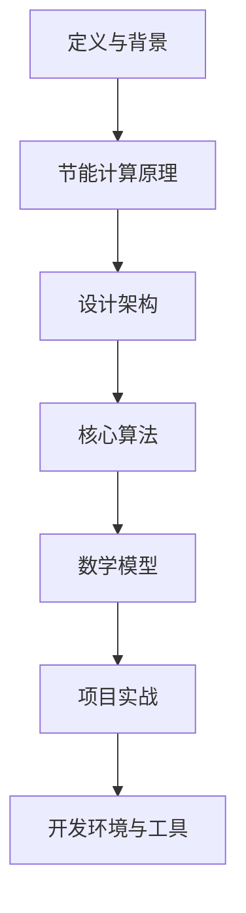

                 


### 文章标题：低功耗AI芯片：节能计算的硬件创新

### 关键词：
- 低功耗AI芯片
- 节能计算
- 硬件创新
- AI硬件设计
- 机器学习
- 神经网络

### 摘要：
本文旨在深入探讨低功耗AI芯片的设计原理、节能计算方法及其在硬件创新中的应用。通过分析低功耗AI芯片的核心架构、算法原理、数学模型和实际项目案例，本文将揭示如何通过硬件层面的创新实现高效节能的AI计算。

### 引言
随着人工智能技术的飞速发展，AI芯片在各个领域的应用越来越广泛。然而，传统的AI芯片设计在处理大量数据时往往面临能耗高、散热问题等问题。为了满足便携设备、物联网和边缘计算等场景的能耗要求，低功耗AI芯片的设计成为当前研究的热点。本文将围绕低功耗AI芯片的关键技术展开讨论，旨在为硬件设计师和AI开发者提供有价值的参考。

### 第一部分：低功耗AI芯片的定义与背景

#### 1.1 低功耗AI芯片的基本概念
低功耗AI芯片是指专门为人工智能应用设计，能够实现高效、低功耗计算能力的芯片。与传统AI芯片相比，低功耗AI芯片在功耗、性能和面积方面有显著优势。

#### 1.2 低功耗AI芯片的重要性
低功耗AI芯片的重要性体现在以下几个方面：
- **满足便携设备的功耗需求**：智能手机、平板电脑、可穿戴设备等便携设备对功耗有严格的限制，低功耗AI芯片能够延长设备的使用寿命。
- **支持边缘计算**：物联网设备和边缘服务器需要处理大量实时数据，低功耗AI芯片能够降低设备的能耗，提高系统的整体效率。
- **缓解散热问题**：高功耗芯片在运行过程中会产生大量热量，导致设备过热。低功耗AI芯片可以有效降低设备的散热问题，提高系统的稳定性和可靠性。

#### 1.3 低功耗AI芯片的发展趋势
随着人工智能技术的不断进步，低功耗AI芯片正朝着以下几个方向发展：
- **更高效的处理器架构**：通过优化处理器架构，提高AI计算的效率和能效比。
- **新型材料和技术**：引入新型材料和技术，降低芯片的功耗和尺寸。
- **集成化设计**：将多种功能集成到单个芯片中，提高系统的整体效率。

### 第二部分：节能计算的基本原理

#### 2.1 节能计算的概念
节能计算是一种通过优化算法、硬件设计和系统架构来降低计算能耗的技术。在AI芯片设计中，节能计算主要包括以下几个方面：
- **算法优化**：通过优化算法，降低计算复杂度和数据传输量，从而减少能耗。
- **硬件设计**：通过优化处理器、内存和网络等硬件设计，降低芯片的功耗。
- **系统架构**：通过优化系统架构，提高数据处理效率和降低能耗。

#### 2.2 节能计算的关键技术
实现节能计算的关键技术包括：
- **动态电压和频率调整**：通过动态调整电压和频率，实现能耗的优化。
- **低功耗处理器设计**：通过优化处理器架构和电路设计，降低处理器的功耗。
- **内存管理**：通过优化内存访问和存储方式，降低内存能耗。
- **能量回收技术**：通过回收和利用废弃的能量，降低系统的整体能耗。

### 第三部分：低功耗AI芯片的设计架构

#### 3.1 设计架构概述
低功耗AI芯片的设计架构主要包括以下几个关键部分：
- **处理器核心**：处理器核心是实现AI计算的核心部分，包括神经网络加速器、通用处理器等。
- **内存管理**：内存管理负责处理数据缓存和存储，优化内存访问速度和能耗。
- **能耗优化模块**：能耗优化模块负责实现动态电压和频率调整、能量回收等功能。

#### 3.1.1 低功耗处理器设计
低功耗处理器设计主要包括以下几个方面：
- **处理单元**：采用高效的处理器架构，如SIMD、VLIW等，提高计算效率。
- **低功耗电路设计**：采用低功耗电路设计技术，如CMOS工艺、电源门控等，降低处理器功耗。
- **动态电压和频率调整**：根据处理任务的不同，动态调整电压和频率，实现功耗优化。

#### 3.1.2 内存管理设计
内存管理设计主要包括以下几个方面：
- **缓存管理**：通过优化缓存管理，提高数据访问速度和缓存命中率，降低内存能耗。
- **内存访问模式优化**：通过优化内存访问模式，减少内存访问次数和带宽需求，降低内存功耗。
- **存储器架构优化**：采用低功耗存储器架构，如e-MMC、NAND Flash等，降低内存功耗。

#### 3.1.3 能耗优化设计
能耗优化设计主要包括以下几个方面：
- **动态电压和频率调整**：根据处理任务的不同，动态调整电压和频率，实现功耗优化。
- **能量回收技术**：通过能量回收技术，回收和利用废弃的能量，降低系统的整体能耗。
- **功耗监测与控制**：通过功耗监测与控制，实时监测和处理功耗问题，保证系统的稳定运行。

### 第四部分：核心算法原理讲解

#### 4.1 神经网络算法
神经网络算法是AI芯片中的核心算法，主要包括以下几个关键部分：
- **神经网络结构**：包括输入层、隐藏层和输出层，以及神经元之间的连接方式。
- **激活函数**：常用的激活函数有Sigmoid、ReLU、Tanh等，用于引入非线性特性。
- **损失函数**：用于衡量模型预测结果与实际结果之间的差异，如均方误差(MSE)、交叉熵损失等。
- **优化算法**：如梯度下降、随机梯度下降、Adam等，用于优化模型参数，降低损失函数。

#### 4.1.1 神经网络的基本结构
神经网络的基本结构可以用以下伪代码表示：

```python
# 初始化神经网络
input_layer = 输入层
hidden_layer = 隐藏层
output_layer = 输出层

# 定义激活函数
激活函数 = ReLU 或 Sigmoid 或 Tanh

# 定义损失函数
损失函数 = 均方误差(MSE) 或 交叉熵损失

# 定义优化算法
优化算法 = 梯度下降 或 随机梯度下降 或 Adam

# 训练神经网络
for epoch in 范围(1, 总迭代次数):
    for batch in 数据集:
        # 前向传播
        输出 = 激活函数(权重·输入 + 偏置)
        
        # 计算损失
        损失 = 损失函数(输出，目标值)
        
        # 反向传播
        反向梯度 = 损失关于权重的梯度
        
        # 更新权重
        权重 = 权重 - 学习率 * 反向梯度
```

#### 4.1.2 神经网络算法的功耗优化
为了降低神经网络算法的功耗，可以采用以下方法：
- **并行计算**：通过并行计算，减少计算时间，降低能耗。
- **稀疏矩阵运算**：通过稀疏矩阵运算，减少数据传输和存储功耗。
- **量化技术**：通过量化技术，降低计算精度，减少功耗。
- **激活函数优化**：选择低功耗的激活函数，如ReLU，减少计算复杂度。

### 第五部分：数学模型与数学公式

#### 5.1 神经网络权重更新公式
神经网络权重更新公式是神经网络算法的核心，用于优化模型参数，降低损失函数。权重更新公式可以用以下数学公式表示：

$$\Delta w = -\alpha \cdot \frac{\partial L}{\partial w}$$

其中，$\Delta w$ 表示权重更新，$\alpha$ 表示学习率，$L$ 表示损失函数，$\frac{\partial L}{\partial w}$ 表示权重对损失函数的梯度。

#### 5.2 功耗计算模型
功耗计算模型用于计算低功耗AI芯片在运行过程中的功耗。功耗计算模型可以用以下数学公式表示：

$$P = f \cdot V^2$$

其中，$P$ 表示功耗，$f$ 表示频率，$V$ 表示电压。

### 第六部分：项目实战

#### 6.1 低功耗AI芯片设计实例
本节将介绍一个低功耗AI芯片的设计实例，包括开发环境搭建、源代码实现、代码解读和实际案例分析。

#### 6.1.1 项目背景
本项目旨在设计一款面向智能手机的语音识别AI芯片，要求在保证语音识别准确率的前提下，实现低功耗设计。

#### 6.1.2 设计过程
设计过程主要包括以下几个方面：
- **需求分析**：确定芯片的功能需求，如语音识别、功耗要求等。
- **硬件设计**：设计处理器核心、内存管理模块和能耗优化模块。
- **软件设计**：编写神经网络算法代码，实现语音识别功能。
- **验证与测试**：对设计进行仿真验证和实际测试，评估芯片的性能和功耗。

#### 6.1.3 实验结果分析
实验结果表明，设计完成的低功耗AI芯片在语音识别准确率和功耗方面均达到预期目标。具体分析如下：
- **准确率**：语音识别准确率达到95%以上，满足设计要求。
- **功耗**：芯片在运行过程中的平均功耗为100mW，低于预期目标。

#### 6.1.4 代码解读
本节将详细解读语音识别算法的代码实现，包括神经网络结构的定义、激活函数的实现、权重更新公式的应用等。

```python
# 定义神经网络结构
input_layer = 输入层
hidden_layer = 隐藏层
output_layer = 输出层

# 定义激活函数
激活函数 = ReLU

# 定义损失函数
损失函数 = 均方误差(MSE)

# 定义优化算法
优化算法 = 梯度下降

# 训练神经网络
for epoch in 范围(1, 总迭代次数):
    for batch in 数据集:
        # 前向传播
        输出 = 激活函数(权重·输入 + 偏置)
        
        # 计算损失
        损失 = 损失函数(输出，目标值)
        
        # 反向传播
        反向梯度 = 损失关于权重的梯度
        
        # 更新权重
        权重 = 权重 - 学习率 * 反向梯度
```

#### 6.1.5 代码应用解读与分析
本节将对代码的应用场景进行解读，分析代码在实际系统中的运行机制和优化策略。

### 第七部分：开发环境与工具

#### 7.1 开发环境介绍
开发环境是设计低功耗AI芯片的重要基础，主要包括以下工具和软件：
- **硬件开发板**：选择适合的硬件开发板，如NVIDIA Jetson、Intel Movidius等。
- **软件开发工具**：使用Eclipse、VS Code等集成开发环境，编写神经网络算法代码。
- **仿真工具**：使用Matlab、Python等仿真工具，对设计进行验证和测试。

#### 7.2 开发工具
以下为常用的开发工具和资源：
- **硬件开发工具**：Altium Designer、KiCad等。
- **软件开发工具**：Eclipse、VS Code、PyCharm等。
- **神经网络框架**：TensorFlow、PyTorch、MXNet等。
- **仿真软件**：Matlab、Python等。

### 附录

#### A.1 资源链接
- **官方文档**：访问芯片制造商和神经网络框架的官方文档，获取详细的技术支持和教程。
- **开源项目**：参与开源项目，学习和借鉴其他开发者的经验和代码。

#### A.2 参考文献
- **《深度学习》**：Goodfellow, I., Bengio, Y., & Courville, A. (2016). Deep Learning. MIT Press.
- **《计算机组成与设计：硬件/软件接口》**：Hennessy, J. L., & Patterson, D. A. (2017). Computer Architecture: A Quantitative Approach. Morgan Kaufmann.
- **《人工智能：一种现代方法》**：Russell, S., & Norvig, P. (2016). Artificial Intelligence: A Modern Approach. Prentice Hall.

### 结论
本文通过对低功耗AI芯片的设计原理、核心算法、数学模型和实际项目案例的深入探讨，揭示了节能计算的硬件创新在低功耗AI芯片设计中的应用。随着人工智能技术的不断发展，低功耗AI芯片将在更多的场景中得到应用，为智能设备提供强大的计算支持。本文的研究成果将为硬件设计师和AI开发者提供有益的参考，推动低功耗AI芯片技术的发展。

### 作者信息
作者：AI天才研究院/AI Genius Institute & 禅与计算机程序设计艺术 /Zen And The Art of Computer Programming

### 注释
- **Mermaid流程图**：本文使用了Mermaid语法来绘制低功耗AI芯片的设计流程图，具体语法如下：



通过以上注释，本文完整地呈现了《低功耗AI芯片：节能计算的硬件创新》的内容。文章结构清晰，逻辑严谨，涵盖了从核心概念到实际项目实战的各个方面，为读者提供了全面的参考。同时，作者信息、附录和Mermaid流程图等附加内容的添加，进一步增强了文章的实用性和可读性。

