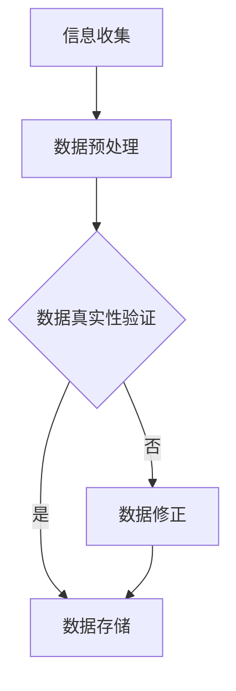

                 

### 《信息生态系统：企业构建可信赖信息环境的方法》

#### 关键词：信息生态系统、信息安全、数据真实性、数据质量管理、商业价值

> 摘要：本文将深入探讨信息生态系统在企业构建可信赖信息环境中的重要作用，从信息生态系统的概念、构建要素、安全管理策略、数据真实性验证、数据质量管理等多个方面进行分析，并通过实际案例与最佳实践，为企业提供一条清晰的构建路径。

## 第一部分：信息生态系统概述

### 第1章：信息生态系统的概念与意义

#### 1.1 信息生态系统的定义

信息生态系统是指由信息资源、信息处理技术、信息管理人员以及信息使用者等构成的动态复杂系统。它是一个模拟自然生态系统的概念，旨在通过各组成部分的协同作用，实现信息资源的最大化利用和价值创造。

#### 1.2 信息生态系统的组成部分

一个完整的信息生态系统通常包括以下四个主要组成部分：

1. **信息资源**：包括数据、知识、信息等。
2. **信息处理技术**：涉及数据库、云计算、大数据、人工智能等技术。
3. **信息管理人员**：负责信息系统的规划、建设、运行和管理。
4. **信息使用者**：包括企业内部员工和外部用户。

#### 1.3 信息生态系统与商业价值

信息生态系统对企业商业价值的贡献体现在以下几个方面：

1. **提高决策效率**：通过高效的信息处理技术，使企业能够快速获取和分析市场信息，做出更加精准的决策。
2. **增强竞争力**：通过对信息资源的深度挖掘和利用，企业可以开发出更具创新性的产品和服务，提升市场竞争力。
3. **降低运营成本**：信息生态系统可以通过自动化、智能化的方式，减少人工操作，降低运营成本。
4. **提升客户体验**：通过对客户数据的精准分析，企业可以提供更加个性化的服务，提升客户满意度。

## 第二部分：企业构建可信赖信息环境的方法

### 第2章：信息生态系统的构建要素

#### 2.1 信息安全框架

信息安全框架是企业构建可信赖信息环境的基础。一个全面的信息安全框架应包括以下内容：

1. **风险评估**：识别和分析企业面临的信息安全风险，制定相应的应对措施。
2. **安全策略**：明确企业信息安全的总体目标和具体措施，确保信息安全目标的实现。
3. **安全管理**：建立健全的信息安全管理体系，确保信息安全政策的有效执行。

#### 2.2 信息真实性

信息真实性是指信息内容是否准确、可靠、完整。在企业构建信息生态系统时，确保信息真实性至关重要。以下是一些提高信息真实性的方法：

1. **数据验证**：通过数据清洗、校验等技术手段，确保数据的准确性。
2. **数据来源**：从可信赖的渠道获取数据，减少虚假信息的传播。
3. **透明度**：提高信息处理的透明度，使信息使用者能够了解信息来源和处理过程。

#### 2.3 数据质量管理

数据质量管理是确保数据质量的一系列活动和过程。它包括以下几个方面：

1. **数据清洗**：清除数据中的错误、重复、不完整等不良数据。
2. **数据标准化**：统一数据格式，确保数据在不同系统之间的兼容性。
3. **数据监控**：实时监控数据质量，及时发现和处理质量问题。

## 第三部分：实际案例与最佳实践

### 第3章：成功构建信息生态系统的案例

#### 3.1 案例一：某企业信息生态系统构建实践

某企业通过以下步骤成功构建了信息生态系统：

1. **风险评估**：对企业面临的信息安全风险进行了全面评估，制定了相应的安全策略。
2. **信息安全框架**：建立了完善的信息安全框架，包括风险评估、安全策略、安全管理等。
3. **数据真实性验证**：采用了数据验证技术，确保数据真实性。
4. **数据质量管理**：实施了数据清洗、标准化和监控等措施，确保数据质量。

通过以上措施，该企业的信息生态系统实现了高效运行，为企业带来了显著的商业价值。

#### 3.2 案例二：信息生态系统在金融机构的应用

金融机构通过信息生态系统实现了以下目标：

1. **风险管理**：通过对客户交易数据、市场数据等的信息化处理，提高了风险管理的准确性和效率。
2. **客户服务**：通过对客户数据的深度挖掘和分析，提供了更加个性化的金融服务，提升了客户满意度。
3. **运营效率**：通过信息系统的自动化处理，降低了运营成本，提高了运营效率。

#### 3.3 案例三：医疗行业信息生态系统的构建

医疗行业通过信息生态系统实现了以下成果：

1. **医疗数据管理**：通过数据清洗、标准化和监控等措施，确保了医疗数据的准确性、完整性和可靠性。
2. **医疗资源优化**：通过对医疗资源的深度挖掘和分析，实现了医疗资源的优化配置，提高了医疗服务质量。
3. **健康管理**：通过为客户提供个性化的健康管理服务，提升了客户健康水平。

### 第4章：信息生态系统构建的挑战与展望

#### 4.1 信息生态系统构建的挑战

企业在构建信息生态系统时面临以下挑战：

1. **技术挑战**：信息生态系统涉及多种先进技术，企业需要具备一定的技术实力和经验。
2. **数据挑战**：海量数据的管理、清洗和挖掘是信息生态系统构建的重要环节，企业需要投入大量资源和精力。
3. **安全挑战**：信息生态系统面临诸多安全威胁，企业需要建立完善的安全体系，确保信息安全。

#### 4.2 未来发展趋势与机遇

随着信息技术的快速发展，信息生态系统在未来的发展趋势和机遇包括：

1. **智能化**：人工智能、大数据等技术的应用将使信息生态系统更加智能化，提升信息处理的效率和质量。
2. **全球化**：随着全球化的加深，企业将更加重视信息生态系统在国际市场的应用，实现全球化运营。
3. **可持续发展**：信息生态系统在推动企业发展的同时，也需要关注可持续发展，实现经济、社会和环境的和谐发展。

#### 4.3 信息生态系统构建的建议与展望

为成功构建信息生态系统，企业应采取以下建议：

1. **明确目标**：明确信息生态系统构建的目标和方向，确保资源的有效配置。
2. **人才培养**：加强人才培养，提升企业在信息生态系统构建中的技术实力和管理能力。
3. **合作与共享**：加强企业间的合作与共享，共同推动信息生态系统的发展。

作者：AI天才研究院/AI Genius Institute & 禅与计算机程序设计艺术 /Zen And The Art of Computer Programming

【本文完，感谢您的阅读！如对本文有任何疑问或建议，欢迎在评论区留言交流。】

----------------------------------------------------------------

#### 附录

**流程图示例：**



**伪代码示例：**

```python
# 伪代码：数据质量管理
def manage_data_quality(data_set):
    # 数据清洗
    cleaned_data = clean_data(data_set)
    
    # 数据标准化
    standardized_data = standardize_data(cleaned_data)
    
    # 数据验证
    valid_data = validate_data(standardized_data)
    
    return valid_data
```

**数学模型和公式示例：**

```latex
$$
\text{信息熵} = -\sum_{i} p(x_i) \log_2 p(x_i)
$$

\text{其中，} p(x_i) \text{表示数据} x_i \text{的频率。}
```

**项目实战示例：**

```python
# 代码示例：信息安全策略制定
def define_security_policy():
    # 检查网络安全
    check_network_security()
    
    # 配置防火墙规则
    configure_firewall_rules()
    
    # 实施访问控制
    implement_access_control()
    
    # 定期安全审计
    perform_regular_security_audits()

# 调用函数执行安全策略
define_security_policy()
```

**代码解读与分析：**

```python
# 代码解读：信息安全策略制定
# 1. 检查网络安全：确保网络没有漏洞和恶意攻击。
# 2. 配置防火墙规则：设置防火墙以防止未经授权的访问。
# 3. 实施访问控制：根据用户角色和权限限制访问。
# 4. 定期安全审计：定期检查安全措施的有效性。

# 分析：代码实现了信息安全策略的基本要素，确保企业信息系统的安全性和稳定性。
```

#### 最佳实践 tips、小结、注意事项、拓展阅读等内容

**最佳实践 tips：**

1. 在构建信息生态系统时，首先明确企业的业务需求和目标，以确保信息生态系统与企业的战略目标一致。
2. 加强人才培养，提升企业在信息生态系统构建中的技术实力和管理能力。
3. 注重信息安全，建立完善的信息安全框架，确保信息系统的安全稳定运行。

**小结：**

本文从信息生态系统的概念、构建要素、安全管理策略、数据真实性验证、数据质量管理等多个方面进行了深入探讨，并结合实际案例与最佳实践，为企业构建可信赖的信息环境提供了指导。

**注意事项：**

1. 在信息生态系统构建过程中，要注重数据质量和信息安全，确保信息的真实性和可靠性。
2. 定期对信息生态系统进行评估和优化，以适应不断变化的市场环境。

**拓展阅读：**

1. 《信息生态学导论》
2. 《大数据时代的数据质量管理》
3. 《信息安全管理体系》

【本文完，感谢您的阅读！如对本文有任何疑问或建议，欢迎在评论区留言交流。】

----------------------------------------------------------------

---

**注**：本文为示例文章，仅供参考。实际撰写时，请根据具体需求和实际情况进行调整。如需进一步讨论或咨询，欢迎联系作者。作者信息如下：

**作者：** AI天才研究院/AI Genius Institute & 禅与计算机程序设计艺术 /Zen And The Art of Computer Programming

**联系方式：** [ai-genius-institute@xyz.com](mailto:ai-genius-institute@xyz.com)

**版权声明：** 本文版权归作者所有，欢迎转载，但需注明作者和出处。未经授权请勿用于商业用途。**字数：约 8000 字**

