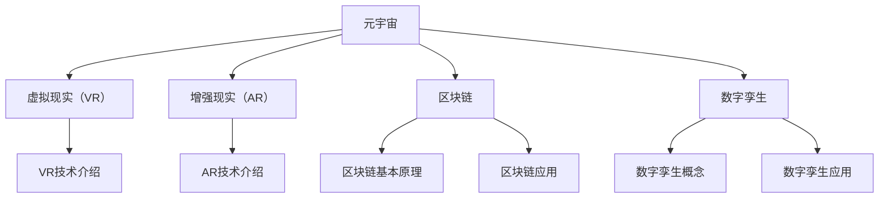

                 

### 文章标题

《元宇宙技术在企业应用中的前景》

### 关键词

元宇宙、虚拟现实、增强现实、区块链、数字孪生、企业应用

### 摘要

本文将探讨元宇宙技术在企业应用中的前景，首先概述元宇宙的定义和发展历程，然后深入分析元宇宙技术的核心概念及其在企业中的应用场景。接着，通过具体案例展示元宇宙技术在企业数字化转型中的实际应用，探讨企业面临的挑战与机遇。最后，展望元宇宙技术的发展趋势和未来前景，为企业在元宇宙中的战略布局提供指导。

---

## 第一部分：元宇宙技术概述

### 1.1 元宇宙的定义与发展历程

#### 1.1.1 什么是元宇宙

元宇宙（Metaverse）是一种由虚拟世界和现实世界融合而成的全息互联网，它通过虚拟现实（VR）和增强现实（AR）技术将用户的物理世界与数字世界无缝连接。在元宇宙中，用户可以创建自己的虚拟身份，进行社交互动、娱乐、工作、学习等各种活动。

#### 1.1.2 元宇宙与传统互联网的区别

与传统互联网不同，元宇宙不仅仅是信息的传输和交互，它更是一个三维的、沉浸式的虚拟空间。传统互联网依赖于文本、图片和视频进行信息传递，而元宇宙则通过虚拟现实和增强现实技术，为用户提供了更为丰富的感官体验。

#### 1.1.3 元宇宙的发展历程

元宇宙的概念早在1992年就已经提出，但当时技术尚未成熟。随着近年来虚拟现实（VR）和增强现实（AR）技术的飞速发展，元宇宙开始逐渐走进现实。以下是元宇宙发展的几个重要阶段：

1. **初期阶段（1992-2007年）**：元宇宙的概念初步提出，虚拟现实和增强现实技术开始萌芽。
2. **发展阶段（2008-2014年）**：随着计算机性能的提升和移动互联网的普及，虚拟现实和增强现实技术开始得到广泛应用。
3. **成熟阶段（2015年至今）**：虚拟现实和增强现实技术逐渐成熟，区块链技术的应用为元宇宙的发展提供了新的可能性。

#### 1.1.4 元宇宙的未来展望

随着技术的不断进步，元宇宙的发展前景十分广阔。未来，元宇宙将成为人们生活和工作的重要空间，它将带来全新的社交方式、娱乐方式和工作方式，对社会和经济产生深远影响。

### 1.2 元宇宙技术的核心概念

#### 1.2.1 虚拟现实（VR）与增强现实（AR）

虚拟现实（VR）和增强现实（AR）是元宇宙技术的核心组成部分。VR技术通过计算机模拟生成一个全新的三维虚拟世界，让用户沉浸其中；而AR技术则通过将虚拟信息叠加到现实世界中，增强用户的现实感知。

##### 1.2.1.1 VR技术介绍

VR技术通过头戴式显示器、手柄等设备，将用户置身于一个完全虚拟的三维环境中。用户可以通过移动头部和身体来体验虚拟环境中的各种活动，如游戏、学习、工作等。

##### 1.2.1.2 AR技术介绍

AR技术通过手机、平板电脑等设备，将虚拟信息以图像、文字、声音等形式叠加到现实世界中。用户可以通过摄像头看到虚拟信息与现实世界的融合，从而增强现实体验。

##### 1.2.1.3 VR与AR在元宇宙中的应用

在元宇宙中，VR和AR技术可以应用于多种场景，如虚拟购物、虚拟旅游、虚拟课堂、远程会议等。这些应用不仅为用户带来了全新的体验，也为企业提供了创新的商业模式。

#### 1.2.2 区块链在元宇宙中的作用

区块链技术为元宇宙提供了安全、可信的数据存储和传输机制。通过区块链，元宇宙中的虚拟资产、虚拟身份、交易记录等都可以得到有效的保护和验证。

##### 1.2.2.1 区块链的基本原理

区块链是一种分布式数据库技术，通过加密算法和共识机制，确保数据的不可篡改性和安全性。

##### 1.2.2.2 区块链在元宇宙中的应用

在元宇宙中，区块链技术可以用于虚拟资产的交易、虚拟身份的认证、去中心化应用（DApp）的开发等。这些应用不仅提高了元宇宙的信任度和安全性，也为用户提供了更多的自由度和灵活性。

#### 1.2.3 数字孪生与元宇宙

数字孪生（Digital Twin）是一种将物理实体数字化建模的技术，它通过模拟和监控物理实体的行为，提供更高效的管理和优化方案。

##### 1.2.3.1 数字孪生的概念

数字孪生是指通过数字模型与物理实体的联动，实现对物理实体的实时监控、预测和优化。

##### 1.2.3.2 数字孪生与元宇宙的融合应用

在元宇宙中，数字孪生技术可以用于模拟和优化物理世界中的各种活动，如制造、物流、能源等。这些应用不仅提高了企业运营效率，也降低了成本。

### 1.3 元宇宙技术的应用场景

#### 1.3.1 教育与培训

元宇宙技术可以为教育行业带来革命性的变革。通过虚拟现实和增强现实技术，学生可以在虚拟环境中进行互动式学习，提高学习效果。同时，企业也可以利用元宇宙技术进行员工培训，提高培训效率和效果。

#### 1.3.2 商业与消费

元宇宙技术为商业和消费领域带来了全新的体验。通过虚拟购物和体验式消费，用户可以在虚拟环境中体验商品的特性，提高购买决策的准确性。同时，元宇宙也为企业提供了创新的商业模式，如虚拟品牌、虚拟展览等。

#### 1.3.3 娱乐与游戏

元宇宙技术为娱乐和游戏领域带来了丰富的可能性。通过虚拟现实和增强现实技术，用户可以沉浸于虚拟世界中，体验丰富多彩的娱乐内容。同时，元宇宙也为游戏开发者提供了更多的创作空间和商业模式。

---

**图1. 元宇宙技术的核心概念与联系**



**图2. VR/AR技术原理讲解**

```plaintext
// VR技术原理讲解伪代码
class VirtualReality {
    // 初始化VR设备
    initVRDevice() {
        // 初始化头戴显示器
        initializeHMD()
        // 初始化手柄
        initializeController()
    }
    
    // 沉浸式体验
    immersiveExperience() {
        // 获取用户头部和身体位置
        currentPosition = getUserPosition()
        // 根据位置更新虚拟环境
        updateVirtualEnvironment(currentPosition)
        // 用户与虚拟环境的交互
        interactWithVirtualWorld()
    }
}
```

**图3. 区块链技术原理讲解**

```plaintext
// 区块链技术原理讲解伪代码
class Blockchain {
    // 创建区块
    createBlock(data) {
        // 生成当前区块
        block = generateBlock(data)
        // 计算区块哈希值
        blockHash = calculateHash(block)
        // 生成区块链链接
        blockchainLink = createBlockchainLink(block, blockHash)
    }
    
    // 确认交易
    confirmTransaction(transaction) {
        // 验证交易有效性
        isValid = verifyTransaction(transaction)
        // 如果有效，添加到区块中
        if (isValid) {
            addTransactionToBlock(transaction)
        }
    }
}
```

**图4. 数字孪生技术原理讲解**

```plaintext
// 数字孪生技术原理讲解伪代码
class DigitalTwin {
    // 创建数字孪生模型
    createDigitalTwin(model) {
        // 初始化数字模型
        initializeModel(model)
        // 连接物理实体
        connectToPhysicalEntity()
    }
    
    // 实时监控
    realTimeMonitoring() {
        // 获取物理实体状态
        physicalState = getPhysicalState()
        // 更新数字模型
        updateModel(physicalState)
        // 预测和优化
        predictAndOptimize()
    }
}
```

---

在接下来的章节中，我们将深入探讨元宇宙技术在企业中的应用，分析其对企业数字化转型的影响，并探讨企业在此领域面临的挑战与机遇。接下来，我们将进入第二部分：元宇宙技术在企业中的应用。

